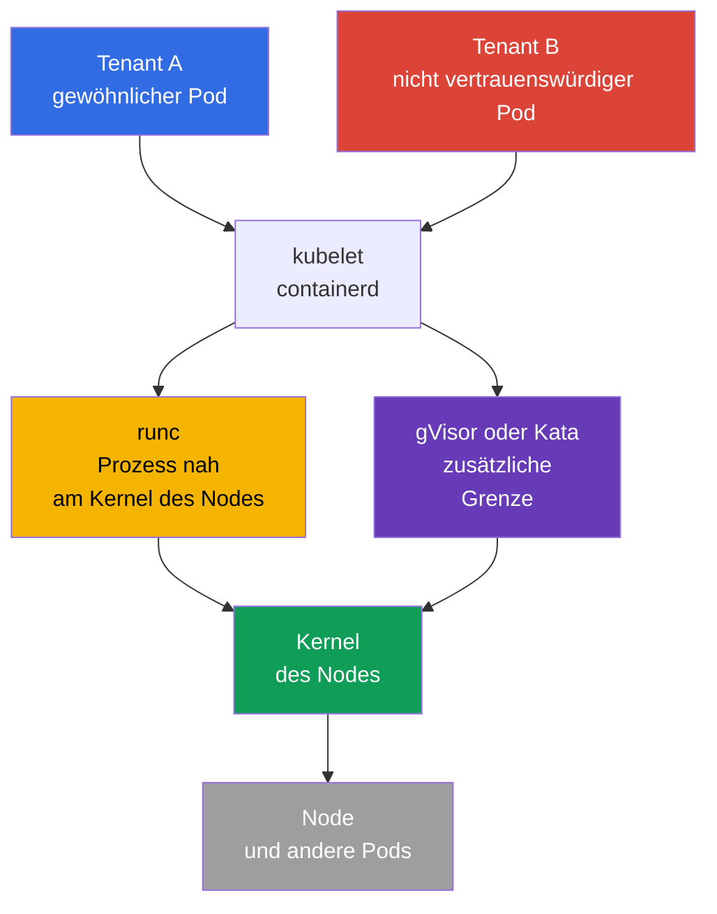
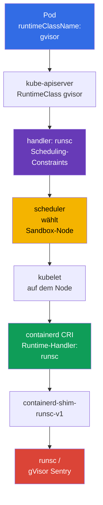

[Русская версия](ru.md) · [Eng version](README.md) · [Versión en español](es.md) · [Version française](fr.md) · [ქართული ვერსია](ge.md) · [繁體中文版](tw.md) · [日本語版](jp.md)

# Kapitel 22. Container Runtime Sandbox: gVisor, Kata Containers und RuntimeClass

> **Das Problem.** Ein nicht vertrauenswürdiger Tenant, CI-Job oder benutzerdefiniertes Plugin in einem gewöhnlichen Container
> verwendet denselben Kernel des Nodes wie kubelet und benachbarte Pods. Eine Schwachstelle im Kernel/in der Runtime oder
> eine irrtümlich belassene Privilegierung kann Codeausführung in einen Container Escape und Zugriff
> auf den Host oder andere Tenants verwandeln. Eine Sandbox-Runtime fügt eine zusätzliche Grenze zwischen einem solchen
> Workload und dem Kernel hinzu, ohne die übrigen Pod-Policies zu lockern.

> **Was kommt als Nächstes.** `securityContext`, Pod Security Admission und Admission-Policy reduzieren
> Prozessprivilegien und lassen gefährliches YAML nicht zu, doch ein gewöhnlicher Container nutzt weiterhin
> den Kernel des Nodes. Nicht vertrauenswürdige oder besonders wertvolle Multi-Tenant-Workloads benötigen eine stärkere
> Ausführungsgrenze: eine Sandbox-Runtime. In diesem Kapitel wählen wir gVisor (`runsc`) oder Kata
> Containers, binden sie über `RuntimeClass` in containerd ein und weisen nach, dass der Pod tatsächlich
> in einer Sandbox startet und nicht mit einer gewöhnlichen OCI-Runtime.

> **Was Sie aus CKA benötigen.** Pod, `nodeSelector`, Taints/Tolerations und die Diagnose
> des Scheduling werden in [CKA-Kapitel 16](../../../cka/course/16/de.md) behandelt,
> `securityContext` und Least Privilege in [CKA-Kapitel 20](../../../cka/course/20/de.md)
> sowie CRI, kubelet und containerd in [CKA-Kapitel 40](../../../cka/course/40/de.md). Hier
> verwenden wir diese Mechanismen zur Isolierung nicht vertrauenswürdiger Workloads, statt ihre Grundlagen zu wiederholen.

> 🧠 Eine Sandbox reduziert Kernel Escapes für nicht vertrauenswürdige Workloads, ersetzt jedoch weder RBAC, PSA, `securityContext` noch NetworkPolicy.

## 22.1. Warum ein gewöhnlicher Container für Multi-Tenancy nicht ausreicht

Ein Container isoliert PID-, Mount-, Network- und weitere Namespaces, während cgroups die
Ressourcen begrenzen. Doch der Prozess eines Containers ruft gewöhnlich **denselben Linux-Kernel** systemweit auf wie
die Prozesse des Nodes und benachbarter Pods. Eine Schwachstelle im Kernel, in der Container-Runtime oder eine falsch gewährte
Capability kann Codeausführung in einen Container Escape verwandeln.

In einem Single-Tenant-Cluster mit geprüften Images kann dies ein akzeptables Risiko sein. Bei
Multi-Tenancy ist das Vertrauen anders: Ein Team, Customer-Workload, CI-Job oder bereitgestelltes Plugin
darf keinen ebenso nahen Weg zum Kernel erhalten wie die Systemkomponenten der Plattform.
`privileged`, Host-Namespaces, `hostPath`, Docker-/containerd-Socket und breite RBAC-Rechte
bleiben dabei **auch in einer Sandbox** gefährlich.



Eine Sandbox fügt eine Ebene zwischen Workload und Host hinzu. Das ist Defence in Depth, keine Erlaubnis,
die übrigen Controls zu lockern:

| Control | Wofür es zuständig ist | Die Sandbox ersetzt es nicht |
|---|---|---|
| RBAC und ServiceAccount | wer ein Objekt erstellen oder ändern darf | Sandbox beschränkt den API-Zugriff einer Identity nicht |
| PSA / Kyverno / Gatekeeper | welche Pod-Felder erlaubt sind | Sandbox darf keinen `privileged` Pod akzeptieren |
| `securityContext` | UID, Capabilities, seccomp, Dateisystem des Prozesses | eine sichere Runtime hebt Least Privilege nicht auf |
| NetworkPolicy | mit wem ein Workload kommunizieren kann | Runtime legt keine Network-Allowlist fest |
| gVisor / Kata | Grenze zwischen Workload und Kernel/Host | Runtime scannt kein Image und prüft keine Signatur |

Die Auswahl der Runtime ist eine Eigenschaft der Workload-Klasse, nicht des Benutzers. Das
Platform-Team erstellt RuntimeClass, reserviert kompatible Nodes, setzt eine Admission-Policy und beobachtet sie.
Der Entwickler gibt den erlaubten `runtimeClassName` an; er benötigt keinen Zugriff auf containerd oder
SSH auf einem Worker-Node.

> 🧠 gVisor fügt einen Userspace-Kernel hinzu, Kata eine Lightweight-VM mit Guest-Kernel und stärkerer Isolierung auf Kosten von Ressourcen.

## 22.2. Zwei Ansätze: gVisor und Kata Containers

**gVisor** startet den Container über `runsc`. Sein Userspace-Kernel (`Sentry`) fängt
den Großteil der System Calls ab und implementiert sie im Userspace, wodurch die direkte Angriffsfläche des
Host-Kernels verkleinert wird. Unterstützte Plattformen sind `systrap` (Default) und `kvm`: `systrap` ist die
universelle Standardwahl, `kvm` ist bei verfügbarer Hardware-Virtualisierung und kompatibler
Infrastruktur passend. `ptrace` ist eine Legacy-Plattform, wird nicht mehr unterstützt und soll entfernt werden;
wählen Sie sie nicht für eine neue Konfiguration. Das ist gewöhnlich leichter als eine virtuelle Maschine, besitzt aber keinen
vollständig getrennten Guest-Kernel.

**Kata Containers** führt die Pod-Sandbox in einer Lightweight-VM aus: mit getrenntem Guest-Kernel und
Hypervisor-Grenze. Ein Container in der VM sieht den Guest-Kernel, nicht den Kernel des Nodes. Die
Grenze ist stärker und die Linux-Semantik ähnelt stärker einer gewöhnlichen VM, allerdings sind Startup-Latenz,
Speicherverbrauch und betriebliche Komplexität höher; Virtualisierung muss auf dem Node und in der Cloud unterstützt werden.

| Eigenschaft | Gewöhnliches `runc` | gVisor / `runsc` | Kata Containers |
|---|---|---|---|
| Für den Workload sichtbarer Kernel | Host-Kernel | Userspace-Kernel von gVisor über dem Host-Kernel | separater Guest-Kernel einer VM |
| Isolierungsgrenze | Namespaces/cgroups | Syscall-Interception + Sandbox | VM/Hypervisor + Guest-Kernel |
| Dichte und Start | Basisreferenz | gewöhnlich näher am Container | gewöhnlich teurer bei Speicher und Start |
| Kompatibilität mit Syscalls/Kernel-Features | maximal | nicht unterstützte Syscalls/Features möglich | gewöhnlich näher an VM, hängt jedoch von der Runtime ab |
| Typische Wahl | vertrauenswürdiger Plattform-Workload | nicht vertrauenswürdiger Web-/CI-/Multi-Tenant-Code | starke Isolierung, regulatorischer oder besonders riskanter Workload |

Bewerten Sie die Runtime nicht allein anhand der Tabelle. Testen Sie reale Images: eBPF, FUSE, Low-Level-
Network-Tools, verschachtelte Container, Device Plugins, Huge Pages, GPU und Host-Mounts können
inkompatibel sein oder ein separates Design erfordern. Es darf keinen stillschweigenden Fallback von einer Sandbox auf
`runc` geben: Dann verschwindet die zugesagte Grenze genau dann, wenn sie gebraucht wird.

> 🎯 Der Pod wählt die `RuntimeClass`, und sein CRI-`handler` muss in der Konfiguration des Ziel-Nodes genau vorhanden sein.

## 22.3. Wie Kubernetes die Runtime auswählt: `RuntimeClass` und Handler

`RuntimeClass` ist eine cluster-scoped Kubernetes-API. Sie verbindet einen verständlichen Workload-Namen mit
einem **Handler** aus der CRI-Konfiguration auf dem Node. Es ist wichtig, diese Zeichenketten zu unterscheiden:

- `metadata.name: gvisor` - der Name, den der Entwickler in `spec.runtimeClassName` angibt;
- `handler: runsc` - der genaue Runtime-Name in der CRI-Konfiguration von containerd;
- `runtime_type: io.containerd.runsc.v1` - die Implementation-Runtime in der Konfiguration von
  containerd; dies ist nicht der Name einer RuntimeClass.

Der API Server prüft nicht, ob der Handler auf jedem Node vorhanden ist. Der Fehler zeigt sich, wenn kubelet
versucht, den Pod zu erstellen. Bereiten Sie daher Handler, Binärdateien, Shim und kompatible Nodes vor,
bevor der Workload erstellt wird.



Minimale RuntimeClass für bereits installiertes `runsc`:

```yaml
apiVersion: node.k8s.io/v1
kind: RuntimeClass
metadata:
  name: gvisor
handler: runsc
```

```bash
kubectl apply -f runtimeclass-gvisor.yaml
kubectl get runtimeclass
kubectl get runtimeclass gvisor -o yaml
```

`RuntimeClass` ist kein Namespace und gewährt kein Recht, eine Runtime zu verwenden. Beschränken Sie
das Erstellen und Ändern von RuntimeClass auf Platform-Administratoren. Soll nicht jeder Namespace
eine isolierte oder kostspielige Runtime starten dürfen, beschränken Sie `runtimeClassName` über
eine Admission-Policy und weisen Sie sie mit einem Plattform-Template zu.

Beispielsweise erlaubt diese `ValidatingAdmissionPolicy` `gvisor` nur in `tenant-a`.
Die Namespace-Einschränkung ist nur ein Beispiel: In Production wird sie mit genehmigten Namespaces
und bei Bedarf mit ServiceAccount verknüpft. Prüfen Sie die Policy vor dem Rollout serverseitig:

```yaml
apiVersion: admissionregistration.k8s.io/v1
kind: ValidatingAdmissionPolicy
metadata:
  name: restrict-gvisor-runtimeclass
spec:
  matchConstraints:
    resourceRules:
    - apiGroups: [""]
      apiVersions: ["v1"]
      operations: ["CREATE", "UPDATE"]
      resources: ["pods"]
  validations:
  - expression: "!has(object.spec.runtimeClassName) || object.spec.runtimeClassName != 'gvisor' || object.metadata.namespace == 'tenant-a'"
    message: "runtimeClassName gvisor is allowed only in tenant-a"
---
apiVersion: admissionregistration.k8s.io/v1
kind: ValidatingAdmissionPolicyBinding
metadata:
  name: restrict-gvisor-runtimeclass
spec:
  policyName: restrict-gvisor-runtimeclass
  validationActions: [Deny]
```

```bash
kubectl apply -f restrict-gvisor-runtimeclass.yaml

# Negative Prüfung: Der API Server muss den Pod vor dem Scheduler ablehnen.
kubectl -n tenant-b run gvisor-not-allowed \
  --image=nginxinc/nginx-unprivileged:1.30.4-alpine-slim \
  --restart=Never \
  --overrides='{"spec":{"runtimeClassName":"gvisor"}}' \
  --dry-run=server
# Erwartet: runtimeClassName gvisor is allowed only in tenant-a
```

> 🔬 `RuntimeClass.scheduling` vereint Pod-Constraints und lenkt Sandbox-Workloads auf den vorbereiteten Pool.

## 22.4. Scheduling in RuntimeClass: `nodeSelector`, Taints und Tolerations

Installieren Sie gVisor oder Kata nicht „für alle Fälle“ auf allen Nodes. Trennen Sie einen Sandbox-Pool ab: Dort
sind die erforderlichen Binärdateien/Shims, geprüfte Konfiguration, Capacity und Observability vorhanden. Gewöhnliche
Workloads dürfen diesen Pool nicht versehentlich belegen, und ein Sandbox-Workload darf nicht auf einem Node
ohne erforderlichen Handler landen.

RuntimeClass kann `scheduling` enthalten. Kubernetes fügt dessen `nodeSelector` und
`tolerations` dem Pod hinzu, der sich auf diese Klasse bezieht. Der Selector der RuntimeClass und der Pod-Selector
werden bei Admission zusammengeführt: Kollidierende Werte führen zur Ablehnung durch den API Server,
nicht zu einem akzeptierten Pod im Zustand `Pending`/`Unschedulable`. Suchen Sie bei einem solchen Fehler daher nach einem
Admission-Fehler, nicht nur nach Scheduler-Events. Tolerations werden hinzugefügt, ersetzen aber keinen
Taint - der Node bleibt für einen Pod ohne Toleration geschlossen.

```bash
# Wird vom Platform-Administrator nur auf einem vorbereiteten Worker ausgeführt.
kubectl label node worker-sandbox sandbox.runtime/gvisor=true
kubectl taint node worker-sandbox sandbox.runtime/gvisor=true:NoSchedule
```

```yaml
apiVersion: node.k8s.io/v1
kind: RuntimeClass
metadata:
  name: gvisor
handler: runsc
scheduling:
  nodeSelector:
    sandbox.runtime/gvisor: "true"
  tolerations:
  - key: sandbox.runtime/gvisor
    operator: Equal
    value: "true"
    effect: NoSchedule
```

Ein Pod mit `runtimeClassName: gvisor` erhält beide Scheduling-Constraints automatisch:

```yaml
apiVersion: v1
kind: Pod
metadata:
  name: untrusted-web
  namespace: tenant-a
spec:
  runtimeClassName: gvisor
  securityContext:
    runAsNonRoot: true
    seccompProfile:
      type: RuntimeDefault
  containers:
  - name: app
    image: nginxinc/nginx-unprivileged:1.30.4-alpine-slim
    ports:
    - containerPort: 8080
    securityContext:
      allowPrivilegeEscalation: false
      capabilities:
        drop: ["ALL"]
```

Kopieren Sie `nodeSelector` und Toleration nicht in jedes Deployment, wenn sie bereits in RuntimeClass stehen:
Das erzeugt zwei Quellen der Wahrheit. Explizite Constraints auf Pod-Ebene sind nur zulässig, wenn sie
die Auswahl einengen, beispielsweise nach Architecture oder Zone. Prüfen Sie zuerst den resultierenden Pod und die Events:

```bash
kubectl -n tenant-a apply -f untrusted-web.yaml
kubectl -n tenant-a get pod untrusted-web -o wide
kubectl -n tenant-a get pod untrusted-web -o jsonpath='{.spec.runtimeClassName}{"\n"}'
kubectl -n tenant-a get pod untrusted-web -o jsonpath='{.spec.nodeSelector}{"\n"}'
kubectl -n tenant-a describe pod untrusted-web
```

### Kata RuntimeClass

Für Kubernetes ist der empfohlene Installationsweg für Kata das Helm Chart `kata-deploy`: Es
installiert die Runtime auf dem Node und erstellt RuntimeClass für die tatsächlichen Shims. In modernen
Runtime-rs-Releases können die Namen solcher Klassen/Handler wie
`kata-qemu-runtime-rs` aussehen; verwenden Sie den Namen, den das Chart erstellt hat, nicht ein altes Beispiel aus
einer anderen Distribution. Prüfen Sie vor dem Rollout `kubectl get runtimeclass` und `crictl info` auf dem
Ziel-Node.

Die nachstehende manuelle Konfiguration ist eine vereinfachte Variante für einen bereits vorbereiteten separaten Pool.
Die Kata-Klasse ist darin ebenso aufgebaut, der Handler muss jedoch mit containerd übereinstimmen. Nennen Sie die
Klasse nicht `kata`, wenn der Handler auf dem Node `kata-qemu` heißt, sonst wird die Konfiguration
unklar. Eine verständliche Variante ist ein identischer kurzer Name:

```yaml
apiVersion: node.k8s.io/v1
kind: RuntimeClass
metadata:
  name: kata
handler: kata
scheduling:
  nodeSelector:
    sandbox.runtime/kata: "true"
  tolerations:
  - key: sandbox.runtime/kata
    operator: Equal
    value: "true"
    effect: NoSchedule
```

Prüfen Sie für einen Kata-Pool vorab, dass Hardware-Virtualisierung verfügbar und für den
Hypervisor freigegeben ist. Ein einfaches Node-Label schafft diese Fähigkeit nicht.

> 🔬 gVisor-Binärdatei, Shim und containerd-Handler benötigen abgestimmte Versionen, Service-PATH und Konfiguration im dedizierten Pool.

## 22.5. gVisor installieren und `runsc` an containerd anbinden

Nachfolgend ein Runbook für einen dedizierten Linux-Node mit containerd. Die Versionen von `runsc`, Shim, Kubernetes und
containerd müssen vorab getestet und in Git/IaC festgelegt sein. Ersetzen Sie die
Production-Runtime nicht mitten in einem Incident mit dem Befehl `latest`.

### 1. `runsc` und Shim installieren

gVisor-Binärdatei, Shim und das Verzeichnis der Sidecar-Binärdateien müssen einer
geprüften Version und der Architektur des Nodes entsprechen. Der bevorzugte Installationsweg ist das Paket `runsc`
aus dem offiziellen (oder einem genehmigten internen) apt-Repository: Es installiert den vollständigen
Satz an Dateien konsistent. Mischen Sie dieses Paket nicht mit einem manuell heruntergeladenen Shim.

Verwenden Sie für eine gepinnte manuelle Installation das aktuelle Archiv `gvisor.tar.zstd`, nicht
das veraltete Schema mit zwei separaten Binärdateien. Das Archiv enthält `runsc`, Shim und das Verzeichnis
`gvisor-bin/`; letzteres muss neben `runsc` bleiben, weil die Runtime es beim Starten der
Sandbox verwendet. Prüfen Sie Checksumme/Signatur genau des genehmigten Release und
entpacken Sie alle Dateien mit root-only-Rechten. Die Befehle zeigen die Form der Installation;
`<VERSION>` und `<ARCH>` werden durch genehmigte Werte ersetzt.

```bash
VERSION="${VERSION:?set an approved gVisor version}"
ARCH=$(uname -m)
BASE_URL="https://storage.googleapis.com/gvisor/releases/release/${VERSION}/${ARCH}"

curl -fsSLO "${BASE_URL}/gvisor.tar.zstd"
curl -fsSLO "${BASE_URL}/gvisor.tar.zstd.sha512"
sha512sum -c gvisor.tar.zstd.sha512
mkdir gvisor
zstd -d -c gvisor.tar.zstd | tar -xf - -C gvisor
sudo install -d -o root -g root -m 0755 /usr/local/lib/gvisor
sudo cp -a gvisor/. /usr/local/lib/gvisor/
sudo ln -sf /usr/local/lib/gvisor/runsc /usr/local/bin/runsc
sudo ln -sf /usr/local/lib/gvisor/containerd-shim-runsc-v1 \
  /usr/local/bin/containerd-shim-runsc-v1

runsc --version
command -v containerd-shim-runsc-v1
ls -ld /usr/local/lib/gvisor/gvisor-bin
```

In jeder Variante muss der Pfad zum Shim in `PATH` des systemd-Service von containerd liegen; prüfen Sie
`systemctl show containerd -p Environment` und Unit/Drop-in. Bewahren Sie bei einer Archivinstallation
die relative Nachbarschaft von `runsc` und `gvisor-bin/`, statt ein einzelnes `runsc`
separat zu kopieren. Installieren Sie die Runtime nicht nur auf der Control Plane, wenn der Pod auf
Workern geplant wird.

### 2. Containerd-Runtime-Handler hinzufügen

Speichern Sie zuerst die funktionierende Konfiguration und lesen Sie ihren Header `version = ...`. Ersetzen Sie eine
vendorverwaltete `config.toml` nicht vollständig: Der CRI-Plugin-Pfad wird anhand der **tatsächlichen Version der
Konfiguration** gewählt, nicht allein anhand der Major-Version von containerd.

```bash
sudo cp -a /etc/containerd/config.toml \
  "/etc/containerd/config.toml.before-runsc.$(date +%F-%H%M%S)"
containerd --version
sudo sed -n '1,180p' /etc/containerd/config.toml
```

Lautet der aktuelle Header `version = 2`, fügen Sie den Handler im alten CRI-Plugin-Pfad hinzu:

```toml
version = 2

[plugins."io.containerd.grpc.v1.cri".containerd.runtimes.runsc]
  runtime_type = "io.containerd.runsc.v1"
```

Lautet der aktuelle Header `version = 3` **oder** `version = 4`, verwenden Sie den neuen Runtime-
Plugin-Pfad (ändern Sie den Header in der bestehenden Datei nicht):

```toml
# Den aktuellen Header beibehalten: version = 3 oder version = 4.
[plugins.'io.containerd.cri.v1.runtime'.containerd.runtimes.runsc]
  runtime_type = "io.containerd.runsc.v1"
```

containerd 2.x unterstützt weiterhin Config v2; Config v4 ist die aktuelle Version in
containerd 2.3, und ältere Configs werden beim Start migriert. Ändern Sie den Header daher nicht
eigenmächtig, nur um eine Runtime hinzuzufügen: Prüfen Sie zuerst `version = ...`, effektive Konfiguration und
Dokumentation Ihrer containerd-Distribution.

Ändern Sie `default_runtime_name` nicht in `runsc`: System-DaemonSets, CNI, CSI und geprüfte
gewöhnliche Workloads können `runc` benötigen. RuntimeClass muss die Sandbox explizit auswählen.

Prüfen Sie TOML und starten Sie den Daemon nur gemäß Change-Management-Prozess neu: Ein Restart von
containerd kann die Erstellung neuer Container und den Betrieb des Nodes beeinträchtigen. Auf einem Production-Node
zuerst cordon/drain unter Beachtung von DaemonSet und PDB, dann die geprüfte Konfiguration anwenden.

```bash
sudo systemctl restart containerd
sudo systemctl is-active --quiet containerd && echo 'containerd: active'
sudo journalctl -u containerd -b --no-pager | tail -n 80
sudo crictl info | jq '.config.containerd.runtimes.runsc'
```

`crictl info` muss `runsc` mit dem `runtimeType` `io.containerd.runsc.v1` zeigen. Erscheint der
Handler nicht oder ist der Service nicht aktiv, halten Sie an: Erstellen Sie RuntimeClass noch nicht und
verschieben Sie den Workload nicht auf diesen Node.

> 🔬 Kata benötigt kompatible Shims, Hypervisor, Guest-Komponenten, Host-Virtualisierung und die Prüfung von KVM/Runtime.

## 22.6. Kata Containers und Containerd-Handler installieren

Kata benötigt nicht nur `containerd-shim-kata-v2`, sondern auch den ausgewählten Hypervisor, Kernel/Rootfs
und kompatible Host-Virtualisierung. Bevorzugt wird ein vendorunterstütztes Paket oder ein geprüftes
Kata-Release, das per Konfigurationsmanagement in einem separaten Pool bereitgestellt wird. Kopieren Sie
keine Binärdatei von einem Laptop auf einen Production-Worker.

### Zuerst: Was genau wird konfiguriert?

Dies ist eine **Node**-Einstellung, keine Pod-Einstellung: Bevor Kubernetes einen Pod in Kata starten kann,
muss auf jedem Ziel-Node eine ganze Kette vorhanden sein:

`RuntimeClass.spec.handler` → CRI-Handler in `containerd` → Kata-Shim → ausgewähltes Virtualisierungs-
Backend → Lightweight-VM mit Guest-Kernel.

- **Kata-Runtime / Shim** - Komponenten auf dem Node, mit denen `containerd` eine Sandbox-
  VM erstellt; `containerd-shim-kata-v2` muss für den Service `containerd` verfügbar sein.
- **Backend (Hypervisor)** - der VM-Mechanismus: gewöhnlich QEMU/KVM, für einige Azure/Microsoft-
  Hypervisor-Konfigurationen Cloud Hypervisor mit `mshv`.
- **CRI-Handler** - ein benannter Eintrag in `config.toml`, beispielsweise `kata` oder `kata-qemu`;
  er teilt `containerd` mit, welche Kata-Runtime aufgerufen werden soll. Dies ist nicht der Name eines Pods oder einer Binärdatei.
- **RuntimeClass** - das Kubernetes-Objekt, das kubelet später den genauen Namen dieses
  Handlers übergibt. Sie installiert Kata nicht und korrigiert keine Node-Konfiguration.

Beginnen Sie daher nicht mit der Erstellung eines Pods. Die sichere Reihenfolge lautet:

1. Wählen Sie ein genehmigtes Kata-Backend und einen künftigen Handler für den Ziel-Node-Pool.
2. Installieren Sie das Kata-Paket auf **jedem** Node des Pools und bestätigen Sie Binärdatei, Shim und Backend.
3. Fügen Sie der bestehenden `config.toml` **ein** Fragment für ihr aktuelles `version = ...` hinzu;
   ersetzen Sie die Datei nicht vollständig und ändern Sie den Header nicht zugunsten eines Beispiels.
4. Starten Sie `containerd` neu und vergewissern Sie sich mit `crictl info`, dass der Handler erschienen ist.
5. Erstellen Sie erst dann RuntimeClass mit demselben Handler und starten Sie einen Canary-Pod.

In der folgenden Prüfung ist `KATA_BACKEND` keine Auto-Detection. Setzen Sie den Wert, der
der bereits ausgewählten RuntimeClass/dem Hypervisor entspricht: `qemu-kvm` für QEMU/KVM oder
`clh-azure` / `clh-azure-runtime-rs` für Microsoft Hypervisor. Das Vorhandensein eines anderen Geräts
ist kein Erfolg. Prüfen Sie nach der Installation genau Runtime und Virtualisierungs-Backend, nicht nur das Vorhandensein
des Pakets:

```bash
command -v containerd-shim-kata-v2
kata-runtime --version
sudo kata-runtime check

# Das Backend der tatsächlich gewählten RuntimeClass/des Hypervisors angeben:
# qemu-kvm - QEMU/KVM; clh-azure oder clh-azure-runtime-rs - Microsoft Hypervisor.
KATA_BACKEND="${KATA_BACKEND:?set qemu-kvm, clh-azure, or clh-azure-runtime-rs}"
case "$KATA_BACKEND" in
  qemu-kvm)
    sudo test -c /dev/kvm && sudo test -r /dev/kvm || {
      echo 'ERROR: QEMU/KVM RuntimeClass requires accessible /dev/kvm' >&2
      exit 1
    }
    ls -l /dev/kvm
    ;;
  clh-azure|clh-azure-runtime-rs)
    sudo test -c /dev/mshv && sudo test -r /dev/mshv || {
      echo 'ERROR: clh-azure RuntimeClass requires accessible /dev/mshv' >&2
      exit 1
    }
    ls -l /dev/mshv
    ;;
  *)
    echo "ERROR: unsupported selected Kata backend: $KATA_BACKEND" >&2
    exit 2
    ;;
esac
```

`kata-runtime check` und `/dev/kvm` beziehen sich auf eine verbreitete QEMU/KVM-Konfiguration.
Das allgemeine Kriterium ist die Verfügbarkeit und Funktionsfähigkeit des Backends, das die ausgewählte Kata
RuntimeClass/der ausgewählte Hypervisor benötigt. Auf Microsoft Hypervisor ist `/dev/mshv` mit einem mshv-fähigen VMM, beispielsweise
Cloud Hypervisor für `clh-azure`/`clh-azure-runtime-rs`, eine unterstützte Alternative;
daher ist das Fehlen von `/dev/kvm` für sich genommen kein universeller FAIL. Markieren Sie einen Node nicht mit
`sandbox.runtime/kata=true`, bevor ausgewähltes Backend, Nested Virtualization (falls benötigt) und
Instance Type bestätigt sind.

Ein Container benötigt einen separaten CRI-Handler. Wählen Sie die Tabelle anhand des Headers `version = ...`, nicht
allein anhand der Major-Version von containerd. Verwenden Sie für Config Version 2 den alten CRI-Plugin-Pfad:

```toml
version = 2

[plugins."io.containerd.grpc.v1.cri".containerd.runtimes.kata]
  runtime_type = "io.containerd.kata.v2"
  privileged_without_host_devices = true
```

Verwenden Sie für Config Version 3 **oder** Version 4 den neuen Runtime-Plugin-Pfad und behalten Sie den
bestehenden Header bei:

```toml
# Den aktuellen Header beibehalten: version = 3 oder version = 4.
[plugins.'io.containerd.cri.v1.runtime'.containerd.runtimes.kata]
  runtime_type = "io.containerd.kata.v2"
  privileged_without_host_devices = true
```

`privileged_without_host_devices = true` übergibt einem `privileged`
Kata-Container nicht alle Host-Geräte. Dies ist für den Handler einer Sandbox-Runtime erforderlich; ersetzen Sie damit
nicht die Einstellung des Default-`runc` ohne separaten Kompatibilitäts-Review.

In modernen Kata Containers ist Runtime-rs die Default-Runtime, die Go-Runtime ist
deprecated. Die Pfade zu `kata-runtime`, Shim und ausgewähltem Hypervisor hängen vom Installationsweg ab;
gleichen Sie sie vor dem Rollout mit Paket/Release Ihrer Plattform ab, nicht mit einem angenommenen Pfad aus
einem alten Beispiel.

Prüfen Sie den Handler nach Änderung/Restart von containerd wie bei gVisor:

```bash
sudo systemctl restart containerd
sudo systemctl is-active --quiet containerd && echo 'containerd: active'
sudo crictl info | jq '.config.containerd.runtimes.kata'
```

Auf einigen Distributionen erstellt das Paket den Handler mit einem anderen Namen, etwa
`kata-qemu`. In diesem Fall muss RuntimeClass den **tatsächlichen** Handler-Namen verwenden, nicht
das Beispiel aus dem Artikel. Gleichen Sie `crictl info`, config.toml und `RuntimeClass.spec.handler` vor dem
Rollout ab.

> 🏭 Canary für einen repräsentativen Pod und negativer Test ohne Fallback → Application-SLO → Namespace-Policy; umgehen Sie Inkompatibilität nicht über `privileged` oder `runc`.

## 22.7. Rollout: von einem Pod zur Namespace-Policy

Eine Sandbox kann Timing, Dateisystemsemantik, Netzwerkverhalten und Ressourcenverbrauch
verändern. Ein sicherer Rollout beginnt mit einem separaten Test-Namespace und einem
repräsentativen Workload.

1. **Node prüfen.** Binärdatei, Shim, Containerd-Handler, Label und Taint müssen auf
   jedem Node des Ziel-Pools vorhanden sein.
2. **RuntimeClass erstellen.** Handler und Scheduling müssen die bereits funktionierende Node-
   Konfiguration abbilden.
3. **Positiven Test starten.** Ein nicht privilegierter Pod mit `runtimeClassName` muss auf einem
   Sandbox-Node `Running` werden.
4. **Negativen Test prüfen.** Ein Pod mit einem Selector, der mit RuntimeClass kollidiert, muss
   bei Admission abgelehnt werden. Ein Pod auf einem Node ohne Handler darf nicht stillschweigend auf eine gewöhnliche Runtime wechseln:
   Erwartet wird ein expliziter `FailedCreatePodSandBox`, kein Fallback auf `runc`.
5. **Anwendung prüfen.** Readiness, Egress, DNS, Volumes, Latenz, Shutdown und Metrics
   müssen dem SLO entsprechen.
6. **Scope erweitern.** Deployment/Job wird als Canary umgestellt; eine Admission-Policy verbietet
   unsichere Kombinationen und die Verwendung der Klasse außerhalb erlaubter Namespaces.

Ein Deployment wird gewöhnlich nur so geändert:

```yaml
apiVersion: apps/v1
kind: Deployment
metadata:
  name: report-worker
  namespace: tenant-a
spec:
  replicas: 2
  selector:
    matchLabels:
      app: report-worker
  template:
    metadata:
      labels:
        app: report-worker
    spec:
      runtimeClassName: gvisor
      securityContext:
        runAsNonRoot: true
        seccompProfile:
          type: RuntimeDefault
      containers:
      - name: worker
        image: registry.example.com/report-worker@sha256:<digest>
        securityContext:
          allowPrivilegeEscalation: false
          capabilities:
            drop: ["ALL"]
```

Fügen Sie nicht `hostNetwork`, `hostPID`, `hostIPC`, `privileged`, hostPath oder Device-Mounts hinzu,
um eine Sandbox-Inkompatibilität zu „beheben“. Dies verletzt entweder das Threat Model oder zeigt,
dass der Workload überarbeitet oder in einem separaten vertrauenswürdigen Pool mit einer explizit
dokumentierten Ausnahme gestartet werden muss.

> 🔬 `RuntimeClass.overhead` wird für konkrete Versionen, Node-Typen und Workloads gemessen; ein Fehler überfüllt den Pool oder verliert Capacity.

### Runtime Overhead

`RuntimeClass.overhead` teilt dem Scheduler den zusätzlichen CPU/Memory-Verbrauch der Runtime
pro Pod mit. Die Werte werden aus Benchmarks der konkreten Version, des Node-Typs und des Workloads bezogen,
nicht aus einem zufälligen Internetbeispiel. Ohne Overhead kann der Scheduler den Sandbox-Node überbelegen;
bei einem zu hohen Wert geht Capacity verloren.

```yaml
apiVersion: node.k8s.io/v1
kind: RuntimeClass
metadata:
  name: kata
handler: kata
overhead:
  podFixed:
    memory: "<measured-memory-overhead>"
    cpu: "<measured-cpu-overhead>"
scheduling:
  nodeSelector:
    sandbox.runtime/kata: "true"
```

Die Änderung des Overhead wirkt sich auf neue Pods und Admission/Scheduling aus, daher wird sie in
Staging zusammen mit Resource Requests/Limits und Autoscaler-Verhalten geprüft.

> 🎯 `runtimeClassName` zeigt den Intent; bestätigen Sie Pod/Node über CRI-Handler/Shim und die Funktionalität des Workloads.

## 22.8. Prüfung: Die Sandbox läuft tatsächlich, nicht nur YAML gibt sie an

Die Prüfung von `spec.runtimeClassName` allein reicht nicht: Das Feld zeigt Intent, nicht den
Erfolg des Starts mit der gewünschten Runtime. Sammeln Sie Nachweise auf drei Ebenen: Kubernetes,
CRI/containerd und innerhalb des Workloads. Bewahren Sie zur Diagnose vorübergehend Node-Name, Runtime-
Handler, Pod-UID und Zeit auf; das verbindet API-Objekt mit den Node-Logs.

```bash
NS=tenant-a
POD=untrusted-web

# 1. Kubernetes-Intent und Placement.
kubectl -n "$NS" get pod "$POD" -o wide
kubectl -n "$NS" get pod "$POD" \
  -o jsonpath='{.spec.runtimeClassName}{" node="}{.spec.nodeName}{" phase="}{.status.phase}{"\n"}'
kubectl -n "$NS" describe pod "$POD"

# 2. Auf dem ausgewählten Node: CRI-Runtime und Fehler beim Erstellen der Sandbox.
sudo crictl pods --name "$POD"
sudo crictl ps -a --name "$POD"
sudo crictl info | jq '.config.containerd.runtimes.runsc'
sudo journalctl -u containerd --since '15 minutes ago' --no-pager | \
  grep -Ei 'runsc|gvisor|kata|sandbox|error'
```

Die Parameter von `crictl` und das Ausgabeformat hängen vom Release ab. Zeigt CRI den Handler
nicht direkt, verwenden Sie die Sandbox-/Container-ID aus `crictl inspectp` und gleichen Sie sie
mit containerd-/Shim-Logs ab. Schließen Sie nicht allein aus dem Pod-Namen: Der Nachweis ist die Erstellung
der Sandbox mit dem Handler `runsc` oder `kata` ohne Fallback.

### Beobachtung innerhalb des Pods und auf dem Host

In einem gewöhnlichen Container zeigt `uname -a` in der Regel den Kernel des Nodes. In gVisor werden Syscall-Ergebnisse
virtualisiert: `uname`, `/proc` und andere Daten können eine gVisor-spezifische oder
eingeschränkte Sicht zeigen. In Kata sieht der Prozess einen Guest-Kernel, getrennt vom Host. Diese Hinweise
sind nützlich, gelten aber nicht als einziger Security Proof: Die Ausgabe kann sich zwischen
Versionen ändern und muss die Implementation nicht offenlegen.

```bash
# Innerhalb eines Sandbox-Pods: diagnostischer Fingerabdruck der Workload-Sicht.
kubectl -n "$NS" exec "$POD" -- sh -c '
  echo "=== uname ==="; uname -a
  echo "=== pid 1 cgroup ==="; cat /proc/1/cgroup
  echo "=== mounts ==="; mount | head -n 20
  echo "=== dmesg (if permitted) ==="; dmesg 2>&1 | head -n 40 || true
'

# Auf dem Host: Der Host-Kernel bleibt der Kernel des Nodes, nicht die Guest-/Sentry-Sicht des Pods.
uname -a
sudo journalctl -u containerd --since '15 minutes ago' --no-pager | tail -n 120
```

### So kann `dmesg` in einem gVisor-Pod aussehen

In einem Schulungs-gVisor-Szenario kann `dmesg` innerhalb eines erfolgreich gestarteten Pods so aussehen:

```text
$ dmesg
...
Starting gVisor
...
```

`...` bedeutet weitere Log-Zeilen, die im Beispiel bewusst nicht gezeigt werden. `Starting gVisor` ist
ein nützlicher Schulungshinweis darauf, dass der Workload den gVisor-Sandbox-Kernel sieht. Ist `dmesg` verboten
oder fehlt der Marker, geben Sie dem Pod nicht für diese Zeile zusätzliche Privilegien:
Prüfen Sie `runtimeClassName`, Placement und Handler.

Übertragen Sie eine einzelne Zeile `Starting gVisor` nicht auf einen Production Proof. In Production
ist die Kombination aus RuntimeClass, Placement, CRI-Handler-/Shim-Logs und Application Smoke Test zuverlässiger.

| Beobachtung | Was sie beweist | Was sie nicht beweist |
|---|---|---|
| `runtimeClassName: gvisor` im Pod | Intent, die Klasse auszuwählen | dass der Handler auf dem Node vorhanden ist |
| Pod `Running` auf einem Sandbox-Node | Scheduler und kubelet haben den Pod akzeptiert | zeigt für sich genommen nicht die Implementation-Runtime |
| `crictl info` enthält `runsc`/`kata` | Node für den Handler konfiguriert | dass dieser konkrete Pod nicht anders erstellt wurde |
| Containerd-/Shim-Log mit Pod-UID/Container-ID | konkrete Sandbox mit dem richtigen Handler erstellt | dass die Anwendung funktional ist |
| `uname`/`dmesg` im Inneren | Workload-Sicht unterscheidet sich vom Host; nützliches Signal | vollständige Korrektheit der Isolierungsgrenze |
| `uname` und Logs auf dem Host | Host-seitiger Kontext und Runtime-Aktivität | Inhalt des Guest-/Userspace-Kernels des Pods |

> 🎯 Diagnostizieren Sie Klasse, Node-Placement, Handler und `FailedCreatePodSandBox`; entfernen Sie `runtimeClassName` nicht.

## 22.9. Typische Fehler und sichere Diagnose

| Symptom | Wahrscheinliche Ursache | Prüfung und Maßnahme |
|---|---|---|
| Pod `Pending`, `didn't match Pod's node affinity/selector` | kein Node mit Label aus RuntimeClass oder kollidierender Pod-Selector | `kubectl describe pod`; `spec.nodeSelector` und Node-Labels vergleichen |
| Pod `Pending`, Taint nicht tolerated | Pod hat keine oder eine nicht passende Toleration der RuntimeClass erhalten | `kubectl get runtimeclass -o yaml`, `kubectl describe node` prüfen |
| `FailedCreatePodSandBox`, unbekannter Runtime-Handler | kein Handler-Block, falscher Name oder containerd nicht neu eingelesen | `RuntimeClass.handler`, config.toml, `crictl info` abgleichen; korrigieren und gemäß Runbook restarten |
| `executable file not found` für Shim | Shim ist nicht installiert oder außerhalb von `PATH` des containerd-Service | `command -v`, Permissions und systemd-Environment prüfen |
| gVisor-Pod startet, Anwendung bricht | Syscall-, Mount- oder Network-Feature nicht unterstützt/anders implementiert | minimaler Reproducer, Runtime-Dokumentation, Anwendung korrigieren oder andere genehmigte Runtime wählen |
| Kata startet nicht | Backend der ausgewählten RuntimeClass, Nested Virtualization, Hypervisor-/Kernel-Konfiguration oder Capacity nicht verfügbar | `kata-runtime check`, für QEMU/KVM `/dev/kvm`, für Microsoft Hypervisor `/dev/mshv` und mshv-fähiger VMM, Cloud-Instance-Capabilities, Shim-Logs |
| Pod landete auf einem gewöhnlichen Node | RuntimeClass ohne `scheduling`, Pool nicht getaintet oder andere Klasse angegeben | Klasse, Node-Name, Labels/Taints prüfen; dies nicht als Sandbox-Rollout betrachten |

„Beheben“ Sie `FailedCreatePodSandBox` nicht durch Entfernen von `runtimeClassName`: Das verwandelt
einen Security Failure in einen unbemerkten Downgrade. Halten Sie den Workload angehalten, bis das Platform-
Team eine andere zulässige RuntimeClass oder eine separate Risikoakzeptanz bestätigt.

> 🏭 Dedizierter Pool, Kompatibilitätsmatrix, gemessener Overhead, Alerting und kontrollierte Upgrades für Sandbox-Runtimes.

## 22.10. So wird es in Production angewendet

- **Pool nach Vertrauen trennen.** gVisor-/Kata-Nodes erhalten nur Sandbox-Workloads über
  RuntimeClass-Scheduling, Label und `NoSchedule`-Taint; System-Agents und vertrauenswürdige Workloads
  befinden sich getrennt.
- **Default `runc` beibehalten.** Die Umstellung der gesamten Plattform auf eine neue Runtime ohne Kompatibilitäts-
  Matrix erhöht den Blast Radius. Die Sandbox wird je Klasse und als Canary aktiviert.
- **Handler als Vertrag behandeln.** Versionen von Binärdateien, Shim, containerd-Config und
  RuntimeClass ändern sich in einem Review-Change. Zufällige Namensunterschiede bei `runsc`, `kata` und
  `kata-qemu` sind eine Ursache für Outages.
- **Gefährliche Kombinationen verbieten.** PSA/Admission-Policy darf in Tenant-
  Namespaces unabhängig von RuntimeClass weder `privileged`, Host-Namespaces, hostPath-/Socket-Mounts noch
  breite Ausnahmen zulassen.
- **Capacity berechnen.** Messen Sie Runtime-Overhead, Startup-Latenz, Dichte, Node-
  Pressure und Cold Start. Der Kata-Pool erfordert häufig ein separates Autoscaling-Profil.
- **Die Grenze überwachen.** Alert auf `FailedCreatePodSandBox`, containerd-/Shim-Fehler,
  Sandbox-Node NotReady, steigende Startup-Latenz und unerwartetes Placement außerhalb des Pools.
- **Updates planen.** Updates von Host-Kernel, containerd, gVisor/Kata und Kubernetes werden als eine
  Kompatibilitätsmatrix getestet. Prüfen Sie vor Drain PDB und nehmen Sie den Node aus dem
  Scheduling, statt die Runtime blind unter aktiven Tenant-Pods zu aktualisieren.

## 22.11. Nutzen auf der Prüfung und in der Praxis

- **Auf der Prüfung.** Sie müssen RuntimeClass, CRI-Handler und `runtime_type`
  unterscheiden, einen Pod über `scheduling`, Labels, Taints und Tolerations auf einen vorbereiteten Sandbox-Pool lenken
  sowie `FailedCreatePodSandBox` ohne unsicheren Fallback auf `runc` diagnostizieren können.
- **In der Praxis.** Diese Fähigkeiten erlauben, nicht vertrauenswürdige Tenant-, CI- und
  Plugin-Workloads zu isolieren, gVisor oder Kata sicher per Canary auszurollen, Overhead zu
  berücksichtigen und die Runtime anhand von Kubernetes, CRI/containerd und Application Smoke Test nachzuweisen.

## 22.12. Mini-Glossar

- **Container-Runtime-Sandbox** - Runtime, die eine Grenze zwischen Workload und Host-Kernel hinzufügt.
- **gVisor** - Sandbox-Runtime mit Userspace-Kernel; der CRI-Handler heißt oft `runsc`.
- **`runsc`** - OCI-Runtime von gVisor und in diesem Beispiel der Name des Handlers.
- **Kata Containers** - Runtime, die den Pod-Sandbox in einer Lightweight-VM mit Guest-Kernel ausführt.
- **RuntimeClass** - Cluster-scoped Kubernetes-Ressource, die einen CRI-Handler und optionale
  Overhead-/Scheduling-Constraints auswählt.
- **Handler** - Name der Runtime in der CRI-Konfiguration, der mit
  `RuntimeClass.spec.handler` übereinstimmen muss.
- **Shim** - Prozess/Binärdatei von containerd, die containerd mit der konkreten Runtime verbindet.
- **Sandbox-Pool** - dedizierte Nodes mit vorbereiteter Runtime, Label, Taint und Capacity.
- **Runtime-Overhead** - feste zusätzliche CPU-/Memory-Ressourcen, die der Scheduler für Pods der
  gewählten RuntimeClass berücksichtigt.

## 22.13. Zusammenfassung des Kapitels

- Gewöhnliche Container teilen sich den Kernel des Nodes; für nicht vertrauenswürdige Multi-Tenant-
  Workloads fügen gVisor oder Kata eine wesentliche zusätzliche Grenze hinzu, ersetzen jedoch nicht
  RBAC, PSA, `securityContext` und NetworkPolicy.
- gVisor (`runsc`) fängt Systemaufrufe über einen Userspace-Kernel ab; Kata nutzt eine
  Lightweight-VM und einen Guest-Kernel. Die Wahl richtet sich nach Bedrohungsmodell, Kompatibilität
  und SLO.
- `RuntimeClass.metadata.name`, `spec.handler` und `containerd runtime_type` sind unterschiedliche
  Namensebenen. Der Handler muss exakt mit der CRI-Konfiguration jedes Ziel-Nodes übereinstimmen.
- `RuntimeClass.scheduling` mit `nodeSelector` und Tolerations schränkt zusammen mit
  Labels/Taints den Sandbox-Workload auf einen vorbereiteten Node-Pool ein.
- Für containerd werden passende Binärdatei und Shim, der Handler in config.toml sowie ein
  kontrollierter Restart/Verifikation des Daemons benötigt. Das Default `runc` wird nicht ohne
  Grund geändert.
- Die Überprüfung muss Pod-Class und Node mit Handler/Shim in CRI-/containerd-Logs verknüpfen und
  anschließend die Workload-Sicht und das Anwendungsverhalten bestätigen; ein bloßes
  `runtimeClassName` genügt nicht.
- `runtimeClassName` darf nach einem Fehlschlag nicht heimlich entfernt werden. Das ist ein
  Security-Downgrade, der eine explizite Entscheidung und kompensierende Controls erfordert.

## 22.14. Fragen zur Selbstkontrolle

<details>
<summary>1. Warum machen Namespaces und cgroups einen gewöhnlichen Container nicht zu einer vollwertigen Kernel-Security-Boundary für einen nicht vertrauenswürdigen Tenant?</summary>

Ein gewöhnlicher Container isoliert Namespaces und begrenzt Ressourcen über cgroups, aber sein Prozess ruft in der Regel denselben Linux-Kernel auf wie der Node und benachbarte Pods. Eine Schwachstelle im Kernel/in der Runtime oder eine falsche Capability kann zu einem Container-Escape werden. Für einen nicht vertrauenswürdigen Tenant wird eine zusätzliche Grenze durch gVisor oder Kata zusammen mit den übrigen Controls benötigt.
</details>

<details>
<summary>2. Was ist der Kernunterschied zwischen dem Userspace-Kernel von gVisor und dem Guest-Kernel von Kata?</summary>

gVisor `runsc` fängt den Großteil der Syscalls ab und implementiert sie im Userspace-Kernel Sentry oberhalb des Host-Kernels. Kata führt den Pod-Sandbox in einer Lightweight-VM aus, in der der Workload einen eigenen Guest-Kernel und eine Hypervisor-Grenze sieht. Kata bietet in der Regel eine stärkere, VM-nähere Isolation, benötigt aber Virtualisierung und ist teurer bezüglich Memory und Startup.
</details>

<details>
<summary>3. Worin unterscheiden sich `RuntimeClass.metadata.name`, `handler` und `runtime_type` von containerd?</summary>

`metadata.name`, zum Beispiel `gvisor`, ist der Wert für `spec.runtimeClassName` im Pod. `handler`, zum Beispiel `runsc`, muss exakt mit dem Namen der Runtime in der CRI-Konfiguration des Nodes übereinstimmen. `runtime_type`, zum Beispiel `io.containerd.runsc.v1`, ist die Implementation-Runtime in der containerd-Konfiguration und kein Name der RuntimeClass.
</details>

<details>
<summary>4. Warum kann der API-Server nicht garantieren, dass der Handler auf dem gewählten Node verfügbar ist?</summary>

Der API-Server speichert die RuntimeClass, prüft aber nicht Binärdatei, Shim und CRI-Handler auf jedem Node. Der Fehler zeigt sich, wenn das kubelet versucht, eine Sandbox zu erstellen, etwa als `FailedCreatePodSandBox` oder unknown runtime handler. Deshalb werden Handler und kompatibler Pool vor der Erstellung des Workloads vorbereitet und geprüft.
</details>

<details>
<summary>5. Wie interagieren `RuntimeClass.scheduling.nodeSelector` und Tolerations mit Labels und Taints des Sandbox-Node-Pools?</summary>

RuntimeClass fügt dem Pod, der auf sie verweist, ihren eigenen `nodeSelector` und Tolerations hinzu. Der Selector muss mit dem Label des vorbereiteten Sandbox-Nodes übereinstimmen, und die Toleration erlaubt das Passieren eines `NoSchedule`-Taints; der Taint bleibt ein Schutz vor Pods ohne Toleration. Ein Konflikt zwischen dem Selector der RuntimeClass und dem des Pods wird bei der Admission abgelehnt und wird nicht zu Pending.
</details>

<details>
<summary>6. Warum ist es gefährlich, `runsc` ohne Kompatibilitätstests als Default-Runtime für den gesamten Cluster zu setzen?</summary>

System-DaemonSets, CNI, CSI und gewohnte Workloads können Features benötigen, die die Sandbox anders implementiert oder nicht unterstützt. Das Kapitel schreibt vor, `runc` als Default zu behalten und die Sandbox explizit über RuntimeClass für einen kompatiblen Canary-Pool zu wählen. Andernfalls betrifft der Blast Radius die gesamte Plattform.
</details>

<details>
<summary>7. Welche Dateien/Binärdateien müssen für gVisor und containerd aufeinander abgestimmt sein?</summary>

Es müssen geprüfte Versionen von `runsc`, `containerd-shim-runsc-v1` und des Verzeichnisses `gvisor-bin/` übereinstimmen; bei einer Archiv-Installation wird ihre Nachbarschaft zu `runsc` beibehalten. Der Shim muss sich im `PATH` des systemd-Service von containerd befinden. In `config.toml` muss der Handler `runsc` auf `runtime_type = "io.containerd.runsc.v1"` unter dem richtigen Plugin-Pfad für die jeweilige containerd-Generation verweisen.
</details>

<details>
<summary>8. Warum sind `runtimeClassName: gvisor` und `Running` noch kein vollständiger Beweis für die Sandbox-Ausführung?</summary>

Das Feld zeigt die Absicht, und `Running` beweist, dass Scheduler und kubelet den Pod akzeptiert haben, zeigt aber nicht die Implementation-Runtime im Konkreten. Nötig sind das Placement auf dem Sandbox-Node, die CRI-Konfiguration sowie containerd-/Shim-Logs, die mit der Pod-UID oder Container-ID verknüpft sind und den `runsc`-/Kata-Handler zeigen. Anschließend werden Workload-Sicht und Application-Smoke-Test bestätigt.
</details>

<details>
<summary>9. Was bedeutet es, wenn sich `uname` innerhalb eines Kata-Pods vom `uname` des Hosts unterscheidet, und warum reicht das allein als Beweis nicht aus?</summary>

Das ist ein nützliches Zeichen dafür, dass der Workload einen vom Kernel des Nodes getrennten Guest-Kernel sieht. Der Output hängt jedoch von der Runtime-Version ab und verknüpft für sich genommen keinen konkreten Pod mit dem erforderlichen CRI-Handler. Belastbare Evidenz kombiniert RuntimeClass, Node, containerd-/Shim-Logs und eine funktionale Prüfung der Anwendung.
</details>

<details>
<summary>10. **Flashback (Kapitel 10).** gVisor/Kata (dieses Kapitel) isolieren Tenants auf der Ebene der Kernel-Syscall-Surface. RBAC (Kapitel 10) isoliert Tenants auf der Ebene des Kubernetes-API-Zugriffs. Nennen Sie für einen Multi-Tenant-Cluster mit nicht vertrauenswürdigen Namespaces ein konkretes Angriffsszenario, das nur eine dieser beiden Ebenen stoppt, die andere jedoch nicht.</summary>

RBAC kann einem Tenant-ServiceAccount verbieten, Secrets eines anderen Namespaces zu lesen oder einen privilegierten Pod zu erstellen, stoppt aber keinen Syscall-Exploit in einem bereits laufenden, zulässigen Container; hier ist die Sandbox nützlich. Umgekehrt verbietet gVisor/Kata einer Identity nicht, ein zulässiges `get secrets` über die API auszuführen oder ihr eigenes Deployment zu ändern. Deshalb schließen API-Least-Privilege und Kernel-Isolation unterschiedliche Angriffspfade.
</details>

<details>
<summary>11. Warum ist das Entfernen von `runtimeClassName` zwecks schneller Wiederherstellung ein Security-Downgrade?</summary>

Das Entfernen des Felds versetzt den Workload von der deklarierten Sandbox-Grenze in die gewöhnliche Runtime, entfernt also genau bei einem Kompatibilitätsproblem den Schutz. Das Kapitel verbietet ausdrücklich einen solchen stillen Fallback: Der Pod muss gestoppt bleiben, bis das Platform-Team eine andere zulässige RuntimeClass oder eine separate Risikoakzeptanz bestätigt. Andernfalls verbirgt die Recovery ein Absinken der Sicherheit.
</details>

## Praxis

Üben Sie RuntimeClass, `runsc`, Scheduling und die Sandbox-Verifikation in
[Lab 110 - gVisor, Cilium und Istio](../../labs/110/README_DE.MD). Installieren Sie `runsc` auf
einem vorbereiteten Node, erstellen Sie die `RuntimeClass` `gvisor` mit dem Handler `runsc`, isolieren Sie den
Node über Label/Taint, verschieben Sie den Workload im Namespace `team-purple` auf diese Class und bestätigen Sie
das Placement. Speichern Sie für das Übungsszenario `dmesg` eines erfolgreich gestarteten Pods im geforderten
Artefakt und gleichen Sie es mit den Daten von Host/containerd ab.

🌐 Zusätzliche interaktive Praxis (killer.sh/killercoda, externe Ressource): [sandbox-gvisor](https://killercoda.com/killer-shell-cks/scenario/sandbox-gvisor)

Nützliche offizielle Referenzen: [RuntimeClass](https://kubernetes.io/docs/concepts/containers/runtime-class/),
[RuntimeClass-Scheduling](https://kubernetes.io/docs/concepts/containers/runtime-class/#scheduling),
[gVisor](https://gvisor.dev/docs/), [gVisor mit containerd](https://gvisor.dev/docs/user_guide/containerd/)
und [Kata Containers](https://katacontainers.io/).

---
[Inhaltsverzeichnis](../README_DE.md) · [Kapitel 21](../21/de.md) · [Kapitel 23](../23/de.md)
