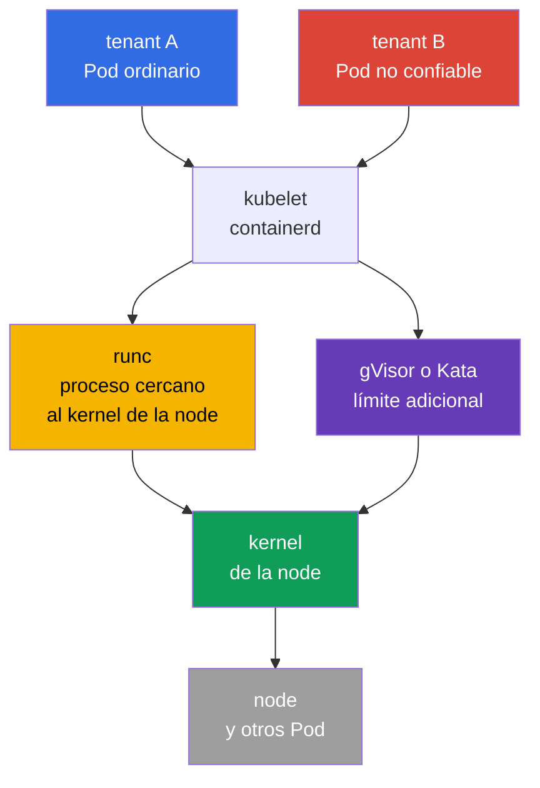
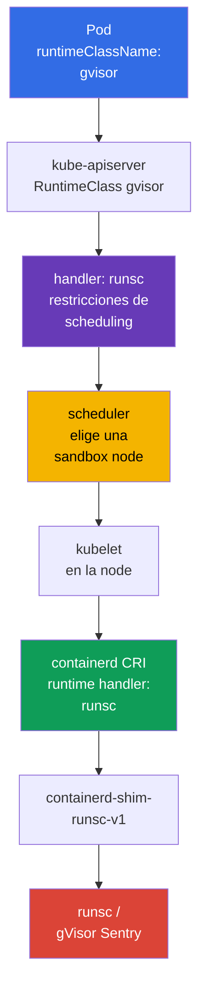

[Русская версия](ru.md) · [Eng version](README.md) · [Version française](fr.md) · [Deutsche Version](de.md) · [ქართული ვერსია](ge.md) · [繁體中文版](tw.md) · [日本語版](jp.md)

# Capítulo 22. Container Runtime Sandbox: gVisor, Kata Containers y RuntimeClass

> **El problema.** Un tenant no confiable, un CI job o un plugin de usuario en un contenedor ordinario
> utiliza el mismo kernel de la node que kubelet y los Pod vecinos. Una vulnerabilidad de kernel/runtime o
> un privilegio conservado por error puede convertir la ejecución de código en un container escape y acceso
> al host u otros tenants. Un sandboxed runtime añade un límite separado entre ese workload y el kernel,
> sin debilitar las demás políticas del Pod.

> **Qué sigue.** `securityContext`, Pod Security Admission y admission-policy reducen los
> privilegios del proceso y bloquean YAML peligroso, pero un contenedor ordinario todavía utiliza
> el kernel de la node. Un workload multi-tenant no confiable o de especial valor necesita un límite
> de ejecución más fuerte: un sandboxed runtime. En este capítulo elegimos gVisor (`runsc`) o Kata
> Containers, los conectamos a containerd mediante `RuntimeClass` y demostramos que el Pod se ejecuta
> precisamente en el sandbox, no con un OCI runtime ordinario.

> **Lo que necesita saber de CKA.** Pod, `nodeSelector`, taints/tolerations y el diagnóstico de
> scheduling se tratan en el [capítulo 16 de CKA](../../../cka/course/16/es.md),
> `securityContext` y least privilege, en el [capítulo 20 de CKA](../../../cka/course/20/es.md),
> y CRI, kubelet y containerd, en el [capítulo 40 de CKA](../../../cka/course/40/es.md). Aquí
> usamos estos mecanismos para aislar un workload no confiable, no repetimos sus fundamentos.

> 🧠 Un sandbox reduce kernel escape para workloads no confiables, pero no sustituye RBAC, PSA, `securityContext` ni NetworkPolicy.

## 22.1. Por qué un contenedor ordinario no basta para multi-tenancy

Un container aísla PID, mount, network y otros namespaces, mientras que cgroups limita los
recursos. Pero el proceso del container normalmente hace llamadas al sistema al **mismo kernel Linux**
que los procesos de la node y los Pod vecinos. Una vulnerabilidad del kernel, container runtime o una
capability concedida incorrectamente puede convertir la ejecución de código en un container escape.

En un clúster single-tenant con imágenes verificadas, esto puede ser un riesgo aceptable. En
multi-tenancy la confianza es diferente: un equipo, customer workload, CI job o supplied plugin
no debe obtener una vía al kernel tan cercana como los componentes del sistema de la plataforma.
`privileged`, host namespaces, `hostPath`, el socket Docker/containerd y permisos RBAC amplios
siguen siendo peligrosos **incluso en un sandbox**.



Un sandbox añade una capa entre el workload y el host. Es defence in depth, no permiso para
debilitar los demás controls:

| Control | De qué se ocupa | El sandbox no lo sustituye |
|---|---|---|
| RBAC y ServiceAccount | quién puede crear o cambiar un objeto | el sandbox no limita el acceso a la API de una identity |
| PSA / Kyverno / Gatekeeper | qué campos del Pod están permitidos | el sandbox no debe admitir un Pod `privileged` |
| `securityContext` | UID, capabilities, seccomp, filesystem del proceso | un runtime seguro no elimina least privilege |
| NetworkPolicy | con quién puede comunicarse un workload | el runtime no define un allow-list de red |
| gVisor / Kata | límite entre el workload y el kernel/host | el runtime no escanea la imagen ni comprueba la firma |

La elección del runtime es una propiedad de la clase de workload, no del usuario. El equipo de plataforma
crea RuntimeClass, asigna nodes compatibles, define admission-policy y los observa. El desarrollador
indica el `runtimeClassName` permitido; no necesita acceso a containerd ni SSH a una worker node.

> 🧠 gVisor añade un userspace kernel; Kata, una lightweight VM con guest kernel y aislamiento más fuerte a cambio de recursos.

## 22.2. Dos enfoques: gVisor y Kata Containers

**gVisor** ejecuta el contenedor mediante `runsc`. Su userspace kernel (`Sentry`) intercepta
gran parte de las llamadas al sistema y las implementa en userspace, reduciendo la superficie directa de ataque
del kernel host. Las platform compatibles son `systrap` (default) y `kvm`: `systrap` es la
opción universal predeterminada y `kvm` es adecuado cuando hay virtualización de hardware disponible e
infraestructura compatible. `ptrace` es una platform legacy, ya no está soportada y está prevista su eliminación;
no la elija para una configuración nueva. Normalmente es más ligero que una máquina virtual, pero no tiene un
guest kernel completamente separado.

**Kata Containers** ejecuta el sandbox del Pod en una lightweight VM: un guest kernel separado y
un hypervisor boundary. El container dentro de la VM ve el guest kernel, no el kernel de la node. El
límite es más fuerte y la semántica de Linux es más cercana a una VM ordinaria, pero startup latency,
consumo de memoria y complejidad operativa son mayores; se requiere soporte de virtualization en la node y en la nube.

| Propiedad | `runc` ordinario | gVisor / `runsc` | Kata Containers |
|---|---|---|---|
| Kernel visible para el workload | host kernel | userspace kernel de gVisor sobre host kernel | guest kernel de VM separado |
| Límite de aislamiento | namespaces/cgroups | syscall interception + sandbox | VM/hypervisor + guest kernel |
| Densidad e inicio | referencia básica | normalmente más cercano al contenedor | normalmente más costoso en memoria e inicio |
| Compatibilidad con syscall/kernel features | máxima | puede haber syscalls/features no soportados | normalmente más cercano a una VM, pero depende del runtime |
| Elección habitual | trusted platform workload | código web/CI/multi-tenant no confiable | aislamiento fuerte, workload regulado o de especial riesgo |

No evalúe un runtime solo por la tabla. Pruebe las imágenes reales: eBPF, FUSE, low-level
network tools, nested containers, device plugins, huge pages, GPU y host mounts pueden ser
incompatibles o requerir un diseño separado. No puede haber fallback silencioso del sandbox a
`runc`: entonces el límite declarado desaparece precisamente cuando se necesita.

> 🎯 El Pod elige RuntimeClass, y su CRI `handler` debe existir exactamente en la configuration de la node de destino.

## 22.3. Cómo elige Kubernetes el runtime: `RuntimeClass` y handler

`RuntimeClass` es una API Kubernetes de ámbito de clúster. Vincula un nombre de workload comprensible con
el **handler** de la configuración CRI de la node. Es importante distinguir estas cadenas:

- `metadata.name: gvisor`: el nombre que indica el desarrollador en `spec.runtimeClassName`;
- `handler: runsc`: el nombre exacto del runtime en la configuración CRI de containerd;
- `runtime_type: io.containerd.runsc.v1`: el runtime de implementación en la configuración de
  containerd; no es el nombre de RuntimeClass.

API server no comprueba la presencia del handler en cada node. El error se manifestará cuando kubelet
intente crear el Pod. Por eso se preparan el handler, los binarios, el shim y las nodes compatibles antes de
crear el workload.



RuntimeClass mínimo para un `runsc` ya instalado:

```yaml
apiVersion: node.k8s.io/v1
kind: RuntimeClass
metadata:
  name: gvisor
handler: runsc
```

```bash
kubectl apply -f runtimeclass-gvisor.yaml
kubectl get runtimeclass
kubectl get runtimeclass gvisor -o yaml
```

`RuntimeClass` no es un Namespace y no concede por sí misma permiso para usar un runtime. Limite la
creación y modificación de RuntimeClass solo a platform administrators. Si no todos los namespaces
deben iniciar un runtime aislado o costoso, restrinja `runtimeClassName` mediante admission-policy y
asígnelo con una plantilla de plataforma.

Por ejemplo, esta `ValidatingAdmissionPolicy` permite `gvisor` solo en `tenant-a`.
La restricción de namespace es solo un ejemplo: en production se vincula a namespaces aprobados
y, si es necesario, a ServiceAccount. Compruebe la policy server-side antes del rollout:

```yaml
apiVersion: admissionregistration.k8s.io/v1
kind: ValidatingAdmissionPolicy
metadata:
  name: restrict-gvisor-runtimeclass
spec:
  matchConstraints:
    resourceRules:
    - apiGroups: [""]
      apiVersions: ["v1"]
      operations: ["CREATE", "UPDATE"]
      resources: ["pods"]
  validations:
  - expression: "!has(object.spec.runtimeClassName) || object.spec.runtimeClassName != 'gvisor' || object.metadata.namespace == 'tenant-a'"
    message: "runtimeClassName gvisor is allowed only in tenant-a"
---
apiVersion: admissionregistration.k8s.io/v1
kind: ValidatingAdmissionPolicyBinding
metadata:
  name: restrict-gvisor-runtimeclass
spec:
  policyName: restrict-gvisor-runtimeclass
  validationActions: [Deny]
```

```bash
kubectl apply -f restrict-gvisor-runtimeclass.yaml

# Comprobación negativa: API server debe rechazar el Pod antes de scheduler.
kubectl -n tenant-b run gvisor-not-allowed \
  --image=nginxinc/nginx-unprivileged:1.30.4-alpine-slim \
  --restart=Never \
  --overrides='{"spec":{"runtimeClassName":"gvisor"}}' \
  --dry-run=server
# Expected: runtimeClassName gvisor is allowed only in tenant-a
```

> 🔬 `RuntimeClass.scheduling` combina constraints del Pod y dirige el sandbox workload al pool preparado.

## 22.4. Scheduling en RuntimeClass: `nodeSelector`, taints y tolerations

No instale gVisor o Kata en todas las nodes «por si acaso». Separe un sandbox pool: contiene
los binary/shim necesarios, configuración probada, capacity y observability. Los workloads
ordinarios no deben ocupar accidentalmente este pool y un sandbox workload no debe llegar a una node
sin el handler necesario.

RuntimeClass puede contener `scheduling`. Kubernetes añade su `nodeSelector` y
`tolerations` al Pod que referencia esta class. El selector de RuntimeClass y el selector de Pod
se combinan durante admission: los valores en conflicto hacen que API server rechace el Pod,
no que se admita un Pod en estado `Pending`/`Unschedulable`. Por eso, ante este error busque el
admission error, no solo los Events del scheduler. Las tolerations se añaden, pero no sustituyen
el taint: la node sigue cerrada para un Pod sin toleration.

```bash
# Lo ejecuta el platform administrator solo en la worker ya preparada.
kubectl label node worker-sandbox sandbox.runtime/gvisor=true
kubectl taint node worker-sandbox sandbox.runtime/gvisor=true:NoSchedule
```

```yaml
apiVersion: node.k8s.io/v1
kind: RuntimeClass
metadata:
  name: gvisor
handler: runsc
scheduling:
  nodeSelector:
    sandbox.runtime/gvisor: "true"
  tolerations:
  - key: sandbox.runtime/gvisor
    operator: Equal
    value: "true"
    effect: NoSchedule
```

Un Pod con `runtimeClassName: gvisor` recibe ambas scheduling constraints automáticamente:

```yaml
apiVersion: v1
kind: Pod
metadata:
  name: untrusted-web
  namespace: tenant-a
spec:
  runtimeClassName: gvisor
  securityContext:
    runAsNonRoot: true
    seccompProfile:
      type: RuntimeDefault
  containers:
  - name: app
    image: nginxinc/nginx-unprivileged:1.30.4-alpine-slim
    ports:
    - containerPort: 8080
    securityContext:
      allowPrivilegeEscalation: false
      capabilities:
        drop: ["ALL"]
```

No copie `nodeSelector` y toleration en cada Deployment si ya están en RuntimeClass:
esto crea dos fuentes de verdad. Los pod-level constraints explícitos son aceptables solo cuando
restringen la selección, por ejemplo por architecture o zone. Primero compruebe el Pod y el Event resultantes:

```bash
kubectl -n tenant-a apply -f untrusted-web.yaml
kubectl -n tenant-a get pod untrusted-web -o wide
kubectl -n tenant-a get pod untrusted-web -o jsonpath='{.spec.runtimeClassName}{"\n"}'
kubectl -n tenant-a get pod untrusted-web -o jsonpath='{.spec.nodeSelector}{"\n"}'
kubectl -n tenant-a describe pod untrusted-web
```

### Kata RuntimeClass

Para Kubernetes, la vía recomendada de instalación de Kata es el Helm chart `kata-deploy`: despliega
el runtime en la node y crea RuntimeClass para los shim reales. En releases modernos, los nombres de
class/handler de runtime-rs pueden ser como `kata-qemu-runtime-rs`; use el nombre que creó el chart,
no un ejemplo antiguo de otra distribución. Antes del rollout compruebe `kubectl get runtimeclass` y
`crictl info` en la node de destino.

La configuración manual siguiente es una variante simplificada para un pool separado ya preparado.
En ella, la class Kata se organiza igual, pero el handler debe coincidir con containerd. No llame a la
class `kata` si el handler de la node se llama `kata-qemu`; de otro modo, la configuración será
confusa. Una opción clara es un mismo nombre corto:

```yaml
apiVersion: node.k8s.io/v1
kind: RuntimeClass
metadata:
  name: kata
handler: kata
scheduling:
  nodeSelector:
    sandbox.runtime/kata: "true"
  tolerations:
  - key: sandbox.runtime/kata
    operator: Equal
    value: "true"
    effect: NoSchedule
```

Para el pool Kata, compruebe antes que hardware virtualization está disponible y permitida para el
hypervisor. Un simple label de node no crea esa capacidad.

> 🔬 El binary, shim y handler de containerd de gVisor requieren versiones, PATH del service y config coordinados en el pool dedicado.

## 22.5. Instalación de gVisor y conexión de `runsc` con containerd

A continuación se muestra un runbook para una Linux node dedicada con containerd. Las versiones de `runsc`, shim, Kubernetes y
containerd deben probarse y fijarse de antemano en Git/IaC. No sustituya el runtime de production por una orden
`latest` en medio de un incidente.

### 1. Instalar `runsc` y shim

El binary, shim y el directorio de sidecar binaries de gVisor deben corresponder a una misma
versión y arquitectura de node probadas. El método de instalación preferido es el paquete `runsc`
del apt repository oficial (o interno aprobado): instala de forma coherente el conjunto completo de
archivos. No mezcle este package con un shim descargado manualmente.

Para una manual installation fijada, use el archivo actual `gvisor.tar.zstd`, no el esquema obsoleto
de dos binary separados. El archivo contiene `runsc`, shim y el directorio `gvisor-bin/`;
este último debe quedar junto a `runsc`, porque el runtime lo utiliza al iniciar el sandbox.
Compruebe la checksum/signature del release aprobado y extraiga todos los archivos con permisos
root-only. Los comandos muestran la forma de instalación; `<VERSION>` y `<ARCH>` se sustituyen
por los valores aprobados.

```bash
VERSION="${VERSION:?set an approved gVisor version}"
ARCH=$(uname -m)
BASE_URL="https://storage.googleapis.com/gvisor/releases/release/${VERSION}/${ARCH}"

curl -fsSLO "${BASE_URL}/gvisor.tar.zstd"
curl -fsSLO "${BASE_URL}/gvisor.tar.zstd.sha512"
sha512sum -c gvisor.tar.zstd.sha512
mkdir gvisor
zstd -d -c gvisor.tar.zstd | tar -xf - -C gvisor
sudo install -d -o root -g root -m 0755 /usr/local/lib/gvisor
sudo cp -a gvisor/. /usr/local/lib/gvisor/
sudo ln -sf /usr/local/lib/gvisor/runsc /usr/local/bin/runsc
sudo ln -sf /usr/local/lib/gvisor/containerd-shim-runsc-v1 \
  /usr/local/bin/containerd-shim-runsc-v1

runsc --version
command -v containerd-shim-runsc-v1
ls -ld /usr/local/lib/gvisor/gvisor-bin
```

En cualquier variante, la ruta al shim debe estar en el `PATH` del service systemd de containerd; compruebe
`systemctl show containerd -p Environment` y el unit/drop-in. Para archive installation, conserve la
vecindad relativa de `runsc` y `gvisor-bin/`; no copie un solo `runsc` por separado. No instale el
runtime solo en control-plane si el Pod se planifica en workers.

### 2. Añadir el runtime handler de containerd

Primero conserve la configuración que funciona y lea su header `version = ...`. No sustituya por completo
el `config.toml` gestionado por el vendor: la ruta del CRI plugin se elige según la **versión efectiva de la
configuration**, no solo según la major-version de containerd.

```bash
sudo cp -a /etc/containerd/config.toml \
  "/etc/containerd/config.toml.before-runsc.$(date +%F-%H%M%S)"
containerd --version
sudo sed -n '1,180p' /etc/containerd/config.toml
```

Si el header actual es `version = 2`, añada el handler en el antiguo CRI plugin path:

```toml
version = 2

[plugins."io.containerd.grpc.v1.cri".containerd.runtimes.runsc]
  runtime_type = "io.containerd.runsc.v1"
```

Si el header actual es `version = 3` **o** `version = 4`, use el nuevo runtime
plugin path (no cambie el header del archivo existente):

```toml
# Conserve el header actual: version = 3 o version = 4.
[plugins.'io.containerd.cri.v1.runtime'.containerd.runtimes.runsc]
  runtime_type = "io.containerd.runsc.v1"
```

containerd 2.x sigue soportando config v2; config v4 es la versión actual en
containerd 2.3, y las configs antiguas se migran durante el inicio. Por eso no cambie el header
arbitrariamente para añadir un runtime: primero compruebe `version = ...`, la effective config y la
documentation de su distribución de containerd.

No cambie `default_runtime_name` a `runsc`: los DaemonSet del sistema, CNI, CSI y los workloads
ordinarios depurados pueden requerir `runc`. RuntimeClass debe elegir el sandbox explícitamente.

Compruebe TOML y reinicie el daemon solo conforme al procedimiento de change management: reiniciar
containerd puede afectar la creación de contenedores nuevos y el funcionamiento de la node. En una node de production,
primero haga cordon/drain teniendo en cuenta DaemonSet y PDB; después aplique la configuración probada.

```bash
sudo systemctl restart containerd
sudo systemctl is-active --quiet containerd && echo 'containerd: active'
sudo journalctl -u containerd -b --no-pager | tail -n 80
sudo crictl info | jq '.config.containerd.runtimes.runsc'
```

`crictl info` debe mostrar `runsc` con `runtimeType` `io.containerd.runsc.v1`. Si el
handler no aparece o el service no está active, deténgase: todavía no cree RuntimeClass ni
mueva workloads a esta node.

> 🔬 Kata requiere shim, hypervisor, componentes guest, host virtualization y comprobación de KVM/runtime compatibles.

## 22.6. Instalación de Kata Containers y handler de containerd

Kata requiere no solo `containerd-shim-kata-v2`, sino también el hypervisor elegido, kernel/rootfs
y host virtualization compatible. Se prefiere un package soportado por el vendor o un Kata release probado,
desplegado mediante configuration management en un pool separado. No copie un binary desde una laptop a
una worker de production.

### Primero: qué se configura exactamente

Esta es una configuración de **node**, no de Pod: antes de que Kubernetes pueda iniciar un Pod en Kata,
en cada node de destino debe existir una cadena completa:

`RuntimeClass.spec.handler` → CRI handler en `containerd` → Kata shim → backend de
virtualización elegido → lightweight VM con guest kernel.

- **Kata runtime / shim**: componentes de la node mediante los que `containerd` crea una sandbox
  VM; `containerd-shim-kata-v2` debe estar disponible para el service `containerd`.
- **Backend (hypervisor)**: mecanismo de VM; normalmente QEMU/KVM y, para algunas configuraciones de
  Azure/Microsoft Hypervisor, Cloud Hypervisor con `mshv`.
- **CRI handler**: entrada con nombre en `config.toml`, por ejemplo `kata` o `kata-qemu`;
  indica a `containerd` qué Kata runtime invocar. No es un nombre de Pod ni de binary.
- **RuntimeClass**: objeto Kubernetes que más tarde pasará a kubelet el nombre exacto de este
  handler. No instala Kata ni corrige la node configuration.

Por eso no empiece creando un Pod. El orden seguro es:

1. Elija el Kata backend aprobado y el handler futuro para el node pool de destino.
2. Instale el Kata package en **cada** node del pool y confirme binary, shim y backend.
3. Añada al `config.toml` existente **un** fragment para su `version = ...` actual;
   no sustituya el archivo entero ni cambie el header por el ejemplo.
4. Reinicie `containerd` y confirme mediante `crictl info` que apareció el handler.
5. Solo entonces cree RuntimeClass con el mismo handler e inicie un canary Pod.

En la comprobación siguiente, `KATA_BACKEND` no es auto-detection. Establezca el valor que
corresponde al RuntimeClass/hypervisor ya elegido: `qemu-kvm` para QEMU/KVM o
`clh-azure` / `clh-azure-runtime-rs` para Microsoft Hypervisor. La presencia de otro dispositivo
no es un éxito.
Después de instalar, compruebe precisamente el runtime y el backend de virtualización, no solo la
presencia del package:

```bash
command -v containerd-shim-kata-v2
kata-runtime --version
sudo kata-runtime check

# Indique el backend del RuntimeClass/hypervisor realmente elegido:
# qemu-kvm - QEMU/KVM; clh-azure o clh-azure-runtime-rs - Microsoft Hypervisor.
KATA_BACKEND="${KATA_BACKEND:?set qemu-kvm, clh-azure, or clh-azure-runtime-rs}"
case "$KATA_BACKEND" in
  qemu-kvm)
    sudo test -c /dev/kvm && sudo test -r /dev/kvm || {
      echo 'ERROR: QEMU/KVM RuntimeClass requires accessible /dev/kvm' >&2
      exit 1
    }
    ls -l /dev/kvm
    ;;
  clh-azure|clh-azure-runtime-rs)
    sudo test -c /dev/mshv && sudo test -r /dev/mshv || {
      echo 'ERROR: clh-azure RuntimeClass requires accessible /dev/mshv' >&2
      exit 1
    }
    ls -l /dev/mshv
    ;;
  *)
    echo "ERROR: unsupported selected Kata backend: $KATA_BACKEND" >&2
    exit 2
    ;;
esac
```

`kata-runtime check` y `/dev/kvm` corresponden a la configuración habitual QEMU/KVM.
El criterio general es la presencia y el funcionamiento del backend que requiere el Kata
RuntimeClass/hypervisor elegido. En Microsoft Hypervisor, `/dev/mshv` con un VMM compatible con mshv, por ejemplo
Cloud Hypervisor para `clh-azure`/`clh-azure-runtime-rs`, es una alternativa soportada;
por tanto, la ausencia de `/dev/kvm` por sí sola no es un FAIL universal. No etiquete una node como
`sandbox.runtime/kata=true` hasta confirmar el backend elegido, nested virtualization (si se necesita) y
el instance type.

Un contenedor necesita un CRI handler separado. Elija la table según el header `version = ...`, no
solo según la major-version de containerd. Para config version 2, use el antiguo CRI plugin path:

```toml
version = 2

[plugins."io.containerd.grpc.v1.cri".containerd.runtimes.kata]
  runtime_type = "io.containerd.kata.v2"
  privileged_without_host_devices = true
```

Para config version 3 **o** version 4, use el nuevo runtime plugin path y conserve el
header existente:

```toml
# Conserve el header actual: version = 3 o version = 4.
[plugins.'io.containerd.cri.v1.runtime'.containerd.runtimes.kata]
  runtime_type = "io.containerd.kata.v2"
  privileged_without_host_devices = true
```

`privileged_without_host_devices = true` no entrega todos los host devices a un
Kata-container `privileged`. Es necesario para el handler de sandbox runtime; no sustituya con esto la configuración
del `runc` predeterminado sin un compatibility review separado.

En Kata Containers modernos, runtime-rs es el runtime predeterminado y Go runtime está
deprecated. Las rutas a `kata-runtime`, shim y el hypervisor elegido dependen del método de instalación;
antes del rollout, compárelas con el package/release de su plataforma, no con una ruta supuesta de un
ejemplo antiguo.

Después de change/restart de containerd, compruebe el handler igual que para gVisor:

```bash
sudo systemctl restart containerd
sudo systemctl is-active --quiet containerd && echo 'containerd: active'
sudo crictl info | jq '.config.containerd.runtimes.kata'
```

En algunas distribuciones, el package crea el handler con otro nombre, por ejemplo
`kata-qemu`. En ese caso, RuntimeClass debe usar el nombre **real** del handler, no el
ejemplo del artículo. Compare `crictl info`, config.toml y `RuntimeClass.spec.handler` antes del
rollout.

> 🏭 Canary Pod representativo y negative test sin fallback → application SLO → namespace policy; no eluda incompatibilidad con `privileged` o `runc`.

## 22.7. Rollout: de un Pod a namespace policy

Un sandbox puede cambiar timing, filesystem semantics, network behavior y consumo de
recursos. Un rollout seguro comienza con un test namespace separado y un
workload representativo.

1. **Compruebe la node.** Binary, shim, containerd handler, label y taint deben estar en
   cada node del pool de destino.
2. **Cree RuntimeClass.** Handler y scheduling deben reflejar una node configuration que ya funciona.
3. **Ejecute un positive test.** Un Pod no privilegiado con `runtimeClassName` debe quedar
   `Running` en una sandbox node.
4. **Compruebe un negative test.** Un Pod con un selector que entra en conflicto con RuntimeClass debe
   rechazarse durante admission. Un Pod en una node sin handler no debe pasar silenciosamente a un runtime ordinario:
   se espera un `FailedCreatePodSandBox` explícito, no fallback a `runc`.
5. **Compruebe la aplicación.** Readiness, egress, DNS, volumes, latency, shutdown y métricas
   deben cumplir el SLO.
6. **Amplíe el scope.** Deployment/Job se migran mediante canary; admission policy prohíbe
   combinaciones inseguras y el uso de la class fuera de los namespaces permitidos.

Deployment se cambia normalmente solo así:

```yaml
apiVersion: apps/v1
kind: Deployment
metadata:
  name: report-worker
  namespace: tenant-a
spec:
  replicas: 2
  selector:
    matchLabels:
      app: report-worker
  template:
    metadata:
      labels:
        app: report-worker
    spec:
      runtimeClassName: gvisor
      securityContext:
        runAsNonRoot: true
        seccompProfile:
          type: RuntimeDefault
      containers:
      - name: worker
        image: registry.example.com/report-worker@sha256:<digest>
        securityContext:
          allowPrivilegeEscalation: false
          capabilities:
            drop: ["ALL"]
```

No añada `hostNetwork`, `hostPID`, `hostIPC`, `privileged`, hostPath ni device mounts,
para «arreglar» la incompatibilidad del sandbox. Esto rompe el modelo de amenazas o señala
que el workload debe rediseñarse o ejecutarse en un pool confiable separado con una excepción
documentada explícitamente.

> 🔬 `RuntimeClass.overhead` se mide para versiones concretas, node type y workload; un error satura el pool o pierde capacity.

### Runtime overhead

`RuntimeClass.overhead` comunica al scheduler CPU/memory adicional fijo que consume el runtime
por Pod. Los valores se toman de un benchmark de la versión, node type y workload concretos, no de un
ejemplo aleatorio de Internet. Sin overhead, scheduler puede sobrecargar una sandbox node;
con un valor excesivo se pierde capacity.

```yaml
apiVersion: node.k8s.io/v1
kind: RuntimeClass
metadata:
  name: kata
handler: kata
overhead:
  podFixed:
    memory: "<measured-memory-overhead>"
    cpu: "<measured-cpu-overhead>"
scheduling:
  nodeSelector:
    sandbox.runtime/kata: "true"
```

Cambiar overhead afecta a los Pod nuevos y a admission/scheduling, por lo que se comprueba en
staging junto con resource requests/limits y el comportamiento del autoscaler.

> 🎯 `runtimeClassName` muestra intent; confirme el Pod/node mediante CRI handler/shim y la funcionalidad del workload.

## 22.8. Comprobación: el sandbox funciona realmente, no solo está indicado en YAML

No basta comprobar `spec.runtimeClassName`: el campo muestra intent, no que se haya iniciado correctamente
con el runtime deseado. Reúna evidence en tres niveles: Kubernetes,
CRI/containerd y dentro del workload. Para el diagnóstico, conserve temporalmente node name, runtime
handler, Pod UID y tiempo; esto vincula el API object con los node logs.

```bash
NS=tenant-a
POD=untrusted-web

# 1. Intent y placement de Kubernetes.
kubectl -n "$NS" get pod "$POD" -o wide
kubectl -n "$NS" get pod "$POD" \
  -o jsonpath='{.spec.runtimeClassName}{" node="}{.spec.nodeName}{" phase="}{.status.phase}{"\n"}'
kubectl -n "$NS" describe pod "$POD"

# 2. En la node elegida: CRI runtime y errores de create sandbox.
sudo crictl pods --name "$POD"
sudo crictl ps -a --name "$POD"
sudo crictl info | jq '.config.containerd.runtimes.runsc'
sudo journalctl -u containerd --since '15 minutes ago' --no-pager | \
  grep -Ei 'runsc|gvisor|kata|sandbox|error'
```

Los parámetros de `crictl` y el formato de salida dependen del release. Si CRI no muestra el handler
directamente, use el identificador sandbox/container de `crictl inspectp` y relaciónelo con el
log de containerd/shim. No concluya solo por el nombre del Pod: la prueba es crear el
sandbox con el handler `runsc` o `kata` sin fallback.

### Observación desde dentro del Pod y en el host

En un container ordinario, `uname -a` normalmente muestra el kernel de la node. En gVisor, los syscall results
se virtualizan: `uname`, `/proc` y otros datos pueden mostrar una vista específica de gVisor o limitada.
En Kata, el proceso verá un guest kernel separado del host. Estas señales
son útiles, pero no se pueden considerar la única security proof: el output puede cambiar entre
versiones y no tiene que revelar la implementation.

```bash
# Dentro del sandbox Pod: huella diagnóstica de la workload view.
kubectl -n "$NS" exec "$POD" -- sh -c '
  echo "=== uname ==="; uname -a
  echo "=== pid 1 cgroup ==="; cat /proc/1/cgroup
  echo "=== mounts ==="; mount | head -n 20
  echo "=== dmesg (if permitted) ==="; dmesg 2>&1 | head -n 40 || true
'

# En el host: el host kernel sigue siendo el kernel de la node, no la vista guest/Sentry del Pod.
uname -a
sudo journalctl -u containerd --since '15 minutes ago' --no-pager | tail -n 120
```

### Cómo puede verse `dmesg` en un Pod gVisor

En un scenario formativo de gVisor, dentro de un Pod iniciado correctamente, `dmesg` puede verse así:

```text
$ dmesg
...
Starting gVisor
...
```

`...` indica otras líneas de log que se omiten intencionadamente en el ejemplo. `Starting gVisor` es
una señal formativa útil de que el workload ve el kernel del sandbox gVisor. Si `dmesg` está prohibido
o falta el marker, no conceda privileges adicionales al Pod por esa línea:
compruebe `runtimeClassName`, placement y handler.

No extrapole una sola línea `Starting gVisor` como proof de production. En production es
más fiable la combinación de RuntimeClass, placement, CRI handler/shim logs y application smoke test.

| Observación | Qué demuestra | Qué no demuestra |
|---|---|---|
| `runtimeClassName: gvisor` en el Pod | intención de elegir la class | que el handler existe en la node |
| Pod `Running` en una sandbox node | scheduler y kubelet aceptaron el Pod | por sí solo no muestra el implementation runtime |
| `crictl info` contiene `runsc`/`kata` | node configurada para el handler | que el Pod concreto no se creó de otra forma |
| log de containerd/shim con Pod UID/container ID | sandbox concreto creado por el handler correcto | que la aplicación funciona |
| `uname`/`dmesg` dentro | la workload view difiere del host; señal útil | corrección completa del isolation boundary |
| `uname` y logs en el host | contexto del host y actividad del runtime | contenido del guest/userspace kernel del Pod |

> 🎯 Diagnostique class, node placement, handler y `FailedCreatePodSandBox`; no elimine `runtimeClassName`.

## 22.9. Fallos habituales y diagnóstico seguro

| Síntoma | Causa probable | Comprobación y acción |
|---|---|---|
| Pod `Pending`, `didn't match Pod's node affinity/selector` | no hay una node con el label de RuntimeClass o hay conflicto con el selector del Pod | `kubectl describe pod`; compare `spec.nodeSelector` y los labels de las nodes |
| Pod `Pending`, taint no tolerado | el Pod no recibió la toleration de RuntimeClass o no coincide | compruebe `kubectl get runtimeclass -o yaml`, `kubectl describe node` |
| `FailedCreatePodSandBox`, unknown runtime handler | no hay bloque handler, el nombre es erróneo o containerd no se releyó | compare `RuntimeClass.handler`, config.toml, `crictl info`; corrija y reinicie según el runbook |
| `executable file not found` para shim | el shim no está instalado o está fuera del PATH del service containerd | compruebe `command -v`, permissions y systemd Environment |
| El Pod gVisor inicia, pero la aplicación falla | syscall, mount o network feature no está soportado o se implementa de forma distinta | reproducer mínimo, runtime docs, corrija la app o elija otro runtime aprobado |
| Kata no inicia | backend del RuntimeClass elegido, nested virtualization, hypervisor/kernel config o capacity no disponible | `kata-runtime check`; para QEMU/KVM, `/dev/kvm`; para Microsoft Hypervisor, `/dev/mshv` y VMM compatible con mshv; cloud instance capabilities, logs de shim |
| El Pod terminó en una node ordinaria | RuntimeClass sin `scheduling`, pool sin taint o se indicó otra class | compruebe class, node name, labels/taints; no lo considere un sandbox rollout |

No «arregle» `FailedCreatePodSandBox` eliminando `runtimeClassName`: esto convierte un
security failure en un downgrade imperceptible. Mantenga el workload detenido hasta que el equipo de plataforma
confirme otro RuntimeClass permitido o un risk acceptance separado.

> 🏭 Pool dedicado, compatibility matrix, overhead medido, alerting y controlled upgrades para el sandbox runtime.

## 22.10. Cómo se aplica en production

- **Asigne el pool por confianza.** Las nodes gVisor/Kata reciben solo sandbox workload mediante
  RuntimeClass scheduling, label y taint `NoSchedule`; los agents del sistema y trusted workloads
  se mantienen aparte.
- **Conserve el `runc` predeterminado.** Migrar toda la plataforma a un runtime nuevo sin una compatibility
  matrix aumenta el blast radius. El sandbox se habilita por class y mediante canary.
- **Mantenga el handler como contrato.** Versiones de binaries, shim, containerd config y
  RuntimeClass cambian en una reviewed change. Una diferencia accidental entre los nombres `runsc`, `kata` y
  `kata-qemu` es fuente de outages.
- **Prohíba combinaciones peligrosas.** PSA/admission-policy no debe admitir
  `privileged`, host namespaces, hostPath/socket mounts ni broad exemptions en un tenant
  namespace, independientemente de RuntimeClass.
- **Calcule la capacity.** Mida runtime overhead, startup latency, density, node
  pressure y cold-start. Un pool Kata suele requerir un autoscaling profile separado.
- **Monitorice el límite.** Alert para `FailedCreatePodSandBox`, errors de containerd/shim,
  sandbox node NotReady, aumento de startup latency y placement inesperado fuera del pool.
- **Planifique actualizaciones.** La actualización de host kernel, containerd, gVisor/Kata y Kubernetes
  se prueba como una sola compatibility matrix. Antes de drain, compruebe PDB y retire la node de
  scheduling; no actualice a ciegas el runtime bajo Pod tenant activos.

## 22.11. Cómo resulta útil: en el examen y en el trabajo real

- **En el examen.** Debe poder distinguir `RuntimeClass`, CRI handler y `runtime_type`,
  dirigir un Pod a un sandbox pool preparado mediante `scheduling`, labels, taints y
  tolerations, y diagnosticar `FailedCreatePodSandBox` sin un fallback inseguro a `runc`.
- **En el trabajo real.** Estas habilidades permiten aislar workloads de tenant, CI y plugin
  no confiables, desplegar gVisor o Kata de forma segura mediante canary, tener en cuenta overhead y
  confirmar el runtime con datos de Kubernetes, CRI/containerd y application smoke test.

## 22.12. Mini glosario

- **Container runtime sandbox**: runtime que añade un límite entre el workload y el host kernel.
- **gVisor**: sandbox runtime con userspace kernel; el CRI handler suele llamarse `runsc`.
- **`runsc`**: OCI runtime de gVisor y nombre del handler en este ejemplo.
- **Kata Containers**: runtime que ejecuta el sandbox del Pod en una lightweight VM con guest kernel.
- **RuntimeClass**: Kubernetes resource de ámbito de clúster que elige un CRI handler y constraints
  opcionales de overhead/scheduling.
- **handler**: nombre del runtime en la CRI configuration que debe coincidir con
  `RuntimeClass.spec.handler`.
- **shim**: proceso/binary de containerd que conecta containerd con un runtime concreto.
- **sandbox pool**: nodes dedicadas con runtime, label, taint y capacity preparados.
- **runtime overhead**: CPU/memory adicional fijo que scheduler tiene en cuenta para el Pod
  del RuntimeClass elegido.

## 22.13. Resumen del capítulo

- Los contenedores ordinarios comparten el kernel de la node; para workloads multi-tenant no confiables, gVisor o
  Kata añaden un límite adicional importante, pero no sustituyen RBAC, PSA,
  `securityContext` ni NetworkPolicy.
- gVisor (`runsc`) intercepta las llamadas al sistema mediante userspace kernel; Kata utiliza
  una lightweight VM y guest kernel. La elección la determinan el modelo de amenazas, compatibility y SLO.
- `RuntimeClass.metadata.name`, `spec.handler` y `containerd runtime_type` son niveles de
  nomenclatura diferentes. Handler debe coincidir exactamente con la CRI configuration de cada target node.
- `RuntimeClass.scheduling` con `nodeSelector` y tolerations junto a labels/taints limita
  el sandbox workload al node pool preparado.
- Para containerd se necesitan los binary y shim correspondientes, un handler en config.toml y
  un restart/verification controlado del daemon. No se cambia el `runc` predeterminado sin motivo.
- La comprobación debe vincular la class y node del Pod con handler/shim en CRI/containerd logs, y después
  confirmar la workload view y el application behavior; `runtimeClassName` por sí solo no basta.
- No se puede eliminar silenciosamente `runtimeClassName` después de un fallo. Es un security downgrade que
  requiere una decisión explícita y controles compensatorios.

## 22.14. Preguntas de autoevaluación

<details>
<summary>1. ¿Por qué namespaces y cgroups no convierten un contenedor ordinario en un kernel security boundary completo para un tenant no confiable?</summary>

Un contenedor ordinario aísla namespaces y limita recursos con cgroups, pero su proceso normalmente llama al mismo kernel Linux que la node y los Pod vecinos. Una vulnerabilidad de kernel/runtime o una capability incorrecta puede convertirse en un container escape. Un tenant no confiable necesita el límite adicional de gVisor o Kata junto con los demás controls.
</details>

<details>
<summary>2. ¿Cuál es la diferencia clave entre el userspace kernel de gVisor y el guest kernel de Kata?</summary>

gVisor `runsc` intercepta la mayor parte de los syscalls y los implementa mediante el userspace kernel Sentry sobre el host kernel. Kata ejecuta el sandbox del Pod en una lightweight VM, donde el workload ve un guest kernel separado y un hypervisor boundary. Kata normalmente proporciona un aislamiento más fuerte y cercano a una VM, pero requiere virtualization y cuesta más memoria y startup.
</details>

<details>
<summary>3. ¿En qué se diferencian `RuntimeClass.metadata.name`, `handler` y `runtime_type` de containerd?</summary>

`metadata.name`, por ejemplo `gvisor`, es el valor de `spec.runtimeClassName` en el Pod. `handler`, por ejemplo `runsc`, debe coincidir exactamente con el nombre del runtime en la CRI configuration de la node. `runtime_type`, por ejemplo `io.containerd.runsc.v1`, es el runtime de implementación en la configuración de containerd y no es el nombre de RuntimeClass.
</details>

<details>
<summary>4. ¿Por qué API server no puede garantizar que el handler esté disponible en la node elegida?</summary>

API server almacena RuntimeClass, pero no comprueba binary, shim y CRI handler en cada node. El error aparece cuando kubelet intenta crear el sandbox, por ejemplo como `FailedCreatePodSandBox` o unknown runtime handler. Por ello, handler y pool compatible se preparan y comprueban antes de crear el workload.
</details>

<details>
<summary>5. ¿Cómo interactúan `RuntimeClass.scheduling.nodeSelector` y tolerations con los labels y taints del sandbox node pool?</summary>

RuntimeClass añade su `nodeSelector` y tolerations al Pod que lo referencia. El selector debe coincidir con el label de la sandbox node preparada, y la toleration permite pasar el taint `NoSchedule`; el taint sigue protegiendo frente a Pod sin toleration. Un conflicto entre los selectores de RuntimeClass y del Pod se rechaza durante admission, no se convierte en Pending.
</details>

<details>
<summary>6. ¿Por qué es peligroso establecer `runsc` como default runtime de todo el clúster sin compatibility testing?</summary>

Los DaemonSet del sistema, CNI, CSI y los workloads habituales pueden requerir features que el sandbox implementa de otro modo o no soporta. El capítulo prescribe conservar `runc` como default y elegir el sandbox explícitamente mediante RuntimeClass para un pool compatible y canary. De otro modo, el blast radius afecta a toda la plataforma.
</details>

<details>
<summary>7. ¿Qué archivos/binaries deben coordinarse para gVisor y containerd?</summary>

Deben coincidir las versiones probadas de `runsc`, `containerd-shim-runsc-v1` y el directorio `gvisor-bin/`; con archive install se conserva su vecindad con `runsc`. El shim debe estar en el `PATH` del service systemd de containerd. En `config.toml`, el handler `runsc` debe indicar `runtime_type = "io.containerd.runsc.v1"` mediante el plugin path correcto para la generación de containerd.
</details>

<details>
<summary>8. ¿Por qué `runtimeClassName: gvisor` y `Running` todavía no son evidencia completa de sandbox execution?</summary>

El campo muestra la intención y `Running` demuestra que scheduler y kubelet aceptaron el Pod, pero no muestra la implementation del sandbox concreto. Se necesitan placement en la sandbox node, CRI configuration y logs de containerd/shim vinculados con Pod UID o container ID, donde se vea el handler `runsc`/Kata. Después se confirman workload view y application smoke test.
</details>

<details>
<summary>9. ¿Qué significa que `uname` dentro de un Pod Kata difiera de `uname` del host, y por qué no basta como única prueba?</summary>

Es una señal útil de que el workload ve un guest kernel separado del kernel de la node. Pero el output depende de la versión del runtime y por sí solo no vincula el Pod concreto con el CRI handler correcto. Una evidence fiable combina RuntimeClass, node, logs de containerd/shim y una comprobación funcional de la aplicación.
</details>

<details>
<summary>10. **Flashback (capítulo 10).** gVisor/Kata (este capítulo) aíslan al tenant en la superficie de syscall del kernel. RBAC (capítulo 10) aísla al tenant en el acceso a la API Kubernetes. Para un clúster multi-tenant con namespaces no confiables, dé un escenario de ataque concreto que detenga solo uno de estos dos niveles, pero no el otro.</summary>

RBAC puede prohibir a un ServiceAccount de tenant leer Secrets de otro namespace o crear un Pod privileged, pero no detendrá un exploit syscall en un container permitido ya iniciado; aquí es útil un sandbox. A la inversa, gVisor/Kata no impide que una identity ejecute un `get secrets` permitido mediante la API o modifique su propio Deployment. Por tanto, API least privilege y kernel isolation cierran attack paths distintos.
</details>

<details>
<summary>11. ¿Por qué eliminar `runtimeClassName` para una recuperación rápida es un security downgrade?</summary>

Eliminar el campo traslada el workload desde el sandbox boundary declarado a un runtime ordinario, es decir, elimina la protección precisamente ante un problema de compatibility. El capítulo prohíbe explícitamente este fallback silencioso: el Pod debe permanecer detenido hasta que el equipo de plataforma confirme otro RuntimeClass permitido o un risk acceptance separado. De otro modo, la recuperación oculta una reducción de seguridad.
</details>

## Práctica

Practique RuntimeClass, `runsc`, scheduling y la comprobación del sandbox en
el [lab 110: gVisor, Cilium e Istio](../../labs/110/README_ES.MD). Instale `runsc` en una
node preparada, cree RuntimeClass `gvisor` con handler `runsc`, aísle la node mediante
label/taint, migre un workload del namespace `team-purple` a esta class y confirme
el placement. Para el escenario formativo, conserve `dmesg` de un Pod iniciado correctamente en el
artefacto requerido y compárelo con los datos del host/containerd.

🌐 Práctica interactiva adicional (killer.sh/killercoda, recurso externo): [sandbox-gvisor](https://killercoda.com/killer-shell-cks/scenario/sandbox-gvisor)

Referencias oficiales útiles: [RuntimeClass](https://kubernetes.io/docs/concepts/containers/runtime-class/),
[RuntimeClass scheduling](https://kubernetes.io/docs/concepts/containers/runtime-class/#scheduling),
[gVisor](https://gvisor.dev/docs/), [gVisor con containerd](https://gvisor.dev/docs/user_guide/containerd/)
y [Kata Containers](https://katacontainers.io/).

---
[Índice](../README_ES.md) · [Capítulo 21](../21/es.md) · [Capítulo 23](../23/es.md)
