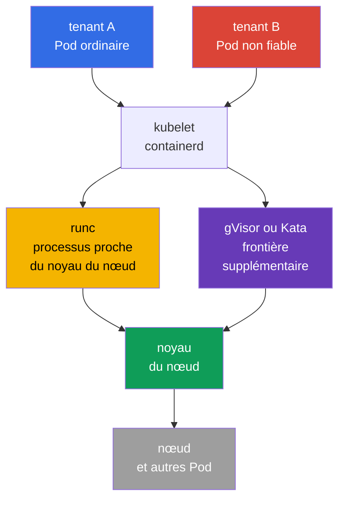
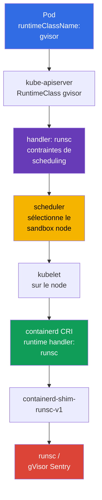

[Русская версия](ru.md) · [Eng version](README.md) · [Versión en español](es.md) · [Deutsche Version](de.md) · [ქართული ვერსია](ge.md) · [繁體中文版](tw.md) · [日本語版](jp.md)

# Chapitre 22. Container Runtime Sandbox : gVisor, Kata Containers et RuntimeClass

> **Le problème.** Un tenant non fiable, un CI-job ou un plugin fourni par un utilisateur dans un container ordinaire utilise le même noyau de nœud que kubelet et les Pod voisins. Une vulnérabilité du kernel/runtime ou un privilège conservé par erreur peut transformer l'exécution de code en container escape et en accès à l'hôte ou à d'autres tenants. Un sandboxed runtime ajoute une frontière distincte entre une telle workload et le noyau, sans affaiblir les autres politiques des Pod.

> **La suite.** `securityContext`, Pod Security Admission et les admission-policy réduisent les privilèges du processus et bloquent le YAML dangereux, mais un container ordinaire utilise toujours le noyau du nœud. Une workload multi-tenant non fiable ou particulièrement précieuse a besoin d'une frontière d'exécution plus forte : un sandboxed runtime. Dans ce chapitre, nous choisissons gVisor (`runsc`) ou Kata Containers, les connectons à containerd via `RuntimeClass` et prouvons qu'un Pod s'exécute bien dans un sandbox, et non dans un OCI runtime ordinaire.

> **Ce qu'il faut connaître de CKA.** Les Pod, `nodeSelector`, les taints/tolerations et le diagnostic de scheduling sont traités dans le [chapitre 16 de CKA](../../../cka/course/16/fr.md), `securityContext` et le least privilege dans le [chapitre 20 de CKA](../../../cka/course/20/fr.md), et CRI, kubelet et containerd dans le [chapitre 40 de CKA](../../../cka/course/40/fr.md). Ici, nous utilisons ces mécanismes pour isoler une workload non fiable, sans répéter leurs bases.

> 🧠 Un sandbox réduit le kernel escape pour les workloads non fiables, mais ne remplace ni RBAC, ni PSA, ni `securityContext`, ni NetworkPolicy.

## 22.1. Pourquoi un container ordinaire ne suffit pas pour le multi-tenancy

Un container isole les namespaces PID, mount, network et autres, tandis que les cgroups limitent les ressources. Mais le processus du container fait normalement des appels système au **même noyau Linux** que les processus du nœud et les Pod voisins. Une vulnérabilité du noyau, du container runtime ou une capability accordée de façon incorrecte peut transformer l'exécution de code en container escape.

Dans un cluster single-tenant avec des images vérifiées, cela peut être un risque acceptable. En multi-tenancy, la confiance est différente : une équipe, une customer workload, un CI-job ou un supplied plugin ne doivent pas obtenir un chemin vers le noyau aussi proche que celui des composants système de la plateforme. `privileged`, les host namespaces, `hostPath`, le socket Docker/containerd et de larges droits RBAC restent dangereux **même dans un sandbox**.



Un sandbox ajoute une couche entre une workload et l'hôte. C'est de la defence in depth, et non une permission d'affaiblir les autres controls :

| Contrôle | Ce qu'il régit | Le sandbox ne le remplace pas |
|---|---|---|
| RBAC et ServiceAccount | qui peut créer ou modifier un objet | le sandbox ne limite pas l'accès API d'une identity |
| PSA / Kyverno / Gatekeeper | quels champs de Pod sont autorisés | le sandbox ne doit pas accepter un Pod `privileged` |
| `securityContext` | UID du processus, capabilities, seccomp, filesystem | un runtime sécurisé n'annule pas le least privilege |
| NetworkPolicy | avec qui une workload peut communiquer | le runtime ne définit pas d'allow-list réseau |
| gVisor / Kata | frontière entre la workload et le noyau/l'hôte | le runtime ne scanne pas une image et ne vérifie pas une signature |

Le choix du runtime est une propriété de la classe de workload, et non de l'utilisateur. La platform team crée le RuntimeClass, attribue des nodes compatibles, définit l'admission-policy et les observe. Un développeur indique un `runtimeClassName` autorisé ; il n'a pas besoin d'accéder à containerd ou de se connecter en SSH à un worker node.

> 🧠 gVisor ajoute un userspace kernel ; Kata ajoute une lightweight VM avec un guest kernel et une isolation plus forte au prix de ressources.

## 22.2. Deux approches : gVisor et Kata Containers

**gVisor** exécute un container via `runsc`. Son userspace kernel (`Sentry`) intercepte la plupart des appels système et les implémente dans l'espace utilisateur, ce qui réduit la surface d'attaque directe du noyau host. Les platform prises en charge sont `systrap` (default) et `kvm` : `systrap` est le choix général par défaut, tandis que `kvm` convient si la virtualisation matérielle est disponible et que l'infrastructure est compatible. `ptrace` est une legacy platform, n'est plus prise en charge et sa suppression est prévue ; ne la choisissez pas pour une nouvelle configuration. C'est généralement plus léger qu'une machine virtuelle, mais ce n'est pas un guest kernel entièrement séparé.

**Kata Containers** exécute un Pod sandbox dans une lightweight VM : un guest kernel distinct et une hypervisor boundary. Un container dans la VM voit le guest kernel plutôt que le kernel du nœud. La frontière est plus forte et la sémantique Linux est plus proche d'une VM ordinaire, mais la startup latency, la consommation de mémoire et la complexité opérationnelle sont supérieures ; la node et le cloud doivent prendre en charge la virtualisation.

| Propriété | `runc` ordinaire | gVisor / `runsc` | Kata Containers |
|---|---|---|---|
| Noyau visible par la workload | host kernel | userspace kernel gVisor sur le host kernel | guest kernel d'une VM distincte |
| Frontière d'isolation | namespaces/cgroups | syscall interception + sandbox | VM/hypervisor + guest kernel |
| Densité et démarrage | référence de base | généralement plus proche d'un container | généralement plus coûteux en mémoire et au démarrage |
| Compatibilité des syscalls/kernel features | maximale | des syscalls/features peuvent ne pas être pris en charge | généralement plus proche d'une VM, mais dépend du runtime |
| Choix typique | trusted platform workload | code web/CI/multi-tenant non fiable | forte isolation, workload réglementée ou particulièrement risquée |

N'évaluez pas un runtime uniquement à partir de ce tableau. Testez des images réelles : eBPF, FUSE, les low-level network tools, nested containers, device plugins, huge pages, GPU et host mounts peuvent être incompatibles ou demander une conception distincte. Il ne faut pas de silently fallback d'un sandbox vers `runc` : la frontière déclarée disparaîtrait précisément lorsqu'elle est nécessaire.

> 🎯 Un Pod sélectionne un `RuntimeClass`, et son CRI `handler` doit exister exactement dans la configuration de la node cible.

## 22.3. Comment Kubernetes sélectionne un runtime : `RuntimeClass` et handler

`RuntimeClass` est une API Kubernetes cluster-scoped. Elle relie un nom de workload compréhensible à un **handler** de la configuration CRI sur le nœud. Il est important de distinguer ces chaînes :

- `metadata.name: gvisor` - le nom que le développeur indique dans `spec.runtimeClassName` ;
- `handler: runsc` - le nom exact du runtime dans la configuration CRI de containerd ;
- `runtime_type: io.containerd.runsc.v1` - l'implementation runtime dans la configuration de containerd ; ce n'est pas un nom de RuntimeClass.

L'API server ne vérifie pas la présence du handler sur chaque node. L'erreur apparaît lorsque kubelet tente de créer le Pod. Préparez donc le handler, les binaires, le shim et les nodes compatibles avant de créer la workload.



RuntimeClass minimal pour un `runsc` déjà installé :

```yaml
apiVersion: node.k8s.io/v1
kind: RuntimeClass
metadata:
  name: gvisor
handler: runsc
```

```bash
kubectl apply -f runtimeclass-gvisor.yaml
kubectl get runtimeclass
kubectl get runtimeclass gvisor -o yaml
```

`RuntimeClass` n'est pas un Namespace et n'accorde pas le droit d'utiliser un runtime. Limitez la création et la modification de RuntimeClass aux platform administrators. Si tous les namespace ne doivent pas exécuter un runtime isolé ou coûteux, restreignez `runtimeClassName` par une admission-policy et attribuez-le avec un template de plateforme.

Par exemple, cette `ValidatingAdmissionPolicy` autorise `gvisor` uniquement dans `tenant-a`. La restriction de namespace n'est qu'un exemple : en production, liez-la aux namespace approuvés et, au besoin, aux ServiceAccount. Testez la policy server-side avant le rollout :

```yaml
apiVersion: admissionregistration.k8s.io/v1
kind: ValidatingAdmissionPolicy
metadata:
  name: restrict-gvisor-runtimeclass
spec:
  matchConstraints:
    resourceRules:
    - apiGroups: [""]
      apiVersions: ["v1"]
      operations: ["CREATE", "UPDATE"]
      resources: ["pods"]
  validations:
  - expression: "!has(object.spec.runtimeClassName) || object.spec.runtimeClassName != 'gvisor' || object.metadata.namespace == 'tenant-a'"
    message: "runtimeClassName gvisor is allowed only in tenant-a"
---
apiVersion: admissionregistration.k8s.io/v1
kind: ValidatingAdmissionPolicyBinding
metadata:
  name: restrict-gvisor-runtimeclass
spec:
  policyName: restrict-gvisor-runtimeclass
  validationActions: [Deny]
```

```bash
kubectl apply -f restrict-gvisor-runtimeclass.yaml

# Vérification négative : l'API server doit rejeter le Pod avant le scheduler.
kubectl -n tenant-b run gvisor-not-allowed \
  --image=nginxinc/nginx-unprivileged:1.30.4-alpine-slim \
  --restart=Never \
  --overrides='{"spec":{"runtimeClassName":"gvisor"}}' \
  --dry-run=server
# Expected: runtimeClassName gvisor is allowed only in tenant-a
```

> 🔬 `RuntimeClass.scheduling` combine les constraints du Pod et dirige la sandbox workload vers le pool préparé.

## 22.4. Scheduling dans RuntimeClass : `nodeSelector`, taints et tolerations

N'installez pas gVisor ou Kata sur tous les nodes « au cas où ». Séparez un sandbox pool : il contient le binary/shim nécessaire, une configuration vérifiée, la capacity et l'observability. Les workloads ordinaires ne doivent pas occuper ce pool par accident, et une sandbox workload ne doit pas arriver sur une node sans le handler nécessaire.

RuntimeClass peut contenir `scheduling`. Kubernetes ajoute son `nodeSelector` et ses `tolerations` au Pod qui référence cette class. Le selector de RuntimeClass et celui du Pod sont combinés lors de l'admission : des valeurs contradictoires entraînent le rejet du Pod par l'API server, plutôt qu'un Pod accepté à l'état `Pending`/`Unschedulable`. Pour cette erreur, cherchez une admission error, et pas seulement les Events du scheduler. Les tolerations sont ajoutées, mais ne remplacent pas un taint - la node reste fermée au Pod sans toleration.

```bash
# À exécuter par un platform administrator, uniquement sur le worker préparé.
kubectl label node worker-sandbox sandbox.runtime/gvisor=true
kubectl taint node worker-sandbox sandbox.runtime/gvisor=true:NoSchedule
```

```yaml
apiVersion: node.k8s.io/v1
kind: RuntimeClass
metadata:
  name: gvisor
handler: runsc
scheduling:
  nodeSelector:
    sandbox.runtime/gvisor: "true"
  tolerations:
  - key: sandbox.runtime/gvisor
    operator: Equal
    value: "true"
    effect: NoSchedule
```

Un Pod avec `runtimeClassName: gvisor` reçoit automatiquement les deux scheduling constraints :

```yaml
apiVersion: v1
kind: Pod
metadata:
  name: untrusted-web
  namespace: tenant-a
spec:
  runtimeClassName: gvisor
  securityContext:
    runAsNonRoot: true
    seccompProfile:
      type: RuntimeDefault
  containers:
  - name: app
    image: nginxinc/nginx-unprivileged:1.30.4-alpine-slim
    ports:
    - containerPort: 8080
    securityContext:
      allowPrivilegeEscalation: false
      capabilities:
        drop: ["ALL"]
```

Ne copiez pas le `nodeSelector` et la toleration dans chaque Deployment lorsqu'ils sont déjà dans RuntimeClass : cela crée deux sources de vérité. Des constraints explicites au niveau du Pod ne sont appropriées que lorsqu'elles restreignent le choix, par exemple selon l'architecture ou la zone. Vérifiez d'abord le Pod et l'Event résultants :

```bash
kubectl -n tenant-a apply -f untrusted-web.yaml
kubectl -n tenant-a get pod untrusted-web -o wide
kubectl -n tenant-a get pod untrusted-web -o jsonpath='{.spec.runtimeClassName}{"\n"}'
kubectl -n tenant-a get pod untrusted-web -o jsonpath='{.spec.nodeSelector}{"\n"}'
kubectl -n tenant-a describe pod untrusted-web
```

### Kata RuntimeClass

Pour Kubernetes, la voie d'installation recommandée de Kata est le Helm chart `kata-deploy` : il déploie le runtime sur une node et crée les RuntimeClass pour les shim réels. Dans les releases modernes, les noms de class/handler runtime-rs peuvent ressembler à `kata-qemu-runtime-rs` ; utilisez le nom créé par le chart, et non un ancien exemple provenant d'une autre distribution. Avant le rollout, vérifiez `kubectl get runtimeclass` et `crictl info` sur la node cible.

La configuration manuelle ci-dessous est une option simplifiée pour un pool dédié déjà préparé. La class Kata fonctionne de la même façon, mais son handler doit correspondre à containerd. Ne nommez pas une class `kata` si le handler de la node est `kata-qemu`, sinon la configuration devient peu claire. Une option compréhensible consiste à utiliser le même nom court :

```yaml
apiVersion: node.k8s.io/v1
kind: RuntimeClass
metadata:
  name: kata
handler: kata
scheduling:
  nodeSelector:
    sandbox.runtime/kata: "true"
  tolerations:
  - key: sandbox.runtime/kata
    operator: Equal
    value: "true"
    effect: NoSchedule
```

Pour un pool Kata, vérifiez d'abord que la hardware virtualization est disponible et autorisée pour l'hypervisor. Une simple étiquette de node ne crée pas cette capacité.

> 🔬 Le binary gVisor, le shim et le handler containerd exigent des versions alignées, le PATH du service et une configuration sur un pool dédié.

## 22.5. Installation de gVisor et connexion de `runsc` à containerd

Voici une procédure opératoire pour une node Linux dédiée avec containerd. Les versions de `runsc`, du shim, de Kubernetes et de containerd doivent être testées à l'avance et figées dans Git/IaC. Ne remplacez pas le runtime de production par une commande `latest` au milieu d'un incident.

### 1. Installer `runsc` et le shim

Le binary gVisor, le shim et le répertoire de binaries sidecar doivent correspondre à une même version validée et à l'architecture de la node. La méthode d'installation privilégiée est le package `runsc` provenant du repository apt officiel (ou interne approuvé) : il installe l'ensemble complet de fichiers de manière cohérente. Ne mélangez pas ce package avec un shim téléchargé manuellement.

Pour une installation manuelle avec version figée, utilisez l'archive actuelle `gvisor.tar.zstd`, et non le schéma obsolète de deux binaries distincts. L'archive contient `runsc`, le shim et le répertoire `gvisor-bin/` ; ce dernier doit rester à côté de `runsc`, car le runtime l'utilise au démarrage du sandbox. Vérifiez la checksum/signature de la release précisément approuvée et extrayez tous les fichiers avec des permissions réservées à root. Les commandes indiquent la forme de l'installation ; remplacez `<VERSION>` et `<ARCH>` par les valeurs approuvées.

```bash
VERSION="${VERSION:?set an approved gVisor version}"
ARCH=$(uname -m)
BASE_URL="https://storage.googleapis.com/gvisor/releases/release/${VERSION}/${ARCH}"

curl -fsSLO "${BASE_URL}/gvisor.tar.zstd"
curl -fsSLO "${BASE_URL}/gvisor.tar.zstd.sha512"
sha512sum -c gvisor.tar.zstd.sha512
mkdir gvisor
zstd -d -c gvisor.tar.zstd | tar -xf - -C gvisor
sudo install -d -o root -g root -m 0755 /usr/local/lib/gvisor
sudo cp -a gvisor/. /usr/local/lib/gvisor/
sudo ln -sf /usr/local/lib/gvisor/runsc /usr/local/bin/runsc
sudo ln -sf /usr/local/lib/gvisor/containerd-shim-runsc-v1 \
  /usr/local/bin/containerd-shim-runsc-v1

runsc --version
command -v containerd-shim-runsc-v1
ls -ld /usr/local/lib/gvisor/gvisor-bin
```

Dans tous les cas, le chemin vers le shim doit être présent dans le `PATH` du service systemd de containerd ; vérifiez `systemctl show containerd -p Environment` ainsi que l'unit/drop-in. Pour une installation depuis l'archive, préservez la proximité relative de `runsc` et de `gvisor-bin/`, au lieu de copier `runsc` seul ailleurs. N'installez pas le runtime seulement sur le control-plane si le Pod est planifié sur des workers.

### 2. Ajouter le runtime handler à containerd

Commencez par sauvegarder la configuration fonctionnelle et lisez son en-tête `version = ...`. Ne remplacez pas intégralement le `config.toml` géré par le vendor : le chemin du plugin CRI est choisi selon la **version effective de la configuration**, et non uniquement selon la version majeure de containerd.

```bash
sudo cp -a /etc/containerd/config.toml \
  "/etc/containerd/config.toml.before-runsc.$(date +%F-%H%M%S)"
containerd --version
sudo sed -n '1,180p' /etc/containerd/config.toml
```

Si l'en-tête actuel est `version = 2`, ajoutez le handler dans l'ancien chemin du plugin CRI :

```toml
version = 2

[plugins."io.containerd.grpc.v1.cri".containerd.runtimes.runsc]
  runtime_type = "io.containerd.runsc.v1"
```

Si l'en-tête actuel est `version = 3` **ou** `version = 4`, utilisez le nouveau chemin du plugin runtime (ne modifiez pas l'en-tête du fichier existant lui-même) :

```toml
# Conservez l'en-tête actuel : version = 3 ou version = 4.
[plugins.'io.containerd.cri.v1.runtime'.containerd.runtimes.runsc]
  runtime_type = "io.containerd.runsc.v1"
```

containerd 2.x continue de prendre en charge la config v2 ; la config v4 est la version actuelle dans containerd 2.3, et les anciennes configs sont migrées au démarrage. Ne modifiez donc pas arbitrairement l'en-tête pour ajouter le runtime : vérifiez d'abord `version = ...`, la configuration effective et la documentation de votre distribution de containerd.

Ne changez pas `default_runtime_name` en `runsc` : les DaemonSet système, CNI, CSI et les workloads ordinaires déjà déboguées peuvent nécessiter `runc`. RuntimeClass doit sélectionner explicitement le sandbox.

Vérifiez le TOML et ne redémarrez le daemon que selon la procédure de change management : le redémarrage de containerd peut affecter la création de nouveaux containers et le fonctionnement de la node. Sur une node de production, commencez par cordon/drain en tenant compte des DaemonSet et des PDB, puis appliquez la configuration vérifiée.

```bash
sudo systemctl restart containerd
sudo systemctl is-active --quiet containerd && echo 'containerd: active'
sudo journalctl -u containerd -b --no-pager | tail -n 80
sudo crictl info | jq '.config.containerd.runtimes.runsc'
```

`crictl info` doit afficher `runsc` avec `runtimeType` `io.containerd.runsc.v1`. Si le handler n'apparaît pas ou si le service n'est pas actif, arrêtez-vous : ne créez pas encore RuntimeClass et ne déplacez pas de workload vers cette node.

> 🔬 Kata exige des shim, hypervisor, composants guest, host virtualization compatibles, ainsi qu'une vérification de KVM/runtime.

## 22.6. Installation de Kata Containers et du handler containerd

Kata exige non seulement `containerd-shim-kata-v2`, mais aussi l'hypervisor choisi, le kernel/rootfs et une host virtualization compatible. Privilégiez un package pris en charge par le vendor ou une release Kata vérifiée, déployée par gestion de configuration sur un pool dédié. Ne copiez pas un binary depuis un laptop vers un worker de production.

### D'abord - ce qui est exactement configuré

Il s'agit d'une configuration de **node**, pas de Pod : avant que Kubernetes puisse démarrer un Pod dans Kata, une chaîne complète doit exister sur chaque node cible :

`RuntimeClass.spec.handler` → handler CRI dans `containerd` → shim Kata → backend de virtualisation choisi → VM légère avec un kernel guest.

- **Kata runtime / shim** - composants sur la node par lesquels `containerd` crée la VM sandbox ; `containerd-shim-kata-v2` doit être accessible au service `containerd`.
- **Backend (hypervisor)** - mécanisme de VM : habituellement QEMU/KVM, et, pour certaines configurations Azure/Microsoft Hypervisor, Cloud Hypervisor avec `mshv`.
- **CRI handler** - entrée nommée dans `config.toml`, par exemple `kata` ou `kata-qemu` ; elle indique à `containerd` quel runtime Kata appeler. Ce n'est ni le nom du Pod ni le nom du binary.
- **RuntimeClass** - objet Kubernetes qui transmettra plus tard à kubelet le nom exact de ce handler. Il n'installe pas Kata et ne corrige pas la configuration de la node.

Ne commencez donc pas par créer un Pod. L'ordre sûr est le suivant :

1. Choisissez le backend Kata approuvé et le futur handler pour le node pool cible.
2. Installez le package Kata sur **chaque** node du pool et confirmez le binary, le shim et le backend.
3. Ajoutez **un** fragment dans le `config.toml` existant, pour son `version = ...` actuel ; ne remplacez pas le fichier en entier et ne modifiez pas l'en-tête pour correspondre à l'exemple.
4. Redémarrez `containerd` et assurez-vous, avec `crictl info`, que le handler apparaît.
5. Créez seulement ensuite RuntimeClass avec le même handler et démarrez un Pod canary.

Dans la vérification suivante, `KATA_BACKEND` n'est pas une détection automatique. Définissez une valeur correspondant au RuntimeClass/hypervisor déjà choisi : `qemu-kvm` pour QEMU/KVM ou `clh-azure` / `clh-azure-runtime-rs` pour Microsoft Hypervisor. La présence d'un autre périphérique n'est pas un succès. Après l'installation, vérifiez bien le runtime et le backend de virtualisation, et pas seulement la présence du package :

```bash
command -v containerd-shim-kata-v2
kata-runtime --version
sudo kata-runtime check

# Indiquez le backend réellement choisi pour RuntimeClass/hypervisor :
# qemu-kvm - QEMU/KVM ; clh-azure ou clh-azure-runtime-rs - Microsoft Hypervisor.
KATA_BACKEND="${KATA_BACKEND:?set qemu-kvm, clh-azure, or clh-azure-runtime-rs}"
case "$KATA_BACKEND" in
  qemu-kvm)
    sudo test -c /dev/kvm && sudo test -r /dev/kvm || {
      echo 'ERROR: QEMU/KVM RuntimeClass requires accessible /dev/kvm' >&2
      exit 1
    }
    ls -l /dev/kvm
    ;;
  clh-azure|clh-azure-runtime-rs)
    sudo test -c /dev/mshv && sudo test -r /dev/mshv || {
      echo 'ERROR: clh-azure RuntimeClass requires accessible /dev/mshv' >&2
      exit 1
    }
    ls -l /dev/mshv
    ;;
  *)
    echo "ERROR: unsupported selected Kata backend: $KATA_BACKEND" >&2
    exit 2
    ;;
esac
```

`kata-runtime check` et `/dev/kvm` concernent la configuration QEMU/KVM courante. Le critère général est la présence et le bon fonctionnement du backend requis par le RuntimeClass/hypervisor Kata choisi. Sur Microsoft Hypervisor, `/dev/mshv` avec un VMM compatible mshv, par exemple Cloud Hypervisor pour `clh-azure`/`clh-azure-runtime-rs`, est une alternative prise en charge ; l'absence de `/dev/kvm` n'est donc pas en elle-même un échec universel. Ne marquez pas une node avec `sandbox.runtime/kata=true` tant que le backend choisi, la virtualisation imbriquée (si nécessaire) et le type d'instance ne sont pas confirmés.

Un container nécessite un handler CRI distinct. Choisissez le tableau selon l'en-tête `version = ...`, et non seulement selon la version majeure de containerd. Pour la config version 2, utilisez l'ancien chemin du plugin CRI :

```toml
version = 2

[plugins."io.containerd.grpc.v1.cri".containerd.runtimes.kata]
  runtime_type = "io.containerd.kata.v2"
  privileged_without_host_devices = true
```

Pour la config version 3 **ou** version 4, utilisez le nouveau chemin du plugin runtime et conservez l'en-tête existant :

```toml
# Conservez l'en-tête actuel : version = 3 ou version = 4.
[plugins.'io.containerd.cri.v1.runtime'.containerd.runtimes.kata]
  runtime_type = "io.containerd.kata.v2"
  privileged_without_host_devices = true
```

`privileged_without_host_devices = true` ne transmet pas tous les host devices dans le container Kata privilégié. C'est nécessaire au handler du sandbox runtime ; ne remplacez pas par ce réglage celui du `runc` par défaut sans une revue de compatibilité séparée.

Dans les Kata Containers modernes, runtime-rs est le runtime par défaut, tandis que le runtime Go est obsolète. Les chemins vers `kata-runtime`, le shim et l'hypervisor choisi dépendent de la méthode d'installation ; avant le rollout, vérifiez-les par rapport au package/release de votre plateforme, et non à un chemin supposé provenant d'un ancien exemple.

Après le changement/redémarrage de containerd, vérifiez le handler comme pour gVisor :

```bash
sudo systemctl restart containerd
sudo systemctl is-active --quiet containerd && echo 'containerd: active'
sudo crictl info | jq '.config.containerd.runtimes.kata'
```

Sur certaines distributions, le package crée un handler sous un autre nom, par exemple `kata-qemu`. Dans ce cas, RuntimeClass doit utiliser le nom **réel** du handler, et non l'exemple de l'article. Comparez `crictl info`, config.toml et `RuntimeClass.spec.handler` avant le rollout.

> 🏭 Pod canary représentatif et test négatif sans fallback → SLO de l'application → namespace policy ; ne contournez pas une incompatibilité par `privileged` ou `runc`.

## 22.7. Rollout : d'un Pod à la policy de namespace

Un sandbox peut modifier le timing, la sémantique du système de fichiers, le comportement réseau et la consommation de ressources. Un rollout sûr commence par un namespace de test séparé et un workload représentatif.

1. **Vérifiez les nœuds.** Le binary, le shim, le handler containerd, le label et le taint doivent être présents sur chaque nœud du pool cible.
2. **Créez RuntimeClass.** Le handler et le scheduling doivent refléter une configuration de nœud déjà fonctionnelle.
3. **Effectuez un test positif.** Un Pod non privilégié avec `runtimeClassName` doit devenir `Running` sur un nœud sandbox.
4. **Vérifiez un test négatif.** Un Pod avec un selector en conflit avec RuntimeClass doit être rejeté à l'admission. Un Pod sur un nœud sans handler ne doit pas basculer silencieusement vers un runtime ordinaire : attendez un `FailedCreatePodSandBox` explicite, et non un fallback vers `runc`.
5. **Vérifiez l'application.** Readiness, egress, DNS, volumes, latence, arrêt et métriques doivent respecter le SLO.
6. **Étendez le périmètre.** Migrez Deployment/Job comme canari ; la policy d'admission bloque les combinaisons non sûres et l'usage de la classe hors des namespaces approuvés.

Modifiez normalement un Deployment uniquement comme ceci :

```yaml
apiVersion: apps/v1
kind: Deployment
metadata:
  name: report-worker
  namespace: tenant-a
spec:
  replicas: 2
  selector:
    matchLabels:
      app: report-worker
  template:
    metadata:
      labels:
        app: report-worker
    spec:
      runtimeClassName: gvisor
      securityContext:
        runAsNonRoot: true
        seccompProfile:
          type: RuntimeDefault
      containers:
      - name: worker
        image: registry.example.com/report-worker@sha256:<digest>
        securityContext:
          allowPrivilegeEscalation: false
          capabilities:
            drop: ["ALL"]
```

N'ajoutez pas `hostNetwork`, `hostPID`, `hostIPC`, `privileged`, hostPath ni de montages de périphériques pour « corriger » une incompatibilité du sandbox. Cela compromet soit le threat model, soit indique que le workload doit être repensé ou placé dans un pool de confiance séparé avec une exception clairement documentée.

> 🔬 Mesurez `RuntimeClass.overhead` pour des versions, un type de nœud et un workload précis ; une valeur erronée remplit trop le pool ou fait perdre de la capacité.

### Runtime overhead

`RuntimeClass.overhead` indique au scheduler le CPU/la mémoire supplémentaire consommés par le runtime pour chaque Pod. Déduisez les valeurs de benchmarks de la version, du type de nœud et du workload précis, et non d'un exemple Internet arbitraire. Sans overhead, le scheduler peut surcharger les nœuds sandbox ; avec une valeur excessive, de la capacité est perdue.

```yaml
apiVersion: node.k8s.io/v1
kind: RuntimeClass
metadata:
  name: kata
handler: kata
overhead:
  podFixed:
    memory: "<measured-memory-overhead>"
    cpu: "<measured-cpu-overhead>"
scheduling:
  nodeSelector:
    sandbox.runtime/kata: "true"
```

Modifier l'overhead affecte les nouveaux Pods, l'admission et le scheduling ; testez-le donc dans le staging avec les resource requests/limits et le comportement de l'autoscaler.

> 🎯 `runtimeClassName` montre l'intention ; confirmez le Pod/le nœud via le handler/shim CRI et le fonctionnement du workload.

## 22.8. Vérification : le sandbox fonctionne réellement au lieu de seulement apparaître dans YAML

Vérifier uniquement `spec.runtimeClassName` ne suffit pas : le champ montre l'intention, pas le démarrage réussi avec le runtime requis. Recueillez des preuves à trois niveaux : Kubernetes, CRI/containerd et à l'intérieur du workload. Pendant le diagnostic, conservez temporairement le nom du nœud, le handler runtime, l'UID du Pod et l'heure ; cela relie l'objet API aux logs du nœud.

```bash
NS=tenant-a
POD=untrusted-web

# 1. Intention Kubernetes et placement.
kubectl -n "$NS" get pod "$POD" -o wide
kubectl -n "$NS" get pod "$POD" \
  -o jsonpath='{.spec.runtimeClassName}{" node="}{.spec.nodeName}{" phase="}{.status.phase}{"\n"}'
kubectl -n "$NS" describe pod "$POD"

# 2. Sur le nœud sélectionné : runtime CRI et erreurs de création du sandbox.
sudo crictl pods --name "$POD"
sudo crictl ps -a --name "$POD"
sudo crictl info | jq '.config.containerd.runtimes.runsc'
sudo journalctl -u containerd --since '15 minutes ago' --no-pager | \
  grep -Ei 'runsc|gvisor|kata|sandbox|error'
```

Les paramètres et le format de sortie de `crictl` dépendent de la release. Si CRI n'affiche pas directement le handler, utilisez l'ID du sandbox/container issu de `crictl inspectp` et faites-le correspondre au log containerd/shim. Ne concluez pas à partir du seul nom du Pod : la preuve est la création du sandbox par `runsc` ou `kata` sans fallback.

### Observation à l'intérieur du Pod et sur l'hôte

Dans un container ordinaire, `uname -a` montre normalement le kernel du nœud. Dans gVisor, les résultats des syscalls sont virtualisés : `uname`, `/proc` et d'autres données peuvent afficher une vue spécifique à gVisor ou restreinte. Dans Kata, le processus voit un kernel guest distinct de l'hôte. Ce sont des indicateurs utiles, mais pas l'unique preuve de sécurité : la sortie peut varier selon la version et ne pas révéler l'implémentation.

```bash
# Dans le Pod sandbox : empreinte de diagnostic de la vue du workload.
kubectl -n "$NS" exec "$POD" -- sh -c '
  echo "=== uname ==="; uname -a
  echo "=== pid 1 cgroup ==="; cat /proc/1/cgroup
  echo "=== mounts ==="; mount | head -n 20
  echo "=== dmesg (if permitted) ==="; dmesg 2>&1 | head -n 40 || true
'

# Sur l'hôte : le kernel hôte reste le kernel du nœud, et non la vue Pod guest/Sentry.
uname -a
sudo journalctl -u containerd --since '15 minutes ago' --no-pager | tail -n 120
```

### À quoi `dmesg` peut ressembler dans un Pod gVisor

Dans un scénario de formation gVisor, `dmesg` à l'intérieur d'un Pod démarré avec succès peut ressembler à ceci :

```text
$ dmesg
...
Starting gVisor
...
```

`...` signifie que d'autres lignes de log ont été délibérément omises de l'exemple. `Starting gVisor` est un indicateur de formation utile que le workload voit un kernel sandbox gVisor. Si `dmesg` est refusé ou que le marker est absent, n'accordez pas de privilèges supplémentaires au Pod pour cette ligne : vérifiez `runtimeClassName`, le placement et le handler.

N'extrapolez pas une ligne unique `Starting gVisor` en preuve de production. En production, la combinaison fiable est RuntimeClass, le placement, les logs du handler/shim CRI et un test smoke de l'application.

| Observation | Ce que cela prouve | Ce que cela ne prouve pas |
|---|---|---|
| `runtimeClassName: gvisor` dans un Pod | intention de sélectionner la classe | le handler existe sur le nœud |
| Pod `Running` sur un nœud sandbox | le scheduler et kubelet ont accepté le Pod | l'implémentation runtime à elle seule |
| `crictl info` contient `runsc`/`kata` | le nœud est configuré pour le handler | qu'un Pod spécifique n'a pas été créé autrement |
| log containerd/shim avec UID du Pod/ID du container | le sandbox spécifique a été créé par le handler requis | l'application est fonctionnelle |
| `uname`/`dmesg` à l'intérieur | la vue du workload diffère de l'hôte ; signal utile | la correction complète de la limite d'isolation |
| `uname` et logs sur l'hôte | contexte côté hôte et activité runtime | contenu du Pod guest/kernel userspace |

> 🎯 Diagnostiquez la classe, le placement du nœud, le handler et `FailedCreatePodSandBox` ; ne retirez pas `runtimeClassName`.

## 22.9. Échecs typiques et diagnostic sûr

| Symptôme | Cause probable | Vérification et action |
|---|---|---|
| Pod `Pending`, `didn't match Pod's node affinity/selector` | aucun nœud n'a le label RuntimeClass ou le selector du Pod est en conflit | `kubectl describe pod` ; comparez `spec.nodeSelector` et les labels des nœuds |
| Pod `Pending`, taint non toléré | le Pod n'a pas reçu ou ne correspond pas à la toleration RuntimeClass | vérifiez `kubectl get runtimeclass -o yaml`, `kubectl describe node` |
| `FailedCreatePodSandBox`, runtime handler inconnu | aucun bloc handler, mauvais nom ou containerd non relu | comparez `RuntimeClass.handler`, config.toml, `crictl info` ; corrigez et redémarrez selon le runbook |
| `executable file not found` pour le shim | shim non installé ou hors du PATH du service containerd | vérifiez `command -v`, les permissions et l'Environment systemd |
| Le Pod gVisor démarre, l'application échoue | syscall, montage ou fonctionnalité réseau non prise en charge/différente | reproducer minimal, documentation runtime, corrigez l'application ou sélectionnez un autre runtime approuvé |
| Kata ne démarre pas | backend RuntimeClass sélectionné indisponible, virtualisation imbriquée, config hypervisor/kernel ou capacité | `kata-runtime check` ; pour QEMU/KVM utilisez `/dev/kvm`, pour Microsoft Hypervisor utilisez `/dev/mshv` et un VMM compatible mshv ; vérifiez les capacités de l'instance cloud et les logs du shim |
| Le Pod est arrivé sur un nœud ordinaire | RuntimeClass n'a pas de `scheduling`, le pool n'est pas tainté ou une autre classe est utilisée | vérifiez la classe, le nom du nœud, les labels/taints ; ne comptez pas cela comme un rollout sandbox |

Ne « corrigez » pas `FailedCreatePodSandBox` en retirant `runtimeClassName` : cela transforme un échec de sécurité en downgrade invisible. Gardez le workload arrêté jusqu'à ce que l'équipe plateforme confirme une autre RuntimeClass autorisée ou une acceptation de risque distincte.

> 🏭 Pool dédié, matrice de compatibilité, overhead mesuré, alerting et mises à niveau contrôlées du sandbox runtime.

## 22.10. Mise en application en production

- **Séparez les pools par confiance.** Les nœuds gVisor/Kata ne reçoivent que des workloads sandbox grâce au scheduling RuntimeClass, au label et au taint `NoSchedule` ; les agents système et workloads de confiance sont séparés.
- **Conservez `runc` par défaut.** Déplacer toute la plateforme vers un nouveau runtime sans matrice de compatibilité augmente le blast radius. Activez le sandbox par classe et par canari.
- **Traitez le handler comme un contrat.** Versionnez les binaries, le shim, la configuration containerd et RuntimeClass dans un même changement revu. Une différence accidentelle entre `runsc`, `kata` et `kata-qemu` provoque des pannes.
- **Refusez les combinaisons dangereuses.** La policy PSA/d'admission doit rejeter `privileged`, les host namespaces, les montages hostPath/socket et les exemptions larges dans un namespace de tenant, quelle que soit RuntimeClass.
- **Calculez la capacité.** Mesurez l'overhead runtime, la latence de démarrage, la densité, la pression du nœud et le cold start. Un pool Kata a souvent besoin d'un profil d'autoscaling séparé.
- **Surveillez la limite.** Alertez sur `FailedCreatePodSandBox`, les erreurs containerd/shim, les nœuds sandbox NotReady, une latence de démarrage accrue et un placement inattendu hors du pool.
- **Planifiez les mises à niveau.** Testez les mises à niveau du host-kernel, containerd, gVisor/Kata et Kubernetes comme une seule matrice de compatibilité. Avant le drain, vérifiez PDB et retirez le nœud du scheduling au lieu de mettre aveuglément à niveau le runtime sous les Pods tenant actifs.

## 22.11. Comment cela aide : à l'examen et dans le travail réel

- **À l'examen.** Distinguez `RuntimeClass`, le handler CRI et `runtime_type` ; dirigez un Pod vers un pool sandbox préparé grâce au `scheduling`, aux labels, taints et tolerations ; diagnostiquez `FailedCreatePodSandBox` sans fallback non sûr vers `runc`.
- **Dans le travail réel.** Ces compétences isolent les workloads de tenants, CI et plugins non fiables, permettent de déployer gVisor ou Kata de façon sûre comme canari, de prendre en compte l'overhead et de confirmer le runtime avec les données Kubernetes, CRI/containerd et de test smoke d'application.

## 22.12. Mini-glossaire

- **Sandbox de runtime de container** - runtime qui ajoute une limite entre le workload et le kernel hôte.
- **gVisor** - runtime sandbox avec un kernel userspace ; le handler CRI est souvent `runsc`.
- **`runsc`** - runtime OCI gVisor et nom de handler dans cet exemple.
- **Kata Containers** - runtime qui démarre un sandbox Pod dans une VM légère avec un kernel guest.
- **RuntimeClass** - ressource Kubernetes de portée cluster qui sélectionne un handler CRI et des contraintes optionnelles d'overhead/scheduling.
- **handler** - nom du runtime dans la configuration CRI qui doit correspondre à `RuntimeClass.spec.handler`.
- **shim** - processus/binary containerd reliant containerd à un runtime spécifique.
- **sandbox pool** - nœuds dédiés avec runtime, label, taint et capacité préparés.
- **runtime overhead** - CPU/mémoire supplémentaire fixe dont le scheduler tient compte pour un Pod utilisant une RuntimeClass sélectionnée.

## 22.13. Résumé du chapitre

- Les containers ordinaires partagent le kernel du nœud ; pour les workloads multi-tenant non fiables, gVisor ou Kata ajoutent une limite significative mais ne remplacent pas RBAC, PSA, `securityContext` ni NetworkPolicy.
- gVisor (`runsc`) intercepte les appels système par un kernel userspace ; Kata utilise une VM légère et un kernel guest. Le choix suit le threat model, la compatibilité et le SLO.
- `RuntimeClass.metadata.name`, `spec.handler` et `runtime_type` containerd sont différents niveaux de nommage. Un handler doit correspondre exactement à la configuration CRI de chaque nœud cible.
- `RuntimeClass.scheduling` avec `nodeSelector` et tolerations, ainsi que les labels/taints, confine les workloads sandbox au pool de nœuds préparé.
- containerd a besoin de binaries et d'un shim correspondants, d'un handler dans config.toml et d'un redémarrage/d'une vérification contrôlés du daemon. Ne modifiez pas `runc` par défaut sans raison.
- La vérification doit relier la classe et le nœud du Pod au handler/shim dans les logs CRI/containerd, puis confirmer la vue du workload et le comportement de l'application ; `runtimeClassName` seul ne suffit pas.
- Ne supprimez pas silencieusement `runtimeClassName` après un échec. Il s'agit d'un downgrade de sécurité exigeant une décision explicite et des contrôles compensatoires.

## 22.14. Questions d'auto-évaluation

<details>
<summary>1. Pourquoi les namespaces et cgroups ne font-ils pas d'un container ordinaire une limite complète de sécurité du kernel pour un tenant non fiable ?</summary>

Un container ordinaire isole les namespaces et limite les ressources avec les cgroups, mais son processus appelle normalement le même kernel Linux que le nœud et les Pods voisins. Une vulnérabilité du kernel/runtime ou une capability incorrecte peut devenir une échappée de container. Un tenant non fiable a besoin de la limite supplémentaire gVisor ou Kata avec les contrôles restants.
</details>

<details>
<summary>2. Quelle est la différence clé entre le kernel userspace gVisor et le kernel guest Kata ?</summary>

gVisor `runsc` intercepte la plupart des syscalls et les implémente via le kernel userspace Sentry au-dessus du kernel hôte. Kata démarre un sandbox Pod dans une VM légère où le workload voit un kernel guest distinct et une limite hypervisor. Kata offre normalement une isolation plus forte, de type VM, mais exige la virtualisation et coûte davantage de mémoire et de temps de démarrage.
</details>

<details>
<summary>3. En quoi `RuntimeClass.metadata.name`, `handler` et `runtime_type` containerd diffèrent-ils ?</summary>

`metadata.name`, par exemple `gvisor`, est la valeur de `spec.runtimeClassName` du Pod. `handler`, par exemple `runsc`, doit correspondre exactement au nom de runtime dans la configuration CRI du nœud. `runtime_type`, par exemple `io.containerd.runsc.v1`, est un runtime d'implémentation dans la configuration containerd, pas un nom RuntimeClass.
</details>

<details>
<summary>4. Pourquoi l'API server ne peut-il pas garantir qu'un handler est disponible sur un nœud sélectionné ?</summary>

L'API server stocke RuntimeClass, mais ne vérifie pas les binaries, le shim et le handler CRI sur chaque nœud. L'erreur apparaît lorsque kubelet crée le sandbox, par exemple comme `FailedCreatePodSandBox` ou unknown runtime handler. Préparez et vérifiez donc le handler et le pool compatible avant de créer un workload.
</details>

<details>
<summary>5. Comment `RuntimeClass.scheduling.nodeSelector` et les tolerations interagissent-ils avec les labels et taints du sandbox-node-pool ?</summary>

RuntimeClass ajoute son `nodeSelector` et ses tolerations à son Pod. Le selector doit correspondre au label d'un nœud sandbox préparé et la toleration passe son taint `NoSchedule` ; le taint reste une protection contre un Pod sans la toleration. Un conflit de selector RuntimeClass/Pod est rejeté à l'admission au lieu de devenir Pending.
</details>

<details>
<summary>6. Pourquoi est-il dangereux de faire de `runsc` le runtime par défaut de tout le cluster sans test de compatibilité ?</summary>

Les DaemonSet système, CNI, CSI et workloads ordinaires peuvent exiger des fonctionnalités que le sandbox implémente différemment ou ne prend pas en charge. Conservez `runc` par défaut et sélectionnez explicitement le sandbox via RuntimeClass pour un pool canari compatible. Sinon, le blast radius atteint toute la plateforme.
</details>

<details>
<summary>7. Quels fichiers/binaries doivent être alignés pour gVisor et containerd ?</summary>

Les versions vérifiées de `runsc`, `containerd-shim-runsc-v1` et `gvisor-bin/` doivent correspondre ; avec une installation par archive, conservez leur proximité avec `runsc`. Le shim doit se trouver dans le `PATH` du service systemd containerd. Dans config.toml, le handler `runsc` doit pointer vers `runtime_type = "io.containerd.runsc.v1"` sous le chemin de plugin correct pour la génération containerd.
</details>

<details>
<summary>8. Pourquoi `runtimeClassName: gvisor` et `Running` ne constituent-ils pas une preuve complète de l'exécution sandbox ?</summary>

Le champ montre l'intention et `Running` prouve que le scheduler et kubelet ont accepté le Pod, mais ni l'un ni l'autre ne montre l'implémentation sandbox particulière. La preuve exige un placement sur un nœud sandbox, la configuration CRI et des logs containerd/shim liés à l'UID du Pod ou à l'ID du container, qui montrent le handler `runsc`/Kata. Confirmez ensuite la vue du workload et un test smoke de l'application.
</details>

<details>
<summary>9. Que signifie le fait que `uname` dans un Pod Kata diffère de `uname` sur l'hôte, et pourquoi cela est-il insuffisant comme seule preuve ?</summary>

C'est un signe utile que le workload voit un kernel guest distinct du kernel du nœud. Mais la sortie dépend de la version du runtime et ne relie pas à elle seule un Pod au handler CRI requis. Une preuve fiable combine RuntimeClass, le nœud, les logs containerd/shim et un test fonctionnel de l'application.
</details>

<details>
<summary>10. **Retour en arrière (chapitre 10).** gVisor/Kata (ce chapitre) isolent un tenant au niveau de la surface de syscall du kernel. RBAC (chapitre 10) l'isole au niveau d'accès à l'API Kubernetes. Pour un cluster multi-tenant avec des namespaces non fiables, donnez un scénario d'attaque concret arrêté par un seul de ces niveaux, mais pas par l'autre.</summary>

RBAC peut interdire au ServiceAccount d'un tenant de lire les Secrets d'un autre namespace ou de créer un Pod privilégié, mais ne peut pas arrêter l'exploitation d'un syscall dans un container déjà autorisé en cours d'exécution ; le sandbox est utile dans ce cas. Inversement, gVisor/Kata ne peuvent pas empêcher une identité d'effectuer des `get secrets` autorisés via l'API ou de modifier son propre Deployment. Le moindre privilège API et l'isolation du kernel ferment des chemins d'attaque différents.
</details>

<details>
<summary>11. Pourquoi supprimer `runtimeClassName` pour une récupération rapide est-il un downgrade de sécurité ?</summary>

Retirer le champ déplace un workload de sa limite sandbox déclarée vers le runtime ordinaire, supprimant la protection pendant un problème de compatibilité. Ce chapitre interdit ce fallback silencieux : laissez le Pod arrêté jusqu'à ce que l'équipe plateforme confirme une autre RuntimeClass autorisée ou une acceptation de risque distincte. Sinon, la récupération masque la sécurité réduite.
</details>

## Pratique

Exercez-vous à RuntimeClass, `runsc`, au scheduling et à la vérification sandbox dans le [lab 110 - gVisor, Cilium et Istio](../../labs/110/README_FR.MD). Installez `runsc` sur un nœud préparé, créez RuntimeClass `gvisor` avec le handler `runsc`, isolez le nœud avec label/taint, déplacez un workload du namespace `team-purple` vers cette classe et confirmez le placement. Pour le scénario de formation, conservez `dmesg` d'un Pod démarré avec succès dans l'artefact requis et comparez-le aux données hôte/containerd.

🌐 Pratique interactive supplémentaire (killer.sh/killercoda, ressource externe) : [sandbox-gvisor](https://killercoda.com/killer-shell-cks/scenario/sandbox-gvisor)

Références officielles utiles : [RuntimeClass](https://kubernetes.io/docs/concepts/containers/runtime-class/), [scheduling RuntimeClass](https://kubernetes.io/docs/concepts/containers/runtime-class/#scheduling), [gVisor](https://gvisor.dev/docs/), [gVisor avec containerd](https://gvisor.dev/docs/user_guide/containerd/), et [Kata Containers](https://katacontainers.io/).

---
[Table des matières](../README_FR.md) · [Chapitre 21](../21/fr.md) · [Chapitre 23](../23/fr.md)
