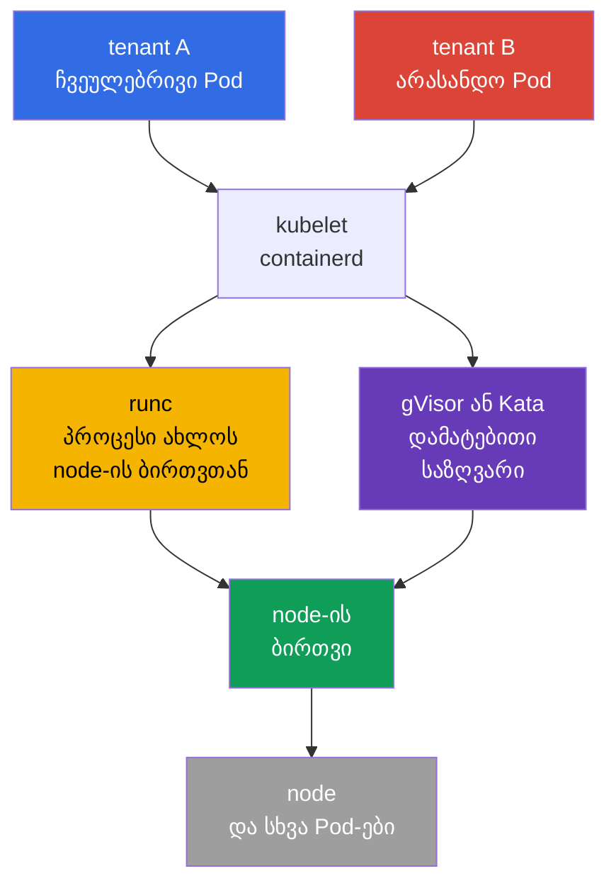
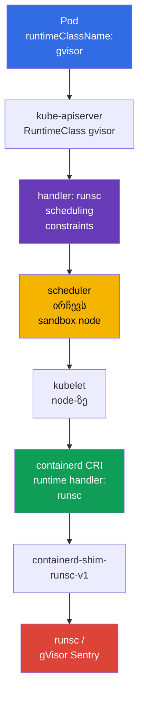

[Русская версия](ru.md) · [Eng version](README.md) · [Versión en español](es.md) · [Version française](fr.md) · [Deutsche Version](de.md) · [繁體中文版](tw.md) · [日本語版](jp.md)

# თავი 22. Container Runtime Sandbox: gVisor, Kata Containers და RuntimeClass

> **პრობლემა.** არასანდო tenant-ი, CI-job ან მომხმარებლის plugin-ი ჩვეულებრივ კონტეინერში
> იყენებს node-ის იმავე ბირთვს, რასაც kubelet და მეზობელი Pod-ები. ბირთვის/runtime-ის
> vulnerability-ი ან შემთხვევით დარჩენილი privilege-ი კოდის შესრულებას container escape-ად
> და host-თან ან სხვა tenant-ებთან წვდომად აქცევს. Sandboxed runtime-ი ასეთ workload-სა და
> ბირთვს შორის ცალკე საზღვარს ამატებს, დანარჩენ Pod policy-ებს არ ასუსტებს.

> **რა არის შემდეგ.** `securityContext`, Pod Security Admission და admission-policy-ი
> პროცესის privilege-ებს ამცირებს და საშიშ YAML-ს არ უშვებს, მაგრამ ჩვეულებრივი კონტეინერი
> მაინც node-ის ბირთვს იყენებს. არასანდო ან განსაკუთრებით ღირებული multi-tenant დატვირთვისთვის
> საჭიროა უფრო ძლიერი შესრულების საზღვარი: sandboxed runtime-ი. ამ თავში ვირჩევთ gVisor-ს
> (`runsc`) ან Kata Containers-ს, ვაერთებთ მათ containerd-თან `RuntimeClass`-ის მეშვეობით და
> ვამტკიცებთ, რომ Pod-ი ზუსტად sandbox-ში გაშვებულია და არა ჩვეულებრივი OCI runtime-ით.

> **რა უნდა იცოდეთ CKA-დან.** Pod-ი, `nodeSelector`, taints/tolerations და scheduling-ის
> დიაგნოსტიკა განხილულია [CKA-ს 16-ე თავში](../../../cka/course/16/ge.md),
> `securityContext` და least privilege - [CKA-ს 20-ე თავში](../../../cka/course/20/ge.md),
> ხოლო CRI, kubelet და containerd - [CKA-ს 40-ე თავში](../../../cka/course/40/ge.md). აქ
> ამ მექანიზმებს ვიყენებთ არასანდო workload-ის იზოლაციისთვის და არა მათი საფუძვლების გამეორებისთვის.

> 🧠 Sandbox-ი არასანდო დატვირთვისთვის kernel escape-ს ამცირებს, მაგრამ არ ანაცვლებს RBAC-ს, PSA-ს, `securityContext`-ს და NetworkPolicy-ს.

## 22.1. რატომ არ არის საკმარისი ჩვეულებრივი კონტეინერი multi-tenancy-სთვის

Container-ი იზოლირებს PID, mount, network და სხვა namespace-ებს, ხოლო cgroups რესურსებს
ზღუდავს. მაგრამ კონტეინერის პროცესი, ჩვეულებრივ, სისტემურად იმავე **Linux ბირთვს** უხმობს,
რასაც node-ის და მეზობელი Pod-ების პროცესები. ბირთვის, container runtime-ის vulnerability-ი
ან ცუდად გაცემული capability-ი კოდის შესრულებას container escape-ად შეიძლება აქციოს.

Single-tenant კლასტერში, გადამოწმებული image-ებით, ეს მისაღები რისკი შეიძლება იყოს.
Multi-tenancy-ში ნდობა სხვაგვარია: ერთ command-ს, customer workload-ს, CI-job-ს ან
მოწოდებულ plugin-ს არ უნდა ჰქონდეს ბირთვთან ისეთივე ახლო გზა, როგორიც platform-ის
სისტემურ კომპონენტებს. `privileged`, host namespace-ები, `hostPath`, Docker/containerd
socket-ი და ფართო RBAC-უფლებები ამასთან **sandbox-შიც კი** საშიშია.



Sandbox-ი დატვირთვასა და host-ს შორის შრეს ამატებს. ეს defence in depth-ია და არა
დანარჩენი control-ების შესუსტების უფლება:

| Control | რაზეა პასუხისმგებელი | Sandbox-ი მას არ ანაცვლებს |
|---|---|---|
| RBAC და ServiceAccount | ვის აქვს უფლება შექმნას ან შეცვალოს ობიექტი | sandbox-ი identity-ის API-წვდომას არ ზღუდავს |
| PSA / Kyverno / Gatekeeper | Pod-ის რომელი ველები დაშვებულია | sandbox-ს არ უნდა მიეღო `privileged` Pod-ი |
| `securityContext` | პროცესის UID, capability-ები, seccomp, filesystem | უსაფრთხო runtime-ი least privilege-ს არ აუქმებს |
| NetworkPolicy | ვისთან შეუძლია workload-ს კომუნიკაცია | runtime-ი ქსელურ allow-list-ს არ ადგენს |
| gVisor / Kata | საზღვარი workload-სა და ბირთვს/host-ს შორის | runtime-ი image-ს არ scan-ავს და ხელმოწერას არ ამოწმებს |

Runtime-ის შერჩევა workload-ის კლასის თვისებაა და არა მომხმარებლის. Platform team-ი
ქმნის RuntimeClass-ს, გამოყოფს თანხვედრ nodes-ს, აყალიბებს admission-policy-ს და
დაკვირვებას აწარმოებს. დეველოპერი მხოლოდ დაშვებულ `runtimeClassName`-ს მიუთითებს; მას
არ სჭირდება containerd-თან წვდომა ან SSH worker node-ზე.

> 🧠 gVisor userspace kernel-ს ამატებს, Kata - lightweight VM-ს guest kernel-ითა და უფრო ძლიერი იზოლაციით რესურსების ხარჯზე.

## 22.2. ორი მიდგომა: gVisor და Kata Containers

**gVisor** კონტეინერს `runsc`-ის მეშვეობით უშვებს. მისი userspace kernel-ი (`Sentry`)
სისტემურ ვიზოვების უმეტესობას იჭერს და userspace-ში ახორციელებს, ამცირებს host ბირთვის
პირდაპირ attack surface-ს. მხარდაჭერილი platform-ები - `systrap` (default) და `kvm`:
`systrap` - უნივერსალური default არჩევანი, ხოლო `kvm` მისადაგებულია, როცა ხელმისაწვდომია
hardware virtualization და თანხვედრი ინფრასტრუქტურა. `ptrace` - legacy platform-ია, არ
ხდება მისი მხარდაჭერა და დაგეგმილია მისი მოცილება; არ აირჩიოთ ის ახალი კონფიგურაციისთვის.
ეს ჩვეულებრივ ვირტუალურ მანქანაზე მსუბუქია, მაგრამ სავსებით ცალკე guest kernel-ი არ არსებობს.

**Kata Containers** Pod sandbox-ს lightweight VM-ში უშვებს: ცალკე guest kernel-ითა და
hypervisor საზღვრით. VM-ის შიგნით კონტეინერი guest kernel-ს ხედავს და არა node-ის kernel-ს.
საზღვარი უფრო ძლიერია და Linux სემანტიკა ჩვეულებრივ VM-ს მოგვაგონებს, თუმცა უფრო მაღალია
startup latency, memory-ის ხარჯი და ოპერაციული სირთულე; საჭიროა virtualization-ის
მხარდაჭერა node-ზე და cloud-ში.

| თვისება | ჩვეულებრივი `runc` | gVisor / `runsc` | Kata Containers |
|---|---|---|---|
| workload-ისთვის ხილული ბირთვი | host kernel | gVisor-ის userspace kernel host kernel-ის თავზე | VM-ის ცალკე guest kernel |
| იზოლაციის საზღვარი | namespace-ები/cgroups | syscall interception + sandbox | VM/hypervisor + guest kernel |
| density და start | საბაზისო ორიენტირი | ჩვეულებრივ კონტეინერთან უფრო ახლოს | ჩვეულებრივ უფრო ძვირი memory-ითა და start-ით |
| syscall/kernel feature-ების თანხვედრა | მაქსიმალური | შესაძლებელია მხარდაუჭერელი syscall-ები/feature-ები | ჩვეულებრივ VM-ს უფრო მოგვაგონებს, მაგრამ runtime-ზეც არის დამოკიდებული |
| ტიპური არჩევანი | trusted platform workload | არასანდო web/CI/multi-tenant code | ძლიერი იზოლაცია, მარეგულირებელი ან განსაკუთრებით რისკიანი workload |

Runtime-ის შეფასება მხოლოდ ცხრილით არ ჩაატაროთ. ტესტირება ჩაუტარეთ ნამდვილ image-ებს:
eBPF, FUSE, low-level network tools, nested container-ები, device plugin-ები, huge pages,
GPU და host mount-ები შესაძლოა თანხვედრი არ იყოს ან ცალკე design-ს მოითხოვდეს. sandbox-იდან
`runc`-ზე ჩუმად fallback დაუშვებელია: მაშინ დაპირებული საზღვარი ზუსტად იმ მომენტში
ქრება, როცა ის საჭიროა.

> 🎯 Pod-ი ირჩევს `RuntimeClass`-ს, ხოლო მისი CRI `handler` ზუსტად უნდა არსებობდეს სამიზნე node-ის კონფიგურაციაში.

## 22.3. როგორ ირჩევს Kubernetes runtime-ს: `RuntimeClass` და handler

`RuntimeClass` - Kubernetes-ის cluster-scoped API-ია. ის workload-ის გასაგებ სახელს
node-ის CRI კონფიგურაციის **handler**-თან აკავშირებს. მნიშვნელოვანია ამ სტრიქონების
გარჩევა:

- `metadata.name: gvisor` - სახელი, რომელსაც დეველოპერი `spec.runtimeClassName`-ში მიუთითებს;
- `handler: runsc` - containerd-ის CRI კონფიგურაციაში runtime-ის ზუსტი სახელი;
- `runtime_type: io.containerd.runsc.v1` - runtime-ის implementation containerd-ის
  კონფიგურაციაში; ეს RuntimeClass-ის სახელი არ არის.

API server არ ამოწმებს handler-ის არსებობას ყოველ node-ზე. შეცდომა გამოვლინდება, როცა
kubelet Pod-ის შექმნას ცდილობს. ამიტომ handler-ს, binary-ებს, shim-ს და თანხვედრ
nodes-ს workload-ის შექმნამდე ამზადებენ.



მინიმალური RuntimeClass უკვე დაყენებული `runsc`-სთვის:

```yaml
apiVersion: node.k8s.io/v1
kind: RuntimeClass
metadata:
  name: gvisor
handler: runsc
```

```bash
kubectl apply -f runtimeclass-gvisor.yaml
kubectl get runtimeclass
kubectl get runtimeclass gvisor -o yaml
```

`RuntimeClass` Namespace არ არის და runtime-ის გამოყენების უფლებას არ გასცემს.
RuntimeClass-ის შექმნა და შეცვლა მხოლოდ platform administrator-ებით შეზღუდეთ. თუ არ
უნდა შეეძლოს ყველა namespace-ს იზოლირებული ან ძვირადღირებული runtime-ის გაშვება,
შეზღუდეთ `runtimeClassName` admission-policy-ის მეშვეობით და გაანაწილეთ ის
platform-ის შაბლონით.

მაგალითად, ეს `ValidatingAdmissionPolicy` `gvisor`-ს მხოლოდ `tenant-a`-ში უშვებს.
Namespace-ის შეზღუდვა მხოლოდ მაგალითია: production-ში მას დაშვებულ namespace-ებთან
და, საჭიროებისას, ServiceAccount-თან აკავშირებენ. Policy-ს rollout-ის წინ server-side
გადაამოწმეთ:

```yaml
apiVersion: admissionregistration.k8s.io/v1
kind: ValidatingAdmissionPolicy
metadata:
  name: restrict-gvisor-runtimeclass
spec:
  matchConstraints:
    resourceRules:
    - apiGroups: [""]
      apiVersions: ["v1"]
      operations: ["CREATE", "UPDATE"]
      resources: ["pods"]
  validations:
  - expression: "!has(object.spec.runtimeClassName) || object.spec.runtimeClassName != 'gvisor' || object.metadata.namespace == 'tenant-a'"
    message: "runtimeClassName gvisor is allowed only in tenant-a"
---
apiVersion: admissionregistration.k8s.io/v1
kind: ValidatingAdmissionPolicyBinding
metadata:
  name: restrict-gvisor-runtimeclass
spec:
  policyName: restrict-gvisor-runtimeclass
  validationActions: [Deny]
```

```bash
kubectl apply -f restrict-gvisor-runtimeclass.yaml

# უარყოფითი შემოწმება: API server-მა Pod-ი scheduler-მდე უნდა უკუაგდოს.
kubectl -n tenant-b run gvisor-not-allowed \
  --image=nginxinc/nginx-unprivileged:1.30.4-alpine-slim \
  --restart=Never \
  --overrides='{"spec":{"runtimeClassName":"gvisor"}}' \
  --dry-run=server
# მოსალოდნელია: runtimeClassName gvisor is allowed only in tenant-a
```

> 🔬 `RuntimeClass.scheduling` Pod-ის constraints-ს აერთიანებს და sandbox workload-ს მომზადებულ pool-ზე მიმართავს.

## 22.4. Scheduling RuntimeClass-ში: `nodeSelector`, taints და tolerations

gVisor ან Kata ყველა node-ზე „ყოველ შემთხვევისთვის“ არ დააყენოთ. sandbox pool-ი
ცალკე გამოყავით: მასში საჭირო binary/shim, გადამოწმებული კონფიგურაცია, capacity და
observability არსებობს. ჩვეულებრივმა workload-ებმა ეს pool-ი შემთხვევით არ უნდა
დაისაკუთროს, ხოლო sandbox workload-ი საჭირო handler-ის არმქონე node-ზე არ უნდა მოხვდეს.

RuntimeClass-ს შესაძლოა `scheduling` ჰქონდეს. Kubernetes მის `nodeSelector`-სა და
`tolerations`-ს Pod-ს ამატებს, რომელიც ამ class-ს მიუთითებს. RuntimeClass-ის selector
და Pod-ის selector admission-ზე ერთიანდება: კონფლიქტური მნიშვნელობები API server-ის
მიერ Pod-ის უკუგდებამდე მიდის და არა `Pending`/`Unschedulable` მდგომარეობაში მიღებულ
Pod-ამდე. ამიტომ ასეთი შეცდომისას admission error-ს მოეძებნეთ და არა მხოლოდ
scheduler-ის Events-ს. Tolerations-ები ემატება, მაგრამ taint-ს არ ანაცვლებს - node
toleration-ის არმქონე Pod-ისთვის დახურული რჩება.

```bash
# Platform administrator-ი მხოლოდ მომზადებულ worker-ზე ასრულებს.
kubectl label node worker-sandbox sandbox.runtime/gvisor=true
kubectl taint node worker-sandbox sandbox.runtime/gvisor=true:NoSchedule
```

```yaml
apiVersion: node.k8s.io/v1
kind: RuntimeClass
metadata:
  name: gvisor
handler: runsc
scheduling:
  nodeSelector:
    sandbox.runtime/gvisor: "true"
  tolerations:
  - key: sandbox.runtime/gvisor
    operator: Equal
    value: "true"
    effect: NoSchedule
```

Pod-ი `runtimeClassName: gvisor`-ით ორივე scheduling constraint-ს ავტომატურად იღებს:

```yaml
apiVersion: v1
kind: Pod
metadata:
  name: untrusted-web
  namespace: tenant-a
spec:
  runtimeClassName: gvisor
  securityContext:
    runAsNonRoot: true
    seccompProfile:
      type: RuntimeDefault
  containers:
  - name: app
    image: nginxinc/nginx-unprivileged:1.30.4-alpine-slim
    ports:
    - containerPort: 8080
    securityContext:
      allowPrivilegeEscalation: false
      capabilities:
        drop: ["ALL"]
```

`nodeSelector`-ს და toleration-ს ყოველ Deployment-ში არ დააკოპირებთ, თუ ისინი
RuntimeClass-ში უკვე არსებობს: ეს ჭეშმარიტების ორ წყაროს ქმნის. Pod-level explicit
constraints მისაღებია მხოლოდ მაშინ, როცა ისინი შერჩევას ვიწროებენ, მაგალითად
architecture-ით ან zone-ით. თავიდან შედეგი Pod-ი და Event შეამოწმეთ:

```bash
kubectl -n tenant-a apply -f untrusted-web.yaml
kubectl -n tenant-a get pod untrusted-web -o wide
kubectl -n tenant-a get pod untrusted-web -o jsonpath='{.spec.runtimeClassName}{"\n"}'
kubectl -n tenant-a get pod untrusted-web -o jsonpath='{.spec.nodeSelector}{"\n"}'
kubectl -n tenant-a describe pod untrusted-web
```

### Kata RuntimeClass

Kubernetes-ისთვის Kata-ს დაყენების რეკომენდებული გზა Helm chart `kata-deploy`-ია: ის
runtime-ს node-ზე დისლოცირებს და RuntimeClass-ს ფაქტობრივი shim-ებისთვის ქმნის.
თანამედროვე runtime-rs release-ებში ასეთი class/handler სახელები
`kata-qemu-runtime-rs`-ს მოგვაგონებს; გამოიყენეთ სახელი, რომელიც chart-მა შექმნა და
არა ძველი მაგალითი სხვა distribution-იდან. Rollout-ის წინ სამიზნე node-ზე
`kubectl get runtimeclass` და `crictl info` გადაამოწმეთ.

ხელით კონფიგურაცია ქვემოთ - გამარტივებული ვარიანტია უკვე მომზადებული ცალკე
pool-ისთვის. მასში Kata class მსგავსად აწყობილია, ხოლო handler containerd-ს
ზუსტად უნდა ემთხვეოდეს. Class-ს არ დაარქმევთ `kata`, თუ node-ზე handler-ს
`kata-qemu` ეწოდება, სხვაგვარად კონფიგურაცია ბუნდოვანი გახდება. ერთ-ერთი გასაგები
ვარიანტი - იდენტური მოკლე სახელი:

```yaml
apiVersion: node.k8s.io/v1
kind: RuntimeClass
metadata:
  name: kata
handler: kata
scheduling:
  nodeSelector:
    sandbox.runtime/kata: "true"
  tolerations:
  - key: sandbox.runtime/kata
    operator: Equal
    value: "true"
    effect: NoSchedule
```

Kata pool-ისთვის წინასწარ გადაამოწმეთ, რომ hardware virtualization ხელმისაწვდომია
და hypervisor-ისთვის დაშვებული. Node-ის ჩვეულებრივი label-ი ამ შესაძლებლობას არ ქმნის.

> 🔬 gVisor binary-ს, shim-ს და containerd handler-ს თანხვედრი versions, service PATH და config გამოყოფილ pool-ზე სჭირდება.

## 22.5. gVisor-ის დაყენება და `runsc`-ის containerd-თან დაკავშირება

ქვემოთ - runbook გამოყოფილი Linux node-ისთვის containerd-ით. `runsc`-ის, shim-ის,
Kubernetes-ისა და containerd-ის versions წინასწარ ტესტირებული და Git/IaC-ში
დაფიქსირებული უნდა იყოს. Production runtime-ს `latest` ბრძანებით incident-ის
შუაში არ ჩაანაცვლებთ.

### 1. `runsc`-ისა და shim-ის დაყენება

gVisor binary-ს, shim-ს და sidecar binary-ების catalog-ს ერთი გადამოწმებული
version-ისა და node-ის architecture-ის შესატყვისი უნდა ჰქონდეს. სასურველი დაყენების
გზა - `runsc` package-ი ოფიციალური (ან დამტკიცებული internal) apt repository-იდან:
ის სრულ ფაილთა ნაკრებს თანმიმდევრულად აყენებს. ამ package-ს ხელით გადმოწერილ
shim-თან არ შეურიოთ.

Pinned manual installation-ისთვის გამოიყენეთ მიმდინარე `gvisor.tar.zstd` archive-ი
და არა ორი ცალკე binary-ის მოძველებული სქემა. Archive-ი `runsc`-ს, shim-ს და
`gvisor-bin/` catalog-ს შეიცავს; ბოლო `runsc`-ის მახლობლად უნდა დარჩეს, რადგან
runtime-ი მას sandbox-ის გაშვებისას იყენებს. ზუსტად დამტკიცებული release-ის
checksum/signature გადაამოწმეთ და ყველა ფაილი root-only უფლებებით გახსენით. ბრძანებები
დაყენების ფორმას აჩვენებს; `<VERSION>` და `<ARCH>` დამტკიცებული მნიშვნელობებით
ჩანაცვლდება.

```bash
VERSION="${VERSION:?set an approved gVisor version}"
ARCH=$(uname -m)
BASE_URL="https://storage.googleapis.com/gvisor/releases/release/${VERSION}/${ARCH}"

curl -fsSLO "${BASE_URL}/gvisor.tar.zstd"
curl -fsSLO "${BASE_URL}/gvisor.tar.zstd.sha512"
sha512sum -c gvisor.tar.zstd.sha512
mkdir gvisor
zstd -d -c gvisor.tar.zstd | tar -xf - -C gvisor
sudo install -d -o root -g root -m 0755 /usr/local/lib/gvisor
sudo cp -a gvisor/. /usr/local/lib/gvisor/
sudo ln -sf /usr/local/lib/gvisor/runsc /usr/local/bin/runsc
sudo ln -sf /usr/local/lib/gvisor/containerd-shim-runsc-v1 \
  /usr/local/bin/containerd-shim-runsc-v1

runsc --version
command -v containerd-shim-runsc-v1
ls -ld /usr/local/lib/gvisor/gvisor-bin
```

ნებისმიერ ვარიანტში shim-ის path containerd-ის systemd service-ის `PATH`-ში უნდა
იყოს; გადაამოწმეთ `systemctl show containerd -p Environment` და unit/drop-in.
Archive installation-ისთვის `runsc`-სა და `gvisor-bin/`-ის ურთიერთმდებარეობა
შეინარჩუნეთ და არ დააკოპიროთ ცალკე მხოლოდ `runsc`. Runtime-ი მხოლოდ
control-plane-ზე არ დააყენოთ, თუ Pod-ი workers-ზეა დაგეგმილი.

### 2. containerd-ის runtime handler-ის დამატება

თავიდან სამუშაო კონფიგურაცია დაარეზერვეთ და მისი header `version = ...` წაიკითხეთ.
vendor-managed `config.toml`-ს მთლიანად არ ჩაანაცვლებთ: CRI plugin-ის path-ს
**კონფიგურაციის ფაქტობრივი version-ის** მიხედვით ირჩევენ და არა containerd-ის
მხოლოდ major-version-ის მიხედვით.

```bash
sudo cp -a /etc/containerd/config.toml \
  "/etc/containerd/config.toml.before-runsc.$(date +%F-%H%M%S)"
containerd --version
sudo sed -n '1,180p' /etc/containerd/config.toml
```

თუ მიმდინარე header — `version = 2`, handler-ი ძველ CRI plugin path-ში დაამატეთ:

```toml
version = 2

[plugins."io.containerd.grpc.v1.cri".containerd.runtimes.runsc]
  runtime_type = "io.containerd.runsc.v1"
```

თუ მიმდინარე header — `version = 3` **ან** `version = 4`, ახალი runtime plugin
path-ი გამოიყენეთ (არსებულ ფაილში header-ს არ ცვლით):

```toml
# შეინარჩუნეთ მიმდინარე header: version = 3 ან version = 4.
[plugins.'io.containerd.cri.v1.runtime'.containerd.runtimes.runsc]
  runtime_type = "io.containerd.runsc.v1"
```

containerd 2.x config v2-ის მხარდაჭერას აგრძელებს; config v4 — actual version
containerd 2.3-ში, ხოლო ძველი config-ები გაშვებისას მიგრირდება. ამიტომ header-ს
runtime-ის დამატების მიზნით საკუთარი ინიციატივით არ ცვლით: თავიდან `version = ...`,
effective config-ი და თქვენი containerd distribution-ის documentation-ი
გადაამოწმეთ.

`default_runtime_name`-ს `runsc`-ზე არ ცვლით: სისტემურ DaemonSet-ებს, CNI-ს, CSI-ს
და გამართულ ჩვეულებრივ workload-ს `runc` შესაძლოა სჭირდებოდეს. RuntimeClass-მა
sandbox-ი აშკარად უნდა აირჩიოს.

TOML-ს გადაამოწმეთ და daemon-ს მხოლოდ change management-ის პროცედურის მიხედვით
გადატვირთეთ: containerd-ის restart ახალი კონტეინერების შექმნასა და node-ის
მუშაობას შეეხება. Production node-ზე თავიდან cordon/drain, DaemonSet-ისა და
PDB-ის გათვალისწინებით, შემდეგ გადამოწმებული კონფიგურაცია გამოიყენეთ.

```bash
sudo systemctl restart containerd
sudo systemctl is-active --quiet containerd && echo 'containerd: active'
sudo journalctl -u containerd -b --no-pager | tail -n 80
sudo crictl info | jq '.config.containerd.runtimes.runsc'
```

`crictl info`-მ `runsc`-ს `runtimeType` `io.containerd.runsc.v1`-ით უნდა აჩვენოს.
თუ handler-ი არ გამოჩნდა ან service active არ არის, გაჩერდით: RuntimeClass-ი
ამ ეტაპზე არ შექმნათ და workload-ი ამ node-ზე არ გადაიტანოთ.

> 🔬 Kata-ს თანხვედრი shim-ები, hypervisor, guest components, host virtualization და KVM/runtime-ის შემოწმება სჭირდება.

## 22.6. Kata Containers-ისა და containerd handler-ის დაყენება

Kata-ს არა მხოლოდ `containerd-shim-kata-v2` სჭირდება, არამედ შერჩეული hypervisor-ი,
kernel/rootfs და თანხვედრი host virtualization. სასურველია vendor-supported package
ან გადამოწმებული Kata release, cloned კონფიგურაციის management-ით ცალკე pool-ზე
დანერგილი. Binary-ს laptop-იდან production worker-ზე არ დააკოპირებთ.

### თავიდან — რას ვაწესრიგებთ ზუსტად

ეს **node**-ის, არა Pod-ის კონფიგურაციაა: სანამ Kubernetes-ს Pod-ის Kata-ში გაშვება
შესძლებოდეს, ყოველ სამიზნე node-ზე მთელი ჯაჭვი უნდა არსებობდეს:

`RuntimeClass.spec.handler` → CRI handler `containerd`-ში → Kata shim → შერჩეული
virtualization backend → guest kernel-ის მქონე lightweight VM.

- **Kata runtime / shim** — node-ის კომპონენტები, რომელთა მეშვეობითაც `containerd`
  sandbox VM-ს ქმნის; `containerd-shim-kata-v2` service `containerd`-სთვის
  ხელმისაწვდომი უნდა იყოს.
- **Backend (hypervisor)** — VM-ის მექანიზმი: ჩვეულებრივ QEMU/KVM, ხოლო ზოგიერთი
  Azure/Microsoft Hypervisor კონფიგურაციისთვის — Cloud Hypervisor `mshv`-ით.
- **CRI handler** — დასახელებული ჩანაწერი `config.toml`-ში, მაგალითად `kata` ან
  `kata-qemu`; ის `containerd`-ს ეუბნება, რომელი Kata runtime-ი გამოიძახოს. ეს Pod-ის
  სახელი და binary-ის სახელი არ არის.
- **RuntimeClass** — Kubernetes ობიექტი, რომელიც შემდგომ kubelet-ს ამ handler-ის
  ზუსტ სახელს გადასცემს. ის Kata-ს არ დააყენებს და node-ის კონფიგურაციას არ გამოასწორებს.

ამიტომ Pod-ის შექმნით არ დაიწყოთ. უსაფრთხო თანმიმდევრობა ასეთია:

1. აირჩიეთ დამტკიცებული Kata backend და შემდგომი handler სამიზნე node pool-ისთვის.
2. დააყენეთ Kata package **ყოველ** node pool-ის node-ზე და დაადასტურეთ binary,
   shim და backend.
3. არსებულ `config.toml`-ს დაუმატეთ **ერთი** fragment მისი მიმდინარე `version = ...`-ისთვის;
   ფაილს მთლიანად არ ჩაანაცვლებთ და header-ს მაგალითის გულისთვის არ ცვლით.
4. გადატვირთეთ `containerd` და `crictl info`-ს მეშვეობით დარწმუნდით, რომ handler-ი
   გამოჩნდა.
5. მხოლოდ შემდეგ შექმენით `RuntimeClass` იმავე handler-ით და გაუშვით canary Pod.

შემდეგ შემოწმებაში `KATA_BACKEND` — auto-detection არ არის. მიუთითეთ მნიშვნელობა,
რომელიც უკვე შერჩეულ RuntimeClass-ს/hypervisor-ს შეესატყვისება: `qemu-kvm`
QEMU/KVM-ისთვის ან `clh-azure` / `clh-azure-runtime-rs` Microsoft Hypervisor-ისთვის.
სხვა მოწყობილობის არსებობა წარმატებას არ ნიშნავს.
დაყენების შემდეგ გადაამოწმეთ ზუსტად runtime და virtualization backend და არა
მხოლოდ package-ის არსებობა:

```bash
command -v containerd-shim-kata-v2
kata-runtime --version
sudo kata-runtime check

# მიუთითეთ ფაქტობრივად შერჩეული RuntimeClass-ის/hypervisor-ის backend:
# qemu-kvm — QEMU/KVM; clh-azure ან clh-azure-runtime-rs — Microsoft Hypervisor.
KATA_BACKEND="${KATA_BACKEND:?set qemu-kvm, clh-azure, or clh-azure-runtime-rs}"
case "$KATA_BACKEND" in
  qemu-kvm)
    sudo test -c /dev/kvm && sudo test -r /dev/kvm || {
      echo 'ERROR: QEMU/KVM RuntimeClass requires accessible /dev/kvm' >&2
      exit 1
    }
    ls -l /dev/kvm
    ;;
  clh-azure|clh-azure-runtime-rs)
    sudo test -c /dev/mshv && sudo test -r /dev/mshv || {
      echo 'ERROR: clh-azure RuntimeClass requires accessible /dev/mshv' >&2
      exit 1
    }
    ls -l /dev/mshv
    ;;
  *)
    echo "ERROR: unsupported selected Kata backend: $KATA_BACKEND" >&2
    exit 2
    ;;
esac
```

`kata-runtime check` და `/dev/kvm` გავრცელებულ QEMU/KVM კონფიგურაციას ეხება.
საერთო კრიტერიუმია შერჩეული Kata RuntimeClass-ის/hypervisor-ის მიერ საჭირო
backend-ის არსებობა და მუშაობის შესაძლებლობა. Microsoft Hypervisor-ზე `/dev/mshv`
mshv-capable VMM-ით, მაგალითად Cloud Hypervisor `clh-azure`/`clh-azure-runtime-rs`-ისთვის,
— მხარდაჭერილი ალტერნატივაა; ამიტომ `/dev/kvm`-ის არარსებობა თავისთავად
უნივერსალური FAIL არ არის. Node-ს `sandbox.runtime/kata=true`-ით არ ნიშნავთ, სანამ
შერჩეული backend, nested virtualization (თუ საჭიროა) და instance type დადასტურებული
არ არის.

Container-ს ცალკე CRI handler სჭირდება. Table-ის შერჩევა header `version = ...`-ის
მიხედვით მოახდინეთ და არა containerd-ის მხოლოდ major-version-ის მიხედვით. Config
version 2-ისთვის ძველი CRI plugin path გამოიყენეთ:

```toml
version = 2

[plugins."io.containerd.grpc.v1.cri".containerd.runtimes.kata]
  runtime_type = "io.containerd.kata.v2"
  privileged_without_host_devices = true
```

Config version 3-ისთვის **ან** version 4-ისთვის ახალი runtime plugin path
გამოიყენეთ და არსებული header შეინარჩუნეთ:

```toml
# შეინარჩუნეთ მიმდინარე header: version = 3 ან version = 4.
[plugins.'io.containerd.cri.v1.runtime'.containerd.runtimes.kata]
  runtime_type = "io.containerd.kata.v2"
  privileged_without_host_devices = true
```

`privileged_without_host_devices = true` `privileged` Kata-კონტეინერს ყველა host
device-ს არ გადასცემს. ეს sandbox runtime handler-ისთვის აუცილებელია; მასით
default `runc`-ის settings-ს ცალკე compatibility review-ის გარეშე არ ჩაანაცვლებთ.

თანამედროვე Kata Containers-ში default runtime-ია runtime-rs, ხოლო Go runtime
deprecated-ია. `kata-runtime`-ის, shim-ისა და შერჩეული hypervisor-ის path-ები
დაყენების ხერხზეა დამოკიდებული; rollout-ის წინ ისინი თქვენი პლატფორმის
package/release-თან შეამოწმეთ და არა ძველი მაგალითის ვარაუდით.

Containerd-ის change/restart-ის შემდეგ handler-ი gVisor-ის მსგავსად გადაამოწმეთ:

```bash
sudo systemctl restart containerd
sudo systemctl is-active --quiet containerd && echo 'containerd: active'
sudo crictl info | jq '.config.containerd.runtimes.kata'
```

ზოგიერთ distribution-ზე package handler-ს სხვა სახელით ქმნის, მაგალითად
`kata-qemu`. ამ შემთხვევაში RuntimeClass-მა **ფაქტობრივი** handler სახელი
გამოიყენოს და არა სტატიის მაგალითი. Rollout-ის წინ `crictl info`, config.toml
და `RuntimeClass.spec.handler` შეამოწმეთ.

> 🏭 Canary representative Pod-ი და negative test fallback-ის გარეშე → application SLO → namespace policy; incompatibility-ს `privileged`-ით ან `runc`-ით არ გადუვლით.

## 22.7. Rollout: ერთი Pod-იდან namespace policy-მდე

Sandbox-ს შესაძლოა შეეცვალოს timing, filesystem semantics, network behavior და
resource-ის მოხმარება. უსაფრთხო rollout-ი ცალკე test namespace-ითა და ერთი
representative workload-ით იწყება.

1. **Node-ის შემოწმება.** Binary, shim, containerd handler, label და taint
   სამიზნე pool-ის ყოველ node-ზე უნდა იყოს.
2. **RuntimeClass-ის შექმნა.** Handler-ი და scheduling უკვე მუშა node-ის
   კონფიგურაციას უნდა ასახავდეს.
3. **Positive test-ის გაშვება.** `runtimeClassName`-ის მქონე non-privileged Pod-ი
   sandbox node-ზე `Running`-ად უნდა გახდეს.
4. **Negative test-ის შემოწმება.** Pod-ი, RuntimeClass-თან კონფლიქტური selector-ით,
   admission-ზე უკუგდებული უნდა იყოს. Handler-ის არმქონე node-ზე Pod-ი ჩუმად
   ჩვეულებრივ runtime-ზე არ უნდა გადავიდეს: მოსალოდნელია აშკარა
   `FailedCreatePodSandBox` და არა `runc`-ზე fallback.
5. **აპლიკაციის შემოწმება.** Readiness, egress, DNS, volumes, latency, shutdown
   და metrics SLO-ს უნდა შეესატყვისებოდეს.
6. **Scope-ის გაფართოება.** Deployment/Job canary-ით გადადის; admission policy-ი
   საშიშ combinations-ს და class-ის დაშვებული namespaces-ის გარეთ გამოყენებას
   კრძალავს.

Deployment-ს ჩვეულებრივ მხოლოდ ასე ცვლიან:

```yaml
apiVersion: apps/v1
kind: Deployment
metadata:
  name: report-worker
  namespace: tenant-a
spec:
  replicas: 2
  selector:
    matchLabels:
      app: report-worker
  template:
    metadata:
      labels:
        app: report-worker
    spec:
      runtimeClassName: gvisor
      securityContext:
        runAsNonRoot: true
        seccompProfile:
          type: RuntimeDefault
      containers:
      - name: worker
        image: registry.example.com/report-worker@sha256:<digest>
        securityContext:
          allowPrivilegeEscalation: false
          capabilities:
            drop: ["ALL"]
```

sandbox-ის incompatibility-ის „გამოსასწორებლად“ `hostNetwork`, `hostPID`, `hostIPC`,
`privileged`, hostPath ან device mount-ებს არ დაამატებთ. ეს ან threat model-ს
ანგრევს, ან იმას მიანიშნებს, რომ workload-ი უნდა გადამუშავდეს ან ცალკე trusted
pool-ში, აშკარად დოკუმენტირებული exception-ით, გაშვდეს.

> 🔬 `RuntimeClass.overhead`-ს კონკრეტული versions, node type-ისა და workload-ისთვის ზომავენ; შეცდომა pool-ს overflow-ავს ან capacity-ს კარგავს.

### Runtime overhead

`RuntimeClass.overhead` scheduler-ს ამცნობს Pod-ზე runtime-ის მიერ მოხმარებულ
დამატებით CPU/memory-ს. მნიშვნელობებს კონკრეტული version-ის, node type-ისა და
workload-ის benchmark-იდან იღებენ და არა შემთხვევითი ინტერნეტ-მაგალითიდან.
Overhead-ის გარეშე scheduler-ს sandbox node-ის overflow ძალუძს; overestimated
მნიშვნელობით capacity ეკარგება.

```yaml
apiVersion: node.k8s.io/v1
kind: RuntimeClass
metadata:
  name: kata
handler: kata
overhead:
  podFixed:
    memory: "<measured-memory-overhead>"
    cpu: "<measured-cpu-overhead>"
scheduling:
  nodeSelector:
    sandbox.runtime/kata: "true"
```

Overhead-ის ცვლილება ახალ Pod-ებზე და admission/scheduling-ზე მოქმედებს, ამიტომ
მას staging-ში resource requests/limits-თან და autoscaler behavior-თან ერთად
ამოწმებენ.

> 🎯 `runtimeClassName` intent-ს აჩვენებს; Pod/node CRI handler-ის/shim-ისა და workload-ის ფუნქციონალის მეშვეობით დაადასტურეთ.

## 22.8. შემოწმება: sandbox-ი ნამდვილად მუშაობს და არა უბრალოდ YAML-ში მითითებულია

`spec.runtimeClassName`-ის ერთი შემოწმება საკმარისი არ არის: ველი intent-ს
აჩვენებს და არა საჭირო runtime-ით გაშვების წარმატებას. მტკიცებულება სამ დონეზე
შეაგროვეთ: Kubernetes, CRI/containerd და workload-ის შიგნით. დიაგნოსტიკისთვის
დროებით შეინარჩუნეთ node name, runtime handler, Pod UID და დრო; ეს API ობიექტს
node-ის log-ებთან აკავშირებს.

```bash
NS=tenant-a
POD=untrusted-web

# 1. Kubernetes-ის intent-ი და placement-ი.
kubectl -n "$NS" get pod "$POD" -o wide
kubectl -n "$NS" get pod "$POD" \
  -o jsonpath='{.spec.runtimeClassName}{" node="}{.spec.nodeName}{" phase="}{.status.phase}{"\n"}'
kubectl -n "$NS" describe pod "$POD"

# 2. შერჩეულ node-ზე: CRI runtime და sandbox-ის შექმნის შეცდომები.
sudo crictl pods --name "$POD"
sudo crictl ps -a --name "$POD"
sudo crictl info | jq '.config.containerd.runtimes.runsc'
sudo journalctl -u containerd --since '15 minutes ago' --no-pager | \
  grep -Ei 'runsc|gvisor|kata|sandbox|error'
```

`crictl`-ის პარამეტრები და output-ის ფორმატი release-ზეა დამოკიდებული. თუ CRI
handler-ს პირდაპირ არ აჩვენებს, `crictl inspectp`-იდან sandbox/container
identifier-ი გამოიყენეთ და containerd/shim log-თან შეადარეთ. დასკვნა მხოლოდ
Pod-ის სახელით არ გამოაქვთ: მტკიცებულებაა fallback-ის გარეშე `runsc`-ის ან
`kata`-ის handler-ის მიერ sandbox-ის შექმნა.

### დაკვირვება Pod-ის შიგნიდან და host-ზე

ჩვეულებრივ container-ში `uname -a` ჩვეულებრივ node-ის kernel-ს აჩვენებს. gVisor-ში
syscall-ის შედეგები ვირტუალიზდება: `uname`, `/proc` და სხვა მონაცემები gVisor-specific
ან შეზღუდულ სურათს შესძლებთ დაანახოთ. Kata-ში პროცესი guest kernel-ს ხედავს,
ცალკე host-იდან. ეს ნიშნები სასარგებლოა, მაგრამ ისინი ერთადერთ security proof-ად
არ ჩაითვლება: output-ი version-ებს შორის შესაძლოა შეიცვალოს და implementation-ის
გამომზეურება მისი ვალდებულება არ არის.

```bash
# Sandbox Pod-ის შიგნით: workload view-ის დიაგნოსტიკური fingerprint-ი.
kubectl -n "$NS" exec "$POD" -- sh -c '
  echo "=== uname ==="; uname -a
  echo "=== pid 1 cgroup ==="; cat /proc/1/cgroup
  echo "=== mounts ==="; mount | head -n 20
  echo "=== dmesg (if permitted) ==="; dmesg 2>&1 | head -n 40 || true
'

# Host-ზე: host kernel-ი node-ის kernel-ი რჩება და არა Pod-ის guest/Sentry view.
uname -a
sudo journalctl -u containerd --since '15 minutes ago' --no-pager | tail -n 120
```

### როგორ შესაძლოა გამოიყურებოდეს `dmesg` gVisor Pod-ში

სასწავლო gVisor scenario-ში, წარმატებით გაშვებული Pod-ის შიგნით `dmesg` ასე
შესაძლოა გამოიყურებოდეს:

```text
$ dmesg
...
Starting gVisor
...
```

`...` სხვა log-ის სტრიქონებს ნიშნავს, რომლებიც მაგალითში განზრახ არ არის ჩვენებული.
`Starting gVisor` — სასარგებლო სასწავლო ნიშანია იმისა, რომ workload-ი gVisor
sandbox kernel-ს ხედავს. თუ `dmesg` კრძალულია ან marker არ არსებობს, Pod-ს ამ
სტრიქონისთვის დამატებით privileges არ მისცემთ: შეამოწმეთ `runtimeClassName`,
placement და handler.

ერთი სტრიქონი `Starting gVisor` production proof-ზე არ ექსტრაპოლირდება.
Production-ში RuntimeClass-ის, placement-ის, CRI handler-ის/shim log-ების და
application smoke test-ის კომბინაცია უფრო საიმედოა.

| დაკვირვება | რას ამტკიცებს | რას არ ამტკიცებს |
|---|---|---|
| `runtimeClassName: gvisor` Pod-ში | class-ის შერჩევის intent-ი | handler-ის არსებობას node-ზე |
| Pod `Running` sandbox node-ზე | scheduler-მა და kubelet-მა Pod-ი მიღეს | თავისთავად runtime-ის implementation-ს არ აჩვენებს |
| `crictl info` შეიცავს `runsc`/`kata`-ს | node handler-ისთვის configured-ია | რომ ეს კონკრეტული Pod-ი სხვაგვარად არ შეიქმნა |
| containerd/shim log Pod UID/container ID-ით | კონკრეტული sandbox საჭირო handler-ის მიერ შექმნილია | რომ აპლიკაცია ფუნქციონალურია |
| `uname`/`dmesg` შიგნით | workload view host-ისგან განსხვავებულია; სასარგებლო signal | isolation boundary-ის სრულ სისწორეს |
| `uname` და log-ები host-ზე | host-side context და runtime activity | Pod-ის guest/userspace kernel-ის შემცველობას |

> 🎯 დიაგნოსტიკა ჩაატარეთ class-ს, node placement-ს, handler-სა და `FailedCreatePodSandBox`-ს; `runtimeClassName`-ს არ წაშალოთ.

## 22.9. ტიპური ჩავარდნები და უსაფრთხო დიაგნოსტიკა

| სიმპტომი | სავარაუდო მიზეზი | შემოწმება და მოქმედება |
|---|---|---|
| Pod `Pending`, `didn't match Pod's node affinity/selector` | RuntimeClass-ის label-ის მქონე node არ არსებობს ან Pod-ის selector-ს კონფლიქტი აქვს | `kubectl describe pod`; შეადარეთ `spec.nodeSelector` და nodes-ის labels |
| Pod `Pending`, taint-ი not tolerated | Pod-მა RuntimeClass-ის toleration არ მიიღო ან არ ემთხვევა | გადაამოწმეთ `kubectl get runtimeclass -o yaml`, `kubectl describe node` |
| `FailedCreatePodSandBox`, unknown runtime handler | handler-ის block-ი არ არსებობს, სახელი შეცდომითია ან containerd ხელახლა არ არის წაკითხული | შეადარეთ `RuntimeClass.handler`, config.toml, `crictl info`; გამოასწორეთ და runbook-ის მიხედვით გადატვირთეთ |
| `executable file not found` shim-ისთვის | shim დაუყენებელია ან containerd service-ის PATH-ის გარეთაა | გადაამოწმეთ `command -v`, permissions და systemd Environment |
| gVisor Pod-ი იშვება, აპლიკაცია ტყდება | syscall, mount ან network feature მხარდაუჭერელია/სხვაგვარად ხორციელდება | minimal reproducer, runtime docs, გამოასწორეთ app ან აირჩიეთ სხვა დამტკიცებული runtime |
| Kata არ იშვება | არ ხელმისაწვდომია შერჩეული RuntimeClass-ის backend, nested virtualization, hypervisor/kernel config ან capacity | `kata-runtime check`, QEMU/KVM-ისთვის — `/dev/kvm`, Microsoft Hypervisor-ისთვის — `/dev/mshv` და mshv-capable VMM, cloud instance capabilities, shim-ის log-ები |
| Pod-ი ჩვეულებრივ node-ზე მოხვდა | RuntimeClass-ს `scheduling` არ აქვს, pool tainted არ არის ან სხვა class მითითებული | გადაამოწმეთ class, node name, labels/taints; ეს sandbox rollout-ად არ ჩათვალოთ |

`FailedCreatePodSandBox`-ს `runtimeClassName`-ის წაშლით არ „ცურავთ“: ეს security
failure-ს შეუმჩნეველ downgrade-ად აქცევს. Workload-ი გაჩერებული დარჩეს, სანამ
platform team სხვა დაშვებულ RuntimeClass-ს ან ცალკე risk acceptance-ს არ
დაადასტურებს.

> 🏭 გამოყოფილი pool, compatibility matrix, გაზომილი overhead, alerting და controlled upgrades sandbox runtime-ისთვის.

## 22.10. როგორ იყენებენ ამას production-ში

- **Pool-ის გამოყოფა ნდობის მიხედვით.** gVisor/Kata nodes-ები sandbox workload-ს
  მხოლოდ RuntimeClass scheduling-ის, label-ისა და `NoSchedule` taint-ის მეშვეობით
  იღებენ; სისტემური agents და trusted workloads ცალკე ცხოვრობს.
- **Default `runc`-ის შენარჩუნება.** მთელი platform-ის ახალ runtime-ზე გადასვლა
  compatibility matrix-ის გარეშე blast radius-ს ზრდის. Sandbox-ს class-ის მიხედვით
  და canary-ით ჩართავენ.
- **Handler-ის ჩართვა როგორც კონტრაქტი.** Binary-ების, shim-ის, containerd config-ისა
  და RuntimeClass-ის versions ერთი reviewed change-ით იცვლება. `runsc`, `kata` და
  `kata-qemu` სახელების შემთხვევითი განსხვავება - outages-ის წყაროა.
- **საშიში combinations-ის კრძალვა.** PSA/admission-policy-ს არ უნდა შეეშვას
  `privileged`, host namespaces, hostPath/socket mounts და ფართო exemptions
  tenant namespace-ში, RuntimeClass-ისგან დამოუკიდებლად.
- **Capacity-ის გათვალისწინება.** გაზომეთ runtime overhead, startup latency,
  density, node pressure და cold-start. Kata pool-ს ხშირად ცალკე autoscaling
  profile სჭირდება.
- **საზღვრის monitoring-ი.** Alert `FailedCreatePodSandBox`-ზე, containerd/shim
  errors-ზე, sandbox node NotReady-ზე, startup latency-ის ზრდაზე და pool-ის
  გარეთ მოულოდნელ placement-ზე.
- **Upgrade-ების დაგეგმვა.** Host kernel-ის, containerd-ის, gVisor/Kata-ისა და
  Kubernetes-ის upgrade ერთი compatibility matrix-ის სახით ტესტირდება. Drain-ის
  წინ PDB გადაამოწმეთ და node-ი scheduling-იდან გამოიტანეთ, ხოლო runtime-ს
  აქტიური tenant Pod-ების ქვეშ ბლაინდად არ განაახლებთ.

## 22.11. როგორ გამოგადგება ეს: გამოცდაზე და ნამდვილ სამუშაოში

- **გამოცდაზე.** საჭიროა `RuntimeClass`, CRI handler და `runtime_type`-ის
  გარჩევა, Pod-ის მომზადებულ sandbox pool-ზე `scheduling`-ის, labels-ის, taints-ისა
  და tolerations-ის მეშვეობით მიმართვა, ასევე `FailedCreatePodSandBox`-ის
  დიაგნოსტიკა `runc`-ზე უსაფრთხოების დარღვევის fallback-ის გარეშე.
- **ნამდვილ სამუშაოში.** ეს უნარები საშუალებას გვაძლევს, არასანდო tenant-,
  CI- და plugin-workload-ები ვიზოლიროთ, gVisor ან Kata უსაფრთხოდ canary-ით
  გავშვათ, overhead გავითვალისწინოთ და runtime დავადასტუროთ Kubernetes-ის,
  CRI/containerd-ის და application smoke test-ის მონაცემებით.

## 22.12. მინი-გლოსარი

- **Container runtime sandbox** - runtime, რომელიც workload-სა და host kernel-ს
  შორის საზღვარს ამატებს.
- **gVisor** - sandbox runtime userspace kernel-ით; CRI handler-ს ხშირად `runsc`
  ეწოდება.
- **`runsc`** - gVisor-ის OCI runtime და ამ მაგალითში handler-ის სახელი.
- **Kata Containers** - runtime, რომელიც Pod sandbox-ს guest kernel-ის მქონე
  lightweight VM-ში უშვებს.
- **RuntimeClass** - Kubernetes-ის cluster-scoped resource, რომელიც CRI handler-ს
  და, სურვილისამებრ, overhead/scheduling constraints-ს ირჩევს.
- **handler** - runtime-ის სახელი CRI კონფიგურაციაში, რომელიც
  `RuntimeClass.spec.handler`-ს ზუსტად უნდა ემთხვეოდეს.
- **shim** - containerd-ის პროცესი/binary, რომელიც containerd-ს კონკრეტულ runtime-ს
  აკავშირებს.
- **sandbox pool** - გამოყოფილი nodes-ები მომზადებული runtime-ით, label-ით,
  taint-ითა და capacity-ით.
- **runtime overhead** - ფიქსირებული დამატებითი CPU/memory, რომელს scheduler
  შერჩეული RuntimeClass-ის Pod-ისთვის ითვალისწინებს.

## 22.13. თავის შეჯამება

- ჩვეულებრივი კონტეინერები node-ის kernel-ს იზიარებენ; არასანდო multi-tenant
  დატვირთვისთვის gVisor ან Kata მნიშვნელოვან დამატებით საზღვარს ამატებს, მაგრამ
  RBAC-ს, PSA-ს, `securityContext`-სა და NetworkPolicy-ს არ ანაცვლებს.
- gVisor (`runsc`) სისტემურ ვიზოვებს userspace kernel-ის მეშვეობით იჭერს; Kata
  lightweight VM-სა და guest kernel-ს იყენებს. არჩევანს threat model-ი,
  compatibility და SLO განსაზღვრავს.
- `RuntimeClass.metadata.name`, `spec.handler` და `containerd runtime_type` -
  სახელდების სხვადასხვა დონეა. Handler-ი ყოველი სამიზნე node-ის CRI
  კონფიგურაციას ზუსტად უნდა ემთხვეოდეს.
- `RuntimeClass.scheduling` `nodeSelector`-ითა და tolerations-ით labels/taints-თან
  ერთად sandbox workload-ს მომზადებულ node pool-ზე ზღუდავს.
- Containerd-ისთვის საჭიროა თანხვედრი binary და shim, handler config.toml-ში და
  daemon-ის controlled restart/verification. Default `runc` მიზეზის გარეშე
  არ იცვლება.
- შემოწმებამ Pod class-ი და node-ი CRI/containerd log-ებში handler/shim-თან უნდა
  დააკავშიროს და მერე workload view და application behavior დაადასტუროს; მხოლოდ
  `runtimeClassName` საკმარისი არ არის.
- `runtimeClassName`-ის ჩუმად წაშლა ჩავარდნის შემდეგ დაუშვებელია. ეს security
  downgrade-ია, რომელიც აშკარა გადაწყვეტილებას და კომპენსირებულ controls-ს
  მოითხოვს.

## 22.14. თვითშემოწმების კითხვები

<details>
<summary>1. რატომ არ აქცევს namespaces-ი და cgroups-ი ჩვეულებრივ container-ს არასანდო tenant-ისთვის სრულფასოვან kernel security boundary-ად?</summary>

ჩვეულებრივი container-ი namespaces-ს იზოლირებს და cgroups-ის მეშვეობით რესურსებს ზღუდავს, მაგრამ მისი პროცესი ჩვეულებრივ იმავე Linux kernel-ს იძახებს, რასაც node-ი და მეზობელი Pod-ები. Kernel-ის/runtime-ის vulnerability-ი ან ცუდი capability-ი container escape-ად შესაძლოა გახდეს. არასანდო tenant-ისთვის საჭიროა gVisor-ის ან Kata-ს დამატებითი საზღვარი, სხვა controls-თან ერთად.
</details>

<details>
<summary>2. რაშია ძირეული განსხვავება gVisor-ის userspace kernel-სა და Kata-ს guest kernel-ს შორის?</summary>

gVisor `runsc` syscall-ების უმეტესობას იჭერს და userspace kernel Sentry-ის მეშვეობით ახორციელებს host kernel-ის თავზე. Kata Pod sandbox-ს lightweight VM-ში უშვებს, სადაც workload-ი ცალკე guest kernel-ს და hypervisor საზღვარს ხედავს. Kata ჩვეულებრივ უფრო ძლიერ, VM-ისთვის დამახასიათებელ იზოლაციას იძლევა, მაგრამ virtualization-ს მოითხოვს და memory-ითა და startup-ით უფრო ძვირია.
</details>

<details>
<summary>3. რითი განსხვავდება `RuntimeClass.metadata.name`, `handler` და containerd-ის `runtime_type`?</summary>

`metadata.name`, მაგალითად `gvisor`, — Pod-ის `spec.runtimeClassName`-ისთვის მნიშვნელობაა. `handler`, მაგალითად `runsc`, node-ის CRI კონფიგურაციაში runtime-ის სახელს ზუსტად უნდა ემთხვეოდეს. `runtime_type`, მაგალითად `io.containerd.runsc.v1`, — runtime-ის implementation containerd-ის კონფიგურაციაში და RuntimeClass-ის სახელი არ არის.
</details>

<details>
<summary>4. რატომ არ შესძლია API server-ს დარწმუნება, რომ handler-ი შერჩეულ node-ზე ხელმისაწვდომია?</summary>

API server RuntimeClass-ს ინახავს, მაგრამ binary-ს, shim-სა და CRI handler-ს ყოველ node-ზე არ ამოწმებს. შეცდომა გამოვლინდება, როცა kubelet sandbox-ის შექმნას ცდილობს, მაგალითად `FailedCreatePodSandBox`-ის ან unknown runtime handler-ის სახით. ამიტომ handler-ს და თანხვედრ pool-ს workload-ის შექმნამდე ამზადებენ და ამოწმებენ.
</details>

<details>
<summary>5. როგორ ურთიერთქმედებს `RuntimeClass.scheduling.nodeSelector` და tolerations sandbox node pool-ის labels-სა და taints-თან?</summary>

RuntimeClass Pod-ს, რომელიც მას მიუთითებს, საკუთარ `nodeSelector`-სა და tolerations-ს ამატებს. Selector-ი მომზადებული sandbox node-ის label-ს უნდა ემთხვეოდეს, ხოლო toleration-ი `NoSchedule` taint-ის გავლას აძლევს; taint-ი toleration-ის არმქონე Pod-ისგან დაცვად რჩება. RuntimeClass-ის selector-ისა და Pod-ის selector-ის კონფლიქტი admission-ზე უკუიგდობა და არა Pending-ად იქცევა.
</details>

<details>
<summary>6. რატომაა საშიში `runsc`-ის default runtime-ად მთელი კლასტერისთვის დაყენება compatibility testing-ის გარეშე?</summary>

სისტემურ DaemonSet-ებს, CNI-ს, CSI-სა და ჩვეული workload-ს შესაძლოა ისეთი feature-ები სჭირდებოდეს, რომლებსაც sandbox-ი სხვაგვარად ახორციელებს ან საერთოდ არ უჭერს მხარს. თავი მოითხოვს default `runc`-ის შენარჩუნებას და sandbox-ის აშკარა შერჩევას RuntimeClass-ის მეშვეობით თანხვედრი canary pool-ისთვის. სხვაგვარად blast radius მთელ platform-ს დააფარებს.
</details>

<details>
<summary>7. gVisor-ისა და containerd-ისთვის რომელი ფაილები/binary-ები უნდა იქნეს თანხვედრი?</summary>

თანხვედრი უნდა იქნეს `runsc`-ის, `containerd-shim-runsc-v1`-ისა და `gvisor-bin/` catalog-ის გადამოწმებული versions; archive install-ისას `runsc`-თან მათი ურთიერთმდებარეობა შენარჩუნებული უნდა იქნეს. Shim containerd-ის systemd service-ის `PATH`-ში უნდა იმყოფებოდეს. `config.toml`-ში handler `runsc`-მა `runtime_type = "io.containerd.runsc.v1"`-ს containerd-ის თაობის სწორი plugin path-ის მიხედვით უნდა უჩვენოს.
</details>

<details>
<summary>8. რატომ არ არის `runtimeClassName: gvisor` და `Running` sandbox execution-ის სრული მტკიცებულება?</summary>

ველი განზრახვას აჩვენებს, ხოლო `Running` ამტკიცებს, რომ scheduler-მა და kubelet-მა Pod-ი მიღეს, მაგრამ კონკრეტული sandbox-ის implementation-ს არ აჩვენებს. საჭიროა placement sandbox node-ზე, CRI კონფიგურაცია და containerd/shim log-ები, Pod UID-თან ან container ID-თან დაკავშირებული, სადაც `runsc`/Kata handler ჩანს. ამის შემდეგ workload view და application smoke test დამტკიცდება.
</details>

<details>
<summary>9. რას ნიშნავს, თუ `uname` Kata Pod-ის შიგნით host-ის `uname`-ისგან განსხვავდება, და რატომ არ არის ეს საკმარისი როგორც ერთადერთი მტკიცებულება?</summary>

ეს სასარგებლო ნიშანია, რომ workload-ი node-ის kernel-ისგან ცალკე guest kernel-ს ხედავს. თუმცა output-ი runtime-ის version-ზეა დამოკიდებული და თავისთავად კონკრეტულ Pod-ს საჭირო CRI handler-თან არ აკავშირებს. საიმედო evidence RuntimeClass-ს, node-ს, containerd/shim log-ებსა და აპლიკაციის ფუნქციონალურ შემოწმებას ერთიანად აერთიანებს.
</details>

<details>
<summary>10. **Flashback (10-ე თავი).** gVisor/Kata (ეს თავი) tenant-ს kernel syscall surface-ის დონეზე იზოლირებს. RBAC (10-ე თავი) tenant-ს Kubernetes API access-ის დონეზე იზოლირებს. Multi-tenant კლასტერისთვის, არასანდო namespace-ებით, მოგვიყევანეთ კონკრეტული attack scenario, რომელსაც ამ ორი დონიდან მხოლოდ ერთი აჩერებს და მეორე - არა.</summary>

RBAC-ს ძალუძს tenant ServiceAccount-ს აუკრძალოს სხვა namespace-ის Secrets-ის წაკითხვა ან privileged Pod-ის შექმნა, მაგრამ ვერ შეაჩერებს syscall exploit-ს უკვე გაშვებულ, დაშვებულ container-ში; აქ sandbox-ია სასარგებლო. და პირიქით, gVisor/Kata identity-ს არ უკრძალავს დაშვებული `get secrets` API-ის მეშვეობით შესრულება ან საკუთარი Deployment-ის შეცვლა. ამიტომ API least privilege-ი და kernel isolation-ი სხვადასხვა attack path-ს ხურავს.
</details>

<details>
<summary>11. რატომაა `runtimeClassName`-ის წაშლა სისწრაფის აღდგენის მიზნით security downgrade?</summary>

ველის წაშლა workload-ს დაპირებული sandbox საზღვრიდან ჩვეულებრივ runtime-ზე გადაჰყავს, ანუ დაცვას ზუსტად compatibility problem-ის დროს აშორებს. თავი პირდაპირ კრძალავს ასეთ ჩუმ fallback-ს: Pod-ი გაჩერებული უნდა დარჩეს, სანამ platform team სხვა დაშვებულ RuntimeClass-ს ან ცალკე risk acceptance-ს არ დაადასტურებს. სხვაგვარად recovery უსაფრთხოების დაცემას ჰმალავს.
</details>

## პრაქტიკა

წვრთენით RuntimeClass, `runsc`, scheduling და sandbox-ის შემოწმება
[ლაბ 110-ში - gVisor, Cilium და Istio](../../labs/110/README_GE.MD). დააყენეთ
`runsc` მომზადებულ node-ზე, შექმენით `RuntimeClass` `gvisor` handler `runsc`-ით,
იზოლირეთ node label/taint-ით, გადაიტანეთ workload namespace `team-purple`-ში
ამ class-ზე და დაადასტურეთ placement. სასწავლო scenario-სთვის შეინარჩუნეთ
წარმატებით გაშვებული Pod-ის `dmesg` საჭირო artefact-ში და შეადარეთ host/containerd-ის
მონაცემებს.

🌐 დამატებითი ინტერაქტიული პრაქტიკა (killer.sh/killercoda, გარეგანი resource): [sandbox-gvisor](https://killercoda.com/killer-shell-cks/scenario/sandbox-gvisor)

სასარგებლო ოფიციალური საცნობარო მასალები: [RuntimeClass](https://kubernetes.io/docs/concepts/containers/runtime-class/),
[RuntimeClass scheduling](https://kubernetes.io/docs/concepts/containers/runtime-class/#scheduling),
[gVisor](https://gvisor.dev/docs/), [gVisor containerd-თან](https://gvisor.dev/docs/user_guide/containerd/)
და [Kata Containers](https://katacontainers.io/).

---
[სარჩევი](../README_GE.md) · [თავი 21](../21/ge.md) · [თავი 23](../23/ge.md)
