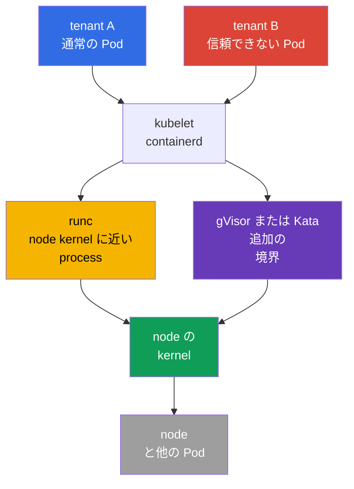
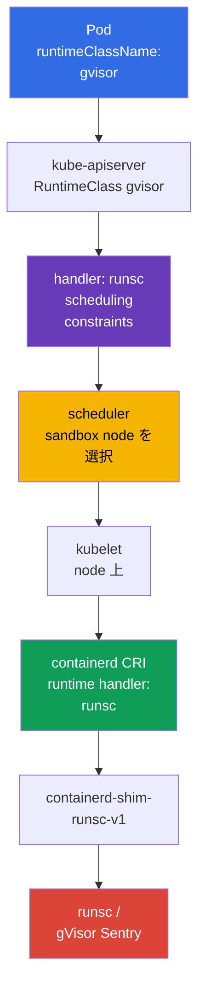

[Русская версия](ru.md) · [Eng version](README.md) · [Versión en español](es.md) · [Version française](fr.md) · [Deutsche Version](de.md) · [ქართული ვერსია](ge.md) · [繁體中文版](tw.md)

# 第22章. Container Runtime Sandbox: gVisor、Kata Containers と RuntimeClass

> **課題。** 信頼できない tenant、CI-job、または user plugin は、通常の container 内で kubelet や隣接する Pod と同じ node kernel を使用します。kernel/runtime の脆弱性や誤って残された privilege は、code execution を container escape に変え、host や他の tenant へのアクセスを許してしまう可能性があります。Sandboxed runtime は、このような workload と kernel の間に別個の境界を追加しますが、他の Pod policy を弱めるわけではありません。

> **この後。** `securityContext`、Pod Security Admission、admission-policy は process の privilege を減らし危険な YAML を通しませんが、通常の container は依然として node kernel を使用します。信頼できない、または特に価値の高い multi-tenant workload には、より強力な実行境界、sandboxed runtime が必要です。この章では gVisor（`runsc`）または Kata Containers を選び、`RuntimeClass` を通じて containerd に接続し、Pod が通常の OCI runtime ではなく実際に sandbox で実行されていることを証明します。

> **CKA で必要な知識。** Pod、`nodeSelector`、taints/tolerations と scheduling の診断は[CKA 第16章](../../../cka/course/16/jp.md)、`securityContext` と least privilege は[CKA 第20章](../../../cka/course/20/jp.md)、CRI、kubelet、containerd は[CKA 第40章](../../../cka/course/40/jp.md)で扱います。ここではこれらの mechanism を信頼できない workload の isolation に使用し、基礎の繰り返しはしません。

> 🧠 Sandbox は信頼できない workload の kernel escape を減らしますが、RBAC、PSA、`securityContext`、NetworkPolicy を置き換えません。

## 22.1. なぜ multi-tenancy には通常の container で不十分なのか

Container は PID、mount、network などの namespaces を isolate し、cgroups は resource を制限します。しかし container の process は通常、node や隣接する Pod の process と**同じ Linux kernel** を system call します。kernel、container runtime の脆弱性、または誤って付与された capability は、code execution を container escape に変える可能性があります。

検証済みの image を使う single-tenant cluster では、これは許容できる risk かもしれません。multi-tenancy では信頼のモデルが異なります。一つの team、customer workload、CI-job、あるいは supplied plugin が、platform の system component と同じくらい kernel に近い path を得るべきではありません。`privileged`、host namespaces、`hostPath`、Docker/containerd socket、広範な RBAC 権限は、それでも **sandbox 内でさえ** 危険なままです。



Sandbox は workload と host の間に layer を追加します。これは defence in depth であり、他の control を弱めてよいという許可ではありません。

| Control | 責務 | Sandbox が代替しないもの |
|---|---|---|
| RBAC と ServiceAccount | 誰が object を作成・変更できるか | sandbox は identity の API access を制限しない |
| PSA / Kyverno / Gatekeeper | Pod のどの field が許可されるか | sandbox は `privileged` Pod を受け入れるべきではない |
| `securityContext` | process の UID、capabilities、seccomp、filesystem | 安全な runtime は least privilege を無効にしない |
| NetworkPolicy | workload が誰と通信できるか | runtime は network allow-list を定めない |
| gVisor / Kata | workload と kernel/host の境界 | runtime は image をスキャンせず署名も検証しない |

runtime の選択は user の特性ではなく、workload class の特性です。Platform team が RuntimeClass を作成し、互換性のある nodes を割り当て、admission-policy を設定し、それらを観察します。Developer は許可された `runtimeClassName` を指定するだけで済み、containerd への access や worker node への SSH は不要です。

> 🧠 gVisor は userspace kernel を追加し、Kata は guest kernel を持つ lightweight VM でより強い isolation を、resource を対価として提供します。

## 22.2. 二つのアプローチ: gVisor と Kata Containers

**gVisor** は `runsc` を通じて container を実行します。その userspace kernel（`Sentry`）は system call の大部分を intercept し、userspace で実装することで host kernel への直接的な attack surface を減らします。support される platform は `systrap`（default）と `kvm` です。`systrap` は default の汎用的な選択であり、`kvm` は hardware virtualization が利用可能で互換性のある infrastructure がある場合に適しています。`ptrace` は legacy platform で、もはや support されておらず削除が予定されています。新しい configuration にはこれを選ばないでください。これは通常 virtual machine より軽量ですが、完全に分離された guest kernel ではありません。

**Kata Containers** は Pod sandbox を lightweight VM 内で実行します。分離された guest kernel と hypervisor boundary を持ちます。VM 内の container は node の kernel ではなく guest kernel を見ます。境界はより強く、Linux semantics は通常の VM に近くなりますが、startup latency、memory 消費、運用の複雑さが増します。node とクラウドで virtualization の support が必要です。

| 特性 | 通常の `runc` | gVisor / `runsc` | Kata Containers |
|---|---|---|---|
| workload に見える kernel | host kernel | host kernel の上の gVisor userspace kernel | 分離された guest kernel VM |
| isolation boundary | namespaces/cgroups | syscall interception + sandbox | VM/hypervisor + guest kernel |
| 密度と起動 | baseline 基準 | 通常 container に近い | 通常 memory と起動でコストが高い |
| syscall/kernel feature の互換性 | 最大 | support されない syscalls/features がありうる | 通常 VM に近いが runtime による |
| 典型的な選択 | trusted platform workload | untrusted web/CI/multi-tenant code | 強い isolation、regulatory または特にリスクの高い workload |

runtime を table だけで評価してはいけません。実際の image をテストしてください。eBPF、FUSE、low-level network tools、nested containers、device plugins、huge pages、GPU、host mounts は互換性がない、または別の design が必要な場合があります。sandbox から `runc` へ silent に fallback してはいけません。それでは、まさに必要な瞬間に宣言された境界が消えてしまいます。

> 🎯 Pod は `RuntimeClass` を選択し、その CRI `handler` は対象 node の configuration に正確に存在する必要があります。

## 22.3. Kubernetes が runtime を選ぶ方法: `RuntimeClass` と handler

`RuntimeClass` は cluster-scoped の Kubernetes API です。それは分かりやすい workload 名を、node 上の CRI configuration の **handler** に結び付けます。以下の文字列を区別することが重要です。

- `metadata.name: gvisor` - developer が `spec.runtimeClassName` で指定する名前です。
- `handler: runsc` - containerd の CRI configuration における runtime の正確な名前です。
- `runtime_type: io.containerd.runsc.v1` - containerd の configuration における runtime の implementation です。これは RuntimeClass の名前ではありません。

API server は各 node に handler が存在することを check しません。error は kubelet が Pod を作成しようとしたときに現れます。そのため handler、binary、shim、互換性のある nodes は workload の作成前に準備します。



既にインストール済みの `runsc` 用の最小 RuntimeClass。

```yaml
apiVersion: node.k8s.io/v1
kind: RuntimeClass
metadata:
  name: gvisor
handler: runsc
```

```bash
kubectl apply -f runtimeclass-gvisor.yaml
kubectl get runtimeclass
kubectl get runtimeclass gvisor -o yaml
```

`RuntimeClass` は Namespace ではなく、runtime を使用する権利を与えるものでもありません。RuntimeClass の作成と変更は platform administrators だけに制限してください。すべての namespace が isolated または高価な runtime を実行すべきというわけではない場合、`runtimeClassName` を admission-policy で制限し、platform template で割り当ててください。

例えば、この `ValidatingAdmissionPolicy` は `gvisor` を `tenant-a` だけで許可します。namespace の制限は単なる例です。production ではそれを承認された namespace、必要なら ServiceAccount と結び付けます。rollout 前に policy を server-side で確認してください。

```yaml
apiVersion: admissionregistration.k8s.io/v1
kind: ValidatingAdmissionPolicy
metadata:
  name: restrict-gvisor-runtimeclass
spec:
  matchConstraints:
    resourceRules:
    - apiGroups: [""]
      apiVersions: ["v1"]
      operations: ["CREATE", "UPDATE"]
      resources: ["pods"]
  validations:
  - expression: "!has(object.spec.runtimeClassName) || object.spec.runtimeClassName != 'gvisor' || object.metadata.namespace == 'tenant-a'"
    message: "runtimeClassName gvisor is allowed only in tenant-a"
---
apiVersion: admissionregistration.k8s.io/v1
kind: ValidatingAdmissionPolicyBinding
metadata:
  name: restrict-gvisor-runtimeclass
spec:
  policyName: restrict-gvisor-runtimeclass
  validationActions: [Deny]
```

```bash
kubectl apply -f restrict-gvisor-runtimeclass.yaml

# 否定的な確認: API server はスケジューラより前に Pod を拒否するはずです。
kubectl -n tenant-b run gvisor-not-allowed \
  --image=nginxinc/nginx-unprivileged:1.30.4-alpine-slim \
  --restart=Never \
  --overrides='{"spec":{"runtimeClassName":"gvisor"}}' \
  --dry-run=server
# 期待される結果: runtimeClassName gvisor is allowed only in tenant-a
```

> 🔬 `RuntimeClass.scheduling` は Pod の constraints を統合し、sandbox workload を準備された pool に向けます。

## 22.4. RuntimeClass における Scheduling: `nodeSelector`、taints、tolerations

gVisor や Kata を「念のため」すべての node に入れないでください。sandbox pool を分離してください。そこには必要な binary/shim、検証済みの configuration、capacity、observability があります。通常の workloads は誤ってこの pool を占有すべきではなく、sandbox workload は必要な handler のない node に配置されるべきではありません。

RuntimeClass は `scheduling` を含むことができます。Kubernetes は、その class を参照する Pod にその `nodeSelector` と `tolerations` を追加します。RuntimeClass の selector と Pod の selector は admission 時に統合されます。矛盾する値は、`Pending`/`Unschedulable` 状態で受け入れられた Pod にはならず、API server による Pod の拒否につながります。そのためこの種の error では、scheduler の Events だけでなく admission error を探してください。Tolerations は追加されますが taint を置き換えません。node は toleration のない Pod に対して閉じられたままです。

```bash
# platform administrator が準備済みの worker に対してのみ実行します。
kubectl label node worker-sandbox sandbox.runtime/gvisor=true
kubectl taint node worker-sandbox sandbox.runtime/gvisor=true:NoSchedule
```

```yaml
apiVersion: node.k8s.io/v1
kind: RuntimeClass
metadata:
  name: gvisor
handler: runsc
scheduling:
  nodeSelector:
    sandbox.runtime/gvisor: "true"
  tolerations:
  - key: sandbox.runtime/gvisor
    operator: Equal
    value: "true"
    effect: NoSchedule
```

`runtimeClassName: gvisor` を持つ Pod は、両方の scheduling constraints を自動的に取得します。

```yaml
apiVersion: v1
kind: Pod
metadata:
  name: untrusted-web
  namespace: tenant-a
spec:
  runtimeClassName: gvisor
  securityContext:
    runAsNonRoot: true
    seccompProfile:
      type: RuntimeDefault
  containers:
  - name: app
    image: nginxinc/nginx-unprivileged:1.30.4-alpine-slim
    ports:
    - containerPort: 8080
    securityContext:
      allowPrivilegeEscalation: false
      capabilities:
        drop: ["ALL"]
```

`nodeSelector` と toleration が既に RuntimeClass にある場合、それを各 Deployment にコピーしないでください。それは二つの source of truth を作ります。明示的な pod-level constraints は、architecture や zone など選択を狭める場合にだけ許容されます。まず結果の Pod と Event を確認してください。

```bash
kubectl -n tenant-a apply -f untrusted-web.yaml
kubectl -n tenant-a get pod untrusted-web -o wide
kubectl -n tenant-a get pod untrusted-web -o jsonpath='{.spec.runtimeClassName}{"\n"}'
kubectl -n tenant-a get pod untrusted-web -o jsonpath='{.spec.nodeSelector}{"\n"}'
kubectl -n tenant-a describe pod untrusted-web
```

### Kata RuntimeClass

Kubernetes での Kata の推奨インストール方法は Helm chart `kata-deploy` です。それは runtime を node に展開し、実際の shim 用の RuntimeClass を作成します。現代の runtime-rs リリースでは、そのような class/handler の名前は `kata-qemu-runtime-rs` のように見える場合があります。chart が作成した名前を使用してください。別の配布からの古い例ではありません。rollout の前に、対象 node で `kubectl get runtimeclass` と `crictl info` を確認してください。

以下の manual configuration は、既に準備された専用 pool 用の簡略化されたバリアントです。ここでの Kata class は同様に構成されていますが、handler は containerd と一致する必要があります。node の handler が `kata-qemu` と呼ばれている場合、class を `kata` と呼ばないでください。そうでなければ configuration が不明確になります。分かりやすいバリアントの一つは、同じ短い名前を使うことです。

```yaml
apiVersion: node.k8s.io/v1
kind: RuntimeClass
metadata:
  name: kata
handler: kata
scheduling:
  nodeSelector:
    sandbox.runtime/kata: "true"
  tolerations:
  - key: sandbox.runtime/kata
    operator: Equal
    value: "true"
    effect: NoSchedule
```

Kata pool については、事前に hardware virtualization が利用可能で hypervisor に許可されていることを確認してください。単純な node への label 付けはこの能力を作り出しません。

> 🔬 gVisor の binary、shim、containerd handler は、専用 pool 上で一致した versions、PATH service、config を必要とします。

## 22.5. gVisor のインストールと containerd への `runsc` の接続

以下は containerd を持つ専用 Linux node 用の runbook です。`runsc`、shim、Kubernetes、containerd の versions は事前にテストされ Git/IaC に固定されている必要があります。incident の最中に production runtime を `latest` コマンドで置き換えないでください。

### 1. `runsc` と shim をインストールする

gVisor の binary、shim、sidecar binaries の catalog は、一つの検証済み version と node の architecture に一致している必要があります。好ましいインストール方法は、公式（または承認された内部）apt repository からの `runsc` package です。それは完全なファイル一式を一貫してインストールします。この package を手動でダウンロードした shim と混在させないでください。

pinned manual installation には、二つの別々の binary という古い方式ではなく、最新の archive `gvisor.tar.zstd` を使用してください。archive には `runsc`、shim、そして catalog `gvisor-bin/` が含まれています。後者は `runsc` の隣に残す必要があります。runtime は sandbox 起動時にそれを使用するためです。承認された release の checksum/signature を確認し、すべてのファイルを root-only 権限で展開してください。以下のコマンドはインストールの形式を示しています。`<VERSION>` と `<ARCH>` は承認された値に置き換えます。

```bash
VERSION="${VERSION:?set an approved gVisor version}"
ARCH=$(uname -m)
BASE_URL="https://storage.googleapis.com/gvisor/releases/release/${VERSION}/${ARCH}"

curl -fsSLO "${BASE_URL}/gvisor.tar.zstd"
curl -fsSLO "${BASE_URL}/gvisor.tar.zstd.sha512"
sha512sum -c gvisor.tar.zstd.sha512
mkdir gvisor
zstd -d -c gvisor.tar.zstd | tar -xf - -C gvisor
sudo install -d -o root -g root -m 0755 /usr/local/lib/gvisor
sudo cp -a gvisor/. /usr/local/lib/gvisor/
sudo ln -sf /usr/local/lib/gvisor/runsc /usr/local/bin/runsc
sudo ln -sf /usr/local/lib/gvisor/containerd-shim-runsc-v1 \
  /usr/local/bin/containerd-shim-runsc-v1

runsc --version
command -v containerd-shim-runsc-v1
ls -ld /usr/local/lib/gvisor/gvisor-bin
```

どちらの場合でも、shim へのパスは containerd の systemd service の `PATH` にある必要があります。`systemctl show containerd -p Environment` と unit/drop-in を確認してください。archive installation の場合、`runsc` と `gvisor-bin/` の相対的な隣接関係を保ってください。`runsc` だけを単独でコピーしないでください。Pod が workers にスケジュールされる場合、runtime を control-plane だけにインストールしないでください。

### 2. containerd に runtime handler を追加する

まず動作中の configuration を保存し、その header `version = ...` を読んでください。vendor-managed の `config.toml` を全体的に置き換えないでください。CRI plugin の path は、containerd の major version だけでなく、**configuration の実際の version** によって選ばれます。

```bash
sudo cp -a /etc/containerd/config.toml \
  "/etc/containerd/config.toml.before-runsc.$(date +%F-%H%M%S)"
containerd --version
sudo sed -n '1,180p' /etc/containerd/config.toml
```

現在の header が `version = 2` の場合、古い CRI plugin path に handler を追加してください。

```toml
version = 2

[plugins."io.containerd.grpc.v1.cri".containerd.runtimes.runsc]
  runtime_type = "io.containerd.runsc.v1"
```

現在の header が `version = 3` **または** `version = 4` の場合、新しい runtime plugin path を使用してください（既存ファイルの header 自体は変更しません）。

```toml
# 現在の header を保持してください: version = 3 または version = 4。
[plugins.'io.containerd.cri.v1.runtime'.containerd.runtimes.runsc]
  runtime_type = "io.containerd.runsc.v1"
```

containerd 2.x は config v2 を引き続き support します。config v4 は containerd 2.3 における現行 version であり、古い configs は起動時に migrate されます。そのため runtime を追加するために独断で header を変更しないでください。まず `version = ...`、effective config、そしてあなたの containerd 配布の documentation を確認してください。

`default_runtime_name` を `runsc` に変更しないでください。system DaemonSet、CNI、CSI、動作確認済みの通常 workload は `runc` を必要とする可能性があります。RuntimeClass は sandbox を明示的に選択する必要があります。

TOML を確認し、daemon の再起動は change management の procedure に従ってのみ行ってください。containerd の再起動は新しい container の作成や node の動作に影響する可能性があります。production node では、まず DaemonSet と PDB を考慮した cordon/drain を行い、その後検証済みの configuration を適用してください。

```bash
sudo systemctl restart containerd
sudo systemctl is-active --quiet containerd && echo 'containerd: active'
sudo journalctl -u containerd -b --no-pager | tail -n 80
sudo crictl info | jq '.config.containerd.runtimes.runsc'
```

`crictl info` は `runtimeType` `io.containerd.runsc.v1` を持つ `runsc` を示す必要があります。handler が現れない、または service が active でない場合は停止してください。RuntimeClass はまだ作成せず、このノードに workload を移行しないでください。

> 🔬 Kata は互換性のある shim、hypervisor、guest components、host virtualization、そして KVM/runtime の確認を必要とします。

## 22.6. Kata Containers のインストールと containerd handler

Kata は `containerd-shim-kata-v2` だけでなく、選択した hypervisor、kernel/rootfs、そして互換性のある host virtualization も必要とします。vendor-supported package、または configuration management によって専用 pool にデプロイされた検証済みの Kata release が好まれます。laptop から production worker に binary をコピーしないでください。

### まず — 何が設定されるのか

これは **Pod** ではなく **node** の設定です。Kubernetes が Pod を Kata で実行できるようになる前に、各対象 node には次の一連の chain が存在する必要があります。

`RuntimeClass.spec.handler` → `containerd` 内の CRI handler → Kata shim → 選択した virtualization backend → guest kernel を持つ lightweight VM。

- **Kata runtime / shim** — node 上のコンポーネントで、それを通じて `containerd` が sandbox VM を作成します。`containerd-shim-kata-v2` は `containerd` service から利用可能である必要があります。
- **Backend（hypervisor）** — VM の mechanism。通常は QEMU/KVM で、一部の Azure/Microsoft Hypervisor configuration では `mshv` を持つ Cloud Hypervisor です。
- **CRI handler** — `config.toml` 内の名前付きエントリ、例えば `kata` または `kata-qemu` です。それは `containerd` に、どの Kata runtime を呼び出すかを伝えます。これは Pod の名前でも binary の名前でもありません。
- **RuntimeClass** — Kubernetes object で、後で kubelet にこの handler の正確な名前を渡します。Kata をインストールしたり node configuration を修正したりするものではありません。

そのため Pod の作成から始めないでください。安全な順序は次のとおりです。

1. 対象 node pool 用に承認された Kata backend と将来の handler を選択します。
2. **各** node pool に Kata package をインストールし、binary、shim、backend を確認します。
3. 既存の `config.toml` に、その現在の `version = ...` 用の **一つの** fragment を追加します。ファイル全体を置き換えたり、例のために header を変更したりしないでください。
4. `containerd` を再起動し、`crictl info` を通じて handler が現れたことを確認します。
5. その後にだけ、同じ handler を持つ `RuntimeClass` を作成し、canary Pod を実行します。

以下の確認における `KATA_BACKEND` は auto-detection ではありません。既に選択された RuntimeClass/hypervisor に対応する値を設定してください。QEMU/KVM には `qemu-kvm`、Microsoft Hypervisor には `clh-azure` / `clh-azure-runtime-rs` です。別の device が存在することは成功を意味しません。
インストール後は、package の存在だけでなく、まさに runtime と virtualization backend を確認してください。

```bash
command -v containerd-shim-kata-v2
kata-runtime --version
sudo kata-runtime check

# 実際に選択した RuntimeClass/hypervisor の backend を指定してください:
# qemu-kvm — QEMU/KVM; clh-azure または clh-azure-runtime-rs — Microsoft Hypervisor。
KATA_BACKEND="${KATA_BACKEND:?set qemu-kvm, clh-azure, or clh-azure-runtime-rs}"
case "$KATA_BACKEND" in
  qemu-kvm)
    sudo test -c /dev/kvm && sudo test -r /dev/kvm || {
      echo 'ERROR: QEMU/KVM RuntimeClass requires accessible /dev/kvm' >&2
      exit 1
    }
    ls -l /dev/kvm
    ;;
  clh-azure|clh-azure-runtime-rs)
    sudo test -c /dev/mshv && sudo test -r /dev/mshv || {
      echo 'ERROR: clh-azure RuntimeClass requires accessible /dev/mshv' >&2
      exit 1
    }
    ls -l /dev/mshv
    ;;
  *)
    echo "ERROR: unsupported selected Kata backend: $KATA_BACKEND" >&2
    exit 2
    ;;
esac
```

`kata-runtime check` と `/dev/kvm` は、よく見られる QEMU/KVM configuration に関連します。一般的な基準は、選択した Kata RuntimeClass/hypervisor が要求する backend の存在と動作可能性です。Microsoft Hypervisor では、`clh-azure`/`clh-azure-runtime-rs` 用の Cloud Hypervisor のような mshv-capable VMM を持つ `/dev/mshv` が support される代替です。そのため `/dev/kvm` の不在は、それ自体では universal な FAIL ではありません。選択した backend、nested virtualization（必要な場合）、instance type が確認されるまで、node に `sandbox.runtime/kata=true` の label を付けないでください。

Container には別個の CRI handler が必要です。table は containerd の major version だけでなく header `version = ...` によって選んでください。config version 2 の場合は古い CRI plugin path を使用します。

```toml
version = 2

[plugins."io.containerd.grpc.v1.cri".containerd.runtimes.kata]
  runtime_type = "io.containerd.kata.v2"
  privileged_without_host_devices = true
```

config version 3 **または** version 4 の場合は、新しい runtime plugin path を使用し、既存の header を保持してください。

```toml
# 現在の header を保持してください: version = 3 または version = 4。
[plugins.'io.containerd.cri.v1.runtime'.containerd.runtimes.kata]
  runtime_type = "io.containerd.kata.v2"
  privileged_without_host_devices = true
```

`privileged_without_host_devices = true` は、すべての host devices を privileged Kata-container に渡すわけではありません。これは sandbox runtime の handler に必要ですが、別途の compatibility review なしにこの設定を default の `runc` に流用しないでください。

現代の Kata Containers では runtime-rs が default の runtime であり、Go runtime は deprecated です。`kata-runtime`、shim、選択した hypervisor へのパスはインストール方法に依存します。rollout の前に、古い例からの想定された path ではなく、あなたの platform の package/release と照合してください。

containerd の change/restart 後、gVisor の場合と同様に handler を確認してください。

```bash
sudo systemctl restart containerd
sudo systemctl is-active --quiet containerd && echo 'containerd: active'
sudo crictl info | jq '.config.containerd.runtimes.kata'
```

一部のディストリビューションでは、package が別の名前の handler、例えば `kata-qemu` を作成します。この場合、RuntimeClass は記事の例ではなく **実際の** handler 名を使用する必要があります。rollout の前に `crictl info`、config.toml、`RuntimeClass.spec.handler` を照合してください。

> 🏭 fallback のない canary representative Pod と negative test → application SLO → namespace policy。互換性の問題を `privileged` や `runc` で回避しないでください。

## 22.7. Rollout: 一つの Pod から namespace policy へ

Sandbox は timing、filesystem semantics、network behavior、resource 消費を変える可能性があります。安全な rollout は、専用の test namespace と一つの representative workload から始まります。

1. **node を確認する。** Binary、shim、containerd handler、label、taint は対象 pool の各 node に存在する必要があります。
2. **RuntimeClass を作成する。** Handler と scheduling は、既に動作している node configuration を反映する必要があります。
3. **positive test を実行する。** `runtimeClassName` を持つ非 privileged Pod は sandbox node で `Running` になる必要があります。
4. **negative test を確認する。** RuntimeClass と矛盾する selector を持つ Pod は admission で拒否される必要があります。handler のない node 上の Pod は、静かに通常の runtime へ移行してはいけません。明示的な `FailedCreatePodSandBox` が期待され、`runc` への fallback ではありません。
5. **application を確認する。** Readiness、egress、DNS、volumes、latency、shutdown、metrics は SLO に一致する必要があります。
6. **scope を拡張する。** Deployment/Job を canary で移行します。admission policy は安全でない組み合わせや、許可された namespace 外での class 使用を禁止します。

Deployment は通常次のようにだけ変更します。

```yaml
apiVersion: apps/v1
kind: Deployment
metadata:
  name: report-worker
  namespace: tenant-a
spec:
  replicas: 2
  selector:
    matchLabels:
      app: report-worker
  template:
    metadata:
      labels:
        app: report-worker
    spec:
      runtimeClassName: gvisor
      securityContext:
        runAsNonRoot: true
        seccompProfile:
          type: RuntimeDefault
      containers:
      - name: worker
        image: registry.example.com/report-worker@sha256:<digest>
        securityContext:
          allowPrivilegeEscalation: false
          capabilities:
            drop: ["ALL"]
```

sandbox の非互換性を「修正」するために `hostNetwork`、`hostPID`、`hostIPC`、`privileged`、hostPath、device mounts を追加しないでください。これは threat model を壊すか、workload を再設計する必要がある、または明示的に文書化された例外を持つ別の trusted pool で実行すべきであることを示しています。

> 🔬 `RuntimeClass.overhead` は特定の versions、node type、workload について測定します。誤ると pool を過密にするか capacity を失います。

### Runtime overhead

`RuntimeClass.overhead` は、Pod ごとに runtime が消費する追加の CPU/memory を scheduler に伝えます。値は、たまたま見つけた internet の例からではなく、特定の version、node type、workload の benchmark から取得します。overhead がなければ scheduler は sandbox node を過密にする可能性があり、値が過大であれば capacity が失われます。

```yaml
apiVersion: node.k8s.io/v1
kind: RuntimeClass
metadata:
  name: kata
handler: kata
overhead:
  podFixed:
    memory: "<measured-memory-overhead>"
    cpu: "<measured-cpu-overhead>"
scheduling:
  nodeSelector:
    sandbox.runtime/kata: "true"
```

overhead の変更は新しい Pod と admission/scheduling に影響するため、resource requests/limits と autoscaler behavior と共に staging で確認します。

> 🎯 `runtimeClassName` は intent を示します。Pod/node を CRI handler/shim と workload の機能性で確認してください。

## 22.8. 確認: sandbox が YAML に記載されているだけでなく実際に動作していること

`spec.runtimeClassName` を確認するだけでは不十分です。この field は intent を示しますが、必要な runtime での起動の成功を示すわけではありません。Kubernetes、CRI/containerd、workload 内部という三つの level で証拠を収集してください。診断のために、node name、runtime handler、Pod UID、時刻を一時的に保存してください。これは API object を node logs に結び付けます。

```bash
NS=tenant-a
POD=untrusted-web

# 1. Kubernetes の intent と placement。
kubectl -n "$NS" get pod "$POD" -o wide
kubectl -n "$NS" get pod "$POD" \
  -o jsonpath='{.spec.runtimeClassName}{" node="}{.spec.nodeName}{" phase="}{.status.phase}{"\n"}'
kubectl -n "$NS" describe pod "$POD"

# 2. 選択した node で: CRI runtime と sandbox 作成の error。
sudo crictl pods --name "$POD"
sudo crictl ps -a --name "$POD"
sudo crictl info | jq '.config.containerd.runtimes.runsc'
sudo journalctl -u containerd --since '15 minutes ago' --no-pager | \
  grep -Ei 'runsc|gvisor|kata|sandbox|error'
```

`crictl` の parameters と出力の形式は release に依存します。CRI が handler を直接示さない場合、`crictl inspectp` から sandbox/container の識別子を使用し、それを containerd/shim の log と照合してください。Pod の名前だけで結論を出さないでください。証拠は `runsc` または `kata` handler による sandbox の作成であり、fallback なしであることです。

### Pod の内部と host での観察

通常の container では、`uname -a` は通常 node の kernel を示します。gVisor では syscall の結果が virtualize されます。`uname`、`/proc`、その他のデータは gVisor-specific または制限された picture を示す可能性があります。Kata では、process は host とは別の guest kernel を見ます。これらの signs は有用ですが、唯一の security proof とは見なせません。output は version 間で変わる可能性があり、implementation を明らかにする義務はありません。

```bash
# sandbox Pod の内部: workload view の診断的なスナップショット。
kubectl -n "$NS" exec "$POD" -- sh -c '
  echo "=== uname ==="; uname -a
  echo "=== pid 1 cgroup ==="; cat /proc/1/cgroup
  echo "=== mounts ==="; mount | head -n 20
  echo "=== dmesg (if permitted) ==="; dmesg 2>&1 | head -n 40 || true
'

# host 上: host kernel は Pod の guest/Sentry view ではなく node の kernel のままです。
uname -a
sudo journalctl -u containerd --since '15 minutes ago' --no-pager | tail -n 120
```

### gVisor Pod での `dmesg` の見え方

学習用の gVisor scenario では、正常に起動した Pod の内部で `dmesg` は次のように見えることがあります。

```text
$ dmesg
...
Starting gVisor
...
```

`...` は、例の中で意図的に示されていない他の log 行を意味します。`Starting gVisor` は、workload が gVisor sandbox kernel を見ていることを示す有用な学習用の sign です。`dmesg` が禁止されている、または marker が存在しない場合、この行のために Pod に追加の privileges を与えないでください。`runtimeClassName`、placement、handler を確認してください。

一行の `Starting gVisor` を production の proof に extrapolate しないでください。production では、RuntimeClass、placement、CRI handler/shim logs、application smoke test の組み合わせの方が信頼できます。

| 観察 | 何を証明するか | 何を証明しないか |
|---|---|---|
| Pod 内の `runtimeClassName: gvisor` | class を選択する意図 | handler が node に存在すること |
| sandbox node での Pod `Running` | scheduler と kubelet が Pod を受け入れた | それ自体は runtime の implementation を示さない |
| `crictl info` に `runsc`/`kata` が含まれる | node が handler 用に configured されている | 特定の Pod が別の方法で作成されなかったこと |
| Pod UID/container ID を持つ containerd/shim log | 特定の sandbox が必要な handler で作成された | application が機能していること |
| 内部の `uname`/`dmesg` | workload view が host と異なる。有用な signal | isolation boundary の完全な正しさ |
| host での `uname` と logs | host-side context と runtime activity | Pod の guest/userspace kernel の内容 |

> 🎯 class、node placement、handler、`FailedCreatePodSandBox` を診断してください。`runtimeClassName` を削除しないでください。

## 22.9. 典型的な failure と安全な診断

| Symptom | 考えられる原因 | 確認と対応 |
|---|---|---|
| Pod `Pending`、`didn't match Pod's node affinity/selector` | RuntimeClass の label を持つ node がない、または Pod の selector が矛盾している | `kubectl describe pod`。`spec.nodeSelector` と nodes の labels を比較する |
| Pod `Pending`、taint が tolerate されない | Pod が RuntimeClass の toleration を得ていない、または一致しない | `kubectl get runtimeclass -o yaml`、`kubectl describe node` を確認する |
| `FailedCreatePodSandBox`、unknown runtime handler | handler block がない、名前が誤っている、または containerd が再読込されていない | `RuntimeClass.handler`、config.toml、`crictl info` を照合する。runbook に従って修正し再起動する |
| shim の `executable file not found` | shim がインストールされていない、または containerd service の PATH の外にある | `command -v`、permissions、systemd Environment を確認する |
| gVisor Pod は起動するが application が壊れる | syscall、mount、network feature が support されていない、または異なる実装 | 最小の reproducer、runtime docs、app を修正するか別の approved runtime を選ぶ |
| Kata が起動しない | 選択した RuntimeClass の backend、nested virtualization、hypervisor/kernel config、または capacity が利用できない | `kata-runtime check`、QEMU/KVM では `/dev/kvm`、Microsoft Hypervisor では `/dev/mshv` と mshv-capable VMM、cloud instance capabilities、shim の logs |
| Pod が通常の node に配置された | `scheduling` のない RuntimeClass、taint されていない pool、または別の class が指定されている | class、node name、labels/taints を確認する。これを sandbox rollout と見なさない |

`runtimeClassName` を削除することで `FailedCreatePodSandBox` を「治療」しないでください。これは security failure を見えない downgrade に変えてしまいます。platform team が別の許容可能な RuntimeClass、または個別の risk acceptance を確認するまで、workload を停止したままにしてください。

> 🏭 sandbox runtime 用の専用 pool、compatibility matrix、測定済みの overhead、alerting、controlled upgrades。

## 22.10. これは production でどのように適用されるか

- **信頼度によって pool を分離する。** gVisor/Kata の nodes は RuntimeClass scheduling、label、`NoSchedule` taint を通じて sandbox workload だけを受け取ります。system agents と trusted workloads は別に存在します。
- **default `runc` を維持する。** compatibility matrix なしに platform 全体を新しい runtime に移すと blast radius が増加します。Sandbox は class ごとに canary で有効化します。
- **handler を契約として扱う。** Version binaries、shim、containerd config、RuntimeClass は一つの reviewed change で変更します。`runsc`、`kata`、`kata-qemu` という名前の偶発的な違いは outage の原因です。
- **危険な組み合わせを禁止する。** PSA/admission-policy は、RuntimeClass に関わらず tenant namespace で `privileged`、host namespaces、hostPath/socket mounts、広範な例外を許可すべきではありません。
- **capacity を計算する。** runtime overhead、startup latency、density、node pressure、cold-start を測定します。Kata pool はしばしば個別の autoscaling profile を必要とします。
- **境界を監視する。** `FailedCreatePodSandBox`、containerd/shim errors、sandbox node NotReady、startup latency の増加、pool 外への予期しない配置に alert します。
- **更新を計画する。** host kernel、containerd、gVisor/Kata、Kubernetes の更新は一つの compatibility matrix としてテストします。drain の前に PDB を確認し node を scheduling から外してください。稼働中の tenant Pod の下で runtime を盲目的に更新しないでください。

## 22.11. これが役立つ場面: 試験と実務

- **試験では。** `RuntimeClass`、CRI handler、`runtime_type` を区別し、`scheduling`、labels、taints、tolerations を通じて Pod を準備された sandbox pool に向け、安全でない `runc` への fallback なしに `FailedCreatePodSandBox` を診断できる必要があります。
- **実務では。** これらの skill により、信頼できない tenant-、CI-、plugin-workload を isolate し、gVisor や Kata を canary で安全に展開し、overhead を考慮し、Kubernetes、CRI/containerd、application smoke test のデータから runtime を確認できます。

## 22.12. ミニ glossary

- **Container runtime sandbox** - workload と host kernel の間に境界を追加する runtime。
- **gVisor** - userspace kernel を持つ sandbox runtime。CRI handler はしばしば `runsc` と呼ばれる。
- **`runsc`** - gVisor の OCI runtime、この例における handler の名前。
- **Kata Containers** - guest kernel を持つ lightweight VM で Pod sandbox を実行する runtime。
- **RuntimeClass** - CRI handler と、任意の overhead/scheduling constraints を選択する cluster-scoped Kubernetes resource。
- **handler** - CRI configuration における runtime の名前で、`RuntimeClass.spec.handler` と一致する必要がある。
- **shim** - containerd を特定の runtime に結び付ける process/binary。
- **sandbox pool** - 準備された runtime、label、taint、capacity を持つ専用 nodes。
- **runtime overhead** - scheduler が選択した RuntimeClass の Pod について考慮する固定の追加 CPU/memory。

## 22.13. 章のまとめ

- 通常の container は node の kernel を共有します。信頼できない multi-tenant workload に対しては、gVisor または Kata が意味のある追加境界を加えますが、RBAC、PSA、`securityContext`、NetworkPolicy を置き換えません。
- gVisor（`runsc`）は userspace kernel を通じて system call を intercept します。Kata は lightweight VM と guest kernel を使用します。選択は threat model、compatibility、SLO によって決まります。
- `RuntimeClass.metadata.name`、`spec.handler`、`containerd runtime_type` は異なる命名の level です。handler は各 target node の CRI configuration と正確に一致する必要があります。
- `nodeSelector` と tolerations を持つ `RuntimeClass.scheduling` は、labels/taints と共に sandbox workload を準備された node pool に制限します。
- containerd には対応する binary と shim、config.toml 内の handler、controlled な restart/verification daemon が必要です。default `runc` は理由なく変更しません。
- 確認は、Pod class と node を CRI/containerd logs の handler/shim に結び付け、その後 workload view と application behavior を確認する必要があります。`runtimeClassName` だけでは不十分です。
- failure 後に `runtimeClassName` を密かに削除してはいけません。これは security downgrade であり、明示的な決定と代替の controls を必要とします。

## 22.14. Self-check question

<details>
<summary>1. namespaces と cgroups が、信頼できない tenant にとって通常の container を完全な kernel security boundary にしないのはなぜですか？</summary>

通常の container は namespaces を isolate し cgroups で resource を制限しますが、その process は通常、node や隣接する Pods と同じ Linux kernel を呼び出します。kernel/runtime の脆弱性や誤った capability が container escape になる可能性があります。信頼できない tenant には、他の controls と共に gVisor または Kata の追加境界が必要です。
</details>

<details>
<summary>2. gVisor の userspace kernel と Kata の guest kernel の主な違いは何ですか？</summary>

gVisor の `runsc` は syscalls の大部分を intercept し、host kernel の上にある userspace kernel Sentry でそれらを実装します。Kata は Pod sandbox を lightweight VM 内で実行し、workload は分離された guest kernel と hypervisor boundary を見ます。Kata は通常、より強く VM に近い isolation を提供しますが、virtualization を必要とし、memory と startup でコストが高くなります。
</details>

<details>
<summary>3. `RuntimeClass.metadata.name`、`handler`、containerd の `runtime_type` はどのように異なりますか？</summary>

`metadata.name`、例えば `gvisor` は、Pod の `spec.runtimeClassName` の値です。`handler`、例えば `runsc` は、node の CRI configuration における runtime の名前と正確に一致する必要があります。`runtime_type`、例えば `io.containerd.runsc.v1` は、containerd の configuration における runtime の implementation であり、RuntimeClass の名前ではありません。
</details>

<details>
<summary>4. API server が、選択した node で handler が利用可能であることを保証できないのはなぜですか？</summary>

API server は RuntimeClass を保存しますが、各 node の binary、shim、CRI handler を確認しません。error は、kubelet が sandbox を作成しようとしたとき、例えば `FailedCreatePodSandBox` や unknown runtime handler として現れます。そのため handler と互換性のある pool は、workload の作成前に準備し確認します。
</details>

<details>
<summary>5. `RuntimeClass.scheduling.nodeSelector` と tolerations は、sandbox node pool の labels と taints とどのように相互作用しますか？</summary>

RuntimeClass は、それを参照する Pod に自身の `nodeSelector` と tolerations を追加します。Selector は準備された sandbox node の label と一致する必要があり、toleration は `NoSchedule` taint を通過させます。taint は toleration のない Pod からの保護のままです。RuntimeClass と Pod の selector の矛盾は、Pending にはならず admission で拒否されます。
</details>

<details>
<summary>6. compatibility testing なしに `runsc` を cluster 全体の default runtime に設定することが危険なのはなぜですか？</summary>

system DaemonSet、CNI、CSI、普段の workload は、sandbox が異なる方法で実装するか support しない features を必要とする可能性があります。この章は default `runc` を維持し、canary の互換性のある pool 用に RuntimeClass を通じて明示的に sandbox を選択することを求めています。そうでなければ blast radius が platform 全体に影響します。
</details>

<details>
<summary>7. gVisor と containerd のために、どのファイル/binaries が一致している必要がありますか？</summary>

検証済みの `runsc`、`containerd-shim-runsc-v1`、catalog `gvisor-bin/` の versions が一致している必要があります。archive install の場合、これらの `runsc` との隣接関係を保ちます。shim は containerd の systemd service の `PATH` にある必要があります。`config.toml` では、handler `runsc` は、containerd の世代に対する正しい plugin path で `runtime_type = "io.containerd.runsc.v1"` を指定する必要があります。
</details>

<details>
<summary>8. `runtimeClassName: gvisor` と `Running` が、まだ sandbox execution の完全な証明にならないのはなぜですか？</summary>

この field は意図を示し、`Running` は scheduler と kubelet が Pod を受け入れたことを証明しますが、特定の sandbox の implementation を示しません。sandbox node への placement、CRI configuration、Pod UID や container ID に結び付けられた containerd/shim logs が必要で、そこに `runsc`/Kata handler が見える必要があります。その後、workload view と application smoke test を確認します。
</details>

<details>
<summary>9. Kata Pod 内部の `uname` が host の `uname` と異なる場合、それは何を意味し、なぜ唯一の証拠として不十分なのですか？</summary>

これは、workload が node の kernel とは別の guest kernel を見ていることを示す有用な sign です。しかし output は runtime の version に依存し、それ自体では特定の Pod を必要な CRI handler に結び付けません。信頼できる evidence は、RuntimeClass、node、containerd/shim logs、application の機能的な確認を組み合わせます。
</details>

<details>
<summary>10. **Flashback（第10章）。** gVisor/Kata（この章）は kernel syscall surface のレベルで tenant を isolate します。RBAC（第10章）は Kubernetes API access のレベルで tenant を isolate します。信頼できない namespace を持つ multi-tenant cluster について、これら二つの level のうち一方だけを止め、もう一方は止めない具体的な attack scenario を挙げてください。</summary>

RBAC は、tenant の ServiceAccount が別の namespace の Secrets を読んだり privileged Pod を作成したりすることを禁止できますが、既に実行中の許可された container 内の syscall exploit は止めません。ここで sandbox が有用です。逆に、gVisor/Kata は identity が API を通じて許可された `get secrets` を実行したり、自身の Deployment を変更したりすることを禁止しません。そのため API の least privilege と kernel isolation は、異なる attack paths を閉じます。
</details>

<details>
<summary>11. 迅速な復旧のために `runtimeClassName` を削除することが security downgrade である理由は何ですか？</summary>

この field を削除すると、workload は宣言された sandbox boundary から通常の runtime に移行します。つまり、まさに互換性の問題があるときに保護を取り除いてしまいます。この章はこのような静かな fallback を明確に禁止しています。platform team が別の許容可能な RuntimeClass、または個別の risk acceptance を確認するまで、Pod は停止したままにする必要があります。そうでなければ、recovery が security の低下を隠すことになります。
</details>

## Practice

RuntimeClass、`runsc`、scheduling、sandbox の確認を[Lab 110 - gVisor、Cilium と Istio](../../labs/110/README_JP.MD)で練習します。準備された node に `runsc` をインストールし、handler `runsc` を持つ `RuntimeClass` `gvisor` を作成し、node の label/taint を isolate し、namespace `team-purple` の workload をこの class に移行し、配置を確認します。学習用の scenario では、正常に起動した Pod の `dmesg` を必要な artifact に保存し、host/containerd のデータと照合します。

🌐 追加の interactive practice（killer.sh/killercoda、外部リソース）: [sandbox-gvisor](https://killercoda.com/killer-shell-cks/scenario/sandbox-gvisor)

有用な official reference: [RuntimeClass](https://kubernetes.io/docs/concepts/containers/runtime-class/)、[RuntimeClass scheduling](https://kubernetes.io/docs/concepts/containers/runtime-class/#scheduling)、[gVisor](https://gvisor.dev/docs/)、[gVisor と containerd](https://gvisor.dev/docs/user_guide/containerd/)、[Kata Containers](https://katacontainers.io/)。

---
[目次](../README_JP.md) · [第21章](../21/jp.md) · [第23章](../23/jp.md)
