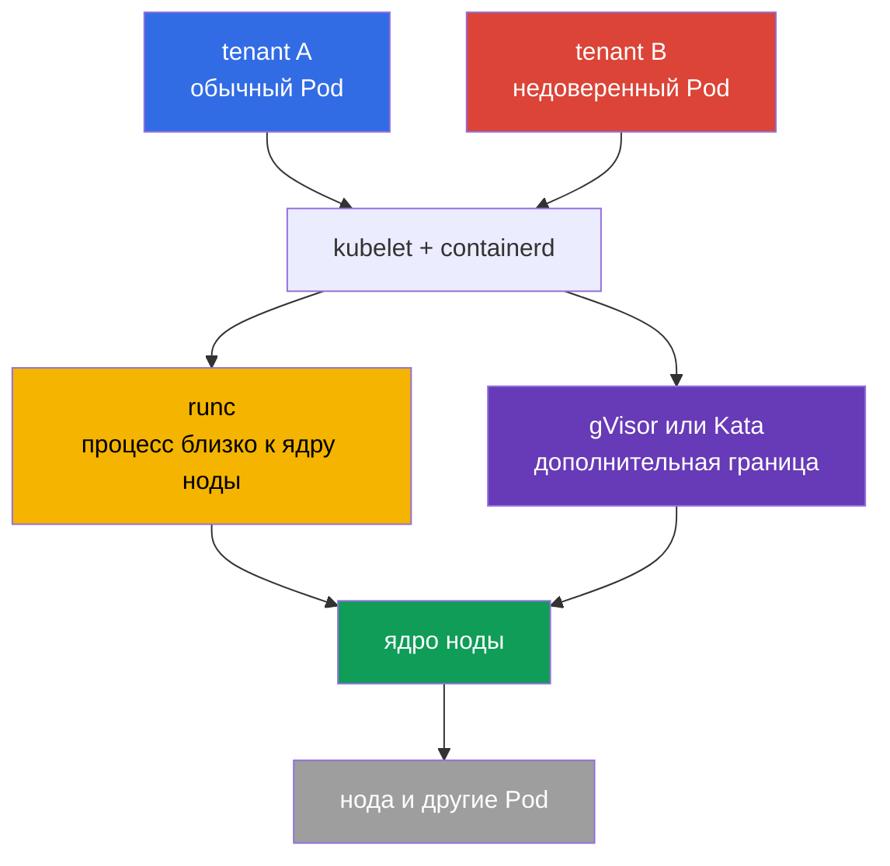
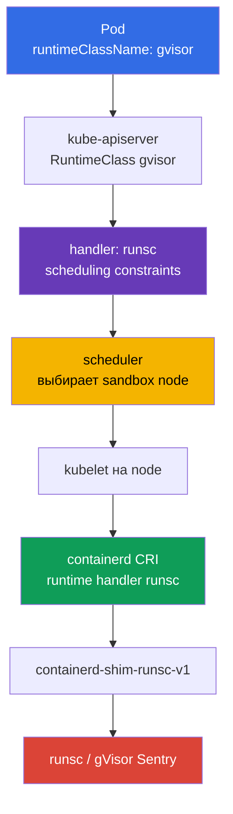

<!-- Standalone RU release: ссылки на переводы удалены, потому что соответствующие файлы не входят в архив. -->

# Глава 22. Container Runtime Sandbox: gVisor, Kata Containers и RuntimeClass

> **Что дальше.** `securityContext`, Pod Security Admission и admission-policy уменьшают
> привилегии процесса и не пускают опасный YAML, но обычный контейнер всё ещё использует
> ядро ноды. Для недоверенной или особо ценной multi-tenant нагрузки нужна более сильная
> граница исполнения: sandboxed runtime. В этой главе выбираем gVisor (`runsc`) или Kata
> Containers, подключаем их к containerd через `RuntimeClass` и доказываем, что Pod запущен
> именно в sandbox, а не обычным OCI runtime.

> **Что нужно знать из CKA.** Pod, `nodeSelector`, taints/tolerations и диагностика
> планирования разобраны в [главе 16 CKA](../../../cka/course/16/ru.md),
> `securityContext` и least privilege - в [главе 20 CKA](../../../cka/course/20/ru.md),
> а CRI, kubelet и containerd - в [главе 40 CKA](../../../cka/course/40/ru.md). Здесь
> используем эти механизмы для изоляции недоверенного workload, а не повторяем их основы.

> 🧠 Sandbox уменьшает kernel escape для недоверенной нагрузки, но не заменяет RBAC, PSA, `securityContext` и NetworkPolicy.

## 22.1. Почему обычного контейнера недостаточно для multi-tenancy

Container изолирует PID, mount, network и другие namespaces, а cgroups ограничивают
ресурсы. Но процесс контейнера обычно системно вызывает **то же ядро Linux**, что и
процессы ноды и соседних Pod. Уязвимость ядра, container runtime или неверно выданная
capability может превратить выполнение кода в container escape.

В single-tenant кластере с проверенными образами это может быть приемлемым риском. В
multi-tenancy доверие другое: одна команда, customer workload, CI-job или supplied plugin
не должны получать столь же близкий путь к ядру, как системные компоненты платформы.
`privileged`, host namespaces, `hostPath`, Docker/containerd socket и широкие RBAC-права
при этом остаются опасными **даже в sandbox**.



Sandbox добавляет слой между workload и хостом. Это defence in depth, а не разрешение
ослабить остальные controls:

| Контроль | За что отвечает | Sandbox его не заменяет |
|---|---|---|
| RBAC и ServiceAccount | кто может создать или изменить объект | sandbox не ограничивает API-доступ identity |
| PSA / Kyverno / Gatekeeper | какие поля Pod разрешены | sandbox не должен принимать `privileged` Pod |
| `securityContext` | UID, capabilities, seccomp, filesystem процесса | безопасный runtime не отменяет least privilege |
| NetworkPolicy | с кем workload может общаться | runtime не задаёт сетевой allow-list |
| gVisor / Kata | граница между workload и ядром/хостом | runtime не сканирует образ и не проверяет подпись |

Выбор runtime - свойство класса workload, а не пользователя. Platform team создаёт
RuntimeClass, выделяет совместимые nodes, задаёт admission-policy и наблюдает за ними.
Разработчик указывает разрешённый `runtimeClassName`; ему не нужен доступ к containerd или
SSH на worker node.

> 🧠 gVisor добавляет userspace kernel, Kata — lightweight VM с guest kernel и более сильной изоляцией ценой ресурсов.

## 22.2. Два подхода: gVisor и Kata Containers

**gVisor** запускает контейнер через `runsc`. Его userspace kernel (`Sentry`) перехватывает
большую часть системных вызовов и реализует их в userspace, снижая прямую поверхность атаки
ядра host. Поддерживаемые platform -- `systrap` (default) и `kvm`: `systrap` -- универсальный
выбор по умолчанию, а `kvm` уместен при доступной аппаратной виртуализации и совместимой
инфраструктуре. `ptrace` -- legacy platform, больше не поддерживается и планируется к удалению;
не выбирайте его для новой конфигурации. Это обычно легче виртуальной машины, но не полностью
отдельное guest kernel.

**Kata Containers** запускает Pod sandbox в lightweight VM: отдельное guest kernel и
hypervisor boundary. Container внутри VM видит guest kernel, а не kernel ноды. Граница
сильнее и семантика Linux ближе к обычной VM, однако выше startup latency, расход памяти и
операционная сложность; нужна поддержка virtualization на node и в облаке.

| Свойство | Обычный `runc` | gVisor / `runsc` | Kata Containers |
|---|---|---|---|
| Ядро, видимое workload | host kernel | userspace kernel gVisor поверх host kernel | отдельное guest kernel VM |
| Граница изоляции | namespaces/cgroups | syscall interception + sandbox | VM/hypervisor + guest kernel |
| Плотность и старт | базовый ориентир | обычно ближе к контейнеру | обычно дороже по памяти и старту |
| Совместимость syscall/kernel features | максимальная | возможны неподдерживаемые syscalls/features | обычно ближе к VM, но зависит от runtime |
| Типичный выбор | trusted platform workload | untrusted web/CI/multi-tenant code | сильная изоляция, регуляторный или особо рискованный workload |

Не оценивайте runtime только по таблице. Протестируйте реальные образы: eBPF, FUSE, low-level
network tools, nested containers, device plugins, huge pages, GPU и host mounts могут быть
несовместимы либо потребовать отдельного дизайна. Нельзя silently fallback с sandbox на
`runc`: тогда заявленная граница исчезнет именно в момент, когда нужна.

> 🎯 Pod выбирает `RuntimeClass`, а его CRI `handler` должен точно существовать в configuration целевой node.

## 22.3. Как Kubernetes выбирает runtime: `RuntimeClass` и handler

`RuntimeClass` - cluster-scoped API Kubernetes. Он связывает понятное workload имя с
**handler** из конфигурации CRI на ноде. Важно различать эти строки:

- `metadata.name: gvisor` - имя, которое указывает разработчик в `spec.runtimeClassName`;
- `handler: runsc` - точное имя runtime в CRI configuration containerd;
- `runtime_type: io.containerd.runsc.v1` - implementation runtime в конфигурации
  containerd; это не имя RuntimeClass.

API server не проверяет наличие handler на каждой ноде. Ошибка проявится, когда kubelet
попытается создать Pod. Поэтому handler, бинарники, shim и совместимые nodes готовят до
создания workload.



Минимальный RuntimeClass для уже установленного `runsc`:

```yaml
apiVersion: node.k8s.io/v1
kind: RuntimeClass
metadata:
  name: gvisor
handler: runsc
```

```bash
kubectl apply -f runtimeclass-gvisor.yaml
kubectl get runtimeclass
kubectl get runtimeclass gvisor -o yaml
```

`RuntimeClass` не является Namespace и не выдаёт право использовать runtime. Ограничьте
создание и изменение RuntimeClass только platform administrators. Если не каждый namespace
должен запускать изолированный или дорогой runtime, ограничьте `runtimeClassName` через
admission-policy и назначайте его платформенным шаблоном.

Например, эта `ValidatingAdmissionPolicy` разрешает `gvisor` только в `tenant-a`.
Ограничение namespace - лишь пример: в production его связывают с утверждёнными namespace
и при необходимости с ServiceAccount. Проверяйте policy server-side до rollout:

```yaml
apiVersion: admissionregistration.k8s.io/v1
kind: ValidatingAdmissionPolicy
metadata:
  name: restrict-gvisor-runtimeclass
spec:
  matchConstraints:
    resourceRules:
    - apiGroups: [""]
      apiVersions: ["v1"]
      operations: ["CREATE", "UPDATE"]
      resources: ["pods"]
  validations:
  - expression: "!has(object.spec.runtimeClassName) || object.spec.runtimeClassName != 'gvisor' || object.metadata.namespace == 'tenant-a'"
    message: "runtimeClassName gvisor is allowed only in tenant-a"
---
apiVersion: admissionregistration.k8s.io/v1
kind: ValidatingAdmissionPolicyBinding
metadata:
  name: restrict-gvisor-runtimeclass
spec:
  policyName: restrict-gvisor-runtimeclass
  validationActions: [Deny]
```

```bash
kubectl apply -f restrict-gvisor-runtimeclass.yaml

# Отрицательная проверка: API server должен отклонить Pod до scheduler.
kubectl -n tenant-b run gvisor-not-allowed \
  --image=nginxinc/nginx-unprivileged:1.30.4-alpine-slim \
  --restart=Never \
  --overrides='{"spec":{"runtimeClassName":"gvisor"}}' \
  --dry-run=server
# Expected: runtimeClassName gvisor is allowed only in tenant-a
```

> 🔬 `RuntimeClass.scheduling` объединяет constraints Pod и направляет sandbox workload на подготовленный pool.

## 22.4. Scheduling в RuntimeClass: `nodeSelector`, taints и tolerations

Не ставьте gVisor или Kata на все nodes «на всякий случай». Отделите sandbox pool: в нём
есть нужные binary/shim, проверенная конфигурация, capacity и observability. Обычные
workloads не должны случайно занять этот pool, а sandbox workload не должен попасть на node
без нужного handler.

RuntimeClass может содержать `scheduling`. Kubernetes добавляет его `nodeSelector` и
`tolerations` к Pod, который ссылается на этот class. Selector RuntimeClass и selector Pod
объединяются на admission: конфликтующие значения приводят к отклонению Pod API server,
а не к принятому Pod в состоянии `Pending`/`Unschedulable`. Поэтому при такой ошибке ищите
admission error, а не только Events scheduler. Tolerations добавляются, но не заменяют
taint - node остаётся закрытой для Pod без toleration.

```bash
# Выполняет platform administrator только на подготовленном worker.
kubectl label node worker-sandbox sandbox.runtime/gvisor=true
kubectl taint node worker-sandbox sandbox.runtime/gvisor=true:NoSchedule
```

```yaml
apiVersion: node.k8s.io/v1
kind: RuntimeClass
metadata:
  name: gvisor
handler: runsc
scheduling:
  nodeSelector:
    sandbox.runtime/gvisor: "true"
  tolerations:
  - key: sandbox.runtime/gvisor
    operator: Equal
    value: "true"
    effect: NoSchedule
```

Под с `runtimeClassName: gvisor` получает оба scheduling constraints автоматически:

```yaml
apiVersion: v1
kind: Pod
metadata:
  name: untrusted-web
  namespace: tenant-a
spec:
  runtimeClassName: gvisor
  securityContext:
    runAsNonRoot: true
    seccompProfile:
      type: RuntimeDefault
  containers:
  - name: app
    image: nginxinc/nginx-unprivileged:1.30.4-alpine-slim
    ports:
    - containerPort: 8080
    securityContext:
      allowPrivilegeEscalation: false
      capabilities:
        drop: ["ALL"]
```

Не копируйте `nodeSelector` и toleration в каждый Deployment, если они уже в RuntimeClass:
это создаёт два источника истины. Явные pod-level constraints допустимы только когда они
сужают выбор, например по architecture или zone. Сначала проверьте итоговый Pod и Event:

```bash
kubectl -n tenant-a apply -f untrusted-web.yaml
kubectl -n tenant-a get pod untrusted-web -o wide
kubectl -n tenant-a get pod untrusted-web -o jsonpath='{.spec.runtimeClassName}{"\n"}'
kubectl -n tenant-a get pod untrusted-web -o jsonpath='{.spec.nodeSelector}{"\n"}'
kubectl -n tenant-a describe pod untrusted-web
```

### Kata RuntimeClass

Для Kubernetes рекомендуемый путь установки Kata -- Helm chart `kata-deploy`: он
разворачивает runtime на node и создаёт RuntimeClass для фактических shim. В современных
релизах runtime-rs имена таких class/handler могут выглядеть как
`kata-qemu-runtime-rs`; используйте имя, которое создал chart, а не старый пример из
другой поставки. Перед rollout проверьте `kubectl get runtimeclass` и `crictl info` на
целевой node.

Ручная конфигурация ниже -- упрощённый вариант для уже подготовленного отдельного pool.
В ней Kata class устроен так же, но handler обязан совпадать с containerd. Не называйте
class `kata`, если handler на node называется `kata-qemu`, иначе конфигурация станет
неясной. Один из понятных вариантов -- одинаковое короткое имя:

```yaml
apiVersion: node.k8s.io/v1
kind: RuntimeClass
metadata:
  name: kata
handler: kata
scheduling:
  nodeSelector:
    sandbox.runtime/kata: "true"
  tolerations:
  - key: sandbox.runtime/kata
    operator: Equal
    value: "true"
    effect: NoSchedule
```

Для Kata pool предварительно проверьте, что hardware virtualization доступна и разрешена
гипервизору. Простая метка node не создаёт эту возможность.

> 🔬 gVisor binary, shim и containerd handler требуют согласованных версий, PATH service и config на выделенном pool.

## 22.5. Установка gVisor и подключение `runsc` к containerd

Ниже - runbook для выделенной Linux node с containerd. Версии `runsc`, shim, Kubernetes и
containerd должны быть заранее протестированы и зафиксированы в Git/IaC. Не подменяйте
production runtime командой `latest` в середине incident.

### 1. Установить `runsc` и shim

У gVisor binary, shim и каталог sidecar binaries должны соответствовать одной
проверенной версии и архитектуре node. Предпочтительный способ установки -- пакет `runsc`
из официального (либо одобренного внутреннего) apt repository: он устанавливает полный
набор файлов согласованно. Не смешивайте этот package с вручную скачанным shim.

Для pinned manual installation используйте актуальный архив `gvisor.tar.zstd`, а не
устаревшую схему из двух отдельных binary. Архив содержит `runsc`, shim и каталог
`gvisor-bin/`; последний должен остаться рядом с `runsc`, потому что runtime использует
его при запуске sandbox. Проверьте checksum/signature именно утверждённого release и
распакуйте все файлы с root-only правами. Команды показывают форму установки;
`<VERSION>` и `<ARCH>` заменяются утверждёнными значениями.

```bash
VERSION="${VERSION:?set an approved gVisor version}"
ARCH=$(uname -m)
BASE_URL="https://storage.googleapis.com/gvisor/releases/release/${VERSION}/${ARCH}"

curl -fsSLO "${BASE_URL}/gvisor.tar.zstd"
curl -fsSLO "${BASE_URL}/gvisor.tar.zstd.sha512"
sha512sum -c gvisor.tar.zstd.sha512
mkdir gvisor
zstd -d -c gvisor.tar.zstd | tar -xf - -C gvisor
sudo install -d -o root -g root -m 0755 /usr/local/lib/gvisor
sudo cp -a gvisor/. /usr/local/lib/gvisor/
sudo ln -sf /usr/local/lib/gvisor/runsc /usr/local/bin/runsc
sudo ln -sf /usr/local/lib/gvisor/containerd-shim-runsc-v1 \
  /usr/local/bin/containerd-shim-runsc-v1

runsc --version
command -v containerd-shim-runsc-v1
ls -ld /usr/local/lib/gvisor/gvisor-bin
```

В любом варианте путь к shim должен быть в `PATH` systemd service containerd; проверьте
`systemctl show containerd -p Environment` и unit/drop-in. Для archive installation
сохраните относительное соседство `runsc` и `gvisor-bin/`, а не копируйте один `runsc`
отдельно. Не устанавливайте runtime только на control-plane, если Pod планируется на
workers.

### 2. Добавить runtime handler containerd

Сначала сохраните рабочую конфигурацию и определите generation containerd. Не заменяйте
целиком vendor-managed `config.toml`: путь CRI plugin зависит от version configuration.

```bash
sudo cp -a /etc/containerd/config.toml \
  "/etc/containerd/config.toml.before-runsc.$(date +%F-%H%M%S)"
containerd --version
sudo sed -n '1,180p' /etc/containerd/config.toml
```

Для containerd 1.x используйте config version 2 и CRI plugin path v2:

```toml
version = 2

[plugins."io.containerd.grpc.v1.cri".containerd.runtimes.runsc]
  runtime_type = "io.containerd.runsc.v1"
```

Для containerd 2.x gVisor требует config version 3 и путь CRI plugin v3:

```toml
version = 3

[plugins.'io.containerd.cri.v1.runtime'.containerd.runtimes.runsc]
  runtime_type = "io.containerd.runsc.v1"
```

Не копируйте блок v2 в configuration v3 или наоборот. Сверьте generation по
`containerd --version`, первой строке `version = ...` и документации gVisor для вашей
поставки containerd.

Не меняйте `default_runtime_name` на `runsc`: системные DaemonSet, CNI, CSI и отлаженные
обычные workload могут требовать `runc`. RuntimeClass должен выбирать sandbox явно.

Проверьте TOML и перезапускайте daemon только по процедуре change management: рестарт
containerd может затронуть создание новых контейнеров и работу ноды. На production node
сначала cordon/drain с учётом DaemonSet и PDB, затем примените проверенную конфигурацию.

```bash
sudo systemctl restart containerd
sudo systemctl is-active --quiet containerd && echo 'containerd: active'
sudo journalctl -u containerd -b --no-pager | tail -n 80
sudo crictl info | jq '.config.containerd.runtimes.runsc'
```

`crictl info` должен показать `runsc` с `runtimeType` `io.containerd.runsc.v1`. Если
handler не появился или service не active, остановитесь: RuntimeClass пока не создавайте и
не переносите workload на эту node.

> 🔬 Kata требует совместимых shim, hypervisor, guest components, host virtualization и проверки KVM/runtime.

## 22.6. Установка Kata Containers и containerd handler

Kata требует не только `containerd-shim-kata-v2`, но и выбранный hypervisor, kernel/rootfs
и совместимую host virtualization. Предпочтителен vendor-supported package или проверенный
Kata release, развёрнутый конфигурационным management на отдельном pool. Не копируйте
бинарник с laptop на production worker.

После установки проверьте именно runtime и virtualization, а не только наличие пакета:

```bash
command -v containerd-shim-kata-v2
kata-runtime --version
sudo kata-runtime check
ls -l /dev/kvm
```

`kata-runtime check` и `/dev/kvm` - примеры для распространённой QEMU/KVM конфигурации;
точная команда и hypervisor зависят от выбранного Kata runtime. Отсутствующий `/dev/kvm`,
запрещённая nested virtualization или несовместимый instance type означают, что node нельзя
маркировать как `sandbox.runtime/kata=true`.

Контейнеру нужен отдельный CRI handler. Путь зависит от поколения containerd: для
containerd 1.x с config version 2 используйте старый CRI plugin path:

```toml
version = 2

[plugins."io.containerd.grpc.v1.cri".containerd.runtimes.kata]
  runtime_type = "io.containerd.kata.v2"
```

Для containerd 2.x используйте config version 3 и новый путь runtime plugin:

```toml
version = 3

[plugins.'io.containerd.cri.v1.runtime'.containerd.runtimes.kata]
  runtime_type = "io.containerd.kata.v2"
```

В современных Kata Containers runtime-rs является runtime по умолчанию, а Go runtime
deprecated. Пути к `kata-runtime`, shim и выбранному hypervisor зависят от способа установки;
перед rollout сверяйте их с package/release вашей платформы, а не предполагаемым путём из
старого примера.

После change/restart containerd проверьте handler так же, как для gVisor:

```bash
sudo systemctl restart containerd
sudo systemctl is-active --quiet containerd && echo 'containerd: active'
sudo crictl info | jq '.config.containerd.runtimes.kata'
```

На некоторых дистрибутивах package создаёт handler с другим именем, например
`kata-qemu`. В этом случае RuntimeClass должен использовать **фактическое** имя handler, а
не пример из статьи. Сверьте `crictl info`, config.toml и `RuntimeClass.spec.handler` до
rollout.

> 🏭 Canary representative Pod и negative test без fallback → application SLO → namespace policy; не обходите несовместимость через `privileged` или `runc`.

## 22.7. Rollout: от одного Pod к namespace policy

Sandbox может изменить timing, filesystem semantics, network behavior и потребление
ресурсов. Безопасный rollout начинается с отдельного test namespace и одного
representative workload.

1. **Проверить node.** Binary, shim, containerd handler, label и taint должны быть на
   каждой node целевого pool.
2. **Создать RuntimeClass.** Handler и scheduling должны отражать уже работающую node
   configuration.
3. **Запустить positive test.** Непривилегированный Pod c `runtimeClassName` должен стать
   `Running` на sandbox node.
4. **Проверить negative test.** Pod с selector, конфликтующим с RuntimeClass, должен быть
   отклонён на admission. Pod на node без handler не должен quietly перейти на обычный runtime:
   ожидается явный `FailedCreatePodSandBox`, а не fallback на `runc`.
5. **Проверить приложение.** Readiness, egress, DNS, volumes, latency, shutdown и метрики
   должны соответствовать SLO.
6. **Расширять scope.** Deployment/Job переводят канареечно; admission policy запрещает
   небезопасные сочетания и использование class вне разрешённых namespaces.

Deployment обычно меняют только так:

```yaml
apiVersion: apps/v1
kind: Deployment
metadata:
  name: report-worker
  namespace: tenant-a
spec:
  replicas: 2
  selector:
    matchLabels:
      app: report-worker
  template:
    metadata:
      labels:
        app: report-worker
    spec:
      runtimeClassName: gvisor
      securityContext:
        runAsNonRoot: true
        seccompProfile:
          type: RuntimeDefault
      containers:
      - name: worker
        image: registry.example.com/report-worker@sha256:<digest>
        securityContext:
          allowPrivilegeEscalation: false
          capabilities:
            drop: ["ALL"]
```

Не добавляйте `hostNetwork`, `hostPID`, `hostIPC`, `privileged`, hostPath или device mounts,
чтобы «починить» несовместимость sandbox. Это либо ломает модель угроз, либо сигнализирует,
что workload должен быть переработан или запущен в отдельном доверенном pool с явно
документированным исключением.

> 🔬 `RuntimeClass.overhead` измеряют для конкретных версий, node type и workload; ошибка переполняет pool или теряет capacity.

### Runtime overhead

`RuntimeClass.overhead` сообщает scheduler дополнительный CPU/memory, потребляемый runtime
per Pod. Значения берут из benchmark конкретной версии, node type и workload, а не из
случайного интернет-примера. Без overhead scheduler может переплотнить sandbox node;
с завышенным значением теряется capacity.

```yaml
apiVersion: node.k8s.io/v1
kind: RuntimeClass
metadata:
  name: kata
handler: kata
overhead:
  podFixed:
    memory: "<measured-memory-overhead>"
    cpu: "<measured-cpu-overhead>"
scheduling:
  nodeSelector:
    sandbox.runtime/kata: "true"
```

Изменение overhead влияет на новые Pod и admission/scheduling, поэтому его проверяют в
staging вместе с resource requests/limits и autoscaler behavior.

> 🎯 `runtimeClassName` показывает intent; подтвердите Pod/node через CRI handler/shim и функциональность workload.

## 22.8. Проверка: sandbox действительно работает, а не просто указан в YAML

Одной проверки `spec.runtimeClassName` недостаточно: поле показывает intent, а не
успешность запуска нужным runtime. Соберите доказательства на трёх уровнях: Kubernetes,
CRI/containerd и внутри workload. Для диагностики временно сохраняйте node name, runtime
handler, Pod UID и время; это связывает API object с node logs.

```bash
NS=tenant-a
POD=untrusted-web

# 1. Intent и placement Kubernetes.
kubectl -n "$NS" get pod "$POD" -o wide
kubectl -n "$NS" get pod "$POD" \
  -o jsonpath='{.spec.runtimeClassName}{" node="}{.spec.nodeName}{" phase="}{.status.phase}{"\n"}'
kubectl -n "$NS" describe pod "$POD"

# 2. На выбранной node: CRI runtime и ошибки create sandbox.
sudo crictl pods --name "$POD"
sudo crictl ps -a --name "$POD"
sudo crictl info | jq '.config.containerd.runtimes.runsc'
sudo journalctl -u containerd --since '15 minutes ago' --no-pager | \
  grep -Ei 'runsc|gvisor|kata|sandbox|error'
```

Параметры `crictl` и формат вывода зависят от release. Если CRI не показывает handler
напрямую, используйте идентификатор sandbox/container из `crictl inspectp` и сопоставьте
его с log containerd/shim. Не делайте вывод только по имени Pod: доказательство - создание
sandbox обработчиком `runsc` или `kata` без fallback.

### Наблюдение изнутри Pod и на host

В обычном контейнере `uname -a` обычно показывает kernel ноды. В gVisor syscall results
виртуализируются: `uname`, `/proc` и другие данные могут показывать gVisor-specific или
ограниченную картину. В Kata процесс увидит guest kernel, отдельный от host. Эти признаки
полезны, но их нельзя считать единственным security proof: output может меняться между
версиями и не обязан раскрывать implementation.

```bash
# Внутри sandbox Pod: диагностический отпечаток workload view.
kubectl -n "$NS" exec "$POD" -- sh -c '
  echo "=== uname ==="; uname -a
  echo "=== pid 1 cgroup ==="; cat /proc/1/cgroup
  echo "=== mounts ==="; mount | head -n 20
  echo "=== dmesg (if permitted) ==="; dmesg 2>&1 | head -n 40 || true
'

# На host: host kernel остаётся kernel ноды, а не guest/Sentry view Pod.
uname -a
sudo journalctl -u containerd --since '15 minutes ago' --no-pager | tail -n 120
```

Для учебного gVisor scenario `dmesg` внутри успешно стартовавшего Pod может содержать
признак запуска gVisor, например `Starting gVisor`. Сохраните требуемый артефакт ровно в
формате лабораторной работы; не экстраполируйте одну такую строку на production proof.
В production надёжнее сочетание RuntimeClass, placement, CRI handler/shim logs и
application smoke test.

| Наблюдение | Что доказывает | Чего не доказывает |
|---|---|---|
| `runtimeClassName: gvisor` в Pod | намерение выбрать class | что handler существует на node |
| Pod `Running` на sandbox node | scheduler и kubelet приняли Pod | сам по себе не показывает implementation runtime |
| `crictl info` содержит `runsc`/`kata` | node configured для handler | что конкретный Pod не был создан иначе |
| containerd/shim log с Pod UID/container ID | конкретный sandbox создан нужным handler | что приложение функционально |
| `uname`/`dmesg` внутри | workload view отличается от host; полезный сигнал | полную корректность isolation boundary |
| `uname` и logs на host | host-side context и runtime activity | содержимое guest/userspace kernel Pod |

> 🎯 Диагностируйте class, node placement, handler и `FailedCreatePodSandBox`; не удаляйте `runtimeClassName`.

## 22.9. Типовые отказы и безопасная диагностика

| Симптом | Вероятная причина | Проверка и действие |
|---|---|---|
| Pod `Pending`, `didn't match Pod's node affinity/selector` | нет node с label из RuntimeClass либо конфликт selector Pod | `kubectl describe pod`; сравните `spec.nodeSelector` и labels nodes |
| Pod `Pending`, taint не tolerated | Pod не получил или не совпадает toleration RuntimeClass | проверьте `kubectl get runtimeclass -o yaml`, `kubectl describe node` |
| `FailedCreatePodSandBox`, unknown runtime handler | нет блока handler, ошибочное имя или containerd не перечитан | сверить `RuntimeClass.handler`, config.toml, `crictl info`; исправить и restart по runbook |
| `executable file not found` для shim | shim не установлен или вне PATH service containerd | проверить `command -v`, permissions и systemd Environment |
| gVisor Pod стартует, приложение ломается | syscall, mount или network feature не поддержаны/иначе реализованы | минимальный reproducer, runtime docs, исправить app либо выбрать иной approved runtime |
| Kata не стартует | отсутствует KVM/nested virtualization, hypervisor/kernel config или capacity | `kata-runtime check`, `/dev/kvm`, cloud instance capabilities, logs shim |
| Pod оказался на обычной node | RuntimeClass без `scheduling`, pool не tainted или указан другой class | проверить class, node name, labels/taints; не считать это sandbox rollout |

Не «лечите» `FailedCreatePodSandBox` удалением `runtimeClassName`: это превращает
security failure в незаметный downgrade. Оставьте workload остановленным, пока platform
team не подтвердит другой допустимый RuntimeClass или отдельный risk acceptance.

> 🏭 Выделенный pool, compatibility matrix, измеренный overhead, alerting и controlled upgrades для sandbox runtime.

## 22.10. Как это применяют в продакшене

- **Выделяйте pool по доверию.** gVisor/Kata nodes получают только sandbox workload через
  RuntimeClass scheduling, label и `NoSchedule` taint; системные agents и trusted workloads
  живут отдельно.
- **Сохраняйте default `runc`.** Перевод всей платформы на новый runtime без compatibility
  matrix повышает blast radius. Sandbox включают по class и канареечно.
- **Держите handler как контракт.** Version binaries, shim, containerd config и
  RuntimeClass меняются одной reviewed change. Случайная разница имён `runsc`, `kata` и
  `kata-qemu` - источник outages.
- **Запрещайте dangerous combinations.** PSA/admission-policy не должны допускать
  `privileged`, host namespaces, hostPath/socket mounts и broad exemptions в tenant
  namespace независимо от RuntimeClass.
- **Считайте capacity.** Измеряйте runtime overhead, startup latency, density, node
  pressure и cold-start. Kata pool часто требует отдельного autoscaling profile.
- **Мониторьте границу.** Alert на `FailedCreatePodSandBox`, containerd/shim errors,
  sandbox node NotReady, рост startup latency и неожиданное размещение outside pool.
- **Планируйте обновления.** Обновление host kernel, containerd, gVisor/Kata и Kubernetes
  тестируют как одну compatibility matrix. Перед drain проверьте PDB и выведите node из
  scheduling, а не обновляйте runtime под активными tenant Pod вслепую.

## 22.11. Как это пригодится: на экзамене и в реальной работе

- **На экзамене.** Нужно уметь отличить `RuntimeClass`, CRI handler и `runtime_type`,
  направить Pod на подготовленный sandbox pool через `scheduling`, labels, taints и
  tolerations, а также диагностировать `FailedCreatePodSandBox` без небезопасного fallback
  на `runc`.
- **В реальной работе.** Эти навыки позволяют изолировать недоверенные tenant-, CI- и
  plugin-workload, безопасно раскатывать gVisor или Kata по канарейке, учитывать overhead и
  подтверждать runtime по данным Kubernetes, CRI/containerd и application smoke test.

## 22.12. Мини-глоссарий

- **Container runtime sandbox** - runtime, добавляющий границу между workload и host kernel.
- **gVisor** - sandbox runtime с userspace kernel; CRI handler часто называется `runsc`.
- **`runsc`** - OCI runtime gVisor и имя handler в данном примере.
- **Kata Containers** - runtime, запускающий Pod sandbox в lightweight VM с guest kernel.
- **RuntimeClass** - cluster-scoped Kubernetes resource, выбирающий CRI handler и опциональные
  overhead/scheduling constraints.
- **handler** - имя runtime в CRI configuration, которое должно совпадать с
  `RuntimeClass.spec.handler`.
- **shim** - процесс/бинарник containerd, связывающий containerd с конкретным runtime.
- **sandbox pool** - выделенные nodes с подготовленным runtime, label, taint и capacity.
- **runtime overhead** - фиксированные дополнительные CPU/memory, которые scheduler учитывает
  для Pod выбранного RuntimeClass.

## 22.13. Итоги главы

- Обычные контейнеры разделяют ядро ноды; для недоверенной multi-tenant нагрузки gVisor или
  Kata добавляют значимую дополнительную границу, но не заменяют RBAC, PSA,
  `securityContext` и NetworkPolicy.
- gVisor (`runsc`) перехватывает системные вызовы через userspace kernel; Kata использует
  lightweight VM и guest kernel. Выбор определяется моделью угроз, compatibility и SLO.
- `RuntimeClass.metadata.name`, `spec.handler` и `containerd runtime_type` - разные уровни
  именования. Handler должен в точности совпасть с CRI configuration каждой target node.
- `RuntimeClass.scheduling` с `nodeSelector` и tolerations вместе с labels/taints ограничивает
  sandbox workload подготовленным node pool.
- Для containerd нужны соответствующие binary и shim, handler в config.toml и controlled
  restart/verification daemon. Default `runc` не меняют без причины.
- Проверка должна связать Pod class и node с handler/shim в CRI/containerd logs, а затем
  подтвердить workload view и application behavior; одного `runtimeClassName` недостаточно.
- Нельзя скрытно удалять `runtimeClassName` после сбоя. Это security downgrade, который
  требует явного решения и компенсирующих controls.

## 22.14. Вопросы для самопроверки

<details>
<summary>1. Почему namespaces и cgroups не делают обычный контейнер полноценной kernel security boundary для недоверенного tenant?</summary>

Обычный контейнер изолирует namespaces и ограничивает ресурсы cgroups, но его процесс обычно вызывает то же ядро Linux, что node и соседние Pods. Уязвимость ядра/runtime либо неверная capability может стать container escape. Для недоверенного tenant нужна дополнительная граница gVisor или Kata вместе с остальными controls.
</details>

<details>
<summary>2. В чём ключевая разница между userspace kernel gVisor и guest kernel Kata?</summary>

gVisor `runsc` перехватывает большую часть syscalls и реализует их userspace kernel Sentry поверх host kernel. Kata запускает Pod sandbox в lightweight VM, где workload видит отдельный guest kernel и hypervisor boundary. Kata обычно даёт более сильную и близкую к VM изоляцию, но требует virtualization и дороже по памяти и startup.
</details>

<details>
<summary>3. Чем отличаются `RuntimeClass.metadata.name`, `handler` и `runtime_type` containerd?</summary>

`metadata.name`, например `gvisor`, — значение для `spec.runtimeClassName` в Pod. `handler`, например `runsc`, должен точно совпадать с именем runtime в CRI configuration node. `runtime_type`, например `io.containerd.runsc.v1`, — implementation runtime в конфигурации containerd и не является именем RuntimeClass.
</details>

<details>
<summary>4. Почему API server не может гарантировать, что handler доступен на выбранной node?</summary>

API server хранит RuntimeClass, но не проверяет binary, shim и CRI handler на каждой node. Ошибка проявляется, когда kubelet пытается создать sandbox, например как `FailedCreatePodSandBox` или unknown runtime handler. Поэтому handler и compatible pool готовят и проверяют до создания workload.
</details>

<details>
<summary>5. Как `RuntimeClass.scheduling.nodeSelector` и tolerations взаимодействуют с labels и taints sandbox node pool?</summary>

RuntimeClass добавляет свой `nodeSelector` и tolerations к Pod, который на него ссылается. Selector должен совпасть с label подготовленной sandbox node, а toleration позволяет пройти `NoSchedule` taint; taint остаётся защитой от Pod без toleration. Конфликт selector RuntimeClass и Pod отклоняется на admission, а не превращается в Pending.
</details>

<details>
<summary>6. Почему опасно установить `runsc` default runtime для всего кластера без compatibility testing?</summary>

Системные DaemonSet, CNI, CSI и привычные workload могут требовать features, которые sandbox реализует иначе или не поддерживает. Глава предписывает сохранять default `runc` и выбирать sandbox явно через RuntimeClass для канареечного совместимого pool. Иначе blast radius затронет всю платформу.
</details>

<details>
<summary>7. Какие файлы/binaries должны быть согласованы для gVisor и containerd?</summary>

Должны совпадать проверенные версии `runsc`, `containerd-shim-runsc-v1` и каталога `gvisor-bin/`; при archive install их соседство с `runsc` сохраняют. Shim обязан быть в `PATH` systemd service containerd. В `config.toml` handler `runsc` должен указывать `runtime_type = "io.containerd.runsc.v1"` по правильному plugin path для поколения containerd.
</details>

<details>
<summary>8. Почему `runtimeClassName: gvisor` и `Running` ещё не являются полным доказательством sandbox execution?</summary>

Поле показывает намерение, а `Running` доказывает, что scheduler и kubelet приняли Pod, но не показывает implementation конкретного sandbox. Нужны placement на sandbox node, CRI configuration и containerd/shim logs, связанные с Pod UID или container ID, где видно `runsc`/Kata handler. Затем подтверждают workload view и application smoke test.
</details>

<details>
<summary>9. Что означает, если `uname` внутри Kata Pod отличается от `uname` host, и почему этого недостаточно как единственного доказательства?</summary>

Это полезный признак того, что workload видит guest kernel, отдельный от kernel node. Но output зависит от runtime версии и сам по себе не связывает конкретный Pod с нужным CRI handler. Надёжное evidence объединяет RuntimeClass, node, containerd/shim logs и функциональную проверку приложения.
</details>

<details>
<summary>10. **Flashback (глава 10).** gVisor/Kata (эта глава) изолируют tenant на уровне kernel syscall surface. RBAC (глава 10) изолирует tenant на уровне Kubernetes API access. Для multi-tenant кластера с недоверенными namespace приведите конкретный сценарий атаки, который останавливает только один из этих двух уровней, но не другой.</summary>

RBAC может запретить tenant ServiceAccount читать Secrets другого namespace или создавать privileged Pod, но не остановит exploit syscall в уже запущенном разрешённом container; здесь полезен sandbox. И наоборот, gVisor/Kata не запрещает identity выполнить разрешённый `get secrets` через API или изменить собственный Deployment. Поэтому API least privilege и kernel isolation закрывают разные attack paths.
</details>

<details>
<summary>11. Почему удаление `runtimeClassName` ради быстрого восстановления - security downgrade?</summary>

Удаление поля переводит workload с заявленной sandbox boundary на обычный runtime, то есть убирает защиту именно при проблеме совместимости. Глава прямо запрещает такой тихий fallback: Pod должен оставаться остановленным, пока platform team не подтвердит другой допустимый RuntimeClass или отдельное risk acceptance. Иначе recovery скрывает снижение безопасности.
</details>

## Практика

Отработайте RuntimeClass, `runsc`, scheduling и проверку sandbox в
[лабе 110 - gVisor, Cilium и Istio](../../labs/110/README_RU.MD). Установите `runsc` на
подготовленную node, создайте `RuntimeClass` `gvisor` с handler `runsc`, изолируйте node
label/taint, переведите workload в namespace `team-purple` на этот class и подтвердите
размещение. Для учебного сценария сохраните `dmesg` успешно стартовавшего Pod в требуемый
артефакт и сопоставьте его с данными host/containerd.

🌐 Дополнительная интерактивная практика (killer.sh/killercoda, внешний ресурс): [sandbox-gvisor](https://killercoda.com/killer-shell-cks/scenario/sandbox-gvisor)

Полезные официальные справки: [RuntimeClass](https://kubernetes.io/docs/concepts/containers/runtime-class/),
[RuntimeClass scheduling](https://kubernetes.io/docs/concepts/containers/runtime-class/#scheduling),
[gVisor](https://gvisor.dev/docs/), [gVisor с containerd](https://gvisor.dev/docs/user_guide/containerd/)
и [Kata Containers](https://katacontainers.io/).

---
[Оглавление](../README_RU.md) · [Глава 21](../21/ru.md) · [Глава 23](../23/ru.md)
