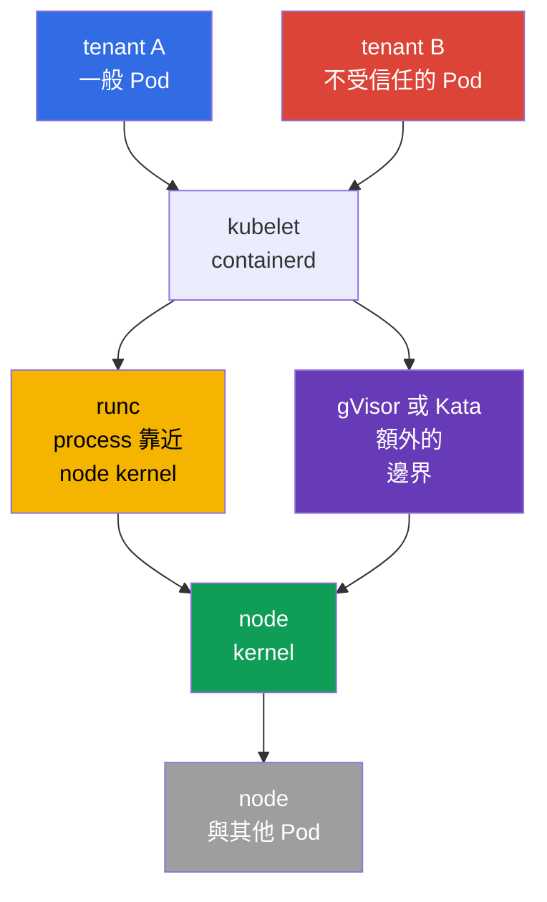
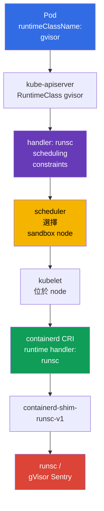

[Русская версия](ru.md) · [Eng version](README.md) · [Versión en español](es.md) · [Version française](fr.md) · [Deutsche Version](de.md) · [ქართული ვერსია](ge.md) · [日本語版](jp.md)

# 第 22 章。Container Runtime Sandbox：gVisor、Kata Containers 與 RuntimeClass

> **問題。** 不受信任的 tenant、CI-job 或 user plugin 在一般 container 中與 kubelet 和相鄰 Pod
> 共用同一個 node kernel。kernel/runtime 漏洞或錯誤保留的 privilege，可能讓程式碼執行變成
> container escape，並存取 host 或其他 tenant。Sandboxed runtime 在這類 workload 與 kernel 之間
> 增加獨立邊界，而不削弱其他 Pod policies。

> **接下來。** `securityContext`、Pod Security Admission 與 admission-policy 可減少 process
> privilege 並阻止危險 YAML，但一般 container 仍使用 node kernel。對不受信任或特別有價值的
> multi-tenant workload，需要更強的 execution boundary：sandboxed runtime。本章會選用 gVisor
>（`runsc`）或 Kata Containers，經由 `RuntimeClass` 將其接入 containerd，並證明 Pod
> 確實在 sandbox 中執行，而非由一般 OCI runtime 執行。

> **需要的 CKA 基礎。** Pod、`nodeSelector`、taints/tolerations 和 scheduling 診斷請見
> [CKA 第 16 章](../../../cka/course/16/tw.md)，`securityContext` 與 least privilege 請見
> [CKA 第 20 章](../../../cka/course/20/tw.md)，而 CRI、kubelet 和 containerd 請見
> [CKA 第 40 章](../../../cka/course/40/tw.md)。這裡利用這些 mechanisms 隔離不受信任的
> workload，而非重複其基礎。

> 🧠 Sandbox 可降低不受信任 workload 的 kernel escape，但不能取代 RBAC、PSA、`securityContext` 和 NetworkPolicy。

## 22.1. 為何一般 container 不足以應對 multi-tenancy

Container 會隔離 PID、mount、network 和其他 namespaces，而 cgroups 限制
resources。但 container process 通常仍會對 **同一個 Linux kernel** 發出 system calls，該 kernel
同時供 node process 與相鄰 Pod 使用。kernel、container runtime 漏洞，或錯誤授予的
capability，都可能讓程式碼執行變成 container escape。

在採用已驗證 image 的 single-tenant cluster 中，這可能是可接受的風險。但 multi-tenancy
的信任模型不同：一個 team、customer workload、CI-job 或 supplied plugin
不應取得與 platform 的 system components 同樣接近 kernel 的路徑。
`privileged`、host namespaces、`hostPath`、Docker/containerd socket 和廣泛 RBAC permissions
即使在 **sandbox 中**仍然危險。



Sandbox 在 workload 和 host 間增加一層。它是 defence in depth，不是放鬆
其他 controls 的許可：

| Control | 負責項目 | Sandbox 不會取代它 |
|---|---|---|
| RBAC 與 ServiceAccount | 誰可以建立或變更 object | sandbox 不限制 identity 的 API access |
| PSA / Kyverno / Gatekeeper | 允許哪些 Pod fields | sandbox 不應接受 `privileged` Pod |
| `securityContext` | process 的 UID、capabilities、seccomp、filesystem | 安全 runtime 不會取消 least privilege |
| NetworkPolicy | workload 可與誰通訊 | runtime 不設定 network allow-list |
| gVisor / Kata | workload 與 kernel/host 間的邊界 | runtime 不掃描 image，也不驗證 signature |

Runtime 的選擇是 workload class 的屬性，而非 user 的屬性。Platform team 建立
RuntimeClass、配置 compatible nodes、設定 admission-policy 並監控它們。
Developer 指定允許的 `runtimeClassName`；他們不需要存取 containerd 或 worker node 上的
SSH。

> 🧠 gVisor 加入 userspace kernel；Kata 則使用帶有 guest kernel 的 lightweight VM，以更多 resources 為代價提供更強隔離。

## 22.2. 兩種方法：gVisor 與 Kata Containers

**gVisor** 透過 `runsc` 執行 container。其 userspace kernel（`Sentry`）攔截
大部分 system calls，並在 userspace 實作它們，以減少 host kernel 的直接 attack surface。
支援的 platform 為 `systrap`（default）和 `kvm`：`systrap` 是通用 default
選項，`kvm` 適合具有可用 hardware virtualization 和 compatible infrastructure 的情況。
`ptrace` 是 legacy platform，已不再支援並計畫移除；不要在新的 configuration 中選擇它。
它通常比 VM 輕量，但不是完全獨立的 guest kernel。

**Kata Containers** 在 lightweight VM 中執行 Pod sandbox：具備獨立的 guest kernel 和
hypervisor boundary。VM 中的 container 看見的是 guest kernel，而非 node kernel。
這個 boundary 更強，Linux semantics 更接近一般 VM；但 startup latency、memory usage 與
operational complexity 更高，node 與 cloud 中也必須支援 virtualization。

| 屬性 | 一般 `runc` | gVisor / `runsc` | Kata Containers |
|---|---|---|---|
| workload 可見的 kernel | host kernel | host kernel 上的 gVisor userspace kernel | 獨立 VM guest kernel |
| Isolation boundary | namespaces/cgroups | syscall interception + sandbox | VM/hypervisor + guest kernel |
| Density 與 startup | baseline | 通常較接近 container | 通常有較高 memory 與 startup 成本 |
| syscall/kernel features compatibility | 最高 | 可能有不支援的 syscalls/features | 通常接近 VM，但取決於 runtime |
| Typical choice | trusted platform workload | untrusted web/CI/multi-tenant code | 強隔離、受監管或特別高風險的 workload |

不要只依此表評估 runtime。請測試實際 images：eBPF、FUSE、low-level
network tools、nested containers、device plugins、huge pages、GPU 和 host mounts 可能
不相容，或需要不同設計。不能將 sandbox 靜默 fallback 至 `runc`：如此一來，所宣稱的
boundary 正會在需要時消失。

> 🎯 Pod 選擇 `RuntimeClass`，而其 CRI `handler` 必須確實存在於 target node 的 configuration 中。

## 22.3. Kubernetes 如何選擇 runtime：`RuntimeClass` 與 handler

`RuntimeClass` 是 cluster-scoped Kubernetes API。它將易懂的 workload 名稱連結到
node 上 CRI configuration 中的 **handler**。請區分以下字串：

- `metadata.name: gvisor` - developer 在 `spec.runtimeClassName` 指定的名稱；
- `handler: runsc` - containerd CRI configuration 中 runtime 的確切名稱；
- `runtime_type: io.containerd.runsc.v1` - containerd configuration 中的 implementation runtime；
  它不是 RuntimeClass 的名稱。

API server 不會檢查每個 node 是否有 handler。當 kubelet 嘗試建立 Pod 時才會出現
error。因此，應在建立 workload 前備妥 handler、binaries、shim 和 compatible nodes。



已安裝 `runsc` 的最小 RuntimeClass：

```yaml
apiVersion: node.k8s.io/v1
kind: RuntimeClass
metadata:
  name: gvisor
handler: runsc
```

```bash
kubectl apply -f runtimeclass-gvisor.yaml
kubectl get runtimeclass
kubectl get runtimeclass gvisor -o yaml
```

`RuntimeClass` 不是 Namespace，也不授予使用 runtime 的權限。將 RuntimeClass 的建立與
修改限制給 platform administrators。若不是每個 namespace 都應執行隔離或昂貴的 runtime，
請透過 admission-policy 限制 `runtimeClassName`，並由 platform template 指定它。

例如，此 `ValidatingAdmissionPolicy` 僅在 `tenant-a` 允許 `gvisor`。
Namespace 限制僅是範例：在 production 中，它會與已核准的 namespaces 連結，並在需要時
與 ServiceAccount 連結。Rollout 前請 server-side 檢查 policy：

```yaml
apiVersion: admissionregistration.k8s.io/v1
kind: ValidatingAdmissionPolicy
metadata:
  name: restrict-gvisor-runtimeclass
spec:
  matchConstraints:
    resourceRules:
    - apiGroups: [""]
      apiVersions: ["v1"]
      operations: ["CREATE", "UPDATE"]
      resources: ["pods"]
  validations:
  - expression: "!has(object.spec.runtimeClassName) || object.spec.runtimeClassName != 'gvisor' || object.metadata.namespace == 'tenant-a'"
    message: "runtimeClassName gvisor is allowed only in tenant-a"
---
apiVersion: admissionregistration.k8s.io/v1
kind: ValidatingAdmissionPolicyBinding
metadata:
  name: restrict-gvisor-runtimeclass
spec:
  policyName: restrict-gvisor-runtimeclass
  validationActions: [Deny]
```

```bash
kubectl apply -f restrict-gvisor-runtimeclass.yaml

# Negative test：API server 必須在 scheduler 前拒絕 Pod。
kubectl -n tenant-b run gvisor-not-allowed \
  --image=nginxinc/nginx-unprivileged:1.30.4-alpine-slim \
  --restart=Never \
  --overrides='{"spec":{"runtimeClassName":"gvisor"}}' \
  --dry-run=server
# Expected：runtimeClassName gvisor is allowed only in tenant-a
```

> 🔬 `RuntimeClass.scheduling` 會合併 Pod constraints，並將 sandbox workload 導向已備妥的 pool。

## 22.4. RuntimeClass 中的 scheduling：`nodeSelector`、taints 與 tolerations

不要「以防萬一」就在所有 nodes 安裝 gVisor 或 Kata。請分隔 sandbox pool：該 pool 具有
必要的 binary/shim、已驗證 configuration、capacity 和 observability。一般 workloads 不應意外
佔用此 pool，而 sandbox workload 也不能落在沒有必要 handler 的 node 上。

RuntimeClass 可包含 `scheduling`。Kubernetes 會將其中的 `nodeSelector` 和
`tolerations` 加入參照此 class 的 Pod。RuntimeClass selector 與 Pod selector 會在 admission
時合併：衝突的值會使 API server 拒絕 Pod，而不是產生 `Pending`/`Unschedulable`
狀態的已接受 Pod。因此發生這類 error 時，請尋找 admission error，而非只看 scheduler Events。
Tolerations 會加入但不會取代 taint - node 對沒有 toleration 的 Pod 仍保持封閉。

```bash
# 僅由 platform administrator 在已備妥的 worker 上執行。
kubectl label node worker-sandbox sandbox.runtime/gvisor=true
kubectl taint node worker-sandbox sandbox.runtime/gvisor=true:NoSchedule
```

```yaml
apiVersion: node.k8s.io/v1
kind: RuntimeClass
metadata:
  name: gvisor
handler: runsc
scheduling:
  nodeSelector:
    sandbox.runtime/gvisor: "true"
  tolerations:
  - key: sandbox.runtime/gvisor
    operator: Equal
    value: "true"
    effect: NoSchedule
```

帶有 `runtimeClassName: gvisor` 的 Pod 會自動取得兩個 scheduling constraints：

```yaml
apiVersion: v1
kind: Pod
metadata:
  name: untrusted-web
  namespace: tenant-a
spec:
  runtimeClassName: gvisor
  securityContext:
    runAsNonRoot: true
    seccompProfile:
      type: RuntimeDefault
  containers:
  - name: app
    image: nginxinc/nginx-unprivileged:1.30.4-alpine-slim
    ports:
    - containerPort: 8080
    securityContext:
      allowPrivilegeEscalation: false
      capabilities:
        drop: ["ALL"]
```

若它們已在 RuntimeClass 中，不要把 `nodeSelector` 和 toleration 複製到每個 Deployment：
這會產生兩個 source of truth。明確的 pod-level constraints 僅在縮小選擇時適用，例如依
architecture 或 zone。請先檢查最終的 Pod 與 Event：

```bash
kubectl -n tenant-a apply -f untrusted-web.yaml
kubectl -n tenant-a get pod untrusted-web -o wide
kubectl -n tenant-a get pod untrusted-web -o jsonpath='{.spec.runtimeClassName}{"\n"}'
kubectl -n tenant-a get pod untrusted-web -o jsonpath='{.spec.nodeSelector}{"\n"}'
kubectl -n tenant-a describe pod untrusted-web
```

### Kata RuntimeClass

對 Kubernetes 而言，建議的 Kata 安裝方式是 Helm chart `kata-deploy`：它會在 node 上
部署 runtime，並為實際 shim 建立 RuntimeClass。現代 release 中，runtime-rs 的這類
class/handler 名稱可能如 `kata-qemu-runtime-rs`；請使用 chart 建立的名稱，而不是
其他 distribution 的舊範例。Rollout 前，在 target node 上檢查 `kubectl get runtimeclass`
與 `crictl info`。

以下手動 configuration 是針對已備妥的獨立 pool 的簡化版本。Kata class 的運作方式相同，
但 handler 必須與 containerd 相符。若 node 上的 handler 名為 `kata-qemu`，不要將
class 命名為 `kata`，否則 configuration 會不清楚。一個清晰的選擇是使用相同的短名稱：

```yaml
apiVersion: node.k8s.io/v1
kind: RuntimeClass
metadata:
  name: kata
handler: kata
scheduling:
  nodeSelector:
    sandbox.runtime/kata: "true"
  tolerations:
  - key: sandbox.runtime/kata
    operator: Equal
    value: "true"
    effect: NoSchedule
```

對 Kata pool，請預先確認 hardware virtualization 可用且獲 hypervisor 允許。
單純的 node label 不會建立這項能力。

> 🔬 gVisor binary、shim 和 containerd handler 需要一致的 versions、service PATH 與獨立 pool 上的 config。

## 22.5. 安裝 gVisor 並將 `runsc` 接入 containerd

以下是使用 containerd 的專用 Linux node 之 runbook。`runsc`、shim、Kubernetes 和
containerd versions 應預先測試並固定在 Git/IaC 中。不要在 incident 中途用 `latest`
指令替換 production runtime。

### 1. 安裝 `runsc` 與 shim

gVisor binary、shim 及 sidecar binaries 目錄必須使用同一個已驗證的 version
和 node architecture。建議的安裝方式是使用官方（或已核准內部）apt repository 的
`runsc` package：它會一致地安裝完整 fileset。不要將此 package 與手動下載的 shim 混用。

對 pinned manual installation，請使用目前的 `gvisor.tar.zstd` archive，而非過時的兩個
獨立 binary 方案。Archive 含有 `runsc`、shim 與 `gvisor-bin/` directory；後者必須放在
`runsc` 旁，因為 runtime 啟動 sandbox 時會使用它。請驗證已核准 release 的
checksum/signature，並以 root-only permissions 解壓所有檔案。這些 commands 顯示安裝形式；
`<VERSION>` 與 `<ARCH>` 要替換為已核准值。

```bash
VERSION="${VERSION:?set an approved gVisor version}"
ARCH=$(uname -m)
BASE_URL="https://storage.googleapis.com/gvisor/releases/release/${VERSION}/${ARCH}"

curl -fsSLO "${BASE_URL}/gvisor.tar.zstd"
curl -fsSLO "${BASE_URL}/gvisor.tar.zstd.sha512"
sha512sum -c gvisor.tar.zstd.sha512
mkdir gvisor
zstd -d -c gvisor.tar.zstd | tar -xf - -C gvisor
sudo install -d -o root -g root -m 0755 /usr/local/lib/gvisor
sudo cp -a gvisor/. /usr/local/lib/gvisor/
sudo ln -sf /usr/local/lib/gvisor/runsc /usr/local/bin/runsc
sudo ln -sf /usr/local/lib/gvisor/containerd-shim-runsc-v1 \
  /usr/local/bin/containerd-shim-runsc-v1

runsc --version
command -v containerd-shim-runsc-v1
ls -ld /usr/local/lib/gvisor/gvisor-bin
```

不論哪種方式，shim 的 path 都必須位於 containerd systemd service 的 `PATH`；請檢查
`systemctl show containerd -p Environment` 與 unit/drop-in。對 archive installation，
請保留 `runsc` 與 `gvisor-bin/` 的相對相鄰位置，而非單獨複製一個 `runsc`。
若 Pod 規劃在 workers，不要只在 control-plane 安裝 runtime。

### 2. 新增 containerd runtime handler

先保留正常運作的 configuration，並讀取其 `version = ...` header。不要整個替換
vendor-managed `config.toml`：CRI plugin path 由 **實際 configuration version** 決定，
不僅是 containerd major-version。

```bash
sudo cp -a /etc/containerd/config.toml \
  "/etc/containerd/config.toml.before-runsc.$(date +%F-%H%M%S)"
containerd --version
sudo sed -n '1,180p' /etc/containerd/config.toml
```

若目前 header 為 `version = 2`，請在舊 CRI plugin path 加入 handler：

```toml
version = 2

[plugins."io.containerd.grpc.v1.cri".containerd.runtimes.runsc]
  runtime_type = "io.containerd.runsc.v1"
```

若目前 header 是 `version = 3` **或** `version = 4`，請使用新的 runtime
plugin path（不要變更現有檔案的 header）：

```toml
# 保留目前的 header：version = 3 或 version = 4。
[plugins.'io.containerd.cri.v1.runtime'.containerd.runtimes.runsc]
  runtime_type = "io.containerd.runsc.v1"
```

containerd 2.x 繼續支援 config v2；config v4 是 containerd 2.3 的目前版本，
舊 configs 會在啟動時遷移。因此，不要只為新增 runtime 而擅自變更 header：先核對
`version = ...`、effective config 和你的 containerd distribution documentation。

不要將 `default_runtime_name` 改為 `runsc`：system DaemonSet、CNI、CSI 和已驗證的
一般 workload 可能需要 `runc`。RuntimeClass 應明確選擇 sandbox。

驗證 TOML，並僅依 change management procedure restart daemon：containerd restart
可能影響新 containers 的建立與 node 的運作。在 production node 上，請先依 DaemonSet 和
PDB 進行 cordon/drain，然後套用已驗證 configuration。

```bash
sudo systemctl restart containerd
sudo systemctl is-active --quiet containerd && echo 'containerd: active'
sudo journalctl -u containerd -b --no-pager | tail -n 80
sudo crictl info | jq '.config.containerd.runtimes.runsc'
```

`crictl info` 應顯示 `runsc` 及 `runtimeType` `io.containerd.runsc.v1`。若
handler 未出現或 service 未 active，請停止：暫時不要建立 RuntimeClass，也不要將 workload
遷移到這個 node。

> 🔬 Kata 需要 compatible shim、hypervisor、guest components、host virtualization 與 KVM/runtime verification。

## 22.6. 安裝 Kata Containers 與 containerd handler

Kata 不僅需要 `containerd-shim-kata-v2`，也需要選定的 hypervisor、kernel/rootfs
及 compatible host virtualization。建議採用 vendor-supported package 或經驗證的 Kata
release，並由 configuration management 部署至專用 pool。不要把 laptop 的 binary 複製到
production worker。

### 首先 - 究竟要設定什麼

這是 **node** configuration，而不是 Pod configuration：Kubernetes 要能在 Kata 中啟動 Pod
之前，每個 target node 都必須具備一整個 chain：

`RuntimeClass.spec.handler` → `containerd` 中的 CRI handler → Kata shim → 選定的 virtualization
backend → 帶有 guest kernel 的 lightweight VM。

- **Kata runtime / shim** - node 上的 components，containerd 透過它建立 sandbox
  VM；`containerd-shim-kata-v2` 必須可供 `containerd` service 使用。
- **Backend (hypervisor)** - VM mechanism：通常是 QEMU/KVM，而部分 Azure/Microsoft
  Hypervisor configurations 則為使用 `mshv` 的 Cloud Hypervisor。
- **CRI handler** - `config.toml` 中的 named entry，例如 `kata` 或 `kata-qemu`；
  它告訴 `containerd` 要呼叫哪一個 Kata runtime。它不是 Pod 名稱，也不是 binary 名稱。
- **RuntimeClass** - Kubernetes object，稍後會讓 kubelet 傳入這個 handler 的確切名稱。
  它不會安裝 Kata，也不會修正 node configuration。

因此，不要從建立 Pod 開始。安全順序如下：

1. 為 target node pool 選擇已核准的 Kata backend 與未來 handler。
2. 在 pool 的 **每個** node 安裝 Kata package，並確認 binary、shim 與 backend。
3. 在現有 `config.toml` 為它目前的 `version = ...` 加入 **一個** fragment；
   不要整個替換檔案，也不要為了範例變更 header。
4. Restart `containerd`，並透過 `crictl info` 確認 handler 出現。
5. 僅在此後，才以相同 handler 建立 `RuntimeClass` 並啟動 canary Pod。

下一個檢查中的 `KATA_BACKEND` 不是 auto-detection。請設定已選取
RuntimeClass/hypervisor 所對應的值：QEMU/KVM 為 `qemu-kvm`，Microsoft Hypervisor 為
`clh-azure` / `clh-azure-runtime-rs`。其他裝置存在不代表成功。
安裝後，請確認 runtime 與 virtualization backend 本身，而非僅確認 package 存在：

```bash
command -v containerd-shim-kata-v2
kata-runtime --version
sudo kata-runtime check

# 指定實際選取 RuntimeClass/hypervisor 的 backend：
# qemu-kvm - QEMU/KVM；clh-azure 或 clh-azure-runtime-rs - Microsoft Hypervisor。
KATA_BACKEND="${KATA_BACKEND:?set qemu-kvm, clh-azure, or clh-azure-runtime-rs}"
case "$KATA_BACKEND" in
  qemu-kvm)
    sudo test -c /dev/kvm && sudo test -r /dev/kvm || {
      echo 'ERROR: QEMU/KVM RuntimeClass requires accessible /dev/kvm' >&2
      exit 1
    }
    ls -l /dev/kvm
    ;;
  clh-azure|clh-azure-runtime-rs)
    sudo test -c /dev/mshv && sudo test -r /dev/mshv || {
      echo 'ERROR: clh-azure RuntimeClass requires accessible /dev/mshv' >&2
      exit 1
    }
    ls -l /dev/mshv
    ;;
  *)
    echo "ERROR: unsupported selected Kata backend: $KATA_BACKEND" >&2
    exit 2
    ;;
esac
```

`kata-runtime check` 與 `/dev/kvm` 適用於常見的 QEMU/KVM configuration。一般的
criteria 是選定 Kata RuntimeClass/hypervisor 所需 backend 的存在及可運作性。在 Microsoft
Hypervisor 上，使用 mshv-capable VMM 的 `/dev/mshv`，例如供
`clh-azure`/`clh-azure-runtime-rs` 使用的 Cloud Hypervisor，是受支援的替代方案；
因此，沒有 `/dev/kvm` 本身不是通用 FAIL。未確認選定 backend、nested virtualization
（如需要）和 instance type 前，不要把 node 標記為 `sandbox.runtime/kata=true`。

Container 需要獨立的 CRI handler。依 `version = ...` header 選擇 table，而非只看
containerd major-version。對 config version 2，使用舊 CRI plugin path：

```toml
version = 2

[plugins."io.containerd.grpc.v1.cri".containerd.runtimes.kata]
  runtime_type = "io.containerd.kata.v2"
  privileged_without_host_devices = true
```

對 config version 3 **或** version 4，使用新的 runtime plugin path，並保留
現有 header：

```toml
# 保留目前的 header：version = 3 或 version = 4。
[plugins.'io.containerd.cri.v1.runtime'.containerd.runtimes.kata]
  runtime_type = "io.containerd.kata.v2"
  privileged_without_host_devices = true
```

`privileged_without_host_devices = true` 不會把所有 host devices 傳給 privileged
Kata-container。這是 sandbox runtime handler 所必需；未經獨立 compatibility review，
不要以此取代 default `runc` 的設定。

在現代 Kata Containers 中，runtime-rs 是 default runtime，而 Go runtime 已
deprecated。`kata-runtime`、shim 及選定 hypervisor 的 paths 取決於 installation 方法；
rollout 前請與你的 platform package/release 核對，不要採用舊範例中的假定 path。

在 change/restart containerd 後，和 gVisor 一樣檢查 handler：

```bash
sudo systemctl restart containerd
sudo systemctl is-active --quiet containerd && echo 'containerd: active'
sudo crictl info | jq '.config.containerd.runtimes.kata'
```

在某些 distributions，package 會建立不同名稱的 handler，例如 `kata-qemu`。在此情況下，
RuntimeClass 必須使用 **實際的** handler 名稱，而不是文章範例。在 rollout 前核對
`crictl info`、config.toml 和 `RuntimeClass.spec.handler`。

> 🏭 Canary representative Pod 與無 fallback 的 negative test → application SLO → namespace policy；不要藉由 `privileged` 或 `runc` 繞過不相容性。

## 22.7. Rollout：從一個 Pod 到 namespace policy

Sandbox 可能改變 timing、filesystem semantics、network behavior 與 resource
consumption。安全的 rollout 從獨立 test namespace 和一個 representative workload 開始。

1. **檢查 node。** Target pool 的每個 node 都必須有 binary、shim、containerd handler、
   label 和 taint。
2. **建立 RuntimeClass。** Handler 和 scheduling 必須反映已可運作的 node
   configuration。
3. **執行 positive test。** 使用 `runtimeClassName` 的 unprivileged Pod 應在
   sandbox node 上變成 `Running`。
4. **檢查 negative test。** Selector 與 RuntimeClass 衝突的 Pod 必須在 admission
   被拒絕。沒有 handler 的 node 上的 Pod 不應 quietly 變為一般 runtime：
   預期是明確的 `FailedCreatePodSandBox`，而非 fallback 至 `runc`。
5. **檢查 application。** Readiness、egress、DNS、volumes、latency、shutdown 和 metrics
   必須符合 SLO。
6. **擴大 scope。** 以 canary 方式遷移 Deployment/Job；admission policy 禁止不安全的
   combinations 與在允許 namespaces 外使用 class。

Deployment 通常只需如此變更：

```yaml
apiVersion: apps/v1
kind: Deployment
metadata:
  name: report-worker
  namespace: tenant-a
spec:
  replicas: 2
  selector:
    matchLabels:
      app: report-worker
  template:
    metadata:
      labels:
        app: report-worker
    spec:
      runtimeClassName: gvisor
      securityContext:
        runAsNonRoot: true
        seccompProfile:
          type: RuntimeDefault
      containers:
      - name: worker
        image: registry.example.com/report-worker@sha256:<digest>
        securityContext:
          allowPrivilegeEscalation: false
          capabilities:
            drop: ["ALL"]
```

不要為了「修正」sandbox 不相容性而加入 `hostNetwork`、`hostPID`、`hostIPC`、
`privileged`、hostPath 或 device mounts。這不是破壞 threat model，就是表示
workload 應重新設計，或在具明確文件化 exception 的獨立 trusted pool 中執行。

> 🔬 `RuntimeClass.overhead` 應針對特定 version、node type 與 workload 測量；錯誤值會擠爆 pool 或浪費 capacity。

### Runtime overhead

`RuntimeClass.overhead` 會通知 scheduler 每個 Pod 的 runtime 額外 CPU/memory
consumption。值來自特定 version、node type 和 workload 的 benchmark，而不是隨意的網路範例。
沒有 overhead 時，scheduler 可能 overpack sandbox node；過高的值則會浪費 capacity。

```yaml
apiVersion: node.k8s.io/v1
kind: RuntimeClass
metadata:
  name: kata
handler: kata
overhead:
  podFixed:
    memory: "<measured-memory-overhead>"
    cpu: "<measured-cpu-overhead>"
scheduling:
  nodeSelector:
    sandbox.runtime/kata: "true"
```

Overhead 變更影響新的 Pod 與 admission/scheduling，因此應在 staging 中連同
resource requests/limits 和 autoscaler behavior 一起驗證。

> 🎯 `runtimeClassName` 表示 intent；請透過 CRI handler/shim 及 workload functionality 確認 Pod/node。

## 22.8. 驗證：sandbox 確實運作，而非只寫在 YAML 中

僅檢查 `spec.runtimeClassName` 不足：該 field 表示 intent，而非所需 runtime 是否成功
啟動。請收集三個層級的 evidence：Kubernetes、CRI/containerd 與 workload 內部。
診斷期間，暫時記錄 node name、runtime handler、Pod UID 與時間；這會把 API object
與 node logs 連結起來。

```bash
NS=tenant-a
POD=untrusted-web

# 1. Kubernetes 的 intent 與 placement。
kubectl -n "$NS" get pod "$POD" -o wide
kubectl -n "$NS" get pod "$POD" \
  -o jsonpath='{.spec.runtimeClassName}{" node="}{.spec.nodeName}{" phase="}{.status.phase}{"\n"}'
kubectl -n "$NS" describe pod "$POD"

# 2. 在選定 node：CRI runtime 與 create sandbox errors。
sudo crictl pods --name "$POD"
sudo crictl ps -a --name "$POD"
sudo crictl info | jq '.config.containerd.runtimes.runsc'
sudo journalctl -u containerd --since '15 minutes ago' --no-pager | \
  grep -Ei 'runsc|gvisor|kata|sandbox|error'
```

`crictl` parameters 與 output format 取決於 release。若 CRI 不直接顯示 handler，
請使用 `crictl inspectp` 的 sandbox/container identifier，並將其對照
containerd/shim log。不要只根據 Pod 名稱下結論：evidence 是 sandbox 由 `runsc` 或
`kata` handler 建立，且沒有 fallback。

### 從 Pod 內部與 host 觀察

在一般 container 中，`uname -a` 通常顯示 node kernel。在 gVisor 中 syscall results
會被虛擬化：`uname`、`/proc` 與其他資料可能顯示 gVisor-specific 或受限的 view。
在 Kata 中，process 會看見不同於 host 的 guest kernel。這些都是有用徵兆，但不能作為
唯一的 security proof：output 可能因 version 改變，也不必揭示 implementation。

```bash
# Sandbox Pod 內：workload view 的 diagnostic fingerprint。
kubectl -n "$NS" exec "$POD" -- sh -c '
  echo "=== uname ==="; uname -a
  echo "=== pid 1 cgroup ==="; cat /proc/1/cgroup
  echo "=== mounts ==="; mount | head -n 20
  echo "=== dmesg (if permitted) ==="; dmesg 2>&1 | head -n 40 || true
'

# 在 host：host kernel 仍是 node kernel，而非 Pod 的 guest/Sentry view。
uname -a
sudo journalctl -u containerd --since '15 minutes ago' --no-pager | tail -n 120
```

### gVisor Pod 中的 `dmesg` 可能長什麼樣子

在教學 gVisor scenario 中，成功啟動 Pod 內的 `dmesg` 可能如下：

```text
$ dmesg
...
Starting gVisor
...
```

`...` 表示範例中刻意未顯示的其他 log lines。`Starting gVisor` 是 workload 看見
gVisor sandbox kernel 的有用教學徵兆。若 `dmesg` 被禁止或沒有 marker，不要只為這一行
授予 Pod 額外 privileges：請檢查 `runtimeClassName`、placement 和 handler。

不要將一行 `Starting gVisor` 外推成 production proof。在 production 中，較可靠的是
RuntimeClass、placement、CRI handler/shim logs 與 application smoke test 的組合。

| 觀察 | 證明什麼 | 沒有證明什麼 |
|---|---|---|
| Pod 中的 `runtimeClassName: gvisor` | 選擇 class 的 intent | handler 存在於 node |
| Sandbox node 上的 Pod `Running` | scheduler 與 kubelet 接受了 Pod | 本身不顯示 implementation runtime |
| `crictl info` 含有 `runsc`/`kata` | node 已為 handler configured | 特定 Pod 沒有以其他方式建立 |
| 含 Pod UID/container ID 的 containerd/shim log | 特定 sandbox 由所需 handler 建立 | application 可正常運作 |
| 內部的 `uname`/`dmesg` | workload view 不同於 host；有用 signal | isolation boundary 完全正確 |
| host 上的 `uname` 與 logs | host-side context 與 runtime activity | Pod guest/userspace kernel 的內容 |

> 🎯 診斷 class、node placement、handler 與 `FailedCreatePodSandBox`；不要移除 `runtimeClassName`。

## 22.9. 常見 failures 與安全診斷

| 症狀 | 可能原因 | 檢查與動作 |
|---|---|---|
| Pod `Pending`，`didn't match Pod's node affinity/selector` | 沒有帶 RuntimeClass label 的 node，或 Pod selector 衝突 | `kubectl describe pod`；比較 `spec.nodeSelector` 和 node labels |
| Pod `Pending`，taint 未 tolerated | Pod 未取得 RuntimeClass toleration，或 toleration 不相符 | 檢查 `kubectl get runtimeclass -o yaml`、`kubectl describe node` |
| `FailedCreatePodSandBox`，unknown runtime handler | 缺少 handler block、名稱錯誤或 containerd 未重新讀取 | 比對 `RuntimeClass.handler`、config.toml、`crictl info`；依 runbook 修正並 restart |
| shim 的 `executable file not found` | shim 未安裝或不在 containerd service PATH 中 | 檢查 `command -v`、permissions 和 systemd Environment |
| gVisor Pod 啟動但 application 故障 | syscall、mount 或 network feature 不受支援／實作不同 | 建立最小 reproducer、查閱 runtime docs、修正 app 或選擇其他 approved runtime |
| Kata 無法啟動 | 選定 RuntimeClass backend、nested virtualization、hypervisor/kernel config 或 capacity 不可用 | `kata-runtime check`；QEMU/KVM 使用 `/dev/kvm`，Microsoft Hypervisor 使用 `/dev/mshv` 與 mshv-capable VMM、cloud instance capabilities、shim logs |
| Pod 位於一般 node | RuntimeClass 沒有 `scheduling`、pool 未 taint，或指定了其他 class | 檢查 class、node name、labels/taints；不要將其視為 sandbox rollout |

不要以移除 `runtimeClassName`「修復」`FailedCreatePodSandBox`：這會把
security failure 變成不易察覺的 downgrade。應保持 workload 停止，直到 platform team
確認另一個允許的 RuntimeClass 或獨立的 risk acceptance。

> 🏭 專用 pool、compatibility matrix、測得的 overhead、alerting 與 sandbox runtime 的 controlled upgrades。

## 22.10. 在 production 中的做法

- **依信任分隔 pool。** gVisor/Kata nodes 僅透過 RuntimeClass scheduling、label 和
  `NoSchedule` taint 接收 sandbox workload；system agents 與 trusted workloads
  另行運作。
- **保留 default `runc`。** 未經 compatibility matrix 就將整個 platform 遷移至新 runtime
  會擴大 blast radius。依 class 並以 canary 啟用 sandbox。
- **將 handler 視為 contract。** Version binaries、shim、containerd config 與
  RuntimeClass 應在一個 reviewed change 中變更。`runsc`、`kata` 與
  `kata-qemu` 的意外名稱差異是 outages 的來源。
- **禁止 dangerous combinations。** 無論 RuntimeClass 為何，PSA/admission-policy 在 tenant
  namespace 中都不應允許 `privileged`、host namespaces、hostPath/socket mounts
  和 broad exemptions。
- **計算 capacity。** 測量 runtime overhead、startup latency、density、node
  pressure 與 cold-start。Kata pool 通常需要獨立的 autoscaling profile。
- **監控 boundary。** 對 `FailedCreatePodSandBox`、containerd/shim errors、
  sandbox node NotReady、增加的 startup latency 與在 pool 外的非預期 placement 設定 alert。
- **規劃 upgrades。** 將 host kernel、containerd、gVisor/Kata 和 Kubernetes upgrade
  視為同一個 compatibility matrix 來測試。Drain 前檢查 PDB 並讓 node 退出
  scheduling，不要盲目在 active tenant Pods 下升級 runtime。

## 22.11. 如何應用：考試與實際工作

- **在考試中。** 必須能分辨 `RuntimeClass`、CRI handler 與 `runtime_type`，
  透過 `scheduling`、labels、taints 和 tolerations 將 Pod 導向已備妥的 sandbox pool，
  並診斷 `FailedCreatePodSandBox`，而不做不安全的 fallback 至 `runc`。
- **在實際工作中。** 這些技能可隔離不受信任的 tenant、CI 與 plugin-workload，
  安全地 canary rollout gVisor 或 Kata、考量 overhead，並從 Kubernetes、CRI/containerd
  和 application smoke test 資料確認 runtime。

## 22.12. 迷你術語表

- **Container runtime sandbox** - 在 workload 與 host kernel 間增加 boundary 的 runtime。
- **gVisor** - 使用 userspace kernel 的 sandbox runtime；CRI handler 通常稱為 `runsc`。
- **`runsc`** - gVisor OCI runtime，也是本範例中 handler 的名稱。
- **Kata Containers** - 在帶有 guest kernel 的 lightweight VM 中執行 Pod sandbox 的 runtime。
- **RuntimeClass** - 選擇 CRI handler 與可選 overhead/scheduling constraints 的
  cluster-scoped Kubernetes resource。
- **handler** - CRI configuration 中的 runtime 名稱，必須與
  `RuntimeClass.spec.handler` 相符。
- **shim** - 連結 containerd 與特定 runtime 的 containerd process/binary。
- **sandbox pool** - 具有已備妥 runtime、label、taint 和 capacity 的專用 nodes。
- **runtime overhead** - scheduler 為選定 RuntimeClass 的 Pod 納入計算的固定額外
  CPU/memory。

## 22.13. 本章摘要

- 一般 containers 共用 node kernel；對不受信任的 multi-tenant workload，gVisor 或
  Kata 會增加顯著的額外 boundary，但不能取代 RBAC、PSA、`securityContext`
  和 NetworkPolicy。
- gVisor（`runsc`）透過 userspace kernel 攔截 system calls；Kata 使用
  lightweight VM 和 guest kernel。選擇由 threat model、compatibility 和 SLO 決定。
- `RuntimeClass.metadata.name`、`spec.handler` 和 `containerd runtime_type` 是
  不同 naming levels。Handler 必須與每個 target node 的 CRI configuration 完全相符。
- 帶有 `nodeSelector` 和 tolerations 的 `RuntimeClass.scheduling`，連同
  labels/taints，將 sandbox workload 限制在已備妥的 node pool。
- Containerd 需要相應 binary 與 shim、config.toml 中的 handler，以及 controlled
  daemon restart/verification。不要無故變更 default `runc`。
- Verification 必須將 Pod class 與 node 連結到 CRI/containerd logs 中的 handler/shim，
  接著確認 workload view 和 application behavior；只靠 `runtimeClassName` 不足。
- 發生 failure 後不能暗中移除 `runtimeClassName`。這是需要明確決策與補償性
  controls 的 security downgrade。

## 22.14. 自我檢查問題

<details>
<summary>1. 為什麼 namespaces 和 cgroups 不會讓一般 container 成為不受信任 tenant 的完整 kernel security boundary？</summary>

一般 container 會隔離 namespaces，並以 cgroups 限制 resources，但其 process 通常仍呼叫與 node
和相鄰 Pods 相同的 Linux kernel。kernel/runtime 漏洞或錯誤 capability 可能造成 container escape。
不受信任 tenant 需要 gVisor 或 Kata 的額外 boundary，並搭配其他 controls。
</details>

<details>
<summary>2. gVisor 的 userspace kernel 與 Kata 的 guest kernel 有何關鍵差異？</summary>

gVisor `runsc` 攔截大部分 syscalls，並在 host kernel 上的 userspace kernel Sentry 中實作它們。
Kata 在 lightweight VM 中啟動 Pod sandbox，workload 看見獨立的 guest kernel 與 hypervisor boundary。
Kata 通常提供更強且更接近 VM 的 isolation，但需要 virtualization，並在 memory 和 startup 上成本更高。
</details>

<details>
<summary>3. `RuntimeClass.metadata.name`、containerd 的 `handler` 與 `runtime_type` 有何差異？</summary>

`metadata.name`，例如 `gvisor`，是 Pod 中 `spec.runtimeClassName` 的值。`handler`，
例如 `runsc`，必須與 node CRI configuration 中 runtime 的名稱完全相符。`runtime_type`，
例如 `io.containerd.runsc.v1`，是 containerd configuration 中的 implementation runtime，
不是 RuntimeClass 名稱。
</details>

<details>
<summary>4. 為什麼 API server 無法保證 handler 在選定 node 可用？</summary>

API server 儲存 RuntimeClass，但不會檢查每個 node 上的 binary、shim 和 CRI handler。
當 kubelet 嘗試建立 sandbox 時才會顯現 error，例如 `FailedCreatePodSandBox` 或 unknown
runtime handler。因此，必須在建立 workload 前備妥並驗證 handler 與 compatible pool。
</details>

<details>
<summary>5. `RuntimeClass.scheduling.nodeSelector` 和 tolerations 如何與 sandbox node pool 的 labels 與 taints 互動？</summary>

RuntimeClass 會將自己的 `nodeSelector` 和 tolerations 加入參照它的 Pod。Selector 必須符合
已備妥 sandbox node 的 label，而 toleration 允許通過 `NoSchedule` taint；taint 仍保護 node
免於沒有 toleration 的 Pod。RuntimeClass 與 Pod selector 衝突會在 admission 被拒絕，而不會變成
Pending。
</details>

<details>
<summary>6. 為什麼未經 compatibility testing 就把 `runsc` 設為整個 cluster 的 default runtime 很危險？</summary>

System DaemonSet、CNI、CSI 和一般 workload 可能需要 sandbox 實作不同或不支援的 features。
本章要求保留 default `runc`，並透過 RuntimeClass 為 canary compatible pool 明確選擇 sandbox。
否則 blast radius 會影響整個 platform。
</details>

<details>
<summary>7. gVisor 與 containerd 哪些 files/binaries 必須一致？</summary>

已驗證 versions 的 `runsc`、`containerd-shim-runsc-v1` 與 `gvisor-bin/` directory 必須相符；
在 archive install 中，必須保留它們與 `runsc` 的相鄰位置。Shim 必須在 containerd systemd
service 的 `PATH` 中。在 `config.toml`，`runsc` handler 必須依 containerd generation
的正確 plugin path 指向 `runtime_type = "io.containerd.runsc.v1"`。
</details>

<details>
<summary>8. 為什麼 `runtimeClassName: gvisor` 和 `Running` 還不是 sandbox execution 的完整證明？</summary>

該 field 表示 intent，而 `Running` 證明 scheduler 與 kubelet 接受了 Pod，卻沒有顯示特定 sandbox
的 implementation。需要 sandbox node 上的 placement、CRI configuration，以及與 Pod UID 或
container ID 連結且顯示 `runsc`/Kata handler 的 containerd/shim logs。接著再確認 workload view
與 application smoke test。
</details>

<details>
<summary>9. Kata Pod 內的 `uname` 若與 host 的 `uname` 不同，代表什麼？為何這不足以作為唯一證明？</summary>

這是 workload 看見不同於 node kernel 的 guest kernel 的有用徵兆。但 output 取決於 runtime version，
而且本身不會將特定 Pod 連結到所需的 CRI handler。可靠 evidence 結合 RuntimeClass、node、
containerd/shim logs 與 application 的 functional verification。
</details>

<details>
<summary>10. **Flashback（第 10 章）。** gVisor/Kata（本章）在 kernel syscall surface 層級隔離 tenant。RBAC（第 10 章）在 Kubernetes API access 層級隔離 tenant。對含有不受信任 namespaces 的 multi-tenant cluster，請舉出一個只由這兩個 levels 之一阻止、另一個無法阻止的具體 attack scenario。</summary>

RBAC 可以禁止 tenant ServiceAccount 讀取其他 namespace 的 Secrets，或建立 privileged Pod，但不能阻止
已啟動且被允許的 container 中的 exploit syscall；這時 sandbox 有用。反之，gVisor/Kata 不能禁止
identity 透過 API 執行已允許的 `get secrets`，或變更自己的 Deployment。因此 API least privilege
和 kernel isolation 關閉的是不同 attack paths。
</details>

<details>
<summary>11. 為了快速恢復而移除 `runtimeClassName`，為什麼是 security downgrade？</summary>

移除該 field 會將 workload 從宣稱的 sandbox boundary 切換到一般 runtime，亦即在出現 compatibility
問題時移除了保護。本章明確禁止此安靜 fallback：Pod 必須保持停止，直到 platform team 確認另一個
允許的 RuntimeClass 或獨立的 risk acceptance。否則 recovery 會隱藏 security 降級。
</details>

## 練習

在[實驗 110 - gVisor、Cilium 與 Istio](../../labs/110/README_TW.MD)練習 RuntimeClass、`runsc`、
scheduling 和 sandbox verification。在已備妥的 node 安裝 `runsc`，建立 handler 為 `runsc` 的
`RuntimeClass` `gvisor`，以 node label/taint 隔離 node，將 `team-purple` namespace 中的
workload 移至此 class，並確認 placement。對教學 scenario，請將成功啟動 Pod 的 `dmesg` 儲存到
所需 artifact，並將其與 host/containerd 資料對照。

🌐 額外的互動式練習（killer.sh/killercoda，外部 resource）：[sandbox-gvisor](https://killercoda.com/killer-shell-cks/scenario/sandbox-gvisor)

有用的官方參考資料：[RuntimeClass](https://kubernetes.io/docs/concepts/containers/runtime-class/)，
[RuntimeClass scheduling](https://kubernetes.io/docs/concepts/containers/runtime-class/#scheduling)，
[gVisor](https://gvisor.dev/docs/)、[使用 containerd 的 gVisor](https://gvisor.dev/docs/user_guide/containerd/)
和 [Kata Containers](https://katacontainers.io/)。

---
[目錄](../README_TW.md) · [第 21 章](../21/tw.md) · [第 23 章](../23/tw.md)
