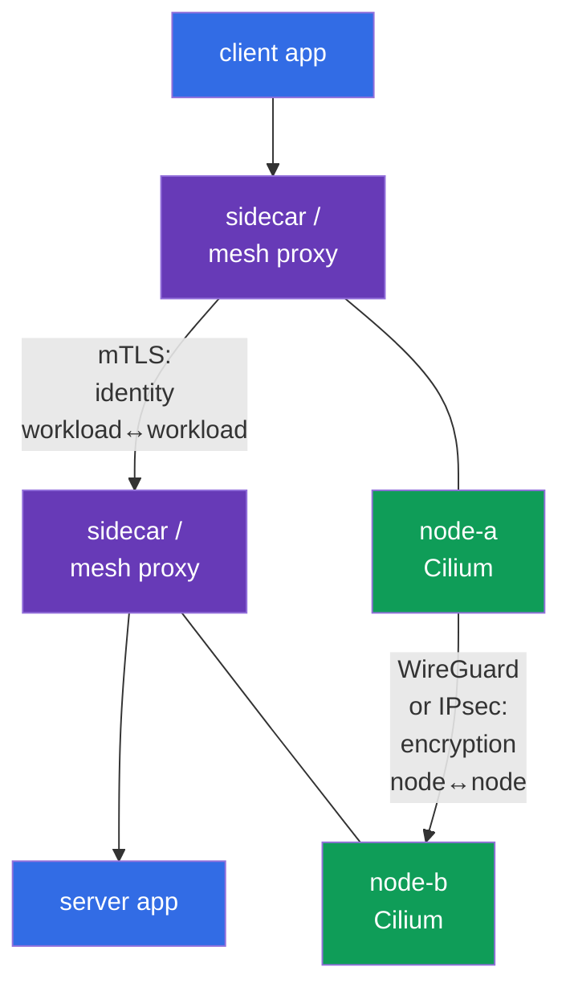
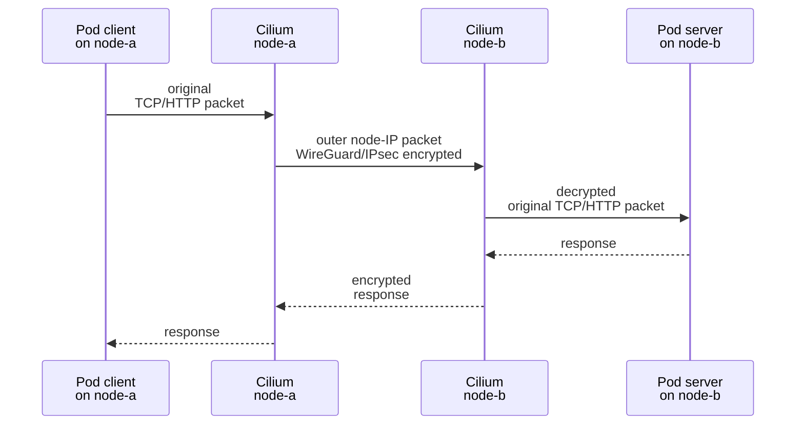
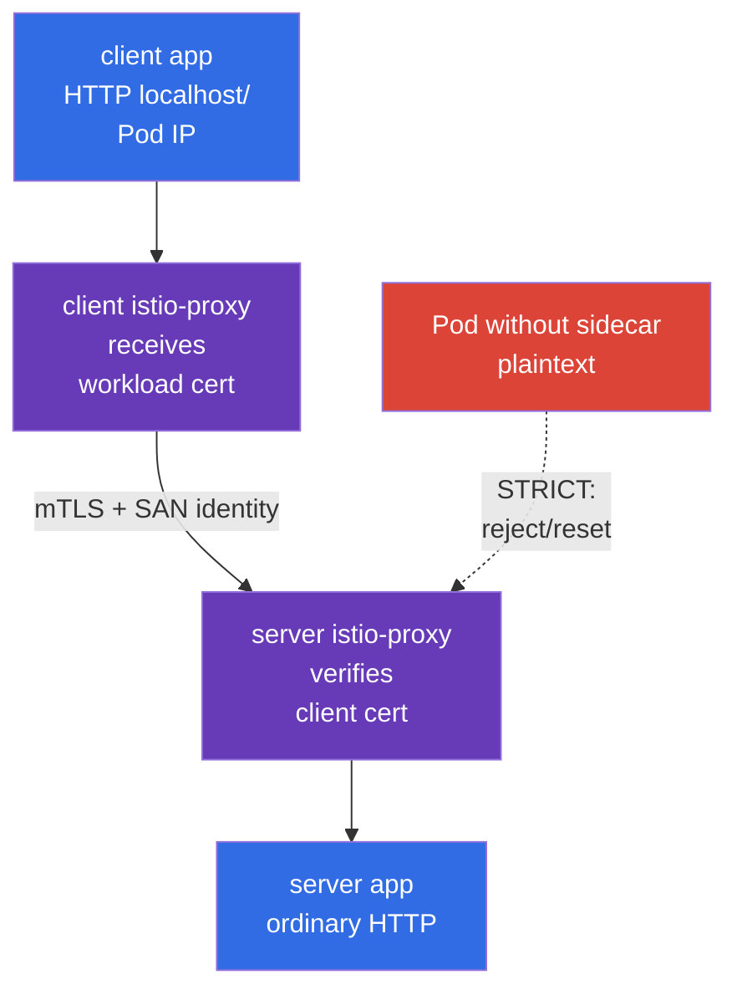

[Русская версия](ru.md) · [Versión en español](es.md) · [Version française](fr.md) · [Deutsche Version](de.md) · [ქართული ვერსია](ge.md) · [繁體中文版](tw.md) · [日本語版](jp.md)

# Chapter 23. Pod-to-Pod encryption and mTLS: Cilium, Istio, and Linkerd

> **The problem.** NetworkPolicy can allow only the required flow, but the data in it remains
> available for interception or tampering on the inter-node path, and a Service without mutual
> identity verification can accept a connection from another workload. Compromising a node, network
> segment, or client can then expose tokens and payloads or allow impersonation of a trusted
> Service; transport encryption and mTLS for workload identity are separately required.

> **What comes next.** NetworkPolicy allows or denies a flow, but does not by itself make it
> confidential. In this chapter, we build two distinct layers of Pod-to-Pod traffic protection:
> transparent network encryption between nodes through Cilium (WireGuard or IPsec) and mutual
> TLS authentication of workloads through a service mesh (Istio or Linkerd). This is the
> **Implement Pod-to-Pod encryption (Cilium, Istio)** competency in the CKS *Minimize Microservice
> Vulnerabilities* domain (20%).

> **What you need from CKA.** The basic Pod network and CNI model are covered in
> [CKA chapter 30](../../../cka/course/30/README.md), Service/DNS in
> [CKA chapter 31](../../../cka/course/31/README.md), and NetworkPolicy in
> [CKA chapter 34](../../../cka/course/34/README.md). This chapter assumes that you can
> find a Pod, Service, and node, and test a regular `curl`.

> 🧠 Cilium WireGuard/IPsec protects node-to-node transport, mesh mTLS protects proxy connections and workload identity, and NetworkPolicy authorizes the flow.

## 23.1. Two tasks, two layers: encryption and mTLS

The phrase "encrypt Pod-to-Pod traffic" has two distinct meanings. They are not interchangeable.

- **Cilium WireGuard/IPsec** protects the packet between nodes. It encrypts and authenticates
  the node-to-node transport segment transparently to the application: the container receives no
  certificate, the Service does not change, and HTTP inside the workload remains HTTP.
- **Service mesh mTLS** creates a TLS connection between workload proxies. It authenticates the
  identity of the calling workload and the server, not just the nodes. Istio and Linkerd usually
  issue short-lived certificates themselves and intercept traffic through a sidecar/proxy.
- **NetworkPolicy** answers a separate question: which flow is allowed at all. Neither Cilium
  encryption nor mTLS provides allow/deny by namespace and Pod selector in place of NetworkPolicy.



For traffic between nodes, these mechanisms can be combined: the service mesh protects the
connection between workload proxies, and Cilium encryption additionally protects packets on the
inter-node network segment. **Cilium WireGuard and IPsec do not encrypt same-node Pod-to-Pod traffic by design**:
there is no inter-node outer packet. mTLS still protects the connection between workloads in the
mesh. Conversely, Cilium encryption does not replace mTLS: a compromised workload on a trusted
node does not receive a verifiable client identity.

| Question | Cilium WireGuard/IPsec | Istio/Linkerd mTLS | NetworkPolicy |
|---|---|---|---|
| Where it applies | path between nodes | between workload proxies | Pod ingress/egress |
| Encrypts the HTTP payload on the physical network | yes | yes | no |
| Authenticates | cryptographic node peers | workload identity | not identity, but selector/IP/port |
| Sidecar/proxy required in a Pod | no | yes (or the ambient/eBPF mode of a particular mesh) | no |
| Does the application see the certificate | no | usually no | no |
| Protects same-node Pod-to-Pod | no: Cilium WireGuard/IPsec do not encrypt this traffic by design | yes, if both are in the mesh | restricts, but does not encrypt |

> 🎯 Before the change, record the CNI, versions, firewall, MTU, and cross-node placement of the test Pods.


**Record** here means not changing the configuration, but preserving a baseline - a snapshot of
the working state that can be compared with the result after rollout. Save the output of the
checks in a change/incident note or training records: which CNI already serves the network and its
version; which Kubernetes/kernel/Cilium versions are involved; whether the firewall allows the
required inter-node protocol; and what MTU is available along the path. **Cross-node placement**
means that the two test Pods are actually scheduled on **different** nodes. This matters: only such
a flow creates the node-to-node outer packet used to prove WireGuard/IPsec. If traffic stops
working after the change, the baseline helps distinguish a new defect from a pre-existing
firewall/MTU/placement limitation.
## 23.2. Before the change: scope, compatibility, and baseline state

CNI encryption and a service mesh are cluster-wide or namespace-wide changes. Do not enable them
blindly in production: an incorrect MTU, old kernel, firewall, or strict mTLS for a legacy client
can stop traffic. First record the current CNI, versions, placement of the test Pods, and packet
path.

```bash
kubectl get nodes -o wide
kubectl get pods -A -o wide
kubectl -n kube-system get ds cilium
kubectl -n kube-system get pods -l k8s-app=cilium -o wide
kubectl get networkpolicy -A
```

Check in advance:

1. Cilium is already the CNI, and the Cilium version and kernel support the selected mode according
   to the official compatibility matrix. Do not install a second CNI over a working one.
2. The WireGuard UDP port must be allowed between all worker nodes (by default, Cilium uses
   `51871`, but verify the value in the installed configuration), or Cilium IPsec requires ESP
   (IP protocol 50). The typical IKE/NAT-T UDP/4500 scenario is not part of the Cilium IPsec
   mechanism described here. Security groups, firewall, and routes are part of the solution.
3. The physical network has enough MTU headroom. Encapsulation adds headers; with a path-MTU
   problem, a small `curl` can work while large responses hang.
4. Two test Pods exist on different nodes. Otherwise, tcpdump cannot prove node-to-node
   encryption. For a training test, assign them `nodeSelector`/`podAntiAffinity` or find
   workloads that are already distributed.
5. A rollback plan and maintenance window exist. Changing Helm values without retaining the
   previous release turns diagnosis into guesswork.

The command below shows the actual parameters of the installed Helm release. Release names and
values depend on the installation method; do not substitute them for the GitOps source of truth.

```bash
helm -n kube-system list
helm -n kube-system get values cilium --all
kubectl -n kube-system get configmap cilium-config -o yaml
```

> 🎯 Transparent encryption protects only the inter-node segment; select a backend and verify its scope.

## 23.3. Cilium transparent encryption: model and boundaries

Cilium encrypts traffic in the datapath on nodes. When a Pod on `node-a` sends data to a Pod on
`node-b`, Cilium encapsulates/encrypts the original packet, sends an outer packet between the
node IPs, and Cilium on `node-b` verifies the peer, decrypts it, and delivers the original packet
to the target Pod. This is transparent to the Kubernetes Service, DNS, and application: there is
no need to change the URL or port, or add a TLS library.



**Transparent** does not mean "encryption everywhere and against everything." Plaintext can be
visible at the application interface or inside the namespace before encryption/after decryption.
Encryption also does not make an insecure application secure: it does not block SQL injection,
provide user authorization, or limit a compromised Pod. Those tasks require application security,
mTLS/authorization, RBAC, and NetworkPolicy.

Cilium supports two common backends:

| Property | WireGuard | IPsec |
|---|---|---|
| Cryptographic model | modern, compact VPN protocol | IPsec ESP; often an organization/network standard |
| Network transport | UDP, usually `51871` | ESP (IP protocol 50) |
| Keys/peer | key pair for each peer; public key identifies an allowed node | key material in a Cilium IPsec Secret, Security Association between peers |
| Authentication | packet accepted only from a known public key/allowed peer | ESP integrity + Security Association keys |
| Operational choice | usually a straightforward choice for a supported Linux environment | required when an existing IPsec/network standard demands it |
| What to check with tcpdump | UDP to the WireGuard port, without HTTP payload | `esp`, without HTTP payload |

Cilium 1.20 also documents the **beta** `ztunnel` encryption backend. This is a
forward-looking production extension, not the main CKS path; WireGuard or IPsec is sufficient
here for the exam scenario.

Select **one** backend. Enabling WireGuard and IPsec simultaneously as a form of "double
protection" is not a normal Cilium configuration and only complicates troubleshooting. Verify
the exact Helm values and supported combinations against the documentation for the version
installed in the cluster: values from an old article may not suit a newer Cilium release.

> 🎯 Verify version-pinned values, rollout of Cilium agents, and encryption status; a peer key confirms a node, not Pod identity.

## 23.4. WireGuard: enabling it, peer keys, and mutual authentication

WireGuard uses a private/public key pair for each peer. Cilium automatically manages the keys
and distributes the required public keys between Cilium agents through the Kubernetes API. A node
accepts an encrypted packet only when it passes cryptographic verification of the expected peer;
spoofing a node IP without the key is insufficient. Therefore, at the transport layer this provides
both confidentiality and **mutual authentication of node peers**.

This is not workload identity: two Pods on one node do not have different WireGuard identities,
and the server cannot learn the client's ServiceAccount from a WireGuard key. Service mesh mTLS
is required for that kind of mutual trust.

The following shows a typical Helm configuration. Apply it through your version-pinned GitOps or
a pinned Helm release, after verifying the values for the particular Cilium release.
`encryption.nodeEncryption=true` extends protection to node-to-node traffic. For WireGuard,
Cilium excludes nodes with the `node-role.kubernetes.io/control-plane` label from node-to-node
encryption by default: this prevents a bootstrap problem when updating the public key. Do not
assume that the control plane is automatically covered by this setting; enable it only after
understanding its effect on control-plane and host traffic.

```bash
# Example: substitute the already approved version and values from the repository.
helm upgrade cilium cilium/cilium \
  --namespace kube-system \
  --reuse-values \
  --version <pinned-cilium-version> \
  --set encryption.enabled=true \
  --set encryption.type=wireguard

kubectl -n kube-system rollout status daemonset/cilium --timeout=10m
kubectl -n kube-system get pods -l k8s-app=cilium
```

If policy requires encrypting node traffic as well, make it a separate, reviewable change and
test API server/kubelet availability:

```bash
helm upgrade cilium cilium/cilium \
  --namespace kube-system \
  --reuse-values \
  --version <pinned-cilium-version> \
  --set encryption.enabled=true \
  --set encryption.type=wireguard \
  --set encryption.nodeEncryption=true
```

After rollout, check the state **on every Cilium agent**, not just the one Pod that
`kubectl exec ds/cilium` selects arbitrarily:

```bash
kubectl -n kube-system get pods -l k8s-app=cilium -o wide
kubectl -n kube-system get pods -l k8s-app=cilium -o name |
  while IFS= read -r agent; do
    echo "=== $agent ==="
    kubectl -n kube-system exec "$agent" -- cilium-dbg status --verbose
    kubectl -n kube-system exec "$agent" -- cilium-dbg encrypt status
  done
```

Healthy agents and encryption state without peer/handshake errors are expected on every node.
Depending on the Cilium version, the command may show the WireGuard interface, peers, public
keys, or counters. `cilium-dbg` is the local agent CLI: if the subcommand is absent, run
`cilium-dbg --help` **in that same agent** and check the documentation for the installed Cilium
version, because this binary is supplied with the agent. The external Cilium CLI, `cilium`, run
from an administrative machine has separate versioning: use a supported compatible version and
its compatibility table, rather than the same version number as the release.

> 🔬 Strict mode prevents the first plaintext packet, but requires version- and routing-specific compatibility.

### Strict mode: prevent the first plaintext packet

With ordinary transparent WireGuard for Pod-to-Pod traffic between Cilium-managed endpoints on
different nodes, the agent may not learn a new remote endpoint immediately; until then, its first
egress packets can potentially leave without a tunnel. If the threat model does not permit this,
use strict mode after separately checking version compatibility:

```yaml
encryption:
  strictMode:
    egress:
      enabled: true
      # IPv4 Pod CIDR of this cluster - replace with the actual value.
      cidr: 10.244.0.0/16
    ingress:
      enabled: true
```

`encryption.strictMode.egress` is supported only for IPv4, so `cidr` must be the actual IPv4
Pod CIDR; the mode also has constraints for direct routing, node CIDR, and selected interfaces.
`encryption.strictMode.ingress` drops cluster-internal Pod traffic that did not arrive through a
WireGuard tunnel; it is not a universal strict mode for IPsec. Before enabling it, verify the
requirements of the Cilium release for native/direct routing and device configuration, then use
a negative test to confirm that plaintext Pod-to-Pod packets between nodes do not pass. Do not
enable strict mode as a substitute for checking NetworkPolicy, firewall, and control-plane
availability.

> 🏭 For a compromised node: isolate it, preserve evidence, remove the old peer from trust; the private key never goes into a ticket, Git, or chat.

**What this means in practice:** "compromised" means there is reason to believe that an attacker
could run commands on the node or read its data. **Isolate it** means do not schedule new Pods to
it, and limit its participation in the cluster according to the approved incident procedure; this
contains the spread, but does not erase evidence. **Evidence** is the metadata and logs needed
for investigation (time, node name, Cilium state, and events), not a copy of the private key.
**Remove the old peer from trust** means, after regenerating a key or replacing a node, confirm
that the other nodes no longer accept traffic authenticated with the old public key. The following
list shows the safe sequence for these actions.

### WireGuard key rotation and an incident

Cilium automates the key lifecycle, but the security design must still describe who can read or
change Cilium resources and how to respond to node compromise. Do not copy a private key from a
node into a ticket, chat, or Git. On suspicion of compromise:

1. isolate the node (`cordon`/`drain`, accounting for DaemonSet and PDB), and preserve evidence;
2. check Cilium agent logs, health, and peers on the other nodes;
3. follow the documented procedure for the Cilium version to remove/regenerate the peer key or
   recreate the node;
4. verify that the new node received a new identity/key and that the old peer no longer accepts
   traffic;
5. repeat the functional and packet-level checks from section 23.10.

`kubectl get secret -A` and broad permission to read Secrets provide access not only to IPsec
material, but also to many other secrets. Restrict RBAC and audit access to `kube-system`.

> 🔬 IPsec is an alternative Cilium backend with key rotation, ESP diagnostics, a compatible Cilium CLI, and a key-overlap window.

## 23.5. IPsec: when it is needed and how not to break key management

IPsec in Cilium also provides transparent node-to-node encryption, but uses IPsec ESP Security
Associations. It is often selected when corporate requirements or existing network infrastructure
require IPsec. A packet on the physical interface appears as ESP (IP protocol 50); application
HTTP must not be readable in it. Do not bring the general IKE/NAT-T model with UDP/4500 here: it
is not part of this Cilium mechanism.

A typical transition for a Cilium release that supports IPsec starts with the key Secret: the
agent must receive `cilium-ipsec-keys` **before** enabling `encryption.type=ipsec`. Perform
creation only from an administrative machine that has a supported compatible Cilium CLI and a
kubeconfig. If the Secret already exists, do not accidentally overwrite it - first check its
owner and the version-specific rotation procedure:

```bash
kubectl -n kube-system get secret cilium-ipsec-keys >/dev/null 2>&1 || \
  cilium encrypt create-key --auth-algo rfc4106-gcm-aes

# Check only key presence and metadata, not the key data.
kubectl -n kube-system get secret cilium-ipsec-keys \
  -o custom-columns=NAME:.metadata.name,TYPE:.type,CREATED:.metadata.creationTimestamp
kubectl -n kube-system get secret cilium-ipsec-keys \
  -o jsonpath='{.metadata.resourceVersion}{"\n"}'

helm upgrade cilium cilium/cilium \
  --namespace kube-system \
  --reuse-values \
  --version <pinned-cilium-version> \
  --set encryption.enabled=true \
  --set encryption.type=ipsec

kubectl -n kube-system rollout status daemonset/cilium --timeout=10m
kubectl -n kube-system get pods -l k8s-app=cilium -o name |
  while IFS= read -r agent; do
    echo "=== $agent ==="
    kubectl -n kube-system exec "$agent" -- cilium-dbg encrypt status
  done
```

Cilium stores IPsec key material in the `cilium-ipsec-keys` Secret in `kube-system`. Do not
print it to a terminal, CI log, or documentation. It is acceptable to check its presence and
metadata without decoding the data.

For rotation, use only a supported **compatible** version of the Cilium CLI and the
version-specific procedure. Obtain ordinary non-secret status through `cilium encryption
status` from an administrative machine and `cilium-dbg encrypt status` on every node. The
`cilium encryption key-status` command prints IPsec key material: run it only when an approved
rotation procedure explicitly requires it, in a protected terminal, without output to CI, a log,
ticket, or chat.

```bash
# Administrative machine with a supported compatible Cilium CLI.
cilium encryption status
cilium encryption rotate-key
```

For multiple clusters or a non-standard release, add the required `--context`,
`--namespace kube-system`, and `--helm-release-name` parameters to the commands. Do not perform
rotation from a Cilium Pod. Check the subcommand's availability with `cilium encryption --help`
and the CLI compatibility table. With `encryption.ipsec.keyWatcher=true` (default), agents pick
up the updated Secret without a DaemonSet restart; normally all agents apply it in about a minute,
and the old and new keys coexist in the rotation window. A DaemonSet restart/rollout is necessary
only when the watcher is disabled or the documentation for the installed version explicitly
requires it.

You cannot manually replace the Secret with a single random string: peer desynchronization causes
packet loss. The practical minimum for a change request:

- generate the new key cryptographically at random and transfer it over a protected channel;
- take the key Secret order and format from the documentation for the installed Cilium;
- check the Secret `resourceVersion` and `cilium-dbg encrypt status` on **all** agents before the
  end of the key-overlap window;
- measure loss/errors and have rollback before removing the old key;
- after rotation, check the application and physical capture on the required pair of nodes.

**Do not confuse the IPsec key with the mTLS CA.** The IPsec key protects transport peers, while
the mesh certificate confirms workload identity. Their owner, rotation interval, audit, and blast
radius may differ.

This completes the Cilium transport encryption setup. Istio is deliberately considered immediately
afterward: it is **not** the next Cilium parameter and not a prerequisite for IPsec, but an
independent additional layer. For a cross-node request, Cilium protects the outer packet between
nodes, while Istio mTLS lets a proxy verify the identity of a specific workload. Therefore,
healthy Cilium encryption does not yet prove Istio injection, certificates, or mTLS policy -
those checks are performed separately in the next section.

> 🎯 Istio mTLS binds a certificate to workload identity; distinguish `PeerAuthentication: STRICT` from `DestinationRule` with `ISTIO_MUTUAL`, and check the proxy/injection.

> 🔬 **Upstream identity primitive.** Kubernetes v1.37 stabilized Pod Certificates and ClusterTrustBundles. They provide X.509 primitives at the Kubernetes level, but do not automatically make the Istio/SPIFFE identity plane unnecessary: signer, trust model, and mesh enforcement are separate architectural decisions. See [Kubernetes v1.37 Security Delta](../APPENDIX_K8S_137_SECURITY_DELTA.md).

## 23.6. Istio: sidecar, SPIFFE workload identity, and `PeerAuthentication`


### What problem Istio solves after Cilium

The preceding sections have already protected **transport between nodes**: Cilium WireGuard/IPsec
encrypts the outer packet and authenticates the node peer. But that is insufficient when it is
important to answer the question: "which exact workload is calling the Service?" Cilium does not
give the application or server a verifiable identity for the client Pod/ServiceAccount, and does
not itself make a server accept only mTLS. In addition, Cilium node encryption does not create an
outer tunnel for Pods on the same node by design.

Istio solves a different part of the task: workload proxies receive certificates, establish mTLS,
and verify peer identity. `PeerAuthentication: STRICT` can reject plaintext inbound traffic.
Together, they work as follows: **Istio protects and authenticates the workload-to-workload
connection, while Cilium additionally protects the packet on the untrusted inter-node segment**.
`NetworkPolicy` remains a third layer - it determines which flow is allowed at all.

| Question | Cilium WireGuard/IPsec | Istio mTLS |
|---|---|---|
| Main benefit | Transparent node-to-node encryption without changing the application or Service | Workload identity, mutual authentication, and `STRICT` against a plaintext client |
| What it does not solve | Does not provide the server with client workload identity; does not encrypt same-node flow by design | Does not hide outer L3/L4 metadata from the underlay or cover non-mesh flow; does not replace NetworkPolicy |
| Cost/limitation | Compatible CNI/kernel, firewall, and MTU are required; keys belong to nodes | Requires a control plane, certificates, and a proxy/ambient dataplane; sidecar mode adds a container and overhead |
| What to prove | Cilium agent status and outer WireGuard/ESP on the physical NIC | Injection/enrollment, proxy/certificate status, and mTLS/`STRICT` tests |

This is not mandatory "double encryption." If **both** workloads are already in the mesh, trust
is verified, and `PeerAuthentication: STRICT` is actually applied, mTLS already encrypts the
application payload between proxies. Cilium node encryption does not have to be enabled merely to
encrypt the same payload again.

Cilium adds separate value when the threat model requires protecting the node-to-node underlay:
hiding the inner Pod IP/port and other L3/L4 metadata from the physical network, covering a
sensitive cross-node flow outside the mesh, or fulfilling a policy/compliance requirement for
encryption between nodes. Both layers are needed only when **both** goals apply: workload
identity/mTLS **and** underlay or non-mesh traffic protection. If the application does not
require workload identity or mesh-compatible behavior, Istio is not enabled automatically - first
evaluate the threat model, compatibility, and overhead.
Istio sidecar (`istio-proxy`, Envoy) intercepts inbound/outbound workload traffic. Istiod issues a
workload certificate based on the Kubernetes ServiceAccount; proxies establish mTLS and verify
peer identity. Workload identity has the SPIFFE ID form:
`spiffe://<trust-domain>/ns/<namespace>/sa/<service-account>`. The application normally continues
to listen on its ordinary HTTP port because TLS terminates in the sidecar, not the app container.

In **ambient mode**, Istio does not add a separate sidecar to every Pod. Instead, `ztunnel`
(**Zero Trust Tunnel**) - a dedicated node-level proxy - runs on every node. It performs mesh
L3/L4 tasks, including mTLS and authentication, without requiring the application to work with
TLS itself.

`HBONE` (**HTTP-Based Overlay Network Environment**) is a secure Istio tunnel between mesh
components. It carries multiple TCP streams through one mTLS connection; consequently, workload
traffic can be protected even though `istio-proxy` is not listed among the Pod containers. The
absence of `istio-proxy` in ambient mode does not mean a plaintext client. In both models,
`PeerAuthentication` with `STRICT` does not allow plaintext inbound traffic: in ambient mode, the
server expects a protected HBONE/mTLS flow.

The following check for `istio-injection=enabled` and the presence of `istio-proxy` applies **only
to sidecar mode**. For ambient mode, check workload enrollment and `ztunnel` status using the
documentation for the installed Istio version, rather than expecting an additional container in
the Pod.



### Enable injection and verify the sidecar

For a training namespace, enable injection before creating Pods. In production, use the revision
label of the Istio installation controlled by the change process; do not mix different revisions
without a migration plan.

```bash
kubectl create namespace mesh-demo
kubectl label namespace mesh-demo istio-injection=enabled

kubectl -n mesh-demo apply -f server.yaml
kubectl -n mesh-demo apply -f client.yaml
kubectl -n mesh-demo get pods
kubectl -n mesh-demo get pod -l app=server \
  -o jsonpath='{range .items[*]}{.metadata.name}{": "}{.spec.containers[*].name}{"\n"}{end}'
```

The container list must include `istio-proxy` alongside `server`. A missing sidecar is not a
cosmetic defect: a plaintext client will not become an mTLS client, and `STRICT` will correctly
reject it. For an existing Deployment, perform a controlled rollout after applying the label:

```bash
kubectl -n mesh-demo rollout restart deployment/server
kubectl -n mesh-demo rollout status deployment/server
kubectl -n mesh-demo get pod -l app=server \
  -o jsonpath='{range .items[*]}{.metadata.name}{": "}{.spec.containers[*].name}{"\n"}{end}'
```

### `PeerAuthentication`: the server requires mTLS

`PeerAuthentication` sets the inbound mTLS policy. `STRICT` means that the server proxy accepts
only mTLS traffic from a peer that can present a trusted certificate. Plaintext TCP from a
workload without a sidecar is not an allowed fallback.

The following resource applies to the whole `mesh-demo` namespace. A namespace selector is not
needed here: the namespace is specified by `metadata.namespace`.

```yaml
apiVersion: security.istio.io/v1
kind: PeerAuthentication
metadata:
  name: default
  namespace: mesh-demo
spec:
  mtls:
    mode: STRICT
```

You can narrow the policy to one server workload. This selector matches the Pod label, not the
Service name; check the actual labels with `kubectl get pod --show-labels`.

```yaml
apiVersion: security.istio.io/v1
kind: PeerAuthentication
metadata:
  name: server-strict
  namespace: mesh-demo
spec:
  selector:
    matchLabels:
      app: server
  mtls:
    mode: STRICT
```

Do not apply namespace-wide `STRICT` and a workload policy with conflicting `PERMISSIVE` at the
same time without understanding precedence. A good migration usually looks like this:

```text
inventory clients -> inject/fix clients -> PERMISSIVE measurement (if needed) ->
verify mTLS -> STRICT narrow scope -> STRICT namespace -> remove temporary exception
```

`PERMISSIVE` is useful only as temporary compatibility: the proxy accepts both mTLS and plaintext,
so a successful `curl` does not yet prove mTLS. `DISABLE` for an ordinary TCP workload creates an
exception that must be minimized and documented with an owner and expiry.

### `DestinationRule`: the client must not disable TLS

Istio auto mTLS can select TLS automatically, but an explicit `DestinationRule` is useful as
verifiable client-side intent in a training environment or when organizational policy requires an
explicit configuration. `PeerAuthentication` protects the inbound server, while `DestinationRule`
sets TLS for outbound client traffic - they are different sides of the connection.

```yaml
apiVersion: networking.istio.io/v1
kind: DestinationRule
metadata:
  name: server-mtls
  namespace: mesh-demo
spec:
  host: server.mesh-demo.svc.cluster.local
  trafficPolicy:
    tls:
      mode: ISTIO_MUTUAL
```

`ISTIO_MUTUAL` means Envoy uses the certificates and trust bundle managed by Istio. Do not
replace it with `SIMPLE`: `SIMPLE` creates an ordinary TLS client without a workload client
certificate and does not satisfy mTLS. `DISABLE` sends plaintext and must be rejected when the
server is `STRICT`. External Services usually require separate `ServiceEntry`/TLS settings; do
not use this example as a global rule for all `*.svc.cluster.local`.

Verify the applied objects and the actual proxy configuration:

```bash
kubectl -n mesh-demo get peerauthentication,destinationrule
istioctl proxy-status
istioctl proxy-config cluster deploy/client -n mesh-demo | grep server.mesh-demo
istioctl analyze -n mesh-demo
```

`istioctl analyze` and `proxy-config` depend on the Istio version, but the useful idea remains:
inspect not only the YAML in Git, but the proxy runtime configuration. Successful creation of a CR
does not guarantee that the selector/host matched the intended endpoint.

> 🎯 With `STRICT`, a meshed client receives `200`; a client without a sidecar does not receive a plaintext success.

## 23.7. Controlled Istio experiment: 200 inside the mesh, reset outside

The following environment proves the main boundary of `STRICT`: a meshed client receives HTTP
`200`, while a client without a sidecar makes a plaintext request and receives a TCP reset/TLS
error rather than access to the server. Run it only in a dedicated namespace: `STRICT`
intentionally breaks legacy plaintext calls.

First create the namespace with injection and the server/client workloads. The client has a
sidecar from the namespace label; `legacy-client` below runs in a separate namespace without
injection.

```yaml
apiVersion: v1
kind: Namespace
metadata:
  name: mesh-demo
  labels:
    istio-injection: enabled
---
apiVersion: v1
kind: Service
metadata:
  name: server
  namespace: mesh-demo
spec:
  selector:
    app: server
  ports:
  - name: http
    port: 8080
    targetPort: 8080
---
apiVersion: apps/v1
kind: Deployment
metadata:
  name: server
  namespace: mesh-demo
spec:
  replicas: 1
  selector:
    matchLabels:
      app: server
  template:
    metadata:
      labels:
        app: server
    spec:
      containers:
      - name: server
        image: hashicorp/http-echo:1.0
        args: ["-listen=:8080", "-text=server-ok"]
        ports:
        - containerPort: 8080
---
apiVersion: apps/v1
kind: Deployment
metadata:
  name: client
  namespace: mesh-demo
spec:
  replicas: 1
  selector:
    matchLabels:
      app: client
  template:
    metadata:
      labels:
        app: client
    spec:
      containers:
      - name: client
        image: curlimages/curl:8.12.1
        command: ["sleep", "infinity"]
---
apiVersion: security.istio.io/v1
kind: PeerAuthentication
metadata:
  name: default
  namespace: mesh-demo
spec:
  mtls:
    mode: STRICT
---
apiVersion: networking.istio.io/v1
kind: DestinationRule
metadata:
  name: server-mtls
  namespace: mesh-demo
spec:
  host: server.mesh-demo.svc.cluster.local
  trafficPolicy:
    tls:
      mode: ISTIO_MUTUAL
```

```bash
kubectl apply -f istio-strict-demo.yaml
kubectl -n mesh-demo rollout status deployment/server
kubectl -n mesh-demo rollout status deployment/client
kubectl -n mesh-demo get pods -o wide

CLIENT=$(kubectl -n mesh-demo get pod -l app=client -o jsonpath='{.items[0].metadata.name}')
kubectl -n mesh-demo exec "$CLIENT" -c client -- \
  curl -sS -o /dev/null -w '%{http_code}\n' http://server.mesh-demo.svc.cluster.local:8080
# Expected: 200
```

Now create a client without injection. The `istio-injection=disabled` label on the Pod is not
needed if the `legacy-demo` namespace is not labeled for injection; the explicit annotation makes
the intent visible during review.

```yaml
apiVersion: v1
kind: Namespace
metadata:
  name: legacy-demo
---
apiVersion: v1
kind: Pod
metadata:
  name: outside-client
  namespace: legacy-demo
  annotations:
    sidecar.istio.io/inject: "false"
spec:
  containers:
  - name: client
    image: curlimages/curl:8.12.1
    command: ["sleep", "infinity"]
```

```bash
kubectl apply -f outside-client.yaml
kubectl -n legacy-demo wait --for=condition=Ready pod/outside-client --timeout=120s
kubectl -n legacy-demo get pod outside-client \
  -o jsonpath='{.spec.containers[*].name}{"\n"}'
# Expected: only client, without istio-proxy

kubectl -n legacy-demo exec outside-client -- \
  curl --connect-timeout 5 --max-time 10 -v http://server.mesh-demo.svc.cluster.local:8080
# Expected: non-zero; usually "Recv failure: Connection reset by peer".
```

The exact error text depends on the Envoy version, protocol, and interception point: possible
results include `connection reset`, a TLS handshake error, or a timeout. The security criterion is
not the error string, but the absence of a plaintext success: the command does not return HTTP
`200`, and the server proxy does not accept the unauthenticated flow. For a strict automated
check, capture both indicators:

```bash
set +e
OUT=$(kubectl -n legacy-demo exec outside-client -- \
  curl -sS --connect-timeout 5 --max-time 10 -o /dev/null -w '%{http_code}' \
  http://server.mesh-demo.svc.cluster.local:8080 2>&1)
RC=$?
set -e
printf 'exit=%s output=%s\n' "$RC" "$OUT"
test "$RC" -ne 0 || test "$OUT" != 200
```

If **inside the mesh does not return 200**, check for `istio-proxy`, DNS/Service endpoints,
`PeerAuthentication`, `DestinationRule`, proxy status, and NetworkPolicy. If **outside returns
200**, first verify that `STRICT` applied to the server Pod and that `outside-client` really has
no sidecar; then look for a more specific `PeerAuthentication` policy that overrode the test.

> 🔬 Linkerd has its own identity model and policy API; do not use it together with an Istio sidecar in the same Pod.

## 23.8. Linkerd: a production mTLS option and ServiceAccount identity

Linkerd is a full production service mesh option for workload mTLS, but it is supplementary
material: the core CKS competencies for Pod-to-Pod encryption explicitly name Cilium and Istio,
not Linkerd. Linkerd uses its own lightweight proxy and identity model. After injection, a Pod
gets `linkerd-proxy`; meshed traffic between Linkerd workloads is automatically encrypted and
authenticated with mTLS. Identity is usually tied to a Kubernetes ServiceAccount and has a
DNS-like form:

```text
<serviceaccount>.<namespace>.serviceaccount.identity.linkerd.cluster.local
```

Do not place Istio and Linkerd sidecars in the same workload for "extra protection." Both want to
intercept traffic, issue certificates, and manage policy; the result is an iptables/ports conflict,
unreliable observability, and complicated incident response. Select one mesh for a namespace or
perform a documented migration.

Before installing Linkerd, check cluster prerequisites, the presence of compatible Gateway API
CRDs, and use a pinned release. Modern Linkerd requires Gateway API CRDs; if they are absent,
first install the version compatible with your release according to the official instructions.

```bash
kubectl get crd gateways.gateway.networking.k8s.io
# If the CRD is absent, install a compatible Gateway API CRD release before linkerd install.
linkerd check --pre
linkerd install --crds | kubectl apply -f -
linkerd install | kubectl apply -f -
linkerd check

# Viz is a separate extension; install it before viz commands.
linkerd viz install | kubectl apply -f -
linkerd viz check
```

In production, the installation manifest must be generated and verified in CI from a pinned
CLI/chart version, not a floating `latest`. After the health check, enable injection only for a
test namespace and restart the workloads:

```bash
kubectl create namespace linkerd-demo
kubectl annotate namespace linkerd-demo linkerd.io/inject=enabled
kubectl -n linkerd-demo apply -f server.yaml
kubectl -n linkerd-demo apply -f client.yaml
kubectl -n linkerd-demo rollout status deployment/server
kubectl -n linkerd-demo get pod -l app=server \
  -o jsonpath='{.items[0].spec.containers[*].name}{"\n"}'
linkerd -n linkerd-demo check --proxy
linkerd -n linkerd-demo viz stat deploy
```

As with Istio, check not only the annotation, but also the actual proxy container,
identity/certificate status, and a successful request between meshed Pods. It is important to
distinguish automatic mTLS from strict inbound: Linkerd automatically uses mTLS between meshed
workloads, but inbound authorization accepts plaintext from a non-meshed source
(`all-unauthenticated`) by default. The mere presence of automatic mTLS does not mean the server
accepts only mTLS.

For a minimal strict inbound policy, set `all-authenticated` before creating workloads in the
training namespace:

```yaml
apiVersion: v1
kind: Namespace
metadata:
  name: linkerd-demo
  annotations:
    linkerd.io/inject: enabled
    config.linkerd.io/default-inbound-policy: all-authenticated
```

After applying it, create a non-meshed client in a namespace without Linkerd injection and verify
that its plaintext `curl` to the Service does not return HTTP `200`; a meshed client with an
allowed identity must remain functional. For narrower rules, use the policy API of the release,
for example, `AuthorizationPolicy` together with `MeshTLSAuthentication`. The Linkerd policy API
and unauthorized-traffic behavior have changed between versions: before building default-deny,
verify the CRDs and policy mode of the installed release. mTLS confirms identity and protects the
channel, but does not necessarily mean "every identity can call every endpoint" - authorization
must be configured separately.

> 🔬 A capture sees inner plaintext/TLS before termination and the outer encrypted packet on the physical NIC.

## 23.9. WireGuard/IPsec and mesh together: where plaintext is visible

The check "`curl` works" does not prove encryption. `curl` verifies availability and the
application response, but it does not distinguish plaintext HTTP from encrypted traffic. Likewise,
tcpdump on `any` can simultaneously see an inner plaintext packet on a virtual interface and an
outer encrypted packet on the physical NIC. To prove this, first state *where* each layer should
be visible.

| Capture point | With Cilium encryption alone | With Cilium + Istio/Linkerd |
|---|---|---|
| app container / loopback to proxy | often plaintext HTTP | app↔local proxy can be plaintext |
| veth/CNI before node encryption | the original inner flow can be readable | mTLS ciphertext between mesh proxies |
| physical NIC on node-a/node-b | WireGuard UDP or IPsec ESP, without HTTP | outer WireGuard/IPsec; HTTP and TLS payloads are unreadable |
| server app after proxy | plaintext, because the proxy has already decrypted it | plaintext from the local proxy to the app |

This is the normal architecture of termination points. Cilium's goal is to remove readable payload
from the untrusted physical network path. The mesh goal is to make the workload-to-workload
segment TLS-protected and tie it to identity. Do not claim that "tcpdump never shows HTTP": on a
node and in a Pod it can be visible before/after encryption if an attacker has root on that node.

> 🎯 Confirm cross-node placement, the specific physical NIC, the time of the repeatable flow, and Cilium status.

## 23.10. `tcpdump` verification: prove outer encrypted traffic

For packet-level proof, you need Pods on **different** nodes, the node IPs of both nodes, and the
physical interface leading to the cluster network. Do not automatically use `eth0`: on a cloud
node, the interface can be named `ens5`, `ens192`, or something else.

```bash
NODE_B_IP="${NODE_B_IP:?set the second node IP}"
kubectl get pods -A -o wide
kubectl get nodes -o wide
# On the selected node:
ip -br link
ip route get "${NODE_B_IP}"
```

On the first node, run the capture specifically on the physical interface. The commands below
assume SSH/approved node access; do not add a privileged debug Pod to production merely for
convenience. With permitted break-glass access, `kubectl debug node/<node>` also provides
host-level diagnostics, but access itself must be auditable.

### WireGuard capture

```bash
# On node-a; replace ens5 and the node-b IP.
sudo tcpdump -ni ens5 -vv 'udp port 51871 and host <NODE_B_IP>'
```

In another terminal, create a repeatable cross-node flow. It is convenient to make several
requests from the client Pod that, according to `kubectl get pod -o wide`, is on `node-a`, to a
server Pod/Service on `node-b`:

```bash
for i in $(seq 1 20); do
  kubectl -n mesh-demo exec "$CLIENT" -c client -- \
    curl -sS http://server.mesh-demo.svc.cluster.local:8080 >/dev/null || exit 1
done
```

A series of UDP datagrams between node-a and node-b on the WireGuard port is expected. `-vv`
increases the detail of protocol header decoding, but does not print payload ASCII, so the absence
of `GET /`, `Host:`, or `server-ok` in that output proves nothing. UDP on the port also does not
yet prove it is the required Pod flow: correlate the capture time, node pair, and increasing
Cilium encryption counters/status.

If a disposable lab specifically requires comparing payloads, use a short capture of a controlled
non-secret flow with `-A` or `-X` and sufficient snaplen at the expected inner point. Do not apply
payload capture to sensitive production traffic.

### IPsec capture

For Cilium IPsec, the capture filters ESP, that is, IP protocol 50:

```bash
# On node-a: Cilium IPsec ESP.
sudo tcpdump -ni ens5 -vv 'host <NODE_B_IP> and esp'
```

Run the repeatable application flow again. ESP packets are expected. Do not use the absence of
HTTP strings in `tcpdump -vv` as proof: this mode does not show the payload. After the capture,
correlate the result with the agent **on node-a and node-b**:

```bash
for node in "${NODE_A:?set first node name}" "${NODE_B:?set second node name}"; do
  agent=$(kubectl -n kube-system get pods -l k8s-app=cilium \
    --field-selector "spec.nodeName=$node" \
    -o jsonpath='{.items[0].metadata.name}')
  test -n "$agent" || { echo "ERROR: no Cilium agent on $node" >&2; exit 1; }
  echo "=== node=$node agent=$agent ==="
  kubectl -n kube-system exec "$agent" -- cilium-dbg encrypt status
done
```

`grep` with no result is not proof of security: many normal agents do not log every packet.
Strong evidence consists of four matching facts: cross-node placement, `200` for the intended
flow, healthy encryption status/counters, and an encrypted outer protocol on the physical NIC.
For payload comparison, use only a limited lab capture with `-A`/`-X`, not production traffic.

### Negative verification and common traps

- **Capture on `-i any` shows HTTP.** This can be an inner packet before encryption, local
  delivery, or traffic between Pods on the same node. Repeat on the physical NIC and check
  placement.
- **No UDP/51871, but curl works.** The Pods may be on the same node, use another Cilium port,
  have encryption disabled, or use another transport. First check values and
  `cilium-dbg encrypt status`, then routes/interface.
- **ESP/UDP is present, but the capture does not match the test.** Other encrypted traffic is
  present on the node. Limit the BPF filter to the pair of node IPs and repeat the request in a
  short time window.
- **`tcpdump` sees TLS rather than HTTP.** This is expected for the mesh on the inner path, but
  does not prove Cilium. On the physical NIC with both layers enabled, outer WireGuard/IPsec is
  expected.
- **A large response hangs while a small one works.** Suspect MTU/MSS. Do not disable encryption
  as a "fix"; measure path MTU and configure the CNI/underlay according to the platform
  procedure.

> 🎯 Diagnose Cilium/underlay → DNS/Service → mesh identity/policy → NetworkPolicy; do not leave a `STRICT` or encryption bypass in place.

## 23.11. Diagnostics: determine the failure layer first

A single `connection reset` symptom can occur at several layers. Diagnose from the bottom up;
do not turn temporarily disabling `STRICT` or encryption into a permanent bypass.

| Symptom | Likely layer | First checks | Safe fix |
|---|---|---|---|
| Pods on different nodes cannot exchange traffic after rollout | Cilium/underlay | `cilium-dbg encrypt status`, agent logs, UDP/ESP firewall, MTU | restore compatible values/network according to the rollback plan |
| DNS Service does not resolve | CoreDNS/Service, not mTLS | `nslookup`, Endpoints, CKA chapter 31 | fix DNS/Service before analyzing TLS |
| Meshed client does not receive 200 | Istio/Linkerd or NetworkPolicy | sidecar/proxy, cert/identity, endpoints, policy | fix injection/identity/rule; do not set global `DISABLE` |
| Outside client receives reset | Istio `STRICT` | absence of sidecar, effective PeerAuthentication | expected proof; migrate the client into the mesh |
| Outside client receives 200 with `STRICT` | policy did not reach the server | selector, namespace, Pod labels, more specific policy | narrow/fix the policy and repeat the negative test |
| Intermittent loss after IPsec rotation | key rollout | Secret version, agents, peer encryption state | follow the Cilium-version overlap/rollback procedure |
| Linkerd proxy is not Ready | mesh install/identity | `linkerd check`, proxy logs, clock/DNS | fix trust/identity prerequisites; do not disable mTLS |

A useful minimal command set for incident evidence:

```bash
kubectl -n mesh-demo get pod,svc,endpointslice -o wide
kubectl -n mesh-demo get peerauthentication,destinationrule -o yaml
kubectl -n kube-system get pods -l k8s-app=cilium -o wide
kubectl -n kube-system get pods -l k8s-app=cilium -o name |
  while IFS= read -r agent; do
    echo "=== $agent ==="
    kubectl -n kube-system exec "$agent" -- cilium-dbg encrypt status
  done
istioctl proxy-status 2>/dev/null || true
linkerd check 2>/dev/null || true
```

Do not print a `Secret` with `-o yaml`, a private key, bearer token, or a full packet capture to
a shared incident channel. A capture can contain metadata, URLs, cookies, or plaintext at an
internal point. Retain only the minimally necessary evidence in approved storage with a retention
period.

> 🏭 Flow inventory, canary namespaces/nodes, a compatibility period, narrow exceptions, and runtime evidence after an upgrade, firewall change, or CA/key rotation.

## 23.12. Safe rollout and operational rules

Encryption is not a one-time installation command. It has owners, updates, rotation, alerting,
and evidence that the expected policy continues to work after a Kubernetes/Cilium/mesh upgrade.

1. **Inventory.** Find workloads without a sidecar, external clients, hostNetwork Pods,
   stateful protocols, and critical control-plane paths. For mTLS, create a graph of callers and
   servers, not just a list of namespaces.
2. **Canary namespaces/nodes.** Start with a dedicated namespace and a small node pool. For
   Istio, first prove a meshed `200` and a plaintext reset; for Cilium, prove the cross-node
   encrypted outer packet.
3. **Observe before enforce.** Collect latency, connection errors, packet drops, proxy
   certificate expiry, and Cilium health. `PERMISSIVE` is acceptable only as a measurable
   migration stage with a removal date.
4. **Narrow exceptions.** A `PeerAuthentication` selector, dedicated namespace, or documented
   legacy port is better than global `DISABLE`. An exception has an owner, reason, expiry, and
   negative test.
5. **Verify after a change.** A new node, Cilium upgrade, mesh CA rotation, and firewall change
   require repeating status, functional flow, and capture. YAML in Git does not replace runtime
   evidence.
6. **Plan for failure.** If the CA/identity control plane is unavailable, certificates will
   eventually expire; if a Cilium agent does not receive a key, cross-node flow degrades. Set an
   alert before expiry/rollout outage and document rollback.

A good layered production policy looks like this: NetworkPolicy allows only the required Service
flow; mesh `STRICT` requires an authenticated mTLS peer; Cilium encrypts the cross-node underlay;
the application authorizes the user/request. Each layer reduces the consequences of another
layer's error, but none removes the need for updates and monitoring.

## 23.13. Mini-glossary

- **Transparent encryption** - datapath encryption without changing the application, Service, or
  URL; Cilium applies it on nodes.
- **WireGuard** - a VPN protocol with peer key pairs; a public key determines an allowed peer.
- **IPsec ESP** - an IP-level protected payload with confidentiality and integrity between
  Security Associations.
- **Node encryption** - traffic protection between nodes; it is not synonymous with workload identity.
- **mTLS** - TLS in which both the client and server present a certificate.
- **Workload identity** - a cryptographically verifiable identity of a workload, usually tied to
  a ServiceAccount/namespace in the mesh.
- **Sidecar** - a proxy container next to the application that intercepts traffic.
- **`PeerAuthentication`** - Istio inbound mTLS policy; `STRICT` rejects plaintext.
- **`DestinationRule`** - Istio outbound traffic policy; `ISTIO_MUTUAL` uses certificates
  managed by Istio.
- **Linkerd identity** - Linkerd mTLS identity, usually derived from a ServiceAccount.
- **Outer packet** - an encrypted packet between node IPs on the physical network.
- **Inner packet** - the original Pod-to-Pod flow, visible before encryption or after decryption.

## 23.14. Chapter summary

- Cilium WireGuard/IPsec and mesh mTLS solve different problems: the former protects node-to-node
  transport, while the latter provides workload-to-workload encryption and mutual authentication.
- WireGuard peer keys or IPsec Security Associations confirm a trusted node, but do not give the
  server application the identity of a particular client Pod/ServiceAccount.
- In Cilium, select one backend and check firewall/MTU, agents, and status; do not print keys in
  logs, and rotate IPsec with key overlap according to the version procedure.
- Istio `PeerAuthentication: STRICT` requires mTLS on server inbound, injection adds
  `istio-proxy`, and `DestinationRule` with `ISTIO_MUTUAL` explicitly configures the client side.
- Linkerd automatically provides mTLS to workloads in the mesh and ties identity to a ServiceAccount;
  do not mix its sidecar with Istio in one Pod.
- Compelling proof includes a meshed `200`, plaintext outside reset/failure,
  `cilium-dbg encrypt status`, and tcpdump of outer WireGuard/IPsec on the physical NIC without
  HTTP payload.

> 🏭 RBAC for key material, version-pinned changes, MTU/firewall design, a rotation/rollback runbook, and runtime evidence.

## 23.15. How this is applied in production

In production, Cilium encryption and mesh mTLS are introduced through a flow inventory, a canary
namespace, MTU and firewall control, protection of key material with RBAC, and a verifiable
rotation/rollback runbook. Observable evidence - `cilium-dbg encrypt status`, policy events, and
successful mTLS requests - is gathered before extending coverage.

## 23.16. How this helps: on the exam and in real work

**On the CKS exam.** Be able to distinguish CNI encryption from mTLS, find Cilium encryption
status and the causes of cross-node failure, read `PeerAuthentication`/`DestinationRule`, and
prove that a plain client does not pass `STRICT`. Do not promise that NetworkPolicy encrypts
packets: that is a common trap. Quickly check the container list, Service endpoints, node
placement, and effective policy, then make the smallest safe change.

**In real work.** The most valuable result is not an enabled flag, but a verifiable trust boundary:
a pinned Cilium/mesh release, restricted RBAC to key material, a rotation runbook, rollback,
MTU/firewall design, migration of legacy clients, and observable evidence after every change.
mTLS provides identity for authorization, while node encryption protects the underlay even when
the application protocol has not changed.

## 23.17. Self-check questions

<details>
<summary>1. Why does Cilium WireGuard/IPsec not replace mTLS between workloads?</summary>

Cilium WireGuard/IPsec encrypts and authenticates the transport segment between nodes, but does
not give the server the identity of a particular client Pod or ServiceAccount. Service mesh mTLS
protects the connection between workload proxies and verifies workload identity. In addition,
Cilium node encryption does not encrypt same-node Pod-to-Pod traffic by design, while mTLS can.
</details>

<details>
<summary>2. What exactly does a WireGuard peer authenticate, and why is it not a ServiceAccount identity?</summary>

WireGuard accepts a packet only after cryptographic verification of a known public key/allowed
peer, thereby confirming a trusted node. Cilium manages peer key pairs and distributes the
required public keys through the Kubernetes API. Two Pods on one node do not have separate
WireGuard identities, and the server cannot learn the client's ServiceAccount from a peer key.
</details>

<details>
<summary>3. Which firewall protocols must be permitted between nodes: UDP/51871 for Cilium WireGuard and ESP (IP protocol 50) for Cilium IPsec?</summary>

For WireGuard, permit the Cilium UDP port between worker nodes - `51871` by default, but verify
the actual value in the installed configuration. For Cilium IPsec, permit ESP - IP protocol 50.
Typical IKE/NAT-T UDP/4500 is not part of the Cilium IPsec mechanism described here.
</details>

<details>
<summary>4. Why is manually replacing the IPsec Secret without a key-overlap rollout dangerous?</summary>

Peers can end up with different keys, causing packet loss and loss of cross-node connectivity. A
compatible version-specific rotation procedure temporarily lets agents accept the old and new
keys; with the key watcher enabled, the new Secret propagates without a mandatory DaemonSet
rollout. Until the key-overlap window ends, check the Secret `resourceVersion` and
`cilium-dbg encrypt status` on all nodes. Do not print the `cilium-ipsec-keys` Secret or replace
it with one random string.
</details>

<details>
<summary>5. What is the difference between Istio `PeerAuthentication: STRICT` and a `DestinationRule` with `ISTIO_MUTUAL`?</summary>

`PeerAuthentication: STRICT` is a server-side inbound policy: the proxy accepts only mTLS and
rejects plaintext. A `DestinationRule` with `ISTIO_MUTUAL` is client-side intent: Envoy uses
Istio certificates and trust bundle for the outbound connection. These are two sides of one
connection; `SIMPLE` does not present a workload client certificate, while `DISABLE` sends
plaintext.
</details>

<details>
<summary>6. Why does a meshed `curl` with code 200 not prove that a plaintext client is blocked?</summary>

Code 200 proves only that the meshed client works; it does not rule out a fallback policy or
incorrect `STRICT` scope. A separate client without a sidecar from a namespace without injection
is required, along with a check that its request does not return HTTP 200. Also verify that
`PeerAuthentication` actually matched the server Pod and that the outside client really does not
contain `istio-proxy`.
</details>

<details>
<summary>7. Why can tcpdump on `any` show HTTP even when Cilium encryption is enabled?</summary>

`-i any` can capture an inner packet before node encryption, local delivery, or same-node flow,
for which no outer packet exists. Cilium protects the untrusted physical node-to-node path, while
plaintext is permitted before encryption and after decryption. Proof is obtained on the specific
physical NIC with confirmed cross-node placement.
</details>

<details>
<summary>8. How do you prove that a capture on the physical NIC belongs to the required cross-node flow?</summary>

First establish that the client and server Pods are placed on different nodes, and determine the
node IPs and actual physical interface with `ip route get`. Then limit tcpdump to the pair of node
IPs and WireGuard UDP/ESP, create a short series of repeatable requests, and correlate the capture
time. Supplement the evidence with a successful intended flow and increasing/healthy Cilium
encryption status.
</details>

<details>
<summary>9. Why must Istio and Linkerd sidecars not run in the same workload?</summary>

Both meshes want to intercept traffic, issue certificates, and manage policy. Combined sidecar
injection creates iptables/ports conflicts, unreliable observability, and complicated incident
response. Select one mesh for a namespace or perform a documented migration.
</details>

<details>
<summary>10. Which four facts make up the minimum runtime evidence for node encryption?</summary>

You need cross-node placement of test Pods, HTTP `200` for the intended flow, healthy
`cilium-dbg encrypt status`/counters, and outer WireGuard UDP or IPsec ESP on the physical NIC
without HTTP payload. `curl` alone, the Cilium DaemonSet, or the absence of strings in logs does
not provide sufficient proof. All facts must relate to the same time and pair of nodes.
</details>

<details>
<summary>11. **Flashback (chapter 06).** Cilium in chapter 06 implements `NetworkPolicy` (allow/deny by identity, L3/L4/L7). This chapter uses Cilium for transparent encryption (WireGuard/IPsec). Are these the same task under different names, or two independent capabilities of one CNI? Can `NetworkPolicy` allow traffic that transparent encryption does not encrypt, and vice versa?</summary>

These are two independent capabilities of one CNI: NetworkPolicy determines which ingress/egress
flow is allowed, while WireGuard/IPsec protects node-to-node transport. A policy can allow a
same-node flow that transparent encryption does not encrypt, or a cross-node flow with encryption
disabled. Conversely, encryption can protect a packet on the underlay, but it does not replace an
allow/deny policy or make a flow allowed.
</details>

## Practice

The main practice is **CKS lab 110: gVisor, Cilium, and Istio**. In it, practice making a safe
CNI/mesh change, verify the Service flow from a workload in the mesh, and record the
`check_result`:
[ tasks/cks/labs/110 ](../../labs/110/README.MD).

Before the lab, it is useful to refresh CKA fundamentals: [CKA chapter 30 - CNI and the Pod network](../../../cka/course/30/README.md),
[CKA chapter 31 - Service and DNS](../../../cka/course/31/README.md),
[CKA chapter 34 - NetworkPolicy](../../../cka/course/34/README.md), and
[CKA lab 110 - Service/DNS, Ingress, Gateway API, NetworkPolicy](../../../cka/labs/110/README.MD).

For native Cilium mTLS specifically (no Istio sidecar) - **lab 115: Cilium Mutual
Authentication with SPIRE** (advanced/production track, not part of the formal CKS Core
exam requirement): [tasks/cks/labs/115](../../labs/115/README_RU.MD).

For an independent test, use a disposable cluster and dedicated namespaces. Do not test `STRICT`
by disabling a production sidecar or use packet capture with sensitive payload on a shared node.

## Reference materials

- [Cilium: Transparent Encryption](https://docs.cilium.io/en/stable/security/network/encryption/)
- [Cilium: WireGuard Transparent Encryption](https://docs.cilium.io/en/stable/security/network/encryption-wireguard/)
- [Cilium: IPsec Transparent Encryption](https://docs.cilium.io/en/stable/security/network/encryption-ipsec/)
- [Istio: PeerAuthentication](https://istio.io/latest/docs/reference/config/security/peer_authentication/)
- [Istio: DestinationRule TLS settings](https://istio.io/latest/docs/reference/config/networking/destination-rule/)
- [Istio: mTLS migration](https://istio.io/latest/docs/tasks/security/authentication/mtls-migration/)
- [Linkerd: Automatic mTLS](https://linkerd.io/2/reference/automatic-mtls/)
- [Kubernetes: Debugging Services](https://kubernetes.io/docs/tasks/debug/debug-application/debug-service/)

## Mixed checkpoint: Minimize Microservice Vulnerabilities complete

Before moving on to Supply Chain Security, spend 15-20 minutes without hints checking that the
Minimize Microservice Vulnerabilities domain (chapters 18-23) is solid:

1. Apply the `enforce=restricted` PSA label to a test namespace and show that a deliberately
   privileged Pod receives an admission rejection while a secure Pod is created (chapters 18-19).
2. Write or apply one admission policy (native VAP or Kyverno) that blocks `privileged: true`,
   and explain the difference between `Audit` and `Enforce` (chapter 20).
3. Create a `Secret`, mount it as a volume in a Pod, and explain why that is safer than an
   environment variable (chapter 21).
4. **Mixed task.** Take RBAC (chapter 10, the Cluster Hardening domain) and PSA (chapters
   18-19, this domain): if a user has permission to `create namespaces` without a restriction on
   labels, how can they create a namespace without `enforce=restricted` and fully bypass PSA -
   which specific RBAC restriction from chapter 10 closes this path?
5. Name one specific attack that pod-to-pod encryption (chapter 23) protects against, but
   NetworkPolicy (chapter 04, the Cluster Setup domain) does not.

If task 4 was difficult, revisit chapters 10 and 18-19 together.

---
[Table of contents](../README.md) · [Chapter 22](../22/README.md) · [Chapter 24](../24/README.md)
