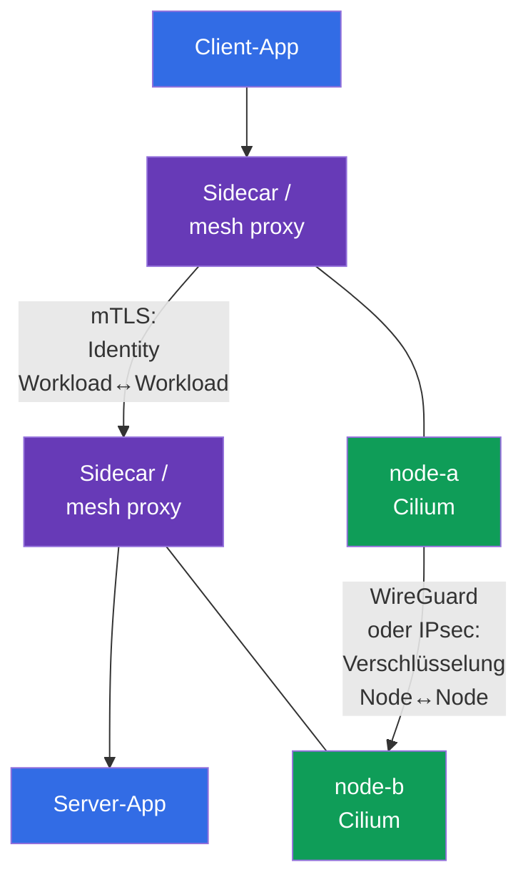
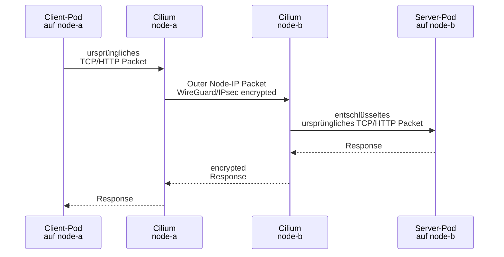
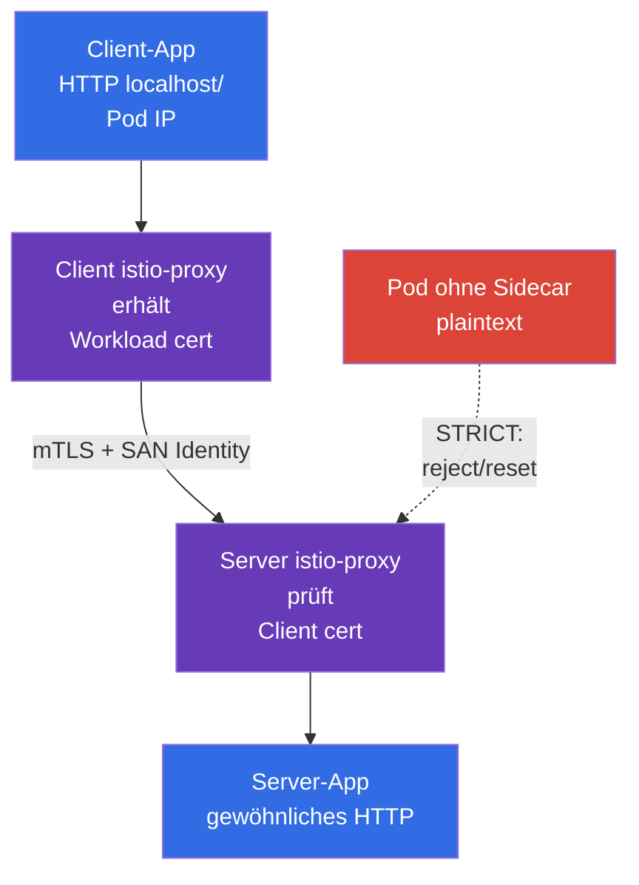

[Русская версия](ru.md) · [Eng version](README.md) · [Versión en español](es.md) · [Version française](fr.md) · [ქართული ვერსია](ge.md) · [繁體中文版](tw.md) · [日本語版](jp.md)

# Kapitel 23. Pod-to-Pod-Verschlüsselung und mTLS: Cilium, Istio und Linkerd

> **Problem.** NetworkPolicy kann nur den benötigten Datenfluss erlauben, doch die Daten darin bleiben auf dem Weg zwischen Nodes für Abhören oder Manipulation verfügbar, und ein Service ohne gegenseitige Identity-Prüfung kann eine Verbindung von einem fremden Workload annehmen. Die Kompromittierung eines Node, Netzsegments oder Clients legt dann Token und payload offen oder ermöglicht das Vortäuschen eines vertrauenswürdigen Service; transport encryption und mTLS für Workload Identity werden separat benötigt.

> **Was folgt.** NetworkPolicy erlaubt oder verbietet einen Datenfluss, macht ihn jedoch nicht selbst vertraulich. In diesem Kapitel bauen wir zwei unterschiedliche Schutzschichten für Pod-to-Pod Traffic: transparente Netzwerkverschlüsselung zwischen Nodes durch Cilium (WireGuard oder IPsec) und gegenseitige TLS-Authentifizierung von Workloads durch ein service mesh (Istio oder Linkerd). Dies ist die Kompetenz **Implement Pod-to-Pod encryption (Cilium, Istio)** der CKS-Domain *Minimize Microservice Vulnerabilities* (20 %).

> **Was Sie aus CKA wissen müssen.** Das Grundmodell des Pod-Netzwerks und CNI werden in [CKA-Kapitel 30](../../../cka/course/30/de.md), Service/DNS in [CKA-Kapitel 31](../../../cka/course/31/de.md) und NetworkPolicy in [CKA-Kapitel 34](../../../cka/course/34/de.md) behandelt. Hier wird vorausgesetzt, dass Sie Pod, Service und Node finden und einen gewöhnlichen `curl` prüfen können.

> 🧠 Cilium WireGuard/IPsec schützt Node-to-Node Transport, mesh mTLS schützt Proxy-Verbindungen und Workload Identity, NetworkPolicy die Zulässigkeit eines Datenflusses.

## 23.1. Zwei Aufgaben, zwei Ebenen: encryption und mTLS

Die Formulierung „Pod-to-Pod Traffic verschlüsseln“ hat zwei unterschiedliche Bedeutungen. Sie dürfen nicht als austauschbar betrachtet werden.

- **Cilium WireGuard/IPsec** schützt ein Paket zwischen Nodes. Es verschlüsselt und authentifiziert den Transportabschnitt Node-to-Node transparent für die Anwendung: Der Container erhält kein Zertifikat, der Service verändert sich nicht, HTTP im Workload bleibt HTTP.
- **Service mesh mTLS** erstellt eine TLS-Verbindung zwischen den Workload-Proxys. Es authentifiziert die Identity des aufrufenden Workload und des Servers, nicht nur die Nodes. Istio und Linkerd stellen gewöhnlich selbst kurzlebige Zertifikate aus und fangen Traffic über sidecar/proxy ab.
- **NetworkPolicy** beantwortet separat, welcher Datenfluss überhaupt zulässig ist. Weder Cilium encryption noch mTLS bieten allow/deny nach Namespace und Pod selector anstelle von NetworkPolicy.



Bei Datenverkehr zwischen Nodes können diese Mechanismen kombiniert werden: Ein service mesh schützt die Verbindung zwischen Workload-Proxys, während Cilium encryption zusätzlich die Pakete auf dem Netzwerkabschnitt zwischen Nodes schützt. **Pod-to-Pod Traffic auf demselben Node wird durch Cilium WireGuard und IPsec nicht verschlüsselt**: Es gibt kein Outer Packet zwischen Nodes. mTLS schützt weiterhin die Verbindung zwischen Workloads im mesh. Umgekehrt ersetzt Cilium encryption kein mTLS: Ein kompromittierter Workload auf einem vertrauenswürdigen Node erhält keine überprüfbare Client Identity.

| Frage | Cilium WireGuard/IPsec | Istio/Linkerd mTLS | NetworkPolicy |
|---|---|---|---|
| Wo es wirkt | Pfad zwischen Nodes | zwischen Workload-Proxys | Pod ingress/egress |
| Verschlüsselt HTTP payload im physischen Netzwerk | ja | ja | nein |
| Authentifiziert | kryptografische Node Peers | Workload Identity | nicht Identity, sondern selector/IP/port |
| Sidecar/proxy im Pod erforderlich | nein | ja (oder ambient/eBPF-Modus des jeweiligen mesh) | nein |
| Anwendung sieht Zertifikat | nein | gewöhnlich nein | nein |
| Schützt Same-Node Pod-to-Pod | nein: Cilium WireGuard/IPsec verschlüsselt solchen Traffic nicht | ja, falls beide im mesh | beschränkt, verschlüsselt aber nicht |

> 🎯 Halten Sie vor Änderungen CNI, Versionen, Firewall, MTU und Cross-Node Placement der Test-Pods fest.


**Festhalten** bedeutet hier nicht, die Konfiguration zu ändern, sondern eine Baseline - einen Schnappschuss des funktionierenden Zustands - zu sichern, mit dem das Ergebnis nach dem Rollout verglichen werden kann. Notieren Sie die Ausgaben der Prüfungen in einer Change-/Incident-Notiz oder in Lernunterlagen: Welches CNI bedient das Netzwerk bereits und welche Version hat es; welche Kubernetes-/Kernel-/Cilium-Versionen beteiligt sind; ob die Firewall das benötigte Protocol zwischen Nodes erlaubt; welches MTU auf dem Pfad verfügbar ist. **Cross-Node Placement** bedeutet, dass zwei Test-Pods tatsächlich auf **unterschiedlichen** Nodes scheduled sind. Das ist wichtig: Nur ein solcher Flow erzeugt ein Node-to-Node Outer Packet, an dem WireGuard/IPsec belegt werden kann. Funktioniert Traffic nach der Änderung nicht mehr, hilft die Baseline dabei, einen neuen Fehler von einer schon vorhandenen Firewall-/MTU-/Placement-Einschränkung zu unterscheiden.

## 23.2. Vor der Änderung: Scope, Kompatibilität und Ausgangszustand

CNI encryption und service mesh sind clusterweite oder namespaceweite Änderungen. Aktivieren Sie sie nicht blind in Production: Ein falsches MTU, ein alter Kernel, eine Firewall oder strenges mTLS für einen Legacy-Client kann Traffic anhalten. Halten Sie zuerst aktuelles CNI, Versionen, Placement der Test-Pods und den Paketpfad fest.

```bash
kubectl get nodes -o wide
kubectl get pods -A -o wide
kubectl -n kube-system get ds cilium
kubectl -n kube-system get pods -l k8s-app=cilium -o wide
kubectl get networkpolicy -A
```

Prüfen Sie im Voraus:

1. Cilium ist bereits das CNI, und die Cilium- sowie Kernel-Version unterstützen den ausgewählten Modus gemäß der offiziellen compatibility matrix. Installieren Sie kein zweites CNI über einem laufenden.
2. Zwischen allen Worker-Nodes muss der WireGuard-UDP-Port erlaubt sein (standardmäßig verwendet Cilium `51871`, der Wert wird jedoch in der installierten Konfiguration geprüft) oder für Cilium IPsec ESP (IP protocol 50). Ein typisches IKE/NAT-T-Szenario mit UDP/4500 gehört nicht zu dem hier beschriebenen Cilium-IPsec-Mechanismus. Security group, Firewall und Routen sind Teil der Lösung.
3. Das physische Netzwerk verfügt über MTU-Reserve. Encapsulation fügt Header hinzu; bei einem Path-MTU-Problem kann ein kleiner `curl` funktionieren, während große Antworten hängen bleiben.
4. Es gibt zwei Test-Pods auf unterschiedlichen Nodes. Andernfalls belegt tcpdump keine Node-to-Node encryption. Weisen Sie ihnen für einen Lerntest `nodeSelector`/`podAntiAffinity` zu oder finden Sie bereits verteilte Workloads.
5. Es gibt einen Rollback-Plan und ein Wartungsfenster. Helm values ohne gespeicherten vorherigen release zu ändern, verwandelt die Diagnose in Raten.

Der folgende Befehl zeigt die tatsächlichen Parameter des bereits installierten Helm release. Release-Namen und values hängen von der Installationsmethode ab; ersetzen Sie damit nicht die GitOps-Quelle der Wahrheit.

```bash
helm -n kube-system list
helm -n kube-system get values cilium --all
kubectl -n kube-system get configmap cilium-config -o yaml
```

> 🎯 Transparent encryption schützt nur den Abschnitt zwischen Nodes; wählen Sie ein backend und prüfen Sie seinen Scope.

## 23.3. Cilium transparent encryption: Modell und Grenzen

Cilium verschlüsselt Traffic im Datapath der Nodes. Wenn ein Pod auf `node-a` Daten an einen Pod auf `node-b` sendet, kapselt/verschlüsselt Cilium das ursprüngliche Paket ein, sendet ein Outer Packet zwischen den Node IP und Cilium auf `node-b` prüft den Peer, entschlüsselt und liefert das ursprüngliche Paket an den Ziel-Pod aus. Für Kubernetes Service, DNS und die Anwendung ist dies transparent: URL oder Port müssen nicht geändert und keine TLS-Bibliothek ergänzt werden.



**Transparent** bedeutet nicht „überall und vor allem verschlüsselt“. An der Anwendungsschnittstelle oder innerhalb eines Namespace kann plaintext vor der Verschlüsselung/nach der Entschlüsselung sichtbar sein. Verschlüsselung macht auch eine unsichere Anwendung nicht sicher: Sie blockiert keine SQL injection, erteilt keine Benutzerautorisierung und beschränkt keinen kompromittierten Pod. Für diese Aufgaben werden Application Security, mTLS/Authorization, RBAC und NetworkPolicy benötigt.

Cilium unterstützt zwei verbreitete backend:

| Eigenschaft | WireGuard | IPsec |
|---|---|---|
| Kryptografisches Modell | modernes kompaktes VPN-Protocol | IPsec ESP; oft Organisations-/Netzwerkstandard |
| Übertragung im Netzwerk | UDP, gewöhnlich `51871` | ESP (IP protocol 50) |
| Schlüssel/Peer | key pair pro Peer; public key identifiziert erlaubten Node | key material im Cilium IPsec Secret, Security Association zwischen Peers |
| Authentifizierung | Paket wird nur von bekanntem public key/allowed peer angenommen | ESP integrity + Schlüssel der Security Association |
| Betriebliche Auswahl | gewöhnlich einfache Wahl für unterstützte Linux-Umgebung | nötig, wenn es der bestehende IPsec-/Netzwerkstandard erfordert |
| Mit tcpdump prüfen | UDP am WireGuard port, ohne HTTP payload | `esp`, ohne HTTP payload |

In Cilium 1.20 ist auch der **Beta**-backend `ztunnel` encryption dokumentiert. Dies ist eine forward-looking Production-Erweiterung, nicht der Hauptweg für CKS; für das Prüfungsszenario reichen hier WireGuard oder IPsec.

Es wird **ein** backend ausgewählt. WireGuard und IPsec gleichzeitig als „doppelten Schutz“ zu aktivieren, ist keine normale Cilium-Konfiguration und erschwert nur die Fehlerbehebung. Prüfen Sie exakte Helm values und unterstützte Kombinationen anhand der Dokumentation der im Cluster installierten Version: Werte aus einem alten Artikel passen möglicherweise nicht zu einem neuen Cilium.

> 🎯 Prüfen Sie version-pinned values, den Rollout der Cilium agents und den encryption status; ein peer key belegt den Node, nicht die Pod Identity.

## 23.4. WireGuard: Aktivierung, key peer und gegenseitige Authentifizierung

WireGuard verwendet ein private/public key pair pro Peer. Cilium verwaltet die Schlüssel automatisch und verteilt die benötigten public keys über die Kubernetes API zwischen den Cilium agents. Ein Node nimmt ein verschlüsseltes Paket nur an, wenn es die kryptografische Prüfung des erwarteten Peer besteht; eine Node IP ohne Schlüssel vorzutäuschen genügt nicht. Daher handelt es sich auf Transportebene gleichzeitig um Vertraulichkeit und **gegenseitige Authentifizierung von Node Peers**.

Dies ist keine Workload Identity: Zwei Pods auf demselben Node haben keine unterschiedlichen WireGuard Identities, und der Server erfährt den ServiceAccount des Clients nicht aus einem WireGuard key. Für ein solches gegenseitiges Vertrauen wird service mesh mTLS benötigt.

Unten ist eine typische Helm-Konfiguration dargestellt. Führen Sie sie über Ihr version-pinned GitOps oder den festgehaltenen Helm release aus, nachdem Sie die values des konkreten Cilium release geprüft haben. `encryption.nodeEncryption=true` erweitert den Schutz auf Node-to-Node Traffic. Cilium schließt für WireGuard standardmäßig Nodes mit dem label `node-role.kubernetes.io/control-plane` aus der Node-to-Node encryption aus: Das verhindert ein Bootstrap-Problem beim Aktualisieren eines public key. Betrachten Sie den Control Plane nicht automatisch als von dieser Einstellung abgedeckt; aktivieren Sie sie erst nach dem Verständnis der Auswirkungen auf Control Plane und Host Traffic.

```bash
# Beispiel: bereits genehmigte Version und values aus dem Repository einsetzen.
helm upgrade cilium cilium/cilium \
  --namespace kube-system \
  --reuse-values \
  --version <pinned-cilium-version> \
  --set encryption.enabled=true \
  --set encryption.type=wireguard

kubectl -n kube-system rollout status daemonset/cilium --timeout=10m
kubectl -n kube-system get pods -l k8s-app=cilium
```

Wenn die Policy auch Node Traffic verschlüsseln soll, nehmen Sie dies als separate, reviewable Änderung vor und testen Sie die Erreichbarkeit von API server/kubelet:

```bash
helm upgrade cilium cilium/cilium \
  --namespace kube-system \
  --reuse-values \
  --version <pinned-cilium-version> \
  --set encryption.enabled=true \
  --set encryption.type=wireguard \
  --set encryption.nodeEncryption=true
```

Prüfen Sie nach dem Rollout den Zustand **auf jedem Cilium agent**, nicht nur auf einem Pod, den `kubectl exec ds/cilium` beliebig auswählt:

```bash
kubectl -n kube-system get pods -l k8s-app=cilium -o wide
kubectl -n kube-system get pods -l k8s-app=cilium -o name |
  while IFS= read -r agent; do
    echo "=== $agent ==="
    kubectl -n kube-system exec "$agent" -- cilium-dbg status --verbose
    kubectl -n kube-system exec "$agent" -- cilium-dbg encrypt status
  done
```

Gesunde agents und ein encryption state ohne Peer-/Handshake-Fehler werden auf jedem Node erwartet. Je nach Cilium-Version kann der Befehl WireGuard-Interface, Peers, public keys oder Zähler anzeigen. `cilium-dbg` ist die CLI des lokalen agent: Fehlt ein subcommand, führen Sie `cilium-dbg --help` **in diesem selben agent** aus und prüfen Sie die Dokumentation der installierten Cilium-Version, denn dieses binary wird mit dem agent ausgeliefert. Die externe Cilium CLI `cilium`, die von einer administrativen Maschine ausgeführt wird, hat eine eigene Versionierung: Verwenden Sie dafür eine unterstützte kompatible Version und deren compatibility table, nicht dieselbe Versionsnummer wie der release.

> 🔬 Strict mode verhindert das erste plaintext packet, erfordert aber version- und routing-spezifische Kompatibilität.

### Strict mode: erstes plaintext packet verhindern

Bei gewöhnlichem transparentem WireGuard kann ein neuer Remote Endpoint für Pod-to-Pod Traffic zwischen von Cilium verwalteten Endpoints auf verschiedenen Nodes dem agent nicht sofort bekannt sein; davor können die ersten egress-Pakete dorthin potenziell ohne Tunnel ausgehen. Lässt das Bedrohungsmodell dies nicht zu, verwenden Sie strict mode nach einer gesonderten Prüfung der Versionskompatibilität:

```yaml
encryption:
  strictMode:
    egress:
      enabled: true
      # IPv4 Pod CIDR dieses Clusters - durch den tatsächlichen Wert ersetzen.
      cidr: 10.244.0.0/16
    ingress:
      enabled: true
```

`encryption.strictMode.egress` wird nur für IPv4 unterstützt, daher muss `cidr` der tatsächliche IPv4 Pod CIDR sein; der Modus hat außerdem Einschränkungen bei direct routing, Node CIDR und ausgewählten Interfaces. `encryption.strictMode.ingress` verwirft cluster-internen Pod Traffic, der nicht über den WireGuard tunnel eingetroffen ist; dies ist kein universeller strict mode für IPsec. Prüfen Sie vor der Aktivierung die Anforderungen des Cilium release an native/direct routing und device configuration, und bestätigen Sie dann durch einen negativen Test, dass ein plaintext Pod-to-Pod Packet zwischen Nodes nicht durchgeht. Aktivieren Sie strict mode nicht als Ersatz für die Prüfung von NetworkPolicy, Firewall und Verfügbarkeit des Control Plane.

> 🏭 Bei kompromittiertem Node: isolieren, evidence sichern, alten peer aus dem Vertrauen nehmen; private key gelangt nicht in Ticket, Git oder Chat.

**Was das in der Praxis bedeutet:** „Kompromittiert“ bedeutet, dass Anlass zur Annahme besteht, ein Angreifer habe Befehle auf dem Node ausführen oder seine Daten lesen können. **Isolieren** bedeutet, dort keine neuen Pods zu schedulen und seine Beteiligung am Cluster gemäß der genehmigten Incident Procedure zu beschränken; dies dämmt die Ausbreitung ein, beseitigt aber keine Spuren. **Evidence** sind für die Untersuchung benötigte Metadaten und Logs (Zeit, Node name, Cilium-Zustand und events), keine Kopie des private key. **Den alten peer aus dem Vertrauen nehmen** bedeutet, nach der Regenerierung des key oder dem Ersetzen des Node sicherzustellen, dass die anderen Nodes keinen mit dem alten public key authentifizierten Traffic mehr annehmen. Die folgende Liste zeigt eine sichere Reihenfolge dieser Aktionen.

### Rotation und Incident mit einem WireGuard key

Cilium automatisiert den Lifecycle von keys, doch das Security Design muss weiterhin beschreiben, wer Cilium resources lesen/ändern darf und wie auf eine Node-Kompromittierung reagiert wird. Kopieren Sie den private key nicht vom Node in Ticket, Chat oder Git. Bei Verdacht auf Kompromittierung:

1. Node isolieren (`cordon`/`drain` unter Berücksichtigung von DaemonSet und PDB), evidence sichern;
2. Cilium agent Logs, Health und Peers auf den übrigen Nodes prüfen;
3. der dokumentierten Vorgehensweise der Cilium-Version zum Entfernen/Regenerieren des peer key oder zum Neuerstellen des Node folgen;
4. sicherstellen, dass der neue Node eine neue Identity/key erhalten hat und der alte peer keinen Traffic mehr annimmt;
5. die funktionale und Paketebenen-Prüfung aus Abschnitt 23.10 wiederholen.

`kubectl get secret -A` und ein breites Recht, Secrets zu lesen, gewähren Zugriff nicht nur auf IPsec material, sondern auf viele andere Secrets. Beschränken Sie RBAC und auditieren Sie den Zugriff auf `kube-system`.

> 🔬 IPsec ist ein alternativer Cilium-backend mit key rotation, ESP-Diagnose, kompatibler Cilium CLI und key-overlap window.

## 23.5. IPsec: wann es benötigt wird und wie key management nicht beschädigt wird

IPsec in Cilium bietet ebenfalls transparentes Node-to-Node Encryption, verwendet jedoch IPsec ESP Security Associations. Es wird oft ausgewählt, wenn Unternehmensanforderungen oder vorhandene Netzwerkinfrastruktur IPsec verlangen. Ein Paket auf dem physical interface erscheint als ESP (IP protocol 50); Application HTTP darf darin nicht lesbar sein. Übertragen Sie nicht das allgemeine IKE/NAT-T-Modell mit UDP/4500 auf diesen Fall: Es ist kein Teil dieses Cilium-Mechanismus.

Ein typischer Wechsel für einen Cilium release mit IPsec-Unterstützung beginnt mit dem key Secret: Der agent muss `cilium-ipsec-keys` **vor** dem Aktivieren von `encryption.type=ipsec` erhalten. Führen Sie das Erstellen nur von einer administrativen Maschine aus, auf der eine unterstützte kompatible Cilium CLI installiert ist und kubeconfig vorhanden ist. Existiert das Secret bereits, überschreiben Sie es nicht versehentlich - prüfen Sie zuerst Owner und version-specific rotation procedure:

```bash
kubectl -n kube-system get secret cilium-ipsec-keys >/dev/null 2>&1 || \
  cilium encrypt create-key --auth-algo rfc4106-gcm-aes

# Nur Vorhandensein und metadata, nicht die key data prüfen.
kubectl -n kube-system get secret cilium-ipsec-keys \
  -o custom-columns=NAME:.metadata.name,TYPE:.type,CREATED:.metadata.creationTimestamp
kubectl -n kube-system get secret cilium-ipsec-keys \
  -o jsonpath='{.metadata.resourceVersion}{"\n"}'

helm upgrade cilium cilium/cilium \
  --namespace kube-system \
  --reuse-values \
  --version <pinned-cilium-version> \
  --set encryption.enabled=true \
  --set encryption.type=ipsec

kubectl -n kube-system rollout status daemonset/cilium --timeout=10m
kubectl -n kube-system get pods -l k8s-app=cilium -o name |
  while IFS= read -r agent; do
    echo "=== $agent ==="
    kubectl -n kube-system exec "$agent" -- cilium-dbg encrypt status
  done
```

Cilium speichert IPsec key material im Secret `cilium-ipsec-keys` in `kube-system`. Geben Sie es nicht im Terminal, CI log oder in der Dokumentation aus. Das Vorhandensein und die metadata dürfen ohne Dekodieren von data geprüft werden.

Verwenden Sie für die Rotation nur eine unterstützte **kompatible** Cilium CLI und die version-specific procedure. Den gewöhnlichen nicht geheimen Status erfassen Sie mit `cilium encryption status` von einer administrativen Maschine und mit `cilium-dbg encrypt status` auf jedem Node. Der Befehl `cilium encryption key-status` gibt IPsec key material aus: Führen Sie ihn nur aus, wenn dies eine genehmigte Rotationsprozedur ausdrücklich verlangt, in einem geschützten Terminal, ohne Ausgabe in CI, Log, Ticket oder Chat.

```bash
# Administrative Maschine mit unterstützter kompatibler Cilium CLI.
cilium encryption status
cilium encryption rotate-key
```

Ergänzen Sie bei mehreren Clustern oder einem nicht standardmäßigen release die benötigten Parameter `--context`, `--namespace kube-system` und `--helm-release-name`. Führen Sie die Rotation nicht aus einem Cilium Pod aus. Prüfen Sie die Verfügbarkeit des subcommand mit `cilium encryption --help` und die compatibility table der CLI. Bei `encryption.ipsec.keyWatcher=true` (default) übernehmen agents das aktualisierte Secret ohne DaemonSet-Restart; gewöhnlich wenden alle agents es etwa innerhalb einer Minute an, und alter sowie neuer key bestehen im rotation window nebeneinander. Ein Restart/Rollout des DaemonSet ist nur erforderlich, wenn watcher deaktiviert ist oder die Dokumentation der installierten Version dies ausdrücklich verlangt.

Das Secret darf nicht manuell durch eine zufällige einzelne Zeile ersetzt werden: Nicht synchronisierte Peers verursachen packet loss. Praktisches Minimum für einen Change Request:

- neuer key wird kryptografisch zufällig generiert und über einen geschützten Kanal verteilt;
- Reihenfolge und Format des key Secret werden aus der Dokumentation des installierten Cilium übernommen;
- `resourceVersion` des Secret und `cilium-dbg encrypt status` werden auf **allen** agents vor dem Ende des key-overlap window geprüft;
- es gibt Messung von Verlusten/Fehlern und einen Rollback vor dem Entfernen des alten key;
- nach der Rotation werden Anwendung und physical capture auf dem benötigten Node-Paar geprüft.

**Verwechseln Sie IPsec key nicht mit mTLS CA.** Ein IPsec key schützt Transport Peers, ein mesh-Zertifikat belegt Workload Identity. Ihr Owner, rotation interval, Audit und blast radius können unterschiedlich sein.

Hier endet die Einrichtung von Cilium transport encryption. Istio wird unmittelbar danach absichtlich behandelt: Es ist **nicht** der nächste Cilium-Parameter und kein prerequisite für IPsec, sondern eine unabhängige zusätzliche Schicht. Bei einer Cross-Node-Anfrage schützt Cilium das Outer Packet zwischen Nodes, während Istio mTLS dem Proxy ermöglicht, die Identity des konkreten Workload zu prüfen. Healthy Cilium encryption belegt daher noch nicht Injection, Zertifikat oder Istio mTLS policy - diese Prüfungen erfolgen separat im nächsten Abschnitt.

> 🎯 Istio mTLS bindet ein certificate an Workload Identity; unterscheiden Sie `PeerAuthentication: STRICT` von `DestinationRule` mit `ISTIO_MUTUAL` und prüfen Sie proxy/injection.

> 🔬 **Upstream Identity Primitive.** Kubernetes v1.37 stabilisierte Pod Certificates und ClusterTrustBundles. Sie bieten X.509 primitives auf Kubernetes-Ebene, machen eine Istio/SPIFFE Identity Plane jedoch nicht automatisch überflüssig: Signer, Trust Model und mesh enforcement sind getrennte Architekturentscheidungen. Siehe [Kubernetes v1.37 Security Delta](../APPENDIX_K8S_137_SECURITY_DELTA_DE.md).

## 23.6. Istio: sidecar, SPIFFE Workload Identity und `PeerAuthentication`


### Welches Problem Istio nach Cilium löst

Die vorherigen Abschnitte haben bereits den **Transport zwischen Nodes** geschützt: Cilium WireGuard/IPsec verschlüsselt das Outer Packet und authentifiziert den Node Peer. Dies reicht jedoch nicht aus, wenn die Frage wichtig ist: „Welcher konkrete Workload ruft den Service auf?“ Cilium gibt Anwendung oder Server keine überprüfbare Identity des Client Pod/ServiceAccount und erzwingt selbst nicht, dass ein Server nur mTLS annimmt. Darüber hinaus erstellt Cilium Node Encryption per Design keinen Outer Tunnel für Pods auf einem Node.

Istio löst einen anderen Teil der Aufgabe: Workload-Proxys erhalten Zertifikate, stellen mTLS her und prüfen die Identity des Peer. `PeerAuthentication: STRICT` kann plaintext inbound Traffic verbieten. Zusammen wirken sie so: **Istio schützt und authentifiziert die Workload-to-Workload Connection, Cilium schützt zusätzlich das Paket auf dem nicht vertrauenswürdigen Abschnitt zwischen Nodes**. `NetworkPolicy` bleibt die dritte Schicht - sie bestimmt, welcher Flow überhaupt erlaubt ist.

| Frage | Cilium WireGuard/IPsec | Istio mTLS |
|---|---|---|
| Hauptvorteil | Transparentes Node-to-Node Encryption ohne Änderung der Anwendung oder des Service | Workload Identity, gegenseitige Authentifizierung und `STRICT` gegen plaintext Client |
| Was nicht gelöst wird | gibt dem Server keine Identity des Client Workload; verschlüsselt Same-Node Flow nicht | verbirgt Outer L3/L4 metadata nicht vor underlay und deckt non-mesh Flow nicht ab; ersetzt NetworkPolicy nicht |
| Preis/Einschränkung | kompatibles CNI/Kernel, Firewall und MTU erforderlich; Schlüssel gehören zu Nodes | Control Plane, Zertifikate und proxy/ambient Dataplane erforderlich; sidecar mode fügt Container und Overhead hinzu |
| Was belegt werden muss | Cilium agent Status und Outer WireGuard/ESP auf physical NIC | Injection/Enrollment, Proxy-/Zertifikatstatus und mTLS/`STRICT` Tests |

Dies ist keine obligatorische „doppelte Verschlüsselung“. Sind **beide** Workloads bereits im mesh, Trust wurde geprüft und `PeerAuthentication: STRICT` wird tatsächlich angewendet, verschlüsselt mTLS bereits Application Payload zwischen Proxys. Cilium Node Encryption muss nicht allein zum erneuten Verschlüsseln desselben Payload aktiviert werden.

Cilium bietet einen eigenständigen Wert, wenn das Bedrohungsmodell Schutz des Node-to-Node Underlay erfordert: Inner Pod IP/port und andere L3/L4 metadata vor dem physischen Netzwerk zu verbergen, sensitiven Cross-Node Flow außerhalb des mesh abzudecken oder eine Policy-/Compliance-Anforderung an Verschlüsselung zwischen Nodes zu erfüllen. Beide Schichten sind nur nötig, wenn **beide** Ziele gelten: Workload Identity/mTLS **und** Schutz des Underlay oder Non-Mesh Traffic. Benötigt eine Anwendung keine Workload Identity oder mesh-kompatibles Verhalten, wird Istio nicht automatisch aktiviert - zunächst werden Bedrohungsmodell, Kompatibilität und Overhead bewertet.
Istio sidecar (`istio-proxy`, Envoy) fängt inbound/outbound Workload Traffic ab. Istiod stellt ein Workload-Zertifikat auf Grundlage des Kubernetes ServiceAccount aus; Proxys stellen mTLS her und prüfen die Identity des Peer. Die Workload Identity hat die Form einer SPIFFE ID: `spiffe://<trust-domain>/ns/<namespace>/sa/<service-account>`. Die Anwendung lauscht gewöhnlich weiter auf einem normalen HTTP port, weil TLS im sidecar und nicht im App Container beendet wird.

Im **Ambient Mode** fügt Istio nicht jedem Pod einen separaten sidecar hinzu: Stattdessen läuft auf jedem Node `ztunnel` (**Zero Trust Tunnel**) - ein spezieller Node-level proxy. Er übernimmt L3/L4-Aufgaben des mesh, einschließlich mTLS und Authentication, ohne dass die Anwendung selbst mit TLS arbeiten muss.

`HBONE` (**HTTP-Based Overlay Network Environment**) ist ein geschützter Istio tunnel zwischen Komponenten des mesh. Er transportiert mehrere TCP streams über eine mTLS Connection; daher kann Workload Traffic geschützt sein, obwohl die Containerliste des Pod kein `istio-proxy` enthält. Das Fehlen von `istio-proxy` im Ambient Mode bedeutet keinen plaintext Client. In beiden Modellen lässt `PeerAuthentication` mit `STRICT` keinen plaintext inbound Traffic zu: Im Ambient Mode erwartet der Server geschützten HBONE/mTLS Flow.

Die folgende Prüfung von `istio-injection=enabled` und dem Vorhandensein von `istio-proxy` bezieht sich **nur auf Sidecar Mode**. Prüfen Sie im Ambient Mode Workload Enrollment und den Zustand von `ztunnel` gemäß der Documentation der installierten Istio-Version, statt einen zusätzlichen Container im Pod zu erwarten.



### Injection aktivieren und sidecar prüfen

Aktivieren Sie Injection für einen Lern-Namespace vor dem Erstellen des Pod. Verwenden Sie in Production das revision label der Istio-Installation, die vom Change Process kontrolliert wird; mischen Sie unterschiedliche revision nicht ohne Migrationsplan.

```bash
kubectl create namespace mesh-demo
kubectl label namespace mesh-demo istio-injection=enabled

kubectl -n mesh-demo apply -f server.yaml
kubectl -n mesh-demo apply -f client.yaml
kubectl -n mesh-demo get pods
kubectl -n mesh-demo get pod -l app=server \
  -o jsonpath='{range .items[*]}{.metadata.name}{": "}{.spec.containers[*].name}{"\n"}{end}'
```

In der Containerliste muss `istio-proxy` neben `server` stehen. Das Fehlen eines sidecar ist kein kosmetischer Fehler: Ein plaintext Client wird nicht zu einem mTLS Client, und `STRICT` lehnt ihn erwartungsgemäß ab. Führen Sie für einen bereits vorhandenen Deployment nach dem Label einen controlled rollout durch:

```bash
kubectl -n mesh-demo rollout restart deployment/server
kubectl -n mesh-demo rollout status deployment/server
kubectl -n mesh-demo get pod -l app=server \
  -o jsonpath='{range .items[*]}{.metadata.name}{": "}{.spec.containers[*].name}{"\n"}{end}'
```

### `PeerAuthentication`: Server erfordert mTLS

`PeerAuthentication` legt die inbound mTLS policy fest. `STRICT` bedeutet: Der Server-Proxy akzeptiert nur mTLS Traffic von einem Peer, der ein vertrauenswürdiges certificate vorweisen kann. Plaintext TCP von einem Workload ohne sidecar ist kein zulässiger fallback.

Die folgende Ressource gilt für den gesamten Namespace `mesh-demo`. Ein Namespace selector ist hier nicht erforderlich: Der Namespace wird mit `metadata.namespace` festgelegt.

```yaml
apiVersion: security.istio.io/v1
kind: PeerAuthentication
metadata:
  name: default
  namespace: mesh-demo
spec:
  mtls:
    mode: STRICT
```

Die policy kann auf einen Server Workload eingegrenzt werden. Dieser selector stimmt mit einem Pod label überein, nicht mit dem Namen eines Service; prüfen Sie die tatsächlichen labels mit `kubectl get pod --show-labels`.

```yaml
apiVersion: security.istio.io/v1
kind: PeerAuthentication
metadata:
  name: server-strict
  namespace: mesh-demo
spec:
  selector:
    matchLabels:
      app: server
  mtls:
    mode: STRICT
```

Wenden Sie nicht gleichzeitig namespaceweites `STRICT` und eine Workload policy mit widersprüchlichem `PERMISSIVE` an, ohne die precedence zu verstehen. Eine gute Migration sieht gewöhnlich so aus:

```text
Clients inventarisieren -> Clients injecten/reparieren -> PERMISSIVE-Messung (falls nötig) ->
mTLS prüfen -> STRICT enger Scope -> STRICT Namespace -> temporäre Ausnahme entfernen
```

`PERMISSIVE` ist nur für temporäre Kompatibilität nützlich: Der Proxy akzeptiert mTLS und plaintext, daher belegt ein erfolgreicher `curl` noch kein mTLS. `DISABLE` für einen gewöhnlichen TCP Workload erzeugt eine Ausnahme, die minimiert und mit Owner und Frist dokumentiert werden muss.

### `DestinationRule`: Client darf TLS nicht deaktivieren

Istio auto mTLS kann TLS automatisch auswählen, doch ein explizites `DestinationRule` ist als überprüfbare clientseitige Absicht in einem Lernstand oder bei organisatorischer Forderung nach expliziter Konfiguration nützlich. `PeerAuthentication` schützt den Inbound Server, während `DestinationRule` TLS für Outbound Client Traffic festlegt - dies sind unterschiedliche Seiten der Verbindung.

```yaml
apiVersion: networking.istio.io/v1
kind: DestinationRule
metadata:
  name: server-mtls
  namespace: mesh-demo
spec:
  host: server.mesh-demo.svc.cluster.local
  trafficPolicy:
    tls:
      mode: ISTIO_MUTUAL
```

`ISTIO_MUTUAL` bedeutet, dass Envoy die Zertifikate und das Trust Bundle verwendet, die Istio verwaltet. Ersetzen Sie es nicht durch `SIMPLE`: `SIMPLE` erstellt einen gewöhnlichen TLS Client ohne Workload Client Certificate und erfüllt mTLS nicht. `DISABLE` leitet plaintext weiter und muss bei `STRICT` auf dem Server abgelehnt werden. Für einen external Service werden normalerweise eigene `ServiceEntry`/TLS Settings benötigt; verwenden Sie dieses Beispiel nicht als globale Regel für alle `*.svc.cluster.local`.

Prüfen Sie angewendete Objekte und die tatsächliche Proxy-Konfiguration:

```bash
kubectl -n mesh-demo get peerauthentication,destinationrule
istioctl proxy-status
istioctl proxy-config cluster deploy/client -n mesh-demo | grep server.mesh-demo
istioctl analyze -n mesh-demo
```

`istioctl analyze` und `proxy-config` hängen von der Istio-Version ab, doch die hilfreiche Idee bleibt: Nicht nur YAML in Git ansehen, sondern die Runtime-Konfiguration des Proxy. Das erfolgreiche Erstellen eines CR garantiert nicht, dass selector/host zum benötigten Endpoint passt.

> 🎯 `STRICT`: Ein meshed Client erhält `200`, ein Client ohne sidecar erhält keinen plaintext Erfolg.

## 23.7. Kontrolliertes Istio-Experiment: innerhalb des Mesh 200, außerhalb Reset

Der folgende Testaufbau belegt die zentrale Grenze von `STRICT`: Ein meshed Client erhält HTTP `200`,
und ein Client ohne sidecar sendet eine plaintext Anfrage und erhält TCP reset/einen TLS-Fehler statt
Zugriff auf den server. Führen Sie dies nur in einem dedizierten namespace aus: `STRICT` bricht
absichtlich legacy plaintext calls.

Erstellen Sie zunächst einen namespace mit injection sowie server-/client-workloads. Der client erhält
einen sidecar über das namespace label; `legacy-client` unten läuft in einem separaten namespace ohne
injection.

```yaml
apiVersion: v1
kind: Namespace
metadata:
  name: mesh-demo
  labels:
    istio-injection: enabled
---
apiVersion: v1
kind: Service
metadata:
  name: server
  namespace: mesh-demo
spec:
  selector:
    app: server
  ports:
  - name: http
    port: 8080
    targetPort: 8080
---
apiVersion: apps/v1
kind: Deployment
metadata:
  name: server
  namespace: mesh-demo
spec:
  replicas: 1
  selector:
    matchLabels:
      app: server
  template:
    metadata:
      labels:
        app: server
    spec:
      containers:
      - name: server
        image: hashicorp/http-echo:1.0
        args: ["-listen=:8080", "-text=server-ok"]
        ports:
        - containerPort: 8080
---
apiVersion: apps/v1
kind: Deployment
metadata:
  name: client
  namespace: mesh-demo
spec:
  replicas: 1
  selector:
    matchLabels:
      app: client
  template:
    metadata:
      labels:
        app: client
    spec:
      containers:
      - name: client
        image: curlimages/curl:8.12.1
        command: ["sleep", "infinity"]
---
apiVersion: security.istio.io/v1
kind: PeerAuthentication
metadata:
  name: default
  namespace: mesh-demo
spec:
  mtls:
    mode: STRICT
---
apiVersion: networking.istio.io/v1
kind: DestinationRule
metadata:
  name: server-mtls
  namespace: mesh-demo
spec:
  host: server.mesh-demo.svc.cluster.local
  trafficPolicy:
    tls:
      mode: ISTIO_MUTUAL
```

```bash
kubectl apply -f istio-strict-demo.yaml
kubectl -n mesh-demo rollout status deployment/server
kubectl -n mesh-demo rollout status deployment/client
kubectl -n mesh-demo get pods -o wide

CLIENT=$(kubectl -n mesh-demo get pod -l app=client -o jsonpath='{.items[0].metadata.name}')
kubectl -n mesh-demo exec "$CLIENT" -c client -- \
  curl -sS -o /dev/null -w '%{http_code}\n' http://server.mesh-demo.svc.cluster.local:8080
# Erwartet: 200
```

Erstellen Sie nun einen client ohne injection. Das label `istio-injection=disabled` auf dem Pod ist
nicht nötig, wenn der namespace `legacy-demo` nicht für injection markiert ist; die explizite
Annotation macht die Absicht beim review jedoch sichtbar.

```yaml
apiVersion: v1
kind: Namespace
metadata:
  name: legacy-demo
---
apiVersion: v1
kind: Pod
metadata:
  name: outside-client
  namespace: legacy-demo
  annotations:
    sidecar.istio.io/inject: "false"
spec:
  containers:
  - name: client
    image: curlimages/curl:8.12.1
    command: ["sleep", "infinity"]
```

```bash
kubectl apply -f outside-client.yaml
kubectl -n legacy-demo wait --for=condition=Ready pod/outside-client --timeout=120s
kubectl -n legacy-demo get pod outside-client \
  -o jsonpath='{.spec.containers[*].name}{"\n"}'
# Erwartet: nur client, ohne istio-proxy

kubectl -n legacy-demo exec outside-client -- \
  curl --connect-timeout 5 --max-time 10 -v http://server.mesh-demo.svc.cluster.local:8080
# Erwartet: non-zero; gewöhnlich "Recv failure: Connection reset by peer".
```

Der konkrete Fehlertext hängt von Envoy-Version, protocol und dem Abfangpunkt ab: möglich sind
`connection reset`, ein TLS handshake error oder ein timeout. Das Sicherheitskriterium ist nicht die
Fehlerzeile, sondern das Ausbleiben eines plaintext success: Der Befehl liefert kein HTTP `200`, und
der server proxy nimmt keinen nicht authentifizierten stream an. Für eine strenge automatisierte
Prüfung halten Sie beide Merkmale fest:

```bash
set +e
OUT=$(kubectl -n legacy-demo exec outside-client -- \
  curl -sS --connect-timeout 5 --max-time 10 -o /dev/null -w '%{http_code}' \
  http://server.mesh-demo.svc.cluster.local:8080 2>&1)
RC=$?
set -e
printf 'exit=%s output=%s\n' "$RC" "$OUT"
test "$RC" -ne 0 || test "$OUT" != 200
```

Wenn **innerhalb des mesh kein 200** erscheint, prüfen Sie das Vorhandensein von `istio-proxy`,
DNS/Service endpoints, `PeerAuthentication`, `DestinationRule`, proxy status und NetworkPolicy. Wenn
**außerhalb ein 200** erscheint, stellen Sie zunächst sicher, dass `STRICT` tatsächlich den server Pod
trifft und `outside-client` wirklich ohne sidecar läuft; suchen Sie dann nach einer spezifischeren
`PeerAuthentication` policy, die den Test überschrieben hat.

> 🔬 Linkerd hat ein eigenes identity model und eine eigene policy API; verwenden Sie es nicht zusammen mit dem Istio sidecar im selben Pod.

## 23.8. Linkerd: Production-mTLS und ServiceAccount-Identität

Linkerd ist eine vollwertige Production-Variante eines service mesh für workload mTLS, aber es ist
Zusatzmaterial: In den zentralen CKS competencies für Pod-to-Pod encryption werden ausdrücklich Cilium
und Istio genannt, nicht Linkerd. Linkerd verwendet einen eigenen leichtgewichtigen proxy und ein
eigenes identity model. Nach der injection erhält der Pod `linkerd-proxy`; meshed traffic zwischen
Linkerd-workloads wird automatisch mit mTLS verschlüsselt und authentifiziert. Die Identity ist
gewöhnlich an den Kubernetes ServiceAccount gebunden und hat eine DNS-ähnliche Form:

```text
<serviceaccount>.<namespace>.serviceaccount.identity.linkerd.cluster.local
```

Setzen Sie Istio- und Linkerd-sidecar nicht zur „Verstärkung“ in denselben workload ein. Beide wollen
Traffic abfangen, Zertifikate ausstellen und policy verwalten; das Ergebnis ist ein Konflikt bei
iptables/ports, undefinierte observability und ein komplexer incident response. Wählen Sie ein mesh
pro namespace oder führen Sie eine dokumentierte Migration durch.

Prüfen Sie vor der Installation von Linkerd die cluster prerequisites, das Vorhandensein kompatibler
Gateway API CRDs, und verwenden Sie einen pinned release. Aktuelles Linkerd benötigt Gateway API CRDs;
fehlen sie, installieren Sie zuerst eine mit Ihrem release kompatible Version gemäß offizieller
Anleitung.

```bash
kubectl get crd gateways.gateway.networking.k8s.io
# Fehlt das CRD, installieren Sie vor linkerd install einen kompatiblen Gateway API CRD release.
linkerd check --pre
linkerd install --crds | kubectl apply -f -
linkerd install | kubectl apply -f -
linkerd check

# Viz ist eine separate extension; installieren Sie sie vor viz commands.
linkerd viz install | kubectl apply -f -
linkerd viz check
```

In einer Production-Installation muss das manifest aus einer fixierten CLI-/chart-Version in CI
generiert und geprüft werden, nicht aus einem floating `latest`. Aktivieren Sie nach dem health check
injection nur für einen Test-namespace und starten Sie den workload neu:

```bash
kubectl create namespace linkerd-demo
kubectl annotate namespace linkerd-demo linkerd.io/inject=enabled
kubectl -n linkerd-demo apply -f server.yaml
kubectl -n linkerd-demo apply -f client.yaml
kubectl -n linkerd-demo rollout status deployment/server
kubectl -n linkerd-demo get pod -l app=server \
  -o jsonpath='{.items[0].spec.containers[*].name}{"\n"}'
linkerd -n linkerd-demo check --proxy
linkerd -n linkerd-demo viz stat deploy
```

Prüfen Sie wie bei Istio nicht nur das Vorhandensein der Annotation, sondern auch den tatsächlichen
proxy container, den identity/certificate status und eine erfolgreiche Anfrage zwischen meshed Pods.
Wichtig ist die Unterscheidung zwischen automatic mTLS und strict inbound: Linkerd verwendet
automatisch mTLS zwischen meshed workloads, akzeptiert jedoch ohne inbound authorization standardmäßig
plaintext von einer non-meshed source (`all-unauthenticated`). Das bloße Vorhandensein von automatic
mTLS bedeutet nicht, dass der server nur mTLS annimmt.

Setzen Sie für eine minimale strict inbound policy `all-authenticated`, bevor Sie workloads im
Lern-namespace erstellen:

```yaml
apiVersion: v1
kind: Namespace
metadata:
  name: linkerd-demo
  annotations:
    linkerd.io/inject: enabled
    config.linkerd.io/default-inbound-policy: all-authenticated
```

Erstellen Sie nach dem Anwenden einen non-meshed client in einem namespace ohne Linkerd injection und
prüfen Sie, dass sein plaintext `curl` an den Service kein HTTP `200` zurückgibt; ein meshed client mit
zulässiger identity muss weiterhin funktionieren. Verwenden Sie für engere Regeln die policy API des
release, etwa `AuthorizationPolicy` zusammen mit `MeshTLSAuthentication`. Die Linkerd policy API und das
Verhalten von unauthorized traffic haben sich zwischen Versionen geändert: Prüfen Sie vor dem Aufbau
eines default-deny CRD und policy mode des installierten release. mTLS belegt identity und schützt den
Kanal, bedeutet aber nicht zwangsläufig „jede identity darf jeden endpoint aufrufen“ - Autorisierung
muss separat konfiguriert werden.

> 🔬 Capture sieht inner plaintext/TLS vor der termination und outer encrypted packet auf der physical NIC.

## 23.9. WireGuard/IPsec und Mesh zusammen: wo Plaintext sichtbar ist

Die Prüfung „`curl` funktioniert“ belegt keine encryption. `curl` prüft Erreichbarkeit und
application response, unterscheidet aber nicht plaintext HTTP von verschlüsseltem traffic. Ebenso kann
tcpdump auf `any` gleichzeitig ein inner plaintext packet auf einem virtuellen interface und ein outer
encrypted packet auf der physical NIC sehen. Formulieren Sie für einen Nachweis zunächst, *wo* jede
Schicht sichtbar sein muss.

| Capture-Punkt | Bei alleinigem Cilium encryption | Bei Cilium + Istio/Linkerd |
|---|---|---|
| app container / loopback zum proxy | häufig plaintext HTTP | app↔local proxy kann plaintext sein |
| veth/CNI vor node encryption | der ursprüngliche inner flow kann lesbar sein | mTLS ciphertext zwischen mesh proxys |
| physical NIC node-a/node-b | WireGuard UDP oder IPsec ESP, ohne HTTP | outer WireGuard/IPsec; HTTP- und TLS-payload nicht lesbar |
| server app nach dem proxy | plaintext, weil der proxy bereits entschlüsselt hat | plaintext vom local proxy zur app |

Dies ist eine normale Architektur von termination points. Ziel von Cilium ist es, readable payload vom
nicht vertrauenswürdigen physical network path zu entfernen. Ziel des mesh ist es, das
workload-to-workload segment TLS-geschützt zu machen und an identity zu binden. Behaupten Sie nicht
„tcpdump zeigt nirgends HTTP“: auf dem node und im Pod kann es vor/nach der encryption sichtbar sein,
wenn ein Angreifer root auf diesem node hat.

> 🎯 Bestätigen Sie cross-node placement, die konkrete physical NIC, die Zeit des wiederholbaren flow und den Cilium status.

## 23.10. tcpdump-Prüfung: Outer Encrypted Traffic nachweisen

Für einen packet-level Nachweis werden Pods auf **unterschiedlichen** Nodes, die node IP beider Nodes
und ein physical interface benötigt, das ins cluster network führt. Verwenden Sie nicht automatisch
`eth0`: Auf einem Cloud-Node kann das interface `ens5`, `ens192` oder anders heißen.

```bash
NODE_B_IP="${NODE_B_IP:?set the second node IP}"
kubectl get pods -A -o wide
kubectl get nodes -o wide
# Auf dem ausgewählten node:
ip -br link
ip route get "${NODE_B_IP}"
```

Starten Sie auf dem ersten node ein capture genau auf dem physical interface. Die folgenden Befehle
setzen SSH/genehmigten node access voraus; fügen Sie keinen privileged debug Pod nur der Bequemlichkeit
halber in Production hinzu. Bei genehmigtem break-glass access liefert auch
`kubectl debug node/<node>` host-level Diagnose, doch schon die Tatsache eines solchen Zugriffs muss
auditable sein.

### WireGuard-Capture

```bash
# Auf node-a; ens5 und IP von node-b ersetzen.
sudo tcpdump -ni ens5 -vv 'udp port 51871 and host <NODE_B_IP>'
```

Erzeugen Sie in einem anderen Terminal einen wiederholbaren cross-node flow. Praktisch ist es, mehrere
Anfragen aus dem client Pod auszuführen, der laut `kubectl get pod -o wide` auf `node-a` läuft, an den
server Pod/Service auf `node-b`:

```bash
for i in $(seq 1 20); do
  kubectl -n mesh-demo exec "$CLIENT" -c client -- \
    curl -sS http://server.mesh-demo.svc.cluster.local:8080 >/dev/null || exit 1
done
```

Erwartet wird eine Serie von UDP datagrams node-a ↔ node-b auf dem WireGuard port. `-vv` erhöht die
Ausführlichkeit der protocol-header-Analyse, gibt aber kein ASCII payload aus, daher belegt das Fehlen
von `GET /`, `Host:` oder `server-ok` in dieser Ausgabe nichts. Das Vorhandensein von UDP auf dem port
belegt ebenfalls noch nicht, dass es sich um genau den benötigten Pod flow handelt: Gleichen Sie
Capture-Zeitpunkt, node pair und den Anstieg der Zähler/des status von Cilium encryption ab.

Erfordert ein disposable lab tatsächlich einen payload-Vergleich, verwenden Sie ein kurzes capture
eines kontrollierten, nicht geheimen flow mit `-A` oder `-X` und ausreichendem snaplen am erwarteten
inner point. Wenden Sie payload capture nicht auf sensitiven Production-traffic an.

### IPsec-Capture

Für Cilium IPsec filtert das capture ESP, also IP protocol 50:

```bash
# Auf node-a: Cilium IPsec ESP.
sudo tcpdump -ni ens5 -vv 'host <NODE_B_IP> and esp'
```

Erzeugen Sie erneut einen wiederholbaren application flow. Erwartet werden ESP packets. Verwenden Sie
das Fehlen von HTTP-Zeilen in `tcpdump -vv` nicht als Nachweis: Dieser Modus zeigt das payload nicht.
Gleichen Sie das Capture nach der Ausführung mit dem agent **auf node-a und node-b** ab:

```bash
for node in "${NODE_A:?set first node name}" "${NODE_B:?set second node name}"; do
  agent=$(kubectl -n kube-system get pods -l k8s-app=cilium \
    --field-selector "spec.nodeName=$node" \
    -o jsonpath='{.items[0].metadata.name}')
  test -n "$agent" || { echo "ERROR: no Cilium agent on $node" >&2; exit 1; }
  echo "=== node=$node agent=$agent ==="
  kubectl -n kube-system exec "$agent" -- cilium-dbg encrypt status
done
```

Ein `grep` ohne Treffer ist kein Sicherheitsnachweis: Viele normale agents loggen nicht jedes Paket.
Ein starkes evidence besteht aus vier übereinstimmenden Fakten: cross-node placement, `200` für den
intended flow, ein healthy encryption status/Zähler und encrypted outer protocol auf der physical NIC.
Verwenden Sie für einen payload-Vergleich nur ein begrenztes lab capture mit `-A`/`-X`, keinen
Production-traffic.

### Negativtest und häufige Fallstricke

- **Ein Capture auf `-i any` zeigt HTTP.** Dies kann ein inner packet vor der encryption, eine lokale
  Zustellung oder traffic zwischen Pods auf demselben node sein. Wiederholen Sie es auf der physical
  NIC und prüfen Sie das placement.
- **Kein UDP/51871, aber curl funktioniert.** Möglicherweise sind die Pods auf demselben node, ein
  anderer Cilium port wird verwendet, encryption ist ausgeschaltet, oder ein anderer transport wird
  genutzt. Prüfen Sie zunächst values und `cilium-dbg encrypt status`, dann routes/interface.
- **Es gibt ESP/UDP, aber das capture passt nicht zum Test.** Auf dem node läuft anderer encrypted
  traffic. Beschränken Sie den BPF filter auf das node-IP-Paar und wiederholen Sie die Anfrage in einem
  kurzen Zeitfenster.
- **`tcpdump` sieht TLS statt HTTP.** Das ist für den mesh auf dem inner path erwartbar, belegt aber
  nicht Cilium. Auf der physical NIC wird bei aktivierten beiden Schichten outer WireGuard/IPsec
  erwartet.
- **Eine große response hängt, eine kleine funktioniert.** Verdächtigen Sie MTU/MSS. Deaktivieren Sie
  encryption nicht als „Behebung“; messen Sie die path MTU und passen Sie CNI/underlay gemäß der
  Plattform-Prozedur an.

> 🎯 Diagnostizieren Sie Cilium/underlay → DNS/Service → mesh identity/policy → NetworkPolicy; lassen Sie keinen bypass von `STRICT` oder encryption zurück.

## 23.11. Diagnose: zuerst die Fehlerschicht bestimmen

Ein einzelnes Symptom `connection reset` kann auf mehreren Ebenen entstehen. Diagnostizieren Sie von
unten nach oben, ohne ein vorübergehendes Abschalten von `STRICT` oder encryption in einen dauerhaften
bypass zu verwandeln.

| Symptom | Wahrscheinliche Schicht | Erste Prüfungen | Sichere Behebung |
|---|---|---|---|
| Pods auf unterschiedlichen nodes tauschen nach rollout keinen traffic aus | Cilium/underlay | `cilium-dbg encrypt status`, agent logs, UDP/ESP firewall, MTU | kompatible values/Netzwerk gemäß rollback plan wiederherstellen |
| DNS Service löst nicht auf | CoreDNS/Service, nicht mTLS | `nslookup`, Endpoints, CKA Kapitel 31 | DNS/Service vor der TLS-Analyse beheben |
| Meshed client erhält kein 200 | Istio/Linkerd oder NetworkPolicy | sidecar/proxy, cert/identity, endpoints, policy | injection/identity/rule beheben, kein globales `DISABLE` setzen |
| Outside client erhält reset | Istio `STRICT` | fehlender sidecar, effektive PeerAuthentication | dies ist der erwartete Nachweis; client in den mesh migrieren |
| Outside client erhält 200 bei `STRICT` | policy traf server nicht | selector, namespace, Pod labels, spezifischere policy | policy eingrenzen/korrigieren und Negativtest wiederholen |
| Nach IPsec-Rotation intermittent loss | key rollout | Secret-Version, agents, peer encryption state | overlap-/rollback-Prozedur der Cilium-Version befolgen |
| Linkerd proxy nicht Ready | mesh install/identity | `linkerd check`, proxy logs, clock/DNS | trust-/identity-prerequisites beheben, mTLS nicht deaktivieren |

Ein nützliches minimales Befehlsset für incident evidence:

```bash
kubectl -n mesh-demo get pod,svc,endpointslice -o wide
kubectl -n mesh-demo get peerauthentication,destinationrule -o yaml
kubectl -n kube-system get pods -l k8s-app=cilium -o wide
kubectl -n kube-system get pods -l k8s-app=cilium -o name |
  while IFS= read -r agent; do
    echo "=== $agent ==="
    kubectl -n kube-system exec "$agent" -- cilium-dbg encrypt status
  done
istioctl proxy-status 2>/dev/null || true
linkerd check 2>/dev/null || true
```

Geben Sie kein `Secret` mit `-o yaml`, keinen private key, kein bearer token und kein vollständiges
packet capture in einen gemeinsamen incident-Kanal aus. Ein capture kann metadata, URL, cookie oder
plaintext an einem internen Punkt enthalten. Bewahren Sie nur das minimal nötige evidence in einem
genehmigten Speicherort mit Aufbewahrungsfrist auf.

> 🏭 Inventar der flows, canary namespace/nodes, Kompatibilitätszeitraum, enge Ausnahmen und runtime evidence nach upgrade, firewall-Änderung oder Rotation von CA/key.

## 23.12. Sicherer Rollout und Betriebsregeln

Encryption ist kein einmaliger Installationsbefehl. Sie hat owners, updates, rotation, alerting und
muss belegen, dass die erwartete policy nach einem upgrade von Kubernetes/Cilium/mesh weiterhin
funktioniert.

1. **Inventarisierung.** Finden Sie workloads ohne sidecar, external clients, hostNetwork Pods,
   stateful protocol und kritische control-plane-Pfade. Erstellen Sie für mTLS einen graph aus callers
   und servers, nicht nur eine Liste von namespaces.
2. **Canary namespace/nodes.** Beginnen Sie mit einem separaten namespace und einem kleinen node pool.
   Belegen Sie für Istio zuerst meshed `200` und plaintext reset; für Cilium ein cross-node encrypted
   outer packet.
3. **Observe before enforce.** Sammeln Sie latency, connection errors, packet drops, proxy certificate
   expiry und Cilium health. `PERMISSIVE` ist nur als messbare Migrationsstufe mit Entfernungsdatum
   zulässig.
4. **Ausnahmen eingrenzen.** `PeerAuthentication` selector, ein separater namespace oder ein
   dokumentierter legacy port sind besser als ein globales `DISABLE`. Eine Ausnahme hat einen owner,
   einen Grund, eine Frist und einen Negativtest.
5. **Nach der Änderung prüfen.** Ein neuer node, ein Cilium-upgrade, eine mesh-CA-Rotation und eine
   firewall-Änderung erfordern die Wiederholung von status, functional flow und capture. Das
   Vorhandensein von YAML in Git ersetzt kein runtime evidence.
6. **Failure planen.** Ist die CA/identity control plane nicht erreichbar, laufen Zertifikate
   irgendwann ab; erhält der Cilium agent kein key, degradiert der cross-node flow. Richten Sie alert
   vor expiry/rollout outage ein und dokumentieren Sie rollback.

Eine gute layered policy für Production sieht so aus: NetworkPolicy erlaubt nur den benötigten service
flow; mesh `STRICT` verlangt einen authentifizierten mTLS peer; Cilium verschlüsselt den cross-node
underlay; die application autorisiert user/request. Jede Schicht verringert die Auswirkungen eines
Fehlers der anderen, aber keine befreit von updates und monitoring.

## 23.13. Mini-Glossar

- **Transparent encryption** - Verschlüsselung des datapath ohne Änderung von Anwendung, Service oder
  URL; Cilium wendet sie auf den nodes an.
- **WireGuard** - VPN-protocol mit key pair peers; der public key bestimmt den zulässigen peer.
- **IPsec ESP** - IP-level protected payload mit Vertraulichkeit und Integrität zwischen Security
  Associations.
- **Node encryption** - Schutz des traffic zwischen nodes; nicht identisch mit workload identity.
- **mTLS** - TLS, bei dem sowohl client als auch server ein certificate vorweisen.
- **Workload identity** - kryptografisch überprüfbare Identität einer workload, gewöhnlich an
  ServiceAccount/namespace im mesh gebunden.
- **Sidecar** - proxy container neben der Anwendung, der traffic abfängt.
- **`PeerAuthentication`** - Istio policy für inbound mTLS; `STRICT` lehnt plaintext ab.
- **`DestinationRule`** - Istio policy für outbound traffic; `ISTIO_MUTUAL` verwendet von Istio
  verwaltete Zertifikate.
- **Linkerd identity** - mTLS identity von Linkerd, gewöhnlich aus dem ServiceAccount abgeleitet.
- **Outer packet** - encrypted packet zwischen node IPs im physical network.
- **Inner packet** - der ursprüngliche Pod-to-Pod flow, sichtbar vor der encryption oder nach der
  decryption.

## 23.14. Zusammenfassung des Kapitels

- Cilium WireGuard/IPsec und mesh mTLS lösen unterschiedliche Aufgaben: Ersteres schützt den transport
  node-to-node, Letzteres liefert workload-to-workload encryption und mutual authentication.
- WireGuard peer keys oder IPsec Security Associations belegen einen vertrauenswürdigen node, geben der
  server-Anwendung aber nicht die identity des konkreten client Pod/ServiceAccount.
- Wählen Sie in Cilium ein backend, prüfen Sie firewall/MTU, agents und status; keys werden nicht ins
  log ausgegeben, und die IPsec-Rotation erfolgt mit key-Überlappung gemäß der Prozedur der Version.
- Istio `PeerAuthentication: STRICT` verlangt mTLS am server inbound, injection fügt `istio-proxy`
  hinzu, und `DestinationRule` mit `ISTIO_MUTUAL` konfiguriert explizit die client-Seite.
- Linkerd gibt workloads im mesh automatisch mTLS und bindet identity an den ServiceAccount; mischen
  Sie seinen sidecar nicht mit Istio im selben Pod.
- Ein überzeugender Nachweis enthält meshed `200`, plaintext outside reset/failure,
  `cilium-dbg encrypt status` und ein tcpdump des outer WireGuard/IPsec auf der physical NIC ohne HTTP
  payload.

> 🏭 RBAC für key material, version-gepinnte Änderungen, MTU-/firewall-design, rotation-/rollback-runbook und runtime evidence.

## 23.15. Einsatz in Production

In Production werden Cilium encryption und mesh mTLS durch Inventarisierung der flows, einen
canary-namespace, Kontrolle von MTU und firewall, Schutz des key material mit RBAC-Rechten und ein
überprüfbares rotation-/rollback-runbook eingeführt. Beobachtbare Nachweise - `cilium-dbg encrypt
status`, policy events und erfolgreiche mTLS-Anfragen - werden gesammelt, bevor der Geltungsbereich
erweitert wird.

## 23.16. Nutzen auf der Prüfung und in der Praxis

**Bei der CKS-Prüfung.** Können Sie CNI encryption von mTLS unterscheiden, den Cilium encryption status
finden und Ursachen für cross-node failure ermitteln, `PeerAuthentication`/`DestinationRule` lesen und
belegen, dass ein plain client `STRICT` nicht passiert. Behaupten Sie nicht, dass NetworkPolicy Pakete
verschlüsselt: Das ist eine typische Falle. Prüfen Sie zügig container list, Service endpoints, node
placement und effective policy, und nehmen Sie dann die minimale sichere Änderung vor.

**In der realen Arbeit.** Das wertvollste Ergebnis ist nicht ein aktivierter flag, sondern eine
überprüfbare Vertrauensgrenze: ein fixierter Cilium/mesh release, eingeschränktes RBAC für key material,
ein rotation-runbook, rollback, MTU-/firewall-design, die Migration von legacy clients und beobachtbares
evidence nach jeder Änderung. mTLS liefert identity für authorization, und node encryption schützt den
underlay, selbst wenn sich das application protocol nicht geändert hat.

## 23.17. Fragen zur Selbstkontrolle

<details>
<summary>1. Warum ersetzt Cilium WireGuard/IPsec kein mTLS zwischen workloads?</summary>

Cilium WireGuard/IPsec verschlüsselt und authentifiziert den transport-Abschnitt zwischen nodes, gibt
dem server aber nicht die identity des konkreten client Pod oder ServiceAccount. Service mesh mTLS
schützt die Verbindung zwischen workload-proxys und prüft die workload identity. Außerdem verschlüsselt
Cilium node encryption per Design keinen Pod-to-Pod traffic auf demselben node, während mTLS dies kann.
</details>

<details>
<summary>2. Was genau authentifiziert der WireGuard peer, und warum ist das keine ServiceAccount-Identity?</summary>

WireGuard nimmt ein Paket erst nach kryptografischer Prüfung eines bekannten public key/allowed peer an
und belegt damit einen vertrauenswürdigen node. Cilium verwaltet die key pairs der peers und verteilt
die benötigten public keys über die Kubernetes API. Zwei Pods auf demselben node haben keine getrennten
WireGuard identities, und der server erfährt den ServiceAccount des clients nicht aus dem peer key.
</details>

<details>
<summary>3. Welche firewall-protocols müssen zwischen nodes erlaubt werden: UDP/51871 für Cilium WireGuard und ESP (IP protocol 50) für Cilium IPsec?</summary>

Für WireGuard wird zwischen worker nodes der Cilium-UDP-port erlaubt, standardmäßig `51871`, wobei der
tatsächliche Wert in der installierten Konfiguration geprüft wird. Für Cilium IPsec wird ESP - IP
protocol 50 - erlaubt. Das typische IKE/NAT-T UDP/4500 gehört nicht zu dem hier beschriebenen
Cilium-IPsec-Mechanismus.
</details>

<details>
<summary>4. Warum ist der manuelle Ersatz des IPsec Secret ohne key-overlap rollout gefährlich?</summary>

Peers können dann mit unterschiedlichen keys enden, was packet loss und den Verlust der cross-node
connectivity verursacht. Eine kompatible version-spezifische Rotationsprozedur lässt agents
vorübergehend den alten und den neuen key akzeptieren; bei aktiviertem key watcher wird das
aktualisierte Secret ohne zwingenden DaemonSet rollout verteilt. Bis zum Ende des key-overlap window
werden `resourceVersion` des Secret und `cilium-dbg encrypt status` auf allen nodes geprüft. Das Secret
`cilium-ipsec-keys` wird nicht ausgegeben und nicht durch eine zufällige einzelne Zeile ersetzt.
</details>

<details>
<summary>5. Was ist der Unterschied zwischen Istio `PeerAuthentication: STRICT` und `DestinationRule` mit `ISTIO_MUTUAL`?</summary>

`PeerAuthentication: STRICT` ist eine server-seitige inbound policy: Der proxy akzeptiert nur mTLS und
lehnt plaintext ab. `DestinationRule` mit `ISTIO_MUTUAL` ist eine client-seitige Absicht: Envoy
verwendet die Zertifikate und das trust bundle von Istio für die outbound Verbindung. Dies sind zwei
Seiten derselben Verbindung; `SIMPLE` legt kein workload client certificate vor, und `DISABLE` sendet
plaintext.
</details>

<details>
<summary>6. Warum belegt ein meshed `curl` mit Code 200 nicht, dass ein plaintext client blockiert ist?</summary>

Code 200 belegt nur die Funktionsfähigkeit des meshed client, schließt aber eine fallback policy oder
einen falschen scope von `STRICT` nicht aus. Nötig ist ein separater client ohne sidecar aus einem
namespace ohne injection sowie die Prüfung, dass die Anfrage kein HTTP 200 zurückgibt. Ebenso wird
geprüft, dass `PeerAuthentication` tatsächlich den server Pod trifft und der outside client wirklich
keinen `istio-proxy` enthält.
</details>

<details>
<summary>7. Warum kann tcpdump auf `any` HTTP zeigen, obwohl Cilium encryption aktiviert ist?</summary>

`-i any` kann ein inner packet vor der node encryption, eine lokale Zustellung oder einen same-node flow
erfassen, für den kein outer packet existiert. Cilium schützt den nicht vertrauenswürdigen physical
node-to-node path, und plaintext ist vor der encryption und nach der decryption zulässig. Der Nachweis
erfolgt auf der konkreten physical NIC bei bestätigtem cross-node placement.
</details>

<details>
<summary>8. Wie belegt man, dass ein capture auf der physical NIC zum benötigten cross-node flow gehört?</summary>

Zunächst wird festgestellt, dass client und server Pod auf unterschiedlichen nodes platziert sind, und
node IP sowie das tatsächliche physical interface werden über `ip route get` bestimmt. Dann wird
tcpdump auf das node-IP-Paar und WireGuard UDP/ESP beschränkt, eine kurze Serie wiederholbarer Anfragen
wird erzeugt, und der Zeitpunkt des capture wird abgeglichen. Ergänzt wird das evidence durch einen
erfolgreichen intended flow und einen Anstieg/healthy encryption status von Cilium.
</details>

<details>
<summary>9. Warum dürfen Istio- und Linkerd-sidecar nicht im selben workload laufen?</summary>

Beide mesh wollen traffic abfangen, Zertifikate ausstellen und policy verwalten. Eine gemeinsame
sidecar-injection erzeugt Konflikte bei iptables/ports, undefinierte observability und einen komplexen
incident response. Für einen namespace wird ein mesh gewählt, oder es wird eine dokumentierte Migration
durchgeführt.
</details>

<details>
<summary>10. Welche vier Fakten bilden das minimale runtime evidence für node encryption?</summary>

Benötigt werden cross-node placement der Test-Pods, HTTP `200` für den intended flow, ein healthy
`cilium-dbg encrypt status`/Zähler und outer WireGuard UDP oder IPsec ESP auf der physical NIC ohne HTTP
payload. Nur `curl`, das DaemonSet von Cilium oder das Fehlen von Zeilen in logs allein liefern keinen
ausreichenden Nachweis. Alle Fakten müssen sich auf denselben Zeitpunkt und dasselbe node-Paar beziehen.
</details>

<details>
<summary>11. **Flashback (Kapitel 06).** Cilium aus Kapitel 06 implementiert `NetworkPolicy` (allow/deny nach identity, L3/L4/L7). Dasselbe Kapitel nutzt Cilium für transparent encryption (WireGuard/IPsec). Ist das dieselbe Aufgabe unter anderem Namen, oder zwei unabhängige Fähigkeiten desselben CNI? Kann `NetworkPolicy` traffic erlauben, der dabei von transparent encryption nicht verschlüsselt wird, und umgekehrt?</summary>

Es handelt sich um zwei unabhängige Fähigkeiten desselben CNI: NetworkPolicy entscheidet, welcher
ingress/egress flow erlaubt ist, während WireGuard/IPsec den transport node-to-node schützen. Eine
policy kann einen same-node flow erlauben, den transparent encryption nicht verschlüsselt, oder einen
cross-node flow bei ausgeschalteter encryption. Umgekehrt kann encryption ein Paket auf dem underlay
schützen, ersetzt aber keine allow/deny policy und macht einen flow nicht erlaubt.
</details>

## Praxis

Die Hauptpraxis ist **Lab 110 CKS: gVisor, Cilium und Istio**. Üben Sie darin eine sichere Änderung von
CNI/mesh, prüfen Sie den service flow von einer workload in den mesh, und halten Sie das Ergebnis mit
`check_result` fest:
[ tasks/cks/labs/110 ](../../labs/110/README_DE.MD).

Vor dem Lab ist es hilfreich, die CKA-Grundlagen aufzufrischen: [Kapitel 30 CKA - CNI und Pod-Netzwerk](../../../cka/course/30/de.md),
[Kapitel 31 CKA - Service und DNS](../../../cka/course/31/de.md),
[Kapitel 34 CKA - NetworkPolicy](../../../cka/course/34/de.md) und
[Lab 110 CKA - Service/DNS, Ingress, Gateway API, NetworkPolicy](../../../cka/labs/110/README_DE.MD).

Als Fortsetzung speziell für natives Cilium mTLS (ohne Istio-sidecar) - **Lab 115: Cilium
Mutual Authentication mit SPIRE** (Advanced-/Production-Track, nicht Teil der formalen
CKS-Core-Prüfungsanforderung): [tasks/cks/labs/115](../../labs/115/README_RU.MD).

Verwenden Sie für den eigenständigen Test einen disposable cluster und separate namespaces. Prüfen Sie
`STRICT` nicht durch Abschalten eines Production-sidecar oder ein packet capture mit sensitivem payload
auf einem gemeinsamen node.

## Referenzmaterial

- [Cilium: Transparent Encryption](https://docs.cilium.io/en/stable/security/network/encryption/)
- [Cilium: WireGuard Transparent Encryption](https://docs.cilium.io/en/stable/security/network/encryption-wireguard/)
- [Cilium: IPsec Transparent Encryption](https://docs.cilium.io/en/stable/security/network/encryption-ipsec/)
- [Istio: PeerAuthentication](https://istio.io/latest/docs/reference/config/security/peer_authentication/)
- [Istio: DestinationRule TLS settings](https://istio.io/latest/docs/reference/config/networking/destination-rule/)
- [Istio: mTLS migration](https://istio.io/latest/docs/tasks/security/authentication/mtls-migration/)
- [Linkerd: Automatic mTLS](https://linkerd.io/2/reference/automatic-mtls/)
- [Kubernetes: Debugging Services](https://kubernetes.io/docs/tasks/debug/debug-application/debug-service/)

## Gemischter Checkpoint: Minimize Microservice Vulnerabilities abgeschlossen

Bevor Sie zu Supply Chain Security übergehen, prüfen Sie 15-20 Minuten ohne Hilfestellung, ob sich die
Domain Minimize Microservice Vulnerabilities (Kapitel 18-23) gefestigt hat:

1. Wenden Sie das PSA-label `enforce=restricted` auf einen Test-namespace an und zeigen Sie, dass ein
   bewusst privilegierter Pod eine admission rejection erhält, während ein sicherer erstellt wird
   (Kapitel 18-19).
2. Schreiben oder wenden Sie eine admission policy an (native VAP oder Kyverno), die `privileged: true`
   blockiert, und erklären Sie den Unterschied zwischen `Audit` und `Enforce` (Kapitel 20).
3. Erstellen Sie ein `Secret`, mounten Sie es als volume in einem Pod, und erklären Sie, warum das
   sicherer ist als eine Umgebungsvariable (Kapitel 21).
4. **Gemischte Aufgabe.** Nehmen Sie RBAC (Kapitel 10, Domain Cluster Hardening) und PSA (Kapitel 18-19,
   diese Domain): Wenn ein Benutzer das Recht `create namespaces` ohne Einschränkung der labels hat,
   wie kann er einen namespace ohne `enforce=restricted` erstellen und PSA vollständig umgehen - welche
   konkrete RBAC-Einschränkung aus Kapitel 10 schließt diesen Weg?
5. Nennen Sie einen konkreten Angriff, vor dem pod-to-pod encryption schützt (Kapitel 23), NetworkPolicy
   (Kapitel 04, Domain Cluster Setup) jedoch nicht.

Wenn Aufgabe 4 Schwierigkeiten bereitet hat - kehren Sie gemeinsam zu den Kapiteln 10 und 18-19 zurück.

---
[Inhaltsverzeichnis](../README_DE.md) · [Kapitel 22](../22/de.md) · [Kapitel 24](../24/de.md)
