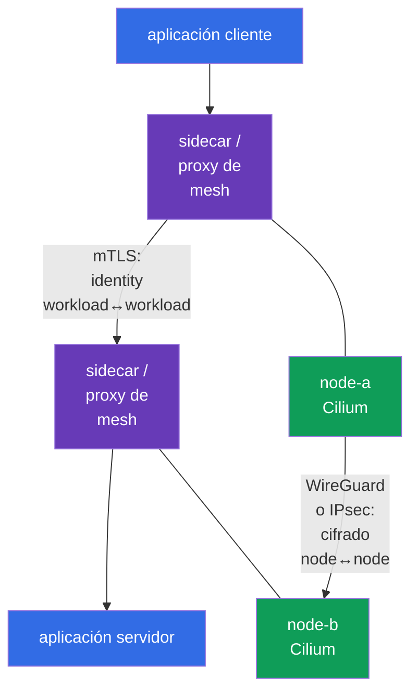
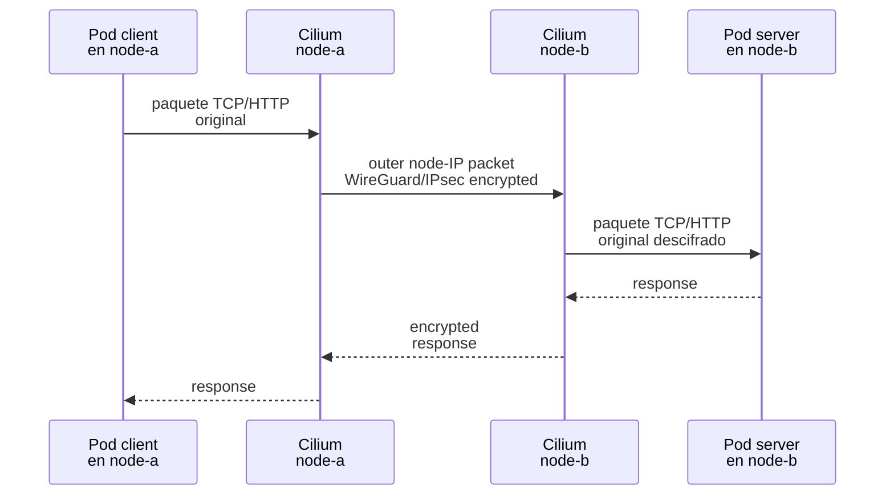
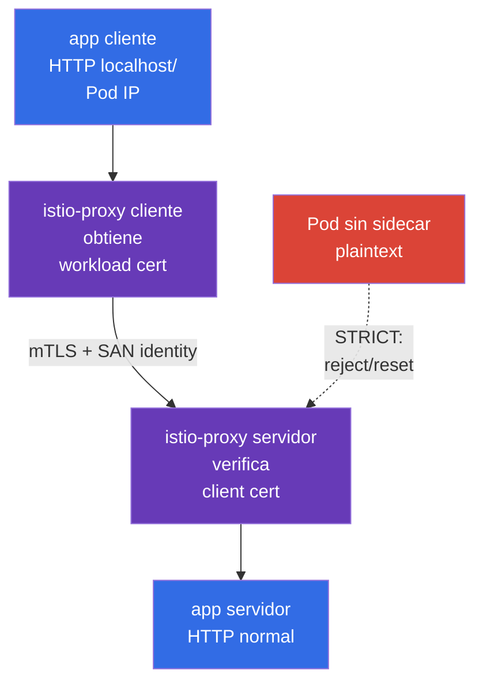

[Русская версия](ru.md) · [Eng version](README.md) · [Version française](fr.md) · [Deutsche Version](de.md) · [ქართული ვერსია](ge.md) · [繁體中文版](tw.md) · [日本語版](jp.md)

# Capítulo 23. Cifrado Pod-to-Pod y mTLS: Cilium, Istio y Linkerd

> **El problema.** NetworkPolicy puede permitir solo el flujo necesario, pero los datos que contiene siguen
> expuestos a intercepción o manipulación en la ruta entre nodes, y un Service sin verificación mutua
> de identity puede aceptar una conexión de otro workload. Comprometer un node, segmento de red
> o cliente puede entonces exponer tokens y payload o permitir suplantar un
> Service de confianza; transport encryption y mTLS para workload identity son necesarios por separado.

> **Qué sigue.** NetworkPolicy permite o deniega un flujo, pero por sí sola no lo hace
> confidencial. En este capítulo construimos dos capas distintas de protección del tráfico Pod-to-Pod:
> cifrado transparente de red entre nodes mediante Cilium (WireGuard o IPsec) y autenticación
> TLS mutua de workloads mediante un service mesh (Istio o Linkerd). Esta es la competencia
> **Implement Pod-to-Pod encryption (Cilium, Istio)** del dominio *Minimize Microservice
> Vulnerabilities* de CKS (20%).

> **Lo que necesita de CKA.** El modelo básico de red Pod y CNI se aborda en el
> [Capítulo 30 de CKA](../../../cka/course/30/es.md), Service/DNS en el
> [Capítulo 31 de CKA](../../../cka/course/31/es.md) y NetworkPolicy en el
> [Capítulo 34 de CKA](../../../cka/course/34/es.md). Este capítulo presupone que sabe
> encontrar un Pod, Service y node, y probar un `curl` normal.

> 🧠 Cilium WireGuard/IPsec protege el transporte node-to-node, mesh mTLS protege las conexiones proxy y workload identity, y NetworkPolicy autoriza el flujo.

## 23.1. Dos tareas, dos capas: encryption y mTLS

La expresión «cifrar el tráfico Pod-to-Pod» tiene dos significados distintos. No son
intercambiables.

- **Cilium WireGuard/IPsec** protege el paquete entre nodes. Cifra y autentica
  el segmento de transporte node-to-node de forma transparente para la aplicación: el contenedor no recibe
  certificado, el Service no cambia y HTTP dentro del workload sigue siendo HTTP.
- **Service mesh mTLS** crea una conexión TLS entre proxies de workload. Autentica la
  identity del workload que llama y del servidor, no solo de los nodes. Istio y Linkerd normalmente
  emiten ellos mismos certificados de corta vida e interceptan el tráfico mediante un sidecar/proxy.
- **NetworkPolicy** responde una cuestión diferente: qué flujo se permite en absoluto. Ni Cilium
  encryption ni mTLS proporcionan allow/deny por namespace y selector de Pod en sustitución de NetworkPolicy.



Para el tráfico entre nodes, estos mecanismos pueden combinarse: el service mesh protege la
conexión entre proxies de workload y el cifrado Cilium protege adicionalmente los paquetes en el
segmento de red entre nodes. **Cilium WireGuard e IPsec no cifran por diseño el tráfico Pod-to-Pod en el mismo node**:
no hay un outer packet entre nodes. mTLS sigue protegiendo la conexión entre workloads en el
mesh. A la inversa, Cilium encryption no sustituye mTLS: un workload comprometido en un
node de confianza no obtiene una identity verificable de cliente.

| Pregunta | Cilium WireGuard/IPsec | Istio/Linkerd mTLS | NetworkPolicy |
|---|---|---|---|
| Dónde se aplica | ruta entre nodes | entre proxies de workload | ingress/egress de Pod |
| Cifra el payload HTTP en la red física | sí | sí | no |
| Autentica | peers criptográficos de node | workload identity | no identity, sino selector/IP/port |
| Se necesita sidecar/proxy en un Pod | no | sí (o modo ambient/eBPF de un mesh concreto) | no |
| La aplicación ve el certificado | no | normalmente no | no |
| Protege Pod-to-Pod en el mismo node | no: Cilium WireGuard/IPsec no cifra por diseño este tráfico | sí, si ambos están en el mesh | restringe, pero no cifra |

> 🎯 Antes del cambio, registre el CNI, versiones, firewall, MTU y cross-node placement de los Pod de prueba.


**Registrar** aquí no significa cambiar la configuración, sino conservar un baseline: un snapshot
del estado operativo que se puede comparar con el resultado después del rollout. Guarde la salida de las
comprobaciones en una nota de change/incident o registros de formación: qué CNI ya sirve a la red y su
versión; qué versiones de Kubernetes/kernel/Cilium intervienen; si el firewall permite el
protocol entre nodes requerido; y qué MTU está disponible en la ruta. **Cross-node placement**
significa que los dos Pod de prueba se programan realmente en nodes **diferentes**. Esto importa: solo un
flujo así crea el outer packet node-to-node usado para demostrar WireGuard/IPsec. Si el tráfico deja de
funcionar después del cambio, el baseline ayuda a distinguir un defecto nuevo de una limitación preexistente de
firewall/MTU/placement.
## 23.2. Antes del cambio: scope, compatibilidad y estado baseline

El cifrado de CNI y un service mesh son cambios de alcance cluster-wide o namespace-wide. No los habilite
a ciegas en production: un MTU incorrecto, kernel antiguo, firewall o mTLS estricto para un cliente
legacy puede detener el tráfico. Primero registre el CNI actual, las versiones, la colocación de los Pod de prueba y la
ruta de paquetes.

```bash
kubectl get nodes -o wide
kubectl get pods -A -o wide
kubectl -n kube-system get ds cilium
kubectl -n kube-system get pods -l k8s-app=cilium -o wide
kubectl get networkpolicy -A
```

Compruebe con antelación:

1. Cilium ya es el CNI, y la versión de Cilium y el kernel admiten el modo seleccionado según la
   compatibility matrix oficial. No instale un segundo CNI sobre uno operativo.
2. El puerto UDP de WireGuard debe estar permitido entre todos los worker nodes (por defecto, Cilium usa
   `51871`, pero verifique el valor en la configuración instalada), o Cilium IPsec requiere ESP
   (IP protocol 50). El escenario típico IKE/NAT-T UDP/4500 no forma parte del mecanismo Cilium IPsec
   descrito aquí. Los security groups, firewall y rutas forman parte de la solución.
3. La red física tiene suficiente margen de MTU. La encapsulación agrega headers; con un problema de path-MTU,
   un `curl` pequeño puede funcionar mientras respuestas grandes se bloquean.
4. Existen dos Pod de prueba en nodes distintos. De otro modo, tcpdump no puede demostrar el cifrado
   node-to-node. Para una prueba de formación, asígneles `nodeSelector`/`podAntiAffinity` o encuentre
   workloads que ya estén distribuidos.
5. Existe un plan de rollback y una ventana de mantenimiento. Cambiar Helm values sin conservar el
   release anterior convierte el diagnóstico en adivinanzas.

El comando siguiente muestra los parámetros reales del Helm release instalado. Los nombres de release y los
values dependen del método de instalación; no los sustituya por la fuente de verdad GitOps.

```bash
helm -n kube-system list
helm -n kube-system get values cilium --all
kubectl -n kube-system get configmap cilium-config -o yaml
```

> 🎯 Transparent encryption protege solo el segmento entre nodes; seleccione un backend y compruebe su scope.

## 23.3. Cilium transparent encryption: modelo y límites

Cilium cifra el tráfico en el datapath de los nodes. Cuando un Pod en `node-a` envía datos a un Pod en
`node-b`, Cilium encapsula/cifra el paquete original, envía un paquete externo entre las
IP de node, y Cilium en `node-b` verifica el peer, lo descifra y entrega el paquete original
al Pod objetivo. Esto es transparente para el Kubernetes Service, DNS y la aplicación: no hace falta
cambiar la URL o el port, ni agregar una biblioteca TLS.



**Transparent** no significa «cifrado en todas partes y contra todo». Plaintext puede ser
visible en la interfaz de la aplicación o dentro del namespace antes del cifrado/después del descifrado.
El cifrado tampoco vuelve segura una aplicación insegura: no bloquea SQL injection,
no proporciona autorización de usuario ni limita un Pod comprometido. Estas tareas requieren application security,
mTLS/authorization, RBAC y NetworkPolicy.

Cilium admite dos backend comunes:

| Propiedad | WireGuard | IPsec |
|---|---|---|
| Modelo criptográfico | protocolo VPN moderno y compacto | IPsec ESP; a menudo estándar de organización/red |
| Transporte de red | UDP, normalmente `51871` | ESP (IP protocol 50) |
| Claves/peer | key pair para cada peer; la clave pública identifica un node permitido | key material en un Secret IPsec de Cilium, Security Association entre peers |
| Autenticación | paquete aceptado solo desde una clave pública conocida/peer permitido | integridad ESP + claves de Security Association |
| Elección operativa | normalmente una elección directa para un entorno Linux admitido | se requiere cuando lo exige un estándar IPsec/de red existente |
| Qué comprobar con tcpdump | UDP al puerto WireGuard, sin payload HTTP | `esp`, sin payload HTTP |

Cilium 1.20 también documenta el backend de cifrado `ztunnel` **beta**. Es una
extensión de production orientada al futuro, no la ruta CKS principal; WireGuard o IPsec basta
aquí para el escenario de examen.

Seleccione **un** backend. Habilitar WireGuard e IPsec simultáneamente como una forma de «doble
protección» no es una configuración normal de Cilium y solo complica la solución de problemas. Compruebe
los Helm values exactos y las combinaciones admitidas frente a la documentación de la versión
instalada en el clúster: los values de un artículo antiguo pueden no ser adecuados para un release de Cilium más nuevo.

> 🎯 Verifique los values version-pinned, el rollout de Cilium agents y encryption status; una peer key confirma un node, no Pod identity.

## 23.4. WireGuard: habilitación, peer key y autenticación mutua

WireGuard usa un par de private/public key para cada peer. Cilium gestiona automáticamente las claves
y distribuye las public keys necesarias entre Cilium agents mediante la API de Kubernetes. Un node
acepta un paquete cifrado solo cuando supera la verificación criptográfica del peer esperado;
suplantar una IP de node sin la clave no es suficiente. Por tanto, en la capa de transporte proporciona
tanto confidencialidad como **autenticación mutua de peers de node**.

Esto no es workload identity: dos Pod en un node no tienen identities WireGuard diferentes
y el servidor no puede conocer el ServiceAccount del cliente a partir de una WireGuard key. Se requiere
service mesh mTLS para ese tipo de confianza mutua.

Lo siguiente muestra una configuración Helm típica. Aplíquela mediante su GitOps version-pinned o
un Helm release fijado, después de verificar los values del release Cilium concreto.
`encryption.nodeEncryption=true` extiende la protección al tráfico node-to-node. Para WireGuard,
Cilium excluye por defecto del cifrado node-to-node los nodes con el label `node-role.kubernetes.io/control-plane`:
esto evita un problema de bootstrap al actualizar la public key. No suponga que el control plane
queda automáticamente cubierto por este ajuste; habilítelo solo después de comprender su efecto en el tráfico de
control-plane y host.

```bash
# Ejemplo: sustituya la versión y los values ya aprobados del repositorio.
helm upgrade cilium cilium/cilium \
  --namespace kube-system \
  --reuse-values \
  --version <pinned-cilium-version> \
  --set encryption.enabled=true \
  --set encryption.type=wireguard

kubectl -n kube-system rollout status daemonset/cilium --timeout=10m
kubectl -n kube-system get pods -l k8s-app=cilium
```

Si la política exige cifrar también el tráfico de node, conviértalo en un cambio separado y revisable, y
pruebe la disponibilidad de API server/kubelet:

```bash
helm upgrade cilium cilium/cilium \
  --namespace kube-system \
  --reuse-values \
  --version <pinned-cilium-version> \
  --set encryption.enabled=true \
  --set encryption.type=wireguard \
  --set encryption.nodeEncryption=true
```

Después del rollout, compruebe el estado **en cada Cilium agent**, no solo en el Pod que
`kubectl exec ds/cilium` selecciona arbitrariamente:

```bash
kubectl -n kube-system get pods -l k8s-app=cilium -o wide
kubectl -n kube-system get pods -l k8s-app=cilium -o name |
  while IFS= read -r agent; do
    echo "=== $agent ==="
    kubectl -n kube-system exec "$agent" -- cilium-dbg status --verbose
    kubectl -n kube-system exec "$agent" -- cilium-dbg encrypt status
  done
```

Se esperan agents saludables y encryption state sin errores de peer/handshake en cada node. Según
la versión de Cilium, el comando puede mostrar la interfaz WireGuard, peers, public
keys o contadores. `cilium-dbg` es el CLI local del agent: si el subcommand no existe,
ejecute `cilium-dbg --help` **en ese mismo agent** y consulte la documentación de la versión de Cilium
instalada, porque este binary se suministra con el agent. El Cilium CLI externo, `cilium`, que se ejecuta
desde una máquina administrativa tiene un versionado separado: use una versión compatible admitida y su
compatibility table, en lugar del mismo número de versión que el release.

> 🔬 Strict mode impide el primer plaintext packet, pero requiere compatibilidad específica de versión y routing.

### Strict mode: impedir el primer plaintext packet

Con WireGuard transparente ordinario para tráfico Pod-to-Pod entre endpoints gestionados por Cilium en
nodes diferentes, el agent puede no conocer inmediatamente un nuevo endpoint remoto; hasta entonces, sus primeros
paquetes egress podrían salir sin túnel. Si el threat model no lo permite,
use strict mode después de comprobar por separado la compatibilidad de la versión:

```yaml
encryption:
  strictMode:
    egress:
      enabled: true
      # IPv4 Pod CIDR de este clúster - sustituya por el valor real.
      cidr: 10.244.0.0/16
    ingress:
      enabled: true
```

`encryption.strictMode.egress` se admite solo para IPv4, por lo que `cidr` debe ser el IPv4
Pod CIDR real; el modo también tiene restricciones para direct routing, node CIDR e interfaces seleccionadas.
`encryption.strictMode.ingress` descarta tráfico Pod interno del clúster que no llega por un
túnel WireGuard; no es un strict mode universal para IPsec. Antes de habilitarlo, compruebe los
requisitos del release Cilium para native/direct routing y device configuration, y después use una prueba
negativa para confirmar que los paquetes Pod-to-Pod en plaintext entre nodes no pasan. No habilite strict mode
como sustituto de comprobar NetworkPolicy, firewall y disponibilidad del control plane.

> 🏭 Para un node comprometido: aíslelo, conserve evidence, elimine el peer antiguo de la confianza; la private key nunca se coloca en un ticket, Git o chat.

**Qué significa esto en la práctica:** «comprometido» significa que hay razones para creer que un atacante
pudo ejecutar comandos en el node o leer sus datos. **Aislarlo** significa no programarle Pods nuevos y
limitar su participación en el clúster según el procedimiento de incident aprobado; esto
contiene la propagación, pero no borra evidence. **Evidence** son los metadatos y logs necesarios para
la investigación (hora, nombre del node, estado de Cilium y eventos), no una copia de la private key.
**Eliminar el peer antiguo de la confianza** significa, después de regenerar una key o sustituir un node, confirmar
que los demás nodes ya no aceptan tráfico autenticado con la public key anterior. La siguiente
lista muestra la secuencia segura de estas acciones.

### Rotación de clave WireGuard y un incidente

Cilium automatiza el lifecycle de las claves, pero el diseño de seguridad aún debe describir quién puede leer o
cambiar recursos Cilium y cómo responder al compromiso de un node. No copie una private key de un
node a un ticket, chat o Git. Ante sospecha de compromiso:

1. aísle el node (`cordon`/`drain`, teniendo en cuenta DaemonSet y PDB) y conserve evidence;
2. compruebe los logs, health y peers del Cilium agent en los demás nodes;
3. siga el procedimiento documentado de la versión Cilium para eliminar/regenerar la peer key
   o recrear el node;
4. compruebe que el node nuevo recibió una identity/key nueva y que el peer antiguo ya no acepta
   tráfico;
5. repita las comprobaciones funcionales y de packet-level de la sección 23.10.

`kubectl get secret -A` y permisos amplios para leer Secrets proporcionan acceso no solo a material
IPsec, sino también a muchos otros secretos. Restrinja RBAC y audit access a `kube-system`.

> 🔬 IPsec es un backend Cilium alternativo con key rotation, diagnóstico ESP, Cilium CLI compatible y una key-overlap window.

## 23.5. IPsec: cuándo se necesita y cómo no romper key management

IPsec en Cilium también proporciona cifrado transparente node-to-node, pero usa IPsec ESP
Security Associations. Se suele seleccionar cuando requisitos corporativos o infraestructura de red
existente requieren IPsec. Un paquete en la physical interface aparece como ESP (IP protocol 50); el
HTTP de aplicación no debe poder leerse en él. No traiga aquí el modelo general IKE/NAT-T con UDP/4500:
no forma parte de este mecanismo Cilium.

Una transición típica para un release Cilium que admite IPsec comienza con el key Secret: el
agent debe recibir `cilium-ipsec-keys` **antes** de habilitar `encryption.type=ipsec`. Realice la
creación solo desde una máquina administrativa que tenga un Cilium CLI compatible admitido y un
kubeconfig. Si el Secret ya existe, no lo sobrescriba accidentalmente: compruebe primero su
owner y el procedimiento de rotación específico de versión:

```bash
kubectl -n kube-system get secret cilium-ipsec-keys >/dev/null 2>&1 || \
  cilium encrypt create-key --auth-algo rfc4106-gcm-aes

# Compruebe solo la presencia y metadata de la clave, no los datos de la clave.
kubectl -n kube-system get secret cilium-ipsec-keys \
  -o custom-columns=NAME:.metadata.name,TYPE:.type,CREATED:.metadata.creationTimestamp
kubectl -n kube-system get secret cilium-ipsec-keys \
  -o jsonpath='{.metadata.resourceVersion}{"\n"}'

helm upgrade cilium cilium/cilium \
  --namespace kube-system \
  --reuse-values \
  --version <pinned-cilium-version> \
  --set encryption.enabled=true \
  --set encryption.type=ipsec

kubectl -n kube-system rollout status daemonset/cilium --timeout=10m
kubectl -n kube-system get pods -l k8s-app=cilium -o name |
  while IFS= read -r agent; do
    echo "=== $agent ==="
    kubectl -n kube-system exec "$agent" -- cilium-dbg encrypt status
  done
```

Cilium almacena key material IPsec en el Secret `cilium-ipsec-keys` de `kube-system`. No lo
imprima en un terminal, CI log ni documentación. Es aceptable comprobar su presencia y
metadata sin decodificar los datos.

Para la rotación, use únicamente una versión **compatible** admitida del Cilium CLI y el
procedimiento específico de versión. Obtenga el estado ordinario no secreto mediante `cilium encryption
status` desde una máquina administrativa y `cilium-dbg encrypt status` en cada node. El
comando `cilium encryption key-status` imprime key material IPsec: ejecútelo solo cuando un procedimiento de
rotación aprobado lo exija explícitamente, en un terminal protegido, sin salida a CI, un log,
ticket o chat.

```bash
# Máquina administrativa con un Cilium CLI compatible admitido.
cilium encryption status
cilium encryption rotate-key
```

Para varios clústeres o un release no estándar, agregue los parámetros `--context`,
`--namespace kube-system` y `--helm-release-name` requeridos a los comandos. No realice la
rotación desde un Cilium Pod. Compruebe la disponibilidad del subcommand con `cilium encryption --help`
y la compatibility table del CLI. Con `encryption.ipsec.keyWatcher=true` (default), los agents
recogen el Secret actualizado sin reiniciar DaemonSet; normalmente todos los agents lo aplican aproximadamente en un minuto,
y las keys antiguas y nuevas coexisten en la rotation window. Un restart/rollout de DaemonSet es necesario
solo cuando el watcher está deshabilitado o la documentación de la versión instalada lo exige
explícitamente.

No puede sustituir manualmente el Secret con una sola cadena aleatoria: la desincronización de peers provoca
packet loss. El mínimo práctico para una change request:

- genere la key nueva de forma criptográficamente aleatoria y transfiérala por un canal protegido;
- tome el orden y formato del key Secret de la documentación del Cilium instalado;
- compruebe el `resourceVersion` del Secret y `cilium-dbg encrypt status` en **todos** los agents antes
  de terminar la key-overlap window;
- mida pérdidas/errores y tenga rollback antes de eliminar la key antigua;
- después de la rotación, compruebe la aplicación y physical capture en el par de nodes requerido.

**No confunda la IPsec key con la CA de mTLS.** La IPsec key protege peers de transporte, mientras que
el certificado mesh confirma workload identity. Su owner, interval de rotación, audit y blast
radius pueden diferir.

Esto completa la configuración de Cilium transport encryption. Istio se considera deliberadamente
inmediatamente después: **no** es el siguiente parámetro Cilium ni un prerequisite para IPsec, sino una
capa adicional independiente. Para una solicitud cross-node, Cilium protege el outer packet entre
nodes, mientras que Istio mTLS permite a un proxy verificar la identity de un workload específico. Por ello,
healthy Cilium encryption aún no demuestra injection, certificados ni mTLS policy de Istio:
esas comprobaciones se realizan por separado en la sección siguiente.

> 🎯 Istio mTLS vincula un certificate con workload identity; distinga `PeerAuthentication: STRICT` de `DestinationRule` con `ISTIO_MUTUAL` y compruebe proxy/injection.

> 🔬 **Upstream identity primitive.** Kubernetes v1.37 estabilizó Pod Certificates y ClusterTrustBundles. Proporcionan primitives X.509 a nivel de Kubernetes, pero no hacen automáticamente innecesario el identity plane de Istio/SPIFFE: signer, trust model y mesh enforcement son decisiones arquitectónicas independientes. Consulte [Delta de seguridad de Kubernetes v1.37](../APPENDIX_K8S_137_SECURITY_DELTA.md).

## 23.6. Istio: sidecar, SPIFFE workload identity y `PeerAuthentication`


### Qué problema resuelve Istio después de Cilium

Las secciones anteriores ya protegieron el **transporte entre nodes**: Cilium WireGuard/IPsec cifra
el outer packet y autentica el node peer. Pero no basta si es importante responder a la
pregunta: «¿qué workload concreto llama al servicio?» Cilium no proporciona a la aplicación o al servidor
una identity verificable del Pod/ServiceAccount cliente y por sí solo no obliga al servidor a aceptar
solo mTLS. Además, Cilium node encryption no crea por diseño un outer tunnel para Pods
en un mismo node.

Istio resuelve otra parte de la tarea: los proxy de workload obtienen certificates, establecen mTLS
y verifican la identity del peer. `PeerAuthentication: STRICT` puede prohibir el tráfico inbound
plaintext. Juntos funcionan así: **Istio protege y autentica la conexión workload-to-workload,
Cilium protege adicionalmente el paquete en el segmento entre nodes no confiable**.
`NetworkPolicy` sigue siendo la tercera capa: define qué flow está permitido en absoluto.

| Pregunta | Cilium WireGuard/IPsec | Istio mTLS |
|---|---|---|
| Ventaja principal | Transparent node-to-node encryption sin cambiar la aplicación ni Service | Workload identity, autenticación mutua y `STRICT` contra client plaintext |
| Qué no resuelve | No proporciona al servidor identity del workload cliente; no cifra por diseño el flow same-node | No oculta outer L3/L4 metadata al underlay ni cubre flow non-mesh; no sustituye NetworkPolicy |
| Coste/limitación | Necesita CNI/kernel, firewall y MTU compatibles; las claves pertenecen a los nodes | Necesita control plane, certificates y dataplane proxy/ambient; el modo sidecar agrega container y overhead |
| Qué demostrar | Cilium agent status y WireGuard/ESP externo en la physical NIC | Injection/enrollment, status de proxy/certificate y tests mTLS/`STRICT` |

No es un «doble cifrado» obligatorio. Si **ambos** workloads ya están en el mesh, se ha
verificado la confianza y `PeerAuthentication: STRICT` se aplica realmente, mTLS ya cifra el
application payload entre proxies. No es obligatorio habilitar Cilium node encryption solo para
volver a cifrar el mismo payload.

Cilium aporta valor independiente cuando el threat model exige proteger el underlay node-to-node:
ocultar la IP/port internos de Pod y otros L3/L4 metadata a la red física, cubrir flow cross-node
sensible fuera del mesh o cumplir un requisito de policy/compliance de cifrado entre nodes. Ambas capas
se necesitan solo cuando se aplican **ambos** objetivos: workload identity/mTLS **y** protección del
underlay o tráfico non-mesh. Si la aplicación no requiere workload identity ni comportamiento compatible
con mesh, Istio no se habilita automáticamente: primero se evalúan el threat model, la compatibilidad y el overhead.
El sidecar de Istio (`istio-proxy`, Envoy) intercepta tráfico workload inbound/outbound.
Istiod emite un certificado de workload a partir del ServiceAccount de Kubernetes; los proxies establecen
mTLS y verifican la identity del peer. Workload identity tiene la forma de SPIFFE ID:
`spiffe://<trust-domain>/ns/<namespace>/sa/<service-account>`. La aplicación normalmente continúa
escuchando un port HTTP normal porque TLS termina en el sidecar y no en el app container.

En **ambient mode**, Istio no agrega un sidecar separado a cada Pod: en su lugar, en
cada node se ejecuta `ztunnel` (**Zero Trust Tunnel**), un proxy especial a nivel de node.
Realiza tareas L3/L4 de mesh, incluido mTLS y authentication, sin obligar a la aplicación
a trabajar por sí misma con TLS.

`HBONE` (**HTTP-Based Overlay Network Environment**) es un Istio tunnel protegido entre
componentes mesh. Transporta varios TCP streams mediante una conexión mTLS; por ello
el tráfico de workload puede estar protegido aunque la lista de containers del Pod no contenga `istio-proxy`.
La ausencia de `istio-proxy` en ambient mode no significa client plaintext. En ambos modelos,
`PeerAuthentication` con `STRICT` no permite tráfico inbound plaintext: en ambient mode
el servidor espera un flujo HBONE/mTLS protegido.

La siguiente comprobación de `istio-injection=enabled` y presencia de `istio-proxy` corresponde **solo al
modo sidecar**. Para ambient mode, compruebe el enrollment de workload y el estado de `ztunnel` según la
documentation de la versión Istio instalada, y no espere un container adicional en el Pod.



### Habilitar injection y comprobar el sidecar

Para un namespace de formación, habilite injection antes de crear Pods. En production use el
revision label de la instalación Istio que controla el change process; no mezcle
revisions diferentes sin un plan de migración.

```bash
kubectl create namespace mesh-demo
kubectl label namespace mesh-demo istio-injection=enabled

kubectl -n mesh-demo apply -f server.yaml
kubectl -n mesh-demo apply -f client.yaml
kubectl -n mesh-demo get pods
kubectl -n mesh-demo get pod -l app=server \
  -o jsonpath='{range .items[*]}{.metadata.name}{": "}{.spec.containers[*].name}{"\n"}{end}'
```

En la lista de containers debe aparecer `istio-proxy` junto con `server`. La ausencia del sidecar
no es un defecto cosmético: un client plaintext no se convertirá en un client mTLS, y `STRICT`
lo rechazará como corresponde. Para un Deployment ya existente, realice un controlled rollout después del label:

```bash
kubectl -n mesh-demo rollout restart deployment/server
kubectl -n mesh-demo rollout status deployment/server
kubectl -n mesh-demo get pod -l app=server \
  -o jsonpath='{range .items[*]}{.metadata.name}{": "}{.spec.containers[*].name}{"\n"}{end}'
```

### `PeerAuthentication`: el servidor exige mTLS

`PeerAuthentication` establece la policy mTLS inbound. `STRICT` significa: el proxy del servidor
acepta solo tráfico mTLS de un peer que puede presentar un certificate de confianza.
TCP plaintext de un workload sin sidecar no es un fallback permitido.

El siguiente recurso se aplica a todo el namespace `mesh-demo`. Aquí no hace falta un namespace selector:
el namespace se indica mediante `metadata.namespace`.

```yaml
apiVersion: security.istio.io/v1
kind: PeerAuthentication
metadata:
  name: default
  namespace: mesh-demo
spec:
  mtls:
    mode: STRICT
```

Puede limitar la policy a un workload de servidor. Tal selector coincide con un label de Pod, no con
el nombre de Service; compruebe los labels reales mediante `kubectl get pod --show-labels`.

```yaml
apiVersion: security.istio.io/v1
kind: PeerAuthentication
metadata:
  name: server-strict
  namespace: mesh-demo
spec:
  selector:
    matchLabels:
      app: server
  mtls:
    mode: STRICT
```

No aplique al mismo tiempo `STRICT` namespace-wide y una policy de workload con `PERMISSIVE`
contradictorio sin comprender la precedence. Una buena migración suele tener este aspecto:

```text
inventory clients -> inject/corregir clients -> PERMISSIVE measurement (si es necesario) ->
verify mTLS -> STRICT narrow scope -> STRICT namespace -> remove temporary exception
```

`PERMISSIVE` es útil solo como compatibilidad temporal: el proxy acepta mTLS y plaintext,
por lo que un `curl` correcto aún no demuestra mTLS. `DISABLE` para un workload TCP ordinario
crea una excepción que se debe minimizar, documentar con su owner y fechar.

### `DestinationRule`: el cliente no debe deshabilitar TLS

Istio auto mTLS puede elegir TLS automáticamente, pero un `DestinationRule` explícito resulta
útil como una intención client-side verificable en un entorno de formación o cuando la policy de la organización exige
una configuración explícita. `PeerAuthentication` protege el servidor inbound, mientras que `DestinationRule`
establece TLS para el tráfico client outbound: son lados distintos de la conexión.

```yaml
apiVersion: networking.istio.io/v1
kind: DestinationRule
metadata:
  name: server-mtls
  namespace: mesh-demo
spec:
  host: server.mesh-demo.svc.cluster.local
  trafficPolicy:
    tls:
      mode: ISTIO_MUTUAL
```

`ISTIO_MUTUAL` significa que Envoy usa los certificados y trust bundle que
administra Istio. No lo sustituya por `SIMPLE`: `SIMPLE` crea un client TLS ordinario sin
workload client certificate y no satisface mTLS. `DISABLE` dirige plaintext y
con servidor `STRICT` debe rechazarse. Para external service normalmente se necesitan
`ServiceEntry`/TLS settings separados; no use este ejemplo como regla global para todo
`*.svc.cluster.local`.

Compruebe los objetos aplicados y la configuración real del proxy:

```bash
kubectl -n mesh-demo get peerauthentication,destinationrule
istioctl proxy-status
istioctl proxy-config cluster deploy/client -n mesh-demo | grep server.mesh-demo
istioctl analyze -n mesh-demo
```

`istioctl analyze` y `proxy-config` dependen de la versión Istio, pero la idea útil es constante:
no mire solo YAML en Git, sino la runtime configuration del proxy. Crear correctamente un CR
no garantiza que selector/host haya coincidido con el endpoint requerido.

> 🎯 `STRICT`: un meshed client recibe `200`; un client sin sidecar no obtiene éxito plaintext.

## 23.7. Experimento controlado de Istio: 200 dentro del mesh, reset fuera

El siguiente entorno demuestra el límite principal de `STRICT`: un meshed client recibe HTTP `200`,
mientras que un client sin sidecar hace una solicitud plaintext y recibe TCP reset/error TLS, no acceso
al servidor. Ejecútelo solo en un namespace dedicado: `STRICT` rompe intencionadamente las
llamadas plaintext legacy.

Primero, cree el namespace con injection y los workloads server/client. El client tiene sidecar
por el label del namespace; el `legacy-client` de abajo se ejecuta en un namespace independiente sin injection.

```yaml
apiVersion: v1
kind: Namespace
metadata:
  name: mesh-demo
  labels:
    istio-injection: enabled
---
apiVersion: v1
kind: Service
metadata:
  name: server
  namespace: mesh-demo
spec:
  selector:
    app: server
  ports:
  - name: http
    port: 8080
    targetPort: 8080
---
apiVersion: apps/v1
kind: Deployment
metadata:
  name: server
  namespace: mesh-demo
spec:
  replicas: 1
  selector:
    matchLabels:
      app: server
  template:
    metadata:
      labels:
        app: server
    spec:
      containers:
      - name: server
        image: hashicorp/http-echo:1.0
        args: ["-listen=:8080", "-text=server-ok"]
        ports:
        - containerPort: 8080
---
apiVersion: apps/v1
kind: Deployment
metadata:
  name: client
  namespace: mesh-demo
spec:
  replicas: 1
  selector:
    matchLabels:
      app: client
  template:
    metadata:
      labels:
        app: client
    spec:
      containers:
      - name: client
        image: curlimages/curl:8.12.1
        command: ["sleep", "infinity"]
---
apiVersion: security.istio.io/v1
kind: PeerAuthentication
metadata:
  name: default
  namespace: mesh-demo
spec:
  mtls:
    mode: STRICT
---
apiVersion: networking.istio.io/v1
kind: DestinationRule
metadata:
  name: server-mtls
  namespace: mesh-demo
spec:
  host: server.mesh-demo.svc.cluster.local
  trafficPolicy:
    tls:
      mode: ISTIO_MUTUAL
```

```bash
kubectl apply -f istio-strict-demo.yaml
kubectl -n mesh-demo rollout status deployment/server
kubectl -n mesh-demo rollout status deployment/client
kubectl -n mesh-demo get pods -o wide

CLIENT=$(kubectl -n mesh-demo get pod -l app=client -o jsonpath='{.items[0].metadata.name}')
kubectl -n mesh-demo exec "$CLIENT" -c client -- \
  curl -sS -o /dev/null -w '%{http_code}\n' http://server.mesh-demo.svc.cluster.local:8080
# Se espera: 200
```

Ahora cree un client sin injection. El label `istio-injection=disabled` en el Pod no hace falta
si el namespace `legacy-demo` no está marcado para injection; la anotación explícita hace visible la intención
en el review.

```yaml
apiVersion: v1
kind: Namespace
metadata:
  name: legacy-demo
---
apiVersion: v1
kind: Pod
metadata:
  name: outside-client
  namespace: legacy-demo
  annotations:
    sidecar.istio.io/inject: "false"
spec:
  containers:
  - name: client
    image: curlimages/curl:8.12.1
    command: ["sleep", "infinity"]
```

```bash
kubectl apply -f outside-client.yaml
kubectl -n legacy-demo wait --for=condition=Ready pod/outside-client --timeout=120s
kubectl -n legacy-demo get pod outside-client \
  -o jsonpath='{.spec.containers[*].name}{"\n"}'
# Se espera: solo client, sin istio-proxy

kubectl -n legacy-demo exec outside-client -- \
  curl --connect-timeout 5 --max-time 10 -v http://server.mesh-demo.svc.cluster.local:8080
# Se espera: non-zero; normalmente "Recv failure: Connection reset by peer".
```

El texto concreto del error depende de la versión de Envoy, el protocolo y el punto de intercepción: son posibles
`connection reset`, error de TLS handshake o timeout. El criterio de seguridad no es la cadena
de error, sino la ausencia de éxito plaintext: el comando no devuelve HTTP `200` y el proxy del servidor
no acepta el flujo no autenticado. Para una comprobación automática estricta, fije ambos indicadores:

```bash
set +e
OUT=$(kubectl -n legacy-demo exec outside-client -- \
  curl -sS --connect-timeout 5 --max-time 10 -o /dev/null -w '%{http_code}' \
  http://server.mesh-demo.svc.cluster.local:8080 2>&1)
RC=$?
set -e
printf 'exit=%s output=%s\n' "$RC" "$OUT"
test "$RC" -ne 0 || test "$OUT" != 200
```

Si **dentro del mesh no hay 200**, compruebe la presencia de `istio-proxy`, DNS/Service endpoints,
`PeerAuthentication`, `DestinationRule`, proxy status y NetworkPolicy. Si **fuera
se obtiene 200**, primero asegúrese de que `STRICT` alcanzó el Pod server y `outside-client`
realmente no tiene sidecar; después busque una policy `PeerAuthentication` más específica
que haya sobrescrito la prueba.

> 🔬 Linkerd tiene su propio identity model y policy API; no lo use junto con un sidecar Istio en el mismo Pod.

## 23.8. Linkerd: variante de production de mTLS e identity ServiceAccount

Linkerd es una opción completa de service mesh de production para workload mTLS, pero es material
adicional: las CKS competencies principales para Pod-to-Pod encryption nombran explícitamente Cilium e Istio,
no Linkerd. Linkerd usa su propio proxy ligero e identity model. Después de injection, un Pod
obtiene `linkerd-proxy`; el tráfico meshed entre workloads Linkerd se cifra y autentica automáticamente
con mTLS. La identity suele estar vinculada a un Kubernetes ServiceAccount y tiene una forma
similar a DNS:

```text
<serviceaccount>.<namespace>.serviceaccount.identity.linkerd.cluster.local
```

No coloque sidecars Istio y Linkerd en el mismo workload para «protección adicional». Ambos quieren
interceptar tráfico, emitir certificates y gestionar policy; el resultado es un conflicto de iptables/ports,
observability poco fiable y una respuesta a incidentes complicada. Seleccione un mesh para un namespace o
realice una migración documentada.

Antes de instalar Linkerd, compruebe los requisitos previos del clúster, la presencia de Gateway API
CRD compatibles y use un release fijado. Linkerd moderno requiere Gateway API CRD; si faltan,
instale primero la versión compatible con su release según las instrucciones oficiales.

```bash
kubectl get crd gateways.gateway.networking.k8s.io
# Si falta el CRD, instale un release Gateway API CRD compatible antes de instalar linkerd.
linkerd check --pre
linkerd install --crds | kubectl apply -f -
linkerd install | kubectl apply -f -
linkerd check

# Viz es una extensión independiente; instálela antes de los comandos viz.
linkerd viz install | kubectl apply -f -
linkerd viz check
```

En production, el manifest de instalación debe generarse y verificarse en CI desde una versión
CLI/chart fijada, no desde `latest` flotante. Después de la comprobación de salud, habilite injection solo para
un namespace de prueba y reinicie los workloads:

```bash
kubectl create namespace linkerd-demo
kubectl annotate namespace linkerd-demo linkerd.io/inject=enabled
kubectl -n linkerd-demo apply -f server.yaml
kubectl -n linkerd-demo apply -f client.yaml
kubectl -n linkerd-demo rollout status deployment/server
kubectl -n linkerd-demo get pod -l app=server \
  -o jsonpath='{.items[0].spec.containers[*].name}{"\n"}'
linkerd -n linkerd-demo check --proxy
linkerd -n linkerd-demo viz stat deploy
```

Como con Istio, compruebe no solo la anotación, sino también el container proxy real,
el estado de identity/certificate y una solicitud correcta entre Pods meshed. Es importante
distinguir mTLS automático de inbound estricto: Linkerd usa mTLS automáticamente entre workloads
meshed, pero por defecto la autorización inbound acepta plaintext desde una fuente no meshed
(`all-unauthenticated`). La mera presencia de mTLS automático no significa que el servidor
acepte solo mTLS.

Para una policy inbound estricta mínima, establezca `all-authenticated` antes de crear workloads en el
namespace de formación:

```yaml
apiVersion: v1
kind: Namespace
metadata:
  name: linkerd-demo
  annotations:
    linkerd.io/inject: enabled
    config.linkerd.io/default-inbound-policy: all-authenticated
```

Después de aplicarla, cree un client no meshed en un namespace sin injection Linkerd y verifique
que su `curl` plaintext al Service no devuelve HTTP `200`; un client meshed con una identity permitida
debe seguir funcionando. Para reglas más específicas, use la policy API del release, por ejemplo,
`AuthorizationPolicy` junto con `MeshTLSAuthentication`. La Linkerd policy API y el comportamiento del tráfico
no autorizado han cambiado entre versiones: antes de construir default-deny, compruebe los CRD y el modo
policy del release instalado. mTLS confirma identity y protege el canal, pero no implica necesariamente
«cada identity puede llamar a cada endpoint»: la autorización debe configurarse por separado.

> 🔬 Una captura ve plaintext/TLS interno antes de la terminación y el paquete externo cifrado en la physical NIC.

## 23.9. WireGuard/IPsec y mesh juntos: dónde se ve plaintext

La comprobación «`curl` funciona» no demuestra el cifrado. `curl` verifica la disponibilidad y la
respuesta de la aplicación, pero no distingue HTTP plaintext de tráfico cifrado. De igual modo,
tcpdump en `any` puede ver simultáneamente un paquete plaintext interno en una interfaz virtual y un
paquete externo cifrado en la physical NIC. Para demostrarlo, indique primero *dónde* debe verse cada capa.

| Punto de captura | Solo con cifrado Cilium | Con Cilium + Istio/Linkerd |
|---|---|---|
| app container / loopback al proxy | a menudo HTTP plaintext | app↔proxy local puede ser plaintext |
| veth/CNI antes del cifrado de node | el flujo interno original puede leerse | ciphertext mTLS entre proxies mesh |
| physical NIC en node-a/node-b | UDP WireGuard o ESP IPsec, sin HTTP | WireGuard/IPsec externo; los payload HTTP y TLS no se pueden leer |
| app de servidor después del proxy | plaintext, porque el proxy ya lo descifró | plaintext desde el proxy local a la app |

Esta es la arquitectura normal de los puntos de terminación. El objetivo de Cilium es eliminar el payload
legible de la ruta física no confiable. El objetivo del mesh es proteger con TLS el segmento
workload-to-workload y vincularlo a una identity. No afirme que «tcpdump nunca muestra HTTP»: en
un node y en un Pod puede verse antes/después del cifrado si un atacante tiene root en ese node.

> 🎯 Confirme cross-node placement, la physical NIC específica, el momento del flujo repetible y el estado de Cilium.

## 23.10. Verificación con `tcpdump`: demostrar tráfico externo cifrado

Para una demostración a nivel de paquete, necesita Pods en nodes **diferentes**, las IP de node de ambos
nodes y la interfaz física que lleva a la red del clúster. No use `eth0` automáticamente: en un node cloud,
la interfaz puede llamarse `ens5`, `ens192` u otra cosa.

```bash
NODE_B_IP="${NODE_B_IP:?set the second node IP}"
kubectl get pods -A -o wide
kubectl get nodes -o wide
# En el node seleccionado:
ip -br link
ip route get "${NODE_B_IP}"
```

En el primer node, ejecute la captura específicamente en la interfaz física. Los comandos siguientes
suponen acceso SSH/aprobado al node; no agregue un debug Pod privilegiado a production solo por
comodidad. Con acceso break-glass permitido, `kubectl debug node/<node>` también proporciona
diagnóstico a nivel de host, pero el propio acceso debe ser auditable.

### Captura WireGuard

```bash
# En node-a; sustituya ens5 y la IP de node-b.
sudo tcpdump -ni ens5 -vv 'udp port 51871 and host <NODE_B_IP>'
```

En otro terminal, cree un flujo cross-node repetible. Es práctico hacer varias solicitudes desde el client Pod
que, según `kubectl get pod -o wide`, está en `node-a`, a un Pod/Service server en `node-b`:

```bash
for i in $(seq 1 20); do
  kubectl -n mesh-demo exec "$CLIENT" -c client -- \
    curl -sS http://server.mesh-demo.svc.cluster.local:8080 >/dev/null || exit 1
done
```

Se espera una serie de datagramas UDP entre node-a y node-b en el puerto WireGuard. `-vv`
aumenta el detalle de la decodificación del header de protocolo, pero no imprime payload ASCII,
por lo que la ausencia de `GET /`, `Host:` o `server-ok` en esa salida no demuestra nada. UDP en
el puerto tampoco prueba aún que sea el flujo Pod requerido: correlacione el momento de la captura, el
par de nodes y el aumento de los counters/status de cifrado Cilium.

Si un lab desechable requiere específicamente comparar payloads, use una captura corta de un flujo controlado
no secreto con `-A` o `-X` y snaplen suficiente en el punto interno esperado. No aplique captura de payload
al tráfico sensible de production.

### Captura IPsec

Para Cilium IPsec, la captura filtra ESP, es decir, IP protocol 50:

```bash
# En node-a: ESP de Cilium IPsec.
sudo tcpdump -ni ens5 -vv 'host <NODE_B_IP> and esp'
```

Vuelva a ejecutar el flujo de aplicación repetible. Se esperan paquetes ESP. No use la ausencia de
cadenas HTTP en `tcpdump -vv` como demostración: este modo no muestra el payload. Después de la captura,
correlacione el resultado con el agent **en node-a y node-b**:

```bash
for node in "${NODE_A:?set first node name}" "${NODE_B:?set second node name}"; do
  agent=$(kubectl -n kube-system get pods -l k8s-app=cilium \
    --field-selector "spec.nodeName=$node" \
    -o jsonpath='{.items[0].metadata.name}')
  test -n "$agent" || { echo "ERROR: no Cilium agent on $node" >&2; exit 1; }
  echo "=== node=$node agent=$agent ==="
  kubectl -n kube-system exec "$agent" -- cilium-dbg encrypt status
done
```

`grep` sin resultado no prueba la seguridad: muchos agents normales no registran todos los paquetes.
La evidencia sólida consta de cuatro hechos coincidentes: cross-node placement, `200` para el flujo
previsto, encryption status/counters saludables y un protocolo externo cifrado en la physical NIC.
Para comparación de payload, use solo una captura de lab limitada con `-A`/`-X`, no tráfico de production.

### Verificación negativa y trampas comunes

- **La captura en `-i any` muestra HTTP.** Puede ser un paquete interno antes del cifrado, entrega
  local o tráfico entre Pods del mismo node. Repita en la physical NIC y compruebe el placement.
- **No hay UDP/51871, pero curl funciona.** Los Pods pueden estar en el mismo node, usar otro puerto Cilium,
  tener el cifrado deshabilitado o usar otro transporte. Primero compruebe values y
  `cilium-dbg encrypt status`; después rutas/interfaz.
- **ESP/UDP está presente, pero la captura no coincide con la prueba.** Hay otro tráfico cifrado
  presente en el node. Limite el filtro BPF al par de IP de node y repita la solicitud en una
  ventana breve.
- **`tcpdump` ve TLS en lugar de HTTP.** Esto se espera para el mesh en la ruta interna, pero
  no demuestra Cilium. En la physical NIC con ambas capas habilitadas, se espera WireGuard/IPsec externo.
- **Una respuesta grande se bloquea mientras una pequeña funciona.** Sospeche MTU/MSS. No deshabilite el cifrado
  como «solución»; mida path MTU y configure CNI/underlay según el procedimiento de la plataforma.

> 🎯 Diagnostique Cilium/underlay → DNS/Service → mesh identity/policy → NetworkPolicy; no deje un bypass de `STRICT` o de cifrado.

## 23.11. Diagnóstico: determine primero la capa del fallo

Un único síntoma de `connection reset` puede producirse en varias capas. Diagnostique desde abajo hacia arriba;
no convierta deshabilitar temporalmente `STRICT` o el cifrado en un bypass permanente.

| Síntoma | Capa probable | Primeras comprobaciones | Solución segura |
|---|---|---|---|
| Los Pods en nodes distintos no pueden intercambiar tráfico tras el rollout | Cilium/underlay | `cilium-dbg encrypt status`, logs de agent, firewall UDP/ESP, MTU | restaure values/red compatibles según el plan de rollback |
| DNS Service no resuelve | CoreDNS/Service, no mTLS | `nslookup`, Endpoints, Capítulo 31 de CKA | corrija DNS/Service antes de analizar TLS |
| El client meshed no recibe 200 | Istio/Linkerd o NetworkPolicy | sidecar/proxy, cert/identity, endpoints, policy | corrija injection/identity/regla; no establezca `DISABLE` global |
| El client externo recibe reset | Istio `STRICT` | ausencia de sidecar, PeerAuthentication efectiva | demostración esperada; migre el client al mesh |
| El client externo recibe 200 con `STRICT` | la policy no alcanzó al servidor | selector, namespace, labels de Pod, policy más específica | limite/corrija la policy y repita la prueba negativa |
| Pérdida intermitente después de la rotación IPsec | key rollout | versión de Secret, agents, estado de cifrado de peers | siga el procedimiento de overlap/rollback de la versión Cilium |
| El proxy Linkerd no está Ready | instalación/identity del mesh | `linkerd check`, logs de proxy, clock/DNS | corrija requisitos de trust/identity; no deshabilite mTLS |

Un conjunto mínimo útil de comandos para evidence de incident:

```bash
kubectl -n mesh-demo get pod,svc,endpointslice -o wide
kubectl -n mesh-demo get peerauthentication,destinationrule -o yaml
kubectl -n kube-system get pods -l k8s-app=cilium -o wide
kubectl -n kube-system get pods -l k8s-app=cilium -o name |
  while IFS= read -r agent; do
    echo "=== $agent ==="
    kubectl -n kube-system exec "$agent" -- cilium-dbg encrypt status
  done
istioctl proxy-status 2>/dev/null || true
linkerd check 2>/dev/null || true
```

No imprima un `Secret` con `-o yaml`, una private key, bearer token ni una captura completa de paquetes en
un canal compartido de incidentes. Una captura puede contener metadata, URL, cookies o plaintext en
un punto interno. Conserve únicamente la evidence mínimamente necesaria en almacenamiento aprobado con un período
de retención.

> 🏭 Flow inventory, namespaces/nodes canary, un período de compatibilidad, excepciones limitadas y runtime evidence después de una actualización, cambio de firewall o rotación de CA/key.

## 23.12. Rollout seguro y reglas operativas

El cifrado no es un comando de instalación de una sola vez. Tiene owners, actualizaciones, rotación, alertas
y evidence de que la policy esperada sigue funcionando después de una actualización Kubernetes/Cilium/mesh.

1. **Inventory.** Encuentre workloads sin sidecar, clients externos, Pods hostNetwork,
   protocolos stateful y rutas críticas de control plane. Para mTLS, cree un grafo de callers y
   servers, no solo una lista de namespaces.
2. **Namespaces/nodes canary.** Empiece con un namespace dedicado y un node pool pequeño. Para
   Istio, demuestre primero un `200` meshed y un reset plaintext; para Cilium, demuestre el paquete
   externo cross-node cifrado.
3. **Observe antes de imponer.** Recopile latencia, errores de conexión, packet drops, expiración
   de certificate de proxy y salud Cilium. `PERMISSIVE` es aceptable solo como fase de migración medible
   con fecha de eliminación.
4. **Excepciones limitadas.** Un selector `PeerAuthentication`, namespace dedicado o port legacy documentado
   es mejor que `DISABLE` global. Una excepción tiene owner, motivo, vencimiento y prueba
   negativa.
5. **Verifique después de un cambio.** Un node nuevo, actualización Cilium, rotación de CA mesh y cambio de firewall
   exigen repetir status, flujo funcional y captura. YAML en Git no sustituye runtime
   evidence.
6. **Planifique el fallo.** Si el control plane de CA/identity no está disponible, los certificados finalmente
   caducarán; si un Cilium agent no recibe una key, el flujo cross-node se degrada. Establezca una
   alerta antes de una expiración/interrupción de rollout y documente rollback.

Una buena policy de production por capas se ve así: NetworkPolicy permite solo el flujo Service
requerido; mesh `STRICT` exige un peer mTLS autenticado; Cilium cifra el underlay cross-node;
la aplicación autoriza al usuario/la solicitud. Cada capa reduce las consecuencias del error de otra
capa, pero ninguna elimina la necesidad de actualizaciones y monitorización.

## 23.13. Miniglosario

- **Transparent encryption** - cifrado de datapath sin cambiar la aplicación, Service ni
  URL; Cilium lo aplica en nodes.
- **WireGuard** - protocolo VPN con pares de peer key; una public key determina un peer permitido.
- **IPsec ESP** - payload protegido en nivel IP con confidencialidad e integridad entre
  Security Associations.
- **Node encryption** - protección de tráfico entre nodes; no es sinónimo de workload identity.
- **mTLS** - TLS en el que tanto el client como el servidor presentan un certificate.
- **Workload identity** - identity criptográficamente verificable de un workload, normalmente vinculada
  a un ServiceAccount/namespace en el mesh.
- **Sidecar** - proxy container junto a la aplicación que intercepta tráfico.
- **`PeerAuthentication`** - policy mTLS inbound de Istio; `STRICT` rechaza plaintext.
- **`DestinationRule`** - policy de tráfico outbound de Istio; `ISTIO_MUTUAL` usa certificates
  gestionados por Istio.
- **Linkerd identity** - identity mTLS de Linkerd, habitualmente derivada de un ServiceAccount.
- **Outer packet** - paquete cifrado entre IP de node en la red física.
- **Inner packet** - flujo Pod-to-Pod original, visible antes del cifrado o después del descifrado.

## 23.14. Resumen del capítulo

- Cilium WireGuard/IPsec y mesh mTLS resuelven problemas diferentes: el primero protege el
  transporte node-to-node, mientras que el segundo proporciona cifrado workload-to-workload y autenticación mutua.
- Las peer keys WireGuard o IPsec Security Associations confirman un node de confianza, pero no proporcionan a la
  aplicación servidor la identity de un Pod/ServiceAccount client concreto.
- En Cilium, seleccione un backend y compruebe firewall/MTU, agents y status; no imprima keys en
  logs y rote IPsec con key overlap según el procedimiento de versión.
- `PeerAuthentication: STRICT` de Istio exige mTLS en servidor inbound, injection agrega
  `istio-proxy`, y `DestinationRule` con `ISTIO_MUTUAL` configura explícitamente el lado client.
- Linkerd proporciona automáticamente mTLS a workloads del mesh y vincula identity a un ServiceAccount;
  no mezcle su sidecar con Istio en un Pod.
- Una demostración concluyente incluye un `200` meshed, reset/fallo plaintext externo,
  `cilium-dbg encrypt status` y tcpdump de WireGuard/IPsec externo en la physical NIC sin
  payload HTTP.

> 🏭 RBAC para key material, cambios version-pinned, diseño MTU/firewall, un runbook de rotación/rollback y runtime evidence.

## 23.15. Cómo se aplica esto en production

En production, el cifrado Cilium y mesh mTLS se introducen mediante un flow inventory, un namespace
canary, control de MTU y firewall, protección de key material con RBAC y un runbook
verificable de rotación/rollback. La evidence observable - `cilium-dbg encrypt status`, eventos de policy y
solicitudes mTLS correctas - se recopila antes de ampliar la cobertura.

## 23.16. Cómo ayuda esto: en el examen y en el trabajo real

**En el examen CKS.** Debe poder distinguir el cifrado CNI de mTLS, encontrar Cilium encryption
status y las causas de fallo cross-node, leer `PeerAuthentication`/`DestinationRule` y
demostrar que un client plaintext no supera `STRICT`. No prometa que NetworkPolicy cifra
paquetes: es una trampa común. Compruebe rápidamente la lista de containers, Service endpoints, el placement de
nodes y la policy efectiva, y después haga el cambio seguro más pequeño.

**En el trabajo real.** El resultado más valioso no es un flag habilitado, sino un límite de confianza verificable:
un release Cilium/mesh fijado, RBAC restringido al key material, un runbook de rotación, rollback,
diseño MTU/firewall, migración de clients legacy y evidence observable tras cada cambio.
mTLS proporciona identity para autorización, mientras que node encryption protege el underlay aunque
el protocolo de aplicación no haya cambiado.

## 23.17. Preguntas de autoevaluación

<details>
<summary>1. ¿Por qué Cilium WireGuard/IPsec no sustituye mTLS entre workloads?</summary>

Cilium WireGuard/IPsec cifra y autentica el segmento de transporte entre nodes, pero no
proporciona al servidor la identity de un Pod o ServiceAccount client concreto. Service mesh mTLS
protege la conexión entre proxies de workload y verifica workload identity. Además,
Cilium node encryption no cifra por diseño el tráfico Pod-to-Pod en el mismo node, mientras que mTLS sí puede hacerlo.
</details>

<details>
<summary>2. ¿Qué autentica exactamente un peer WireGuard y por qué no es una identity ServiceAccount?</summary>

WireGuard acepta un paquete solo después de la verificación criptográfica de una public key conocida/peer
permitido, confirmando así un node de confianza. Cilium gestiona pares de peer key y distribuye las
public keys necesarias mediante la API de Kubernetes. Dos Pods en un node no tienen identities
WireGuard separadas y el servidor no puede conocer el ServiceAccount del client a partir de una peer key.
</details>

<details>
<summary>3. ¿Qué protocolos de firewall deben permitirse entre nodes: UDP/51871 para Cilium WireGuard y ESP (IP protocol 50) para Cilium IPsec?</summary>

Para WireGuard, permita el puerto UDP Cilium entre worker nodes - `51871` por defecto, pero compruebe
el valor real en la configuración instalada. Para Cilium IPsec, permita ESP - IP protocol 50.
El IKE/NAT-T UDP/4500 típico no forma parte del mecanismo Cilium IPsec descrito aquí.
</details>

<details>
<summary>4. ¿Por qué es peligroso sustituir manualmente el Secret IPsec sin un rollout con key overlap?</summary>

Los peers pueden terminar con claves diferentes, causando packet loss y pérdida de conectividad cross-node. Un
procedimiento de rotación compatible y específico de versión permite temporalmente a los agents aceptar las keys
antigua y nueva; con key watcher habilitado, el Secret nuevo se propaga sin un rollout DaemonSet
obligatorio. Hasta que termine la key-overlap window, compruebe el `resourceVersion` del Secret y
`cilium-dbg encrypt status` en todos los nodes. No imprima el Secret `cilium-ipsec-keys` ni lo sustituya
por una cadena aleatoria.
</details>

<details>
<summary>5. ¿Cuál es la diferencia entre `PeerAuthentication: STRICT` de Istio y un `DestinationRule` con `ISTIO_MUTUAL`?</summary>

`PeerAuthentication: STRICT` es una policy inbound del lado servidor: el proxy acepta solo mTLS y
rechaza plaintext. Un `DestinationRule` con `ISTIO_MUTUAL` es intención del lado client: Envoy usa
certificates y trust bundle Istio para la conexión outbound. Son dos lados de una conexión;
`SIMPLE` no presenta un workload client certificate, mientras que `DISABLE` envía plaintext.
</details>

<details>
<summary>6. ¿Por qué un `curl` meshed con código 200 no demuestra que un client plaintext esté bloqueado?</summary>

El código 200 demuestra solo que el client meshed funciona; no descarta una policy de fallback o
un scope `STRICT` incorrecto. Se necesita un client separado sin sidecar desde un namespace sin injection,
junto con una comprobación de que su solicitud no devuelve HTTP 200. Compruebe también que
`PeerAuthentication` coincidió realmente con el Pod server y que el client externo realmente no contiene `istio-proxy`.
</details>

<details>
<summary>7. ¿Por qué tcpdump en `any` puede mostrar HTTP aunque el cifrado Cilium esté habilitado?</summary>

`-i any` puede capturar un paquete interno antes del cifrado de node, entrega local o flujo same-node,
para el que no existe outer packet. Cilium protege la ruta node-to-node física no confiable, mientras que
plaintext se permite antes del cifrado y después del descifrado. La demostración se obtiene en la
physical NIC específica con cross-node placement confirmado.
</details>

<details>
<summary>8. ¿Cómo demuestra que una captura en la physical NIC pertenece al flujo cross-node requerido?</summary>

Primero establezca que los Pods client y server están colocados en nodes distintos y determine las
IP de node y la physical interface real con `ip route get`. Después limite tcpdump al par de
IP de node y WireGuard UDP/ESP, cree una serie corta de solicitudes repetibles y correlacione el momento de la
captura. Complemente la evidence con el flujo previsto correcto y Cilium encryption status creciente/saludable.
</details>

<details>
<summary>9. ¿Por qué los sidecars Istio y Linkerd no deben ejecutarse en el mismo workload?</summary>

Ambos meshes quieren interceptar tráfico, emitir certificates y gestionar policy. La injection combinada
de sidecars crea conflictos de iptables/ports, observability poco fiable y una respuesta a incidentes complicada.
Seleccione un mesh para un namespace o realice una migración documentada.
</details>

<details>
<summary>10. ¿Qué cuatro hechos componen la runtime evidence mínima para node encryption?</summary>

Necesita cross-node placement de los Pods de prueba, HTTP `200` para el flujo previsto,
`cilium-dbg encrypt status`/counters saludables y WireGuard UDP o IPsec ESP externo en la physical NIC
sin payload HTTP. `curl` por sí solo, el Cilium DaemonSet o la ausencia de cadenas en logs no
proporcionan una demostración suficiente. Todos los hechos deben referirse al mismo momento y par de nodes.
</details>

<details>
<summary>11. **Retrospectiva (Capítulo 06).** Cilium en el capítulo 06 implementa `NetworkPolicy` (allow/deny por identity, L3/L4/L7). Este capítulo usa Cilium para transparent encryption (WireGuard/IPsec). ¿Son la misma tarea con nombres diferentes o dos capacidades independientes de un CNI? ¿Puede `NetworkPolicy` permitir tráfico que transparent encryption no cifra y viceversa?</summary>

Son dos capacidades independientes de un CNI: NetworkPolicy determina qué flow ingress/egress
se permite, mientras que WireGuard/IPsec protege el transporte node-to-node. Una policy puede permitir un
flujo same-node que transparent encryption no cifra, o un flujo cross-node con el cifrado
deshabilitado. A la inversa, el cifrado puede proteger un paquete en el underlay, pero no sustituye
una policy allow/deny ni hace que un flow esté permitido.
</details>

## Práctica

La práctica principal es el **lab 110 de CKS: gVisor, Cilium e Istio**. En él, practique realizar un
cambio CNI/mesh seguro, verifique el service flow desde un workload en el mesh y registre el
resultado `check_result`:
[ tasks/cks/labs/110 ](../../labs/110/README_ES.MD).

Antes del lab, es útil repasar los fundamentos de CKA: [Capítulo 30 de CKA - CNI y red Pod](../../../cka/course/30/es.md),
[Capítulo 31 de CKA - Service y DNS](../../../cka/course/31/es.md),
[Capítulo 34 de CKA - NetworkPolicy](../../../cka/course/34/es.md) y
[Lab 110 de CKA - Service/DNS, Ingress, Gateway API, NetworkPolicy](../../../cka/labs/110/README_ES.MD).

Para una prueba independiente, use un clúster desechable y namespaces dedicados. No pruebe `STRICT`
deshabilitando un sidecar de production ni use packet capture con payload sensible en un node compartido.

## Materiales de referencia

- [Cilium: Cifrado transparente](https://docs.cilium.io/en/stable/security/network/encryption/)
- [Cilium: Cifrado transparente con WireGuard](https://docs.cilium.io/en/stable/security/network/encryption-wireguard/)
- [Cilium: Cifrado transparente con IPsec](https://docs.cilium.io/en/stable/security/network/encryption-ipsec/)
- [Istio: PeerAuthentication](https://istio.io/latest/docs/reference/config/security/peer_authentication/)
- [Istio: ajustes TLS de DestinationRule](https://istio.io/latest/docs/reference/config/networking/destination-rule/)
- [Istio: migración mTLS](https://istio.io/latest/docs/tasks/security/authentication/mtls-migration/)
- [Linkerd: mTLS automático](https://linkerd.io/2/reference/automatic-mtls/)
- [Kubernetes: depuración de Services](https://kubernetes.io/docs/tasks/debug/debug-application/debug-service/)

## Checkpoint combinado: Minimize Microservice Vulnerabilities completado

Antes de pasar a Supply Chain Security, dedique 15-20 minutos sin pistas a comprobar que el dominio
Minimize Microservice Vulnerabilities (capítulos 18-23) está consolidado:

1. Aplique el label PSA `enforce=restricted` a un namespace de prueba y muestre que un Pod
   privilegiado deliberadamente recibe un admission rejection, mientras que se crea un Pod seguro (capítulos 18-19).
2. Escriba o aplique una admission policy (VAP nativo o Kyverno) que bloquee `privileged: true`,
   y explique la diferencia entre `Audit` y `Enforce` (Capítulo 20).
3. Cree un `Secret`, móntelo como volume en un Pod y explique por qué es más seguro que una
   variable de entorno (Capítulo 21).
4. **Tarea combinada.** Tome RBAC (Capítulo 10, el dominio Cluster Hardening) y PSA (capítulos
   18-19, este dominio): si un usuario tiene permiso para `create namespaces` sin una restricción sobre
   labels, ¿cómo puede crear un namespace sin `enforce=restricted` y evitar por completo PSA?
   ¿Qué restricción RBAC concreta del Capítulo 10 cierra esta vía?
5. Nombre un ataque específico contra el que protege pod-to-pod encryption (Capítulo 23), pero
   contra el que NetworkPolicy (Capítulo 04, el dominio Cluster Setup) no protege.

Si la tarea 4 resultó difícil, vuelva a los capítulos 10 y 18-19 juntos.

---
[Contenido](../README_ES.md) · [Capítulo 22](../22/es.md) · [Capítulo 24](../24/es.md)
