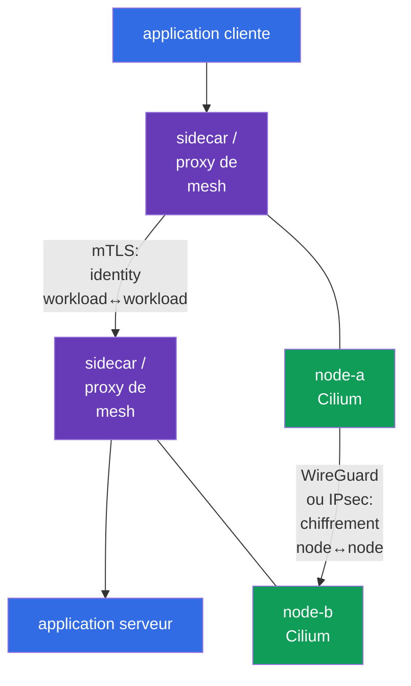
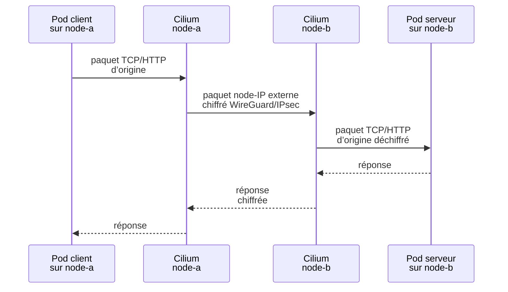
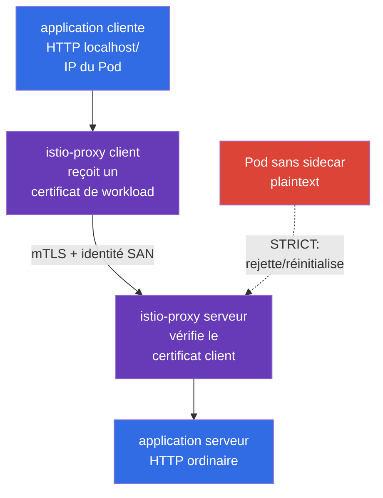

[Русская версия](ru.md) · [Eng version](README.md) · [Versión en español](es.md) · [Deutsche Version](de.md) · [ქართული ვერსია](ge.md) · [繁體中文版](tw.md) · [日本語版](jp.md)

# Chapitre 23. Chiffrement Pod-to-Pod et mTLS : Cilium, Istio et Linkerd

> **Le problème.** NetworkPolicy peut n’autoriser que le flux nécessaire, mais les données qu’il contient restent
> susceptibles d’être interceptées ou altérées sur le chemin entre les nœuds, et un Service sans vérification mutuelle
> d’identity peut accepter une connexion provenant d’un autre workload. La compromission d’un nœud, d’un segment réseau
> ou d’un client peut alors exposer des tokens et des payloads ou permettre l’usurpation d’un
> Service fiable ; le chiffrement de transport et mTLS pour l’identity des workloads sont requis séparément.

> **La suite.** NetworkPolicy autorise ou refuse un flux, mais ne le rend pas à elle seule
> confidentiel. Dans ce chapitre, nous construisons deux couches distinctes de protection du trafic Pod-to-Pod :
> un chiffrement réseau transparent entre les nœuds avec Cilium (WireGuard ou IPsec) et une authentification
> TLS mutuelle des workloads avec un service mesh (Istio ou Linkerd). Cela relève de la compétence
> **Implement Pod-to-Pod encryption (Cilium, Istio)** du domaine CKS *Minimize Microservice
> Vulnerabilities* (20 %).

> **Ce dont vous avez besoin de CKA.** Le modèle de base du réseau Pod et du CNI est traité dans le
> [chapitre 30 de CKA](../../../cka/course/30/fr.md), Service/DNS dans le
> [chapitre 31 de CKA](../../../cka/course/31/fr.md), et NetworkPolicy dans le
> [chapitre 34 de CKA](../../../cka/course/34/fr.md). Ce chapitre suppose que vous savez
> trouver un Pod, un Service, un nœud et tester un `curl` ordinaire.

> 🧠 Cilium WireGuard/IPsec protège le transport node-to-node, le mesh mTLS protège les connexions proxy et l’identity des workloads, NetworkPolicy autorise le flux.

## 23.1. Deux tâches, deux couches : chiffrement et mTLS

L’expression « chiffrer le trafic Pod-to-Pod » a deux sens différents. Ils ne sont pas
interchangeables.

- **Cilium WireGuard/IPsec** protège le paquet entre les nœuds. Il chiffre et authentifie
  le segment de transport node-to-node de façon transparente pour l’application : le conteneur ne reçoit
  pas de certificat, le Service ne change pas et HTTP à l’intérieur du workload reste HTTP.
- **Service mesh mTLS** crée une connexion TLS entre les proxies des workloads. Il authentifie
  l’identity du workload appelant et celle du serveur, et non seulement celle des nœuds. Istio et Linkerd
  émettent généralement eux-mêmes des certificats de courte durée et interceptent le trafic avec un sidecar/proxy.
- **NetworkPolicy** répond à une question distincte : quel flux est autorisé, tout simplement. Ni le chiffrement Cilium
  ni mTLS ne fournissent un allow/deny par namespace et selector de Pod à la place de NetworkPolicy.



Pour le trafic entre les nœuds, ces mécanismes peuvent être combinés : le service mesh protège la
connexion entre les proxies des workloads, et le chiffrement Cilium protège en plus les paquets sur le
segment réseau entre les nœuds. **Cilium WireGuard et IPsec ne chiffrent pas, par conception, le trafic Pod-to-Pod sur le même nœud** :
il n’existe pas de paquet externe entre nœuds. mTLS continue de protéger la connexion entre les workloads du
mesh. À l’inverse, le chiffrement Cilium ne remplace pas mTLS : un workload compromis sur un
nœud de confiance n’obtient pas une identity client vérifiable.

| Question | Cilium WireGuard/IPsec | Istio/Linkerd mTLS | NetworkPolicy |
|---|---|---|---|
| Où cela s’applique | chemin entre les nœuds | entre les proxies des workloads | ingress/egress du Pod |
| Chiffre le payload HTTP sur le réseau physique | oui | oui | non |
| Authentifie | peers cryptographiques des nœuds | identity du workload | pas l’identity, mais selector/IP/port |
| Un sidecar/proxy est nécessaire dans le Pod | non | oui (ou le mode ambient/eBPF d’un mesh donné) | non |
| L’application voit le certificat | non | habituellement non | non |
| Protège Pod-to-Pod sur le même nœud | non : Cilium WireGuard/IPsec ne chiffre pas ce trafic par conception | oui, si les deux sont dans le mesh | limite, mais ne chiffre pas |

> 🎯 Avant le changement, consignez le CNI, les versions, le firewall, le MTU et le cross-node placement des Pods de test.


**Consigner** ne signifie pas ici modifier la configuration, mais conserver une référence : un instantané
de l’état fonctionnel que l’on peut comparer au résultat après le rollout. Enregistrez la sortie des
vérifications dans une note de changement/d’incident ou dans des notes de formation : quel CNI dessert déjà le réseau et
sa version ; quelles versions de Kubernetes/kernel/Cilium interviennent ; si le firewall autorise le
protocole requis entre les nœuds ; et quel MTU est disponible sur le chemin. **Cross-node placement**
signifie que les deux Pods de test sont réellement planifiés sur des nœuds **différents**. C’est important : seul un
tel flux crée le paquet externe node-to-node qui permet de démontrer WireGuard/IPsec. Si le trafic cesse de
fonctionner après le changement, la référence aide à distinguer un nouveau défaut d’une contrainte préexistante de
firewall/MTU/placement.
## 23.2. Avant le changement : périmètre, compatibilité et état initial

Le chiffrement CNI et le service mesh sont des changements à l’échelle du cluster ou du namespace. Ne les activez pas
aveuglément en production : un MTU incorrect, un kernel ancien, un firewall ou un mTLS strict pour un client
legacy peut arrêter le trafic. Consignez d’abord le CNI actuel, les versions, le placement des Pods de test et le
chemin des paquets.

```bash
kubectl get nodes -o wide
kubectl get pods -A -o wide
kubectl -n kube-system get ds cilium
kubectl -n kube-system get pods -l k8s-app=cilium -o wide
kubectl get networkpolicy -A
```

Vérifiez à l’avance :

1. Cilium est déjà le CNI, et la version de Cilium ainsi que le kernel prennent en charge le mode choisi selon la
   compatibility matrix officielle. N’installez pas un second CNI sur un CNI fonctionnel.
2. Le port UDP WireGuard doit être autorisé entre tous les nœuds workers (par défaut, Cilium utilise
   `51871`, mais vérifiez cette valeur dans la configuration installée), ou Cilium IPsec nécessite ESP
   (IP protocol 50). Le scénario IKE/NAT-T typique avec UDP/4500 ne relève pas du mécanisme Cilium IPsec
   décrit ici. Les security groups, le firewall et les routes font partie de la solution.
3. Le réseau physique dispose d’une marge MTU suffisante. L’encapsulation ajoute des headers ; avec un problème de path-MTU,
   un petit `curl` peut fonctionner alors que les réponses importantes se bloquent.
4. Deux Pods de test se trouvent sur des nœuds différents. Sinon, tcpdump ne peut pas démontrer le chiffrement
   node-to-node. Pour un test de formation, attribuez-leur `nodeSelector`/`podAntiAffinity` ou trouvez des
   workloads déjà répartis.
5. Un plan de rollback et une fenêtre de maintenance existent. Modifier les Helm values sans conserver la
   publication précédente transforme le diagnostic en conjecture.

La commande ci-dessous montre les paramètres réels du Helm release installé. Les noms de release et les
values dépendent de la méthode d’installation ; ne les substituez pas à la source de vérité GitOps.

```bash
helm -n kube-system list
helm -n kube-system get values cilium --all
kubectl -n kube-system get configmap cilium-config -o yaml
```

> 🎯 Le chiffrement transparent ne protège que le segment entre nœuds ; choisissez un backend et vérifiez son périmètre.

## 23.3. Chiffrement transparent Cilium : modèle et limites

Cilium chiffre le trafic dans le datapath des nœuds. Lorsqu’un Pod sur `node-a` envoie des données à un Pod sur
`node-b`, Cilium encapsule/chiffre le paquet d’origine, envoie un paquet externe entre les
IP des nœuds, puis Cilium sur `node-b` vérifie le peer, le déchiffre et livre le paquet d’origine
au Pod cible. Cela est transparent pour le Service Kubernetes, DNS et l’application : il n’est pas nécessaire
de modifier l’URL, le port ni d’ajouter une bibliothèque TLS.



**Transparent** ne signifie pas « chiffré partout et contre tout ». Du plaintext peut être
visible à l’interface de l’application ou dans le namespace avant le chiffrement/après le déchiffrement.
Le chiffrement ne rend pas non plus sûre une application non sécurisée : il ne bloque pas l’injection SQL,
ne fournit pas d’autorisation utilisateur et ne limite pas un Pod compromis. Ces tâches requièrent l’application security,
mTLS/authorization, RBAC et NetworkPolicy.

Cilium prend en charge deux backends courants :

| Propriété | WireGuard | IPsec |
|---|---|---|
| Modèle cryptographique | protocole VPN moderne et compact | IPsec ESP ; souvent un standard d’organisation/de réseau |
| Transport sur le réseau | UDP, habituellement `51871` | ESP (IP protocol 50) |
| Clés/peer | key pair pour chaque peer ; la clé publique identifie un nœud autorisé | key material dans un Secret IPsec Cilium, Security Association entre les peers |
| Authentification | paquet accepté uniquement depuis une public key connue/un peer autorisé | intégrité ESP + clés des Security Association |
| Choix opérationnel | généralement un choix simple pour un environnement Linux pris en charge | nécessaire si un standard IPsec/réseau existant l’exige |
| À vérifier avec tcpdump | UDP vers le port WireGuard, sans payload HTTP | `esp`, sans payload HTTP |

Cilium 1.20 documente également le backend de chiffrement **beta** `ztunnel`. C’est une
extension de production orientée vers l’avenir, non le chemin principal de CKS ; pour le scénario d’examen,
WireGuard ou IPsec suffit ici.

Choisissez **un** backend. Activer WireGuard et IPsec simultanément pour une « double
protection » n’est pas une configuration Cilium normale et ne fait que compliquer le dépannage. Vérifiez les
Helm values exactes et les combinaisons prises en charge avec la documentation de la version
installée dans le cluster : les values d’un ancien article peuvent ne pas convenir à une nouvelle publication Cilium.

> 🎯 Vérifiez les values version-pinned, le rollout des Cilium agents et l’encryption status ; une peer key confirme un nœud, non l’identity d’un Pod.

## 23.4. WireGuard : activation, peer key et authentification mutuelle

WireGuard utilise une paire de private/public key par peer. Cilium gère automatiquement les clés
et distribue les public keys nécessaires entre les Cilium agents via l’API Kubernetes. Un nœud
accepte un paquet chiffré seulement s’il passe la vérification cryptographique du peer attendu ;
usurper une IP de nœud sans clé ne suffit pas. Ainsi, à la couche de transport, cela fournit à la fois
la confidentialité et l’**authentification mutuelle des peers de nœud**.

Ce n’est pas l’identity d’un workload : deux Pods d’un même nœud n’ont pas des identities WireGuard
différentes et le serveur ne peut pas connaître le ServiceAccount du client à partir d’une WireGuard key. Un
service mesh mTLS est nécessaire pour ce type de confiance mutuelle.

Ce qui suit montre une configuration Helm typique. Appliquez-la par votre GitOps version-pinned ou
un Helm release figé, après avoir vérifié les values du release Cilium concerné.
`encryption.nodeEncryption=true` étend la protection au trafic node-to-node. Pour WireGuard,
Cilium exclut par défaut du chiffrement node-to-node les nœuds portant le label `node-role.kubernetes.io/control-plane` :
cela évite un problème de bootstrap lors de la mise à jour de la public key. Ne supposez pas que le control plane
est automatiquement couvert par ce paramètre ; activez-le seulement après avoir compris son effet sur le trafic du
control-plane et de l’hôte.

```bash
# Exemple : remplacez par la version et les values déjà approuvés du dépôt.
helm upgrade cilium cilium/cilium \
  --namespace kube-system \
  --reuse-values \
  --version <pinned-cilium-version> \
  --set encryption.enabled=true \
  --set encryption.type=wireguard

kubectl -n kube-system rollout status daemonset/cilium --timeout=10m
kubectl -n kube-system get pods -l k8s-app=cilium
```

Si la policy exige de chiffrer aussi le trafic des nœuds, faites-en un changement distinct et révisable,
et testez la disponibilité de l’API server/kubelet :

```bash
helm upgrade cilium cilium/cilium \
  --namespace kube-system \
  --reuse-values \
  --version <pinned-cilium-version> \
  --set encryption.enabled=true \
  --set encryption.type=wireguard \
  --set encryption.nodeEncryption=true
```

Après le rollout, vérifiez l’état **sur chaque Cilium agent**, et non uniquement sur le Pod que
`kubectl exec ds/cilium` sélectionne arbitrairement :

```bash
kubectl -n kube-system get pods -l k8s-app=cilium -o wide
kubectl -n kube-system get pods -l k8s-app=cilium -o name |
  while IFS= read -r agent; do
    echo "=== $agent ==="
    kubectl -n kube-system exec "$agent" -- cilium-dbg status --verbose
    kubectl -n kube-system exec "$agent" -- cilium-dbg encrypt status
  done
```

Des agents sains et un encryption state sans erreurs de peer/handshake sont attendus sur chaque nœud. Selon
la version Cilium, la commande peut afficher l’interface WireGuard, les peers, les public
keys ou les compteurs. `cilium-dbg` est la CLI locale de l’agent : si la subcommand n’existe pas,
exécutez `cilium-dbg --help` **dans ce même agent** et consultez la documentation de la version Cilium
installée, car ce binary est livré avec l’agent. La Cilium CLI externe, `cilium`, lancée
depuis une machine d’administration, possède une numérotation distincte : utilisez une version compatible prise en charge et sa
compatibility table, plutôt que le même numéro de version que le release.

> 🔬 Le strict mode empêche le premier paquet plaintext, mais exige une compatibilité propre à la version et au routing.

### Strict mode : empêcher le premier paquet plaintext

Avec le WireGuard transparent ordinaire pour le trafic Pod-to-Pod entre des endpoints gérés par Cilium sur
des nœuds distincts, un nouvel endpoint distant peut ne pas être connu immédiatement de l’agent ; jusque-là, les premiers
paquets egress vers lui pourraient partir sans tunnel. Si le threat model ne le permet pas,
utilisez le strict mode après une vérification distincte de la compatibilité de version :

```yaml
encryption:
  strictMode:
    egress:
      enabled: true
      # IPv4 Pod CIDR de ce cluster - remplacez par la valeur effective.
      cidr: 10.244.0.0/16
    ingress:
      enabled: true
```

`encryption.strictMode.egress` n’est pris en charge que pour IPv4 ; `cidr` doit donc être le
véritable IPv4 Pod CIDR. Le mode comporte aussi des restrictions pour le direct routing, le node CIDR et les
interfaces sélectionnées. `encryption.strictMode.ingress` abandonne le trafic Pod interne au cluster qui n’arrive pas via un
tunnel WireGuard ; ce n’est pas un strict mode universel pour IPsec. Avant de l’activer, vérifiez les
exigences du release Cilium concernant le native/direct routing et la device configuration, puis utilisez un test
négatif pour confirmer qu’un paquet Pod-to-Pod plaintext entre les nœuds ne passe pas. N’activez pas le strict mode
en remplacement de la vérification de NetworkPolicy, du firewall et de la disponibilité du control plane.

> 🏭 Pour un nœud compromis : isolez-le, conservez les preuves, retirez l’ancien peer de la confiance ; une private key ne va jamais dans un ticket, Git ou un chat.

**Ce que cela signifie en pratique :** « compromis » signifie qu’il existe des raisons de penser qu’un attaquant
a pu exécuter des commandes sur le nœud ou lire ses données. **L’isoler** signifie ne pas y planifier de nouveaux Pods et
limiter sa participation au cluster selon la procédure d’incident approuvée ; cela
contient la propagation, mais n’efface pas les preuves. Les **preuves** sont les métadonnées et logs nécessaires à
l’enquête (heure, nom du nœud, état Cilium et événements), non une copie de la private key.
**Retirer l’ancien peer de la confiance** signifie, après la régénération d’une key ou le remplacement d’un nœud, confirmer
que les autres nœuds n’acceptent plus de trafic authentifié avec l’ancienne public key. La liste suivante
montre l’ordre sûr de ces actions.

### Rotation de clé WireGuard et incident

Cilium automatise le lifecycle des clés, mais la security design doit toujours décrire qui peut lire ou
modifier les ressources Cilium et comment réagir à la compromission d’un nœud. Ne copiez pas une private key du
nœud dans un ticket, un chat ou Git. En cas de suspicion de compromission :

1. isolez le nœud (`cordon`/`drain`, en tenant compte des DaemonSet et PDB) et conservez les preuves ;
2. vérifiez les logs, la santé et les peers de l’agent Cilium sur les autres nœuds ;
3. suivez la procédure documentée de la version Cilium pour supprimer/régénérer la peer key
   ou recréer le nœud ;
4. vérifiez que le nouveau nœud a reçu une nouvelle identity/key et que l’ancien peer n’accepte plus de
   trafic ;
5. répétez la vérification fonctionnelle et au niveau des paquets de la section 23.10.

`kubectl get secret -A` et des permissions larges pour lire les Secrets donnent accès non seulement au matériel
IPsec, mais aussi à de nombreux autres secrets. Limitez RBAC et l’audit access à `kube-system`.

> 🔬 IPsec est un backend Cilium alternatif avec rotation de clé, diagnostic ESP, Cilium CLI compatible et fenêtre de recouvrement des clés.

## 23.5. IPsec : quand il est nécessaire et comment ne pas compromettre la gestion des clés

IPsec dans Cilium fournit aussi un chiffrement transparent de nœud à nœud, mais utilise des associations de sécurité ESP
IPsec. Il est souvent choisi lorsque des exigences d'entreprise ou l'infrastructure réseau existante
requièrent IPsec. Un paquet sur l'interface physique apparaît comme ESP (protocole IP 50) ; l'HTTP de l'application
ne doit pas pouvoir y être lu. N'appliquez pas ici le modèle IKE/NAT-T général avec UDP/4500 : il
ne fait pas partie de ce mécanisme Cilium.

Une transition typique pour une release Cilium prenant en charge IPsec commence par le Secret de clé : l'agent
doit recevoir `cilium-ipsec-keys` **avant** d'activer `encryption.type=ipsec`. Effectuez la
création uniquement depuis une machine d'administration disposant d'une Cilium CLI compatible prise en charge et d'un
kubeconfig. Si le Secret existe déjà, ne l'écrasez pas accidentellement - vérifiez d'abord son
propriétaire et la procédure de rotation propre à la version :

```bash
kubectl -n kube-system get secret cilium-ipsec-keys >/dev/null 2>&1 || \
  cilium encrypt create-key --auth-algo rfc4106-gcm-aes

# Vérifiez seulement la présence de la clé et les métadonnées, pas les données de la clé.
kubectl -n kube-system get secret cilium-ipsec-keys \
  -o custom-columns=NAME:.metadata.name,TYPE:.type,CREATED:.metadata.creationTimestamp
kubectl -n kube-system get secret cilium-ipsec-keys \
  -o jsonpath='{.metadata.resourceVersion}{"\n"}'

helm upgrade cilium cilium/cilium \
  --namespace kube-system \
  --reuse-values \
  --version <pinned-cilium-version> \
  --set encryption.enabled=true \
  --set encryption.type=ipsec

kubectl -n kube-system rollout status daemonset/cilium --timeout=10m
kubectl -n kube-system get pods -l k8s-app=cilium -o name |
  while IFS= read -r agent; do
    echo "=== $agent ==="
    kubectl -n kube-system exec "$agent" -- cilium-dbg encrypt status
  done
```

Cilium stocke le matériel de clé IPsec dans le Secret `cilium-ipsec-keys` de `kube-system`. Ne
l'imprimez pas dans un terminal, un log CI ni la documentation. Il est acceptable de vérifier sa présence et
ses métadonnées sans décoder les données.

Pour la rotation, utilisez uniquement une version **compatible** prise en charge de la Cilium CLI et la
procédure propre à la version. Obtenez un état ordinaire ne contenant pas de secret avec `cilium encryption
status` depuis une machine d'administration et `cilium-dbg encrypt status` sur chaque nœud. La
commande `cilium encryption key-status` imprime le matériel de clé IPsec : ne l'exécutez que lorsqu'une
procédure de rotation approuvée l'exige explicitement, dans un terminal protégé, sans sortie vers CI, un log,
un ticket ou un chat.

```bash
# Machine d'administration avec une Cilium CLI compatible prise en charge.
cilium encryption status
cilium encryption rotate-key
```

Pour plusieurs clusters ou une release non standard, ajoutez les paramètres nécessaires `--context`,
`--namespace kube-system` et `--helm-release-name` aux commandes. N'effectuez pas de
rotation depuis un Pod Cilium. Vérifiez la disponibilité de la subcommand avec `cilium encryption --help`
et la compatibility table de la CLI. Avec `encryption.ipsec.keyWatcher=true` (par défaut), les agents prennent
en compte le Secret mis à jour sans redémarrage du DaemonSet ; normalement, tous les agents l'appliquent en environ une minute,
et les anciennes et nouvelles clés coexistent pendant la fenêtre de rotation. Un redémarrage/rollout du DaemonSet n'est nécessaire
que lorsque le watcher est désactivé ou que la documentation de la version installée l'exige explicitement.

Vous ne pouvez pas remplacer manuellement le Secret par une seule chaîne aléatoire : la désynchronisation des
peers entraîne une perte de paquets. Le minimum pratique pour une demande de changement :

- générez la nouvelle clé avec un aléa cryptographique et transférez-la par un canal protégé ;
- prenez l'ordre et le format du Secret de clé dans la documentation du Cilium installé ;
- vérifiez le `resourceVersion` du Secret et `cilium-dbg encrypt status` sur **tous** les agents avant la
  fin de la fenêtre de recouvrement des clés ;
- mesurez les pertes/erreurs et prévoyez un rollback avant de supprimer l'ancienne clé ;
- après la rotation, vérifiez l'application et la capture physique sur la paire de nœuds requise.

**Ne confondez pas la clé IPsec avec l'AC mTLS.** La clé IPsec protège les peers de transport, tandis que
le certificat mesh confirme l'identité du workload. Leur propriétaire, intervalle de rotation, audit et blast
radius peuvent différer.

Ceci achève la configuration du chiffrement de transport Cilium. Istio est considéré délibérément juste
après : ce n'est **pas** le paramètre Cilium suivant ni un prérequis pour IPsec, mais une couche supplémentaire
indépendante. Pour une requête entre nœuds, Cilium protège le paquet extérieur entre les nœuds, tandis qu'Istio mTLS permet à un
proxy de vérifier l'identité d'un workload spécifique. Un chiffrement Cilium sain ne prouve donc pas encore l'injection Istio,
les certificats ni la politique mTLS - ces vérifications sont effectuées séparément dans la section suivante.

> 🎯 Istio mTLS lie un certificat à l'identité du workload ; distinguez `PeerAuthentication: STRICT` de `DestinationRule` avec `ISTIO_MUTUAL`, et vérifiez le proxy/l'injection.

> 🔬 **Primitive d'identité upstream.** Kubernetes v1.37 a stabilisé Pod Certificates et ClusterTrustBundles. Ils fournissent des primitives X.509 au niveau Kubernetes, mais ne rendent pas automatiquement inutile le plan d'identité Istio/SPIFFE : le signer, le modèle de confiance et la mesh enforcement sont des décisions architecturales distinctes. Voir [Kubernetes v1.37 Security Delta](../APPENDIX_K8S_137_SECURITY_DELTA_FR.md).

## 23.6. Istio : sidecar, identité de workload SPIFFE et `PeerAuthentication`


### Quel problème Istio résout après Cilium

Les sections précédentes ont déjà protégé le **transport entre les nœuds** : Cilium WireGuard/IPsec
chiffre le paquet extérieur et authentifie le peer de nœud. Mais cela est insuffisant lorsqu'il
importe de répondre à la question : « quel workload exact appelle le Service ? » Cilium ne
donne pas à l'application ou au serveur une identité vérifiable pour le Pod/ServiceAccount client et ne
force pas lui-même un serveur à n'accepter que mTLS. De plus, le chiffrement des nœuds Cilium ne crée pas de
tunnel extérieur pour les Pods situés sur le même nœud, de par sa conception.

Istio résout une autre partie du problème : les proxies de workload reçoivent des certificats, établissent mTLS
et vérifient l'identité du peer. `PeerAuthentication: STRICT` peut rejeter le trafic entrant plaintext.
Ensemble, ils fonctionnent ainsi : **Istio protège et authentifie la connexion de workload à workload,
tandis que Cilium protège en plus le paquet sur le segment inter-nœuds non fiable**.
`NetworkPolicy` reste une troisième couche - elle détermine quel flux est autorisé.

| Question | Cilium WireGuard/IPsec | Istio mTLS |
|---|---|---|
| Bénéfice principal | Chiffrement transparent de nœud à nœud sans modifier l'application ni le Service | Identité du workload, authentification mutuelle et `STRICT` contre un client plaintext |
| Ce que cela ne résout pas | Ne fournit pas au serveur l'identité du workload client ; ne chiffre pas, de par sa conception, le flux du même nœud | Ne masque pas les métadonnées L3/L4 extérieures à l'underlay et ne couvre pas les flux hors mesh ; ne remplace pas NetworkPolicy |
| Coût/limite | CNI/kernel, firewall et MTU compatibles sont requis ; les clés appartiennent aux nœuds | Nécessite un control plane, des certificats et un proxy/un dataplane ambient ; le mode sidecar ajoute un conteneur et de l'overhead |
| Éléments à démontrer | État de l'agent Cilium et WireGuard/ESP extérieur sur la NIC physique | Injection/enrôlement, état du proxy/certificat et tests mTLS/`STRICT` |

Il ne s'agit pas d'un « double chiffrement » obligatoire. Si **les deux** workloads sont déjà dans le mesh,
que la confiance est vérifiée et que `PeerAuthentication: STRICT` est effectivement appliqué, mTLS chiffre déjà la
payload applicative entre les proxies. Il n'est pas nécessaire d'activer le chiffrement des nœuds Cilium seulement pour
chiffrer à nouveau la même payload.

Cilium ajoute une valeur distincte lorsque le threat model exige de protéger l'underlay de nœud à nœud :
masquer l'IP/le port Pod interne et d'autres métadonnées L3/L4 au réseau physique, couvrir un
flux sensible entre nœuds hors mesh ou satisfaire une exigence de politique/conformité pour le
chiffrement entre nœuds. Les deux couches ne sont nécessaires que lorsque **les deux** objectifs s'appliquent :
identité de workload/mTLS **et** protection de l'underlay ou du trafic hors mesh. Si l'application n'exige pas
d'identité de workload ou de comportement compatible avec le mesh, Istio n'est pas activé automatiquement - évaluez d'abord
le threat model, la compatibilité et l'overhead.
Le sidecar Istio (`istio-proxy`, Envoy) intercepte le trafic entrant/sortant du workload. Istiod émet un
certificat de workload basé sur le ServiceAccount Kubernetes ; les proxies établissent mTLS et vérifient
l'identité du peer. L'identité du workload a la forme d'ID SPIFFE :
`spiffe://<trust-domain>/ns/<namespace>/sa/<service-account>`. L'application continue normalement
d'écouter sur son port HTTP ordinaire, car TLS se termine dans le sidecar, et non dans le conteneur de l'application.

En **mode ambient**, Istio n'ajoute pas de sidecar séparé à chaque Pod. À la place, `ztunnel`
(**Zero Trust Tunnel**) - un proxy dédié au niveau du nœud - s'exécute sur chaque nœud. Il effectue
les tâches mesh L3/L4, y compris mTLS et l'authentification, sans exiger que l'application travaille elle-même avec
TLS.

`HBONE` (**HTTP-Based Overlay Network Environment**) est un tunnel Istio sécurisé entre les composants mesh.
Il transporte plusieurs flux TCP dans une connexion mTLS ; par conséquent, le trafic de workload peut être
protégé même si `istio-proxy` n'apparaît pas parmi les conteneurs du Pod. L'absence de `istio-proxy`
en mode ambient ne signifie pas un client plaintext. Dans les deux modèles,
`PeerAuthentication` avec `STRICT` n'autorise pas le trafic entrant plaintext : en mode ambient, le
serveur attend un flux HBONE/mTLS protégé.

La vérification suivante de `istio-injection=enabled` et de la présence de `istio-proxy` s'applique **uniquement
au mode sidecar**. Pour le mode ambient, vérifiez l'enrôlement du workload et l'état de `ztunnel` à l'aide de la
documentation de la version Istio installée, plutôt que d'attendre un conteneur supplémentaire dans le
Pod.



### Activer l'injection et vérifier le sidecar

Pour un namespace de formation, activez l'injection avant de créer les Pods. En production, utilisez le label
de révision de l'installation Istio contrôlée par le processus de changement ; ne mélangez pas différentes révisions
sans plan de migration.

```bash
kubectl create namespace mesh-demo
kubectl label namespace mesh-demo istio-injection=enabled

kubectl -n mesh-demo apply -f server.yaml
kubectl -n mesh-demo apply -f client.yaml
kubectl -n mesh-demo get pods
kubectl -n mesh-demo get pod -l app=server \
  -o jsonpath='{range .items[*]}{.metadata.name}{": "}{.spec.containers[*].name}{"\n"}{end}'
```

La liste des conteneurs doit inclure `istio-proxy` à côté de `server`. Un sidecar absent n'est pas un
défaut cosmétique : un client plaintext ne deviendra pas un client mTLS, et `STRICT` le rejettera à juste titre.
Pour un Deployment existant, effectuez un rollout contrôlé après avoir appliqué le label :

```bash
kubectl -n mesh-demo rollout restart deployment/server
kubectl -n mesh-demo rollout status deployment/server
kubectl -n mesh-demo get pod -l app=server \
  -o jsonpath='{range .items[*]}{.metadata.name}{": "}{.spec.containers[*].name}{"\n"}{end}'
```

### `PeerAuthentication` : le serveur exige mTLS

`PeerAuthentication` définit la politique mTLS entrante. `STRICT` signifie que le proxy serveur accepte
uniquement le trafic mTLS d'un peer capable de présenter un certificat de confiance. Le TCP plaintext provenant
d'un workload sans sidecar n'est pas une solution de repli autorisée.

La ressource suivante s'applique à l'ensemble du namespace `mesh-demo`. Un selector de namespace n'est pas
nécessaire ici : le namespace est indiqué par `metadata.namespace`.

```yaml
apiVersion: security.istio.io/v1
kind: PeerAuthentication
metadata:
  name: default
  namespace: mesh-demo
spec:
  mtls:
    mode: STRICT
```

Vous pouvez restreindre la politique à un workload serveur. Ce selector correspond au label du Pod, et non au
nom du Service ; vérifiez les labels effectifs avec `kubectl get pod --show-labels`.

```yaml
apiVersion: security.istio.io/v1
kind: PeerAuthentication
metadata:
  name: server-strict
  namespace: mesh-demo
spec:
  selector:
    matchLabels:
      app: server
  mtls:
    mode: STRICT
```

N'appliquez pas `STRICT` à l'ensemble du namespace et une politique de workload avec `PERMISSIVE` en conflit au
même moment sans comprendre la priorité. Une bonne migration ressemble généralement à ceci :

```text
inventory clients -> inject/fix clients -> PERMISSIVE measurement (if needed) ->
verify mTLS -> STRICT narrow scope -> STRICT namespace -> remove temporary exception
```

`PERMISSIVE` n'est utile que pour une compatibilité temporaire : le proxy accepte à la fois mTLS et plaintext,
donc un `curl` réussi ne prouve pas encore mTLS. `DISABLE` pour un workload TCP ordinaire crée une
exception qui doit être minimisée et documentée avec un propriétaire et une date d'expiration.

### `DestinationRule` : le client ne doit pas désactiver TLS

L'auto mTLS Istio peut sélectionner TLS automatiquement, mais un `DestinationRule` explicite est utile comme
intention côté client vérifiable dans un environnement de formation ou lorsqu'une politique organisationnelle exige une
configuration explicite. `PeerAuthentication` protège le serveur entrant, tandis que `DestinationRule`
définit TLS pour le trafic client sortant - ce sont deux côtés différents de la connexion.

```yaml
apiVersion: networking.istio.io/v1
kind: DestinationRule
metadata:
  name: server-mtls
  namespace: mesh-demo
spec:
  host: server.mesh-demo.svc.cluster.local
  trafficPolicy:
    tls:
      mode: ISTIO_MUTUAL
```

`ISTIO_MUTUAL` signifie qu'Envoy utilise les certificats et le trust bundle gérés par Istio. Ne le
remplacez pas par `SIMPLE` : `SIMPLE` crée un client TLS ordinaire sans certificat client de workload
et ne satisfait pas mTLS. `DISABLE` envoie du plaintext et doit être rejeté lorsque le serveur est
`STRICT`. Les Services externes exigent habituellement des réglages `ServiceEntry`/TLS distincts ; n'utilisez pas
cet exemple comme règle globale pour tous les `*.svc.cluster.local`.

Vérifiez les objets appliqués et la configuration réelle du proxy :

```bash
kubectl -n mesh-demo get peerauthentication,destinationrule
istioctl proxy-status
istioctl proxy-config cluster deploy/client -n mesh-demo | grep server.mesh-demo
istioctl analyze -n mesh-demo
```

`istioctl analyze` et `proxy-config` dépendent de la version Istio, mais l'idée utile demeure :
inspectez non seulement le YAML dans Git, mais aussi la configuration d'exécution du proxy. La création réussie d'une CR
ne garantit pas que le selector/l'host correspondaient à l'endpoint prévu.

> 🎯 Avec `STRICT`, un client dans le mesh reçoit `200` ; un client sans sidecar ne reçoit pas de succès plaintext.

## 23.7. Expérience Istio contrôlée : `200` dans le mesh, reset à l’extérieur

Le banc d’essai suivant démontre la limite principale de `STRICT` : un client dans le mesh reçoit HTTP `200`,
tandis qu’un client sans sidecar effectue une requête plaintext et reçoit un reset TCP/une erreur TLS, et non un accès
au serveur. Exécutez-le uniquement dans un namespace dédié : `STRICT` casse délibérément les
appels plaintext legacy.

Créez d’abord un namespace avec injection ainsi que les workloads serveur/client. Le client possède un sidecar
grâce au label du namespace ; `legacy-client` ci-dessous s’exécute dans un namespace distinct sans injection.

```yaml
apiVersion: v1
kind: Namespace
metadata:
  name: mesh-demo
  labels:
    istio-injection: enabled
---
apiVersion: v1
kind: Service
metadata:
  name: server
  namespace: mesh-demo
spec:
  selector:
    app: server
  ports:
  - name: http
    port: 8080
    targetPort: 8080
---
apiVersion: apps/v1
kind: Deployment
metadata:
  name: server
  namespace: mesh-demo
spec:
  replicas: 1
  selector:
    matchLabels:
      app: server
  template:
    metadata:
      labels:
        app: server
    spec:
      containers:
      - name: server
        image: hashicorp/http-echo:1.0
        args: ["-listen=:8080", "-text=server-ok"]
        ports:
        - containerPort: 8080
---
apiVersion: apps/v1
kind: Deployment
metadata:
  name: client
  namespace: mesh-demo
spec:
  replicas: 1
  selector:
    matchLabels:
      app: client
  template:
    metadata:
      labels:
        app: client
    spec:
      containers:
      - name: client
        image: curlimages/curl:8.12.1
        command: ["sleep", "infinity"]
---
apiVersion: security.istio.io/v1
kind: PeerAuthentication
metadata:
  name: default
  namespace: mesh-demo
spec:
  mtls:
    mode: STRICT
---
apiVersion: networking.istio.io/v1
kind: DestinationRule
metadata:
  name: server-mtls
  namespace: mesh-demo
spec:
  host: server.mesh-demo.svc.cluster.local
  trafficPolicy:
    tls:
      mode: ISTIO_MUTUAL
```

```bash
kubectl apply -f istio-strict-demo.yaml
kubectl -n mesh-demo rollout status deployment/server
kubectl -n mesh-demo rollout status deployment/client
kubectl -n mesh-demo get pods -o wide

CLIENT=$(kubectl -n mesh-demo get pod -l app=client -o jsonpath='{.items[0].metadata.name}')
kubectl -n mesh-demo exec "$CLIENT" -c client -- \
  curl -sS -o /dev/null -w '%{http_code}\n' http://server.mesh-demo.svc.cluster.local:8080
# Attendu : 200
```

Créez maintenant un client sans injection. Le label `istio-injection=disabled` sur le Pod n’est pas nécessaire
si le namespace `legacy-demo` n’est pas marqué pour l’injection ; l’annotation explicite rend l’intention
visible lors de la revue.

```yaml
apiVersion: v1
kind: Namespace
metadata:
  name: legacy-demo
---
apiVersion: v1
kind: Pod
metadata:
  name: outside-client
  namespace: legacy-demo
  annotations:
    sidecar.istio.io/inject: "false"
spec:
  containers:
  - name: client
    image: curlimages/curl:8.12.1
    command: ["sleep", "infinity"]
```

```bash
kubectl apply -f outside-client.yaml
kubectl -n legacy-demo wait --for=condition=Ready pod/outside-client --timeout=120s
kubectl -n legacy-demo get pod outside-client \
  -o jsonpath='{.spec.containers[*].name}{"\n"}'
# Attendu : uniquement client, sans istio-proxy

kubectl -n legacy-demo exec outside-client -- \
  curl --connect-timeout 5 --max-time 10 -v http://server.mesh-demo.svc.cluster.local:8080
# Attendu : non nul ; habituellement "Recv failure: Connection reset by peer".
```

Le texte précis de l’erreur dépend de la version Envoy, du protocole et du point d’interception : un
`connection reset`, une erreur de handshake TLS ou un timeout sont possibles. Le critère de sécurité n’est pas la
chaîne de l’erreur, mais l’absence de succès plaintext : la commande ne renvoie pas HTTP `200`, et le proxy
serveur n’accepte pas de flux non authentifié. Pour un contrôle automatisé strict, consignez
les deux signes :

```bash
set +e
OUT=$(kubectl -n legacy-demo exec outside-client -- \
  curl -sS --connect-timeout 5 --max-time 10 -o /dev/null -w '%{http_code}' \
  http://server.mesh-demo.svc.cluster.local:8080 2>&1)
RC=$?
set -e
printf 'exit=%s output=%s\n' "$RC" "$OUT"
test "$RC" -ne 0 || test "$OUT" != 200
```

Si **le résultat n’est pas 200 dans le mesh**, vérifiez la présence de `istio-proxy`, les endpoints DNS/Service,
`PeerAuthentication`, `DestinationRule`, le statut du proxy et NetworkPolicy. Si **le résultat est 200 à l’extérieur**,
assurez-vous d’abord que `STRICT` s’applique au Pod serveur et que `outside-client` est véritablement sans sidecar ;
recherchez ensuite une policy `PeerAuthentication` plus spécifique qui aurait remplacé le test.

> 🔬 Linkerd dispose de son propre modèle d’identity et de sa propre API de policy ; ne l’utilisez pas avec un sidecar Istio dans le même Pod.

## 23.8. Linkerd : variante mTLS de production et identity ServiceAccount

Linkerd est une variante de production complète de service mesh pour le mTLS des workloads, mais il s’agit
de matériel complémentaire : les compétences CKS principales pour le chiffrement Pod-to-Pod nomment explicitement
Cilium et Istio, pas Linkerd. Linkerd utilise son propre proxy léger et son modèle d’identity. Après injection,
un Pod reçoit `linkerd-proxy` ; le trafic entre workloads Linkerd dans le mesh est automatiquement
chiffré et authentifié par mTLS. L’identity est habituellement liée au Kubernetes ServiceAccount et se présente sous une forme
similaire à DNS :

```text
<serviceaccount>.<namespace>.serviceaccount.identity.linkerd.cluster.local
```

N’installez pas de sidecar Istio et Linkerd dans le même workload pour le « renforcer ». Les deux veulent
intercepter le trafic, émettre les certificats et gérer la policy ; le résultat est un conflit
iptables/ports, une observability indéfinie et un incident response complexe. Choisissez un seul
mesh pour le namespace ou effectuez une migration documentée.

Avant l’installation de Linkerd, vérifiez les prérequis du cluster, la présence de CRD Gateway API
compatibles et utilisez une publication figée. Linkerd moderne nécessite des CRD Gateway API ; s’ils
sont absents, installez d’abord une version compatible avec votre release selon l’instruction officielle.

```bash
kubectl get crd gateways.gateway.networking.k8s.io
# Si la CRD est absente, installez une publication de CRD Gateway API compatible avant linkerd install.
linkerd check --pre
linkerd install --crds | kubectl apply -f -
linkerd install | kubectl apply -f -
linkerd check

# Viz est une extension distincte ; installez-la avant les commandes viz.
linkerd viz install | kubectl apply -f -
linkerd viz check
```

En production, le manifest d’installation doit être généré et vérifié en CI à partir d’une version CLI/chart
figée, et non depuis un `latest` flottant. Après le health check, activez l’injection uniquement dans un
namespace de test et redémarrez le workload :

```bash
kubectl create namespace linkerd-demo
kubectl annotate namespace linkerd-demo linkerd.io/inject=enabled
kubectl -n linkerd-demo apply -f server.yaml
kubectl -n linkerd-demo apply -f client.yaml
kubectl -n linkerd-demo rollout status deployment/server
kubectl -n linkerd-demo get pod -l app=server \
  -o jsonpath='{.items[0].spec.containers[*].name}{"\n"}'
linkerd -n linkerd-demo check --proxy
linkerd -n linkerd-demo viz stat deploy
```

Comme avec Istio, vérifiez non seulement la présence de l’annotation, mais aussi le conteneur proxy effectif,
le statut de l’identity/du certificat et le succès d’une requête entre Pods dans le mesh. Il est important de distinguer
mTLS automatique et inbound strict : Linkerd utilise automatiquement mTLS entre les workloads dans le mesh, mais sans
inbound authorization, il accepte par défaut le plaintext depuis une source sans mesh
(`all-unauthenticated`). La seule présence de mTLS automatique ne signifie pas que le serveur n’accepte
que le mTLS.

Pour une policy inbound strict minimale, définissez `all-authenticated` avant de créer le workload dans
le namespace de formation :

```yaml
apiVersion: v1
kind: Namespace
metadata:
  name: linkerd-demo
  annotations:
    linkerd.io/inject: enabled
    config.linkerd.io/default-inbound-policy: all-authenticated
```

Après l’application, créez un client sans mesh dans un namespace sans injection Linkerd et vérifiez que
son `curl` plaintext vers le Service ne renvoie pas HTTP `200` ; un client dans le mesh avec une identity admissible
doit rester opérationnel. Pour des règles plus étroites, utilisez l’API de policy de la
publication, par exemple `AuthorizationPolicy` avec `MeshTLSAuthentication`. L’API de policy Linkerd
et le comportement du trafic non autorisé ont évolué selon les versions : avant de construire un default-deny,
vérifiez les CRD et le mode de policy de la release installée. mTLS confirme l’identity et protège le
canal, mais ne signifie pas nécessairement que « chaque identity peut appeler chaque endpoint » -
l’autorisation doit être configurée séparément.

> 🔬 Une capture voit le plaintext/TLS interne avant la termination et le paquet externe chiffré sur la NIC physique.

## 23.9. WireGuard/IPsec et mesh ensemble : où le plaintext est visible

Vérifier que « `curl` fonctionne » ne prouve pas le chiffrement. `curl` vérifie l’accessibilité et la
réponse de l’application, mais ne distingue pas le HTTP plaintext du trafic chiffré. De même,
tcpdump sur `any` peut voir simultanément le paquet plaintext interne sur une interface virtuelle et le
paquet externe chiffré sur la NIC physique. Pour le prouver, formulez d’abord *où*
chaque couche doit être visible.

| Point de capture | Avec le seul chiffrement Cilium | Avec Cilium + Istio/Linkerd |
|---|---|---|
| conteneur d’application / loopback vers le proxy | souvent HTTP plaintext | app↔proxy local peut être plaintext |
| veth/CNI avant le chiffrement du nœud | le flux interne d’origine peut être lisible | ciphertext mTLS entre les proxies mesh |
| NIC physique de node-a/node-b | WireGuard UDP ou IPsec ESP, sans HTTP | WireGuard/IPsec externe ; les payloads HTTP et TLS sont illisibles |
| application serveur après le proxy | plaintext, car le proxy a déjà déchiffré | plaintext du proxy local vers l’application |

Il s’agit de l’architecture normale des points de termination. L’objectif de Cilium est de supprimer les payloads lisibles du
chemin réseau physique non fiable. L’objectif du mesh est de rendre le segment workload-to-workload
protégé par TLS et de le lier à une identity. N’affirmez pas que « tcpdump ne montre HTTP nulle part » :
sur le nœud et dans le Pod, HTTP peut être visible avant/après le chiffrement si l’attaquant dispose de root sur
ce nœud.

> 🎯 Confirmez le cross-node placement, la NIC physique précise, l’heure du flux reproductible et le statut Cilium.

## 23.10. Vérification avec `tcpdump` : prouver le trafic externe chiffré

Pour une preuve au niveau des paquets, il faut des Pods sur des nœuds **différents**, l’IP de nœud des deux nœuds et
l’interface physique menant au réseau du cluster. N’utilisez pas automatiquement `eth0` : sur un
nœud cloud, l’interface peut s’appeler `ens5`, `ens192` ou autrement.

```bash
NODE_B_IP="${NODE_B_IP:?set the second node IP}"
kubectl get pods -A -o wide
kubectl get nodes -o wide
# Sur le nœud choisi :
ip -br link
ip route get "${NODE_B_IP}"
```

Sur le premier nœud, lancez la capture précisément sur l’interface physique. Les commandes ci-dessous supposent
un accès SSH/un accès au nœud approuvé ; n’ajoutez pas de Pod de debug privilégié en production uniquement pour
la commodité. Lorsque l’accès break-glass est autorisé, `kubectl debug node/<node>` permet aussi un diagnostic
au niveau de l’hôte, mais ce seul accès doit être auditable.

### Capture WireGuard

```bash
# Sur node-a ; remplacez ens5 et l’IP de node-b.
sudo tcpdump -ni ens5 -vv 'udp port 51871 and host <NODE_B_IP>'
```

Dans un autre terminal, créez un flux cross-node reproductible. Il est pratique d’exécuter plusieurs
requêtes depuis le Pod client qui, selon `kubectl get pod -o wide`, se trouve sur `node-a`, vers le
Pod/Service serveur sur `node-b` :

```bash
for i in $(seq 1 20); do
  kubectl -n mesh-demo exec "$CLIENT" -c client -- \
    curl -sS http://server.mesh-demo.svc.cluster.local:8080 >/dev/null || exit 1
done
```

Une série de datagrammes UDP node-a ↔ node-b sur le port WireGuard est attendue. `-vv` augmente le
niveau de détail de l’analyse des protocol headers, mais n’affiche pas le payload ASCII ; par conséquent, l’absence de
`GET /`, `Host:` ou `server-ok` dans cette sortie ne prouve rien. La présence d’UDP sur le port
ne prouve pas encore qu’il s’agit du flux Pod attendu : rapprochez l’heure de la capture, la paire de
nœuds et l’augmentation des compteurs/du statut de chiffrement Cilium.

Si un lab disposable impose de comparer le payload, utilisez une courte capture d’un flux contrôlé non sensible
avec `-A` ou `-X` et un snaplen suffisant au point interne attendu. N’utilisez pas la capture du payload sur du trafic
de production sensible.

### Capture IPsec

Pour Cilium IPsec, la capture filtre ESP, c’est-à-dire IP protocol 50 :

```bash
# Sur node-a : ESP Cilium IPsec.
sudo tcpdump -ni ens5 -vv 'host <NODE_B_IP> and esp'
```

Lancez à nouveau un flux d’application reproductible. Des paquets ESP sont attendus. N’utilisez pas
l’absence de lignes HTTP dans `tcpdump -vv` comme preuve : ce mode n’affiche pas le payload.
Après la capture, rapprochez le résultat de l’agent **sur node-a et node-b** :

```bash
for node in "${NODE_A:?set first node name}" "${NODE_B:?set second node name}"; do
  agent=$(kubectl -n kube-system get pods -l k8s-app=cilium \
    --field-selector "spec.nodeName=$node" \
    -o jsonpath='{.items[0].metadata.name}')
  test -n "$agent" || { echo "ERROR: no Cilium agent on $node" >&2; exit 1; }
  echo "=== node=$node agent=$agent ==="
  kubectl -n kube-system exec "$agent" -- cilium-dbg encrypt status
done
```

Un `grep` sans résultat ne constitue pas une preuve de sécurité : de nombreux agents normaux
ne journalisent pas chaque paquet. Une preuve solide repose sur quatre faits concordants : le cross-node
placement, un `200` pour le flux attendu, un statut/compteurs de chiffrement sains et un protocole externe chiffré
sur la NIC physique. Pour comparer le payload, utilisez uniquement une capture de lab limitée avec
`-A`/`-X`, et non du trafic de production.

### Vérification négative et pièges fréquents

- **Une capture avec `-i any` montre HTTP.** Il peut s’agir du paquet interne avant le chiffrement,
  d’une livraison locale ou d’un trafic entre Pods du même nœud. Recommencez sur la NIC physique et
  vérifiez le placement.
- **Il n’y a pas d’UDP/51871, mais curl fonctionne.** Les Pods sont peut-être sur le même nœud, un autre port Cilium
  est utilisé, le chiffrement est désactivé ou un autre transport est utilisé. Vérifiez d’abord les values et
  `cilium-dbg encrypt status`, puis les routes/l’interface.
- **Il y a ESP/UDP, mais la capture ne correspond pas au test.** Un autre trafic chiffré passe sur le
  nœud. Limitez le filtre BPF à la paire d’IP de nœud et répétez la requête dans une courte fenêtre temporelle.
- **`tcpdump` voit TLS, et non HTTP.** C’est attendu pour le mesh sur le chemin interne, mais cela ne prouve pas
  Cilium. Sur la NIC physique, lorsque les deux couches sont activées, WireGuard/IPsec externe est attendu.
- **Une réponse importante se bloque, mais une petite fonctionne.** Suspectez MTU/MSS. Ne désactivez pas le
  chiffrement comme « correction » ; mesurez le path MTU et configurez le CNI/l’underlay selon la procédure
  de la plateforme.

> 🎯 Diagnostiquez Cilium/underlay → DNS/Service → mesh identity/policy → NetworkPolicy ; ne laissez pas de bypass de `STRICT` ou du chiffrement.

## 23.11. Diagnostic : déterminer d’abord la couche de défaillance

Un symptôme `connection reset` peut se produire à plusieurs niveaux. Diagnostiquez du bas vers le haut,
sans transformer la désactivation temporaire de `STRICT` ou du chiffrement en un contournement
permanent.

| Symptôme | Couche probable | Premières vérifications | Correction sûre |
|---|---|---|---|
| Des Pods sur différents nœuds n’échangent plus de trafic après le rollout | Cilium/underlay | `cilium-dbg encrypt status`, logs des agents, firewall UDP/ESP, MTU | restaurer les values/le réseau compatibles selon le plan de rollback |
| Le Service DNS ne se résout pas | CoreDNS/Service, pas mTLS | `nslookup`, Endpoints, chapitre 31 de CKA | corriger DNS/Service avant d’analyser TLS |
| Un client dans le mesh n’obtient pas 200 | Istio/Linkerd ou NetworkPolicy | sidecar/proxy, cert/identity, endpoints, policy | corriger injection/identity/règle, ne pas définir `DISABLE` global |
| Un client extérieur reçoit un reset | Istio `STRICT` | absence de sidecar, PeerAuthentication effective | c’est la preuve attendue ; migrer le client dans le mesh |
| Un client extérieur obtient 200 avec `STRICT` | la policy ne s’applique pas au serveur | selector, namespace, labels Pod, policy plus spécifique | restreindre/corriger la policy et répéter le test négatif |
| Perte intermittente après une rotation IPsec | rollout de clé | version du Secret, agents, état de chiffrement des peers | suivre la procédure d’overlap/rollback de la version Cilium |
| Le proxy Linkerd n’est pas Ready | installation/identity du mesh | `linkerd check`, logs proxy, horloge/DNS | corriger les prérequis trust/identity, ne pas désactiver mTLS |

Un ensemble minimal de commandes utiles pour les preuves d’incident :

```bash
kubectl -n mesh-demo get pod,svc,endpointslice -o wide
kubectl -n mesh-demo get peerauthentication,destinationrule -o yaml
kubectl -n kube-system get pods -l k8s-app=cilium -o wide
kubectl -n kube-system get pods -l k8s-app=cilium -o name |
  while IFS= read -r agent; do
    echo "=== $agent ==="
    kubectl -n kube-system exec "$agent" -- cilium-dbg encrypt status
  done
istioctl proxy-status 2>/dev/null || true
linkerd check 2>/dev/null || true
```

N’affichez pas un `Secret` avec `-o yaml`, une private key, un bearer token ou une capture complète de paquets dans
le canal partagé d’incident. Une capture peut contenir des métadonnées, URL, cookies ou du plaintext à un
point interne. Conservez uniquement les preuves minimales nécessaires dans un stockage approuvé avec une
durée de conservation définie.

> 🏭 Inventaire des flux, namespace/nœuds canary, période de compatibilité, exceptions étroites et preuves d’exécution après une mise à niveau, un changement de firewall ou une rotation de CA/key.

## 23.12. Rollout sûr et règles opérationnelles

Le chiffrement n’est pas une commande d’installation à usage unique. Il possède des owners, des mises à jour,
des rotations, des alertes et des preuves que la policy attendue continue de fonctionner après une
mise à niveau de Kubernetes/Cilium/mesh.

1. **Inventaire.** Trouvez les workloads sans sidecar, les clients externes, les Pods hostNetwork,
   les protocoles stateful et les chemins critiques du control plane. Pour mTLS, établissez un graph des appelants et
   des serveurs, et non seulement une liste de namespaces.
2. **Namespace/nœuds canary.** Commencez avec un namespace distinct et un petit pool de nœuds.
   Pour Istio, démontrez d’abord le `200` dans le mesh et le reset plaintext ; pour Cilium, le paquet externe
   chiffré cross-node.
3. **Observer avant d’appliquer.** Recueillez la latence, les erreurs de connexion, les pertes de paquets, l’expiration des
   certificats proxy et la santé Cilium. `PERMISSIVE` n’est acceptable que comme étape de migration mesurable
   avec une date de suppression.
4. **Restreindre les exceptions.** Un selector `PeerAuthentication`, un namespace séparé ou un
   port legacy documenté vaut mieux qu’un `DISABLE` global. Une exception possède un owner, une raison,
   une expiration et un test négatif.
5. **Vérifier après le changement.** Un nouveau nœud, une mise à niveau Cilium, une rotation de CA mesh et un
   changement de firewall exigent de répéter le status, le flux fonctionnel et la capture. La présence de YAML dans
   Git ne remplace pas les preuves d’exécution.
6. **Planifier la défaillance.** Si le control plane de CA/identity est indisponible, les certificats finiront
   par expirer ; si un agent Cilium ne reçoit pas une clé, le flux cross-node se dégrade. Configurez une
   alerte avant l’expiration/la panne de rollout et documentez le rollback.

Une bonne policy en couches pour la production se présente ainsi : NetworkPolicy n’autorise que le
flux de service nécessaire ; le mesh `STRICT` exige un peer mTLS authentifié ; Cilium
chiffre l’underlay cross-node ; l’application autorise l’utilisateur/la requête. Chaque couche réduit les
conséquences de l’erreur d’une autre, mais aucune ne dispense des mises à jour et du monitoring.

## 23.13. Mini-glossaire

- **Transparent encryption** - chiffrement du datapath sans modifier l’application, le Service ou
  l’URL ; Cilium l’applique sur les nœuds.
- **WireGuard** - protocole VPN avec key pair de peers ; la public key définit le peer autorisé.
- **IPsec ESP** - payload protégé au niveau IP avec confidentialité et intégrité entre les
  Security Associations.
- **Node encryption** - protection du trafic entre les nœuds ; ce n’est pas l’identity d’un workload.
- **mTLS** - TLS dans lequel le client et le serveur présentent tous deux un certificat.
- **Workload identity** - identity de workload vérifiable cryptographiquement, habituellement liée
  à un ServiceAccount/namespace dans le mesh.
- **Sidecar** - conteneur proxy aux côtés de l’application, qui intercepte le trafic.
- **`PeerAuthentication`** - policy Istio mTLS inbound ; `STRICT` refuse le plaintext.
- **`DestinationRule`** - policy Istio de trafic outbound ; `ISTIO_MUTUAL` utilise des
  certificats gérés par Istio.
- **Linkerd identity** - identity mTLS de Linkerd, généralement construite à partir du ServiceAccount.
- **Outer packet** - paquet chiffré entre les IP de nœuds sur le réseau physique.
- **Inner packet** - flux Pod-to-Pod d’origine, visible avant le chiffrement ou après le déchiffrement.

## 23.14. Résumé du chapitre

- Cilium WireGuard/IPsec et le mesh mTLS résolvent des tâches différentes : le premier protège le transport
  node-to-node, le second fournit un chiffrement workload-to-workload et une authentification mutuelle.
- Les peer keys WireGuard ou les Security Associations IPsec confirment un nœud de confiance, mais ne
  donnent pas à l’application serveur l’identity d’un Pod client/ServiceAccount donné.
- Dans Cilium, choisissez un backend, vérifiez le firewall/le MTU, les agents et le status ; les clés ne
  doivent pas être imprimées dans les logs, et la rotation IPsec s’effectue avec un overlap de clé selon la procédure de la version.
- Istio `PeerAuthentication: STRICT` exige mTLS en inbound du serveur, l’injection ajoute
  `istio-proxy`, et un `DestinationRule` avec `ISTIO_MUTUAL` configure explicitement le côté client.
- Linkerd fournit automatiquement mTLS aux workloads du mesh et lie l’identity à ServiceAccount ; ne
  mélangez pas son sidecar avec Istio dans le même Pod.
- Une preuve convaincante inclut un `200` dans le mesh, un reset/échec plaintext à l’extérieur,
  `cilium-dbg encrypt status` et tcpdump montrant WireGuard/IPsec externe sur la NIC physique sans payload HTTP.

> 🏭 RBAC pour le key material, changements version-pinned, conception MTU/firewall, runbook de rotation/rollback et preuves d’exécution.

## 23.15. Comment cela est appliqué en production

En production, le chiffrement Cilium et le mesh mTLS sont introduits par un inventaire des flux, un namespace canary,
le contrôle du MTU et du firewall, la protection du key material par des droits RBAC, et un runbook de
rotation/rollback vérifiable. Les preuves observables - `cilium-dbg encrypt status`, événements de policy et requêtes mTLS réussies - sont recueillies avant d’étendre le périmètre.

## 23.16. Utilité : à l’examen et dans le travail réel

**À l’examen CKS.** Sachez distinguer le chiffrement CNI du mTLS, trouver le statut de chiffrement Cilium
et les causes d’une défaillance cross-node, lire `PeerAuthentication`/`DestinationRule` et
prouver qu’un client plaintext ne passe pas `STRICT`. Ne promettez pas que NetworkPolicy chiffre les
paquets : c’est un piège fréquent. Vérifiez rapidement la liste des conteneurs, les endpoints Service, le
placement des nœuds et la policy effective, puis effectuez une modification minimale et sûre.

**Dans le travail réel.** Le résultat le plus précieux n’est pas un flag activé, mais une limite de
confiance vérifiable : une publication Cilium/mesh figée, un RBAC limité au key material, un runbook de rotation,
un rollback, la conception MTU/firewall, la migration des clients legacy et des preuves observables
après chaque modification. mTLS fournit une identity pour l’autorisation, et le chiffrement de nœuds protège
l’underlay même si le protocole de l’application n’a pas changé.

## 23.17. Questions d’autoévaluation

<details>
<summary>1. Pourquoi Cilium WireGuard/IPsec ne remplace-t-il pas mTLS entre les workloads ?</summary>

Cilium WireGuard/IPsec chiffre et authentifie le segment de transport entre les nœuds, mais ne donne pas au serveur
l’identity du Pod client ou du ServiceAccount précis. Le service mesh mTLS protège la connexion entre les proxies des
workloads et vérifie l’identity du workload. De plus, le chiffrement de nœud Cilium ne chiffre pas, par conception,
le trafic Pod-to-Pod sur le même nœud, alors que mTLS le peut.
</details>

<details>
<summary>2. Qu’authentifie exactement un peer WireGuard, et pourquoi cela n’est-il pas l’identity d’un ServiceAccount ?</summary>

WireGuard accepte un paquet seulement après vérification cryptographique d’une public key connue/d’un peer autorisé ; il
confirme donc un nœud de confiance. Cilium gère les key pairs des peers et distribue les public keys requises via
l’API Kubernetes. Deux Pods sur le même nœud n’ont pas d’identities WireGuard distinctes, et le serveur ne connaît pas
le ServiceAccount client à partir de la peer key.
</details>

<details>
<summary>3. Quels protocoles de firewall faut-il autoriser entre les nœuds : UDP/51871 pour Cilium WireGuard et ESP (IP protocol 50) pour Cilium IPsec ?</summary>

Pour WireGuard, autorisez entre les nœuds workers le port UDP Cilium, `51871` par défaut, mais vérifiez la valeur
effective dans la configuration installée. Pour Cilium IPsec, autorisez ESP - IP protocol 50. Le scénario IKE/NAT-T
typique avec UDP/4500 ne relève pas du mécanisme Cilium IPsec décrit ici.
</details>

<details>
<summary>4. Pourquoi remplacer manuellement le Secret IPsec sans rollout avec key overlap est-il dangereux ?</summary>

Les peers peuvent se retrouver avec des clés différentes, entraînant des pertes de paquets et de connectivité
cross-node. Une procédure de rotation compatible et propre à la version permet temporairement aux agents d’accepter
l’ancienne et la nouvelle clé ; lorsque le key watcher est activé, le nouveau Secret se propage sans nécessiter
obligatoirement un rollout du DaemonSet. Jusqu’à la fin de la fenêtre de key overlap, vérifiez le `resourceVersion` du
Secret et `cilium-dbg encrypt status` sur tous les nœuds. Le Secret `cilium-ipsec-keys` ne doit ni être affiché ni
remplacé par une seule chaîne aléatoire.
</details>

<details>
<summary>5. Quelle est la différence entre Istio `PeerAuthentication: STRICT` et un `DestinationRule` avec `ISTIO_MUTUAL` ?</summary>

`PeerAuthentication: STRICT` est une policy inbound côté serveur : le proxy n’accepte que mTLS et refuse le plaintext.
Un `DestinationRule` avec `ISTIO_MUTUAL` est une intention côté client : Envoy utilise les certificats et le trust bundle
Istio pour la connexion outbound. Ce sont les deux côtés d’une même connexion ; `SIMPLE` ne présente pas de certificat
client de workload, et `DISABLE` envoie du plaintext.
</details>

<details>
<summary>6. Pourquoi un `curl` dans le mesh avec le code 200 ne prouve-t-il pas qu’un client plaintext est bloqué ?</summary>

Le code 200 prouve seulement que le client dans le mesh fonctionne, mais n’exclut pas une policy de fallback ou un
périmètre `STRICT` incorrect. Il faut un client distinct sans sidecar, depuis un namespace sans injection, et vérifier
que la requête ne renvoie pas HTTP 200. Vérifiez aussi que `PeerAuthentication` correspond vraiment au Pod serveur et
que le client extérieur ne contient réellement pas `istio-proxy`.
</details>

<details>
<summary>7. Pourquoi tcpdump sur `any` peut-il montrer HTTP même lorsque le chiffrement Cilium est activé ?</summary>

`-i any` peut capturer le paquet interne avant le chiffrement de nœud, la livraison locale ou un flux same-node sans
paquet externe. Cilium protège le chemin physique node-to-node non fiable, et le plaintext est acceptable avant le
chiffrement et après le déchiffrement. La preuve se fait sur une NIC physique précise, avec un cross-node placement confirmé.
</details>

<details>
<summary>8. Comment prouver qu’une capture sur une NIC physique concerne le flux cross-node attendu ?</summary>

Commencez par établir que les Pods client et serveur se trouvent sur des nœuds différents, et déterminez les IP de
nœuds ainsi que l’interface physique réelle avec `ip route get`. Limitez ensuite tcpdump à la paire d’IP de nœuds et
à WireGuard UDP/ESP, créez une courte série de requêtes reproductibles et rapprochez l’heure de capture. Complétez les
preuves avec le flux attendu réussi et l’augmentation/la santé du statut de chiffrement Cilium.
</details>

<details>
<summary>9. Pourquoi Istio et Linkerd ne doivent-ils pas injecter leur sidecar dans le même workload ?</summary>

Les deux mesh veulent intercepter le trafic, émettre des certificats et gérer la policy. L’injection conjointe de
sidecars crée des conflits iptables/ports, une observability indéfinie et un incident response complexe. Choisissez
un mesh pour le namespace ou effectuez une migration documentée.
</details>

<details>
<summary>10. Quels quatre faits constituent les preuves d’exécution minimales pour le chiffrement de nœuds ?</summary>

Il faut un cross-node placement des Pods de test, HTTP `200` pour le flux attendu, un `cilium-dbg encrypt status`/des
compteurs sains, et WireGuard UDP externe ou IPsec ESP sur une NIC physique sans payload HTTP. Un simple `curl`, le
DaemonSet Cilium ou l’absence de lignes dans les logs ne constituent pas des preuves suffisantes. Tous les faits doivent
concerner le même moment et la même paire de nœuds.
</details>

<details>
<summary>11. **Flashback (chapitre 06).** Cilium du chapitre 06 implémente `NetworkPolicy` (allow/deny par identity, L3/L4/L7). Ce chapitre utilise ce même Cilium pour le transparent encryption (WireGuard/IPsec). S’agit-il d’une même tâche sous des noms différents, ou de deux capacités indépendantes d’un même CNI ? Une `NetworkPolicy` peut-elle autoriser un trafic qui n’est pas chiffré par transparent encryption, et inversement ?</summary>

Ce sont deux capacités indépendantes d’un même CNI : NetworkPolicy décide quel flux ingress/egress est autorisé, tandis
que WireGuard/IPsec protège le transport node-to-node. Une policy peut autoriser un flux same-node que le transparent
encryption ne chiffre pas, ou un flux cross-node lorsque le chiffrement est désactivé. À l’inverse, le chiffrement peut
protéger un paquet sur l’underlay, mais ne remplace pas la policy allow/deny et ne rend pas le flux autorisé.
</details>

## Pratique

La pratique principale est le **lab CKS 110 : gVisor, Cilium et Istio**. Vous y mettrez en œuvre une
modification sûre du CNI/mesh, vérifierez le flux de service depuis un workload dans le mesh et consignerez
le résultat de `check_result` :
[ tasks/cks/labs/110 ](../../labs/110/README_FR.MD).

Avant le lab, il peut être utile de revoir les bases CKA : [chapitre 30 de CKA - CNI et réseau Pod](../../../cka/course/30/fr.md),
[chapitre 31 de CKA - Service et DNS](../../../cka/course/31/fr.md),
[chapitre 34 de CKA - NetworkPolicy](../../../cka/course/34/fr.md) et
[lab 110 CKA - Service/DNS, Ingress, Gateway API, NetworkPolicy](../../../cka/labs/110/README_FR.MD).

En complément spécifique pour le mTLS natif de Cilium (sans sidecar Istio) - **lab 115 :
Cilium Mutual Authentication avec SPIRE** (niveau avancé/production, hors périmètre
formel de l'examen CKS Core) : [tasks/cks/labs/115](../../labs/115/README_RU.MD).

Pour votre propre test, utilisez un cluster disposable et des namespaces séparés. Ne testez pas `STRICT` en
désactivant un sidecar de production ou en capturant les paquets avec payload sensible sur un nœud partagé.

## Références

- [Cilium : chiffrement transparent](https://docs.cilium.io/en/stable/security/network/encryption/)
- [Cilium : chiffrement transparent WireGuard](https://docs.cilium.io/en/stable/security/network/encryption-wireguard/)
- [Cilium : chiffrement transparent IPsec](https://docs.cilium.io/en/stable/security/network/encryption-ipsec/)
- [Istio : PeerAuthentication](https://istio.io/latest/docs/reference/config/security/peer_authentication/)
- [Istio : paramètres TLS DestinationRule](https://istio.io/latest/docs/reference/config/networking/destination-rule/)
- [Istio : migration mTLS](https://istio.io/latest/docs/tasks/security/authentication/mtls-migration/)
- [Linkerd : mTLS automatique](https://linkerd.io/2/reference/automatic-mtls/)
- [Kubernetes : déboguer les Services](https://kubernetes.io/docs/tasks/debug/debug-application/debug-service/)

## Checkpoint mixte : Minimize Microservice Vulnerabilities terminé

Avant de passer à Supply Chain Security, vérifiez pendant 15 à 20 minutes, sans indice, que le domaine
Minimize Microservice Vulnerabilities (chapitres 18-23) est acquis :

1. Appliquez le label PSA `enforce=restricted` à un namespace de test et montrez qu’un Pod délibérément
   privilégié reçoit un rejet à l’admission, tandis qu’un Pod sûr est créé (chapitres 18-19).
2. Écrivez ou appliquez une admission policy (VAP native ou Kyverno) qui bloque
   `privileged: true`, et expliquez la différence entre `Audit` et `Enforce` (chapitre 20).
3. Créez un `Secret`, montez-le comme volume dans un Pod et expliquez pourquoi c’est plus sûr
   qu’une variable d’environnement (chapitre 21).
4. **Exercice mixte.** Prenez RBAC (chapitre 10, domaine Cluster Hardening) et PSA (chapitres
   18-19, ce domaine) : si un utilisateur possède le droit de `create namespaces` sans restriction sur
   les labels, comment peut-il créer un namespace sans `enforce=restricted` et contourner entièrement PSA -
   quelle restriction RBAC concrète du chapitre 10 ferme ce chemin ?
5. Nommez une attaque précise dont le chiffrement pod-to-pod protège (chapitre 23), mais dont
   NetworkPolicy ne protège pas (chapitre 04, domaine Cluster Setup).

Si l’exercice 4 vous a posé problème, revenez aux chapitres 10 et 18-19 ensemble.

---
[Table des matières](../README_FR.md) · [Chapitre 22](../22/fr.md) · [Chapitre 24](../24/fr.md)
