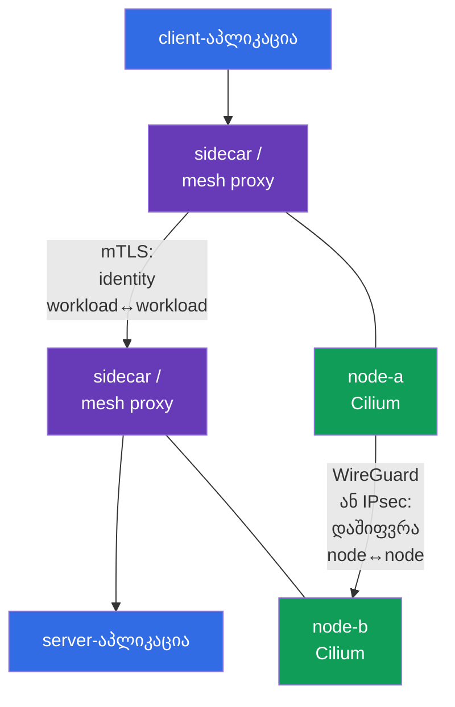
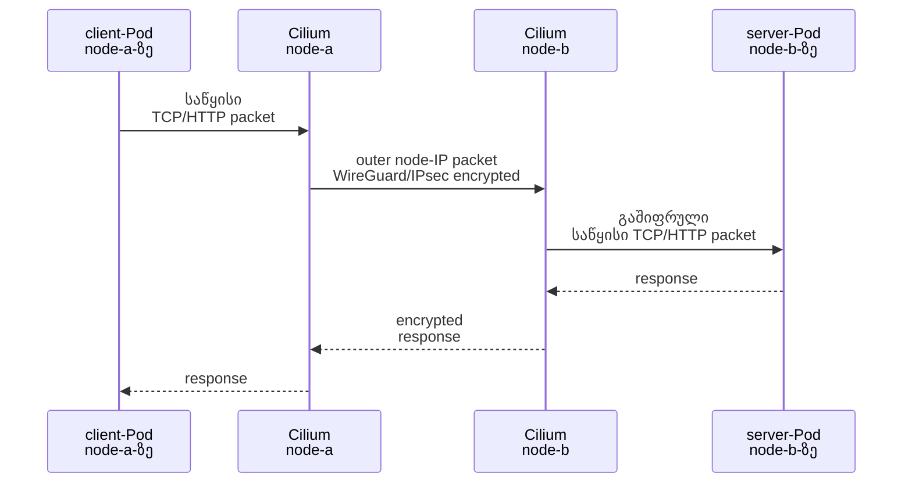
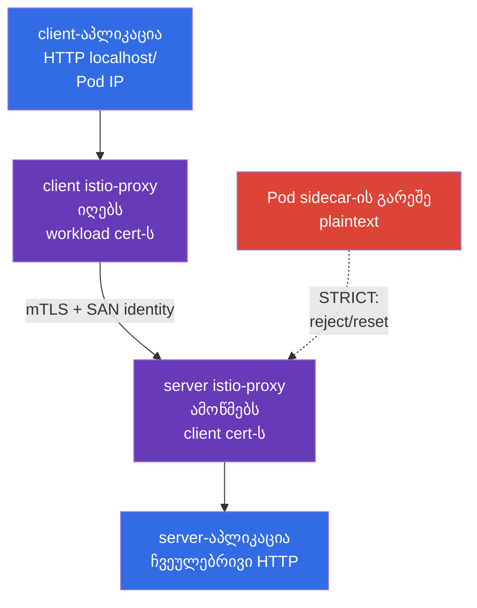

[Русская версия](ru.md) · [Eng version](README.md) · [Versión en español](es.md) · [Version française](fr.md) · [Deutsche Version](de.md) · [繁體中文版](tw.md) · [日本語版](jp.md)

# თავი 23. Pod-to-Pod დაშიფვრა და mTLS: Cilium, Istio და Linkerd

> **პრობლემა.** NetworkPolicy-ს შესწევს უნარი დაუშვას მხოლოდ საჭირო ნაკადი, მაგრამ მასში
> მოცემული მონაცემები რჩება ხელმისაწვდომი გადაჭერისთვის ან გაცვლისთვის node-თაშორის
> გზაზე, ხოლო service-ს, რომელსაც არ აქვს identity-ის ორმხრივი შემოწმება, შესწევს უნარი
> მიიღოს კავშირი უცხო workload-იდან. Node-ის, ქსელის სეგმენტის ან client-ის
> კომპრომეტირება მაშინ ააშკარავებს token-ებსა და payload-ს ან საშუალებას აძლევს
> გამოჩინდეს სანდო service-ად; ცალკე საჭიროა transport encryption და mTLS workload
> identity-სთვის.

> **რა არის შემდეგ.** NetworkPolicy უშვებს ან უკრძალავს ნაკადს, მაგრამ თავისთავად არ
> ხდის მას კონფიდენციალურს. ამ თავში ვაწყობთ ორ სხვადასხვა დაცვის შრეს Pod-to-Pod
> traffic-ისთვის: node-ებს შორის ქსელის გამჭვირვალე დაშიფვრას Cilium-ის მეშვეობით
> (WireGuard ან IPsec) და workload-ის ორმხრივ TLS-authentication-ს service mesh-ის
> მეშვეობით (Istio ან Linkerd). ეს არის კომპეტენცია **Implement Pod-to-Pod encryption
> (Cilium, Istio)** CKS-ის დომენში *Minimize Microservice Vulnerabilities* (20%).

> **რა გჭირდებათ CKA-დან.** Pod-ქსელისა და CNI-ის საბაზისო მოდელი განხილულია
> [CKA-ს 30-ე თავში](../../../cka/course/30/ge.md), Service/DNS - [CKA-ს 31-ე
> თავში](../../../cka/course/31/ge.md), ხოლო NetworkPolicy - [CKA-ს 34-ე
> თავში](../../../cka/course/34/ge.md). აქ ვთვლით, რომ იცით, როგორ მოინახოთ Pod,
> Service, node და შეამოწმოთ ჩვეულებრივი `curl`.

> 🧠 Cilium WireGuard/IPsec იცავს node-to-node transport-ს, mesh mTLS - proxy-კავშირებსა და workload identity-ს, NetworkPolicy - ნაკადის დაშვებას.

## 23.1. ორი ამოცანა, ორი დონე: encryption და mTLS

სიტყვებს „Pod-to-Pod traffic-ის დაშიფვრა" ორი სხვადასხვა მნიშვნელობა აქვს. ისინი არ
შეიძლება ჩაითვალოს ურთიერთშესატყვისად.

- **Cilium WireGuard/IPsec** იცავს პაკეტს node-ებს შორის. ის დაშიფრავს და
  authentication-ს უტარებს transport-ის node-to-node მონაკვეთს გამჭვირვალედ
  აპლიკაციისთვის: container არ იღებს certificate-ს, Service არ იცვლება, HTTP
  workload-ის შიგნით რჩება HTTP.
- **Service mesh mTLS** ქმნის TLS-კავშირს workload-ის proxy-ებს შორის. ის ამოწმებს
  გამომწვევი workload-ისა და server-ის identity-ს, არა მხოლოდ node-ებს. Istio და
  Linkerd ჩვეულებრივ თავად გასცემენ ხანმოკლე certificate-ებს და ჩაჭერენ traffic-ს
  sidecar/proxy-ის მეშვეობით.
- **NetworkPolicy** ცალკე პასუხობს: რომელი ნაკადი ზოგადად დასაშვებია. არც Cilium
  encryption და არც mTLS არ იძლევა allow/deny namespace-ისა და Pod selector-ის
  მიხედვით NetworkPolicy-ის ნაცვლად.



Node-ებს შორის traffic-ისას ეს მექანიზმები შესაძლებელია გაერთიანდეს: service mesh
იცავს კავშირს workload-ის proxy-ებს შორის, ხოლო Cilium-ის encryption დამატებით იცავს
პაკეტებს node-თაშორის ქსელის მონაკვეთზე. **Cilium WireGuard და IPsec დიზაინით არ
შიფრავს Pod-to-Pod traffic-ს ერთსა და იმავე node-ზე**: node-თაშორისი outer packet
არ არსებობს. mTLS ისევ იცავს კავშირს workload-ებს შორის mesh-ში. და პირიქით, Cilium-ის
encryption არ ჩაანაცვლებს mTLS-ს: კომპრომეტირებული workload სანდო node-ზე არ იღებს
client-ის შესამოწმებელ identity-ს.

| საკითხი | Cilium WireGuard/IPsec | Istio/Linkerd mTLS | NetworkPolicy |
|---|---|---|---|
| სად მოქმედებს | node-თაშორის გზა | workload-ის proxy-ებს შორის | Pod-ის ingress/egress |
| შიფრავს HTTP payload-ს ფიზიკურ ქსელში | დიახ | დიახ | არა |
| ამოწმებს | node-peer-ების კრიპტოგრაფიულ identity-ს | workload-ის identity-ს | არა identity-ს, არამედ selector/IP/port-ს |
| საჭიროა sidecar/proxy Pod-ში | არა | დიახ (ან ambient/eBPF რეჟიმი კონკრეტული mesh-ისთვის) | არა |
| აპლიკაცია ხედავს certificate-ს | არა | ჩვეულებრივ არა | არა |
| იცავს same-node Pod-to-Pod-ს | არა: Cilium WireGuard/IPsec დიზაინით არ შიფრავს ასეთ traffic-ს | დიახ, თუ ორივე mesh-შია | ზღუდავს, მაგრამ არ შიფრავს |

> 🎯 ცვლილებამდე დაფიქსირეთ CNI, ვერსიები, firewall, MTU და ტესტური Pod-ების cross-node placement.


**დაფიქსირება** აქ ნიშნავს არა კონფიგურაციის შეცვლას, არამედ baseline-ის - მოქმედი
მდგომარეობის ანაბეჭდის - შენარჩუნებას, რომელთანაც შესაძლებელი იქნება rollout-ის
შემდეგ შედეგის შედარება. შეიტანეთ შემოწმებების შედეგები change/incident-ის
ჩანაწერში ან სასწავლო ჩანაწერებში: რომელი CNI ემსახურება ქსელს უკვე და მისი
ვერსია; რომელი Kubernetes/kernel/Cilium ვერსიები მონაწილეობს; უშვებს თუ არა
firewall საჭირო node-თაშორის protocol-ს; რომელი MTU ხელმისაწვდომია გზაზე.
**Cross-node placement** ნიშნავს, რომ ორი ტესტური Pod ნამდვილად დაგეგმილია
**სხვადასხვა** node-ზე. ეს მნიშვნელოვანია: მხოლოდ ასეთი flow ქმნის node-to-node
outer packet-ს, რომლითაც შესაძლებელია WireGuard/IPsec-ის დამტკიცება. თუ ცვლილების
შემდეგ traffic შეწყვეტს მუშაობას, baseline ეხმარება გავარჩიოთ ახალი ხარვეზი
წინა firewall/MTU/placement შეზღუდვისგან.

## 23.2. ცვლილებამდე: scope, თანხვედრა და საწყისი მდგომარეობა

CNI encryption და service mesh - clusterwide ან namespacewide ცვლილებაა. არ ჩართოთ
ის ბრმად production-ში: არასწორმა MTU-მ, ძველმა kernel-მა, firewall-მა ან legacy
client-ისთვის მკაცრმა mTLS-მა შესძლებია traffic-ის შეჩერება. ჯერ დაფიქსირეთ
მიმდინარე CNI, ვერსიები, ტესტური Pod-ების placement და პაკეტის გზა.

```bash
kubectl get nodes -o wide
kubectl get pods -A -o wide
kubectl -n kube-system get ds cilium
kubectl -n kube-system get pods -l k8s-app=cilium -o wide
kubectl get networkpolicy -A
```

წინასწარ შეამოწმეთ:

1. Cilium უკვე არსებული CNI-ია, ხოლო Cilium-ისა და kernel-ის ვერსია მხარს უჭერს
   შერჩეულ რეჟიმს ოფიციალური compatibility matrix-ის მიხედვით. არ დააინსტალიროთ
   მეორე CNI მოქმედის ზემოთ.
2. ყველა worker node-ს შორის უნდა იქნეს დაშვებული WireGuard-ის UDP-port (Cilium
   default-ად იყენებს `51871`-ს, მაგრამ მნიშვნელობა უნდა შემოწმდეს დაინსტალირებულ
   კონფიგურაციაში) ან Cilium IPsec-ისთვის - ESP (IP protocol 50). ტიპური IKE/NAT-T
   სცენარი UDP/4500-ით არ ეხება აღწერილ Cilium IPsec მექანიზმს. Security group,
   firewall და routes - გადაწყვეტის ნაწილია.
3. ფიზიკურ ქსელს აქვს MTU-ის მარაგი. Encapsulation ამატებს header-ებს; path-MTU
   პრობლემისას მცირე `curl` შესაძლებელია მუშაობდეს, ხოლო დიდი response-ები ჩამოკიდდეს.
4. არსებობს ორი ტესტური Pod სხვადასხვა node-ზე. სხვაგვარად tcpdump არ დაამტკიცებს
   node-to-node encryption-ს. სასწავლო ტესტისთვის მიანიჭეთ მათ
   `nodeSelector`/`podAntiAffinity` ან იპოვეთ უკვე გადანაწილებული workload.
5. არსებობს rollback-გეგმა და მომსახურების ფანჯარა. Helm values-ის შეცვლა
   შენახული წინა release-ის გარეშე დიაგნოსტიკას გამოცნობად აქცევს.

ბრძანება ქვემოთ აჩვენებს უკვე დაინსტალირებული Helm release-ის ფაქტურ პარამეტრებს.
Release-ის სახელები და values დამოკიდებულია ინსტალაციის ხერხზე; არ ჩაანაცვლოთ
მათით GitOps-ის ჭეშმარიტების წყარო.

```bash
helm -n kube-system list
helm -n kube-system get values cilium --all
kubectl -n kube-system get configmap cilium-config -o yaml
```

> 🎯 Transparent encryption იცავს მხოლოდ node-თაშორის მონაკვეთს; შეარჩიეთ backend და შეამოწმეთ მისი scope.

## 23.3. Cilium transparent encryption: მოდელი და საზღვრები

Cilium შიფრავს traffic-ს datapath-ში node-ებზე. როცა Pod `node-a`-ზე უგზავნის
მონაცემებს Pod-ს `node-b`-ზე, Cilium ახორციელებს ინკაპსულირებას/დაშიფვრას საწყისი
პაკეტისთვის, უგზავნის outer packet-ს node-ის IP-ებს შორის, ხოლო Cilium `node-b`-ზე
ამოწმებს peer-ს, გაშიფრავს და მიაწოდებს საწყის პაკეტს სამიზნე Pod-ს. Kubernetes
Service-ის, DNS-ისა და აპლიკაციისთვის ეს გამჭვირვალეა: URL-ის, port-ის შეცვლა ან
TLS-ბიბლიოთეკის დამატება საჭირო არ არის.



**Transparent** არ ნიშნავს „ყველგან და ყველასგან დაშიფრული". აპლიკაციის
interface-ზე ან namespace-ის შიგნით plaintext შესაძლებელია იყოს ხილული
დაშიფვრამდე/გაშიფვრის შემდეგ. ასევე, დაშიფვრა არ ხდის უსაფრთხოს დაუცველ
აპლიკაციას: ის არ ბლოკავს SQL injection-ს, არ იძლევა მომხმარებლის ავტორიზაციას
და არ ზღუდავს კომპრომეტირებულ Pod-ს. ამ ამოცანებისთვის საჭიროა application
security, mTLS/authorization, RBAC და NetworkPolicy.

Cilium მხარს უჭერს ორ გავრცელებულ backend-ს:

| თვისება | WireGuard | IPsec |
|---|---|---|
| კრიპტოგრაფიული მოდელი | თანამედროვე კომპაქტური VPN-protocol | IPsec ESP; ხშირად ორგანიზაციის/ქსელის სტანდარტი |
| გადაცემა ქსელში | UDP, ჩვეულებრივ `51871` | ESP (IP protocol 50) |
| გასაღებები/peer | key pair თითოეული peer-ისთვის; public key ადენტიფიცირებს დაშვებულ node-ს | key material Cilium IPsec Secret-ში, Security Association peer-ებს შორის |
| authentication | პაკეტი მიიღება მხოლოდ ცნობილი public key/allowed peer-იდან | ESP integrity + Security Association-ის გასაღებები |
| ექსპლუატაციური არჩევანი | ჩვეულებრივ მარტივი არჩევანი მხარდაჭერილი Linux-გარემოსთვის | საჭიროა, თუ ამას მოითხოვს არსებული IPsec-/ქსელის სტანდარტი |
| რას ამოწმებთ tcpdump-ით | UDP WireGuard port-ზე, HTTP payload-ის გარეშე | `esp`, HTTP payload-ის გარეშე |

Cilium 1.20-ში დამატებით დოკუმენტირებულია **beta** backend `ztunnel` encryption.
ეს forward-looking production-გაფართოებაა, არა CKS-ის ძირითადი გზა; გამოცდის
სცენარისთვის საკმარისია WireGuard ან IPsec.

არჩევენ **ერთ** backend-ს. WireGuard-ისა და IPsec-ის ერთდროული ჩართვა „ორმაგი
დაცვის" სახით არ არის Cilium-ის ჩვეული კონფიგურაცია და მხოლოდ ართულებს debugging-ს.
ზუსტი Helm values და მხარდაჭერილი კომბინაციები შეამოწმეთ კლასტერში დაინსტალირებული
ვერსიის დოკუმენტაციასთან: ძველი სტატიის მნიშვნელობები შესძლებია არ ეხაზეს ახალ
Cilium-ს.

> 🎯 შეამოწმეთ version-pinned values, Cilium agent-ების rollout და encryption status; peer key ადასტურებს node-ს, არა Pod identity-ს.

## 23.4. WireGuard: ჩართვა, key peer და ორმხრივი authentication

WireGuard იყენებს private/public key pair-ს თითოეული peer-ისთვის. Cilium ავტომატურად
მართავს გასაღებებს და ავრცელებს საჭირო public key-ებს Cilium agent-ებს შორის
Kubernetes API-ის მეშვეობით. Node იღებს დაშიფრულ პაკეტს მხოლოდ იმ შემთხვევაში, თუ
ის გაივლის მოსალოდნელი peer-ის კრიპტოგრაფიულ შემოწმებას; node IP-ის გაყალბება
გასაღების გარეშე არასაკმარისია. ამიტომ transport-დონეზე ეს ერთდროულად
კონფიდენციალურობაცაა და **node-peer-ების ორმხრივი authentication**.

ეს არ არის workload identity: ორ Pod-ს ერთსა და იმავე node-ზე არ აქვს
სხვადასხვა WireGuard identity, ხოლო server-ს არ ეცნობა client-ის ServiceAccount
WireGuard key-იდან. ასეთი ორმხრივი ნდობისთვის საჭიროა service mesh mTLS.

ქვემოთ ნაჩვენებია ტიპური Helm-კონფიგურაცია. შეასრულეთ ის თქვენი version-pinned
GitOps-ის ან დაფიქსირებული Helm release-ის მეშვეობით, წინასწარ შემოწმებული
კონკრეტული Cilium release-ის values-ის შემდეგ. `encryption.nodeEncryption=true`
ავრცობს დაცვას node-to-node traffic-ზეც. WireGuard-ისთვის Cilium ნაგულისხმებად
გამორიცხავს label-ის `node-role.kubernetes.io/control-plane` მქონე node-ებს
node-to-node encryption-იდან: ეს prevents-ს bootstrap-პრობლემას public key-ის
განახლებისას. არ ჩათვალოთ control-plane ავტომატურად დაფარულად ამ პარამეტრით;
ჩართეთ ის მხოლოდ control-plane-ზე და host traffic-ზე ეფექტის გაცნობის შემდეგ.

```bash
# მაგალითი: ჩასვით უკვე დამტკიცებული ვერსია და values რეპოზიტორიდან.
helm upgrade cilium cilium/cilium \
  --namespace kube-system \
  --reuse-values \
  --version <pinned-cilium-version> \
  --set encryption.enabled=true \
  --set encryption.type=wireguard

kubectl -n kube-system rollout status daemonset/cilium --timeout=10m
kubectl -n kube-system get pods -l k8s-app=cilium
```

თუ policy მოითხოვს ასევე node traffic-ის დაშიფვრას, გააკეთეთ ეს ცალკე, reviewable
ცვლილებად და შეამოწმეთ API server/kubelet-ის ხელმისაწვდომობა:

```bash
helm upgrade cilium cilium/cilium \
  --namespace kube-system \
  --reuse-values \
  --version <pinned-cilium-version> \
  --set encryption.enabled=true \
  --set encryption.type=wireguard \
  --set encryption.nodeEncryption=true
```

Rollout-ის შემდეგ შეამოწმეთ მდგომარეობა **ყოველ Cilium agent-ზე**, არა მხოლოდ
ერთ Pod-ზე, რომელსაც შემთხვევით შეარჩევს `kubectl exec ds/cilium`:

```bash
kubectl -n kube-system get pods -l k8s-app=cilium -o wide
kubectl -n kube-system get pods -l k8s-app=cilium -o name |
  while IFS= read -r agent; do
    echo "=== $agent ==="
    kubectl -n kube-system exec "$agent" -- cilium-dbg status --verbose
    kubectl -n kube-system exec "$agent" -- cilium-dbg encrypt status
  done
```

მოსალოდნელია healthy agent-ები და encryption state peer/handshake-შეცდომების
გარეშე ყოველ node-ზე. Cilium-ის ვერსიის მიხედვით ბრძანება შესძლებია აჩვენოს
WireGuard-ის interface-ს, peer-ებს, public key-ებს ან counter-ებს. `cilium-dbg` -
ლოკალური agent-ის CLI-ია: თუ subcommand არ არსებობს, შესრულეთ
`cilium-dbg --help` **ამავე agent-ზე** და შემოწმეთ დაინსტალირებული Cilium-ვერსიის
დოკუმენტაცია, რადგან ეს binary ვრცელდება agent-თან ერთად. გარეშე Cilium CLI
`cilium`, რომელსაც უშვებენ ადმინისტრაციული მანქანიდან, აქვს ცალკე ნუმერაცია:
გამოიყენეთ მისთვის მხარდაჭერილი თანხვედრადი ვერსია და მისი compatibility table,
არა release-ის იმავე ვერსიის ნომერი.

> 🔬 Strict mode-ს ესმის პირველი plaintext packet-ის თავიდან აცილება, მაგრამ საჭიროებს ვერსია- და routing-სპეციფიკურ თანხვედრას.

### Strict mode: პირველი plaintext packet-ის თავიდან აცილება

ჩვეულებრივი transparent WireGuard-ისას Pod-to-Pod traffic-ისთვის Cilium-ის
მართული endpoint-ებს შორის სხვადასხვა node-ზე, ახალი remote endpoint შესძლებია
ცნობილი არ გახდეს agent-ისთვის დაუყოვნებლივ; ამამდე პირველი egress-პაკეტები
მისკენ პოტენციურად შესძლებია გაიგზავნოს tunnel-ის გარეშე. თუ threat model ამას
არ უშვებს, გამოიყენეთ strict mode ვერსიის თანხვედრის ცალკე შემოწმების შემდეგ:

```yaml
encryption:
  strictMode:
    egress:
      enabled: true
      # ამ კლასტერის IPv4 Pod CIDR - ჩაანაცვლეთ ფაქტურით.
      cidr: 10.244.0.0/16
    ingress:
      enabled: true
```

`encryption.strictMode.egress` მხარდაჭერილია მხოლოდ IPv4-სთვის, ამიტომ `cidr`
უნდა იყოს ფაქტური IPv4 Pod CIDR; რეჟიმს ასევე აქვს შეზღუდვები direct routing-ის,
node CIDR-ისა და შერჩეული interface-ების მიმართ. `encryption.strictMode.ingress`
გაფილტრავს cluster-internal Pod traffic-ს, რომელიც არ მოსულა WireGuard tunnel-ის
მეშვეობით; ეს არ არის უნივერსალური strict mode IPsec-ისთვის. ჩართვამდე
შემოწმეთ Cilium release-ის მოთხოვნები native/direct routing-ისადმი და device
configuration-ისადმი, შემდეგ უარყოფითი ტესტით დაადასტურეთ, რომ plaintext
Pod-to-Pod packet node-ებს შორის არ გაივლის. არ ჩართოთ strict mode
NetworkPolicy-ის, firewall-ისა და control-plane-ის ხელმისაწვდომობის შემოწმების
ჩანაცვლებად.

> 🏭 კომპრომეტირებული node-ისთვის: იზოლირება, evidence-ის შენარჩუნება, ძველი peer-ის ნდობიდან გამოტანა; private key არ ხვდება ticket-ში, Git-ში ან chat-ში.

**რას ნიშნავს ეს პრაქტიკაში:** „კომპრომეტირებულია" - არსებობს საფუძველი
ვიგონდოთ, რომ თავდამსხმელს შესწევდა უნარი ბრძანებების შესრულებისა node-ზე ან
მისი მონაცემების წაკითხვისა. **იზოლირება** - არ დაუნიშნო მას ახალი Pod-ები და
შეზღუდო მისი მონაწილეობა კლასტერში დამტკიცებული incident procedure-ის
მიხედვით; ეს ავრცობს გავრცელების შეზღუდვას, მაგრამ არ ასწორებს კვალს.
**Evidence** - გამოძიებისთვის საჭირო metadata და logs (დრო, node-ის სახელი,
Cilium-ის მდგომარეობა და event-ები), არა private key-ის კოპია. **ძველი peer-ის
ნდობიდან გამოტანა** - key-ის რეგენერაციის ან node-ის ჩანაცვლების შემდეგ
დარწმუნება, რომ დანარჩენი node-ები არ იღებენ ტრაფიკს, რომელიც authentication-ს
გადის ძველი public key-ით. სია ქვემოთ აჩვენებს ამ მოქმედებების უსაფრთხო
თანმიმდევრობას.

### WireGuard key-ის ბრუნვა და ინციდენტი

Cilium ავტომატიზირებს key-ების lifecycle-ს, მაგრამ security design ისევ
ვალდებულია აღწეროს, ვის შესწევს Cilium resources-ის წაკითხვის/შეცვლის უნარი და
როგორ ვარეაგირებთ node-ის კომპრომეტირებაზე. არ დააკოპიროთ private key node-იდან
ticket-ში, chat-ში ან Git-ში. კომპრომეტირების ეჭვისას:

1. იზოლირეთ node (`cordon`/`drain` DaemonSet-ისა და PDB-ის გათვალისწინებით),
   შეინახეთ evidence;
2. შეამოწმეთ Cilium agent-ის logs, health და peer-ები დანარჩენ node-ებზე;
3. მიმართეთ Cilium-ვერსიის დოკუმენტირებულ პროცედურას peer key-ის მოცილება/რეგენერაციისთვის
   ან node-ის ხელახლა შექმნისთვის;
4. დარწმუნდით, რომ ახალ node-მა მიიღო ახალი identity/key, ხოლო ძველი peer
   ტრაფიკს არ იღებს;
5. გაიმეორეთ ფუნქციური და პაკეტ-დონეზე შემოწმება 23.10-ე ქვეთავიდან.

`kubectl get secret -A` და Secrets-ის წაკითხვის ფართო უფლება წვდომას იძლევა
არა მხოლოდ IPsec material-ზე, არამედ ბევრ სხვა secret-ზეც. შეზღუდეთ RBAC და
გააკეთეთ audit `kube-system`-ზე წვდომისთვის.

> 🔬 IPsec - Cilium-ის ალტერნატიული backend key rotation-ით, ESP-დიაგნოსტიკით, თანხვედრადი Cilium CLI-ითა და key-overlap window-ით.

## 23.5. IPsec: როცა საჭიროა და როგორ არ დავანგრიოთ key management

IPsec Cilium-ში ასევე იძლევა node-to-node encryption-ს გამჭვირვალედ, მაგრამ
იყენებს IPsec ESP Security Association-ებს. ხშირად ირჩევენ, როცა კორპორაციული
მოთხოვნები ან უკვე არსებული ქსელური ინფრასტრუქტურა მოითხოვს IPsec-ს. პაკეტი
physical interface-ზე გამოიყურება ESP-ად (IP protocol 50); აპლიკაციური HTTP
მასში არ უნდა იკითხებოდეს. არ გადმოიტანოთ ამაზე ზოგადი IKE/NAT-T-მოდელი
UDP/4500-ით: ის არ არის ამ Cilium-მექანიზმის ნაწილი.

ტიპური გადასვლა Cilium release-ისთვის IPsec-ის მხარდაჭერით იწყება key Secret-ით:
agent-მა უნდა მიიღოს `cilium-ipsec-keys` `encryption.type=ipsec`-ის ჩართვის
**წინ**. შესრულეთ შექმნა მხოლოდ ადმინისტრაციული მანქანიდან, სადაც დაინსტალირებულია
მხარდაჭერილი თანხვედრადი Cilium CLI და არსებობს kubeconfig. თუ Secret უკვე
არსებობს, არ ჩაანაცვლოთ ის შემთხვევით - ჯერ შეამოწმეთ owner და
version-specific rotation procedure:

```bash
kubectl -n kube-system get secret cilium-ipsec-keys >/dev/null 2>&1 || \
  cilium encrypt create-key --auth-algo rfc4106-gcm-aes

# ვამოწმებთ მხოლოდ არსებობასა და metadata-ს, არა გასაღების data-ს.
kubectl -n kube-system get secret cilium-ipsec-keys \
  -o custom-columns=NAME:.metadata.name,TYPE:.type,CREATED:.metadata.creationTimestamp
kubectl -n kube-system get secret cilium-ipsec-keys \
  -o jsonpath='{.metadata.resourceVersion}{"\n"}'

helm upgrade cilium cilium/cilium \
  --namespace kube-system \
  --reuse-values \
  --version <pinned-cilium-version> \
  --set encryption.enabled=true \
  --set encryption.type=ipsec

kubectl -n kube-system rollout status daemonset/cilium --timeout=10m
kubectl -n kube-system get pods -l k8s-app=cilium -o name |
  while IFS= read -r agent; do
    echo "=== $agent ==="
    kubectl -n kube-system exec "$agent" -- cilium-dbg encrypt status
  done
```

Cilium ინახავს IPsec key material-ს Secret-ში `cilium-ipsec-keys` `kube-system`-ში.
არ გამოიტანოთ ის terminal-ში, CI log-ში ან documentation-ში. დაშვებულია
არსებობისა და metadata-ს შემოწმება data-ს decode-ის გარეშე.

ბრუნვისთვის გამოიყენეთ მხოლოდ მხარდაჭერილი **თანხვედრადი** Cilium CLI-ის
ვერსია და version-specific procedure. ჩვეულებრივი არასაიდუმლო სტატუსი
გადამოწმებადია `cilium encryption status`-ით ადმინისტრაციული მანქანიდან და
`cilium-dbg encrypt status`-ით ყოველ node-ზე. ბრძანება `cilium encryption
key-status` გამოიტანს IPsec key material-ს: შესრულეთ ის მხოლოდ იმ შემთხვევაში,
თუ ეს პირდაპირ მოითხოვს დამტკიცებული rotation-პროცედურა, დაცულ terminal-ში,
CI-ში, log-ში, ticket-ში ან chat-ში გამოტანის გარეშე.

```bash
# ადმინისტრაციული მანქანა მხარდაჭერილი თანხვედრადი Cilium CLI-ით.
cilium encryption status
cilium encryption rotate-key
```

რამდენიმე კლასტერის ან სტანდარტული არაარსებული release-ის შემთხვევაში
დაამატეთ ბრძანებებს საჭირო პარამეტრები `--context`, `--namespace kube-system`
და `--helm-release-name`. არ შესრულოთ ბრუნვა Cilium Pod-იდან. შემოწმეთ
subcommand-ის ხელმისაწვდომობა `cilium encryption --help`-ის და CLI-ის
compatibility table-ის მეშვეობით. `encryption.ipsec.keyWatcher=true`-ის
შემთხვევაში (default) agent-ები იჭერენ Secret-ის განახლებას DaemonSet-ის
restart-ის გარეშე; ჩვეულებრივ ყველა agent მას იტანება დაახლოებით წუთის
განმავლობაში, ხოლო ძველი და ახალი key თანაარსებობს rotation window-ში.
Restart/rollout DaemonSet-ისთვის საჭიროა მხოლოდ გამორთული watcher-ისას ან
თუ ეს პირდაპირ მოითხოვს დაინსტალირებული ვერსიის დოკუმენტაცია.

არ არსებობს შესაძლებლობა ხელით ჩაანაცვლოთ Secret ერთი შემთხვევითი
სტრიქონით: peer-ების არასინქრონულობა იწვევს packet loss-ს. Change
request-ისთვის პრაქტიკული მინიმუმი:

- ახალი key გენერირდება კრიპტოგრაფიულად შემთხვევით და გადადის დაცული
  არხით;
- key Secret-ის თანმიმდევრობა და ფორმატი აღებულია დაინსტალირებული
  Cilium-ის დოკუმენტაციიდან;
- `resourceVersion` Secret-ისა და `cilium-dbg encrypt status` მოწმდება
  **ყველა** agent-ზე key-overlap window-ის დასრულებამდე;
- არსებობს დანაკარგების/შეცდომების გაზომვა და rollback ძველი key-ის
  წაშლამდე;
- ბრუნვის შემდეგ მოწმდება აპლიკაცია და physical capture საჭირო node-პარზე.

**არ ჩააგდოთ IPsec key mTLS CA-ში.** IPsec key იცავს transport peer-ებს, ხოლო
mesh-ის certificate ადასტურებს workload identity-ს. მათი owner, rotation
interval, audit და blast radius შესძლებია სხვადასხვა იყოს.

აქ სრულდება Cilium transport encryption-ის მოწყობა. Istio განხილულია
პირდაპირ მის შემდეგ განზრახ: ეს **არ** არის Cilium-ის შემდეგი პარამეტრი და
არც IPsec-ის prerequisite, არამედ დამოუკიდებელი დამატებითი შრე. Cross-node
მოთხოვნისთვის Cilium იცავს outer packet-ს node-ებს შორის, ხოლო Istio mTLS
საშუალებას აძლევს proxy-ს დაამტკიცოს კონკრეტული workload-ის identity.
ამიტომ healthy Cilium encryption ჯერ არ ადასტურებს injection-ს, certificate-ს
ან Istio-ს mTLS policy-ს - ეს შემოწმებები ცალკე შესრულდება შემდეგ ქვეთავში.

> 🎯 Istio mTLS აკავშირებს certificate-ს workload identity-სთან; გავარჩიეთ `PeerAuthentication: STRICT` `DestinationRule`-ისგან `ISTIO_MUTUAL`-ით და შემოწმეთ proxy/injection.

> 🔬 **Upstream identity primitive.** Kubernetes v1.37-მა სტაბილიზაცია გაუკეთა Pod Certificates-სა და ClusterTrustBundles-ს. ისინი იძლევა X.509 primitives-ს Kubernetes-ის დონეზე, მაგრამ არ ხდის Istio/SPIFFE identity plane-ს ავტომატურად ზედმეტად: signer, trust model და mesh enforcement - ცალკეული architecture-გადაწყვეტილებებია. იხილეთ [Kubernetes v1.37 Security Delta](../APPENDIX_K8S_137_SECURITY_DELTA_GE.md).

## 23.6. Istio: sidecar, SPIFFE workload identity და `PeerAuthentication`

### რომელ პრობლემას წყვეტს Istio Cilium-ის შემდეგ

წინა ქვეთავებმა უკვე დაიცვა **transport node-ებს შორის**: Cilium WireGuard/IPsec
შიფრავს outer packet-ს და authentication-ს უტარებს node peer-ს. მაგრამ ეს
არასაკმარისია, თუ მნიშვნელოვანია პასუხის გაცემა კითხვაზე: „რომელი კონკრეტული
workload იძახებს service-ს?" Cilium არ იძლევა აპლიკაციისთვის ან server-ისთვის
client Pod-ის/ServiceAccount-ის შესამოწმებელ identity-ს და თავისთავად არ
აიძულებს server-ს მიიღოს მხოლოდ mTLS. გარდა ამისა, Cilium-ის node encryption
დიზაინით არ ქმნის outer tunnel-ს Pod-ისთვის ერთსა და იმავე node-ზე.

Istio წყვეტს ამოცანის სხვა ნაწილს: workload-ის proxy-ები იღებენ certificate-ებს,
ამყარებენ mTLS-ს და ამოწმებენ peer-ის identity-ს. `PeerAuthentication: STRICT`-ს
შესწევს უნარი აკრძალოს plaintext inbound traffic. ერთად ისინი მოქმედებენ ასე:
**Istio იცავს და authentication-ს უტარებს workload-to-workload connection-ს,
Cilium დამატებით იცავს პაკეტს არასანდო node-თაშორის მონაკვეთზე**. `NetworkPolicy`
რჩება მესამე შრედ - ის განსაზღვრავს, რომელი flow ზოგადად დასაშვებია.

| საკითხი | Cilium WireGuard/IPsec | Istio mTLS |
|---|---|---|
| მთავარი დადებითი | Transparent node-to-node encryption აპლიკაციის ან Service-ის შეცვლის გარეშე | Workload identity, ორმხრივი authentication და `STRICT` plaintext client-ის წინააღმდეგ |
| რას არ წყვეტს | არ იძლევა server-ისთვის client workload-ის identity-ს; დიზაინით არ შიფრავს same-node flow-ს | არ მალავს outer L3/L4 metadata-ს underlay-ისგან და არ ფარავს non-mesh flow-ს; არ ჩაანაცვლებს NetworkPolicy-ს |
| ღირებულება/შეზღუდვა | საჭიროა თანხვედრადი CNI/kernel, firewall და MTU; გასაღებები ეკუთვნის node-ებს | საჭიროა control plane, certificate-ები და proxy/ambient dataplane; sidecar mode ამატებს container-ს და overhead-ს |
| რის დამტკიცება საჭიროა | Cilium agent-ის status და outer WireGuard/ESP physical NIC-ზე | Injection/enrollment, proxy/certificate status და mTLS/`STRICT` ტესტები |

ეს არ არის სავალდებულო „ორმაგი დაშიფვრა". თუ **ორივე** workload უკვე mesh-შია,
trust შემოწმებულია და `PeerAuthentication: STRICT` ნამდვილად გამოიყენება, mTLS
უკვე შიფრავს application payload-ს proxy-ებს შორის. ამავე payload-ის ხელახლა
დაშიფვრისთვის Cilium-ის node encryption-ის ჩართვა სავალდებულო არ არის.

Cilium ცალკე ღირებულებას მატებს, როცა threat model მოითხოვს node-to-node
underlay-ის დაცვას: inner Pod IP/port-ისა და სხვა L3/L4 metadata-ს დამალვას
ფიზიკური ქსელისგან, mesh-ის გარეთ მგრძნობიარე cross-node flow-ის დაფარვას ან
node-ებს შორის დაშიფვრის policy/compliance-მოთხოვნის შესრულებას. ორივე შრე
საჭიროა მხოლოდ მაშინ, როცა **ორივე** მიზანი გამოიყენება: workload identity/mTLS
**და** underlay-ის ან non-mesh traffic-ის დაცვა. თუ აპლიკაცია არ მოითხოვს
workload identity-ს ან mesh-compatible ქცევას, Istio არ ირთვება ავტომატურად -
ჯერ ფასდება threat model, compatibility და overhead.

Istio sidecar (`istio-proxy`, Envoy) ჩაჭერს inbound/outbound workload traffic-ს.
Istiod გასცემს workload-certificate-ს Kubernetes ServiceAccount-ის საფუძველზე;
proxy-ები ამყარებენ mTLS-ს და ამოწმებენ peer-ის identity-ს. Workload identity-ს
აქვს SPIFFE ID-ის ფორმა: `spiffe://<trust-domain>/ns/<namespace>/sa/<service-account>`.
აპლიკაცია ჩვეულებრივ განაგრძობს ჩვეულებრივ HTTP port-ის მოსმენას, რადგან TLS
sidecar-ში სრულდება, არა app container-ში.

**Ambient mode**-ში Istio არ ამატებს ცალკე sidecar-ს ყოველ Pod-ში: ამის
ნაცვლად ყოველ node-ზე მუშაობს `ztunnel` (**Zero Trust Tunnel**) - სპეციალური
node-level proxy. ის ასრულებს mesh-ის L3/L4-ამოცანებს, mTLS-ისა და
authentication-ის ჩათვლით, აპლიკაციას TLS-ზე დამოუკიდებლად მუშაობის
საჭიროების გარეშე.

`HBONE` (**HTTP-Based Overlay Network Environment**) - Istio-ს დაცული
tunnel-ია mesh-ის კომპონენტებს შორის. ის ატარებს რამდენიმე TCP stream-ს ერთი
mTLS connection-ის მეშვეობით; ამიტომ workload traffic შესძლებია იყოს დაცული,
თუმცა Pod-ის container-ების სიაში არ არსებობს `istio-proxy`. `istio-proxy`-ის
არარსებობა ambient mode-ში არ ნიშნავს plaintext client-ს. ორივე მოდელში
`PeerAuthentication` `STRICT`-ით არ უშვებს plaintext inbound traffic-ს: ambient
mode-ში server ელოდება დაცულ HBONE/mTLS flow-ს.

შემდეგი შემოწმება `istio-injection=enabled`-ისა და `istio-proxy`-ის
არსებობის შესახებ ეხება **მხოლოდ sidecar mode-ს**. Ambient mode-ისთვის
შემოწმეთ workload-ის enrollment და `ztunnel`-ის მდგომარეობა დაინსტალირებული
Istio-ვერსიის documentation-ის მიხედვით და არ ელოდოთ დამატებით container-ს
Pod-ში.



### Injection-ის ჩართვა და sidecar-ის შემოწმება

სასწავლო namespace-ისთვის ჩართეთ injection Pod-ის შექმნამდე. Production-ში
გამოიყენეთ Istio-ს იმ ინსტალაციის revision label, რომელსაც აკონტროლებს
change process; არ შეურიოთ სხვადასხვა revision-ები მიგრაციის გეგმის გარეშე.

```bash
kubectl create namespace mesh-demo
kubectl label namespace mesh-demo istio-injection=enabled

kubectl -n mesh-demo apply -f server.yaml
kubectl -n mesh-demo apply -f client.yaml
kubectl -n mesh-demo get pods
kubectl -n mesh-demo get pod -l app=server \
  -o jsonpath='{range .items[*]}{.metadata.name}{": "}{.spec.containers[*].name}{"\n"}{end}'
```

Container-ების სიაში უნდა იყოს `istio-proxy` `server`-თან ერთად. Sidecar-ის
არარსებობა - არა კოსმეტიკური ხარვეზი: plaintext client არ ხდება mTLS
client-ად, ხოლო `STRICT` კანონზომიერად უარს ეთქვის მას. უკვე არსებული
Deployment-ისთვის გააკეთეთ controlled rollout label-ის შემდეგ:

```bash
kubectl -n mesh-demo rollout restart deployment/server
kubectl -n mesh-demo rollout status deployment/server
kubectl -n mesh-demo get pod -l app=server \
  -o jsonpath='{range .items[*]}{.metadata.name}{": "}{.spec.containers[*].name}{"\n"}{end}'
```

### `PeerAuthentication`: server-ს მოეთხოვება mTLS

`PeerAuthentication` განსაზღვრავს inbound mTLS policy-ს. `STRICT` ნიშნავს:
server-ის proxy იღებს მხოლოდ mTLS traffic-ს peer-იდან, რომელსაც შესწევს
სანდო certificate-ის წარმოდგენის უნარი. Plaintext TCP sidecar-ის გარეშე
workload-იდან არ არის დასაშვები fallback.

შემდეგი resource მოქმედებს მთელ namespace `mesh-demo`-ზე. Namespace selector
აქ საჭირო არ არის: namespace განსაზღვრულია `metadata.namespace`-ით.

```yaml
apiVersion: security.istio.io/v1
kind: PeerAuthentication
metadata:
  name: default
  namespace: mesh-demo
spec:
  mtls:
    mode: STRICT
```

Policy შესაძლებელია დავავიწროვოთ ერთ server workload-ზე. ასეთი selector
ემთხვევა Pod-ის label-ს, არა Service-ის სახელს; შემოწმეთ ფაქტური label-ები
`kubectl get pod --show-labels`-ის მეშვეობით.

```yaml
apiVersion: security.istio.io/v1
kind: PeerAuthentication
metadata:
  name: server-strict
  namespace: mesh-demo
spec:
  selector:
    matchLabels:
      app: server
  mtls:
    mode: STRICT
```

არ გამოიყენოთ ერთდროულად namespace-wide `STRICT` და workload policy
წინააღმდეგობრივი `PERMISSIVE`-ით precedence-ის გაცნობის გარეშე. კარგი
მიგრაცია ჩვეულებრივ ასე გამოიყურება:

```text
client-ების ინვენტარიზაცია -> client-ების injection/გამოსწორება -> PERMISSIVE-ის
გაზომვა (თუ საჭიროა) -> mTLS-ის შემოწმება -> STRICT ვიწრო scope -> STRICT
namespace -> დროებითი გამონაკლისის მოცილება
```

`PERMISSIVE` სასარგებლოა მხოლოდ როგორც დროებითი თანხვედრა: proxy იღებს
mTLS-ს და plaintext-ს, ამიტომ წარმატებული `curl` ჯერ არ ადასტურებს mTLS-ს.
`DISABLE` ჩვეულებრივი TCP workload-ისთვის ქმნის გამონაკლისს, რომელი უნდა
მინიმიზირდეს, დაადოკუმენტირდეს owner-ითა და ვადით.

### `DestinationRule`: client-მა არ უნდა გამორთოს TLS

Istio-ს auto mTLS-ს შესწევს TLS-ის ავტომატური არჩევის უნარი, მაგრამ ცალსახა
`DestinationRule` სასარგებლოა როგორც შემოწმებადი client-ის განზრახვა
სასწავლო stand-ში ან ორგანიზაციის policy-ის მოთხოვნისას ცალსახა
კონფიგურაციისთვის. `PeerAuthentication` იცავს inbound server-ს, ხოლო
`DestinationRule` განსაზღვრავს TLS-ს outbound client traffic-ისთვის - ეს
კავშირის სხვადასხვა მხარეებია.

```yaml
apiVersion: networking.istio.io/v1
kind: DestinationRule
metadata:
  name: server-mtls
  namespace: mesh-demo
spec:
  host: server.mesh-demo.svc.cluster.local
  trafficPolicy:
    tls:
      mode: ISTIO_MUTUAL
```

`ISTIO_MUTUAL` ნიშნავს, რომ Envoy იყენებს certificate-ებსა და trust bundle-ს,
რომელსაც მართავს Istio. არ ჩაანაცვლოთ ის `SIMPLE`-ით: `SIMPLE` ქმნის
ჩვეულებრივ TLS client-ს workload client certificate-ის გარეშე და არ
აკმაყოფილებს mTLS-ს. `DISABLE` მიმართავს plaintext-ს და server `STRICT`-ისას
უნდა უკუიგდოს. External service-ისთვის ჩვეულებრივ საჭიროა ცალკე
`ServiceEntry`/TLS settings; არ გამოიყენოთ ეს მაგალითი გლობალურ წესად
ყველა `*.svc.cluster.local`-ისთვის.

შემოწმეთ გამოყენებული ობიექტები და proxy-ის ფაქტური კონფიგურაცია:

```bash
kubectl -n mesh-demo get peerauthentication,destinationrule
istioctl proxy-status
istioctl proxy-config cluster deploy/client -n mesh-demo | grep server.mesh-demo
istioctl analyze -n mesh-demo
```

`istioctl analyze` და `proxy-config` დამოკიდებულია Istio-ს ვერსიაზე, მაგრამ
სასარგებლო იდეა მუდმივია: ვხედავთ არა მხოლოდ YAML-ს Git-ში, არამედ proxy-ის
runtime-კონფიგურაციას. CR-ის წარმატებული შექმნა არ იძლევა გარანტიას, რომ
selector/host ემთხვევა საჭირო endpoint-ს.

> 🎯 `STRICT`: meshed client იღებს `200`-ს, sidecar-ის გარეშე client არ იღებს plaintext წარმატებას.

## 23.7. Istio-ს კონტროლირებული ექსპერიმენტი: mesh-ის შიგნით 200, გარეთ reset

შემდეგი stand ადასტურებს `STRICT`-ის მთავარ საზღვარს: meshed client იღებს
HTTP `200`-ს, ხოლო sidecar-ის გარეშე client აკეთებს plaintext მოთხოვნას და
იღებს TCP reset/TLS-შეცდომას server-ზე წვდომის ნაცვლად. შესრულეთ ის მხოლოდ
გამოყოფილ namespace-ში: `STRICT` განზრახ ანგრევს legacy plaintext calls-ს.

ჯერ შექმენით namespace injection-ითა და server/client workload-ებით.
Client-ს აქვს sidecar namespace label-იდან; `legacy-client` ქვემოთ
გაშვებული იქნება ცალკე namespace-ში injection-ის გარეშე.

```yaml
apiVersion: v1
kind: Namespace
metadata:
  name: mesh-demo
  labels:
    istio-injection: enabled
---
apiVersion: v1
kind: Service
metadata:
  name: server
  namespace: mesh-demo
spec:
  selector:
    app: server
  ports:
  - name: http
    port: 8080
    targetPort: 8080
---
apiVersion: apps/v1
kind: Deployment
metadata:
  name: server
  namespace: mesh-demo
spec:
  replicas: 1
  selector:
    matchLabels:
      app: server
  template:
    metadata:
      labels:
        app: server
    spec:
      containers:
      - name: server
        image: hashicorp/http-echo:1.0
        args: ["-listen=:8080", "-text=server-ok"]
        ports:
        - containerPort: 8080
---
apiVersion: apps/v1
kind: Deployment
metadata:
  name: client
  namespace: mesh-demo
spec:
  replicas: 1
  selector:
    matchLabels:
      app: client
  template:
    metadata:
      labels:
        app: client
    spec:
      containers:
      - name: client
        image: curlimages/curl:8.12.1
        command: ["sleep", "infinity"]
---
apiVersion: security.istio.io/v1
kind: PeerAuthentication
metadata:
  name: default
  namespace: mesh-demo
spec:
  mtls:
    mode: STRICT
---
apiVersion: networking.istio.io/v1
kind: DestinationRule
metadata:
  name: server-mtls
  namespace: mesh-demo
spec:
  host: server.mesh-demo.svc.cluster.local
  trafficPolicy:
    tls:
      mode: ISTIO_MUTUAL
```

```bash
kubectl apply -f istio-strict-demo.yaml
kubectl -n mesh-demo rollout status deployment/server
kubectl -n mesh-demo rollout status deployment/client
kubectl -n mesh-demo get pods -o wide

CLIENT=$(kubectl -n mesh-demo get pod -l app=client -o jsonpath='{.items[0].metadata.name}')
kubectl -n mesh-demo exec "$CLIENT" -c client -- \
  curl -sS -o /dev/null -w '%{http_code}\n' http://server.mesh-demo.svc.cluster.local:8080
# მოსალოდნელია: 200
```

ახლა შექმენით client injection-ის გარეშე. Label `istio-injection=disabled`
Pod-ზე საჭირო არ არის, თუ namespace `legacy-demo` არ არის მონიშნული
injection-ისთვის; ცალსახა annotation ხდის განზრახვას ხილულ review-ისთვის.

```yaml
apiVersion: v1
kind: Namespace
metadata:
  name: legacy-demo
---
apiVersion: v1
kind: Pod
metadata:
  name: outside-client
  namespace: legacy-demo
  annotations:
    sidecar.istio.io/inject: "false"
spec:
  containers:
  - name: client
    image: curlimages/curl:8.12.1
    command: ["sleep", "infinity"]
```

```bash
kubectl apply -f outside-client.yaml
kubectl -n legacy-demo wait --for=condition=Ready pod/outside-client --timeout=120s
kubectl -n legacy-demo get pod outside-client \
  -o jsonpath='{.spec.containers[*].name}{"\n"}'
# მოსალოდნელია: მხოლოდ client, istio-proxy-ის გარეშე

kubectl -n legacy-demo exec outside-client -- \
  curl --connect-timeout 5 --max-time 10 -v http://server.mesh-demo.svc.cluster.local:8080
# მოსალოდნელია: non-zero; ჩვეულებრივ "Recv failure: Connection reset by peer".
```

ცალკეული შეცდომის ტექსტი დამოკიდებულია Envoy-ის ვერსიაზე, protocol-ზე და
ჩაჭერის წერტილზე: შესაძლებელია `connection reset`, TLS handshake error ან
timeout. უსაფრთხოების კრიტერიუმი არა შეცდომის სტრიქონია, არამედ plaintext
success-ის არარსებობა: ბრძანება არ აბრუნებს HTTP `200`-ს, ხოლო server proxy
არ იღებს არასაავტორიზებულ stream-ს. მკაცრი ავტომატური შემოწმებისთვის
დაფიქსირეთ ორივე ნიშანი:

```bash
set +e
OUT=$(kubectl -n legacy-demo exec outside-client -- \
  curl -sS --connect-timeout 5 --max-time 10 -o /dev/null -w '%{http_code}' \
  http://server.mesh-demo.svc.cluster.local:8080 2>&1)
RC=$?
set -e
printf 'exit=%s output=%s\n' "$RC" "$OUT"
test "$RC" -ne 0 || test "$OUT" != 200
```

თუ **mesh-ის შიგნით არ არსებობს 200**, შემოწმეთ `istio-proxy`-ის
არსებობა, DNS/Service endpoints, `PeerAuthentication`, `DestinationRule`,
proxy status და NetworkPolicy. თუ **გარეთ მიიღწევა 200**, ჯერ დარწმუნდით,
რომ `STRICT` ნამდვილად მოხდა server Pod-ზე და `outside-client` ნამდვილად
sidecar-ის გარეშეა; შემდეგ მოიძიეთ უფრო კონკრეტული `PeerAuthentication`
policy, რომელმაც გადააფარა ტესტი.

> 🔬 Linkerd-ს აქვს საკუთარი identity model და policy API; არ გამოიყენოთ ის Istio sidecar-თან ერთად ერთსა და იმავე Pod-ში.

## 23.8. Linkerd: production-ვარიანტი mTLS-ისა და ServiceAccount-იდენტობის

Linkerd - სრულფასოვანი production-ვარიანტია service mesh-ისა workload mTLS-ისთვის,
მაგრამ ეს დამატებითი მასალაა: CKS-ის ძირითად competencies-ში Pod-to-Pod
encryption-ისთვის პირდაპირ დასახელებულია Cilium და Istio, არა Linkerd. Linkerd
იყენებს საკუთარ მსუბუქ proxy-სა და identity model-ს. Injection-ის შემდეგ Pod
იღებს `linkerd-proxy`-ს; meshed traffic Linkerd-workload-ებს შორის ავტომატურად
შიფრავს და authentication-ს უტარებს mTLS-ს. Identity ჩვეულებრივ ეკავშირება
Kubernetes ServiceAccount-ს და აქვს DNS-ის მსგავსი ხედი:

```text
<serviceaccount>.<namespace>.serviceaccount.identity.linkerd.cluster.local
```

არ დააყენოთ Istio-ს და Linkerd-ის sidecar ერთსა და იმავე workload-ში
„გაძლიერებისთვის". ორივეს სურს ჩაჭერა traffic-ის, certificate-ების გაცემა
და policy-ის მართვა; შედეგი - iptables/ports-ის კონფლიქტი, განუსაზღვრელი
observability და რთული incident response. აირჩიეთ ერთი mesh namespace-ისთვის
ან გაატარეთ დაადოკუმენტირებული მიგრაცია.

Linkerd-ის ინსტალაციამდე შემოწმეთ cluster prerequisites, თანხვედრადი
Gateway API CRD-ების არსებობა და გამოიყენეთ pinned release. თანამედროვე
Linkerd მოითხოვს Gateway API CRD-ებს; თუ ისინი არ არსებობს, ჯერ
დააინსტალირეთ თქვენი release-ისთვის თანხვედრადი ვერსია ოფიციალური
ინსტრუქციის მიხედვით.

```bash
kubectl get crd gateways.gateway.networking.k8s.io
# თუ CRD არ არსებობს, linkerd install-ის წინ დააინსტალირეთ თანხვედრადი Gateway API CRD release.
linkerd check --pre
linkerd install --crds | kubectl apply -f -
linkerd install | kubectl apply -f -
linkerd check

# Viz - ცალკე extension-ია; დააინსტალირეთ ის viz-ბრძანებების წინ.
linkerd viz install | kubectl apply -f -
linkerd viz check
```

Production-ინსტალაციაში manifest უნდა გენერირდეს და შემოწმდეს CI-ში
დაფიქსირებული CLI-/chart-ვერსიიდან, არა floating `latest`-იდან. Health
check-ის შემდეგ ჩართეთ injection მხოლოდ ტესტური namespace-ისთვის და
გადატვირთეთ workload:

```bash
kubectl create namespace linkerd-demo
kubectl annotate namespace linkerd-demo linkerd.io/inject=enabled
kubectl -n linkerd-demo apply -f server.yaml
kubectl -n linkerd-demo apply -f client.yaml
kubectl -n linkerd-demo rollout status deployment/server
kubectl -n linkerd-demo get pod -l app=server \
  -o jsonpath='{.items[0].spec.containers[*].name}{"\n"}'
linkerd -n linkerd-demo check --proxy
linkerd -n linkerd-demo viz stat deploy
```

ისევე, როგორც Istio-ში, შემოწმეთ არა მხოლოდ annotation-ის არსებობა,
არამედ ასევე proxy-ის ფაქტური container, identity/certificate status და
წარმატებული მოთხოვნა meshed Pod-ებს შორის. მნიშვნელოვანია გავარჩიოთ
automatic mTLS და strict inbound: Linkerd ავტომატურად იყენებს mTLS-ს meshed
workload-ებს შორის, მაგრამ inbound authorization-ის გარეშე ნაგულისხმებად
იღებს plaintext-ს non-meshed source-იდან (`all-unauthenticated`). automatic
mTLS-ის თავისთავადი არსებობა არ ნიშნავს, რომ server იღებს მხოლოდ mTLS-ს.

მინიმალური strict inbound policy-სთვის დააყენეთ `all-authenticated`
სასწავლო namespace-ში workload-ების შექმნამდე:

```yaml
apiVersion: v1
kind: Namespace
metadata:
  name: linkerd-demo
  annotations:
    linkerd.io/inject: enabled
    config.linkerd.io/default-inbound-policy: all-authenticated
```

გამოყენების შემდეგ შექმენით non-meshed client namespace-ში Linkerd
injection-ის გარეშე და შემოწმეთ, რომ მისი plaintext `curl` Service-ზე არ
აბრუნებს HTTP `200`-ს; meshed client დასაშვები identity-ით უნდა დარჩეს
სამუშაო. უფრო ვიწრო წესებისთვის გამოიყენეთ release-ის policy API,
მაგალითად `AuthorizationPolicy` `MeshTLSAuthentication`-თან ერთად. Linkerd-ის
policy API და unauthorized traffic-ის ქცევა შეცვლილა ვერსიებს შორის: სანამ
ავაშენებდეთ default-deny-ს, შემოწმეთ დაინსტალირებული release-ის CRD და
policy mode. mTLS ადასტურებს identity-ს და იცავს არხს, მაგრამ სავალდებულოდ
არ ნიშნავს „ყოველ identity-ს შესწევს ყოველი endpoint-ის გამოძახების უნარი" -
authorization ცალკე უნდა დაკონფიგურირდეს.

> 🔬 Capture ხედავს inner plaintext/TLS-ს termination-ის წინ და outer encrypted packet-ს physical NIC-ზე.

## 23.9. WireGuard/IPsec და mesh ერთად: სად ხდება plaintext ხილული

შემოწმება „`curl` მუშაობს" არ ადასტურებს encryption-ს. `curl` ამოწმებს
ხელმისაწვდომობასა და application response-ს, მაგრამ არ განასხვავებს
plaintext HTTP-ს დაშიფრული traffic-ისგან. ანალოგიურად, tcpdump `any`-ზე
შესძლებია ერთდროულად დაინახოს inner plaintext პაკეტი virtual
interface-ზე და outer encrypted packet physical NIC-ზე. დამტკიცებისთვის
ჯერ ფორმულირება გავუკეთოთ, *სად* უნდა იყოს ხილული ყოველი შრე.

| Capture-წერტილი | მხოლოდ Cilium encryption-ისას | Cilium + Istio/Linkerd-ისას |
|---|---|---|
| app container / loopback proxy-სთან | ხშირად plaintext HTTP | app↔local proxy შესძლებია იყოს plaintext |
| veth/CNI node encryption-ის წინ | საწყისი inner flow შესძლებია იყოს წაკითხვადი | mTLS ciphertext mesh proxy-ებს შორის |
| physical NIC node-a/node-b | WireGuard UDP ან IPsec ESP, HTTP-ის გარეშე | outer WireGuard/IPsec; HTTP და TLS payload არ იკითხება |
| server app proxy-ის შემდეგ | plaintext, რადგან proxy-მ უკვე გაშიფრა | plaintext local proxy-დან app-მდე |

ეს ჩვეული architecture-ია termination points-ისთვის. Cilium-ის მიზანია
readable payload-ის მოცილება არასანდო physical network path-იდან. Mesh-ის
მიზანია workload-to-workload segment-ის TLS-protected გახდომა და მისი
identity-სთან დაკავშირება. არ განაცხადოთ „tcpdump არსად აჩვენებს HTTP-ს":
node-ზე და Pod-ში ის შესძლებია იყოს ხილული დაშიფვრამდე/გაშიფვრის შემდეგ,
თუ თავდამსხმელს აქვს root ამ node-ზე.

> 🎯 დაადასტურეთ cross-node placement, კონკრეტული physical NIC, გამეორებადი flow-ის დრო და Cilium status.

## 23.10. `tcpdump`-შემოწმება: outer encrypted traffic-ის დამტკიცება

Packet-level დამტკიცებისთვის საჭირო არის Pod-ები **სხვადასხვა** node-ზე,
ორივე node-ის IP და physical interface, რომელი მიდის cluster network-ში. არ
გამოიყენოთ ავტომატურად `eth0`: cloud-node-ზე interface-ს შესძლებია ეწოდოს
`ens5`, `ens192` ან სხვაგვარად.

```bash
NODE_B_IP="${NODE_B_IP:?set the second node IP}"
kubectl get pods -A -o wide
kubectl get nodes -o wide
# შერჩეულ node-ზე:
ip -br link
ip route get "${NODE_B_IP}"
```

პირველ node-ზე გაუშვით capture ზუსტად physical interface-ზე. ბრძანებები
ქვემოთ ვარაუდობენ SSH/დამტკიცებულ node access-ს; არ დაამატოთ privileged
debug Pod production-ში მხოლოდ სიმარტივისთვის. დამტკიცებული break-glass
access-ისას `kubectl debug node/<node>`-საც შესწევს host-level დიაგნოსტიკის
მიცემის უნარი, მაგრამ თავად ასეთი წვდომის ფაქტი უნდა იყოს auditable.

### WireGuard capture

```bash
# node-a-ზე; ჩაანაცვლეთ ens5 და node-b-ის IP.
sudo tcpdump -ni ens5 -vv 'udp port 51871 and host <NODE_B_IP>'
```

სხვა terminal-ში შექმენით გამეორებადი cross-node flow. მოსახერხებელია
შესრულდეს რამდენიმე მოთხოვნა client Pod-იდან, რომელი `kubectl get pod -o
wide`-ის მიხედვით მდებარეობს `node-a`-ზე, server Pod-ში/Service-ში
`node-b`-ზე:

```bash
for i in $(seq 1 20); do
  kubectl -n mesh-demo exec "$CLIENT" -c client -- \
    curl -sS http://server.mesh-demo.svc.cluster.local:8080 >/dev/null || exit 1
done
```

მოსალოდნელია UDP datagram-ების სერია node-a ↔ node-b WireGuard port-ზე.
`-vv` ზრდის protocol header-ების ანალიზის დეტალიზაციას, მაგრამ არ იბეჭდავს
ASCII payload-ს, ამიტომ `GET /`-ის, `Host:`-ის ან `server-ok`-ის არარსებობა
ასეთ output-ში არაფერს არ ადასტურებს. UDP-ის არსებობა port-ზეც ჯერ არ
ადასტურებს, რომ ეს ზუსტად საჭირო Pod flow-ია: შეადარეთ capture-ის დრო,
node-pair და Cilium-ის encryption-status-ის/counter-ების ზრდა.

თუ disposable lab ნამდვილად მოითხოვს payload-ის შედარებას, გამოიყენეთ
მოკლე capture კონტროლირებადი არასაიდუმლო flow-ისთვის `-A`-ით ან `-X`-ით და
საკმარისი snaplen-ით მოსალოდნელ inner წერტილში. არ გამოიყენოთ payload
capture მგრძნობიარე production traffic-ზე.

### IPsec capture

Cilium IPsec-ისთვის capture ფილტრავს ESP-ს, ანუ IP protocol 50-ს:

```bash
# node-a-ზე: Cilium IPsec ESP.
sudo tcpdump -ni ens5 -vv 'host <NODE_B_IP> and esp'
```

ისევ გაუშვით გამეორებადი application flow. მოსალოდნელია ESP packet-ები.
არ გამოიყენოთ HTTP-სტრიქონების არარსებობა `tcpdump -vv`-ში დამტკიცებად:
payload-ს ეს რეჟიმი არ აჩვენებს. Capture-ის შემდეგ შეადარეთ შედეგი
agent-ს **node-a-ზეც და node-b-ზეც**:

```bash
for node in "${NODE_A:?set first node name}" "${NODE_B:?set second node name}"; do
  agent=$(kubectl -n kube-system get pods -l k8s-app=cilium \
    --field-selector "spec.nodeName=$node" \
    -o jsonpath='{.items[0].metadata.name}')
  test -n "$agent" || { echo "ERROR: no Cilium agent on $node" >&2; exit 1; }
  echo "=== node=$node agent=$agent ==="
  kubectl -n kube-system exec "$agent" -- cilium-dbg encrypt status
done
```

`grep`-ის შედეგის არარსებობა არ არის უსაფრთხოების დამტკიცება: ბევრი
ჩვეული agent არ ლოგირებს ყოველ პაკეტს. მძლავრი evidence - ოთხი
ურთიერთდამთხვეული ფაქტია: cross-node placement, `200` საჭირო flow-ისთვის,
healthy encryption status/counter-ები და encrypted outer protocol physical
NIC-ზე. Payload-ის შედარებისთვის გამოიყენეთ მხოლოდ შეზღუდული lab capture
`-A`/`-X`-ით, არა production traffic-ი.

### უარყოფითი შემოწმება და ხშირი მახეები

- **Capture `-i any`-ზე აჩვენებს HTTP-ს.** ეს შესძლებია იყოს inner packet
  დაშიფვრამდე, ლოკალური მიწოდება ან traffic Pod-ებს შორის ერთსა და იმავე
  node-ზე. გაიმეორეთ physical NIC-ზე და შემოწმეთ placement.
- **არ არსებობს UDP/51871, მაგრამ curl მუშაობს.** შესაძლებელია Pod-ები
  ერთსა და იმავე node-ზეა, გამოიყენება სხვა Cilium port, encryption
  გამორთულია, ან იყენება სხვა transport. ჯერ შემოწმეთ values და
  `cilium-dbg encrypt status`, შემდეგ routes/interface.
- **არსებობს ESP/UDP, მაგრამ capture არ ემთხვევა ტესტს.** Node-ზე მიდის
  სხვა encrypted traffic. შეზღუდეთ BPF filter node-ის IP-ის წყვილით და
  გაიმეორეთ მოთხოვნა მოკლე დროის ფანჯარაში.
- **`tcpdump` ხედავს TLS-ს, არა HTTP-ს.** ეს მოსალოდნელია mesh-ისთვის
  inner გზაზე, მაგრამ არ ადასტურებს Cilium-ს. Physical NIC-ზე ორივე შრის
  ჩართვისას მოსალოდნელია outer WireGuard/IPsec.
- **დიდი response ჩამოკიდულია, პატარა მუშაობს.** ეჭვმიტანილია MTU/MSS.
  არ გამორთოთ encryption როგორც „გამოსწორება"; გაზომეთ path MTU და
  მოწესრიგდეთ CNI/underlay პლატფორმის პროცედურის მიხედვით.

> 🎯 დიაგნოსტიკა Cilium/underlay → DNS/Service → mesh identity/policy → NetworkPolicy; არ დატოვოთ `STRICT`-ის ან encryption-ის bypass.

## 23.11. დიაგნოსტიკა: ჯერ განისაზღვროს ხარვეზის შრე

ერთი სიმპტომი `connection reset` შესძლებია წარმოშვდეს რამდენიმე დონეზე.
დიაგნოსტიკა გააკეთეთ ქვემოდან ზემოთ, `STRICT`-ის ან encryption-ის დროებითი
გამორთვის მუდმივ bypass-ად გადაქცევის გარეშე.

| სიმპტომი | სავარაუდო შრე | პირველი შემოწმებები | უსაფრთხო გამოსწორება |
|---|---|---|---|
| Pod-ები სხვადასხვა node-ზე rollout-ის შემდეგ ვერ ცვლიან traffic-ს | Cilium/underlay | `cilium-dbg encrypt status`, agent logs, UDP/ESP firewall, MTU | აღდგენა თანხვედრადი values/ქსელი rollback-გეგმის მიხედვით |
| DNS Service არ resolve-ირდება | CoreDNS/Service, არა mTLS | `nslookup`, Endpoints, CKA-ს 31-ე თავი | DNS/Service-ის გამოსწორება TLS-ის ანალიზამდე |
| Meshed client არ იღებს 200-ს | Istio/Linkerd ან NetworkPolicy | sidecar/proxy, cert/identity, endpoints, policy | injection/identity/rule-ის გამოსწორება, არა გლობალური `DISABLE` |
| Outside client იღებს reset-ს | Istio `STRICT` | sidecar-ის არარსებობა, effective PeerAuthentication | ეს მოსალოდნელი დამტკიცებაა; client-ის მიგრაცია mesh-ში |
| Outside client იღებს 200-ს `STRICT`-ისას | policy არ მოხდა server-ზე | selector, namespace, Pod labels, უფრო კონკრეტული policy | policy-ის დავიწროვება/გამოსწორება და უარყოფითი ტესტის გამეორება |
| IPsec-ის rotation-ის შემდეგ intermittent loss | key rollout | Secret-ის ვერსია, agent-ები, peer encryption state | Cilium-ვერსიის overlap/rollback-პროცედურის დაცვა |
| Linkerd proxy არ არის Ready | mesh install/identity | `linkerd check`, proxy logs, clock/DNS | trust/identity-prerequisites-ის გამოსწორება, mTLS-ის გამორთვის გარეშე |

Სასარგებლო მინიმალური ბრძანების ნაკრები incident evidence-ისთვის:

```bash
kubectl -n mesh-demo get pod,svc,endpointslice -o wide
kubectl -n mesh-demo get peerauthentication,destinationrule -o yaml
kubectl -n kube-system get pods -l k8s-app=cilium -o wide
kubectl -n kube-system get pods -l k8s-app=cilium -o name |
  while IFS= read -r agent; do
    echo "=== $agent ==="
    kubectl -n kube-system exec "$agent" -- cilium-dbg encrypt status
  done
istioctl proxy-status 2>/dev/null || true
linkerd check 2>/dev/null || true
```

არ გამოიტანოთ `Secret` `-o yaml`-ით, private key, bearer token ან სრული
packet capture საერთო incident-არხში. Capture შესძლებია შეიცავდეს
metadata-ს, URL-ს, cookie-ს ან plaintext-ს internal წერტილში. შეინახეთ
მხოლოდ მინიმალურად საჭირო evidence დამტკიცებულ საცავში ვადით.

> 🏭 ნაკადების ინვენტარიზაცია, canary namespace/nodes, თანხვედრის პერიოდი, ვიწრო გამონაკლისები და runtime evidence upgrade-ის, firewall-ცვლილების ან CA/key-ის ბრუნვის შემდეგ.

## 23.12. უსაფრთხო rollout და ექსპლუატაციური წესები

Encryption არ არის ერთჯერადი ინსტალაციის ბრძანება. მას ჰყავს owners, updates,
rotation, alerting და უნდა ამტკიცებდეს, რომ მოსალოდნელი policy ისევ
მუშაობს Kubernetes/Cilium/mesh-ის upgrade-ის შემდეგ.

1. **ინვენტარიზაცია.** მოინახეთ workload-ი sidecar-ის გარეშე, external
   client-ები, hostNetwork Pod-ები, stateful protocol და კრიტიკული
   control-plane-გზები. mTLS-ისთვის შედგინეთ callers-ისა და servers-ის
   graph, არა მხოლოდ namespace-ების სია.
2. **Canary namespace/nodes.** დაიწყეთ ცალკე namespace-ითა და მცირე
   node pool-ით. Istio-ისთვის ჯერ ადასტურეთ meshed `200` და plaintext
   reset; Cilium-ისთვის - cross-node encrypted outer packet.
3. **Observe before enforce.** შეაგროვეთ latency, connection errors,
   packet drops, proxy certificate expiry და Cilium health. `PERMISSIVE`
   დასაშვებია მხოლოდ როგორც გაზომვადი მიგრაციის ეტაპი წაშლის თარიღით.
4. **დავიწროვეთ გამონაკლისები.** `PeerAuthentication` selector, ცალკე
   namespace ან დაადოკუმენტირებული legacy port უკეთესია გლობალურ
   `DISABLE`-ზე. გამონაკლისს ჰყავს owner, მიზეზი, ვადა და უარყოფითი
   ტესტი.
5. **შემოწმეთ ცვლილების შემდეგ.** ახალი node, Cilium-ის upgrade, mesh-ის
   CA-ის rotation და firewall-ცვლილება მოითხოვს status-ის, ფუნქციური
   flow-ისა და capture-ის გამეორებას. YAML-ის არსებობა Git-ში არ
   ჩაანაცვლებს runtime evidence-ს.
6. **დაგეგმეთ failure.** თუ CA/identity control plane მიუწვდომელია,
   certificate-ები ბოლოს ამოწურავენ ვადას; თუ Cilium agent-ი არ იღებს
   key-ს, cross-node flow დეგრადირდება. მოაწესრიგეთ alert expiry/rollout
   outage-ის წინ და დაადოკუმენტირეთ rollback.

Production-ისთვის კარგი layered policy ასე გამოიყურება: NetworkPolicy
უშვებს მხოლოდ საჭირო service flow-ს; mesh `STRICT` მოითხოვს
authentication-გავლილ mTLS peer-ს; Cilium შიფრავს cross-node underlay-ს;
application-ს ავტორიზაცია უტარებს user/request-ს. ყოველი შრე ამცირებს
სხვის შეცდომის შედეგებს, მაგრამ არც ერთი არ ათავისუფლებს updates-ისა და
monitoring-ისგან.

## 23.13. მინი-გლოსარი

- **Transparent encryption** - datapath-ის დაშიფვრა აპლიკაციის, Service-ის
  ან URL-ის შეცვლის გარეშე; Cilium მას იძახებს node-ებზე.
- **WireGuard** - VPN-protocol key pair-ით peer-ებისთვის; public key
  განსაზღვრავს დაშვებულ peer-ს.
- **IPsec ESP** - IP-დონის protected payload კონფიდენციალურობითა და
  integrity-ით Security Association-ებს შორის.
- **Node encryption** - traffic-ის დაცვა node-ებს შორის; არ არის
  ტოლფასი workload identity-ისა.
- **mTLS** - TLS, რომელშიც certificate-ს წარმოადგენენ როგორც client, ისე
  server.
- **Workload identity** - workload-ის კრიპტოგრაფიულად შესამოწმებელი
  იდენტობა, ჩვეულებრივ დაკავშირებული ServiceAccount-თან/namespace-თან
  mesh-ში.
- **Sidecar** - proxy container აპლიკაციის გვერდით, რომელი ჩაჭერს traffic-ს.
- **`PeerAuthentication`** - Istio-ს policy inbound mTLS-ისთვის; `STRICT`
  უკუიგდებს plaintext-ს.
- **`DestinationRule`** - Istio-ს policy outbound traffic-ისთვის;
  `ISTIO_MUTUAL` იყენებს Istio-ს მართულ certificate-ებს.
- **Linkerd identity** - Linkerd-ის mTLS identity, ჩვეულებრივ აგებული
  ServiceAccount-იდან.
- **Outer packet** - encrypted packet node-ის IP-ებს შორის physical
  network-ში.
- **Inner packet** - საწყისი Pod-to-Pod flow, ხილული დაშიფვრამდე ან
  გაშიფვრის შემდეგ.

## 23.14. თავის შედეგები

- Cilium WireGuard/IPsec და mesh mTLS წყვეტს სხვადასხვა ამოცანებს:
  პირველი იცავს transport-ს node-to-node, მეორე იძლევა workload-to-workload
  encryption-ს და mutual authentication-ს.
- WireGuard peer key-ები ან IPsec Security Association-ები ადასტურებენ
  სანდო node-ს, მაგრამ არ იძლევა server-აპლიკაციისთვის კონკრეტული
  client Pod-ის/ServiceAccount-ის identity-ს.
- Cilium-ში აირჩიეთ ერთი backend, შემოწმეთ firewall/MTU, agent-ები და
  status; გასაღებები არ იბეჭდება logs-ში, ხოლო IPsec-ის rotation
  სრულდება key-ის overlap-ითა ვერსიის პროცედურის მიხედვით.
- Istio `PeerAuthentication: STRICT` მოითხოვს mTLS-ს server inbound-ზე,
  injection ამატებს `istio-proxy`-ს, ხოლო `DestinationRule` `ISTIO_MUTUAL`-ით
  ცალსახად აკონფიგურირებს client-ის მხარეს.
- Linkerd ავტომატურად იძლევა mTLS-ს workload-ებისთვის mesh-ში და
  ეკავშირება identity-ს ServiceAccount-თან; არ შეურიოთ მისი sidecar
  Istio-ს ერთსა და იმავე Pod-ში.
- ხასიათებადი დამტკიცება შეიცავს meshed `200`-ს, plaintext outside
  reset/failure-ს, `cilium-dbg encrypt status`-ს და tcpdump outer
  WireGuard/IPsec-ის physical NIC-ზე HTTP payload-ის გარეშე.

> 🏭 RBAC key material-ისთვის, version-pinned ცვლილებები, MTU/firewall-ის design, rotation/rollback-runbook და runtime evidence.

## 23.15. როგორ გამოიყენება ეს production-ში

Production-ში Cilium encryption-სა და mesh mTLS-ს დანერგავენ ნაკადების
ინვენტარიზაციის, canary-namespace-ის, MTU-ისა და firewall-ის კონტროლის,
key material-ის RBAC-უფლებებით დაცვისა და შემოწმებადი rotation/rollback-runbook-ის
მეშვეობით. დაკვირვებადი დამტკიცება - `cilium-dbg encrypt status`, policy
events და წარმატებული mTLS-მოთხოვნები - გროვდება scope-ის ავრცობამდე.

## 23.16. როგორ დაგვეხმარება ეს: გამოცდაზე და ნამდვილ სამუშაოში

**CKS-ის გამოცდაზე.** უნდა შესწევდეთ უნარი გავარჩიოთ CNI encryption
mTLS-ისგან, მოვინახოთ Cilium-ის encryption status და cross-node
failure-ის მიზეზები, წავიკითხოთ `PeerAuthentication`/`DestinationRule` და
დავამტკიცოთ, რომ plain client `STRICT`-ს ვერ გაივლის. არ დაპირდეთ, რომ
NetworkPolicy შიფრავს პაკეტებს: ეს ტიპური მახეა. სწრაფად შემოწმეთ
container list, Service endpoints, node placement და effective policy,
შემდეგ გააკეთეთ მინიმალური უსაფრთხო ცვლილება.

**ნამდვილ სამუშაოში.** ყველაზე ღირებული შედეგი - არა ჩართული flag,
არამედ შემოწმებადი ნდობის საზღვარი: დაფიქსირებული Cilium/mesh release,
შეზღუდული RBAC key material-ისთვის, rotation-runbook, rollback,
MTU/firewall-ის design, legacy client-ების მიგრაცია და დაკვირვებადი
evidence ყოველი ცვლილების შემდეგ. mTLS იძლევა identity-ს
authorization-ისთვის, ხოლო node encryption იცავს underlay-ს, თუნდაც
application protocol არ შეცვლილიყო.

## 23.17. თვითშემოწმების კითხვები

<details>
<summary>1. რატომ არ ჩაანაცვლებს Cilium WireGuard/IPsec mTLS-ს workload-ებს შორის?</summary>

Cilium WireGuard/IPsec შიფრავს და authentication-ს უტარებს transport-ის
მონაკვეთს node-ებს შორის, მაგრამ არ იძლევა server-ისთვის კონკრეტული client
Pod-ის ან ServiceAccount-ის identity-ს. Service mesh mTLS იცავს კავშირს
workload-ის proxy-ებს შორის და ამოწმებს workload identity-ს. გარდა ამისა,
Cilium-ის node encryption დიზაინით არ შიფრავს Pod-to-Pod traffic-ს ერთსა და
იმავე node-ზე, ხოლო mTLS-ს ეს შესწევს.
</details>

<details>
<summary>2. რას ზუსტად ატარებს authentication-ს WireGuard peer და რატომ არ არის ეს ServiceAccount-ის identity?</summary>

WireGuard იღებს პაკეტს მხოლოდ ცნობილი public key-ის/allowed peer-ის
კრიპტოგრაფიული შემოწმების შემდეგ, ამიტომ ადასტურებს სანდო node-ს. Cilium
მართავს peer-ების key pair-ს და ავრცელებს საჭირო public key-ებს
Kubernetes API-ის მეშვეობით. ორ Pod-ს ერთსა და იმავე node-ზე არ აქვს
ცალკეული WireGuard identity, ხოლო server-ს არ ეცნობა client-ის
ServiceAccount peer key-იდან.
</details>

<details>
<summary>3. რომელი firewall-protocol-ები უნდა დაშვდეს node-ებს შორის: UDP/51871 Cilium WireGuard-ისთვის და ESP (IP protocol 50) Cilium IPsec-ისთვის?</summary>

WireGuard-ისთვის worker node-ებს შორის დაშვდება Cilium-ის UDP port,
ნაგულისხმევად `51871`, მაგრამ ფაქტური მნიშვნელობა მოწმდება
დაინსტალირებულ კონფიგურაციაში. Cilium IPsec-ისთვის დაშვდება ESP - IP
protocol 50. ტიპური IKE/NAT-T UDP/4500 არ ეხება აღწერილ Cilium IPsec
მექანიზმს.
</details>

<details>
<summary>4. რითი არის საშიში IPsec Secret-ის ხელით ჩანაცვლება key-overlap rollout-ის გარეშე?</summary>

Peer-ები შესძლებია დაბოლოვდნენ სხვადასხვა key-ებით, რაც იწვევს packet
loss-ს და cross-node connectivity-ის დაკარგვას. თანხვედრადი
version-specific rotation-პროცედურა დროებით ანიჭებს agent-ებს ძველისა და
ახალი key-ის მიღების უნარს; ჩართული key watcher-ისას განახლებული Secret
ვრცელდება DaemonSet-ის სავალდებულო rollout-ის გარეშე. Key-overlap
window-ის დასრულებამდე მოწმდება Secret-ის `resourceVersion` და
`cilium-dbg encrypt status` ყოველ node-ზე. Secret `cilium-ipsec-keys`
არ გამოიტანება და არ ჩანაცვლდება ერთი შემთხვევითი სტრიქონით.
</details>

<details>
<summary>5. რა განსხვავებაა Istio `PeerAuthentication: STRICT`-სა და `DestinationRule`-ს `ISTIO_MUTUAL`-ით შორის?</summary>

`PeerAuthentication: STRICT` - server-ის მხრიდან inbound policy: proxy
იღებს მხოლოდ mTLS-ს და უკუიგდებს plaintext-ს. `DestinationRule`
`ISTIO_MUTUAL`-ით - client-ის მხრიდან განზრახვა: Envoy იყენებს Istio-ს
certificate-ებსა და trust bundle-ს outbound კავშირისთვის. ეს ერთი და
იმავე კავშირის ორი მხარეა; `SIMPLE` არ წარმოადგენს workload client
certificate-ს, ხოლო `DISABLE` უგზავნის plaintext-ს.
</details>

<details>
<summary>6. რატომ არ ადასტურებს meshed `curl` კოდით 200, რომ plaintext client დაბლოკილია?</summary>

კოდი 200 ადასტურებს მხოლოდ meshed client-ის მუშაობის შესაძლებლობას,
მაგრამ არ გამორიცხავს fallback policy-ს ან `STRICT`-ის არასწორ scope-ს.
საჭიროა ცალკე client sidecar-ის გარეშე namespace-იდან injection-ის
გარეშე და შემოწმება, რომ მოთხოვნა არ აბრუნებს HTTP 200-ს. ასევე
მოწმდება, რომ `PeerAuthentication` ნამდვილად ემთხვევა server Pod-ს და
outside client ნამდვილად არ შეიცავს `istio-proxy`-ს.
</details>

<details>
<summary>7. რატომ შესძლებია tcpdump `any`-ზე აჩვენოს HTTP, თუნდაც ჩართული იყოს Cilium encryption?</summary>

`-i any` შესძლებია ჩაწეროს inner packet node encryption-ის წინ,
ლოკალური მიწოდება ან same-node flow, რომლისთვისაც outer packet არ
არსებობს. Cilium იცავს არასანდო physical node-to-node path-ს, ხოლო
plaintext დასაშვებია დაშიფვრამდე და გაშიფვრის შემდეგ. დამტკიცება
სრულდება კონკრეტულ physical NIC-ზე დადასტურებული cross-node
placement-ისას.
</details>

<details>
<summary>8. როგორ დავამტკიცოთ, რომ capture physical NIC-ზე ეხება საჭირო cross-node flow-ს?</summary>

ჯერ ფიქსირდება, რომ client და server Pod მდებარეობს სხვადასხვა
node-ზე, ხოლო node-ის IP და ფაქტური physical interface განისაზღვრება
`ip route get`-ის მეშვეობით. შემდეგ tcpdump ილუზდება node-ის IP-ის
წყვილითა და WireGuard UDP/ESP-ით, ქმნება მოკლე გამეორებადი მოთხოვნების
სერია და შედარდება capture-ის დრო. Evidence ივსება წარმატებული intended
flow-ითა და Cilium-ის encryption status-ის ზრდით/healthy მდგომარეობით.
</details>

<details>
<summary>9. რატომ არ შეიძლება Istio-ს და Linkerd-ის sidecar-ის გაშვება ერთსა და იმავე workload-ში?</summary>

ორივე mesh-ს სურს ჩაჭერა traffic-ის, certificate-ების გაცემა და
policy-ის მართვა. Sidecar-ის ერთდროული injection ქმნის iptables/ports-ის
კონფლიქტებს, განუსაზღვრელ observability-ს და რთულ incident response-ს.
Namespace-ისთვის ირჩევენ ერთ mesh-ს ან გაატარებენ დაადოკუმენტირებულ
მიგრაციას.
</details>

<details>
<summary>10. რომელი ოთხი ფაქტი ადგენს node encryption-ის მინიმალურ runtime evidence-ს?</summary>

საჭიროა ტესტური Pod-ების cross-node placement, HTTP `200` intended
flow-ისთვის, healthy `cilium-dbg encrypt status`/counter-ები და outer
WireGuard UDP ან IPsec ESP physical NIC-ზე HTTP payload-ის გარეშე.
მხოლოდ `curl`-ი, Cilium-ის DaemonSet ან logs-ში სტრიქონების არარსებობა
ცალკე არასაკმარისი დამტკიცებაა. ყველა ფაქტი უნდა ეხებოდეს ერთსა და
იმავე დროსა და node-პარს.
</details>

<details>
<summary>11. **Flashback (06-ე თავი).** 06-ე თავის Cilium ახორციელებს `NetworkPolicy`-ს (allow/deny identity-ის, L3/L4/L7-ის მიხედვით). ეს იგივე თავი იყენებს Cilium-ს transparent encryption-ისთვის (WireGuard/IPsec). ეს ერთი და იმავე ამოცანაა სხვადასხვა სახელით, თუ ერთი და იმავე CNI-ის ორი დამოუკიდებელი შესაძლებლობა? შესწევს `NetworkPolicy`-ს უნარი დაუშვას traffic, რომელი ამავე დროს არ დაშიფრავს transparent encryption-მა, და პირიქით?</summary>

ეს ერთი და იმავე CNI-ის ორი დამოუკიდებელი შესაძლებლობაა: NetworkPolicy
წყვეტს, რომელი ingress/egress flow დასაშვებია, ხოლო WireGuard/IPsec
იცავს transport-ს node-to-node. Policy-ს შესწევს დაუშვას same-node flow,
რომელი transparent encryption-ს არ შიფრავს, ან cross-node flow
გამორთული encryption-ისას. და პირიქით, encryption-ს შესწევს პაკეტის
დაცვა underlay-ზე, მაგრამ არ ჩაანაცვლებს allow/deny policy-ს და flow-ს
არ ხდის დაშვებულს.
</details>

## პრაქტიკა

ძირითადი პრაქტიკაა **ლაბა 110 CKS: gVisor, Cilium და Istio**. მასში
დაავარჯიშეთ CNI/mesh-ის უსაფრთხო ცვლილება, შემოწმეთ service flow
workload-იდან mesh-ში და დაფიქსირეთ შედეგი `check_result`-ით:
[ tasks/cks/labs/110 ](../../labs/110/README_GE.MD).

ლაბის წინ სასარგებლოა CKA-ს საფუძვლების გახსენება:
[CKA-ს 30-ე თავი - CNI და Pod-ქსელი](../../../cka/course/30/ge.md),
[CKA-ს 31-ე თავი - Service და DNS](../../../cka/course/31/ge.md),
[CKA-ს 34-ე თავი - NetworkPolicy](../../../cka/course/34/ge.md) და
[CKA-ს ლაბა 110 - Service/DNS, Ingress, Gateway API, NetworkPolicy](../../../cka/labs/110/README_GE.MD).

გაგრძელება კონკრეტულად native Cilium mTLS-სთვის (Istio sidecar-ის გარეშე) - **ლაბა 115:
Cilium Mutual Authentication SPIRE-ით** (advanced/production ტრეკი, არ შედის CKS Core
exam-ის ფორმალურ მოცულობაში): [tasks/cks/labs/115](../../labs/115/README_RU.MD).

დამოუკიდებელი ტესტისთვის გამოიყენეთ disposable cluster და ცალკეული
namespace-ები. არ შემოწმოთ `STRICT` production-sidecar-ის გამორთვით ან
packet capture-ით მგრძნობიარე payload-ით საერთო node-ზე.

## ბმულები

- [Cilium: Transparent Encryption](https://docs.cilium.io/en/stable/security/network/encryption/)
- [Cilium: WireGuard Transparent Encryption](https://docs.cilium.io/en/stable/security/network/encryption-wireguard/)
- [Cilium: IPsec Transparent Encryption](https://docs.cilium.io/en/stable/security/network/encryption-ipsec/)
- [Istio: PeerAuthentication](https://istio.io/latest/docs/reference/config/security/peer_authentication/)
- [Istio: DestinationRule TLS settings](https://istio.io/latest/docs/reference/config/networking/destination-rule/)
- [Istio: mTLS migration](https://istio.io/latest/docs/tasks/security/authentication/mtls-migration/)
- [Linkerd: Automatic mTLS](https://linkerd.io/2/reference/automatic-mtls/)
- [Kubernetes: Debugging Services](https://kubernetes.io/docs/tasks/debug/debug-application/debug-service/)

## შერეული checkpoint: Minimize Microservice Vulnerabilities დასრულებულია

Supply Chain Security-ზე გადასვლამდე შემოწმეთ 15-20 წუთის განმავლობაში
მინიშნებების გარეშე, რომ დომენი Minimize Microservice Vulnerabilities
(18-23 თავები) გამტკიცდა:

1. გამოიყენეთ `enforce=restricted` PSA label ტესტურ namespace-ზე და
   ჩვენეთ, რომ ცალსახად privileged Pod იღებს admission rejection-ს, ხოლო
   უსაფრთხო - იქმნება (18-19 თავები).
2. დაწერეთ ან გამოიყენეთ ერთი admission policy (native VAP ან Kyverno),
   რომელი ბლოკავს `privileged: true`, და ახსენით განსხვავება `Audit`-ს
   და `Enforce`-ს შორის (20-ე თავი).
3. შექმენით `Secret`, დააყენეთ volume-ად Pod-ში და ახსენით, რატომ არის
   ეს უფრო უსაფრთხო environment-ცვლადზე (21-ე თავი).
4. **შერეული დავალება.** აიღეთ RBAC (10-ე თავი, Cluster Hardening
   დომენი) და PSA (18-19 თავები, ეს დომენი): თუ მომხმარებელს აქვს
   უფლება `create namespaces` label-ებზე შეზღუდვის გარეშე, როგორ
   შესწევს მას შექმნა namespace `enforce=restricted`-ის გარეშე და
   PSA-ის სრული გვერდის ავლა - რომელი კონკრეტული RBAC-შეზღუდვა 10-ე
   თავიდან ხურავს ამ გზას?
5. დაასახელეთ ერთი კონკრეტული შეტევა, რომლისგან იცავს pod-to-pod
   encryption (23-ე თავი), მაგრამ არ იცავს NetworkPolicy (04-ე თავი,
   Cluster Setup დომენი).

თუ 4-ე დავალებამ გაგიჭირდათ - დაუბრუნდით 10-ე და 18-19 თავებს ერთად.

---
[სარჩევი](../README_GE.md) · [თავი 22](../22/ge.md) · [თავი 24](../24/ge.md)
