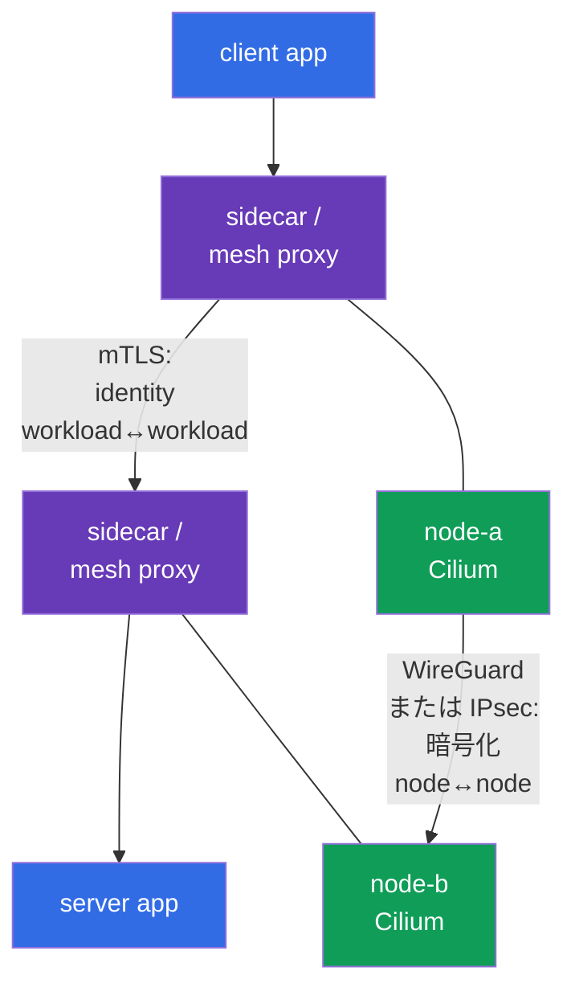
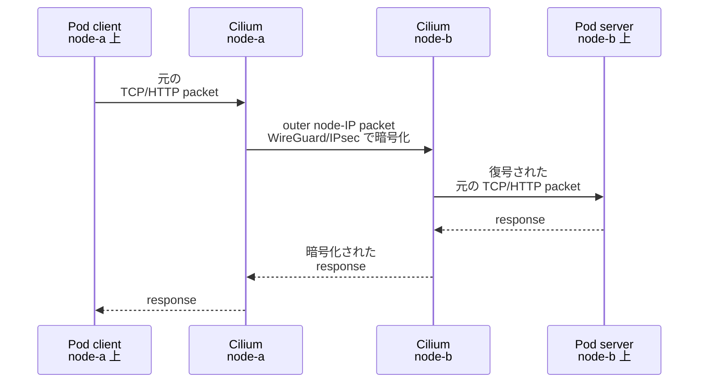
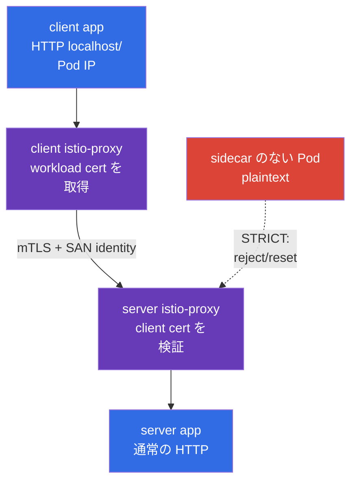

[Русская версия](ru.md) · [Eng version](README.md) · [Versión en español](es.md) · [Version française](fr.md) · [Deutsche Version](de.md) · [ქართული ვერსია](ge.md) · [繁體中文版](tw.md)

# 第23章. Pod-to-Pod 暗号化と mTLS: Cilium、Istio と Linkerd

> **課題。** NetworkPolicy は必要な flow だけを許可できますが、その中の data は node 間の path で傍受や改ざんの対象になり得ます。また、相互 identity 検証のない service は、他の workload からの接続を受け入れてしまう可能性があります。node、network segment、client の compromise は token や payload を暴露するか、信頼された service を装うことを許してしまいます。workload identity のために transport encryption と mTLS を別々に用意する必要があります。

> **この後。** NetworkPolicy は flow を許可または拒否しますが、それ自体ではその flow を機密にはしません。この章では、Pod-to-Pod traffic を保護する二つの異なる layer を構築します。Cilium（WireGuard または IPsec）を通じた node 間の transparent な network 暗号化と、service mesh（Istio または Linkerd）を通じた workload の相互 TLS 認証です。これは CKS の *Minimize Microservice Vulnerabilities* domain（20%）における **Implement Pod-to-Pod encryption (Cilium, Istio)** の competency です。

> **CKA で必要な知識。** Pod-network と CNI の基本モデルは[CKA 第30章](../../../cka/course/30/jp.md)、Service/DNS は[CKA 第31章](../../../cka/course/31/jp.md)、NetworkPolicy は[CKA 第34章](../../../cka/course/34/jp.md)で扱われています。ここでは Pod、Service、node を見つけ、通常の `curl` を確認できることを前提とします。

> 🧠 Cilium WireGuard/IPsec は node-to-node の transport を保護し、mesh mTLS は proxy 間の接続と workload identity を、NetworkPolicy は flow の許可を保護します。

## 23.1. 二つの課題、二つの level: encryption と mTLS

「Pod-to-Pod traffic を暗号化する」という言葉には二つの異なる意味があります。それらは互換可能とは見なせません。

- **Cilium WireGuard/IPsec** は node 間の packet を保護します。application にとって透過的に、node-to-node の transport 部分を暗号化・認証します。container は certificate を受け取らず、Service は変わらず、workload 内部の HTTP は HTTP のままです。
- **Service mesh mTLS** は workload の proxy 間に TLS 接続を作成します。それは node だけでなく、呼び出す workload と server の identity を認証します。Istio と Linkerd は通常、短命な certificate を自ら発行し、sidecar/proxy で traffic を intercept します。
- **NetworkPolicy** は別の問いに答えます。そもそもどの flow が許可されるかです。Cilium encryption も mTLS も、NetworkPolicy の代わりに namespace と Pod selector による allow/deny を提供しません。



node 間の traffic では、これらの mechanism を組み合わせることができます。service mesh は workload の proxy 間の接続を保護し、Cilium の暗号化は node 間の network 部分の packet をさらに保護します。**同一 node 上の Pod-to-Pod traffic は、design 上 Cilium WireGuard と IPsec によって暗号化されません**。node 間の outer packet が存在しないためです。mTLS は依然として mesh 内の workload 間の接続を保護します。逆に、Cilium の暗号化は mTLS を置き換えません。信頼された node 上の compromise された workload は、client の検証可能な identity を得られません。

| 問い | Cilium WireGuard/IPsec | Istio/Linkerd mTLS | NetworkPolicy |
|---|---|---|---|
| どこで作用するか | node 間の path | workload の proxy 間 | Pod の ingress/egress |
| 物理 network で HTTP payload を暗号化するか | はい | はい | いいえ |
| 何を認証するか | 暗号学的な node peers | workload の identity | identity ではなく selector/IP/port |
| Pod に sidecar/proxy が必要か | いいえ | はい（または特定 mesh の ambient/eBPF mode） | いいえ |
| application が certificate を見るか | いいえ | 通常いいえ | いいえ |
| same-node の Pod-to-Pod を保護するか | いいえ: Cilium WireGuard/IPsec は design 上そのような traffic を暗号化しない | はい、両方が mesh 内にある場合 | 制限するが暗号化しない |

> 🎯 変更前に、CNI、versions、firewall、MTU、テスト用 Pod の cross-node placement を記録してください。


ここでの **記録する** とは、configuration を変更することではなく、baseline — 動作している状態のスナップショットを保存することを意味します。それにより rollout 後の結果と比較できます。確認の出力を change/incident のメモや学習用の記録に書き留めてください。どの CNI が既に network を提供しているか、その version、どの Kubernetes/kernel/Cilium の version が関わっているか、firewall が必要な node 間 protocol を許可しているか、path 上でどの MTU が利用可能かです。**Cross-node placement** とは、二つのテスト用 Pod が実際に **異なる** nodes にスケジュールされていることを意味します。これは重要です。そのような flow だけが、WireGuard/IPsec を証明できる node-to-node の outer packet を作り出します。変更後に traffic が動作しなくなった場合、baseline は新しい defect と以前の firewall/MTU/placement の制限を区別する助けになります。
## 23.2. 変更前に: scope、互換性、初期状態

CNI と service mesh の暗号化は、cluster-wide または namespace-wide な変更です。production で盲目的に有効化しないでください。誤った MTU、古い kernel、firewall、legacy client に対する strict な mTLS は traffic を停止させる可能性があります。まず現在の CNI、versions、テスト用 Pod の配置、packet の path を記録してください。

```bash
kubectl get nodes -o wide
kubectl get pods -A -o wide
kubectl -n kube-system get ds cilium
kubectl -n kube-system get pods -l k8s-app=cilium -o wide
kubectl get networkpolicy -A
```

事前に確認してください。

1. Cilium が既に CNI であり、Cilium と kernel の version が公式の compatibility matrix によって選択した mode を support していること。動作中の CNI の上に二つ目の CNI をインストールしないでください。
2. 全ての worker node 間で WireGuard の UDP port（Cilium は default で `51871` を使用しますが、実際の値はインストールされた configuration で確認します）、または Cilium IPsec の場合は ESP（IP protocol 50）が許可されている必要があります。典型的な IKE/NAT-T の UDP/4500 の scenario は、ここで説明する Cilium IPsec の mechanism には関係しません。Security group、firewall、routes は解決策の一部です。
3. 物理 network に MTU の余裕があること。Encapsulation は header を追加します。path-MTU の問題では、小さな `curl` は動作しても大きな response がハングすることがあります。
4. 異なる node に二つのテスト用 Pod があること。そうでなければ tcpdump は node-to-node encryption を証明できません。学習用テストでは `nodeSelector`/`podAntiAffinity` でそれらを割り当てるか、既に分散された workload を見つけてください。
5. rollback の計画と保守 window があること。以前の release を保存せずに Helm values を変更すると、診断が推測に変わります。

以下の command は、既にインストールされている Helm release の実際の parameters を示します。release 名と values はインストール方法に依存します。これらで GitOps の source of truth を置き換えないでください。

```bash
helm -n kube-system list
helm -n kube-system get values cilium --all
kubectl -n kube-system get configmap cilium-config -o yaml
```

> 🎯 Transparent encryption は node 間の部分だけを保護します。backend を選び、その scope を確認してください。

## 23.3. Cilium transparent encryption: model と境界

Cilium は node 上の datapath で traffic を暗号化します。`node-a` の Pod が `node-b` の Pod にデータを送信すると、Cilium は元の packet を encapsulate/暗号化し、node IP 間で outer packet を送信します。`node-b` の Cilium は peer を検証し、復号して元の packet を対象の Pod に届けます。Kubernetes の Service、DNS、application にとってこれは透過的です。URL や port を変更したり、TLS library を追加したりする必要はありません。



**Transparent** は「どこでも、何からでも暗号化される」ことを意味しません。application の interface や namespace の内部では、暗号化の前/復号の後で plaintext が見える可能性があります。また、暗号化は安全でない application を安全にしません。SQL injection を防がず、user の authorization を与えず、compromise された Pod を制限しません。これらの task には application security、mTLS/authorization、RBAC、NetworkPolicy が必要です。

Cilium は二つの一般的な backend を support します。

| 特性 | WireGuard | IPsec |
|---|---|---|
| 暗号学的モデル | 現代的でコンパクトな VPN protocol | IPsec ESP。しばしば organization/network の標準 |
| network 上の transmission | UDP、通常 `51871` | ESP（IP protocol 50） |
| Keys/peer | 各 peer の key pair。public key が許可された node を識別する | Cilium IPsec Secret 内の key material、peers 間の Security Association |
| 認証 | packet は known public key/allowed peer からのみ受け入れられる | ESP integrity + Security Association の keys |
| 運用上の選択 | support される Linux 環境では通常シンプルな選択 | 既存の IPsec/network 標準がこれを要求する場合に必要 |
| tcpdump で確認すること | WireGuard port への UDP、HTTP payload なし | `esp`、HTTP payload なし |

Cilium 1.20 では、**beta** の backend `ztunnel` encryption も文書化されています。これは forward-looking な production extension であり、CKS の main path ではありません。exam の scenario では、WireGuard または IPsec で十分です。

**一つ** の backend を選択します。「二重の保護」として WireGuard と IPsec を同時に有効化することは、正常な Cilium の configuration ではなく、debugging を複雑にするだけです。正確な Helm values と support される組み合わせは、cluster にインストールされた version の documentation で確認してください。古い記事の値は新しい Cilium に合わない場合があります。

> 🎯 version-pinned な values、Cilium agents の rollout、encryption status を確認してください。peer key は node を確認しますが、Pod の identity ではありません。

## 23.4. WireGuard: 有効化、peer key、相互認証

WireGuard は peer ごとに private/public key のペアを使用します。Cilium は key を自動的に管理し、必要な public keys を Kubernetes API を通じて Cilium agents 間に配布します。node は、期待される peer の暗号学的な検証を通過した場合にのみ暗号化された packet を受け入れます。key なしに node IP を偽装するだけでは不十分です。そのため transport level では、これは同時に機密性と **peer node の相互認証** です。

これは workload identity ではありません。同じ node 上の二つの Pod は異なる WireGuard identities を持たず、server は WireGuard key から client の ServiceAccount を知ることはできません。このような相互信頼には service mesh mTLS が必要です。

以下は典型的な Helm configuration を示しています。あなたの version-pinned GitOps、または固定された Helm release を通じて実行してください。事前に特定の Cilium release の values を確認してください。`encryption.nodeEncryption=true` は node-to-node traffic への保護を拡張します。WireGuard の場合、Cilium は default で label `node-role.kubernetes.io/control-plane` を持つ nodes を node-to-node encryption から除外します。これは public key の更新時の bootstrap 問題を防ぎます。control-plane がこの設定によって自動的にカバーされていると考えないでください。control-plane と host traffic への影響を理解した後にのみ有効化してください。

```bash
# 例: repository から既に承認された version と values を代入してください。
helm upgrade cilium cilium/cilium \
  --namespace kube-system \
  --reuse-values \
  --version <pinned-cilium-version> \
  --set encryption.enabled=true \
  --set encryption.type=wireguard

kubectl -n kube-system rollout status daemonset/cilium --timeout=10m
kubectl -n kube-system get pods -l k8s-app=cilium
```

policy が node traffic も暗号化することを要求する場合、これを別の reviewable な変更として設定し、API server/kubelet の availability をテストしてください。

```bash
helm upgrade cilium cilium/cilium \
  --namespace kube-system \
  --reuse-values \
  --version <pinned-cilium-version> \
  --set encryption.enabled=true \
  --set encryption.type=wireguard \
  --set encryption.nodeEncryption=true
```

rollout の後、`kubectl exec ds/cilium` が任意に選ぶ一つの Pod だけでなく、**各 Cilium agent** で状態を確認してください。

```bash
kubectl -n kube-system get pods -l k8s-app=cilium -o wide
kubectl -n kube-system get pods -l k8s-app=cilium -o name |
  while IFS= read -r agent; do
    echo "=== $agent ==="
    kubectl -n kube-system exec "$agent" -- cilium-dbg status --verbose
    kubectl -n kube-system exec "$agent" -- cilium-dbg encrypt status
  done
```

各 node で、healthy な agents と peer/handshake の error のない encryption state が期待されます。Cilium の version によっては、command は WireGuard interface、peers、public keys、counters を表示することがあります。`cilium-dbg` はローカル agent の CLI です。subcommand が存在しない場合、**同じ agent 内で** `cilium-dbg --help` を実行し、インストールされている Cilium の version の documentation を確認してください。この binary は agent と一緒に配布されるためです。管理用マシンから実行する外部の Cilium CLI `cilium` は別の numbering を持ちます。release と同じ version 番号ではなく、support される互換 version とその compatibility table を使用してください。

> 🔬 Strict mode は最初の plaintext packet を防ぎますが、version と routing に固有の互換性を必要とします。

### Strict mode: 最初の plaintext packet を許さない

通常の transparent WireGuard では、異なる node 上の Cilium-managed endpoints 間の Pod-to-Pod traffic について、新しい remote endpoint は agent にすぐには認識されない場合があります。それまでの間、それへの最初の egress packets は tunnel なしで送信される可能性があります。threat model がこれを許さない場合、version の互換性を別途確認した後に strict mode を使用してください。

```yaml
encryption:
  strictMode:
    egress:
      enabled: true
      # this cluster の IPv4 Pod CIDR - 実際の値に置き換えてください。
      cidr: 10.244.0.0/16
    ingress:
      enabled: true
```

`encryption.strictMode.egress` は IPv4 だけを support するため、`cidr` は実際の IPv4 Pod CIDR である必要があります。この mode には direct routing、node CIDR、選択した interfaces についての制限もあります。`encryption.strictMode.ingress` は、WireGuard tunnel を通らずに到着した cluster-internal な Pod traffic を破棄します。これは IPsec 用の universal な strict mode ではありません。有効化する前に、native/direct routing と device configuration に対する Cilium release の要件を確認し、その後 negative test で、node 間の plaintext Pod-to-Pod packet が通らないことを確認してください。strict mode を NetworkPolicy、firewall、control-plane の availability の確認の代わりに有効化しないでください。

> 🏭 compromise された node の場合: isolation、evidence の保存、古い peer を信頼から外すこと。private key は ticket、Git、chat に入りません。

**これが実際に意味すること:** 「compromise された」とは、攻撃者が node 上で command を実行したり、そのデータを読んだりできた可能性があるという根拠があることです。**Isolate する** とは、新しい Pod をそこに割り当てず、approved incident procedure に従って cluster への参加を制限することです。これは拡散を抑えますが、跡を消すわけではありません。**Evidence** とは、調査に必要な metadata と logs（時刻、node name、Cilium の状態と events）であり、private key のコピーではありません。**古い peer を信頼から外す** とは、key の再生成や node の交換後、他の nodes が古い public key で認証された traffic をもはや受け入れないことを確認することです。次の list は、これらの action の安全な順序を示しています。

### WireGuard の key のローテーションとインシデント

Cilium は keys の lifecycle を自動化しますが、security design は依然として、誰が Cilium resources を読み/変更できるか、node の compromise にどう対応するかを記述する必要があります。private key を node から ticket、chat、Git にコピーしないでください。compromise の疑いがある場合。

1. node を isolate してください（DaemonSet と PDB を考慮した `cordon`/`drain`）。evidence を保存してください。
2. 他の nodes で Cilium agent logs、health、peers を確認してください。
3. peer key の削除/再生成、または node の再作成のための、文書化された Cilium version の procedure に従ってください。
4. 新しい node が新しい identity/key を得て、古い peer がもはや traffic を受け入れないことを確認してください。
5. 23.10節の functional と packet-level の確認を繰り返してください。

`kubectl get secret -A` と Secrets を読む広い権限は、IPsec material だけでなく、多くの他の secrets へのアクセスも与えます。RBAC を制限し、`kube-system` への access を audit してください。

> 🔬 IPsec は、key rotation、ESP-diagnostics、互換性のある Cilium CLI、key-overlap window を持つ Cilium の代替 backend です。

## 23.5. IPsec: いつ必要で、key management をどう壊さないか

Cilium の IPsec も透過的な node-to-node encryption を提供しますが、IPsec ESP Security Associations を使用します。これは、企業の要件や既存の network infrastructure が IPsec を要求する場合にしばしば選ばれます。physical interface 上の packet は ESP（IP protocol 50）のように見えます。application の HTTP はその中で読めるべきではありません。UDP/4500 を使う一般的な IKE/NAT-T モデルをここに持ち込まないでください。それはこの Cilium mechanism の一部ではありません。

IPsec を support する Cilium release への典型的な移行は、key の Secret から始まります。agent は `encryption.type=ipsec` を有効化する **前に** `cilium-ipsec-keys` を取得している必要があります。作成は、support される互換 Cilium CLI がインストールされ kubeconfig がある管理用マシンからだけ実行してください。Secret が既に存在する場合、誤って上書きしないでください。まず owner と version-specific な rotation procedure を確認してください。

```bash
kubectl -n kube-system get secret cilium-ipsec-keys >/dev/null 2>&1 || \
  cilium encrypt create-key --auth-algo rfc4106-gcm-aes

# key の存在と metadata だけを確認します。data は確認しません。
kubectl -n kube-system get secret cilium-ipsec-keys \
  -o custom-columns=NAME:.metadata.name,TYPE:.type,CREATED:.metadata.creationTimestamp
kubectl -n kube-system get secret cilium-ipsec-keys \
  -o jsonpath='{.metadata.resourceVersion}{"\n"}'

helm upgrade cilium cilium/cilium \
  --namespace kube-system \
  --reuse-values \
  --version <pinned-cilium-version> \
  --set encryption.enabled=true \
  --set encryption.type=ipsec

kubectl -n kube-system rollout status daemonset/cilium --timeout=10m
kubectl -n kube-system get pods -l k8s-app=cilium -o name |
  while IFS= read -r agent; do
    echo "=== $agent ==="
    kubectl -n kube-system exec "$agent" -- cilium-dbg encrypt status
  done
```

Cilium は IPsec の key material を `kube-system` の Secret `cilium-ipsec-keys` に保存します。それを terminal、CI log、documentation に出力しないでください。data を decode せずに存在と metadata を確認することは許可されています。

rotation には、support される **互換** version の Cilium CLI と version-specific な procedure だけを使用してください。通常の非機密な status は、管理用マシンから `cilium encryption status`、各 node で `cilium-dbg encrypt status` を通じて取得してください。command `cilium encryption key-status` は IPsec の key material を出力します。承認された rotation procedure が明示的に要求する場合にのみ、保護された terminal で、CI、log、ticket、chat への出力なしに実行してください。

```bash
# support される互換 Cilium CLI を持つ管理用マシン。
cilium encryption status
cilium encryption rotate-key
```

複数の clusters や非標準の release の場合、command に必要な `--context`、`--namespace kube-system`、`--helm-release-name` パラメータを追加してください。Cilium Pod の中から rotation を実行しないでください。subcommand の availability は `cilium encryption --help` と CLI の compatibility table で確認してください。`encryption.ipsec.keyWatcher=true`（default）では、agents は DaemonSet の restart なしに Secret の更新を取得します。通常、すべての agents はおよそ一分で更新を適用し、古い key と新しい key は rotation window の間共存します。DaemonSet の restart/rollout は、watcher が無効な場合、またはインストールされている version の documentation が明示的にそれを要求する場合にのみ必要です。

Secret を一つのランダムな文字列で手動で置き換えることはできません。peers の同期のずれは packet loss を引き起こします。change request の実用的な最小限は次のとおりです。

- 新しい key は暗号学的にランダムに生成され、保護された channel で伝達されること。
- key Secret の順序と format は、インストールされている Cilium の documentation から取得すること。
- Secret の `resourceVersion` と `cilium-dbg encrypt status` が、key-overlap window の終了前に **全て** の agents で確認されること。
- loss/errors の測定と、古い key を削除する前の rollback があること。
- rotation の後、application と、必要な node のペアでの physical capture が確認されること。

**IPsec key と mTLS CA を混同しないでください。** IPsec key は transport peers を保護し、mesh の certificate は workload identity を確認します。それらの owner、rotation interval、audit、blast radius は異なる場合があります。

ここで Cilium transport encryption の設定は終わります。Istio が意図的にすぐ後に続きます。これは Cilium の次の parameter でも IPsec の prerequisite でもなく、独立した追加の layer です。cross-node の request では、Cilium は nodes 間の outer packet を保護し、一方 Istio mTLS は proxy が特定の workload の identity を検証することを可能にします。そのため、healthy な Cilium encryption は、Istio の injection、certificate、mTLS policy をまだ証明しません。これらの確認は次の節で別途行います。

> 🎯 Istio mTLS は certificate を workload identity に結び付けます。`PeerAuthentication: STRICT` と `ISTIO_MUTUAL` を持つ `DestinationRule` を区別し、proxy/injection を確認してください。

> 🔬 **Upstream identity primitive。** Kubernetes v1.37 は Pod Certificates と ClusterTrustBundles を stable にしました。それらは Kubernetes level の X.509 primitives を提供しますが、Istio/SPIFFE identity plane を自動的に不要にするわけではありません。signer、trust model、mesh enforcement は別個の architectural な決定です。[Kubernetes v1.37 Security Delta](../APPENDIX_K8S_137_SECURITY_DELTA_JP.md) を参照してください。

## 23.6. Istio: sidecar、SPIFFE workload identity、`PeerAuthentication`


### Cilium の後で Istio が解決する問題

前の節は既に **nodes 間の transport** を保護しました。Cilium WireGuard/IPsec は outer packet を暗号化し、node peer を認証します。しかし、「どの workload が service を呼び出しているのか」という問いに答える必要がある場合、これでは不十分です。Cilium は application や server に client Pod/ServiceAccount の検証可能な identity を与えず、それ自体では server に mTLS だけを受け入れるよう強制しません。さらに、Cilium の node encryption は design 上、同一 node 上の Pod に outer tunnel を作成しません。

Istio は問題の別の部分を解決します。workload の proxy は certificates を取得し、mTLS を確立し、peer の identity を検証します。`PeerAuthentication: STRICT` は plaintext の inbound traffic を禁止できます。組み合わせると、それらは次のように機能します。**Istio は workload-to-workload の connection を保護・認証し、Cilium は信頼できない node 間の部分で packet をさらに保護します**。`NetworkPolicy` は依然として三つ目の layer です。そもそもどの flow が許可されるかを定義します。

| 問い | Cilium WireGuard/IPsec | Istio mTLS |
|---|---|---|
| 主な利点 | application や Service を変更せずに transparent な node-to-node encryption | workload identity、相互認証、plaintext client に対する `STRICT` |
| 解決しないこと | server に client workload の identity を与えない。design 上 same-node flow を暗号化しない | underlay から outer L3/L4 metadata を隠さず、non-mesh flow をカバーしない。NetworkPolicy を代替しない |
| コスト/制限 | 互換性のある CNI/kernel、firewall、MTU が必要。keys は nodes に関連する | control plane、certificates、proxy/ambient dataplane が必要。sidecar mode は container と overhead を追加する |
| 何を証明すべきか | Cilium agent の status と physical NIC 上の outer WireGuard/ESP | Injection/enrollment、proxy/certificate の status、mTLS/`STRICT` のテスト |

これは必須の「二重暗号化」ではありません。**両方の** workload が既に mesh 内にあり、trust が検証され、`PeerAuthentication: STRICT` が実際に適用されている場合、mTLS は既に proxy 間の application payload を暗号化しています。同じ payload を再度暗号化するためだけに Cilium node encryption を有効化する必要はありません。

Cilium は、threat model が node-to-node の underlay の保護を要求する場合に、別個の価値を追加します。inner Pod IP/port や他の L3/L4 metadata を物理 network から隠すこと、mesh 外の敏感な cross-node flow をカバーすること、または node 間の暗号化に関する policy/compliance の要件を満たすことです。両方の layer が必要なのは、**両方** の目的、workload identity/mTLS **と** underlay または non-mesh traffic の保護が当てはまる場合だけです。application が workload identity や mesh-compatible な behavior を要求しない場合、Istio は自動的には有効化されません。まず threat model、互換性、overhead を評価します。
Istio の sidecar（`istio-proxy`、Envoy）は inbound/outbound の workload traffic を intercept します。Istiod は Kubernetes ServiceAccount に基づいて workload certificate を発行します。proxy は mTLS を確立し、peer の identity を検証します。Workload identity は SPIFFE ID の形式を持ちます: `spiffe://<trust-domain>/ns/<namespace>/sa/<service-account>`。application は通常、通常の HTTP port を listen し続けます。TLS は app container ではなく sidecar で終端されるためです。

**ambient mode** では、Istio は各 Pod に個別の sidecar を追加しません。代わりに、各 node で `ztunnel`（**Zero Trust Tunnel**）— 特別な node-level proxy が動作します。それは mTLS と authentication を含む mesh の L3/L4 タスクを実行し、application 自身に TLS を扱わせません。

`HBONE`（**HTTP-Based Overlay Network Environment**）は、mesh のコンポーネント間の保護された Istio tunnel です。それは複数の TCP streams を一つの mTLS connection で運びます。そのため、Pod の containers の list に `istio-proxy` がなくても workload traffic は保護される場合があります。ambient mode で `istio-proxy` が存在しないことは、plaintext client を意味しません。両方のモデルで、`STRICT` を持つ `PeerAuthentication` は plaintext inbound traffic を許しません。ambient mode では、server は保護された HBONE/mTLS の flow を期待します。

以下の `istio-injection=enabled` の確認と `istio-proxy` の存在は **sidecar mode だけ** に関係します。ambient mode の場合、workload の enrollment と `ztunnel` の状態を、インストールされている Istio の version の documentation で確認してください。Pod 内に追加の container を期待しないでください。



### injection を有効化し sidecar を確認する

学習用の namespace では、Pod を作成する前に injection を有効化してください。production では、change process が管理する Istio installation の revision label を使用してください。migration の計画なしに異なる revision を混在させないでください。

```bash
kubectl create namespace mesh-demo
kubectl label namespace mesh-demo istio-injection=enabled

kubectl -n mesh-demo apply -f server.yaml
kubectl -n mesh-demo apply -f client.yaml
kubectl -n mesh-demo get pods
kubectl -n mesh-demo get pod -l app=server \
  -o jsonpath='{range .items[*]}{.metadata.name}{": "}{.spec.containers[*].name}{"\n"}{end}'
```

container の list には `server` と共に `istio-proxy` が存在する必要があります。sidecar の欠如は表面的な欠陥ではありません。plaintext client は mTLS client にはならず、`STRICT` は当然それを拒否します。既存の Deployment の場合、label の後に controlled な rollout を行ってください。

```bash
kubectl -n mesh-demo rollout restart deployment/server
kubectl -n mesh-demo rollout status deployment/server
kubectl -n mesh-demo get pod -l app=server \
  -o jsonpath='{range .items[*]}{.metadata.name}{": "}{.spec.containers[*].name}{"\n"}{end}'
```

### `PeerAuthentication`: server が mTLS を要求する

`PeerAuthentication` は inbound mTLS policy を定義します。`STRICT` は、server 側の proxy が、信頼された certificate を提示できる peer からの mTLS traffic だけを受け入れることを意味します。sidecar のない workload からの plaintext TCP は、許容される fallback ではありません。

次の resource は namespace `mesh-demo` 全体に作用します。ここでは namespace selector は不要です。namespace は `metadata.namespace` で指定されています。

```yaml
apiVersion: security.istio.io/v1
kind: PeerAuthentication
metadata:
  name: default
  namespace: mesh-demo
spec:
  mtls:
    mode: STRICT
```

policy を一つの server workload に絞ることもできます。このような selector は Service 名ではなく Pod の label と一致します。実際の labels は `kubectl get pod --show-labels` で確認してください。

```yaml
apiVersion: security.istio.io/v1
kind: PeerAuthentication
metadata:
  name: server-strict
  namespace: mesh-demo
spec:
  selector:
    matchLabels:
      app: server
  mtls:
    mode: STRICT
```

precedence を理解せずに、namespace-wide の `STRICT` と、矛盾する `PERMISSIVE` を持つ workload policy を同時に適用しないでください。良い migration は通常次のように見えます。

```text
inventory clients -> clients を inject/修正 -> PERMISSIVE measurement（必要な場合） ->
mTLS を検証 -> STRICT narrow scope -> STRICT namespace -> 一時的な例外を削除
```

`PERMISSIVE` は一時的な互換性としてのみ有用です。proxy は mTLS と plaintext の両方を受け入れるため、成功した `curl` はまだ mTLS を証明しません。通常の TCP workload に対する `DISABLE` は、最小化し、owner と期限で文書化する必要がある例外を作ります。

### `DestinationRule`: client は TLS を無効化してはいけない

Istio の auto mTLS は TLS を自動的に選択できますが、明示的な `DestinationRule` は、学習用の環境や organization の policy が明示的な configuration を要求する場合の、確認可能な client-side の意図として有用です。`PeerAuthentication` は inbound の server を保護し、`DestinationRule` は outbound の client traffic に対して TLS を設定します。これは接続の異なる側です。

```yaml
apiVersion: networking.istio.io/v1
kind: DestinationRule
metadata:
  name: server-mtls
  namespace: mesh-demo
spec:
  host: server.mesh-demo.svc.cluster.local
  trafficPolicy:
    tls:
      mode: ISTIO_MUTUAL
```

`ISTIO_MUTUAL` は、Envoy が Istio によって管理される certificates と trust bundle を使用することを意味します。それを `SIMPLE` に置き換えないでください。`SIMPLE` は workload client certificate のない通常の TLS client を作成し、mTLS を満たしません。`DISABLE` は plaintext を送り、server が `STRICT` の場合は拒否される必要があります。external service には通常、別の `ServiceEntry`/TLS settings が必要です。この例を `*.svc.cluster.local` 全体に対する global な規則として使わないでください。

適用された objects と実際の proxy configuration を確認してください。

```bash
kubectl -n mesh-demo get peerauthentication,destinationrule
istioctl proxy-status
istioctl proxy-config cluster deploy/client -n mesh-demo | grep server.mesh-demo
istioctl analyze -n mesh-demo
```

`istioctl analyze` と `proxy-config` は Istio の version に依存しますが、有用な考え方は一定です。Git 内の YAML だけでなく、proxy の runtime configuration を見ることです。CR の作成が成功したことは、selector/host が必要な endpoint と一致したことを保証しません。

> 🎯 `STRICT`: meshed client は `200` を得ますが、sidecar のない client は plaintext での成功を得ません。

## 23.7. controlled な Istio の実験: mesh 内部では 200、外部では reset

次の環境は `STRICT` の主要な境界を証明します。meshed client は HTTP `200` を得ますが、sidecar のない client は plaintext request を行い、server へのアクセスではなく TCP reset/TLS error を得ます。専用の namespace でのみ実行してください。`STRICT` は意図的に legacy な plaintext calls を壊します。

まず、injection を持つ namespace と server/client workloads を作成してください。client は namespace label から sidecar を得ます。以下の `legacy-client` は injection のない別の namespace で実行されます。

```yaml
apiVersion: v1
kind: Namespace
metadata:
  name: mesh-demo
  labels:
    istio-injection: enabled
---
apiVersion: v1
kind: Service
metadata:
  name: server
  namespace: mesh-demo
spec:
  selector:
    app: server
  ports:
  - name: http
    port: 8080
    targetPort: 8080
---
apiVersion: apps/v1
kind: Deployment
metadata:
  name: server
  namespace: mesh-demo
spec:
  replicas: 1
  selector:
    matchLabels:
      app: server
  template:
    metadata:
      labels:
        app: server
    spec:
      containers:
      - name: server
        image: hashicorp/http-echo:1.0
        args: ["-listen=:8080", "-text=server-ok"]
        ports:
        - containerPort: 8080
---
apiVersion: apps/v1
kind: Deployment
metadata:
  name: client
  namespace: mesh-demo
spec:
  replicas: 1
  selector:
    matchLabels:
      app: client
  template:
    metadata:
      labels:
        app: client
    spec:
      containers:
      - name: client
        image: curlimages/curl:8.12.1
        command: ["sleep", "infinity"]
---
apiVersion: security.istio.io/v1
kind: PeerAuthentication
metadata:
  name: default
  namespace: mesh-demo
spec:
  mtls:
    mode: STRICT
---
apiVersion: networking.istio.io/v1
kind: DestinationRule
metadata:
  name: server-mtls
  namespace: mesh-demo
spec:
  host: server.mesh-demo.svc.cluster.local
  trafficPolicy:
    tls:
      mode: ISTIO_MUTUAL
```

```bash
kubectl apply -f istio-strict-demo.yaml
kubectl -n mesh-demo rollout status deployment/server
kubectl -n mesh-demo rollout status deployment/client
kubectl -n mesh-demo get pods -o wide

CLIENT=$(kubectl -n mesh-demo get pod -l app=client -o jsonpath='{.items[0].metadata.name}')
kubectl -n mesh-demo exec "$CLIENT" -c client -- \
  curl -sS -o /dev/null -w '%{http_code}\n' http://server.mesh-demo.svc.cluster.local:8080
# 期待される結果: 200
```

次に injection のない client を作成してください。namespace `legacy-demo` が injection 用に label 付けされていない場合、Pod に label `istio-injection=disabled` は不要です。明示的な annotation は review の際に意図を可視化します。

```yaml
apiVersion: v1
kind: Namespace
metadata:
  name: legacy-demo
---
apiVersion: v1
kind: Pod
metadata:
  name: outside-client
  namespace: legacy-demo
  annotations:
    sidecar.istio.io/inject: "false"
spec:
  containers:
  - name: client
    image: curlimages/curl:8.12.1
    command: ["sleep", "infinity"]
```

```bash
kubectl apply -f outside-client.yaml
kubectl -n legacy-demo wait --for=condition=Ready pod/outside-client --timeout=120s
kubectl -n legacy-demo get pod outside-client \
  -o jsonpath='{.spec.containers[*].name}{"\n"}'
# 期待される結果: client のみ、istio-proxy はなし

kubectl -n legacy-demo exec outside-client -- \
  curl --connect-timeout 5 --max-time 10 -v http://server.mesh-demo.svc.cluster.local:8080
# 期待される結果: non-zero。通常は "Recv failure: Connection reset by peer"。
```

具体的な error text は、Envoy の version、protocol、intercept のポイントに依存します。`connection reset`、TLS handshake error、timeout の可能性があります。security の基準は error の文字列ではなく、plaintext での成功がないことです。command が HTTP `200` を返さず、server proxy が認証されていない flow を受け入れないことです。厳密な自動確認のためには、両方の sign を記録してください。

```bash
set +e
OUT=$(kubectl -n legacy-demo exec outside-client -- \
  curl -sS --connect-timeout 5 --max-time 10 -o /dev/null -w '%{http_code}' \
  http://server.mesh-demo.svc.cluster.local:8080 2>&1)
RC=$?
set -e
printf 'exit=%s output=%s\n' "$RC" "$OUT"
test "$RC" -ne 0 || test "$OUT" != 200
```

**mesh 内部で 200 が得られない場合**、`istio-proxy` の存在、DNS/Service の endpoints、`PeerAuthentication`、`DestinationRule`、proxy の status、NetworkPolicy を確認してください。**外部で 200 が得られる場合**、まず `STRICT` が server Pod に適用され、`outside-client` が実際に sidecar を持たないことを確認してください。その後、test を上書きしたより specific な `PeerAuthentication` policy を探してください。

> 🔬 Linkerd は独自の identity model と policy API を持ちます。同一 Pod で Istio sidecar と一緒に使用しないでください。

## 23.8. Linkerd: mTLS の production バリアントと ServiceAccount identity

Linkerd は workload mTLS のための完全な production バリアントの service mesh ですが、これは追加の material です。Pod-to-Pod encryption に関する主要な CKS competencies では、Cilium と Istio が明示的に名前を挙げられており、Linkerd ではありません。Linkerd は独自の軽量な proxy と identity model を使用します。injection の後、Pod は `linkerd-proxy` を得ます。Linkerd workload 間の meshed traffic は自動的に暗号化され mTLS で認証されます。Identity は通常 Kubernetes ServiceAccount に結び付けられ、DNS のような形式を持ちます。

```text
<serviceaccount>.<namespace>.serviceaccount.identity.linkerd.cluster.local
```

「強化」のために Istio と Linkerd の sidecar を同じ workload に置かないでください。両方が traffic を intercept し、certificates を発行し、policy を管理しようとします。結果は iptables/ports の衝突、不確定な observability、複雑な incident response です。namespace に一つの mesh を選ぶか、文書化された migration を行ってください。

Linkerd をインストールする前に、cluster の prerequisites、互換性のある Gateway API CRDs の存在を確認し、pinned release を使用してください。現代の Linkerd は Gateway API CRDs を必要とします。それらがない場合、まず公式の instruction に従ってあなたの release と互換性のある version をインストールしてください。

```bash
kubectl get crd gateways.gateway.networking.k8s.io
# CRD が存在しない場合、linkerd install の前に互換性のある Gateway API CRD release をインストールしてください。
linkerd check --pre
linkerd install --crds | kubectl apply -f -
linkerd install | kubectl apply -f -
linkerd check

# Viz は個別の extension です。viz commands の前にインストールしてください。
linkerd viz install | kubectl apply -f -
linkerd viz check
```

production では、installation manifest は floating な `latest` からではなく、固定された CLI/chart の version から CI で生成され確認される必要があります。health check の後、test namespace だけで injection を有効化し、workload を再起動してください。

```bash
kubectl create namespace linkerd-demo
kubectl annotate namespace linkerd-demo linkerd.io/inject=enabled
kubectl -n linkerd-demo apply -f server.yaml
kubectl -n linkerd-demo apply -f client.yaml
kubectl -n linkerd-demo rollout status deployment/server
kubectl -n linkerd-demo get pod -l app=server \
  -o jsonpath='{.items[0].spec.containers[*].name}{"\n"}'
linkerd -n linkerd-demo check --proxy
linkerd -n linkerd-demo viz stat deploy
```

Istio と同様に、annotation の存在だけでなく、実際の proxy container、identity/certificate の status、meshed Pod 間の成功した request も確認してください。automatic mTLS と strict inbound を区別することが重要です。Linkerd は meshed workload 間で自動的に mTLS を使用しますが、inbound authorization がなければ default で non-meshed source からの plaintext を受け入れます（`all-unauthenticated`）。automatic mTLS が存在すること自体は、server が mTLS だけを受け入れることを意味しません。

最小限の strict inbound policy のためには、学習用の namespace で workload を作成する前に `all-authenticated` を設定してください。

```yaml
apiVersion: v1
kind: Namespace
metadata:
  name: linkerd-demo
  annotations:
    linkerd.io/inject: enabled
    config.linkerd.io/default-inbound-policy: all-authenticated
```

適用後、Linkerd injection のない namespace で non-meshed client を作成し、その plaintext `curl` が Service に対して HTTP `200` を返さないことを確認してください。許可された identity を持つ meshed client は動作可能なままである必要があります。より狭い規則には、release の policy API、例えば `MeshTLSAuthentication` と共に `AuthorizationPolicy` を使用してください。Linkerd の policy API と unauthorized traffic の挙動は version 間で変化しました。default-deny を構築する前に、インストールされている release の CRD と policy mode を確認してください。mTLS は identity を確認し channel を保護しますが、必ずしも「すべての identity がすべての endpoint を呼び出せる」ことを意味しません。authorization は別途設定する必要があります。

> 🔬 Capture は、termination 前の inner plaintext/TLS と、physical NIC 上の outer encrypted packet を見ます。

## 23.9. WireGuard/IPsec と mesh を組み合わせる: どこで plaintext が見えるか

「`curl` が動作する」という確認は encryption を証明しません。`curl` は availability と application response を確認しますが、plaintext HTTP と暗号化された traffic を区別しません。同様に、`any` に対する tcpdump は、virtual interface 上の inner plaintext packet と physical NIC 上の outer encrypted packet を同時に見ることがあります。証明のためには、まず各 layer が *どこで* 見えるべきかを定式化してください。

| Capture の地点 | Cilium encryption のみの場合 | Cilium + Istio/Linkerd の場合 |
|---|---|---|
| app container / proxy への loopback | しばしば plaintext HTTP | app↔local proxy は plaintext の可能性がある |
| node encryption 前の veth/CNI | 元の inner flow が読み取り可能な場合がある | mesh proxy 間の mTLS ciphertext |
| node-a/node-b の physical NIC | WireGuard UDP または IPsec ESP、HTTP なし | outer WireGuard/IPsec。HTTP と TLS payload は読み取れない |
| proxy の後の server app | proxy が既に復号しているため plaintext | local proxy から app への plaintext |

これは termination points の正常な architecture です。Cilium の目的は、信頼できない physical network path から読み取り可能な payload を取り除くことです。mesh の目的は、workload-to-workload の segment を TLS で保護し、それを identity に結び付けることです。「tcpdump はどこでも HTTP を示さない」と主張しないでください。攻撃者がその node で root を持っている場合、node と Pod では、encryption の前後に HTTP が見える可能性があります。

> 🎯 cross-node placement、specific な physical NIC、再現可能な flow の時刻、Cilium status を確認してください。

## 23.10. `tcpdump` による確認: outer encrypted traffic を証明する

packet-level の証明には、**異なる** nodes 上の Pod、両方の node の node IP、cluster network につながる physical interface が必要です。自動的に `eth0` を使用しないでください。クラウドの node では、interface は `ens5`、`ens192`、または他の名前かもしれません。

```bash
NODE_B_IP="${NODE_B_IP:?set the second node IP}"
kubectl get pods -A -o wide
kubectl get nodes -o wide
# 選択した node で:
ip -br link
ip route get "${NODE_B_IP}"
```

最初の node で、まさに physical interface に対して capture を実行してください。以下の commands は SSH/approved node access を前提としています。便宜のためだけに production に privileged debug Pod を追加しないでください。break-glass access が許可されている場合、`kubectl debug node/<node>` も host-level の診断を提供しますが、そのような access という事実自体が auditable である必要があります。

### WireGuard capture

```bash
# node-a で。ens5 と node-b の IP を置き換えてください。
sudo tcpdump -ni ens5 -vv 'udp port 51871 and host <NODE_B_IP>'
```

別の terminal で、再現可能な cross-node flow を作成してください。`kubectl get pod -o wide` によって `node-a` にある client Pod から、`node-b` の server Pod/Service へ複数の request を実行すると便利です。

```bash
for i in $(seq 1 20); do
  kubectl -n mesh-demo exec "$CLIENT" -c client -- \
    curl -sS http://server.mesh-demo.svc.cluster.local:8080 >/dev/null || exit 1
done
```

WireGuard port 上での node-a ↔ node-b の一連の UDP datagram が期待されます。`-vv` は protocol headers の解析の詳細度を上げますが、payload の ASCII を出力しないため、そのような出力に `GET /`、`Host:`、`server-ok` がないことは何も証明しません。port 上に UDP が存在することも、それがまさに必要な Pod flow であることをまだ証明しません。capture の時刻、node pair、Cilium encryption の counters/status の増加を照合してください。

disposable lab で payload をまさに比較する必要がある場合、`-A` または `-X` と十分な snaplen を使って、期待される inner のポイントで、制御された非機密の flow の短い capture を行ってください。payload capture を敏感な production traffic に適用しないでください。

### IPsec capture

Cilium IPsec の場合、capture は ESP、つまり IP protocol 50 をフィルタします。

```bash
# node-a で: Cilium IPsec ESP。
sudo tcpdump -ni ens5 -vv 'host <NODE_B_IP> and esp'
```

再び再現可能な application flow を実行してください。ESP packets が期待されます。`tcpdump -vv` に HTTP の文字列がないことを証明として使わないでください。この mode は payload を表示しません。capture の後、結果を **node-a と node-b の両方の** agent と照合してください。

```bash
for node in "${NODE_A:?set first node name}" "${NODE_B:?set second node name}"; do
  agent=$(kubectl -n kube-system get pods -l k8s-app=cilium \
    --field-selector "spec.nodeName=$node" \
    -o jsonpath='{.items[0].metadata.name}')
  test -n "$agent" || { echo "ERROR: no Cilium agent on $node" >&2; exit 1; }
  echo "=== node=$node agent=$agent ==="
  kubectl -n kube-system exec "$agent" -- cilium-dbg encrypt status
done
```

結果のない `grep` は security の証明ではありません。多くの正常な agents は各 packet を log しません。強力な evidence は、四つの一致する事実です。cross-node placement、intended flow に対する `200`、healthy な encryption status/counters、physical NIC 上の encrypted outer protocol です。payload comparison には、production traffic ではなく、`-A`/`-X` を使った制限された lab capture だけを使用してください。

### negative test とよくある落とし穴

- **`-i any` での capture が HTTP を表示する。** これは encryption 前の inner packet、local delivery、または同じ node 上の Pod 間の traffic である可能性があります。physical NIC で繰り返し、placement を確認してください。
- **UDP/51871 がないのに curl が動作する。** 同一 node 上の Pod、別の Cilium port、encryption が無効、または別の transport が使用されている可能性があります。まず values と `cilium-dbg encrypt status` を確認し、その後 routes/interface を確認してください。
- **ESP/UDP はあるが、capture が test と一致しない。** node で別の encrypted traffic が動いています。BPF filter を node IP のペアに制限し、短い時間 window で request を繰り返してください。
- **`tcpdump` が HTTP ではなく TLS を見せる。** これは inner path 上の mesh にとって想定されることですが、Cilium を証明しません。physical NIC では、両方の layer が有効な場合、outer WireGuard/IPsec が期待されます。
- **大きな response がハングし、小さいものは動作する。** MTU/MSS を疑ってください。「修正」として encryption を無効化しないでください。path MTU を測定し、platform の procedure に従って CNI/underlay を設定してください。

> 🎯 Cilium/underlay → DNS/Service → mesh identity/policy → NetworkPolicy の順に診断してください。`STRICT` や encryption の bypass を残さないでください。

## 23.11. 診断: まず failure の layer を特定する

一つの症状 `connection reset` は複数の level で発生する可能性があります。`STRICT` や encryption の一時的な無効化を永続的な bypass に変えることなく、下から上に向かって診断してください。

| Symptom | 考えられる layer | 最初の確認 | 安全な修正 |
|---|---|---|---|
| rollout 後、異なる node の Pod が traffic を交換しない | Cilium/underlay | `cilium-dbg encrypt status`、agent logs、UDP/ESP firewall、MTU | rollback plan に従って互換性のある values/network を復元する |
| DNS Service が解決しない | CoreDNS/Service。mTLS ではない | `nslookup`、Endpoints、CKA 第31章 | TLS の分析の前に DNS/Service を修正する |
| Meshed client が 200 を得ない | Istio/Linkerd または NetworkPolicy | sidecar/proxy、cert/identity、endpoints、policy | injection/identity/rule を修正する。global な `DISABLE` を設定しない |
| Outside client が reset を得る | Istio `STRICT` | sidecar の欠如、effective な PeerAuthentication | これは期待される証拠です。client を mesh に移行する |
| `STRICT` で outside client が 200 を得る | policy が server に適用されていない | selector、namespace、Pod labels、より specific な policy | policy を絞り込み/修正し negative test を繰り返す |
| IPsec rotation 後の intermittent loss | key rollout | Secret version、agents、peer encryption state | Cilium version の overlap/rollback procedure に従う |
| Linkerd proxy が Ready でない | mesh install/identity | `linkerd check`、proxy logs、clock/DNS | trust/identity の prerequisites を修正する。mTLS を無効化しない |

incident evidence 用の有用な最小限の command 集です。

```bash
kubectl -n mesh-demo get pod,svc,endpointslice -o wide
kubectl -n mesh-demo get peerauthentication,destinationrule -o yaml
kubectl -n kube-system get pods -l k8s-app=cilium -o wide
kubectl -n kube-system get pods -l k8s-app=cilium -o name |
  while IFS= read -r agent; do
    echo "=== $agent ==="
    kubectl -n kube-system exec "$agent" -- cilium-dbg encrypt status
  done
istioctl proxy-status 2>/dev/null || true
linkerd check 2>/dev/null || true
```

`Secret` を `-o yaml` で、private key、bearer token、または完全な packet capture を共有の incident channel に出力しないでください。Capture には metadata、URL、cookie、内部ポイントでの plaintext が含まれる可能性があります。最小限必要な evidence だけを、保存期限のある承認された storage に保存してください。

> 🏭 flows の inventory、canary namespace/nodes、互換性の期間、narrow な例外、upgrade、firewall change、CA/key rotation の後の runtime evidence。

## 23.12. 安全な rollout と運用ルール

Encryption は一度きりのインストール command ではありません。それには owners、updates、rotation、alerting、そして Kubernetes/Cilium/mesh の upgrade 後も期待される policy が依然として動作していることの証明があります。

1. **Inventory。** sidecar のない workload、external clients、hostNetwork Pod、stateful protocol、critical な control-plane paths を見つけてください。mTLS には、namespace の list だけでなく、callers と servers の graph を作成してください。
2. **Canary namespace/nodes。** 専用の namespace と小さな node pool から始めてください。Istio では、まず meshed `200` と plaintext reset を証明します。Cilium では cross-node の encrypted outer packet です。
3. **Enforce の前に observe。** latency、connection errors、packet drops、proxy certificate の expiry、Cilium の health を収集してください。`PERMISSIVE` は、削除日付を持つ測定可能な migration の段階としてのみ許容されます。
4. **例外を絞る。** `PeerAuthentication` selector、専用の namespace、または文書化された legacy port は、global な `DISABLE` より優れています。例外には owner、理由、expiry、negative test があります。
5. **変更後に確認する。** 新しい node、Cilium の upgrade、mesh CA rotation、firewall の変更は、status、functional flow、capture を繰り返す必要があります。Git に YAML があることは runtime evidence を代替しません。
6. **failure を計画する。** CA/identity の control plane が利用できない場合、certificates は最終的に期限切れになります。Cilium agent が key を取得できない場合、cross-node flow は degrade します。expiry/rollout outage の前に alert を設定し、rollback を文書化してください。

production のための良い layered policy は次のようになります。NetworkPolicy は必要な service flow だけを許可します。mesh の `STRICT` は認証された mTLS peer を要求します。Cilium は cross-node の underlay を暗号化します。application は user/request を authorize します。各 layer は他の layer の失敗の影響を減らしますが、どれも updates と monitoring を免除しません。

## 23.13. ミニ glossary

- **Transparent encryption** - application、Service、URL を変更せずに datapath を暗号化すること。Cilium はこれを nodes 上で適用する。
- **WireGuard** - peers の key pair を持つ VPN protocol。public key が許可された peer を決定する。
- **IPsec ESP** - Security Associations 間で機密性と integrity を持つ IP-level の protected payload。
- **Node encryption** - nodes 間の traffic の保護。workload identity と同一ではない。
- **mTLS** - client と server の両方が certificate を提示する TLS。
- **Workload identity** - 暗号学的に検証可能な workload の identity。通常 mesh 内の ServiceAccount/namespace に結び付けられる。
- **Sidecar** - application の隣にあり traffic を intercept する proxy container。
- **`PeerAuthentication`** - inbound mTLS の Istio policy。`STRICT` は plaintext を拒否する。
- **`DestinationRule`** - outbound traffic の Istio policy。`ISTIO_MUTUAL` は Istio が管理する certificates を使用する。
- **Linkerd identity** - 通常 ServiceAccount から構築される Linkerd の mTLS identity。
- **Outer packet** - physical network 上で node IP 間の encrypted packet。
- **Inner packet** - encryption 前または decryption 後に見える、元の Pod-to-Pod flow。

## 23.14. 章のまとめ

- Cilium WireGuard/IPsec と mesh mTLS は異なる課題を解決します。前者は node-to-node の transport を保護し、後者は workload-to-workload の encryption と mutual authentication を提供します。
- WireGuard の peer keys、または IPsec の Security Associations は trusted node を確認しますが、application の server に特定の client Pod/ServiceAccount の identity を与えません。
- Cilium では一つの backend を選び、firewall/MTU、agents、status を確認してください。keys は logs に出力せず、IPsec の rotation は version の procedure に従って key の重複期間を持って行います。
- Istio の `PeerAuthentication: STRICT` は server inbound で mTLS を要求し、injection は `istio-proxy` を追加し、`ISTIO_MUTUAL` を持つ `DestinationRule` は client side を明示的に設定します。
- Linkerd は mesh 内の workload に自動的に mTLS を提供し、identity を ServiceAccount に結び付けます。同一 Pod でその sidecar を Istio と混在させないでください。
- 説得力のある証拠には、meshed `200`、plaintext outside の reset/failure、`cilium-dbg encrypt status`、HTTP payload のない physical NIC 上の tcpdump outer WireGuard/IPsec が含まれます。

> 🏭 key material への RBAC、version-pinned な changes、MTU/firewall design、rotation/rollback runbook、runtime evidence。

## 23.15. これは production でどのように適用されるか

production では、Cilium encryption と mesh mTLS は、flows の inventory、canary namespace、MTU と firewall の control、RBAC 権限による key material の保護、確認可能な rotation/rollback runbook を通じて導入されます。観察可能な証拠 — `cilium-dbg encrypt status`、policy events、成功した mTLS requests — は、scope を拡大する前に収集されます。

## 23.16. これが役立つ場面: 試験と実務

**CKS 試験では。** CNI encryption と mTLS を区別し、Cilium encryption の status と cross-node failure の原因を見つけ、`PeerAuthentication`/`DestinationRule` を読み、plain client が `STRICT` を通過しないことを証明できる必要があります。NetworkPolicy が packet を暗号化すると主張しないでください。これは典型的な落とし穴です。container list、Service endpoints、node placement、effective policy を素早く確認し、その後最小限の安全な変更を行ってください。

**実務では。** 最も価値のある結果は、有効化された flag ではなく、確認可能な trust boundary です。固定された Cilium/mesh release、key material への制限された RBAC、rotation runbook、rollback、MTU/firewall design、legacy clients の migration、各変更後の観察可能な evidence です。mTLS は authorization のための identity を提供し、node encryption は application protocol が変更されていなくても underlay を保護します。

## 23.17. Self-check question

<details>
<summary>1. Cilium WireGuard/IPsec が workload 間の mTLS を代替しないのはなぜですか？</summary>

Cilium WireGuard/IPsec は node 間の transport 部分を暗号化・認証しますが、server に特定の client Pod や ServiceAccount の identity を与えません。Service mesh mTLS は workload の proxy 間の接続を保護し、workload identity を検証します。さらに、Cilium の node encryption は design 上、同一 node 上の Pod-to-Pod traffic を暗号化しませんが、mTLS はできます。
</details>

<details>
<summary>2. WireGuard peer は正確に何を認証し、なぜそれは ServiceAccount の identity ではないのですか？</summary>

WireGuard は known な public key/allowed peer の暗号学的な検証の後にのみ packet を受け入れるため、trusted node を確認します。Cilium は peers の key pair を管理し、必要な public keys を Kubernetes API を通じて配布します。同じ node 上の二つの Pod は別々の WireGuard identities を持たず、server は peer key から client の ServiceAccount を知ることはできません。
</details>

<details>
<summary>3. node 間で許可する必要がある firewall protocols は何ですか。Cilium WireGuard 用の UDP/51871 と、Cilium IPsec 用の ESP（IP protocol 50）ですか？</summary>

worker nodes 間の WireGuard の場合、Cilium の UDP port（default `51871`）を許可しますが、実際の値はインストールされている configuration で確認します。Cilium IPsec の場合、ESP — IP protocol 50 — を許可します。典型的な IKE/NAT-T の UDP/4500 は、ここで説明する Cilium IPsec の mechanism には関係しません。
</details>

<details>
<summary>4. key-overlap rollout なしに IPsec の Secret を手動で置き換えることが危険なのはなぜですか？</summary>

peers が異なる keys を持つことになり、packet loss と cross-node の connectivity の喪失を引き起こす可能性があります。互換性のある version-specific な rotation procedure は、agents に一時的に old key と new key の両方を受け入れさせます。key watcher が有効な場合、新しい Secret は必須の DaemonSet rollout なしに配布されます。key-overlap window の終了まで、すべての nodes で Secret の `resourceVersion` と `cilium-dbg encrypt status` を確認します。Secret `cilium-ipsec-keys` は出力せず、一つのランダムな文字列で置き換えません。
</details>

<details>
<summary>5. Istio の `PeerAuthentication: STRICT` と `ISTIO_MUTUAL` を持つ `DestinationRule` の違いは何ですか？</summary>

`PeerAuthentication: STRICT` は server-side の inbound policy です。proxy は mTLS だけを受け入れ、plaintext を拒否します。`ISTIO_MUTUAL` を持つ `DestinationRule` は client-side の意図です。Envoy は outbound 接続のために Istio の certificates と trust bundle を使用します。これは一つの接続の二つの側です。`SIMPLE` は workload client certificate を提示せず、`DISABLE` は plaintext を送信します。
</details>

<details>
<summary>6. コード 200 の meshed `curl` が、plaintext client がブロックされていることを証明しないのはなぜですか？</summary>

コード 200 は meshed client の動作可能性だけを証明し、fallback policy や誤った `STRICT` の scope を排除しません。injection のない namespace からの sidecar のない別の client と、request が HTTP 200 を返さないことの確認が必要です。また、`PeerAuthentication` が実際に server Pod と一致していること、outside client が実際に `istio-proxy` を含まないことも確認します。
</details>

<details>
<summary>7. Cilium encryption が有効な場合でも、`any` に対する tcpdump が HTTP を示すことがあるのはなぜですか？</summary>

`-i any` は、node encryption 前の inner packet、local delivery、または outer packet が存在しない same-node flow を capture する可能性があります。Cilium は信頼できない physical な node-to-node path を保護し、plaintext は encryption の前と decryption の後では許容されます。証明は、確認された cross-node placement で、具体的な physical NIC 上で行います。
</details>

<details>
<summary>8. physical NIC 上の capture が必要な cross-node flow に関係することをどのように証明しますか？</summary>

まず client と server の Pod が異なる nodes に配置されていることを記録し、`ip route get` を通じて node IP と実際の physical interface を特定します。その後、tcpdump を node IP のペアと WireGuard UDP/ESP に限定し、短い一連の再現可能な request を作成し、capture の時刻を照合します。成功した intended flow と Cilium の encryption status の増加/health で evidence を補完します。
</details>

<details>
<summary>9. 同一 workload で Istio と Linkerd の sidecar を実行できないのはなぜですか？</summary>

両方の mesh が traffic を intercept し、certificates を発行し、policy を管理しようとします。sidecar の共同 injection は iptables/ports の衝突、不確定な observability、複雑な incident response を作り出します。namespace には一つの mesh を選ぶか、文書化された migration を行います。
</details>

<details>
<summary>10. node encryption のための最小限の runtime evidence を構成する四つの事実は何ですか？</summary>

テスト用 Pod の cross-node placement、intended flow に対する HTTP `200`、healthy な `cilium-dbg encrypt status`/counters、HTTP payload のない physical NIC 上の outer WireGuard UDP または IPsec ESP が必要です。`curl` だけ、Cilium の DaemonSet だけ、または logs に行がないことだけでは十分な証明にはなりません。すべての事実は同じ時刻と同じ node のペアに関係している必要があります。
</details>

<details>
<summary>11. **Flashback（第06章）。** 第06章の Cilium は `NetworkPolicy`（identity、L3/L4/L7 による allow/deny）を実装します。この同じ章は Cilium を transparent encryption（WireGuard/IPsec）に使用します。これは異なる名前を持つ同じ課題ですか、それとも一つの CNI の二つの独立した機能ですか？`NetworkPolicy` は、transparent encryption によって暗号化されない traffic を許可できますか。またその逆はどうですか？</summary>

これは一つの CNI の二つの独立した機能です。NetworkPolicy は、どの ingress/egress flow が許可されるかを決定し、WireGuard/IPsec は node-to-node の transport を保護します。policy は、transparent encryption が暗号化しない same-node flow を許可できます。また、encryption が無効な cross-node flow も許可できます。逆に、encryption は underlay 上の packet を保護できますが、allow/deny policy を代替せず、flow を許可されたものにするわけでもありません。
</details>

## Practice

主な practice は **CKS Lab 110: gVisor、Cilium と Istio** です。そこで CNI/mesh の安全な変更を練習し、mesh 内の workload からの service flow を確認し、`check_result` の結果を記録してください。
[ tasks/cks/labs/110 ](../../labs/110/README_JP.MD)。

lab の前に、CKA の基礎を復習すると有用です。[CKA 第30章 - CNI と Pod-network](../../../cka/course/30/jp.md)、[CKA 第31章 - Service と DNS](../../../cka/course/31/jp.md)、[CKA 第34章 - NetworkPolicy](../../../cka/course/34/jp.md)、[CKA Lab 110 - Service/DNS、Ingress、Gateway API、NetworkPolicy](../../../cka/labs/110/README_JP.MD)。

Istio sidecar なしの native Cilium mTLS に特化した続き課題として、**ラボ 115: SPIRE による
Cilium Mutual Authentication**（advanced/production トラック、CKS Core exam の正式スコープ外）
があります: [tasks/cks/labs/115](../../labs/115/README_RU.MD)。

自主的なテストには disposable cluster と専用の namespace を使用してください。production の sidecar を無効化したり、共有 node で敏感な payload の packet capture を行うことで `STRICT` を確認しないでください。

## 参考資料

- [Cilium: Transparent Encryption](https://docs.cilium.io/en/stable/security/network/encryption/)
- [Cilium: WireGuard Transparent Encryption](https://docs.cilium.io/en/stable/security/network/encryption-wireguard/)
- [Cilium: IPsec Transparent Encryption](https://docs.cilium.io/en/stable/security/network/encryption-ipsec/)
- [Istio: PeerAuthentication](https://istio.io/latest/docs/reference/config/security/peer_authentication/)
- [Istio: DestinationRule TLS settings](https://istio.io/latest/docs/reference/config/networking/destination-rule/)
- [Istio: mTLS migration](https://istio.io/latest/docs/tasks/security/authentication/mtls-migration/)
- [Linkerd: Automatic mTLS](https://linkerd.io/2/reference/automatic-mtls/)
- [Kubernetes: Debugging Services](https://kubernetes.io/docs/tasks/debug/debug-application/debug-service/)

## 混合チェックポイント: Minimize Microservice Vulnerabilities 完了

Supply Chain Security に進む前に、Minimize Microservice Vulnerabilities domain（第18～23章）が定着したことを、ヒントなしで15～20分確認してください。

1. `enforce=restricted` の PSA label をテスト namespace に適用し、明らかに privileged な Pod が admission rejection を受け、安全な Pod は作成されることを示してください（第18～19章）。
2. `privileged: true` を block する一つの admission policy（native VAP または Kyverno）を書くか適用し、`Audit` と `Enforce` の違いを説明してください（第20章）。
3. `Secret` を作成し、それを Pod に volume としてマウントし、これが環境変数よりなぜ安全なのかを説明してください（第21章）。
4. **混合課題。** RBAC（第10章、Cluster Hardening domain）と PSA（第18～19章、この domain）を取り上げてください。user が labels の制限なしに `create namespaces` の権利を持つ場合、`enforce=restricted` のない namespace を作成し PSA を完全に bypass するにはどうすればよいか。第10章の具体的にどの RBAC の制限がこの path を閉じるか？
5. pod-to-pod encryption（第23章）が保護するが、NetworkPolicy（第04章、Cluster Setup domain）が保護しない具体的な攻撃を一つ挙げてください。

課題4で困った場合は、第10章と第18～19章に一緒に戻ってください。

---
[目次](../README_JP.md) · [第22章](../22/jp.md) · [第24章](../24/jp.md)
