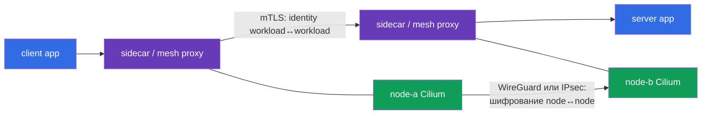
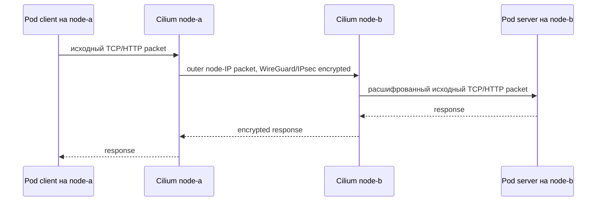
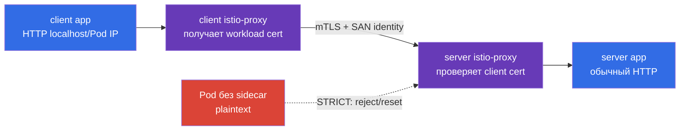

[Eng version](README.md) · [Versión en español](es.md) · [Version française](fr.md) · [Deutsche Version](de.md) · [ქართული ვერსია](ge.md) · [繁體中文版](tw.md) · [日本語版](jp.md)

# Глава 23. Pod-to-Pod шифрование и mTLS: Cilium, Istio и Linkerd

> **Что дальше.** NetworkPolicy разрешает или запрещает поток, но сама по себе не делает
> его конфиденциальным. В этой главе строим два разных слоя защиты Pod-to-Pod трафика:
> прозрачное шифрование сети между нодами через Cilium (WireGuard или IPsec) и взаимную
> TLS-аутентификацию workload через service mesh (Istio или Linkerd). Это компетенция
> **Pod-to-Pod encryption with Cilium** домена *Minimize Microservice Vulnerabilities*
> CKS (20%).

> **Что нужно знать из CKA.** Базовая модель Pod-сети и CNI разобрана в
> [главе 30 CKA](../../../cka/course/30/ru.md), Service/DNS - в
> [главе 31 CKA](../../../cka/course/31/ru.md), а NetworkPolicy - в
> [главе 34 CKA](../../../cka/course/34/ru.md). Здесь предполагается, что вы умеете
> найти Pod, Service, node и проверить обычный `curl`.

## 23.1. Две задачи, два уровня: encryption и mTLS

У слова «зашифровать трафик Pod-to-Pod» есть два разных значения. Их нельзя считать
взаимозаменяемыми.

- **Cilium WireGuard/IPsec** защищает пакет между нодами. Он шифрует и аутентифицирует
  транспортный участок node-to-node прозрачно для приложения: контейнер не получает
  сертификат, Service не меняется, HTTP внутри workload остаётся HTTP.
- **Service mesh mTLS** создаёт TLS-соединение между прокси workload. Оно аутентифицирует
  identity вызывающего workload и сервера, а не только ноды. Istio и Linkerd обычно
  выпускают короткоживущие сертификаты сами и перехватывают трафик sidecar/proxy.
- **NetworkPolicy** отвечает отдельно: какой поток вообще допустим. Ни Cilium encryption,
  ни mTLS не дают allow/deny по namespace и Pod selector вместо NetworkPolicy.



При cross-node запросе эти механизмы можно совмещать: mesh защищает канал от client
proxy до server proxy, а Cilium дополнительно скрывает пакеты от наблюдателя сети между
нодами. При same-node трафике node encryption может не участвовать, но mTLS продолжает
защищать связь между meshed workload. Обратно, Cilium encryption не заменяет mTLS:
компрометированная workload на доверенной ноде не получает проверяемую identity клиента.

| Вопрос | Cilium WireGuard/IPsec | Istio/Linkerd mTLS | NetworkPolicy |
|---|---|---|---|
| Где действует | путь между нодами | между proxy workload | ingress/egress Pod |
| Шифрует HTTP payload на физической сети | да | да | нет |
| Аутентифицирует | криптографических peers-ноды | identity workload | не identity, а selector/IP/port |
| Нужен sidecar/proxy в Pod | нет | да (или ambient/eBPF режим конкретного mesh) | нет |
| Видит приложение сертификат | нет | обычно нет | нет |
| Защищает same-node Pod-to-Pod | не обязательно | да, если оба в mesh | ограничивает, но не шифрует |

## 23.2. Перед изменением: scope, совместимость и исходное состояние

Шифрование CNI и service mesh - cluster-wide или namespace-wide изменение. Не включайте
его вслепую в production: неверный MTU, старое ядро, firewall или строгий mTLS для
legacy-клиента способны остановить трафик. Сначала зафиксируйте текущие CNI, версии,
размещение тестовых Pod и путь пакета.

```bash
kubectl get nodes -o wide
kubectl get pods -A -o wide
kubectl -n kube-system get ds cilium
kubectl -n kube-system get pods -l k8s-app=cilium -o wide
kubectl get networkpolicy -A
```

Проверьте заранее:

1. Cilium уже является CNI, а версия Cilium и kernel поддерживают выбранный режим по
   официальной compatibility matrix. Не устанавливайте второй CNI поверх работающего.
2. Между всеми worker-ноды разрешён UDP-порт WireGuard (по умолчанию Cilium использует
   `51871`, но значение проверяют в установленной конфигурации) либо ESP/IPsec и при NAT
   UDP/4500. Security group, firewall и маршруты - часть решения.
3. У физической сети есть запас MTU. Encapsulation добавляет заголовки; при path-MTU
   проблеме маленький `curl` может работать, а большие ответы зависать.
4. Есть два тестовых Pod на разных нодах. Иначе tcpdump не докажет node-to-node
   encryption. Для учебного теста назначьте их `nodeSelector`/`podAntiAffinity` или
   найдите уже распределённые workload.
5. Есть план отката и окно обслуживания. Изменение Helm values без сохранённого
   предыдущего release превращает диагностику в угадывание.

Команда ниже показывает фактические параметры уже установленного Helm release. Имена
релизов и values зависят от способа установки; не подменяйте ими GitOps-источник истины.

```bash
helm -n kube-system list
helm -n kube-system get values cilium --all
kubectl -n kube-system get configmap cilium-config -o yaml
```

## 23.3. Cilium transparent encryption: модель и границы

Cilium шифрует трафик в datapath на нодах. Когда Pod на `node-a` посылает данные Pod на
`node-b`, Cilium инкапсулирует/шифрует исходный пакет, отправляет внешний пакет между
node IP, а Cilium на `node-b` проверяет peer, расшифровывает и доставляет исходный пакет
в целевой Pod. Для Kubernetes Service, DNS и приложения это прозрачно: не надо менять URL,
порт или добавлять TLS-библиотеку.



**Transparent** не означает «шифрование везде и от всего». На интерфейсе приложения или
внутри namespace plaintext может быть виден до шифрования/после расшифрования. Также
шифрование не делает небезопасное приложение безопасным: оно не блокирует SQL injection,
не даёт авторизацию пользователя и не ограничивает скомпрометированный Pod. Для этих
задач нужны application security, mTLS/authorization, RBAC и NetworkPolicy.

Cilium поддерживает два распространённых backend:

| Свойство | WireGuard | IPsec |
|---|---|---|
| Криптографическая модель | современный компактный VPN-протокол | IPsec ESP; часто стандарт организации/сети |
| Передача на сети | UDP, обычно `51871` | ESP (IP protocol 50), при NAT часто UDP/4500 |
| Ключи/peer | key pair каждого peer; публичный ключ идентифицирует разрешённую ноду | key material в Cilium IPsec Secret, Security Association между peers |
| Аутентификация | пакет принимается только от известного public key/allowed peer | ESP integrity + ключи Security Association |
| Эксплуатационный выбор | обычно простой выбор для поддерживаемой Linux-среды | нужен, если это требует existing IPsec/сетевой стандарт |
| Что проверять tcpdump | UDP к WireGuard port, без HTTP payload | `esp` либо UDP/4500, без HTTP payload |

Выбирают **один** backend. Одновременное включение WireGuard и IPsec как способ «двойной
защиты» не является нормальной конфигурацией Cilium и только усложняет отладку. Точные
Helm values и поддерживаемые комбинации сверяйте с документацией версии, установленной в
кластере: значения из старой статьи могут не подходить к новому Cilium.

## 23.4. WireGuard: включение, key peer и взаимная аутентификация

WireGuard использует пару private/public key на peer. Cilium автоматически управляет
ключами и распространяет нужные public keys между Cilium agents через Kubernetes API.
Нода принимает зашифрованный пакет только если он проходит криптографическую проверку
ожидаемого peer; подделать node IP без ключа недостаточно. Поэтому на транспортном уровне
это одновременно конфиденциальность и **взаимная аутентификация peers-ноды**.

Это не workload identity: два Pod на одной ноде не имеют разных WireGuard identities, а
сервер не узнаёт ServiceAccount клиента из WireGuard key. Для такого взаимного доверия
нужен service mesh mTLS.

Ниже показана типовая Helm-конфигурация. Выполняйте её через ваш version-pinned GitOps или
зафиксированный Helm release, предварительно сверив values конкретного Cilium release.
`encryption.nodeEncryption=true` расширяет защиту на node-to-node трафик; включайте его
только после понимания его влияния на control-plane и host traffic.

```bash
# Пример: подставьте уже утверждённую версию и values из репозитория.
helm upgrade cilium cilium/cilium \
  --namespace kube-system \
  --reuse-values \
  --version <pinned-cilium-version> \
  --set encryption.enabled=true \
  --set encryption.type=wireguard

kubectl -n kube-system rollout status daemonset/cilium --timeout=10m
kubectl -n kube-system get pods -l k8s-app=cilium
```

Если политика требует шифровать также node traffic, задайте это отдельным, reviewable
изменением и протестируйте доступность API server/kubelet:

```bash
helm upgrade cilium cilium/cilium \
  --namespace kube-system \
  --reuse-values \
  --version <pinned-cilium-version> \
  --set encryption.enabled=true \
  --set encryption.type=wireguard \
  --set encryption.nodeEncryption=true
```

После rollout проверяйте состояние *на каждом agent*, а не только наличие DaemonSet:

```bash
kubectl -n kube-system exec ds/cilium -- cilium status --verbose
kubectl -n kube-system exec ds/cilium -- cilium encrypt status
kubectl -n kube-system get pods -l k8s-app=cilium -o wide
```

Ожидаются healthy agents и encryption state без ошибок peer/handshake. В зависимости от
версии Cilium команда может показывать интерфейс WireGuard, peers, public keys или
счётчики. Если CLI не поддерживает ожидаемый subcommand, сначала выполните
`cilium --help` внутри именно этого agent и используйте документацию совпадающей версии,
а не отключайте encryption ради «зелёного» вывода.

### Ротация и инцидент с ключом WireGuard

Cilium автоматизирует lifecycle keys, но security design всё равно обязан описывать,
кто может читать/менять Cilium resources и как реагировать на компрометацию ноды. Не
копируйте private key из ноды в ticket, чат или Git. При подозрении на компрометацию:

1. изолируйте ноду (`cordon`/`drain` с учётом DaemonSet и PDB), сохраните evidence;
2. проверьте Cilium agent logs, health и peers на остальных нодах;
3. следуйте документированной процедуре версии Cilium для удаления/регенерации peer key
   либо пересоздания ноды;
4. убедитесь, что новая нода получила новый identity/key, а старый peer больше не
   принимает трафик;
5. повторите functional и packet-level проверку из раздела 23.10.

`kubectl get secret -A` и широкое право читать Secrets дают доступ не только к IPsec
material, но и к множеству иных секретов. Ограничьте RBAC и audit доступ к `kube-system`.

## 23.5. IPsec: когда нужен и как не сломать key management

IPsec в Cilium также даёт прозрачное node-to-node encryption, но использует IPsec ESP
Security Associations. Его часто выбирают, когда корпоративные требования или уже
существующая сетевая инфраструктура требуют IPsec. Пакет на physical interface выглядит
как ESP, а при NAT traversal - как UDP/4500; прикладной HTTP в нём не должен читаться.

Типовой переход для Cilium release с поддержкой IPsec выглядит так:

```bash
helm upgrade cilium cilium/cilium \
  --namespace kube-system \
  --reuse-values \
  --version <pinned-cilium-version> \
  --set encryption.enabled=true \
  --set encryption.type=ipsec

kubectl -n kube-system rollout status daemonset/cilium --timeout=10m
kubectl -n kube-system exec ds/cilium -- cilium encrypt status
```

Cilium хранит IPsec key material в Secret `cilium-ipsec-keys` в `kube-system`. Не выводите
его в терминал, CI log или документацию. Разрешено проверить наличие и метаданные без
декодирования data:

```bash
kubectl -n kube-system get secret cilium-ipsec-keys \
  -o custom-columns=NAME:.metadata.name,TYPE:.type,CREATED:.metadata.creationTimestamp
kubectl -n kube-system get secret cilium-ipsec-keys -o jsonpath='{.metadata.resourceVersion}{"\n"}'
```

Ротация IPsec key должна соответствовать официальной процедуре Cilium для конкретной
версии. Смысл процедуры - на короткий период дать agents принять старый и новый key,
дождаться rollout всех нод и только потом убрать старый key. Нельзя вручную заменить
Secret одной случайной строкой: рассинхронизация peers вызывает packet loss. Практический
минимум для change request:

- новый key генерируется криптографически случайно и передаётся защищённым каналом;
- порядок и формат key Secret берутся из документации установленного Cilium;
- rollout DaemonSet наблюдается до completion на всех нодах;
- есть измерение потерь/ошибок и откат до удаления старого key;
- после ротации проверяются `cilium encrypt status`, приложение и physical capture.

**Не путайте IPsec key с mTLS CA.** IPsec key защищает transport peers, а сертификат mesh
подтверждает workload identity. Их владелец, rotation interval, audit и blast radius могут
быть разными.

## 23.6. Istio: sidecar, SPIFFE-like identity и `PeerAuthentication`

Istio sidecar (`istio-proxy`, Envoy) перехватывает inbound/outbound workload traffic.
Istiod выдаёт workload сертификат на основе Kubernetes ServiceAccount; proxy устанавливают
mTLS и проверяют identity peer. Приложение обычно продолжает слушать обычный HTTP порт,
потому что TLS завершается в sidecar, а не в app container.



### Включить injection и проверить sidecar

Для учебного namespace включите injection до создания Pod. В production используйте
revision label той установки Istio, которую контролирует change process; не смешивайте
разные revision без плана миграции.

```bash
kubectl create namespace mesh-demo
kubectl label namespace mesh-demo istio-injection=enabled

kubectl -n mesh-demo apply -f server.yaml
kubectl -n mesh-demo apply -f client.yaml
kubectl -n mesh-demo get pods
kubectl -n mesh-demo get pod server -o jsonpath='{.spec.containers[*].name}{"\n"}'
```

В списке контейнеров должен быть `istio-proxy` наряду с `server`. Отсутствие sidecar -
не косметический дефект: plaintext client не станет mTLS client, а `STRICT` закономерно
откажет ему. Для уже существующего Deployment сделайте controlled rollout после label:

```bash
kubectl -n mesh-demo rollout restart deployment/server
kubectl -n mesh-demo rollout status deployment/server
kubectl -n mesh-demo get pod -l app=server \
  -o jsonpath='{range .items[*]}{.metadata.name}{": "}{.spec.containers[*].name}{"\n"}{end}'
```

### `PeerAuthentication`: сервер требует mTLS

`PeerAuthentication` задаёт inbound mTLS policy. `STRICT` означает: серверный proxy
принимает только mTLS traffic от peer, который может предъявить доверенный certificate.
Plaintext TCP от workload без sidecar не является допустимым fallback.

Следующий ресурс действует на весь namespace `mesh-demo`. Namespace selector здесь не
нужен: namespace задан `metadata.namespace`.

```yaml
apiVersion: security.istio.io/v1
kind: PeerAuthentication
metadata:
  name: default
  namespace: mesh-demo
spec:
  mtls:
    mode: STRICT
```

Можно сузить policy на один server workload. Такой selector совпадает с label Pod, а не с
Service name; проверьте реальные labels через `kubectl get pod --show-labels`.

```yaml
apiVersion: security.istio.io/v1
kind: PeerAuthentication
metadata:
  name: server-strict
  namespace: mesh-demo
spec:
  selector:
    matchLabels:
      app: server
  mtls:
    mode: STRICT
```

Не применяйте одновременно namespace-wide `STRICT` и workload policy с противоречащим
`PERMISSIVE` без понимания precedence. Хорошая миграция обычно выглядит так:

```text
inventory clients -> inject/починить clients -> PERMISSIVE measurement (если нужен) ->
verify mTLS -> STRICT narrow scope -> STRICT namespace -> remove temporary exception
```

`PERMISSIVE` полезен только как временная совместимость: proxy принимает mTLS и plaintext,
поэтому успешный `curl` ещё не доказывает mTLS. `DISABLE` для обычного TCP workload
создаёт исключение, которое надо минимизировать, документировать владельцем и сроком.

### `DestinationRule`: клиент не должен выключать TLS

Istio auto mTLS может выбрать TLS автоматически, но явный `DestinationRule` полезен как
проверяемое client-side намерение в учебном стенде или когда политика организации требует
явной конфигурации. `PeerAuthentication` защищает inbound server, а `DestinationRule`
задаёт TLS для outbound client traffic - это разные стороны соединения.

```yaml
apiVersion: networking.istio.io/v1
kind: DestinationRule
metadata:
  name: server-mtls
  namespace: mesh-demo
spec:
  host: server.mesh-demo.svc.cluster.local
  trafficPolicy:
    tls:
      mode: ISTIO_MUTUAL
```

`ISTIO_MUTUAL` означает, что Envoy использует сертификаты и trust bundle, которыми
управляет Istio. Не заменяйте его `SIMPLE`: `SIMPLE` создаёт обычный TLS client без
workload client certificate и не удовлетворяет mTLS. `DISABLE` направляет plaintext и
при server `STRICT` должен быть отклонён. Для external service обычно нужны отдельные
`ServiceEntry`/TLS settings; не используйте этот пример как global правило для всего
`*.svc.cluster.local`.

Проверьте применённые объекты и фактический конфиг proxy:

```bash
kubectl -n mesh-demo get peerauthentication,destinationrule
istioctl proxy-status
istioctl proxy-config cluster deploy/client -n mesh-demo | grep server.mesh-demo
istioctl analyze -n mesh-demo
```

`istioctl analyze` и `proxy-config` зависят от версии Istio, но полезная идея постоянна:
смотреть не только YAML в Git, а runtime configuration proxy. Успешное создание CR не
гарантирует, что selector/host совпал с нужным endpoint.

## 23.7. Контролируемый опыт Istio: внутри mesh 200, снаружи reset

Следующий стенд доказывает главную границу `STRICT`: meshed client получает HTTP `200`,
а client без sidecar делает plaintext запрос и получает TCP reset/ошибку TLS, а не доступ
к server. Выполняйте его только в выделенном namespace: `STRICT` намеренно ломает
legacy plaintext calls.

Сначала создайте namespace с injection и server/client workloads. У client есть sidecar
из namespace label; `legacy-client` ниже запускается в отдельном namespace без injection.

```yaml
apiVersion: v1
kind: Namespace
metadata:
  name: mesh-demo
  labels:
    istio-injection: enabled
---
apiVersion: v1
kind: Service
metadata:
  name: server
  namespace: mesh-demo
spec:
  selector:
    app: server
  ports:
  - name: http
    port: 8080
    targetPort: 8080
---
apiVersion: apps/v1
kind: Deployment
metadata:
  name: server
  namespace: mesh-demo
spec:
  replicas: 1
  selector:
    matchLabels:
      app: server
  template:
    metadata:
      labels:
        app: server
    spec:
      containers:
      - name: server
        image: hashicorp/http-echo:1.0
        args: ["-listen=:8080", "-text=server-ok"]
        ports:
        - containerPort: 8080
---
apiVersion: apps/v1
kind: Deployment
metadata:
  name: client
  namespace: mesh-demo
spec:
  replicas: 1
  selector:
    matchLabels:
      app: client
  template:
    metadata:
      labels:
        app: client
    spec:
      containers:
      - name: client
        image: curlimages/curl:8.12.1
        command: ["sleep", "infinity"]
---
apiVersion: security.istio.io/v1
kind: PeerAuthentication
metadata:
  name: default
  namespace: mesh-demo
spec:
  mtls:
    mode: STRICT
---
apiVersion: networking.istio.io/v1
kind: DestinationRule
metadata:
  name: server-mtls
  namespace: mesh-demo
spec:
  host: server.mesh-demo.svc.cluster.local
  trafficPolicy:
    tls:
      mode: ISTIO_MUTUAL
```

```bash
kubectl apply -f istio-strict-demo.yaml
kubectl -n mesh-demo rollout status deployment/server
kubectl -n mesh-demo rollout status deployment/client
kubectl -n mesh-demo get pods -o wide

CLIENT=$(kubectl -n mesh-demo get pod -l app=client -o jsonpath='{.items[0].metadata.name}')
kubectl -n mesh-demo exec "$CLIENT" -c client -- \
  curl -sS -o /dev/null -w '%{http_code}\n' http://server.mesh-demo.svc.cluster.local:8080
# Ожидается: 200
```

Теперь создайте client без injection. Label `istio-injection=disabled` на Pod не нужен,
если namespace `legacy-demo` не помечен для injection; явная аннотация делает намерение
видимым при review.

```yaml
apiVersion: v1
kind: Namespace
metadata:
  name: legacy-demo
---
apiVersion: v1
kind: Pod
metadata:
  name: outside-client
  namespace: legacy-demo
  annotations:
    sidecar.istio.io/inject: "false"
spec:
  containers:
  - name: client
    image: curlimages/curl:8.12.1
    command: ["sleep", "infinity"]
```

```bash
kubectl apply -f outside-client.yaml
kubectl -n legacy-demo wait --for=condition=Ready pod/outside-client --timeout=120s
kubectl -n legacy-demo get pod outside-client \
  -o jsonpath='{.spec.containers[*].name}{"\n"}'
# Ожидается: только client, без istio-proxy

kubectl -n legacy-demo exec outside-client -- \
  curl --connect-timeout 5 --max-time 10 -v http://server.mesh-demo.svc.cluster.local:8080
# Ожидается: non-zero; обычно "Recv failure: Connection reset by peer".
```

Конкретный текст ошибки зависит от версии Envoy, протокола и точки перехвата: возможны
`connection reset`, TLS handshake error или timeout. Критерий безопасности не строка
ошибки, а отсутствие plaintext success: команда не возвращает HTTP `200`, а server proxy
не принимает неаутентифицированный поток. Для строгой автоматической проверки фиксируйте
оба признака:

```bash
set +e
OUT=$(kubectl -n legacy-demo exec outside-client -- \
  curl -sS --connect-timeout 5 --max-time 10 -o /dev/null -w '%{http_code}' \
  http://server.mesh-demo.svc.cluster.local:8080 2>&1)
RC=$?
set -e
printf 'exit=%s output=%s\n' "$RC" "$OUT"
test "$RC" -ne 0 || test "$OUT" != 200
```

Если **внутри mesh не 200**, проверьте наличие `istio-proxy`, DNS/Service endpoints,
`PeerAuthentication`, `DestinationRule`, proxy status и NetworkPolicy. Если **снаружи
получается 200**, сначала убедитесь, что `STRICT` попал на server Pod и `outside-client`
действительно без sidecar; затем ищите более специфичную `PeerAuthentication` policy,
которая переопределила тест.

## 23.8. Linkerd: mTLS по умолчанию и identity ServiceAccount

Linkerd решает задачу workload mTLS похожим образом, но использует собственный лёгкий
proxy и identity model. После injection Pod получает `linkerd-proxy`; meshed traffic между
Linkerd workload автоматически шифруется и аутентифицируется mTLS. Identity обычно
связывается с Kubernetes ServiceAccount и имеет DNS-like вид:

```text
<serviceaccount>.<namespace>.serviceaccount.identity.linkerd.cluster.local
```

Не ставьте Istio и Linkerd sidecar в один и тот же workload для «усиления». Оба хотят
перехватывать трафик, выпускать сертификаты и управлять policy; результат - конфликт
iptables/ports, неопределённая observability и сложный incident response. Выберите один
mesh для namespace или проведите документированную миграцию.

Перед установкой Linkerd проверьте cluster prerequisites и используйте pinned release:

```bash
linkerd check --pre
linkerd install --crds | kubectl apply -f -
linkerd install | kubectl apply -f -
linkerd check
```

В production installation manifest должен быть сгенерирован и проверен в CI из
зафиксированной версии CLI/chart, а не из floating `latest`. После health check включите
injection только для тестового namespace и перезапустите workload:

```bash
kubectl create namespace linkerd-demo
kubectl annotate namespace linkerd-demo linkerd.io/inject=enabled
kubectl -n linkerd-demo apply -f server.yaml
kubectl -n linkerd-demo apply -f client.yaml
kubectl -n linkerd-demo rollout status deployment/server
kubectl -n linkerd-demo get pod -l app=server \
  -o jsonpath='{.items[0].spec.containers[*].name}{"\n"}'
linkerd -n linkerd-demo check --proxy
linkerd -n linkerd-demo viz stat deploy
```

Как и в Istio, проверяйте не только наличие annotation, но и фактический proxy container,
identity/certificate status и успешный запрос между meshed Pod. Linkerd policy API и
поведение unauthorized traffic менялись между версиями: прежде чем строить default-deny,
сверьте CRD и policy mode установленного release. mTLS подтверждает identity и защищает
канал, но не обязательно означает «каждый identity может вызвать каждый endpoint» -
авторизацию надо настроить отдельно.

## 23.9. WireGuard/IPsec и mesh вместе: где виден plaintext

Проверка «`curl` работает» не доказывает encryption. `curl` проверяет доступность и
application response, но не отличает plaintext HTTP от зашифрованного трафика. Аналогично,
tcpdump на `any` может одновременно увидеть inner plaintext пакет в virtual интерфейсе и
outer encrypted packet на physical NIC. Для доказательства сначала сформулируйте, *где*
должен быть виден каждый слой.

| Точка capture | При одном Cilium encryption | При Cilium + Istio/Linkerd |
|---|---|---|
| app container / loopback к proxy | часто plaintext HTTP | app↔local proxy может быть plaintext |
| veth/CNI до node encryption | исходный inner flow может быть читаемым | mTLS ciphertext между mesh proxy |
| physical NIC node-a/node-b | WireGuard UDP или IPsec ESP, без HTTP | outer WireGuard/IPsec; HTTP и TLS payload не читаются |
| server app после proxy | plaintext, потому что proxy уже расшифровал | plaintext от local proxy к app |

Это нормальная архитектура termination points. Цель Cilium - убрать readable payload с
недоверенного physical network path. Цель mesh - сделать workload-to-workload segment
TLS-protected и связать его с identity. Не заявляйте «tcpdump нигде не показывает HTTP»:
на ноде и в Pod он может быть виден до/после encryption, если у атакующего есть root на
этой ноде.

## 23.10. `tcpdump`-проверка: доказать outer encrypted traffic

Для packet-level доказательства нужны Pod на **разных** нодах, node IP обоих нод и
physical interface, ведущий в cluster network. Не используйте автоматически `eth0`: на
облачной ноде интерфейс может называться `ens5`, `ens192` или иначе.

```bash
kubectl get pods -A -o wide
kubectl get nodes -o wide
# На выбранной ноде:
ip -br link
ip route get <IP-второй-ноды>
```

На первой ноде запустите capture именно на physical интерфейсе. Команды ниже предполагают
SSH/approved node access; не добавляйте privileged debug Pod в production только ради
удобства. При разрешённом break-glass доступе `kubectl debug node/<node>` также даёт
host-level диагностику, но сам факт такого доступа должен быть auditable.

### WireGuard capture

```bash
# На node-a; замените ens5 и IP node-b.
sudo tcpdump -ni ens5 -vv 'udp port 51871 and host <NODE_B_IP>'
```

В другом терминале создайте повторяемый cross-node flow. Удобно выполнить несколько
запросов из client Pod, который по `kubectl get pod -o wide` находится на `node-a`, в
server Pod/Service на `node-b`:

```bash
for i in $(seq 1 20); do
  kubectl -n mesh-demo exec "$CLIENT" -c client -- \
    curl -sS http://server.mesh-demo.svc.cluster.local:8080 >/dev/null || exit 1
done
```

Ожидается серия UDP datagram node-a ↔ node-b на WireGuard port. В выводе не должно быть
строки HTTP request (`GET /`, `Host:`) или `server-ok`. Наличие UDP на порту ещё не
доказывает, что это именно нужный Pod flow; сопоставьте время capture, node pair и рост
счётчиков Cilium encryption.

### IPsec capture

При native ESP capture фильтрует IP protocol 50. При NAT traversal надо смотреть UDP/4500.
Конкретный режим зависит от сети и Cilium/IPsec setup.

```bash
# На node-a: native ESP.
sudo tcpdump -ni ens5 -vv 'host <NODE_B_IP> and esp'

# Если используется NAT-T:
sudo tcpdump -ni ens5 -vv 'host <NODE_B_IP> and udp port 4500'
```

Снова запустите повторяемый application flow. Ожидаются ESP или UDP/4500 packets, но не
readable HTTP. После capture сопоставьте результат с agent:

```bash
kubectl -n kube-system exec ds/cilium -- cilium encrypt status
kubectl -n kube-system logs ds/cilium --since=10m | grep -Ei 'encrypt|wireguard|ipsec|error'
```

`grep` без результата не является доказательством безопасности: многие нормальные agents
не логируют каждый пакет. Сильное evidence - четыре совпадающих факта: cross-node
placement, `200` для intended flow, healthy encryption status/counters и encrypted outer
protocol на physical NIC без payload.

### Отрицательная проверка и частые ловушки

- **Capture на `-i any` показывает HTTP.** Это может быть inner packet до encryption,
  локальная доставка или traffic между Pod на одной ноде. Повторите на physical NIC и
  проверьте placement.
- **Нет UDP/51871, но curl работает.** Возможно Pod на одной ноде, другой Cilium port,
  encryption выключен, либо используется другой transport. Сначала проверьте values и
  `cilium encrypt status`, потом routes/interface.
- **Есть ESP/UDP, но capture не совпадает с тестом.** На ноде идёт другой encrypted
  traffic. Ограничьте BPF filter парой node IP и повторите запрос в коротком временном
  окне.
- **`tcpdump` видит TLS, а не HTTP.** Это ожидаемо для mesh на inner path, но не доказывает
  Cilium. На physical NIC при включённых обоих слоях ожидается outer WireGuard/IPsec.
- **Большой response висит, маленький работает.** Подозревайте MTU/MSS. Не отключайте
  шифрование как «исправление»; измерьте path MTU и настройте CNI/underlay по процедуре
  платформы.

## 23.11. Диагностика: сначала определить слой отказа

Один симптом `connection reset` может происходить на нескольких уровнях. Диагностируйте
снизу вверх, не превращая временное отключение `STRICT` или encryption в постоянный
обход.

| Симптом | Вероятный слой | Первые проверки | Безопасное исправление |
|---|---|---|---|
| Pod на разных нодах не обмениваются трафиком после rollout | Cilium/underlay | `cilium encrypt status`, agent logs, UDP/ESP firewall, MTU | восстановить совместимые values/сеть по rollback plan |
| DNS Service не резолвится | CoreDNS/Service, не mTLS | `nslookup`, Endpoints, CKA chapter 31 | исправить DNS/Service до анализа TLS |
| Meshed client не получает 200 | Istio/Linkerd или NetworkPolicy | sidecar/proxy, cert/identity, endpoints, policy | исправить injection/identity/rule, не ставить global `DISABLE` |
| Outside client получает reset | Istio `STRICT` | отсутствие sidecar, effective PeerAuthentication | это ожидаемое доказательство; мигрировать client в mesh |
| Outside client получает 200 при `STRICT` | policy не попала в server | selector, namespace, Pod labels, более specific policy | сузить/исправить policy и повторить negative test |
| После IPsec rotation intermittent loss | key rollout | Secret version, agents, peer encryption state | следовать overlap/rollback процедуре Cilium версии |
| Linkerd proxy не Ready | mesh install/identity | `linkerd check`, proxy logs, clock/DNS | исправить trust/identity prerequisites, не отключать mTLS |

Полезный минимальный набор команд для incident evidence:

```bash
kubectl -n mesh-demo get pod,svc,endpointslice -o wide
kubectl -n mesh-demo get peerauthentication,destinationrule -o yaml
kubectl -n kube-system get pods -l k8s-app=cilium -o wide
kubectl -n kube-system exec ds/cilium -- cilium encrypt status
istioctl proxy-status 2>/dev/null || true
linkerd check 2>/dev/null || true
```

Не выводите `Secret` с `-o yaml`, private key, bearer token или полный packet capture в
общий канал incident. Capture может содержать metadata, URL, cookie или plaintext на
внутренней точке. Сохраняйте только минимально нужное evidence в одобренное хранилище с
сроком хранения.

## 23.12. Безопасный rollout и эксплуатационные правила

Шифрование не является однократной командой установки. У него есть owners, updates,
rotation, alerting и доказательства, что ожидаемая политика по-прежнему работает после
upgrade Kubernetes/Cilium/mesh.

1. **Инвентаризация.** Найдите workload без sidecar, external clients, hostNetwork Pod,
   stateful protocol и critical control-plane paths. Для mTLS составьте graph callers и
   servers, а не только список namespaces.
2. **Canary namespace/nodes.** Начните с отдельного namespace и небольшой node pool.
   Для Istio сначала докажите meshed `200` и plaintext reset; для Cilium - cross-node
   encrypted outer packet.
3. **Observe before enforce.** Соберите latency, connection errors, packet drops, proxy
   certificate expiry и Cilium health. `PERMISSIVE` допустим только как измеряемый этап
   миграции с датой удаления.
4. **Сузьте исключения.** `PeerAuthentication` selector, отдельный namespace или
   documented legacy port лучше глобального `DISABLE`. Исключение имеет owner, причину,
   expiry и отрицательный тест.
5. **Проверяйте после изменения.** Новый node, Cilium upgrade, mesh CA rotation и
   firewall change требуют повторить status, functional flow и capture. Наличие YAML в
   Git не заменяет runtime evidence.
6. **Планируйте failure.** Если CA/identity control plane недоступен, сертификаты в итоге
   истекут; если Cilium agent не получает key, cross-node flow деградирует. Настройте
   alert до expiry/rollout outage и задокументируйте rollback.

Хорошая layered policy для production выглядит так: NetworkPolicy разрешает только
необходимый service flow; mesh `STRICT` требует аутентифицированный mTLS peer; Cilium
шифрует cross-node underlay; application авторизует user/request. Каждый слой уменьшает
последствия ошибки другого, но ни один не освобождает от обновлений и мониторинга.

## 23.13. Мини-глоссарий

- **Transparent encryption** - шифрование datapath без изменения приложения, Service или
  URL; Cilium применяет его на нодах.
- **WireGuard** - VPN-протокол с key pair peers; public key определяет разрешённого peer.
- **IPsec ESP** - IP-level protected payload с конфиденциальностью и integrity между
  Security Associations.
- **Node encryption** - защита трафика между нодами; не тождественна workload identity.
- **mTLS** - TLS, в котором certificate предъявляют и client, и server.
- **Workload identity** - криптографически проверяемая identity workload, обычно связанная
  с ServiceAccount/namespace в mesh.
- **Sidecar** - proxy container рядом с приложением, который перехватывает трафик.
- **`PeerAuthentication`** - Istio policy inbound mTLS; `STRICT` отклоняет plaintext.
- **`DestinationRule`** - Istio policy outbound traffic; `ISTIO_MUTUAL` использует
  сертификаты, управляемые Istio.
- **Linkerd identity** - mTLS identity Linkerd, обычно построенная от ServiceAccount.
- **Outer packet** - encrypted packet между node IP на physical network.
- **Inner packet** - исходный Pod-to-Pod flow, видимый до encryption или после decryption.

## 23.14. Итоги главы

- Cilium WireGuard/IPsec и mesh mTLS решают разные задачи: первый защищает transport
  node-to-node, второй даёт workload-to-workload encryption и mutual authentication.
- WireGuard peer keys или IPsec Security Associations подтверждают доверенную ноду, но не
  дают server приложению identity конкретного client Pod/ServiceAccount.
- В Cilium выберите один backend, проверьте firewall/MTU, agents и status; ключи не
  печатают в логи, а IPsec rotation делают с перекрытием key по процедуре версии.
- Istio `PeerAuthentication: STRICT` требует mTLS на server inbound, injection добавляет
  `istio-proxy`, а `DestinationRule` с `ISTIO_MUTUAL` явно настраивает client side.
- Linkerd автоматически даёт mTLS meshed workload и связывает identity с ServiceAccount;
  не смешивайте его sidecar с Istio в одном Pod.
- Убедительное доказательство содержит meshed `200`, plaintext outside reset/failure,
  `cilium encrypt status` и tcpdump outer WireGuard/IPsec на physical NIC без HTTP payload.

## 23.15. Как это применяют в продакшене

В production Cilium encryption и mesh mTLS вводят через инвентаризацию потоков, canary-неймспейс, контроль MTU и firewall, защиту key material RBAC-правами и проверяемый rotation/rollback runbook. Наблюдаемые доказательства - `cilium encrypt status`, policy events и успешные mTLS-запросы - собирают до расширения охвата.

## 23.16. Как это пригодится: на экзамене и в реальной работе

**На экзамене CKS.** Умейте отличить CNI encryption от mTLS, найти Cilium encryption
status и причины cross-node failure, прочитать `PeerAuthentication`/`DestinationRule` и
доказать, что plain client не проходит `STRICT`. Не обещайте, что NetworkPolicy шифрует
пакеты: это типичная ловушка. Быстро проверяйте container list, Service endpoints, node
placement и effective policy, затем делайте минимальное безопасное изменение.

**В реальной работе.** Самый ценный результат - не включённый флаг, а проверяемая граница
доверия: зафиксированный Cilium/mesh release, ограниченный RBAC к key material, rotation
runbook, rollback, MTU/firewall design, migration legacy clients и наблюдаемое evidence
после каждого изменения. mTLS даёт identity для authorization, а node encryption защищает
underlay даже если application protocol не менялся.

## 23.17. Вопросы для самопроверки

1. Почему Cilium WireGuard/IPsec не заменяет mTLS между workload?
2. Что именно аутентифицирует WireGuard peer и почему это не identity ServiceAccount?
3. Какие внешние firewall правила и сетевые особенности надо проверить для WireGuard и
   IPsec NAT traversal?
4. Чем опасна ручная замена IPsec Secret без key-overlap rollout?
5. Какова разница между Istio `PeerAuthentication: STRICT` и `DestinationRule` с
   `ISTIO_MUTUAL`?
6. Почему meshed `curl` с кодом 200 не доказывает, что plaintext client заблокирован?
7. Почему tcpdump на `any` может показать HTTP даже при включённом Cilium encryption?
8. Как доказать, что capture на physical NIC относится к нужному cross-node flow?
9. Почему нельзя запускать Istio и Linkerd sidecar в одном workload?
10. Какие четыре факта составляют минимальное runtime evidence для node encryption?

## Практика

Основная практика - **лаба 110 CKS: gVisor, Cilium и Istio**. В ней отработайте
безопасное изменение CNI/mesh, проверьте service flow из meshed workload и зафиксируйте
результат `check_result`:
[ tasks/cks/labs/110 ](../../labs/110/README_RU.MD).

Перед лабой полезно освежить CKA-основы: [глава 30 CKA - CNI и Pod-сеть](../../../cka/course/30/ru.md),
[глава 31 CKA - Service и DNS](../../../cka/course/31/ru.md),
[глава 34 CKA - NetworkPolicy](../../../cka/course/34/ru.md) и
[лаба 110 CKA - Service/DNS, Ingress, Gateway API, NetworkPolicy](../../../cka/labs/110/README_RU.MD).

Для самостоятельного теста используйте disposable cluster и отдельные namespace. Не
проверяйте `STRICT` отключением production sidecar или packet capture с чувствительным
payload на общей ноде.

## Справочные материалы

- [Cilium: Transparent Encryption](https://docs.cilium.io/en/stable/security/network/encryption/)
- [Cilium: WireGuard Transparent Encryption](https://docs.cilium.io/en/stable/security/network/encryption-wireguard/)
- [Cilium: IPsec Transparent Encryption](https://docs.cilium.io/en/stable/security/network/encryption-ipsec/)
- [Istio: PeerAuthentication](https://istio.io/latest/docs/reference/config/security/peer_authentication/)
- [Istio: DestinationRule TLS settings](https://istio.io/latest/docs/reference/config/networking/destination-rule/)
- [Istio: mTLS migration](https://istio.io/latest/docs/tasks/security/authentication/mtls-migration/)
- [Linkerd: Automatic mTLS](https://linkerd.io/2/reference/automatic-mtls/)
- [Kubernetes: Debugging Services](https://kubernetes.io/docs/tasks/debug/debug-application/debug-service/)

---
[Оглавление](../README_RU.md) · [Глава 22](../22/ru.md) · [Глава 24](../24/ru.md)
