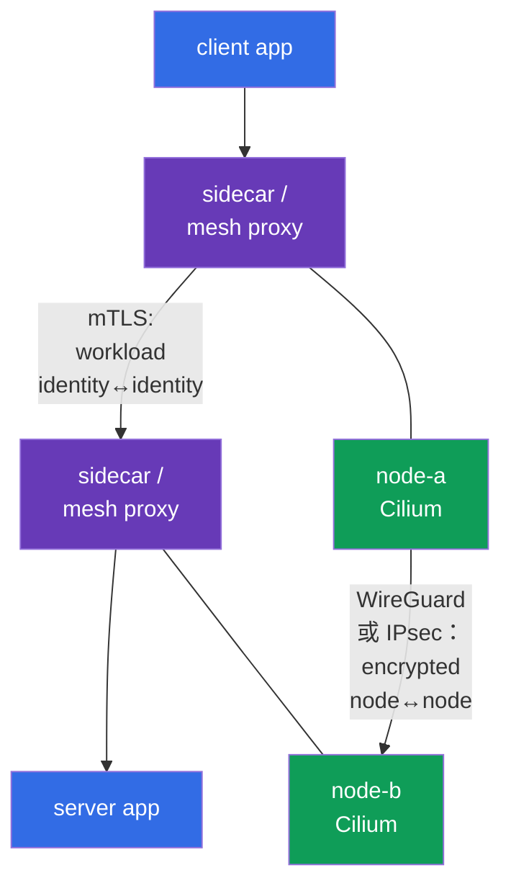
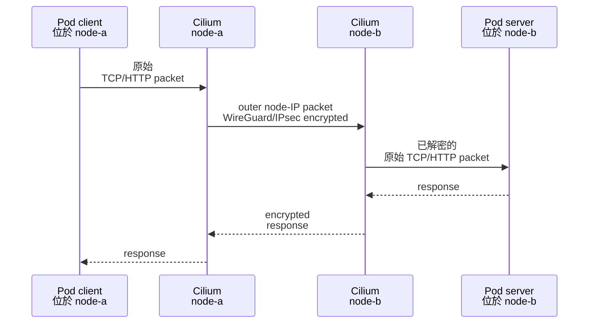
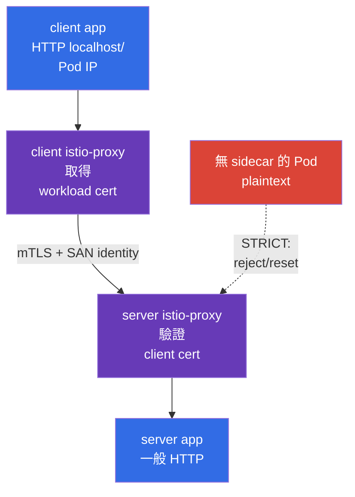

[Русская версия](ru.md) · [Eng version](README.md) · [Versión en español](es.md) · [Version française](fr.md) · [Deutsche Version](de.md) · [ქართული ვერსია](ge.md) · [日本語版](jp.md)

# 第 23 章：Pod-to-Pod 加密與 mTLS：Cilium、Istio 和 Linkerd

> **問題。** NetworkPolicy 可以只允許需要的 flow，但其中的 data 在跨 node path 上仍可能遭攔截或竄改；若 service
> 不驗證 mutual identity，便可能接受來自其他 workload 的 connection。Node、network segment 或 client 遭 compromise
> 時，可能洩漏 tokens 與 payload，或讓攻擊者冒充 trusted service；transport encryption 與 workload identity 的 mTLS
> 必須分別建立。

> **接下來。** NetworkPolicy 允許或拒絕 flow，但它本身不會使 flow 保持 confidential。本章建立 Pod-to-Pod traffic 的
> 兩個不同 protection layers：透過 Cilium（WireGuard 或 IPsec）的 nodes 間 transparent network encryption，以及
> 透過 service mesh（Istio 或 Linkerd）的 workload mutual TLS authentication。這是 CKS *Minimize Microservice
> Vulnerabilities* domain（20%）的 **Implement Pod-to-Pod encryption (Cilium, Istio)** competency。

> **需要的 CKA 知識。** Pod network 與 CNI 的基礎 model 請見 [CKA 第 30 章](../../../cka/course/30/tw.md)，Service/DNS
> 請見 [CKA 第 31 章](../../../cka/course/31/tw.md)，NetworkPolicy 請見 [CKA 第 34 章](../../../cka/course/34/tw.md)。本章
> 假定你能找到 Pod、Service、node，並測試一般的 `curl`。

> 🧠 Cilium WireGuard/IPsec 保護 node-to-node transport，mesh mTLS 保護 proxy connections 與 workload identity，NetworkPolicy 則決定 flow 是否被允許。

## 23.1. 兩項工作、兩個層級：encryption 與 mTLS

「加密 Pod-to-Pod traffic」有兩種不同含義，不能將它們視為可互換。

- **Cilium WireGuard/IPsec** 保護 nodes 之間的 packet。它透明地加密並驗證 node-to-node transport segment：
  container 不會取得 certificate、Service 不會變更，而 workload 內的 HTTP 仍是 HTTP。
- **Service mesh mTLS** 在 workload proxies 間建立 TLS connection。它驗證 calling workload 與 server 的 identity，
  而非僅驗證 node。Istio 與 Linkerd 通常自行簽發 short-lived certificates，並透過 sidecar/proxy 攔截 traffic。
- **NetworkPolicy** 回答另一個問題：何種 flow 可被允許。Cilium encryption 與 mTLS 都無法取代 NetworkPolicy
  依 namespace 和 Pod selector 進行的 allow/deny。



Traffic 跨 nodes 時可以結合這兩種 mechanisms：service mesh 保護 workloads 的 proxies 間的 connection，而 Cilium
encryption 額外保護 nodes 間 network segment 上的 packets。**Cilium WireGuard 與 IPsec 設計上不會加密同一 node 的
Pod-to-Pod traffic**：不存在跨 node outer packet。Mesh 中的 workloads 之間，mTLS 仍會保護 connection。反之，Cilium
encryption 不可取代 mTLS：trusted node 上遭 compromise 的 workload 並不會因此獲得可驗證的 client identity。

| 問題 | Cilium WireGuard/IPsec | Istio/Linkerd mTLS | NetworkPolicy |
|---|---|---|---|
| 作用位置 | nodes 間 path | workload proxies 間 | Pod ingress/egress |
| 加密 physical network 上的 HTTP payload | 是 | 是 | 否 |
| 驗證什麼 | cryptographic node peers | workload identity | 不驗證 identity，而是 selector/IP/port |
| Pod 是否需要 sidecar/proxy | 否 | 是（或特定 mesh 的 ambient/eBPF mode） | 否 |
| Application 是否看到 certificate | 否 | 通常否 | 否 |
| 保護 same-node Pod-to-Pod | 否：Cilium WireGuard/IPsec 設計上不加密這種 traffic | 是，若兩者都在 mesh 中 | 限制但不加密 |

> 🎯 變更前，記錄 CNI、versions、firewall、MTU 及 test Pods 的 cross-node placement。

**記錄**不表示變更 configuration，而是保存可在 rollout 後用來比較的 baseline——也就是正常運作 state 的 snapshot。將
checks 的 output 寫入 change/incident note 或 lab records：目前提供 network 的 CNI 及其 version、涉及的
Kubernetes/kernel/Cilium versions、firewall 是否允許所需的 inter-node protocol，以及 path 上可用的 MTU。
**Cross-node placement** 表示兩個 test Pods 真的被排程到**不同** nodes。這很重要：只有這種 flow 會產生可用來證明
WireGuard/IPsec 的 node-to-node outer packet。若變更後 traffic 中斷，baseline 可幫助區分 new defect 與既有的
firewall/MTU/placement limitation。

## 23.2. 變更前：scope、compatibility 與 baseline

CNI encryption 與 service mesh 是 cluster-wide 或 namespace-wide 的變更。不要在 production 中盲目啟用：錯誤的 MTU、
舊 kernel、firewall 或對 legacy client 的 strict mTLS 都可能停止 traffic。先記錄目前 CNI、versions、test Pod placement
與 packet path。

```bash
kubectl get nodes -o wide
kubectl get pods -A -o wide
kubectl -n kube-system get ds cilium
kubectl -n kube-system get pods -l k8s-app=cilium -o wide
kubectl get networkpolicy -A
```

事先檢查：

1. Cilium 已是 CNI，且 Cilium version 與 kernel 依官方 compatibility matrix 支援所選 mode。不要在現有 CNI 上再安裝
   第二個 CNI。
2. 所有 worker nodes 之間必須允許 WireGuard UDP port（Cilium 預設使用 `51871`，但要依已安裝 configuration 確認），
   或允許 Cilium IPsec 的 ESP（IP protocol 50）。典型 IKE/NAT-T 的 UDP/4500 scenario 不屬於此處的 Cilium IPsec
   mechanism。Security group、firewall 與 routes 都是 solution 的一部分。
3. Physical network 必須有 MTU 餘裕。Encapsulation 會新增 headers；path-MTU 有問題時，小型 `curl` 可能成功，而 large
   responses 會停滯。
4. 必須有兩個位於不同 nodes 的 test Pods，否則 tcpdump 無法證明 node-to-node encryption。對 lab test，透過
   `nodeSelector`/`podAntiAffinity` 指定它們，或找出已分散的 workloads。
5. 準備 rollback plan 與 maintenance window。沒有保存前一個 release 就變更 Helm values，會讓 diagnostics 變成猜測。

下列 command 顯示已安裝 Helm release 的有效 parameters。Release names 與 values 取決於安裝方式；不要以它們取代
GitOps source of truth。

```bash
helm -n kube-system list
helm -n kube-system get values cilium --all
kubectl -n kube-system get configmap cilium-config -o yaml
```

> 🎯 Transparent encryption 僅保護 cross-node segment；選擇 backend 並驗證其 scope。

## 23.3. Cilium transparent encryption：model 與 boundaries

Cilium 在 nodes 的 datapath 加密 traffic。`node-a` 上的 Pod 將 data 傳給 `node-b` 上的 Pod 時，Cilium encapsulates/encrypts
原始 packet，於 node IPs 間傳送 outer packet，而 `node-b` 上的 Cilium 會驗證 peer、解密，並將原始 packet 交付 target
Pod。這對 Kubernetes Service、DNS 與 application 都是 transparent 的：不必變更 URL 或 port，也不用加入 TLS library。



**Transparent** 並不表示「任何地方、任何威脅下都已加密」。在 application interface 或 namespace 內，plaintext 可能在
encryption 前/解密後被看見。Encryption 也不會讓不安全 application 變得安全：它不阻止 SQL injection、不提供 user
authorization，也不限制遭 compromise 的 Pod。這些任務需要 application security、mTLS/authorization、RBAC 與
NetworkPolicy。

Cilium 支援兩個常見 backends：

| 屬性 | WireGuard | IPsec |
|---|---|---|
| Cryptographic model | 現代、精簡的 VPN protocol | IPsec ESP；常是 organization/network standard |
| 在 network 上的傳輸 | UDP，通常為 `51871` | ESP（IP protocol 50） |
| Keys/peer | 每個 peer 有 key pair；public key 識別被允許的 node | Cilium IPsec Secret 中的 key material，peers 間的 Security Association |
| Authentication | 僅接收來自 known public key/allowed peer 的 packet | ESP integrity + Security Association keys |
| Operational choice | 通常適合 supported Linux environment 的簡單選擇 | existing IPsec/network standard 有此要求時使用 |
| tcpdump 要檢查什麼 | 至 WireGuard port 的 UDP，沒有 HTTP payload | `esp`，沒有 HTTP payload |

Cilium 1.20 也記錄了 **beta** 的 `ztunnel` encryption backend。這是 forward-looking production extension，而不是主要的
CKS path；對考試 scenario，本章理解 WireGuard 或 IPsec 即可。

選擇**一個** backend。同時啟用 WireGuard 與 IPsec 作為「雙重 protection」不是正常的 Cilium configuration，只會讓
debugging 更複雜。準確的 Helm values 與 supported combinations 應依 cluster 內 Cilium version 的 documentation
確認：舊文章中的 values 可能不適合 new Cilium。

> 🎯 檢查 version-pinned values、Cilium agents rollout 與 encryption status；peer key 驗證 node，而非 Pod identity。

## 23.4. WireGuard：啟用、key peer 與 mutual authentication

WireGuard 對每個 peer 使用 private/public key pair。Cilium 自動管理 keys，並透過 Kubernetes API 在 Cilium agents 間
發佈所需 public keys。Node 僅在 encrypted packet 通過預期 peer 的 cryptographic verification 時才接受它；沒有 key，
偽造 node IP 並不足夠。因此，在 transport layer，這同時提供 confidentiality 與**node peers 的 mutual authentication**。

這不是 workload identity：同一 node 上的兩個 Pods 沒有不同的 WireGuard identities，而 server 無法從 WireGuard key
得知 client 的 ServiceAccount。這類 mutual trust 需要 service mesh mTLS。

以下為典型 Helm configuration。透過 version-pinned GitOps 或已記錄的 Helm release 套用它，並先對照特定 Cilium
release 的 values。`encryption.nodeEncryption=true` 將 protection 擴及 node-to-node traffic。對 WireGuard，Cilium
預設將有 `node-role.kubernetes.io/control-plane` label 的 nodes 排除於 node-to-node encryption 外，以避免更新 public
key 時的 bootstrap problem。不要假設此設定自動涵蓋 control plane；僅在理解其對 control-plane 與 host traffic 的影響後
才啟用。

```bash
# 範例：請代入 repository 中已核准的 version 與 values。
helm upgrade cilium cilium/cilium \
  --namespace kube-system \
  --reuse-values \
  --version <pinned-cilium-version> \
  --set encryption.enabled=true \
  --set encryption.type=wireguard

kubectl -n kube-system rollout status daemonset/cilium --timeout=10m
kubectl -n kube-system get pods -l k8s-app=cilium
```

若 policy 也要求 encryption node traffic，將其作為獨立、可 review 的變更設定，並測試 API server/kubelet availability：

```bash
helm upgrade cilium cilium/cilium \
  --namespace kube-system \
  --reuse-values \
  --version <pinned-cilium-version> \
  --set encryption.enabled=true \
  --set encryption.type=wireguard \
  --set encryption.nodeEncryption=true
```

Rollout 後，在**每一個 Cilium agent** 檢查 state，而非只檢查 `kubectl exec ds/cilium` 任意選取的一個 Pod：

```bash
kubectl -n kube-system get pods -l k8s-app=cilium -o wide
kubectl -n kube-system get pods -l k8s-app=cilium -o name |
  while IFS= read -r agent; do
    echo "=== $agent ==="
    kubectl -n kube-system exec "$agent" -- cilium-dbg status --verbose
    kubectl -n kube-system exec "$agent" -- cilium-dbg encrypt status
  done
```

每個 node 應有 healthy agents，且 encryption state 不應出現 peer/handshake errors。依 Cilium version 而定，command
可能顯示 WireGuard interface、peers、public keys 或 counters。`cilium-dbg` 是 local agent 的 CLI：若沒有該 subcommand，
在**同一個 agent** 中執行 `cilium-dbg --help`，並對照已安裝 Cilium version 的 documentation，因為此 binary 與 agent
一同提供。從 administrative machine 執行的 external Cilium CLI `cilium` 另有自己的 versioning：請使用 supported
compatible version 和其 compatibility table，而不是將其 version number 視為與 release 相同。

> 🔬 Strict mode 可避免第一個 plaintext packet，但需要 version- 與 routing-specific compatibility。

### Strict mode：防止第一個 plaintext packet

在一般 transparent WireGuard 中，位於不同 nodes 的 Cilium-managed endpoints 間 Pod-to-Pod traffic，new remote endpoint
可能不會立即被 agent 得知；在此之前，第一個 egress packets 可能未經 tunnel 傳送。若 threat model 不允許這種情況，請在
完成獨立 version compatibility review 後使用 strict mode：

```yaml
encryption:
  strictMode:
    egress:
      enabled: true
      # 此 cluster 的 IPv4 Pod CIDR；請替換為實際值。
      cidr: 10.244.0.0/16
    ingress:
      enabled: true
```

`encryption.strictMode.egress` 僅支援 IPv4，因此 `cidr` 必須是實際 IPv4 Pod CIDR；這個 mode 也對 direct routing、node
CIDR 與選定 interfaces 有限制。`encryption.strictMode.ingress` 會丟棄未經 WireGuard tunnel 而抵達的 cluster-internal
Pod traffic；它不是 IPsec 的 universal strict mode。啟用前，對照 Cilium release 對 native/direct routing 和 device
configuration 的 requirements，接著透過 negative test 確認 nodes 間 plaintext Pod-to-Pod packet 不會通過。不要將 strict
mode 作為驗證 NetworkPolicy、firewall 或 control-plane availability 的替代品。

> 🏭 對遭 compromise 的 node：isolate、保全 evidence、將 old peer 排除於 trust；private key 不得進入 ticket、Git 或 chat。

**實務上代表：**「compromised」表示有理由相信 attacker 能在 node 執行 commands 或讀取其 data。**Isolate** 表示不再對它
排程 new Pods，並依 approved incident procedure 限制它參與 cluster；這會 containment，但不會抹除 traces。**Evidence**
是調查所需的 metadata 與 logs（time、node name、Cilium state 和 events），而不是 private key copy。**將 old peer 排除於
trust** 表示，key regeneration 或 node replacement 後，需確認其他 nodes 不再接受由 old public key authenticated 的
traffic。以下列表顯示這些動作的安全順序。

### WireGuard key rotation 與 incident

Cilium 自動化 key lifecycle，但 security design 仍必須說明誰可讀取/變更 Cilium resources，以及如何回應 node compromise。
不要把 private key 從 node 複製到 ticket、chat 或 Git。若懷疑遭 compromise：

1. Isolate node（`cordon`/`drain` 時考慮 DaemonSet 與 PDB），保全 evidence；
2. 檢查其他 nodes 上的 Cilium agent logs、health 與 peers；
3. 依已記錄的 Cilium version procedure 移除/regenerate peer key，或 recreate node；
4. 確認 new node 取得 new identity/key，且 old peer 不再被接受；
5. 重複第 23.10 節的 functional 與 packet-level checks。

`kubectl get secret -A` 與廣泛讀取 Secrets 的 permission 不只會存取 IPsec material，也會存取許多其他 secrets。限制
對 `kube-system` 的 RBAC 與 audit access。

> 🔬 IPsec 是 Cilium 的 alternative backend，包含 key rotation、ESP diagnostics、compatible Cilium CLI 與 key-overlap window。

## 23.5. IPsec：適用時機與不破壞 key management 的方法

Cilium 中的 IPsec 也提供 transparent node-to-node encryption，但使用 IPsec ESP Security Associations。它經常用於
corporate requirements 或既有 network infrastructure 要求 IPsec 時。Physical interface 上的 packet 會呈現為 ESP（IP
protocol 50）；其中的 application HTTP 不應可讀。不要把一般的 UDP/4500 IKE/NAT-T model 套用到此處：它不是此 Cilium
mechanism 的一部分。

對支援 IPsec 的 Cilium release，典型 transition 從 key Secret 開始：agent 必須在啟用 `encryption.type=ipsec` **之前**
取得 `cilium-ipsec-keys`。僅從已安裝 supported compatible Cilium CLI 並具 kubeconfig 的 administrative machine 建立它。
若 Secret 已存在，不要意外 overwrite——先檢查 owner 與 version-specific rotation procedure：

```bash
kubectl -n kube-system get secret cilium-ipsec-keys >/dev/null 2>&1 || \
  cilium encrypt create-key --auth-algo rfc4106-gcm-aes

# 僅檢查存在與 metadata，不檢查 key data。
kubectl -n kube-system get secret cilium-ipsec-keys \
  -o custom-columns=NAME:.metadata.name,TYPE:.type,CREATED:.metadata.creationTimestamp
kubectl -n kube-system get secret cilium-ipsec-keys \
  -o jsonpath='{.metadata.resourceVersion}{"\n"}'

helm upgrade cilium cilium/cilium \
  --namespace kube-system \
  --reuse-values \
  --version <pinned-cilium-version> \
  --set encryption.enabled=true \
  --set encryption.type=ipsec

kubectl -n kube-system rollout status daemonset/cilium --timeout=10m
kubectl -n kube-system get pods -l k8s-app=cilium -o name |
  while IFS= read -r agent; do
    echo "=== $agent ==="
    kubectl -n kube-system exec "$agent" -- cilium-dbg encrypt status
  done
```

Cilium 將 IPsec key material 儲存在 `kube-system` 的 `cilium-ipsec-keys` Secret。不要將它輸出到 terminal、CI log 或
documentation。可在不 decode data 的前提下檢查其存在與 metadata。

Rotation 時，僅使用 supported **compatible** Cilium CLI 與 version-specific procedure。從 administrative machine 以
`cilium encryption status` 取得一般、不含 secret 的 status，並在每個 node 以 `cilium-dbg encrypt status` 取得 status。
`cilium encryption key-status` 會輸出 IPsec key material：只有 approved rotation procedure 明確要求時才執行它，且應在
secure terminal 進行，不可輸出到 CI、log、ticket 或 chat。

```bash
# 使用 supported compatible Cilium CLI 的 administrative machine。
cilium encryption status
cilium encryption rotate-key
```

若有多個 clusters 或 nonstandard release，為 commands 加上所需的 `--context`、`--namespace kube-system` 與
`--helm-release-name` parameters。不要從 Cilium Pod 執行 rotation。透過 `cilium encryption --help` 與 CLI compatibility
table 確認 subcommand availability。`encryption.ipsec.keyWatcher=true`（default）時，agents 不需 DaemonSet restart 就會取得
Secret update；通常所有 agents 約一分鐘內套用，而 old 與 new keys 在 rotation window 中共存。只有 watcher disabled 或
installed version documentation 明確要求時，才需要 restart/rollout DaemonSet。

不可手動以一個 random string 取代 Secret：peer desynchronization 會造成 packet loss。Change request 至少應包含：

- New key 以 cryptographically random 方式產生，並透過 secure channel 傳遞；
- Key Secret 的 order 與 format 取自已安裝 Cilium documentation；
- `resourceVersion` Secret 與 `cilium-dbg encrypt status` 在 key-overlap window 結束前於**所有** agents 上確認；
- 有 loss/errors measurement，以及在移除 old key 前可 rollback；
- Rotation 後，對需要的 node pair 檢查 application 與 physical capture。

**不要混淆 IPsec key 與 mTLS CA。**IPsec key 保護 transport peers，而 mesh certificate 證明 workload identity。它們的 owner、
rotation interval、audit 與 blast radius 可能不同。

Cilium transport encryption 的設定至此結束。隨後討論 Istio 是刻意的：它**不是**下一個 Cilium parameter，也不是 IPsec
prerequisite，而是獨立的 additional layer。對 cross-node request，Cilium 保護 nodes 間的 outer packet，而 Istio mTLS
讓 proxy 驗證特定 workload 的 identity。因此，healthy Cilium encryption 仍不能證明 Istio injection、certificate 或
mTLS policy——需在下一節分別驗證。

> 🎯 Istio mTLS 將 certificate 與 workload identity 綁定；區分 `PeerAuthentication: STRICT` 與帶有 `ISTIO_MUTUAL` 的 `DestinationRule`，並檢查 proxy/injection。

> 🔬 **Upstream identity primitive。** Kubernetes v1.37 已將 Pod Certificates 與 ClusterTrustBundles 穩定化。它們提供
> Kubernetes-level X.509 primitives，卻不會自動使 Istio/SPIFFE identity plane 變得多餘：signer、trust model 與 mesh
> enforcement 仍是獨立的 architecture decisions。請見
> [Kubernetes v1.37 Security Delta](../APPENDIX_K8S_137_SECURITY_DELTA_TW.md)。

## 23.6. Istio：sidecar、SPIFFE workload identity 與 `PeerAuthentication`

### Istio 在 Cilium 之後解決什麼問題

前述 sections 已保護**nodes 間 transport**：Cilium WireGuard/IPsec 加密 outer packet 並驗證 node peer。但若重要問題是
「究竟是何種 workload 呼叫 service？」這還不夠。Cilium 不會向 application 或 server 提供可驗證的 client
Pod/ServiceAccount identity，也不會自行強制 server 僅接受 mTLS。此外，Cilium node encryption 設計上不為同一 node
上的 Pods 建立 outer tunnel。

Istio 解決另一部分問題：workload proxies 取得 certificates、建立 mTLS 並驗證 peer identity。`PeerAuthentication: STRICT`
可拒絕 plaintext inbound traffic。兩者的搭配是：**Istio 保護並驗證 workload-to-workload connection，Cilium 額外保護不受
信任的 inter-node segment 上的 packet**。`NetworkPolicy` 仍是第三層——它決定何種 flow 被允許。

| 問題 | Cilium WireGuard/IPsec | Istio mTLS |
|---|---|---|
| 主要優點 | 不必變更 application 或 Service 的 transparent node-to-node encryption | Workload identity、mutual authentication，以及 `STRICT` 拒絕 plaintext client |
| 無法解決什麼 | 不提供 server 所見的 client workload identity；設計上不加密 same-node flow | 不向 underlay 隱藏 outer L3/L4 metadata，也不涵蓋 non-mesh flow；不取代 NetworkPolicy |
| 成本/限制 | 需要 compatible CNI/kernel、firewall 與 MTU；keys 屬於 nodes | 需要 control plane、certificates 和 proxy/ambient dataplane；sidecar mode 會增加 container 與 overhead |
| 要證明什麼 | Cilium agent status 及 physical NIC 上的 outer WireGuard/ESP | Injection/enrollment、proxy/certificate status 及 mTLS/`STRICT` tests |

這不是強制的「double encryption」。若**兩個** workloads 已在 mesh 中、trust 已驗證，且 `PeerAuthentication: STRICT`
確實套用，mTLS 已會加密 proxies 間的 application payload。僅為再次加密相同 payload，並非一定要啟用 Cilium node
encryption。

Cilium 在 threat model 要求保護 node-to-node underlay 時提供另一種價值：對 physical network 隱藏 inner Pod IP/port
及其他 L3/L4 metadata、涵蓋 mesh 外的 sensitive cross-node flow，或滿足 inter-node encryption policy/compliance requirement。
兩個 layers 僅在**兩種**目標都適用時才需要：workload identity/mTLS **以及** underlay 或 non-mesh traffic protection。若
application 不需要 workload identity 或 mesh-compatible behavior，不要自動啟用 Istio——先評估 threat model、compatibility
與 overhead。

Istio sidecar（`istio-proxy`、Envoy）攔截 inbound/outbound workload traffic。Istiod 依 Kubernetes ServiceAccount 簽發
workload certificate；proxies 建立 mTLS 並驗證 peer identity。Workload identity 的格式是 SPIFFE ID：
`spiffe://<trust-domain>/ns/<namespace>/sa/<service-account>`。Application 通常仍監聽一般 HTTP port，因為 TLS 在 sidecar
而非 app container 中終止。

在 **ambient mode**，Istio 不會在每個 Pod 加入個別 sidecar：取而代之的是每個 node 上執行 `ztunnel`（**Zero Trust
Tunnel**）這個 special node-level proxy。它執行 mesh 的 L3/L4 tasks，包括 mTLS 與 authentication，而 application
無須自行處理 TLS。

`HBONE`（**HTTP-Based Overlay Network Environment**）是 mesh components 間受保護的 Istio tunnel。它以一條 mTLS
connection 傳輸多個 TCP streams；因此，即便 Pod container list 中沒有 `istio-proxy`，workload traffic 仍可能受到保護。
Ambient mode 中沒有 `istio-proxy` 不代表 plaintext client。在兩種 models 中，`PeerAuthentication` 的 `STRICT` 都不允許
plaintext inbound traffic：ambient mode 下 server 預期 secure HBONE/mTLS flow。

接下來對 `istio-injection=enabled` 與 `istio-proxy` 的檢查**僅適用於 sidecar mode**。對 ambient mode，請依已安裝
Istio version documentation 檢查 workload enrollment 與 `ztunnel` state，不要預期 Pod 中有 additional container。



### 啟用 injection 並檢查 sidecar

對 lab namespace，先啟用 injection 再建立 Pod。在 production，使用由 change process 管控之 Istio installation 的
revision label；沒有 migration plan 時，不要混用不同 revisions。

```bash
kubectl create namespace mesh-demo
kubectl label namespace mesh-demo istio-injection=enabled

kubectl -n mesh-demo apply -f server.yaml
kubectl -n mesh-demo apply -f client.yaml
kubectl -n mesh-demo get pods
kubectl -n mesh-demo get pod -l app=server \
  -o jsonpath='{range .items[*]}{.metadata.name}{": "}{.spec.containers[*].name}{"\n"}{end}'
```

Container list 中，`server` 旁應有 `istio-proxy`。缺少 sidecar 不只是 cosmetic defect：plaintext client 不會變成 mTLS
client，而 `STRICT` 理應拒絕它。對既有 Deployment，label 後執行 controlled rollout：

```bash
kubectl -n mesh-demo rollout restart deployment/server
kubectl -n mesh-demo rollout status deployment/server
kubectl -n mesh-demo get pod -l app=server \
  -o jsonpath='{range .items[*]}{.metadata.name}{": "}{.spec.containers[*].name}{"\n"}{end}'
```

### `PeerAuthentication`：server 要求 mTLS

`PeerAuthentication` 設定 inbound mTLS policy。`STRICT` 表示 server proxy 僅接受能提出 trusted certificate 的 peer 所傳
mTLS traffic。來自無 sidecar workload 的 plaintext TCP 不是可允許的 fallback。

以下 resource 套用於整個 `mesh-demo` namespace。此處不需要 namespace selector：namespace 已由 `metadata.namespace`
指定。

```yaml
apiVersion: security.istio.io/v1
kind: PeerAuthentication
metadata:
  name: default
  namespace: mesh-demo
spec:
  mtls:
    mode: STRICT
```

Policy 可以縮小至單一 server workload。此 selector 匹配 Pod label，而非 Service name；請以 `kubectl get pod --show-labels`
確認實際 labels。

```yaml
apiVersion: security.istio.io/v1
kind: PeerAuthentication
metadata:
  name: server-strict
  namespace: mesh-demo
spec:
  selector:
    matchLabels:
      app: server
  mtls:
    mode: STRICT
```

不要在不了解 precedence 的情況下，同時套用 namespace-wide `STRICT` 與相互衝突 `PERMISSIVE` 的 workload policy。良好的
migration 通常如下：

```text
inventory clients -> inject/fix clients -> PERMISSIVE measurement (if needed) ->
verify mTLS -> STRICT narrow scope -> STRICT namespace -> remove temporary exception
```

`PERMISSIVE` 僅適合作為 temporary compatibility：proxy 接受 mTLS 和 plaintext，因此成功的 `curl` 並不能證明 mTLS。
一般 TCP workload 的 `DISABLE` 會建立 exception，應盡量縮小 scope，並記錄 owner 與期限。

### `DestinationRule`：client 不應關閉 TLS

Istio auto mTLS 可自動選擇 TLS，但 explicit `DestinationRule` 是 lab 中可驗證的 client-side intent，或在 organization
policy 要求 explicit configuration 時很有用。`PeerAuthentication` 保護 inbound server，而 `DestinationRule` 設定 outbound
client traffic 的 TLS——它們是 connection 的不同 sides。

```yaml
apiVersion: networking.istio.io/v1
kind: DestinationRule
metadata:
  name: server-mtls
  namespace: mesh-demo
spec:
  host: server.mesh-demo.svc.cluster.local
  trafficPolicy:
    tls:
      mode: ISTIO_MUTUAL
```

`ISTIO_MUTUAL` 表示 Envoy 使用 Istio 管理的 certificates 和 trust bundle。不要以 `SIMPLE` 取代它：`SIMPLE` 建立一般 TLS
client，沒有 workload client certificate，無法滿足 mTLS。`DISABLE` 傳送 plaintext，在 server `STRICT` 時應被拒絕。External
service 通常需要獨立的 `ServiceEntry`/TLS settings；不要將此 example 當作整個 `*.svc.cluster.local` 的 global rule。

檢查已套用的 objects 與 proxy 的有效 config：

```bash
kubectl -n mesh-demo get peerauthentication,destinationrule
istioctl proxy-status
istioctl proxy-config cluster deploy/client -n mesh-demo | grep server.mesh-demo
istioctl analyze -n mesh-demo
```

`istioctl analyze` 和 `proxy-config` 取決於 Istio version，但有用的概念不變：不要只看 Git 的 YAML，而是檢視 proxy runtime
configuration。成功建立 CR 並不保證 selector/host 匹配目標 endpoint。

> 🎯 `STRICT`：meshed client 得到 `200`，無 sidecar 的 client 不會得到 plaintext success。

## 23.7. 受控 Istio 實驗：mesh 內為 200，外部為 reset

以下 lab 證明 `STRICT` 的主要 boundary：meshed client 得到 HTTP `200`，而沒有 sidecar 的 client 發出 plaintext request
時會得到 TCP reset/TLS error，而非存取 server。只在 dedicated namespace 執行：`STRICT` 會刻意中斷 legacy plaintext
calls。

先建立啟用 injection 的 namespace，以及 server/client workloads。client 透過 namespace label 取得 sidecar；以下
`legacy-client` 在沒有 injection 的另一 namespace 中執行。

```yaml
apiVersion: v1
kind: Namespace
metadata:
  name: mesh-demo
  labels:
    istio-injection: enabled
---
apiVersion: v1
kind: Service
metadata:
  name: server
  namespace: mesh-demo
spec:
  selector:
    app: server
  ports:
  - name: http
    port: 8080
    targetPort: 8080
---
apiVersion: apps/v1
kind: Deployment
metadata:
  name: server
  namespace: mesh-demo
spec:
  replicas: 1
  selector:
    matchLabels:
      app: server
  template:
    metadata:
      labels:
        app: server
    spec:
      containers:
      - name: server
        image: hashicorp/http-echo:1.0
        args: ["-listen=:8080", "-text=server-ok"]
        ports:
        - containerPort: 8080
---
apiVersion: apps/v1
kind: Deployment
metadata:
  name: client
  namespace: mesh-demo
spec:
  replicas: 1
  selector:
    matchLabels:
      app: client
  template:
    metadata:
      labels:
        app: client
    spec:
      containers:
      - name: client
        image: curlimages/curl:8.12.1
        command: ["sleep", "infinity"]
---
apiVersion: security.istio.io/v1
kind: PeerAuthentication
metadata:
  name: default
  namespace: mesh-demo
spec:
  mtls:
    mode: STRICT
---
apiVersion: networking.istio.io/v1
kind: DestinationRule
metadata:
  name: server-mtls
  namespace: mesh-demo
spec:
  host: server.mesh-demo.svc.cluster.local
  trafficPolicy:
    tls:
      mode: ISTIO_MUTUAL
```

```bash
kubectl apply -f istio-strict-demo.yaml
kubectl -n mesh-demo rollout status deployment/server
kubectl -n mesh-demo rollout status deployment/client
kubectl -n mesh-demo get pods -o wide

CLIENT=$(kubectl -n mesh-demo get pod -l app=client -o jsonpath='{.items[0].metadata.name}')
kubectl -n mesh-demo exec "$CLIENT" -c client -- \
  curl -sS -o /dev/null -w '%{http_code}\n' http://server.mesh-demo.svc.cluster.local:8080
# 預期：200
```

現在建立無 injection 的 client。若 `legacy-demo` namespace 未標記 injection，Pod 不需要 `istio-injection=disabled`
label；explicit annotation 使 intent 在 review 時可見。

```yaml
apiVersion: v1
kind: Namespace
metadata:
  name: legacy-demo
---
apiVersion: v1
kind: Pod
metadata:
  name: outside-client
  namespace: legacy-demo
  annotations:
    sidecar.istio.io/inject: "false"
spec:
  containers:
  - name: client
    image: curlimages/curl:8.12.1
    command: ["sleep", "infinity"]
```

```bash
kubectl apply -f outside-client.yaml
kubectl -n legacy-demo wait --for=condition=Ready pod/outside-client --timeout=120s
kubectl -n legacy-demo get pod outside-client \
  -o jsonpath='{.spec.containers[*].name}{"\n"}'
# 預期：僅有 client，沒有 istio-proxy

kubectl -n legacy-demo exec outside-client -- \
  curl --connect-timeout 5 --max-time 10 -v http://server.mesh-demo.svc.cluster.local:8080
# 預期：non-zero；通常為 "Recv failure: Connection reset by peer"。
```

具體 error text 依 Envoy version、protocol 與 interception point 而定：可能是 `connection reset`、TLS handshake error
或 timeout。Security criterion 不是 error string，而是不存在 plaintext success：command 不會回傳 HTTP `200`，而 server
proxy 不接受未驗證的 flow。對嚴格 automated check，記錄兩個 signals：

```bash
set +e
OUT=$(kubectl -n legacy-demo exec outside-client -- \
  curl -sS --connect-timeout 5 --max-time 10 -o /dev/null -w '%{http_code}' \
  http://server.mesh-demo.svc.cluster.local:8080 2>&1)
RC=$?
set -e
printf 'exit=%s output=%s\n' "$RC" "$OUT"
test "$RC" -ne 0 || test "$OUT" != 200
```

若**mesh 內不是 200**，檢查 `istio-proxy`、DNS/Service endpoints、`PeerAuthentication`、`DestinationRule`、proxy status
與 NetworkPolicy。若**外部得到 200**，先確認 `STRICT` 已套用至 server Pod，且 `outside-client` 確實沒有 sidecar；接著找出
覆蓋此 test 的更 specific `PeerAuthentication` policy。

> 🔬 Linkerd 有自己的 identity model 與 policy API；不要在同一 Pod 中與 Istio sidecar 一起使用。

## 23.8. Linkerd：production mTLS option 與 ServiceAccount identity

Linkerd 是 workload mTLS 的完整 production service mesh option，但屬於 supplementary material：Pod-to-Pod encryption
的核心 CKS competencies 明確提到 Cilium 和 Istio，而非 Linkerd。Linkerd 使用自己的 lightweight proxy 與 identity
model。Injection 後，Pod 會取得 `linkerd-proxy`；Linkerd workloads 間的 meshed traffic 自動以 mTLS 加密並驗證。Identity
通常與 Kubernetes ServiceAccount 綁定，且為 DNS-like form：

```text
<serviceaccount>.<namespace>.serviceaccount.identity.linkerd.cluster.local
```

不要為了「加強」而在同一 workload 安裝 Istio 和 Linkerd sidecars。兩者都想攔截 traffic、簽發 certificates 和管理
policy；結果會是 iptables/ports conflicts、不確定的 observability 與複雜的 incident response。為 namespace 選擇一個
mesh，或執行有記錄的 migration。

安裝 Linkerd 前，檢查 cluster prerequisites、compatible Gateway API CRDs，並使用 pinned release。Current Linkerd
需要 Gateway API CRDs；若沒有，請先依 official instructions 安裝與你的 release 相容的 version。

```bash
kubectl get crd gateways.gateway.networking.k8s.io
# 若 CRD 缺少，請在 linkerd install 前安裝相容的 Gateway API CRD release。
linkerd check --pre
linkerd install --crds | kubectl apply -f -
linkerd install | kubectl apply -f -
linkerd check

# Viz 是獨立 extension；請在 viz commands 前安裝它。
linkerd viz install | kubectl apply -f -
linkerd viz check
```

Production installation manifest 應由 pinned CLI/chart version 在 CI 中產生並驗證，而非使用 floating `latest`。Health check
後，僅對 test namespace 啟用 injection，並 restart workload：

```bash
kubectl create namespace linkerd-demo
kubectl annotate namespace linkerd-demo linkerd.io/inject=enabled
kubectl -n linkerd-demo apply -f server.yaml
kubectl -n linkerd-demo apply -f client.yaml
kubectl -n linkerd-demo rollout status deployment/server
kubectl -n linkerd-demo get pod -l app=server \
  -o jsonpath='{.items[0].spec.containers[*].name}{"\n"}'
linkerd -n linkerd-demo check --proxy
linkerd -n linkerd-demo viz stat deploy
```

如同 Istio，除了 annotation，也要檢查實際 proxy container、identity/certificate status，以及 meshed Pods 間成功的 request。
重要的是區分 automatic mTLS 與 strict inbound：Linkerd 在 meshed workloads 間自動使用 mTLS，但 default 情況下會接受來自
non-meshed source 的 plaintext（`all-unauthenticated`）。僅有 automatic mTLS 不代表 server 只接受 mTLS。

對 lab namespace，最小 strict inbound policy 是在建立 workload 前設定 `all-authenticated`：

```yaml
apiVersion: v1
kind: Namespace
metadata:
  name: linkerd-demo
  annotations:
    linkerd.io/inject: enabled
    config.linkerd.io/default-inbound-policy: all-authenticated
```

套用後，在沒有 Linkerd injection 的 namespace 建立 non-meshed client，並確認其對 Service 的 plaintext `curl` 不會回傳
HTTP `200`；帶有允許 identity 的 meshed client 必須仍可運作。對較窄 rules，使用 release 的 policy API，例如
`AuthorizationPolicy` 搭配 `MeshTLSAuthentication`。Linkerd policy API 與 unauthorized traffic behavior 在 versions 間曾
變更：建立 default-deny 前，請確認 installed release 的 CRD 和 policy mode。mTLS 可證明 identity 並保護 channel，但不必然
表示「每個 identity 都可呼叫每個 endpoint」——authorization 必須另行設定。

> 🔬 Capture 在 termination 前看見 inner plaintext/TLS，在 physical NIC 看見 outer encrypted packet。

## 23.9. WireGuard/IPsec 與 mesh 一起使用：plaintext 出現在哪裡

「`curl` 成功」並不證明 encryption。`curl` 檢查 availability 與 application response，但不區分 plaintext HTTP 與
encrypted traffic。同樣地，`any` 上的 tcpdump 可能同時看見 virtual interface 的 inner plaintext packet 與 physical NIC
的 outer encrypted packet。為了證明結果，先明確指出每個 layer 應該在哪裡可見。

| Capture point | 僅 Cilium encryption | Cilium + Istio/Linkerd |
|---|---|---|
| app container / 到 proxy 的 loopback | 通常為 plaintext HTTP | app↔local proxy 可能是 plaintext |
| node encryption 前的 veth/CNI | 原始 inner flow 可能可讀 | mesh proxies 間的 mTLS ciphertext |
| node-a/node-b physical NIC | WireGuard UDP 或 IPsec ESP，沒有 HTTP | outer WireGuard/IPsec；HTTP 與 TLS payload 不可讀 |
| proxy 後的 server app | plaintext，因 proxy 已解密 | local proxy 至 app 的 plaintext |

這是正常的 termination-point architecture。Cilium 的目標是從不受信任的 physical network path 移除可讀 payload。Mesh 的
目標是讓 workload-to-workload segment 受到 TLS protection 並與 identity 綁定。不要宣稱「tcpdump 在任何地方都不顯示 HTTP」：
若 attacker 在該 node 有 root，HTTP 可能在 encryption 前/解密後於 node 或 Pod 中可見。

> 🎯 確認 cross-node placement、specific physical NIC、reproducible flow 的時間與 Cilium status。

## 23.10. `tcpdump` check：證明 outer encrypted traffic

Packet-level proof 需要位於**不同** nodes 的 Pods、兩個 nodes 的 node IP，以及通往 cluster network 的 physical interface。
不要自動使用 `eth0`：cloud node 的 interface 可能稱為 `ens5`、`ens192` 或其他名稱。

```bash
NODE_B_IP="${NODE_B_IP:?set the second node IP}"
kubectl get pods -A -o wide
kubectl get nodes -o wide
# 在選定 node 上：
ip -br link
ip route get "${NODE_B_IP}"
```

在第一個 node，僅在 physical interface 上執行 capture。下列 commands 假定有 SSH/approved node access；不要只為方便而在
production 加入 privileged debug Pod。若允許 break-glass access，`kubectl debug node/<node>` 也能提供 host-level
diagnostics，但此類 access 本身必須可 audit。

### WireGuard capture

```bash
# 在 node-a；請替換 ens5 與 node-b IP。
sudo tcpdump -ni ens5 -vv 'udp port 51871 and host <NODE_B_IP>'
```

在另一 terminal 產生 reproducible cross-node flow。可從 `kubectl get pod -o wide` 顯示位於 `node-a` 的 client Pod，對
`node-b` 的 server Pod/Service 執行數個 requests：

```bash
for i in $(seq 1 20); do
  kubectl -n mesh-demo exec "$CLIENT" -c client -- \
    curl -sS http://server.mesh-demo.svc.cluster.local:8080 >/dev/null || exit 1
done
```

預期看到 node-a ↔ node-b 之間、WireGuard port 上的一系列 UDP datagrams。`-vv` 增加 protocol headers 的解析細節，
但不會輸出 payload ASCII，因此 output 中不存在 `GET /`、`Host:` 或 `server-ok` 並不能證明任何事。UDP 出現在該 port
也尚不足以證明是目標 Pod flow：對照 capture time、node pair 與 Cilium encryption counters/status 的成長。

若 disposable lab 需要比較 payload，僅在預期 inner point 對受控、非 secret flow 使用短時間 capture、`-A` 或 `-X` 與
足夠 snaplen。不要對 sensitive production traffic 套用 payload capture。

### IPsec capture

對 Cilium IPsec，capture filter 為 ESP，即 IP protocol 50：

```bash
# 在 node-a：Cilium IPsec ESP。
sudo tcpdump -ni ens5 -vv 'host <NODE_B_IP> and esp'
```

再次產生 reproducible application flow。預期會有 ESP packets。不要以 `tcpdump -vv` 中沒有 HTTP strings 作為證明：此 mode
不會顯示 payload。Capture 後，將結果與 **node-a 和 node-b** 上的 agent 對照：

```bash
for node in "${NODE_A:?set first node name}" "${NODE_B:?set second node name}"; do
  agent=$(kubectl -n kube-system get pods -l k8s-app=cilium \
    --field-selector "spec.nodeName=$node" \
    -o jsonpath='{.items[0].metadata.name}')
  test -n "$agent" || { echo "ERROR: no Cilium agent on $node" >&2; exit 1; }
  echo "=== node=$node agent=$agent ==="
  kubectl -n kube-system exec "$agent" -- cilium-dbg encrypt status
done
```

空結果的 `grep` 並不證明 security：許多正常 agents 不會記錄每個 packet。Strong evidence 是四個相符 facts：cross-node
placement、intended flow 的 `200`、healthy encryption status/counters，以及 physical NIC 上 encrypted outer protocol。
對 payload comparison，僅使用帶有 `-A`/`-X` 的 limited lab capture，而非 production traffic。

### Negative check 與常見陷阱

- **在 `-i any` capture 中看到 HTTP。** 這可能是 encryption 前的 inner packet、local delivery，或同一 node 上 Pods
  之間的 traffic。請在 physical NIC 重複，並檢查 placement。
- **沒有 UDP/51871，但 curl 正常。** Pods 可能在同一 node、Cilium port 不同、encryption 已停用，或使用另一 transport。
  先檢查 values 與 `cilium-dbg encrypt status`，然後檢查 routes/interface。
- **有 ESP/UDP，但 capture 與 test 不一致。** Node 上有其他 encrypted traffic。以 node IP pair 限縮 BPF filter，並在
  短 time window 重複 request。
- **`tcpdump` 看見 TLS，而不是 HTTP。** 這對 mesh 的 inner path 是預期行為，但不能證明 Cilium。啟用兩個 layers 時，
  physical NIC 預期看到 outer WireGuard/IPsec。
- **Large response 停滯，小型 response 正常。** 懷疑 MTU/MSS。不要將關閉 encryption 當作「fix」；應測量 path MTU，
  並依 platform procedure 設定 CNI/underlay。

> 🎯 依 Cilium/underlay → DNS/Service → mesh identity/policy → NetworkPolicy 順序診斷；不要保留 `STRICT` 或 encryption bypass。

## 23.11. 診斷：先判定 failure layer

單一的 `connection reset` symptom 可發生在多個 layers。由下而上診斷，不要讓暫時關閉 `STRICT` 或 encryption 成為永久 bypass。

| Symptom | 可能 layer | 首先檢查 | 安全修正 |
|---|---|---|---|
| Rollout 後不同 nodes 上的 Pods 無法 exchange traffic | Cilium/underlay | `cilium-dbg encrypt status`、agent logs、UDP/ESP firewall、MTU | 依 rollback plan 還原 compatible values/network |
| DNS Service 無法 resolve | CoreDNS/Service，而非 mTLS | `nslookup`、Endpoints、CKA 第 31 章 | 在分析 TLS 前修正 DNS/Service |
| Meshed client 得不到 200 | Istio/Linkerd 或 NetworkPolicy | sidecar/proxy、cert/identity、endpoints、policy | 修正 injection/identity/rule，不要設定 global `DISABLE` |
| Outside client 得到 reset | Istio `STRICT` | 無 sidecar、effective PeerAuthentication | 這是預期 proof；將 client 遷移至 mesh |
| `STRICT` 下 outside client 得到 200 | policy 未套用至 server | selector、namespace、Pod labels、較 specific policy | 縮小/修正 policy，並重複 negative test |
| IPsec rotation 後 intermittent loss | key rollout | Secret version、agents、peer encryption state | 遵循 Cilium version 的 overlap/rollback procedure |
| Linkerd proxy 不 Ready | mesh install/identity | `linkerd check`、proxy logs、clock/DNS | 修正 trust/identity prerequisites，不要關閉 mTLS |

用於 incident evidence 的有用最小 command set：

```bash
kubectl -n mesh-demo get pod,svc,endpointslice -o wide
kubectl -n mesh-demo get peerauthentication,destinationrule -o yaml
kubectl -n kube-system get pods -l k8s-app=cilium -o wide
kubectl -n kube-system get pods -l k8s-app=cilium -o name |
  while IFS= read -r agent; do
    echo "=== $agent ==="
    kubectl -n kube-system exec "$agent" -- cilium-dbg encrypt status
  done
istioctl proxy-status 2>/dev/null || true
linkerd check 2>/dev/null || true
```

不要將 `Secret` 的 `-o yaml` output、private key、bearer token 或完整 packet capture 輸出到 shared incident channel。
Capture 可能在 internal point 含有 metadata、URL、cookie 或 plaintext。僅將必要 evidence 保存到有 retention 的 approved storage。

> 🏭 Flow inventory、canary namespace/nodes、compatibility period、narrow exceptions，以及在 upgrade、firewall change 或 CA/key rotation 後的 runtime evidence。

## 23.12. 安全 rollout 與 operational rules

Encryption 並非一次性的 installation command。它需要 owners、updates、rotation、alerting，以及證明 expected policy 在
Kubernetes/Cilium/mesh upgrade 後仍能運作的 evidence。

1. **Inventory。** 找出無 sidecar 的 workloads、external clients、hostNetwork Pods、stateful protocols 與 critical
   control-plane paths。對 mTLS，建立 callers 與 servers 的 graph，而不只是 namespaces list。
2. **Canary namespace/nodes。** 從 dedicated namespace 與小型 node pool 開始。對 Istio，先證明 meshed `200` 與
   plaintext reset；對 Cilium，證明 cross-node encrypted outer packet。
3. **Enforce 前先 observe。** 收集 latency、connection errors、packet drops、proxy certificate expiry 與 Cilium health。
   `PERMISSIVE` 只可作為具 measurable、removal date 的 migration stage。
4. **縮小 exceptions。** `PeerAuthentication` selector、dedicated namespace 或 documented legacy port 優於 global
   `DISABLE`。Exception 必須有 owner、reason、expiry 與 negative test。
5. **變更後驗證。** New node、Cilium upgrade、mesh CA rotation 與 firewall change 都需要重複 status、functional flow
   與 capture。Git 中有 YAML 並不能取代 runtime evidence。
6. **為 failure 做計畫。** 若 CA/identity control plane unavailable，certificates 最終會 expire；若 Cilium agent 未取得
   key，cross-node flow 會 degrade。在 expiry/rollout outage 前設定 alert，並記錄 rollback。

良好的 production layered policy 如下：NetworkPolicy 僅允許需要的 service flow；mesh `STRICT` 要求 authenticated mTLS
peer；Cilium 加密 cross-node underlay；application 授權 user/request。每一層都降低另一層 failure 的影響，但沒有一層能免除
updates 與 monitoring。

## 23.13. 迷你詞彙表

- **Transparent encryption** — 不改變 application、Service 或 URL 的 datapath encryption；Cilium 在 nodes 上套用它。
- **WireGuard** — 使用 peer key pairs 的 VPN protocol；public key 定義被允許的 peer。
- **IPsec ESP** — 在 Security Associations 間提供 confidentiality 與 integrity 的 IP-level protected payload。
- **Node encryption** — nodes 間的 traffic protection；不等同於 workload identity。
- **mTLS** — client 與 server 都提供 certificate 的 TLS。
- **Workload identity** — workload 的 cryptographically verifiable identity，通常在 mesh 中與 ServiceAccount/namespace 綁定。
- **Sidecar** — application 旁攔截 traffic 的 proxy container。
- **`PeerAuthentication`** — Istio inbound mTLS policy；`STRICT` 拒絕 plaintext。
- **`DestinationRule`** — Istio outbound traffic policy；`ISTIO_MUTUAL` 使用 Istio 管理的 certificates。
- **Linkerd identity** — Linkerd 的 mTLS identity，通常建構自 ServiceAccount。
- **Outer packet** — physical network 上 node IPs 間的 encrypted packet。
- **Inner packet** — encryption 前或 decryption 後可見的原始 Pod-to-Pod flow。

## 23.14. 本章摘要

- Cilium WireGuard/IPsec 與 mesh mTLS 解決不同問題：前者保護 node-to-node transport，後者提供 workload-to-workload
  encryption 與 mutual authentication。
- WireGuard peer keys 或 IPsec Security Associations 證明 trusted node，卻不會提供 server application 特定
  client Pod/ServiceAccount identity。
- 在 Cilium 中選擇一個 backend，檢查 firewall/MTU、agents 和 status；不要將 keys 輸出至 logs，而應依 version procedure
  與 key overlap 執行 IPsec rotation。
- Istio `PeerAuthentication: STRICT` 要求 server inbound mTLS，injection 會加入 `istio-proxy`，而帶有 `ISTIO_MUTUAL`
  的 `DestinationRule` 明確設定 client side。
- Linkerd 自動為 mesh workloads 提供 mTLS，並將 identity 與 ServiceAccount 綁定；不要在同一 Pod 中混用其 sidecar 與
  Istio。
- 有說服力的 evidence 包含 meshed `200`、outside plaintext reset/failure、`cilium-dbg encrypt status`，以及在 physical
  NIC 上不含 HTTP payload 的 outer WireGuard/IPsec tcpdump。

> 🏭 Key material 的 RBAC、version-pinned changes、MTU/firewall design、rotation/rollback runbook 與 runtime evidence。

## 23.15. 如何在 production 中應用

在 production 中，透過 flow inventory、canary namespace、MTU 與 firewall control、以 RBAC 保護 key material，以及可驗證的
rotation/rollback runbook 導入 Cilium encryption 與 mesh mTLS。將可觀察 evidence——`cilium-dbg encrypt status`、policy events
和成功的 mTLS requests——在擴大 scope 前收集。

## 23.16. 如何派上用場：考試與實際工作

**在 CKS 考試中。** 能區分 CNI encryption 與 mTLS、找到 Cilium encryption status 與 cross-node failure 原因、閱讀
`PeerAuthentication`/`DestinationRule`，並證明 plain client 無法通過 `STRICT`。不要聲稱 NetworkPolicy 會加密 packets：
這是常見陷阱。快速檢查 container list、Service endpoints、node placement 與 effective policy，接著進行最小、安全的變更。

**在實際工作中。** 最有價值的成果不是 enabled flag，而是可驗證的 trust boundary：記錄的 Cilium/mesh release、對 key
material 的受限 RBAC、rotation runbook、rollback、MTU/firewall design、legacy clients migration，以及每次變更後可觀察的
evidence。mTLS 提供 authorization 所需的 identity，而 node encryption 即使 application protocol 未變，仍保護 underlay。

## 23.17. 自我檢查問題

<details>
<summary>1. 為什麼 Cilium WireGuard/IPsec 不能取代 workloads 間的 mTLS？</summary>

Cilium WireGuard/IPsec 加密並驗證 nodes 間的 transport segment，卻不會向 server 提供特定 client Pod 或 ServiceAccount 的
identity。Service mesh mTLS 保護 workload proxies 間的 connection，並驗證 workload identity。此外，Cilium node encryption
設計上不加密同一 node 的 Pod-to-Pod traffic，mTLS 則可以。
</details>

<details>
<summary>2. WireGuard peer 究竟驗證什麼，為何它不是 ServiceAccount identity？</summary>

WireGuard 僅在 known public key/allowed peer 通過 cryptographic verification 後接受 packet，故它證明的是 trusted node。
Cilium 管理 peer key pairs，並透過 Kubernetes API 發佈所需 public keys。同一 node 上兩個 Pods 沒有個別 WireGuard
identities，server 也不會由 peer key 得知 client 的 ServiceAccount。
</details>

<details>
<summary>3. Nodes 間必須允許哪些 firewall protocols：Cilium WireGuard 的 UDP/51871 與 Cilium IPsec 的 ESP（IP protocol 50）？</summary>

對 WireGuard，允許 worker nodes 間的 Cilium UDP port，預設是 `51871`，但須在 installed configuration 確認實際值。對 Cilium
IPsec，允許 ESP——IP protocol 50。典型 IKE/NAT-T UDP/4500 並不屬於本章描述的 Cilium IPsec mechanism。
</details>

<details>
<summary>4. 為何未經 key-overlap rollout 而手動替換 IPsec Secret 很危險？</summary>

Peers 可能有不同 keys，造成 packet loss 與 cross-node connectivity loss。Compatible version-specific rotation procedure 讓
agents 暫時接受 old 和 new key；key watcher 啟用時，new Secret 無須強制 DaemonSet rollout 即可傳播。在 key-overlap window
結束前，檢查所有 nodes 的 Secret `resourceVersion` 與 `cilium-dbg encrypt status`。不得輸出或以一個 random string
替換 `cilium-ipsec-keys` Secret。
</details>

<details>
<summary>5. Istio `PeerAuthentication: STRICT` 與含 `ISTIO_MUTUAL` 的 `DestinationRule` 有何差異？</summary>

`PeerAuthentication: STRICT` 是 server-side inbound policy：proxy 僅接受 mTLS 並拒絕 plaintext。含 `ISTIO_MUTUAL` 的
`DestinationRule` 是 client-side intent：Envoy 對 outbound connection 使用 Istio certificates 與 trust bundle。它們是
同一 connection 的兩面；`SIMPLE` 不提供 workload client certificate，而 `DISABLE` 送出 plaintext。
</details>

<details>
<summary>6. 為什麼回傳 200 的 meshed `curl` 無法證明 plaintext client 已被 block？</summary>

200 僅證明 meshed client 正常運作，卻不排除 fallback policy 或 scope 不正確的 `STRICT`。需要在無 injection namespace
中由沒有 sidecar 的獨立 client 檢查 request 不回傳 HTTP 200。也要確認 `PeerAuthentication` 確實匹配 server Pod，且 outside
client 確實不含 `istio-proxy`。
</details>

<details>
<summary>7. 為什麼即使啟用了 Cilium encryption，`any` 上的 tcpdump 仍可能顯示 HTTP？</summary>

`-i any` 可能 capture node encryption 前的 inner packet、local delivery，或沒有 outer packet 的 same-node flow。Cilium
保護不受信任的 physical node-to-node path，plaintext 在 encryption 前和 decryption 後屬於可預期。Proof 應在已確認
cross-node placement 的特定 physical NIC 進行。
</details>

<details>
<summary>8. 如何證明 physical NIC 上的 capture 屬於所需的 cross-node flow？</summary>

先記錄 client 與 server Pods 在不同 nodes，並以 `ip route get` 判定 node IPs 與實際 physical interface。然後以 node IP pair
和 WireGuard UDP/ESP 限縮 tcpdump，產生短暫、reproducible 的 requests series，並對照 capture time。以 successful intended
flow 以及 Cilium encryption status 的 counters 成長/health 補強 evidence。
</details>

<details>
<summary>9. 為什麼不能在同一 workload 中執行 Istio 與 Linkerd sidecar？</summary>

兩個 mesh 都想攔截 traffic、簽發 certificates 與管理 policy。共同 sidecar injection 會造成 iptables/ports conflicts、
不確定的 observability 與複雜的 incident response。對 namespace，選擇一個 mesh 或執行 documented migration。
</details>

<details>
<summary>10. Node encryption 的最小 runtime evidence 是哪四項 facts？</summary>

需要 test Pods 的 cross-node placement、intended flow 的 HTTP `200`、healthy `cilium-dbg encrypt status`/counters，以及
physical NIC 上不含 HTTP payload 的 outer WireGuard UDP 或 IPsec ESP。僅有 `curl`、Cilium DaemonSet 或 logs 中沒有 strings
都不是充分證據。四項 facts 必須對應同一時間與 node pair。
</details>

<details>
<summary>11. **Flashback（第 06 章）。** 第 06 章的 Cilium 實作 `NetworkPolicy`（依 identity、L3/L4/L7 的 allow/deny）。本章也以 Cilium 實作 transparent encryption（WireGuard/IPsec）。這是同一件事的不同名稱，還是一個 CNI 的兩種獨立 capabilities？`NetworkPolicy` 能否允許同時未受 transparent encryption 保護的 traffic，反之亦然？</summary>

這是同一 CNI 的兩種獨立 capabilities：NetworkPolicy 決定允許何種 ingress/egress flow，而 WireGuard/IPsec 保護 node-to-node
transport。Policy 可允許 transparent encryption 不會加密的 same-node flow，或在 encryption disabled 時的 cross-node flow。
反過來說，encryption 可保護 underlay 上的 packet，卻無法取代 allow/deny policy，也不會讓 flow 變成被允許。
</details>

## 練習

主要練習是 **CKS Lab 110：gVisor、Cilium 與 Istio**。在其中練習安全地變更 CNI/mesh、檢查 mesh workload 的 service flow，
並記錄 `check_result` output：
[tasks/cks/labs/110](../../labs/110/README_TW.MD)。

Lab 前可先複習 CKA foundations：[CKA 第 30 章 — CNI 與 Pod network](../../../cka/course/30/tw.md)、
[CKA 第 31 章 — Service 與 DNS](../../../cka/course/31/tw.md)、
[CKA 第 34 章 — NetworkPolicy](../../../cka/course/34/tw.md)，以及
[CKA Lab 110 — Service/DNS、Ingress、Gateway API、NetworkPolicy](../../../cka/labs/110/README_TW.MD)。

若專注於 native Cilium mTLS(不使用 Istio sidecar),可延伸練習 **Lab 115:基於 SPIRE 的
Cilium Mutual Authentication**(advanced/production 進階實務內容,不屬於 CKS Core 考試正式
範圍):[tasks/cks/labs/115](../../labs/115/README_RU.MD)。

自行測試時，使用 disposable cluster 與 dedicated namespaces。不要以關閉 production sidecar 或在 shared node 上對
sensitive payload 執行 packet capture 來檢查 `STRICT`。

## 參考資料

- [Cilium: Transparent Encryption](https://docs.cilium.io/en/stable/security/network/encryption/)
- [Cilium: WireGuard Transparent Encryption](https://docs.cilium.io/en/stable/security/network/encryption-wireguard/)
- [Cilium: IPsec Transparent Encryption](https://docs.cilium.io/en/stable/security/network/encryption-ipsec/)
- [Istio: PeerAuthentication](https://istio.io/latest/docs/reference/config/security/peer_authentication/)
- [Istio: DestinationRule TLS settings](https://istio.io/latest/docs/reference/config/networking/destination-rule/)
- [Istio: mTLS migration](https://istio.io/latest/docs/tasks/security/authentication/mtls-migration/)
- [Linkerd: Automatic mTLS](https://linkerd.io/2/reference/automatic-mtls/)
- [Kubernetes: Debugging Services](https://kubernetes.io/docs/tasks/debug/debug-application/debug-service/)

## 綜合 checkpoint：Minimize Microservice Vulnerabilities 已完成

在前往 Supply Chain Security 前，用 15–20 分鐘不看提示地檢查你是否已掌握 Minimize Microservice Vulnerabilities
domain（第 18–23 章）：

1. 對 test namespace 套用 `enforce=restricted` PSA label，並展示明確 privileged 的 Pod 得到 admission rejection、
   而安全的 Pod 可建立（第 18–19 章）。
2. 撰寫或套用一個阻擋 `privileged: true` 的 admission policy（native VAP 或 Kyverno），並說明 `Audit` 與 `Enforce`
   的差別（第 20 章）。
3. 建立 `Secret`，將它作為 volume mount 至 Pod，並解釋為何這比 environment variable 安全（第 21 章）。
4. **綜合任務。** 結合 RBAC（第 10 章，Cluster Hardening domain）與 PSA（第 18–19 章，本 domain）：若使用者有
   `create namespaces` 的權限卻沒有 label restriction，他如何建立一個沒有 `enforce=restricted` 的 namespace 並完全
   bypass PSA——第 10 章中哪一項具體 RBAC restriction 可封閉此路徑？
5. 指出一種 Pod-to-Pod encryption（第 23 章）可防禦、但 NetworkPolicy（第 04 章，Cluster Setup domain）無法防禦的
   具體 attack。

若第 4 題有困難，請一併回到第 10 與第 18–19 章。

---
[目錄](../README_TW.md) · [第 22 章](../22/tw.md) · [第 24 章](../24/tw.md)
