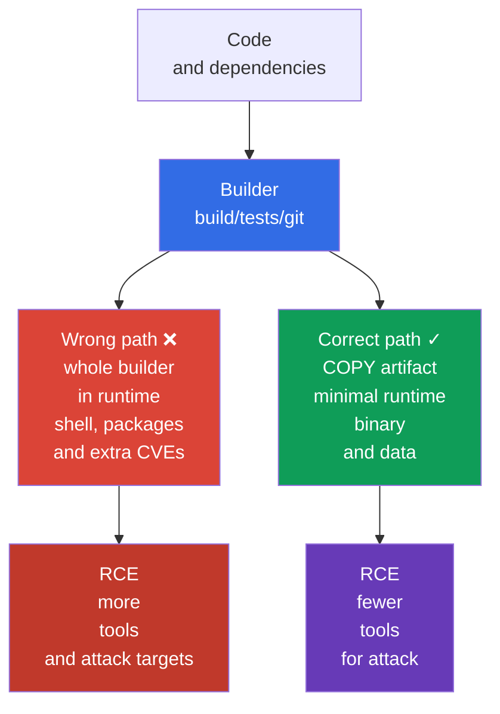
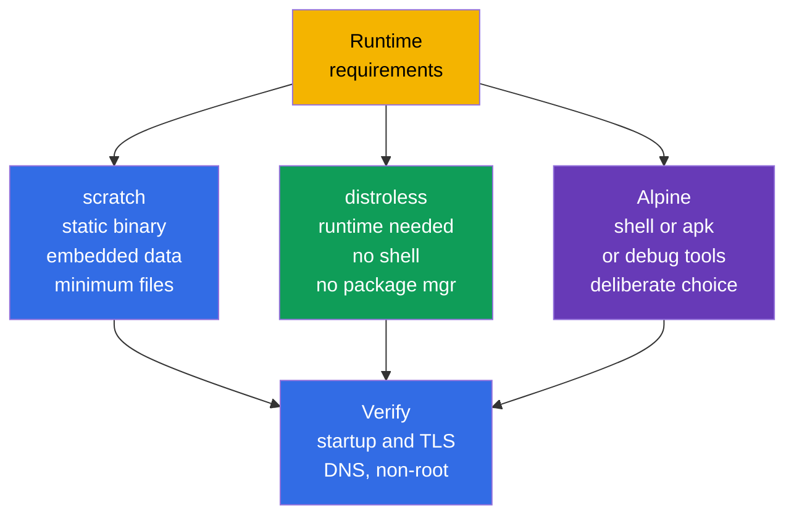

[Русская версия](ru.md) · [Versión en español](es.md) · [Version française](fr.md) · [Deutsche Version](de.md) · [ქართული ვერსია](ge.md) · [繁體中文版](tw.md) · [日本語版](jp.md)

# Chapter 24. Minimize the base image

> **Problem.** After RCE, a full runtime image gives an attacker not only the application
> process, but also a shell, package manager, compiler, source code, and unnecessary libraries.
> Each component adds a CVE or ready-made tool for downloading a payload, reconnaissance, and
> persistence. If the whole builder enters the final image, the risk repeats on every node where
> that artifact is pulled and run.

> **What comes next.** In [chapter 23](../23/README.md), we encrypted traffic between Pods and
> confirmed peer identity. Now we protect what runs in a Pod: the image and its build context.
> This is the CKS **Supply Chain Security** domain (20%). A smaller, reproducible image contains
> fewer components, CVEs, and ready-made attacker tools, but by itself does not replace SBOM,
> signing, policy, or scanning - these follow in chapters 25-28.

> **What you need from CKA.** Basic concepts of image, Dockerfile, layers, tags, and
> multi-stage build are covered in [CKA chapter 23](../../../cka/course/23/README.md), while
> `runAsNonRoot`, capabilities, and a read-only root filesystem are in
> [CKA chapter 20](../../../cka/course/20/README.md). Here we apply them to a supply-chain threat:
> we do not merely make an image small, but exclude the unnecessary from the final artifact.

> 🧠 A minimal final image reduces CVEs and post-exploitation tools, but does not replace RCE protection, `SecurityContext`, networking, or detection.

## 24.1. Threat model: unnecessary image contents give an attacker more options

An image is part of the delivered software artifact. Everything that enters its final stage
reaches every node that pulls the image: package manager, shell, compiler, source code, test
keys, layer history, and transitive libraries. A vulnerability in any such component is an
additional CVE; a utility such as `curl`, `wget`, or `sh` is a ready-made tool for action after
application compromise.

A typical scenario is that the application has RCE. In a full `ubuntu` image, an attacker runs
`/bin/sh`, downloads a payload, installs utilities through the package manager, reads build files,
and tries to escalate privileges. In a minimal image without a shell and package manager, RCE is
still critical, but the path after it is shorter: there is no interactive shell, compiler, or much
of the library set. This is **attack-surface reduction**, not a security boundary: process privileges,
`SecurityContext`, NetworkPolicy, and runtime detection are still required.



Minimization has four practical effects:

- fewer packages - fewer known vulnerabilities and updates to maintain;
- smaller size - faster pull, rollout, and autoscaling, with lower registry and network use;
- no build tools and source in runtime - harder to steal or use them;
- fewer executables - fewer commands available after RCE.

Do not measure security only in megabytes. A 5 MiB image with a vulnerable application or a
root process is not secure, while removing CA certificates can break TLS. Minimize
**intentionally**: keep runtime, CA bundle, timezone data, and dynamic libraries that the
application genuinely requires.

> 🧠 Fewer files in a runtime image means fewer post-exploitation tools for an attacker; choosing `scratch`/distroless/Alpine is a trade-off between attack surface and diagnosability.

## 24.2. `scratch`, distroless, and Alpine: choose the runtime based on application requirements

The base image determines which files exist before `COPY`. The final stage need not resemble the
builder. Choose it after understanding whether the artifact is a static binary, whether it needs
a language runtime, and whether diagnostics or native libraries are required.

| Runtime base | Contents | Best suited for | Limitation and risk |
|---|---|---|---|
| `scratch` | empty base image: the image itself has no runtime files | static Go/Rust/C++ binary that does not need absent runtime libraries | no shell, CA bundle, timezone data, or dynamic loader; Kubernetes/runtime normally provide Pod `/etc/resolv.conf`, but the application still needs a compatible DNS resolver and required runtime data |
| distroless | only selected runtime/libraries, without shell or package manager | Go/Java/Node/Python application that needs a minimal supported runtime | ordinary `kubectl exec -- sh` is impossible; debug through logs, metrics, and `kubectl debug` |
| Alpine | minimal Linux with BusyBox and `apk` | application or diagnostics that genuinely need shell/packages | shell and package manager remain; `musl` rather than glibc can be incompatible with a native dependency |

`/etc/resolv.conf`, `/etc/hosts`, and hostname-related files can be supplied by kubelet/container
runtime when a Pod starts; they are not files to copy into `scratch` automatically.



`Alpine` is not automatically safer than distroless merely because it is small. Its `/bin/sh` and
`apk` help developers, but are also useful after RCE. Conversely, do not select distroless at the
cost of functionality. For example, an application with a CGO dependency can require glibc and
specific shared libraries; first inspect the binary through `ldd` in the builder, then select a
compatible runtime.

Check what a tag means for the particular vendor. `:latest` does not pin an artifact and is not
suitable for production. A version tag (`alpine:3.21.2`) is the minimum; for release, also pin an
immutable digest obtained and verified through your registry:

```text
registry.example.com/payments/api:1.4.2@sha256:<verified-64-character-digest>
```

Write the digest into GitOps/manifest after image verification, not by taking it from a random
post. A tag is convenient for people; a digest guarantees the bytes that were scanned and signed.
Kubernetes uses the same value in `image:`.

> 🎯 Use a separate builder and final stage with `COPY --from=builder` of only the finished artifact; compiler, source, cache, and credentials must not enter runtime.

## 24.3. Multi-stage build: a builder must not become runtime

A multi-stage Dockerfile separates trusted roles. The first stage can contain a Go compiler,
package cache, and source. The last stage receives only the finished artifact.
`COPY --from=builder` does not copy the entire builder filesystem when one file is explicitly
selected. This removes compiler, `git`, `go.mod`, private build caches, and most transitive
dependencies from runtime.

Below is a complete example for a small Go HTTP service. It assumes the directory has `go.mod`,
`go.sum`, and `./cmd/server`; `CGO_ENABLED=0` makes a static binary suitable for `scratch`. All
images have specific versions, and the final process does not run as UID 0.

```dockerfile
# syntax=docker/dockerfile:1.7
# Dockerfile
FROM golang:1.27.1-alpine3.24@sha256:<verified-digest> AS builder
WORKDIR /src

# Rarely changing dependency manifests above code provide better cache.
COPY go.mod go.sum ./
RUN go mod download

COPY . ./
RUN CGO_ENABLED=0 GOOS=linux go build -trimpath -ldflags="-s -w" \
    -o /out/server ./cmd/server

# In scratch, numeric UID/GID are sufficient to set non-root credentials;
# verify application runtime dependencies separately.
FROM scratch
COPY --from=builder /out/server /server
USER 65532:65532
EXPOSE 8080
ENTRYPOINT ["/server"]
```

A numeric UID/GID lets runtime run a process without a user entry in `/etc/passwd`, but does not
guarantee application functionality: it can need user or group lookup, `HOME`, timezone data, CA
bundle, NSS, or other runtime files.

`USER` in an image is the first barrier: the default process is non-root, including with local
`docker run`. Pin it in Pod-level policy and SecurityContext so an image consumer cannot cancel
the decision with an accidental manifest:

```yaml
apiVersion: v1
kind: Pod
metadata:
  name: minimal-api
spec:
  securityContext:
    runAsNonRoot: true
    runAsUser: 65532
    runAsGroup: 65532
  containers:
  - name: api
    image: registry.example.com/training/minimal-api:1.0.0
    ports:
    - containerPort: 8080
    securityContext:
      allowPrivilegeEscalation: false
      readOnlyRootFilesystem: true
      capabilities:
        drop: ["ALL"]
```

`runAsNonRoot: true` does not create an image user or fix file ownership. It prevents startup if
runtime determines the user is root. Ensure that the binary and directories the application writes
to are available to UID `65532`; with `readOnlyRootFilesystem: true`, put temporary data in
`emptyDir` rather than restoring a writable root.

> 🔬 Docker and rootless Podman use the same Dockerfile/context; rootless does not protect against a broad context, mutable base image, or secret in a layer.

### Docker and Podman builds

Both commands use one Dockerfile and one build context. Docker normally works through a daemon;
Podman is daemonless and can work rootless, so it is useful when a build must not receive root
access to the host Docker socket. Rootless Podman does not make an insecure Dockerfile safe:
secret and unnecessary files can still enter the image.

```bash
# Docker: BuildKit is required for secret mounts in the following section.
DOCKER_BUILDKIT=1 docker build \
  --tag registry.example.com/training/minimal-api:1.0.0 \
  --file Dockerfile .

docker image inspect registry.example.com/training/minimal-api:1.0.0 \
  --format 'size={{.Size}} bytes user={{.Config.User}}'
docker run --rm --user 65532:65532 \
  registry.example.com/training/minimal-api:1.0.0

# Rootless Podman: run as an ordinary user, without sudo.
podman build \
  --tag registry.example.com/training/minimal-api:1.0.0 \
  --file Dockerfile .
podman image inspect registry.example.com/training/minimal-api:1.0.0 \
  --format 'size={{.Size}} bytes user={{.Config.User}}'
podman run --rm --user 65532:65532 \
  registry.example.com/training/minimal-api:1.0.0
```

Multi-stage reduces runtime, but does not itself make the builder trusted or a build reproducible.
For release, pin and verify the base-image digest, module/package versions, and dependency source;
do not let a build depend uncontrolledly on mutable external repositories. Pass secrets for private
dependencies only through BuildKit/Podman secret mounts.

Do not use `--no-cache` as a permanent "security check": it only disables cache and increases
time and traffic, but does not make dependencies reproducible. Then check the created digest
before publication.

### Distroless option

If a static build is impossible, the final stage can be distroless. Use a versioned/variant base,
and for release replace it with the verified digest for your platform. Distroless `:nonroot`
already sets an unprivileged user, but `USER` is stated explicitly to make the intent visible in
the Dockerfile.

```dockerfile
FROM gcr.io/distroless/static-debian13:nonroot@sha256:<verified-digest>
COPY --from=builder /out/server /server
USER 65532:65532
ENTRYPOINT ["/server"]
```

> 🎯 `RUN rm` does not erase a secret from a preceding layer; use a secret mount and `.dockerignore`, revoke the leak, and rebuild the image.

## 24.4. Layers, secrets, and build context

Every filesystem-changing Dockerfile instruction can create a layer. A layer is immutable: if a
secret is created in a layer of a stage that enters a published image, `RUN rm /tmp/token` in the
next layer does not erase its bytes from the lower layer. Therefore, do not pass a secret through
`COPY`, `ADD`, `ARG`, or `ENV`.

An ordinary multi-stage build is a different case: separate builder layers do not become layers
of the final runtime image if the final stage starts from its own `FROM` and only the required
artifact is transferred through `COPY --from`.

This does not automatically make unsafe credential transfer safe. A secret can still enter the
final image through an accidentally copied artifact, a separately published intermediate image,
or build logs. If a credential was passed by `ARG`/`ENV` or written into a filesystem layer, it
can also remain in build metadata, history, or cache of the corresponding build stage. Use
BuildKit/Podman secret mounts for build-time credentials instead of `ARG`, `ENV`, `COPY`, or `ADD`.

```dockerfile
# NEVER: token remains in history/config or one of the layers.
ARG NPM_TOKEN
RUN npm config set //registry.example.com/:_authToken="$NPM_TOKEN" && npm ci

# NEVER: .npmrc can enter COPY . . and persist in a layer.
COPY .npmrc /root/.npmrc
RUN npm ci
RUN rm /root/.npmrc
```

For BuildKit, use a secret mount: the secret is temporarily available only to the required `RUN`
command and does not enter its output layer; the secret value is also not included in provenance
attestation. A command using the secret must still not print it to stdout/stderr, write it into an
artifact for `COPY --from`, or retain the credential in an ordinary filesystem layer. An external
cache is acceptable with correct `--secret`: the danger is not cache export itself, but a credential
in cacheable filesystem output due to incorrect secret handling.

```dockerfile
# syntax=docker/dockerfile:1.7
FROM node:22.23.2-alpine@sha256:<verified-digest> AS builder
WORKDIR /app
COPY package.json package-lock.json ./
# Build tools (TypeScript, Vite, webpack, etc.) are normally in devDependencies.
RUN --mount=type=secret,id=npmrc,target=/root/.npmrc \
    npm ci
COPY . .
RUN npm run build
# Remove devDependencies only after building; runtime stage copies artifacts and required dependencies.
RUN npm prune --omit=dev
```

```bash
# .npmrc is stored in secret store/CI, not next to Dockerfile.
DOCKER_BUILDKIT=1 docker build \
  --secret id=npmrc,src="$HOME/.config/build-secrets/npmrc" \
  -t registry.example.com/training/web:1.0.0 .

podman build \
  --secret id=npmrc,src="$HOME/.config/build-secrets/npmrc" \
  -t registry.example.com/training/web:1.0.0 .
```

If a secret was already published in an image, a new `RUN rm` alone is insufficient. Immediately
revoke and replace the secret, remove/restrict access to the registry artifact, then rebuild the
image from a clean Dockerfile with the new secret. Treat the old credential as compromised.

### `.dockerignore` - the build-context boundary

Before executing a Dockerfile, the client sends the build context to the builder. Without
`.dockerignore`, `COPY . .` can include `.git`, local `.env`, SSH keys, test artifacts, and large
directories. `.dockerignore` reduces traffic, speeds builds, and prevents these files from becoming
available to Dockerfile instructions. This is important protection, but not a substitute for secret
management: a file that is required in context can still be copied accidentally.

```dockerignore
# .dockerignore
.git
.gitignore
.env
.env.*
.npmrc
*.pem
*.key
id_rsa
secrets/
coverage/
tmp/
node_modules/
**/.DS_Store
README.md
```

Rules must match the project. Do not blindly ignore `*.pem` when the application genuinely needs
a public CA certificate: instead keep the explicitly permitted public certificate in a separate
directory and copy only it. Separate the build context from repository root, for example with
`docker build -f docker/Dockerfile docker/`, when a Dockerfile does not need the whole monorepo.

### Reduce layers without harmful "optimizations"

Combine related installation/cleanup operations in one `RUN` so package-manager cache does not
remain in a preceding layer. But do not merge the whole Dockerfile into one unreadable command:
`COPY` ordering must retain cache, while policy and review must show what is installed.

```dockerfile
# Alpine: package index and build dependencies do not remain in this stage.
RUN apk add --no-cache --virtual .build-deps build-base \
 && make release \
 && apk del .build-deps
```

This is useful only when the command is in the final stage. The best option is normally simpler:
do not transfer the stage containing `apk`, compiler, and cache to runtime at all through a
multi-stage build.

> 🎯 Inspect the final artifact through `history`, `inspect`, and `dive`; for distroless/scratch, only the expected missing-executable error proves absence of shell, not any non-zero `kubectl exec`.

## 24.5. Inspection: measure size, layers, and contents

After building, do not assume the final image is minimal: prove it. `docker image ls` shows total
size, but does not explain which layer introduced it. `history`, `inspect`, and `dive` help expose
commands, sizes, and file changes.

```bash
IMAGE=registry.example.com/training/minimal-api:1.0.0

# Total size and commands that created layers.
docker image ls "$IMAGE"
docker history --no-trunc "$IMAGE"
docker image inspect "$IMAGE" \
  --format 'user={{.Config.User}} entrypoint={{json .Config.Entrypoint}} size={{.Size}}'

# The same checks when using Podman.
podman history --no-trunc "$IMAGE"
podman image inspect "$IMAGE" \
  --format 'user={{.Config.User}} entrypoint={{json .Config.Entrypoint}} size={{.Size}}'

# Interactive TUI: size of each layer, wasted space, files.
dive "$IMAGE"
```

In `dive`, look for:

- a large layer from `COPY . .` - most often context is too broad or Dockerfile ordering is wrong;
- package cache, compiler, tests, `.git`, `.env`, private key, or `.npmrc` - reason to fix
  Dockerfile/.dockerignore and immediately rotate a discovered secret;
- "wasted bytes" after `RUN install` and a separate `RUN rm` - deletion happened too late,
  in a new layer;
- `User` empty or equal to `root` - Dockerfile did not set a non-root user.

`dive` sees only what is available in the image. It does not replace vulnerability scanning,
secret scanning, or SBOM. A useful CI order is: build -> inspect/lint -> SBOM/scan -> push
immutable digest -> sign/attest digest -> verify -> deploy/admission. In the normal
Cosign/Sigstore workflow, first publish an image and obtain its immutable digest; then Cosign
signs that digest and creates an attestation in the registry; deployment/admission verify the
connection. The next chapter adds SBOM; chapters 26-28 add signing, policy, and scanners.

## 24.6. Verification without a shell: distroless behaves differently by design

Lack of a shell is a property of distroless/scratch runtime, not a Kubernetes error. Thus a
successful `kubectl exec <pod> -- /bin/sh` in such an image would be a warning sign. Check the
application endpoint and UID through standard methods, and record the expected shell denial
separately.

```bash
kubectl apply -f minimal-api.yaml
kubectl wait --for=condition=Ready pod/minimal-api --timeout=90s
kubectl logs minimal-api

# Verify successful application startup by endpoint/health probe, not shell.
kubectl port-forward pod/minimal-api 8080:8080
# In another terminal: curl -fsS http://127.0.0.1:8080/health

# First exclude generic exec failure: Pod is Ready and RBAC permits pods/exec.
if [[ "$(kubectl auth can-i create pods --subresource=exec)" != yes ]]; then
  echo "ERROR: current identity cannot create pods/exec" >&2
  exit 1
fi

# Distroless/scratch is expected to return exactly a missing-executable error.
if output=$(kubectl exec minimal-api -c api -- /bin/sh 2>&1); then
  echo "ERROR: /bin/sh unexpectedly exists in the minimal runtime" >&2
  exit 1
else
  status=$?
  if printf '%s\n' "$output" | grep -Eqi 'executable file not found|stat /bin/sh: no such file or directory'; then
    echo "OK: /bin/sh is absent as expected"
  else
    printf 'ERROR: kubectl exec failed, but /bin/sh absence was not proven (exit %s): %s\n' \
      "$status" "$output" >&2
    exit 1
  fi
fi

# Settings that do not require a shell:
kubectl get pod minimal-api -o jsonpath='{.spec.securityContext.runAsNonRoot}{"\n"}'
kubectl get pod minimal-api -o jsonpath='{.spec.containers[0].securityContext.allowPrivilegeEscalation}{"\n"}'
```

Do not add `busybox` to a production image "for debugging": it cancels part of the minimization
goal. During an incident, use logs, metrics, trace, `kubectl describe`, and a temporary ephemeral
debug container isolated from the production image:

```bash
# Requires RBAC permission and ephemeral-container support in the cluster.
kubectl debug -it pod/minimal-api --target=api \
  --image=busybox:1.36.1 -- sh
```

An ephemeral debug container is in the same Pod and shares its network namespace. `--target=api`
asks container runtime to put the debug container in the target container's process namespace;
this requires runtime support. Without it, the debug container can start with an isolated process
namespace and not see application processes. Its root filesystem and mount namespace do not
automatically become those of the target container. The debug image must also have a specific
version (and an approved digest in production) and must not be used as a permanent bypass for
missing shell.

### Common errors and diagnostics

| Symptom | Probable cause | What to do |
|---|---|---|
| `exec /server: no such file or directory` in `scratch` | binary is dynamically linked or wrong architecture | build with `CGO_ENABLED=0`; check `file /out/server`, platform, and dependencies in builder |
| HTTPS does not work in `scratch` | CA certificates are missing | embed CA bundle in application or copy only required public bundle from separate stage |
| Pod does not start with `runAsNonRoot` | image/manifest tries to use UID 0 | set `USER` in Dockerfile, ownership, and explicit numeric UID; do not bypass the check |
| `kubectl exec ... /bin/sh` does not work | expected absence of shell in distroless/scratch | check logs/endpoint; use `kubectl debug` for investigation |
| secret found in `dive`/history | credential was copied, passed by `ARG`, or removed in a later layer | revoke secret, rebuild without it, use BuildKit/Podman secret mount |
| Docker and Podman built different result | different builder/cache/platform or unpinned base image | explicitly set platform when needed, pin digest, and compare final digest |

> 🏭 Pinned base/release digest, narrow context, secret management, non-root runtime, SBOM/scan/signature, and admission; debug uses an approved ephemeral debug image.

## 24.7. How this is applied in production

- **Build and runtime are separate.** A builder can be heavy, but the final stage permits only
  artifact, runtime libraries, and required public data. Stages, dependencies, and base images
  receive review as production code.
- **Versions and digests are pinned.** Linter/policy prohibits `latest`. Release connects a
  human-readable tag with immutable digest; the same digest goes through SBOM, scan, signing,
  and deployment.
- **Non-root is defence in depth.** `USER` in an image, `runAsNonRoot`/numeric UID in a Pod,
  and admission policy reinforce one another. Add `drop: ["ALL"]`,
  `allowPrivilegeEscalation: false`, and read-only root when the application is compatible.
- **Secrets are not build arguments.** CI provides a short-lived credential for build time;
  BuildKit/Podman secret mounts, scoped registry permissions, and `.dockerignore` reduce leakage
  risk. A leak in a layer means rotation, not merely a new build.
- **Debug is separate from runtime.** Observability and approved ephemeral debug images replace
  a shell inside the application image. This keeps the production artifact identical in CI and
  the cluster.
- **Minimization belongs in the pipeline.** Teams measure image size and layer composition,
  run `dive` during review, run SBOM/scan/sign in CI, and periodically rebuild an image on base
  updates. A small image does not remove the need to respond to CVEs.

## 24.8. Mini-glossary

- **Attack surface** - components, files, and interfaces that can contain a vulnerability or be
  used in an attack.
- **Base image** - image in a `FROM` instruction that defines the initial filesystem of a stage.
- **Build context** - files passed to the builder; limited by `.dockerignore`.
- **distroless** - minimal runtime image without package manager and normally without shell.
- **`scratch`** - empty base image without a filesystem; suitable for static artifacts.
- **Multi-stage build** - Dockerfile with separate build and runtime stages connected by
  `COPY --from=`.
- **Layer** - immutable change to an image filesystem; removal in a new layer does not erase
  old-layer content.
- **Digest** - immutable SHA-256 identifier of particular image manifest/content.
- **Rootless Podman** - Podman mode in which an ordinary user, rather than a root daemon,
  performs build/run.
- **Secret mount** - temporary credential mount for one build command, without writing it to
  a final layer.

## 24.9. Chapter summary

- Extra packages, shell, package manager, build tools, and secrets increase attack surface and
  RCE impact; a small image reduces risk but does not replace other security controls.
- `scratch` suits a static binary, distroless provides minimal runtime without shell, while
  Alpine is selected only for a genuine need for its Linux userland and with consideration of `musl`.
- Multi-stage build leaves only the artifact in the final image; builder, source, and compiler
  are not transferred there.
- Base images, packages, and application releases are pinned by version; production deployment
  uses a verified immutable digest, not `latest`.
- `USER` in Dockerfile and `runAsNonRoot` in a Pod are complementary non-root startup checks.
- Docker and rootless Podman build one Dockerfile; builder privileges do not cancel context and
  secret rules.
- Do not pass a secret by `ARG`, `ENV`, `COPY`, or remove it in a later layer; use a
  BuildKit/Podman secret mount and `.dockerignore`.
- `dive`, `history`, and `inspect` show layers, wasted bytes, files, and effective user.
  In distroless, absence of `/bin/sh` is verified by the expected `kubectl exec` denial.

## 24.10. How this helps: on the exam and in real work

**On the exam.** Quickly identify `latest`, root user, a secret in Dockerfile, and an unnecessary
runtime stage; write `COPY --from=...`, `USER`, `.dockerignore`, `docker build`/`podman build`
commands, and inspect the image. A task asking why `kubectl exec ... sh` does not work for
distroless normally checks understanding of minimal runtime, not ability to add a shell back.

**In real work.** These decisions reduce the CVE backlog and rollout time, but the principal
result is a reproducible artifact: the team knows its base digest, contents, UID, and verification
history. This lets the next supply-chain step - SBOM, scanning, signing, and admission policy -
work with an exactly defined image.

> ### 🔴 Attacker's view
> **Asset:** secrets and credentials in build-time files such as `.npmrc` and token.
> **Starting foothold:** access to Dockerfile/build context or ability to inspect a built image.
> **Attacker objective:** find a credential forgotten in intermediate image layers.
> **Abuse path:** inspect layers of a published final image and extract a credential if it was created in one of its lower layers or accidentally copied from the builder. Separate builder layers do not enter an ordinary final multi-stage image, but a credential can remain in a separately published intermediate image, build logs, or cacheable filesystem output if a secret is passed with `ARG`/`ENV`/`COPY` or written by a build command into a layer/artifact. Correct BuildKit `--mount=type=secret` does not retain the secret value in final layer or provenance attestation.
> **Expected evidence:** final layers, copied artifacts, and available build outputs contain no credential; provenance contains no secret value.
> **Control:** BuildKit `--mount=type=secret`, `.dockerignore` for credential files, and `COPY --from` of only the required artifact; use external cache only without credential in cacheable filesystem output.
> **Retest:** repeat inspection of final layers, available build outputs, and provenance reveals no credential.

## 24.11. Self-check questions

<details>
<summary>1. Why do shell and package manager in a runtime image increase RCE impact even though their absence does not fix an application vulnerability?</summary>

After RCE, shell, `curl`/`wget`, compiler, and package manager give an attacker ready-made means to download a payload, install utilities, and inspect the filesystem. Their absence reduces post-exploitation surface, but does not fix the original RCE or replace SecurityContext, NetworkPolicy, or runtime detection. Minimization is therefore defence in depth, not a security boundary itself.
</details>

<details>
<summary>2. How do you choose between `scratch`, distroless, and Alpine for a static Go binary, a Java application, and an application requiring a native tool?</summary>

A static Go binary with `CGO_ENABLED=0` suits `scratch` if DNS, TLS, CA bundle, and required runtime data are checked. A Java application needs a minimal supported language runtime, so choose the corresponding distroless variant. If shell, `apk`, or a native diagnostic tool is genuinely required, Alpine is justified, but its BusyBox/package manager and `musl` need separate compatibility and security assessment.
</details>

<details>
<summary>3. What exactly does `COPY --from=builder` prevent, and what can still enter a final image by mistake?</summary>

`COPY --from=builder` transfers only the explicitly named artifact, not the whole builder filesystem; compiler, source, `git`, build cache, and most dependencies therefore do not automatically reach runtime. But an erroneous broad `COPY`, an added runtime dependency, or a secret already in the copied path can still enter the final image. Check contents through `history`, `inspect`, and `dive`.
</details>

<details>
<summary>4. Why is a version tag better than `latest`, and why is a digest stronger than a version tag for release?</summary>

`latest` is mutable and does not pin a verified artifact, while a version tag at least identifies a release. An immutable digest links deployment to the specific manifest/content bytes that were scanned and signed. For release, the chapter recommends keeping the tag together with the verified `@sha256:...` digest in GitOps.
</details>

<details>
<summary>5. How is `USER` in Dockerfile related to `runAsNonRoot` in a Pod, and why are both needed?</summary>

`USER` makes non-root execution the default for an image and local `docker run`; a numeric UID works even without an `/etc/passwd` entry. `runAsNonRoot` in a Pod does not create a user or fix ownership, but prevents runtime from starting a determined root user. A Pod can also explicitly set UID/GID and reinforce the decision with admission policy.
</details>

<details>
<summary>6. Why does `RUN rm /secret` not remove a secret from image history? Which mechanism should be used for private-dependency credentials?</summary>

If a secret was created in a layer of a stage that enters the published image, removal in the next layer does not erase its bytes from lower-layer/history. In an ordinary multi-stage build, a separate builder does not enter final image by itself, but `ARG`, `ENV`, `COPY`, or `ADD` remain unsafe: credential can reach a copied artifact, cache, logs, or separately published intermediate image. BuildKit/Podman `--mount=type=secret` temporarily provides the secret only to the build instruction and does not preserve its value in final layer or provenance attestation. A build command can still print the secret or write it into a generated artifact, so inspect output anyway. If a secret has been published, revoke and rotate it, and rebuild from a clean Dockerfile.
</details>

<details>
<summary>7. What does `.dockerignore` limit, and why does it not replace a secret manager?</summary>

`.dockerignore` limits the files in build context sent to the builder, so `.git`, `.env`, keys, and test artifacts do not become available to `COPY . .`. This reduces leakage risk and build size/time. But a file still required in context can be copied by mistake, so credentials must be supplied by a secret manager through a secret mount.
</details>

<details>
<summary>8. Which signs in `dive` indicate overly broad context or layer waste?</summary>

A large layer from `COPY . .` normally means broad context or incorrect Dockerfile order. Compiler, package cache, tests, `.git`, `.env`, private key, and `.npmrc` reveal unnecessary contents, while wasted bytes after `RUN install` and a separate `RUN rm` indicate late deletion. An empty or root `User` also signals that Dockerfile did not set a non-root user.
</details>

<details>
<summary>9. How can you prove a distroless Pod works when `/bin/sh` is intentionally absent?</summary>

Check Ready, logs, health endpoint, or probe, for example through `kubectl port-forward` and `curl`, rather than trying to restore a shell. Absence of shell is proved by the specific expected missing-executable error after checking Pod Ready and `pods/exec` access; any non-zero `kubectl exec` is not proof. For incident diagnosis, use logs, metrics, `describe`, or a temporary approved ephemeral debug container.
</details>

<details>
<summary>10. How is rootless Podman useful to a build pipeline, and what does it not protect?</summary>

Rootless Podman runs build/run as an ordinary user without a root Docker daemon, reducing the need to grant a pipeline access to the host Docker socket. It uses the same Dockerfile and build context, but does not prevent secret and excess files from entering an image. `.dockerignore`, secret mounts, and Dockerfile review therefore remain mandatory.
</details>

<details>
<summary>11. **Flashback (chapter 14).** Base-image minimization (this chapter: distroless, no shell/package manager) and host-footprint minimization (chapter 14: disabling unnecessary services/packages on a node) apply the same "smaller attack surface" principle at two different levels. If time before an exam/incident is limited, which level reduces risk faster for an **already compromised** container - and why does neither replace the other?</summary>

For an already compromised container, minimizing the runtime image changes the tools available to an attacker faster: shell, package manager, and downloader can be absent immediately. Minimizing host footprint protects the node and other workloads by reducing services and packages through which an escape can develop after host access. An image does not protect a compromised node, and a secure node does not remove excess tools inside a container, so both levels are needed.
</details>

## Practice

🧪 Lab 111 (minimal image, multi-stage, non-root, and artifact inspection):
[tasks/cks/labs/111](../../labs/111/README.MD)

🌐 Additional interactive practice (killer.sh/killercoda, external resource): [container-image-footprint-user](https://killercoda.com/killer-shell-cks/scenario/container-image-footprint-user) · [container-hardening](https://killercoda.com/killer-shell-cks/scenario/container-hardening)

For Dockerfile and image fundamentals, revisit [CKA chapter 23](../../../cka/course/23/README.md);
for process restrictions in a Pod, [CKA chapter 20](../../../cka/course/20/README.md).

---
[Table of contents](../README.md) · [Chapter 23](../23/README.md) · [Chapter 25](../25/README.md)
