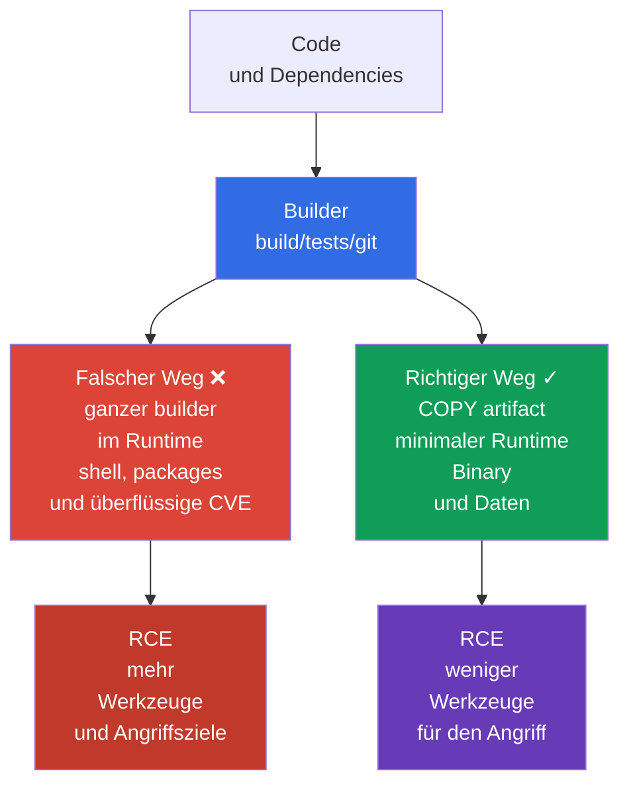
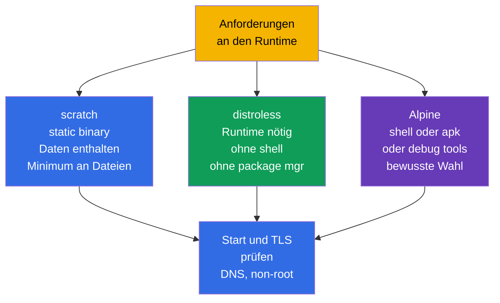

[Русская версия](ru.md) · [Eng version](README.md) · [Versión en español](es.md) · [Version française](fr.md) · [ქართული ვერსია](ge.md) · [繁體中文版](tw.md) · [日本語版](jp.md)

# Kapitel 24. Minimierung der Base Image

> **Das Problem.** Nach einem RCE liefert eine vollständige Runtime-Image dem Angreifer nicht nur den
> Anwendungsprozess, sondern auch shell, package manager, compiler, source und überflüssige libraries.
> Jede dieser Komponenten fügt ein CVE hinzu oder ein fertiges Werkzeug zum Herunterladen von payload,
> für reconnaissance und persistence. Gelangt der gesamte builder in die final image, wiederholt sich
> das Risiko auf jedem node, der dieses artifact herunterlädt und ausführt.

> **Was folgt.** In [Kapitel 23](../23/de.md) haben wir den Traffic zwischen Pod verschlüsselt und die
> Identity des Peer bestätigt. Jetzt schützen wir, was im Pod läuft: die Image und ihren build context.
> Das ist die Domain **Supply Chain Security** von CKS (20 %). Eine kleinere und reproduzierbare Image
> enthält weniger Komponenten, CVE und fertige Werkzeuge für den Angreifer, ersetzt aber selbst nicht
> SBOM, Signatur, policy und scanning - diese folgen in den Kapiteln 25-28.

> **Was Sie aus CKA wissen müssen.** Die Grundbegriffe image, Dockerfile, layers, tags und multi-stage
> build werden in [CKA-Kapitel 23](../../../cka/course/23/de.md) behandelt, `runAsNonRoot`, capabilities
> und read-only root filesystem in [CKA-Kapitel 20](../../../cka/course/20/de.md). Hier wenden wir diese
> auf die Supply-Chain-Bedrohung an: Wir machen die Image nicht nur klein, sondern schließen Überflüssiges
> aus dem final artifact aus.

> 🧠 Eine minimale final image reduziert CVE und post-exploitation tools, ersetzt aber nicht RCE-Schutz, `SecurityContext`, Netzwerk oder detection.

## 24.1. Bedrohungsmodell: Überflüssiges in der Image wird zur Fähigkeit des Angreifers

Eine Image ist Teil des ausgelieferten software artifact. Alles, was in ihren final stage gelangt,
gelangt auf jeden node, der die Image herunterlädt: package manager, shell, compiler, source, test
keys, layer-Historie und transitive libraries. Eine Schwachstelle in jeder dieser Komponenten ist ein
zusätzliches CVE; ein utility wie `curl`, `wget` oder `sh` ist ein fertiges Werkzeug für Aktionen nach
der Kompromittierung der Anwendung.

Typisches Szenario: Die Anwendung hat RCE. In einer vollständigen `ubuntu`-Image führt der Angreifer
`/bin/sh` aus, lädt payload herunter, installiert utilities über den package manager, liest build-Dateien
und versucht privileges zu eskalieren. In einer minimalen Image ohne shell und package manager bleibt
RCE weiterhin kritisch, doch der Weg danach ist kürzer: keine interaktive shell, kein compiler und ein
Großteil der libraries fehlt. Das ist **Reduzierung der attack surface**, keine security boundary:
Prozessrechte, `SecurityContext`, NetworkPolicy und runtime detection bleiben weiterhin nötig.



Minimierung bringt vier praktische Effekte:

- weniger packages - weniger bekannte Schwachstellen und weniger zu pflegende updates;
- geringere Größe - schnellerer pull, rollout und autoscaling, geringerer registry- und Netzwerkaufwand;
- keine build-Werkzeuge und kein source im Runtime - schwerer zu stehlen oder zu nutzen;
- weniger executables - weniger Befehle, die nach RCE verfügbar sind.

Messen Sie Sicherheit nicht nur in Megabyte. Eine 5-MiB-Image mit einer verwundbaren Anwendung oder
einem root-Prozess ist unsicher, und das Entfernen von CA-Zertifikaten kann TLS brechen. Minimieren Sie
**bewusst**: Belassen Sie Runtime, CA bundle, timezone data und dynamic libraries, die die Anwendung
tatsächlich benötigt.

> 🧠 Weniger Dateien in der Runtime-Image bedeuten weniger post-exploitation tools für den Angreifer; die Wahl zwischen `scratch`/distroless/Alpine ist ein trade-off zwischen attack surface und Diagnosefähigkeit.

## 24.2. `scratch`, distroless und Alpine: Runtime nach Bedarf wählen

Die base image legt fest, welche Dateien vor `COPY` existieren. Der final stage muss dem builder nicht
ähneln. Wählen Sie sie erst, nachdem Sie verstanden haben, ob das artifact ein statisches Binary ist, ob
ein language runtime benötigt wird und ob Diagnose oder native libraries erforderlich sind.

| Runtime base | Inhalt | Gut geeignet für | Einschränkungen und Risiko |
|---|---|---|---|
| `scratch` | leere base image: in der Image selbst gibt es keine Runtime-Dateien | statisches Go/Rust/C++ Binary, das keine fehlenden Runtime-libraries benötigt | keine shell, kein CA bundle, keine timezone data und kein dynamic loader; Kubernetes/Runtime stellt dem Pod meist `/etc/resolv.conf` bereit, doch die Anwendung muss dennoch einen kompatiblen DNS resolver und benötigte Runtime-Daten mitbringen |
| distroless | nur ausgewählter Runtime/libraries, ohne shell und package manager | Go/Java/Node/Python-Anwendungen, wenn ein minimal unterstützter Runtime nötig ist | gewöhnliches `kubectl exec -- sh` ist unmöglich; Debugging über logs, metrics und `kubectl debug` |
| Alpine | minimales Linux mit BusyBox und `apk` | Anwendung oder Diagnose, die tatsächlich shell/packages benötigt | shell und package manager bleiben erhalten; `musl` statt glibc kann mit native dependency inkompatibel sein |

`/etc/resolv.conf`, `/etc/hosts` und hostname-bezogene Dateien können vom kubelet/container runtime beim
Start des Pod bereitgestellt werden und sind keine Dateien, die automatisch nach `scratch` kopiert
werden müssen.



`Alpine` ist nicht automatisch sicherer als distroless, nur weil es klein ist. Sein `/bin/sh` und `apk`
sind für den Entwickler nützlich, aber ebenso nützlich bei RCE. Umgekehrt sollte distroless nicht auf
Kosten der Funktionsfähigkeit gewählt werden. Eine Anwendung mit CGO-Abhängigkeit etwa kann glibc und
konkrete shared libraries benötigen; prüfen Sie dann zunächst das Binary mit `ldd` im builder und wählen
Sie einen kompatiblen Runtime.

Prüfen Sie, was der tag bei einem konkreten Anbieter bedeutet. `:latest` fixiert kein artifact und ist
für production ungeeignet. Ein versionierter tag (`alpine:3.21.2`) ist das Minimum; für release fixieren
Sie zusätzlich den immutable digest, den Ihre registry ermittelt und geprüft hat:

```text
registry.example.com/payments/api:1.4.2@sha256:<geprüfter-64-Zeichen-digest>
```

Der digest wird nach der Prüfung der Image in GitOps/manifest eingetragen, nicht aus einem beliebigen
Post übernommen. Der tag ist für Menschen bequem, der digest garantiert die Bytes, die gescannt und
signiert wurden. In Kubernetes wird derselbe Wert in `image:` angegeben.

> 🎯 Getrennter builder und final stage mit `COPY --from=builder` nur des fertigen artifact; compiler, source, cache und credentials gelangen nicht in den Runtime.

## 24.3. Multi-stage build: Der builder darf nicht zum Runtime werden

Ein multi-stage Dockerfile trennt vertrauenswürdige Rollen. Der erste stage kann Go compiler, package
cache und source enthalten. Der letzte stage erhält nur das fertige artifact. `COPY --from=builder`
überträgt nicht das gesamte filesystem des builder, wenn explizit eine einzelne Datei kopiert wird. Das
beseitigt compiler, `git`, `go.mod`, private build caches und die meisten transitiven Abhängigkeiten aus
dem Runtime.

Unten ein vollständiges Beispiel für einen kleinen Go-HTTP-Service. Es setzt voraus, dass im Verzeichnis
`go.mod`, `go.sum` und `./cmd/server` vorhanden sind; `CGO_ENABLED=0` erzeugt ein statisches Binary, das
für `scratch` geeignet ist. Alle Images haben konkrete Versionen, und der final process läuft nicht als
UID 0.

```dockerfile
# syntax=docker/dockerfile:1.7
# Dockerfile
FROM golang:1.27.1-alpine3.24@sha256:<geprüfter-digest> AS builder
WORKDIR /src

# Selten wechselnde dependency manifests vor dem code: besseres cache.
COPY go.mod go.sum ./
RUN go mod download

COPY . ./
RUN CGO_ENABLED=0 GOOS=linux go build -trimpath -ldflags="-s -w" \
    -o /out/server ./cmd/server

# In scratch genügt eine numerische UID/GID, um non-root credentials zu setzen;
# prüfen Sie separat die Runtime-Abhängigkeiten der Anwendung.
FROM scratch
COPY --from=builder /out/server /server
USER 65532:65532
EXPOSE 8080
ENTRYPOINT ["/server"]
```

Eine numerische UID/GID erlaubt dem Runtime, den Prozess ohne Benutzereintrag in `/etc/passwd` zu
starten, garantiert aber nicht die Funktionsfähigkeit der Anwendung: Sie kann user- oder group-lookup,
`HOME`, timezone data, CA bundle, NSS oder andere Runtime-Dateien benötigen.

`USER` in der Image ist die erste Barriere: Der Prozess ist standardmäßig nicht root, auch bei lokalem
`docker run`. Verankern Sie dies in Pod-level policy und SecurityContext, damit der Konsument der Image
die Entscheidung nicht durch ein zufälliges manifest aufhebt:

```yaml
apiVersion: v1
kind: Pod
metadata:
  name: minimal-api
spec:
  securityContext:
    runAsNonRoot: true
    runAsUser: 65532
    runAsGroup: 65532
  containers:
  - name: api
    image: registry.example.com/training/minimal-api:1.0.0
    ports:
    - containerPort: 8080
    securityContext:
      allowPrivilegeEscalation: false
      readOnlyRootFilesystem: true
      capabilities:
        drop: ["ALL"]
```

`runAsNonRoot: true` erzeugt keinen Benutzer in der Image und korrigiert kein ownership von Dateien. Es
verhindert nur den Start, wenn der Runtime root erkennt. Stellen Sie sicher, dass Binary und Verzeichnisse,
in die die Anwendung schreibt, für UID `65532` zugänglich sind; verlagern Sie bei
`readOnlyRootFilesystem: true` temporäre Daten in ein `emptyDir`, statt ein writable root zurückzugeben.

> 🔬 Docker und rootless Podman verwenden dasselbe Dockerfile/denselben context; rootless schützt nicht vor breitem context, mutable base image oder einem secret in einem layer.

### Build mit Docker und Podman

Beide Befehle verwenden ein Dockerfile und einen build context. Docker arbeitet gewöhnlich über einen
daemon; Podman ist daemonless und kann rootless laufen, was dort nützlich ist, wo der build keinen
root-Zugriff auf den host Docker socket erhalten soll. Rootless Podman macht ein unsicheres Dockerfile
nicht sicher: secret und überflüssige Dateien können trotzdem in die Image gelangen.

```bash
# Docker: BuildKit wird für secret mount im nächsten Abschnitt benötigt.
DOCKER_BUILDKIT=1 docker build \
  --tag registry.example.com/training/minimal-api:1.0.0 \
  --file Dockerfile .

docker image inspect registry.example.com/training/minimal-api:1.0.0 \
  --format 'size={{.Size}} bytes user={{.Config.User}}'
docker run --rm --user 65532:65532 \
  registry.example.com/training/minimal-api:1.0.0

# Podman rootless: als normaler Benutzer ausführen, ohne sudo.
podman build \
  --tag registry.example.com/training/minimal-api:1.0.0 \
  --file Dockerfile .
podman image inspect registry.example.com/training/minimal-api:1.0.0 \
  --format 'size={{.Size}} bytes user={{.Config.User}}'
podman run --rm --user 65532:65532 \
  registry.example.com/training/minimal-api:1.0.0
```

Multi-stage verkleinert den Runtime, macht aber allein den builder nicht vertrauenswürdig und den build
nicht reproduzierbar. Fixieren und prüfen Sie für release den base-image digest, die Versionen von
modules/packages und die Quelle der Abhängigkeiten; lassen Sie den build nicht unkontrolliert von
mutable externen Repositories abhängen. Übergeben Sie secrets für private dependencies nur über
BuildKit/Podman secret mounts.

Verwenden Sie `--no-cache` nicht als dauerhafte „security-Prüfung": Es schaltet nur das cache ab,
erhöht Zeit und Traffic, macht Abhängigkeiten aber nicht reproduzierbar. Prüfen Sie anschließend den
erzeugten digest vor der Veröffentlichung.

### Variante mit distroless

Ist ein static build nicht möglich, kann der final stage distroless sein. Verwenden Sie eine
versionierte/variantenbezogene base und ersetzen Sie sie für release durch einen geprüften digest Ihrer
Plattform. Bei distroless setzt `:nonroot` bereits einen unprivilegierten Benutzer, doch `USER` wird
explizit angegeben, damit die Absicht im Dockerfile sichtbar ist.

```dockerfile
FROM gcr.io/distroless/static-debian13:nonroot@sha256:<geprüfter-digest>
COPY --from=builder /out/server /server
USER 65532:65532
ENTRYPOINT ["/server"]
```

> 🎯 `RUN rm` löscht kein secret aus einem vorherigen layer; verwenden Sie secret mount und `.dockerignore`, widerrufen Sie eine Lecke und bauen Sie die Image neu.

## 24.4. Layers, secrets und build context

Jede filesystem-ändernde Dockerfile-Instruktion kann einen layer erzeugen. Ein layer ist immutable: Wird
ein secret in einem layer eines stage erstellt, der in die veröffentlichte Image eingeht, löscht
`RUN rm /tmp/token` im nächsten layer dessen Bytes nicht aus dem unteren layer. Deshalb darf ein secret
nicht über `COPY`, `ADD`, `ARG` oder `ENV` übergeben werden.

Ein gewöhnlicher multi-stage build ist ein anderer Fall: Separate layers des builder werden nicht zu
layers der final runtime image, wenn der final stage mit seinem eigenen `FROM` beginnt und über
`COPY --from` nur das benötigte artifact übertragen wird.

Das macht eine unsichere Übergabe von credentials nicht automatisch sicher. Ein secret kann trotzdem
über ein versehentlich kopiertes artifact, in eine separat veröffentlichte intermediate image oder in
build logs in die final image gelangen. Wurde ein credential über `ARG`/`ENV` übergeben oder in einem
filesystem layer gespeichert, kann es auch in build metadata, history oder cache des jeweiligen build
stage verbleiben. Verwenden Sie für build-time credentials BuildKit/Podman secret mounts anstelle von
`ARG`, `ENV`, `COPY` oder `ADD`.

```dockerfile
# NIEMALS: token bleibt in history/config oder in einem der layers.
ARG NPM_TOKEN
RUN npm config set //registry.example.com/:_authToken="$NPM_TOKEN" && npm ci

# NIEMALS: .npmrc kann in COPY . . gelangen und im layer erhalten bleiben.
COPY .npmrc /root/.npmrc
RUN npm ci
RUN rm /root/.npmrc
```

Verwenden Sie für BuildKit secret mount: Das secret ist nur für den benötigten `RUN`-Befehl temporär
verfügbar und gelangt nicht in den output layer; sein Wert wird auch nicht in die provenance attestation
aufgenommen. Der Befehl, der das secret nutzt, darf es dennoch nicht in stdout/stderr ausgeben, in ein
artifact für `COPY --from` schreiben oder das credential in einem gewöhnlichen filesystem layer
speichern. External cache ist bei korrektem `--secret` zulässig: Gefährlich ist nicht der cache export
selbst, sondern ein credential in cacheable filesystem output durch fehlerhafte Behandlung des secret.

```dockerfile
# syntax=docker/dockerfile:1.7
FROM node:22.23.2-alpine@sha256:<geprüfter-digest> AS builder
WORKDIR /app
COPY package.json package-lock.json ./
# Build-Werkzeuge (TypeScript, Vite, webpack usw.) liegen gewöhnlich in devDependencies.
RUN --mount=type=secret,id=npmrc,target=/root/.npmrc \
    npm ci
COPY . .
RUN npm run build
# devDependencies erst nach dem build entfernen; im runtime-stage werden artefacts und benötigte Abhängigkeiten kopiert.
RUN npm prune --omit=dev
```

```bash
# Die Datei .npmrc liegt im secret store/CI, nicht neben dem Dockerfile.
DOCKER_BUILDKIT=1 docker build \
  --secret id=npmrc,src="$HOME/.config/build-secrets/npmrc" \
  -t registry.example.com/training/web:1.0.0 .

podman build \
  --secret id=npmrc,src="$HOME/.config/build-secrets/npmrc" \
  -t registry.example.com/training/web:1.0.0 .
```

Wurde ein secret bereits in einer Image veröffentlicht, reicht ein neues `RUN rm` nicht aus. Widerrufen
und ersetzen Sie das secret sofort, entfernen/beschränken Sie den Zugriff auf das registry artifact und
bauen Sie die Image dann aus einem sauberen Dockerfile mit neuem secret neu. Betrachten Sie das alte
credential als kompromittiert.

### `.dockerignore` - Grenze des build context

Vor der Ausführung des Dockerfile sendet der Client den build context an den builder. Ohne
`.dockerignore` kann `COPY . .` `.git`, ein lokales `.env`, SSH keys, test artifacts und große
Verzeichnisse erfassen. `.dockerignore` reduziert Traffic, beschleunigt den build und verhindert, dass
diese Dateien für Dockerfile-Instruktionen verfügbar werden. Das ist ein wichtiger Schutz, aber kein
Ersatz für secret management: Eine Datei, die im context tatsächlich benötigt wird, kann weiterhin
versehentlich kopiert werden.

```dockerignore
# .dockerignore
.git
.gitignore
.env
.env.*
.npmrc
*.pem
*.key
id_rsa
secrets/
coverage/
tmp/
node_modules/
**/.DS_Store
README.md
```

Die Regeln müssen zum Projekt passen. Ignorieren Sie `*.pem` nicht blind, wenn die Anwendung tatsächlich
ein öffentliches CA-Zertifikat benötigt: Bewahren Sie in diesem Fall das explizit erlaubte öffentliche
Zertifikat in einem separaten Verzeichnis auf und kopieren Sie nur dieses. Trennen Sie den build context
vom repository root, etwa `docker build -f docker/Dockerfile docker/`, wenn das Dockerfile nicht das
gesamte Monorepo benötigt.

### Layers reduzieren ohne schädliche „Optimierungen"

Fassen Sie zusammengehörige install/cleanup-Schritte in einem `RUN` zusammen, damit das cache des
package manager nicht in einem vorherigen layer verbleibt. Verschmelzen Sie aber nicht das gesamte
Dockerfile zu einem unlesbaren Befehl: Die Reihenfolge von `COPY` muss das cache erhalten, und policy
und review müssen sehen können, was installiert wird.

```dockerfile
# Alpine: package index und build dependencies verbleiben nicht in diesem stage.
RUN apk add --no-cache --virtual .build-deps build-base \
 && make release \
 && apk del .build-deps
```

Das ist nur nützlich, wenn der Befehl sich im final stage befindet. Die bessere Variante ist gewöhnlich
einfacher: den stage mit `apk`, compiler und cache über multi-stage build überhaupt nicht in den Runtime
übertragen.

> 🎯 Prüfen Sie das final artifact mit `history`, `inspect` und `dive`; bei distroless/scratch belegt die Abwesenheit einer shell nur der erwartete Fehler eines fehlenden executable, nicht jeder non-zero `kubectl exec`.

## 24.5. Inspektion: Größe, layers und Inhalt messen

Nehmen Sie nach dem build nicht an, dass die final image minimal ist: Beweisen Sie es. `docker image ls`
zeigt die Gesamtgröße, erklärt aber nicht, welcher layer sie verursacht hat. `history`, `inspect` und
`dive` helfen, Befehle, Größen und Dateiänderungen zu sehen.

```bash
IMAGE=registry.example.com/training/minimal-api:1.0.0

# Gesamtgröße und Befehle, die die layers erzeugt haben.
docker image ls "$IMAGE"
docker history --no-trunc "$IMAGE"
docker image inspect "$IMAGE" \
  --format 'user={{.Config.User}} entrypoint={{json .Config.Entrypoint}} size={{.Size}}'

# Dieselben Prüfungen mit Podman.
podman history --no-trunc "$IMAGE"
podman image inspect "$IMAGE" \
  --format 'user={{.Config.User}} entrypoint={{json .Config.Entrypoint}} size={{.Size}}'

# Interaktives TUI: Größe jedes layer, wasted space, Dateien.
dive "$IMAGE"
```

Achten Sie in `dive` auf:

- einen großen layer mit `COPY . .` - meist ist der context zu breit oder die Reihenfolge des Dockerfile
  falsch;
- package cache, compiler, tests, `.git`, `.env`, private key oder `.npmrc` - Grund, Dockerfile/
  .dockerignore zu korrigieren und ein gefundenes secret sofort zu rotieren;
- „wasted bytes" nach `RUN install` und einem separaten `RUN rm` - die Löschung erfolgte spät, in einem
  neuen layer;
- ein leeres oder auf `root` gesetztes `User` - das Dockerfile hat keinen non-root user festgelegt.

`dive` sieht nur, was in der Image verfügbar ist. Es ersetzt keinen vulnerability scan, secret scan oder
SBOM. In CI ist folgende Reihenfolge nützlich: build -> inspect/lint -> SBOM/scan -> push immutable
digest -> sign/attest digest -> verify -> deploy/admission. Im üblichen Cosign/Sigstore-Workflow wird
zuerst die Image veröffentlicht und ihr immutable digest ermittelt; anschließend signiert Cosign diesen
digest und erstellt eine attestation in der registry; deployment/admission prüfen diese Verknüpfung. Das
nächste Kapitel ergänzt SBOM, die Kapitel 26-28 Signatur, policy und scanners.

## 24.6. Prüfung ohne shell: distroless verhält sich absichtlich anders

Die Abwesenheit einer shell ist eine Eigenschaft des distroless/scratch Runtime, kein Fehler von
Kubernetes. Ein erfolgreiches `kubectl exec <pod> -- /bin/sh` in einer solchen Image wäre daher ein
alarmierendes Signal. Prüfen Sie den application endpoint und die UID mit regulären Mitteln und
dokumentieren Sie die erwartete Ablehnung der shell separat.

```bash
kubectl apply -f minimal-api.yaml
kubectl wait --for=condition=Ready pod/minimal-api --timeout=90s
kubectl logs minimal-api

# Der erfolgreiche Start der Anwendung wird über ihren endpoint/health probe geprüft, nicht über shell.
kubectl port-forward pod/minimal-api 8080:8080
# In einem anderen terminal: curl -fsS http://127.0.0.1:8080/health

# Zunächst generic exec failure ausschließen: Pod ist bereits Ready, RBAC erlaubt pods/exec.
if [[ "$(kubectl auth can-i create pods --subresource=exec)" != yes ]]; then
  echo "ERROR: current identity cannot create pods/exec" >&2
  exit 1
fi

# Für distroless/scratch wird genau der Fehler eines fehlenden executable erwartet.
if output=$(kubectl exec minimal-api -c api -- /bin/sh 2>&1); then
  echo "ERROR: /bin/sh unexpectedly exists in the minimal runtime" >&2
  exit 1
else
  status=$?
  if printf '%s\n' "$output" | grep -Eqi 'executable file not found|stat /bin/sh: no such file or directory'; then
    echo "OK: /bin/sh is absent as expected"
  else
    printf 'ERROR: kubectl exec failed, but /bin/sh absence was not proven (exit %s): %s\n' \
      "$status" "$output" >&2
    exit 1
  fi
fi

# Einstellungen, die keine shell benötigen:
kubectl get pod minimal-api -o jsonpath='{.spec.securityContext.runAsNonRoot}{"\n"}'
kubectl get pod minimal-api -o jsonpath='{.spec.containers[0].securityContext.allowPrivilegeEscalation}{"\n"}'
```

Fügen Sie `busybox` nicht „zum Debuggen" zur production image hinzu: Das hebt einen Teil des Ziels der
Minimierung auf. Verwenden Sie bei einem incident logs, metrics, trace, `kubectl describe` und einen
temporären ephemeral debug container, isoliert von der production image:

```bash
# Erfordert RBAC-Berechtigung und Unterstützung von ephemeral containers im cluster.
kubectl debug -it pod/minimal-api --target=api \
  --image=busybox:1.36.1 -- sh
```

Der ephemeral debug container befindet sich im selben Pod und teilt dessen network namespace.
`--target=api` bittet den container runtime, den debug container in den process namespace des
Zielcontainers zu platzieren; dies erfordert Unterstützung durch den runtime. Ohne diese kann der debug
container mit einem isolierten process namespace starten und die Prozesse der Anwendung nicht sehen.
Sein root filesystem und mount namespace werden nicht automatisch zum filesystem des target-container.
Die debug image muss ebenfalls eine konkrete Version haben (in production einen genehmigten digest) und
darf nicht als dauerhafte Umgehung der fehlenden shell verwendet werden.

### Typische Fehler und Diagnose

| Symptom | Wahrscheinliche Ursache | Was zu tun ist |
|---|---|---|
| `exec /server: no such file or directory` in `scratch` | Binary dynamisch gelinkt oder falsche Architektur | mit `CGO_ENABLED=0` bauen; `file /out/server`, platform und Abhängigkeiten im builder prüfen |
| HTTPS funktioniert nicht in `scratch` | CA certificates fehlen | CA bundle in die Anwendung einbetten oder nur das benötigte öffentliche bundle aus einem separaten stage kopieren |
| Pod startet nicht mit `runAsNonRoot` | image/manifest versucht UID 0 zu verwenden | `USER` im Dockerfile, ownership und explizite numerische UID festlegen; die Prüfung nicht umgehen |
| `kubectl exec ... /bin/sh` funktioniert nicht | erwartete Abwesenheit von shell in distroless/scratch | logs/endpoint prüfen; zur Untersuchung `kubectl debug` verwenden |
| secret in `dive`/history gefunden | credential kopiert, über `ARG` übergeben oder in einem späten layer gelöscht | secret widerrufen, ohne es neu bauen, BuildKit/Podman secret mount verwenden |
| Docker und Podman erzeugten unterschiedliche Ergebnisse | unterschiedlicher builder/cache/platform oder nicht fixierte base image | platform bei Bedarf explizit festlegen, digest fixieren und final digest vergleichen |

> 🏭 Pinned base/release digest, enger context, secret management, non-root Runtime, SBOM/scan/signature und admission; Debugging erfolgt in einer genehmigten ephemeral debug image.

## 24.7. Wie das in der Produktion angewendet wird

- **Build und Runtime sind getrennt.** Der builder kann schwer sein, aber der final stage erlaubt nur
  artifact, Runtime-libraries und benötigte public data. Stages, dependencies und base images durchlaufen
  Review wie production-code.
- **Versionen und digest werden fixiert.** `latest` wird per Linter/policy verboten. Release verknüpft
  einen menschlichen tag mit einem immutable digest; derselbe digest durchläuft SBOM, scan, Signatur und
  deployment.
- **Non-root als defence in depth.** `USER` in der Image, `runAsNonRoot`/numerische UID im Pod und
  admission policy verstärken einander. Fügen Sie `drop: ["ALL"]`, `allowPrivilegeEscalation: false` und
  read-only root hinzu, wenn die Anwendung kompatibel ist.
- **Secrets sind keine build arguments.** CI stellt für die Dauer des build ein short-lived credential
  aus; BuildKit/Podman secret mounts, scoped registry permissions und `.dockerignore` verringern das
  Leckrisiko. Jede Lecke in einem layer bedeutet Rotation, nicht nur einen neuen build.
- **Debugging ist vom Runtime getrennt.** Observability und genehmigte ephemeral debug images ersetzen
  die shell innerhalb der application image. So bleibt das production artifact in CI und im cluster
  identisch.
- **Minimierung ist Teil der pipeline.** Teams messen image size und layer composition, führen beim
  Review `dive` aus, betreiben SBOM/scan/sign in CI und bauen die Image bei einem base-Update periodisch
  neu. Eine kleine Image befreit nicht von der Reaktion auf CVE.

## 24.8. Mini-Glossar

- **Attack surface (Angriffsoberfläche)** - Komponenten, Dateien und Schnittstellen, die eine
  Schwachstelle enthalten oder bei einem Angriff genutzt werden können.
- **Base image** - die Image in der `FROM`-Instruktion, die den anfänglichen filesystem stage festlegt.
- **Build context** - Dateien, die an den builder übergeben werden; wird durch `.dockerignore`
  eingeschränkt.
- **distroless** - minimale Runtime-Image ohne package manager und gewöhnlich ohne shell.
- **`scratch`** - leere base image ohne filesystem; geeignet für statische artifacts.
- **Multi-stage build** - Dockerfile mit getrennten build- und Runtime-stages, verbunden durch
  `COPY --from=`.
- **Layer** - unveränderliche Änderung des filesystem der Image; das Löschen in einem neuen layer
  entfernt den Inhalt des alten nicht.
- **Digest** - unveränderlicher SHA-256-Identifier eines konkreten image manifest/content.
- **Rootless Podman** - Podman-Modus, in dem build/run von einem normalen Benutzer ausgeführt wird,
  nicht von einem root daemon.
- **Secret mount** - temporäres Anhängen eines credential an einen einzelnen build-Befehl, ohne es im
  final layer zu speichern.

## 24.9. Zusammenfassung des Kapitels

- Überflüssige packages, shell, package manager, build tools und secrets vergrößern die attack surface
  und die Folgen von RCE; eine kleine Image verringert das Risiko, ersetzt aber nicht die übrigen
  security controls.
- `scratch` eignet sich für ein statisches Binary, distroless bietet einen minimalen Runtime ohne shell,
  Alpine wählt man nur bei tatsächlichem Bedarf an seinem Linux-Userland und unter Berücksichtigung von
  `musl`.
- Multi-stage build lässt in der final image nur das artifact zurück; builder, source und compiler
  gelangen nicht dorthin.
- Base images, packages und application releases werden per Version fixiert, das production deployment
  durch einen geprüften immutable digest, nicht durch `latest`.
- `USER` im Dockerfile und `runAsNonRoot` im Pod sind sich ergänzende Prüfungen für den non-root Start.
- Docker und rootless Podman bauen dasselbe Dockerfile; die Rechte des builder heben die Regeln für
  context und secrets nicht auf.
- Ein secret darf nicht über `ARG`, `ENV`, `COPY` übergeben oder in einem späten layer gelöscht werden;
  verwenden Sie BuildKit/Podman secret mount und `.dockerignore`.
- `dive`, `history` und `inspect` zeigen layers, wasted bytes, files und den effective user. Bei
  distroless wird die Abwesenheit von `/bin/sh` durch den erwarteten Fehlschlag von `kubectl exec`
  geprüft.

## 24.10. Nutzen auf der Prüfung und in der Praxis

**Auf der Prüfung.** Sie müssen schnell `latest`, root user, ein secret im Dockerfile und einen
überflüssigen runtime stage erkennen; `COPY --from=...`, `USER`, `.dockerignore`, die Befehle
`docker build`/`podman build` schreiben und die Image prüfen. Die Aufgabe „warum funktioniert
`kubectl exec ... sh` nicht?" für distroless prüft gewöhnlich das Verständnis des minimalen Runtime,
nicht die Fähigkeit, die shell wieder einzurichten.

**In der Praxis.** Diese Entscheidungen verringern den CVE-Backlog und die rollout-Zeit, doch das
Hauptergebnis ist ein reproduzierbares artifact: Das Team kennt dessen base digest, Inhalt, UID und
Prüfhistorie. Das ermöglicht dem nächsten Schritt der supply chain - SBOM, scanning, Signatur und
admission policy - mit einer präzise definierten Image zu arbeiten.

> ### 🔴 Sicht des Angreifers
> **Asset:** secrets und credentials in build-zeitlichen Dateien, etwa `.npmrc` und token.
> **Starting foothold:** Zugriff auf Dockerfile/build context oder die Möglichkeit, die gebaute Image zu untersuchen.
> **Attacker objective:** ein in den intermediate layers der Image vergessenes credential finden.
> **Abuse path:** die layers der veröffentlichten final image untersuchen und das credential extrahieren, falls es in einem ihrer unteren layers erstellt oder versehentlich vom builder kopiert wurde. Separate builder-layers gehören nicht zu einer gewöhnlichen final multi-stage image, doch das credential kann in einer separat veröffentlichten intermediate image, in build logs oder cacheable filesystem output verbleiben, wenn das secret über `ARG`/`ENV`/`COPY` übergeben oder von einem build-Befehl in layer/artifact geschrieben wurde. Ein korrektes BuildKit `--mount=type=secret` speichert den Wert des secret nicht im final layer oder in der provenance attestation.
> **Expected evidence:** final layers, copied artifacts und verfügbare build outputs enthalten kein credential; provenance enthält keine secret-Werte.
> **Control:** BuildKit `--mount=type=secret`, `.dockerignore` für Dateien mit credentials und `COPY --from` nur des benötigten artifact; external cache nur ohne credential im cacheable filesystem output verwenden.
> **Retest:** eine erneute Prüfung von final layers, verfügbaren build outputs und provenance ergibt kein credential.

## 24.11. Fragen zur Selbstkontrolle

<details>
<summary>1. Warum vergrößern shell und package manager in der Runtime-Image die Folgen von RCE, obwohl ihre Abwesenheit die Schwachstelle der Anwendung nicht behebt?</summary>

Nach RCE geben shell, `curl`/`wget`, compiler und package manager dem Angreifer fertige Mittel, um
payload herunterzuladen, utilities zu installieren und das filesystem zu untersuchen. Ihre Abwesenheit
verringert die post-exploitation surface, behebt aber nicht die ursprüngliche RCE und ersetzt nicht
SecurityContext, NetworkPolicy oder runtime detection. Minimierung ist daher defence in depth, keine
eigene security boundary.
</details>

<details>
<summary>2. Wie wählt man zwischen `scratch`, distroless und Alpine für ein statisches Go-Binary, eine Java-Anwendung und eine Anwendung, die ein native tool benötigt?</summary>

Ein statisches Go-Binary mit `CGO_ENABLED=0` eignet sich für `scratch`, wenn DNS, TLS, CA bundle und die
benötigten Runtime-Daten geprüft wurden. Eine Java-Anwendung benötigt einen minimalen unterstützten
language runtime, weshalb der entsprechende distroless variant gewählt wird. Wird tatsächlich shell,
`apk` oder ein native diagnostic tool benötigt, ist Alpine gerechtfertigt, doch dessen
BusyBox/package manager und `musl` erfordern eine eigene Kompatibilitäts- und Sicherheitsbewertung.
</details>

<details>
<summary>3. Was genau verhindert `COPY --from=builder`, und was kann trotzdem versehentlich in die final image gelangen?</summary>

`COPY --from=builder` überträgt nur das explizit angegebene artifact, nicht das gesamte filesystem des
builder, weshalb compiler, source, `git`, build cache und die meisten Abhängigkeiten nicht automatisch
in den Runtime gelangen. Doch ein fehlerhaft breites `COPY`, eine hinzugefügte Runtime-Abhängigkeit oder
ein secret, das sich bereits im kopierten Pfad befand, können trotzdem in die final image gelangen. Der
Inhalt wird mit `history`, `inspect` und `dive` geprüft.
</details>

<details>
<summary>4. Warum ist ein versionierter tag besser als `latest`, und warum ist digest stärker als version tag für release?</summary>

`latest` ist mutable und fixiert kein geprüftes artifact, während ein version tag zumindest das Release
ausdrückt. Ein immutable digest bindet das deployment an konkrete Bytes des manifest/content, die
gescannt und signiert wurden. Für release empfiehlt das Kapitel, im GitOps den tag zusammen mit dem
geprüften `@sha256:...` digest zu speichern.
</details>

<details>
<summary>5. Wie hängt `USER` im Dockerfile mit `runAsNonRoot` im Pod zusammen, und warum werden beide benötigt?</summary>

`USER` macht den non-root Start bereits für die Image und für lokales `docker run` zum default;
numerische UID funktioniert auch ohne Eintrag in `/etc/passwd`. `runAsNonRoot` im Pod erzeugt keinen
Benutzer und korrigiert kein ownership, verhindert aber, dass der Runtime einen bestimmten root-Benutzer
startet. Der Pod kann außerdem explizit UID/GID festlegen und die Entscheidung durch admission policy
verstärken.
</details>

<details>
<summary>6. Warum löscht `RUN rm /secret` das secret nicht aus der image history? Welcher Mechanismus ist für private dependency credential anzuwenden?</summary>

Wurde das secret in einem layer eines stage erstellt, der in die veröffentlichte Image eingeht, löscht
die Entfernung im nächsten layer seine Bytes nicht aus dem unteren layer/der history. Bei einem
gewöhnlichen multi-stage build gelangt ein separater builder nicht von selbst in die final image, doch
`ARG`, `ENV`, `COPY` oder `ADD` sind unsicher: Das credential kann in das kopierte artifact, cache, logs
oder eine separat veröffentlichte intermediate image gelangen. BuildKit/Podman `--mount=type=secret`
gibt das secret temporär nur der build instruction und speichert dessen Wert nicht im final layer oder
in der provenance attestation. Der build-Befehl kann das secret jedoch selbst ausgeben oder in ein
erzeugtes artifact schreiben, weshalb der output trotzdem geprüft wird. Ist das secret bereits
veröffentlicht, wird es widerrufen und rotiert, und die Image wird aus einem sauberen Dockerfile neu
gebaut.
</details>

<details>
<summary>7. Was begrenzt `.dockerignore`, und warum ersetzt es keinen secret manager?</summary>

`.dockerignore` begrenzt die files des build context, die an den builder gesendet werden, sodass `.git`,
`.env`, keys und test artifacts nicht für `COPY . .` verfügbar werden. Das verringert das Leckrisiko und
Größe/Zeit des build. Doch eine Datei, die im context tatsächlich benötigt wird, kann weiterhin
versehentlich kopiert werden, weshalb credentials über secret mount vom secret manager bereitgestellt
werden müssen.
</details>

<details>
<summary>8. Welche Anzeichen in `dive` deuten auf einen zu breiten context oder waste in layers hin?</summary>

Ein großer layer durch `COPY . .` bedeutet gewöhnlich einen breiten context oder eine falsche
Reihenfolge im Dockerfile. Compiler, package cache, tests, `.git`, `.env`, private key und `.npmrc`
zeigen überflüssigen Inhalt, wasted bytes nach `RUN install` und einem separaten `RUN rm` zeigen eine
späte Löschung. Ein leerer oder auf root gesetzter `User` signalisiert ebenfalls, dass das Dockerfile
keinen non-root user festgelegt hat.
</details>

<details>
<summary>9. Wie beweist man, dass ein distroless-Pod funktionsfähig ist, wenn `/bin/sh` absichtlich fehlt?</summary>

Man prüft Ready, logs, health endpoint oder probe, etwa über `kubectl port-forward` und `curl`, statt zu
versuchen, die shell zurückzuholen. Die Abwesenheit wird durch genau den erwarteten Fehler eines
fehlenden executable nach der Prüfung von Pod Ready und Zugriff auf `pods/exec` bestätigt; jedes
non-zero `kubectl exec` ist kein Nachweis. Für incident diagnosis verwendet man logs, metrics,
`describe` oder einen temporären genehmigten ephemeral debug container.
</details>

<details>
<summary>10. Wofür ist rootless Podman in der build pipeline nützlich, und was schützt es nicht?</summary>

Rootless Podman führt build/run als normaler Benutzer ohne root Docker daemon aus, wodurch die
Notwendigkeit sinkt, der pipeline Zugriff auf den host Docker socket zu geben. Es verwendet dasselbe
Dockerfile und denselben build context, verhindert aber nicht, dass secret und überflüssige Dateien in
die Image gelangen. Deshalb bleiben `.dockerignore`, secret mounts und Dockerfile-Review weiterhin
obligatorisch.
</details>

<details>
<summary>11. **Flashback (Kapitel 14).** Die Minimierung der base image (dieses Kapitel: distroless, keine shell/kein package manager) und die Minimierung des host footprint (Kapitel 14: Deaktivierung überflüssiger Dienste/packages auf dem node) sind dasselbe Prinzip „weniger attack surface", angewendet auf zwei verschiedenen Ebenen. Wenn Ihnen vor einer Prüfung/einem incident wenig Zeit bleibt - welche dieser beiden Minimierungsebenen senkt das Risiko für einen **bereits kompromittierten** container schneller, und warum ersetzt keine die andere?</summary>

Für einen bereits kompromittierten container verändert die Minimierung der Runtime-Image die dem
Angreifer verfügbaren Werkzeuge schneller: Es kann sofort keine shell, keinen package manager und
keinen downloader geben. Die Minimierung des host footprint schützt node und andere workloads, indem
sie Dienste und packages reduziert, über die nach host access ein escape entwickelt werden kann. Die
Image schützt keinen kompromittierten node, und ein sicherer node entfernt keine überflüssigen
Werkzeuge innerhalb des container, deshalb werden beide Ebenen benötigt.
</details>

## Praxis

🧪 Lab 111 (minimale Image, multi-stage, non-root und Inspektion des artifact):
[tasks/cks/labs/111](../../labs/111/README_DE.MD)

🌐 Zusätzliche interaktive Praxis (killer.sh/killercoda, externe Ressource): [container-image-footprint-user](https://killercoda.com/killer-shell-cks/scenario/container-image-footprint-user) · [container-hardening](https://killercoda.com/killer-shell-cks/scenario/container-hardening)

Wiederholen Sie für die Grundlagen von Dockerfile und Images [CKA-Kapitel 23](../../../cka/course/23/de.md);
für Prozessbeschränkungen im Pod [CKA-Kapitel 20](../../../cka/course/20/de.md).

---
[Inhaltsverzeichnis](../README_DE.md) · [Kapitel 23](../23/de.md) · [Kapitel 25](../25/de.md)
