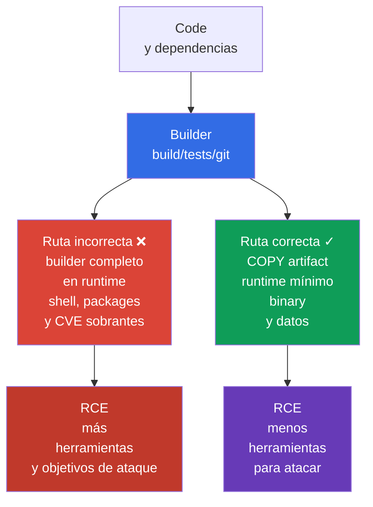
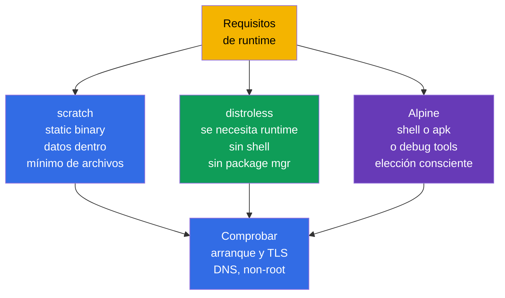

[Русская версия](ru.md) · [Eng version](README.md) · [Version française](fr.md) · [Deutsche Version](de.md) · [ქართული ვერსია](ge.md) · [繁體中文版](tw.md) · [日本語版](jp.md)

# Capítulo 24. Minimización de la image base

> **El problema.** Tras un RCE, una runtime-image completa entrega al atacante no solo el proceso de la aplicación, sino también shell, package manager, compiler, source y libraries sobrantes. Cada componente añade un CVE o una herramienta preparada para descargar payload, reconnaissance y persistence. Si todo el builder llega a la final image, el riesgo se repite en cada node que descargue y ejecute ese artifact.

> **Qué sigue.** En el [capítulo 23](../23/es.md) ciframos el tráfico entre Pod y confirmamos la identity del peer. Ahora protegemos lo que se ejecuta en Pod: la image y su build context. Es el dominio **Supply Chain Security** de CKS (20%). Una image más pequeña y reproducible contiene menos componentes, CVE y herramientas preparadas para el atacante, pero por sí misma no sustituye SBOM, firma, policy ni scanning; seguirán en los capítulos 25-28.

> **Lo necesario de CKA.** Los conceptos básicos de image, Dockerfile, layers, tags y multi-stage build se explican en el [capítulo 23 de CKA](../../../cka/course/23/es.md), y `runAsNonRoot`, capabilities y read-only root filesystem en el [capítulo 20 de CKA](../../../cka/course/20/es.md). Aquí los aplicamos a la amenaza de supply chain: no solo hacemos la image pequeña, sino que excluimos lo superfluo del artifact final.

> 🧠 Una final image mínima reduce CVE y post-exploitation tools, pero no sustituye la protección RCE, `SecurityContext`, red ni detection.

## 24.1. Modelo de amenazas: lo superfluo en la image se vuelve una capacidad del atacante

Una image forma parte del software artifact distribuido. Todo lo que llega a su final stage llegará a cada
node que la descargue: package manager, shell, compiler, source, test keys, historial de layers y libraries
transitivas. Una vulnerabilidad en cualquiera de estos componentes es un CVE adicional; una utilidad como
`curl`, `wget` o `sh` es una herramienta lista para actuar después de comprometer la aplicación.

Escenario típico: la aplicación tiene RCE. En una image completa de `ubuntu`, el atacante ejecuta
`/bin/sh`, descarga payload, instala utilidades por package manager, lee archivos de build e intenta elevar
privilegios. En una image mínima sin shell ni package manager, RCE sigue siendo crítico, pero el camino
posterior es más corto: no hay shell interactivo, compiler ni gran parte de las libraries. Es **reducción de
la superficie de ataque**, no una security boundary: permisos de proceso, `SecurityContext`, NetworkPolicy
y runtime detection siguen siendo necesarios.



La minimización tiene cuatro efectos prácticos:

- menos packages: menos vulnerabilidades conocidas y actualizaciones que mantener;
- menor tamaño: pull, rollout y autoscaling más rápidos, y menor gasto de registry y red;
- sin build-tools ni source en runtime: es más difícil robarlos o utilizarlos;
- menos executables: menos comandos disponibles tras RCE.

No mida la seguridad solo en megabytes. Una image de 5 MiB con una aplicación vulnerable o proceso root
es insegura, y eliminar certificados CA puede romper TLS. Minimice **con sentido**: deje runtime, CA bundle,
timezone data y dynamic libraries que la aplicación realmente necesite.

> 🧠 Menos archivos en la runtime image significan menos herramientas post-exploitation para el atacante; elegir entre `scratch`/distroless/Alpine es un trade-off entre attack surface y capacidad de diagnóstico.

## 24.2. `scratch`, distroless y Alpine: elegir el runtime según las necesidades

La base image define qué archivos existen antes de `COPY`. El final stage no tiene por qué parecerse al
builder. Elíjalo después de entender si el artifact es un static binary, si se necesita language runtime y
si se requieren diagnóstico o native libraries.

| Runtime base | Contenido | Adecuado para | Limitaciones y riesgo |
|---|---|---|---|
| `scratch` | base image vacía: la image no contiene runtime-files | Go/Rust/C++ static binary que no necesita runtime-libraries ausentes | no hay shell, CA bundle, timezone data ni dynamic loader; Kubernetes/runtime normalmente aporta al Pod `/etc/resolv.conf`, pero la aplicación aún debe tener DNS resolver compatible y los runtime-data necesarios |
| distroless | solo runtime/libraries elegidos, sin shell ni package manager | aplicaciones Go/Java/Node/Python que necesitan runtime mínimo soportado | `kubectl exec -- sh` habitual es imposible; depure mediante logs, metrics y `kubectl debug` |
| Alpine | Linux mínimo con BusyBox y `apk` | aplicación o diagnóstico que realmente necesita shell/packages | permanecen shell y package manager; `musl` en vez de glibc puede ser incompatible con native dependency |

`/etc/resolv.conf`, `/etc/hosts` y hostname-related files pueden ser aportados por kubelet/container
runtime al arrancar el Pod; no son archivos que se deban copiar automáticamente a `scratch`.



`Alpine` no es automáticamente más seguro que distroless por ser pequeño. Su `/bin/sh` y `apk` son útiles
para el desarrollador, pero también durante RCE. A la inversa, no se debe escoger distroless a costa del
funcionamiento. Por ejemplo, una aplicación con dependencia CGO puede requerir glibc y shared libraries
concretas; entonces compruebe primero el binary mediante `ldd` en el builder y elija un runtime compatible.

Compruebe qué significa el tag del proveedor concreto. `:latest` no fija un artifact y no sirve para
production. Un versioned tag (`alpine:3.21.2`) es el mínimo; para release fije también el immutable digest,
obtenido y comprobado de su registry:

```text
registry.example.com/payments/api:1.4.2@sha256:<проверенный-64-символьный-digest>
```

Escriba el digest en GitOps/manifest después de comprobar la image, no lo tome de una publicación casual.
El tag es cómodo para personas; el digest garantiza los bytes que fueron scanned y firmados. En Kubernetes,
este mismo valor se especifica en `image:`.

> 🎯 Builder y final stage separados con `COPY --from=builder` solo del artifact terminado; compiler, source, cache y credentials no llegan a runtime.

## 24.3. Multi-stage build: el builder no debe convertirse en runtime

Un Dockerfile multi-stage separa roles de confianza. El primer stage puede contener Go compiler, package
cache y source. El último stage recibe solo el artifact terminado. `COPY --from=builder` no transfiere todo
el filesystem del builder si se copia explícitamente un archivo. Esto elimina compiler, `git`, `go.mod`,
private build caches y la mayoría de las dependencias transitivas del runtime.

El siguiente es un ejemplo completo para un pequeño servicio HTTP de Go. Supone que el directorio contiene
`go.mod`, `go.sum` y `./cmd/server`; `CGO_ENABLED=0` crea un static binary apto para `scratch`. Todas las
images tienen versiones concretas y el proceso final no funciona como UID 0.

```dockerfile
# syntax=docker/dockerfile:1.7
# Dockerfile
FROM golang:1.27.1-alpine3.24@sha256:<проверенный-digest> AS builder
WORKDIR /src

# Manifests de dependencies que cambian poco antes del code: mejor cache.
COPY go.mod go.sum ./
RUN go mod download

COPY . ./
RUN CGO_ENABLED=0 GOOS=linux go build -trimpath -ldflags="-s -w" \
    -o /out/server ./cmd/server

# En scratch basta UID/GID numérico para establecer credentials non-root;
# compruebe por separado las runtime-dependencies de la aplicación.
FROM scratch
COPY --from=builder /out/server /server
USER 65532:65532
EXPOSE 8080
ENTRYPOINT ["/server"]
```

Un UID/GID numérico permite que runtime arranque el proceso sin una entrada de usuario en `/etc/passwd`,
pero no garantiza que la aplicación funcione: puede requerir lookup de usuario o grupo, `HOME`, timezone
data, CA bundle, NSS u otros runtime-files.

`USER` en la image es la primera barrera: por default el proceso no es root, incluso con `docker run` local.
Fíjelo en Pod-level policy y SecurityContext, para que el consumidor de la image no revierta la decisión con
un manifest accidental:

```yaml
apiVersion: v1
kind: Pod
metadata:
  name: minimal-api
spec:
  securityContext:
    runAsNonRoot: true
    runAsUser: 65532
    runAsGroup: 65532
  containers:
  - name: api
    image: registry.example.com/training/minimal-api:1.0.0
    ports:
    - containerPort: 8080
    securityContext:
      allowPrivilegeEscalation: false
      readOnlyRootFilesystem: true
      capabilities:
        drop: ["ALL"]
```

`runAsNonRoot: true` no crea un usuario en la image ni corrige ownership de archivos. No permitirá
arrancar si runtime identifica root. Asegúrese de que el binary y los directorios donde escribe la
aplicación sean accesibles para UID `65532`; con `readOnlyRootFilesystem: true`, coloque los datos
temporales en `emptyDir`, no devuelva un root writable.

> 🔬 Docker y rootless Podman usan el mismo Dockerfile/context; rootless no protege contra context amplio, base image mutable ni secret en un layer.

### Build con Docker y Podman

Ambos comandos usan el mismo Dockerfile y el mismo build context. Docker suele funcionar mediante daemon;
Podman es daemonless y puede funcionar rootless, por lo que es útil cuando el build no debe recibir acceso
root al host Docker socket. Rootless Podman no hace seguro un Dockerfile inseguro: secret y archivos
sobrantes aún pueden llegar a la image.

```bash
# Docker: BuildKit es necesario para secret mount de la sección siguiente.
DOCKER_BUILDKIT=1 docker build \
  --tag registry.example.com/training/minimal-api:1.0.0 \
  --file Dockerfile .

docker image inspect registry.example.com/training/minimal-api:1.0.0 \
  --format 'size={{.Size}} bytes user={{.Config.User}}'
docker run --rm --user 65532:65532 \
  registry.example.com/training/minimal-api:1.0.0

# Podman rootless: ejecute como usuario normal, sin sudo.
podman build \
  --tag registry.example.com/training/minimal-api:1.0.0 \
  --file Dockerfile .
podman image inspect registry.example.com/training/minimal-api:1.0.0 \
  --format 'size={{.Size}} bytes user={{.Config.User}}'
podman run --rm --user 65532:65532 \
  registry.example.com/training/minimal-api:1.0.0
```

Multi-stage reduce runtime, pero por sí solo no hace fiable el builder ni reproducible el build. Para release,
fije y compruebe base-image digest, versiones de modules/packages y fuente de dependencias; no deje que el
build dependa sin control de repositories externos mutables. Entregue secrets para private dependencies solo
mediante BuildKit/Podman secret mounts.

No use `--no-cache` como una «comprobación de security» permanente: solo desactiva cache, aumenta tiempo y
tráfico, pero no vuelve reproducibles las dependencias. Después compruebe el digest creado antes de publicar.

### Variante con distroless

Si un static build no es posible, el final stage puede ser distroless. Use una base versioned/variant y, para
release, sustitúyala por un digest comprobado de su plataforma. En distroless, `:nonroot` ya establece un
usuario sin privilegios, pero `USER` se indica explícitamente para que la intención se vea en Dockerfile.

```dockerfile
FROM gcr.io/distroless/static-debian13:nonroot@sha256:<проверенный-digest>
COPY --from=builder /out/server /server
USER 65532:65532
ENTRYPOINT ["/server"]
```

> 🎯 `RUN rm` no borra un secret de un layer anterior; use secret mount y `.dockerignore`, y revoque la filtración y reconstruya la image.

## 24.4. Layers, secrets y build context

Cada instrucción Dockerfile que cambia filesystem puede crear un layer. Un layer es immutable: si un secret
se crea en un layer de un stage incluido en la image publicada, `RUN rm /tmp/token` en el layer siguiente no
borra sus bytes del layer inferior. Por ello no entregue un secret mediante `COPY`, `ADD`, `ARG` ni `ENV`.

Un multi-stage build normal es distinto: los layers separados del builder no se vuelven layers de la final
runtime image si el final stage empieza en su propio `FROM` y `COPY --from` transfiere solo el artifact
necesario.

Eso no vuelve segura automáticamente una entrega insegura de credentials. El secret aún puede llegar a la
final image dentro de un artifact copiado por accidente, a una intermediate image publicada por separado o
a build logs. Si el credential se entregó mediante `ARG`/`ENV` o se escribió en un filesystem layer, también
puede permanecer en build metadata, history o cache del build stage correspondiente. Para build-time
credentials use BuildKit/Podman secret mounts en vez de `ARG`, `ENV`, `COPY` o `ADD`.

```dockerfile
# NUNCA: token permanecerá en history/config o en uno de los layers.
ARG NPM_TOKEN
RUN npm config set //registry.example.com/:_authToken="$NPM_TOKEN" && npm ci

# NUNCA: .npmrc puede llegar a COPY . . y guardarse en un layer.
COPY .npmrc /root/.npmrc
RUN npm ci
RUN rm /root/.npmrc
```

Para BuildKit use secret mount: el secret está disponible temporalmente solo para el comando `RUN` necesario
y no llega al output layer; su valor tampoco se incluye en provenance attestation. El comando que usa el
secret tampoco debe imprimirlo en stdout/stderr, escribirlo en un artifact para `COPY --from` ni guardar el
credential en un filesystem layer ordinario. External cache es aceptable con `--secret` correcto: no es
peligroso el cache export en sí, sino un credential en cacheable filesystem output debido a un manejo
incorrecto del secret.

```dockerfile
# syntax=docker/dockerfile:1.7
FROM node:22.23.2-alpine@sha256:<проверенный-digest> AS builder
WORKDIR /app
COPY package.json package-lock.json ./
# Build-tools (TypeScript, Vite, webpack, etc.) normalmente están en devDependencies.
RUN --mount=type=secret,id=npmrc,target=/root/.npmrc \
    npm ci
COPY . .
RUN npm run build
# Eliminar devDependencies solo después del build; al runtime-stage se copian artefacts y dependencies necesarias.
RUN npm prune --omit=dev
```

```bash
# El archivo .npmrc se guarda en secret store/CI, no junto al Dockerfile.
DOCKER_BUILDKIT=1 docker build \
  --secret id=npmrc,src="$HOME/.config/build-secrets/npmrc" \
  -t registry.example.com/training/web:1.0.0 .

podman build \
  --secret id=npmrc,src="$HOME/.config/build-secrets/npmrc" \
  -t registry.example.com/training/web:1.0.0 .
```

Si un secret ya se publicó en una image, un nuevo `RUN rm` no basta. Revoque y sustituya inmediatamente el
secret, elimine/restrinja el acceso al registry artifact y reconstruya la image con un Dockerfile limpio y
el nuevo secret. Considere comprometido el credential anterior.

### `.dockerignore`: límite del build context

Antes de ejecutar Dockerfile, el cliente envía el build context al builder. Sin `.dockerignore`, `COPY . .`
puede recoger `.git`, `.env` local, SSH keys, test artifacts y directorios grandes. `.dockerignore` reduce
tráfico, acelera el build e impide que esos archivos estén disponibles para las instrucciones Dockerfile. Es
una protección importante, pero no un sustituto de secret management: un archivo que ya debe estar en
context aún se puede copiar por error.

```dockerignore
# .dockerignore
.git
.gitignore
.env
.env.*
.npmrc
*.pem
*.key
id_rsa
secrets/
coverage/
tmp/
node_modules/
**/.DS_Store
README.md
```

Las reglas deben corresponder al proyecto. No ignore a ciegas `*.pem` si la aplicación necesita realmente un
CA certificate público: en tal caso guarde el public certificate permitido explícitamente en un directorio
separado y copie solo ese. Separe el build context del repository root, por ejemplo
`docker build -f docker/Dockerfile docker/`, cuando Dockerfile no necesite todo el monorepo.

### Reducir layers sin «optimizaciones» perjudiciales

Una install/cleanup relacionada se combina en un `RUN` para que el package manager cache no quede en un
layer anterior. Pero no fusione todo Dockerfile en un comando ilegible: el orden de `COPY` debe conservar
cache, y policy y review deben poder ver qué se instala.

```dockerfile
# Alpine: package index y build dependencies no permanecerán en este stage.
RUN apk add --no-cache --virtual .build-deps build-base \
 && make release \
 && apk del .build-deps
```

Esto es útil solo si el comando está en final stage. La mejor variante normalmente es más simple: no
transfiera en absoluto mediante multi-stage build el stage que contiene `apk`, compiler y cache a runtime.

> 🎯 Compruebe el final artifact con `history`, `inspect` y `dive`; para distroless/scratch, la ausencia de shell solo queda probada por el error esperado de executable ausente, no por cualquier `kubectl exec` non-zero.

## 24.5. Inspección: medir tamaño, layers y contenido

Después del build no suponga que la final image es mínima: demuéstrelo. `docker image ls` muestra el tamaño
total, pero no explica qué layer lo aportó. `history`, `inspect` y `dive` ayudan a ver comandos, tamaños y
cambios de archivos.

```bash
IMAGE=registry.example.com/training/minimal-api:1.0.0

# Tamaño total y comandos que crearon los layers.
docker image ls "$IMAGE"
docker history --no-trunc "$IMAGE"
docker image inspect "$IMAGE" \
  --format 'user={{.Config.User}} entrypoint={{json .Config.Entrypoint}} size={{.Size}}'

# Las mismas comprobaciones usando Podman.
podman history --no-trunc "$IMAGE"
podman image inspect "$IMAGE" \
  --format 'user={{.Config.User}} entrypoint={{json .Config.Entrypoint}} size={{.Size}}'

# TUI interactivo: tamaño de cada layer, wasted space, archivos.
dive "$IMAGE"
```

En `dive` preste atención a:

- un layer grande con `COPY . .`: normalmente el context es demasiado amplio o el orden del Dockerfile es incorrecto;
- package cache, compiler, tests, `.git`, `.env`, private key o `.npmrc`: hay que corregir Dockerfile/.dockerignore y rotar inmediatamente el secret encontrado;
- «wasted bytes» tras `RUN install` y un `RUN rm` separado: la eliminación ocurrió tarde, en un layer nuevo;
- `User` vacío o igual a `root`: Dockerfile no estableció non-root user.

`dive` solo ve lo disponible en la image. No sustituye vulnerability scan, secret scan ni SBOM. En CI resulta
útil este orden: build -> inspect/lint -> SBOM/scan -> push immutable digest -> sign/attest digest ->
verify -> deploy/admission. En el flujo habitual de Cosign/Sigstore, primero se publica la image y se
obtiene su immutable digest; luego Cosign firma ese digest y crea una attestation en el registry;
deployment/admission comprueba esta relación. El siguiente capítulo añade SBOM, y los capítulos 26-28,
firma, policy y scanners.

## 24.6. Comprobación sin shell: distroless se comporta diferente intencionadamente

La ausencia de shell es una propiedad de runtime distroless/scratch, no un error de Kubernetes. Por ello,
que `kubectl exec <pod> -- /bin/sh` tenga éxito en tal image sería una señal alarmante. Compruebe el
application endpoint y UID por medios normales, y registre por separado el rechazo esperado del shell.

```bash
kubectl apply -f minimal-api.yaml
kubectl wait --for=condition=Ready pod/minimal-api --timeout=90s
kubectl logs minimal-api

# El arranque correcto se comprueba por su endpoint/health probe, no por shell.
kubectl port-forward pod/minimal-api 8080:8080
# En otro terminal: curl -fsS http://127.0.0.1:8080/health

# Primero excluir generic exec failure: Pod ya está Ready y RBAC permite pods/exec.
if [[ "$(kubectl auth can-i create pods --subresource=exec)" != yes ]]; then
  echo "ERROR: current identity cannot create pods/exec" >&2
  exit 1
fi

# Para distroless/scratch se espera precisamente el error de executable ausente.
if output=$(kubectl exec minimal-api -c api -- /bin/sh 2>&1); then
  echo "ERROR: /bin/sh unexpectedly exists in the minimal runtime" >&2
  exit 1
else
  status=$?
  if printf '%s\n' "$output" | grep -Eqi 'executable file not found|stat /bin/sh: no such file or directory'; then
    echo "OK: /bin/sh is absent as expected"
  else
    printf 'ERROR: kubectl exec failed, but /bin/sh absence was not proven (exit %s): %s\n' \
      "$status" "$output" >&2
    exit 1
  fi
fi

# Ajustes que no requieren shell:
kubectl get pod minimal-api -o jsonpath='{.spec.securityContext.runAsNonRoot}{"\n"}'
kubectl get pod minimal-api -o jsonpath='{.spec.containers[0].securityContext.allowPrivilegeEscalation}{"\n"}'
```

No añada `busybox` a la production image «para depurar»: anula parte del objetivo de minimización. Durante
un incident, use logs, metrics, trace, `kubectl describe` y un ephemeral debug container temporal, aislado
de la production image:

```bash
# Requiere permiso RBAC y soporte de ephemeral containers en el cluster.
kubectl debug -it pod/minimal-api --target=api \
  --image=busybox:1.36.1 -- sh
```

El ephemeral debug container está en el mismo Pod y comparte su network namespace. `--target=api` pide a
container runtime colocar el debug container en el process namespace del target container; requiere soporte
del runtime. Sin él, el debug container puede iniciar con un process namespace aislado y no ver los procesos
de la aplicación. Su root filesystem y mount namespace no se convierten automáticamente en el filesystem
del target-container. La debug image también debe tener versión concreta (en production, digest aprobado) y
no debe usarse como bypass permanente de la ausencia de shell.

### Errores típicos y diagnóstico

| Síntoma | Causa probable | Qué hacer |
|---|---|---|
| `exec /server: no such file or directory` en `scratch` | binary linked dinámicamente o arquitectura incorrecta | construir con `CGO_ENABLED=0`; comprobar `file /out/server`, platform y dependencies en builder |
| HTTPS no funciona en `scratch` | faltan CA certificates | integrar CA bundle en la aplicación o copiar solo el public bundle necesario de un stage separado |
| Pod no inicia con `runAsNonRoot` | image/manifest intenta usar UID 0 | definir `USER` en Dockerfile, ownership y UID numérico explícito; no eludir la comprobación |
| `kubectl exec ... /bin/sh` no funciona | ausencia esperada de shell en distroless/scratch | comprobar logs/endpoint; para investigar usar `kubectl debug` |
| secret encontrado en `dive`/history | credential copiado, entregado como `ARG` o eliminado en layer tardío | revocar el secret, reconstruir sin él, usar BuildKit/Podman secret mount |
| Docker y Podman produjeron resultados distintos | builder/cache/platform distintos o base image sin fijar | definir platform explícitamente si hace falta, fijar digest y comparar final digest |

> 🏭 Pinned base/release digest, context estrecho, secret management, runtime non-root, SBOM/scan/signature y admission; la depuración se hace en una ephemeral debug image aprobada.

## 24.7. Cómo se aplica en producción

- **Build y runtime separados.** Builder puede ser pesado, pero final stage solo admite artifact, runtime
  libraries y public data necesarios. Los stages, dependencies y base images pasan review como production-code.
- **Se fijan versiones y digest.** `latest` se prohíbe con linter/policy. Release asocia un tag humano a un
  immutable digest; ese digest pasa SBOM, scan, firma y deployment.
- **Non-root como defence in depth.** `USER` en la image, `runAsNonRoot`/numeric UID en Pod y admission
  policy se refuerzan mutuamente. Añada `drop: ["ALL"]`, `allowPrivilegeEscalation: false` y read-only root
  cuando la aplicación sea compatible.
- **Los secrets no son build arguments.** CI entrega short-lived credential durante el build; BuildKit/Podman
  secret mounts, scoped registry permissions y `.dockerignore` reducen el riesgo de filtración. Cualquier
  filtración en un layer implica rotación, no solo un nuevo build.
- **La depuración se separa de runtime.** Observabilidad y ephemeral debug images aprobadas sustituyen el
  shell dentro de application image. Así el production artifact permanece igual en CI y en el cluster.
- **La minimización forma parte del pipeline.** Los equipos miden image size y layer composition, ejecutan
  `dive` en review, SBOM/scan/sign en CI y reconstruyen periódicamente la image al actualizar la base. Una
  image pequeña no exime de responder a CVE.

## 24.8. Mini-glosario

- **Attack surface (superficie de ataque)**: componentes, archivos e interfaces que pueden contener una
  vulnerabilidad o usarse en un ataque.
- **Base image**: image en la instrucción `FROM`, que establece el filesystem inicial del stage.
- **Build context**: archivos entregados al builder; se limita con `.dockerignore`.
- **distroless**: runtime image mínima sin package manager y normalmente sin shell.
- **`scratch`**: base image vacía sin filesystem; adecuada para artifact estático.
- **Multi-stage build**: Dockerfile con stages separados de build y runtime, unidos mediante
  `COPY --from=`.
- **Layer**: cambio immutable en el filesystem de una image; eliminar en un layer nuevo no borra el
  contenido del anterior.
- **Digest**: identificador SHA-256 immutable de un image manifest/content concreto.
- **Rootless Podman**: modo Podman en que un usuario normal, no un root daemon, ejecuta build/run.
- **Secret mount**: montaje temporal de credential en un único build-command sin escribirlo en el final layer.

## 24.9. Conclusiones del capítulo

- Packages sobrantes, shell, package manager, build tools y secrets aumentan la attack surface y las
  consecuencias de RCE; una image pequeña reduce el riesgo, pero no sustituye los demás security controls.
- `scratch` sirve para un static binary; distroless aporta runtime mínimo sin shell; Alpine se elige solo si
  se necesita realmente su Linux userland y teniendo en cuenta `musl`.
- Multi-stage build deja en la final image solo el artifact; builder, source y compiler no se transfieren.
- Base images, packages y application releases se fijan por versión, y production deployment por immutable
  digest comprobado, no por `latest`.
- `USER` en Dockerfile y `runAsNonRoot` en Pod son comprobaciones complementarias de arranque non-root.
- Docker y rootless Podman construyen el mismo Dockerfile; los permisos del builder no anulan las reglas para
  context y secrets.
- Un secret no se entrega mediante `ARG`, `ENV`, `COPY` ni se elimina en un layer tardío; use BuildKit/Podman
  secret mount y `.dockerignore`.
- `dive`, `history` e `inspect` muestran layers, wasted bytes, files y effective user. En distroless, la
  ausencia de `/bin/sh` se comprueba con el rechazo esperado de `kubectl exec`.

## 24.10. Para qué sirve: en el examen y en el trabajo real

**En el examen.** Hay que reconocer rápidamente `latest`, root user, secret en Dockerfile y un runtime
stage sobrante; escribir `COPY --from=...`, `USER`, `.dockerignore`, los comandos `docker build`/`podman
build` y comprobar la image. La pregunta «¿por qué no funciona `kubectl exec ... sh`?» para distroless suele
comprobar que se entiende el runtime mínimo, no la capacidad de reinstalar shell.

**En el trabajo real.** Estas decisiones reducen CVE backlog y tiempo de rollout, pero el resultado principal
es un artifact reproducible: el equipo conoce su base digest, contenido, UID e historial de comprobación.
Eso permite que el siguiente paso de supply chain - SBOM, scanning, firma y admission policy - trabaje con
una image definida con exactitud.

> ### 🔴 Visión del atacante
> **Asset:** secrets y credentials en archivos de build-time, por ejemplo `.npmrc` y token.
> **Starting foothold:** acceso a Dockerfile/build context o capacidad de examinar la image construida.
> **Attacker objective:** encontrar un credential olvidado en los layers intermedios de la image.
> **Abuse path:** examinar los layers de la final image publicada y extraer credential si se creó en uno de sus lower layers o se copió por accidente desde builder. Los builder layers separados no entran en una final multi-stage image normal, pero el credential puede quedar en una intermediate image publicada por separado, build logs o cacheable filesystem output si el secret se entrega mediante `ARG`/`ENV`/`COPY` o un build-command lo escribe en layer/artifact. Un BuildKit correcto con `--mount=type=secret` no guarda el valor del secret en final layer ni provenance attestation.
> **Expected evidence:** final layers, copied artifacts y los build outputs disponibles no contienen credential; provenance no contiene valores de secret.
> **Control:** BuildKit `--mount=type=secret`, `.dockerignore` para archivos con credentials y `COPY --from` solo del artifact necesario; use external cache únicamente sin credential en cacheable filesystem output.
> **Retest:** volver a comprobar final layers, build outputs disponibles y provenance no muestra credential.

## 24.11. Preguntas de autoevaluación

<details>
<summary>1. ¿Por qué shell y package manager en una runtime image aumentan las consecuencias de RCE, aunque su ausencia no corrija la vulnerabilidad de la aplicación?</summary>

Tras RCE, shell, `curl`/`wget`, compiler y package manager dan al atacante medios listos para descargar
payload, instalar utilidades y explorar filesystem. Su ausencia reduce la post-exploitation surface, pero
no corrige la RCE original ni sustituye SecurityContext, NetworkPolicy o runtime detection. La minimización
es defence in depth, no una security boundary por sí misma.
</details>

<details>
<summary>2. ¿Cómo elegir entre `scratch`, distroless y Alpine para static Go binary, Java application y una aplicación que necesita native tool?</summary>

Un Go binary estático con `CGO_ENABLED=0` sirve para `scratch` si se comprobaron DNS, TLS, CA bundle y los
runtime-data necesarios. Una Java application necesita language runtime mínimo soportado, por lo que se
elige el distroless variant correspondiente. Si se necesita realmente shell, `apk` o native diagnostic tool,
Alpine está justificado, pero BusyBox/package manager y `musl` requieren evaluación propia de compatibility
y seguridad.
</details>

<details>
<summary>3. ¿Qué evita exactamente `COPY --from=builder` y qué aún puede llegar por error a la final image?</summary>

`COPY --from=builder` transfiere solo el artifact indicado, no todo el filesystem builder; por eso compiler,
source, `git`, build cache y la mayoría de dependencies no llegan automáticamente a runtime. Pero un
`COPY` amplio, una runtime dependency añadida o un secret que ya estaba en una ruta copiada aún pueden
llegar a la final image. Compruebe el contenido con `history`, `inspect` y `dive`.
</details>

<details>
<summary>4. ¿Por qué un versioned tag es mejor que `latest`, y por qué digest es más fuerte que version tag para release?</summary>

`latest` es mutable y no fija un artifact comprobado; un version tag al menos expresa el release. Un
immutable digest vincula deployment a bytes concretos de manifest/content que se scanned y firmaron. Para
release, el capítulo recomienda guardar en GitOps tag junto al digest `@sha256:...` comprobado.
</details>

<details>
<summary>5. ¿Cómo se relaciona `USER` en Dockerfile con `runAsNonRoot` en Pod y por qué se necesitan ambos?</summary>

`USER` hace que non-root sea el default de image y `docker run` local; un numeric UID funciona incluso sin
entrada en `/etc/passwd`. `runAsNonRoot` en Pod no crea usuario ni corrige ownership, pero impide que runtime
arranque un usuario root determinado. Pod puede además fijar UID/GID y reforzar la decisión con admission
policy.
</details>

<details>
<summary>6. ¿Por qué `RUN rm /secret` no elimina un secret de image history? ¿Qué mecanismo usar para private dependency credential?</summary>

Si el secret se creó en un layer de un stage incluido en la image publicada, borrarlo en el siguiente layer
no elimina bytes del lower layer/history. Un builder separado no entra por sí solo en la final image, pero
`ARG`, `ENV`, `COPY` o `ADD` siguen siendo inseguros: credential puede llegar al artifact copiado, cache,
logs o intermediate image publicada. BuildKit/Podman `--mount=type=secret` entrega el secret temporalmente
solo a build instruction y no conserva su valor en final layer ni provenance attestation. El build-command
puede imprimirlo o escribirlo en artifact, así que compruebe output. Si ya se publicó, revoque y rote el
secret y reconstruya la image desde Dockerfile limpio.
</details>

<details>
<summary>7. ¿Qué limita `.dockerignore` y por qué no sustituye secret manager?</summary>

`.dockerignore` limita los files del build context enviados al builder, de modo que `.git`, `.env`, keys y
test artifacts no quedan disponibles para `COPY . .`. Reduce riesgo de filtración y tamaño/tiempo de build.
Pero un archivo que todavía se necesita en context puede copiarse por error, por lo que credentials deben
entregarse desde secret manager mediante secret mount.
</details>

<details>
<summary>8. ¿Qué indicios en `dive` revelan context demasiado amplio o waste en layers?</summary>

Un layer grande por `COPY . .` suele indicar context amplio u orden incorrecto del Dockerfile. Compiler,
package cache, tests, `.git`, `.env`, private key y `.npmrc` revelan contenido sobrante; wasted bytes tras
`RUN install` y un `RUN rm` separado revelan borrado tardío. Un `User` vacío o root también indica que
Dockerfile no estableció non-root user.
</details>

<details>
<summary>9. ¿Cómo demostrar que un Pod distroless funciona si `/bin/sh` está ausente intencionadamente?</summary>

Compruebe Ready, logs, health endpoint o probe, por ejemplo mediante `kubectl port-forward` y `curl`, en vez
de intentar recuperar shell. La ausencia queda demostrada por el error específico esperado de executable
ausente después de comprobar Pod Ready y acceso a `pods/exec`; cualquier `kubectl exec` non-zero no basta.
Para incident diagnosis use logs, metrics, `describe` o un ephemeral debug container temporal aprobado.
</details>

<details>
<summary>10. ¿Por qué es útil rootless Podman para build pipeline y qué no protege?</summary>

Rootless Podman ejecuta build/run como usuario normal sin root Docker daemon, reduciendo la necesidad de dar
al pipeline acceso al host Docker socket. Usa el mismo Dockerfile y build context, pero no impide que secret
y archivos sobrantes lleguen a la image. Por ello `.dockerignore`, secret mounts y Dockerfile review siguen
siendo obligatorios.
</details>

<details>
<summary>11. **Flashback (capítulo 14).** La minimización de base image (este capítulo: distroless, sin shell/package manager) y la minimización de host footprint (capítulo 14: desactivar servicios/packages sobrantes en node) aplican el mismo principio de «menor superficie de ataque» en dos niveles. Si el tiempo antes de un examen/incidente es limitado, ¿cuál de los niveles reduce antes el riesgo para un container **ya comprometido**, y por qué ninguno sustituye al otro?</summary>

Para un container ya comprometido, minimizar runtime image cambia antes las herramientas disponibles al
atacante: puede no haber shell, package manager ni downloader. Minimizar host footprint protege node y otros
workloads reduciendo servicios/packages con los que desarrollar escape tras host access. La image no protege
una node comprometida, y una node segura no elimina herramientas sobrantes del container; se necesitan ambos
niveles.
</details>

## Práctica

🧪 Lab 111 (image mínima, multi-stage, non-root e inspección de artifact):
[tasks/cks/labs/111](../../labs/111/README_ES.MD)

🌐 Práctica interactiva adicional (killer.sh/killercoda, recurso externo): [container-image-footprint-user](https://killercoda.com/killer-shell-cks/scenario/container-image-footprint-user) · [container-hardening](https://killercoda.com/killer-shell-cks/scenario/container-hardening)

Para Dockerfile e images básicos, repase el [capítulo 23 de CKA](../../../cka/course/23/es.md);
para restricciones de proceso en Pod, el [capítulo 20 de CKA](../../../cka/course/20/es.md).

---
[Índice](../README_ES.md) · [Capítulo 23](../23/es.md) · [Capítulo 25](../25/es.md)
