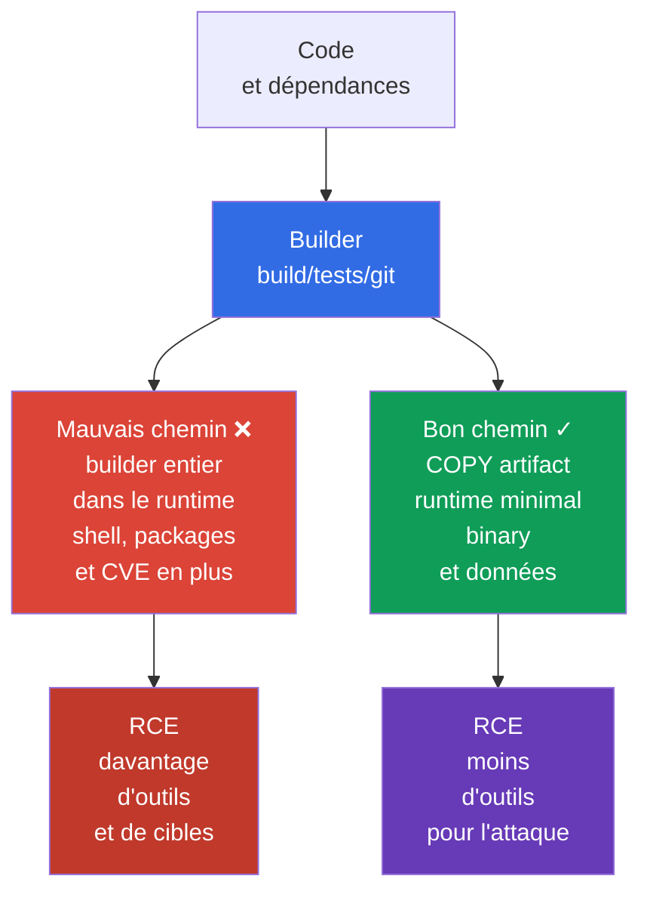
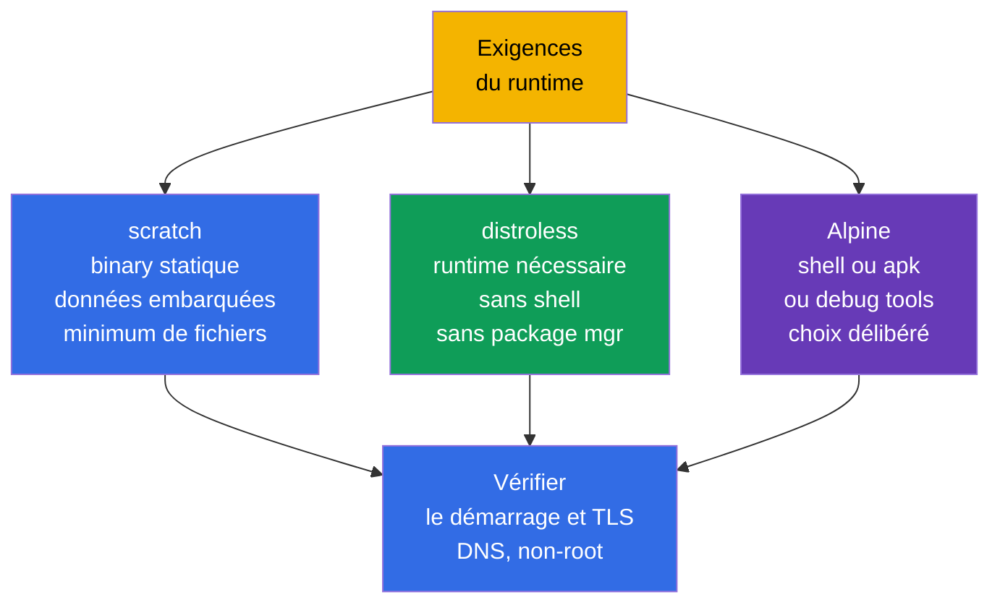

[Русская версия](ru.md) · [Eng version](README.md) · [Versión en español](es.md) · [Deutsche Version](de.md) · [ქართული ვერსია](ge.md) · [繁體中文版](tw.md) · [日本語版](jp.md)

# Chapitre 24. Réduire l'image de base au minimum

> **Problème.** Après une RCE, une image runtime complète donne à un attaquant non seulement le
> processus de l'application, mais aussi un shell, un gestionnaire de paquets, un compilateur,
> les sources et des bibliothèques inutiles. Chaque composant ajoute une CVE ou un outil prêt à
> l'emploi pour télécharger un payload, effectuer de la reconnaissance et s'implanter. Si le
> builder entier arrive dans la final image, le risque se répète sur chaque nœud où cet artifact
> est téléchargé et exécuté.

> **La suite.** Dans le [chapitre 23](../23/fr.md), nous avons chiffré le trafic entre les Pod et
> confirmé l'identité du peer. Nous protégeons maintenant ce qui s'exécute dans un Pod : l'image
> et son build context. C'est le domaine **Supply Chain Security** de CKS (20 %). Une image plus
> petite et reproductible contient moins de composants, de CVE et d'outils prêts à l'emploi pour
> l'attaquant, mais elle ne remplace pas à elle seule SBOM, la signature, les policy ni le
> scanning - ils suivront dans les chapitres 25-28.

> **Ce qu'il faut connaître de CKA.** Les notions fondamentales d'image, Dockerfile, layers,
> tags et multi-stage build sont présentées dans le [chapitre 23 de CKA](../../../cka/course/23/fr.md),
> tandis que `runAsNonRoot`, capabilities et le read-only root filesystem le sont dans le
> [chapitre 20 de CKA](../../../cka/course/20/fr.md). Ici, nous les appliquons à la menace de
> supply chain : nous ne rendons pas simplement l'image petite, nous excluons le superflu de
> l'artifact final.

> 🧠 Une final image minimale réduit les CVE et les post-exploitation tools, mais ne remplace pas la protection contre les RCE, `SecurityContext`, le réseau ou la detection.

## 24.1. Modèle de menace : le contenu superflu d'une image devient une possibilité pour l'attaquant

Une image fait partie du software artifact livré. Tout ce qui entre dans son final stage arrive
sur chaque nœud qui télécharge l'image : gestionnaire de paquets, shell, compilateur, sources,
clés de test, historique des layers et bibliothèques transitives. Une vulnérabilité dans chacun
de ces composants constitue une CVE supplémentaire ; un utilitaire comme `curl`, `wget` ou `sh`
est un outil déjà disponible pour agir après la compromission de l'application.

Scénario typique : l'application a une RCE. Dans une image `ubuntu` complète, l'attaquant lance
`/bin/sh`, télécharge un payload, installe des utilitaires avec le gestionnaire de paquets, lit
les fichiers de build et tente d'élever ses privilèges. Dans une image minimale sans shell ni
gestionnaire de paquets, la RCE reste critique, mais le chemin qui la suit est plus court : pas
de shell interactif, de compilateur ni d'une grande partie des bibliothèques. C'est une
**réduction de la surface d'attaque**, non une frontière de sécurité : les privilèges du
processus, `SecurityContext`, NetworkPolicy et la runtime detection restent nécessaires.



La minimisation a quatre effets pratiques :

- moins de paquets - moins de vulnérabilités connues et de mises à jour à maintenir ;
- taille réduite - pull, rollout et autoscaling plus rapides, moins de consommation du registry et du réseau ;
- pas de build tools ni de sources dans le runtime - ils sont plus difficiles à voler ou à utiliser ;
- moins d'exécutables - moins de commandes disponibles après une RCE.

Ne mesurez pas la sécurité seulement en mégaoctets. Une image de 5 MiB avec une application
vulnérable ou un processus root n'est pas sûre, et supprimer les certificats CA peut casser TLS.
Minimisez **intentionnellement** : conservez le runtime, le CA bundle, les données de fuseau
horaire et les dynamic libraries dont l'application a réellement besoin.

> 🧠 Moins de fichiers dans une runtime image signifie moins de post-exploitation tools pour un attaquant ; le choix entre `scratch`/distroless/Alpine est un compromis entre attack surface et possibilité de diagnostic.

## 24.2. `scratch`, distroless et Alpine : choisir le runtime selon les besoins

L'image de base détermine les fichiers qui existent avant `COPY`. Le final stage ne doit pas
ressembler au builder. Choisissez-le après avoir déterminé si l'artifact est un binary statique,
s'il nécessite un language runtime et si des diagnostics ou native libraries sont requis.

| Runtime base | Contenu | Convient bien à | Limitation et risque |
|---|---|---|---|
| `scratch` | base image vide : l'image elle-même ne contient aucun fichier runtime | binary Go/Rust/C++ statique qui n'a pas besoin de runtime-libraries absentes | pas de shell, CA bundle, données de fuseau horaire ni dynamic loader ; Kubernetes/runtime fournissent normalement `/etc/resolv.conf` du Pod, mais l'application doit tout de même disposer d'un DNS resolver compatible et des runtime data requises |
| distroless | seulement le runtime/bibliothèques choisis, sans shell ni gestionnaire de paquets | applications Go/Java/Node/Python lorsqu'un runtime minimal pris en charge est nécessaire | un `kubectl exec -- sh` ordinaire est impossible ; déboguer avec logs, metrics et `kubectl debug` |
| Alpine | Linux minimal avec BusyBox et `apk` | application ou diagnostic ayant réellement besoin d'un shell/de paquets | le shell et le gestionnaire de paquets restent présents ; `musl` à la place de glibc peut être incompatible avec une native dependency |

`/etc/resolv.conf`, `/etc/hosts` et les fichiers liés au hostname peuvent être fournis par
kubelet/container runtime au démarrage du Pod ; il ne faut pas les copier automatiquement dans
`scratch`.



`Alpine` n'est pas automatiquement plus sûre que distroless simplement parce qu'elle est petite.
Son `/bin/sh` et `apk` aident les développeurs, mais sont également utiles après une RCE. À
l'inverse, ne choisissez pas distroless au prix du bon fonctionnement. Par exemple, une
application avec une dépendance CGO peut exiger glibc et des shared libraries précises ;
inspectez d'abord le binary avec `ldd` dans le builder, puis choisissez un runtime compatible.

Vérifiez ce que signifie un tag pour le fournisseur concerné. `:latest` ne fixe pas un artifact
et ne convient pas à la production. Un tag versionné (`alpine:3.21.2`) est le minimum ; pour une
release, fixez également un digest immutable obtenu et vérifié auprès de votre registry :

```text
registry.example.com/payments/api:1.4.2@sha256:<digest-vérifié-de-64-caractères>
```

Écrivez le digest dans GitOps/manifest après la vérification de l'image, et non en le prenant
dans une publication aléatoire. Un tag est pratique pour les humains ; un digest garantit les
octets qui ont été scannés et signés. Kubernetes utilise cette même valeur dans `image:`.

> 🎯 Utilisez un builder et un final stage distincts, avec `COPY --from=builder` uniquement du artifact terminé ; compiler, sources, cache et credentials ne doivent pas entrer dans le runtime.

## 24.3. Multi-stage build : le builder ne doit pas devenir le runtime

Un Dockerfile multi-stage sépare les rôles de confiance. Le premier stage peut contenir un Go
compiler, le package cache et les sources. Le dernier stage ne reçoit que l'artifact terminé.
`COPY --from=builder` ne copie pas tout le filesystem du builder lorsqu'un seul fichier est
explicitement sélectionné. Cela retire du runtime compiler, `git`, `go.mod`, les private build
caches et la plupart des dépendances transitives.

Voici un exemple complet pour un petit service HTTP Go. Il suppose que le répertoire contient
`go.mod`, `go.sum` et `./cmd/server` ; `CGO_ENABLED=0` produit un binary statique adapté à
`scratch`. Toutes les images ont des versions précises et le processus final ne s'exécute pas
avec l'UID 0.

```dockerfile
# syntax=docker/dockerfile:1.7
# Dockerfile
FROM golang:1.27.1-alpine3.24@sha256:<digest-vérifié> AS builder
WORKDIR /src

# Les manifests de dépendances qui changent rarement, placés avant le code, améliorent le cache.
COPY go.mod go.sum ./
RUN go mod download

COPY . ./
RUN CGO_ENABLED=0 GOOS=linux go build -trimpath -ldflags="-s -w" \
    -o /out/server ./cmd/server

# Dans scratch, un UID/GID numérique suffit pour définir des credentials non-root ;
# vérifiez séparément les dépendances runtime de l'application.
FROM scratch
COPY --from=builder /out/server /server
USER 65532:65532
EXPOSE 8080
ENTRYPOINT ["/server"]
```

Un UID/GID numérique permet au runtime d'exécuter un processus sans entrée utilisateur dans
`/etc/passwd`, mais ne garantit pas le fonctionnement de l'application : elle peut avoir besoin
de résoudre un utilisateur ou groupe, de `HOME`, de données de fuseau horaire, d'un CA bundle,
de NSS ou d'autres fichiers runtime.

`USER` dans une image est la première barrière : le processus par défaut n'est pas root, y
compris lors d'un `docker run` local. Fixez-le dans la policy au niveau du Pod et dans
SecurityContext afin qu'un consommateur de l'image ne puisse pas annuler la décision par un
manifest accidentel :

```yaml
apiVersion: v1
kind: Pod
metadata:
  name: minimal-api
spec:
  securityContext:
    runAsNonRoot: true
    runAsUser: 65532
    runAsGroup: 65532
  containers:
  - name: api
    image: registry.example.com/training/minimal-api:1.0.0
    ports:
    - containerPort: 8080
    securityContext:
      allowPrivilegeEscalation: false
      readOnlyRootFilesystem: true
      capabilities:
        drop: ["ALL"]
```

`runAsNonRoot: true` ne crée pas un utilisateur dans l'image et ne corrige pas l'ownership des
fichiers. Il empêche le démarrage si le runtime détermine que l'utilisateur est root. Assurez-vous
que le binary et les répertoires où l'application écrit sont accessibles à l'UID `65532` ; avec
`readOnlyRootFilesystem: true`, placez les données temporaires dans `emptyDir` plutôt que de
rétablir une root writable.

> 🔬 Docker et rootless Podman utilisent le même Dockerfile/context ; rootless ne protège pas contre un context trop large, une base image mutable ou un secret dans un layer.

### Build avec Docker et Podman

Les deux commandes utilisent un Dockerfile et un build context uniques. Docker fonctionne
normalement via un daemon ; Podman est daemonless et peut fonctionner rootless, ce qui est utile
lorsqu'un build ne doit pas recevoir l'accès root au host Docker socket. Rootless Podman ne rend
pas un Dockerfile non sûr sûr : secrets et fichiers superflus peuvent toujours entrer dans
l'image.

```bash
# Docker : BuildKit est nécessaire pour les secret mounts de la section suivante.
DOCKER_BUILDKIT=1 docker build \
  --tag registry.example.com/training/minimal-api:1.0.0 \
  --file Dockerfile .

docker image inspect registry.example.com/training/minimal-api:1.0.0 \
  --format 'size={{.Size}} bytes user={{.Config.User}}'
docker run --rm --user 65532:65532 \
  registry.example.com/training/minimal-api:1.0.0

# Podman rootless : exécutez-le comme utilisateur ordinaire, sans sudo.
podman build \
  --tag registry.example.com/training/minimal-api:1.0.0 \
  --file Dockerfile .
podman image inspect registry.example.com/training/minimal-api:1.0.0 \
  --format 'size={{.Size}} bytes user={{.Config.User}}'
podman run --rm --user 65532:65532 \
  registry.example.com/training/minimal-api:1.0.0
```

Multi-stage réduit le runtime, mais ne rend pas à lui seul le builder fiable ni un build
reproductible. Pour une release, fixez et vérifiez le base-image digest, les versions des
modules/paquets et la source des dépendances ; ne laissez pas un build dépendre sans contrôle de
repositories externes mutables. Transmettez les secrets pour les private dependencies uniquement
par des BuildKit/Podman secret mounts.

N'utilisez pas `--no-cache` comme « contrôle de sécurité » permanent : il ne fait que désactiver
le cache et accroître le temps et le trafic, sans rendre les dépendances reproductibles. Vérifiez
ensuite le digest créé avant publication.

### Variante distroless

Si un static build est impossible, le final stage peut être distroless. Utilisez une base
versionnée/de variante et, pour une release, remplacez-la par le digest vérifié de votre
plateforme. Distroless `:nonroot` définit déjà un utilisateur non privilégié, mais `USER` est
indiqué explicitement pour que l'intention soit visible dans le Dockerfile.

```dockerfile
FROM gcr.io/distroless/static-debian13:nonroot@sha256:<digest-vérifié>
COPY --from=builder /out/server /server
USER 65532:65532
ENTRYPOINT ["/server"]
```

> 🎯 `RUN rm` n'efface pas un secret d'un layer précédent ; utilisez un secret mount et `.dockerignore`, révoquez la fuite et reconstruisez l'image.

## 24.4. Layers, secrets et build context

Chaque instruction Dockerfile qui modifie le filesystem peut créer un layer. Un layer est
immutable : si un secret est créé dans un layer d'un stage qui entre dans une image publiée,
`RUN rm /tmp/token` dans le layer suivant n'efface pas ses octets du layer inférieur. Ne
transmettez donc jamais un secret par `COPY`, `ADD`, `ARG` ou `ENV`.

Un multi-stage build ordinaire est un autre cas : les layers séparés du builder ne deviennent pas
des layers de la runtime image finale si le final stage commence par son propre `FROM` et si seul
l'artifact requis est transféré par `COPY --from`.

Cela ne rend pas automatiquement sûre une transmission de credentials non sûre. Un secret peut
toujours entrer dans la final image par un artifact copié par erreur, une intermediate image
publiée séparément ou les build logs. Si un credential a été transmis par `ARG`/`ENV` ou écrit
dans un filesystem layer, il peut aussi rester dans les build metadata, history ou cache du stage
de build correspondant. Pour les build-time credentials, utilisez des BuildKit/Podman secret
mounts au lieu de `ARG`, `ENV`, `COPY` ou `ADD`.

```dockerfile
# JAMAIS : le token restera dans history/config ou dans l'un des layers.
ARG NPM_TOKEN
RUN npm config set //registry.example.com/:_authToken="$NPM_TOKEN" && npm ci

# JAMAIS : .npmrc peut entrer dans COPY . . et rester dans un layer.
COPY .npmrc /root/.npmrc
RUN npm ci
RUN rm /root/.npmrc
```

Avec BuildKit, utilisez un secret mount : le secret n'est temporairement accessible qu'à la
commande `RUN` nécessaire et n'entre pas dans son output layer ; la valeur du secret n'est pas
non plus incluse dans la provenance attestation. La commande qui utilise le secret ne doit
toujours pas l'imprimer dans stdout/stderr, l'écrire dans un artifact pour `COPY --from`, ni
conserver le credential dans un filesystem layer ordinaire. Un external cache est acceptable
avec un `--secret` correct : le danger n'est pas l'export du cache en soi, mais un credential
dans une cacheable filesystem output dû à une mauvaise gestion du secret.

```dockerfile
# syntax=docker/dockerfile:1.7
FROM node:22.23.2-alpine@sha256:<digest-vérifié> AS builder
WORKDIR /app
COPY package.json package-lock.json ./
# Les build tools (TypeScript, Vite, webpack, etc.) se trouvent habituellement dans devDependencies.
RUN --mount=type=secret,id=npmrc,target=/root/.npmrc \
    npm ci
COPY . .
RUN npm run build
# Supprimez devDependencies seulement après le build ; le runtime-stage copie les artefacts et dépendances requises.
RUN npm prune --omit=dev
```

```bash
# Le fichier .npmrc est stocké dans le secret store/CI, pas à côté du Dockerfile.
DOCKER_BUILDKIT=1 docker build \
  --secret id=npmrc,src="$HOME/.config/build-secrets/npmrc" \
  -t registry.example.com/training/web:1.0.0 .

podman build \
  --secret id=npmrc,src="$HOME/.config/build-secrets/npmrc" \
  -t registry.example.com/training/web:1.0.0 .
```

Si un secret a déjà été publié dans une image, un nouveau `RUN rm` seul ne suffit pas. Révoquez
et remplacez immédiatement le secret, supprimez/restrictionnez l'accès à l'registry artifact,
puis reconstruisez l'image depuis un Dockerfile propre avec le nouveau secret. Considérez
l'ancien credential comme compromis.

### `.dockerignore` - la frontière du build context

Avant d'exécuter un Dockerfile, le client envoie le build context au builder. Sans
`.dockerignore`, `COPY . .` peut inclure `.git`, le `.env` local, les SSH keys, les test
artifacts et de grands répertoires. `.dockerignore` réduit le trafic, accélère les builds et
empêche ces fichiers de devenir disponibles pour les instructions du Dockerfile. C'est une
protection importante, mais pas un substitut à la secret management : un fichier nécessaire dans
le context peut encore être copié par erreur.

```dockerignore
# .dockerignore
.git
.gitignore
.env
.env.*
.npmrc
*.pem
*.key
id_rsa
secrets/
coverage/
tmp/
node_modules/
**/.DS_Store
README.md
```

Les règles doivent correspondre au projet. N'ignorez pas aveuglément `*.pem` si l'application a
réellement besoin d'un public CA certificate : dans ce cas, conservez le certificat public
explicitement autorisé dans un répertoire distinct et copiez seulement celui-ci. Séparez le
build context de la repository root, par exemple avec `docker build -f docker/Dockerfile docker/`,
lorsqu'un Dockerfile n'a pas besoin de tout le monorepo.

### Réduire les layers sans « optimisations » nuisibles

Regroupez les opérations d'installation/nettoyage liées dans un seul `RUN`, pour que le cache du
package manager ne reste pas dans un layer précédent. Mais ne fusionnez pas tout le Dockerfile
en une commande illisible : l'ordre de `COPY` doit préserver le cache, et la policy comme le
review doivent montrer ce qui est installé.

```dockerfile
# Alpine : l'index de paquets et les build dependencies ne restent pas dans ce stage.
RUN apk add --no-cache --virtual .build-deps build-base \
 && make release \
 && apk del .build-deps
```

Cela n'est utile que si la commande se trouve dans le final stage. La meilleure option est
normalement plus simple : ne transférez pas du tout au runtime, par un multi-stage build, le
stage qui contient `apk`, compiler et cache.

> 🎯 Inspectez le final artifact avec `history`, `inspect` et `dive` ; pour distroless/scratch, seule l'erreur attendue d'executable absent prouve l'absence de shell, et non tout `kubectl exec` non nul.

## 24.5. Inspection : mesurer la taille, les layers et le contenu

Après le build, ne supposez pas que la final image est minimale : prouvez-le. `docker image ls`
affiche la taille totale, mais n'explique pas quel layer l'a introduite. `history`, `inspect` et
`dive` permettent de voir les commandes, tailles et modifications de fichiers.

```bash
IMAGE=registry.example.com/training/minimal-api:1.0.0

# Taille totale et commandes qui ont créé les layers.
docker image ls "$IMAGE"
docker history --no-trunc "$IMAGE"
docker image inspect "$IMAGE" \
  --format 'user={{.Config.User}} entrypoint={{json .Config.Entrypoint}} size={{.Size}}'

# Les mêmes vérifications avec Podman.
podman history --no-trunc "$IMAGE"
podman image inspect "$IMAGE" \
  --format 'user={{.Config.User}} entrypoint={{json .Config.Entrypoint}} size={{.Size}}'

# TUI interactif : taille de chaque layer, wasted space, fichiers.
dive "$IMAGE"
```

Dans `dive`, recherchez :

- un grand layer issu de `COPY . .` - le context est le plus souvent trop large ou l'ordre du
  Dockerfile est erroné ;
- package cache, compiler, tests, `.git`, `.env`, private key ou `.npmrc` - il faut corriger
  Dockerfile/.dockerignore et immédiatement effectuer la rotation du secret trouvé ;
- des « wasted bytes » après `RUN install` et un `RUN rm` distinct - la suppression est arrivée
  trop tard, dans un nouveau layer ;
- `User` vide ou égal à `root` - Dockerfile n'a pas défini de non-root user.

`dive` ne voit que ce qui est disponible dans l'image. Il ne remplace pas le vulnerability scan,
le secret scan ni le SBOM. Un ordre CI utile est : build -> inspect/lint -> SBOM/scan -> push
immutable digest -> sign/attest digest -> verify -> deploy/admission. Dans le workflow
Cosign/Sigstore habituel, on publie d'abord une image et récupère son immutable digest ; Cosign
signe ensuite ce digest et crée une attestation dans le registry ; deployment/admission vérifient
cette association. Le chapitre suivant ajoute SBOM ; les chapitres 26-28 ajoutent signature,
policy et scanners.

## 24.6. Vérification sans shell : distroless se comporte différemment par conception

L'absence de shell est une propriété du runtime distroless/scratch, pas une erreur Kubernetes.
Ainsi, un `kubectl exec <pod> -- /bin/sh` réussi dans une telle image serait un signal d'alerte.
Vérifiez l'endpoint et l'UID de l'application avec les méthodes habituelles, et consignez
séparément le refus de shell attendu.

```bash
kubectl apply -f minimal-api.yaml
kubectl wait --for=condition=Ready pod/minimal-api --timeout=90s
kubectl logs minimal-api

# Vérifiez le démarrage réussi de l'application par son endpoint/health probe, et non par le shell.
kubectl port-forward pod/minimal-api 8080:8080
# Dans un autre terminal : curl -fsS http://127.0.0.1:8080/health

# Excluez d'abord une erreur exec générique : le Pod est Ready et RBAC autorise pods/exec.
if [[ "$(kubectl auth can-i create pods --subresource=exec)" != yes ]]; then
  echo "ERROR: current identity cannot create pods/exec" >&2
  exit 1
fi

# Pour distroless/scratch, on attend précisément une erreur d'executable absent.
if output=$(kubectl exec minimal-api -c api -- /bin/sh 2>&1); then
  echo "ERROR: /bin/sh unexpectedly exists in the minimal runtime" >&2
  exit 1
else
  status=$?
  if printf '%s\n' "$output" | grep -Eqi 'executable file not found|stat /bin/sh: no such file or directory'; then
    echo "OK: /bin/sh is absent as expected"
  else
    printf 'ERROR: kubectl exec failed, but /bin/sh absence was not proven (exit %s): %s\n' \
      "$status" "$output" >&2
    exit 1
  fi
fi

# Paramètres qui ne nécessitent pas de shell :
kubectl get pod minimal-api -o jsonpath='{.spec.securityContext.runAsNonRoot}{"\n"}'
kubectl get pod minimal-api -o jsonpath='{.spec.containers[0].securityContext.allowPrivilegeEscalation}{"\n"}'
```

N'ajoutez pas `busybox` à une image de production « pour le débogage » : cela annule une partie
de l'objectif de minimisation. Lors d'un incident, utilisez les logs, metrics, trace,
`kubectl describe` et un ephemeral debug container temporaire, isolé de l'image de production :

```bash
# Nécessite l'autorisation RBAC et la prise en charge des ephemeral containers dans le cluster.
kubectl debug -it pod/minimal-api --target=api \
  --image=busybox:1.36.1 -- sh
```

Un ephemeral debug container se trouve dans le même Pod et partage son network namespace.
`--target=api` demande au container runtime de placer le debug container dans le process namespace
du container cible ; cela exige la prise en charge du runtime. Sans elle, le debug container peut
démarrer avec un process namespace isolé et ne pas voir les processus de l'application. Son root
filesystem et son mount namespace ne deviennent pas automatiquement ceux du target-container.
L'image de debug doit elle aussi avoir une version précise (et un digest approuvé en production)
et ne doit pas servir de contournement permanent à l'absence de shell.

### Erreurs fréquentes et diagnostic

| Symptôme | Cause probable | Que faire |
|---|---|---|
| `exec /server: no such file or directory` dans `scratch` | binary dynamiquement linked ou architecture incorrecte | compiler avec `CGO_ENABLED=0` ; vérifier `file /out/server`, platform et dépendances dans le builder |
| HTTPS ne fonctionne pas dans `scratch` | CA certificates absents | intégrer le CA bundle à l'application ou copier seulement le public bundle requis depuis un stage séparé |
| Le Pod ne démarre pas avec `runAsNonRoot` | image/manifest tente d'utiliser UID 0 | définir `USER` dans Dockerfile, ownership et UID numérique explicite ; ne pas contourner la vérification |
| `kubectl exec ... /bin/sh` ne fonctionne pas | absence attendue de shell dans distroless/scratch | vérifier logs/endpoint ; employer `kubectl debug` pour l'investigation |
| secret trouvé dans `dive`/history | credential copié, transmis par `ARG` ou supprimé dans un layer tardif | révoquer le secret, reconstruire sans lui, utiliser BuildKit/Podman secret mount |
| Docker et Podman ont produit un résultat différent | builder/cache/platform différents ou base image non fixée | définir explicitement platform si nécessaire, fixer le digest et comparer le final digest |

> 🏭 Base/release digest fixé, context étroit, secret management, runtime non-root, SBOM/scan/signature et admission ; le débogage utilise une ephemeral debug image approuvée.

## 24.7. Comment cela est appliqué en production

- **Build et runtime sont séparés.** Un builder peut être lourd, mais le final stage n'autorise
  que l'artifact, les runtime libraries et les public data nécessaires. Stages, dependencies et
  base images sont revus comme du code de production.
- **Versions et digest sont fixés.** Un linter/une policy interdit `latest`. La release relie un
  tag lisible par l'humain à un immutable digest ; ce même digest passe par SBOM, scan, signature
  et deployment.
- **Non-root est de la defence in depth.** `USER` dans une image, `runAsNonRoot`/UID numérique
  dans un Pod et une admission policy se renforcent mutuellement. Ajoutez `drop: ["ALL"]`,
  `allowPrivilegeEscalation: false` et une root read-only lorsque l'application est compatible.
- **Les secrets ne sont pas des build arguments.** CI fournit un credential à courte durée de vie
  pendant le build ; BuildKit/Podman secret mounts, permissions de registry limitées et
  `.dockerignore` diminuent le risque de fuite. Une fuite dans un layer implique une rotation,
  pas seulement un nouveau build.
- **Le débogage est séparé du runtime.** L'observabilité et les ephemeral debug images approuvées
  remplacent le shell dans l'application image. Cela conserve le production artifact identique
  entre CI et cluster.
- **La minimisation fait partie du pipeline.** Les équipes mesurent la taille et la composition
  des layers de l'image, exécutent `dive` à la review, SBOM/scan/sign en CI et reconstruisent
  périodiquement l'image lors d'une mise à jour de base. Une petite image ne supprime pas le
  besoin de réagir aux CVE.

## 24.8. Mini-glossaire

- **Attack surface (surface d'attaque)** - composants, fichiers et interfaces pouvant contenir
  une vulnérabilité ou être utilisés lors d'une attaque.
- **Base image** - image de l'instruction `FROM` qui définit le filesystem initial d'un stage.
- **Build context** - fichiers transmis au builder ; limité par `.dockerignore`.
- **distroless** - runtime image minimale sans package manager et habituellement sans shell.
- **`scratch`** - base image vide sans filesystem ; convient aux artifacts statiques.
- **Multi-stage build** - Dockerfile avec stages de build et de runtime séparés, reliés par
  `COPY --from=`.
- **Layer** - modification immutable d'un filesystem image ; la suppression dans un nouveau
  layer n'efface pas le contenu de l'ancien.
- **Digest** - SHA-256 identifier immutable d'un image manifest/content précis.
- **Rootless Podman** - mode Podman dans lequel un utilisateur ordinaire, et non un root daemon,
  effectue le build/run.
- **Secret mount** - montage temporaire d'un credential pour une commande de build, sans écriture
  dans un final layer.

## 24.9. Résumé du chapitre

- Les paquets supplémentaires, le shell, le package manager, les build tools et les secrets
  augmentent la surface d'attaque et l'impact d'une RCE ; une petite image réduit le risque,
  mais ne remplace pas les autres security controls.
- `scratch` convient à un binary statique, distroless fournit un runtime minimal sans shell,
  Alpine n'est choisi que si son Linux userland est réellement requis, en tenant compte de `musl`.
- Un multi-stage build ne laisse que l'artifact dans la final image ; builder, sources et
  compiler n'y sont pas transférés.
- Base images, paquets et application releases sont fixés par version ; le deployment de
  production utilise un immutable digest vérifié, et non `latest`.
- `USER` dans Dockerfile et `runAsNonRoot` dans un Pod sont des vérifications complémentaires
  de démarrage non-root.
- Docker et rootless Podman construisent un même Dockerfile ; les privilèges du builder
  n'annulent pas les règles applicables au context et aux secrets.
- Un secret ne doit pas passer par `ARG`, `ENV`, `COPY`, ni être supprimé dans un layer tardif ;
  utilisez un BuildKit/Podman secret mount et `.dockerignore`.
- `dive`, `history` et `inspect` montrent les layers, wasted bytes, fichiers et effective user.
  Dans distroless, l'absence de `/bin/sh` se vérifie par le refus attendu de `kubectl exec`.

## 24.10. Utilité à l'examen et au travail réel

**À l'examen.** Il faut reconnaître rapidement `latest`, un root user, un secret dans un
Dockerfile et un runtime stage inutile ; écrire `COPY --from=...`, `USER`, `.dockerignore`, les
commandes `docker build`/`podman build` et inspecter l'image. Une question demandant pourquoi
`kubectl exec ... sh` ne fonctionne pas pour distroless vérifie généralement la compréhension du
runtime minimal, et non la capacité à réinstaller un shell.

**Au travail réel.** Ces décisions réduisent le backlog CVE et le temps de rollout, mais leur
résultat principal est un artifact reproductible : l'équipe connaît son base digest, son contenu,
son UID et son historique de vérification. Cela permet à l'étape suivante de la supply chain -
SBOM, scanning, signature et admission policy - de fonctionner sur une image exactement définie.

> ### 🔴 Point de vue de l'attaquant
> **Asset :** secrets et credentials dans les fichiers de build-time, par exemple `.npmrc` et token.
> **Point d'appui initial :** accès au Dockerfile/build context ou possibilité d'inspecter une image construite.
> **Objectif de l'attaquant :** trouver un credential oublié dans des intermediate image layers.
> **Chemin d'abus :** inspecter les layers d'une final image publiée et extraire un credential s'il a été créé dans l'un de ses layers inférieurs ou copié accidentellement depuis le builder. Les layers séparés du builder n'entrent pas dans une final multi-stage image ordinaire, mais un credential peut rester dans une intermediate image publiée séparément, les build logs ou une cacheable filesystem output si un secret est transmis par `ARG`/`ENV`/`COPY` ou écrit par une build command dans un layer/artifact. Un BuildKit `--mount=type=secret` correct ne conserve pas la valeur du secret dans le final layer ni la provenance attestation.
> **Preuve attendue :** les final layers, artifacts copiés et build outputs disponibles ne contiennent pas de credential ; la provenance ne contient pas de valeur de secret.
> **Contrôle :** BuildKit `--mount=type=secret`, `.dockerignore` pour les fichiers de credentials et `COPY --from` du seul artifact requis ; external cache uniquement sans credential dans une cacheable filesystem output.
> **Nouveau test :** une nouvelle inspection des final layers, build outputs disponibles et de la provenance ne révèle aucun credential.

## 24.11. Questions d'auto-vérification

<details>
<summary>1. Pourquoi le shell et le package manager dans une runtime image augmentent-ils les conséquences d'une RCE, alors que leur absence ne corrige pas une vulnérabilité de l'application ?</summary>

Après une RCE, shell, `curl`/`wget`, compiler et package manager donnent à l'attaquant des moyens prêts à l'emploi pour télécharger un payload, installer des utilitaires et inspecter le filesystem. Leur absence réduit la post-exploitation surface, mais ne corrige pas la RCE initiale et ne remplace ni SecurityContext, ni NetworkPolicy, ni runtime detection. La minimisation est donc de la defence in depth, pas une frontière de sécurité en soi.
</details>

<details>
<summary>2. Comment choisir entre `scratch`, distroless et Alpine pour un binary Go statique, une application Java et une application qui requiert un native tool ?</summary>

Un binary Go statique avec `CGO_ENABLED=0` convient à `scratch` si DNS, TLS, CA bundle et les runtime data requises sont vérifiés. Une application Java a besoin d'un language runtime minimal pris en charge, donc choisissez la variante distroless correspondante. Si un shell, `apk` ou un native diagnostic tool est réellement nécessaire, Alpine est justifié, mais son BusyBox/package manager et `musl` nécessitent une évaluation distincte de compatibilité et de sécurité.
</details>

<details>
<summary>3. Que prévient exactement `COPY --from=builder` et qu'est-ce qui peut encore entrer par erreur dans une final image ?</summary>

`COPY --from=builder` ne transfère que l'artifact explicitement indiqué, pas tout le filesystem du builder ; compiler, sources, `git`, build cache et la plupart des dependencies n'atteignent donc pas automatiquement le runtime. Mais un `COPY` large erroné, une runtime dependency ajoutée ou un secret déjà présent dans le chemin copié peuvent encore entrer dans la final image. Vérifiez le contenu avec `history`, `inspect` et `dive`.
</details>

<details>
<summary>4. Pourquoi un version tag est-il préférable à `latest`, et pourquoi un digest est-il plus fort qu'un version tag pour une release ?</summary>

`latest` est mutable et ne fixe pas un artifact vérifié, alors qu'un version tag identifie au moins une release. Un immutable digest relie le deployment aux octets précis de manifest/content qui ont été scannés et signés. Pour une release, ce chapitre recommande de conserver dans GitOps le tag avec le digest `@sha256:...` vérifié.
</details>

<details>
<summary>5. Quel est le lien entre `USER` dans Dockerfile et `runAsNonRoot` dans un Pod, et pourquoi les deux sont-ils nécessaires ?</summary>

`USER` rend l'exécution non-root par défaut pour une image et un `docker run` local ; un UID numérique fonctionne même sans entrée dans `/etc/passwd`. `runAsNonRoot` dans un Pod ne crée pas l'utilisateur et ne corrige pas l'ownership, mais empêche le runtime de démarrer un utilisateur identifié comme root. Le Pod peut aussi définir explicitement UID/GID et renforcer la décision par une admission policy.
</details>

<details>
<summary>6. Pourquoi `RUN rm /secret` ne supprime-t-il pas un secret de l'image history ? Quel mécanisme faut-il utiliser pour le credential d'une private dependency ?</summary>

Si un secret a été créé dans le layer d'un stage qui entre dans l'image publiée, sa suppression dans le layer suivant n'efface pas ses octets du layer inférieur/de history. Dans un multi-stage build ordinaire, un builder séparé n'entre pas dans la final image de lui-même, mais `ARG`, `ENV`, `COPY` ou `ADD` restent non sûrs : le credential peut atteindre un artifact copié, le cache, les logs ou une intermediate image publiée séparément. BuildKit/Podman `--mount=type=secret` fournit temporairement le secret à la seule build instruction et ne conserve pas sa valeur dans le final layer ni la provenance attestation. Une build command peut toujours imprimer le secret ou l'écrire dans un artifact généré, il faut donc inspecter tout de même l'output. Si le secret a été publié, révoquez-le, effectuez sa rotation et reconstruisez depuis un Dockerfile propre.
</details>

<details>
<summary>7. Que limite `.dockerignore` et pourquoi ne remplace-t-il pas un secret manager ?</summary>

`.dockerignore` limite les fichiers du build context envoyé au builder, de sorte que `.git`, `.env`, keys et test artifacts ne deviennent pas disponibles pour `COPY . .`. Cela réduit le risque de fuite ainsi que la taille et la durée du build. Mais un fichier toujours requis dans le context peut être copié par erreur ; les credentials doivent donc être fournis par un secret manager via un secret mount.
</details>

<details>
<summary>8. Quels signes dans `dive` indiquent un context trop large ou du gaspillage dans les layers ?</summary>

Un grand layer issu de `COPY . .` indique normalement un context large ou un ordre Dockerfile incorrect. Compiler, package cache, tests, `.git`, `.env`, private key et `.npmrc` révèlent du contenu superflu, tandis que des wasted bytes après `RUN install` et un `RUN rm` distinct indiquent une suppression tardive. Un `User` vide ou root signale aussi que Dockerfile n'a pas défini de non-root user.
</details>

<details>
<summary>9. Comment prouver qu'un Pod distroless fonctionne si `/bin/sh` est volontairement absent ?</summary>

Vérifiez Ready, logs, health endpoint ou probe, par exemple avec `kubectl port-forward` et `curl`, plutôt que de chercher à remettre un shell. L'absence de shell est prouvée par l'erreur précise et attendue d'executable absent, après avoir vérifié Pod Ready et l'accès à `pods/exec` ; tout `kubectl exec` non nul ne constitue pas une preuve. Pour diagnostiquer un incident, utilisez logs, metrics, `describe` ou un ephemeral debug container temporaire et approuvé.
</details>

<details>
<summary>10. En quoi rootless Podman est-il utile à un build pipeline et contre quoi ne protège-t-il pas ?</summary>

Rootless Podman exécute build/run comme utilisateur ordinaire sans root Docker daemon, ce qui réduit la nécessité d'accorder à un pipeline l'accès au host Docker socket. Il utilise le même Dockerfile et build context, mais n'empêche pas les secrets et fichiers superflus d'entrer dans une image. `.dockerignore`, secret mounts et review du Dockerfile restent donc obligatoires.
</details>

<details>
<summary>11. **Retour en arrière (chapitre 14).** La minimisation de la base image (ce chapitre : distroless, absence de shell/package manager) et celle du host footprint (chapitre 14 : désactivation des services/paquets superflus sur un nœud) appliquent le même principe « moins de surface d'attaque » à deux niveaux différents. Si votre temps est limité avant un examen/un incident, lequel de ces deux niveaux de minimisation réduit plus vite le risque pour un container **déjà compromis** - et pourquoi aucun ne remplace l'autre ?</summary>

Pour un container déjà compromis, réduire la runtime image modifie plus vite les outils accessibles à l'attaquant : shell, package manager et downloader peuvent être immédiatement absents. Réduire le host footprint protège le nœud et les autres workloads en supprimant services et paquets grâce auxquels une évasion peut progresser après un host access. Une image ne protège pas un nœud compromis, et un nœud sûr ne retire pas les outils superflus dans un container ; les deux niveaux sont donc nécessaires.
</details>

## Pratique

🧪 Lab 111 (image minimale, multi-stage, non-root et inspection de l'artifact) :
[tasks/cks/labs/111](../../labs/111/README_FR.MD)

🌐 Pratique interactive complémentaire (killer.sh/killercoda, ressource externe) : [container-image-footprint-user](https://killercoda.com/killer-shell-cks/scenario/container-image-footprint-user) · [container-hardening](https://killercoda.com/killer-shell-cks/scenario/container-hardening)

Pour les bases Dockerfile et images, reprenez le [chapitre 23 de CKA](../../../cka/course/23/fr.md) ;
pour les restrictions de processus dans un Pod, le [chapitre 20 de CKA](../../../cka/course/20/fr.md).

---
[Table des matières](../README_FR.md) · [Chapitre 23](../23/fr.md) · [Chapitre 25](../25/fr.md)
