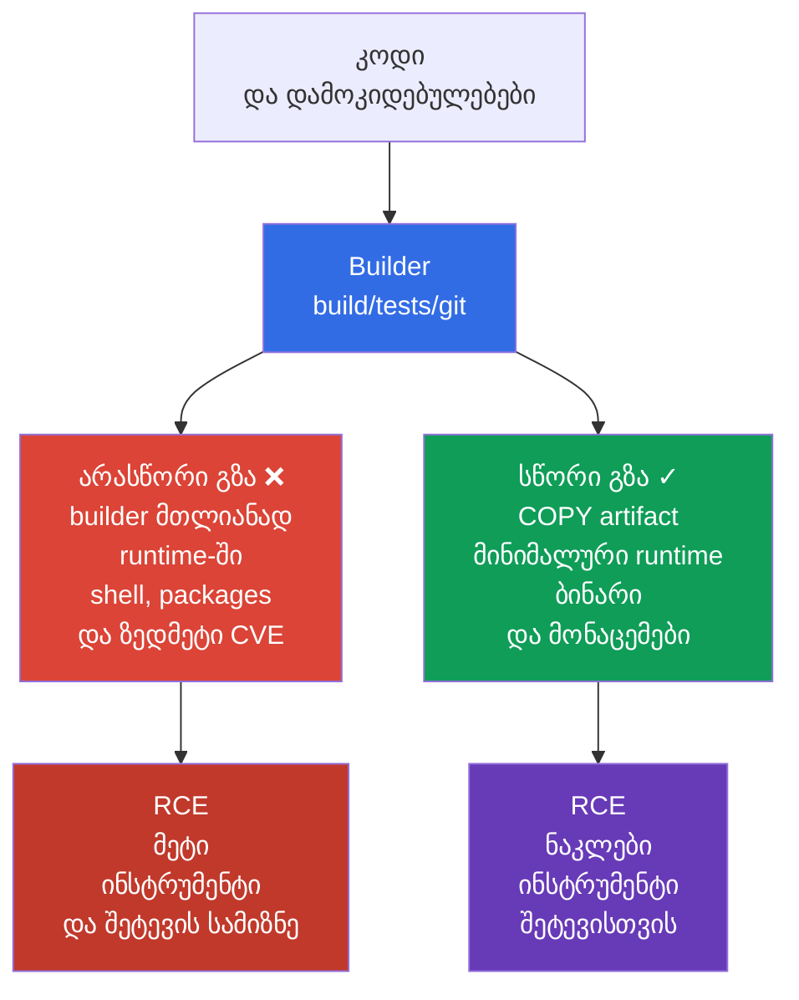
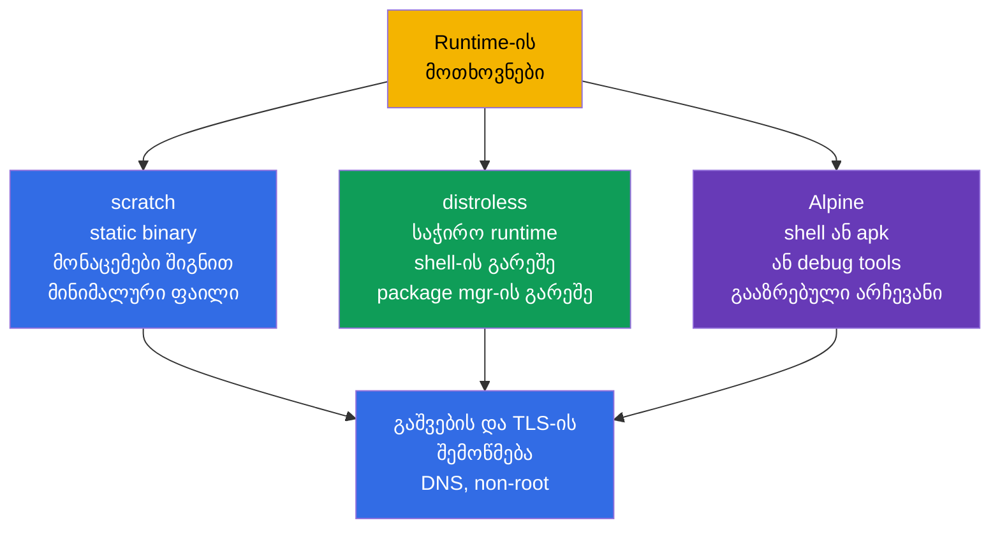

[Русская версия](ru.md) · [Eng version](README.md) · [Versión en español](es.md) · [Version française](fr.md) · [Deutsche Version](de.md) · [繁體中文版](tw.md) · [日本語版](jp.md)

# თავი 24. Base image-ის მინიმიზაცია

> **პრობლემა.** RCE-ის შემდეგ სრული runtime-image თავდამსხმელს აძლევს არა მხოლოდ
> აპლიკაციის პროცესს, არამედ shell-ს, package manager-ს, compiler-ს, source-კოდსა და
> ზედმეტ library-ებს. თითოეული ასეთი კომპონენტი მატებს CVE-ს ან მზა ინსტრუმენტს
> payload-ის ჩამოსატანად, reconnaissance-ისა და persistence-ისთვის. თუ builder მთლიანად
> ხვდება final image-ში, რისკი მეორდება ყოველ node-ზე, სადაც ეს artifact ჩამოტვირთვისა
> და გაშვების საგანი გახდება.

> **რა არის შემდეგ.** [23-ე თავში](../23/ge.md) დავშიფრეთ ტრაფიკი Pod-ებს შორის და
> დავადასტურეთ peer-ის identity. ახლა ვიცავთ იმას, რაც Pod-ში გაშვებულია: image-ს და
> მის build context-ს. ეს არის CKS-ის **Supply Chain Security**-ის დომენი (20%). უფრო
> მცირე და reproducible image შეიცავს ნაკლებ კომპონენტს, CVE-სა და მზა ინსტრუმენტს
> თავდამსხმელისთვის, მაგრამ თავისთავად არ ცვლის SBOM-ს, ხელმოწერას, policy-სა და
> სკანირებას - ისინი მოვა 25-28 თავებში.

> **რა უნდა ვიცოდეთ CKA-დან.** image-ის, Dockerfile-ის, layer-ების, tag-ებისა და
> multi-stage build-ის ძირითადი ცნებები განხილულია [CKA-ს 23-ე თავში](../../../cka/course/23/ge.md),
> ხოლო `runAsNonRoot`, capabilities და read-only root filesystem -
> [CKA-ს 20-ე თავში](../../../cka/course/20/ge.md). აქ ვიცავთ მათ supply-chain
> საფრთხისგან: არა უბრალოდ ვამცირებთ image-ის ზომას, არამედ ვაშორებთ ზედმეტს final
> artifact-იდან.

> 🧠 მინიმალური final image ამცირებს CVE-სა და post-exploitation tool-ებს, მაგრამ არ ცვლის RCE-საწინააღმდეგო დაცვას, `SecurityContext`-ს, ქსელს ან detection-ს.

## 24.1. საფრთხის მოდელი: ზედმეტი image-ში ხდება თავდამსხმელის შესაძლებლობა

Image - მიწოდებული software artifact-ის ნაწილია. ყველაფერი, რაც მოხვდა მის final
stage-ში, ხვდება ყოველ node-ზე, რომელიც image-ს ჩამოტვირთავს: package manager, shell,
compiler, source, ტესტური key-ები, layer-ების ისტორია და transitive library-ები.
ამ კომპონენტებიდან ნებისმიერში დაუცველობა - დამატებითი CVE; utility, როგორიცაა
`curl`, `wget` ან `sh` - მზა ინსტრუმენტი აპლიკაციის კომპრომეტაციის შემდეგ
ქმედებებისთვის.

ტიპური სცენარი: აპლიკაციას აქვს RCE. სრულ `ubuntu`-image-ში თავდამსხმელი უშვებს
`/bin/sh`-ს, ჩამოტვირთავს payload-ს, აყენებს utility-ებს package manager-ის მეშვეობით,
კითხულობს build-ფაილებს და ცდილობს პრივილეგიების ესკალაციას. მინიმალურ image-ში, shell-ისა
და package manager-ის გარეშე, RCE მაინც კრიტიკულია, მაგრამ მისი შემდგომი გზა უფრო
მოკლეა: არ არსებობს ინტერაქტიული shell, compiler და library-ების დიდი ნაწილი. ეს არის
**attack surface-ის შემცირება**, არა უსაფრთხოების საზღვარი: პროცესის უფლებები,
`SecurityContext`, NetworkPolicy და runtime detection კვლავ საჭირო რჩება.



მინიმიზაცია იძლევა ოთხ პრაქტიკულ ეფექტს:

- ნაკლები package - ნაკლები ცნობილი დაუცველობა და ნაკლები update-ი მოსავლელად;
- უფრო მცირე ზომა - უფრო სწრაფი pull, rollout და autoscaling, ნაკლები დანახარჯი registry-სა და ქსელზე;
- არ არსებობს build-ინსტრუმენტები და source runtime-ში - მათი მოპარვა ან გამოყენება უფრო რთულია;
- ნაკლები გამშვები ფაილი - ნაკლები ბრძანება, ხელმისაწვდომი RCE-ის შემდეგ.

უსაფრთხოებას მხოლოდ მეგაბაიტებით არ ვზომავთ. 5 MiB ზომის image, დაუცველი
აპლიკაციით ან root-პროცესით, უსაფრთხო არ არის, ხოლო CA-სერტიფიკატების წაშლას
შესაძლოა TLS-ის გატეხა. მინიმიზაცია ხდება **გააზრებულად**: ვტოვებთ runtime-ს,
CA bundle-ს, timezone data-სა და dynamic library-ებს, რომლებიც აპლიკაციას
ნამდვილად სჭირდება.

> 🧠 ნაკლები ფაილი runtime image-ში - ნაკლები post-exploitation ინსტრუმენტი თავდამსხმელისთვის; არჩევანი `scratch`/distroless/Alpine-ს შორის - trade-off attack surface-სა და დიაგნოსტიკის შესაძლებლობას შორის.

## 24.2. `scratch`, distroless და Alpine: runtime-ის შერჩევა საჭიროებების მიხედვით

Base image განსაზღვრავს, რომელი ფაილები არსებობს `COPY`-ის შესრულებამდე. Final
stage builder-ის მსგავსი არ უნდა იყოს. აირჩიეთ ის მხოლოდ მას შემდეგ, რაც გაარკვევთ,
წარმოადგენს artifact static ბინარს, სჭირდება თუ არა language runtime და
საჭიროებს თუ არა დიაგნოსტიკას ან native library-ებს.

| Runtime base | რა შედის შიგნით | კარგად ერგება | შეზღუდვები და რისკი |
|---|---|---|---|
| `scratch` | ცარიელი base image: image-ში თავადვე არ არსებობს runtime-ფაილები | static Go/Rust/C++ binary, რომელსაც არ სჭირდება ხელმიუწვდომელი runtime-library-ები | არ არსებობს shell, CA bundle, timezone data და dynamic loader; Kubernetes/runtime ჩვეულებრივ Pod-ს აწვდის `/etc/resolv.conf`-ს, მაგრამ აპლიკაციას მაინც უნდა ჰქონდეს თანხვედრადი DNS resolver და საჭირო runtime-მონაცემები |
| distroless | მხოლოდ შერჩეული runtime/library-ები, shell-ისა და package manager-ის გარეშე | Go/Java/Node/Python აპლიკაციები, როცა საჭირო არის მინიმალურად მხარდაჭერილი runtime | ჩვეულებრივი `kubectl exec -- sh` შეუძლებელია; debug-ი logs, metrics და `kubectl debug`-ის მეშვეობით |
| Alpine | მინიმალური Linux BusyBox-ითა და `apk`-ით | აპლიკაცია ან დიაგნოსტიკა, რომელსაც რეალურად სჭირდება shell/package-ები | shell და package manager რჩება; `musl` glibc-ის ნაცვლად შესაძლოა შეუთანხმებელი იყოს native dependency-სთან |

`/etc/resolv.conf`, `/etc/hosts` და hostname-თან დაკავშირებული ფაილები შესაძლოა
kubelet-მა/container runtime-მა უზრუნველყოს Pod-ის გაშვებისას და არ არის ფაილები,
რომლებიც ავტომატურად უნდა დაკოპირდეს `scratch`-ში.



`Alpine` ავტომატურად უსაფრთხო არ არის distroless-ზე მხოლოდ იმის გამო, რომ პატარაა.
მისი `/bin/sh` და `apk` სასარგებლოა დეველოპერისთვის, მაგრამ ასევე სასარგებლოა
RCE-ის დროსაც. ამის საპირისპიროდ, distroless არ უნდა შეირჩეს მუშაობის
ხარისხის ხარჯზე. მაგალითად, აპლიკაციას CGO-დამოკიდებულებით შესაძლოა სჭირდებოდეს
glibc და კონკრეტული shared library-ები; მაშინ ჯერ ამოწმეთ binary `ldd`-ის
მეშვეობით builder-ში და აირჩიეთ თანხვედრადი runtime.

შეამოწმეთ, რას გულისხმობს tag კონკრეტული provider-ისთვის. `:latest` არ ფიქსირებს
artifact-ს და არ ერგება production-ს. ვერსირებული tag (`alpine:3.21.2`) - მინიმუმია;
release-ისთვის დაფიქსირეთ ასევე immutable digest, თქვენი registry-ის მიერ
მიღებული და გადამოწმებული:

```text
registry.example.com/payments/api:1.4.2@sha256:<შემოწმებული-64-სიმბოლური-digest>
```

Digest-ი ჩაწერილია GitOps/manifest-ში image-ის შემოწმების შემდეგ და არ არის
აღებული შემთხვევითი პოსტიდან. Tag მოსახერხებელია ადამიანისთვის, digest იძლევა
გარანტიას იმ ბაიტებზე, რომლებიც სკანირებული და ხელმოწერილი იყო. Kubernetes-ში ეს
იგივე მნიშვნელობა მითითებულია `image:`-ში.

> 🎯 გამოცალკევებული builder და final stage `COPY --from=builder`-ით, მხოლოდ მზა artifact-ის, compiler, source, cache და credentials არ ხვდება runtime-ში.

## 24.3. Multi-stage build: builder არ უნდა გახდეს runtime

Multi-stage Dockerfile განაცალკევებს სანდო როლებს. პირველ stage-ს შესაძლოა ჰქონდეს
Go compiler, package cache და source. ბოლო stage იღებს მხოლოდ მზა artifact-ს.
`COPY --from=builder` არ გადმოგადგილებს builder-ის filesystem-ს მთლიანად, თუ
ერთი ფაილი ცხადად კოპირდება. ეს გამორიცხავს compiler-ს, `git`-ს, `go.mod`-ს,
პრივატულ build cache-ებსა და დამოკიდებულებების უმეტესობას runtime-იდან.

ქვემოთ მოცემულია სრული მაგალითი პატარა Go HTTP-სერვისისთვის. ის გულისხმობს, რომ
საქაღალდეში არსებობს `go.mod`, `go.sum` და `./cmd/server`; `CGO_ENABLED=0` ქმნის
static binary-ს, რომელიც ერგება `scratch`-ს. ყველა image-ს აქვს კონკრეტული
ვერსია, ხოლო final process არ მუშაობს UID 0-ის სახელით.

```dockerfile
# syntax=docker/dockerfile:1.7
# Dockerfile
FROM golang:1.27.1-alpine3.24@sha256:<შემოწმებული-digest> AS builder
WORKDIR /src

# იშვიათად ცვალებადი dependency manifests კოდზე მაღლა: უკეთესი cache.
COPY go.mod go.sum ./
RUN go mod download

COPY . ./
RUN CGO_ENABLED=0 GOOS=linux go build -trimpath -ldflags="-s -w" \
    -o /out/server ./cmd/server

# scratch-ში რიცხვითი UID/GID საკმარისია non-root credentials-ის დასაწესებლად;
# ცალკე შეამოწმეთ აპლიკაციის runtime-დამოკიდებულებები.
FROM scratch
COPY --from=builder /out/server /server
USER 65532:65532
EXPOSE 8080
ENTRYPOINT ["/server"]
```

რიცხვითი UID/GID საშუალებას აძლევს runtime-ს გაშვას პროცესი მომხმარებლის
`/etc/passwd`-ში ჩაწერის გარეშე, მაგრამ არ იძლევა გარანტიას აპლიკაციის
მუშაობაზე: მას შესაძლოა სჭირდებოდეს user-ის ან group-ის lookup, `HOME`,
timezone data, CA bundle, NSS ან სხვა runtime-ფაილები.

`USER` image-ში პირველი ბარიერია: პროცესი ნაგულისხმევად არ არის root, მათ
შორის ლოკალურ `docker run`-ის დროსაც. დაამყარეთ ის Pod-level policy-სა და
SecurityContext-ში, რათა image-ის მომხმარებელმა შემთხვევითი manifest-ით არ
გააუარესოს ეს გადაწყვეტილება:

```yaml
apiVersion: v1
kind: Pod
metadata:
  name: minimal-api
spec:
  securityContext:
    runAsNonRoot: true
    runAsUser: 65532
    runAsGroup: 65532
  containers:
  - name: api
    image: registry.example.com/training/minimal-api:1.0.0
    ports:
    - containerPort: 8080
    securityContext:
      allowPrivilegeEscalation: false
      readOnlyRootFilesystem: true
      capabilities:
        drop: ["ALL"]
```

`runAsNonRoot: true` არ ქმნის მომხმარებელს image-ში და არ აგვარებს ფაილების
ownership-ს. ის უბრალოდ არ დაუშვებს გაშვებას, თუ runtime-მა დაადგინა root.
დარწმუნდით, რომ binary და საქაღალდეები, სადაც აპლიკაცია ჩაწერს, UID `65532`-ისთვის
ხელმისაწვდომია; `readOnlyRootFilesystem: true`-ის დროს დროებითი მონაცემები
გადაიტანეთ `emptyDir`-ში, root-ის ხელახლა writable-ად გახდომის ნაცვლად.

> 🔬 Docker და rootless Podman იყენებენ ერთსა და იმავე Dockerfile-ს/context-ს; rootless არ იცავს ფართო context-ისგან, mutable base image-ისგან ან secret-ისგან layer-ში.

### Docker-ისა და Podman-ის build

ორივე ბრძანება იყენებს ერთ Dockerfile-სა და ერთ build context-ს. Docker
ჩვეულებრივ მუშაობს daemon-ის მეშვეობით; Podman daemonless-ია და შესაძლოა
მუშაობდეს rootless რეჟიმში, რაც სასარგებლოა, სადაც build-მა არ უნდა მიიღოს
root-წვდომა host-ის Docker socket-ზე. Rootless Podman არ აქცევს დაუცველ
Dockerfile-ს უსაფრთხოდ: secret და ზედმეტი ფაილები მაინც შესაძლოა ხვდებოდეს
image-ში.

```bash
# Docker: BuildKit საჭიროა secret mount-ისთვის შემდეგ განყოფილებაში.
DOCKER_BUILDKIT=1 docker build \
  --tag registry.example.com/training/minimal-api:1.0.0 \
  --file Dockerfile .

docker image inspect registry.example.com/training/minimal-api:1.0.0 \
  --format 'size={{.Size}} bytes user={{.Config.User}}'
docker run --rm --user 65532:65532 \
  registry.example.com/training/minimal-api:1.0.0

# Podman rootless: გაშვება ჩვეულ მომხმარებელად, sudo-ს გარეშე.
podman build \
  --tag registry.example.com/training/minimal-api:1.0.0 \
  --file Dockerfile .
podman image inspect registry.example.com/training/minimal-api:1.0.0 \
  --format 'size={{.Size}} bytes user={{.Config.User}}'
podman run --rm --user 65532:65532 \
  registry.example.com/training/minimal-api:1.0.0
```

Multi-stage ამცირებს runtime-ს, მაგრამ თავისთავად არ ხდის builder-ს სანდოს და
build-ს reproducible-ს. Release-ისთვის დაფიქსირეთ და გადამოწმეთ base-image
digest, modules/packages-ის ვერსიები და დამოკიდებულებების წყარო; არ დაუშვათ,
რომ build უკონტროლოდ იყოს დამოკიდებული mutable გარეშე repository-ებზე.
Secrets-ები private dependency-ებისთვის გადმოეცით მხოლოდ BuildKit/Podman
secret mount-ების მეშვეობით.

არ გამოიყენოთ `--no-cache` როგორც მუდმივი „security-შემოწმება": ის მხოლოდ
გამორთავს cache-ს, ზრდის დროსა და ტრაფიკს, მაგრამ არ ხდის დამოკიდებულებებს
reproducible. ამის შემდეგ შეამოწმეთ შექმნილი digest გამოქვეყნებამდე.

### ვარიანტი distroless-ით

თუ static build შეუძლებელია, final stage შესაძლოა იყოს distroless. გამოიყენეთ
ვერსირებული/ვარიანტული base, ხოლო release-ისთვის შეცვალეთ ის თქვენი
პლატფორმის შემოწმებული digest-ით. distroless-ში `:nonroot` უკვე ადგენს
არაპრივილეგირებულ მომხმარებელს, მაგრამ `USER` ცხადად არის მითითებული, რათა
განზრახვა ჩანდეს Dockerfile-ში.

```dockerfile
FROM gcr.io/distroless/static-debian13:nonroot@sha256:<შემოწმებული-digest>
COPY --from=builder /out/server /server
USER 65532:65532
ENTRYPOINT ["/server"]
```

> 🎯 `RUN rm` არ შლის secret-ს წინა layer-იდან; გამოიყენეთ secret mount და `.dockerignore`, ხოლო გაჟონვის დროს გააუქმეთ და ხელახლა ააგეთ image.

## 24.4. Layer-ები, secrets და build context

Dockerfile-ის ყოველი filesystem-ის შემცვლელი ინსტრუქცია შესაძლოა შექმნას
layer. Layer immutable-ია: თუ secret შექმნილია layer-ში, რომელი stage-იც
გამოქვეყნებულ image-ში ხვდება, `RUN rm /tmp/token` შემდეგ layer-ში არ შლის
მის ბაიტებს ქვედა layer-იდან. ამიტომ secret არ შეიძლება გადმოეცეს `COPY`-ის,
`ADD`-ის, `ARG`-ის ან `ENV`-ის მეშვეობით.

ჩვეულებრივი multi-stage build სხვა შემთხვევაა: builder-ის ცალკეული layer-ები
არ ხდება final runtime image-ის layer-ები, თუ final stage იწყება საკუთარი
`FROM`-ით და `COPY --from`-ის მეშვეობით გადაეცემა მხოლოდ საჭირო artifact.

ეს ავტომატურად არ ხდის credentials-ის დაუცველ გადმოცემას უსაფრთხოს. Secret
მაინც შესაძლოა მოხვდეს final image-ში შემთხვევით კოპირებული artifact-ის
მეშვეობით, ცალკე გამოქვეყნებულ intermediate image-ში ან build logs-ში. თუ
credential გადმოეცემოდა `ARG`/`ENV`-ის მეშვეობით ან ჩაწერილი იყო filesystem
layer-ში, ის ასევე შესაძლოა დარჩეს შესაბამისი build stage-ის build metadata-ში,
history-ში ან cache-ში. Build-time credentials-ისთვის გამოიყენეთ BuildKit/Podman
secret mount-ები `ARG`-ის, `ENV`-ის, `COPY`-ის ან `ADD`-ის ნაცვლად.

```dockerfile
# ᲘᲧᲣᲗᲪᲘᲡᲦᲠᲘᲡ: token დარჩება history/config-ში ან ერთ-ერთ layer-ში.
ARG NPM_TOKEN
RUN npm config set //registry.example.com/:_authToken="$NPM_TOKEN" && npm ci

# ᲘᲧᲣᲗᲪᲘᲡᲦᲠᲘᲡ: .npmrc შესაძლოა ხვდებოდეს COPY . .-ში და დარჩეს layer-ში.
COPY .npmrc /root/.npmrc
RUN npm ci
RUN rm /root/.npmrc
```

BuildKit-ისთვის გამოიყენეთ secret mount: secret დროებით ხელმისაწვდომია მხოლოდ
საჭირო `RUN`-ბრძანებისთვის და არ ხვდება output layer-ში; secret-ის მნიშვნელობა
ასევე არ ხვდება provenance attestation-ში. ბრძანება, რომელიც იყენებს secret-ს,
მაინც არ უნდა ბეჭდავდეს მას stdout/stderr-ში, ჩაწერდეს artifact-ში
`COPY --from`-ისთვის ან ინახავდეს credential-ს ჩვეულებრივ filesystem layer-ში.
External cache დასაშვებია სწორი `--secret`-ის დროს: საშიშია არა cache export
თავისთავად, არამედ credential cacheable filesystem output-ში secret-ის
არასწორი დამუშავების გამო.

```dockerfile
# syntax=docker/dockerfile:1.7
FROM node:22.23.2-alpine@sha256:<შემოწმებული-digest> AS builder
WORKDIR /app
COPY package.json package-lock.json ./
# Build-ინსტრუმენტები (TypeScript, Vite, webpack და სხვ.) ჩვეულებრივ devDependencies-შია.
RUN --mount=type=secret,id=npmrc,target=/root/.npmrc \
    npm ci
COPY . .
RUN npm run build
# devDependencies-ის ამოშლა მხოლოდ build-ის შემდეგ; runtime-stage-ში კოპირდება artifacts და საჭირო დამოკიდებულებები.
RUN npm prune --omit=dev
```

```bash
# .npmrc ფაილი ინახება secret store/CI-ში, არა Dockerfile-ის გვერდით.
DOCKER_BUILDKIT=1 docker build \
  --secret id=npmrc,src="$HOME/.config/build-secrets/npmrc" \
  -t registry.example.com/training/web:1.0.0 .

podman build \
  --secret id=npmrc,src="$HOME/.config/build-secrets/npmrc" \
  -t registry.example.com/training/web:1.0.0 .
```

თუ secret უკვე გამოქვეყნდა image-ში, ერთი ახალი `RUN rm` საკმარისი არ არის.
დაუყოვნებლივ გააუქმეთ და შეცვალეთ secret, ამოშალეთ/შეზღუდეთ წვდომა registry
artifact-ზე, შემდეგ ხელახლა ააგეთ image სუფთა Dockerfile-იდან ახალი secret-ით.
ჩათვალეთ ძველი credential კომპრომეტირებულად.

### `.dockerignore` - build context-ის საზღვარი

Dockerfile-ის გაშვებამდე კლიენტი აგზავნის build context-ს builder-ისთვის.
`.dockerignore`-ის გარეშე `COPY . .` შესაძლოა დაჰპატიმროს `.git`, ლოკალური
`.env`, SSH key-ები, ტესტური artifacts და დიდი საქაღალდეები. `.dockerignore`
ამცირებს ტრაფიკს, აჩქარებს build-ს და არ აძლევს ამ ფაილებს Dockerfile-ის
ინსტრუქციებისთვის ხელმისაწვდომი გახდომის საშუალებას. ეს მნიშვნელოვანი დაცვაა,
მაგრამ არ ჩაანაცვლებს secret management-ს: ფაილი, რომელიც context-ში
ნამდვილად საჭიროა, კვლავ შესაძლოა შემთხვევით დაკოპირდეს.

```dockerignore
# .dockerignore
.git
.gitignore
.env
.env.*
.npmrc
*.pem
*.key
id_rsa
secrets/
coverage/
tmp/
node_modules/
**/.DS_Store
README.md
```

წესები პროექტს უნდა შეესაბამებოდეს. არ იგნორირეთ ბრმად `*.pem`, თუ აპლიკაციას
ნამდვილად სჭირდება საჯარო CA-სერტიფიკატი: ამ შემთხვევაში შეინახეთ ცხადად
დაშვებული საჯარო სერტიფიკატი ცალკე საქაღალდეში და დააკოპირეთ მხოლოდ ის.
გამოაცალკევეთ build context repository root-იდან, მაგალითად
`docker build -f docker/Dockerfile docker/`, თუ Dockerfile-ს არ სჭირდება
მთლიანი monorepo.

### Layer-ების შემცირება საზიანო „ოპტიმიზაციების" გარეშე

გააერთიანეთ ერთმანეთთან დაკავშირებული install/cleanup ერთ `RUN`-ში, რათა
package manager-ის cache არ დარჩეს წინა layer-ში. მაგრამ არ შეაერთოთ მთელი
Dockerfile ერთ ურთიერთუკავშირო ბრძანებაში: `COPY`-ის მიმდევრობამ უნდა
შეინარჩუნოს cache, ხოლო policy-სა და review-ს უნდა შესწევდეს ხედვის უნარი,
რაც ინსტალირდება.

```dockerfile
# Alpine: package index და build dependencies არ დარჩება ამ stage-ში.
RUN apk add --no-cache --virtual .build-deps build-base \
 && make release \
 && apk del .build-deps
```

ეს სასარგებლოა მხოლოდ იმ შემთხვევაში, თუ ბრძანება final stage-შია. უკეთესი
ვარიანტი ჩვეულებრივ უფრო მარტივია: ზოგადად არ გადმოგადგილდეს stage, სადაც
არსებობს `apk`, compiler და cache, runtime-ში multi-stage build-ის მეშვეობით.

> 🎯 შეამოწმეთ final artifact `history`-ის, `inspect`-ისა და `dive`-ის მეშვეობით; distroless/scratch-ისთვის shell-ის არარსებობას ადასტურებს მხოლოდ მოსალოდნელი შეცდომა ხელმიუწვდომელი executable-ის შესახებ, არა ნებისმიერი non-zero `kubectl exec`.

## 24.5. ინსპექცია: ზომის, layer-ებისა და შემცველობის გაზომვა

Build-ის შემდეგ არ ივარაუდოთ, რომ final image მინიმალურია: დაამტკიცეთ ეს.
`docker image ls` აჩვენებს საერთო ზომას, მაგრამ არ ხსნის, რომელმა layer-მა
გამოიწვია ის. `history`, `inspect` და `dive` ეხმარებიან ბრძანებების, ზომებისა
და ფაილურ ცვლილებების დანახვაში.

```bash
IMAGE=registry.example.com/training/minimal-api:1.0.0

# საერთო ზომა და ბრძანებები, რომლებმაც შექმნეს layer-ები.
docker image ls "$IMAGE"
docker history --no-trunc "$IMAGE"
docker image inspect "$IMAGE" \
  --format 'user={{.Config.User}} entrypoint={{json .Config.Entrypoint}} size={{.Size}}'

# იგივე შემოწმებები Podman-ის გამოყენებისას.
podman history --no-trunc "$IMAGE"
podman image inspect "$IMAGE" \
  --format 'user={{.Config.User}} entrypoint={{json .Config.Entrypoint}} size={{.Size}}'

# ინტერაქტიული TUI: თითოეული layer-ის ზომა, wasted space, ფაილები.
dive "$IMAGE"
```

`dive`-ში ყურადღება მიაქციეთ:

- დიდი layer `COPY . .`-ით - ხშირად context ზედმეტად ფართოა ან Dockerfile-ის
  მიმდევრობა არასწორია;
- package cache, compiler, tests, `.git`, `.env`, private key ან `.npmrc` -
  მიზეზი Dockerfile-ის/.dockerignore-ის გამოსასწორებლად და ნაპოვნი secret-ის
  დაუყოვნებლივ ბრუნვისთვის;
- „wasted bytes" `RUN install`-ისა და ცალკე `RUN rm`-ის შემდეგ - წაშლა
  მოგვიანებით მოხდა, ახალ layer-ში;
- ცარიელი ან `root`-ის ტოლი `User` - Dockerfile-მა არ დააფიქსირა non-root
  user.

`dive` მხოლოდ იმას ხედავს, რაც image-ისთვის ხელმისაწვდომია. ის არ ჩაანაცვლებს
vulnerability scan-ს, secret scan-ს ან SBOM-ს. CI-ში სასარგებლო მიმდევრობა
ასეთია: build -> inspect/lint -> SBOM/scan -> push immutable digest ->
sign/attest digest -> verify -> deploy/admission. ჩვეულ Cosign/Sigstore
workflow-ში ჯერ ქვეყნდება image და მიიღება მისი immutable digest, შემდეგ
Cosign ხელს აწერს ამ digest-ს და ქმნის attestation-ს registry-ში;
deployment/admission ამოწმებს ამ კავშირს. შემდეგი თავი დაამატებს SBOM-ს,
26-28 თავები - ხელმოწერას, policy-სა და scanner-ებს.

## 24.6. შემოწმება shell-ის გარეშე: distroless განზრახ სხვაგვარად იქცევა

Shell-ის არარსებობა distroless/scratch runtime-ის თვისებაა, არა Kubernetes-ის
შეცდომა. ამიტომ წარმატებული `kubectl exec <pod> -- /bin/sh` ასეთ image-ში
სამაშურდი სიგნალი იქნებოდა. შეამოწმეთ აპლიკაციის endpoint და UID ჩვეული
საშუალებებით, ხოლო shell-ის მოსალოდნელი უარყოფა დაფიქსირეთ ცალკე.

```bash
kubectl apply -f minimal-api.yaml
kubectl wait --for=condition=Ready pod/minimal-api --timeout=90s
kubectl logs minimal-api

# აპლიკაციის წარმატებულ გაშვებას ამოწმებენ მისი endpoint/health probe-ით, არა shell-ით.
kubectl port-forward pod/minimal-api 8080:8080
# სხვა terminal-ში: curl -fsS http://127.0.0.1:8080/health

# ჯერ გამორიცხეთ generic exec failure: Pod უკვე Ready-ია, RBAC უშვებს pods/exec-ს.
if [[ "$(kubectl auth can-i create pods --subresource=exec)" != yes ]]; then
  echo "ERROR: current identity cannot create pods/exec" >&2
  exit 1
fi

# distroless/scratch-ისთვის მოსალოდნელია ზუსტად ხელმიუწვდომელი executable-ის შეცდომა.
if output=$(kubectl exec minimal-api -c api -- /bin/sh 2>&1); then
  echo "ERROR: /bin/sh unexpectedly exists in the minimal runtime" >&2
  exit 1
else
  status=$?
  if printf '%s\n' "$output" | grep -Eqi 'executable file not found|stat /bin/sh: no such file or directory'; then
    echo "OK: /bin/sh is absent as expected"
  else
    printf 'ERROR: kubectl exec failed, but /bin/sh absence was not proven (exit %s): %s\n' \
      "$status" "$output" >&2
    exit 1
  fi
fi

# პარამეტრები, რომლებსაც shell არ სჭირდება:
kubectl get pod minimal-api -o jsonpath='{.spec.securityContext.runAsNonRoot}{"\n"}'
kubectl get pod minimal-api -o jsonpath='{.spec.containers[0].securityContext.allowPrivilegeEscalation}{"\n"}'
```

არ დაამატოთ `busybox` production image-ს „debug-ისთვის": ეს აუქმებს
მინიმიზაციის მიზნის ნაწილს. ინციდენტისას გამოიყენეთ logs, metrics, trace,
`kubectl describe` და დროებითი ephemeral debug container, იზოლირებული
production image-ისგან:

```bash
# საჭიროებს RBAC-ის ნებართვას და ephemeral containers-ის მხარდაჭერას კლასტერში.
kubectl debug -it pod/minimal-api --target=api \
  --image=busybox:1.36.1 -- sh
```

Ephemeral debug container იმავე Pod-ში მდებარეობს და იზიარებს მის network
namespace-ს. `--target=api` ითხოვს container runtime-ისგან debug container-ის
მოთავსებას სამიზნე container-ის process namespace-ში; ეს მოითხოვს runtime-ის
მხარდაჭერას. მის გარეშე debug container შესაძლოა დაიწყოს იზოლირებული process
namespace-ით და არ დაინახოს აპლიკაციის პროცესები. მისი root filesystem და
mount namespace ავტომატურად არ ხდება სამიზნე container-ის filesystem.
Debug image-საც უნდა ჰქონდეს კონკრეტული ვერსია (production-ში - დამტკიცებული
digest) და არ უნდა გამოიყენებოდეს ხელმიუწვდომელი shell-ის მუდმივ
გვერდის ავლის საშუალებად.

### ტიპური შეცდომები და დიაგნოსტიკა

| სიმპტომი | სავარაუდო მიზეზი | რა უნდა გაკეთდეს |
|---|---|---|
| `exec /server: no such file or directory` `scratch`-ში | binary დინამურად ლინკირებულია ან არასწორია architecture | ააგეთ `CGO_ENABLED=0`-ით; შეამოწმეთ `file /out/server`, platform და დამოკიდებულებები builder-ში |
| HTTPS არ მუშაობს `scratch`-ში | არ არსებობს CA certificates | ჩაანთვალეთ CA bundle აპლიკაციაში ან დააკოპირეთ მხოლოდ საჭირო საჯარო bundle ცალკე stage-იდან |
| Pod არ იწყებს გაშვებას `runAsNonRoot`-ით | image/manifest ცდილობს UID 0-ის გამოყენებას | დაწესეთ `USER` Dockerfile-ში, ownership და ცხადი რიცხვითი UID; არ გვერდზევლოთ შემოწმებას |
| `kubectl exec ... /bin/sh` არ მუშაობს | shell-ის მოსალოდნელი არარსებობა distroless/scratch-ში | შეამოწმეთ logs/endpoint; გამოსაკვლევად გამოიყენეთ `kubectl debug` |
| secret ნაპოვნია `dive`/history-ში | credential დაკოპირებულია, გადმოცემულია `ARG`-ით ან წაშლილია მოგვიანო layer-ში | გააუქმეთ secret, ხელახლა ააგეთ მის გარეშე, გამოიყენეთ BuildKit/Podman secret mount |
| Docker-მა და Podman-მა შექმნეს განსხვავებული შედეგი | სხვადასხვა builder/cache/platform ან დაუფიქსირებელი base image | ცხადად დააფიქსირეთ platform საჭიროებისამებრ, დააფიქსირეთ digest და შეადარეთ final digest |

> 🏭 Pinned base/release digest, ვიწრო context, secret management, non-root runtime, SBOM/scan/signature და admission; debug - დამტკიცებულ ephemeral debug image-ში.

## 24.7. როგორ გამოიყენება ეს production-ში

- **Build და runtime გამოცალკევებულია.** Builder შესაძლოა მძიმე იყოს, მაგრამ
  final stage უშვებს მხოლოდ artifact-ს, runtime-library-ებსა და საჭირო
  public data-ს. Stages, dependencies და base images-ები გაივლის review-ს
  production-კოდის მსგავსად.
- **ვერსია და digest ფიქსირდება.** `latest`-ს ბლოკავენ linter/policy-ით.
  Release აკავშირებს ადამიანურ tag-ს immutable digest-თან; იმავე digest
  გაივლის SBOM-ს, scan-ს, ხელმოწერას და deployment-ს.
- **Non-root - defence in depth.** `USER` image-ში, `runAsNonRoot`/რიცხვითი
  UID Pod-ში და admission policy ერთმანეთს აძლიერებენ. დაამატეთ
  `drop: ["ALL"]`, `allowPrivilegeEscalation: false` და read-only root, როცა
  აპლიკაცია თანხვედრადია.
- **Secrets არასდროს არ ხდება build arguments.** CI იძლევა short-lived
  credential-ს build-ის დროისთვის; BuildKit/Podman secret mounts, scoped
  registry permissions და `.dockerignore` ამცირებს გაჟონვის შანსს. ყოველი
  გაჟონვა layer-ში ნიშნავს ბრუნვას, არა უბრალოდ ახალ build-ს.
- **Debug გამოცალკევებულია runtime-იდან.** Observability და დამტკიცებული
  ephemeral debug images ჩაანაცვლებს shell-ს application image-ის შიგნით.
  ეს ინარჩუნებს production artifact-ს იდენტურად CI-სა და კლასტერში.
- **მინიმიზაცია pipeline-ის ნაწილია.** გუნდები ზომავენ image size-სა და layer
  composition-ს, უშვებენ `dive`-ს review-ის დროს, ატარებენ SBOM/scan/sign-ს
  CI-ში და პერიოდულად ხელახლა აგებენ image-ს base-ის განახლებისას. მცირე
  image არ ათავისუფლებს CVE-ზე რეაგირებისგან.

## 24.8. მინი-განმარტებანი

- **Attack surface (შეტევის ზედაპირი)** - კომპონენტები, ფაილები და
  ინტერფეისები, რომლებმაც შესაძლოა შეიცავონ დაუცველობა ან გამოყენებულ იქნან
  შეტევაში.
- **Base image** - image, `FROM`-ინსტრუქციაში მითითებული, რომელიც განსაზღვრავს
  საწყის filesystem stage-ს.
- **Build context** - ფაილები, გადმოცემული builder-ისთვის; შეზღუდულია
  `.dockerignore`-ით.
- **distroless** - მინიმალური runtime image package manager-ისა და ჩვეულებრივ
  shell-ის გარეშე.
- **`scratch`** - ცარიელი base image filesystem-ის გარეშე; ერგება static
  artifact-ს.
- **Multi-stage build** - Dockerfile ცალკეული build- და runtime-stage-ებით,
  დაკავშირებული `COPY --from=`-ით.
- **Layer** - image-ის filesystem-ის უცვლელი ცვლილება; წაშლა ახალ layer-ში
  არ ასუფთავებს ძველის შემცველობას.
- **Digest** - კონკრეტული image manifest/content-ის უცვლელი SHA-256
  identifier.
- **Rootless Podman** - Podman-ის რეჟიმი, სადაც build/run ასრულებს ჩვეულებრივი
  მომხმარებელი, არა root daemon.
- **Secret mount** - credential-ის დროებითი დაკავშირება ერთი build-ბრძანებისთვის
  final layer-ში ჩაწერის გარეშე.

## 24.9. თავის შეჯამება

- ზედმეტი packages, shell, package manager, build tools და secrets ზრდის
  attack surface-სა და RCE-ის შედეგებს; მცირე image ამცირებს რისკს, მაგრამ
  არ ჩაანაცვლებს დანარჩენ security controls-ს.
- `scratch` ერგება static binary-ს, distroless იძლევა მინიმალურ runtime-ს
  shell-ის გარეშე, Alpine-ს ირჩევენ მხოლოდ მისი Linux-userland-ის ნამდვილი
  საჭიროებისას და `musl`-ის გათვალისწინებით.
- Multi-stage build ტოვებს final image-ში მხოლოდ artifact-ს; builder, source
  და compiler მასში არ ხვდება.
- Base images, packages და application releases ფიქსირდება ვერსიით, ხოლო
  production deployment - შემოწმებული immutable digest-ით, არა `latest`-ით.
- `USER` Dockerfile-ში და `runAsNonRoot` Pod-ში - ერთმანეთის შემავსებელი
  შემოწმებები non-root გაშვებისთვის.
- Docker და rootless Podman აგებენ ერთსა და იმავე Dockerfile-ს; builder-ის
  ნებართვები არ აუქმებს წესებს context-სა და secrets-ისთვის.
- Secret არ შეიძლება გადმოეცეს `ARG`-ის, `ENV`-ის, `COPY`-ის მეშვეობით ან
  წაიშალოს მოგვიანო layer-ში; გამოიყენეთ BuildKit/Podman secret mount და
  `.dockerignore`.
- `dive`, `history` და `inspect` აჩვენებს layer-ებს, wasted bytes-ს, files-ს
  და effective user-ს. distroless-ში `/bin/sh`-ის არარსებობას ამოწმებენ
  `kubectl exec`-ის მოსალოდნელი წარუმატებლობით.

## 24.10. როგორ გამოგვადგება ეს: გამოცდაზე და რეალურ სამუშაოში

**გამოცდაზე.** საჭიროა სწრაფად ამოვიცნოთ `latest`, root user, secret
Dockerfile-ში და ზედმეტი runtime stage; დავწეროთ `COPY --from=...`, `USER`,
`.dockerignore`, ბრძანებები `docker build`/`podman build` და შევამოწმოთ
image. დავალება „რატომ არ მუშაობს `kubectl exec ... sh`?" distroless-ისთვის
ჩვეულებრივ ამოწმებს მინიმალური runtime-ის გაგებას, არა shell-ის უკან
დაბრუნების უნარს.

**რეალურ სამუშაოში.** ეს გადაწყვეტილებები ამცირებს CVE backlog-სა და rollout-ის
დროს, მაგრამ მთავარი შედეგია reproducible artifact: გუნდმა იცის მისი base
digest, შემცველობა, UID და შემოწმების ისტორია. ეს საშუალებას აძლევს
supply chain-ის შემდეგ ეტაპს - SBOM-ს, სკანირებას, ხელმოწერასა და admission
policy-ს - იმუშაოს ზუსტად განსაზღვრულ image-თან.

> ### 🔴 თავდამსხმელის მზერა
> **Asset:** secrets და credentials build-დროის ფაილებში, მაგალითად `.npmrc` და token.
> **Starting foothold:** წვდომა Dockerfile-ზე/build context-ზე ან შესაძლებლობა შესწავლილ image-ის გამოკვლევისთვის.
> **Attacker objective:** image-ის intermediate layer-ებში დავიწყებული credential-ის პოვნა.
> **Abuse path:** გამოქვეყნებული final image-ის layer-ების შესწავლა და credential-ის გამოტანა, თუ ის შექმნილია ერთ-ერთ მის ქვედა layer-ში ან შემთხვევით დაკოპირებულია builder-იდან. ცალკეული builder-layer-ები არ ხვდება ჩვეულებრივ final multi-stage image-ში, მაგრამ credential შესაძლოა დარჩეს ცალკე გამოქვეყნებულ intermediate image-ში, build logs-ში ან cacheable filesystem output-ში, თუ secret გადმოცემულია `ARG`/`ENV`/`COPY`-ის მეშვეობით ან ჩაწერილია build-ბრძანების მიერ layer/artifact-ში. სწორი BuildKit `--mount=type=secret` არ ინახავს secret-ის მნიშვნელობას final layer-ში ან provenance attestation-ში.
> **Expected evidence:** final layers, კოპირებული artifacts და ხელმისაწვდომი build outputs არ შეიცავს credential-ს; provenance არ შეიცავს secret-ის მნიშვნელობებს.
> **Control:** BuildKit `--mount=type=secret`, `.dockerignore` credentials-ის შემცველი ფაილებისთვის და `COPY --from` მხოლოდ საჭირო artifact-ისთვის; external cache-ი გამოიყენება მხოლოდ credential-ის გარეშე cacheable filesystem output-ში.
> **Retest:** ხელახალი შემოწმება final layers-ის, ხელმისაწვდომი build outputs-ისა და provenance-ის - არ გვაძლევს credential-ს.

## 24.11. კითხვები თვითშემოწმებისთვის

<details>
<summary>1. რატომ ზრდის shell და package manager runtime image-ში RCE-ის შედეგებს, მიუხედავად იმისა, რომ მათი არარსებობა არ აგვარებს აპლიკაციის დაუცველობას?</summary>

RCE-ის შემდეგ shell, `curl`/`wget`, compiler და package manager თავდამსხმელს
აძლევს მზა საშუალებებს payload-ის ჩამოსატანად, utility-ების დასაყენებლად და
filesystem-ის შესასწავლად. მათი არარსებობა ამცირებს post-exploitation
surface-ს, მაგრამ არ აგვარებს პირველად RCE-ს და არ ჩაანაცვლებს
SecurityContext-ს, NetworkPolicy-ს ან runtime detection-ს. ამიტომ მინიმიზაცია -
defence in depth-ია, არა თავისთავად უსაფრთხოების საზღვარი.
</details>

<details>
<summary>2. როგორ ავირჩიოთ `scratch`, distroless და Alpine-ს შორის static Go binary-სთვის, Java-აპლიკაციისთვის და აპლიკაციისთვის, რომელსაც სჭირდება native tool?</summary>

Static Go binary `CGO_ENABLED=0`-ით ერგება `scratch`-ს, თუ შემოწმებულია DNS,
TLS, CA bundle და საჭირო runtime-მონაცემები. Java-აპლიკაციას სჭირდება
მინიმალურად მხარდაჭერილი language runtime, ამიტომ ირჩევენ შესაბამის distroless
ვარიანტს. თუ ნამდვილად საჭიროა shell, `apk` ან native diagnostic tool,
გამართლებულია Alpine, მაგრამ მისი BusyBox/package manager და `musl` მოითხოვს
ცალკე თანხვედრადობის და უსაფრთხოების შეფასებას.
</details>

<details>
<summary>3. რას ხდის ზუსტად `COPY --from=builder`, და რა შესაძლოა მაინც შემთხვევით მოხვდეს final image-ში?</summary>

`COPY --from=builder` გადმოგადგილებს მხოლოდ ცხადად მითითებულ artifact-ს, არა
builder-ის filesystem-ს მთლიანად, ამიტომ compiler, source, `git`, build cache
და დამოკიდებულებების უმეტესობა ავტომატურად არ ხვდება runtime-ში. მაგრამ
შემცდომად ფართო `COPY`, დამატებული runtime-დამოკიდებულება ან secret,
რომელიც წინასწარ იმყოფებოდა კოპირებულ გზაზე, მაინც შესაძლოა მოხვდეს final
image-ში. შემცველობა ამოწმდება `history`-ის, `inspect`-ისა და `dive`-ის
მეშვეობით.
</details>

<details>
<summary>4. რატომ არის ვერსირებული tag `latest`-ზე უკეთესი, ხოლო digest - version tag-ზე ძლიერი release-ისთვის?</summary>

`latest` mutable-ია და არ ფიქსირებს შემოწმებულ artifact-ს, ხოლო version tag
ერგება მხოლოდ release-ის გამოხატვას. Immutable digest აკავშირებს
deployment-ს manifest/content-ის კონკრეტულ ბაიტებთან, რომლებიც სკანირებული
და ხელმოწერილი იყო. Release-ისთვის თავი გვირჩევს GitOps-ში tag-ის და
შემოწმებული `@sha256:...` digest-ის ერთდროულ შენახვას.
</details>

<details>
<summary>5. როგორ არის დაკავშირებული `USER` Dockerfile-ში `runAsNonRoot`-თან Pod-ში, და რატომ არის საჭირო ორივე?</summary>

`USER` non-root გაშვებას ნაგულისხმევს ხდის image-ისთვის და ლოკალური
`docker run`-ისთვისაც; რიცხვითი UID მუშაობს `/etc/passwd`-ში ჩაწერის გარეშეც.
`runAsNonRoot` Pod-ში არ ქმნის მომხმარებელს და არ აგვარებს ownership-ს, მაგრამ
არ დაუშვებს runtime-ს კონკრეტული root მომხმარებლის გაშვებას. Pod-ს ასევე
შესწევს ცხადად UID/GID-ის დაწესებისა და გადაწყვეტილების admission policy-ით
გაძლიერების უნარი.
</details>

<details>
<summary>6. რატომ არ შლის `RUN rm /secret` secret-ს image history-იდან? რომელი მექანიზმი გამოვიყენოთ private dependency credential-ისთვის?</summary>

თუ secret შექმნილია layer-ში, რომელი stage-იც გამოქვეყნებულ image-ში ხვდება,
წაშლა შემდეგ layer-ში არ ასუფთავებს მის ბაიტებს ქვედა layer-იდან/history-იდან.
ჩვეულებრივ multi-stage build-ში ცალკეული builder თავისთავად არ ხვდება final
image-ში, მაგრამ `ARG`, `ENV`, `COPY` ან `ADD` დაუცველია: credential შესაძლოა
მოხვდეს კოპირებულ artifact-ში, cache-ში, logs-ში ან ცალკე გამოქვეყნებულ
intermediate image-ში. BuildKit/Podman `--mount=type=secret` დროებით
გადმოაწვდის secret-ს მხოლოდ build instruction-ს და არ ინახავს მის მნიშვნელობას
final layer-ში ან provenance attestation-ში. მაგრამ build-ბრძანებას შესწევს
თავადვე secret-ის დაბეჭდვის ან შექმნილ artifact-ში ჩაწერის უნარი, ამიტომ
output მაინც ამოწმდება. თუ secret უკვე გამოქვეყნებულია, ის გაუქმდება და
ბრუნდება, ხოლო image ხელახლა ეწერება სუფთა Dockerfile-იდან.
</details>

<details>
<summary>7. რას ზღუდავს `.dockerignore`, და რატომ არ ჩაანაცვლებს ის secret manager-ს?</summary>

`.dockerignore` ზღუდავს build context-ის files-ს, გადმოცემულს builder-ისთვის,
ისე რომ `.git`, `.env`, keys და ტესტური artifacts არ ხდება ხელმისაწვდომი
`COPY . .`-სთვის. ეს ამცირებს გაჟონვის რისკსა და build-ის ზომას/დროს. მაგრამ
ფაილი, რომელიც context-ში ნამდვილად საჭიროა, კვლავ შესაძლოა შემთხვევით
დაკოპირდეს, ამიტომ credentials უნდა გადმოეცემოდეს secret manager-ის მიერ
secret mount-ის მეშვეობით.
</details>

<details>
<summary>8. რომელი ნიშნები `dive`-ში მიუთითებს ზედმეტად ფართო context-ზე ან waste-ზე layer-ებში?</summary>

დიდი layer `COPY . .`-ის მეშვეობით ჩვეულებრივ მიუთითებს ფართო context-ზე ან
არასწორ მიმდევრობაზე Dockerfile-ში. Compiler, package cache, tests, `.git`,
`.env`, private key და `.npmrc` აჩვენებს ზედმეტ შემცველობას, ხოლო wasted
bytes `RUN install`-ისა და ცალკე `RUN rm`-ის შემდეგ - მოგვიანო წაშლას.
ცარიელი ან root-ის ტოლი `User` ასევე მიუთითებს, რომ Dockerfile-მა არ
დააფიქსირა non-root user.
</details>

<details>
<summary>9. როგორ დავამტკიცოთ, რომ distroless Pod მუშა მდგომარეობაშია, თუ `/bin/sh` განზრახ არ არსებობს?</summary>

ამოწმებენ Ready-ს, logs-ს, health endpoint-ს ან probe-ს, მაგალითად
`kubectl port-forward`-ისა და `curl`-ის მეშვეობით, ვინაიდან shell-ის
დაბრუნების ცდის ნაცვლად. Shell-ის არარსებობას ადასტურებს ზუსტად მოსალოდნელი
შეცდომა ხელმიუწვდომელი executable-ის შესახებ, Pod Ready-ისა და `pods/exec`
წვდომის შემოწმების შემდეგ; ნებისმიერი non-zero `kubectl exec` მტკიცებულებას
არ წარმოადგენს. Incident diagnosis-ისთვის გამოიყენებენ logs, metrics,
`describe` ან დროებით დამტკიცებულ ephemeral debug container-ს.
</details>

<details>
<summary>10. რისთვის არის rootless Podman სასარგებლო build pipeline-ისთვის, და რას არ იცავს ის?</summary>

Rootless Podman უშვებს build/run-ს ჩვეულებრივი მომხმარებლის სახელით, root
Docker daemon-ის გარეშე, რაც ამცირებს pipeline-ისთვის host-ის Docker socket-ზე
წვდომის მიცემის საჭიროებას. ის იყენებს იმავე Dockerfile-სა და build
context-ს, მაგრამ არ აღკვეთს secret-ისა და ზედმეტი ფაილების ხვედას image-ში.
ამიტომ `.dockerignore`, secret mounts და Dockerfile-ის review მაინც
სავალდებულო რჩება.
</details>

<details>
<summary>11. **Flashback (14-ე თავი).** Base image-ის მინიმიზაცია (ეს თავი: distroless, shell-ისა და package manager-ის არარსებობა) და host footprint-ის მინიმიზაცია (14-ე თავი: ზედმეტი სერვისების/package-ების გამორთვა node-ზე) - ერთი და იმავე პრინციპის "ნაკლები attack surface" გამოყენება ორ სხვადასხვა დონეზე. თუ დროგრძელი შემოგესმა გამოცდის/ინციდენტის წინ, რომელი ამ ორ დონედან ამცირებს რისკს **უკვე კომპრომეტირებული** container-ისთვის უფრო სწრაფად - და რატომ არ ჩაანაცვლებს ერთი მეორეს?</summary>

უკვე კომპრომეტირებული container-ისთვის უფრო სწრაფად ცვლის თავდამსხმელისთვის
ხელმისაწვდომ ინსტრუმენტებს runtime image-ის მინიმიზაცია: მასში დაუყოვნებლივ
შესაძლოა არ იყოს shell, package manager და downloader. Host footprint-ის
მინიმიზაცია იცავს node-სა და სხვა workloads-ს, ამცირებს სერვისებსა და
package-ებს, რომელთა მეშვეობითაც შესაძლებელია escape-ის განვითარება host
access-ის შემდეგ. Image არ იცავს კომპრომეტირებულ node-ს, ხოლო უსაფრთხო
node არ ხსნის ზედმეტ ინსტრუმენტებს container-ის შიგნით, ამიტომ საჭირო არის
ორივე დონე.
</details>

## პრაქტიკა

🧪 ლაბა 111 (მინიმალური image, multi-stage, non-root და artifact-ის ინსპექცია):
[tasks/cks/labs/111](../../labs/111/README_GE.MD)

🌐 დამატებითი ინტერაქტიული პრაქტიკა (killer.sh/killercoda, გარეშე რესურსი): [container-image-footprint-user](https://killercoda.com/killer-shell-cks/scenario/container-image-footprint-user) · [container-hardening](https://killercoda.com/killer-shell-cks/scenario/container-hardening)

Dockerfile-ისა და images-ის საფუძვლების გასამეორებლად გაიარეთ [CKA-ს 23-ე თავი](../../../cka/course/23/ge.md);
Pod-ში პროცესის შეზღუდვებისთვის - [CKA-ს 20-ე თავი](../../../cka/course/20/ge.md).

---
[სარჩევი](../README_GE.md) · [თავი 23](../23/ge.md) · [თავი 25](../25/ge.md)
