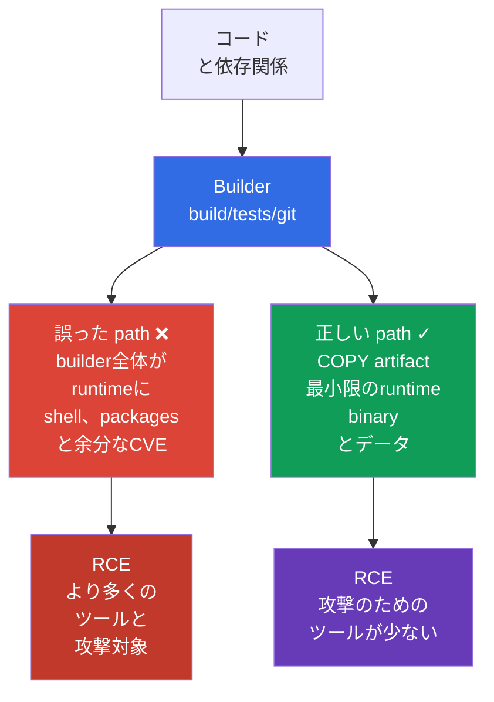
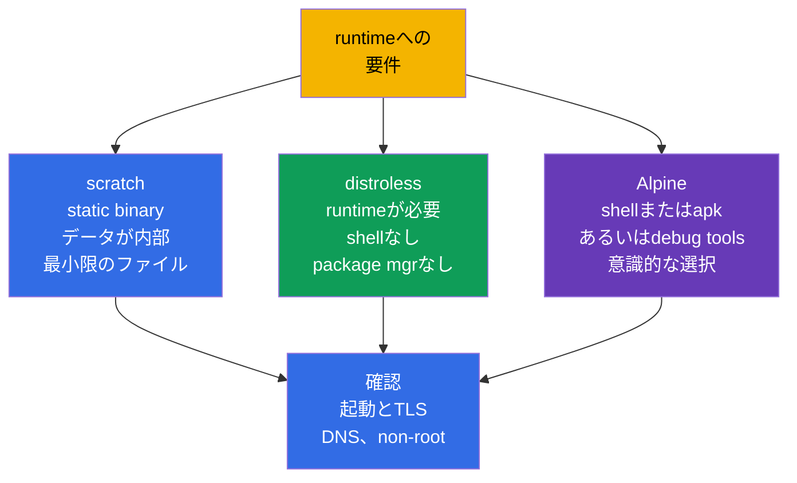

[Русская версия](ru.md) · [Eng version](README.md) · [Versión en español](es.md) · [Version française](fr.md) · [Deutsche Version](de.md) · [ქართული ვერსია](ge.md) · [繁體中文版](tw.md)

# 第24章. Base image の最小化

> **課題。** RCE の後、完全な runtime image は攻撃者に application process だけでなく、
> shell、package manager、compiler、source と余分な library も与えます。それぞれの
> component は CVE か、payload download、探索、居座りのための即戦力ツールを追加します。
> builder がそのまま final image に入ると、この risk は artifact が download され実行される
> 各 node で繰り返されます。

> **この後。** [第23章](../23/jp.md)では Pod 間トラフィックを暗号化し、peer の identity を
> 確認しました。今度は Pod 内で実行されるもの、すなわち image とその build context を守り
> ます。これは CKS の **Supply Chain Security** domain（20%）です。より小さく再現可能な
> image は component、CVE、攻撃者の即戦力ツールを減らしますが、それ単独で SBOM、署名、
> policy、scanning に代わるものではありません。これらは第25-28章で続きます。

> **CKA で必要な知識。** image、Dockerfile、layer、tag、multi-stage build の基本概念は
> [CKA 第23章](../../../cka/course/23/jp.md)で、`runAsNonRoot`、capabilities、read-only
> root filesystem は[CKA 第20章](../../../cka/course/20/jp.md)で扱いました。ここではそれ
> らを supply-chain の脅威に適用します。単に image を小さくするだけでなく、final artifact
> から余分なものを排除します。

> 🧠 最小 final image は CVE と post-exploitation tool を減らしますが、RCE 対策、
> `SecurityContext`、network、detection に代わりません。

## 24.1. 脅威モデル: image 内の余分なものが攻撃者の手段になる

image は供給される software artifact の一部です。final stage に入ったものはすべて、その
image を download する各 node に届きます。package manager、shell、compiler、source、テスト
用 key、layer の history、そして transitive library です。これらの component のいずれかの
vulnerability は追加の CVE であり、`curl`、`wget`、`sh` のようなツールは application 侵害
後の行動のための即戦力ツールです。

典型的な scenario: application に RCE があります。完全な `ubuntu` image では、攻撃者は
`/bin/sh` を実行し、payload を download し、package manager でツールをインストールし、
build files を読み、privilege escalation を試みます。shell と package manager のない
minimal image では、RCE は依然として critical ですが、その後の道は短くなります。対話的な
shell、compiler、大部分の library がありません。これは**攻撃対象領域の縮小**であり、
security boundary ではありません。process の権限、`SecurityContext`、NetworkPolicy、
runtime detection は依然として必要です。



最小化は四つの実用的な効果をもたらします。

- package が少ない - 既知の vulnerability とメンテナンスが必要な update が少ない;
- サイズが小さい - pull、rollout、autoscaling が速く、registry と network の消費が低い;
- runtime に build ツールと source がない - 盗用や利用が難しい;
- 実行可能ファイルが少ない - RCE 後に利用可能な command が少ない。

security をメガバイト数だけで測ってはいけません。5 MiB の image でも application に
vulnerability があるか root process であれば安全ではなく、CA certificate を削除すると TLS
が壊れる可能性があります。**意識的に**最小化してください。application が実際に必要とする
runtime、CA bundle、timezone data、dynamic library は残します。

> 🧠 runtime image のファイルが少ないほど、攻撃者の post-exploitation tool は少なくなる。
> `scratch`/distroless/Alpine の選択は attack surface と診断性の trade-off。

## 24.2. `scratch`、distroless、Alpine: 必要に応じて runtime を選ぶ

base image は `COPY` の前にどのファイルが存在するかを決めます。final stage は builder と
似る必要はありません。artifact が static binary か、language runtime が必要か、診断や
native library が要るかを理解した上で選びます。

| Runtime base | 内容 | 適している場合 | 制約とリスク |
|---|---|---|---|
| `scratch` | 空の base image: image 自体に runtime ファイルがない | 不足する runtime library を必要としない static な Go/Rust/C++ binary | shell、CA bundle、timezone data、dynamic loader がない; Kubernetes/runtime は通常 Pod に `/etc/resolv.conf` を提供するが、application は互換な DNS resolver と必要な runtime データを持つ必要がある |
| distroless | 選ばれた runtime/library のみ、shell と package manager なし | 最小限のサポートされる runtime が必要な Go/Java/Node/Python application | 通常の `kubectl exec -- sh` は不可能; logs、metrics、`kubectl debug` で debug |
| Alpine | BusyBox と `apk` を持つ最小 Linux | shell/package が本当に必要な application または診断 | shell と package manager が残る; glibc の代わりの `musl` は native dependency と非互換な場合がある |

`/etc/resolv.conf`、`/etc/hosts`、hostname に関連するファイルは Pod 起動時に
kubelet/container runtime が提供する場合があり、`scratch` に自動的に copy すべきファイルで
はありません。



`Alpine` は小さいというだけで distroless より自動的に安全ではありません。その `/bin/sh` と
`apk` は developer に有用ですが、RCE の際にも同様に有用です。逆に distroless は動作可能性
を犠牲にして選ぶべきではありません。たとえば CGO 依存を持つ application は glibc と特定の
shared library を必要とすることがあります。その場合はまず builder で `ldd` を通じて binary
を確認し、互換する runtime を選びます。

特定の vendor でその tag が何を意味するか確認してください。`:latest` は artifact を固定せ
ず、production には適しません。version 付き tag（`alpine:3.21.2`）が最低限で、release の
ためには registry で取得・検証した immutable digest も固定します。

```text
registry.example.com/payments/api:1.4.2@sha256:<検証済み-64文字-digest>
```

digest は image を検証した後に GitOps/manifest に記録します。適当な投稿から取ってはいけま
せん。tag は人間にとって便利ですが、digest は scan と署名の対象になった bytes を保証しま
す。Kubernetes でも同じ値を `image:` に指定します。

> 🎯 `COPY --from=builder` によって別の builder と final stage を分離し、完成した artifact
> だけを持ってくる; compiler、source、cache、credential は runtime に入らない。

## 24.3. Multi-stage build: builder は runtime になってはいけない

Multi-stage Dockerfile は信頼される役割を分離します。最初の stage には Go compiler、
package cache、source が含まれる場合があります。最後の stage は完成した artifact だけを
取得します。`COPY --from=builder` は、明示的に一つの file だけを copy する場合、builder の
filesystem 全体を運びません。これにより compiler、`git`、`go.mod`、private build cache、
transitive dependency の大部分が runtime から排除されます。

以下は小さな Go HTTP service の完全な例です。ディレクトリに `go.mod`、`go.sum`、
`./cmd/server` があることを前提とし、`CGO_ENABLED=0` は `scratch` に適した static binary を
作ります。すべての image に具体的な version があり、final process は UID 0 では動きません。

```dockerfile
# syntax=docker/dockerfile:1.7
# Dockerfile
FROM golang:1.27.1-alpine3.24@sha256:<検証済み-digest> AS builder
WORKDIR /src

# 変更が少ない dependency manifest をコードより前に置くと cache が良くなる。
COPY go.mod go.sum ./
RUN go mod download

COPY . ./
RUN CGO_ENABLED=0 GOOS=linux go build -trimpath -ldflags="-s -w" \
    -o /out/server ./cmd/server

# scratch では numeric UID/GID だけで non-root credential を設定できる;
# application の runtime 依存関係は別に確認する。
FROM scratch
COPY --from=builder /out/server /server
USER 65532:65532
EXPOSE 8080
ENTRYPOINT ["/server"]
```

Numeric UID/GID により runtime は `/etc/passwd` にユーザーを書き込まずに process を実行
できますが、application が動作することを保証しません。application にはユーザーまたは
グループの lookup、`HOME`、timezone data、CA bundle、NSS、その他 runtime ファイルが必要な
場合があります。

image 内の `USER` は最初の barrier です。process はデフォルトで root ではなく、ローカルの
`docker run` でもそうです。これを Pod-level policy と SecurityContext で固定し、image の
利用者が任意の manifest でこの決定を取り消せないようにします。

```yaml
apiVersion: v1
kind: Pod
metadata:
  name: minimal-api
spec:
  securityContext:
    runAsNonRoot: true
    runAsUser: 65532
    runAsGroup: 65532
  containers:
  - name: api
    image: registry.example.com/training/minimal-api:1.0.0
    ports:
    - containerPort: 8080
    securityContext:
      allowPrivilegeEscalation: false
      readOnlyRootFilesystem: true
      capabilities:
        drop: ["ALL"]
```

`runAsNonRoot: true` は image 内にユーザーを作成せず、ファイルの ownership を修正しません。
runtime が root を確認した場合は起動を拒否するだけです。binary と application が書き込む
ディレクトリが UID `65532` に access 可能であることを確認してください。
`readOnlyRootFilesystem: true` の場合、一時データは `emptyDir` に出し、writable な root を
戻してはいけません。

> 🔬 Docker と rootless Podman は同じ Dockerfile/context を使う; rootless は広い context、
> mutable base image、layer 内の secret から守るわけではない。

### Docker と Podman による build

両方の command は一つの Dockerfile と一つの build context を使います。Docker は通常 daemon
を通じて動作します。Podman は daemonless で rootless に動作でき、build が host の Docker
socket に root アクセスを得るべきでない場所で有用です。Rootless Podman は安全でない
Dockerfile を安全にしません。secret と余分なファイルは依然として image に入る可能性が
あります。

```bash
# Docker: BuildKit は次の節の secret mount に必要。
DOCKER_BUILDKIT=1 docker build \
  --tag registry.example.com/training/minimal-api:1.0.0 \
  --file Dockerfile .

docker image inspect registry.example.com/training/minimal-api:1.0.0 \
  --format 'size={{.Size}} bytes user={{.Config.User}}'
docker run --rm --user 65532:65532 \
  registry.example.com/training/minimal-api:1.0.0

# Podman rootless: 通常ユーザーとして実行し、sudo は使わない。
podman build \
  --tag registry.example.com/training/minimal-api:1.0.0 \
  --file Dockerfile .
podman image inspect registry.example.com/training/minimal-api:1.0.0 \
  --format 'size={{.Size}} bytes user={{.Config.User}}'
podman run --rm --user 65532:65532 \
  registry.example.com/training/minimal-api:1.0.0
```

Multi-stage は runtime を小さくしますが、それ自体では builder が信頼できるものにならず、
build が再現可能にもなりません。release のためには base-image digest、module/package の
version、依存関係の source を固定・検証してください。build を制御されない mutable な外部
repository に無制限に依存させてはいけません。private dependency 用の secret は BuildKit/
Podman secret mount だけで渡してください。

`--no-cache` を継続的な「security check」として使わないでください。cache を無効にする
だけで時間と traffic を増やしますが、依存関係を再現可能にはしません。その後、公開前に
作成された digest を確認してください。

### distroless の variant

static build が不可能な場合、final stage は distroless にできます。version/variant 付きの
base を使い、release では自分の platform で検証した digest に置き換えます。distroless の
`:nonroot` はすでに非特権ユーザーを設定していますが、Dockerfile での意図を明確にするため
`USER` を明示しています。

```dockerfile
FROM gcr.io/distroless/static-debian13:nonroot@sha256:<検証済み-digest>
COPY --from=builder /out/server /server
USER 65532:65532
ENTRYPOINT ["/server"]
```

> 🎯 `RUN rm` は前の layer から secret を消さない; secret mount と `.dockerignore` を使い、
> 漏洩した secret は revoke して image を再build する。

## 24.4. Layer、secret、build context

Dockerfile の filesystem を変更する各 instruction は layer を作成できます。Layer は
immutable です。secret が公開される image に含まれる layer stage で作られた場合、次の
layer での `RUN rm /tmp/token` は下の layer からその bytes を消しません。したがって secret
を `COPY`、`ADD`、`ARG`、`ENV` で渡してはいけません。

通常の multi-stage build は別の case です。final stage が独自の `FROM` から始まり、
`COPY --from` で必要な artifact だけが運ばれる場合、builder の各 layer は final runtime
image の layer になりません。

これは credential の安全でない渡し方を自動的に安全にするわけではありません。secret は
誤って copy された artifact、別に公開された intermediate image、build logs を通じて final
image に入る可能性が依然としてあります。credential が `ARG`/`ENV` で渡された、または
filesystem layer に書き込まれた場合、対応する build stage の build metadata、history、
cache にも残ることがあります。build-time credential には `ARG`、`ENV`、`COPY`、`ADD` の
代わりに BuildKit/Podman secret mount を使ってください。

```dockerfile
# 絶対にダメ: token は history/config か layer の一つに残る。
ARG NPM_TOKEN
RUN npm config set //registry.example.com/:_authToken="$NPM_TOKEN" && npm ci

# 絶対にダメ: .npmrc は COPY . . に含まれ layer に保存される可能性がある。
COPY .npmrc /root/.npmrc
RUN npm ci
RUN rm /root/.npmrc
```

BuildKit では secret mount を使ってください。secret は必要な `RUN` command にだけ一時的に
利用可能で、output layer には入りません。secret の値は provenance attestation にも含まれ
ません。secret を使う command は、それでも stdout/stderr に出力したり、`COPY --from` 用の
artifact に書き込んだり、通常の filesystem layer に credential を保存してはいけません。
External cache は正しい `--secret` があれば許可されます。危険なのは cache export 自体では
なく、secret の不正な処理による cacheable filesystem output 内の credential です。

```dockerfile
# syntax=docker/dockerfile:1.7
FROM node:22.23.2-alpine@sha256:<検証済み-digest> AS builder
WORKDIR /app
COPY package.json package-lock.json ./
# build ツール（TypeScript、Vite、webpack など)は通常 devDependencies にある。
RUN --mount=type=secret,id=npmrc,target=/root/.npmrc \
    npm ci
COPY . .
RUN npm run build
# devDependencies を削除するのは build 後だけ; runtime stage では artifact と必要な依存関係だけを copy する。
RUN npm prune --omit=dev
```

```bash
# .npmrc は secret store/CI に保管し、Dockerfile の隣には置かない。
DOCKER_BUILDKIT=1 docker build \
  --secret id=npmrc,src="$HOME/.config/build-secrets/npmrc" \
  -t registry.example.com/training/web:1.0.0 .

podman build \
  --secret id=npmrc,src="$HOME/.config/build-secrets/npmrc" \
  -t registry.example.com/training/web:1.0.0 .
```

secret がすでに image に公開されていた場合、新たな `RUN rm` 一つでは不十分です。直ちに
secret を revoke して置き換え、registry artifact への access を削除/制限し、その後新しい
secret を使ってクリーンな Dockerfile から image を再build してください。古い credential は
compromise 済みとみなします。

### `.dockerignore` - build context の境界

Dockerfile を実行する前に、client は build context を builder に送信します。
`.dockerignore` がなければ `COPY . .` は `.git`、ローカル `.env`、SSH key、test artifact、
大きなディレクトリを取り込むことがあります。`.dockerignore` は traffic を減らし build を
高速化し、これらのファイルが Dockerfile の instruction から access できないようにします。
これは重要な防御ですが、secret management の代わりにはなりません。context に本当に必要な
ファイルは、依然として誤って copy される可能性があります。

```dockerignore
# .dockerignore
.git
.gitignore
.env
.env.*
.npmrc
*.pem
*.key
id_rsa
secrets/
coverage/
tmp/
node_modules/
**/.DS_Store
README.md
```

ルールはプロジェクトに合わせるべきです。application が本当に public CA certificate を必要
とする場合、`*.pem` を盲目的に ignore してはいけません。その場合は明示的に許可された
public certificate を別のディレクトリに保管し、それだけを copy してください。Dockerfile が
monorepo 全体を必要としない場合は、build context を repository root から分離してくださ
い。たとえば `docker build -f docker/Dockerfile docker/` のようにします。

### 有害な「最適化」なしで layer を減らす

関連する install/cleanup を一つの `RUN` にまとめ、package manager の cache が前の layer に
残らないようにしてください。ただし Dockerfile 全体を一つの読みにくい command に結合しては
いけません。`COPY` の順序は cache を保持すべきで、policy と review は何がインストールされ
るかを見る必要があります。

```dockerfile
# Alpine: package index と build dependency はこの stage に残らない。
RUN apk add --no-cache --virtual .build-deps build-base \
 && make release \
 && apk del .build-deps
```

これは command が final stage にある場合にのみ有用です。通常より良い選択はもっと単純です。
`apk`、compiler、cache がある stage を multi-stage build を通じて全く runtime に移さない
ことです。

> 🎯 `history`、`inspect`、`dive` で final artifact を確認する; distroless/scratch では
> shell がないことは、期待される「実行ファイルが見つからない」エラーだけが証明し、任意の
> non-zero `kubectl exec` ではない。

## 24.5. 検査: サイズ、layer、内容を測定する

build 後、final image が最小であると想定してはいけません。証明してください。
`docker image ls` は合計サイズを示しますが、どの layer がそれをもたらしたかは説明しませ
ん。`history`、`inspect`、`dive` は command、サイズ、ファイルの変更を見るのに役立ちます。

```bash
IMAGE=registry.example.com/training/minimal-api:1.0.0

# 合計サイズと layer を作成した command。
docker image ls "$IMAGE"
docker history --no-trunc "$IMAGE"
docker image inspect "$IMAGE" \
  --format 'user={{.Config.User}} entrypoint={{json .Config.Entrypoint}} size={{.Size}}'

# Podman を使う場合の同じ確認。
podman history --no-trunc "$IMAGE"
podman image inspect "$IMAGE" \
  --format 'user={{.Config.User}} entrypoint={{json .Config.Entrypoint}} size={{.Size}}'

# Interactive TUI: 各 layer のサイズ、wasted space、ファイル。
dive "$IMAGE"
```

`dive` では以下に注目してください。

- `COPY . .` による大きな layer - たいてい context が広すぎるか Dockerfile の順序が誤って
  いる;
- package cache、compiler、tests、`.git`、`.env`、private key、`.npmrc` - Dockerfile/
  .dockerignore を修正し、見つかった secret を直ちに revoke する理由になる;
- `RUN install` と別の `RUN rm` の後の「wasted bytes」 - 削除が遅すぎ、新しい layer で行わ
  れている;
- `User` が空か `root` - Dockerfile が non-root user を設定していない。

`dive` は image が利用可能なものだけを見ます。vulnerability scan、secret scan、SBOM の代わ
りにはなりません。CI での有用な順序はこうです: build -> inspect/lint -> SBOM/scan -> push
immutable digest -> sign/attest digest -> verify -> deploy/admission。通常の Cosign/
Sigstore workflow では、まず image を公開してその immutable digest を取得し、次に Cosign
がこの digest に署名し registry に attestation を作成します。deployment/admission はこの
関連を確認します。次の章で SBOM を追加し、第26-28章で署名、policy、scanner を追加します。

## 24.6. shell なしでの確認: distroless は意図的に異なる動作をする

shell の欠如は distroless/scratch runtime の性質であり、Kubernetes のエラーではありませ
ん。したがって、そのような image で `kubectl exec <pod> -- /bin/sh` が成功したら、それは
警告 signal になります。application endpoint と UID は通常の方法で確認し、期待される shell
の拒否は別に記録してください。

```bash
kubectl apply -f minimal-api.yaml
kubectl wait --for=condition=Ready pod/minimal-api --timeout=90s
kubectl logs minimal-api

# application の起動成功はそのendpoint/health probeで確認し、shellでは確認しない。
kubectl port-forward pod/minimal-api 8080:8080
# 別のterminalで: curl -fsS http://127.0.0.1:8080/health

# まずgeneric exec failureを除外する: Podは既にReadyで、RBACはpods/execを許可する。
if [[ "$(kubectl auth can-i create pods --subresource=exec)" != yes ]]; then
  echo "ERROR: current identity cannot create pods/exec" >&2
  exit 1
fi

# distroless/scratchでは実行ファイルが見つからないエラーがまさに期待される。
if output=$(kubectl exec minimal-api -c api -- /bin/sh 2>&1); then
  echo "ERROR: /bin/sh unexpectedly exists in the minimal runtime" >&2
  exit 1
else
  status=$?
  if printf '%s\n' "$output" | grep -Eqi 'executable file not found|stat /bin/sh: no such file or directory'; then
    echo "OK: /bin/sh is absent as expected"
  else
    printf 'ERROR: kubectl exec failed, but /bin/sh absence was not proven (exit %s): %s\n' \
      "$status" "$output" >&2
    exit 1
  fi
fi

# shellを必要としない設定:
kubectl get pod minimal-api -o jsonpath='{.spec.securityContext.runAsNonRoot}{"\n"}'
kubectl get pod minimal-api -o jsonpath='{.spec.containers[0].securityContext.allowPrivilegeEscalation}{"\n"}'
```

production image に「デバッグ用」の `busybox` を追加してはいけません。それは最小化の目的
の一部を打ち消します。incident の際は logs、metrics、trace、`kubectl describe`、そして
production image から分離された一時的な ephemeral debug container を使ってください。

```bash
# RBACの許可とクラスタでのephemeral containersサポートが必要。
kubectl debug -it pod/minimal-api --target=api \
  --image=busybox:1.36.1 -- sh
```

Ephemeral debug container は同じ Pod にあり、その network namespace を共有します。
`--target=api` は container runtime に、debug container を target container の process
namespace に配置するよう要求します。これには runtime のサポートが必要です。サポートがな
い場合、debug container は分離された process namespace で起動し、application の process が
見えないことがあります。その root filesystem と mount namespace は自動的に target
container のファイルシステムにはなりません。Debug image も具体的な version（production で
は承認された digest）を持つべきで、欠けている shell への永続的な回避手段として使ってはい
けません。

### 典型的なエラーと診断

| 症状 | 起こりうる原因 | 対処 |
|---|---|---|
| `scratch` での `exec /server: no such file or directory` | binary が dynamically linked か、アーキテクチャが誤っている | `CGO_ENABLED=0` で build; builder で `file /out/server`、platform、依存関係を確認する |
| `scratch` で HTTPS が動作しない | CA certificate が不足している | CA bundle を application に組み込むか、別の stage から必要な public bundle だけを copy する |
| `runAsNonRoot` で Pod が起動しない | image/manifest が UID 0 を使おうとしている | Dockerfile で `USER`、ownership、明示的な numeric UID を設定する; 確認を回避しない |
| `kubectl exec ... /bin/sh` が動作しない | distroless/scratch での期待される shell の欠如 | logs/endpoint を確認する; 調査には `kubectl debug` を使う |
| `dive`/history で secret が見つかった | credential が copy された、`ARG` で渡された、遅い layer で削除された | secret を revoke し、それなしで再build し、BuildKit/Podman secret mount を使う |
| Docker と Podman で異なる結果が build された | 異なる builder/cache/platform、固定されていない base image | 必要ならplatformを明示し、digestを固定し、final digestを比較する |

> 🏭 固定された base/release digest、狭い context、secret management、non-root runtime、
> SBOM/scan/signature、admission; デバッグは承認済み ephemeral debug image で行う。

## 24.7. production での適用

- **Build と runtime は分離される。** Builder は重くてもよいですが、final stage は
  artifact、runtime library、必要な public data だけを許可します。Stage、依存関係、base
  image は production code として review されます。
- **Version と digest は固定される。** `latest` は linter/policy で禁止します。Release は
  人間向けの tag と immutable digest を結びつけ、その同じ digest が SBOM、scan、署名、
  deployment を通過します。
- **Non-root は defence in depth。** image の `USER`、Pod の `runAsNonRoot`/numeric UID、
  admission policy が互いを補強します。application が対応していれば
  `drop: ["ALL"]`、`allowPrivilegeEscalation: false`、read-only root を追加します。
- **Secret は build argument ではない。** CI は build 中だけ short-lived credential を発行
  します。BuildKit/Podman secret mount、scoped registry permission、`.dockerignore` は
  漏洩の可能性を減らします。layer への漏洩はロテーションを意味し、単なる再buildではありま
  せん。
- **デバッグは runtime から分離される。** observability と承認された ephemeral debug
  image が application image 内の shell に代わります。これは production artifact を CI と
  cluster で同一に保ちます。
- **最小化はpipelineに組み込まれる。** team は image size と layer 構成を測定し、review 時
  に `dive` を実行し、CI で SBOM/scan/sign を実行し、base の更新時に定期的に image を再
  build します。小さな image は CVE への対応を免除しません。

## 24.8. ミニ glossary

- **Attack surface（攻撃対象領域）** - vulnerability を含むか攻撃で使われうる component、
  ファイル、interface。
- **Base image** - `FROM` instruction にある image で、初期の filesystem stage を定める。
- **Build context** - builder に渡されるファイル; `.dockerignore` で制限される。
- **distroless** - package manager と通常 shell を持たない最小 runtime image。
- **`scratch`** - filesystem のない空の base image; static artifact に適する。
- **Multi-stage build** - build と runtime の別々の stage を `COPY --from=` で結ぶ
  Dockerfile。
- **Layer** - image の filesystem の不変な変更; 新しい layer での削除は古い layer の内容を
  消さない。
- **Digest** - 特定の image manifest/content の不変な SHA-256 identifier。
- **Rootless Podman** - 通常ユーザーが root daemon なしで build/run を実行する Podman の
  モード。
- **Secret mount** - credential を final layer に書き込まずに一つの build command に一時的
  に接続する方法。

## 24.9. 章のまとめ

- 余分な package、shell、package manager、build tool、secret は攻撃対象領域と RCE の影響
  を増やします。小さな image はリスクを減らしますが、他の security control に代わりませ
  ん。
- `scratch` は static binary に適し、distroless は shell のない最小 runtime を与え、
  Alpine はその Linux userland への実際の必要性と `musl` を考慮した上でのみ選びます。
- Multi-stage build は final image に artifact だけを残します。builder、source、compiler
  はそこに運ばれません。
- Base image、package、application release は version で固定され、production deployment
  は `latest` ではなく検証済み immutable digest で固定されます。
- Dockerfile の `USER` と Pod の `runAsNonRoot` は non-root 起動の互いを補完する確認です。
- Docker と rootless Podman は同じ Dockerfile を build します。builder の権限は context と
  secret のルールを取り消しません。
- Secret は `ARG`、`ENV`、`COPY` で渡してはならず、遅い layer で削除してもいけません。
  BuildKit/Podman secret mount と `.dockerignore` を使ってください。
- `dive`、`history`、`inspect` は layer、wasted bytes、ファイル、effective user を示しま
  す。distroless では `/bin/sh` の欠如は期待される `kubectl exec` の拒否で確認されます。

## 24.10. この知識が役立つ場面: 試験と実務

**試験では。** `latest`、root user、Dockerfile 内の secret、余分な runtime stage を素早く
見分け、`COPY --from=...`、`USER`、`.dockerignore`、`docker build`/`podman build` の
command を書き、image を確認する必要があります。「なぜ `kubectl exec ... sh` が distroless
で動作しないのか」という課題は通常、shell を戻す能力ではなく最小 runtime の理解を確認しま
す。

**実務では。** これらの決定は CVE backlog と rollout 時間を減らしますが、主な成果は再現可
能な artifact です。team はその base digest、内容、UID、検証履歴を知っています。これによ
り supply chain の次の step、SBOM、scanning、署名、admission policy が正確に定義された
image で機能できます。

> ### 🔴 攻撃者の視点
> **Asset:** build 時の一時ファイル内の secret と credential、たとえば `.npmrc` と token。
> **Starting foothold:** Dockerfile/build context への access、または build 済み image の
> 検査能力。
> **Attacker objective:** image の中間 layer に忘れられた credential を見つける。
> **Abuse path:** 公開された final image の layer を調べ、credential がその下位 layer の
> いずれかで作成された、または builder から誤って copy された場合に抽出する。個々の
> builder layer は通常の final multi-stage image には入りませんが、secret が `ARG`/
> `ENV`/`COPY` で渡された、または build command によって layer/artifact に書き込まれた場
> 合、credential は別に公開された intermediate image、build logs、cacheable filesystem
> output に残る可能性があります。正しい BuildKit `--mount=type=secret` は secret の値を
> final layer や provenance attestation に保存しません。
> **Expected evidence:** final layer、copy された artifact、access 可能な build output に
> credential が含まれない; provenance に secret の値が含まれない。
> **Control:** BuildKit `--mount=type=secret`、credential を含むファイル用の
> `.dockerignore`、必要な artifact だけへの `COPY --from`; external cache は
> credential を含まない cacheable filesystem output の場合のみ使用する。
> **Retest:** final layer、access 可能な build output、provenance を再確認し、
> credential が見つからないことを確認する。

## 24.11. Self-check question

<details>
<summary>1. shellとpackage managerがruntime imageにあることが、application自体の脆弱性を修正しないにもかかわらず、なぜRCEの影響を増大させるのですか？</summary>

RCE後、shell、`curl`/`wget`、compiler、package managerは攻撃者にpayloadのダウンロード、ツールのインストール、filesystemの調査のための即戦力手段を与えます。それらの欠如はpost-exploitationの範囲を縮小しますが、元のRCEを修正せず、SecurityContext、NetworkPolicy、runtime detectionに代わりません。したがって最小化はdefence in depthであり、それ自体がsecurity boundaryではありません。
</details>

<details>
<summary>2. static Go binary、Java application、native toolが必要なapplicationについて、`scratch`、distroless、Alpineをどう選びますか？</summary>

`CGO_ENABLED=0`のstatic Go binaryは、DNS、TLS、CA bundle、必要なruntimeデータが確認されていれば`scratch`に適します。Java applicationには最小限のサポートされるlanguage runtimeが必要なので、対応するdistroless variantを選びます。shell、`apk`、native diagnostic toolが本当に必要な場合はAlpineが正当化されますが、そのBusyBox/package managerと`musl`は別途compatibilityとsecurityの評価が必要です。
</details>

<details>
<summary>3. `COPY --from=builder`は正確に何を防ぎ、何が誤ってfinal imageに入る可能性がありますか？</summary>

`COPY --from=builder`は明示的に指定されたartifactだけを運び、builderのfilesystem全体は運びません。そのためcompiler、source、`git`、build cache、大部分の依存関係は自動的にruntimeに入りません。ただし誤った広範な`COPY`、追加されたruntime依存関係、または事前にcopyされるpathに入っていたsecretは、依然としてfinal imageに入る可能性があります。内容は`history`、`inspect`、`dive`で確認します。
</details>

<details>
<summary>4. なぜversion付きtagは`latest`より良く、digestはreleaseにおいてversion tagより強力なのですか？</summary>

`latest`はmutableで検証済みartifactを固定しません。version tagは少なくともreleaseを表現します。Immutable digestはdeploymentを、scanと署名の対象になった具体的なmanifest/contentのbytesに結び付けます。releaseのために、本章はGitOps tagと検証済み`@sha256:...`digestを一緒に保管することを推奨します。
</details>

<details>
<summary>5. Dockerfile内の`USER`とPodの`runAsNonRoot`はどう関連し、なぜ両方が必要ですか？</summary>

`USER`はimage自体とローカルの`docker run`のためにnon-root起動をdefaultにします。numeric UIDは`/etc/passwd`への書き込みなしでも機能します。Podの`runAsNonRoot`はユーザーを作成せず、ownershipを修正しませんが、runtimeが特定のrootユーザーを実行するのを防ぎます。Podはさらに明示的にUID/GIDを設定し、admission policyでこの決定を補強できます。
</details>

<details>
<summary>6. なぜ`RUN rm /secret`はimage historyからsecretを削除しないのですか？private dependencyのcredentialにどのmechanismを使うべきですか？</summary>

secretが公開されるimageに含まれるlayer stageで作成された場合、次のlayerでの削除はその下のlayer/historyからbytesを消しません。通常のmulti-stage buildでは別のbuilderはfinal imageに自動的に入りませんが、`ARG`、`ENV`、`COPY`、`ADD`は安全ではありません。credentialはcopyされたartifact、cache、logs、または別に公開されたintermediate imageに入る可能性があります。BuildKit/Podmanの`--mount=type=secret`はsecretをbuild instructionにだけ一時的に渡し、secretの値をfinal layerやprovenance attestationに保存しません。ただしbuild command自体がsecretを出力したり、生成されたartifactに書き込んだりする可能性があるため、outputは依然として確認します。secretがすでに公開されている場合はrevokeしてrotateし、cleanなDockerfileからimageを再buildします。
</details>

<details>
<summary>7. `.dockerignore`は何を制限し、なぜsecret managerに代わらないのですか？</summary>

`.dockerignore`はbuilderに送られるbuild contextのファイルを制限するので、`.git`、`.env`、key、test artifactが`COPY . .`でアクセス可能になりません。これは漏洩リスクとbuildのサイズ/時間を減らします。しかしcontextに実際に必要なファイルは依然として誤ってcopyされる可能性があるため、credentialはsecret mountを通じてsecret managerから発行されるべきです。
</details>

<details>
<summary>8. `dive`のどのような特徴が、広すぎるcontextやlayerのwasteを示しますか？</summary>

`COPY . .`による大きなlayerは通常広いcontextか誤ったDockerfileの順序を意味します。compiler、package cache、tests、`.git`、`.env`、private key、`.npmrc`は余分な内容を示し、`RUN install`とその後の別の`RUN rm`によるwasted bytesは遅い削除を示します。空またはrootの`User`もDockerfileがnon-root userを設定していないことを示します。
</details>

<details>
<summary>9. `/bin/sh`が意図的に存在しない場合、distroless Podが機能していることをどう証明しますか？</summary>

shellを戻そうとする代わりに、Ready、logs、health endpointまたはprobeを確認します。例えば`kubectl port-forward`と`curl`を使います。shellの欠如は、PodのReadyと`pods/exec`へのaccessを確認した後、期待される「実行ファイルが見つからない」エラーによってのみ確認されます。任意のnon-zero`kubectl exec`は証明になりません。incident diagnosisにはlogs、metrics、`describe`、または承認された一時的なephemeral debug containerを使います。
</details>

<details>
<summary>10. rootless Podmanはbuild pipelineにどう有用で、何を保護しないのですか？</summary>

Rootless Podmanは通常ユーザーがroot Docker daemonなしでbuild/runを実行できるようにし、pipelineにhost Docker socketへのaccessを与える必要性を減らします。同じDockerfileとbuild contextを使いますが、secretと余分なファイルがimageに入ることを防ぎません。したがって`.dockerignore`、secret mount、Dockerfileのreviewは依然として必須です。
</details>

<details>
<summary>11. **Flashback（第14章）。** base imageの最小化（本章: distroless、shell/package managerの欠如）とhost footprintの最小化（第14章: node上の余分なサービス/packageの無効化）は、二つの異なるレベルに適用された同じ「攻撃対象領域を減らす」原則です。試験/incidentの前に時間が限られている場合、この二つのレベルのうちどちらが**すでに侵害された**containerのリスクをより速く減らすでしょうか。そしてなぜ一方が他方に代わらないのですか？</summary>

すでに侵害されたcontainerに対して、攻撃者が利用可能なツールを最も速く変えるのはruntime imageの最小化です。そこには最初からshell、package manager、downloaderがない可能性があります。host footprintの最小化はnodeと他のworkloadを保護し、host access後にescapeを発展させるために使えるサービスとpackageを減らします。imageは侵害されたnodeを保護せず、安全なnodeはcontainer内の余分なツールを取り除きません。したがって両方のレベルが必要です。
</details>

## Practice

🧪 Lab 111（最小 image、multi-stage、non-root、artifact の検査）:
[tasks/cks/labs/111](../../labs/111/README_JP.MD)

🌐 追加の対話練習（killer.sh/killercoda、外部リソース）: [container-image-footprint-user](https://killercoda.com/killer-shell-cks/scenario/container-image-footprint-user) · [container-hardening](https://killercoda.com/killer-shell-cks/scenario/container-hardening)

Dockerfile と image の基礎については[CKA 第23章](../../../cka/course/23/jp.md)を、Pod 内
process の制限については[CKA 第20章](../../../cka/course/20/jp.md)を復習してください。

---
[目次](../README_JP.md) · [第23章](../23/jp.md) · [第25章](../25/jp.md)
