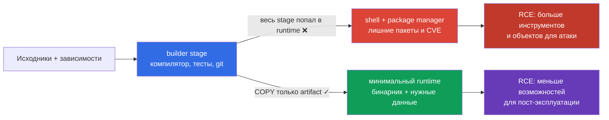
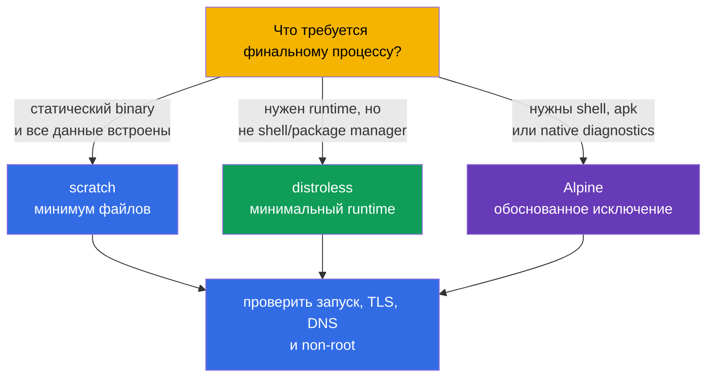

<!-- Standalone RU release: ссылки на переводы удалены, потому что соответствующие файлы не входят в архив. -->

# Глава 24. Минимизация базового образа

> **Что дальше.** В [главе 23](../23/ru.md) мы зашифровали трафик между Pod и
> подтвердили identity peer. Теперь защищаем то, что запускается в Pod: образ и его
> build context. Это домен **Supply Chain Security** CKS (20%). Меньший и
> воспроизводимый образ содержит меньше компонентов, CVE и готовых инструментов для
> атакующего, но сам по себе не заменяет SBOM, подпись, policy и сканирование - они
> последуют в главах 25-28.

> **Что нужно знать из CKA.** Базовые понятия image, Dockerfile, слоёв, тегов и
> multi-stage build разобраны в [главе 23 CKA](../../../cka/course/23/ru.md), а
> `runAsNonRoot`, capabilities и read-only root filesystem - в
> [главе 20 CKA](../../../cka/course/20/ru.md). Здесь применяем их к supply-chain
> угрозе: не просто делаем образ маленьким, а исключаем лишнее из финального artifact.

## 24.1. Модель угроз: лишнее в образе становится возможностью атакующего

Образ - часть поставляемого software artifact. Всё, что попало в его final stage,
попадёт на каждую ноду, которая скачает образ: package manager, shell, компилятор,
исходники, тестовые ключи, история слоёв и транзитивные библиотеки. Уязвимость в любом
из этих компонентов - дополнительная CVE; утилита вроде `curl`, `wget` или `sh` -
готовый инструмент для действий после компрометации приложения.

Типовой сценарий: приложение имеет RCE. В полном `ubuntu`-образе атакующий запускает
`/bin/sh`, скачивает payload, ставит утилиты через package manager, читает файлы сборки
и пытается повысить привилегии. В минимальном образе без shell и package manager RCE
всё ещё критична, но путь после неё короче: нет интерактивной оболочки, компилятора и
большой части библиотек. Это **снижение поверхности атаки**, а не граница безопасности:
права процесса, `SecurityContext`, NetworkPolicy и runtime detection остаются нужны.



Минимизация даёт четыре практических эффекта:

- меньше пакетов - меньше известных уязвимостей и обновлений для сопровождения;
- меньше размер - быстрее pull, rollout и autoscaling, ниже расход registry и сети;
- нет build-инструментов и исходников в runtime - их сложнее украсть или использовать;
- меньше исполняемых файлов - меньше команд, доступных после RCE.

Не измеряйте безопасность только мегабайтами. Образ в 5 MiB с уязвимым приложением или
root-процессом небезопасен, а удаление сертификатов CA может сломать TLS. Минимизируют
**осмысленно**: оставляют runtime, CA bundle, timezone data и dynamic libraries, которые
действительно требуются приложению.

## 24.2. `scratch`, distroless и Alpine: выбрать runtime по потребностям

Базовый образ определяет, какие файлы существуют до `COPY`. Финальный stage не обязан
быть похож на builder. Выбирайте его после того, как поняли, является ли artifact
статическим бинарником, нужен ли language runtime и требуются ли диагностика или native
libraries.

| Runtime base | Что внутри | Хорошо подходит | Ограничения и риск |
|---|---|---|---|
| `scratch` | пустой base image: в самом image нет runtime-файлов | статический Go/Rust/C++ binary, которому не нужны отсутствующие runtime-библиотеки | нет shell, CA bundle, timezone data и dynamic loader; Kubernetes/runtime обычно предоставляет Pod `/etc/resolv.conf`, но приложение всё равно должно иметь совместимый DNS resolver и необходимые runtime-данные |
| distroless | только выбранный runtime/библиотеки, без shell и package manager | Go/Java/Node/Python приложения, когда нужен минимальный поддерживаемый runtime | обычный `kubectl exec -- sh` невозможен; отладка через logs, metrics и `kubectl debug` |
| Alpine | минимальный Linux с BusyBox и `apk` | приложение или диагностика, которым реально нужны shell/пакеты | shell и package manager остаются; `musl` вместо glibc может быть несовместим с native dependency |

`/etc/resolv.conf`, `/etc/hosts` и hostname-related files могут быть предоставлены kubelet/container runtime при запуске Pod и не являются файлами, которые нужно автоматически копировать в `scratch`.



`Alpine` не является автоматически безопаснее distroless только потому, что мал. Его
`/bin/sh` и `apk` полезны разработчику, но также полезны при RCE. Напротив, distroless
не следует выбирать ценой работоспособности. Например, приложение с CGO-зависимостью
может требовать glibc и конкретные shared libraries; тогда сначала проверяют binary через
`ldd` в builder и выбирают совместимый runtime.

Проверяйте, что означает тег у конкретного поставщика. `:latest` не фиксирует artifact и
не годится для production. Версионный тег (`alpine:3.21.2`) - минимум; для release
фиксируйте также immutable digest, полученный и проверенный вашим registry:

```text
registry.example.com/payments/api:1.4.2@sha256:<проверенный-64-символьный-digest>
```

Digest записывают в GitOps/manifest после проверки image, а не берут из случайного
поста. Тег удобен человеку, digest гарантирует байты, которые были просканированы и
подписаны. В Kubernetes это же значение указывается в `image:`.

## 24.3. Multi-stage build: builder не должен стать runtime

Multi-stage Dockerfile разделяет доверенные роли. Первый stage может содержать Go
compiler, package cache и исходники. Последний stage получает только готовый artifact.
`COPY --from=builder` не переносит filesystem builder целиком, если явно копируется один
файл. Это устраняет компилятор, `git`, `go.mod`, приватные build caches и большинство
транзитивных зависимостей из runtime.

Ниже полный пример для небольшого Go HTTP-сервиса. Он предполагает, что в каталоге есть
`go.mod`, `go.sum` и `./cmd/server`; `CGO_ENABLED=0` делает статический binary, пригодный
для `scratch`. Все образы имеют конкретные версии, а final process работает не от UID 0.

```dockerfile
# syntax=docker/dockerfile:1.7
# Dockerfile
FROM golang:1.27.1-alpine3.24 AS builder
WORKDIR /src

# Редко меняющиеся dependency manifests выше кода: лучше cache.
COPY go.mod go.sum ./
RUN go mod download

COPY . ./
RUN CGO_ENABLED=0 GOOS=linux go build -trimpath -ldflags="-s -w" \
    -o /out/server ./cmd/server

# В scratch нет /etc/passwd: numeric UID/GID обязателен и достаточен.
FROM scratch
COPY --from=builder /out/server /server
USER 65532:65532
EXPOSE 8080
ENTRYPOINT ["/server"]
```

`USER` в образе является первым барьером: процесс по умолчанию не root, в том числе при
локальном `docker run`. Закрепите его в Pod-level policy и SecurityContext, чтобы
потребитель образа не отменил решение случайным манифестом:

```yaml
apiVersion: v1
kind: Pod
metadata:
  name: minimal-api
spec:
  securityContext:
    runAsNonRoot: true
    runAsUser: 65532
    runAsGroup: 65532
  containers:
  - name: api
    image: registry.example.com/training/minimal-api:1.0.0
    ports:
    - containerPort: 8080
    securityContext:
      allowPrivilegeEscalation: false
      readOnlyRootFilesystem: true
      capabilities:
        drop: ["ALL"]
```

`runAsNonRoot: true` не создаёт пользователя в образе и не исправляет ownership файлов.
Он не даст стартовать, если runtime определит root. Убедитесь, что binary и каталоги,
куда приложение пишет, доступны UID `65532`; при `readOnlyRootFilesystem: true` временные
данные выносите в `emptyDir`, а не возвращайте writable root.

### Сборка Docker и Podman

Обе команды используют один Dockerfile и один build context. Docker обычно работает
через daemon; Podman daemonless и может работать rootless, поэтому полезен там, где
build не должен получать root-доступ к хостовому Docker socket. Rootless Podman не
делает небезопасный Dockerfile безопасным: secret и лишние файлы всё равно могут попасть
в image.

```bash
# Docker: BuildKit нужен для секретных mount в следующем разделе.
DOCKER_BUILDKIT=1 docker build \
  --tag registry.example.com/training/minimal-api:1.0.0 \
  --file Dockerfile .

docker image inspect registry.example.com/training/minimal-api:1.0.0 \
  --format 'size={{.Size}} bytes user={{.Config.User}}'
docker run --rm --user 65532:65532 \
  registry.example.com/training/minimal-api:1.0.0

# Podman rootless: запускайте как обычный пользователь, без sudo.
podman build \
  --tag registry.example.com/training/minimal-api:1.0.0 \
  --file Dockerfile .
podman image inspect registry.example.com/training/minimal-api:1.0.0 \
  --format 'size={{.Size}} bytes user={{.Config.User}}'
podman run --rm --user 65532:65532 \
  registry.example.com/training/minimal-api:1.0.0
```

Не используйте `--no-cache` как постоянную «security-проверку»: он лишь отключает cache,
увеличивает время и трафик, но не делает зависимости воспроизводимыми. Для повторяемой
сборки фиксируйте base-image digest, версии modules/packages и источник зависимостей;
затем проверяйте созданный digest перед публикацией.

### Вариант с distroless

Если static build невозможен, final stage может быть distroless. Используйте
версионный/вариантный base, а для release заменяйте его проверенным digest вашей
платформы. У distroless `:nonroot` уже задаёт непривилегированного пользователя, но
`USER` указан явно, чтобы намерение было видно в Dockerfile.

```dockerfile
FROM gcr.io/distroless/static-debian12:nonroot
COPY --from=builder /out/server /server
USER 65532:65532
ENTRYPOINT ["/server"]
```

## 24.4. Слои, secrets и build context

Каждая filesystem-changing инструкция Dockerfile может создать layer. Layer
immutable: если `RUN rm /tmp/token` удаляет файл в следующем layer, байты секрета всё
равно остаются в предыдущем layer и могут быть извлечены из image history/layers. Поэтому
секрет нельзя передавать через `COPY`, `ADD`, `ARG` или `ENV`.

```dockerfile
# НИКОГДА: token останется в history/config или в одном из layers.
ARG NPM_TOKEN
RUN npm config set //registry.example.com/:_authToken="$NPM_TOKEN" && npm ci

# НИКОГДА: .npmrc может попасть в COPY . . и сохраниться в layer.
COPY .npmrc /root/.npmrc
RUN npm ci
RUN rm /root/.npmrc
```

Для BuildKit используйте secret mount: файл доступен только одной команде `RUN` и не
попадает в финальный layer. Команда, которая использует secret, не должна печатать его
в stdout/stderr.

```dockerfile
# syntax=docker/dockerfile:1.7
FROM node:22.14.0-alpine3.21 AS builder
WORKDIR /app
COPY package.json package-lock.json ./
RUN --mount=type=secret,id=npmrc,target=/root/.npmrc \
    npm ci --omit=dev
COPY . .
RUN npm run build
```

```bash
# Файл .npmrc хранится в secret store/CI, не рядом с Dockerfile.
DOCKER_BUILDKIT=1 docker build \
  --secret id=npmrc,src="$HOME/.config/build-secrets/npmrc" \
  -t registry.example.com/training/web:1.0.0 .

podman build \
  --secret id=npmrc,src="$HOME/.config/build-secrets/npmrc" \
  -t registry.example.com/training/web:1.0.0 .
```

Если secret уже был опубликован в image, одного нового `RUN rm` недостаточно. Немедленно
отзовите и замените secret, удалите/ограничьте доступ к registry artifact, затем
пересоберите image из чистого Dockerfile с новым secret. Считайте старый credential
скомпрометированным.

### `.dockerignore` - граница build context

Перед запуском Dockerfile клиент отправляет build context сборщику (builder). Без
`.dockerignore` `COPY . .` может захватить `.git`, локальный `.env`, SSH keys, test
artifacts и большие каталоги. `.dockerignore` уменьшает трафик, ускоряет build и не даёт
этим файлам стать доступными инструкциям Dockerfile. Это важная защита, но не substitute
для secret management: файл, который уже нужен в context, всё ещё можно ошибочно
скопировать.

```dockerignore
# .dockerignore
.git
.gitignore
.env
.env.*
*.pem
*.key
id_rsa
secrets/
coverage/
tmp/
node_modules/
**/.DS_Store
README.md
```

Правила должны соответствовать проекту. Не игнорируйте вслепую `*.pem`, если приложению
действительно нужен публичный CA certificate: в таком случае храните явно разрешённый
public certificate в отдельном каталоге и копируйте только его. Отделяйте build context
от repository root, например `docker build -f docker/Dockerfile docker/`, когда Dockerfile
не нужен весь monorepo.

### Сокращение слоёв без вредных «оптимизаций»

Объединяйте связанные install/cleanup в одну `RUN`, чтобы cache package manager не остался
в предыдущем layer. Но не склеивайте весь Dockerfile в одну нечитаемую команду: порядок
`COPY` должен сохранять cache, а policy и review - видеть, что устанавливается.

```dockerfile
# Alpine: package index и build dependencies не останутся в данном stage.
RUN apk add --no-cache --virtual .build-deps build-base \
 && make release \
 && apk del .build-deps
```

Это полезно только если команда находится в final stage. Лучший вариант обычно проще:
вообще не переносить stage, где есть `apk`, compiler и cache, в runtime через multi-stage
build.

## 24.5. Инспекция: измерить размер, layers и содержимое

После build не предполагайте, что final image минимален: докажите это. `docker image ls`
показывает общий размер, но не объясняет, какой layer его внёс. `history`, `inspect` и
`dive` помогают увидеть команды, размеры и файловые изменения.

```bash
IMAGE=registry.example.com/training/minimal-api:1.0.0

# Суммарный размер и команды, создавшие layers.
docker image ls "$IMAGE"
docker history --no-trunc "$IMAGE"
docker image inspect "$IMAGE" \
  --format 'user={{.Config.User}} entrypoint={{json .Config.Entrypoint}} size={{.Size}}'

# Те же проверки при использовании Podman.
podman history --no-trunc "$IMAGE"
podman image inspect "$IMAGE" \
  --format 'user={{.Config.User}} entrypoint={{json .Config.Entrypoint}} size={{.Size}}'

# Interactive TUI: размер каждого layer, wasted space, файлы.
dive "$IMAGE"
```

В `dive` обратите внимание на:

- большой layer с `COPY . .` - чаще всего context слишком широк или неверен порядок
  Dockerfile;
- package cache, compiler, tests, `.git`, `.env`, private key или `.npmrc` - повод
  исправить Dockerfile/.dockerignore и немедленно ротацировать найденный secret;
- «wasted bytes» после `RUN install` и отдельного `RUN rm` - удаление произошло поздно,
  в новом layer;
- `User` пустой или равный `root` - Dockerfile не установил non-root user.

`dive` видит только то, что доступно image. Он не заменяет vulnerability scan, secret
scan или SBOM. В CI полезный порядок такой: build -> inspect/lint -> SBOM -> scan ->
sign -> push -> admission verification. Следующая глава добавит SBOM, главы 26-28 -
подпись, policy и scanners.

## 24.6. Проверка без shell: distroless ведёт себя иначе намеренно

Отсутствие shell - свойство distroless/scratch runtime, а не ошибка Kubernetes. Поэтому
успешный `kubectl exec <pod> -- /bin/sh` в таком образе был бы тревожным сигналом.
Проверяйте application endpoint и UID штатными способами, а ожидаемый отказ shell
фиксируйте отдельно.

```bash
kubectl apply -f minimal-api.yaml
kubectl wait --for=condition=Ready pod/minimal-api --timeout=90s
kubectl logs minimal-api

# Успешный запуск приложения проверяют её endpoint/health probe, а не shell.
kubectl port-forward pod/minimal-api 8080:8080
# В другом terminal: curl -fsS http://127.0.0.1:8080/health

# Для distroless/scratch это ДОЛЖНО завершиться ошибкой, например
# "executable file not found". Код != 0 подтверждает отсутствие /bin/sh.
kubectl exec minimal-api -- /bin/sh
printf 'kubectl exec exit code: %s\n' "$?"

# Настройки, не требующие shell:
kubectl get pod minimal-api -o jsonpath='{.spec.securityContext.runAsNonRoot}{"\n"}'
kubectl get pod minimal-api -o jsonpath='{.spec.containers[0].securityContext.allowPrivilegeEscalation}{"\n"}'
```

Не добавляйте `busybox` в production image «для отладки»: это отменяет часть цели
минимизации. При инциденте используйте логи, metrics, trace, `kubectl describe` и
временный ephemeral debug container, изолированный от production image:

```bash
# Требует разрешения RBAC и поддержки ephemeral containers в кластере.
kubectl debug -it pod/minimal-api --target=api \
  --image=busybox:1.36.1 -- sh
```

Debug container разделяет namespaces Pod, но не изменяет filesystem target-container.
Он также должен иметь конкретную версию (а в production - утверждённый digest) и не
должен использоваться как постоянный обход отсутствующего shell.

### Типичные ошибки и диагностика

| Симптом | Вероятная причина | Что сделать |
|---|---|---|
| `exec /server: no such file or directory` в `scratch` | binary динамически linked или неверная архитектура | собрать с `CGO_ENABLED=0`; проверить `file /out/server`, platform и зависимости в builder |
| HTTPS не работает в `scratch` | отсутствуют CA certificates | встроить CA bundle в приложение или копировать только нужный публичный bundle из отдельного stage |
| Pod не стартует с `runAsNonRoot` | image/manifest пытается использовать UID 0 | задать `USER` в Dockerfile, ownership и явный numeric UID; не обходить проверку |
| `kubectl exec ... /bin/sh` не работает | ожидаемое отсутствие shell в distroless/scratch | проверить logs/endpoint; для расследования применить `kubectl debug` |
| secret найден в `dive`/history | credential скопирован, передан `ARG` или удалён в позднем layer | отозвать secret, пересобрать без него, использовать BuildKit/Podman secret mount |
| Docker и Podman собрали разный результат | разный builder/cache/platform или незафиксированный base image | явно задать platform при необходимости, зафиксировать digest и сравнить final digest |

## 24.7. Как это применяют в продакшене

- **Build и runtime разделены.** Builder может быть тяжёлым, но final stage допускает
  только artifact, runtime libraries и нужные public data. Стадии, dependencies и base
  images проходят ревью как production-код.
- **Версии и digest фиксируются.** `latest` запрещают линтером/policy. Release связывает
  человеческий tag с immutable digest; тот же digest проходит SBOM, scan, подпись и
  deployment.
- **Non-root - defence in depth.** `USER` в image, `runAsNonRoot`/numeric UID в Pod и
  admission policy подкрепляют друг друга. Добавляют `drop: ["ALL"]`,
  `allowPrivilegeEscalation: false` и read-only root, когда приложение совместимо.
- **Secrets не бывают build arguments.** CI выдаёт short-lived credential на время build;
  BuildKit/Podman secret mounts, scoped registry permissions и `.dockerignore` уменьшают
  шанс утечки. Любая утечка в layer означает ротацию, а не только новую сборку.
- **Отладка отделена от runtime.** Наблюдаемость и утверждённые ephemeral debug images
  заменяют shell внутри application image. Это сохраняет production artifact одинаковым
  в CI и кластере.
- **Минимизация входит в pipeline.** Команды измеряют image size и layer composition,
  запускают `dive` при review, SBOM/scan/sign в CI и периодически пересобирают image при
  обновлении base. Малый образ не освобождает от реакции на CVE.

## 24.8. Мини-глоссарий

- **Attack surface (поверхность атаки)** - компоненты, файлы и интерфейсы, которые могут
  содержать уязвимость или быть использованы при атаке.
- **Base image** - образ в инструкции `FROM`, задающий начальную filesystem stage.
- **Build context** - файлы, переданные сборщику (builder); ограничивается `.dockerignore`.
- **distroless** - минимальный runtime image без package manager и обычно без shell.
- **`scratch`** - пустой base image без filesystem; подходит статическим artifact.
- **Multi-stage build** - Dockerfile с отдельными stage сборки и runtime, соединёнными
  `COPY --from=`.
- **Layer** - неизменяемое изменение filesystem image; удаление в новом layer не стирает
  содержимое старого.
- **Digest** - неизменяемый SHA-256 identifier конкретного image manifest/content.
- **Rootless Podman** - режим Podman, в котором build/run выполняет обычный пользователь,
  а не root daemon.
- **Secret mount** - временное подключение credential к одной build-команде без записи в
  final layer.

## 24.9. Итоги главы

- Лишние пакеты, shell, package manager, build tools и secrets увеличивают поверхность
  атаки и последствия RCE; маленький образ уменьшает риск, но не заменяет остальные
  security controls.
- `scratch` подходит статическому binary, distroless даёт минимальный runtime без shell,
  Alpine выбирают только при реальной потребности в его Linux userland и с учётом `musl`.
- Multi-stage build оставляет в final image только artifact; builder, исходники и
  компилятор туда не переносятся.
- Base images, packages и application releases фиксируются версией, а production
  deployment - проверенным immutable digest, не `latest`.
- `USER` в Dockerfile и `runAsNonRoot` в Pod - дополняющие проверки запуска non-root.
- Docker и rootless Podman собирают один Dockerfile; права сборщика (builder) не отменяют правил
  для context и secrets.
- Secret нельзя передавать через `ARG`, `ENV`, `COPY` или удалять поздним layer;
  используйте BuildKit/Podman secret mount и `.dockerignore`.
- `dive`, `history` и `inspect` показывают layers, wasted bytes, files и effective user.
  В distroless отсутствие `/bin/sh` проверяется ожидаемым отказом `kubectl exec`.

## 24.10. Как это пригодится: на экзамене и в реальной работе

**На экзамене.** Нужно быстро распознать `latest`, root user, секрет в Dockerfile и
лишний runtime stage; написать `COPY --from=...`, `USER`, `.dockerignore`, команды
`docker build`/`podman build` и проверить образ. Задание «почему `kubectl exec ... sh`
не работает?» для distroless обычно проверяет понимание минимального runtime, а не умение
поставить shell обратно.

**В реальной работе.** Эти решения сокращают CVE backlog и время rollout, но главным
результатом становится воспроизводимый artifact: команда знает его base digest,
содержимое, UID и историю проверки. Это позволяет следующему шагу supply chain - SBOM,
сканированию, подписи и admission policy - работать с точно определённым образом.

## 24.11. Вопросы для самопроверки

1. Почему shell и package manager в runtime image увеличивают последствия RCE, хотя их
   отсутствие не исправляет уязвимость приложения?
2. Как выбрать между `scratch`, distroless и Alpine для статического Go binary, Java
   application и приложения с необходимым native tool?
3. Что именно предотвращает `COPY --from=builder`, а что всё ещё может попасть в final
   image по ошибке?
4. Почему версионный tag лучше `latest`, а digest сильнее version tag для release?
5. Как `USER` в Dockerfile связан с `runAsNonRoot` в Pod и почему нужны оба?
6. Почему `RUN rm /secret` не удаляет secret из image history? Какой механизм применять
   для private dependency credential?
7. Что ограничивает `.dockerignore` и почему он не заменяет secret manager?
8. Какие признаки в `dive` указывают на слишком широкий context или waste в layers?
9. Как доказать, что distroless Pod работоспособен, если `/bin/sh` намеренно отсутствует?
10. Чем rootless Podman полезен для build pipeline и чего он не защищает?

## Практика

🧪 Лаба 111 (минимальный образ, multi-stage, non-root и инспекция artifact):
[tasks/cks/labs/111](../../labs/111/README_RU.MD)

Для базы Dockerfile и образов повторите [главу 23 CKA](../../../cka/course/23/ru.md);
для ограничений процесса в Pod - [главу 20 CKA](../../../cka/course/20/ru.md).

---
[Оглавление](../README_RU.md) · [Глава 23](../23/ru.md) · [Глава 25](../25/ru.md)
