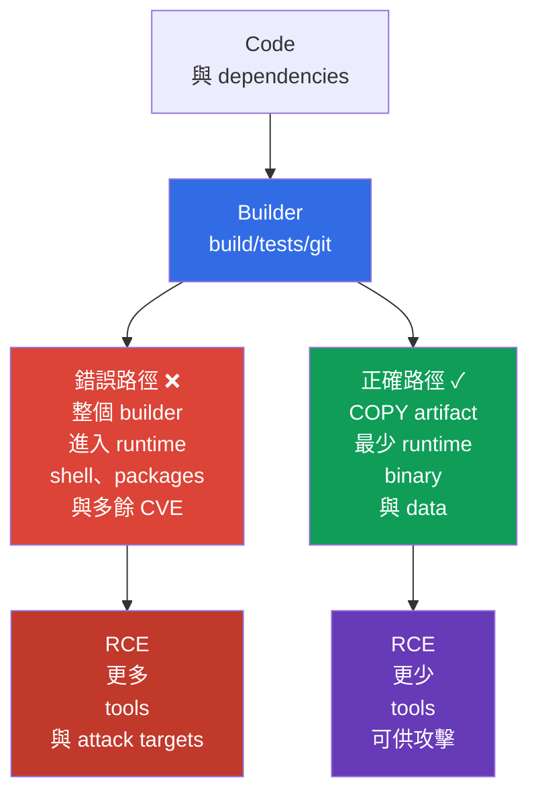
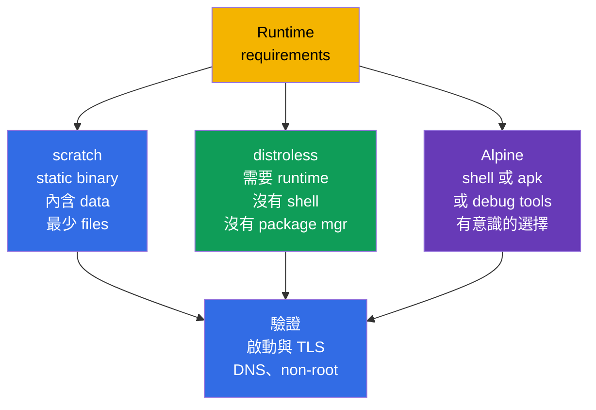

[Русская версия](ru.md) · [Eng version](README.md) · [Versión en español](es.md) · [Version française](fr.md) · [Deutsche Version](de.md) · [ქართული ვერსია](ge.md) · [日本語版](jp.md)

# 第 24 章。最小化 base image

> **問題。** 發生 RCE 後，完整 runtime image 不只會交給 attacker application process，還有
> shell、package manager、compiler、source 與多餘 libraries。每一項 component 都新增 CVE 或可直接用來
> 下載 payload、reconnaissance 與持久化的 tool。若整個 builder 進入 final image，任何下載並執行此 artifact 的
> node 都會重複承擔此風險。

> **接下來。** 在 [第 23 章](../23/tw.md) 中，我們加密 Pod 之間的 traffic，並確認了 peer identity。
> 現在保護於 Pod 中執行的東西：image 及其 build context。這是 CKS 的 **Supply Chain Security**
> （20%）domain。較小且 reproducible 的 image 含有較少 components、CVE 和 attacker 現成可用的 tools，
> 但它本身不能取代 SBOM、signing、policy 與 scanning - 它們將在第 25-28 章介紹。

> **需要的 CKA 知識。** image、Dockerfile、layers、tags 和 multi-stage build 的基本概念，請見
> [CKA 第 23 章](../../../cka/course/23/tw.md)；`runAsNonRoot`、capabilities 與 read-only root
> filesystem 請見 [CKA 第 20 章](../../../cka/course/20/tw.md)。這裡將它們套用到 supply-chain threat：
> 不只是縮小 image，而是從 final artifact 排除多餘內容。

> 🧠 最小 final image 可減少 CVE 與 post-exploitation tools，但不能取代 RCE 防護、`SecurityContext`、network 或 detection。

## 24.1. Threat model：image 中的多餘內容會成為 attacker 的機會

Image 是交付的 software artifact 的一部分。凡進入其 final stage 的一切，都會進入下載 image 的每個 node：
package manager、shell、compiler、source、test keys、layer history 與 transitive libraries。這些 components 中的
vulnerability 都是額外 CVE；`curl`、`wget` 或 `sh` 一類 utility 則是 application 被 compromise 後採取行動的
現成工具。

典型 scenario：application 有 RCE。在完整 `ubuntu` image 中，attacker 執行 `/bin/sh`、下載 payload、透過
package manager 安裝 utilities、讀取 build files，並嘗試 privilege escalation。在沒有 shell 與 package manager 的
minimal image 中，RCE 仍然嚴重，但之後的路徑較短：沒有 interactive shell、compiler 和大部分 libraries。這是
**縮減 attack surface**，不是 security boundary：仍須有 process permissions、`SecurityContext`、NetworkPolicy
與 runtime detection。



最小化帶來四種實際效果：

- packages 較少 - 已知 vulnerabilities 與要維護的 updates 較少；
- size 較小 - pull、rollout 和 autoscaling 較快，registry 與 network 消耗較低；
- runtime 中沒有 build tools 與 source - 更難被竊取或利用；
- executable files 較少 - RCE 後可用 commands 較少。

不要只用 megabytes 衡量 security。含有 vulnerable application 或 root process 的 5 MiB image 並不安全，
移除 CA certificates 也可能使 TLS 失敗。應**有意義地**最小化：保留 application 真正所需的 runtime、CA bundle、
timezone data 與 dynamic libraries。

> 🧠 Runtime image 的 files 越少，attacker 可用的 post-exploitation tools 越少；在 `scratch`/distroless/Alpine 間選擇，是 attack surface 與 diagnosability 的 trade-off。

## 24.2. `scratch`、distroless 與 Alpine：依需求選擇 runtime

Base image 決定 `COPY` 前存在哪些 files。Final stage 不必像 builder。先了解 artifact 是否是 static binary、
是否需要 language runtime，以及是否需要 diagnostics 或 native libraries，再選擇它。

| Runtime base | 包含內容 | 適合情況 | 限制與風險 |
|---|---|---|---|
| `scratch` | 空 base image：image 本身沒有 runtime files | 不需要缺少的 runtime libraries 的 static Go/Rust/C++ binary | 沒有 shell、CA bundle、timezone data 和 dynamic loader；Kubernetes/runtime 通常會提供 Pod 的 `/etc/resolv.conf`，但 application 仍須有相容的 DNS resolver 和必要 runtime data |
| distroless | 僅選擇的 runtime/libraries，沒有 shell 和 package manager | 需要最小且受支援 runtime 的 Go/Java/Node/Python application | 一般的 `kubectl exec -- sh` 不可用；透過 logs、metrics 與 `kubectl debug` 偵錯 |
| Alpine | 含 BusyBox 與 `apk` 的 minimal Linux | 確實需要 shell/packages 的 application 或 diagnostics | shell 和 package manager 仍存在；以 `musl` 取代 glibc 可能與 native dependency 不相容 |

`/etc/resolv.conf`、`/etc/hosts` 與 hostname-related files 可由 kubelet/container runtime 在 Pod 啟動時提供，
不是必須自動複製到 `scratch` 的 files。



`Alpine` 不會只因為很小就自動比 distroless 更安全。它的 `/bin/sh` 和 `apk` 對 developer 有用，
但在 RCE 時也有用。反之，也不能以犧牲 functionality 為代價選擇 distroless。例如有 CGO dependency 的
application 可能需要 glibc 和特定 shared libraries；此時先在 builder 中透過 `ldd` 檢查 binary，再選擇
相容的 runtime。

請確認特定 vendor 的 tag 含義。`:latest` 不會固定 artifact，不適合 production。Version tag（`alpine:3.21.2`）
是最低要求；release 也要固定由 registry 取得且驗證過的 immutable digest：

```text
registry.example.com/payments/api:1.4.2@sha256:<已驗證的-64-字元-digest>
```

Digest 應在 image 驗證後寫入 GitOps/manifest，而不是從隨機 post 取得。Tag 方便人類，digest 保證被 scan 和
sign 的 bytes。Kubernetes 中也在 `image:` 指定同樣的 value。

> 🎯 獨立 builder 與 final stage，透過 `COPY --from=builder` 僅複製完成的 artifact；compiler、source、cache 與 credentials 不會進入 runtime。

## 24.3. Multi-stage build：builder 不應成為 runtime

Multi-stage Dockerfile 分隔 trusted roles。第一個 stage 可包含 Go compiler、package cache 和 source。
最後 stage 僅取得完成的 artifact。若明確只複製單一 file，`COPY --from=builder` 不會傳遞完整 builder filesystem。
這會從 runtime 移除 compiler、`git`、`go.mod`、private build caches 與大多數 transitive dependencies。

下方是小型 Go HTTP service 的完整範例。它假設目錄中有 `go.mod`、`go.sum` 和 `./cmd/server`；
`CGO_ENABLED=0` 會建立適用於 `scratch` 的 static binary。所有 images 均有具體 versions，且 final process
不以 UID 0 執行。

```dockerfile
# syntax=docker/dockerfile:1.7
# Dockerfile
FROM golang:1.27.1-alpine3.24@sha256:<已驗證的-digest> AS builder
WORKDIR /src

# 經常不變的 dependency manifests 放在 code 上方：cache 效果較佳。
COPY go.mod go.sum ./
RUN go mod download

COPY . ./
RUN CGO_ENABLED=0 GOOS=linux go build -trimpath -ldflags="-s -w" \
    -o /out/server ./cmd/server

# 在 scratch 中，numeric UID/GID 足以指定 non-root credentials；
# 仍應另外檢查 application 的 runtime dependencies。
FROM scratch
COPY --from=builder /out/server /server
USER 65532:65532
EXPOSE 8080
ENTRYPOINT ["/server"]
```

Numeric UID/GID 使 runtime 能在 `/etc/passwd` 沒有 user entry 的情況下執行 process，卻不保證 application
可運作：它可能需要 user 或 group lookup、`HOME`、timezone data、CA bundle、NSS 或其他 runtime files。

Image 中的 `USER` 是第一道 barrier：process 預設不是 root，包括本機 `docker run`。在 Pod-level policy
與 SecurityContext 中固定它，以免 image consumer 用偶然的 manifest 取消此決定：

```yaml
apiVersion: v1
kind: Pod
metadata:
  name: minimal-api
spec:
  securityContext:
    runAsNonRoot: true
    runAsUser: 65532
    runAsGroup: 65532
  containers:
  - name: api
    image: registry.example.com/training/minimal-api:1.0.0
    ports:
    - containerPort: 8080
    securityContext:
      allowPrivilegeEscalation: false
      readOnlyRootFilesystem: true
      capabilities:
        drop: ["ALL"]
```

`runAsNonRoot: true` 不會在 image 中建立 user，也不會修正 file ownership。若 runtime 判定為 root，
它不會允許啟動。確保 binary 與 application 要寫入的 directories 可由 UID `65532` 存取；使用
`readOnlyRootFilesystem: true` 時，將 temporary data 放在 `emptyDir`，而不是恢復 writable root。

> 🔬 Docker 與 rootless Podman 使用相同 Dockerfile/context；rootless 無法防護過寬 context、mutable base image 或 layer 中的 secret。

### Docker 與 Podman build

兩個 commands 使用相同 Dockerfile 與 build context。Docker 通常經由 daemon 運作；Podman 是 daemonless，
也可 rootless 運作，因此適合 build 不應取得 host Docker socket 的 root access 的情況。Rootless Podman
不會讓不安全 Dockerfile 變安全：secret 與多餘 files 仍可能進入 image。

```bash
# Docker：下一節的 secret mount 需要 BuildKit。
DOCKER_BUILDKIT=1 docker build \
  --tag registry.example.com/training/minimal-api:1.0.0 \
  --file Dockerfile .

docker image inspect registry.example.com/training/minimal-api:1.0.0 \
  --format 'size={{.Size}} bytes user={{.Config.User}}'
docker run --rm --user 65532:65532 \
  registry.example.com/training/minimal-api:1.0.0

# Rootless Podman：以一般 user 執行，不要使用 sudo。
podman build \
  --tag registry.example.com/training/minimal-api:1.0.0 \
  --file Dockerfile .
podman image inspect registry.example.com/training/minimal-api:1.0.0 \
  --format 'size={{.Size}} bytes user={{.Config.User}}'
podman run --rm --user 65532:65532 \
  registry.example.com/training/minimal-api:1.0.0
```

Multi-stage 會縮小 runtime，但本身不會使 builder trustworthy 或讓 build reproducible。對 release，
固定並驗證 base-image digest、modules/packages versions 與 dependencies source；不可讓 build 不受控制地依賴
mutable external repositories。private dependencies 的 secrets 只能經由 BuildKit/Podman secret mounts 傳遞。

不要將 `--no-cache` 當成持續的「security check」：它只會停用 cache、增加時間與 traffic，卻不會讓 dependencies
可重現。接著在 publish 前驗證產生的 digest。

### Distroless variant

若 static build 不可行，final stage 可使用 distroless。使用 versioned/variant base，對 release 則替換為 platform
驗證過的 digest。distroless 的 `:nonroot` 已設定 unprivileged user，但仍明確指定 `USER`，使意圖在 Dockerfile
中可見。

```dockerfile
FROM gcr.io/distroless/static-debian13:nonroot@sha256:<已驗證的-digest>
COPY --from=builder /out/server /server
USER 65532:65532
ENTRYPOINT ["/server"]
```

> 🎯 `RUN rm` 不會從前一個 layer 抹除 secret；請使用 secret mount 與 `.dockerignore`，發生洩漏時請 revoke secret 並重建 image。

## 24.4. Layers、secrets 與 build context

每個變更 filesystem 的 Dockerfile instruction 都可能建立 layer。Layer 是 immutable：若 secret 建立於
已納入 published image 的 layer stage，下一個 layer 中的 `RUN rm /tmp/token` 不會從底層 layer 抹除其 bytes。
因此不可透過 `COPY`、`ADD`、`ARG` 或 `ENV` 傳遞 secret。

一般 multi-stage build 是不同情況：若 final stage 自己以 `FROM` 起始且只透過 `COPY --from` 傳遞所需 artifact，
獨立 builder layers 就不會成為 final runtime image 的 layers。

這不會自動使不安全傳遞 credentials 變安全。Secret 仍可能經由意外複製的 artifact、單獨發布的 intermediate image
或 build logs 進入 final image。若 credential 經由 `ARG`/`ENV` 傳遞，或寫入 filesystem layer，它也可能保留在
相應 build stage 的 build metadata、history 或 cache 中。Build-time credentials 請使用 BuildKit/Podman secret
mounts，不要使用 `ARG`、`ENV`、`COPY` 或 `ADD`。

```dockerfile
# 絕不這麼做：token 會留在 history/config 或其中一個 layers。
ARG NPM_TOKEN
RUN npm config set //registry.example.com/:_authToken="$NPM_TOKEN" && npm ci

# 絕不這麼做：.npmrc 可能進入 COPY . .，並保留在 layer 中。
COPY .npmrc /root/.npmrc
RUN npm ci
RUN rm /root/.npmrc
```

對 BuildKit 使用 secret mount：secret 僅暫時提供給所需的 `RUN` command，不進入 output layer；secret value
也不會納入 provenance attestation。使用 secret 的 command 仍不可將它印到 stdout/stderr、寫入供
`COPY --from` 使用的 artifact，或將 credential 儲存於一般 filesystem layer。正確使用 `--secret` 時可用
external cache：危險的不是 cache export 本身，而是因錯誤處理 secret，將 credential 寫入 cacheable filesystem
output。

```dockerfile
# syntax=docker/dockerfile:1.7
FROM node:22.23.2-alpine@sha256:<已驗證的-digest> AS builder
WORKDIR /app
COPY package.json package-lock.json ./
# Build tools（TypeScript、Vite、webpack 等）通常位於 devDependencies。
RUN --mount=type=secret,id=npmrc,target=/root/.npmrc \
    npm ci
COPY . .
RUN npm run build
# 僅在 build 後移除 devDependencies；runtime-stage 只複製 artefacts 與必要 dependencies。
RUN npm prune --omit=dev
```

```bash
# .npmrc file 儲存在 secret store/CI，不和 Dockerfile 放在一起。
DOCKER_BUILDKIT=1 docker build \
  --secret id=npmrc,src="$HOME/.config/build-secrets/npmrc" \
  -t registry.example.com/training/web:1.0.0 .

podman build \
  --secret id=npmrc,src="$HOME/.config/build-secrets/npmrc" \
  -t registry.example.com/training/web:1.0.0 .
```

若 secret 已在 image 中發布，僅新增 `RUN rm` 不夠。立即 revoke 並 replace secret，刪除/限制對 registry artifact
的 access，然後使用帶有新 secret 的乾淨 Dockerfile 重建 image。應將舊 credential 視為已 compromise。

### `.dockerignore` - build context 的邊界

Dockerfile 啟動前，client 會將 build context 傳送給 builder。沒有 `.dockerignore` 時，`COPY . .` 可能取得
`.git`、local `.env`、SSH keys、test artifacts 及大型 directories。`.dockerignore` 減少 traffic、加速 build，
並避免這些 files 對 Dockerfile instructions 可用。這是重要保護，但不是 secret management 的 substitute：
仍可能錯誤複製 context 中確實需要的 file。

```dockerignore
# .dockerignore
.git
.gitignore
.env
.env.*
.npmrc
*.pem
*.key
id_rsa
secrets/
coverage/
tmp/
node_modules/
**/.DS_Store
README.md
```

Rules 必須與 project 相符。若 application 確實需要 public CA certificate，不要盲目忽略 `*.pem`：應將明確
允許的 public certificate 存在獨立 directory，並僅複製它。Dockerfile 不需要整個 monorepo 時，將 build context
與 repository root 分開，例如 `docker build -f docker/Dockerfile docker/`。

### 在不造成傷害的「最佳化」下縮減 layers

將相關的 install/cleanup 放在一個 `RUN` 中，避免 package manager cache 留在前一個 layer。但不要將整個
Dockerfile 合併為一條難以閱讀的 command：`COPY` 順序應保留 cache，policy 和 review 應能看見安裝了什麼。

```dockerfile
# Alpine：package index 與 build dependencies 不會留在此 stage。
RUN apk add --no-cache --virtual .build-deps build-base \
 && make release \
 && apk del .build-deps
```

這只在 command 位於 final stage 時有用。通常更好的選項更簡單：透過 multi-stage build，完全不要將包含
`apk`、compiler 和 cache 的 stage 帶入 runtime。

> 🎯 使用 `history`、`inspect` 和 `dive` 檢查 final artifact；對 distroless/scratch，缺少 shell 只能由預期的 executable-not-found error 證明，任何 non-zero `kubectl exec` 都不算。

## 24.5. Inspection：測量 size、layers 與內容

Build 後，不要假設 final image 是最小的：證明它。`docker image ls` 顯示總 size，卻不說明由哪個 layer
造成。`history`、`inspect` 和 `dive` 有助於看見 commands、sizes 及 file changes。

```bash
IMAGE=registry.example.com/training/minimal-api:1.0.0

# 總 size 與建立 layers 的 commands。
docker image ls "$IMAGE"
docker history --no-trunc "$IMAGE"
docker image inspect "$IMAGE" \
  --format 'user={{.Config.User}} entrypoint={{json .Config.Entrypoint}} size={{.Size}}'

# 使用 Podman 時的同樣 checks。
podman history --no-trunc "$IMAGE"
podman image inspect "$IMAGE" \
  --format 'user={{.Config.User}} entrypoint={{json .Config.Entrypoint}} size={{.Size}}'

# Interactive TUI：各 layer 的 size、wasted space、files。
dive "$IMAGE"
```

在 `dive` 中注意：

- 含有 `COPY . .` 的 large layer - 通常表示 context 過寬，或 Dockerfile order 不正確；
- package cache、compiler、tests、`.git`、`.env`、private key 或 `.npmrc` - 應修正 Dockerfile/.dockerignore
  並立即 rotate 發現的 secret；
- `RUN install` 後再單獨 `RUN rm` 的「wasted bytes」 - 刪除太晚，在新 layer 中執行；
- `User` 為空或等於 `root` - Dockerfile 未設定 non-root user。

`dive` 只能看見 image 可用的內容。它不能取代 vulnerability scan、secret scan 或 SBOM。CI 中一個有用順序為：
build -> inspect/lint -> SBOM/scan -> push immutable digest -> sign/attest digest -> verify -> deploy/admission。
在一般 Cosign/Sigstore workflow 中，先 publish image 並取得 immutable digest，然後 Cosign 對該 digest signing，
並在 registry 建立 attestation；deployment/admission 檢查這個關係。下一章會介紹 SBOM，第 26-28 章介紹
signing、policy 和 scanners。

## 24.6. 無 shell 的驗證：distroless 有意採取不同的行為

沒有 shell 是 distroless/scratch runtime 的特性，不是 Kubernetes error。因此在這類 image 中成功執行
`kubectl exec <pod> -- /bin/sh` 應是 alarm signal。以標準方式檢查 application endpoint 和 UID，
並另行記錄預期的 shell denial。

```bash
kubectl apply -f minimal-api.yaml
kubectl wait --for=condition=Ready pod/minimal-api --timeout=90s
kubectl logs minimal-api

# 應以 application endpoint/health probe 而非 shell 檢查是否成功啟動。
kubectl port-forward pod/minimal-api 8080:8080
# 在另一個 terminal：curl -fsS http://127.0.0.1:8080/health

# 先排除 generic exec failure：Pod 已 Ready，且 RBAC 允許 pods/exec。
if [[ "$(kubectl auth can-i create pods --subresource=exec)" != yes ]]; then
  echo "ERROR: current identity cannot create pods/exec" >&2
  exit 1
fi

# 對 distroless/scratch，預期的是 executable 缺少的確切 error。
if output=$(kubectl exec minimal-api -c api -- /bin/sh 2>&1); then
  echo "ERROR: /bin/sh unexpectedly exists in the minimal runtime" >&2
  exit 1
else
  status=$?
  if printf '%s\n' "$output" | grep -Eqi 'executable file not found|stat /bin/sh: no such file or directory'; then
    echo "OK: /bin/sh is absent as expected"
  else
    printf 'ERROR: kubectl exec failed, but /bin/sh absence was not proven (exit %s): %s\n' \
      "$status" "$output" >&2
    exit 1
  fi
fi

# 不需要 shell 的 settings：
kubectl get pod minimal-api -o jsonpath='{.spec.securityContext.runAsNonRoot}{"\n"}'
kubectl get pod minimal-api -o jsonpath='{.spec.containers[0].securityContext.allowPrivilegeEscalation}{"\n"}'
```

不要為「debug」把 `busybox` 加入 production image：這會抵銷部分最小化目的。發生 incident 時，請使用 logs、
metrics、trace、`kubectl describe` 與 temporary ephemeral debug container；它要與 production image 隔離：

```bash
# 需要 RBAC permission 與 cluster 對 ephemeral containers 的支援。
kubectl debug -it pod/minimal-api --target=api \
  --image=busybox:1.36.1 -- sh
```

Ephemeral debug container 位於同一 Pod 中並共享其 network namespace。`--target=api` 要求 container runtime
將 debug container 放在 target container 的 process namespace；這需要 runtime support。沒有它時，debug container
可能以 isolated process namespace 啟動而看不到 application processes。其 root filesystem 和 mount namespace
不會自動變成 target-container 的 filesystem。Debug image 也必須有具體 version（production 中則應有 approved digest），
且不應作為缺少 shell 的永久 bypass。

### 常見錯誤與診斷

| 症狀 | 可能原因 | 採取動作 |
|---|---|---|
| `exec /server: no such file or directory` 於 `scratch` | binary 是 dynamically linked，或 architecture 錯誤 | 使用 `CGO_ENABLED=0` build；在 builder 檢查 `file /out/server`、platform 與 dependencies |
| HTTPS 在 `scratch` 中無法運作 | 缺少 CA certificates | 將 CA bundle 內嵌入 application，或僅從獨立 stage 複製必要的 public bundle |
| Pod 無法以 `runAsNonRoot` 啟動 | image/manifest 嘗試使用 UID 0 | 在 Dockerfile 設定 `USER`、ownership 與明確 numeric UID；不可繞過 check |
| `kubectl exec ... /bin/sh` 無法運作 | distroless/scratch 中預期缺少 shell | 檢查 logs/endpoint；用於調查時使用 `kubectl debug` |
| 在 `dive`/history 找到 secret | credential 被複製、經 `ARG` 傳遞，或在較晚 layer 才刪除 | revoke secret、在沒有它的情況下 rebuild，使用 BuildKit/Podman secret mount |
| Docker 和 Podman build 出不同結果 | builder/cache/platform 不同，或 base image 未固定 | 必要時明確設定 platform、固定 digest，並比較 final digest |

> 🏭 Pinned base/release digest、狹窄 context、secret management、non-root runtime、SBOM/scan/signature 及 admission；於 approved ephemeral debug image 中進行 debugging。

## 24.7. 如何在 production 套用

- **Build 與 runtime 分離。** Builder 可以很大，但 final stage 僅允許 artifact、runtime libraries 與所需
  public data。Stages、dependencies 與 base images 均如 production code 般接受 review。
- **固定 versions 與 digest。** 以 linter/policy 禁止 `latest`。Release 將 human-readable tag 與 immutable
  digest 連結；同一 digest 經過 SBOM、scan、signing 與 deployment。
- **Non-root 是 defence in depth。** Image 中的 `USER`、Pod 中的 `runAsNonRoot`/numeric UID 與 admission
  policy 彼此補強。Application 相容時，加入 `drop: ["ALL"]`、`allowPrivilegeEscalation: false` 和 read-only root。
- **Secrets 不會是 build arguments。** CI 在 build 期間發給 short-lived credential；BuildKit/Podman secret mounts、
  scoped registry permissions 與 `.dockerignore` 可減少洩漏機率。Layer 中的任何洩漏都代表要 rotation，而不只是新 build。
- **Debugging 與 runtime 分離。** Observability 與 approved ephemeral debug images 取代 application image 內的 shell。
  這讓 CI 與 cluster 中的 production artifact 保持相同。
- **最小化是 pipeline 的一部分。** Teams 測量 image size 與 layer composition，在 review 時執行 `dive`，在 CI
  執行 SBOM/scan/sign，並在 base update 時定期 rebuild image。小 image 不代表可免除對 CVE 的回應。

## 24.8. Mini-glossary

- **Attack surface（attack surface）** - 可能含有 vulnerability 或可在 attack 中使用的 components、files 與 interfaces。
- **Base image** - `FROM` instruction 中定義 stage 初始 filesystem 的 image。
- **Build context** - 傳遞給 builder 的 files；由 `.dockerignore` 限制。
- **distroless** - 沒有 package manager，通常也沒有 shell 的 minimal runtime image。
- **`scratch`** - 沒有 filesystem 的空 base image；適合 static artifact。
- **Multi-stage build** - 具有獨立 build 和 runtime stages，並由 `COPY --from=` 串接的 Dockerfile。
- **Layer** - image filesystem 的 immutable change；在新 layer 中刪除不會抹除舊 layer 的內容。
- **Digest** - 特定 image manifest/content 的 immutable SHA-256 identifier。
- **Rootless Podman** - Podman 的一種 mode，讓一般 user 而非 root daemon 執行 build/run。
- **Secret mount** - 在不寫入 final layer 的情況下，暫時將 credential mount 到一個 build command。

## 24.9. 本章總結

- 多餘 packages、shell、package manager、build tools 與 secrets 會增加 attack surface 和 RCE 影響；小 image
  可降低風險，但不能取代其他 security controls。
- `scratch` 適用於 static binary，distroless 提供沒有 shell 的 minimal runtime，Alpine 僅在確實需要其 Linux
  userland 時選用，且需考量 `musl`。
- Multi-stage build 只將 artifact 留在 final image；builder、source 和 compiler 不會被移入。
- Base images、packages 和 application releases 都以 version 固定，production deployment 則以驗證過的 immutable
  digest，而不是 `latest`。
- Dockerfile 中的 `USER` 和 Pod 中的 `runAsNonRoot` 是互補的 non-root execution checks。
- Docker 與 rootless Podman build 同一 Dockerfile；builder 的 permissions 不會取消 context 和 secrets 的規則。
- 不可透過 `ARG`、`ENV`、`COPY` 傳遞 secret，也不可在較晚 layer 刪除；使用 BuildKit/Podman secret mount 和
  `.dockerignore`。
- `dive`、`history` 和 `inspect` 顯示 layers、wasted bytes、files 與 effective user。在 distroless 中，
  缺少 `/bin/sh` 應以預期的 `kubectl exec` failure 驗證。

## 24.10. 實用性：考試與實際工作

**在考試中。** 要能快速辨識 `latest`、root user、Dockerfile 中的 secret 與多餘 runtime stage；撰寫
`COPY --from=...`、`USER`、`.dockerignore`、`docker build`/`podman build` commands，並檢查 image。對 distroless
的「為什麼 `kubectl exec ... sh` 不工作？」task，通常在測試你是否理解 minimal runtime，而不是是否會把 shell
裝回去。

**在實際工作中。** 這些決定可減少 CVE backlog 與 rollout time，但更主要結果是 reproducible artifact：team
知道它的 base digest、contents、UID 與 verification history。這使 supply chain 的下一步 - SBOM、scanning、
signing 與 admission policy - 能處理明確定義的 image。

> ### 🔴 Attacker 的觀點
> **Asset：** build-time files 中的 secrets 和 credentials，例如 `.npmrc` 與 token。
> **Starting foothold：** 可存取 Dockerfile/build context，或能檢查 built image。
> **Attacker objective：** 找出遺留在 intermediate image layers 的 credential。
> **Abuse path：** 檢查 published final image 的 layers，若 credential 在其某個底層 layer 建立，或意外從 builder 複製，即可擷取它。獨立 builder layers 不會進入一般 final multi-stage image，但若 secret 經由 `ARG`/`ENV`/`COPY` 傳遞，或 build command 將其寫入 layer/artifact，credential 可能保留在單獨發布的 intermediate image、build logs 或 cacheable filesystem output。正確的 BuildKit `--mount=type=secret` 不會將 secret value 儲存於 final layer 或 provenance attestation。
> **Expected evidence：** final layers、copied artifacts 與可取得的 build outputs 不含 credential；provenance 不含 secret value。
> **Control：** BuildKit `--mount=type=secret`、用於含 credentials files 的 `.dockerignore`，以及僅對必要 artifact 使用 `COPY --from`；只有 cacheable filesystem output 不含 credential 時才使用 external cache。
> **Retest：** 再次檢查 final layers、可取得 build outputs 和 provenance，沒有找到 credential。

## 24.11. Self-check questions

<details>
<summary>1. 為什麼 runtime image 中的 shell 和 package manager 會增加 RCE 影響，即使缺少它們不會修復 application vulnerability？</summary>

RCE 後，shell、`curl`/`wget`、compiler 和 package manager 給 attacker 現成工具來下載 payload、安裝 utilities 並檢查 filesystem。沒有它們會縮小 post-exploitation surface，但不會修復原有 RCE，也無法取代 SecurityContext、NetworkPolicy 或 runtime detection。因此最小化是 defence in depth，不是安全邊界本身。
</details>

<details>
<summary>2. 如何為 static Go binary、Java application 與需要 native tool 的 application，在 `scratch`、distroless 和 Alpine 之間選擇？</summary>

若已檢查 DNS、TLS、CA bundle 和必要 runtime data，採用 `CGO_ENABLED=0` 的 static Go binary 適合 `scratch`。Java application 需要最小且受支援的 language runtime，因此選擇相應 distroless variant。若確實需要 shell、`apk` 或 native diagnostic tool，Alpine 有其合理性，但其 BusyBox/package manager 與 `musl` 需要另作 compatibility 和 security assessment。
</details>

<details>
<summary>3. `COPY --from=builder` 具體避免了什麼，又有哪些內容仍可能因 mistake 進入 final image？</summary>

`COPY --from=builder` 僅傳遞明確指定的 artifact，而不是完整 builder filesystem，因此 compiler、source、`git`、build cache 和大部分 dependencies 不會自動進入 runtime。但錯誤的寬泛 `COPY`、新增的 runtime dependency，或已在複製路徑中的 secret，仍可能進入 final image。透過 `history`、`inspect` 和 `dive` 檢查 contents。
</details>

<details>
<summary>4. 為何 version tag 比 `latest` 好，而 release 的 digest 又比 version tag 強？</summary>

`latest` 是 mutable，無法固定已驗證 artifact；version tag 至少表達 release。Immutable digest 將 deployment 連結到已 scan 和 signed 的特定 manifest/content bytes。對 release，本章建議 GitOps 同時儲存 tag 與驗證過的 `@sha256:...` digest。
</details>

<details>
<summary>5. Dockerfile 中的 `USER` 如何與 Pod 中的 `runAsNonRoot` 關聯，為何兩者都需要？</summary>

`USER` 使 non-root execution 成為 image 和本機 `docker run` 的 default；numeric UID 即使沒有 `/etc/passwd` entry 也能運作。Pod 中的 `runAsNonRoot` 不會建立 user 或修正 ownership，但會阻止 runtime 啟動已識別的 root user。Pod 也可明確設定 UID/GID，並透過 admission policy 補強此決定。
</details>

<details>
<summary>6. 為何 `RUN rm /secret` 不會從 image history 刪除 secret？Private dependency credential 應使用什麼 mechanism？</summary>

若 secret 建立於納入 published image 的 layer stage，下一個 layer 的刪除不會抹除其在底層 layer/history 的 bytes。一般 multi-stage build 中，獨立 builder 本身不會進入 final image，但 `ARG`、`ENV`、`COPY` 或 `ADD` 不安全：credential 可能進入複製的 artifact、cache、logs 或單獨發布的 intermediate image。BuildKit/Podman `--mount=type=secret` 僅將 secret 暫時提供給 build instruction，不將其 value 儲存在 final layer 或 provenance attestation。但 build command 仍可能自行印出 secret 或把它寫進 generated artifact，因此仍要檢查 output。若 secret 已發布，應 revoke 並 rotate，並以乾淨 Dockerfile 重建 image。
</details>

<details>
<summary>7. `.dockerignore` 限制什麼，為何它不能取代 secret manager？</summary>

`.dockerignore` 限制傳送到 builder 的 build context files，因此 `.git`、`.env`、keys 和 test artifacts 不會對 `COPY . .` 可用。這降低洩漏風險與 build size/time。但仍必須放在 context 中的 file 可能被錯誤複製，因此 credentials 必須由 secret manager 經由 secret mount 發給。
</details>

<details>
<summary>8. `dive` 中哪些跡象表示 context 過寬或 layers 有 waste？</summary>

由 `COPY . .` 產生的大 layer 通常表示 context 過寬或 Dockerfile order 錯誤。Compiler、package cache、tests、`.git`、`.env`、private key 和 `.npmrc` 表示有多餘內容，`RUN install` 後再單獨 `RUN rm` 的 wasted bytes 則表示刪除太晚。空的或 root `User` 也是 Dockerfile 未設定 non-root user 的訊號。
</details>

<details>
<summary>9. 若 `/bin/sh` 是刻意缺少的，如何證明 distroless Pod 可運作？</summary>

檢查 Ready、logs、health endpoint 或 probe，例如透過 `kubectl port-forward` 和 `curl`，而不是嘗試恢復 shell。在確認 Pod Ready 與 `pods/exec` access 後，必須由預期的 executable-not-found error 確認 shell 缺失；任何 non-zero `kubectl exec` 都不是證明。Incident diagnosis 時使用 logs、metrics、`describe` 或 temporary approved ephemeral debug container。
</details>

<details>
<summary>10. Rootless Podman 對 build pipeline 有何用途，又不能防護什麼？</summary>

Rootless Podman 讓一般 user 在沒有 root Docker daemon 的情況下執行 build/run，可減少必須給 pipeline host Docker socket access 的需求。它使用同一 Dockerfile 與 build context，卻不能防止 secret 與多餘 files 進入 image。因此 `.dockerignore`、secret mounts 和 Dockerfile review 仍是必要的。
</details>

<details>
<summary>11. **Flashback（第 14 章）。** Base image 最小化（本章：distroless、沒有 shell/package manager）與 host footprint 最小化（第 14 章：停用 node 中不必要的 services/packages）是在兩個不同層級套用同一「較小 attack surface」principle。若你在 exam/incident 前時間有限，這兩個最小化層級中，哪一個可更快降低**已被 compromise 的** container 的風險 - 為什麼兩者都不能取代另一者？</summary>

對已被 compromise 的 container，runtime image 最小化更快改變 attacker 可用的 tools：它可能立即沒有 shell、package manager 和 downloader。Host footprint 最小化則保護 node 與其他 workloads，減少 host access 後可用於擴大 escape 的 services 和 packages。Image 無法保護已被 compromise 的 node，安全 node 也不會移除 container 中多餘的 tools，因此兩個層級都需要。
</details>

## 實作練習

🧪 Lab 111（minimal image、multi-stage、non-root 與 artifact inspection）：
[tasks/cks/labs/111](../../labs/111/README_TW.MD)

🌐 額外 interactive practice（killer.sh/killercoda，external resource）：[container-image-footprint-user](https://killercoda.com/killer-shell-cks/scenario/container-image-footprint-user) · [container-hardening](https://killercoda.com/killer-shell-cks/scenario/container-hardening)

Dockerfile 和 images 基礎請複習 [CKA 第 23 章](../../../cka/course/23/tw.md)；
Pod 中的 process restrictions 請見 [CKA 第 20 章](../../../cka/course/20/tw.md)。

---
[目錄](../README_TW.md) · [第 23 章](../23/tw.md) · [第 25 章](../25/tw.md)
