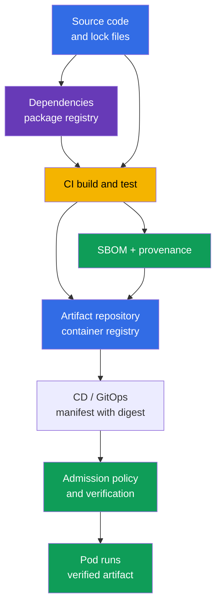
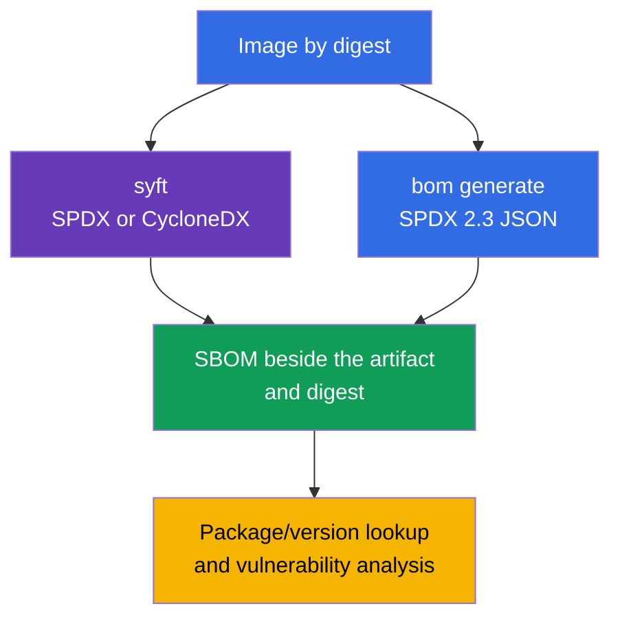
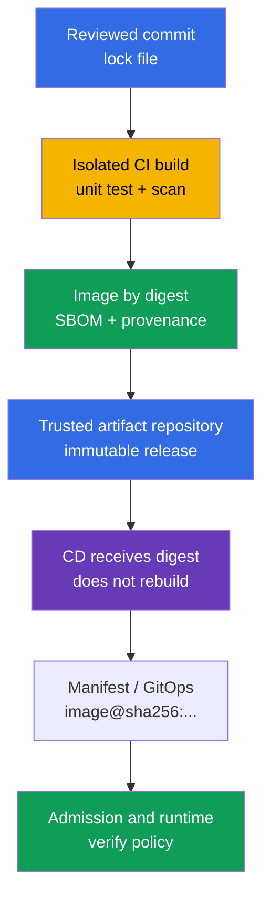
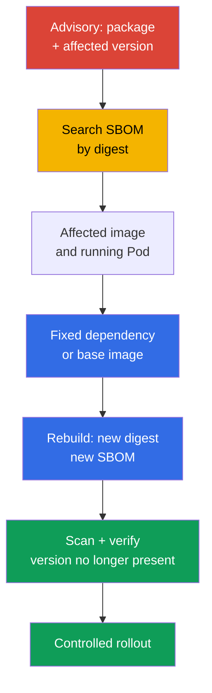

[Русская версия](ru.md) · [Versión en español](es.md) · [Version française](fr.md) · [Deutsche Version](de.md) · [ქართული ვერსია](ge.md) · [繁體中文版](tw.md) · [日本語版](jp.md)

# Chapter 25. Understanding the supply chain: SBOM, CI/CD, artifact repositories

> **The problem.** A tampered or unexpectedly replaced dependency, compromised CI token, or changed tag in a
> registry can deliver untrusted code to a Pod under a familiar image name. Without an inventory tied
> to a digest, it is impossible to quickly establish which components entered an artifact,
> who built it, and from which source state. This leaves a vulnerable dependency or
> malicious build unnoticed until it runs for a consumer.

> **What comes next.** In [Chapter 24](../24/README.md), we reduced the contents of the final image and pinned
> its version. Now you must be able to answer the next question: which components and
> versions still entered the delivered artifact, who built it, and how. This is the
> **Supply Chain Security** CKS domain (20%). Inventory through an SBOM makes a vulnerable component
> observable, while controlled CI/CD and a registry create a chain of trust to deployment.

> **What you need from CKA.** The basic concepts of images, layers, Dockerfile, tag, digest, and registry
> are covered in [CKA Chapter 23](../../../cka/course/23/README.md). We do not repeat container
> building here: we consider an image a delivery artifact, create its inventory, and
> verify the path from source code to Kubernetes.

> 🧠 A chain of trust connects source, dependencies, CI/CD, registry, and admission: compromising any transition can deliver an untrusted artifact to a `Pod`.

## 25.1. Software supply chain and the chain of trust

A **software supply chain** is all people, systems, source code, dependencies, and artifacts
through which an application passes before it runs in a Pod. For a container workload, this is not
only Git and Dockerfile: the chain includes a dependency registry, build runner, CI/CD credentials, container
registry, manifest/GitOps repository, admission policy, and kubelet that pulls the image.



A chain of trust is only as strong as its weakest part. If CI receives a tampered or replaced
dependency, signs an image from the wrong revision, or CD deploys a mutable tag,
a later Kubernetes check cannot recover the original artifact. Therefore, both identifying
**what** is running (digest and SBOM), **where** it came from (provenance), and
**which actions are allowed** at every transition matter.

Typical supply-chain attacks:

- compromise a dependency or publish a similarly named package (typosquatting), after
  which malicious code is installed by an ordinary package manager;
- take over a maintainer account or CI token and publish an image on behalf of the project;
- change a build script, runner, cache, or base image so that the artifact no longer
  corresponds to reviewed source;
- replace a registry tag: `app:stable` begins to point to different bytes even though the Kubernetes
  manifest did not change;
- obtain attacker access to registry or CD credentials and deploy directly, bypassing review;
- leak a secret from a CI log, environment, or image layer, then use that
  credential to sign, push, or alter a release.

An incident in the SolarWinds class illustrates the principle: an attacker need not compromise every
consumer if they can change a single trusted build or delivery stage.
In Kubernetes, the result can be a Pod with the expected name and tag but untrusted code.

The recent [Trivy incident](https://github.com/aquasecurity/trivy/discussions/10462)
shows the same concentration of trust. According to the project's final report, on February 27, 2026,
an attacker used a vulnerable `pull_request_target` workflow, obtained repository- and organization-level
secrets, and on March 19 used a stolen credential to run a release workflow and distribute malicious Trivy
`v0.69.4`. The root problem was not the scanner itself, but privileged CI that executed unreviewed PR code
and had access to excessive secrets; insufficient service-account isolation and ineffective rotation increased the
impact. This does not mean every Trivy user or Kubernetes Pod was compromised, but it confirms the
SolarWinds lesson: one trusted build/release step with broad credentials gives an attacker a scalable
path to deliver untrusted code.

Protection cannot be reduced to one scanner. An SBOM shows the composition, a scanner matches it to
known CVEs, signature/provenance link an artifact to the build process, and an admission
policy prevents an artifact that does not meet the rules. These mechanisms complement
each other.

> 🧠 An SBOM is an inventory of the composition of a particular artifact, not a scan report or cryptographic proof of its origin.

## 25.2. SBOM: component inventory and SPDX 2.3 JSON/CycloneDX formats

An **SBOM** (Software Bill of Materials) is a machine-readable list of artifact components: packages,
libraries, their versions, identifiers, licenses, and sometimes dependency relationships. For a
container image, a generator reads the filesystem and package metadata of layers; an SBOM primarily answers
the question “what was found in this artifact?” It is not proof that CVEs are absent, nor is it by
itself cryptographic proof of origin.

The two most common open formats are:

| Format | Purpose and strength | Where it is more common |
|---|---|---|
| **SPDX 2.3 JSON** | A Linux Foundation standard for software composition, licenses, packages, and relationships; well suited to compliance and inventory exchange | OCI artifacts, distributions, CI, and the Kubernetes ecosystem |
| **CycloneDX** | An Open Worldwide Application Security Project (OWASP) format focused on component analysis and security tooling; convenient for vulnerability management | scanners, dependency analysis, security dashboards |

Both formats can describe one image, but their JSON fields differ. All SPDX examples below use
**SPDX 2.3 JSON**: in this schema, packages are normally in `.packages`, with the version in
`versionInfo`; CycloneDX puts components in
`.components`, with the version in `version`. Do not carry these paths to SPDX 3.0: it has a different
data model. Do not write a universal `jq` query without knowing the file's format and version: an absent
result can mean an incorrect JSON path rather than an absent package.

An SBOM also has accuracy limits:

- not every image has a package database; a static binary can contain libraries yet have no
  customary package-manager metadata;
- a scanner can identify a component heuristically, so confirm its name or version
  against the manifest and lock file;
- an SBOM reflects the moment of generation. Rebuilding a base image or changing a dependency or digest
  creates a new SBOM;
- one version string does not by itself mean a vulnerability: match it against a vendor advisory,
  OS distribution, architecture, and fix status.

**A runtime SBOM and the full build chain are different inventories.** An SBOM for a final multi-stage image
describes what reaches runtime; dependencies from discarded builder stages are consequently absent.
Even analysis with `--scope all-layers` covers layers of the final image, not every vanished build
stage. A complete supply-chain inventory also needs source,
lock files, build attestations, and provenance: absence of a package from a final SBOM does not prove
it was absent from the build process.

Practical rule: store an SBOM beside the artifact and immutable digest
for which it was created. A file named `api-1.4.2.spdx.json`, created for `api:1.4.2`, is insufficient
if that tag is later overwritten; the association must be with `@sha256:...`.

## 25.3. Generating an SBOM: `syft` and `bom` from the Kubernetes ecosystem

Before generation, pin the image reference. A tag is convenient only for human reading;
for a report, verification, and production deployment, use the digest returned by your registry:

```bash
IMAGE='registry.example.com/payments/api:1.4.2@sha256:<64-hex-digest>'
```

Do not put a random digest from documentation into a release. First obtain the digest of a
verified image from a trusted registry and retain it beside the SBOM. The generator can require a
registry credential for a private image; do not pass the password in shell history or
a commit.

> 🔬 `syft` generates SBOMs in several formats.

### `syft`: SPDX 2.3 JSON and CycloneDX from one image

[Syft](https://github.com/anchore/syft) catalogs packages in an image, directory, or
archive and can output several formats. The following commands create two independent
files for the same image:

```bash
syft "$IMAGE" -o spdx-json > api.spdx.json
syft "$IMAGE" -o cyclonedx-json > api.cyclonedx.json
```

If a reference points to a multi-arch OCI index, select the platform explicitly. For a heterogeneous
cluster, create and index a separate SBOM for every actually used platform
manifest; beside it, retain the platform and that manifest's digest, not only the index digest:

```bash
PLATFORM='linux/amd64'
syft "$IMAGE" --platform "$PLATFORM" -o spdx-json > api.linux-amd64.spdx.json
```

Equivalent short commands that are useful to recall quickly on the exam:

```bash
syft <image> -o spdx-json
syft <image> -o cyclonedx-json
```

Verify that the file is non-empty and JSON before passing it to a scanner or
retaining it as evidence:

```bash
jq -e '
  .spdxVersion == "SPDX-2.3"
  and .SPDXID == "SPDXRef-DOCUMENT"
  and .dataLicense == "CC0-1.0"
  and (.documentNamespace | type == "string")
  and (.creationInfo.creators | type == "array")
  and (.packages | type == "array")
' api.spdx.json >/dev/null
jq -e '.bomFormat == "CycloneDX" and (.components | type == "array")' \
  api.cyclonedx.json >/dev/null
```

The first query is a **sanity check** for expected SPDX 2.3 JSON; the second is for CycloneDX JSON. It
filters out empty output, an HTML registry error, and JSON in another format, but is not complete
schema/conformance validation: use an SPDX validator compatible with the required
specification version for that. A particular SBOM can lack a field that is not required by your
generator version; still explicitly check the core document fields, format, and component list.

> 🎯 `kubernetes-sigs/bom` is the Kubernetes-oriented path: generate SPDX JSON for the specified image, check its structure, and retain the result.

### `bom`: the Kubernetes-oriented path to SPDX 2.3 JSON

[`bom`](https://github.com/kubernetes-sigs/bom) is a Kubernetes SIGs tool for working with
software bill of materials. It is an important practical CKS tool: its documentation is
permitted on the exam, and Lab 111 uses it to generate SPDX 2.3 JSON. In the current
environment, first inspect available flags rather than guessing syntax:

```bash
bom generate --help
```

For an image, the command from the lab scenario creates an SPDX JSON file:

```bash
bom generate --image "$IMAGE" --format json --output out.spdx.json
```

Some `bom` versions use `-o` in the short form:

```bash
bom generate --image "$IMAGE" --format json -o sbom.spdx.json
```

`--format json` in this command means the JSON representation of SPDX, not CycloneDX. Do not
rename the file to `*.cyclonedx.json`: its name must communicate its real format so that the
subsequent `jq`, scanner, and reviewer choose the correct schema. Check the resulting file
as SPDX and count packages found:

```bash
jq -e '
  .spdxVersion == "SPDX-2.3"
  and .SPDXID == "SPDXRef-DOCUMENT"
  and .dataLicense == "CC0-1.0"
  and (.documentNamespace | type == "string")
  and (.creationInfo.creators | type == "array")
  and (.packages | type == "array")
' out.spdx.json >/dev/null
jq '.packages | length' out.spdx.json
```

This is a sanity check, not complete SPDX schema/conformance validation.

If `bom` cannot see a local image, specify a reference accessible to the runtime/registry from
which the command runs, and check `bom generate --help` for the version installed in the
environment. Do not replace an access error with an artificially created JSON file: that hides a
credential problem or the wrong artifact name.



> 🎯 For a specified image digest, find the exact package and its version in the SBOM; searching by name alone does not prove advisory applicability.

## 25.4. Reading an SBOM: find a package and exact version

An exam or production scenario normally starts with an advisory: for example, it is known
that one image contains `ca-certificates-bundle` at a particular version. Do not
draw a conclusion from the image name or tag. Find the package **and its version** in the SBOM for a specific
digest, then match the result to the running workload.

For SPDX 2.3 JSON created by `bom` or `syft`, show the name and version of the exact package:

```bash
jq -r '
  .packages[]
  | select(.name == "ca-certificates-bundle")
  | [.name, .versionInfo, .SPDXID] | @tsv
' out.spdx.json
```

If the package really exists, you will see a line with `name`, `versionInfo`, and `SPDXID`.
If output is empty, do not change a deployment blindly. Check in order: whether you selected
the right SBOM, whether the format is correct, how the generator named the package, and whether it is
in another image/sidecar.

Searching by partial name is useful for initial investigation, but can return several
packages and is unsuitable as a final version check:

```bash
jq -r '
  .packages[]
  | select(.name | test("ca-certificates"; "i"))
  | [.name, (.versionInfo // "<no versionInfo>")] | @tsv
' out.spdx.json
```

For CycloneDX JSON, the path and field name change:

```bash
jq -r '
  .components[]
  | select(.name == "ca-certificates-bundle")
  | [.name, .version, (.purl // "<no purl>")] | @tsv
' api.cyclonedx.json
```

`purl` (package URL) helps distinguish packages with identical names in different ecosystems.
In a real investigation, record in the ticket: the image digest, package name/version, SBOM
filename, and advisory/CVE. Then another engineer can reproduce the result rather than look for
“roughly that package” in another rebuild.

After finding a component, connect the SBOM to the cluster. Image references actually
used by Pods can be viewed as follows:

```bash
kubectl get pods -A \
  -o jsonpath='{range .items[*]}{.metadata.namespace}{"\t"}{.metadata.name}{"\t"}{range .spec.containers[*]}{.image}{"\n"}{end}{end}'
```

This output shows the declared image reference. `status.containerStatuses[].imageID` is useful
as runtime-specific evidence of what the node reported for a running container, but it is not a
portable registry digest and is not necessarily the digest of an OCI index or platform manifest. For
strong incident evidence, use digest-pinned `spec.containers[].image`, determine the node
architecture, resolve the registry/index to its relevant platform manifest, and match the SBOM
to it. With node access, also compare the runtime inventory:

```bash
kubectl get pod <pod> -n <namespace> \
  -o jsonpath='{range .status.containerStatuses[*]}{.name}{"\t"}{.imageID}{"\n"}{end}'
kubectl get node <node> -o jsonpath='{.metadata.labels.kubernetes\.io/arch}{"\n"}'
crictl images --digests
```

A typical mistake is to delete an entire Deployment after seeing a matching package name in an SBOM. First
identify the affected container and its image digest, prepare a fixed image, repeat the build,
SBOM, and scan, then replace the image through a normal controlled rollout. Deleting a workload can
interrupt service and does not remove the vulnerable artifact from the registry.

> 🏭 A reliable delivery process pins the release/index digest, then the target platform-manifest digest, and links its SBOM, provenance, and scan report to it; CI publishes the artifact, while CD promotes it without rebuilding.

## 25.5. CI/CD, artifact repositories, provenance, and SLSA

**CI** builds, tests, scans, and publishes an artifact; **CD** promotes an already
prepared artifact between environments or applies a manifest in the cluster. Without a boundary
between them, CI can silently turn into a privileged deploy shell. A useful separation of
roles is: CI has restricted permission to publish to a staging repository, while CD receives a
ready digest and promotes only an approved immutable artifact.

An **artifact repository** stores build results: OCI images in a container registry, packages,
charts, SBOMs, attestations, and provenance. A registry is not merely a Docker Hub cache: it must be a
trusted release source, retain immutable digests, restrict push/pull, and where
possible prohibit release-tag overwrite. Implementation examples include Harbor, Amazon ECR,
Google Artifact Registry, Azure Container Registry, GitHub Container Registry, or an
internal OCI registry. The specific product is secondary; access control, retention,
audit, and release-artifact immutability are important.



**Provenance** is metadata about an artifact's origin: which source revision, build definition,
builder, and input materials took part in its build. Unlike an SBOM, provenance does not
list every library; it links output to a controlled build process. For a
strong chain, distinguish the release/index digest and selected platform-manifest digest:
the SBOM, scan, and provenance must be tied to the artifact actually verified
or run.

> 🔬 The relationship among an SBOM, provenance, and signature with a digest in the SLSA model.

[SLSA](https://slsa.dev/) (Supply-chain Levels for Software Artifacts), version 1.2,
divides requirements into independent tracks. Therefore, SLSA has no single “beginner - high”
scale: the Build Track describes build and provenance guarantees, while the Source Track has
its own source requirements.

| Track | SLSA v1.2 levels | Practical meaning |
|---|---|---|
| Build | L0 | No SLSA guarantees. |
| Build | L1 | Provenance exists. |
| Build | L2 | Signed provenance is created by a hosted build platform. |
| Build | L3 | A hardened build platform is used. |
| Source | L1-L4 | Separate source-requirement levels; they cannot be inferred from the Build Track level. |

For requirements at each level, consult the [Build Track](https://slsa.dev/spec/v1.2/build-track-basics)
and [Source Track](https://slsa.dev/spec/v1.2/source-requirements) specifications, rather
than an author-created four-step scale. Do not declare a project “SLSA Level N” only because it
generates an SBOM: specify the track, specification version, and evidence that the
relevant requirements are met.

BuildKit can create and publish SBOM/provenance attestations together with an image/index:

```bash
IMAGE_TAG='registry.example.com/payments/api:1.4.2'
docker buildx build --sbom=true --provenance=mode=max,version=v1 --push \
  --tag "$IMAGE_TAG" .
```

Here, `version=v1` explicitly pins the expected format: current upstream BuildKit defaults to
SLSA provenance `v1`; older BuildKit/Buildx versions could emit `v0.2`. Therefore, with
this parameter, verify `Statement/v1` with `https://slsa.dev/provenance/v1`. After push,
retain the immutable digest and, for a multi-arch release, determine the platform manifest that
will run. These build-native attestations help link output to the build, but do not
replace separately checking the signature, the final-image SBOM, and the complete chain inventory from
source/lock files.

In practice, improvements look like this:

- lock dependencies and review changes to the build definition;
- run a release build in an ephemeral/isolated runner, not on a shared workstation;
- grant CI a short-lived credential with least privileges, separating publish permission from deployment permission;
- publish an image, SBOM, and provenance atomically, tying everything to an immutable digest;
- use protected branches, required review, and registry/CI audit logs;
- in CD, deploy a digest rather than rebuilding in another environment.

For an OCI index, this is not one universal digest but a chain: `release/index digest →
platform manifest digest → SBOM/provenance/scan evidence`. First select the target platform,
resolve the index to its manifest, and find its attestation; then verify the
in-toto `subject.digest`. Docker stores an attestation manifest at the root index, but its `subject`
must point to the target platform manifest (or an object within it). For a single-platform
image, the release digest and platform-manifest digest can coincide, but this must not be assumed.

Minimal SLSA/in-toto provenance is a statement whose `subject` is tied to the
applicable platform manifest. For example, its structure can look like this:

```json
{
  "_type": "https://in-toto.io/Statement/v1",
  "subject": [{
    "name": "registry.example.com/payments/api",
    "digest": {"sha256": "<64-hex-platform-manifest-digest>"}
  }],
  "predicateType": "https://slsa.dev/provenance/v1",
  "predicate": {
    "buildDefinition": {
      "buildType": "https://ci.example.com/buildtypes/release/v1",
      "externalParameters": {}, "resolvedDependencies": []
    },
    "runDetails": {"builder": {"id": "https://ci.example.com/builders/release"}}
  }
}
```

Before using provenance, first resolve a trusted release/index to the target platform
manifest, then compare its `subject.digest.sha256` with the digest of precisely that manifest. You can
verify this without guessing a tag:

```bash
PLATFORM_MANIFEST_DIGEST='sha256:<64-hex-platform-manifest-digest>'
jq -e --arg digest "${PLATFORM_MANIFEST_DIGEST#sha256:}" \
  '.subject[] | select(.digest.sha256 == $digest)' provenance.intoto.json >/dev/null
```

A successful `jq` proves the statement is tied to the expected platform manifest, but not the statement's
authenticity. [Chapter 26](../26/README.md) covers artifact signature and cryptographic
verification with `cosign verify` in detail; an SBOM does not replace this verification.

> 🎯 Use an SBOM to confirm the affected package/version in a specific digest, then replace the artifact and verify that the vulnerable component is gone.

## 25.6. SBOM for finding vulnerable components

When a CVE or vendor advisory appears, an SBOM reduces the incident question from “which of our
thousands of images?” to “which digests contain the affected package/version?” This is also needed for
**late discovery**: at build time, a scanner might not find the problem because the CVE or
information about affected versions was not yet published. A scan result reflects the knowledge base
at the time of the check, not a guarantee that future advisories are absent from an already running image.

Therefore, outside the build pipeline, **regularly rematch retained SBOMs against an updated
CVE database**: on a schedule and ad hoc when a significant new CVE or vendor
advisory is published. Such a check does not rebuild an artifact: it assesses the same immutable digest against
current data and must initiate triage of affected releases.

Working cycle:

1. obtain exact advisory conditions: package, ecosystem/distribution, affected versions, and
   fixed version;
2. find package/version in retained SBOMs for every candidate release digest, without relying
   on a tag; the result will be a list of affected digests;
3. match affected digests to the runtime inventory: `spec.containers[].image` shows the
   declared reference; `status.containerStatuses[].imageID` is a runtime-specific hint, not a
   portable registry/platform-manifest digest. For multi-arch, match the node architecture,
   platform manifest, and SBOM linked to it;
4. separate affected digests into running workloads, those available only in the registry, and those
   already decommissioned; remediate the running workload with high business/risk
   impact first, then the remaining releases;
5. build or select a fixed artifact, generate a new SBOM, and verify the
   affected version is absent or replaced;
6. scan, sign/verify, and only then promote the digest through CD;
7. retain the SBOM, scan result, and rollout as evidence for incident response and audit.

For a fast response, maintain an index `digest → SBOM → scan timestamp → environment/workload`.
Then a new CVE starts a query against the inventory rather than rescanning all images manually:
first identify potential affected release/platform-manifest digests from the SBOM, then
confirm the running workload through a digest-pinned spec, node platform, and runtime `imageID` as an
additional hint. A tag alone is insufficient: it can be mutable and does not prove which
bytes an already running Pod uses.



An SBOM does not replace a vulnerability scanner. It provides the inventory, while a scanner adds the CVE database,
matching rules, and severity. In [Chapter 28](../28/README.md), we will apply Trivy and Grype to an
image and ready SBOM. Before that, it is useful to be able to manually prove a package/version's presence
with `jq`: this diagnoses the format, scanner data, and automation errors.

**VEX** (Vulnerability Exploitability eXchange) complements this model: an SBOM answers what enters
an artifact, a scanner or advisory matches the component to a CVE, while VEX records the
confirmed applicability or exploitability status of a particular vulnerability for this
product. The presence of a package/version and CVE does not yet mean the vulnerability is applicable or
exploitable; VEX does not replace checking and remediation, but makes the decision verifiable.

Do not confuse “not found in an SBOM” with “safe,” either. Possible reasons for absence include an
incomplete detector, static link, wrong image, outdated SBOM, or a package under a different
name. For a critical incident, supplement the search with a lock file, source repository, base-image
release notes, and runtime image ID.

> 🎯 The practical outcome is valid SPDX JSON and reproducible package/version output for the image in the task, not merely a command that completed successfully.

## 25.7. Verification: SBOM with `bom` and lookup of a specified package/version

Lab 111 checks the complete minimum required by a CKS task: generate an SBOM
with `bom`, make sure it is valid SPDX 2.3 JSON, and find the specified package/version in it.
Work with the training image provided by the lab or with your own permitted image;
do not use mutable `latest` as evidence.

```bash
IMAGE='<image-from-lab-or-registry>@sha256:<64-hex-digest>'

# 1. Create SPDX 2.3 JSON with Kubernetes SIGs bom.
bom generate --image "$IMAGE" --format json --output out.spdx.json

# 2. Run the SPDX 2.3 sanity check and confirm packages are non-empty.
jq -e '
  .spdxVersion == "SPDX-2.3"
  and .SPDXID == "SPDXRef-DOCUMENT"
  and .dataLicense == "CC0-1.0"
  and (.documentNamespace | type == "string")
  and (.creationInfo.creators | type == "array")
  and (.packages | type == "array")
  and (.packages | length > 0)
' out.spdx.json >/dev/null

# 3. Find the specified package and its version.
jq -r '
  .packages[]
  | select(.name == "ca-certificates-bundle")
  | [.name, .versionInfo, .SPDXID] | @tsv
' out.spdx.json
```

If the lab specifies another `package/version` pair, replace only the value in `select`, not
the checking schema itself. Compare the obtained version with the condition: looking up a package without
comparing its version does not prove it is the vulnerable component sought.

For an additional cross-check, generate an SBOM for the same image with Syft:

```bash
syft "$IMAGE" -o spdx-json > syft.spdx.json
jq -e '
  .spdxVersion == "SPDX-2.3"
  and .SPDXID == "SPDXRef-DOCUMENT"
  and .dataLicense == "CC0-1.0"
  and (.documentNamespace | type == "string")
  and (.creationInfo.creators | type == "array")
  and (.packages | type == "array")
' syft.spdx.json >/dev/null
```

This is a sanity check, not complete SPDX schema/conformance validation.

### Diagnosing common errors

| Symptom | Likely cause | What to check |
|---|---|---|
| `bom` or `syft` cannot download the image | private registry, wrong reference, or network | registry login/credential, repository, tag/digest, runner access to the registry |
| `jq` reports a parse error | output is not JSON, the file is empty, or an error entered it | file size, command stderr, first file lines; generate the SBOM again |
| `jq` cannot find the package | different name, JSON format, image digest, or missing metadata | `.packages[].name`, `.components[].name`, digest, package-manager database |
| package is found, but the version does not match | image is built from another base/dependency or the advisory applies to another distribution | `versionInfo`, purl, base image, lock file, and advisory conditions |
| an SBOM exists, but deployment is still vulnerable | CD applied a tag/old digest or rollout is incomplete | manifest `image:`, Pod `imageID`, rollout status, and registry digest |

The readiness criterion for verification is: a non-empty SPDX 2.3 JSON that passed a sanity check (a
separate SPDX validator is required for full conformance), contains the package/version recorded for a
specific platform-manifest digest, and whose commands and files can be handed to another engineer to
reproduce the result.

> 🏭 Automate issuing and retaining SBOMs, provenance, and scan evidence for every release digest; a manually created report after an incident does not replace this process.

## 25.8. How this is applied in production

- **Create an SBOM during the release build.** Generation is automatic in CI for every
  publishable digest, not manual after an incident. An SBOM can be a standalone
  SPDX/CycloneDX file or an OCI artifact/referrer linked to an image digest. A signed
  attestation is a separate statement about a `subject` with a predicate: it can carry an SBOM or
  provenance, but not every SBOM is an attestation. A practical model is: `image digest
  <- OCI SBOM artifact/referrer` and `image digest <- signed attestation
  (predicate=SBOM/provenance)`. Retention of this data must not be shorter than the release itself.
- **A digest is a chain of release identifiers.** For multi-arch, first pin the
  release/index digest, then the selected platform-manifest digest; link the SBOM, scan report, provenance, and
  change record to the applicable level of this chain. A release tag can remain for
  people, but does not replace proof of content.
- **A registry is a controlled boundary.** Push permissions are scoped by project, release tags
  are protected from overwrite, and audit logs, replication, and cleanup policy are enabled. A workstation
  does not publish a production image directly.
- **CI has least privilege.** Ephemeral runners, short-lived tokens, scoped secrets,
  protected branches, and review of the build definition reduce the risk of artifact tampering, unexpected replacement, or credential leakage.
- **Vulnerability management is closed-loop.** An advisory leads to an SBOM query, then to a fixed
  digest, new SBOM, scan, verification, and rollout. Exceptions have an owner, duration, and
  evidence; they do not live in an ignore list forever.
- **Origin verification is mandatory.** Before CD, verify the chain release/index → target
  platform manifest → attestation `subject` and signature; admission policy in the cluster
  becomes the last boundary, not the only control location. Signature and its enforcement
  are the subject of the next chapter.

## 25.9. Mini-glossary

- **Software supply chain** - the path of source, dependencies, build systems, and artifacts to a
  running workload.
- **Artifact** - a build result, such as an OCI image, SBOM, chart, or provenance.
- **Artifact repository** - a controlled artifact store: a registry, package, or chart
  repository.
- **SBOM** - a machine-readable inventory of components and versions in a software artifact.
- **SPDX 2.3 JSON** - the JSON representation of the SPDX standard used in this chapter for packages,
  licenses, and their relationships; do not mix its JSON model with SPDX 3.0.
- **CycloneDX** - an OWASP format for component inventory and security analysis.
- **Syft** - a tool for generating SBOMs from an image, filesystem, or archive.
- **bom** - the `kubernetes-sigs/bom` tool for generating and working with SPDX SBOMs.
- **Provenance** - metadata about source, inputs, builder, and the process of creating an artifact.
- **SLSA** - a supply-chain security requirements model with separate Build and Source tracks.
- **VEX** - a statement about applicability or exploitability of a specific CVE for a product.
- **Digest** - an immutable content identifier for an image, usually `sha256`.
- **purl** - a package URL, an identifier for a package with ecosystem and version.

## 25.10. Chapter summary

- A software supply chain covers source, dependencies, CI/CD, registry, metadata, and
  deployment; compromising one trusted stage can deliver a malicious artifact
  to many clusters.
- An SBOM is an inventory of artifact components. SPDX and CycloneDX describe the same subject with different
  JSON schemas; an SBOM is neither a scan report nor proof of origin.
- `syft` generates SPDX 2.3 JSON and CycloneDX JSON; `bom` from the Kubernetes ecosystem generates
  SPDX 2.3 JSON with `bom generate --image ... --format json --output ...`.
- Finding a vulnerable component requires the package, exact version, and image digest. For SPDX, this is
  normally `.packages[].name` and `.versionInfo`; for CycloneDX, `.components[].name` and
  `.version`.
- CI must issue an image, SBOM, and provenance with a verifiable digest chain, while CD must
  promote the selected digest from a trusted artifact repository without rebuilding.
- SLSA v1.2 separates the Build Track (L0-L3) and Source Track (L1-L4); generating an SBOM alone
  does not prove requirements of either track are met.
- After a CVE, the cycle is: query the SBOM → confirm the running digest → fixed rebuild →
  new SBOM/scan/verify → controlled rollout.

## 25.11. How this helps: on the exam and in real work

**On the exam.** Being able to quickly run `bom generate --image ... --format json`,
verify SPDX 2.3 JSON, and find a package/version is a practical Lab 111 skill and a typical
mock scenario. Do not confuse the Syft format, JSON-field name, and image tag with a digest. Where
needed, `kubernetes-sigs/bom` documentation is permitted: first check `--help`,
then retain the required artifact and show the lookup result.

**In real work.** An SBOM reduces CVE response time, but value appears only with release
discipline: known digest, controlled registry, retained provenance, and scan evidence. This
makes it possible to say not “we think the image is fixed,” but “this digest runs
in the cluster; its SBOM does not contain the affected version; it was built and verified by an
approved pipeline.”

## 25.12. Self-check questions

<details>
<summary>1. Which participants are in the container-workload supply chain from commit to Pod, and where can artifact tampering or unexpected replacement occur?</summary>

The chain includes source and lock files, package registry, CI runner, container registry, CD/GitOps, admission policy, and kubelet that pulls the image. Tampering or unexpected replacement can occur, for example, in a dependency, build script or runner, base image, registry tag, or CI/CD credential. Therefore digest/SBOM, provenance, and artifact-admission control are all required.
</details>

<details>
<summary>2. How does an SBOM differ from a vulnerability scan report, signature, and provenance?</summary>

An SBOM is an inventory of components and versions in a particular artifact, not a conclusion about CVEs. A scanner matches that composition to a vulnerability database and severity, a signature cryptographically verifies a trusted signer, and provenance describes the source revision, builder, and build inputs. For multi-arch, these artifacts must be linked to the correct index and platform-manifest chain.
</details>

<details>
<summary>3. Why might an SBOM for `app:1.4.2` without a digest not prove the composition of the running image?</summary>

A tag is mutable: `app:1.4.2` can be reassigned to different bytes after SBOM generation. Proof of composition is linked to immutable `@sha256:...`; for multi-arch, also pin the selected platform manifest and runtime evidence. Otherwise, the SBOM can concern an earlier manifest while the Pod already uses another image.
</details>

<details>
<summary>4. Which JSON paths are used for package/version in SPDX and CycloneDX?</summary>

In SPDX 2.3 JSON, look for components in `.packages` and the version in `.versionInfo`, for example on a `.packages[]` element. CycloneDX uses `.components[]` and the `.version` field; `.purl` is also useful to distinguish ecosystems. Do not mechanically transfer these paths to another format or SPDX 3.0.
</details>

<details>
<summary>5. How do you generate SPDX 2.3 JSON with `syft` and with `kubernetes-sigs/bom`?</summary>

For Syft, use `syft "$IMAGE" -o spdx-json > api.spdx.json`. For Kubernetes SIGs bom, use `bom generate --image "$IMAGE" --format json --output out.spdx.json`; here JSON means SPDX, not CycloneDX. Then perform a sanity check for expected SPDX 2.3: check `.spdxVersion == "SPDX-2.3"` and the `.packages` array (the main procedure also checks document identifier and metadata). Complete schema/conformance validation requires a separate SPDX validator.
</details>

<details>
<summary>6. Why is searching only for the name `ca-certificates-bundle` insufficient for a CVE decision?</summary>

An advisory decision requires the exact package, its version, ecosystem/distribution, and fixed-version conditions, while a name can occur in several variants. Search for the name together with `versionInfo` and link the SBOM to the image digest. Then match the result to the advisory and runtime imageID rather than deleting a workload merely because its name matches.
</details>

<details>
<summary>7. How do you obtain a container's `imageID`, and how do you use it as runtime evidence?</summary>

Get it from Pod status: `kubectl get pod <pod> -n <namespace> -o jsonpath='{range .status.containerStatuses[*]}{.name}{"\t"}{.imageID}{"\n"}{end}'`. `imageID` is a runtime-specific hint, not a portable registry/index/platform-manifest digest, so do not compare it directly with an SBOM digest. For strong matching, account for digest-pinned `spec.containers[].image`, node architecture, and resolution of the registry/index to the target platform manifest; with node access, also compare `crictl images --digests`. A tag in spec alone does not ensure this.
</details>

<details>
<summary>8. Why should CI not build one image while CD silently rebuilds it in another environment?</summary>

CD must promote an already verified immutable digest, not create a new artifact with different inputs, builder, or dependencies. Otherwise, the CI SBOM, scan, and provenance concern one set of bytes, while production can receive another. Separating publishing CI from deploying CD makes the chain verifiable.
</details>

<details>
<summary>9. What meaning does SLSA assign to provenance and an isolated builder?</summary>

In SLSA, provenance links output to the build definition, source, and builder. For multi-arch, first resolve the release/index digest to the target platform manifest and compare its `subject.digest` with that manifest's digest (or an allowed object within it); do not assume it matches the root index. In the Build Track, L1 requires provenance, L2 signed provenance from a hosted build platform, and L3 a hardened build platform. An isolated builder reduces the risk that a shared build environment is tampered with or unexpectedly replaced, but declare the level with its track and evidence.
</details>

<details>
<summary>10. Which checks must pass between a fixed dependency and a production rollout?</summary>

After updating a dependency or base image, build a new digest and SBOM, then confirm that the affected version is absent or replaced. Scan, verify/sign the new artifact, and only then promote it through a controlled CD rollout. Evidence includes the SBOM, scan, verified digest, and rollout result.
</details>

<details>
<summary>11. **Flashback (Chapter 32).** SBOM/provenance (this chapter) answer “what is this artifact composed of, and how was it built?” A Kubernetes audit log (Chapter 32) answers “who interacted with the API server, and when?” If you need to prove the complete chain “who deployed this exact image, with this SBOM, at this time,” which of the two evidence sources is insufficient on its own, and how does using them together cover what each one does not cover separately?</summary>

An SBOM/provenance alone is insufficient: it proves the digest's composition and build process, but not the deployment API action. An audit log alone is also insufficient: it shows the identity, time, and API object, but not image composition or the reliability of its build. Matching the image digest from manifest/audit to the digest tied to the SBOM and provenance links the deploy author to a specific verifiable artifact.
</details>

## Practice

🧪 Lab 111 (SBOM with `bom` and `syft`, package/version lookup, scanning, and supply-chain
artifacts): [tasks/cks/labs/111](../../labs/111/README.MD)

For the basics of images, Dockerfile, registry, tag, and digest, revisit
[CKA Chapter 23](../../../cka/course/23/README.md). Then study
[Chapter 26](../26/README.md) on signing and validating artifacts and
[Chapter 28](../28/README.md) on scanning SBOMs for vulnerabilities.

---
[Contents](../README.md) · [Chapter 24](../24/README.md) · [Chapter 26](../26/README.md)
