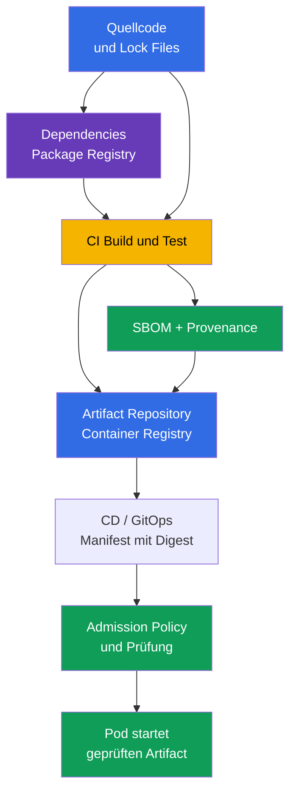
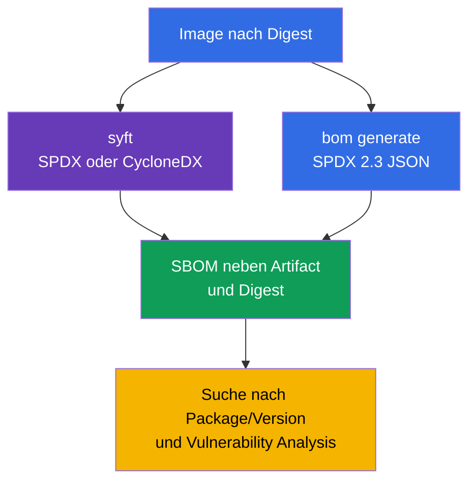
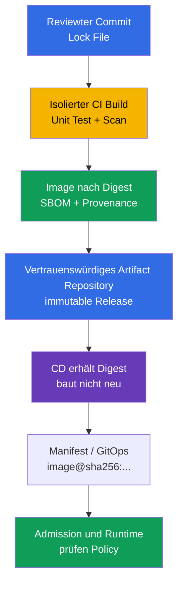
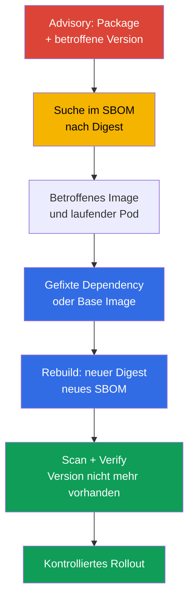

[Русская версия](ru.md) · [Eng version](README.md) · [Versión en español](es.md) · [Version française](fr.md) · [ქართული ვერსია](ge.md) · [繁體中文版](tw.md) · [日本語版](jp.md)

# Kapitel 25. Supply Chain verstehen: SBOM, CI/CD, Artifact Repositories

> **Problem.** Eine untergeschobene Dependency, ein kompromittiertes CI-Token oder ein geänderter Tag in der Registry können fremden Code unter einem vertrauten Image-Namen in einen Pod liefern. Ohne ein an den Digest gebundenes Inventar lässt sich nicht schnell feststellen, welche Komponenten in einen Artifact eingeflossen sind, wer ihn gebaut hat und aus welchem Ausgangszustand. Das lässt eine verwundbare Dependency oder einen bösartigen Build bis zum Start beim Konsumenten unbemerkt.

> **Was folgt.** In [Kapitel 24](../24/de.md) haben wir die Zusammensetzung des final Image reduziert und seine Version fixiert. Jetzt muss die folgende Frage beantwortet werden können: Welche Komponenten und Versionen sind noch in den ausgelieferten Artifact gelangt, von wem und wie wurde er gebaut. Das ist die Domäne **Supply Chain Security** von CKS (20 %). Eine Inventarisierung über SBOM macht eine verwundbare Komponente beobachtbar, und eine kontrollierte CI/CD- sowie Registry-Kette schafft eine Vertrauenskette bis zum Deployment.

> **Was Sie aus CKA wissen müssen.** Die Grundbegriffe Image, Layers, Dockerfile, Tag, Digest und Registry werden in [CKA-Kapitel 23](../../../cka/course/23/de.md) behandelt. Hier wird der Bau eines Containers nicht wiederholt: Das Image wird als Liefer-Artifact betrachtet, sein Inventar erstellt und der Weg vom Quellcode bis Kubernetes geprüft.

> 🧠 Die Chain of Trust verbindet Source, Dependencies, CI/CD, Registry und Admission: Die Kompromittierung eines beliebigen Übergangs kann einen fremden Artifact in einen `Pod` liefern.

## 25.1. Software Supply Chain und Vertrauenskette

**Software Supply Chain** - alle Menschen, Systeme, Quellen, Dependencies und Artifacts, die eine Anwendung durchläuft, bevor sie in einem Pod startet. Für einen Container-Workload ist das nicht nur Git und Dockerfile: In der Kette stecken die Dependency-Registry, der Build-Runner, CI/CD-Credentials, die Container-Registry, das Manifest-/GitOps-Repository, die Admission-Policy und das kubelet, das das Image herunterlädt.



Die Vertrauenskette ist nur so stark wie ihr schwächstes Glied. Hat CI eine untergeschobene Dependency erhalten, ein Image nicht von der richtigen Revision signiert oder hat CD einen mutable Tag deployt, kann eine spätere Prüfung in Kubernetes den ursprünglichen Artifact nicht zurückholen. Deshalb sind gleichzeitig wichtig: die Identifikation **was** läuft (Digest und SBOM), **woher** es stammt (Provenance) und **welche Aktionen** an jedem Übergang erlaubt sind.

Typische Angriffe auf die Supply Chain:

- Kompromittierung einer Dependency oder Veröffentlichung eines Pakets mit ähnlichem Namen (Typosquatting), wonach bösartiger Code durch den gewöhnlichen Package Manager installiert wird;
- Übernahme eines Maintainer-Accounts oder CI-Tokens und Veröffentlichung eines Image im Namen des Projekts;
- Änderung von Build Script, Runner, Cache oder Base Image, wodurch der Artifact nicht mehr dem reviewten Source entspricht;
- Vertauschen eines Tags in der Registry: `app:stable` zeigt plötzlich auf andere Bytes, obwohl sich das Kubernetes-Manifest nicht geändert hat;
- Zugriff eines Angreifers auf Registry- oder CD-Credentials und direktes Deployment unter Umgehung des Reviews;
- Leck eines Secrets aus einem CI-Log, der Environment oder einem Image-Layer, mit anschließender Nutzung dieses Credentials zum Signieren, Pushen oder Ändern eines Releases.

Ein Vorfall der Klasse SolarWinds zeigt das Prinzip: Der Angreifer muss nicht jeden Konsumenten einzeln hacken, wenn er eine Möglichkeit erhält, einen vertrauenswürdigen Build- oder Delivery-Schritt zu ändern. In Kubernetes kann das Ergebnis ein Pod mit korrektem Namen und Tag, aber mit fremdem Code sein.

Der jüngste [Trivy-Vorfall](https://github.com/aquasecurity/trivy/discussions/10462) zeigt denselben Vertrauens-Konzentrationspunkt. Laut dem Abschlussbericht des Projekts nutzte ein Angreifer am 27. Februar 2026 einen verwundbaren Workflow mit `pull_request_target`, erlangte Secrets auf Repository- und Organisationsebene und startete am 19. März mit dem gestohlenen Credential einen Release-Workflow und verteilte ein bösartiges Trivy `v0.69.4`. Das Grundproblem lag nicht im Scanner selbst, sondern in der privilegierten CI, die ungeprüften PR-Code ausführte und Zugriff auf übermäßige Secrets hatte; unzureichende Isolation der Service Accounts und eine ineffektive Rotation vergrößerten den Impact. Das bedeutet nicht, dass alle Nutzer von Trivy oder Kubernetes-Pods kompromittiert wurden, bestätigt aber die Lektion von SolarWinds: Ein einziger vertrauenswürdiger Build-/Release-Schritt mit weitreichenden Credentials verschafft dem Angreifer einen skalierbaren Weg zur Lieferung fremden Codes.

Man kann den Schutz nicht auf einen einzigen Scanner reduzieren. SBOM zeigt die Zusammensetzung, der Scanner gleicht sie mit bekannten CVEs ab, Signature/Provenance verknüpfen den Artifact mit dem Build-Prozess, und die Admission Policy lässt keinen Artifact zu, der den Regeln nicht entspricht. Diese Mechanismen ergänzen sich.

> 🧠 SBOM ist ein Inventar der Zusammensetzung eines konkreten Artifact, kein Scan Report und kein kryptografischer Beweis seiner Herkunft.

## 25.2. SBOM: Komponenteninventar und Formate SPDX 2.3 JSON/CycloneDX

**SBOM** (Software Bill of Materials) - eine maschinenlesbare Liste der Komponenten eines Artifact: Pakete, Bibliotheken, ihre Versionen, Identifikatoren, Lizenzen und manchmal Dependency-Beziehungen. Für ein Container-Image liest der Generator das Filesystem und die Package-Metadata der Layer; ein SBOM beantwortet vor allem die Frage „was wurde in diesem Artifact gefunden". Das ist kein Beweis für die Abwesenheit von CVEs und selbst kein kryptografischer Herkunftsnachweis.

Am weitesten verbreitet sind zwei offene Formate:

| Format | Zweck und Stärke | Wo häufiger anzutreffen |
|---|---|---|
| **SPDX 2.3 JSON** | Standard der Linux Foundation für Software-Zusammensetzung, Lizenzen, Pakete und Beziehungen; gut geeignet für Compliance und den Austausch von Inventaren | OCI Artifacts, Distributionen, CI und Kubernetes-Ecosystem |
| **CycloneDX** | Format des Open Worldwide Application Security Project (OWASP), ausgerichtet auf Component Analysis und Security Tooling; praktisch für Vulnerability Management | Scanner, Dependency Analysis, Security Dashboards |

Beide Formate können dasselbe Image beschreiben, doch ihre JSON-Felder unterscheiden sich. Alle SPDX-Beispiele unten beziehen sich auf **SPDX 2.3 JSON**: In diesem Schema befinden sich Pakete gewöhnlich unter `.packages`, und die Version unter `versionInfo`; in CycloneDX befinden sich Komponenten unter `.components`, und die Version unter `version`. Übertragen Sie diese Pfade nicht auf SPDX 3.0: Es hat ein anderes Datenmodell. Schreiben Sie keine universelle `jq`-Abfrage, ohne Format und Version der Datei zu kennen: Ein fehlendes Ergebnis kann einen falschen JSON-Pfad bedeuten, nicht das Fehlen des Pakets.

SBOM hat auch Grenzen der Genauigkeit:

- Nicht jedes Image hat eine Package-Datenbank; eine statische Binary kann Bibliotheken enthalten, aber kein gewohntes Package-Manager-Metadata haben;
- der Scanner kann eine Komponente heuristisch bestimmen, deshalb müssen Name oder Version anhand von Manifest und Lock File geprüft werden;
- SBOM spiegelt den Moment der Generierung wider. Nach einem Rebuild des Base Image oder einem Wechsel einer Dependency oder des Digest entsteht ein neues SBOM;
- ein einzelner Versions-String bedeutet noch keine Verwundbarkeit: Wichtig ist der Abgleich mit Vendor Advisory, OS-Distribution, Architektur und Fix-Status.

**Runtime-SBOM und die vollständige Build-Kette sind unterschiedliche Inventare.** Das SBOM des final Multi-Stage-Image beschreibt das, was zur Runtime gelangt ist; Dependencies aus verworfenen Builder-Stages fehlen darin folgerichtig. Selbst eine Analyse mit `--scope all-layers` erfasst die Layer des finalen Image, nicht alle verschwundenen Build-Stages. Für ein vollständiges Inventar der Supply Chain werden zusätzlich Source, Lock Files, Build Attestations und Provenance benötigt: Das Fehlen eines Pakets im finalen SBOM beweist nicht, dass es während des Build-Prozesses nicht vorhanden war.

Praktische Regel: Bewahren Sie das SBOM zusammen mit demjenigen Artifact und demjenigen immutable Digest auf, für den es erstellt wurde. Die Datei `api-1.4.2.spdx.json`, erstellt für `api:1.4.2`, ist unzureichend, wenn dieser Tag später umgeschrieben wurde; die Verbindung muss zu `@sha256:...` bestehen.

## 25.3. Generierung von SBOM: `syft` und `bom` aus dem Kubernetes-Ecosystem

Fixieren Sie vor der Generierung die Reference des Image. Ein Tag ist nur zum menschlichen Lesen praktisch; für Report, Prüfung und Production-Deployment nehmen Sie den Digest, den Ihre Registry zurückgegeben hat:

```bash
IMAGE='registry.example.com/payments/api:1.4.2@sha256:<64-hex-digest>'
```

Setzen Sie in ein Release keinen zufälligen Digest aus der Dokumentation ein. Holen Sie zuerst den Digest eines geprüften Image aus einer vertrauenswürdigen Registry und bewahren Sie ihn zusammen mit dem SBOM auf. Der Generator benötigt möglicherweise ein Registry-Credential für ein privates Image; das Passwort darf nicht in die Shell-History oder einen Commit gelangen.

> 🔬 `syft` generiert SBOM in mehreren Formaten.

### `syft`: SPDX 2.3 JSON und CycloneDX aus einem Image

[Syft](https://github.com/anchore/syft) katalogisiert Packages in einem Image, Directory oder Archive und kann mehrere Formate ausgeben. Die folgenden Befehle erstellen zwei unabhängige Dateien für dasselbe Image:

```bash
syft "$IMAGE" -o spdx-json > api.spdx.json
syft "$IMAGE" -o cyclonedx-json > api.cyclonedx.json
```

Wenn die Reference auf einen Multi-Arch-OCI-Index verweist, wählen Sie explizit die Platform. Erstellen und indizieren Sie für einen heterogenen Cluster ein separates SBOM für jedes tatsächlich genutzte Platform Manifest; bewahren Sie daneben die Platform und den Digest dieses Manifest auf, nicht nur den Digest des Index:

```bash
PLATFORM='linux/amd64'
syft "$IMAGE" --platform "$PLATFORM" -o spdx-json > api.linux-amd64.spdx.json
```

Äquivalente kurze Befehle, die sich für die Prüfung schnell einprägen lassen:

```bash
syft <image> -o spdx-json
syft <image> -o cyclonedx-json
```

Prüfen Sie, dass die Datei nicht leer und valides JSON ist, bevor Sie sie an einen Scanner weitergeben oder als Evidence speichern:

```bash
jq -e '
  .spdxVersion == "SPDX-2.3"
  and .SPDXID == "SPDXRef-DOCUMENT"
  and .dataLicense == "CC0-1.0"
  and (.documentNamespace | type == "string")
  and (.creationInfo.creators | type == "array")
  and (.packages | type == "array")
' api.spdx.json >/dev/null
jq -e '.bomFormat == "CycloneDX" and (.components | type == "array")' \
  api.cyclonedx.json >/dev/null
```

Die erste Abfrage ist ein **Sanity Check** für das erwartete SPDX 2.3 JSON, die zweite für CycloneDX JSON. Sie filtert einen leeren Output, einen HTML-Fehler der Registry und JSON eines anderen Formats aus, ist aber keine vollständige Schema-/Conformance-Validierung: Verwenden Sie dafür einen SPDX-Validator, der mit der benötigten Version der Specification kompatibel ist. Ein konkretes SBOM hat unter Umständen kein Feld, das für Ihre Generator-Version nicht verpflichtend ist; die Basisfelder des Dokuments, das Format und die Liste der Komponenten sollten Sie trotzdem explizit prüfen.

> 🎯 `kubernetes-sigs/bom` - der Kubernetes-orientierte Weg: SPDX JSON für ein vorgegebenes Image generieren, die Struktur prüfen und das Ergebnis speichern.

### `bom`: Kubernetes-orientierter Weg zu SPDX 2.3 JSON

[`bom`](https://github.com/kubernetes-sigs/bom) - ein Tool der Kubernetes SIGs für die Arbeit mit Software Bill of Materials. Das ist ein wichtiges praktisches Tool für CKS: Seine Dokumentation ist bei der Prüfung erlaubt, und in Lab 111 wird es zur Generierung von SPDX 2.3 JSON eingesetzt. In der aktuellen Umgebung schauen Sie zuerst die verfügbaren Flags an, statt die Syntax zu erraten:

```bash
bom generate --help
```

Für ein Image erstellt der Befehl aus dem Szenario der Laborarbeit eine SPDX-JSON-Datei:

```bash
bom generate --image "$IMAGE" --format json --output out.spdx.json
```

In der Kurzform verwenden manche Versionen von `bom` `-o`:

```bash
bom generate --image "$IMAGE" --format json -o sbom.spdx.json
```

`--format json` bedeutet in diesem Befehl die JSON-Repräsentation von SPDX, nicht CycloneDX. Benennen Sie die Datei nicht in `*.cyclonedx.json` um: Der Name muss das tatsächliche Format mitteilen, damit ein nachfolgendes `jq`, der Scanner und der Reviewer das richtige Schema wählen. Prüfen Sie die erhaltene Datei als SPDX und zählen Sie die gefundenen Packages:

```bash
jq -e '
  .spdxVersion == "SPDX-2.3"
  and .SPDXID == "SPDXRef-DOCUMENT"
  and .dataLicense == "CC0-1.0"
  and (.documentNamespace | type == "string")
  and (.creationInfo.creators | type == "array")
  and (.packages | type == "array")
' out.spdx.json >/dev/null
jq '.packages | length' out.spdx.json
```

Das ist ein Sanity Check, keine vollständige Schema-/Conformance-Validierung von SPDX.

Sieht `bom` das lokale Image nicht, geben Sie eine Reference an, die für die Runtime/Registry erreichbar ist, von der aus der Befehl ausgeführt wird, und prüfen Sie `bom generate --help` für die in der Umgebung installierte Version. Ersetzen Sie einen Zugriffsfehler nicht durch ein künstlich erstelltes JSON: Das verdeckt ein Problem mit Credentials oder einem falschen Artifact-Namen.



> 🎯 Finden Sie für ein vorgegebenes Image-Digest das exakte Package und seine Version im SBOM; eine Suche nur nach dem Namen beweist die Anwendbarkeit eines Advisory nicht.

## 25.4. Lesen des SBOM: Package und konkrete Version finden

Ein Prüfungs- und Production-Szenario beginnt gewöhnlich mit einem Advisory: Zum Beispiel ist bekannt, dass in einem der Images `ca-certificates-bundle` in einer bestimmten Version vorhanden ist. Man darf keine Schlussfolgerung nach Image-Name oder Tag ziehen. Man muss das Package **und seine Version** im SBOM eines konkreten Digest finden und das Ergebnis dann mit dem laufenden Workload abgleichen.

Zeigen Sie für SPDX 2.3 JSON, erstellt mit `bom` oder `syft`, Name und Version des exakten Package:

```bash
jq -r '
  .packages[]
  | select(.name == "ca-certificates-bundle")
  | [.name, .versionInfo, .SPDXID] | @tsv
' out.spdx.json
```

Existiert das Package tatsächlich, sehen Sie eine Zeile mit `name`, `versionInfo` und `SPDXID`. Ist der Output leer, ändern Sie das Deployment nicht blind. Prüfen Sie der Reihe nach: ob das richtige SBOM ausgewählt wurde, ob das Format korrekt ist, wie der Generator das Package benannt hat und ob es sich nicht in einem anderen Image/Sidecar befindet.

Die Suche nach einem Namensteil ist für die erste Untersuchung nützlich, kann aber mehrere Pakete zurückgeben und eignet sich nicht als endgültige Versionsprüfung:

```bash
jq -r '
  .packages[]
  | select(.name | test("ca-certificates"; "i"))
  | [.name, (.versionInfo // "<kein versionInfo>")] | @tsv
' out.spdx.json
```

Für CycloneDX JSON ändern sich Pfad und Feldname:

```bash
jq -r '
  .components[]
  | select(.name == "ca-certificates-bundle")
  | [.name, .version, (.purl // "<kein purl>")] | @tsv
' api.cyclonedx.json
```

`purl` (Package URL) hilft, Packages mit gleichem Namen aus verschiedenen Ecosystems zu unterscheiden. Halten Sie bei einer echten Untersuchung im Ticket fest: Image-Digest, Name/Version des Package, SBOM-Dateiname und Advisory/CVE. Dann kann ein anderer Ingenieur das Ergebnis reproduzieren, statt „ungefähr so ein Paket" in einem anderen Rebuild zu suchen.

Nach dem Finden der Komponente verknüpfen Sie das SBOM mit dem Cluster. Die Image References, die die Pods tatsächlich verwenden, lassen sich so anzeigen:

```bash
kubectl get pods -A \
  -o jsonpath='{range .items[*]}{.metadata.namespace}{"\t"}{.metadata.name}{"\t"}{range .spec.containers[*]}{.image}{"\n"}{end}{end}'
```

Diese Ausgabe zeigt die deklarierte Image-Reference. `status.containerStatuses[].imageID` ist als runtime-spezifischer Nachweis dessen nützlich, was der Node über den laufenden Container mitgeteilt hat, ist aber kein übertragbarer Registry-Digest und nicht zwangsläufig der Digest des OCI-Index oder Platform Manifest. Verwenden Sie für starke Incident Evidence den digest-gepinnten `spec.containers[].image`, bestimmen Sie die Architektur des Node, lösen Sie Registry/Index bis zum entsprechenden Platform Manifest auf und gleichen Sie das SBOM damit ab. Prüfen Sie bei Zugriff auf den Node zusätzlich das Runtime-Inventar:

```bash
kubectl get pod <pod> -n <namespace> \
  -o jsonpath='{range .status.containerStatuses[*]}{.name}{"\t"}{.imageID}{"\n"}{end}'
kubectl get node <node> -o jsonpath='{.metadata.labels.kubernetes\.io/arch}{"\n"}'
crictl images --digests
```

Ein typischer Fehler ist, das gesamte Deployment zu löschen, sobald eine Übereinstimmung des Package-Namens im SBOM gesehen wird. Bestimmen Sie zuerst den betroffenen Container und dessen Image-Digest, bereiten Sie ein gefixtes Image vor, wiederholen Sie Build, SBOM und Scan, und ersetzen Sie das Image dann durch ein gewöhnliches kontrolliertes Rollout. Das Löschen eines Workload kann den Service unterbrechen und beseitigt den verwundbaren Artifact in der Registry nicht.

> 🏭 Eine zuverlässige Lieferung fixiert den Digest von Release/Index, dann den Ziel-Platform-Manifest-Digest und verknüpft SBOM, Provenance und Scan Report damit; CI veröffentlicht den Artifact, und CD befördert ihn, ohne erneut zu bauen.

## 25.5. CI/CD, Artifact Repositories, Provenance und SLSA

**CI** baut, testet, scannt und veröffentlicht den Artifact; **CD** befördert einen bereits vorbereiteten Artifact zwischen Umgebungen oder wendet Manifest im Cluster an. Ohne eine Grenze zwischen beiden kann sich CI unbemerkt in eine privilegierte Deploy Shell verwandeln. Eine sinnvolle Rollentrennung: CI hat ein begrenztes Recht, in ein Staging Repository zu publizieren, CD erhält einen fertigen Digest und befördert nur einen genehmigten immutable Artifact.

**Artifact Repository** speichert Build-Ergebnisse: OCI Images in der Container Registry, Packages, Charts, SBOM, Attestations und Provenance. Die Registry ist nicht nur ein Cache von Docker Hub: Sie muss eine vertrauenswürdige Quelle für Releases sein, immutable Digests speichern, Push/Pull einschränken und nach Möglichkeit das Überschreiben eines Release-Tags verbieten. Beispiele für Implementierungen sind Harbor, Amazon ECR, Google Artifact Registry, Azure Container Registry, GitHub Container Registry oder eine interne OCI-Registry. Das konkrete Produkt ist zweitrangig; wichtig sind Zugriffskontrolle, Retention, Audit und Unveränderlichkeit der Release Artifacts.



**Provenance** - Metadata über die Herkunft eines Artifact: welche Source Revision, Build Definition, welcher Builder und welche Input-Materialien am Build beteiligt waren. Im Gegensatz zu SBOM listet Provenance nicht alle Bibliotheken auf; sie verknüpft den Output mit einem kontrollierten Build-Prozess. Unterscheiden Sie für eine starke Kette den Digest von Release/Index und den Digest des gewählten Platform Manifest: SBOM, Scan und Provenance müssen an denjenigen Artifact gebunden sein, der tatsächlich geprüft oder gestartet wird.

> 🔬 Die Verbindung von SBOM, Provenance und Signatur mit dem Digest im SLSA-Modell.

[SLSA](https://slsa.dev/) (Supply-chain Levels for Software Artifacts) teilt in Version 1.2 die Anforderungen in unabhängige Tracks auf. Deshalb gibt es bei SLSA keine einheitliche Skala „einfach bis hoch": Der Build Track beschreibt Garantien für Build und Provenance, und der Source Track hat eigene Anforderungen an die Source.

| Track | Level SLSA v1.2 | Praktische Bedeutung |
|---|---|---|
| Build | L0 | Keine SLSA-Garantien. |
| Build | L1 | Provenance existiert. |
| Build | L2 | Eine signierte Provenance wird von einer gehosteten Build-Platform erstellt. |
| Build | L3 | Eine gehärtete Build-Platform wird verwendet. |
| Source | L1-L4 | Separate Levels von Anforderungen an die Source; sie lassen sich nicht aus dem Level des Build Track ableiten. |

Prüfen Sie für die Anforderungen jedes Levels die Spezifikationen des [Build Track](https://slsa.dev/spec/v1.2/build-track-basics) und des [Source Track](https://slsa.dev/spec/v1.2/source-requirements), nicht eine autorenspezifische vierstufige Skala. Erklären Sie ein Projekt nicht als „SLSA Level N" nur deshalb, weil es ein SBOM generiert: Anzugeben sind Track, Version der Specification und Nachweise für die Erfüllung der entsprechenden Anforderungen.

BuildKit kann SBOM/Provenance-Attestations zusammen mit dem Image/Index erstellen und veröffentlichen:

```bash
IMAGE_TAG='registry.example.com/payments/api:1.4.2'
docker buildx build --sbom=true --provenance=mode=max,version=v1 --push \
  --tag "$IMAGE_TAG" .
```

`version=v1` fixiert hier explizit das erwartete Format: Im aktuellen Upstream-BuildKit ist SLSA Provenance `v1` der Default; ältere Versionen von BuildKit/Buildx konnten `v0.2` ausgeben. Prüfen Sie deshalb bei diesem Parameter `Statement/v1` mit `https://slsa.dev/provenance/v1`. Bewahren Sie nach dem Push den immutable Digest auf und bestimmen Sie für ein Multi-Arch-Release das Platform Manifest, das gestartet wird. Diese Build-nativen Attestations sind nützlich, um den Output mit dem Build zu verknüpfen, heben aber die separate Prüfung von Signature, dem SBOM des finalen Image und dem Inventar der gesamten Kette anhand von Source/Lock Files nicht auf.

In der Praxis sehen Verbesserungen so aus:

- Dependencies locken und Änderungen der Build Definition reviewen;
- den Release-Build in einem ephemeral/isolierten Runner ausführen, nicht auf einer gemeinsamen Arbeitsmaschine;
- CI ein short-lived Credential mit minimalen Rechten geben und das Recht zu publizieren vom Recht zu deployen trennen;
- Image, SBOM und Provenance atomar veröffentlichen, alles an den immutable Digest gebunden;
- Protected Branches, Required Review und Audit Log von Registry/CI verwenden;
- in CD den Digest deployen, keinen erneuten Build aus einer anderen Environment ausführen.

Für einen OCI-Index ist das nicht ein universeller Digest, sondern eine Kette: `Digest von Release/Index → Digest des Platform Manifest → SBOM/Provenance/Scan Evidence`. Wählen Sie zuerst die Ziel-Platform, lösen Sie den Index bis zu deren Manifest auf und finden Sie die dazugehörige Attestation; prüfen Sie dann das in-toto `subject.digest`. Docker speichert das Attestation Manifest beim Root-Index, doch sein `subject` muss auf das Ziel-Platform-Manifest zeigen (oder ein Objekt darin). Für ein Single-Platform-Image-Release können Digest des Release und Digest des Platform Manifest übereinstimmen, das darf aber nicht vorausgesetzt werden.

Eine minimale SLSA-/in-toto-Provenance ist ein Statement mit einem `subject`, der an das entsprechende Platform Manifest gebunden ist. Die Struktur kann zum Beispiel so aussehen:

```json
{
  "_type": "https://in-toto.io/Statement/v1",
  "subject": [{
    "name": "registry.example.com/payments/api",
    "digest": {"sha256": "<64-hex-platform-manifest-digest>"}
  }],
  "predicateType": "https://slsa.dev/provenance/v1",
  "predicate": {
    "buildDefinition": {
      "buildType": "https://ci.example.com/buildtypes/release/v1",
      "externalParameters": {}, "resolvedDependencies": []
    },
    "runDetails": {"builder": {"id": "https://ci.example.com/builders/release"}}
  }
}
```

Lösen Sie vor der Verwendung der Provenance zuerst das vertrauenswürdige Release/Index bis zum Ziel-Platform-Manifest auf und vergleichen Sie dann dessen `subject.digest.sha256` mit dem Digest genau dieses Manifest. Das lässt sich prüfen, ohne einen Tag zu erraten:

```bash
PLATFORM_MANIFEST_DIGEST='sha256:<64-hex-platform-manifest-digest>'
jq -e --arg digest "${PLATFORM_MANIFEST_DIGEST#sha256:}" \
  '.subject[] | select(.digest.sha256 == $digest)' provenance.intoto.json >/dev/null
```

Ein erfolgreiches `jq` beweist die Bindung des Statement an das erwartete Platform Manifest, aber nicht die Authentizität des Statement selbst. Die Signatur eines Artifact und die kryptografische Prüfung mit `cosign verify` behandelt ausführlich [Kapitel 26](../26/de.md); SBOM ersetzt diese Prüfung nicht.

> 🎯 Verwenden Sie SBOM, um das betroffene Package/die Version in einem konkreten Digest zu bestätigen, ersetzen Sie dann den Artifact und prüfen Sie, dass die verwundbare Komponente verschwunden ist.

## 25.6. SBOM bei der Suche nach verwundbaren Komponenten

Erscheint eine CVE oder ein Vendor Advisory, verkürzt SBOM die Incident-Frage von „welche unserer tausenden Images sind betroffen?" zu „welche Digests enthalten das betroffene Package/die Version?". Das wird auch für die **späte Entdeckung** benötigt: Zur Build-Zeit konnte der Scanner das Problem möglicherweise nicht finden, weil die CVE oder Informationen über betroffene Versionen noch nicht veröffentlicht waren. Das Scan-Ergebnis spiegelt die Wissensbasis zum Prüfzeitpunkt wider und garantiert nicht die Abwesenheit künftiger Advisories in einem bereits laufenden Image.

Deshalb sollte man außerhalb der Build Pipeline **regelmäßig gespeicherte SBOMs erneut mit der aktualisierten CVE-Datenbank abgleichen**: planmäßig und außerplanmäßig bei Veröffentlichung einer neuen bedeutsamen CVE oder eines Vendor Advisory. Eine solche Prüfung baut den Artifact nicht neu: Sie bewertet denselben immutable Digest anhand aktueller Daten und sollte eine Triage betroffener Releases auslösen.

Arbeitszyklus:

1. die exakten Bedingungen des Advisory ermitteln: Package, Ecosystem/Distribution, betroffene Versionen und Fixed Version;
2. das Package/die Version in den gespeicherten SBOMs jedes Kandidaten-Release-Digest finden, ohne sich auf den Tag zu verlassen; das Ergebnis ist eine Liste betroffener Digests;
3. die betroffenen Digests mit dem Runtime-Inventar abgleichen: `spec.containers[].image` zeigt die deklarierte Reference; `status.containerStatuses[].imageID` ist ein runtime-spezifischer Hinweis, kein übertragbarer Registry-/Platform-Manifest-Digest. Für Multi-Arch die Architektur des Node, das Platform Manifest und das damit verknüpfte SBOM abgleichen;
4. betroffene Digests in laufende Workloads, nur in der Registry verfügbare und bereits außer Betrieb genommene aufteilen; zuerst laufende Workloads mit hohem Business-/Risk-Impact beseitigen, dann die übrigen Releases;
5. einen gefixten Artifact bauen oder auswählen, ein neues SBOM generieren und prüfen, dass die betroffene Version verschwunden oder ersetzt ist;
6. scannen, signieren/prüfen und erst dann den Digest über CD befördern;
7. SBOM, Scan-Ergebnis und Rollout als Evidence für Incident Response und Audit aufbewahren.

Bewahren Sie für eine schnelle Response einen Index `Digest → SBOM → Scan-Zeitstempel → Environment/Workload` auf. Dann löst eine neue CVE eine Abfrage im Inventar aus, statt einen erneuten manuellen Scan aller Images: Zuerst werden potenziell betroffene Release-/Platform-Manifest-Digests anhand des SBOM bestimmt, dann wird der laufende Workload über die digest-gepinnte Spec, den Platform-Node und die Runtime-`imageID` als zusätzlichen Hinweis bestätigt. Ein Tag allein genügt nicht: Er kann mutable sein und beweist nicht, welche Bytes der bereits laufende Pod verwendet.



SBOM ersetzt keinen Vulnerability Scanner. Es liefert das Inventar, der Scanner ergänzt die CVE-Datenbank, Abgleichsregeln und Severity. In [Kapitel 28](../28/de.md) wenden wir Trivy und Grype auf ein Image und ein fertiges SBOM an. Bis dahin ist es nützlich, ein Package/eine Version manuell über `jq` nachweisen zu können: Das diagnostiziert das Format, die Scanner-Daten und Automatisierungsfehler.

**VEX** (Vulnerability Exploitability eXchange) ergänzt dieses Modell: SBOM beantwortet, was in einen Artifact eingeht, Scanner oder Advisory gleichen die Komponente mit einer CVE ab, und VEX hält den bestätigten Status der Anwendbarkeit oder Ausnutzbarkeit einer konkreten Verwundbarkeit für ein gegebenes Produkt fest. Das Vorhandensein eines Package/Version und einer CVE bedeutet noch nicht, dass die Verwundbarkeit anwendbar oder ausnutzbar ist; VEX hebt die Prüfung und den Fix nicht auf, sondern macht die Entscheidung nachprüfbar.

Verwechseln Sie außerdem „nicht im SBOM gefunden" nicht mit „sicher". Gründe für das Fehlen können ein unvollständiger Detector, statisches Linking, ein falsches Image, ein veraltetes SBOM oder ein Package unter anderem Namen sein. Ergänzen Sie die Suche bei einem kritischen Incident durch Lock File, Source Repository, Release Notes des Base Image und die Runtime Image ID.

> 🎯 Das praktische Ergebnis ist ein valides SPDX JSON und ein reproduzierbares Auffinden von Package/Version für das Image aus der Aufgabe, nicht nur ein erfolgreich ausgeführter Befehl.

## 25.7. Verifikation: SBOM über `bom` und Suche nach vorgegebenem Package/Version

In Lab 111 prüfen wir das vollständige Minimum, das für eine CKS-Aufgabe benötigt wird: SBOM über `bom` generieren, sicherstellen, dass es sich um ein valides SPDX 2.3 JSON handelt, und darin das vorgegebene Package/die Version finden. Arbeiten Sie mit dem von der Laborarbeit bereitgestellten Training Image oder Ihrem eigenen erlaubten Image; verwenden Sie nicht das mutable `latest` als Evidence.

```bash
IMAGE='<image-from-lab-or-registry>@sha256:<64-hex-digest>'

# 1. SPDX 2.3 JSON mit Kubernetes SIGs bom erstellen.
bom generate --image "$IMAGE" --format json --output out.spdx.json

# 2. SPDX 2.3 Sanity Check durchführen und sicherstellen, dass packages nicht leer ist.
jq -e '
  .spdxVersion == "SPDX-2.3"
  and .SPDXID == "SPDXRef-DOCUMENT"
  and .dataLicense == "CC0-1.0"
  and (.documentNamespace | type == "string")
  and (.creationInfo.creators | type == "array")
  and (.packages | type == "array")
  and (.packages | length > 0)
' out.spdx.json >/dev/null

# 3. Das vorgegebene Package und seine Version finden.
jq -r '
  .packages[]
  | select(.name == "ca-certificates-bundle")
  | [.name, .versionInfo, .SPDXID] | @tsv
' out.spdx.json
```

Wenn die Lab ein anderes Paar `Package/Version` vorgibt, ändern Sie nur den Value in `select`, nicht das Prüfschema selbst. Gleichen Sie die erhaltene Version mit der Bedingung ab: Eine Suche nach dem Package ohne Versionsvergleich beweist nicht, dass genau die verwundbare Komponente gefunden wurde.

Für eine zusätzliche Cross-Check der Generierung desselben Image mit Syft:

```bash
syft "$IMAGE" -o spdx-json > syft.spdx.json
jq -e '
  .spdxVersion == "SPDX-2.3"
  and .SPDXID == "SPDXRef-DOCUMENT"
  and .dataLicense == "CC0-1.0"
  and (.documentNamespace | type == "string")
  and (.creationInfo.creators | type == "array")
  and (.packages | type == "array")
' syft.spdx.json >/dev/null
```

Das ist ein Sanity Check, keine vollständige Schema-/Conformance-Validierung von SPDX.

### Diagnose typischer Fehler

| Symptom | Wahrscheinliche Ursache | Was zu prüfen ist |
|---|---|---|
| `bom` oder `syft` kann das Image nicht herunterladen | private Registry, falsche Reference oder Netzwerk | Registry-Login/Credential, Repository, Tag/Digest, Zugriff des Runners auf die Registry |
| `jq` meldet einen Parse Error | Output ist kein JSON, Datei ist leer oder enthält einen Fehler | Dateigröße, stderr des Befehls, erste Zeilen der Datei; SBOM erneut generieren |
| `jq` findet das Package nicht | anderer Name, anderes JSON-Format, anderer Image-Digest oder fehlende Metadata | `.packages[].name`, `.components[].name`, Digest, Package-Manager-Datenbank |
| Package gefunden, aber Version stimmt nicht überein | Image aus anderem Base/Dependency gebaut oder Advisory auf eine andere Distribution angewendet | `versionInfo`, purl, Base Image, Lock File und Bedingungen des Advisory |
| SBOM vorhanden, aber Deployment weiterhin verwundbar | CD hat Tag/alten Digest angewendet oder Rollout ist nicht abgeschlossen | Manifest `image:`, Pod `imageID`, Rollout-Status und Registry-Digest |

Kriterium für die Bereitschaft der Prüfung: Es gibt ein nicht-leeres SPDX 2.3 JSON, das den Sanity Check besteht (für vollständige Conformance ein separater SPDX-Validator), darin ist das Package/die Version für einen konkreten Platform-Manifest-Digest festgehalten, und die Befehle sowie Dateien lassen sich an einen anderen Ingenieur zur Wiederholung des Ergebnisses weitergeben.

> 🏭 Automatisieren Sie die Erstellung und Aufbewahrung von SBOM, Provenance und Scan Evidence für jeden Release Digest; ein manuell erstellter Report nach einem Vorfall ersetzt diesen Prozess nicht.

## 25.8. Wie das in Production angewendet wird

- **SBOM wird beim Release Build erstellt.** Die Generierung geschieht automatisch in CI für jeden publizierbaren Digest, nicht manuell nach einem Vorfall. SBOM kann eine eigenständige SPDX-/CycloneDX-Datei oder ein OCI Artifact/Referrer sein, verknüpft mit dem Image-Digest. Eine signierte Attestation ist eine separate Aussage über ein `subject` mit einem Predicate: Sie kann ein SBOM oder eine Provenance tragen, aber nicht jedes SBOM ist eine Attestation. Praktisches Modell: `Image-Digest <- OCI SBOM Artifact/Referrer` und `Image-Digest <- signierte Attestation (predicate=SBOM/Provenance)`. Die Retention dieser Daten sollte nicht kürzer sein als das Release selbst.
- **Digest - eine Kette von Release-Identifikatoren.** Für Multi-Arch wird zuerst der Digest von Release/Index fixiert, dann der gewählte Platform-Manifest-Digest; SBOM, Scan Report, Provenance und Change Record werden mit der zutreffenden Ebene dieser Kette verknüpft. Der Release Tag kann für Menschen bleiben, ersetzt aber keinen Nachweis über den Inhalt.
- **Registry - eine kontrollierte Grenze.** Push-Rechte sind nach Projekten getrennt, Release Tags sind vor Überschreiben geschützt, Audit Logs, Replication und Cleanup Policy sind aktiviert. Eine Workstation veröffentlicht kein Production-Image direkt.
- **CI ist minimal privilegiert.** Ephemeral Runner, short-lived Tokens, gescopte Secrets, Protected Branches und Review der Build Definition verringern die Wahrscheinlichkeit einer Unterschiebung oder eines Lecks.
- **Vulnerability Management ist geschlossen.** Ein Advisory führt zu einer SBOM-Abfrage, dann zu einem gefixten Digest, neuem SBOM, Scan, Prüfung und Rollout. Ausnahmen haben einen Owner, eine Frist und Evidence, statt endlos in einer Ignore List zu leben.
- **Die Prüfung der Herkunft ist obligatorisch.** Vor CD wird die Kette Release/Index → Ziel-Platform-Manifest → Attestation `subject` und Signature geprüft; die Admission Policy im Cluster wird zur letzten Grenze, nicht zum einzigen Ort der Kontrolle. Signatur und ihre Durchsetzung sind das Thema des nächsten Kapitels.

## 25.9. Mini-Glossar

- **Software Supply Chain** - der Weg von Source, Dependencies, Build Systems und Artifacts bis zum laufenden Workload.
- **Artifact** - das Ergebnis eines Build, zum Beispiel ein OCI Image, SBOM, Chart oder Provenance.
- **Artifact Repository** - ein kontrolliertes Ablageort für Artifacts: Registry, Package- oder Chart-Repository.
- **SBOM** - ein maschinenlesbares Inventar von Komponenten und Versionen eines Software Artifact.
- **SPDX 2.3 JSON** - die in diesem Kapitel verwendete JSON-Repräsentation des SPDX-Standards für Packages, Lizenzen und ihre Beziehungen; sein JSON-Modell sollte nicht mit SPDX 3.0 vermischt werden.
- **CycloneDX** - ein OWASP-Format für Component-Inventar und Security-Analyse.
- **Syft** - ein Tool zur SBOM-Generierung aus Image, Filesystem oder Archive.
- **bom** - das Tool `kubernetes-sigs/bom` zur Generierung und Arbeit mit SPDX-SBOM.
- **Provenance** - Metadata über Source, Inputs, den Builder und den Erstellungsprozess eines Artifact.
- **SLSA** - ein Modell von Anforderungen zum Schutz der Supply Chain mit separaten Build- und Source-Tracks.
- **VEX** - eine Aussage über die Anwendbarkeit oder Ausnutzbarkeit einer konkreten CVE für ein Produkt.
- **Digest** - ein unveränderlicher Content-Identifier eines Image, gewöhnlich `sha256`.
- **purl** - Package URL, ein Identifier eines Package mit Ecosystem und Version.

## 25.10. Zusammenfassung des Kapitels

- Die Software Supply Chain umfasst Source, Dependencies, CI/CD, Registry, Metadata und Deployment; die Kompromittierung eines vertrauenswürdigen Schritts kann einen bösartigen Artifact in viele Cluster liefern.
- SBOM ist das Inventar der Komponenten eines Artifact. SPDX und CycloneDX beschreiben denselben Gegenstand mit unterschiedlichen JSON-Schemas; SBOM ist weder ein Scan Report noch ein Herkunftsnachweis.
- `syft` generiert SPDX 2.3 JSON und CycloneDX JSON; `bom` aus dem Kubernetes-Ecosystem generiert SPDX 2.3 JSON mit dem Befehl `bom generate --image ... --format json --output ...`.
- Die Suche nach einer verwundbaren Komponente erfordert Package, exakte Version und Image-Digest. Für SPDX sind das gewöhnlich `.packages[].name` und `.versionInfo`, für CycloneDX `.components[].name` und `.version`.
- CI muss Image, SBOM und Provenance mit einer nachprüfbaren Digest-Kette veröffentlichen, und CD muss den gewählten Digest aus einem vertrauenswürdigen Artifact Repository ohne erneuten Build befördern.
- SLSA v1.2 trennt Build Track (L0-L3) und Source Track (L1-L4); die Generierung eines SBOM beweist allein noch nicht die Erfüllung der Anforderungen eines der beiden Tracks.
- Nach einer CVE sieht der Zyklus so aus: SBOM abfragen → laufenden Digest bestätigen → gefixter Rebuild → neues SBOM/Scan/Verify → kontrolliertes Rollout.

## 25.11. Nutzen auf der Prüfung und in der Praxis

**Auf der Prüfung.** Schnell `bom generate --image ... --format json` ausführen können, SPDX 2.3 JSON prüfen und Package/Version finden - das ist die praktische Fähigkeit aus Lab 111 und ein typisches Mock-Szenario. Verwechseln Sie nicht das Format von Syft, den JSON-Feldnamen und den Image-Tag mit dem Digest. Bei Bedarf ist die Dokumentation von `kubernetes-sigs/bom` erlaubt: Prüfen Sie zuerst `--help`, speichern Sie dann den benötigten Artifact und zeigen Sie das Suchergebnis.

**In der Praxis.** SBOM verkürzt die Reaktionszeit auf CVEs, doch der Wert entsteht nur bei Release-Disziplin: bekannter Digest, kontrollierte Registry, aufbewahrte Provenance und Scan Evidence. Das erlaubt es, nicht zu sagen „wir denken, das Image ist gefixt", sondern „im Cluster läuft dieser Digest; sein SBOM enthält die betroffene Version nicht; er wurde von einer genehmigten Pipeline gebaut und geprüft".

## 25.12. Fragen zur Selbstkontrolle

<details>
<summary>1. Welche Beteiligten gehören zur Supply Chain eines Container-Workload vom Commit bis zum Pod, und wo kann eine Unterschiebung des Artifact stattfinden?</summary>

In die Kette gehören Source und Lock Files, Package Registry, CI-Runner, Container Registry, CD/GitOps, Admission Policy und das kubelet, das das Image herunterlädt. Eine Unterschiebung ist zum Beispiel bei einer Dependency, einem Build Script oder Runner, dem Base Image, einem Registry-Tag oder einem CI/CD-Credential möglich. Deshalb werden gleichzeitig Digest/SBOM, Provenance und die Kontrolle der Zulassung des Artifact benötigt.
</details>

<details>
<summary>2. Wodurch unterscheidet sich SBOM von einem Vulnerability Scan Report, einer Signature und Provenance?</summary>

SBOM ist ein Inventar der Komponenten und Versionen eines konkreten Artifact, keine Aussage über CVEs. Der Scanner gleicht diese Zusammensetzung mit einer Vulnerability-Datenbank und Severity ab, die Signature prüft kryptografisch den vertrauenswürdigen Signierenden, und Provenance beschreibt Source Revision, Builder und Build-Inputs. Für Multi-Arch müssen diese Artifacts mit der korrekten Kette von Index und Platform Manifest verknüpft sein.
</details>

<details>
<summary>3. Warum kann ein SBOM für `app:1.4.2` ohne Digest kein Beweis für die Zusammensetzung des laufenden Image sein?</summary>

Der Tag ist veränderlich: `app:1.4.2` kann nach der SBOM-Generierung auf andere Bytes umgehängt werden. Der Nachweis der Zusammensetzung wird an das immutable `@sha256:...` gebunden; für Multi-Arch wird zusätzlich das gewählte Platform Manifest und Runtime Evidence fixiert. Andernfalls kann sich das SBOM auf ein früheres Manifest beziehen, während der Pod bereits ein anderes Image nutzt.
</details>

<details>
<summary>4. Welche JSON Paths werden für Package/Version in SPDX und CycloneDX verwendet?</summary>

In SPDX 2.3 JSON werden Komponenten unter `.packages` gesucht, die Version unter `.versionInfo`, zum Beispiel bei einem Element von `.packages[]`. In CycloneDX werden `.components[]` und das Feld `.version` verwendet; zur Unterscheidung von Ecosystems ist zusätzlich `.purl` nützlich. Diese Pfade dürfen nicht mechanisch auf ein anderes Format oder SPDX 3.0 übertragen werden.
</details>

<details>
<summary>5. Wie generiert man SPDX 2.3 JSON mit `syft` und mit `kubernetes-sigs/bom`?</summary>

Für Syft verwendet man `syft "$IMAGE" -o spdx-json > api.spdx.json`. Für Kubernetes SIGs bom - `bom generate --image "$IMAGE" --format json --output out.spdx.json`; hier bedeutet JSON SPDX, nicht CycloneDX. Danach führt man einen Sanity Check des erwarteten SPDX 2.3 durch: geprüft werden `.spdxVersion == "SPDX-2.3"` und das Array `.packages` (in der Hauptprozedur werden zusätzlich Identifier und Metadata des Dokuments geprüft). Eine vollständige Schema-/Conformance-Validierung erfordert einen separaten SPDX-Validator.
</details>

<details>
<summary>6. Warum genügt eine Suche nur nach dem Namen `ca-certificates-bundle` nicht für eine Entscheidung zu einer CVE?</summary>

Eine Entscheidung über ein Advisory erfordert das exakte Package, seine Version, Ecosystem/Distribution und die Bedingungen der Fixed Version, und der Name kann in mehreren Varianten vorkommen. Nötig ist die Suche nach dem Namen zusammen mit `versionInfo` und die Bindung des SBOM an den Image-Digest. Anschließend wird das Ergebnis mit dem Advisory und der Runtime-imageID abgeglichen, statt den Workload nur aufgrund einer Namensübereinstimmung zu löschen.
</details>

<details>
<summary>7. Wie erhält man die `imageID` eines Containers, und wie verwendet man sie als Runtime Evidence?</summary>

Sie wird aus dem Status des Pod ausgegeben: `kubectl get pod <pod> -n <namespace> -o jsonpath='{range .status.containerStatuses[*]}{.name}{"\t"}{.imageID}{"\n"}{end}'`. `imageID` ist ein runtime-spezifischer Hinweis, kein übertragbarer Registry-/Index-/Platform-Manifest-Digest, deshalb wird sie nicht direkt mit dem Digest des SBOM verglichen. Für einen starken Abgleich werden der digest-gepinnte `spec.containers[].image`, die Architektur des Node und die Auflösung von Registry/Index bis zum Ziel-Platform-Manifest herangezogen; bei Zugriff auf den Node wird zusätzlich `crictl images --digests` abgeglichen. Der Tag in der Spec allein garantiert das nicht.
</details>

<details>
<summary>8. Warum sollte CI nur ein Image bauen und CD es nicht unbemerkt in einer anderen Environment neu bauen?</summary>

CD soll einen bereits geprüften immutable Digest befördern, keinen neuen Artifact mit abweichenden Inputs, Builder oder Dependencies erstellen. Sonst beziehen sich SBOM, Scan und Provenance von CI auf dieselben Bytes, während Production andere erhalten könnte. Die Trennung von Publish (CI) und Deploy (CD) macht diese Kette nachprüfbar.
</details>

<details>
<summary>9. Welchen Sinn gibt SLSA der Provenance und dem isolierten Builder?</summary>

In SLSA verknüpft die Provenance den Output mit Build Definition, Source und Builder. Für Multi-Arch wird zuerst der Digest von Release/Index bis zum Ziel-Platform-Manifest aufgelöst und dessen `subject.digest` mit dem Digest dieses Manifest (oder eines zulässigen Objekts darin) abgeglichen; eine Übereinstimmung mit dem Root-Index wird nicht vorausgesetzt. Im Build Track verlangt L1 das Vorhandensein von Provenance, L2 eine signierte Provenance von einer gehosteten Build-Platform, und L3 eine gehärtete Build-Platform. Ein isolierter Builder verringert das Risiko einer Unterschiebung der gemeinsamen Arbeitsumgebung, das Level muss aber mit Angabe des Track und der Nachweise deklariert werden.
</details>

<details>
<summary>10. Welche Prüfungen müssen zwischen der gefixten Dependency und dem Production Rollout stattfinden?</summary>

Nach der Aktualisierung einer Dependency oder des Base Image wird ein neuer Digest und ein neues SBOM erstellt, dann wird sichergestellt, dass die betroffene Version verschwunden oder ersetzt ist. Der neue Artifact wird gescannt, geprüft/signiert und erst dann über ein kontrolliertes CD-Rollout befördert. Die Evidence umfasst SBOM, Scan, den geprüften Digest und das Ergebnis des Rollout.
</details>

<details>
<summary>11. **Flashback (Kapitel 32).** SBOM/Provenance (dieses Kapitel) beantworten die Frage "woraus besteht dieser Artifact und wie wurde er gebaut". Das Kubernetes Audit Log (Kapitel 32) beantwortet die Frage "wer hat wann mit dem API Server interagiert". Wenn die vollständige Kette "wer hat genau dieses Image mit diesem SBOM zu diesem Zeitpunkt deployt" bewiesen werden muss - für welche der beiden Quellen genügt die Evidence allein nicht, und wie schließt ihre gemeinsame Nutzung das, was jede einzeln nicht schließt?</summary>

Allein SBOM/Provenance genügt nicht: Sie beweisen die Zusammensetzung und den Build-Prozess eines Digest, aber keine API-Aktion des Deployment. Allein das Audit Log genügt ebenfalls nicht: Es zeigt Identity, Zeitpunkt und API-Objekt, aber nicht die Zusammensetzung des Image und die Verlässlichkeit seines Builds. Der Abgleich des Image-Digest aus Manifest/Audit mit dem Digest, an den SBOM und Provenance gebunden sind, verknüpft den Urheber des Deploy mit einem konkreten nachprüfbaren Artifact.
</details>

## Praxis

🧪 Lab 111 (SBOM über `bom` und `syft`, Suche nach Package/Version, Scanning und Supply-Chain-Artifacts): [tasks/cks/labs/111](../../labs/111/README_DE.MD)

Wiederholen Sie für die Grundlagen von Image, Dockerfile, Registry, Tag und Digest
[CKA-Kapitel 23](../../../cka/course/23/de.md). Studieren Sie anschließend
[Kapitel 26](../26/de.md) über das Signieren und Validieren von Artifacts und
[Kapitel 28](../28/de.md) über das Scannen von SBOM auf Verwundbarkeiten.

---
[Inhaltsverzeichnis](../README_DE.md) · [Kapitel 24](../24/de.md) · [Kapitel 26](../26/de.md)
