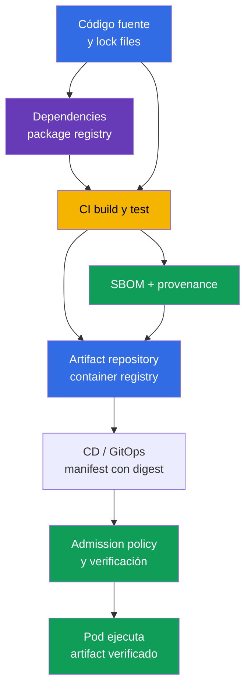
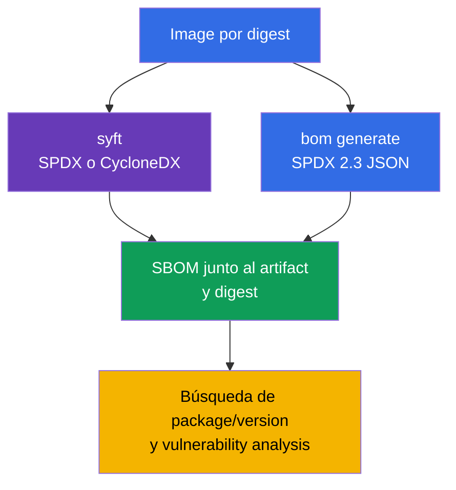
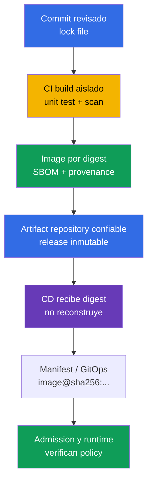
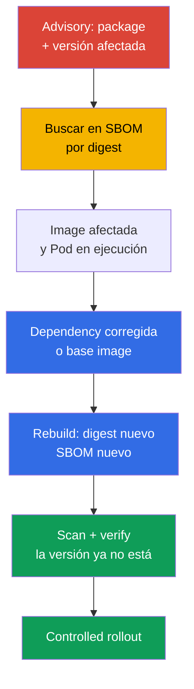

[Русская версия](ru.md) · [Eng version](README.md) · [Version française](fr.md) · [Deutsche Version](de.md) · [ქართული ვერსია](ge.md) · [繁體中文版](tw.md) · [日本語版](jp.md)

# Capítulo 25. Comprender la cadena de suministro: SBOM, CI/CD y repositorios de artefactos

> **El problema.** Una dependency sustituida o manipulada, un CI token comprometido o un tag modificado en un
> registry pueden entregar código no confiable a un Pod bajo un nombre de image conocido. Sin un inventario vinculado
> a un digest, es imposible establecer rápidamente qué componentes entraron en un artifact,
> quién lo construyó y desde qué estado del código fuente. Esto deja una dependency vulnerable o una
> build maliciosa sin detectar hasta que se ejecuta para un consumidor.

> **Qué sigue.** En el [capítulo 24](../24/es.md), redujimos el contenido de la final image y fijamos
> su versión. Ahora debe poder responder a la siguiente pregunta: qué componentes y
> versiones entraron todavía en el artifact entregado, quién lo construyó y cómo. Este es el dominio
> **Supply Chain Security** de CKS (20%). El inventario mediante un SBOM hace observable un componente vulnerable,
> mientras que CI/CD controlado y un registry crean una cadena de confianza hasta el deployment.

> **Lo necesario de CKA.** Los conceptos básicos de images, layers, Dockerfile, tag, digest y registry
> se explican en el [capítulo 23 de CKA](../../../cka/course/23/es.md). Aquí no repetimos la construcción
> de containers: consideramos una image como artifact de entrega, creamos su inventario y
> verificamos el camino desde el código fuente hasta Kubernetes.

> 🧠 Una cadena de confianza conecta source, dependencies, CI/CD, registry y admission: comprometer cualquier transición puede entregar un artifact no confiable a un `Pod`.

## 25.1. Software supply chain y la cadena de confianza

Una **software supply chain** comprende todas las personas, sistemas, código fuente, dependencies y artifacts
por los que pasa una aplicación antes de ejecutarse en un Pod. Para un container workload, no se trata
solo de Git y Dockerfile: la cadena incluye un dependency registry, build runner, CI/CD credentials, container
registry, manifest/GitOps repository, admission policy y kubelet que descarga la image.



Una cadena de confianza es tan fuerte como su parte más débil. Si CI recibe una dependency manipulada o
sustituida, firma una image de la revision equivocada o CD despliega un mutable tag,
una comprobación posterior de Kubernetes no puede recuperar el artifact original. Por ello, importa tanto identificar
**qué** se está ejecutando (digest y SBOM), **de dónde** procede (provenance) y
**qué acciones están permitidas** en cada transición.

Ataques típicos a la supply chain:

- comprometer una dependency o publicar un package de nombre similar (typosquatting), tras lo cual
  un package manager ordinario instala código malicioso;
- tomar una cuenta de maintainer o un CI token y publicar una image en nombre del proyecto;
- cambiar un build script, runner, cache o base image para que el artifact ya no
  corresponda al reviewed source;
- sustituir un registry tag: `app:stable` comienza a apuntar a bytes diferentes aunque el manifest de
  Kubernetes no haya cambiado;
- obtener acceso de atacante a registry o CD credentials y hacer deploy directamente, eludiendo la review;
- filtrar un secret de un CI log, environment o image layer y, después, usar ese
  credential para firmar, hacer push o alterar un release.

Un incidente de la clase SolarWinds ilustra el principio: un atacante no necesita comprometer a cada
consumidor si puede cambiar una única etapa confiable de build o delivery.
En Kubernetes, el resultado puede ser un Pod con el nombre y tag esperados, pero con código no confiable.

El reciente [incidente de Trivy](https://github.com/aquasecurity/trivy/discussions/10462)
muestra la misma concentración de confianza. Según el informe final del proyecto, el 27 de febrero de 2026,
un atacante utilizó un workflow vulnerable con `pull_request_target`, obtuvo secrets de nivel
repository y organization y, el 19 de marzo, empleó un credential robado para ejecutar un release workflow y distribuir Trivy
malicioso `v0.69.4`. El problema raíz no era el scanner en sí, sino un CI privilegiado que ejecutó código de PR no revisado
y tenía acceso a secrets excesivos; un aislamiento insuficiente de service accounts y una rotación ineficaz aumentaron el
impact. Esto no significa que todos los usuarios de Trivy o los Pod de Kubernetes estuvieran comprometidos, pero confirma la
lección de SolarWinds: un único paso confiable de build/release con credentials amplios da a un atacante una ruta escalable
para entregar código no confiable.

La protección no puede reducirse a un solo scanner. Un SBOM muestra la composición, un scanner la coteja con
CVE conocidos, signature/provenance vinculan un artifact al proceso de build y una admission
policy impide un artifact que no cumple las reglas. Estos mecanismos se complementan
entre sí.

> 🧠 Un SBOM es un inventario de la composición de un artifact concreto, no un scan report ni una prueba criptográfica de su origen.

## 25.2. SBOM: inventario de componentes y formatos SPDX 2.3 JSON/CycloneDX

Un **SBOM** (Software Bill of Materials) es una lista legible por máquina de los componentes de un artifact: packages,
libraries, sus versiones, identificadores, licencias y, a veces, dependency relationships. Para una
container image, un generator lee el filesystem y package metadata de los layers; un SBOM responde principalmente
a la pregunta «¿qué se encontró en este artifact?». No prueba que no existan CVE, ni es por
sí mismo una prueba criptográfica de origen.

Los dos formatos abiertos más comunes son:

| Formato | Propósito y punto fuerte | Dónde es más habitual |
|---|---|---|
| **SPDX 2.3 JSON** | Un estándar de Linux Foundation para composición de software, licencias, packages y relaciones; adecuado para compliance e intercambio de inventario | OCI artifacts, distribuciones, CI y el ecosistema Kubernetes |
| **CycloneDX** | Un formato de Open Worldwide Application Security Project (OWASP) centrado en component analysis y security tooling; práctico para vulnerability management | scanners, dependency analysis y security dashboards |

Ambos formatos pueden describir una image, pero sus campos JSON difieren. Todos los ejemplos de SPDX a continuación usan
**SPDX 2.3 JSON**: en este esquema, los packages normalmente están en `.packages`, con la versión en
`versionInfo`; CycloneDX coloca los componentes en
`.components`, con la versión en `version`. No traslade estas rutas a SPDX 3.0: tiene un modelo de
datos distinto. No escriba una consulta `jq` universal sin conocer el formato y la versión del archivo: un
resultado ausente puede significar una ruta JSON incorrecta en vez de un package ausente.

Un SBOM también tiene límites de precisión:

- no toda image tiene una package database; un static binary puede contener libraries sin tener
  metadata habitual de un package manager;
- un scanner puede identificar un componente de forma heurística, así que confirme su nombre o versión
  con el manifest y el lock file;
- un SBOM refleja el momento de su generación. Reconstruir una base image o cambiar una dependency o digest
  crea un SBOM nuevo;
- una sola version string no significa por sí misma una vulnerabilidad: compárela con un vendor advisory,
  la OS distribution, la arquitectura y el estado de la corrección.

**Un runtime SBOM y la cadena de build completa son inventarios distintos.** Un SBOM de una final multi-stage image
describe lo que llega a runtime; las dependencies de los builder stages descartados quedan, por consiguiente, ausentes.
Incluso el análisis con `--scope all-layers` cubre los layers de la final image, no cada
stage de build que desapareció. Un inventario completo de la supply chain también necesita source,
lock files, build attestations y provenance: la ausencia de un package de un SBOM final no prueba
que estuviera ausente del proceso de build.

Regla práctica: guarde un SBOM junto al artifact y el immutable digest
para el que se creó. Un archivo llamado `api-1.4.2.spdx.json`, creado para `api:1.4.2`, es insuficiente
si ese tag se sobrescribe más tarde; la asociación debe ser con `@sha256:...`.

## 25.3. Generar un SBOM: `syft` y `bom` del ecosistema Kubernetes

Antes de generar, fije la image reference. Un tag solo es cómodo para lectura humana;
para un informe, verificación y production deployment, use el digest devuelto por su registry:

```bash
IMAGE='registry.example.com/payments/api:1.4.2@sha256:<64-hex-digest>'
```

No incluya en un release un digest aleatorio de la documentación. Obtenga primero el digest de una
image verificada de un registry de confianza y consérvelo junto al SBOM. El generator puede requerir un
registry credential para una private image; no pase la contraseña por el shell history ni
en un commit.

> 🔬 `syft` genera SBOM en varios formatos.

### `syft`: SPDX 2.3 JSON y CycloneDX a partir de una image

[Syft](https://github.com/anchore/syft) cataloga packages en una image, directory o
archive y puede generar varios formatos. Los siguientes comandos crean dos archivos independientes
para la misma image:

```bash
syft "$IMAGE" -o spdx-json > api.spdx.json
syft "$IMAGE" -o cyclonedx-json > api.cyclonedx.json
```

Si una reference apunta a un multi-arch OCI index, seleccione explícitamente la platform. Para un
cluster heterogéneo, cree e indexe un SBOM independiente para cada platform manifest que se use realmente;
junto a él, conserve la platform y el digest de ese manifest, no solo el digest del index:

```bash
PLATFORM='linux/amd64'
syft "$IMAGE" --platform "$PLATFORM" -o spdx-json > api.linux-amd64.spdx.json
```

Comandos cortos equivalentes que conviene recordar rápidamente en el examen:

```bash
syft <image> -o spdx-json
syft <image> -o cyclonedx-json
```

Compruebe que el archivo no esté vacío y sea JSON antes de pasarlo a un scanner o
conservarlo como evidencia:

```bash
jq -e '
  .spdxVersion == "SPDX-2.3"
  and .SPDXID == "SPDXRef-DOCUMENT"
  and .dataLicense == "CC0-1.0"
  and (.documentNamespace | type == "string")
  and (.creationInfo.creators | type == "array")
  and (.packages | type == "array")
' api.spdx.json >/dev/null
jq -e '.bomFormat == "CycloneDX" and (.components | type == "array")' \
  api.cyclonedx.json >/dev/null
```

La primera consulta es una **comprobación de cordura** para el SPDX 2.3 JSON esperado; la segunda es para CycloneDX JSON. Filtra
output vacío, un error HTML de registry y JSON de otro formato, pero no es una validación completa de
schema/conformance: para ello use un SPDX validator compatible con la versión requerida de la
specification. Un SBOM concreto puede carecer de un campo que no sea obligatorio para la versión de su
generator; aun así, compruebe explícitamente los campos principales del documento, el formato y la lista de componentes.

> 🎯 `kubernetes-sigs/bom` es la ruta orientada a Kubernetes: genere SPDX JSON para la image especificada, compruebe su estructura y conserve el resultado.

### `bom`: la ruta orientada a Kubernetes hacia SPDX 2.3 JSON

[`bom`](https://github.com/kubernetes-sigs/bom) es una herramienta de Kubernetes SIGs para trabajar con
software bill of materials. Es una herramienta práctica importante para CKS: su documentación está
permitida en el examen, y el lab 111 la usa para generar SPDX 2.3 JSON. En el entorno actual,
primero inspeccione los flags disponibles en lugar de adivinar la sintaxis:

```bash
bom generate --help
```

Para una image, el comando del escenario del laboratorio crea un archivo SPDX JSON:

```bash
bom generate --image "$IMAGE" --format json --output out.spdx.json
```

Algunas versiones de `bom` usan `-o` en la forma corta:

```bash
bom generate --image "$IMAGE" --format json -o sbom.spdx.json
```

`--format json` en este comando significa la representación JSON de SPDX, no CycloneDX. No
renombre el archivo a `*.cyclonedx.json`: su nombre debe comunicar su formato real, de modo que el
`jq`, scanner y reviewer posteriores elijan el schema correcto. Compruebe el archivo resultante
como SPDX y cuente los packages encontrados:

```bash
jq -e '
  .spdxVersion == "SPDX-2.3"
  and .SPDXID == "SPDXRef-DOCUMENT"
  and .dataLicense == "CC0-1.0"
  and (.documentNamespace | type == "string")
  and (.creationInfo.creators | type == "array")
  and (.packages | type == "array")
' out.spdx.json >/dev/null
jq '.packages | length' out.spdx.json
```

Esto es una comprobación de cordura, no una validación completa del schema/conformance de SPDX.

Si `bom` no puede ver una image local, especifique una reference accesible para el runtime/registry
desde el que se ejecuta el comando y consulte `bom generate --help` para la versión instalada en el
entorno. No sustituya un error de acceso por un archivo JSON creado artificialmente: eso oculta un
problema de credentials o un nombre de artifact incorrecto.



> 🎯 Para un image digest especificado, encuentre el package exacto y su version en el SBOM; buscar solo por nombre no prueba la aplicabilidad de un advisory.

## 25.4. Leer un SBOM: encontrar un package y su versión exacta

Un escenario de examen o de production normalmente comienza con un advisory: por ejemplo, se sabe
que una image contiene `ca-certificates-bundle` en una versión determinada. No saque una
conclusión a partir del nombre de la image o del tag. Encuentre el package **y su version** en el SBOM de un
digest específico y, después, coteje el resultado con el workload en ejecución.

Para SPDX 2.3 JSON creado por `bom` o `syft`, muestre el nombre y la versión del package exacto:

```bash
jq -r '
  .packages[]
  | select(.name == "ca-certificates-bundle")
  | [.name, .versionInfo, .SPDXID] | @tsv
' out.spdx.json
```

Si el package realmente existe, verá una línea con `name`, `versionInfo` y `SPDXID`.
Si el output está vacío, no cambie un deployment a ciegas. Compruebe en orden: si seleccionó
el SBOM correcto, si el formato es correcto, cómo el generator nombró el package y si está
en otra image/sidecar.

La búsqueda por una parte del nombre es útil para una investigación inicial, pero puede devolver varios
packages y no es apropiada como comprobación final de versión:

```bash
jq -r '
  .packages[]
  | select(.name | test("ca-certificates"; "i"))
  | [.name, (.versionInfo // "<нет versionInfo>")] | @tsv
' out.spdx.json
```

Para CycloneDX JSON, cambian la ruta y el nombre del campo:

```bash
jq -r '
  .components[]
  | select(.name == "ca-certificates-bundle")
  | [.name, .version, (.purl // "<нет purl>")] | @tsv
' api.cyclonedx.json
```

`purl` (package URL) ayuda a distinguir packages con nombres idénticos en ecosistemas distintos.
En una investigación real, registre en el ticket: el image digest, nombre/versión del package, nombre de
archivo del SBOM y advisory/CVE. Así, otro engineer podrá reproducir el resultado en vez de buscar
«más o menos ese package» en otro rebuild.

Después de encontrar un componente, conecte el SBOM con el cluster. Las image references realmente
utilizadas por los Pod pueden verse así:

```bash
kubectl get pods -A \
  -o jsonpath='{range .items[*]}{.metadata.namespace}{"\t"}{.metadata.name}{"\t"}{range .spec.containers[*]}{.image}{"\n"}{end}{end}'
```

Este output muestra la image reference declarada. `status.containerStatuses[].imageID` es útil
como evidencia específica del runtime de lo que el node informó para un container en ejecución, pero no es un
registry digest portable y no necesariamente es el digest de un OCI index o platform manifest. Para
obtener evidencia sólida de un incidente, use `spec.containers[].image` fijado por digest, determine la
arquitectura del node, resuelva el registry/index hasta su platform manifest relevante y coteje el SBOM
con él. Con acceso al node, compare también el runtime inventory:

```bash
kubectl get pod <pod> -n <namespace> \
  -o jsonpath='{range .status.containerStatuses[*]}{.name}{"\t"}{.imageID}{"\n"}{end}'
kubectl get node <node> -o jsonpath='{.metadata.labels.kubernetes\.io/arch}{"\n"}'
crictl images --digests
```

Un error típico es eliminar un Deployment entero tras ver un nombre de package coincidente en un SBOM. Primero
identifique el container afectado y su image digest, prepare una fixed image, repita el build,
SBOM y scan, y después sustituya la image mediante un controlled rollout normal. Eliminar un workload puede
interrumpir el servicio y no elimina el artifact vulnerable del registry.

> 🏭 Un proceso de entrega fiable fija el digest del release/index y, después, el digest del platform-manifest objetivo; vincula a este su SBOM, provenance y scan report. CI publica el artifact, mientras CD lo promueve sin reconstruirlo.

## 25.5. CI/CD, repositorios de artefactos, provenance y SLSA

**CI** compila, prueba, analiza y publica un artifact; **CD** promueve un artifact ya
preparado entre environments o aplica un manifest en el cluster. Sin una frontera
entre ambos, CI puede convertirse silenciosamente en un deploy shell privilegiado. Una separación útil de
roles es que CI tiene permiso restringido para publicar en un staging repository, mientras CD recibe un
digest listo y promueve solo un artifact inmutable aprobado.

Un **artifact repository** almacena resultados de build: OCI images en un container registry, packages,
charts, SBOM, attestations y provenance. Un registry no es solo una caché de Docker Hub: debe ser una
fuente de releases de confianza, conservar immutable digests, restringir push/pull y, cuando sea
posible, prohibir el overwrite de release tags. Algunos ejemplos de implementación son Harbor, Amazon ECR,
Google Artifact Registry, Azure Container Registry, GitHub Container Registry o un
OCI registry interno. El producto concreto es secundario; lo importante es el control de acceso, la retention,
el audit y la inmutabilidad de los release artifacts.



**Provenance** es metadata sobre el origen de un artifact: qué source revision, build definition,
builder y materiales de entrada participaron en su build. A diferencia de un SBOM, provenance no
enumera todas las libraries; vincula el output a un build process controlado. Para una
cadena sólida, distinga el digest de release/index y el digest del platform manifest seleccionado:
el SBOM, scan y provenance deben estar vinculados al artifact que realmente se verifica
o ejecuta.

> 🔬 La relación entre un SBOM, provenance y signature con un digest en el modelo SLSA.

[SLSA](https://slsa.dev/) (Supply-chain Levels for Software Artifacts), versión 1.2,
divide los requisitos en tracks independientes. Por ello, SLSA no tiene una única escala de «inicial - alta»:
el Build Track describe garantías de build y provenance, mientras el Source Track tiene
sus propios requisitos para source.

| Track | Niveles de SLSA v1.2 | Significado práctico |
|---|---|---|
| Build | L0 | Sin garantías de SLSA. |
| Build | L1 | Existe provenance. |
| Build | L2 | Una hosted build platform crea provenance firmada. |
| Build | L3 | Se utiliza una hardened build platform. |
| Source | L1-L4 | Niveles independientes de requisitos para source; no pueden deducirse del nivel de Build Track. |

Para los requisitos de cada nivel, consulte las especificaciones de [Build Track](https://slsa.dev/spec/v1.2/build-track-basics)
y [Source Track](https://slsa.dev/spec/v1.2/source-requirements), en lugar de una
escala de cuatro pasos creada por un autor. No declare un proyecto «SLSA Level N» solo porque
genera un SBOM: especifique el track, la versión de la specification y las evidencias de que se
cumplen los requisitos pertinentes.

BuildKit puede crear y publicar SBOM/provenance attestations junto con una image/index:

```bash
IMAGE_TAG='registry.example.com/payments/api:1.4.2'
docker buildx build --sbom=true --provenance=mode=max,version=v1 --push \
  --tag "$IMAGE_TAG" .
```

Aquí, `version=v1` fija explícitamente el formato esperado: el upstream BuildKit actual usa por defecto
SLSA provenance `v1`; versiones anteriores de BuildKit/Buildx podían emitir `v0.2`. Por tanto, con
este parámetro, verifique `Statement/v1` con `https://slsa.dev/provenance/v1`. Después del push,
conserve el immutable digest y, para un multi-arch release, determine el platform manifest que
se ejecutará. Estas build-native attestations ayudan a vincular el output con el build, pero no
sustituyen la comprobación independiente de la signature, del SBOM de la final image y del inventario completo de la cadena a partir de
source/lock files.

En la práctica, las mejoras son así:

- fije las dependencies y revise los cambios en la build definition;
- ejecute un release build en un runner ephemeral/isolated, no en una workstation compartida;
- conceda a CI un credential de corta duración con mínimos privilegios, separando el permiso de publish del permiso de deployment;
- publique una image, SBOM y provenance de forma atómica, vinculándolo todo a un immutable digest;
- use protected branches, review obligatoria y audit logs de registry/CI;
- en CD, despliegue un digest en lugar de reconstruir en otro environment.

Para un OCI index, no es un único digest universal, sino una cadena: `release/index digest →
platform manifest digest → SBOM/provenance/scan evidence`. Primero seleccione la target platform,
resuelva el index hasta su manifest y encuentre su attestation; después verifique el
`subject.digest` de in-toto. Docker almacena un attestation manifest en el root index, pero su `subject`
debe apuntar al target platform manifest (o a un objeto dentro de él). Para una image de una sola platform,
el release digest y el platform-manifest digest pueden coincidir, pero no se debe asumir.

La provenance mínima de SLSA/in-toto es un statement cuyo `subject` está vinculado al
platform manifest aplicable. Por ejemplo, su estructura puede tener este aspecto:

```json
{
  "_type": "https://in-toto.io/Statement/v1",
  "subject": [{
    "name": "registry.example.com/payments/api",
    "digest": {"sha256": "<64-hex-platform-manifest-digest>"}
  }],
  "predicateType": "https://slsa.dev/provenance/v1",
  "predicate": {
    "buildDefinition": {
      "buildType": "https://ci.example.com/buildtypes/release/v1",
      "externalParameters": {}, "resolvedDependencies": []
    },
    "runDetails": {"builder": {"id": "https://ci.example.com/builders/release"}}
  }
}
```

Antes de utilizar provenance, resuelva primero un release/index de confianza hasta el target platform
manifest y compare su `subject.digest.sha256` con el digest precisamente de ese manifest. Puede
verificarlo sin adivinar un tag:

```bash
PLATFORM_MANIFEST_DIGEST='sha256:<64-hex-platform-manifest-digest>'
jq -e --arg digest "${PLATFORM_MANIFEST_DIGEST#sha256:}" \
  '.subject[] | select(.digest.sha256 == $digest)' provenance.intoto.json >/dev/null
```

Un `jq` exitoso demuestra que el statement está vinculado al platform manifest esperado, pero no la
autenticidad del statement. El [capítulo 26](../26/es.md) trata en detalle la signature del artifact y la
verificación criptográfica con `cosign verify`; un SBOM no sustituye esta comprobación.

> 🎯 Use un SBOM para confirmar el package/version afectado en un digest específico; después, sustituya el artifact y verifique que el componente vulnerable haya desaparecido.

## 25.6. SBOM para encontrar componentes vulnerables

Cuando aparece un CVE o vendor advisory, un SBOM reduce la pregunta del incidente de «¿cuáles de nuestras
miles de images?» a «¿qué digests contienen el package/version afectado?». Esto también es necesario para
el **descubrimiento tardío**: en el momento del build, un scanner podría no encontrar el problema porque el CVE o
la información sobre las versiones afectadas aún no se había publicado. El resultado de un scan refleja la base de conocimientos
en el momento de la comprobación, no una garantía de que los advisory futuros estén ausentes de una image ya en ejecución.

Por eso, fuera del build pipeline, **vuelva a cotejar regularmente los SBOM conservados con una
base de CVE actualizada**: de forma programada y ad hoc cuando se publique un CVE nuevo importante o un
vendor advisory. Esta comprobación no reconstruye un artifact: evalúa el mismo immutable digest con
datos actuales y debe iniciar el triage de los releases afectados.

Ciclo de trabajo:

1. obtenga las condiciones exactas del advisory: package, ecosystem/distribution, versiones afectadas y
   fixed version;
2. encuentre el package/version en los SBOM conservados de cada candidate release digest, sin basarse
   en un tag; el resultado será una lista de digests afectados;
3. relacione los digests afectados con el runtime inventory: `spec.containers[].image` muestra la
   reference declarada; `status.containerStatuses[].imageID` es un runtime-specific hint, no un
   registry/platform-manifest digest portable. Para multi-arch, relacione la arquitectura del node,
   el platform manifest y el SBOM vinculado a este;
4. separe los digests afectados entre workloads en ejecución, los disponibles solo en el registry y los
   ya retirados; corrija primero el workload en ejecución con mayor business/risk
   impact y después los releases restantes;
5. construya o seleccione un artifact corregido, genere un SBOM nuevo y verifique que la
   versión afectada esté ausente o sustituida;
6. haga scan, firme/verifique y solo después promueva el digest mediante CD;
7. conserve el SBOM, el resultado del scan y el rollout como evidencia para incident response y audit.

Para una respuesta rápida, mantenga un índice `digest → SBOM → scan timestamp → environment/workload`.
Entonces un CVE nuevo inicia una consulta contra el inventory en vez de volver a analizar manualmente todas las images:
primero identifique los posibles release/platform-manifest digests afectados a partir del SBOM y luego
confirme el workload en ejecución mediante una spec fijada por digest, la platform del node y `imageID` del runtime como
hint adicional. Un tag por sí solo es insuficiente: puede ser mutable y no prueba qué
bytes usa un Pod que ya está en ejecución.



Un SBOM no sustituye un vulnerability scanner. Aporta el inventory, mientras un scanner añade la base de CVE,
las reglas de coincidencia y la severity. En el [capítulo 28](../28/es.md), aplicaremos Trivy y Grype a una
image y a un SBOM ya preparado. Antes de eso, es útil poder demostrar manualmente la presencia de un package/version
con `jq`: así se diagnostican el formato, los datos del scanner y los errores de automatización.

**VEX** (Vulnerability Exploitability eXchange) complementa este modelo: un SBOM responde qué entra en
un artifact; un scanner o advisory relaciona el componente con un CVE, mientras VEX registra el
estado confirmado de aplicabilidad o explotabilidad de una vulnerabilidad concreta para este
producto. La presencia de un package/version y de un CVE aún no significa que la vulnerabilidad sea aplicable o
explotable; VEX no sustituye la comprobación ni la corrección, sino que hace verificable la decisión.

Tampoco confunda «no encontrado en un SBOM» con «seguro». Las posibles causas de ausencia incluyen un
detector incompleto, static link, una image incorrecta, un SBOM desactualizado o un package con otro
nombre. Para un incidente crítico, complemente la búsqueda con lock file, source repository, base-image
release notes y runtime image ID.

> 🎯 El resultado práctico es un SPDX JSON válido y un output reproducible de package/version para la image de la tarea, no solo un comando que terminó correctamente.

## 25.7. Verificación: SBOM con `bom` y búsqueda de un package/version especificado

El lab 111 comprueba el mínimo completo que requiere una tarea CKS: generar un SBOM
con `bom`, asegurarse de que es un SPDX 2.3 JSON válido y encontrar en él el package/version especificado.
Trabaje con la training image proporcionada por el laboratorio o con una image permitida propia;
no use mutable `latest` como evidencia.

```bash
IMAGE='<image-from-lab-or-registry>@sha256:<64-hex-digest>'

# 1. Cree SPDX 2.3 JSON con Kubernetes SIGs bom.
bom generate --image "$IMAGE" --format json --output out.spdx.json

# 2. Ejecute la comprobación de cordura SPDX 2.3 y confirme que packages no está vacío.
jq -e '
  .spdxVersion == "SPDX-2.3"
  and .SPDXID == "SPDXRef-DOCUMENT"
  and .dataLicense == "CC0-1.0"
  and (.documentNamespace | type == "string")
  and (.creationInfo.creators | type == "array")
  and (.packages | type == "array")
  and (.packages | length > 0)
' out.spdx.json >/dev/null

# 3. Encuentre el package especificado y su version.
jq -r '
  .packages[]
  | select(.name == "ca-certificates-bundle")
  | [.name, .versionInfo, .SPDXID] | @tsv
' out.spdx.json
```

Si el lab especifica otro par `package/version`, sustituya solo el value en `select`, no
el schema de comprobación. Compare la versión obtenida con la condición: buscar un package sin
comparar su versión no demuestra que sea el componente vulnerable buscado.

Como cross-check adicional, genere un SBOM para la misma image con Syft:

```bash
syft "$IMAGE" -o spdx-json > syft.spdx.json
jq -e '
  .spdxVersion == "SPDX-2.3"
  and .SPDXID == "SPDXRef-DOCUMENT"
  and .dataLicense == "CC0-1.0"
  and (.documentNamespace | type == "string")
  and (.creationInfo.creators | type == "array")
  and (.packages | type == "array")
' syft.spdx.json >/dev/null
```

Esta es una comprobación de cordura, no una validación completa de schema/conformance de SPDX.

### Diagnóstico de errores habituales

| Síntoma | Causa probable | Qué comprobar |
|---|---|---|
| `bom` o `syft` no puede descargar la image | private registry, reference incorrecta o red | registry login/credential, repository, tag/digest, acceso del runner al registry |
| `jq` informa de un parse error | el output no es JSON, el archivo está vacío o contiene un error | tamaño del archivo, stderr del comando, primeras líneas del archivo; genere de nuevo el SBOM |
| `jq` no encuentra el package | nombre, JSON format, image digest distintos o metadata ausente | `.packages[].name`, `.components[].name`, digest, package-manager database |
| se encuentra el package, pero la versión no coincide | la image se compiló desde otra base/dependency o el advisory se aplica a otra distribution | `versionInfo`, purl, base image, lock file y condiciones del advisory |
| existe un SBOM, pero el deployment sigue siendo vulnerable | CD aplicó un tag/digest antiguo o el rollout no está completo | manifest `image:`, Pod `imageID`, rollout status y registry digest |

El criterio de preparación de la verificación es: un SPDX 2.3 JSON no vacío que superó una comprobación de cordura (para
conformance completa se requiere un SPDX validator independiente), contiene el package/version registrado para un
platform-manifest digest específico y cuyos comandos y archivos pueden entregarse a otro engineer para
reproducir el resultado.

> 🏭 Automatice la emisión y conservación de SBOM, provenance y scan evidence para cada release digest; un informe creado manualmente después de un incidente no sustituye este proceso.

## 25.8. Cómo se aplica esto en production

- **Cree un SBOM durante el release build.** La generación es automática en CI para cada
  publishable digest, no manual después de un incidente. Un SBOM puede ser un archivo
  SPDX/CycloneDX independiente o un OCI artifact/referrer vinculado a un image digest. Una attestation
  firmada es un statement independiente sobre un `subject` con un predicate: puede llevar un SBOM o
  provenance, pero no todo SBOM es una attestation. Un modelo práctico es: `image digest
  <- OCI SBOM artifact/referrer` y `image digest <- signed attestation
  (predicate=SBOM/provenance)`. La retention de estos datos no debe ser más corta que el propio release.
- **Un digest es una cadena de identificadores de release.** Para multi-arch, fije primero el
  release/index digest y luego el platform-manifest digest seleccionado; vincule el SBOM, scan report, provenance y
  change record al nivel aplicable de esta cadena. Un release tag puede mantenerse para
  las personas, pero no sustituye la prueba del contenido.
- **Un registry es una frontera controlada.** Los permisos de push se delimitan por proyecto, los release tags
  están protegidos contra overwrite y audit logs, replication y cleanup policy están activados. Una workstation
  no publica directamente una production image.
- **CI tiene mínimos privilegios.** Ephemeral runners, short-lived tokens, scoped secrets,
  protected branches y revisión de la build definition reducen el riesgo de manipulación de artifacts, sustitución inesperada o filtración de credentials.
- **Vulnerability management es de ciclo cerrado.** Un advisory lleva a una SBOM query, luego a un
  fixed digest, un SBOM nuevo, scan, verificación y rollout. Las excepciones tienen un propietario, duración y
  evidencia; no permanecen para siempre en una ignore list.
- **La verificación de origen es obligatoria.** Antes de CD, verifique la cadena release/index → target
  platform manifest → attestation `subject` y signature; la admission policy en el cluster
  se convierte en la última frontera, no en el único lugar de control. La signature y su enforcement
  son el tema del capítulo siguiente.

## 25.9. Mini-glosario

- **Software supply chain** - el camino de source, dependencies, build systems y artifacts hasta un
  workload en ejecución.
- **Artifact** - un resultado de build, como una OCI image, SBOM, chart o provenance.
- **Artifact repository** - un almacén controlado de artifacts: un registry, package o chart
  repository.
- **SBOM** - un inventory legible por máquina de componentes y versiones en un software artifact.
- **SPDX 2.3 JSON** - la representación JSON del estándar SPDX usada en este capítulo para packages,
  licenses y sus relaciones; no mezcle su modelo JSON con SPDX 3.0.
- **CycloneDX** - un formato de OWASP para component inventory y security analysis.
- **Syft** - una herramienta para generar SBOM a partir de una image, filesystem o archive.
- **bom** - la herramienta `kubernetes-sigs/bom` para generar y trabajar con SPDX SBOM.
- **Provenance** - metadata sobre source, inputs, builder y el proceso de crear un artifact.
- **SLSA** - un modelo de requisitos de seguridad de supply chain con tracks Build y Source independientes.
- **VEX** - un statement sobre la aplicabilidad o explotabilidad de un CVE específico para un producto.
- **Digest** - un identificador inmutable de contenido para una image, normalmente `sha256`.
- **purl** - una package URL, identificador de un package con ecosystem y versión.

## 25.10. Resumen del capítulo

- Una software supply chain abarca source, dependencies, CI/CD, registry, metadata y
  deployment; comprometer una etapa confiable puede entregar un artifact malicioso
  a muchos clusters.
- Un SBOM es un inventory de componentes de un artifact. SPDX y CycloneDX describen el mismo objeto con distintos
  schemas JSON; un SBOM no es ni un scan report ni una prueba de origen.
- `syft` genera SPDX 2.3 JSON y CycloneDX JSON; `bom` del ecosistema Kubernetes genera
  SPDX 2.3 JSON con `bom generate --image ... --format json --output ...`.
- Encontrar un componente vulnerable requiere el package, la versión exacta y el image digest. Para SPDX, normalmente es
  `.packages[].name` y `.versionInfo`; para CycloneDX, `.components[].name` y
  `.version`.
- CI debe emitir una image, SBOM y provenance con una cadena de digest verificable, mientras CD debe
  promover el digest seleccionado desde un artifact repository confiable sin reconstruirlo.
- SLSA v1.2 separa el Build Track (L0-L3) y el Source Track (L1-L4); generar solo un SBOM
  no prueba que se cumplan los requisitos de ninguno de los tracks.
- Después de un CVE, el ciclo es: consulta de SBOM → confirmar el digest en ejecución → rebuild corregido →
  SBOM/scan/verify nuevos → controlled rollout.

## 25.11. Cómo ayuda esto: en el examen y en el trabajo real

**En el examen.** Poder ejecutar rápidamente `bom generate --image ... --format json`,
verificar SPDX 2.3 JSON y encontrar un package/version es una habilidad práctica del lab 111 y un escenario
habitual de mock. No confunda el formato de Syft, el nombre de un campo JSON y un image tag con un digest. Cuando
sea necesario, la documentación de `kubernetes-sigs/bom` está permitida: primero consulte `--help`,
después conserve el artifact requerido y muestre el resultado de la búsqueda.

**En el trabajo real.** Un SBOM reduce el tiempo de respuesta a CVE, pero aporta valor solo con disciplina de
release: digest conocido, registry controlado, provenance conservada y scan evidence. Esto
permite decir no «creemos que la image está corregida», sino «este digest se ejecuta
en el cluster; su SBOM no contiene la versión afectada; fue compilado y verificado por un
pipeline aprobado».

## 25.12. Preguntas de autoevaluación

<details>
<summary>1. ¿Qué participantes intervienen en la software supply chain de un container workload, desde el commit hasta el Pod, y dónde puede ocurrir la manipulación o sustitución inesperada de un artifact?</summary>

La cadena incluye source y lock files, package registry, CI runner, container registry, CD/GitOps, admission policy y kubelet que descarga la image. La manipulación o sustitución inesperada puede ocurrir, por ejemplo, en una dependency, build script o runner, base image, registry tag o CI/CD credential. Por ello se requieren digest/SBOM, provenance y control de admission de artifacts.
</details>

<details>
<summary>2. ¿En qué se diferencia un SBOM de un vulnerability scan report, una signature y provenance?</summary>

Un SBOM es un inventory de componentes y versiones de un artifact concreto, no una conclusión sobre CVE. Un scanner coteja esa composición con una base de vulnerabilidades y severity, una signature verifica criptográficamente un firmante de confianza y provenance describe la source revision, builder y build inputs. Para multi-arch, estos artifacts deben vincularse a la cadena correcta de index y platform manifest.
</details>

<details>
<summary>3. ¿Por qué un SBOM para `app:1.4.2` sin digest podría no demostrar la composición de la image en ejecución?</summary>

Un tag es mutable: `app:1.4.2` puede reasignarse a bytes diferentes después de generar el SBOM. La prueba de composición se vincula a un `@sha256:...` inmutable; para multi-arch, fije además el platform manifest seleccionado y la runtime evidence. De otro modo, el SBOM puede concernir a un manifest anterior mientras el Pod ya usa otra image.
</details>

<details>
<summary>4. ¿Qué rutas JSON se usan para package/version en SPDX y CycloneDX?</summary>

En SPDX 2.3 JSON, busque los componentes en `.packages` y la versión en `.versionInfo`, por ejemplo, en un elemento `.packages[]`. CycloneDX usa `.components[]` y el campo `.version`; `.purl` también sirve para distinguir ecosystems. No transfiera mecánicamente estas rutas a otro formato o a SPDX 3.0.
</details>

<details>
<summary>5. ¿Cómo genera SPDX 2.3 JSON con `syft` y con `kubernetes-sigs/bom`?</summary>

Para Syft, use `syft "$IMAGE" -o spdx-json > api.spdx.json`. Para Kubernetes SIGs bom, use `bom generate --image "$IMAGE" --format json --output out.spdx.json`; aquí JSON significa SPDX, no CycloneDX. Después, realice una comprobación de cordura del SPDX 2.3 esperado: compruebe `.spdxVersion == "SPDX-2.3"` y el array `.packages` (el procedimiento principal también comprueba el identificador y metadata del documento). La validación completa de schema/conformance requiere un SPDX validator independiente.
</details>

<details>
<summary>6. ¿Por qué buscar solo el nombre `ca-certificates-bundle` es insuficiente para decidir sobre un CVE?</summary>

Una decisión sobre un advisory requiere el package exacto, su versión, ecosystem/distribution y las condiciones de fixed version, mientras que un nombre puede aparecer en varias variantes. Busque el nombre junto con `versionInfo` y vincule el SBOM al image digest. Después, coteje el resultado con el advisory y el runtime imageID en vez de eliminar un workload solo porque su nombre coincide.
</details>

<details>
<summary>7. ¿Cómo se obtiene el `imageID` de un container y cómo se utiliza como runtime evidence?</summary>

Obténgalo del estado del Pod: `kubectl get pod <pod> -n <namespace> -o jsonpath='{range .status.containerStatuses[*]}{.name}{"\t"}{.imageID}{"\n"}{end}'`. `imageID` es un runtime-specific hint, no un registry/index/platform-manifest digest portable, así que no lo compare directamente con un digest de SBOM. Para una coincidencia sólida, considere `spec.containers[].image` fijado por digest, la arquitectura del node y la resolución del registry/index hasta el target platform manifest; con acceso al node, compare también `crictl images --digests`. Un tag solo en la spec no garantiza esto.
</details>

<details>
<summary>8. ¿Por qué CI no debería compilar una image mientras CD la reconstruye silenciosamente en otro environment?</summary>

CD debe promover un immutable digest ya verificado, no crear un artifact nuevo con inputs, builder o dependencies diferentes. De otro modo, el SBOM, scan y provenance de CI se refieren a un conjunto de bytes, mientras production puede recibir otro. Separar el CI que publica del CD que despliega hace verificable la cadena.
</details>

<details>
<summary>9. ¿Qué significado asigna SLSA a provenance y a un builder aislado?</summary>

En SLSA, provenance vincula el output con la build definition, source y builder. Para multi-arch, primero resuelva el release/index digest hasta el target platform manifest y compare su `subject.digest` con el digest de ese manifest (o de un objeto permitido dentro de él); no suponga que coincide con el root index. En el Build Track, L1 requiere provenance, L2 provenance firmada desde una hosted build platform y L3 una hardened build platform. Un builder aislado reduce el riesgo de que un environment de build compartido sea manipulado o sustituido inesperadamente, pero declare el nivel con su track y evidencia.
</details>

<details>
<summary>10. ¿Qué comprobaciones deben superarse entre una dependency corregida y un production rollout?</summary>

Después de actualizar una dependency o base image, construya un digest y SBOM nuevos y confirme que la versión afectada está ausente o sustituida. Haga scan, verifique/firme el artifact nuevo y solo después promuévalo mediante un controlled CD rollout. La evidencia incluye el SBOM, scan, digest verificado y resultado del rollout.
</details>

<details>
<summary>11. **Flashback (capítulo 32).** SBOM/provenance (este capítulo) responden «¿de qué se compone este artifact y cómo se construyó?». Un Kubernetes audit log (capítulo 32) responde «¿quién interactuó con el API server y cuándo?». Si necesita demostrar la cadena completa «quién desplegó esta image exacta, con este SBOM, en este momento», ¿cuál de las dos fuentes de evidencia es insuficiente por sí sola y cómo su uso conjunto cubre lo que cada una no cubre por separado?</summary>

Un SBOM/provenance por sí solo es insuficiente: demuestra la composición y el proceso de build del digest, pero no la acción API de deployment. Un audit log por sí solo también es insuficiente: muestra la identidad, el tiempo y el objeto API, pero no la composición de la image ni la fiabilidad de su build. Cotejar el image digest del manifest/audit con el digest vinculado al SBOM y provenance enlaza al autor del deploy con un artifact verificable concreto.
</details>

## Práctica

🧪 Lab 111 (SBOM con `bom` y `syft`, búsqueda de package/version, scanning y artifacts de
supply chain): [tasks/cks/labs/111](../../labs/111/README_ES.MD)

Para los fundamentos de images, Dockerfile, registry, tag y digest, repase
el [capítulo 23 de CKA](../../../cka/course/23/es.md). Después estudie
el [capítulo 26](../26/es.md) sobre firma y validación de artifacts y
el [capítulo 28](../28/es.md) sobre scanning de SBOM para vulnerabilidades.

---
[Índice](../README_ES.md) · [Capítulo 24](../24/es.md) · [Capítulo 26](../26/es.md)
