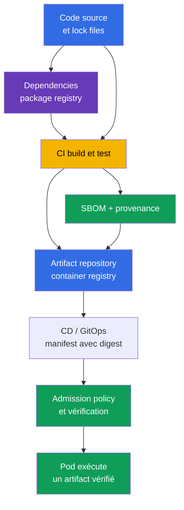
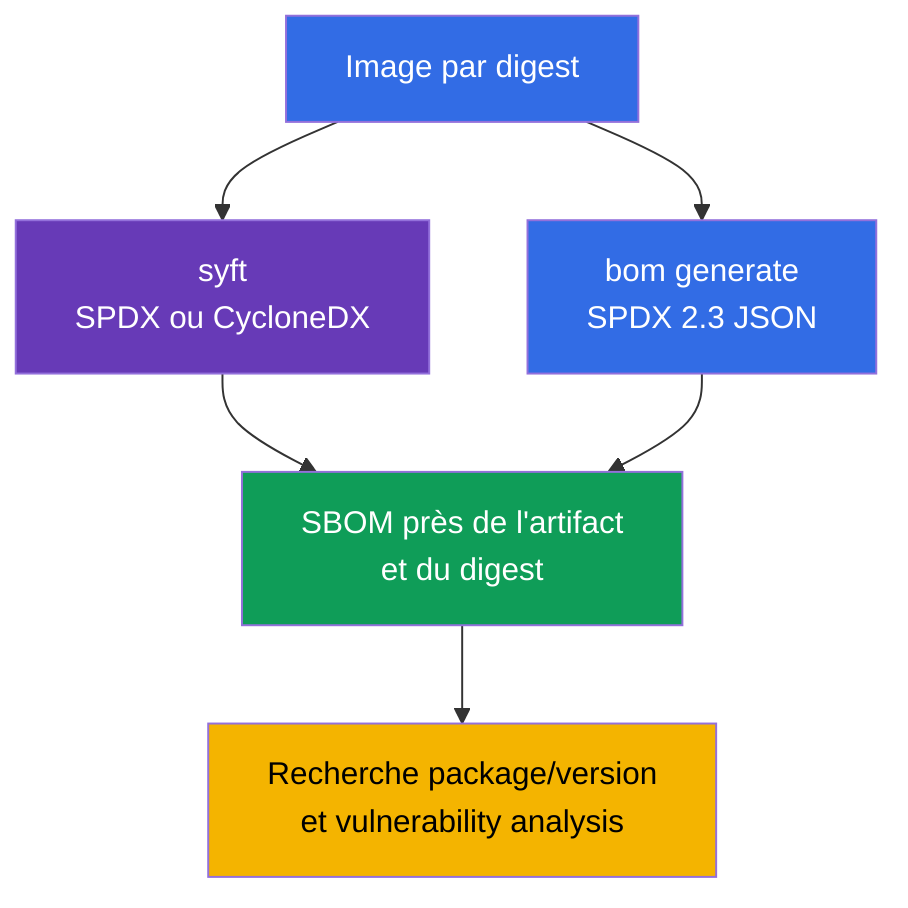
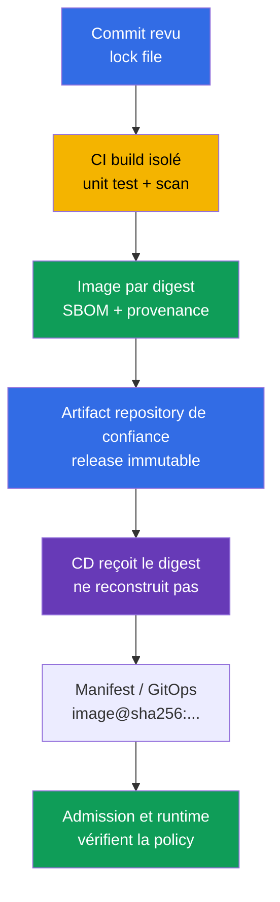
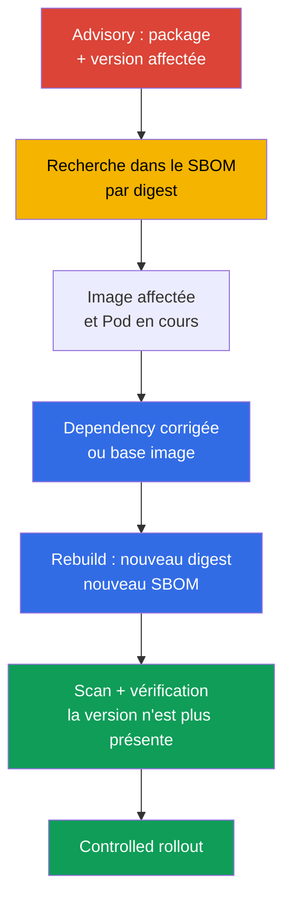

[Русская версия](ru.md) · [Eng version](README.md) · [Versión en español](es.md) · [Deutsche Version](de.md) · [ქართული ვერსია](ge.md) · [繁體中文版](tw.md) · [日本語版](jp.md)

# Chapitre 25. Comprendre la supply chain : SBOM, CI/CD, artifact repositories

> **Le problème.** Une dependency substituée, un CI token compromis ou un tag modifié dans un
> registry peuvent livrer du code non fiable à un Pod sous un nom d'image habituel. Sans un inventaire lié
> à un digest, il est impossible d'établir rapidement quels composants sont entrés dans un artifact,
> qui l'a construit et à partir de quel état source. Une dependency vulnérable ou une build
> malveillante peut ainsi rester inaperçue jusqu'à son exécution chez le consommateur.

> **La suite.** Dans le [chapitre 24](../24/fr.md), nous avons réduit le contenu de l'image finale et
> fixé sa version. Il faut maintenant pouvoir répondre à la question suivante : quels composants et
> quelles versions sont encore inclus dans l'artifact livré, qui l'a construit et comment. Il s'agit du domaine
> **Supply Chain Security** du CKS (20 %). L'inventaire via un SBOM rend un composant vulnérable
> observable, tandis qu'un CI/CD et un registry contrôlés créent une chaîne de confiance jusqu'au deployment.

> **Prérequis CKA.** Les notions de base d'image, layers, Dockerfile, tag, digest et registry
> sont expliquées dans le [chapitre 23 du CKA](../../../cka/course/23/fr.md). Nous ne répétons pas ici la construction
> d'un container : nous considérons l'image comme un artifact de livraison, établissons son inventaire et
> vérifions le chemin du code source à Kubernetes.

> 🧠 La chaîne de confiance relie source, dependencies, CI/CD, registry et admission : la compromission de n'importe quelle transition peut livrer un artifact non fiable à un `Pod`.

## 25.1. Software supply chain et chaîne de confiance

La **software supply chain** regroupe toutes les personnes, systèmes, sources, dependencies et artifacts par
lesquels passe une application avant son exécution dans un Pod. Pour une container workload, elle ne se limite pas à Git et
au Dockerfile : elle comprend le dependency registry, le build runner, les CI/CD credentials, le container
registry, le repository de manifests/GitOps, l'admission policy et le kubelet qui télécharge l'image.



La chaîne de confiance n'est forte que comme son maillon le plus faible. Si le CI reçoit une dependency
substituée, signe une image qui ne correspond pas à la bonne revision, ou si le CD déploie un tag mutable,
une vérification Kubernetes ultérieure ne peut pas restaurer l'artifact d'origine. Il est donc important d'identifier à la fois
**ce qui** est exécuté (digest et SBOM), **d'où** cela provient (provenance) et **quelles actions sont autorisées**
à chaque transition.

Attaques courantes sur la supply chain :

- compromission d'une dependency ou publication d'un package au nom proche (typosquatting), après
  quoi le code malveillant est installé par un package manager ordinaire ;
- prise de contrôle du compte d'un maintainer ou d'un CI token et publication d'une image au nom du projet ;
- modification d'un build script, d'un runner, d'un cache ou d'une base image qui fait que l'artifact ne
  correspond plus à la source revue ;
- substitution d'un tag dans le registry : `app:stable` commence à désigner d'autres octets, alors que le manifest
  Kubernetes n'a pas changé ;
- accès d'un attaquant au registry ou aux CD credentials et deployment direct en contournant la review ;
- fuite d'un secret dans le CI log, l'environment ou une layer d'image, suivie de l'utilisation de ce
  credential pour signer, push ou modifier une release.

L'incident de la classe SolarWinds illustre le principe : l'attaquant n'a pas besoin de compromettre chaque
consommateur s'il parvient à modifier une étape de build ou de livraison de confiance. Dans Kubernetes,
le résultat peut être un Pod avec le bon nom et le bon tag, mais avec du code non fiable.

Le récent [incident Trivy](https://github.com/aquasecurity/trivy/discussions/10462)
montre la même concentration de confiance. D'après le rapport final du projet, le 27 février 2026,
l'attaquant a exploité un workflow vulnérable avec `pull_request_target`, a obtenu des secrets au niveau
repository et organization, puis, le 19 mars, a utilisé un credential volé pour démarrer le release workflow et
diffuser Trivy malveillant `v0.69.4`. Le problème racine ne concernait pas le scanner lui-même, mais un CI
privilégié qui exécutait du code de PR non vérifié et pouvait accéder à des secrets excessifs ; une isolation
insuffisante des service accounts et une rotation inefficace ont accru l'impact. Cela ne signifie pas la
compromission de tous les utilisateurs Trivy ou des Kubernetes Pod, mais confirme la leçon de SolarWinds :
une seule étape build/release de confiance dotée de credentials étendus offre à l'attaquant une voie de livraison
qui passe à l'échelle.

La protection ne se réduit pas à un seul scanner. Le SBOM montre la composition, le scanner la compare aux
CVE connues, la signature/provenance relie l'artifact au processus de build, et l'admission policy refuse
un artifact qui ne respecte pas les règles. Ces mécanismes se complètent.

> 🧠 Un SBOM est l'inventaire de la composition d'un artifact donné, et non un scan report ni une preuve cryptographique de son origine.

## 25.2. SBOM : inventaire des composants et formats SPDX 2.3 JSON/CycloneDX

Un **SBOM** (Software Bill of Materials) est une liste lisible par machine des composants d'un artifact :
packages, bibliothèques, leurs versions, identifiants, licences et parfois dependency relationships. Pour une
container image, le générateur lit le filesystem et les package metadata des layers ; le SBOM répond avant tout
à la question « qu'a-t-on trouvé dans cet artifact ? ». Il ne prouve ni l'absence de CVE ni, à lui seul,
l'origine cryptographique.

Les deux formats ouverts les plus répandus sont les suivants :

| Format | Finalité et point fort | Où on le rencontre le plus souvent |
|---|---|---|
| **SPDX 2.3 JSON** | Standard de la Linux Foundation pour la composition des software, licences, packages et relations ; adapté au compliance et à l'échange d'inventory | OCI artifacts, distributions, CI et Kubernetes ecosystem |
| **CycloneDX** | Format de l'Open Worldwide Application Security Project (OWASP), orienté component analysis et security tooling ; pratique pour vulnerability management | scanners, dependency analysis, security dashboards |

Les deux formats peuvent décrire une même image, mais leurs champs JSON diffèrent. Tous les exemples SPDX ci-dessous
utilisent **SPDX 2.3 JSON** : dans ce schéma, les packages se trouvent généralement dans `.packages`,
et la version dans `versionInfo` ; dans CycloneDX, les composants se trouvent dans
`.components`, et la version dans `.version`. Ne transposez pas ces chemins à SPDX 3.0 : son
modèle de données est différent. N'écrivez pas une requête `jq` universelle sans connaître le format et la version
du fichier : l'absence de résultat peut signaler un chemin JSON incorrect, et non l'absence du package.

Le SBOM a aussi des limites de précision :

- une package database n'existe pas dans chaque image ; un static binary peut contenir des bibliothèques sans
  disposer des metadata habituelles d'un package manager ;
- un scanner peut identifier un composant de manière heuristique ; son nom ou sa version doivent donc être
  vérifiés avec le manifest et le lock file ;
- un SBOM représente le moment de sa génération. Après un rebuild de la base image, un changement de dependency
  ou de digest, il faut créer un nouveau SBOM ;
- une simple version string ne signifie pas encore vulnérabilité : il faut la comparer au vendor advisory,
  à la OS distribution, à l'architecture et au statut de correction.

**Le SBOM runtime et la chaîne complète de build sont des inventaires différents.** Le SBOM de l'image finale
multi-stage décrit ce qui atteint le runtime ; les dependencies des builder stages supprimées n'y figurent donc
logiquement pas. Même l'analyse `--scope all-layers` couvre les layers de l'image finale, et non toutes les
étapes de build disparues. Pour disposer de l'inventory complet de la supply chain, il faut également la source,
les lock files, les build attestations et la provenance : l'absence d'un package du SBOM final ne prouve pas
qu'il n'a jamais été présent pendant le processus de build.

Règle pratique : conservez le SBOM à côté de l'artifact et du digest immutable pour lequel il a été créé.
Un fichier `api-1.4.2.spdx.json` créé pour `api:1.4.2` est insuffisant si ce tag a été réécrit
ensuite ; le lien doit être fait avec `@sha256:...`.

## 25.3. Génération d'un SBOM : `syft` et `bom` de l'ecosystem Kubernetes

Avant la génération, fixez la référence de l'image. Un tag est pratique pour être lu par un humain ;
pour un rapport, une vérification et un deployment de production, utilisez le digest retourné par votre registry :

```bash
IMAGE='registry.example.com/payments/api:1.4.2@sha256:<64-hex-digest>'
```

N'insérez pas dans une release un digest pris au hasard dans la documentation. Obtenez d'abord le digest
d'une image vérifiée depuis un registry de confiance et conservez-le à côté du SBOM. Le générateur peut avoir
besoin d'un registry credential pour une private image ; ne transmettez pas le mot de passe dans l'history du shell
ou dans un commit.

> 🔬 `syft` génère des SBOM dans plusieurs formats.

### `syft` : SPDX 2.3 JSON et CycloneDX depuis une même image

[Syft](https://github.com/anchore/syft) catalogue les packages d'une image, d'un directory ou d'une archive
et peut produire plusieurs formats. Les commandes suivantes créent deux fichiers indépendants pour la même image :

```bash
syft "$IMAGE" -o spdx-json > api.spdx.json
syft "$IMAGE" -o cyclonedx-json > api.cyclonedx.json
```

Si la référence pointe vers un OCI index multi-arch, choisissez explicitement la platform. Pour un cluster
hétérogène, créez et indexez un SBOM séparé pour chaque platform manifest effectivement utilisée ; conservez
près de lui la platform et le digest de ce manifest, et non seulement le digest de l'index :

```bash
PLATFORM='linux/amd64'
syft "$IMAGE" --platform "$PLATFORM" -o spdx-json > api.linux-amd64.spdx.json
```

Les commandes courtes équivalentes, utiles à retenir rapidement à l'examen :

```bash
syft <image> -o spdx-json
syft <image> -o cyclonedx-json
```

Vérifiez que le fichier n'est pas vide et qu'il s'agit bien de JSON avant de le remettre à un scanner ou
de le conserver comme evidence :

```bash
jq -e '
  .spdxVersion == "SPDX-2.3"
  and .SPDXID == "SPDXRef-DOCUMENT"
  and .dataLicense == "CC0-1.0"
  and (.documentNamespace | type == "string")
  and (.creationInfo.creators | type == "array")
  and (.packages | type == "array")
' api.spdx.json >/dev/null
jq -e '.bomFormat == "CycloneDX" and (.components | type == "array")' \
  api.cyclonedx.json >/dev/null
```

La première requête est un **sanity-check** du SPDX 2.3 JSON attendu, la seconde porte sur le JSON CycloneDX. Elle
écarte un output vide, une erreur HTML du registry et un JSON d'un autre format, mais ne constitue pas une
validation complète de schema/conformance : pour celle-ci, utilisez un SPDX validator compatible avec la
version de specification requise. Un SBOM donné peut ne pas avoir un champ non obligatoire pour la version de
votre générateur ; vérifiez tout de même explicitement les champs de document, le format et la liste de composants de base.

> 🎯 `kubernetes-sigs/bom` est une voie orientée Kubernetes : générez le SPDX JSON pour l'image demandée, vérifiez sa structure et conservez le résultat.

### `bom` : voie orientée Kubernetes vers SPDX 2.3 JSON

[`bom`](https://github.com/kubernetes-sigs/bom) est un outil Kubernetes SIGs pour travailler avec les
software bill of materials. C'est un outil pratique important pour le CKS : sa documentation est autorisée à
l'examen et, dans la lab 111, il sert à générer un SPDX 2.3 JSON. Dans un environnement actuel, commencez par
consulter les flags disponibles plutôt que de deviner la syntaxe :

```bash
bom generate --help
```

Pour une image, la commande du scénario de lab crée un fichier SPDX-JSON :

```bash
bom generate --image "$IMAGE" --format json --output out.spdx.json
```

Dans sa forme courte, certaines versions de `bom` utilisent `-o` :

```bash
bom generate --image "$IMAGE" --format json -o sbom.spdx.json
```

`--format json` signifie dans cette commande la représentation JSON de SPDX, et non CycloneDX. Ne
renommez pas le fichier en `*.cyclonedx.json` : le nom doit indiquer le format réel afin que le
`jq`, le scanner et le reviewer ultérieurs choisissent le bon schéma. Vérifiez le fichier produit en tant que SPDX
et comptez les packages trouvés :

```bash
jq -e '
  .spdxVersion == "SPDX-2.3"
  and .SPDXID == "SPDXRef-DOCUMENT"
  and .dataLicense == "CC0-1.0"
  and (.documentNamespace | type == "string")
  and (.creationInfo.creators | type == "array")
  and (.packages | type == "array")
' out.spdx.json >/dev/null
jq '.packages | length' out.spdx.json
```

Il s'agit d'un sanity-check, et non d'une validation complète de schema/conformance SPDX.

Si `bom` ne voit pas une image locale, indiquez une référence accessible au runtime/registry depuis
lequel la commande est exécutée, et consultez `bom generate --help` pour la version installée dans
l'environnement. Ne remplacez pas une erreur d'accès par du JSON créé artificiellement : cela masque un problème
de credentials ou un nom d'artifact incorrect.



> 🎯 Pour un digest d'image donné, trouvez le package exact et sa version dans le SBOM ; une recherche par nom seul ne prouve pas l'applicabilité d'un advisory.

## 25.4. Lire un SBOM : trouver un package et une version précise

Un scénario d'examen ou de production commence généralement par un advisory : par exemple, on sait que
l'un des images contient `ca-certificates-bundle` dans une version donnée. On ne peut pas conclure à partir
du nom ou du tag de l'image. Il faut trouver le package **et sa version** dans le SBOM du digest précis,
puis comparer le résultat au workload en cours d'exécution.

Pour un SPDX 2.3 JSON créé par `bom` ou `syft`, affichez le nom et la version du package exact :

```bash
jq -r '
  .packages[]
  | select(.name == "ca-certificates-bundle")
  | [.name, .versionInfo, .SPDXID] | @tsv
' out.spdx.json
```

Si le package existe vraiment, vous verrez une ligne avec `name`, `versionInfo` et `SPDXID`.
Si l'output est vide, ne modifiez pas le deployment aveuglément. Vérifiez dans l'ordre : le bon SBOM
est-il choisi, le format est-il correct, quel nom le générateur a-t-il donné au package, et ne se trouve-t-il pas
dans une autre image/un sidecar.

La recherche par une partie du nom est utile pour l'investigation initiale, mais elle peut retourner plusieurs
packages et ne convient pas pour vérifier définitivement une version :

```bash
jq -r '
  .packages[]
  | select(.name | test("ca-certificates"; "i"))
  | [.name, (.versionInfo // "<pas de versionInfo>")] | @tsv
' out.spdx.json
```

Pour un CycloneDX JSON, le chemin et le nom du champ changent :

```bash
jq -r '
  .components[]
  | select(.name == "ca-certificates-bundle")
  | [.name, .version, (.purl // "<pas de purl>")] | @tsv
' api.cyclonedx.json
```

`purl` (package URL) aide à distinguer des packages portant le même nom dans des ecosystems différents.
Dans une investigation réelle, consignez dans le ticket : le digest de l'image, le nom/la version du package,
le filename du SBOM et l'advisory/la CVE. Un autre ingénieur peut alors reproduire le résultat au lieu de
chercher « à peu près ce package » dans un autre rebuild.

Après avoir trouvé le composant, liez le SBOM au cluster. Les image references réellement utilisées par les Pod
peuvent être affichées ainsi :

```bash
kubectl get pods -A \
  -o jsonpath='{range .items[*]}{.metadata.namespace}{"\t"}{.metadata.name}{"\t"}{range .spec.containers[*]}{.image}{"\n"}{end}{end}'
```

Cet output montre l'image déclarée. `status.containerStatuses[].imageID` est utile comme
runtime-specific evidence de ce que le node indique pour le container en cours, mais ce n'est pas un
registry digest portable ni nécessairement le digest de l'OCI index ou du platform manifest. Pour une preuve
d'incident solide, utilisez `spec.containers[].image` épinglé à un digest, déterminez l'architecture du node,
résolvez le registry/index jusqu'au platform manifest correspondant et comparez-le à son SBOM. Avec accès au
node, comparez également le runtime inventory :

```bash
kubectl get pod <pod> -n <namespace> \
  -o jsonpath='{range .status.containerStatuses[*]}{.name}{"\t"}{.imageID}{"\n"}{end}'
kubectl get node <node> -o jsonpath='{.metadata.labels.kubernetes\.io/arch}{"\n"}'
crictl images --digests
```

Une erreur courante consiste à supprimer tout le Deployment en voyant la correspondance d'un nom de package
dans le SBOM. Déterminez d'abord le container affecté et son digest d'image, préparez une image corrigée,
refaites le build, le SBOM et le scan, puis remplacez l'image par un controlled rollout habituel. La
suppression du workload peut interrompre le service et ne retire pas l'artifact vulnérable du registry.

> 🏭 Une livraison fiable fixe le digest de release/index, puis le digest du target platform-manifest et y lie le SBOM, la provenance et le scan report ; le CI publie l'artifact, et le CD le promeut sans le reconstruire.

## 25.5. CI/CD, artifact repositories, provenance et SLSA

Le **CI** construit, teste, scanne et publie un artifact ; le **CD** promeut l'artifact déjà
préparé entre les environnements ou applique un manifest dans le cluster. Sans frontière entre eux, le CI
peut se transformer silencieusement en deploy shell privilégié. Une séparation utile des rôles est la suivante :
le CI a un droit limité de publication dans un staging repository, et le CD reçoit un digest prêt et ne promeut
que l'artifact immutable approuvé.

Un **artifact repository** stocke les résultats du build : OCI images dans un container registry, packages,
charts, SBOM, attestations et provenance. Un registry n'est pas seulement un cache Docker Hub : il doit être
la source de confiance de la release, conserver un digest immutable, restreindre push/pull et, lorsque c'est
possible, interdire l'overwrite d'un release tag. Harbor, Amazon ECR, Google Artifact Registry,
Azure Container Registry, GitHub Container Registry ou un OCI registry interne sont des exemples
d'implémentation. Le produit précis est secondaire ; l'important est le contrôle d'accès, la retention,
l'audit et l'immutabilité des release artifacts.



La **provenance** est la metadata sur l'origine d'un artifact : source revision, build definition,
builder et matériaux d'entrée employés pour le build. À la différence d'un SBOM, la provenance ne
liste pas toutes les libraries ; elle lie l'output à un build process contrôlé. Pour une chaîne robuste,
différenciez le digest de release/index du digest du platform manifest choisi : SBOM, scan et provenance doivent être
liés à l'artifact réellement vérifié ou exécuté.

> 🔬 Lien entre SBOM, provenance et signature avec un digest dans le modèle SLSA.

[SLSA](https://slsa.dev/) (Supply-chain Levels for Software Artifacts), dans sa version 1.2,
sépare les exigences en tracks indépendants. Il n'existe donc pas d'échelle unique « faible - élevée »
pour SLSA : le Build Track décrit les garanties de build et de provenance, tandis que le Source Track a
ses propres exigences relatives à la source.

| Track | Niveaux SLSA v1.2 | Sens pratique |
|---|---|---|
| Build | L0 | Aucune garantie SLSA. |
| Build | L1 | Une provenance existe. |
| Build | L2 | Une provenance signée est créée par une hosted build platform. |
| Build | L3 | Une hardened build platform est utilisée. |
| Source | L1-L4 | Niveaux d'exigences distincts pour la source ; ils ne peuvent pas être déduits du niveau du Build Track. |

Pour les exigences de chaque niveau, consultez les spécifications [Build Track](https://slsa.dev/spec/v1.2/build-track-basics)
et [Source Track](https://slsa.dev/spec/v1.2/source-requirements), plutôt qu'une échelle d'auteur à quatre
niveaux. Ne déclarez pas un projet « SLSA Level N » uniquement parce qu'il génère un SBOM : vous devez
indiquer le track, la version de specification et les preuves du respect des exigences correspondantes.

BuildKit peut créer et publier des SBOM/provenance attestations avec l'image/l'index :

```bash
IMAGE_TAG='registry.example.com/payments/api:1.4.2'
docker buildx build --sbom=true --provenance=mode=max,version=v1 --push \
  --tag "$IMAGE_TAG" .
```

`version=v1` fixe ici explicitement le format attendu : dans l'upstream BuildKit actuel, la valeur par défaut
est la provenance SLSA `v1` ; d'anciennes versions de BuildKit/Buildx pouvaient produire `v0.2`.
Avec ce paramètre, vérifiez donc `Statement/v1` avec `https://slsa.dev/provenance/v1`. Après le push,
conservez le digest immutable et, pour une release multi-arch, déterminez le platform manifest qui
sera exécuté. Ces build-native attestations sont utiles pour lier l'output au build, mais elles ne remplacent
pas la vérification distincte de la signature, du SBOM de l'image finale et de l'inventory de toute la chaîne dans les
source/lock files.

En pratique, les améliorations sont les suivantes :

- verrouillez les dependencies et passez en review les modifications de build definition ;
- exécutez le release build dans un runner ephemeral/isolated, et non sur une machine de travail partagée ;
- donnez au CI des credentials de courte durée avec le minimum de droits et séparez le droit de publish de celui de deploy ;
- publiez l'image, le SBOM et la provenance atomiquement en liant tout au digest immutable ;
- utilisez protected branches, required review et l'audit log du registry/CI ;
- dans le CD, déployez un digest, n'effectuez pas de rebuild dans un autre environment.

Pour un OCI index, il ne s'agit pas d'un digest universel unique, mais d'une chaîne : `release/index digest →
platform manifest digest → SBOM/provenance/scan evidence`. Choisissez d'abord la target platform,
résolvez l'index jusqu'à son manifest et trouvez l'attestation qui lui est associée ; vérifiez ensuite le
`subject.digest` in-toto. Docker stocke l'attestation manifest au root index, mais son `subject`
doit désigner le target platform manifest (ou un objet en son sein). Pour une image single-platform,
le digest de release et celui du platform-manifest peuvent coïncider, mais il ne faut pas le supposer.

La provenance SLSA/in-toto minimale est un statement dont le `subject` est lié au
platform manifest correspondant. Par exemple, la structure peut ressembler à ceci :

```json
{
  "_type": "https://in-toto.io/Statement/v1",
  "subject": [{
    "name": "registry.example.com/payments/api",
    "digest": {"sha256": "<64-hex-platform-manifest-digest>"}
  }],
  "predicateType": "https://slsa.dev/provenance/v1",
  "predicate": {
    "buildDefinition": {
      "buildType": "https://ci.example.com/buildtypes/release/v1",
      "externalParameters": {}, "resolvedDependencies": []
    },
    "runDetails": {"builder": {"id": "https://ci.example.com/builders/release"}}
  }
}
```

Avant d'utiliser la provenance, résolvez d'abord la release/index de confiance jusqu'au target platform
manifest, puis comparez son `subject.digest.sha256` au digest de ce manifest précis. Vous pouvez le
vérifier sans deviner un tag :

```bash
PLATFORM_MANIFEST_DIGEST='sha256:<64-hex-platform-manifest-digest>'
jq -e --arg digest "${PLATFORM_MANIFEST_DIGEST#sha256:}" \
  '.subject[] | select(.digest.sha256 == $digest)' provenance.intoto.json >/dev/null
```

Un `jq` réussi prouve la liaison du statement au platform manifest attendu, mais pas l'authenticité du
statement lui-même. La signature de l'artifact et la vérification cryptographique `cosign verify` sont
traitées en détail dans le [chapitre 26](../26/fr.md) ; le SBOM ne remplace pas cette vérification.

> 🎯 Utilisez le SBOM pour confirmer le package/version affecté dans un digest précis, puis remplacez l'artifact et vérifiez que le composant vulnérable a disparu.

## 25.6. SBOM dans la recherche de composants vulnérables

Lorsqu'une CVE ou un vendor advisory apparaît, le SBOM réduit la question d'incident de « parmi nos
milliers d'images, lesquelles ? » à « quels digest contiennent le package/version affecté ? ». C'est également utile
pour la **détection tardive** : au moment du build, le scanner n'a peut-être pas détecté le problème car la CVE ou les
informations sur les versions touchées n'avaient pas encore été publiées. Le résultat du scan reflète la base de
connaissances au moment de la vérification et ne garantit pas l'absence de futurs advisory dans une image déjà exécutée.

Par conséquent, hors du build pipeline, **comparez régulièrement à nouveau les SBOM conservés à une base de CVE
mise à jour** : selon un calendrier et de manière exceptionnelle lors de la publication d'une CVE significative
ou d'un vendor advisory. Cette vérification ne reconstruit pas l'artifact : elle évalue le même digest immutable
avec des données actuelles et doit déclencher le triage des releases affectées.

Cycle de travail :

1. obtenir les conditions précises de l'advisory : package, ecosystem/distribution, affected versions et
   fixed version ;
2. trouver le package/version dans les SBOM conservés de chaque candidate release digest, sans s'appuyer
   sur un tag ; le résultat sera une liste de digest affectés ;
3. comparer les digest affectés au runtime inventory : `spec.containers[].image` montre la référence
   déclarée ; `status.containerStatuses[].imageID` est un runtime-specific hint, et non un
   registry/platform-manifest digest portable. Pour le multi-arch, comparez l'architecture du node,
   le platform manifest et le SBOM qui lui est lié ;
4. séparer les digest affectés entre les running workloads, ceux disponibles seulement dans le registry et ceux
   déjà retirés ; corriger d'abord le running workload à fort impact business/risk, puis les autres release ;
5. construire ou sélectionner l'artifact corrigé, générer un nouveau SBOM et vérifier que la version
   affectée a disparu ou a été remplacée ;
6. scanner, signer/vérifier, puis seulement promouvoir le digest par CD ;
7. conserver le SBOM, le résultat du scan et le rollout comme evidence pour l'incident response et l'audit.

Pour une response rapide, conservez un index `digest → SBOM → scan timestamp → environment/workload`.
Une nouvelle CVE lance ainsi une requête sur l'inventory au lieu d'un nouveau scan manuel de toutes les images :
on détermine d'abord les release/platform-manifest digest potentiellement affectés par le SBOM, puis on
confirme le running workload par une spec épinglée par digest, la platform du node et le runtime `imageID`
comme hint supplémentaire. Un tag seul ne suffit pas : il peut être mutable et ne prouve pas les octets utilisés
par un Pod déjà en cours d'exécution.



Le SBOM ne remplace pas un vulnerability scanner. Il fournit l'inventory, et le scanner ajoute une base de CVE,
des règles de comparaison et la severity. Dans le [chapitre 28](../28/fr.md), nous appliquerons Trivy et Grype à
l'image et au SBOM prêt. Avant cela, il est utile de savoir prouver manuellement la présence d'un package/version
avec `jq` : cela aide à diagnostiquer le format, les données du scanner et les erreurs d'automatisation.

**VEX** (Vulnerability Exploitability eXchange) complète ce modèle : le SBOM répond à ce qui entre
dans l'artifact, le scanner ou l'advisory compare le composant à une CVE, et le VEX consigne le statut
confirmé d'applicabilité ou d'exploitabilité de cette vulnérabilité précise pour ce produit. La présence
d'un package/version et d'une CVE ne signifie pas encore que la vulnérabilité est applicable ou exploitable ;
le VEX n'annule ni la vérification ni la correction, il rend la décision vérifiable.

Ne confondez pas non plus « non trouvé dans le SBOM » et « sûr ». L'absence peut s'expliquer par
un detector incomplet, du static link, une image incorrecte, un SBOM obsolète ou un package sous un autre
nom. Pour un critical incident, complétez la recherche avec le lock file, le source repository, les base image
release notes et le runtime image ID.

> 🎯 Le résultat pratique est un SPDX JSON valide et un output package/version reproductible pour l'image de l'exercice, et non une simple commande exécutée avec succès.

## 25.7. Vérification : SBOM avec `bom` et recherche du package/version demandé

Dans la lab 111, nous vérifions le minimum complet nécessaire à une tâche CKS : générer un SBOM avec
`bom`, s'assurer qu'il s'agit d'un SPDX 2.3 JSON valide, et y trouver le package/version demandé.
Travaillez avec la training image fournie par la lab ou avec votre propre image autorisée ; n'utilisez pas
un `latest` mutable comme evidence.

```bash
IMAGE='<image-from-lab-or-registry>@sha256:<64-hex-digest>'

# 1. Créer un SPDX 2.3 JSON avec Kubernetes SIGs bom.
bom generate --image "$IMAGE" --format json --output out.spdx.json

# 2. Effectuer le sanity-check SPDX 2.3 et s'assurer que packages n'est pas vide.
jq -e '
  .spdxVersion == "SPDX-2.3"
  and .SPDXID == "SPDXRef-DOCUMENT"
  and .dataLicense == "CC0-1.0"
  and (.documentNamespace | type == "string")
  and (.creationInfo.creators | type == "array")
  and (.packages | type == "array")
  and (.packages | length > 0)
' out.spdx.json >/dev/null

# 3. Trouver le package demandé et sa version.
jq -r '
  .packages[]
  | select(.name == "ca-certificates-bundle")
  | [.name, .versionInfo, .SPDXID] | @tsv
' out.spdx.json
```

Si la lab demande un autre couple `package/version`, remplacez seulement la value dans `select`,
et non le schéma de vérification. Comparez la version obtenue à la condition : rechercher un package sans
comparer la version ne prouve pas que le composant vulnérable trouvé est bien le bon.

Pour une cross-check supplémentaire de la génération, utilisez la même image avec Syft :

```bash
syft "$IMAGE" -o spdx-json > syft.spdx.json
jq -e '
  .spdxVersion == "SPDX-2.3"
  and .SPDXID == "SPDXRef-DOCUMENT"
  and .dataLicense == "CC0-1.0"
  and (.documentNamespace | type == "string")
  and (.creationInfo.creators | type == "array")
  and (.packages | type == "array")
' syft.spdx.json >/dev/null
```

Il s'agit d'un sanity-check, et non d'une validation complète de schema/conformance SPDX.

### Diagnostic des erreurs courantes

| Symptôme | Cause probable | À vérifier |
|---|---|---|
| `bom` ou `syft` ne peut pas télécharger l'image | private registry, mauvaise référence ou réseau | registry login/credential, repository, tag/digest, accès du runner au registry |
| `jq` signale une parse error | l'output n'est pas du JSON, le fichier est vide ou contient une erreur | taille du fichier, stderr de la commande, premières lignes du fichier ; régénérer le SBOM |
| `jq` ne trouve pas le package | autre nom, autre JSON format, autre image digest ou absence de metadata | `.packages[].name`, `.components[].name`, digest, package manager database |
| package trouvé, mais version différente | image construite depuis une autre base/dependency ou advisory appliqué à une autre distribution | `versionInfo`, purl, base image, lock file et conditions de l'advisory |
| SBOM présent, mais deployment toujours vulnérable | le CD a appliqué un tag/un ancien digest ou le rollout n'est pas terminé | manifest `image:`, Pod `imageID`, rollout status et registry digest |

Le critère de préparation de la vérification est le suivant : il existe un SPDX 2.3 JSON non vide, qui a passé
le sanity-check (pour une conformance complète, utilisez un SPDX validator distinct), contenant le
package/version consigné pour un digest de platform manifest précis, et les commandes et fichiers peuvent être
transmis à un autre ingénieur pour reproduire le résultat.

> 🏭 Automatisez la publication et le stockage du SBOM, de la provenance et du scan evidence pour chaque release digest ; un rapport créé manuellement après un incident ne remplace pas ce processus.

## 25.8. Application en production

- **Le SBOM est créé lors du release build.** La génération est automatique dans le CI pour chaque
  digest publiable, et non manuelle après un incident. Le SBOM peut être un fichier SPDX/CycloneDX autonome
  ou un OCI artifact/referrer lié au digest de l'image. Une attestation signée est une affirmation distincte sur
  un `subject` avec un predicate : elle peut porter un SBOM ou une provenance, mais chaque SBOM n'est pas
  nécessairement une attestation. Modèle pratique : `image digest
  <- OCI SBOM artifact/referrer` et `image digest <- signed attestation
  (predicate=SBOM/provenance)`. La retention de ces données ne doit pas être plus courte que celle de la release.
- **Le digest est une chaîne d'identifiants de release.** Pour le multi-arch, on fixe d'abord le digest
  de release/index, puis le digest du platform-manifest choisi ; le SBOM, le scan report, la provenance et
  le change record sont liés au niveau applicable de cette chaîne. Le release tag peut rester pour les
  humains, mais ne remplace pas la preuve du contenu.
- **Le registry est une frontière contrôlée.** Les droits push sont séparés par projet, les release tags
  sont protégés de l'overwrite, les audit logs, la replication et la cleanup policy sont activés. Une
  workstation ne publie pas directement une production image.
- **Le CI a le minimum de privilèges.** Des ephemeral runners, short-lived tokens, scoped secrets,
  protected branches et la review de la build definition réduisent la probabilité de substitution ou de fuite.
- **Vulnerability management forme une boucle fermée.** Un advisory conduit à une SBOM query, puis à un
  digest corrigé, un nouveau SBOM, un scan, une vérification et un rollout. Les exceptions ont un propriétaire,
  une échéance et une evidence ; elles ne restent pas indéfiniment dans une ignore list.
- **La vérification d'origine est obligatoire.** Avant le CD, vérifiez la chaîne release/index → target
  platform manifest → attestation `subject` et signature ; l'admission policy du cluster devient la dernière
  frontière, et non l'unique point de contrôle. La signature et son enforcement sont le sujet du chapitre suivant.

## 25.9. Mini-glossaire

- **Software supply chain** - chemin allant de source, dependencies, build systems et artifacts au
  running workload.
- **Artifact** - résultat d'un build, par exemple une OCI image, un SBOM, un chart ou une provenance.
- **Artifact repository** - stockage contrôlé d'artifacts : registry, package ou chart
  repository.
- **SBOM** - inventory lisible par machine des composants et versions d'un software artifact.
- **SPDX 2.3 JSON** - représentation JSON du standard SPDX utilisée dans ce chapitre pour les packages,
  licenses et leurs relations ; ne confondez pas son modèle JSON avec SPDX 3.0.
- **CycloneDX** - format OWASP de component inventory et security analysis.
- **Syft** - outil de génération de SBOM depuis une image, un filesystem ou une archive.
- **bom** - outil `kubernetes-sigs/bom` permettant de générer et de manipuler des SPDX SBOM.
- **Provenance** - metadata sur la source, les inputs, le builder et le processus de création d'un artifact.
- **SLSA** - modèle d'exigences de protection de la supply chain avec des Build et Source tracks distincts.
- **VEX** - statement sur l'applicabilité ou l'exploitabilité d'une CVE donnée pour un produit.
- **Digest** - content identifier immutable d'une image, généralement `sha256`.
- **purl** - package URL, identifiant d'un package avec son ecosystem et sa version.

## 25.10. Résumé du chapitre

- La software supply chain couvre source, dependencies, CI/CD, registry, metadata et
  deployment ; la compromission d'une étape de confiance peut livrer un artifact malveillant
  à de nombreux clusters.
- Le SBOM est l'inventory des composants d'un artifact. SPDX et CycloneDX décrivent le même objet avec
  des JSON schema différents ; le SBOM n'est ni un scan report ni une preuve d'origine.
- `syft` génère des SPDX 2.3 JSON et CycloneDX JSON ; `bom` de l'ecosystem Kubernetes génère
  un SPDX 2.3 JSON avec la commande `bom generate --image ... --format json --output ...`.
- La recherche d'un composant vulnérable exige le package, la version exacte et le digest d'image. Dans SPDX,
  il s'agit généralement de `.packages[].name` et `.versionInfo`, et dans CycloneDX de `.components[].name`
  et `.version`.
- Le CI doit produire l'image, le SBOM et la provenance avec une digest-chain vérifiable, et le CD doit
  promouvoir le digest choisi depuis un artifact repository de confiance sans le reconstruire.
- SLSA v1.2 sépare le Build Track (L0-L3) et le Source Track (L1-L4) ; la génération d'un SBOM ne prouve
  pas à elle seule le respect des exigences d'un quelconque track.
- Après une CVE, le cycle est le suivant : query SBOM → confirmer le running digest → fixed rebuild →
  nouveau SBOM/scan/verify → controlled rollout.

## 25.11. Utilité à l'examen et dans le travail réel

**À l'examen.** Savoir rapidement lancer `bom generate --image ... --format json`,
vérifier un SPDX 2.3 JSON et trouver un package/version est une compétence pratique de la lab 111 et un
scénario type de mock. Ne confondez pas le format Syft, le nom du champ JSON et l'image tag avec le digest. Si
nécessaire, la documentation `kubernetes-sigs/bom` est autorisée : vérifiez d'abord `--help`,
puis conservez l'artifact demandé et montrez le résultat de la recherche.

**Dans le travail réel.** Le SBOM réduit le temps de réaction à une CVE, mais sa valeur n'apparaît qu'avec
une discipline de release : digest connu, registry contrôlé, provenance conservée et scan evidence. Cela
permet de dire non pas « nous pensons que l'image est corrigée », mais « ce digest est exécuté dans le cluster ;
son SBOM ne contient pas la version affectée ; il a été construit et vérifié par le pipeline approuvé ».

## 25.12. Questions d'auto-vérification

<details>
<summary>1. Quels participants composent la supply chain d'une container workload, du commit au Pod, et où une substitution d'artifact peut-elle se produire ?</summary>

La chaîne comprend la source et les lock files, le package registry, le CI runner, le container registry, le CD/GitOps, l'admission policy et le kubelet qui télécharge l'image. Une substitution peut avoir lieu, par exemple, dans la dependency, le build script ou le runner, la base image, le registry tag ou un CI/CD credential. Il faut donc à la fois digest/SBOM, provenance et contrôle d'admission de l'artifact.
</details>

<details>
<summary>2. En quoi un SBOM diffère-t-il d'un vulnerability scan report, d'une signature et de la provenance ?</summary>

Un SBOM est l'inventory des composants et versions d'un artifact donné, et non une conclusion sur les CVE. Un scanner compare cette composition à une base de vulnérabilités et à la severity, une signature vérifie cryptographiquement un signataire de confiance, et la provenance décrit la source revision, le builder et les inputs du build. Pour le multi-arch, ces artifacts doivent être liés à la chaîne correcte de l'index et du platform manifest.
</details>

<details>
<summary>3. Pourquoi un SBOM pour `app:1.4.2` sans digest peut-il ne pas prouver la composition de la running image ?</summary>

Un tag est mutable : `app:1.4.2` peut être réaffecté à d'autres octets après la génération du SBOM. La preuve de composition est liée à un `@sha256:...` immutable ; pour le multi-arch, on fixe aussi le platform manifest choisi et le runtime evidence. Sinon, le SBOM peut concerner l'ancien manifest, alors que le Pod utilise déjà une autre image.
</details>

<details>
<summary>4. Quels JSON paths sont utilisés pour package/version dans SPDX et CycloneDX ?</summary>

Dans SPDX 2.3 JSON, les composants sont recherchés dans `.packages` et la version dans `.versionInfo`, par exemple sur un élément `.packages[]`. CycloneDX utilise `.components[]` et le champ `.version` ; `.purl` est également utile pour différencier les ecosystems. Ces chemins ne doivent pas être transposés mécaniquement à un autre format ou à SPDX 3.0.
</details>

<details>
<summary>5. Comment générer un SPDX 2.3 JSON avec `syft` et avec `kubernetes-sigs/bom` ?</summary>

Pour Syft, utilisez `syft "$IMAGE" -o spdx-json > api.spdx.json`. Pour Kubernetes SIGs bom, utilisez `bom generate --image "$IMAGE" --format json --output out.spdx.json` ; JSON signifie ici SPDX, et non CycloneDX. Exécutez ensuite le sanity-check du SPDX 2.3 attendu : vérifiez `.spdxVersion == "SPDX-2.3"` et l'array `.packages` (la procédure principale vérifie aussi l'identifiant et les metadata du document). Une validation complète de schema/conformance requiert un SPDX validator distinct.
</details>

<details>
<summary>6. Pourquoi une recherche par le seul nom `ca-certificates-bundle` est-elle insuffisante pour décider à propos d'une CVE ?</summary>

La décision à partir d'un advisory exige le package exact, sa version, l'ecosystem/distribution et les conditions de fixed version, tandis que le nom peut exister sous plusieurs variantes. Il faut rechercher le nom avec `versionInfo` et lier le SBOM au digest de l'image. Ensuite, comparez le résultat à l'advisory et au runtime imageID, et ne supprimez pas le workload uniquement parce que le nom correspond.
</details>

<details>
<summary>7. Comment obtenir l'`imageID` d'un container et l'utiliser comme runtime evidence ?</summary>

Il est affiché à partir du statut du Pod : `kubectl get pod <pod> -n <namespace> -o jsonpath='{range .status.containerStatuses[*]}{.name}{"\t"}{.imageID}{"\n"}{end}'`. `imageID` est un runtime-specific hint, et non un registry/index/platform-manifest digest portable ; ne le comparez donc pas directement au digest du SBOM. Pour une comparaison solide, prenez en compte `spec.containers[].image` épinglé au digest, l'architecture du node et la résolution registry/index vers le target platform manifest ; avec accès au node, comparez en plus `crictl images --digests`. Un tag dans la spec ne suffit pas à le garantir.
</details>

<details>
<summary>8. Pourquoi le CI ne doit-il pas construire une image, puis le CD la reconstruire discrètement dans un autre environment ?</summary>

Le CD doit promouvoir un digest immutable déjà vérifié, et non créer un nouvel artifact avec des inputs, un builder ou des dependencies différents. Sinon, le SBOM, le scan et la provenance du CI se rapportent à certains octets, alors que la production peut en recevoir d'autres. La séparation publication CI et deployment CD rend cette chaîne vérifiable.
</details>

<details>
<summary>9. Quel sens SLSA donne-t-il à la provenance et au builder isolé ?</summary>

Dans SLSA, la provenance relie l'output à la build definition, à la source et au builder. Pour le multi-arch, résolvez d'abord le digest de release/index jusqu'au target platform manifest et comparez son `subject.digest` au digest de ce manifest (ou d'un objet acceptable en son sein) ; ne supposez pas la correspondance avec l'index racine. Dans le Build Track, L1 exige une provenance, L2 une provenance signée par une hosted build platform et L3 une hardened build platform. Un builder isolé réduit le risque de substitution de l'environnement de travail partagé, mais le niveau doit être déclaré avec le track et les preuves.
</details>

<details>
<summary>10. Quelles vérifications doivent avoir lieu entre la fixed dependency et le production rollout ?</summary>

Après la mise à jour d'une dependency ou d'une base image, construisez un nouveau digest et un nouveau SBOM, puis assurez-vous que la version affectée a disparu ou a été remplacée. Scannez, signez/vérifiez le nouvel artifact, et alors seulement promouvez-le avec un controlled CD rollout. L'evidence comprend le SBOM, le scan, le digest vérifié et le résultat du rollout.
</details>

<details>
<summary>11. **Flashback (chapitre 32).** Le SBOM/la provenance (ce chapitre) répondent à la question « de quoi cet artifact est-il composé et comment a-t-il été construit ? ». Le Kubernetes audit log (chapitre 32) répond à la question « qui a interagi avec l'API server et quand ? ». S'il faut prouver la chaîne complète « qui a déployé cette image précise, avec ce SBOM, à ce moment », lequel des deux evidence est insuffisant à lui seul, et comment leur emploi conjoint comble-t-il ce que chacun ne couvre pas séparément ?</summary>

Le SBOM/la provenance seuls sont insuffisants : ils prouvent la composition et le processus de build du digest, mais pas l'action API de deployment. Un audit log seul est également insuffisant : il montre l'identity, l'heure et l'objet API, mais pas la composition de l'image ni la fiabilité de son build. La comparaison du digest d'image du manifest/de l'audit avec le digest lié au SBOM et à la provenance relie l'auteur du deployment à un artifact concret et vérifiable.
</details>

## Pratique

🧪 Lab 111 (SBOM avec `bom` et `syft`, recherche de package/version, scanning et supply-chain
artifacts) : [tasks/cks/labs/111](../../labs/111/README_FR.MD)

Pour revoir les bases d'image, Dockerfile, registry, tag et digest, consultez le
[chapitre 23 du CKA](../../../cka/course/23/fr.md). Étudiez ensuite le
[chapitre 26](../26/fr.md) sur la signature et la validation des artifacts, puis le
[chapitre 28](../28/fr.md) sur le scanning des SBOM pour les vulnérabilités.

---
[Table des matières](../README_FR.md) · [Chapitre 24](../24/fr.md) · [Chapitre 26](../26/fr.md)
