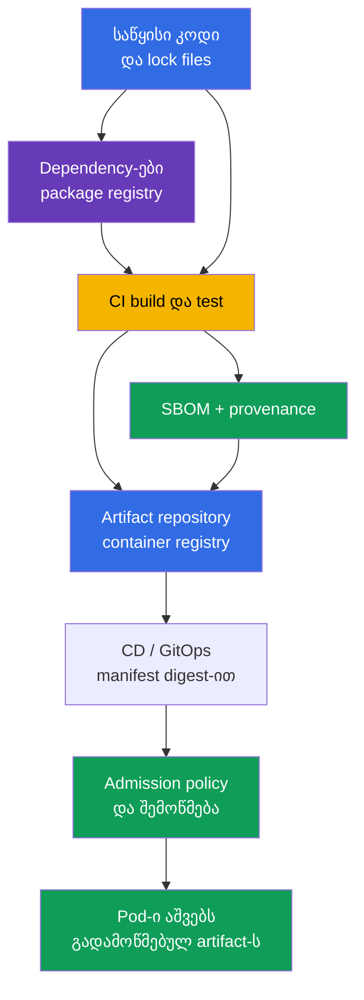
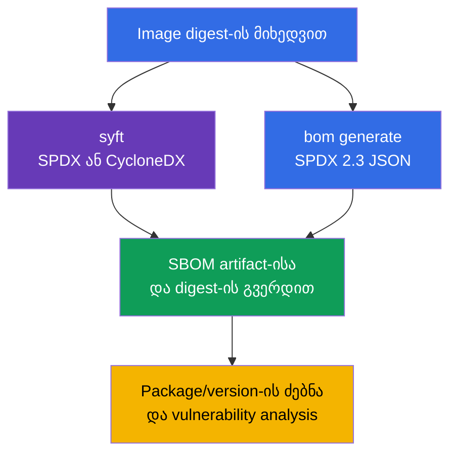
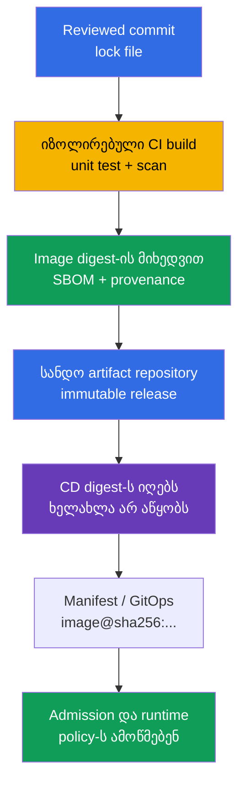
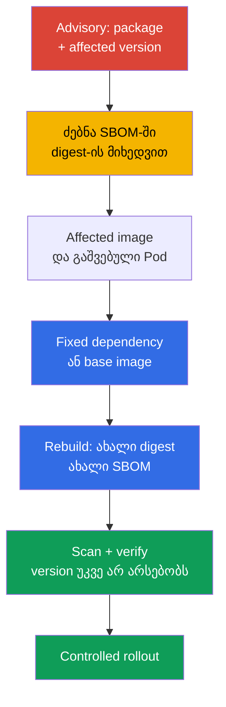

[Русская версия](ru.md) · [Eng version](README.md) · [Versión en español](es.md) · [Version française](fr.md) · [Deutsche Version](de.md) · [繁體中文版](tw.md) · [日本語版](jp.md)

# თავი 25. Supply Chain-ის გაგება: SBOM, CI/CD, artifact repositories

> **პრობლემა.** ჩანაცვლებული dependency, კომპრომეტირებული CI token ან registry-ში
> შეცვლილი tag Pod-ში ჩვეული image-სახელით უცხო code-ს შეიძლება მიაწოდოს. Digest-ზე
> მიბმული ინვენტარის გარეშე შეუძლებელია სწრაფად დავადგინოთ, რომელი კომპონენტები შედის
> artifact-ში, ვინ და რომელი საწყისი მდგომარეობიდან შეკრიბა ის. ეს დაუცველ dependency-ს
> ან მავნე build-ს მომხმარებელთან გაშვებამდე შეუმჩნეველს ტოვებს.

> **რა არის შემდეგ.** [24-ე თავში](../24/ge.md) final image-ის შემადგენლობა შევამცირეთ
> და მისი ვერსია დავაფიქსირეთ. ახლა უნდა შევძლოთ პასუხის გაცემა შემდეგ კითხვაზე: რომელი
> კომპონენტები და ვერსიები ჯერ კიდევ მოხვდა მიწოდებულ artifact-ში, ვინ და როგორ შეკრიბა
> ის. ეს არის CKS-ის **Supply Chain Security** დომენი (20%). SBOM-ით ინვენტარიზაცია
> დაუცველ კომპონენტს დაკვირვებადს ხდის, ხოლო კონტროლირებული CI/CD და registry
> deployment-მდე ნდობის ჯაჭვს ქმნიან.

> **რა გვჭირდება CKA-დან.** Image, layers, Dockerfile, tag, digest და registry-ის
> ძირეული ცნებები განხილულია [CKA-ს 23-ე თავში](../../../cka/course/23/ge.md). აქ
> კონტეინერის build-ს არ ვიმეორებთ: image-ს მიწოდების artifact-ად განვიხილავთ, მის
> ინვენტარს ვადგენთ და გზას საწყისი კოდიდან Kubernetes-მდე ვამოწმებთ.

> 🧠 Chain of trust აკავშირებს source, dependency-ებს, CI/CD-ს, registry-ს და admission-ს: ნებისმიერი გადასვლის კომპრომეტირებას `Pod`-ში უცხო artifact-ის მიწოდება შეუძლია.

## 25.1. Software supply chain და ნდობის ჯაჭვი

**Software supply chain** - ყველა ადამიანი, სისტემა, საწყისი კოდი, dependency და
artifact, რომელსაც აპლიკაცია Pod-ში გაშვებამდე გადალახავს. Container workload-ისთვის ეს
მხოლოდ Git და Dockerfile არაა: ჯაჭვში შედის dependency registry, build runner, CI/CD
credentials, container registry, manifest/GitOps repository, admission policy და
kubelet, რომელიც image-ს ჩამოტვირთავს.



ნდობის ჯაჭვი იმდენადაა ძლიერი, რამდენადაც ძლიერია მისი ყველაზე სუსტი რგოლი. თუ CI-მ
ჩანაცვლებული dependency მიღო, image არასწორი revision-იდან ხელმოწერით გამოეშვა ან CD-მ
mutable tag განავრცო, Kubernetes-ის შემდგომ შემოწმებას საწყისი artifact-ის დაბრუნება არ
შესძლო. ამიტომ ერთდროულად მნიშვნელოვანია ამოცნობა **რა** გაშვებულა (digest და SBOM),
**საიდან** მოდის ის (provenance) და **რომელი მოქმედებები** ნებადართული ყოველ გადასვლაზე.

Supply chain-ზე ტიპური შეტევები:

- dependency-ის კომპრომეტირება ან მსგავსი სახელის package-ის გამოქვეყნება
  (typosquatting), რის შემდეგაც მავნე code ჩვეულ package manager-ს მოწოდებით
  ინსტალირდება;
- maintainer-ის ანგარიშის ან CI token-ის ხელში ჩაგდება და image-ის პროექტის სახელით
  გამოქვეყნება;
- build script-ის, runner-ის, cache-ის ან base image-ის შეცვლა, რის გამოც artifact
  reviewed source-ს არ შეესაბამება;
- tag-ის ჩანაცვლება registry-ში: `app:stable` სხვა byte-ებზე მიმართავს, მიუხედავად
  იმისა, რომ Kubernetes-ის manifest არ შეცვლილა;
- თავდამსხმელის წვდომა registry-ზე ან CD credentials-ზე და პირდაპირი deploy review-ის
  გავლით;
- secret-ის გაჟონვა CI log-იდან, environment-იდან ან image layer-იდან, ამ credential-ის
  შემდგომი გამოყენებით ხელმოწერისთვის, push-ისთვის ან release-ის შესაცვლელად.

SolarWinds-ის კლასის ინციდენტი ამ პრინციპს ცხადყოფს: თავდამსხმელს ყოველი მომხმარებელი
ცალ-ცალკე ჰაკვა არ ესაჭიროება, თუ ის ერთი სანდო build ან delivery ეტაპის შეცვლის
შესაძლებლობას მოიპოვებს. Kubernetes-ში შედეგი შესაძლოა იყოს Pod-ი სწორი სახელითა და
tag-ით, მაგრამ უცხო code-ით.

ბოლოდროინდელი [Trivy-ის ინციდენტი](https://github.com/aquasecurity/trivy/discussions/10462)
ნდობის იმავე კონცენტრაციის წერტილს აჩვენებს. პროექტის შემაჯამებელი ანგარიშის მიხედვით,
2026 წლის 27 თებერვალს თავდამსხმელმა გამოიყენა დაუცველი workflow `pull_request_target`-ით,
მიღო repository და organization დონის secrets, ხოლო 19 მარტს მოპარული credential-ით
გაუშვა release workflow და გავრცელა მავნე Trivy `v0.69.4`. ძირეული პრობლემა თავად
scanner-ში არ იყო, არამედ პრივილეგირებულ CI-ში, რომელმაც შეამოწმებელი PR-code გაუშვა და
ჰქონდა წვდომა ჭარბ secrets-ზე; service accounts-ის არასაკმარისმა იზოლაციამ და
არაეფექტურმა rotation-მა შედეგი გააძლიერა. ეს არ ნიშნავს Trivy-ის ან Kubernetes Pod-ების
ყველა მომხმარებლის კომპრომეტირებას, მაგრამ SolarWinds-ის გაკვეთილს ადასტურებს: ერთი
სანდო build/release ეტაპი ფართო credential-ებით თავდამსხმელს უცხო code-ის მასშტაბირებად
მიწოდების გზას აძლევს.

დაცვის ერთ scanner-ზე დაყვანა არ შეიძლება. SBOM შემადგენლობას აჩვენებს, scanner მას
ცნობილ CVE-ებთან ადარებს, signature/provenance artifact-ს build პროცესთან აკავშირებს, ხოლო
admission policy არ უშვებს artifact-ს, რომელიც წესებს არ შეესაბამება. ეს მექანიზმები
ერთმანეთს ავსებენ.

> 🧠 SBOM - კონკრეტული artifact-ის შემადგენლობის ინვენტარია, არა scan report და არა მისი წარმომავლობის კრიპტოგრაფიული მტკიცებულება.

## 25.2. SBOM: კომპონენტების ინვენტარი და ფორმატები SPDX 2.3 JSON/CycloneDX

**SBOM** (Software Bill of Materials) - artifact-ის კომპონენტების, ბიბლიოთეკების, მათი
ვერსიების, იდენტიფიკატორების, licenses-ის და ხანდახან dependency relationships-ის
მანქანურად წამკითხავი სია. Container image-ისთვის გენერატორი filesystem-ს და layers-ის
package metadata-ს კითხულობს; SBOM უპირველესად პასუხობს კითხვას «რა მოიძებნა ამ
artifact-ში». ეს არც CVE-ის არარსებობის მტკიცებულებაა და არც თავად მისი წარმომავლობის
კრიპტოგრაფიული proof-ი.

ყველაზე გავრცელებულია ორი ღია ფორმატი:

| ფორმატი | დანიშნულება და ძალა | სად უფრო ხშირად შეხვდება |
|---|---|---|
| **SPDX 2.3 JSON** | Linux Foundation-ის სტანდარტი software-ის შემადგენლობის, licenses-ის, packages-ის და relationships-ისთვის; კარგად შესაფერისი compliance-ისთვის და inventory-ის გაცვლისთვის | OCI artifacts, დისტრიბუციები, CI და Kubernetes ecosystem |
| **CycloneDX** | Open Worldwide Application Security Project (OWASP)-ის ფორმატი, ორიენტირებული component analysis-სა და security tooling-ზე; ხერხემალია vulnerability management-ისთვის | scanners, dependency analysis, security dashboards |

ორივე ფორმატს ერთი image-ის აღწერა შეუძლია, მაგრამ მათი JSON-ველები განსხვავებულია.
ქვემოთ ყველა SPDX-ის მაგალითი ეხება **SPDX 2.3 JSON**-ს: ამ schema-ში packages ჩვეულებრივ
`.packages`-შია, ხოლო ვერსია - `versionInfo`-ში; CycloneDX-ში კომპონენტები
`.components`-შია, ხოლო ვერსია - `version`-ში. ეს paths SPDX 3.0-ზე არ გადაატანოთ: მას
სხვა data model გააქვს. არ ჩაწეროთ უნივერსალური `jq`-query, ფაილის ფორმატისა და ვერსიის
უცნობად: შედეგის არარსებობა შესაძლოა JSON-ის არასწორ path-ს ნიშნავდეს, არა package-ის
არარსებობას.

SBOM-ს სიზუსტის საზღვრებიც აქვს:

- package database ყველა image-ს არ ჰყოფნის; static binary ბიბლიოთეკებს შესაძლოა
  შეიცავდეს, მაგრამ package manager-ის ჩვეული metadata არ ჰყოფნის;
- scanner-ს კომპონენტის ევრისტიკულად განსაზღვრა ძალუძს, ამიტომ სახელი ან ვერსია
  manifest-ისა და lock file-ის მიხედვით უნდა გადამოწმდეს;
- SBOM გენერაციის მომენტს ასახავს. Base image-ის rebuild-ის, dependency-ის ან digest-ის
  შეცვლის შემდეგ ახალი SBOM იქმნება;
- ერთი version string ჯერ არაფერს ნიშნავს vulnerability-ის თვალსაზრისით: მნიშვნელოვანია
  მისი შედარება vendor advisory-სთან, OS distribution-თან, architecture-სთან და
  fix-ის სტატუსთან.

**Runtime SBOM და სრული build ჯაჭვი - სხვადასხვა ინვენტარია.** Final multi-stage
image-ის SBOM აღწერს იმას, რაც runtime-მდე მიაღწია; გაუთვალისწინდა builder stages-ის
dependency-ები მასში ბუნებრივად არ ჩანს. `--scope all-layers` ანალიზიც კონეც image-ის
layers-ს მოიცავს, არა build-ის ყველა გამქრალ stage-ს. Supply chain-ის სრული inventory-ისთვის
source, lock files, build attestations და provenance ესაჭიროება: package-ის
არარსებობა final SBOM-ში არ ამტკიცებს, რომ ის build-ის პროცესში არ იყო.

პრაქტიკული წესი: SBOM იმ artifact-ისა და იმ immutable digest-ის გვერდით შეინახეთ,
რომლისთვისაც ის შექმნილია. ფაილი `api-1.4.2.spdx.json`, შექმნილი `api:1.4.2`-სთვის,
არასაკმარისია, თუ ეს tag მოგვიანებით გადაწერეს; კავშირი `@sha256:...`-სთან უნდა იყოს.

## 25.3. SBOM-ის გენერაცია: `syft` და `bom` Kubernetes ecosystem-იდან

გენერაციამდე დაფიქსირეთ image-ის reference. Tag მოსახერხებელია მხოლოდ ადამიანური
წაკითხვისთვის; report-ისთვის, შემოწმებისთვის და production deployment-ისთვის
digest აიღეთ, რომელიც თქვენმა registry-მ დააბრუნა:

```bash
IMAGE='registry.example.com/payments/api:1.4.2@sha256:<64-hex-digest>'
```

Release-ში დოკუმენტაციიდან შემთხვევითი digest არ ჩასვათ. თავდაპირველად აღებული digest
გადამოწმებული image-ის სანდო registry-დან მიიღეთ და SBOM-ის გვერდით შეინახეთ.
გენერატორს შესაძლოა private image-ისთვის registry credential ესაჭიროდეს; parole-ის
shell history-ში ან commit-ში გატანა არ შეიძლება.

> 🔬 `syft` SBOM-ს რამდენიმე ფორმატში აწარმოებს.

### `syft`: SPDX 2.3 JSON და CycloneDX ერთი image-იდან

[Syft](https://github.com/anchore/syft) კატალოგირებას უკეთებს packages-ს image-ში,
directory-ში ან archive-ში და რამდენიმე ფორმატის output-ის გამოტანა ძალუძს. შემდეგი
ბრძანებები ერთი და იმავე image-ისთვის ორ დამოუკიდებელ ფაილს ქმნიან:

```bash
syft "$IMAGE" -o spdx-json > api.spdx.json
syft "$IMAGE" -o cyclonedx-json > api.cyclonedx.json
```

თუ reference multi-arch OCI index-ზე მიუთითებს, პლატფორმა ცალსახად აირჩიეთ.
Heterogeneous cluster-ისთვის ცალკე SBOM შექმენით და დაინდექსეთ ფაქტობრივად გამოყენებული
ყოველი platform manifest-ისთვის; მის გვერდით ამ manifest-ის platform-ი და digest
შეინახეთ, არა მხოლოდ index-ის digest:

```bash
PLATFORM='linux/amd64'
syft "$IMAGE" --platform "$PLATFORM" -o spdx-json > api.linux-amd64.spdx.json
```

ეკვივალენტური მოკლე ბრძანებები, რომელთა გახსენება გამოცდაზე სასარგებლო იქნება:

```bash
syft <image> -o spdx-json
syft <image> -o cyclonedx-json
```

გადაამოწმეთ, რომ ფაილი ცარიელი არაა და JSON-ია, სანამ მას scanner-ს გადასცემთ ან
evidence-ად შეინახავთ:

```bash
jq -e '
  .spdxVersion == "SPDX-2.3"
  and .SPDXID == "SPDXRef-DOCUMENT"
  and .dataLicense == "CC0-1.0"
  and (.documentNamespace | type == "string")
  and (.creationInfo.creators | type == "array")
  and (.packages | type == "array")
' api.spdx.json >/dev/null
jq -e '.bomFormat == "CycloneDX" and (.components | type == "array")' \
  api.cyclonedx.json >/dev/null
```

პირველი query - მოსალოდნელი SPDX 2.3 JSON-ის **sanity-check**-ია, მეორე - CycloneDX
JSON-ის. ის ცარიელ output-ს, registry-ის HTML-error-ს და სხვა ფორმატის JSON-ს გამორიცხავს,
მაგრამ სრული schema/conformance validation არ არის: ამისთვის საჭირო specification-ის
ვერსიასთან თანხმობაში მყოფი SPDX validator გამოიყენეთ. კონკრეტულ SBOM-ს შესაძლოა არ
ჰქონდეს ველი, რომელიც თქვენი generator ვერსიისთვის სავალდებულო არაა; document-ის ბაზისური
ველები, ფორმატი და კომპონენტების სია მაინც ცალსახად გადაამოწმეთ.

> 🎯 `kubernetes-sigs/bom` - Kubernetes-ორიენტირებული გზა: მოცემული image-ისთვის შექმენით SPDX JSON, გადაამოწმეთ სტრუქტურა და შეინახეთ შედეგი.

### `bom`: Kubernetes-ორიენტირებული გზა SPDX 2.3 JSON-მდე

[`bom`](https://github.com/kubernetes-sigs/bom) - Kubernetes SIGs-ის ინსტრუმენტი
software bill of materials-თან სამუშაოდ. ეს CKS-ის მნიშვნელოვანი პრაქტიკული
ინსტრუმენტია: მისი დოკუმენტაცია გამოცდაზე დაშვებულია, ხოლო lab 111-ში SPDX 2.3 JSON-ის
გენერაციისთვის გამოიყენება. აქტუალურ გარემოში ჯერ ხელმისაწვდომ flags-ს დაუკვირდით და
syntax-ს არ იმხედვდით:

```bash
bom generate --help
```

Image-ისთვის ბრძანება ლაბორატორიის სცენარიდან SPDX-JSON ფაილს ქმნის:

```bash
bom generate --image "$IMAGE" --format json --output out.spdx.json
```

მოკლე ფორმაში `bom`-ის ზოგიერთი ვერსია `-o`-ს იყენებს:

```bash
bom generate --image "$IMAGE" --format json -o sbom.spdx.json
```

`--format json` ამ ბრძანებაში SPDX-ის JSON-წარმოდგენას ნიშნავს, არა CycloneDX-ს. ფაილს
`*.cyclonedx.json`-ად არ დაარეკოთ: სახელს ფაქტობრივი ფორმატი უნდა ატყობინოს, რომ
შემდგომმა `jq`, scanner-მა და reviewer-მა სწორი schema შეარჩიონ. მიღებული ფაილი SPDX-ად
გადაამოწმეთ და მოძებნილი packages დათვალეთ:

```bash
jq -e '
  .spdxVersion == "SPDX-2.3"
  and .SPDXID == "SPDXRef-DOCUMENT"
  and .dataLicense == "CC0-1.0"
  and (.documentNamespace | type == "string")
  and (.creationInfo.creators | type == "array")
  and (.packages | type == "array")
' out.spdx.json >/dev/null
jq '.packages | length' out.spdx.json
```

ეს sanity-check-ია, არა SPDX-ის სრული schema/conformance validation.

თუ `bom` ლოკალურ image-ს ვერ ხედავს, reference მიუთითეთ, ხელმისაწვდომი იმ
runtime/registry-სთვის, საიდანაც ბრძანება გაშვებულია, და `bom generate --help`
გადაამოწმეთ გარემოში დაინსტალირებული ვერსიისთვის. წვდომის error-ს ხელოვნურად
შექმნილი JSON-ით არ შეანაცვლოთ: ეს credentials-ის ან artifact-ის არასწორი სახელის
პრობლემას ჰმალავს.



> 🎯 მოცემული image digest-ისთვის SBOM-ში ზუსტი package და მისი version მოძებნეთ; მხოლოდ სახელით ძებნა advisory-ის გამოსაყენებლობას არ ამტკიცებს.

## 25.4. SBOM-ის წაკითხვა: package-ისა და კონკრეტული ვერსიის მოძებნა

გამოცდისა და production სცენარი ჩვეულებრივ advisory-ით იწყება: მაგალითად, ცნობილია, რომ
ერთ-ერთ image-ში `ca-certificates-bundle` განსაზღვრული ვერსია დგას. დასკვნის image-ის
სახელით ან tag-ით გამოტანა არ შეიძლება. საჭიროა package-ისა **და მისი version**-ის
მოძებნა კონკრეტული digest-ის SBOM-ში, ხოლო შემდეგ შედეგის გაშვებულ workload-თან შედარება.

SPDX 2.3 JSON-ისთვის, შექმნილი `bom`-ით ან `syft`-ით, ზუსტი package-ის სახელი და version
ასეთი ბრძანებით ჩვენდება:

```bash
jq -r '
  .packages[]
  | select(.name == "ca-certificates-bundle")
  | [.name, .versionInfo, .SPDXID] | @tsv
' out.spdx.json
```

თუ package ფაქტობრივად არსებობს, `name`, `versionInfo` და `SPDXID`-ის სტრიქონს
დაინახავთ. თუ output ცარიელია, deployment ბრმად არ შეცვალოთ. თანმიმდევრობით
გადაამოწმეთ: სწორი SBOM ხომ არ არჩეულა, ფორმატი ხომ არასწორი არაა, როგორ დაარეკა
generator-მა package და ხომ არ არის ის სხვა image/sidecar-ში.

სახელის ნაწილით ძებნა საწყისი კვლევისთვის სასარგებლოა, მაგრამ რამდენიმე package-ს
დაბრუნება ძალუძს და ვერსიის საბოლოო შემოწმებად არ ვარგა:

```bash
jq -r '
  .packages[]
  | select(.name | test("ca-certificates"; "i"))
  | [.name, (.versionInfo // "<versionInfo არ არსებობს>")] | @tsv
' out.spdx.json
```

CycloneDX JSON-ისთვის path და ველის სახელი იცვლება:

```bash
jq -r '
  .components[]
  | select(.name == "ca-certificates-bundle")
  | [.name, .version, (.purl // "<purl არ არსებობს>")] | @tsv
' api.cyclonedx.json
```

`purl` (package URL) სხვადასხვა ecosystem-იდან ერთსახელოვან packages-ის გარჩევაში
ეხმარება. ნამდვილი გამოკვლევის დროს ticket-ში ეს დაფიქსირეთ: image digest, package-ის
სახელი/version, SBOM-ის ფაილის სახელი და advisory/CVE. მაშინ სხვა ინჟინერს შედეგის
გამეორება შესძლებია, ვიდრე «დაახლოებით ასეთი package»-ის სხვა rebuild-ში ძებნა.

კომპონენტის მოძებნის შემდეგ SBOM cluster-თან დააკავშირეთ. Image references, რასაც
Pod-ები ფაქტობრივად იყენებენ, ასე ჩვენდება:

```bash
kubectl get pods -A \
  -o jsonpath='{range .items[*]}{.metadata.namespace}{"\t"}{.metadata.name}{"\t"}{range .spec.containers[*]}{.image}{"\n"}{end}{end}'
```

ეს output დაფიქსირებულ image reference-ს აჩვენებს. `status.containerStatuses[].imageID`
სასარგებლოა node-ისგან გაშვებულ container-ზე მიღებული runtime-specific evidence-ად,
მაგრამ ეს არ არის ტრანსფერული registry digest და აუცილებლად არც OCI index-ის ან
platform manifest-ის digest. ძალიან საიმედო incident evidence-ისთვის digest-pinned
`spec.containers[].image` გამოიყენეთ, node-ის architecture განსაზღვრეთ, registry/index
შესატყვის platform manifest-მდე გახსენით და SBOM მასთან შეადარეთ. Node-ზე წვდომისას
დამატებით runtime inventory გადაამოწმეთ:

```bash
kubectl get pod <pod> -n <namespace> \
  -o jsonpath='{range .status.containerStatuses[*]}{.name}{"\t"}{.imageID}{"\n"}{end}'
kubectl get node <node> -o jsonpath='{.metadata.labels.kubernetes\.io/arch}{"\n"}'
crictl images --digests
```

ტიპური შეცდომაა მთელი Deployment-ის წაშლა, SBOM-ში package-ის სახელის დამთხვევის
დანახვისთანავე. თავდაპირველად affected container და მისი image digest განსაზღვრეთ,
fixed image მოამზადეთ, build, SBOM და scan გაიმეორეთ, ხოლო შემდეგ image ჩვეულებრივი
controlled rollout-ით შეცვალეთ. Workload-ის წაშლას სერვისის შეწყვეტა ძალუძს და
registry-ში დაუცველ artifact-ს არ აღმოფხვრის.

> 🏭 საიმედო მიწოდება release/index-ის digest-ს ფიქსირებს, ხოლო შემდეგ target platform-manifest digest-ს და მასთან SBOM, provenance და scan report აკავშირებს; CI artifact-ს აქვეყნებს, CD მას ხელახალი build-ის გარეშე ავითარებს.

## 25.5. CI/CD, artifact repositories, provenance და SLSA

**CI** artifact-ს ატყუპებს, ტესტავს, სკანირებს და აქვეყნებს; **CD** უკვე მომზადებულ
artifact-ს environments-ს შორის ავითარებს ან manifest-ს cluster-ში მოქმედს ხდის. მათ
შორის საზღვრის გარეშე CI შეუმჩნევლად პრივილეგირებულ deploy shell-ად შეიძლება იქცეს.
სასარგებლო role-ების გამიჯვნა: CI-ს staging repository-ში publish-ის შეზღუდული უფლება
აქვს, CD მზა digest-ს იღებს და მხოლოდ დამტკიცებულ immutable artifact-ს ავითარებს.

**Artifact repository** build-ის შედეგებს ინახავს: OCI images container registry-ში,
packages, charts, SBOM, attestations და provenance. Registry უბრალო Docker Hub cache
არაა: ის release-ის სანდო წყარო უნდა იყოს, immutable digest შეინახოს, push/pull შეზღუდოს
და შესაძლებლობის შემთხვევაში release tag-ის overwrite-ი აკრძალოს. რეალიზაციის
მაგალითებია Harbor, Amazon ECR, Google Artifact Registry, Azure Container Registry,
GitHub Container Registry ან შინაგანი OCI registry. კონკრეტული პროდუქტი მეორეხარისხოვანია;
მნიშვნელოვანია access control, retention, audit და release artifacts-ის
უცვლელობა.



**Provenance** - metadata artifact-ის წარმომავლობაზე: რომელი source revision, build
definition, builder და input მასალები მონაწილეობდნენ build-ში. SBOM-ისგან განსხვავებით,
provenance ყველა ბიბლიოთეკას არ ამოწერს; ის output-ს კონტროლირებულ build პროცესთან
აკავშირებს. ძლიერი ჯაჭვისთვის გაარჩიეთ release/index-ის digest და არჩეული platform
manifest-ის digest: SBOM, scan და provenance იმ artifact-ს უნდა ეკუთვნოდეს, რომელი
ფაქტობრივად ხდება გადამოწმებული ან გაშვებული.

> 🔬 SBOM-ის, provenance-ისა და signature-ის კავშირი digest-თან SLSA მოდელში.

[SLSA](https://slsa.dev/) (Supply-chain Levels for Software Artifacts) ვერსია 1.2-ში
მოთხოვნებს დამოუკიდებელ tracks-ად ყოფს. ამიტომ SLSA-ს ერთიანი «საწყისი-მაღალი» შკალა
არ აქვს: Build Track build-ისა და provenance-ის გარანტიებს აღწერს, ხოლო Source Track-ს
source-ის თავისი მოთხოვნები აქვს.

| Track | დონეები SLSA v1.2 | პრაქტიკული აზრი |
|---|---|---|
| Build | L0 | SLSA-ის გარანტიები არ არსებობს. |
| Build | L1 | Provenance არსებობს. |
| Build | L2 | ხელმოწერილი provenance hosted build platform-ის მიერ იქმნება. |
| Build | L3 | გამოყენებულია hardened build platform. |
| Source | L1-L4 | Source-ის მოთხოვნების ცალკეული დონეები; მათი Build Track-ის დონიდან გამოტანა არ შეიძლება. |

ყოველი დონის მოთხოვნებისთვის [Build Track](https://slsa.dev/spec/v1.2/build-track-basics)-ისა
და [Source Track](https://slsa.dev/spec/v1.2/source-requirements)-ის specification-ს
დაუკვირდით, არა ავტორისეულ ოთხსაფეხურიან შკალას. პროექტი «SLSA Level N»-ად არ გამოაცხადოთ
მხოლოდ იმის გამო, რომ ის SBOM-ს აწარმოებს: მითითებული უნდა იყოს track, specification-ის
ვერსია და შესატყვისი მოთხოვნების შესრულების მტკიცებულებები.

BuildKit-ს SBOM/provenance attestations-ის შექმნა და გამოქვეყნება image/index-თან
ერთად ძალუძს:

```bash
IMAGE_TAG='registry.example.com/payments/api:1.4.2'
docker buildx build --sbom=true --provenance=mode=max,version=v1 --push \
  --tag "$IMAGE_TAG" .
```

`version=v1` აქ მოსალოდნელ ფორმატს ცალსახად აფიქსირებს: აქტუალურ upstream BuildKit-ში
SLSA provenance `v1` default-ია; BuildKit/Buildx-ის ძველ ვერსიებს `v0.2`-ის გამოტანა
ძალუძდათ. ამიტომ ამ პარამეტრით `Statement/v1` გადაამოწმეთ `https://slsa.dev/provenance/v1`-თან.
Push-ის შემდეგ immutable digest შეინახეთ და multi-arch release-ისთვის განსაზღვრეთ
platform manifest, რომელი გაშვებული იქნება. ეს build-native attestations output-ის
build-თან დაკავშირებისთვის სასარგებლოა, მაგრამ ცალკე signature-ის, final image-ის
SBOM-ისა და მთელი ჯაჭვის source/lock files-ის მიხედვით inventory-ის შემოწმებას არ
აუქმებს.

პრაქტიკაში გაუმჯობესებები ასე გამოიყურება:

- dependencies lock-ეთ და build definition-ის ცვლილება review-ეთ;
- release build ephemeral/isolated runner-ში გაშვეთ, არა ერთობლივ სამუშაო მანქანაზე;
- CI-ს short-lived credential მინიმალური უფლებებით მიაწოდეთ და publish-ის უფლება
  deploy-ის უფლებისგან გამიჯნეთ;
- image, SBOM და provenance ატომურად გამოაცხადეთ, ყველაფერი immutable digest-თან
  მიბმული;
- protected branches, required review და registry/CI-ის audit log გამოიყენეთ;
- CD-ში digest ავითარეთ, ხელახალ build-ს სხვა environment-იდან არ გაშვათ.

OCI index-ისთვის ეს არა ერთი უნივერსალური digest, არამედ ჯაჭვია: `release/index digest →
platform manifest digest → SBOM/provenance/scan evidence`. თავდაპირველად target
platform შეარჩიეთ, index მისი manifest-მდე გახსენით და შესატყვისი attestation
მოძებნეთ; შემდეგ in-toto `subject.digest` გადაამოწმეთ. Docker attestation manifest-ს
root index-ში ინახავს, მაგრამ მისი `subject` target platform manifest-ს უნდა
მიუთითებდეს (ან მასში მდებარე ობიექტს). Single-platform image release-ისთვის release
digest და platform-manifest digest დაემთხვევა, მაგრამ ეს ვარაუდი არ შეიძლება.

მინიმალური SLSA/in-toto provenance შესატყვის platform manifest-ს მიბმული `subject`-იან
statement-ია. მაგალითად, სტრუქტურას ასეთი ფორმა ძალუძს:

```json
{
  "_type": "https://in-toto.io/Statement/v1",
  "subject": [{
    "name": "registry.example.com/payments/api",
    "digest": {"sha256": "<64-hex-platform-manifest-digest>"}
  }],
  "predicateType": "https://slsa.dev/provenance/v1",
  "predicate": {
    "buildDefinition": {
      "buildType": "https://ci.example.com/buildtypes/release/v1",
      "externalParameters": {}, "resolvedDependencies": []
    },
    "runDetails": {"builder": {"id": "https://ci.example.com/builders/release"}}
  }
}
```

Provenance-ის გამოყენებამდე თავდაპირველად სანდო release/index target platform
manifest-მდე გახსენით, ხოლო შემდეგ `subject.digest.sha256` ზუსტად ამ manifest-ის
digest-თან შეადარეთ. ეს tag-ის გამოცნობის გარეშე შემოწმდება:

```bash
PLATFORM_MANIFEST_DIGEST='sha256:<64-hex-platform-manifest-digest>'
jq -e --arg digest "${PLATFORM_MANIFEST_DIGEST#sha256:}" \
  '.subject[] | select(.digest.sha256 == $digest)' provenance.intoto.json >/dev/null
```

წარმატებული `jq` statement-ის მოსალოდნელ platform manifest-თან მიბმას ამტკიცებს, მაგრამ
არა თავად statement-ის ავთენტურობას. Artifact-ის ხელმოწერასა და `cosign verify`-ის
კრიპტოგრაფიულ შემოწმებას დაწვრილებით [26-ე თავი](../26/ge.md) განიხილავს; SBOM ამ
შემოწმებას არ ანაცვლებს.

> 🎯 SBOM გამოიყენეთ affected package/version-ის დასადასტურებლად კონკრეტულ digest-ში, ხოლო შემდეგ artifact შეცვალეთ და გადაამოწმეთ, რომ დაუცველი კომპონენტი გაქრა.

## 25.6. SBOM დაუცველი კომპონენტების ძებნაში

CVE-ის ან vendor advisory-ის გამოჩენისას SBOM incident-ის კითხვას «ჩვენს ათასობით
image-დან რომლები?»-დან «რომელი digests შეიცავს affected package/version-ს?»-მდე
ამოკლებს. ეს **გვიან აღმოჩენისთვისაც** ესაჭიროება: build-ის ეტაპზე scanner-მა შესაძლოა
პრობლემა ვერ ეპოვა, რადგან CVE ან affected versions-ის შესახებ ინფორმაცია ჯერ არ
გამოქვეყნებულა. Scan-ის შედეგი შემოწმების მომენტისთვის ცოდნის ბაზას ასახავს და უკვე
გაშვებულ image-ში მომავალი advisory-ების არარსებობას არ იძლევა.

ამიტომ build pipeline-ის გარეთ **რეგულარულად ხელახლა შეადარეთ შენახული SBOM-ები
განახლებულ CVE ბაზას**: გრაფიკის მიხედვით და მოულოდნელად ახალი მნიშვნელოვანი CVE-ის ან
vendor advisory-ის გამოქვეყნებისას. ასეთი შემოწმება artifact-ს ხელახლა არ აწყობს: ის
ამავე immutable digest-ს აქტუალურ მონაცემებზე დაყრდნობით აფასებს და affected
releases-ის triage-ს უნდა უშვებდეს.

სამუშაო ციკლი:

1. advisory-ის ზუსტი პირობების მიღება: package, ecosystem/distribution, affected
   versions და fixed version;
2. package/version-ის მოძებნა ყოველი candidate release digest-ის შენახულ SBOM-ში,
   tag-ზე დაყრდნობის გარეშე; შედეგი affected digest-ების სია იქნება;
3. affected digest-ის runtime inventory-სთან შედარება: `spec.containers[].image`
   დაფიქსირებულ reference-ს აჩვენებს; `status.containerStatuses[].imageID` -
   runtime-specific hint-ია, არა ტრანსფერული registry/platform-manifest digest.
   Multi-arch-ისთვის node-ის architecture, platform manifest და მასთან
   დაკავშირებული SBOM შეადარეთ;
4. affected digest-ის გაშვებულ workloads-ად, registry-ში მხოლოდ ხელმისაწვდომ და უკვე
   ექსპლუატაციიდან გამოსულებად დაყოფა; თავდაპირველად მაღალი business/risk impact-ის
   მქონე გაშვებული workload აღმოფხვრეთ, შემდეგ დანარჩენი release;
5. fixed artifact-ის შეკრება ან შერჩევა, ახალი SBOM-ის გენერაცია და გადამოწმება, რომ
   affected version გაქრა ან შეიცვალა;
6. scan, ხელმოწერა/გადამოწმება და მხოლოდ შემდეგ digest-ის CD-ით გავრცობა;
7. SBOM-ის, scan-ის შედეგისა და rollout-ის evidence-ად შენახვა incident response-ისა
   და audit-ისთვის.

სწრაფი response-ისთვის ინდექსი `digest → SBOM → scan timestamp → environment/workload`
შეინახეთ. მაშინ ახალი CVE inventory-ზე query-ს, ვიდრე ყველა image-ის ხელით scan-ის
გამეორებას, უშვებს: თავდაპირველად SBOM-ის მიხედვით პოტენციურად affected
release/platform-manifest digest დგინდება, ხოლო შემდეგ digest-pinned spec-ით,
platform node-ითა და runtime `imageID`-ით, დამატებით hint-ად, გაშვებული workload
დასტურდება. ერთი tag საკმარისი არაა: ის mutable შესაძლოა იყოს და უკვე გაშვებული Pod-ის
byte-ებს არ ამტკიცებს.



SBOM vulnerability scanner-ს არ ანაცვლებს. ის inventory-ს იძლევა, ხოლო scanner CVE
ბაზას, შედარების წესებსა და severity-ს ამატებს. [28-ე თავში](../28/ge.md) Trivy-სა და
Grype-ს image-სა და მზა SBOM-ზე ავამოქმედებთ. მანამდე სასარგებლოა შევძლოთ ხელით
package/version-ის `jq`-ით მტკიცება: ეს ფორმატს, scanner-ის მონაცემებსა და
ავტომატიზაციის შეცდომებს დიაგნოსტირებს.

**VEX** (Vulnerability Exploitability eXchange) ამ მოდელს ავსებს: SBOM პასუხობს, რა
შედის artifact-ში, scanner ან advisory კომპონენტს CVE-სთან ადარებს, ხოლო VEX
დადასტურებულ სტატუსს ინახავს კონკრეტული vulnerability-ის მოცემულ პროდუქტთან
გამოსაყენებლობის ან ექსპლუატირებადობის შესახებ. Package/version-ისა და CVE-ის
არსებობა ჯერ არ ნიშნავს, რომ vulnerability გამოსაყენებელია ან ექსპლუატირებადი; VEX
შემოწმებასა და გამოსწორებას არ აუქმებს, გადაწყვეტილებას ხოლო შემოწმებადს ხდის.

ასევე არ ერიოთ «SBOM-ში ვერ მოიძებნა» და «უსაფრთხოა». არარსებობის მიზეზები
შეიძლება იყოს არასრული detector, static link, არასწორი image, მოძველებული SBOM ან
სხვა სახელით package. Critical incident-ისთვის ძებნას lock file-ით, source
repository-ით, base image-ის release notes-ითა და runtime image ID-ით ავსეთ.

> 🎯 პრაქტიკული შედეგი - ვალიდური SPDX JSON და დავალებიდან image-ისთვის package/version-ის რეპროდუცირებადი მოძებნა, არა მხოლოდ წარმატებით შესრულებული ბრძანება.

## 25.7. გადამოწმება: SBOM `bom`-ით და მოცემული package/version-ის ძებნა

Lab 111-ში CKS-ის დავალებისთვის საჭირო სრულ მინიმუმს ვამოწმებთ: SBOM-ის გენერაცია
`bom`-ით, დაჯერება, რომ ეს ვალიდური SPDX 2.3 JSON-ია, და მასში მოცემული
package/version-ის მოძებნა. ლაბორატორიის მიერ გაცემულ training image-ზე ან თქვენს
ნებადართულ image-ზე იმუშავეთ; mutable `latest`-ს evidence-ად არ გამოიყენოთ.

```bash
IMAGE='<image-from-lab-or-registry>@sha256:<64-hex-digest>'

# 1. SPDX 2.3 JSON-ის შექმნა Kubernetes SIGs bom-ით.
bom generate --image "$IMAGE" --format json --output out.spdx.json

# 2. SPDX 2.3 sanity-check-ის შესრულება და დაჯერება, რომ packages ცარიელი არაა.
jq -e '
  .spdxVersion == "SPDX-2.3"
  and .SPDXID == "SPDXRef-DOCUMENT"
  and .dataLicense == "CC0-1.0"
  and (.documentNamespace | type == "string")
  and (.creationInfo.creators | type == "array")
  and (.packages | type == "array")
  and (.packages | length > 0)
' out.spdx.json >/dev/null

# 3. მოცემული package-ისა და მისი version-ის მოძებნა.
jq -r '
  .packages[]
  | select(.name == "ca-certificates-bundle")
  | [.name, .versionInfo, .SPDXID] | @tsv
' out.spdx.json
```

თუ ლაბა სხვა წყვილს `package/version` აფიქსირებს, `select`-ში მხოლოდ value შეცვალეთ,
არა შემოწმების თავად schema. მიღებული ვერსია პირობასთან შეადარეთ: package-ის ძებნა
ვერსიის შედარების გარეშე ზუსტად დაუცველი კომპონენტის მოძებნას არ ამტკიცებს.

დამატებითი cross-check-ისთვის იმავე image-ის Syft-ით გენერირება:

```bash
syft "$IMAGE" -o spdx-json > syft.spdx.json
jq -e '
  .spdxVersion == "SPDX-2.3"
  and .SPDXID == "SPDXRef-DOCUMENT"
  and .dataLicense == "CC0-1.0"
  and (.documentNamespace | type == "string")
  and (.creationInfo.creators | type == "array")
  and (.packages | type == "array")
' syft.spdx.json >/dev/null
```

ეს sanity-check-ია, არა SPDX-ის სრული schema/conformance validation.

### ტიპური შეცდომების დიაგნოსტიკა

| სიმპტომი | სავარაუდო მიზეზი | რა გადამოწმდეს |
|---|---|---|
| `bom` ან `syft` image-ს ვერ ჩამოტვირთავს | private registry, არასწორი reference ან ქსელი | registry login/credential, repository, tag/digest, runner-ის წვდომა registry-ზე |
| `jq` parse error-ს აცხადებს | output JSON არაა, ფაილი ცარიელია ან შეცდომაა მოხვედრილი | ფაილის ზომა, ბრძანების stderr, ფაილის პირველი სტრიქონები; SBOM-ის ხელახლა გენერაცია |
| `jq` package-ს ვერ პოულობს | სხვა სახელი, სხვა JSON ფორმატი, სხვა image digest ან metadata-ს არარსებობა | `.packages[].name`, `.components[].name`, digest, package manager database |
| package მოძებნილია, მაგრამ ვერსია არ ემთხვევა | image სხვა base/dependency-დან შეკრებილა ან advisory სხვა distribution-ს ეხება | `versionInfo`, purl, base image, lock file და advisory-ის პირობები |
| SBOM არსებობს, მაგრამ deployment კვლავ დაუცველია | CD-მ tag/ძველი digest გამოიყენა ან rollout არასრულია | manifest `image:`, Pod `imageID`, rollout status და registry digest |

შემოწმების მზაობის კრიტერიუმი: არსებობს არ-ცარიელი SPDX 2.3 JSON, გავლილი
sanity-check-ით (სრული conformance-ისთვის - ცალკე SPDX validator), მასში
დაფიქსირებულია package/version კონკრეტული platform manifest digest-ისთვის, ხოლო
ბრძანებები და ფაილები შედეგის გამეორებისთვის სხვა ინჟინერს გადასაცემია.

> 🏭 ავტომატიზირეთ SBOM, provenance და scan evidence-ის გამოშვება და შენახვა ყოველი release digest-ისთვის; ინციდენტის შემდეგ ხელით შექმნილი report ამ პროცესს არ ანაცვლებს.

## 25.8. როგორ გამოიყენება ეს production-ში

- **SBOM release build-ზე იქმნება.** გენერაცია ავტომატურად ხდება CI-ში ყოველი
  publishable digest-ისთვის, არა ხელით ინციდენტის შემდეგ. SBOM შეიძლება იყოს
  დამოუკიდებელი SPDX/CycloneDX ფაილი ან OCI artifact/referrer, image digest-თან
  დაკავშირებული. ხელმოწერილი attestation - ცალკე დებულებაა `subject`-ზე predicate-ით:
  მას SBOM-ის ან provenance-ის ტარება ძალუძს, მაგრამ ყოველი SBOM attestation არაა.
  პრაქტიკული მოდელი: `image digest <- OCI SBOM artifact/referrer` და `image digest
  <- ხელმოწერილი attestation (predicate=SBOM/provenance)`. ამ მონაცემების retention
  თავად release-ზე ნაკლები არ უნდა იყოს.
- **Digest - release-ის იდენტიფიკატორების ჯაჭვი.** Multi-arch-ისთვის თავდაპირველად
  release/index-ის digest ფიქსირდება, ხოლო შემდეგ არჩეული platform-manifest digest;
  SBOM, scan report, provenance და change record ამ ჯაჭვის შესატყვის დონეს ერთვის.
  Release tag ადამიანებისთვის შესაძლოა დარჩეს, მაგრამ ის შემადგენლობის მტკიცებულებას
  არ ანაცვლებს.
- **Registry - კონტროლირებული საზღვარი.** Push-ის უფლებები პროექტების მიხედვით
  გამიჯნულია, release tags overwrite-ისგან დაცული, audit logs, replication და
  cleanup policy ჩართული. Workstation production image-ს პირდაპირ არ აქვეყნებს.
- **CI მინიმალურად პრივილეგირებულია.** Ephemeral runners, short-lived tokens, scoped
  secrets, protected branches და build definition-ის review ჩანაცვლების ან გაჟონვის
  ალბათობას ამცირებს.
- **Vulnerability management დახურულია.** Advisory SBOM query-ს იწვევს, ხოლო შემდეგ
  fixed digest-ს, ახალ SBOM-ს, scan-ს, შემოწმებასა და rollout-ს. გამონაკლისებს owner,
  ვადა და evidence აქვს, ვიდრე უსასრულოდ ignore list-ში ცხოვრება.
- **წარმომავლობის შემოწმება სავალდებულოა.** CD-მდე ჯაჭვი release/index → target
  platform manifest → attestation `subject` და signature ამოწმდება; cluster-ში
  admission policy ბოლო საზღვარი ხდება, არა ერთადერთი კონტროლის ადგილი. ხელმოწერა და
  მისი enforcement - შემდეგი თავის თემაა.

## 25.9. მინი-გლოსარი

- **Software supply chain** - source, dependency-ების, build systems და artifacts-ის
  გზა გაშვებულ workload-მდე.
- **Artifact** - build-ის შედეგი, მაგალითად OCI image, SBOM, chart ან provenance.
- **Artifact repository** - artifacts-ის კონტროლირებული საცავი: registry, package ან
  chart repository.
- **SBOM** - software artifact-ის კომპონენტებისა და ვერსიების მანქანურად წამკითხავი
  inventory.
- **SPDX 2.3 JSON** - ამ თავში გამოყენებული JSON-წარმოდგენა SPDX სტანდარტისთვის
  packages, licenses და მათი relationships-ისთვის; მისი JSON-model SPDX 3.0-თან არ
  უნდა გვერევოდეს.
- **CycloneDX** - OWASP-ის ფორმატი component inventory-სა და security analysis-ისთვის.
- **Syft** - SBOM-ის image, filesystem ან archive-იდან გენერაციის ინსტრუმენტი.
- **bom** - ინსტრუმენტი `kubernetes-sigs/bom` SPDX SBOM-ის გენერაციისა და მასთან
  სამუშაოდ.
- **Provenance** - metadata source-ზე, inputs-ზე, builder-ზე და artifact-ის შექმნის
  პროცესზე.
- **SLSA** - supply chain-ის დაცვის მოთხოვნების მოდელი ცალკეული Build და Source
  tracks-ით.
- **VEX** - statement კონკრეტული CVE-ის პროდუქტთან გამოსაყენებლობის ან
  ექსპლუატირებადობის შესახებ.
- **Digest** - image-ის უცვლელი content identifier, ჩვეულებრივ `sha256`.
- **purl** - package URL, package-ის იდენტიფიკატორი ecosystem-ითა და version-ით.

## 25.10. თავის შედეგები

- Software supply chain source, dependencies, CI/CD, registry, metadata და
  deployment-ს მოიცავს; ერთი სანდო ეტაპის კომპრომეტირებას მავნე artifact-ის ბევრ
  cluster-ში მიწოდება ძალუძს.
- SBOM - artifact-ის კომპონენტების inventory-ია. SPDX და CycloneDX ერთსა და იმავე
  ობიექტს სხვადასხვა JSON schema-ით აღწერენ; SBOM არც scan report და არც წარმომავლობის
  proof-ია.
- `syft` SPDX 2.3 JSON-ს და CycloneDX JSON-ს აწარმოებს; Kubernetes ecosystem-ის
  `bom` SPDX 2.3 JSON-ს ბრძანებით `bom generate --image ... --format json --output ...`
  აწარმოებს.
- დაუცველი კომპონენტის ძებნა package-ს, ზუსტ version-სა და image digest-ს
  ითხოვს. SPDX-ისთვის ეს ჩვეულებრივ `.packages[].name` და `.versionInfo`-ია,
  CycloneDX-ისთვის - `.components[].name` და `.version`.
- CI image, SBOM და provenance-ს შემოწმებადი digest-chain-ით უნდა გამოაცხადებდეს,
  ხოლო CD - შერჩეულ digest-ს სანდო artifact repository-დან ხელახალი build-ის გარეშე
  ავითარებდეს.
- SLSA v1.2 Build Track (L0-L3)-ს და Source Track (L1-L4)-ს გამიჯნავს; SBOM-ის
  გენერაცია თავად არავითარი track-ის მოთხოვნების შესრულებას არ ამტკიცებს.
- CVE-ის შემდეგ ციკლი ასეთია: SBOM-ის query → გაშვებული digest-ის დადასტურება →
  fixed rebuild → ახალი SBOM/scan/verify → controlled rollout.

## 25.11. როგორ დაგვეხმარება ეს: გამოცდაზე და ნამდვილ სამუშაოში

**გამოცდაზე.** `bom generate --image ... --format json`-ის სწრაფად გაშვება, SPDX
2.3 JSON-ის შემოწმება და package/version-ის მოძებნა - lab 111-ის პრაქტიკული ჩვევა და
ტიპური mock-სცენარია. Syft-ის ფორმატს, JSON ველის სახელს და image tag-ს digest-ს არ
ერიოთ. საჭიროებისას `kubernetes-sigs/bom`-ის დოკუმენტაცია დაშვებულია: თავდაპირველად
`--help` გადაამოწმეთ, ხოლო შემდეგ საჭირო artifact შეინახეთ და ძებნის შედეგი აჩვენეთ.

**ნამდვილ სამუშაოში.** SBOM CVE-ზე რეაქციის დროს ამოკლებს, მაგრამ ღირებულება მხოლოდ
release-ის დისციპლინით ჩნდება: ცნობილი digest, კონტროლირებული registry, შენახული
provenance და scan evidence. ეს საშუალებას გვაძლევს, ვიდრე ვთქვათ «ჩვენ ვფიქრობთ, რომ
image გასწორებულია», ვთქვათ «cluster-ში ეს digest მუშაობს; მისი SBOM affected version-ს
არ შეიცავს; ის დამტკიცებული pipeline-ით შეკრებილი და გადამოწმებულია».

## 25.12. კითხვები თვითშემოწმებისთვის

<details>
<summary>1. რომელი მონაწილეები შედის container workload-ის supply chain-ში commit-იდან Pod-მდე და სად შესაძლოა მოხდეს artifact-ის ჩანაცვლება?</summary>

ჯაჭვში შედის source და lock files, package registry, CI runner, container registry, CD/GitOps, admission policy და kubelet, რომელიც image-ს ჩამოტვირთავს. ჩანაცვლება, მაგალითად, dependency-ში, build script-ში ან runner-ში, base image-ში, registry tag-ში ან CI/CD credential-ში ხდება. ამიტომ ერთდროულად საჭიროა digest/SBOM, provenance და artifact-ის დაშვების კონტროლი.
</details>

<details>
<summary>2. რით განსხვავდება SBOM vulnerability scan report-ისგან, signature-ისგან და provenance-ისგან?</summary>

SBOM - კონკრეტული artifact-ის კომპონენტებისა და ვერსიების inventory-ია, არა CVE-ის შესახებ დებულება. Scanner ამ შემადგენლობას vulnerability ბაზასა და severity-ს ადარებს, signature კრიპტოგრაფიულად ამოწმებს სანდო ხელმომწერს, ხოლო provenance source revision-ს, builder-ს და build-ის input-ებს აღწერს. Multi-arch-ისთვის ეს artifacts index-ისა და platform manifest-ის სწორ ჯაჭვთან უნდა იყოს დაკავშირებული.
</details>

<details>
<summary>3. რატომ ვერ იქნება SBOM `app:1.4.2`-ისთვის digest-ის გარეშე გაშვებული image-ის შემადგენლობის მტკიცებულება?</summary>

Tag ცვალებადია: `app:1.4.2`-ს SBOM-ის გენერაციის შემდეგ სხვა byte-ებზე გადამისამართება ძალუძთ. შემადგენლობის მტკიცებულება immutable `@sha256:...`-თან იბმის; multi-arch-ისთვის დამატებით არჩეული platform manifest და runtime evidence ფიქსირდება. სხვაგვარად SBOM ძველ manifest-ს შესაძლოა ეხებოდეს, ხოლო Pod-ი უკვე სხვა image-ს იყენებდეს.
</details>

<details>
<summary>4. რომელი JSON paths გამოიყენება package/version-ისთვის SPDX-სა და CycloneDX-ში?</summary>

SPDX 2.3 JSON-ში კომპონენტები `.packages`-ში, ხოლო version `.versionInfo`-ში ინახება, მაგალითად `.packages[]`-ის ელემენტში. CycloneDX-ში `.components[]` და ველი `.version` გამოიყენება; ecosystems-ის გარჩევისთვის `.purl`-იც სასარგებლოა. ეს paths სხვა ფორმატზე ან SPDX 3.0-ზე მექანურად გადატანა არ შეიძლება.
</details>

<details>
<summary>5. როგორ გენერირდება SPDX 2.3 JSON `syft`-ითა და `kubernetes-sigs/bom`-ით?</summary>

Syft-ისთვის `syft "$IMAGE" -o spdx-json > api.spdx.json` გამოიყენება. Kubernetes SIGs bom-ისთვის - `bom generate --image "$IMAGE" --format json --output out.spdx.json`; აქ JSON SPDX-ს ნიშნავს, არა CycloneDX-ს. შემდეგ მოსალოდნელი SPDX 2.3-ის sanity-check ხდება: `.spdxVersion == "SPDX-2.3"` და `.packages` array-ი ამოწმდება (ძირეულ პროცედურაში დამატებით document-ის identifier და metadata ამოწმდება). სრული schema/conformance validation ცალკე SPDX validator-ს ითხოვს.
</details>

<details>
<summary>6. რატომ არ არის მხოლოდ სახელით `ca-certificates-bundle`-ის ძებნა საკმარისი CVE-ის შესახებ გადაწყვეტილებისთვის?</summary>

Advisory-ის შესახებ გადაწყვეტილება ზუსტ package-ს, მის version-ს, ecosystem/distribution-ს და fixed version-ის პირობებს ითხოვს, ხოლო სახელი რამდენიმე ვარიანტში შესაძლოა შეხვდეს. საჭიროა სახელის ძებნა `versionInfo`-სთან ერთად და SBOM-ის image digest-თან მიბმა. შემდეგ შედეგი advisory-სთან და runtime imageID-თან შედარდება, ვიდრე workload მხოლოდ სახელის დამთხვევის გამო წაშლა.
</details>

<details>
<summary>7. როგორ მიიღება container-ის `imageID` და როგორ გამოიყენება ის runtime evidence-ად?</summary>

ის Pod-ის status-იდან გამოდის: `kubectl get pod <pod> -n <namespace> -o jsonpath='{range .status.containerStatuses[*]}{.name}{"\t"}{.imageID}{"\n"}{end}'`. `imageID` - runtime-specific hint-ია, არა ტრანსფერული registry/index/platform-manifest digest, ამიტომ ის SBOM-ის digest-თან პირდაპირ არ ერიოთ. ძალიან საიმედო შედარებისთვის digest-pinned `spec.containers[].image`, node-ის architecture და registry/index-ის target platform manifest-მდე გახსნა ითვალისწინდება; node-ზე წვდომისას დამატებით `crictl images --digests` შედარდება. Spec-ში tag თავად ამას არ ამტკიცებს.
</details>

<details>
<summary>8. რატომ არ უნდა აწყობდეს CI ერთ image-ს, ხოლო CD მას შეუმჩნევლად სხვა environment-ში ხელახლა?</summary>

CD-ს უკვე გადამოწმებული immutable digest უნდა ავითარებდეს, ვიდრე განსხვავებული inputs-ით, builder-ითა თუ dependencies-ით ახალ artifact-ს ქმნიდეს. სხვაგვარად CI-ის SBOM, scan და provenance ერთსა და იმავე byte-ებს ეხება, ხოლო production სხვას შესძლებია მიღება. CI-ის publish-ისა და CD-ის deploy-ის გამიჯვნა ამ ჯაჭვს შემოწმებადს ხდის.
</details>

<details>
<summary>9. რომელ აზრს ანიჭებს SLSA provenance-ს და იზოლირებულ builder-ს?</summary>

SLSA-ში provenance output-ს build definition-თან, source-თან და builder-თან აკავშირებს. Multi-arch-ისთვის თავდაპირველად release/index-ის digest target platform manifest-მდე იხსნება და მისი `subject.digest` ამ manifest-ის digest-თან (ან მასში მდებარე ნებადართულ ობიექტთან) ერიოთ; root index-თან დამთხვევა ვარაუდი არ არის. Build Track-ში L1 provenance-ის არსებობას ითხოვს, L2 - hosted build platform-ის ხელმოწერილ provenance-ს, ხოლო L3 - hardened build platform-ს. იზოლირებული builder ერთობლივი სამუშაო გარემოს ჩანაცვლების რისკს ამცირებს, მაგრამ დონე track-ისა და მტკიცებულებების მითითებით უნდა გამოცხადდეს.
</details>

<details>
<summary>10. რომელი შემოწმებები უნდა გაიაროს fixed dependency-სა და production rollout-ს შორის?</summary>

Dependency-ის ან base image-ის განახლების შემდეგ ახალი digest და ახალი SBOM იქმნება, ხოლო შემდეგ დარწმუნდებიან, რომ affected version გაქრა ან შეიცვალა. ახალი artifact სკანირდება, ამოწმდება/ხელმოწერით ხდება და მხოლოდ შემდეგ controlled CD rollout-ით ავითარდება. Evidence SBOM-ს, scan-ს, გადამოწმებულ digest-სა და rollout-ის შედეგს მოიცავს.
</details>

<details>
<summary>11. **Flashback (32-ე თავი).** SBOM/provenance (ეს თავი) კითხვას "რისგან შედგება ეს artifact და როგორ შეიკრიბა ის" პასუხობს. Kubernetes audit log (32-ე თავი) კითხვას "ვინ და როდის ურთიერთქმედებდა API server-თან" პასუხობს. თუ სრული ჯაჭვის "ვინ დააშვევა ზუსტად ეს image, ამ SBOM-ით, ამ დროს" დამტკიცება საჭიროა - რომელი ორი წყაროდან evidence საკმარისი არ არის თავისთავად, და როგორ ხურავს მათი ერთობლივი გამოყენება იმას, რასაც თითოეული ცალკე ვერ ხურავს?</summary>

მხოლოდ SBOM/provenance საკმარისი არაა: ის digest-ის შემადგენლობასა და build პროცესს ამტკიცებს, მაგრამ არა deployment-ის API-მოქმედებას. მხოლოდ audit log-იც საკმარისი არაა: ის identity-ს, დროსა და API-ობიექტს აჩვენებს, მაგრამ არა image-ის შემადგენლობასა და მისი build-ის სანდოობას. Manifest/audit-იდან image digest-ის შედარება digest-თან, რასაც SBOM და provenance ერთვის, deploy-ის ავტორს კონკრეტულ შემოწმებად artifact-თან აკავშირებს.
</details>

## პრაქტიკა

🧪 ლაბა 111 (SBOM `bom`-ითა და `syft`-ით, package/version-ის ძებნა, scanning და
supply-chain artifacts): [tasks/cks/labs/111](../../labs/111/README_GE.MD)

Image-ის, Dockerfile-ის, registry-ის, tag-ისა და digest-ის საფუძვლებისთვის გაიმეორეთ
[CKA-ს 23-ე თავი](../../../cka/course/23/ge.md). შემდეგ შეისწავლეთ
[26-ე თავი](../26/ge.md) artifacts-ის ხელმოწერისა და ვალიდაციის შესახებ და
[28-ე თავი](../28/ge.md) SBOM-ის vulnerabilities-ზე სკანირების შესახებ.

---
[სარჩევი](../README_GE.md) · [თავი 24](../24/ge.md) · [თავი 26](../26/ge.md)
