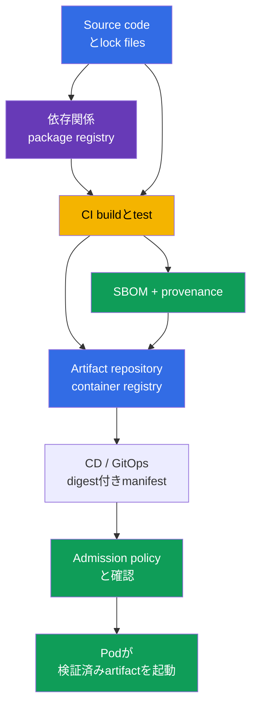
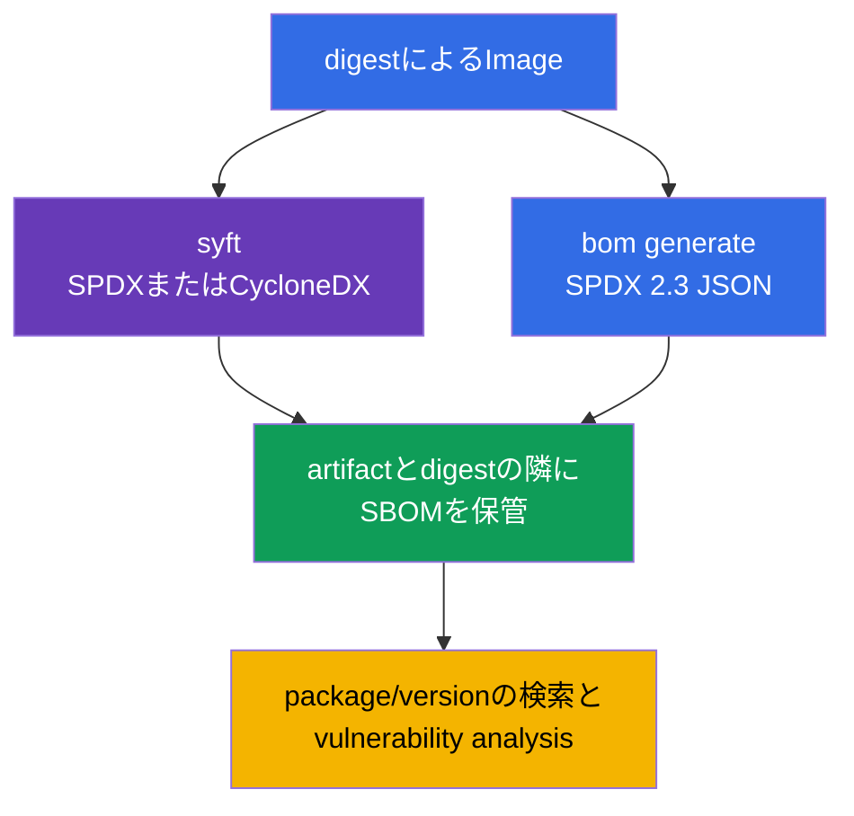
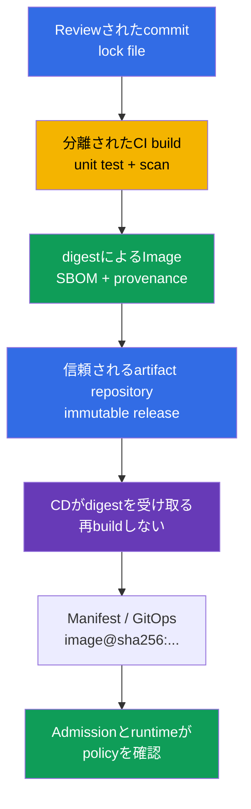
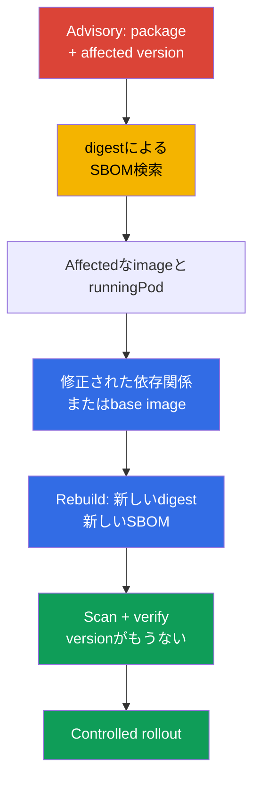

[Русская версия](ru.md) · [Eng version](README.md) · [Versión en español](es.md) · [Version française](fr.md) · [Deutsche Version](de.md) · [ქართული ვერსია](ge.md) · [繁體中文版](tw.md)

# 第25章. Supply chain の理解: SBOM、CI/CD、artifact repository

> **課題。** 差し替えられた依存関係、侵害された CI token、registry で書き換えられた tag
> は、いつもの image 名で別の code を Pod に届けることができます。digest に結び付いた
> inventory がなければ、artifact にどの component が入り、誰がどの初期状態から build した
> かを迅速に確定できません。これは脆弱な依存関係や悪意ある build を、利用者側での起動まで
> 見逃す原因になります。

> **この後。** [第24章](../24/jp.md)では final image の構成を減らし、その version を固定
> しました。今度は次の question に答える必要があります。どの component と version が、
> なお供給される artifact に入っているか、誰がどのように build したか。これは CKS の
> **Supply Chain Security** domain（20%）です。SBOM による inventory 化は脆弱な
> component を観測可能にし、制御された CI/CD と registry は deployment までの chain of
> trust を作ります。

> **CKA で必要な知識。** image、layers、Dockerfile、tag、digest、registry の基本概念は
> [CKA 第23章](../../../cka/course/23/jp.md)で扱いました。ここでは container の build を
> 繰り返しません。image を供給される artifact として捉え、その inventory を作り、source
> code から Kubernetes までの path を確認します。

> 🧠 Chain of trust は source、依存関係、CI/CD、registry、admission を結びます。どの
> transition の compromise も `Pod` に別の artifact を届ける可能性があります。

## 25.1. Software supply chain と chain of trust

**Software supply chain** - application が Pod で実行されるまでに通る人、system、source、
依存関係、artifact のすべてです。container workload にとってこれは Git と Dockerfile だけ
ではありません。chain には dependency registry、build runner、CI/CD credential、container
registry、manifest/GitOps repository、admission policy、そして image を download する
kubelet があります。



Chain of trust はその最も弱い部分の強さしか持ちません。CI が差し替えられた依存関係を取得
した、違う revision から image に署名した、あるいは CD が mutable な tag を deploy した場
合、後の Kubernetes での確認は元の artifact を戻せません。したがって**何が**実行されている
か（digest と SBOM）、**どこから**来たか（provenance）、各 transition で**どの行動が許可
されているか**を同時に識別することが重要です。

Supply chain への典型的な攻撃:

- 依存関係の compromise、または似た名前の package の公開（typosquatting)。これにより
  通常の package manager で悪意あるコードがインストールされる;
- maintainer のアカウントや CI token の乗っ取りと、project の名前での image 公開;
- build script、runner、cache、base image の変更。これによりartifactがreviewされた
  sourceに一致しなくなる;
- registryでのtagの差し替え: `app:stable`が別のbytesを指すようになるが、Kubernetesの
  manifestは変更されていない;
- 攻撃者によるregistryまたはCD credentialへのaccessとreviewを回避した直接deploy;
- CI log、environment、imageのlayerからのsecretの漏洩と、そのcredentialを使った署名、
  push、releaseの変更。

SolarWinds クラスの incident はこの原則を示します。攻撃者は各利用者を個別に攻撃する必要
はなく、build か delivery の一つの信頼された段階を変更する能力があれば十分です。
Kubernetes では、その結果は正しい名前と tag を持つが別の code を持つ Pod になり得ます。

[Trivy の最近の incident](https://github.com/aquasecurity/trivy/discussions/10462)は
同じ信頼の集中点を示しています。project の最終報告によると、2026年2月27日、攻撃者は
`pull_request_target` を使う脆弱な workflow を利用して repository と organization level
の secrets を取得し、3月19日に盗んだ credential で release workflow を実行し、悪意ある
Trivy `v0.69.4` を配布しました。根本問題は scanner 自体ではなく、未検証の PR code を実行
し過剰な secrets への access を持つ特権的な CI にありました。service account の分離不足
と非効率的な rotation が impact を増大させました。これは Trivy や Kubernetes Pod の全利
用者の compromise を意味しませんが、SolarWinds の教訓を裏付けます。広い credential を持つ
一つの信頼された build/release step は、攻撃者に他人の code を配布するための拡張可能な
path を与えます。

保護を一つの scanner に集約してはいけません。SBOM は構成を示し、scanner はそれを既知の
CVE と対比し、signature/provenance は artifact を build process に結び付け、admission
policy はルールに合わない artifact を拒否します。これらの mechanism は互いを補完します。

> 🧠 SBOM は特定の artifact の構成 inventory であり、scan report でも、その起源の暗号学的
> 証明でもない。

## 25.2. SBOM: component の inventory と SPDX 2.3 JSON/CycloneDX の format

**SBOM**（Software Bill of Materials）- artifact の component のマシン可読な list です。
package、library、それらの version、identifier、license、時に依存関係の relationship を
含みます。container image では、generator は layer の filesystem と package metadata を
読みます。SBOM はまず「この artifact に何が見つかったか」という question に答えます。これ
は CVE がないことの証明でも、それ自体で起源の暗号学的 proof でもありません。

二つの open format が最も広く使われています。

| Format | 目的と強み | よく見られる場所 |
|---|---|---|
| **SPDX 2.3 JSON** | software の構成、license、package、relationshipのための Linux Foundation の標準; compliance と inventory の交換に適している | OCI artifacts、distribution、CI、Kubernetes ecosystem |
| **CycloneDX** | Open Worldwide Application Security Project（OWASP）の format で component analysis と security tooling を志向; vulnerability management に便利 | scanners、dependency analysis、security dashboards |

両方の format は一つの image を記述できますが、JSON field は異なります。以下の SPDX の例
はすべて **SPDX 2.3 JSON** です。このschemaではpackageは通常`.packages`にあり、versionは
`versionInfo`にあります。CycloneDXではcomponentは`.components`にあり、versionは
`version`にあります。これらの path を SPDX 3.0 に転用しないでください。data model が異な
ります。format と file の version を知らずに universal な `jq` query を書かないでくださ
い。結果がないことは JSON path が誤っていることを意味する場合があり、package がないこと
を意味するわけではありません。

SBOM には精度の限界もあります。

- package database はすべての image にあるわけではない。static binary は library を含む
  が、package manager 特有の metadata を持たない場合がある;
- scanner はcomponentを経験的に判定することがあるので、名前やversionはmanifestとlock
  fileでの確認が必要;
- SBOM は生成時点を反映する。base imageの再build、依存関係の変更、digestの変更は新しい
  SBOMを作る;
- 一つのversion stringだけではvulnerabilityを意味しない。vendor advisory、OS
  distribution、architecture、修正状態と対比することが重要。

**Runtime SBOM と build全体のchainは別のinventoryです。** final multi-stage imageの
SBOMはruntimeに到達したものを記述し、破棄されたbuilder stageの依存関係は当然そこに存在し
ません。`--scope all-layers`によるanalysisでもfinal imageのlayerを対象とするだけで、
消えたすべてのbuild stageを対象とはしません。supply chainの完全なinventoryにはsource、
lock files、build attestation、provenanceも必要です。final SBOMにpackageがないことは、
buildの過程にそれがなかったことを証明しません。

実践的なルール: SBOMは、それが作成されたartifactとその immutable digestと一緒に保管して
ください。`api:1.4.2`用に作られたファイル`api-1.4.2.spdx.json`は、そのtagが後で書き換え
られた場合には不十分です。関連付けは`@sha256:...`と行うべきです。

## 25.3. SBOM の生成: Kubernetes ecosystem の `syft` と `bom`

生成前に reference image を固定してください。tag は人間が読むためだけに便利です。report、
確認、production deployment には、registry が返した digest を使ってください。

```bash
IMAGE='registry.example.com/payments/api:1.4.2@sha256:<64-hex-digest>'
```

release に document 内の適当な digest を差し込んではいけません。まず信頼された registry
から検証済み image の digest を取得し、SBOM とともに保管してください。generator は
private image のために registry credential を必要とすることがあります。パスワードを
shell の history や commit に渡してはいけません。

> 🔬 `syft` は複数の format で SBOM を生成する。

### `syft`: 一つの image から SPDX 2.3 JSON と CycloneDX

[Syft](https://github.com/anchore/syft) は image、directory、archive の package を
カタログ化し、複数の format を出力できます。以下の command は同じ image のために二つの
独立したファイルを作成します。

```bash
syft "$IMAGE" -o spdx-json > api.spdx.json
syft "$IMAGE" -o cyclonedx-json > api.cyclonedx.json
```

reference が multi-arch OCI index を指す場合、明示的に platform を選んでください。
heterogeneous な cluster のためには、実際に使われる各 platform manifest 用に別々の SBOM
を作成し index を付けてください。その隣には index の digest だけでなく、その manifest の
platform と digest を保管してください。

```bash
PLATFORM='linux/amd64'
syft "$IMAGE" --platform "$PLATFORM" -o spdx-json > api.linux-amd64.spdx.json
```

試験で素早く思い出すのに有用な等価な短い command:

```bash
syft <image> -o spdx-json
syft <image> -o cyclonedx-json
```

scanner に渡すか evidence として保管する前に、ファイルが空でなく JSON であることを確認し
てください。

```bash
jq -e '
  .spdxVersion == "SPDX-2.3"
  and .SPDXID == "SPDXRef-DOCUMENT"
  and .dataLicense == "CC0-1.0"
  and (.documentNamespace | type == "string")
  and (.creationInfo.creators | type == "array")
  and (.packages | type == "array")
' api.spdx.json >/dev/null
jq -e '.bomFormat == "CycloneDX" and (.components | type == "array")' \
  api.cyclonedx.json >/dev/null
```

最初のqueryは期待されるSPDX 2.3 JSONの**sanity check**、二つ目はCycloneDX JSONです。
これは空のoutput、registryのHTMLエラー、別formatのJSONを除外しますが、完全な
schema/conformance validationではありません。それにはspecificationの必要versionに
対応するSPDX validatorを使ってください。特定のSBOMはあなたのgenerator versionで必須で
ないfieldを持たないことがあります。documentの基本field、format、componentのlistは
それでも明示的に確認してください。

> 🎯 `kubernetes-sigs/bom` - Kubernetes志向のpath: 指定したimageのためにSPDX JSONを
> 生成し、structureを確認し、結果を保管する。

### `bom`: SPDX 2.3 JSONへのKubernetes志向のpath

[`bom`](https://github.com/kubernetes-sigs/bom) - software bill of materialsで作業する
Kubernetes SIGsのtoolです。CKSにとって重要な実践的toolであり、そのdocumentationは試験
で許可されており、lab 111ではSPDX 2.3 JSONを生成するために使われます。実際のenvironment
ではまず利用可能なflagを見てから、syntaxを推測してください。

```bash
bom generate --help
```

imageに対して、lab scenarioのcommandはSPDX-JSONファイルを作成します。

```bash
bom generate --image "$IMAGE" --format json --output out.spdx.json
```

一部のversionの`bom`では短い形式で`-o`が使われます。

```bash
bom generate --image "$IMAGE" --format json -o sbom.spdx.json
```

このcommandの`--format json`はCycloneDXではなくSPDXのJSON表現を意味します。ファイルを
`*.cyclonedx.json`にrenameしないでください。名前は実際のformatを伝えるべきで、その後の
`jq`、scanner、reviewerが正しいschemaを選べるようにします。得られたファイルをSPDXとして
確認し、見つかったpackageを数えてください。

```bash
jq -e '
  .spdxVersion == "SPDX-2.3"
  and .SPDXID == "SPDXRef-DOCUMENT"
  and .dataLicense == "CC0-1.0"
  and (.documentNamespace | type == "string")
  and (.creationInfo.creators | type == "array")
  and (.packages | type == "array")
' out.spdx.json >/dev/null
jq '.packages | length' out.spdx.json
```

これはsanity checkであり、SPDXの完全なschema/conformance validationではありません。

`bom`がローカルimageを見えない場合、そのcommandを実行するruntime/registryから利用可能な
referenceを指定し、environmentにインストールされたversionのために`bom generate --help`
を確認してください。access errorを人工的に作ったJSONで置き換えてはいけません。それは
credentialの問題やartifact名の誤りを隠します。



> 🎯 指定されたimage digestのために、SBOMの中でexactなpackageとそのversionを見つける。
> 名前だけの検索はadvisoryの適用可能性を証明しない。

## 25.4. SBOM を読む: package と具体的な version を見つける

試験とproductionのscenarioは通常advisoryから始まります。たとえば、いずれかのimageに
特定versionの`ca-certificates-bundle`が存在すると知られている場合です。imageやtagの名前
だけでは結論を出せません。特定のdigestのSBOMでpackage**とそのversion**を見つけ、その結果
をrunning workloadと対比する必要があります。

`bom`か`syft`で作成されたSPDX 2.3 JSONについて、exactなpackageの名前とversionを表示し
ます。

```bash
jq -r '
  .packages[]
  | select(.name == "ca-certificates-bundle")
  | [.name, .versionInfo, .SPDXID] | @tsv
' out.spdx.json
```

packageが実際に存在すれば、`name`、`versionInfo`、`SPDXID`の行が見えます。outputが空なら
deploymentを盲目的に変更してはいけません。順に確認してください。正しいSBOMが選ばれてい
るか、formatは正しいか、generatorはpackageをどう名付けたか、別のimage/sidecarにないか。

部分的な名前による検索は最初の調査に有用ですが、複数のpackageを返すことがあり、version
の最終確認には適しません。

```bash
jq -r '
  .packages[]
  | select(.name | test("ca-certificates"; "i"))
  | [.name, (.versionInfo // "<versionInfoなし>")] | @tsv
' out.spdx.json
```

CycloneDX JSONではpathとfield名が変わります。

```bash
jq -r '
  .components[]
  | select(.name == "ca-certificates-bundle")
  | [.name, .version, (.purl // "<purlなし>")] | @tsv
' api.cyclonedx.json
```

`purl`（package URL）は同じ名前を持つが異なるecosystemのpackageを区別するのに役立ちま
す。実際の調査では、ticketにimage digest、packageの名前/version、SBOMのfilename、
advisory/CVEを記録してください。そうすれば別のengineerが結果を再現でき、別のrebuildで
「だいたい似たpackage」を探す必要がなくなります。

componentを見つけた後、SBOMをclusterに結び付けてください。PodがActually使うimage
referenceは以下のように確認できます。

```bash
kubectl get pods -A \
  -o jsonpath='{range .items[*]}{.metadata.namespace}{"\t"}{.metadata.name}{"\t"}{range .spec.containers[*]}{.image}{"\n"}{end}{end}'
```

このoutputはdeclaredされたimage referenceを示します。`status.containerStatuses[].imageID`
はnodeが報告した起動済みcontainerに関するruntime固有のevidenceとして有用ですが、これは
可搬なregistry digestでも、OCI indexやplatform manifestのdigestでもありません。強い
incident evidenceのためには、digestで固定された`spec.containers[].image`を使い、node
のarchitectureを判定し、registry/indexを対応するplatform manifestに解決し、それにSBOM
を対応させてください。nodeへのaccessがある場合は、さらにruntime inventoryを確認してくだ
さい。

```bash
kubectl get pod <pod> -n <namespace> \
  -o jsonpath='{range .status.containerStatuses[*]}{.name}{"\t"}{.imageID}{"\n"}{end}'
kubectl get node <node> -o jsonpath='{.metadata.labels.kubernetes\.io/arch}{"\n"}'
crictl images --digests
```

典型的なミスは、SBOM内でpackage名の一致を見た瞬間にDeployment全体を削除することです。
まずaffected containerとそのimage digestを特定し、fixed imageを準備し、build、SBOM、
scanを繰り返し、その後通常のcontrolled rolloutでimageを置き換えてください。workloadの
削除はserviceを中断する可能性があり、registry内の脆弱なartifactを解消しません。

> 🏭 信頼できるsupply chainはまずrelease/index digestを、次にtarget platform-manifest
> digestを固定し、それにSBOM、provenance、scan reportを結び付ける; CIはartifactを公開し、
> CDは再buildなしでそれをpromoteする。

## 25.5. CI/CD、artifact repository、provenance、SLSA

**CI** はartifactをbuild、test、scan、publishします。**CD**はすでに準備されたartifactを
environment間でpromoteするか、clusterでmanifestを適用します。両者の間に境界がないと、
CIは気づかれずに特権的なdeploy shellになる可能性があります。有用な役割分離: CIはstaging
repositoryへのpublishの限定された権限を持ち、CDはできあがったdigestを受け取り、承認され
たimmutable artifactだけをpromoteします。

**Artifact repository**はbuildの結果を保管します。container registryのOCI images、
packages、charts、SBOM、attestation、provenanceです。registryは単にDocker Hubの
cacheではなく、releaseの信頼されるsourceであり、immutable digestを保管し、push/pullを
制限し、可能ならrelease tagのoverwriteを禁止すべきです。実装の例はHarbor、Amazon ECR、
Google Artifact Registry、Azure Container Registry、GitHub Container Registry、または
社内OCI registryです。具体的なproductは二次的です。重要なのはaccess control、
retention、audit、release artifactの不変性です。



**Provenance** - artifactの起源に関するmetadataです。どのsource revision、build
definition、builder、input materialがbuildに関わったかを示します。SBOMとは異なり、
provenanceはすべてのlibraryを列挙しません。outputを制御されたbuild processに結び付けま
す。強いchainのためには、release/index digestと選ばれたplatform manifestのdigestを区別
してください。SBOM、scan、provenanceは実際に確認または実行されるartifactに結び付けられ
るべきです。

> 🔬 SLSAモデルにおける、SBOM、provenance、署名とdigestの関連。

[SLSA](https://slsa.dev/)（Supply-chain Levels for Software Artifacts）はversion 1.2に
おいて要件を独立したtrackに分けます。したがってSLSAには「初級-高級」という単一の
スケールはありません。Build Trackはbuildとprovenanceの保証を記述し、Source Trackは
sourceに関する独自の要件を持ちます。

| Track | SLSA v1.2のlevel | 実用的な意味 |
|---|---|---|
| Build | L0 | SLSAの保証なし。 |
| Build | L1 | Provenanceが存在する。 |
| Build | L2 | 署名されたprovenanceがhosted build platformによって作成される。 |
| Build | L3 | Hardened build platformが使われる。 |
| Source | L1-L4 | sourceに対する要件の別々のlevel; Build Trackのlevelから導き出せない。 |

各levelの要件については、著者独自の四段階スケールではなく、
[Build Track](https://slsa.dev/spec/v1.2/build-track-basics)と
[Source Track](https://slsa.dev/spec/v1.2/source-requirements)のspecificationを確認して
ください。SBOMを生成しているという理由だけでprojectを「SLSA Level N」と宣言してはいけ
ません。trackとspecificationのversion、該当要件を満たしている証拠を示す必要があります。

BuildKitはimage/indexと一緒にSBOM/provenance attestationを作成・公開できます。

```bash
IMAGE_TAG='registry.example.com/payments/api:1.4.2'
docker buildx build --sbom=true --provenance=mode=max,version=v1 --push \
  --tag "$IMAGE_TAG" .
```

ここでの`version=v1`は期待されるformatを明示的に固定します。現在のupstream BuildKitの
defaultはSLSA provenance `v1`です。古いBuildKit/Buildxのversionは`v0.2`を出力していまし
た。したがってこのparameterでは`https://slsa.dev/provenance/v1`を持つ`Statement/v1`を確認
してください。push後は immutable digestを保管し、multi-arch releaseについては起動される
platform manifestを判定してください。これらのbuild-nativeなattestationはoutputをbuild
に結び付けるのに有用ですが、独立したsignatureの確認、final imageのSBOM、source/lock
filesによるchain全体のinventoryの代わりにはなりません。

実務では改善は以下のようになります。

- 依存関係をlockし、build definitionの変更をreviewする;
- release buildは共有の作業machineではなくephemeral/isolated runnerで実行する;
- CIに最小限の権限を持つshort-lived credentialを与え、publishの権限をdeployから分離する;
- image、SBOM、provenanceをatomicに公開し、すべてをimmutable digestに結び付ける;
- protected branch、required review、registry/CIのaudit logを使う;
- CDではdigestをdeployし、別のenvironmentから再buildしない。

OCI indexについては、これは単一の普遍的なdigestではなくchainです。
`release/index digest → platform manifest digest → SBOM/provenance/scan evidence`。
まずtarget platformを選び、その manifestまでindexを解決し、それに関連するattestationを
見つけてください。その後in-toto `subject.digest`を確認します。Dockerはattestation
manifestをroot indexに保管しますが、その`subject`はtarget platform manifest（またはその
中のオブジェクト）を指すべきです。single-platformのimageでは、release digestとplatform-
manifest digestが一致することがありますが、これは前提にできません。

最小のSLSA/in-toto provenanceは、対応するplatform manifestに結び付けられた`subject`を持つ
statementです。例えば、structureは次のようになります。

```json
{
  "_type": "https://in-toto.io/Statement/v1",
  "subject": [{
    "name": "registry.example.com/payments/api",
    "digest": {"sha256": "<64-hex-platform-manifest-digest>"}
  }],
  "predicateType": "https://slsa.dev/provenance/v1",
  "predicate": {
    "buildDefinition": {
      "buildType": "https://ci.example.com/buildtypes/release/v1",
      "externalParameters": {}, "resolvedDependencies": []
    },
    "runDetails": {"builder": {"id": "https://ci.example.com/builders/release"}}
  }
}
```

provenanceを使う前に、まず信頼されるrelease/indexをtarget platform manifestに解決し、
その`subject.digest.sha256`をまさにこのmanifestのdigestと比較してください。これはtagを
推測せずに確認できます。

```bash
PLATFORM_MANIFEST_DIGEST='sha256:<64-hex-platform-manifest-digest>'
jq -e --arg digest "${PLATFORM_MANIFEST_DIGEST#sha256:}" \
  '.subject[] | select(.digest.sha256 == $digest)' provenance.intoto.json >/dev/null
```

`jq`の成功は、statementが期待されるplatform manifestに結び付いていることを証明しますが、
statement自体の真正性は証明しません。artifactの署名と`cosign verify`による暗号学的な確認
は[第26章](../26/jp.md)で詳しく扱います。SBOMはこの確認の代わりにはなりません。

> 🎯 SBOMを使って特定のdigest内のaffected package/versionを確認し、その後artifactを置き
> 換え、脆弱なcomponentが消えたことを確認する。

## 25.6. 脆弱なcomponentの検索でのSBOM

CVEやvendor advisoryが出たとき、SBOMはincident時のquestionを「何千のimageがあるか」から
「どのdigestがaffectedなpackage/versionを含むか」に縮小します。これは**遅れた発見**にも
必要です。build時点ではCVEやaffectedなversionに関する情報がまだ公開されていなかったため
に、scannerが問題を見つけられなかった可能性があります。scanの結果は確認時点の知識ベース
を反映するだけで、すでに動いているimageに将来のadvisoryがないことを保証しません。

したがってbuild pipelineの外で、**保管されたSBOMを更新されたCVEのdatabaseと定期的に
再対応させてください**。スケジュールに従って、また新しい重要なCVEやvendor advisoryが
公開された際には計画外でも実施します。このような確認はartifactを再buildしません。同じ
immutable digestを最新のdataで評価し、affected releaseのtriageを起動するべきです。

作業サイクル:

1. advisoryの正確な条件を取得する。package、ecosystem/distribution、affected version、
   fixed version;
2. tagに依存せず、各candidate release digestの保管されたSBOMでpackage/versionを見つけ
   る。結果はaffected digestのlistになる;
3. affected digestをruntime inventoryと対応させる。`spec.containers[].image`は宣言され
   たreferenceを示す。`status.containerStatuses[].imageID`はruntime固有のhintであり、
   可搬なregistry/platform-manifest digestではない。multi-archの場合はnodeの
   architecture、platform manifest、それに結び付けられたSBOMを対応させる;
4. affected digestをrunning workload、registryにのみ存在するもの、すでに運用から外れた
   ものに分ける。最初にbusiness/risk impactの高いrunning workloadを解決し、次に他の
   releaseに対応する;
5. 修正されたartifactをbuildまたは選択し、新しいSBOMを生成し、affected versionが消えた
   か置き換えられたことを確認する;
6. scanし、署名/確認を行い、その後だけCDでdigestをpromoteする;
7. SBOM、scanの結果、rolloutをincident responseとauditのevidenceとして保管する。

迅速なresponseのために、`digest → SBOM → scan timestamp → environment/workload`という
indexを保管してください。すると新しいCVEはすべてのimageの手動での再scanではなく、
inventoryへのqueryを起動します。まずSBOMによって潜在的にaffectedなrelease/platform-
manifest digestを判定し、その後digestで固定されたspec、platform node、runtime
`imageID`を追加のhintとしてrunning workloadを確認します。tagだけでは不十分です。それは
mutableで、すでに起動しているPodがどのbytesを使っているかを証明しません。



SBOMはvulnerability scannerの代わりにはなりません。inventoryを与え、scannerはCVEの
database、対応rule、severityを追加します。[第28章](../28/jp.md)ではTrivyとGrypeをimage
と既成のSBOMに適用します。それまでは`jq`を通じてpackage/versionの存在を手動で証明する
方法を知っておくと有用です。これはformat、scannerのdata、automationのエラーを診断しま
す。

**VEX**（Vulnerability Exploitability eXchange）はこのモデルを補完します。SBOMは
artifactに何が入っているかに答え、scannerやadvisoryはcomponentをCVEに対応させ、VEXは
特定のproductに対する特定のvulnerabilityの適用可能性またはexploitabilityの確認済み状態
を記録します。package/versionとCVEが存在することは、まだそのvulnerabilityが適用可能で
exploitableであることを意味しません。VEXは確認と修正を取り消しませんが、その決定を検証
可能にします。

また「SBOMに見つからない」と「安全」を混同しないでください。ないことの理由は、不完全な
detector、static link、誤ったimage、古いSBOM、別の名前のpackageなどが考えられます。
criticalなincidentでは、lock file、source repository、base imageのrelease notes、
runtime image IDによる検索を追加してください。

> 🎯 実用的な成果は、有効なSPDX JSONとtask内のimageに対する再現可能なpackage/versionの
> 出力であり、単にcommandが成功したことではない。

## 25.7. 確認: `bom`によるSBOMと指定されたpackage/versionの検索

lab 111では、CKSのtaskに必要な完全な最小限を確認します。`bom`でSBOMを生成し、有効な
SPDX 2.3 JSONであることを確認し、指定されたpackage/versionを見つけます。labが提供する
training imageか、自分の許可されたimageを使ってください。evidenceとしてmutableな
`latest`を使わないでください。

```bash
IMAGE='<image-from-lab-or-registry>@sha256:<64-hex-digest>'

# 1. Kubernetes SIGsのbomでSPDX 2.3 JSONを作成する。
bom generate --image "$IMAGE" --format json --output out.spdx.json

# 2. SPDX 2.3のsanity checkを実行し、packagesが空でないことを確認する。
jq -e '
  .spdxVersion == "SPDX-2.3"
  and .SPDXID == "SPDXRef-DOCUMENT"
  and .dataLicense == "CC0-1.0"
  and (.documentNamespace | type == "string")
  and (.creationInfo.creators | type == "array")
  and (.packages | type == "array")
  and (.packages | length > 0)
' out.spdx.json >/dev/null

# 3. 指定されたpackageとそのversionを見つける。
jq -r '
  .packages[]
  | select(.name == "ca-certificates-bundle")
  | [.name, .versionInfo, .SPDXID] | @tsv
' out.spdx.json
```

labが別の`package/version`の組を指定する場合、`select`の値だけを変え、確認のschemaその
ものは変えないでください。得られたversionを条件と対比してください。versionの比較なしの
package検索は、まさに脆弱なcomponentが見つかったことを証明しません。

同じimageをSyftで生成し、追加でcross-checkするには次のようにします。

```bash
syft "$IMAGE" -o spdx-json > syft.spdx.json
jq -e '
  .spdxVersion == "SPDX-2.3"
  and .SPDXID == "SPDXRef-DOCUMENT"
  and .dataLicense == "CC0-1.0"
  and (.documentNamespace | type == "string")
  and (.creationInfo.creators | type == "array")
  and (.packages | type == "array")
' syft.spdx.json >/dev/null
```

これはsanity checkであり、SPDXの完全なschema/conformance validationではありません。

### 典型的なエラーの診断

| 症状 | 起こりうる原因 | 確認すること |
|---|---|---|
| `bom`または`syft`がimageをdownloadできない | private registry、誤ったreference、network | registry login/credential、repository、tag/digest、runnerのregistryへのaccess |
| `jq`がparse errorを報告する | outputがJSONでない、fileが空、エラーが混入した | fileのサイズ、commandのstderr、fileの最初の行; SBOMを再生成する |
| `jq`がpackageを見つけない | 別の名前、別のJSON format、別のimage digest、metadataの欠如 | `.packages[].name`、`.components[].name`、digest、package manager database |
| packageが見つかったがversionが一致しない | imageが別のbase/依存関係からbuildされた、advisoryが別のdistributionに適用された | `versionInfo`、purl、base image、lock fileとadvisoryの条件 |
| SBOMはあるがdeployはまだ脆弱 | CDがtag/古いdigestを適用した、rolloutが完了していない | manifestの`image:`、Podの`imageID`、rollout status、registry digest |

確認完了の基準: sanity checkに合格した空でないSPDX 2.3 JSONがある（完全な conformance
にはSPDX validatorが別途必要）、特定のplatform manifest digestに対するpackage/versionが
記録されている、そしてcommandとfileを別のengineerに渡して結果を再現できること。

> 🏭 各release digest用にSBOM、provenance、scan evidenceの発行と保管を自動化する;
> incident後に手動で作成されたreportはこのprocessに代わらない。

## 25.8. production での適用

- **SBOMはrelease buildで作成される。** 生成はincident後の手動対応ではなく、
  publishable な各digestに対してCIで自動的に行われます。SBOMは独立した
  SPDX/CycloneDXファイルにも、image digestに結び付いたOCI artifact/referrerにもなり
  得ます。署名されたattestationは`subject`とpredicateに関する別の主張であり、SBOMや
  provenanceを運ぶことがありますが、任意のSBOMがattestationとは限りません。実用的な
  モデル: `image digest <- OCI SBOM artifact/referrer`と`image digest <- 署名された
  attestation (predicate=SBOM/provenance)`。これらのdataのretentionはreleaseそのもの
  より短くすべきではありません。
- **Digestはreleaseのidentifierのchain。** multi-archの場合、まずrelease/index digest
  を、次に選ばれたplatform-manifest digestを固定します。SBOM、scan report、provenance、
  change recordはこのchainの該当levelに結び付けます。Release tagは人間のために残せます
  が、内容の証明の代わりにはなりません。
- **Registryは制御された境界。** push権限はprojectごとに分離され、release tagはoverwrite
  から保護され、audit log、replication、cleanup policyが有効になっています。作業station
  はproduction imageを直接publishしません。
- **CIは最小限の権限を持つ。** Ephemeral runner、short-lived token、scoped secret、
  protected branch、build definitionのreviewは差し替えや漏洩の可能性を減らします。
- **Vulnerability managementは閉じている。** AdvisoryはまずSBOM queryにつながり、次に
  fixed digest、新しいSBOM、scan、確認、rolloutにつながります。例外にはowner、期限、
  evidenceがあり、ignore listに無期限に置かれません。
- **起源の確認は必須。** CDの前にrelease/index → target platform manifest →
  attestationの`subject`とsignatureのchainを確認します。clusterのadmission policyは
  唯一の管理場所ではなく、最後の境界になります。署名とそのenforcementは次章のtopic
  です。

## 25.9. ミニ glossary

- **Software supply chain** - sourceからrunning workloadまでのsource、依存関係、build
  system、artifactのpath。
- **Artifact** - buildの結果。例えばOCI image、SBOM、chart、provenance。
- **Artifact repository** - artifactの制御された保管場所: registry、package、chart
  repository。
- **SBOM** - software artifactのcomponentとversionのマシン可読なinventory。
- **SPDX 2.3 JSON** - 本章で使われるSPDX標準のJSON表現で、package、license、それらの
  relationshipのためのもの; そのJSONモデルをSPDX 3.0と混同しないこと。
- **CycloneDX** - component inventoryとsecurity analysisのためのOWASPのformat。
- **Syft** - image、filesystem、archiveからSBOMを生成するtool。
- **bom** - SPDX SBOMを生成し作業するための`kubernetes-sigs/bom`のtool。
- **Provenance** - artifactのsource、input、builder、作成processに関するmetadata。
- **SLSA** - 独立したBuild TrackとSource Trackを持つsupply chain保護の要件モデル。
- **VEX** - productに対する特定のCVEの適用可能性またはexploitabilityに関するstatement。
- **Digest** - imageの不変なcontent identifier、通常`sha256`。
- **purl** - package URL、ecosystemとversionを持つpackageのidentifier。

## 25.10. 章のまとめ

- Software supply chainはsource、依存関係、CI/CD、registry、metadata、deploymentを含み
  ます。一つの信頼された段階のcompromiseは複数のclusterに悪意あるartifactを届ける可能性
  があります。
- SBOMはartifactのcomponentのinventoryです。SPDXとCycloneDXは同じ対象を異なるJSON
  schemaで記述します。SBOMはscan reportでも起源のproofでもありません。
- `syft`はSPDX 2.3 JSONとCycloneDX JSONを生成し、Kubernetes ecosystemの`bom`は
  `bom generate --image ... --format json --output ...`でSPDX 2.3 JSONを生成します。
- 脆弱なcomponentの検索にはpackage、exactなversion、image digestが必要です。SPDXでは
  通常`.packages[].name`と`.versionInfo`、CycloneDXでは`.components[].name`と
  `.version`です。
- CIは検証可能なdigest-chainを持つimage、SBOM、provenanceを発行すべきであり、CDは信頼
  されるartifact repositoryから選んだdigestを再buildなしでpromoteすべきです。
- SLSA v1.2はBuild Track（L0-L3）とSource Track（L1-L4）を分けます。SBOMの生成自体は
  どちらのtrackの要件の履行も証明しません。
- CVEの後のサイクルはこうです: SBOMへのquery → runningのdigestの確認 → 修正された
  rebuild → 新しいSBOM/scan/verify → controlled rollout。

## 25.11. この知識が役立つ場面: 試験と実務

**試験では。** `bom generate --image ... --format json`を素早く実行し、SPDX 2.3 JSONを
確認し、package/versionを見つけられることが、lab 111と典型的なmock scenarioの実践的な
スキルです。SyftのformatとJSON fieldの名前、image tagとdigestを混同しないでください。
必要なら`kubernetes-sigs/bom`のdocumentationは試験で許可されています。まず`--help`を確
認し、必要なartifactを保管し、検索結果を示してください。

**実務では。** SBOMはCVEへの反応時間を短縮しますが、その価値はreleaseの規律があってこそ
発揮されます。既知のdigest、制御されたregistry、保管されたprovenanceとscan evidence
です。これにより「imageは修正されたと思う」ではなく、「clusterはこのdigestを実行してい
る。そのSBOMにはaffected versionが含まれない。それは承認されたpipelineによってbuildされ
確認された」と言えるようになります。

## 25.12. Self-check question

<details>
<summary>1. commitからPodまでのcontainer workloadのsupply chainにはどの参加者が含まれ、artifactの差し替えはどこで起こり得ますか？</summary>

chainにはsourceとlock file、package registry、CI runner、container registry、CD/GitOps、admission policy、そしてimageをdownloadするkubeletが含まれます。差し替えは、例えば依存関係、build scriptやrunner、base image、registry tag、またはCI/CD credentialで起こり得ます。したがってdigest/SBOM、provenance、artifactへのaccessの制御が同時に必要です。
</details>

<details>
<summary>2. SBOMはvulnerability scan report、signature、provenanceとどう違いますか？</summary>

SBOMは特定のartifactのcomponentとversionのinventoryであり、CVEに関する結論ではありません。scannerはこの構成をvulnerabilityのdatabaseとseverityに対応させ、signatureは信頼された署名者を暗号学的に確認し、provenanceはsource revision、builder、buildの入力を記述します。multi-archの場合、これらのartifactは正しいindexとplatform manifestのchainに結び付けられている必要があります。
</details>

<details>
<summary>3. digestのない`app:1.4.2`のSBOMがrunning imageの構成の証明にならない理由は何ですか？</summary>

Tagは変更可能です。`app:1.4.2`はSBOMの生成後に別のbytesに再割り当てされる可能性があります。構成の証明はimmutableな`@sha256:...`に結び付けます。multi-archの場合はさらに選ばれたplatform manifestとruntime evidenceを固定します。そうでなければSBOMは以前のmanifestを指しているのに、Podは既に別のimageを指している可能性があります。
</details>

<details>
<summary>4. SPDXとCycloneDXでpackage/versionにはどのJSON pathを使いますか？</summary>

SPDX 2.3 JSONではcomponentは`.packages`で、versionは`.versionInfo`で検索します。例えば`.packages[]`の要素です。CycloneDXでは`.components[]`と`.version`fieldが使われます。ecosystemを区別するには`.purl`も有用です。これらのpathは別のformatやSPDX 3.0に機械的に転用してはいけません。
</details>

<details>
<summary>5. `syft`と`kubernetes-sigs/bom`でSPDX 2.3 JSONをどう生成しますか？</summary>

Syftでは`syft "$IMAGE" -o spdx-json > api.spdx.json`を使います。Kubernetes SIGsのbomでは`bom generate --image "$IMAGE" --format json --output out.spdx.json`を使います。ここでJSONはCycloneDXではなくSPDXを意味します。その後、期待されるSPDX 2.3のsanity checkを実行します。`.spdxVersion == "SPDX-2.3"`と`.packages`のarrayを確認します（本編の手順ではdocumentのidentifierとmetadataも確認されます）。完全なschema/conformance validationには別のSPDX validatorが必要です。
</details>

<details>
<summary>6. なぜ`ca-certificates-bundle`という名前だけの検索はCVEに関する決定に十分ではないのですか？</summary>

Advisoryに関する決定にはexactなpackage、そのversion、ecosystem/distribution、fixed versionの条件が必要です。名前は複数のvariantで見られることがあります。名前の検索は`versionInfo`と一緒に行い、SBOMをimageのdigestに結び付ける必要があります。その後、結果をadvisoryとruntimeのimageIDと対比し、名前の一致だけでworkloadを削除してはいけません。
</details>

<details>
<summary>7. containerの`imageID`をどう取得し、runtime evidenceとしてどう使いますか？</summary>

これはPodのstatusから取得します。`kubectl get pod <pod> -n <namespace> -o jsonpath='{range .status.containerStatuses[*]}{.name}{"\t"}{.imageID}{"\n"}{end}'`。`imageID`はruntime固有のhintであり、可搬なregistry/index/platform-manifest digestではないため、SBOMのdigestと直接比較してはいけません。強い対応のためには、digestで固定された`spec.containers[].image`、nodeのarchitecture、target platform manifestまでのregistry/indexの解決を考慮します。nodeへのaccessがある場合は`crictl images --digests`も確認します。spec内のtagだけではこれを保証しません。
</details>

<details>
<summary>8. なぜCIは一つのimageをbuildするだけで、CDが別のenvironmentで気づかれずにそれを再buildしてはいけないのですか？</summary>

CDは異なるinput、builder、依存関係を持つ新しいartifactを作成するのではなく、すでに確認されたimmutable digestをpromoteすべきです。そうでなければCIのSBOM、scan、provenanceは一つのbytesに関するものであり、productionは別のものを受け取る可能性があります。CIのpublishとCDのdeployの分離はこのchainを検証可能にします。
</details>

<details>
<summary>9. SLSAはprovenanceと分離されたbuilderにどんな意味を与えますか？</summary>

SLSAでprovenanceはoutputをbuild definition、source、builderに結び付けます。multi-archの場合、まずrelease/index digestをtarget platform manifestに解決し、その`subject.digest`をこのmanifest（またはその中の許容されるオブジェクト）のdigestと対比します。root indexとの一致は前提にしません。Build TrackのL1はprovenanceの存在を要求し、L2はhosted build platformからの署名されたprovenanceを、L3はhardened build platformを要求します。分離されたbuilderは共有の作業環境の差し替えのリスクを減らしますが、levelはtrackと証拠を示して申告する必要があります。
</details>

<details>
<summary>10. 修正された依存関係とproduction rolloutの間にどんな確認を通す必要がありますか？</summary>

依存関係やbase imageを更新した後、新しいdigestと新しいSBOMをbuildし、affected versionが消えたか置き換えられたことを確認します。新しいartifactはscanされ、確認/署名され、その後だけcontrolled CD rolloutでpromoteされます。EvidenceにはSBOM、scan、検証済みのdigest、rolloutの結果が含まれます。
</details>

<details>
<summary>11. **Flashback（第32章）。** SBOM/provenance（本章）は「このartifactは何から構成され、どのようにbuildされたか」というquestionに答えます。Kubernetes audit log（第32章）は「誰がいつAPI serverと対話したか」に答えます。「誰がこのimageを、このSBOMで、この時刻に正確にdeployしたか」という完全なchainを証明する必要がある場合、二つのsourceのどちらかがそれ自体では不十分であり、両方を併用することで、それぞれ単独では閉じないものをどう閉じますか？</summary>

SBOM/provenanceだけでは不十分です。digestの構成とbuild processを証明しますが、deploymentというAPI actionを証明しません。audit logだけでも不十分です。identity、時刻、API上のobjectを示しますが、imageの構成やそのbuildの信頼性を示しません。manifest/audit由来のimage digestを、SBOMとprovenanceが結び付けられているdigestと照合することで、deployの実行者を具体的な検証可能なartifactに結び付けられます。
</details>

## Practice

🧪 Lab 111（`bom`と`syft`によるSBOM、package/versionの検索、scanningとsupply-chain
artifact）: [tasks/cks/labs/111](../../labs/111/README_JP.MD)

image、Dockerfile、registry、tag、digestの基礎については
[CKA 第23章](../../../cka/course/23/jp.md)を復習してください。続いて
[第26章](../26/jp.md)（artifactの署名と検証）と
[第28章](../28/jp.md)（SBOMのvulnerability scanning）を学んでください。

---
[目次](../README_JP.md) · [第24章](../24/jp.md) · [第26章](../26/jp.md)
