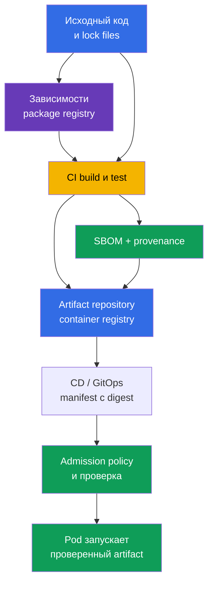
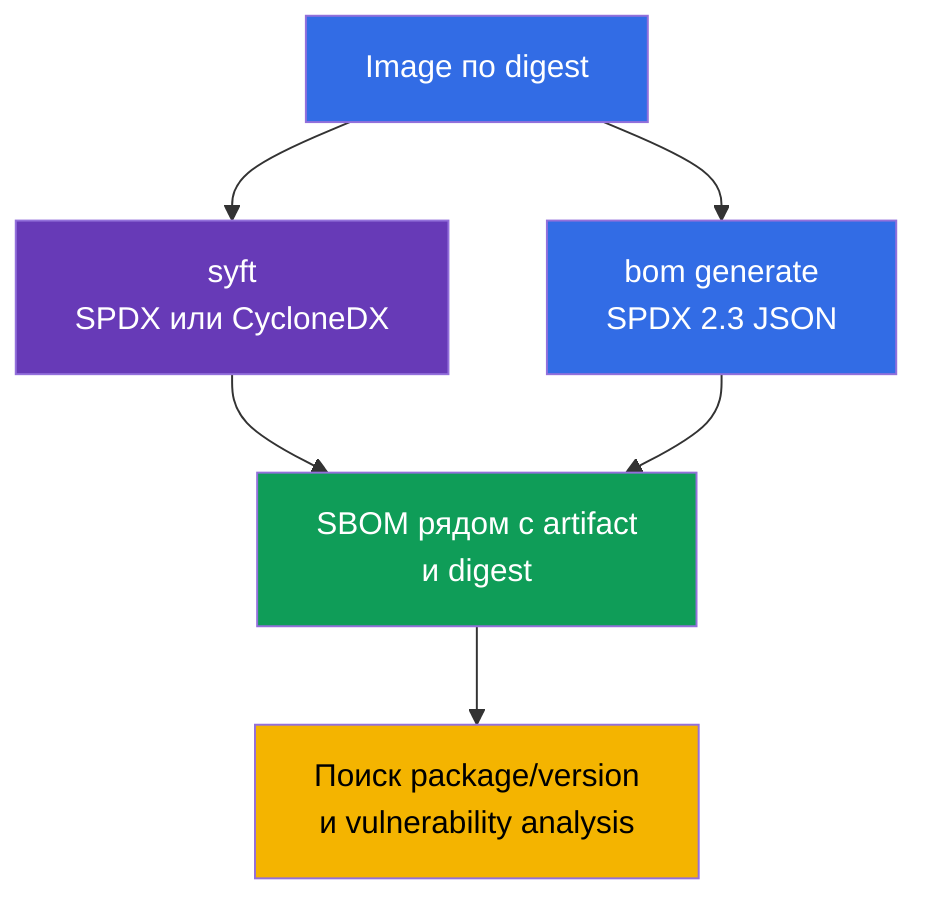
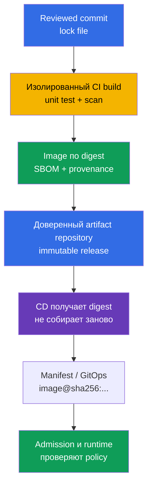
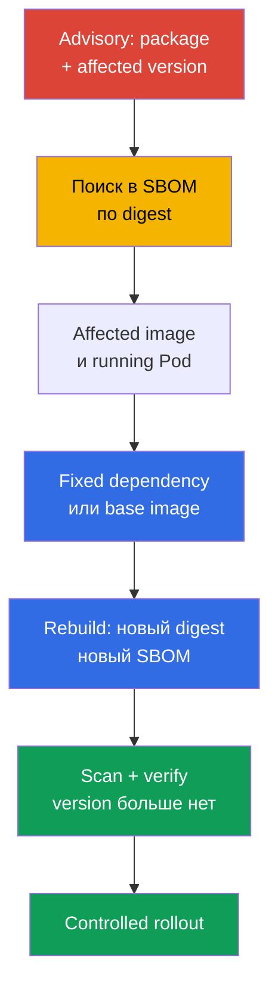

<!-- Standalone RU release: ссылки на переводы удалены, потому что соответствующие файлы не входят в архив. -->

# Глава 25. Понимание supply chain: SBOM, CI/CD, artifact repositories

> **Проблема.** Подменённая dependency, скомпрометированный CI token или изменённый tag в
> registry могут доставить в Pod чужой код под привычным именем образа. Без привязанного
> к digest инвентаря невозможно быстро установить, какие компоненты вошли в artifact,
> кто и из какого исходного состояния его собрал. Это оставляет уязвимую зависимость или
> вредоносную сборку незамеченной до запуска у потребителя.

> **Что дальше.** В [главе 24](../24/ru.md) мы уменьшили состав final image и зафиксировали
> его версию. Теперь нужно уметь ответить на следующий вопрос: какие именно компоненты и
> версии всё ещё попали в поставляемый artifact, кем и как он был собран. Это домен
> **Supply Chain Security** CKS (20%). Инвентаризация через SBOM делает уязвимый компонент
> наблюдаемым, а контролируемый CI/CD и registry создают цепочку доверия до deployment.

> **Что нужно из CKA.** Базовые понятия image, layers, Dockerfile, tag, digest и registry
> разобраны в [главе 23 CKA](../../../cka/course/23/ru.md). Здесь не повторяем сборку
> контейнера: рассматриваем image как artifact поставки, составляем его инвентарь и
> проверяем путь от исходного кода до Kubernetes.

> 🧠 Chain of trust связывает source, зависимости, CI/CD, registry и admission: компрометация любого перехода может доставить в `Pod` чужой artifact.

## 25.1. Software supply chain и цепочка доверия

**Software supply chain** - все люди, системы, исходники, зависимости и artifacts, через
которые проходит приложение до запуска в Pod. Для container workload это не только Git и
Dockerfile: в цепочке есть dependency registry, build runner, CI/CD credentials, container
registry, manifest/GitOps repository, admission policy и kubelet, скачивающий image.



Цепочка доверия сильна настолько, насколько силён её самый слабый участок. Если CI получил
подменённую dependency, подписал image не от той revision или CD развернул mutable tag,
поздняя проверка Kubernetes не может вернуть исходный artifact. Поэтому важны одновременно
идентификация **что** запущено (digest и SBOM), **откуда** оно взялось (provenance) и
**какие действия разрешены** на каждом переходе.

Типовые атаки на supply chain:

- компрометация dependency или публикация пакета с похожим именем (typosquatting), после
  которой вредоносный код устанавливается обычным package manager;
- захват учётной записи maintainer-а либо CI token и публикация image от имени проекта;
- изменение build script, runner-а, кеша или base image, из-за которого artifact не
  соответствует reviewed source;
- подмена tag в registry: `app:stable` начинает указывать на другие байты, хотя manifest
  Kubernetes не менялся;
- доступ злоумышленника к registry или CD credentials и прямой deploy в обход review;
- утечка secret из CI log, environment или layer image с последующим использованием этого
  credential для подписи, push или изменения release.

Инцидент класса SolarWinds показывает принцип: атакующий не обязан взламывать каждого
потребителя, если получает возможность изменить один доверенный этап сборки или delivery.
В Kubernetes результатом может стать Pod с корректным именем и tag, но с чужим code.

Недавний [инцидент Trivy](https://github.com/aquasecurity/trivy/discussions/10462)
показывает ту же точку концентрации доверия. По итоговому отчёту проекта, 27 февраля 2026
злоумышленник использовал уязвимый workflow с `pull_request_target`, получил secrets уровня
repository и organization, а 19 марта украденным credential запустил release workflow и
распространил вредоносный Trivy `v0.69.4`. Корневая проблема была не в самом scanner-е, а в
привилегированном CI, который исполнил непроверенный PR-код и имел доступ к избыточным
secrets; недостаточная изоляция service accounts и неэффективная ротация увеличили impact.
Это не означает компрометацию всех пользователей Trivy или Kubernetes Pod-ов, но подтверждает
урок SolarWinds: один доверенный build/release шаг с широкими credential даёт атакующему
масштабируемый путь доставки чужого кода.

Нельзя свести защиту к одному scanner-у. SBOM показывает состав, scanner сопоставляет его с
известными CVE, signature/provenance связывают artifact с процессом сборки, а admission
policy не допускает artifact, который не соответствует правилам. Эти механизмы дополняют
друг друга.

> 🧠 SBOM — это инвентарь состава конкретного artifact, а не scan report и не криптографическое доказательство его происхождения.

## 25.2. SBOM: инвентарь компонентов и форматы SPDX 2.3 JSON/CycloneDX

**SBOM** (Software Bill of Materials) - машиночитаемый список компонентов artifact: пакетов,
библиотек, их версий, идентификаторов, лицензий и иногда dependency relationships. Для
container image генератор читает filesystem и package metadata слоёв; SBOM отвечает прежде
всего на вопрос «что найдено в этом artifact». Это не доказательство отсутствия CVE и не
сам по себе криптографический proof происхождения.

Наиболее распространены два открытых формата:

| Формат | Назначение и сильная сторона | Где чаще встречается |
|---|---|---|
| **SPDX 2.3 JSON** | Стандарт Linux Foundation для состава software, лицензий, пакетов и отношений; хорошо подходит для compliance и обмена inventory | OCI artifacts, дистрибутивы, CI и Kubernetes ecosystem |
| **CycloneDX** | Формат Open Worldwide Application Security Project (OWASP), ориентированный на component analysis и security tooling; удобен для vulnerability management | scanners, dependency analysis, security dashboards |

Оба формата могут описать один image, но их JSON-поля различаются. Все примеры SPDX ниже --
**SPDX 2.3 JSON**: в этой схеме пакеты обычно находятся в `.packages`, а версия -- в
`versionInfo`; в CycloneDX компоненты находятся в
`.components`, а версия - в `version`. Не переносите эти пути на SPDX 3.0: у него другая
модель данных. Не пишите универсальный `jq`-запрос, не зная формата и версии файла: отсутствие
результата может означать неверный путь JSON, а не отсутствие пакета.

У SBOM есть и границы точности:

- package database есть не во всяком image; static binary может содержать библиотеки, но
  не иметь привычного metadata package manager;
- scanner может определить компонент эвристически, поэтому имя или версия нуждаются в
  проверке по manifest и lock file;
- SBOM отражает момент генерации. После rebuild base image, смены dependency или digest
  создают новый SBOM;
- один version string ещё не означает уязвимость: важно сопоставить его с vendor advisory,
  OS distribution, архитектурой и статусом исправления.

**Runtime SBOM и полная цепочка сборки -- разные инвентари.** SBOM final multi-stage image
описывает то, что дошло до runtime; зависимости из отброшенных builder stages в нём
закономерно отсутствуют. Даже анализ `--scope all-layers` охватывает слои конечного image,
а не все исчезнувшие стадии сборки. Для полного inventory supply chain нужны также source,
lock files, build attestations и provenance: отсутствие package в final SBOM не доказывает,
что его не было в процессе сборки.

Практическое правило: храните SBOM рядом с тем artifact и тем immutable digest, для
которого он создан. Файл `api-1.4.2.spdx.json`, созданный для `api:1.4.2`, недостаточен,
если этот tag позднее был переписан; связь должна быть с `@sha256:...`.

## 25.3. Генерация SBOM: `syft` и `bom` из Kubernetes ecosystem

Перед генерацией зафиксируйте reference image. Tag удобен только для чтения человеком;
для отчёта, проверки и production deployment берите digest, который вернул ваш registry:

```bash
IMAGE='registry.example.com/payments/api:1.4.2@sha256:<64-hex-digest>'
```

Не подставляйте в release случайный digest из документации. Сначала получите digest
проверенного image из доверенного registry и сохраните его рядом с SBOM. Генератору может
потребоваться registry credential для private image; передавать пароль в history shell или
в commit нельзя.

> 🔬 `syft` генерирует SBOM в нескольких форматах.

### `syft`: SPDX 2.3 JSON и CycloneDX из одного image

[Syft](https://github.com/anchore/syft) каталогизирует packages в image, directory или
archive и умеет выводить несколько форматов. Следующие команды создают два независимых
файла для одного и того же image:

```bash
syft "$IMAGE" -o spdx-json > api.spdx.json
syft "$IMAGE" -o cyclonedx-json > api.cyclonedx.json
```

Если reference указывает на multi-arch OCI index, явно выберите platform. Для heterogeneous
cluster создайте и проиндексируйте отдельный SBOM для каждого реально используемого platform
manifest; рядом с ним храните platform и digest этого manifest, а не только digest index:

```bash
PLATFORM='linux/amd64'
syft "$IMAGE" --platform "$PLATFORM" -o spdx-json > api.linux-amd64.spdx.json
```

Эквивалентные краткие команды, которые полезно быстро вспомнить на экзамене:

```bash
syft <image> -o spdx-json
syft <image> -o cyclonedx-json
```

Проверьте, что файл не пустой и является JSON, до того как передавать его scanner-у или
сохранять как evidence:

```bash
jq -e '
  .spdxVersion == "SPDX-2.3"
  and .SPDXID == "SPDXRef-DOCUMENT"
  and .dataLicense == "CC0-1.0"
  and (.documentNamespace | type == "string")
  and (.creationInfo.creators | type == "array")
  and (.packages | type == "array")
' api.spdx.json >/dev/null
jq -e '.bomFormat == "CycloneDX" and (.components | type == "array")' \
  api.cyclonedx.json >/dev/null
```

Первый запрос — **sanity-check** ожидаемого SPDX 2.3 JSON, второй — CycloneDX JSON. Он
отсекает пустой output, HTML-ошибку registry и JSON другого формата, но не является полной
schema/conformance validation: для неё используйте SPDX validator, совместимый с нужной
версией specification. Конкретный SBOM может не иметь поля, не обязательного для вашего
generator version; базовые поля документа, format и список компонентов всё равно проверяйте
явно.

> 🎯 `kubernetes-sigs/bom` — Kubernetes-ориентированный путь: сгенерируйте SPDX JSON для заданного image, проверьте структуру и сохраните результат.

### `bom`: Kubernetes-ориентированный путь к SPDX 2.3 JSON

[`bom`](https://github.com/kubernetes-sigs/bom) - инструмент Kubernetes SIGs для работы с
software bill of materials. Это важный практический инструмент CKS: его документация
разрешена на экзамене, а в lab 111 он применяется для генерации SPDX 2.3 JSON. В актуальной
среде сначала смотрите доступные flags, а не угадывайте синтаксис:

```bash
bom generate --help
```

Для image команда из сценария лабораторной работы создаёт SPDX-JSON файл:

```bash
bom generate --image "$IMAGE" --format json --output out.spdx.json
```

В краткой форме у некоторых версий `bom` используется `-o`:

```bash
bom generate --image "$IMAGE" --format json -o sbom.spdx.json
```

`--format json` в этой команде означает JSON-представление SPDX, а не CycloneDX. Не
переименовывайте файл в `*.cyclonedx.json`: имя должно сообщать реальный format, чтобы
последующий `jq`, scanner и reviewer выбрали правильную схему. Проверьте полученный файл
как SPDX и посчитайте найденные packages:

```bash
jq -e '
  .spdxVersion == "SPDX-2.3"
  and .SPDXID == "SPDXRef-DOCUMENT"
  and .dataLicense == "CC0-1.0"
  and (.documentNamespace | type == "string")
  and (.creationInfo.creators | type == "array")
  and (.packages | type == "array")
' out.spdx.json >/dev/null
jq '.packages | length' out.spdx.json
```

Это sanity-check, а не полная schema/conformance validation SPDX.

Если `bom` не видит локальный image, укажите reference, доступный тому runtime/registry, из
которого запускается команда, и проверьте `bom generate --help` для версии, установленной
в среде. Не заменяйте ошибку доступа искусственно созданным JSON: это скрывает проблему
credentials или неправильного имени artifact.



> 🎯 Для заданного image digest найдите exact package и его version в SBOM; поиск только по имени не доказывает применимость advisory.

## 25.4. Чтение SBOM: найти package и конкретную версию

Экзаменационный и production-сценарий обычно начинается с advisory: например, известно,
что в одном из образов присутствует `ca-certificates-bundle` определённой версии. Нельзя
делать вывод по имени image или tag. Нужно найти package **и его version** в SBOM конкретного
digest, затем сопоставить результат с running workload.

Для SPDX 2.3 JSON, созданного `bom` или `syft`, покажите имя и версию exact package:

```bash
jq -r '
  .packages[]
  | select(.name == "ca-certificates-bundle")
  | [.name, .versionInfo, .SPDXID] | @tsv
' out.spdx.json
```

Если package действительно существует, вы увидите строку `name`, `versionInfo` и `SPDXID`.
Если output пуст, не меняйте deployment вслепую. Последовательно проверьте: выбран ли
правильный SBOM, верен ли формат, как generator назвал package и не находится ли он в
другом image/sidecar.

Поиск по части имени полезен для первичного исследования, но может вернуть несколько
пакетов и не годится как окончательная проверка версии:

```bash
jq -r '
  .packages[]
  | select(.name | test("ca-certificates"; "i"))
  | [.name, (.versionInfo // "<нет versionInfo>")] | @tsv
' out.spdx.json
```

Для CycloneDX JSON меняются путь и имя поля:

```bash
jq -r '
  .components[]
  | select(.name == "ca-certificates-bundle")
  | [.name, .version, (.purl // "<нет purl>")] | @tsv
' api.cyclonedx.json
```

`purl` (package URL) помогает отличить packages с одинаковым именем из разных ecosystems.
В реальном расследовании зафиксируйте в ticket: image digest, имя/версию package, SBOM
filename и advisory/CVE. Тогда другой инженер сможет воспроизвести результат, а не искать
«примерно такой пакет» в другом rebuild.

После нахождения компонента свяжите SBOM с кластером. Image references, которые реально
используют Pod, можно посмотреть так:

```bash
kubectl get pods -A \
  -o jsonpath='{range .items[*]}{.metadata.namespace}{"\t"}{.metadata.name}{"\t"}{range .spec.containers[*]}{.image}{"\n"}{end}{end}'
```

Этот вывод показывает declared image reference. `status.containerStatuses[].imageID` полезен
как runtime-specific evidence того, что сообщил node о запущенном container, но это не
переносимый registry digest и не обязательно digest OCI index либо platform manifest. Для
сильного incident evidence используйте digest-pinned `spec.containers[].image`, определите
архитектуру node, разрешите registry/index до соответствующего platform manifest и сопоставьте
с ним SBOM. При доступе к node дополнительно сверяйте runtime inventory:

```bash
kubectl get pod <pod> -n <namespace> \
  -o jsonpath='{range .status.containerStatuses[*]}{.name}{"\t"}{.imageID}{"\n"}{end}'
kubectl get node <node> -o jsonpath='{.metadata.labels.kubernetes\.io/arch}{"\n"}'
crictl images --digests
```

Типичная ошибка - удалить весь Deployment, увидев совпадение имени package в SBOM. Сначала
определите affected container и его image digest, подготовьте fixed image, повторите build,
SBOM и scan, затем замените image через обычный controlled rollout. Удаление workload может
прервать сервис и не устраняет уязвимый artifact в registry.

> 🏭 Надёжная поставка фиксирует digest release/index, затем target platform-manifest digest и связывает с ним SBOM, provenance и scan report; CI публикует artifact, а CD продвигает его без повторной сборки.

## 25.5. CI/CD, artifact repositories, provenance и SLSA

**CI** собирает, тестирует, сканирует и публикует artifact; **CD** продвигает уже
подготовленный artifact между окружениями или применяет manifest в кластере. Без границы
между ними CI может незаметно превратиться в привилегированный deploy shell. Полезное
разделение ролей: CI имеет ограниченное право publish в staging repository, CD получает
готовый digest и продвигает только одобренный immutable artifact.

**Artifact repository** хранит результаты build: OCI images в container registry, packages,
charts, SBOM, attestations и provenance. Registry не просто кеш Docker Hub: он должен быть
доверенным источником release, хранить immutable digest, ограничивать push/pull и по
возможности запрещать overwrite release tag. Примеры реализации - Harbor, Amazon ECR,
Google Artifact Registry, Azure Container Registry, GitHub Container Registry или
внутренний OCI registry. Конкретный продукт вторичен; важны контроль доступа, retention,
audit и неизменяемость release artifacts.



**Provenance** - metadata о происхождении artifact: какой source revision, build definition,
builder и входные материалы участвовали в сборке. В отличие от SBOM, provenance не
перечисляет все libraries; оно связывает output с контролируемым build process. Для
сильной цепочки различайте digest release/index и digest выбранного platform manifest:
SBOM, scan и provenance должны быть привязаны к тому artifact, который реально проверяется
или запускается.

> 🔬 Связь SBOM, provenance и подписи с digest в модели SLSA.

[SLSA](https://slsa.dev/) (Supply-chain Levels for Software Artifacts) в версии 1.2
разделяет требования на независимые tracks. Поэтому единой шкалы «начальный - высокий»
у SLSA нет: Build Track описывает гарантии build и provenance, а Source Track имеет
собственные требования к source.

| Track | Уровни SLSA v1.2 | Практический смысл |
|---|---|---|
| Build | L0 | Нет гарантий SLSA. |
| Build | L1 | Provenance существует. |
| Build | L2 | Подписанная provenance создаётся hosted build platform. |
| Build | L3 | Используется hardened build platform. |
| Source | L1-L4 | Отдельные уровни требований к source; их нельзя выводить из уровня Build Track. |

Для требований каждого уровня сверяйтесь со спецификациями [Build Track](https://slsa.dev/spec/v1.2/build-track-basics)
и [Source Track](https://slsa.dev/spec/v1.2/source-requirements), а не с авторской
четырёхступенчатой шкалой. Не объявляйте проект «SLSA Level N» только потому, что он
генерирует SBOM: нужно указывать track, версию specification и доказательства выполнения
соответствующих требований.

BuildKit может создать и опубликовать SBOM/provenance attestations вместе с image/index:

```bash
IMAGE_TAG='registry.example.com/payments/api:1.4.2'
docker buildx build --sbom=true --provenance=mode=max,version=v1 --push \
  --tag "$IMAGE_TAG" .
```

`version=v1` здесь явно фиксирует ожидаемый формат: в текущем upstream BuildKit default —
SLSA provenance `v1`; старые версии BuildKit/Buildx могли выдавать `v0.2`. Поэтому при
этом параметре проверяйте `Statement/v1` с `https://slsa.dev/provenance/v1`. После push
сохраните immutable digest и для multi-arch release определите platform manifest, который
будет запускаться. Эти build-native attestations полезны для связи output с build, но не
отменяют отдельные проверку signature, SBOM final image и inventory всей цепочки по
source/lock files.

На практике улучшения выглядят так:

- lock dependencies и review изменения build definition;
- запускайте release build в ephemeral/isolated runner, а не на общей рабочей машине;
- давайте CI short-lived credential с минимумом прав и отделяйте право publish от deploy;
- публикуйте image, SBOM и provenance атомарно, привязав всё к immutable digest;
- используйте protected branches, required review и audit log registry/CI;
- в CD разворачивайте digest, не выполняйте повторный build из другого environment.

Для OCI index это не один универсальный digest, а цепочка: `release/index digest →
platform manifest digest → SBOM/provenance/scan evidence`. Сначала выберите target platform,
разрешите index до её manifest и найдите относящуюся к нему attestation; затем проверяйте
in-toto `subject.digest`. Docker хранит attestation manifest у root index, но его `subject`
должен указывать на target platform manifest (либо объект внутри него). Для single-platform
image release digest и platform-manifest digest могут совпасть, но это нельзя предполагать.

Минимальная SLSA/in-toto provenance является statement с `subject`, привязанным к
соответствующему platform manifest. Например, структура может выглядеть так:

```json
{
  "_type": "https://in-toto.io/Statement/v1",
  "subject": [{
    "name": "registry.example.com/payments/api",
    "digest": {"sha256": "<64-hex-platform-manifest-digest>"}
  }],
  "predicateType": "https://slsa.dev/provenance/v1",
  "predicate": {
    "buildDefinition": {
      "buildType": "https://ci.example.com/buildtypes/release/v1",
      "externalParameters": {}, "resolvedDependencies": []
    },
    "runDetails": {"builder": {"id": "https://ci.example.com/builders/release"}}
  }
}
```

До использования provenance сначала разрешите доверенный release/index до target platform
manifest, затем сравните её `subject.digest.sha256` с digest именно этого manifest. Это можно
проверить без угадывания tag:

```bash
PLATFORM_MANIFEST_DIGEST='sha256:<64-hex-platform-manifest-digest>'
jq -e --arg digest "${PLATFORM_MANIFEST_DIGEST#sha256:}" \
  '.subject[] | select(.digest.sha256 == $digest)' provenance.intoto.json >/dev/null
```

Успешный `jq` доказывает привязку statement к ожидаемому platform manifest, но не подлинность самого
statement. Подпись artifact и криптографическую проверку `cosign verify` подробно
рассматривает [глава 26](../26/ru.md); SBOM не заменяет эту проверку.

> 🎯 Используйте SBOM, чтобы подтвердить affected package/version в конкретном digest, затем замените artifact и проверьте, что уязвимый компонент исчез.

## 25.6. SBOM в поиске уязвимых компонентов

Когда появляется CVE или vendor advisory, SBOM сокращает инцидентный вопрос с «какие у нас
тысячи образов?» до «какие digest содержат affected package/version?». Это нужно и для
**позднего обнаружения**: на этапе build scanner мог не найти проблему, потому что CVE или
сведения о затронутых версиях ещё не были опубликованы. Результат scan отражает базу знаний
на момент проверки, а не гарантирует отсутствие будущих advisory в уже работающем image.

Поэтому вне build pipeline **регулярно повторно сопоставляйте сохранённые SBOM с обновлённой
базой CVE**: по расписанию и внепланово при публикации нового значимого CVE или vendor
advisory. Такая проверка не пересобирает artifact: она оценивает тот же immutable digest по
актуальным данным и должна запускать triage affected releases.

Рабочий цикл:

1. получить точные условия advisory: package, ecosystem/distribution, affected versions и
   fixed version;
2. найти package/version в сохранённых SBOM каждого candidate release digest, не полагаясь
   на tag; результатом будет список affected digest;
3. сопоставить affected digest с runtime inventory: `spec.containers[].image` показывает
   объявленный reference; `status.containerStatuses[].imageID` — runtime-specific hint, а не
   переносимый registry/platform-manifest digest. Для multi-arch сопоставьте архитектуру node,
   platform manifest и привязанный к нему SBOM;
4. разделить affected digest на running workloads, доступные только в registry и уже
   выведенные из эксплуатации; сначала устранять running workload с высоким business/risk
   impact, затем остальные release;
5. собрать или выбрать исправленный artifact, сгенерировать новый SBOM и проверить, что
   affected version исчезла или заменена;
6. просканировать, подписать/проверить и только затем продвинуть digest через CD;
7. сохранить SBOM, результат scan и rollout как evidence для incident response и audit.

Для быстрого response храните индекс `digest → SBOM → scan timestamp → environment/workload`.
Тогда новая CVE запускает запрос по inventory, а не повторный scan всех образов вручную:
сначала определяют потенциально affected release/platform-manifest digest по SBOM, затем
подтверждают running workload через digest-pinned spec, platform node и runtime `imageID` как
дополнительный hint. Одного tag недостаточно: он может быть mutable и не доказывает, какие
байты использует уже запущенный Pod.



SBOM не заменяет vulnerability scanner. Он даёт inventory, а scanner добавляет базу CVE,
правила сопоставления и severity. В [главе 28](../28/ru.md) мы применим Trivy и Grype к
image и готовому SBOM. До этого полезно уметь вручную доказать наличие package/version
через `jq`: это диагностирует формат, данные scanner-а и ошибки автоматизации.

**VEX** (Vulnerability Exploitability eXchange) дополняет эту модель: SBOM отвечает, что
входит в artifact, scanner или advisory сопоставляет компонент с CVE, а VEX фиксирует
подтверждённый статус применимости или эксплуатируемости конкретной уязвимости для данного
продукта. Наличие package/version и CVE ещё не означает, что уязвимость применима или
эксплуатируема; VEX не отменяет проверку и исправление, а делает решение проверяемым.

Также не путайте «не найдено в SBOM» и «безопасно». Причины отсутствия могут быть
неполный detector, static link, неверный image, устаревший SBOM или package под другим
именем. Для critical incident дополняйте поиск lock file, source repository, base image
release notes и runtime image ID.

> 🎯 Практический результат — валидный SPDX JSON и воспроизводимый вывод package/version для image из задания, а не только успешно выполненная команда.

## 25.7. Проверка: SBOM через `bom` и поиск заданного package/version

В lab 111 проверяем полный минимум, который нужен для задания CKS: сгенерировать SBOM
через `bom`, убедиться, что это валидный SPDX 2.3 JSON, и найти в нём заданный package/version.
Работайте с training image, выданным лабораторной работой, либо со своим разрешённым image;
не используйте mutable `latest` как evidence.

```bash
IMAGE='<image-from-lab-or-registry>@sha256:<64-hex-digest>'

# 1. Создать SPDX 2.3 JSON с Kubernetes SIGs bom.
bom generate --image "$IMAGE" --format json --output out.spdx.json

# 2. Выполнить SPDX 2.3 sanity-check и убедиться, что packages не пуст.
jq -e '
  .spdxVersion == "SPDX-2.3"
  and .SPDXID == "SPDXRef-DOCUMENT"
  and .dataLicense == "CC0-1.0"
  and (.documentNamespace | type == "string")
  and (.creationInfo.creators | type == "array")
  and (.packages | type == "array")
  and (.packages | length > 0)
' out.spdx.json >/dev/null

# 3. Найти заданный package и его version.
jq -r '
  .packages[]
  | select(.name == "ca-certificates-bundle")
  | [.name, .versionInfo, .SPDXID] | @tsv
' out.spdx.json
```

Если лаба задаёт другую пару `package/version`, замените только value в `select`, а не
саму схему проверки. Сверьте полученную версию с условием: поиск package без сравнения
версии не доказывает, что найден именно уязвимый component.

Для дополнительной cross-check генерации тем же image через Syft:

```bash
syft "$IMAGE" -o spdx-json > syft.spdx.json
jq -e '
  .spdxVersion == "SPDX-2.3"
  and .SPDXID == "SPDXRef-DOCUMENT"
  and .dataLicense == "CC0-1.0"
  and (.documentNamespace | type == "string")
  and (.creationInfo.creators | type == "array")
  and (.packages | type == "array")
' syft.spdx.json >/dev/null
```

Это sanity-check, не полная schema/conformance validation SPDX.

### Диагностика типичных ошибок

| Симптом | Вероятная причина | Что проверить |
|---|---|---|
| `bom` или `syft` не может скачать image | private registry, неверный reference или сеть | registry login/credential, repository, tag/digest, доступ runner-а к registry |
| `jq` сообщает parse error | output не JSON, файл пустой или в него попала ошибка | размер файла, stderr команды, первые строки файла; заново сгенерировать SBOM |
| `jq` не находит package | другое имя, другой JSON format, другой image digest или отсутствие metadata | `.packages[].name`, `.components[].name`, digest, package manager database |
| package найден, но версия не совпала | image собран из другого base/dependency или advisory применён к иной distribution | `versionInfo`, purl, base image, lock file и условия advisory |
| SBOM есть, но deploy всё ещё уязвим | CD применил tag/старый digest или rollout не завершён | manifest `image:`, Pod `imageID`, rollout status и registry digest |

Критерий готовности проверки: есть непустой SPDX 2.3 JSON, прошедший sanity-check (для
полного conformance — отдельный SPDX validator), в нём зафиксирован package/version для
конкретного platform manifest digest, а команды и файлы можно передать другому инженеру для
повторения результата.

> 🏭 Автоматизируйте выпуск и хранение SBOM, provenance и scan evidence для каждого release digest; вручную созданный отчёт после инцидента не заменяет этот процесс.

## 25.8. Как это применяют в продакшене

- **SBOM создают на release build.** Генерация происходит автоматически в CI для каждого
  publishable digest, а не вручную после инцидента. SBOM может быть самостоятельным
  SPDX/CycloneDX-файлом или OCI artifact/referrer, связанным с image digest. Подписанная
  attestation - отдельное утверждение о `subject` с predicate: она может нести SBOM или
  provenance, но не любой SBOM является attestation. Практическая модель: `image digest
  <- OCI SBOM artifact/referrer` и `image digest <- signed attestation
  (predicate=SBOM/provenance)`. Retention этих данных не должен быть короче самого release.
- **Digest - цепочка идентификаторов релиза.** Для multi-arch сначала фиксируют digest
  release/index, затем выбранный platform-manifest digest; SBOM, scan report, provenance и
  change record связывают с применимым уровнем этой цепочки. Release tag можно оставить для
  людей, но им не заменяют доказательство содержимого.
- **Registry - контролируемая граница.** Права push разделены по проектам, release tags
  защищены от overwrite, включены audit logs, replication и cleanup policy. Рабочая станция
  не публикует production image напрямую.
- **CI минимально привилегирован.** Ephemeral runners, short-lived tokens, scoped secrets,
  protected branches и review build definition уменьшают вероятность подмены или утечки.
- **Vulnerability management замкнут.** Advisory приводит к SBOM query, затем к fixed
  digest, новому SBOM, scan, проверке и rollout. Исключения имеют владельца, срок и
  evidence, а не живут в ignore list бесконечно.
- **Проверка происхождения обязательна.** До CD проверяют цепочку release/index → target
  platform manifest → attestation `subject` и signature; admission policy в кластере
  становится последней границей, а не единственным местом контроля. Подпись и её enforcement
  - тема следующей главы.

## 25.9. Мини-глоссарий

- **Software supply chain** - путь source, dependencies, build systems и artifacts до
  running workload.
- **Artifact** - результат build, например OCI image, SBOM, chart или provenance.
- **Artifact repository** - контролируемое хранилище artifacts: registry, package или chart
  repository.
- **SBOM** - машиночитаемый inventory компонентов и версий software artifact.
- **SPDX 2.3 JSON** - используемое в этой главе JSON-представление стандарта SPDX для packages,
  licenses и их отношений; не следует смешивать его JSON-модель со SPDX 3.0.
- **CycloneDX** - формат OWASP для component inventory и security analysis.
- **Syft** - инструмент генерации SBOM из image, filesystem или archive.
- **bom** - инструмент `kubernetes-sigs/bom` для генерации и работы со SPDX SBOM.
- **Provenance** - metadata о source, inputs, сборщике (builder) и процессе создания artifact.
- **SLSA** - модель требований защиты supply chain с отдельными Build и Source tracks.
- **VEX** - statement о применимости или эксплуатируемости конкретной CVE для продукта.
- **Digest** - неизменяемый content identifier image, обычно `sha256`.
- **purl** - package URL, идентификатор package с ecosystem и version.

## 25.10. Итоги главы

- Software supply chain охватывает source, dependencies, CI/CD, registry, metadata и
  deployment; компрометация одного доверенного этапа может доставить вредоносный artifact
  во множество кластеров.
- SBOM - inventory компонентов artifact. SPDX и CycloneDX описывают один предмет разными
  JSON schema; SBOM не является ни scan report, ни proof происхождения.
- `syft` генерирует SPDX 2.3 JSON и CycloneDX JSON; `bom` из Kubernetes ecosystem генерирует
  SPDX 2.3 JSON командой `bom generate --image ... --format json --output ...`.
- Поиск уязвимого компонента требует package, exact version и image digest. Для SPDX это
  обычно `.packages[].name` и `.versionInfo`, для CycloneDX - `.components[].name` и
  `.version`.
- CI должен выпускать image, SBOM и provenance с проверяемой digest-chain, а CD -
  продвигать выбранный digest из доверенного artifact repository без повторной сборки.
- SLSA v1.2 разделяет Build Track (L0-L3) и Source Track (L1-L4); генерация SBOM сама
  по себе не доказывает выполнение требований ни одного из tracks.
- После CVE цикл выглядит так: query SBOM → подтвердить running digest → fixed rebuild →
  новый SBOM/scan/verify → controlled rollout.

## 25.11. Как это пригодится: на экзамене и в реальной работе

**На экзамене.** Уметь быстро запустить `bom generate --image ... --format json`,
проверить SPDX 2.3 JSON и найти package/version - практический навык lab 111 и типовой
mock-сценарий. Не путайте формат Syft, название JSON-поля и image tag с digest. При
необходимости документация `kubernetes-sigs/bom` разрешена: сначала проверяйте `--help`,
затем сохраняйте требуемый artifact и покажите результат поиска.

**В реальной работе.** SBOM сокращает время реакции на CVE, но ценность появляется только
при дисциплине release: известный digest, контролируемый registry, сохранённые provenance
и scan evidence. Это позволяет говорить не «мы думаем, что образ исправлен», а «в cluster
работает этот digest; его SBOM не содержит affected version; он собран и проверен
утверждённым pipeline».

## 25.12. Вопросы для самопроверки

<details>
<summary>1. Какие участники входят в supply chain container workload от commit до Pod и где может произойти подмена artifact?</summary>

В цепочку входят source и lock files, package registry, CI runner, container registry, CD/GitOps, admission policy и kubelet, скачивающий image. Подмена возможна, например, в dependency, build script или runner, base image, registry tag либо CI/CD credential. Поэтому нужны одновременно digest/SBOM, provenance и контроль допуска артефакта.
</details>

<details>
<summary>2. Чем SBOM отличается от vulnerability scan report, signature и provenance?</summary>

SBOM — это inventory компонентов и версий конкретного artifact, а не вывод о CVE. Scanner сопоставляет этот состав с базой уязвимостей и severity, signature криптографически проверяет доверенного подписанта, а provenance описывает source revision, builder и входы сборки. Для multi-arch эти артефакты должны быть связаны с корректной цепочкой index и platform manifest.
</details>

<details>
<summary>3. Почему SBOM для `app:1.4.2` без digest может не быть доказательством состава running image?</summary>

Тег изменяем: `app:1.4.2` может быть переназначен на другие байты после генерации SBOM. Доказательство состава связывают с immutable `@sha256:...`; для multi-arch дополнительно фиксируют выбранный platform manifest и runtime evidence. Иначе SBOM может относиться к прежнему manifest, а Pod — уже к другому образу.
</details>

<details>
<summary>4. Какие JSON paths используют для package/version в SPDX и CycloneDX?</summary>

В SPDX 2.3 JSON компоненты ищут в `.packages`, а версию — в `.versionInfo`, например у элемента `.packages[]`. В CycloneDX используются `.components[]` и поле `.version`; для различения экосистем полезен также `.purl`. Эти пути нельзя механически переносить на другой формат или SPDX 3.0.
</details>

<details>
<summary>5. Как сгенерировать SPDX 2.3 JSON через `syft` и через `kubernetes-sigs/bom`?</summary>

Для Syft используют `syft "$IMAGE" -o spdx-json > api.spdx.json`. Для Kubernetes SIGs bom — `bom generate --image "$IMAGE" --format json --output out.spdx.json`; здесь JSON означает SPDX, а не CycloneDX. После этого выполняют sanity-check ожидаемого SPDX 2.3: проверяют `.spdxVersion == "SPDX-2.3"` и массив `.packages` (в основной процедуре также проверяются идентификатор и metadata документа). Полная schema/conformance validation требует отдельного SPDX validator.
</details>

<details>
<summary>6. Почему поиск только по имени `ca-certificates-bundle` не достаточен для решения по CVE?</summary>

Решение по advisory требует exact package, его версию, ecosystem/distribution и условия fixed version, а имя может встречаться в нескольких вариантах. Нужен поиск имени вместе с `versionInfo` и привязка SBOM к digest образа. Затем результат сопоставляют с advisory и runtime imageID, а не удаляют workload только по совпадению имени.
</details>

<details>
<summary>7. Как получить `imageID` контейнера и как использовать его как runtime evidence?</summary>

Его выводят из статуса Pod: `kubectl get pod <pod> -n <namespace> -o jsonpath='{range .status.containerStatuses[*]}{.name}{"\t"}{.imageID}{"\n"}{end}'`. `imageID` — runtime-specific hint, а не переносимый registry/index/platform-manifest digest, поэтому его не сравнивают напрямую с digest SBOM. Для сильного сопоставления учитывают digest-pinned `spec.containers[].image`, архитектуру node и разрешение registry/index до target platform manifest; при доступе к node дополнительно сверяют `crictl images --digests`. Tag в spec сам по себе этого не гарантирует.
</details>

<details>
<summary>8. Почему CI не должен собирать один image, а CD - незаметно пересобирать его в другом environment?</summary>

CD должен продвигать уже проверенный immutable digest, а не создавать новый artifact с отличающимися inputs, builder или зависимостями. Иначе SBOM, scan и provenance CI относятся к одним байтам, а production может получить другие. Разделение publish CI и deploy CD делает эту цепочку проверяемой.
</details>

<details>
<summary>9. Какой смысл SLSA придаёт provenance и изолированному сборщику (builder)?</summary>

В SLSA provenance связывает output с build definition, source и builder. Для multi-arch сначала разрешают digest release/index до target platform manifest и сверяют её `subject.digest` с digest этого manifest (либо допустимого объекта внутри него); совпадение с root index не предполагают. В Build Track L1 требует наличие provenance, L2 — подписанную provenance от hosted build platform, а L3 — hardened build platform. Изолированный builder уменьшает риск подмены общей рабочей среды, но уровень нужно заявлять с указанием track и доказательств.
</details>

<details>
<summary>10. Какие проверки должны пройти между fixed dependency и production rollout?</summary>

После обновления dependency или base image собирают новый digest и новый SBOM, затем убеждаются, что affected version исчезла или заменена. Новый artifact сканируют, проверяют/подписывают и только затем продвигают через controlled CD rollout. Evidence включает SBOM, scan, проверенный digest и результат rollout.
</details>

<details>
<summary>11. **Flashback (глава 32).** SBOM/provenance (эта глава) отвечают на вопрос "из чего состоит этот artifact и как он был собран". Kubernetes audit log (глава 32) отвечает на вопрос "кто и когда взаимодействовал с API server". Если нужно доказать полную цепочку "кто задеплоил именно этот image, с этим SBOM, в это время" - какого из двух источников евиденс недостаточно самого по себе, и как их совместное использование закрывает то, что не закрывает каждый по отдельности?</summary>

Одного SBOM/provenance недостаточно: они доказывают состав и процесс сборки digest, но не API-действие deployment. Одного audit log тоже недостаточно: он показывает identity, время и объект API, но не состав образа и достоверность его build. Сверка image digest из manifest/audit с digest, к которому привязаны SBOM и provenance, связывает автора deploy с конкретным проверяемым artifact.
</details>

## Практика

🧪 Лаба 111 (SBOM через `bom` и `syft`, поиск package/version, scanning и supply-chain
artifacts): [tasks/cks/labs/111](../../labs/111/README_RU.MD)

Для базы image, Dockerfile, registry, tag и digest повторите
[главу 23 CKA](../../../cka/course/23/ru.md). Далее изучите
[главу 26](../26/ru.md) о подписании и валидации artifacts и
[главу 28](../28/ru.md) о сканировании SBOM на уязвимости.

---
[Оглавление](../README_RU.md) · [Глава 24](../24/ru.md) · [Глава 26](../26/ru.md)
