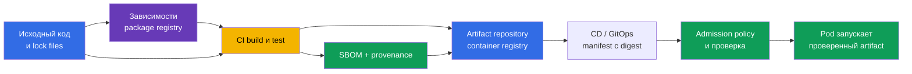
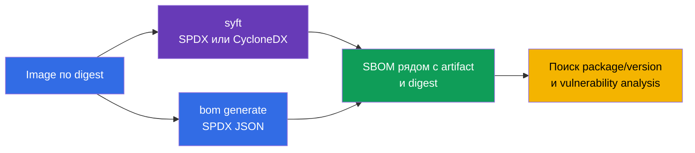
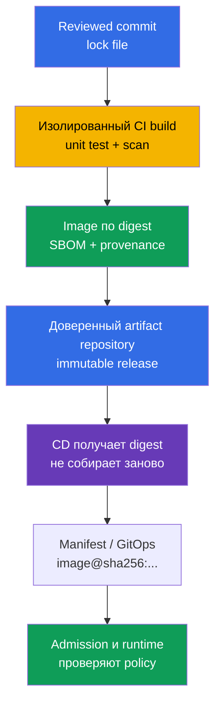

<!-- Standalone RU release: ссылки на переводы удалены, потому что соответствующие файлы не входят в архив. -->

# Глава 25. Понимание supply chain: SBOM, CI/CD, artifact repositories

> **Что дальше.** В [главе 24](../24/ru.md) мы уменьшили состав final image и зафиксировали
> его версию. Теперь нужно уметь ответить на следующий вопрос: какие именно компоненты и
> версии всё ещё попали в поставляемый artifact, кем и как он был собран. Это домен
> **Supply Chain Security** CKS (20%). Инвентаризация через SBOM делает уязвимый компонент
> наблюдаемым, а контролируемый CI/CD и registry создают цепочку доверия до deployment.

> **Что нужно из CKA.** Базовые понятия image, layers, Dockerfile, tag, digest и registry
> разобраны в [главе 23 CKA](../../../cka/course/23/ru.md). Здесь не повторяем сборку
> контейнера: рассматриваем image как artifact поставки, составляем его инвентарь и
> проверяем путь от исходного кода до Kubernetes.

## 25.1. Software supply chain и цепочка доверия

**Software supply chain** - все люди, системы, исходники, зависимости и artifacts, через
которые проходит приложение до запуска в Pod. Для container workload это не только Git и
Dockerfile: в цепочке есть dependency registry, build runner, CI/CD credentials, container
registry, manifest/GitOps repository, admission policy и kubelet, скачивающий image.



Цепочка доверия сильна настолько, насколько силён её самый слабый участок. Если CI получил
подменённую dependency, подписал image не от той revision или CD развернул mutable tag,
поздняя проверка Kubernetes не может вернуть исходный artifact. Поэтому важны одновременно
идентификация **что** запущено (digest и SBOM), **откуда** оно взялось (provenance) и
**какие действия разрешены** на каждом переходе.

Типовые атаки на supply chain:

- компрометация dependency или публикация пакета с похожим именем (typosquatting), после
  которой вредоносный код устанавливается обычным package manager;
- захват учётной записи maintainer-а либо CI token и публикация image от имени проекта;
- изменение build script, runner-а, кеша или base image, из-за которого artifact не
  соответствует reviewed source;
- подмена tag в registry: `app:stable` начинает указывать на другие байты, хотя manifest
  Kubernetes не менялся;
- доступ злоумышленника к registry или CD credentials и прямой deploy в обход review;
- утечка secret из CI log, environment или layer image с последующим использованием этого
  credential для подписи, push или изменения release.

Инцидент класса SolarWinds показывает принцип: атакующий не обязан взламывать каждого
потребителя, если получает возможность изменить один доверенный этап сборки или delivery.
В Kubernetes результатом может стать Pod с корректным именем и tag, но с чужим code.

Нельзя свести защиту к одному scanner-у. SBOM показывает состав, scanner сопоставляет его с
известными CVE, signature/provenance связывают artifact с процессом сборки, а admission
policy не допускает artifact, который не соответствует правилам. Эти механизмы дополняют
друг друга.

## 25.2. SBOM: инвентарь компонентов и форматы SPDX/CycloneDX

**SBOM** (Software Bill of Materials) - машиночитаемый список компонентов artifact: пакетов,
библиотек, их версий, идентификаторов, лицензий и иногда dependency relationships. Для
container image генератор читает filesystem и package metadata слоёв; SBOM отвечает прежде
всего на вопрос «что найдено в этом artifact». Это не доказательство отсутствия CVE и не
сам по себе криптографический proof происхождения.

Наиболее распространены два открытых формата:

| Формат | Назначение и сильная сторона | Где чаще встречается |
|---|---|---|
| **SPDX** | Стандарт Linux Foundation для состава software, лицензий, пакетов и отношений; хорошо подходит для compliance и обмена inventory | OCI artifacts, дистрибутивы, CI и Kubernetes ecosystem |
| **CycloneDX** | Формат OWASP, ориентированный на component analysis и security tooling; удобен для vulnerability management | scanners, dependency analysis, security dashboards |

Оба формата могут описать один image, но их JSON-поля различаются. В SPDX пакеты обычно
находятся в `.packages`, а версия - в `versionInfo`; в CycloneDX компоненты находятся в
`.components`, а версия - в `version`. Не пишите универсальный `jq`-запрос, не зная
формата файла: отсутствие результата может означать неверный путь JSON, а не отсутствие
пакета.

У SBOM есть и границы точности:

- package database есть не во всяком image; static binary может содержать библиотеки, но
  не иметь привычного metadata package manager;
- scanner может определить компонент эвристически, поэтому имя или версия нуждаются в
  проверке по manifest и lock file;
- SBOM отражает момент генерации. После rebuild base image, смены dependency или digest
  создают новый SBOM;
- один version string ещё не означает уязвимость: важно сопоставить его с vendor advisory,
  OS distribution, архитектурой и статусом исправления.

Практическое правило: храните SBOM рядом с тем artifact и тем immutable digest, для
которого он создан. Файл `api-1.4.2.spdx.json`, созданный для `api:1.4.2`, недостаточен,
если этот tag позднее был переписан; связь должна быть с `@sha256:...`.

## 25.3. Генерация SBOM: `syft` и `bom` из Kubernetes ecosystem

Перед генерацией зафиксируйте reference image. Tag удобен только для чтения человеком;
для отчёта, проверки и production deployment берите digest, который вернул ваш registry:

```bash
IMAGE='registry.example.com/payments/api:1.4.2@sha256:<64-hex-digest>'
```

Не подставляйте в release случайный digest из документации. Сначала получите digest
проверенного image из доверенного registry и сохраните его рядом с SBOM. Генератору может
потребоваться registry credential для private image; передавать пароль в history shell или
в commit нельзя.

### `syft`: SPDX и CycloneDX из одного image

[Syft](https://github.com/anchore/syft) каталогизирует packages в image, directory или
archive и умеет выводить несколько форматов. Следующие команды создают два независимых
файла для одного и того же image:

```bash
syft "$IMAGE" -o spdx-json > api.spdx.json
syft "$IMAGE" -o cyclonedx-json > api.cyclonedx.json
```

Эквивалентные краткие команды, которые полезно быстро вспомнить на экзамене:

```bash
syft <image> -o spdx-json
syft <image> -o cyclonedx-json
```

Проверьте, что файл не пустой и является JSON, до того как передавать его scanner-у или
сохранять как evidence:

```bash
jq -e '.spdxVersion and (.packages | type == "array")' api.spdx.json >/dev/null
jq -e '.bomFormat == "CycloneDX" and (.components | type == "array")' \
  api.cyclonedx.json >/dev/null
```

Первый запрос ожидает SPDX JSON, второй - CycloneDX JSON. Конкретный SBOM может не иметь
какого-либо поля, не обязательного для вашего generator version; однако JSON parser,
формат и наличие списка компонентов должны быть проверены явно. Не выдавайте HTML-ошибку
registry или пустой файл за SBOM только потому, что команда вернула файл.

### `bom`: Kubernetes-ориентированный путь к SPDX JSON

[`bom`](https://github.com/kubernetes-sigs/bom) - инструмент Kubernetes SIGs для работы с
software bill of materials. Это важный практический инструмент CKS: его документация
разрешена на экзамене, а в lab 111 он применяется для генерации SPDX JSON. В актуальной
среде сначала смотрите доступные flags, а не угадывайте синтаксис:

```bash
bom generate --help
```

Для image команда из сценария лабораторной работы создаёт SPDX-JSON файл:

```bash
bom generate --image "$IMAGE" --format json --output out.spdx.json
```

В краткой форме у некоторых версий `bom` используется `-o`:

```bash
bom generate --image "$IMAGE" --format json -o sbom.spdx.json
```

`--format json` в этой команде означает JSON-представление SPDX, а не CycloneDX. Не
переименовывайте файл в `*.cyclonedx.json`: имя должно сообщать реальный format, чтобы
последующий `jq`, scanner и reviewer выбрали правильную схему. Проверьте полученный файл
как SPDX и посчитайте найденные packages:

```bash
jq -e '.spdxVersion and (.packages | type == "array")' out.spdx.json >/dev/null
jq '.packages | length' out.spdx.json
```

Если `bom` не видит локальный image, укажите reference, доступный тому runtime/registry, из
которого запускается команда, и проверьте `bom generate --help` для версии, установленной
в среде. Не заменяйте ошибку доступа искусственно созданным JSON: это скрывает проблему
credentials или неправильного имени artifact.



## 25.4. Чтение SBOM: найти package и конкретную версию

Экзаменационный и production-сценарий обычно начинается с advisory: например, известно,
что в одном из образов присутствует `ca-certificates-bundle` определённой версии. Нельзя
делать вывод по имени image или tag. Нужно найти package **и его version** в SBOM конкретного
digest, затем сопоставить результат с running workload.

Для SPDX JSON, созданного `bom` или `syft`, покажите имя и версию exact package:

```bash
jq -r '
  .packages[]
  | select(.name == "ca-certificates-bundle")
  | [.name, .versionInfo, .SPDXID] | @tsv
' out.spdx.json
```

Если package действительно существует, вы увидите строку `name`, `versionInfo` и `SPDXID`.
Если output пуст, не меняйте deployment вслепую. Последовательно проверьте: выбран ли
правильный SBOM, верен ли формат, как generator назвал package и не находится ли он в
другом image/sidecar.

Поиск по части имени полезен для первичного исследования, но может вернуть несколько
пакетов и не годится как окончательная проверка версии:

```bash
jq -r '
  .packages[]
  | select(.name | test("ca-certificates"; "i"))
  | [.name, (.versionInfo // "<нет versionInfo>")] | @tsv
' out.spdx.json
```

Для CycloneDX JSON меняются путь и имя поля:

```bash
jq -r '
  .components[]
  | select(.name == "ca-certificates-bundle")
  | [.name, .version, (.purl // "<нет purl>")] | @tsv
' api.cyclonedx.json
```

`purl` (package URL) помогает отличить packages с одинаковым именем из разных ecosystems.
В реальном расследовании зафиксируйте в ticket: image digest, имя/версию package, SBOM
filename и advisory/CVE. Тогда другой инженер сможет воспроизвести результат, а не искать
«примерно такой пакет» в другом rebuild.

После нахождения компонента свяжите SBOM с кластером. Image references, которые реально
используют Pod, можно посмотреть так:

```bash
kubectl get pods -A \
  -o jsonpath='{range .items[*]}{.metadata.namespace}{"\t"}{.metadata.name}{"\t"}{range .spec.containers[*]}{.image}{"\n"}{end}{end}'
```

Этот вывод показывает declared image reference. Для окончательного incident evidence также
смотрите image ID, который runtime получил после pull: tag мог указывать на новый manifest,
а SBOM был составлен для старого digest.

```bash
kubectl get pod <pod> -n <namespace> \
  -o jsonpath='{range .status.containerStatuses[*]}{.name}{"\t"}{.imageID}{"\n"}{end}'
```

Типичная ошибка - удалить весь Deployment, увидев совпадение имени package в SBOM. Сначала
определите affected container и его image digest, подготовьте fixed image, повторите build,
SBOM и scan, затем замените image через обычный controlled rollout. Удаление workload может
прервать сервис и не устраняет уязвимый artifact в registry.

## 25.5. CI/CD, artifact repositories, provenance и SLSA

**CI** собирает, тестирует, сканирует и публикует artifact; **CD** продвигает уже
подготовленный artifact между окружениями или применяет manifest в кластере. Без границы
между ними CI может незаметно превратиться в привилегированный deploy shell. Полезное
разделение ролей: CI имеет ограниченное право publish в staging repository, CD получает
готовый digest и продвигает только одобренный immutable artifact.

**Artifact repository** хранит результаты build: OCI images в container registry, packages,
charts, SBOM, attestations и provenance. Registry не просто кеш Docker Hub: он должен быть
доверенным источником release, хранить immutable digest, ограничивать push/pull и по
возможности запрещать overwrite release tag. Примеры реализации - Harbor, Amazon ECR,
Google Artifact Registry, Azure Container Registry, GitHub Container Registry или
внутренний OCI registry. Конкретный продукт вторичен; важны контроль доступа, retention,
audit и неизменяемость release artifacts.



**Provenance** - metadata о происхождении artifact: какой source revision, build definition,
builder и входные материалы участвовали в сборке. В отличие от SBOM, provenance не
перечисляет все libraries; оно связывает output с контролируемым build process. Для
сильной цепочки release должен связывать одни и те же digest в manifest, SBOM, provenance
и registry.

[SLSA](https://slsa.dev/) (Supply-chain Levels for Software Artifacts) предлагает модель
зрелости защиты supply chain. Для CKS достаточно понимать направление уровней, а не
заучивать номера полей конкретной версии specification:

| Уровень зрелости | Практический смысл |
|---|---|
| начальный | есть build и фиксируется хотя бы базовая информация о том, что было создано |
| воспроизводимый и документированный | build process и inputs определены, provenance доступен для проверки |
| защищённый | builder изолирован, provenance создаётся доверенным процессом и защищена от подмены |
| высокий | процесс устойчивее к компрометации source и platform благодаря сильным review, controlled build и verification practices |

Не объявляйте проект «SLSA Level N» только потому, что он генерирует SBOM. Уровень зависит
от требований конкретной версии SLSA и доказательств того, как защищены source, build и
provenance. На практике улучшения выглядят так:

- lock dependencies и review изменения build definition;
- запускайте release build в ephemeral/isolated runner, а не на общей рабочей машине;
- давайте CI short-lived credential с минимумом прав и отделяйте право publish от deploy;
- публикуйте image, SBOM и provenance атомарно, привязав всё к immutable digest;
- используйте protected branches, required review и audit log registry/CI;
- в CD разворачивайте digest, не выполняйте повторный build из другого environment.

Проверка digest проста и обязательна: после pull/reference в manifest должны быть именно
те байты, для которых выпускались SBOM и attestations. Подпись artifact и криптографическую
проверку `cosign verify` подробно рассматривает [глава 26](../26/ru.md); SBOM не заменяет
эту проверку.

## 25.6. SBOM в поиске уязвимых компонентов

Когда появляется CVE или vendor advisory, SBOM сокращает инцидентный вопрос с «какие у нас
тысячи образов?» до «какие digest содержат affected package/version?». Рабочий цикл:

1. получить точные условия advisory: package, ecosystem/distribution, affected versions и
   fixed version;
2. найти package/version в SBOM каждого candidate artifact, не полагаясь на tag;
3. подтвердить digest в registry и `imageID` работающего Pod;
4. собрать или выбрать исправленный artifact, сгенерировать новый SBOM и проверить, что
   affected version исчезла или заменена;
5. просканировать, подписать/проверить и только затем продвинуть digest через CD;
6. сохранить SBOM, результат scan и rollout как evidence для incident response и audit.

```mermaid
flowchart LR
    cve["Advisory: package\n+ affected version"] --> sbom["Поиск в SBOM\nпо digest"]
    sbom --> affected["Affected image\nи running Pod"]
    affected --> fixed["Fixed dependency\nили base image"]
    fixed --> rebuild["Rebuild: новый digest\nновый SBOM"]
    rebuild --> rescan["Scan + verify\nversion больше нет"]
    rescan --> rollout["Controlled rollout"]
    style cve fill:#db4437,color:#fff
    style sbom fill:#f4b400,color:#000
    style fixed fill:#326ce5,color:#fff
    style rebuild fill:#326ce5,color:#fff
    style rescan fill:#0f9d58,color:#fff
    style rollout fill:#0f9d58,color:#fff
```



SBOM не заменяет vulnerability scanner. Он даёт inventory, а scanner добавляет базу CVE,
правила сопоставления и severity. В [главе 28](../28/ru.md) мы применим Trivy и Grype к
image и готовому SBOM. До этого полезно уметь вручную доказать наличие package/version
через `jq`: это диагностирует формат, данные scanner-а и ошибки автоматизации.

Также не путайте «не найдено в SBOM» и «безопасно». Причины отсутствия могут быть
неполный detector, static link, неверный image, устаревший SBOM или package под другим
именем. Для critical incident дополняйте поиск lock file, source repository, base image
release notes и runtime image ID.

## 25.7. Проверка: SBOM через `bom` и поиск заданного package/version

В lab 111 проверяем полный минимум, который нужен для задания CKS: сгенерировать SBOM
через `bom`, убедиться, что это валидный SPDX JSON, и найти в нём заданный package/version.
Работайте с training image, выданным лабораторной работой, либо со своим разрешённым image;
не используйте mutable `latest` как evidence.

```bash
IMAGE='<image-from-lab-or-registry>@sha256:<64-hex-digest>'

# 1. Создать SPDX JSON с Kubernetes SIGs bom.
bom generate --image "$IMAGE" --format json --output out.spdx.json

# 2. Доказать, что output - SPDX JSON с packages.
jq -e '.spdxVersion and (.packages | type == "array") and (.packages | length > 0)' \
  out.spdx.json >/dev/null

# 3. Найти заданный package и его version.
jq -r '
  .packages[]
  | select(.name == "ca-certificates-bundle")
  | [.name, .versionInfo, .SPDXID] | @tsv
' out.spdx.json
```

Если лаба задаёт другую пару `package/version`, замените только value в `select`, а не
саму схему проверки. Сверьте полученную версию с условием: поиск package без сравнения
версии не доказывает, что найден именно уязвимый component.

Для дополнительной cross-check генерации тем же image через Syft:

```bash
syft "$IMAGE" -o spdx-json > syft.spdx.json
jq -e '.spdxVersion and (.packages | type == "array")' syft.spdx.json >/dev/null
```

### Диагностика типичных ошибок

| Симптом | Вероятная причина | Что проверить |
|---|---|---|
| `bom` или `syft` не может скачать image | private registry, неверный reference или сеть | registry login/credential, repository, tag/digest, доступ runner-а к registry |
| `jq` сообщает parse error | output не JSON, файл пустой или в него попала ошибка | размер файла, stderr команды, первые строки файла; заново сгенерировать SBOM |
| `jq` не находит package | другое имя, другой JSON format, другой image digest или отсутствие metadata | `.packages[].name`, `.components[].name`, digest, package manager database |
| package найден, но версия не совпала | image собран из другого base/dependency или advisory применён к иной distribution | `versionInfo`, purl, base image, lock file и условия advisory |
| SBOM есть, но deploy всё ещё уязвим | CD применил tag/старый digest или rollout не завершён | manifest `image:`, Pod `imageID`, rollout status и registry digest |

Критерий готовности проверки: есть непустой валидный SPDX JSON, в нём зафиксирован
package/version для конкретного image digest, а команды и файлы можно передать другому
инженеру для повторения результата.

## 25.8. Как это применяют в продакшене

- **SBOM создают на release build.** Генерация происходит автоматически в CI для каждого
  publishable digest, а не вручную после инцидента. SBOM хранится как artifact/attestation
  рядом с image и имеет retention не короче самого release.
- **Digest - идентификатор релиза.** Manifest/GitOps, SBOM, scan report, provenance и
  change record ссылаются на один immutable digest. Release tag можно оставить для людей,
  но им не заменяют доказательство содержимого.
- **Registry - контролируемая граница.** Права push разделены по проектам, release tags
  защищены от overwrite, включены audit logs, replication и cleanup policy. Рабочая станция
  не публикует production image напрямую.
- **CI минимально привилегирован.** Ephemeral runners, short-lived tokens, scoped secrets,
  protected branches и review build definition уменьшают вероятность подмены или утечки.
- **Vulnerability management замкнут.** Advisory приводит к SBOM query, затем к fixed
  digest, новому SBOM, scan, проверке и rollout. Исключения имеют владельца, срок и
  evidence, а не живут в ignore list бесконечно.
- **Проверка происхождения обязательна.** До CD проверяют digest и attestations/signature;
  admission policy в кластере становится последней границей, а не единственным местом
  контроля. Подпись и её enforcement - тема следующей главы.

## 25.9. Мини-глоссарий

- **Software supply chain** - путь source, dependencies, build systems и artifacts до
  running workload.
- **Artifact** - результат build, например OCI image, SBOM, chart или provenance.
- **Artifact repository** - контролируемое хранилище artifacts: registry, package или chart
  repository.
- **SBOM** - машиночитаемый inventory компонентов и версий software artifact.
- **SPDX** - открытый стандарт описания packages, licenses и их отношений.
- **CycloneDX** - формат OWASP для component inventory и security analysis.
- **Syft** - инструмент генерации SBOM из image, filesystem или archive.
- **bom** - инструмент `kubernetes-sigs/bom` для генерации и работы со SPDX SBOM.
- **Provenance** - metadata о source, inputs, сборщике (builder) и процессе создания artifact.
- **SLSA** - модель зрелости практик защиты supply chain.
- **Digest** - неизменяемый content identifier image, обычно `sha256`.
- **purl** - package URL, идентификатор package с ecosystem и version.

## 25.10. Итоги главы

- Software supply chain охватывает source, dependencies, CI/CD, registry, metadata и
  deployment; компрометация одного доверенного этапа может доставить вредоносный artifact
  во множество кластеров.
- SBOM - inventory компонентов artifact. SPDX и CycloneDX описывают один предмет разными
  JSON schema; SBOM не является ни scan report, ни proof происхождения.
- `syft` генерирует SPDX JSON и CycloneDX JSON; `bom` из Kubernetes ecosystem генерирует
  SPDX JSON командой `bom generate --image ... --format json --output ...`.
- Поиск уязвимого компонента требует package, exact version и image digest. Для SPDX это
  обычно `.packages[].name` и `.versionInfo`, для CycloneDX - `.components[].name` и
  `.version`.
- CI должен выпускать image, SBOM и provenance для одного digest, а CD - продвигать этот
  digest из доверенного artifact repository без повторной сборки.
- SLSA направляет развитие к документированному, изолированному и проверяемому build
  process; генерация SBOM сама по себе не доказывает уровень SLSA.
- После CVE цикл выглядит так: query SBOM → подтвердить running digest → fixed rebuild →
  новый SBOM/scan/verify → controlled rollout.

## 25.11. Как это пригодится: на экзамене и в реальной работе

**На экзамене.** Уметь быстро запустить `bom generate --image ... --format json`,
проверить SPDX JSON и найти package/version - практический навык lab 111 и типовой
mock-сценарий. Не путайте формат Syft, название JSON-поля и image tag с digest. При
необходимости документация `kubernetes-sigs/bom` разрешена: сначала проверяйте `--help`,
затем сохраняйте требуемый artifact и покажите результат поиска.

**В реальной работе.** SBOM сокращает время реакции на CVE, но ценность появляется только
при дисциплине release: известный digest, контролируемый registry, сохранённые provenance
и scan evidence. Это позволяет говорить не «мы думаем, что образ исправлен», а «в cluster
работает этот digest; его SBOM не содержит affected version; он собран и проверен
утверждённым pipeline».

## 25.12. Вопросы для самопроверки

1. Какие участники входят в supply chain container workload от commit до Pod и где может
   произойти подмена artifact?
2. Чем SBOM отличается от vulnerability scan report, signature и provenance?
3. Почему SBOM для `app:1.4.2` без digest может не быть доказательством состава running
   image?
4. Какие JSON paths используют для package/version в SPDX и CycloneDX?
5. Как сгенерировать SPDX JSON через `syft` и через `kubernetes-sigs/bom`?
6. Почему поиск только по имени `ca-certificates-bundle` не достаточен для решения по CVE?
7. Как получить `imageID` контейнера и зачем сравнивать его с digest SBOM?
8. Почему CI не должен собирать один image, а CD - незаметно пересобирать его в другом
   environment?
9. Какой смысл SLSA придаёт provenance и изолированному сборщику (builder)?
10. Какие проверки должны пройти между fixed dependency и production rollout?

## Практика

🧪 Лаба 111 (SBOM через `bom` и `syft`, поиск package/version, scanning и supply-chain
artifacts): [tasks/cks/labs/111](../../labs/111/README_RU.MD)

Для базы image, Dockerfile, registry, tag и digest повторите
[главу 23 CKA](../../../cka/course/23/ru.md). Далее изучите
[главу 26](../26/ru.md) о подписании и валидации artifacts и
[главу 28](../28/ru.md) о сканировании SBOM на уязвимости.

---
[Оглавление](../README_RU.md) · [Глава 24](../24/ru.md) · [Глава 26](../26/ru.md)
