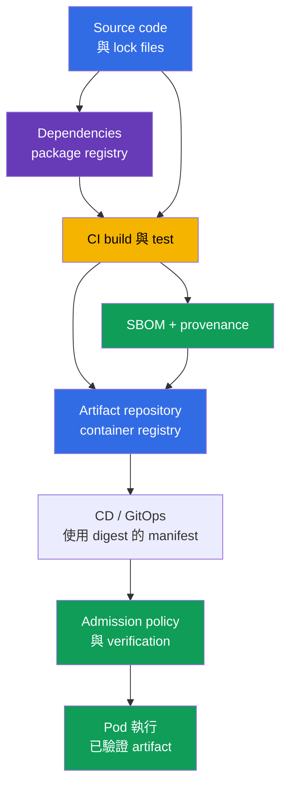
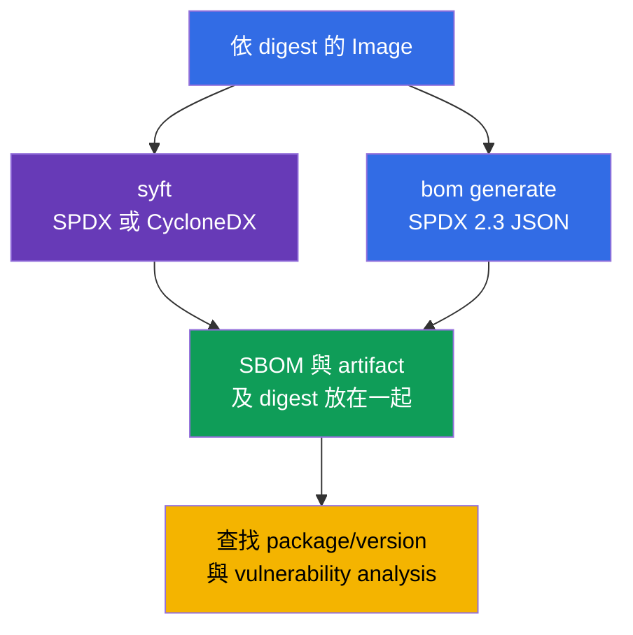
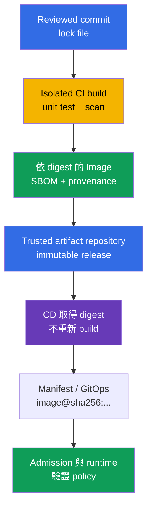
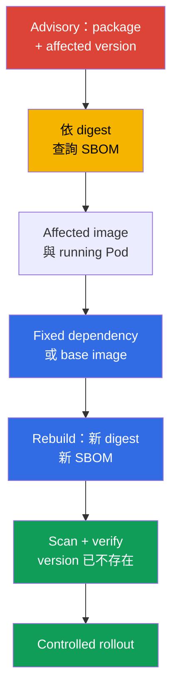

[Русская версия](ru.md) · [Eng version](README.md) · [Versión en español](es.md) · [Version française](fr.md) · [Deutsche Version](de.md) · [ქართული ვერსია](ge.md) · [日本語版](jp.md)

# 第 25 章。理解 supply chain：SBOM、CI/CD、artifact repositories

> **問題。** Registry 中遭竄改的 dependency、被入侵的 CI token 或被變更的 tag，可能以熟悉的
> image 名稱將他人的 code 交付到 Pod。若沒有綁定 digest 的 inventory，就無法迅速確認
> 哪些 components 進入 artifact、誰以何種 source state 建置它。這會使有漏洞的 dependency 或
> 惡意 build 在 consumer 執行前一直未被察覺。

> **接下來。** 在[第 24 章](../24/tw.md)，我們縮小了 final image 的內容並固定了
> version。現在必須能回答下一個問題：究竟哪些 components 和 versions 仍進入交付的 artifact，
> 又是誰如何建置它。這是 CKS **Supply Chain Security**（20%）的領域。透過 SBOM 的
> inventory 讓有漏洞的 component 可被觀察，而受控的 CI/CD 與 registry 建立通向 deployment
> 的 trust chain。

> **需要的 CKA 基礎。** image、layers、Dockerfile、tag、digest 和 registry 的基本概念
> 請見[CKA 第 23 章](../../../cka/course/23/tw.md)。這裡不重複 container build：
> 而是把 image 視為交付 artifact、建立其 inventory，並檢查從 source code 到 Kubernetes 的路徑。

> 🧠 Trust chain 連結 source、dependencies、CI/CD、registry 和 admission：任一環節遭入侵都可能向 `Pod` 交付他人的 artifact。

## 25.1. Software supply chain 與 trust chain

**Software supply chain** 是 application 在 Pod 中執行前所經過的所有人員、systems、
sources、dependencies 與 artifacts。對 container workload 而言，它不只包括 Git 和
Dockerfile：chain 中還有 dependency registry、build runner、CI/CD credentials、container
registry、manifest/GitOps repository、admission policy 與拉取 image 的 kubelet。



Trust chain 的強度取決於最弱環節。若 CI 取得遭竄改的 dependency、為錯誤 revision
簽署 image，或 CD 部署 mutable tag，後續的 Kubernetes verification 無法還原原始
artifact。因此，同時識別 **執行什麼**（digest 和 SBOM）、**它來自何處**（provenance）
及每個步驟中 **允許哪些 actions** 都很重要。

Supply chain 的典型 attacks：

- Dependency 遭入侵，或發布名稱相近的 package（typosquatting），使惡意 code 被一般
  package manager 安裝；
- 取得 maintainer account 或 CI token，並以 project 名義發布 image；
- 變更 build script、runner、cache 或 base image，使 artifact 與 reviewed source
  不相符；
- 變更 registry 中的 tag：`app:stable` 開始指向其他 bytes，Kubernetes manifest
  本身卻未變更；
- Attacker 存取 registry 或 CD credentials，繞過 review 直接 deploy；
- CI log、environment 或 image layer 洩漏 secret，之後用該 credential 進行 signing、
  push 或變更 release。

SolarWinds 類型 incident 說明一個原則：若 attacker 能變更一個 trusted build 或 delivery
stage，就不必入侵每一個 consumer。在 Kubernetes 中，結果可能是名稱和 tag 正確、但 code
屬於他人的 Pod。

近期的 [Trivy incident](https://github.com/aquasecurity/trivy/discussions/10462)
展示了相同的 trust concentration。根據 project 的最終報告，2026 年 2 月 27 日，attacker
利用有漏洞的 `pull_request_target` workflow 取得 repository 與 organization level secrets，
並在 3 月 19 日以被竊 credential 啟動 release workflow、散布惡意的 Trivy `v0.69.4`。
根本問題不在 scanner 本身，而是 privileged CI 執行未驗證的 PR code，並且能存取過多
secrets；service accounts 的隔離不足和無效的 rotation 擴大了 impact。
這不代表所有 Trivy users 或 Kubernetes Pods 都遭入侵，但它證實了 SolarWinds 的教訓：
一個擁有廣泛 credentials 的 trusted build/release step，會給 attacker 可擴展地交付他人 code
的路徑。

不能把 protection 簡化成一個 scanner。SBOM 顯示內容，scanner 將它與已知 CVE
比對，signature/provenance 將 artifact 連結到 build process，而 admission policy
不允許不符合 rules 的 artifact。這些 mechanisms 彼此互補。

> 🧠 SBOM 是特定 artifact 內容的 inventory，不是 scan report，也不是其 provenance 的 cryptographic proof。

## 25.2. SBOM：component inventory 與 SPDX 2.3 JSON/CycloneDX formats

**SBOM**（Software Bill of Materials）是 artifact components 的 machine-readable
清單：packages、libraries、其 versions、identifiers、licenses，有時還包括 dependency
relationships。對 container image 而言，generator 會讀取 layers 的 filesystem 和 package
metadata；SBOM 首先回答的是「這個 artifact 中發現了什麼」。它不是沒有 CVE 的證明，也不是
單獨的 cryptographic proof of origin。

兩個最常見的 open formats：

| Format | 用途與優勢 | 最常見的場合 |
|---|---|---|
| **SPDX 2.3 JSON** | Linux Foundation 對 software composition、licenses、packages 和 relationships 的 standard；很適合 compliance 與 inventory exchange | OCI artifacts、distributions、CI 與 Kubernetes ecosystem |
| **CycloneDX** | Open Worldwide Application Security Project（OWASP）format，著重 component analysis 和 security tooling；適合 vulnerability management | scanners、dependency analysis、security dashboards |

兩種 formats 都可描述同一 image，但 JSON fields 不同。以下所有 SPDX 範例都是
**SPDX 2.3 JSON**：在此 schema 中 packages 通常位於 `.packages`，version 位於
`versionInfo`；CycloneDX 的 components 位於 `.components`，version 位於
`version`。不要將這些 paths 套用到 SPDX 3.0：它的 data model 不同。不知道 file 的
format 與 version 時，不要撰寫通用 `jq` query：沒有結果可能代表 JSON path 錯誤，
而非 package 不存在。

SBOM 的精確度也有邊界：

- 並非每個 image 都有 package database；static binary 可能含有 libraries，卻沒有一般
  package manager metadata；
- Scanner 可能以 heuristic 方式識別 component，因此名稱或 version 需透過 manifest 與
  lock file 驗證；
- SBOM 反映的是 generation 時刻。Rebuild base image、變更 dependency 或 digest 都會
  建立新的 SBOM；
- 單一 version string 不代表有 vulnerability：必須與 vendor advisory、OS distribution、
  architecture 與 fixed status 比對。

**Runtime SBOM 與完整 build chain 是不同 inventories。** Final multi-stage image 的 SBOM
描述到達 runtime 的內容；被捨棄的 builder stages 中的 dependencies 當然不會出現。即使
分析 `--scope all-layers` 也只涵蓋 final image 的 layers，而不是所有消失的 build stages。
完整的 supply chain inventory 還需要 source、lock files、build attestations 與 provenance：
final SBOM 沒有 package，不能證明它在 build process 中不存在。

實務規則：將 SBOM 儲存在與其建立對象相同的 artifact、相同 immutable digest 旁。
若 tag 後來被重寫，為 `api:1.4.2` 建立的 `api-1.4.2.spdx.json` 不足；關聯必須是
`@sha256:...`。

## 25.3. 生成 SBOM：Kubernetes ecosystem 的 `syft` 與 `bom`

在 generation 前固定 image reference。Tag 只方便人閱讀；report、verification 和
production deployment 應使用 registry 回傳的 digest：

```bash
IMAGE='registry.example.com/payments/api:1.4.2@sha256:<64-hex-digest>'
```

不要把 documentation 中隨機的 digest 放進 release。先從 trusted registry 取得已驗證 image
digest，並將它保存在 SBOM 旁。Generator 對 private image 可能需要 registry credential；
不要將 password 傳入 shell history 或 commit。

> 🔬 `syft` 可生成多個 formats 的 SBOM。

### `syft`：從一個 image 生成 SPDX 2.3 JSON 與 CycloneDX

[Syft](https://github.com/anchore/syft) 會 catalog image、directory 或 archive 中的
packages，並可輸出多種 formats。以下 commands 為同一 image 建立兩個獨立檔案：

```bash
syft "$IMAGE" -o spdx-json > api.spdx.json
syft "$IMAGE" -o cyclonedx-json > api.cyclonedx.json
```

若 reference 指向 multi-arch OCI index，請明確選擇 platform。對 heterogeneous
cluster，為每個實際使用的 platform manifest 建立並索引獨立 SBOM；在其旁儲存該
platform 和該 manifest digest，而不僅是 index digest：

```bash
PLATFORM='linux/amd64'
syft "$IMAGE" --platform "$PLATFORM" -o spdx-json > api.linux-amd64.spdx.json
```

考試時很有用、可快速回想的等效簡短 commands：

```bash
syft <image> -o spdx-json
syft <image> -o cyclonedx-json
```

在把 file 傳給 scanner 或存為 evidence 前，確認它非空且為 JSON：

```bash
jq -e '
  .spdxVersion == "SPDX-2.3"
  and .SPDXID == "SPDXRef-DOCUMENT"
  and .dataLicense == "CC0-1.0"
  and (.documentNamespace | type == "string")
  and (.creationInfo.creators | type == "array")
  and (.packages | type == "array")
' api.spdx.json >/dev/null
jq -e '.bomFormat == "CycloneDX" and (.components | type == "array")' \
  api.cyclonedx.json >/dev/null
```

第一個 query 是預期 SPDX 2.3 JSON 的 **sanity-check**，第二個是 CycloneDX JSON。
它會排除 empty output、registry HTML error 與其他 format 的 JSON，但不是完整的
schema/conformance validation：請使用與目標 specification version 相容的 SPDX validator。
某個 SBOM 可能沒有 generator version 不強制的 field；仍請明確檢查基本 document fields、
format 與 component list。

> 🎯 `kubernetes-sigs/bom` 是 Kubernetes-oriented 的路徑：為指定 image 生成 SPDX JSON、驗證 structure 並保存結果。

### `bom`：生成 SPDX 2.3 JSON 的 Kubernetes-oriented 路徑

[`bom`](https://github.com/kubernetes-sigs/bom) 是 Kubernetes SIGs 的 software bill of
materials 工具。這是重要的 CKS 實務工具：考試允許使用其 documentation，且 lab 111 使用它
生成 SPDX 2.3 JSON。在目前環境中，先查看可用 flags，而非猜測 syntax：

```bash
bom generate --help
```

對 image，lab scenario 的 command 會建立 SPDX-JSON file：

```bash
bom generate --image "$IMAGE" --format json --output out.spdx.json
```

在部分 `bom` versions 中，short form 使用 `-o`：

```bash
bom generate --image "$IMAGE" --format json -o sbom.spdx.json
```

此 command 的 `--format json` 意味著 SPDX 的 JSON representation，而非 CycloneDX。
不要將 file 命名為 `*.cyclonedx.json`：名稱應表達實際 format，使後續的 `jq`、scanner
與 reviewer 選擇正確 schema。將產生的 file 作為 SPDX 檢查，並計數發現的 packages：

```bash
jq -e '
  .spdxVersion == "SPDX-2.3"
  and .SPDXID == "SPDXRef-DOCUMENT"
  and .dataLicense == "CC0-1.0"
  and (.documentNamespace | type == "string")
  and (.creationInfo.creators | type == "array")
  and (.packages | type == "array")
' out.spdx.json >/dev/null
jq '.packages | length' out.spdx.json
```

這是 sanity-check，不是完整 SPDX schema/conformance validation。

若 `bom` 看不到 local image，請指定對執行 command 的 runtime/registry 可存取的 reference，
並依環境安裝的 version 檢查 `bom generate --help`。不要以人工建立 JSON 取代 access error：
這會掩蓋 credentials 或 artifact 名稱錯誤的問題。



> 🎯 對指定 image digest，在 SBOM 中找出 exact package 及其 version；只按名稱搜尋不會證明 advisory 是否適用。

## 25.4. 讀取 SBOM：尋找 package 與特定 version

考試與 production scenario 通常從 advisory 開始：例如，已知某一 image 包含特定 version 的
`ca-certificates-bundle`。不能根據 image 名稱或 tag 下結論。必須在特定 digest 的 SBOM 中找出
package **及其 version**，然後把結果與 running workload 比對。

對由 `bom` 或 `syft` 建立的 SPDX 2.3 JSON，顯示 exact package 的 name 與 version：

```bash
jq -r '
  .packages[]
  | select(.name == "ca-certificates-bundle")
  | [.name, .versionInfo, .SPDXID] | @tsv
' out.spdx.json
```

若 package 確實存在，會看到 `name`、`versionInfo` 與 `SPDXID` 行。若 output
為空，不要盲目變更 deployment。請依序檢查：是否選了正確 SBOM、format 是否正確、
generator 如何命名 package，以及它是否位於另一個 image/sidecar。

依部分名稱搜尋有助於初步 investigation，但它可能回傳多個 packages，不適合作為
version 的最終 verification：

```bash
jq -r '
  .packages[]
  | select(.name | test("ca-certificates"; "i"))
  | [.name, (.versionInfo // "<無 versionInfo>")] | @tsv
' out.spdx.json
```

對 CycloneDX JSON，path 與 field 名稱不同：

```bash
jq -r '
  .components[]
  | select(.name == "ca-certificates-bundle")
  | [.name, .version, (.purl // "<無 purl>")] | @tsv
' api.cyclonedx.json
```

`purl`（package URL）有助於區分不同 ecosystems 中同名的 packages。在實際 investigation
中，請在 ticket 記錄：image digest、package name/version、SBOM filename 與 advisory/CVE。
如此其他 engineer 可重現結果，而不用在不同 rebuild 中尋找「大概是這個 package」。

找到 component 後，將 SBOM 與 cluster 連結。Pod 實際使用的 image references 可如下查看：

```bash
kubectl get pods -A \
  -o jsonpath='{range .items[*]}{.metadata.namespace}{"\t"}{.metadata.name}{"\t"}{range .spec.containers[*]}{.image}{"\n"}{end}{end}'
```

此 output 顯示 declared image reference。`status.containerStatuses[].imageID` 是 node
對 running container 所回報的 runtime-specific evidence，但它不是可攜的 registry digest，
也不一定是 OCI index 或 platform manifest digest。對強 incident evidence，使用
digest-pinned `spec.containers[].image`，確定 node architecture，將 registry/index
解析至相應 platform manifest，再與該 SBOM 比對。若可存取 node，也可額外核對 runtime
inventory：

```bash
kubectl get pod <pod> -n <namespace> \
  -o jsonpath='{range .status.containerStatuses[*]}{.name}{"\t"}{.imageID}{"\n"}{end}'
kubectl get node <node> -o jsonpath='{.metadata.labels.kubernetes\.io/arch}{"\n"}'
crictl images --digests
```

典型錯誤是看到 SBOM 中 package 名稱相符就刪除整個 Deployment。請先確定 affected
container 及其 image digest、準備 fixed image，重複 build、SBOM 和 scan，然後透過一般
controlled rollout 替換 image。刪除 workload 可能中斷 service，且不會移除 registry 中
有漏洞的 artifact。

> 🏭 可靠交付會固定 release/index digest，然後固定 target platform-manifest digest，並將 SBOM、provenance 和 scan report 與它連結；CI 發布 artifact，CD 不重新 build 而是推進它。

## 25.5. CI/CD、artifact repositories、provenance 與 SLSA

**CI** 會 build、test、scan 並發布 artifact；**CD** 在 environments 間推進已準備好的
artifact，或在 cluster 套用 manifest。若 CI 與 CD 沒有 boundary，CI 可能悄然變成
privileged deploy shell。一個有用的 role separation 是：CI 只有發布到 staging repository
的有限權限；CD 接收已完成的 digest，只推進已核准 immutable artifact。

**Artifact repository** 儲存 build outputs：container registry 中的 OCI images、packages、
charts、SBOM、attestations 和 provenance。Registry 不只是 Docker Hub cache：它必須是
trusted release source，儲存 immutable digest、限制 push/pull，並在可能時禁止覆寫
release tag。實作範例包括 Harbor、Amazon ECR、Google Artifact Registry、Azure Container
Registry、GitHub Container Registry 或 internal OCI registry。具體 product 是次要的；
access control、retention、audit 和 release artifacts 的 immutability 才重要。



**Provenance** 是 artifact origin 的 metadata：build 中參與的 source revision、
build definition、builder 與 input materials。與 SBOM 不同，provenance 不列出所有
libraries；它將 output 與受控 build process 連結。若要建立強 chain，請區分 release/index
digest 和選定 platform manifest 的 digest：SBOM、scan 與 provenance 必須綁定實際
驗證或執行的 artifact。

> 🔬 在 SLSA model 中，將 SBOM、provenance 和 signature 與 digest 連結。

[SLSA](https://slsa.dev/)（Supply-chain Levels for Software Artifacts）v1.2 將
requirements 分為 independent tracks。因此 SLSA 沒有單一「low - high」scale：
Build Track 說明 build 與 provenance guarantees，Source Track 則有自己的 source
requirements。

| Track | SLSA v1.2 levels | 實務意義 |
|---|---|---|
| Build | L0 | 沒有 SLSA guarantees。 |
| Build | L1 | Provenance 存在。 |
| Build | L2 | Hosted build platform 產生 signed provenance。 |
| Build | L3 | 使用 hardened build platform。 |
| Source | L1-L4 | Source requirements 的獨立 levels；不能從 Build Track level 推導。 |

請依每個 level 的 [Build Track](https://slsa.dev/spec/v1.2/build-track-basics)
及 [Source Track](https://slsa.dev/spec/v1.2/source-requirements) specifications，
而非依自訂的四級 scale。不要只因 project 生成 SBOM 就宣稱「SLSA Level N」：
必須指明 track、specification version 及滿足相應 requirements 的 evidence。

BuildKit 可與 image/index 一起建立並發布 SBOM/provenance attestations：

```bash
IMAGE_TAG='registry.example.com/payments/api:1.4.2'
docker buildx build --sbom=true --provenance=mode=max,version=v1 --push \
  --tag "$IMAGE_TAG" .
```

此處 `version=v1` 明確固定預期 format：目前 upstream BuildKit default 是
SLSA provenance `v1`；較舊 BuildKit/Buildx versions 可能輸出 `v0.2`。因此使用
此 parameter 時，請驗證含有 `https://slsa.dev/provenance/v1` 的 `Statement/v1`。
Push 後保存 immutable digest，並為 multi-arch release 確定將執行的 platform manifest。
這些 build-native attestations 有助於把 output 與 build 連結，但不會取消獨立的
signature verification、final image SBOM 和整個 source/lock files chain inventory。

實務上的改善方式：

- Lock dependencies 並 review build definition 的變更；
- 在 ephemeral/isolated runner 上執行 release build，而不是共用 workstation；
- 給 CI 最小權限的 short-lived credential，並分離 publish 與 deploy permission；
- Atomically 發布 image、SBOM 與 provenance，全部綁定 immutable digest；
- 使用 protected branches、required review 和 registry/CI audit logs；
- 在 CD 部署 digest，而不從不同 environment 重新 build。

對 OCI index，沒有一個通用 digest，而是 chain：`release/index digest →
platform manifest digest → SBOM/provenance/scan evidence`。先選擇 target platform，
將 index 解析到其 manifest，並尋找屬於它的 attestation；然後檢查 in-toto
`subject.digest`。Docker 將 attestation manifest 儲存在 root index，但其 `subject`
必須指向 target platform manifest（或其內的 object）。對 single-platform image，
release digest 與 platform-manifest digest 可能相同，但不能假定如此。

最低限度的 SLSA/in-toto provenance 是將 `subject` 綁定到相應 platform manifest 的
statement。例如，structure 可以是：

```json
{
  "_type": "https://in-toto.io/Statement/v1",
  "subject": [{
    "name": "registry.example.com/payments/api",
    "digest": {"sha256": "<64-hex-platform-manifest-digest>"}
  }],
  "predicateType": "https://slsa.dev/provenance/v1",
  "predicate": {
    "buildDefinition": {
      "buildType": "https://ci.example.com/buildtypes/release/v1",
      "externalParameters": {}, "resolvedDependencies": []
    },
    "runDetails": {"builder": {"id": "https://ci.example.com/builders/release"}}
  }
}
```

在使用 provenance 前，先將 trusted release/index 解析到 target platform manifest，
然後將其 `subject.digest.sha256` 與 **該 manifest** 的 digest 比對。無需猜 tag 即可檢查：

```bash
PLATFORM_MANIFEST_DIGEST='sha256:<64-hex-platform-manifest-digest>'
jq -e --arg digest "${PLATFORM_MANIFEST_DIGEST#sha256:}" \
  '.subject[] | select(.digest.sha256 == $digest)' provenance.intoto.json >/dev/null
```

成功的 `jq` 證明 statement 已綁定預期 platform manifest，但不證明 statement
本身的 authenticity。Artifact signature 與 `cosign verify` 的 cryptographic verification
會在[第 26 章](../26/tw.md)詳述；SBOM 不能取代該 verification。

> 🎯 使用 SBOM 確認特定 digest 中的 affected package/version，接著替換 artifact，並驗證有漏洞的 component 已消失。

## 25.6. 在有漏洞 components 的搜尋中使用 SBOM

出現 CVE 或 vendor advisory 時，SBOM 可將 incident 問題從「我們數千個 images 中有哪些？」
縮小為「哪些 digest 含有 affected package/version？」。它也適用於 **late discovery**：
在 build 時 scanner 可能找不到問題，因為 CVE 或 affected versions 的資料尚未發布。
Scan result 反映檢查時的 knowledge base，而不保證已在執行 image 未來不會出現 advisory。

因此，在 build pipeline **之外，也要定期將已保存的 SBOM 與已更新的 CVE database
重新比對**：依 schedule 執行，並在發布重要的新 CVE 或 vendor advisory 時臨時執行。
這項 check 不會 rebuild artifact：它以 current data 評估相同 immutable digest，並應啟動
affected releases 的 triage。

工作流程：

1. 取得 advisory 的精確 conditions：package、ecosystem/distribution、affected versions 與
   fixed version；
2. 在每個 candidate release digest 已保存的 SBOM 中尋找 package/version，不依賴 tag；
   結果是一份 affected digest 清單；
3. 將 affected digest 與 runtime inventory 比對：`spec.containers[].image` 顯示
   declared reference；`status.containerStatuses[].imageID` 是 runtime-specific hint，
   不是可攜的 registry/platform-manifest digest。對 multi-arch，將 node architecture、
   platform manifest 與其綁定 SBOM 比對；
4. 將 affected digest 分為 running workloads、只存在於 registry 與已退役者；先處置
   business/risk impact 高的 running workload，再處理其他 releases；
5. Build 或選擇 fixed artifact，生成新的 SBOM，並確認 affected version 已消失或被替換；
6. Scan、sign/verify，然後才透過 CD 推進 digest；
7. 保存 SBOM、scan result 與 rollout 作為 incident response 和 audit 的 evidence。

為了快速 response，保存索引 `digest → SBOM → scan timestamp → environment/workload`。
如此新的 CVE 會觸發 inventory query，而非手動重新 scan 所有 images：先透過 SBOM 確定
可能 affected release/platform-manifest digest，再透過 digest-pinned spec、platform node
與作為額外 hint 的 runtime `imageID` 確認 running workload。只有 tag 不足：它可能
mutable，且不能證明已執行 Pod 使用哪些 bytes。



SBOM 不取代 vulnerability scanner。它提供 inventory，而 scanner 加入 CVE database、
matching rules 與 severity。在[第 28 章](../28/tw.md)，我們會將 Trivy 和 Grype 用於
image 與已完成的 SBOM。在此之前，能以 `jq` 手動證明 package/version 存在很有價值：
這有助診斷 format、scanner data 與 automation errors。

**VEX**（Vulnerability Exploitability eXchange）補足這個 model：SBOM 回答 artifact
包含什麼，scanner 或 advisory 將 component 與 CVE 比對，而 VEX 記錄該產品中特定
vulnerability 的已確認 applicability 或 exploitability status。Package/version 與 CVE
存在不代表 vulnerability 適用或可被利用；VEX 不取消 investigation 與 remediation，
而是讓決策可驗證。

也不要把「SBOM 未發現」和「安全」混為一談。未發現可能因為 detector 不完整、static link、
image 錯誤、SBOM 過時或 package 使用另一名稱。對 critical incident，補充檢查 lock file、
source repository、base image release notes 與 runtime image ID。

> 🎯 實務成果是有效的 SPDX JSON，以及對指定 image 可重現的 package/version output，而不只是 command 成功執行。

## 25.7. 驗證：透過 `bom` 的 SBOM 與指定 package/version 搜尋

Lab 111 驗證 CKS task 所需的完整最小流程：透過 `bom` 生成 SBOM、確認它是有效的
SPDX 2.3 JSON，並在其中找到指定 package/version。使用 lab 提供的 training image，
或自己的 approved image；不要把 mutable `latest` 當成 evidence。

```bash
IMAGE='<image-from-lab-or-registry>@sha256:<64-hex-digest>'

# 1. 使用 Kubernetes SIGs bom 建立 SPDX 2.3 JSON。
bom generate --image "$IMAGE" --format json --output out.spdx.json

# 2. 執行 SPDX 2.3 sanity-check，並確認 packages 非空。
jq -e '
  .spdxVersion == "SPDX-2.3"
  and .SPDXID == "SPDXRef-DOCUMENT"
  and .dataLicense == "CC0-1.0"
  and (.documentNamespace | type == "string")
  and (.creationInfo.creators | type == "array")
  and (.packages | type == "array")
  and (.packages | length > 0)
' out.spdx.json >/dev/null

# 3. 找出指定 package 及其 version。
jq -r '
  .packages[]
  | select(.name == "ca-certificates-bundle")
  | [.name, .versionInfo, .SPDXID] | @tsv
' out.spdx.json
```

若 lab 指定另一組 `package/version`，只替換 `select` 中的 value，而不是
verification schema 本身。將取得的 version 與條件比對：只搜尋 package 而不比對 version，
不能證明找到的正是 vulnerable component。

以同一 image 透過 Syft 生成的額外 cross-check：

```bash
syft "$IMAGE" -o spdx-json > syft.spdx.json
jq -e '
  .spdxVersion == "SPDX-2.3"
  and .SPDXID == "SPDXRef-DOCUMENT"
  and .dataLicense == "CC0-1.0"
  and (.documentNamespace | type == "string")
  and (.creationInfo.creators | type == "array")
  and (.packages | type == "array")
' syft.spdx.json >/dev/null
```

這是 sanity-check，不是完整 SPDX schema/conformance validation。

### 常見 errors 的診斷

| 症狀 | 可能原因 | 應檢查項目 |
|---|---|---|
| `bom` 或 `syft` 無法下載 image | private registry、錯誤 reference 或 network | registry login/credential、repository、tag/digest、runner 對 registry 的 access |
| `jq` 顯示 parse error | output 非 JSON、file 為空或含有 error | file size、command stderr、file 的前幾行；重新生成 SBOM |
| `jq` 找不到 package | 名稱不同、JSON format 不同、image digest 不同或沒有 metadata | `.packages[].name`、`.components[].name`、digest、package manager database |
| 找到 package 但 version 不相符 | Image 使用其他 base/dependency build，或 advisory 適用於不同 distribution | `versionInfo`、purl、base image、lock file 與 advisory conditions |
| 有 SBOM 但 deploy 仍有漏洞 | CD 套用 tag/舊 digest，或 rollout 未完成 | manifest `image:`、Pod `imageID`、rollout status 與 registry digest |

Verification 的 readiness criteria：有一個非空 SPDX 2.3 JSON，通過 sanity-check
（完整 conformance 需使用獨立 SPDX validator），其中已記錄特定 platform manifest digest
的 package/version，且 commands 與 files 可交給另一位 engineer 重現結果。

> 🏭 為每個 release digest 自動化 SBOM、provenance 與 scan evidence 的發布和儲存；incident 後手動建立的 report 不能取代此流程。

## 25.8. 在 production 中的做法

- **在 release build 生成 SBOM。** CI 會為每個可發布 digest 自動 generation，而不是在
  incident 後手動進行。SBOM 可以是獨立 SPDX/CycloneDX file，或綁定 image digest 的
  OCI artifact/referrer。Signed attestation 是對帶有 predicate 的 `subject` 的獨立聲明：
  它可攜帶 SBOM 或 provenance，但不是每個 SBOM 都是 attestation。實務 model：
  `image digest <- OCI SBOM artifact/referrer` 和 `image digest <- signed attestation
  (predicate=SBOM/provenance)`。這些 data 的 retention 不應短於 release 本身。
- **Digest 是 release identifiers 的 chain。** 對 multi-arch，先固定 release/index
  digest，接著固定選定 platform-manifest digest；SBOM、scan report、provenance 和
  change record 連結到此 chain 的適用層級。Release tag 可保留供人類使用，但不能取代
  content evidence。
- **Registry 是受控 boundary。** Push permissions 依 project 分隔、release tags
  受到 overwrite 保護，且啟用 audit logs、replication 與 cleanup policy。
  Workstation 不直接發布 production image。
- **CI 使用最小權限。** Ephemeral runners、short-lived tokens、scoped secrets、
  protected branches 與 build definition review 可降低竄改或洩漏的可能性。
- **Vulnerability management 是閉環。** Advisory 觸發 SBOM query，接著是 fixed
  digest、新 SBOM、scan、verification 和 rollout。Exceptions 有 owner、期限與
  evidence，而非永遠留在 ignore list。
- **必須驗證 provenance。** CD 前檢查 `release/index → target platform manifest →
  attestation subject` 與 signature chain；cluster 中的 admission policy 是最後一層
  boundary，而不是唯一 control point。Signature 及其 enforcement 是下一章的主題。

## 25.9. 迷你術語表

- **Software supply chain** - source、dependencies、build systems 與 artifacts 到
  running workload 的路徑。
- **Artifact** - build output，例如 OCI image、SBOM、chart 或 provenance。
- **Artifact repository** - 受控的 artifacts 儲存庫：registry、package 或 chart
  repository。
- **SBOM** - software artifact components 與 versions 的 machine-readable inventory。
- **SPDX 2.3 JSON** - 本章使用的 SPDX standard JSON representation，用於 packages、
  licenses 與其 relationships；不應將其 JSON model 與 SPDX 3.0 混合。
- **CycloneDX** - OWASP 的 component inventory 與 security analysis format。
- **Syft** - 從 image、filesystem 或 archive 生成 SBOM 的工具。
- **bom** - 用於生成及處理 SPDX SBOM 的 `kubernetes-sigs/bom` 工具。
- **Provenance** - artifact source、inputs、builder 和 creation process 的 metadata。
- **SLSA** - 帶有獨立 Build 與 Source tracks 的 supply chain security requirements model。
- **VEX** - 關於特定 CVE 對某 product 的 applicability 或 exploitability 的 statement。
- **Digest** - Image immutable content identifier，通常為 `sha256`。
- **purl** - package URL，帶有 ecosystem 與 version 的 package identifier。

## 25.10. 本章摘要

- Software supply chain 涵蓋 source、dependencies、CI/CD、registry、metadata 和
  deployment；一個 trusted stage 遭入侵就可能向許多 clusters 交付惡意 artifact。
- SBOM 是 artifact components 的 inventory。SPDX 與 CycloneDX 以不同 JSON schema
  描述同一 subject；SBOM 既不是 scan report，也不是 proof of origin。
- `syft` 生成 SPDX 2.3 JSON 與 CycloneDX JSON；Kubernetes ecosystem 的 `bom`
  以 `bom generate --image ... --format json --output ...` 生成 SPDX 2.3 JSON。
- 搜尋有漏洞的 component 需要 package、exact version 與 image digest。對 SPDX，
  通常是 `.packages[].name` 和 `.versionInfo`；對 CycloneDX 則是
  `.components[].name` 和 `.version`。
- CI 應以可驗證的 digest-chain 產出 image、SBOM 和 provenance；CD 應從 trusted
  artifact repository 推進選定 digest，不重新 build。
- SLSA v1.2 區分 Build Track（L0-L3）與 Source Track（L1-L4）；單獨生成 SBOM
  並不證明符合任何 track 的 requirements。
- CVE 出現後的流程為：query SBOM → 確認 running digest → fixed rebuild →
  新 SBOM/scan/verify → controlled rollout。

## 25.11. 如何應用：考試與實際工作

**在考試中。** 能快速執行 `bom generate --image ... --format json`、檢查 SPDX 2.3 JSON
並找出 package/version，是 lab 111 的實務 skill 和典型 mock scenario。不要混淆 Syft
format、JSON field 名稱與 image tag/digest。必要時可以使用 `kubernetes-sigs/bom`
documentation：先檢查 `--help`，再保存所需 artifact 並顯示搜尋結果。

**在實際工作中。** SBOM 能縮短 CVE response time，但其價值只在具備 release discipline
時出現：known digest、controlled registry、保存的 provenance 與 scan evidence。這使你能
說「cluster 正在執行此 digest；其 SBOM 不含 affected version；它由 approved pipeline
build 並驗證」，而不是「我們認為 image 已修正」。

## 25.12. 自我檢查問題

<details>
<summary>1. 從 commit 到 Pod，container workload 的 supply chain 包含哪些 participants？在哪裡可能發生 artifact substitution？</summary>

Chain 包含 source 與 lock files、package registry、CI runner、container registry、CD/GitOps、
admission policy，以及拉取 image 的 kubelet。例如，substitution 可能發生於 dependency、
build script 或 runner、base image、registry tag 或 CI/CD credential。因此同時需要
digest/SBOM、provenance 與 artifact admission control。
</details>

<details>
<summary>2. SBOM 與 vulnerability scan report、signature 及 provenance 有何不同？</summary>

SBOM 是特定 artifact components 與 versions 的 inventory，而不是 CVE 的結論。Scanner 將其
contents 與 vulnerability database 及 severity 比對，signature cryptographically 驗證 trusted
signer，而 provenance 描述 source revision、builder 與 build inputs。對 multi-arch，
這些 artifacts 必須連結到正確的 index 與 platform manifest chain。
</details>

<details>
<summary>3. 為什麼沒有 digest 的 `app:1.4.2` SBOM，可能不是 running image composition 的證明？</summary>

Tag 是 mutable：`app:1.4.2` 可在生成 SBOM 後重新指派給其他 bytes。Composition proof
應連結 immutable `@sha256:...`；對 multi-arch 還要固定選定 platform manifest 和
runtime evidence。否則 SBOM 可能屬於舊 manifest，而 Pod 已使用另一個 image。
</details>

<details>
<summary>4. SPDX 與 CycloneDX 分別使用哪些 JSON paths 取得 package/version？</summary>

在 SPDX 2.3 JSON，components 位於 `.packages`，version 位於 `.versionInfo`，例如
`.packages[]` element。CycloneDX 則使用 `.components[]` 與 `.version` field；
`.purl` 也有助於區分 ecosystems。這些 paths 不能機械式套用到其他 format 或 SPDX 3.0。
</details>

<details>
<summary>5. 如何透過 `syft` 與 `kubernetes-sigs/bom` 生成 SPDX 2.3 JSON？</summary>

Syft 使用 `syft "$IMAGE" -o spdx-json > api.spdx.json`。Kubernetes SIGs bom 使用
`bom generate --image "$IMAGE" --format json --output out.spdx.json`；此處 JSON 意味著
SPDX，而不是 CycloneDX。接著對預期 SPDX 2.3 執行 sanity-check：檢查
`.spdxVersion == "SPDX-2.3"` 與 `.packages` array（主要流程也檢查 document identifier
和 metadata）。完整 schema/conformance validation 需要獨立 SPDX validator。
</details>

<details>
<summary>6. 為什麼只搜尋 `ca-certificates-bundle` 名稱，不足以決定 CVE？</summary>

Advisory decision 需要 exact package、其 version、ecosystem/distribution 及 fixed version
conditions，而名稱可能有多種 variants。必須搜尋名稱及 `versionInfo`，並將 SBOM 綁定到
image digest。然後把結果與 advisory 和 runtime imageID 比對，而不是只因名稱相符就刪除 workload。
</details>

<details>
<summary>7. 如何取得 container 的 `imageID`，以及如何將它用作 runtime evidence？</summary>

它從 Pod status 輸出：`kubectl get pod <pod> -n <namespace> -o jsonpath='{range .status.containerStatuses[*]}{.name}{"\t"}{.imageID}{"\n"}{end}'`。`imageID` 是 runtime-specific hint，
不是可攜的 registry/index/platform-manifest digest，因此不能直接與 SBOM digest 比對。強力
mapping 要考慮 digest-pinned `spec.containers[].image`、node architecture，以及將
registry/index 解析到 target platform manifest；可存取 node 時也要核對 `crictl images --digests`。
Spec 中只有 tag 本身不能保證這些事。
</details>

<details>
<summary>8. 為什麼 CI 不應 build 一個 image，而 CD 卻在另一個 environment 悄然 rebuild 它？</summary>

CD 應推進已驗證 immutable digest，而不是以不同 inputs、builder 或 dependencies 建立新 artifact。
否則 CI 的 SBOM、scan 和 provenance 屬於某些 bytes，而 production 可能取得另一些。分開 CI
publish 與 CD deploy 使此 chain 可被驗證。
</details>

<details>
<summary>9. SLSA 賦予 provenance 與 isolated builder 的意義是什麼？</summary>

在 SLSA 中，provenance 將 output 與 build definition、source 及 builder 連結。對 multi-arch，
先將 release/index digest 解析到 target platform manifest，再將其 `subject.digest` 與該
manifest digest（或其內允許的 object）比對；不能假定它等於 root index。Build Track 中，L1
要求存在 provenance，L2 要求 hosted build platform 的 signed provenance，L3 要求 hardened
build platform。Isolated builder 可降低共用 work environment 遭竄改的風險，但 level 應明確
附上 track 和 evidence。
</details>

<details>
<summary>10. Fixed dependency 與 production rollout 之間必須通過哪些 checks？</summary>

更新 dependency 或 base image 後，建立新的 digest 與 SBOM，然後確認 affected version 已消失或
被替換。Scan、sign/verify 新 artifact，然後才透過 controlled CD rollout 推進。Evidence 包含
SBOM、scan、已驗證 digest 及 rollout result。
</details>

<details>
<summary>11. **Flashback（第 32 章）。** SBOM/provenance（本章）回答「此 artifact 由何組成、如何 build」。Kubernetes audit log（第 32 章）回答「誰在何時與 API server 互動」。若要證明完整鏈條「誰在這個時間以此 SBOM 部署了此 image」，兩種 evidence 中哪一種單獨不足？將它們一起使用如何補足每種單獨無法補足的內容？</summary>

單靠 SBOM/provenance 不足：它們證明 digest 的 composition 和 build process，卻不證明
deployment 的 API action。單靠 audit log 也不足：它顯示 identity、time 與 API object，
卻不顯示 image composition 或其 build 的可信度。將 manifest/audit 中的 image digest 與綁定
SBOM 和 provenance 的 digest 對照，就把 deploy author 連結到特定可驗證 artifact。
</details>

## 練習

🧪 實驗 111（透過 `bom` 和 `syft` 的 SBOM、package/version 搜尋、scanning 和
supply-chain artifacts）：[tasks/cks/labs/111](../../labs/111/README_TW.MD)

請複習 image、Dockerfile、registry、tag 和 digest 的基礎：
[CKA 第 23 章](../../../cka/course/23/tw.md)。接著閱讀關於 artifact signing 與
validation 的[第 26 章](../26/tw.md)，以及關於 SBOM vulnerability scanning 的
[第 28 章](../28/tw.md)。

---
[目錄](../README_TW.md) · [第 24 章](../24/tw.md) · [第 26 章](../26/tw.md)
