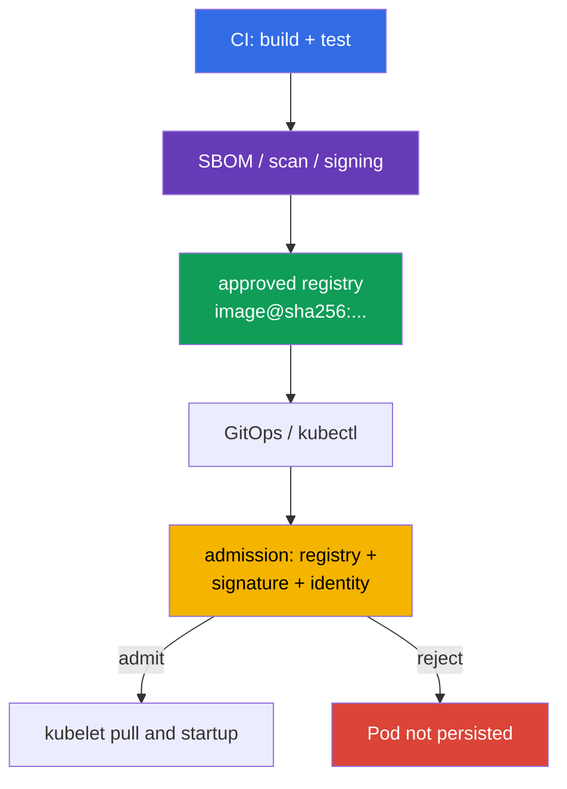

[Русская версия](ru.md) · [Versión en español](es.md) · [Version française](fr.md) · [Deutsche Version](de.md) · [ქართული ვერსია](ge.md) · [繁體中文版](tw.md) · [日本語版](jp.md)

# Chapter 26. Supply-chain security: registries, signing, and artifact validation

> **Problem.** An attacker with push permission in a registry or access to CD can retarget a
> mutable tag and deploy an untrusted image from an external or even familiar internal repository.
> A successful pull does not prove trusted pipeline built these bytes, while an allowlist without
> signature verification does not stop an unsigned artifact. Immutable digest, publisher
> verification, and fail-closed admission are needed before a Pod is persisted.

> **What comes next.** In [chapter 25](../25/README.md), we defined where dependencies, SBOM, and
> artifacts come from. Now we build the last barrier before startup: the cluster accepts images
> only from approved registries and only an immutable digest whose provenance and signature are
> confirmed. This is the CKS **Supply Chain Security** domain (20%).
>
> **What you need from CKA.** The request path through admission is covered in
> [CKA chapter 21](../../../cka/course/21/README.md), and image, tag, digest, and Dockerfile in
> [CKA chapter 23](../../../cka/course/23/README.md). Here these mechanisms are security controls:
> a tag is not proof of content, and a successful `docker pull` does not mean an image is permitted
> to run.

> **The simple signing idea.** It answers one question: **who approved these exact image bytes?**
> Pipeline first pins the immutable digest - the content fingerprint - then signs that digest.
> Before startup, a verifier compares the image digest with the signature and establishes that the
> signer is trusted. If a tag now points to other bytes, the old signature no longer applies.
> Signing does not encrypt an image or replace malware/CVE scanning: it proves publisher identity
> for particular content.

> 🧠 The trust decision is made before `Pod` is persisted: registry allowlist governs image source, signing governs trusted publisher, and digest pins content.

## 26.1. What must be protected

Supply chain begins before Kubernetes: source code and CI build an image, registry stores it and
its signature, GitOps or `kubectl` sends the reference to API server, and admission decides whether
to admit the Pod. If any stage is tampered with or unexpectedly replaced, a correct manifest can run untrusted code.



Do not conflate two independent properties:

- a **registry allowlist** answers *where* an image may come from, for example
  `registry.example.com/platform/*`;
- **signature verification** answers *who and for which digest* released an artifact;
- a **digest** pins the bytes. `:1.4.2` is a mutable name, whereas
  `@sha256:<digest>` connects deployment to the verified manifest.

Therefore, `registry.example.com/platform/api:1.4.2` must become
`registry.example.com/platform/api:1.4.2@sha256:<verified-digest>` before production
rollout. An allowlist does not replace signature verification: an attacker with push permission
to a trusted registry can still place an unsigned image there. Conversely, a signature does not
prohibit use of an unapproved registry.

> 🎯 Implement fail-closed admission allowlist for the required registry/repository and check normal, init, and ephemeral containers. In Kubernetes v1.36, separately consider `spec.volumes[].image.reference`: until a verifier can demonstrably check such OCI artifact, it is safer to reject image volumes in a protected namespace. Native `ValidatingAdmissionPolicy` and Gatekeeper are direct approaches to this task.

## 26.2. Registry allowlist through native ValidatingAdmissionPolicy, Kyverno, and Gatekeeper

### Native `ValidatingAdmissionPolicy`: a simple CEL allowlist

For a simple registry allowlist, Kubernetes provides native `ValidatingAdmissionPolicy` (VAP):
a mechanism stable since Kubernetes 1.30 that does not require a third-party admission webhook.
It suits CEL checks of image prefix/format, but **does not replace cryptographic Cosign or Notary
verification**: VAP does not prove who signed a particular digest. The policy below covers regular,
init, and ephemeral containers identically; `pods/ephemeralcontainers` is needed to prohibit a
bypass through `kubectl debug`. It also fail-closed rejects image volumes: in Kubernetes v1.36,
`spec.volumes[].image.reference` is a separate OCI reference, not a container.

```yaml
apiVersion: admissionregistration.k8s.io/v1
kind: ValidatingAdmissionPolicy
metadata:
  name: allow-approved-platform-registry
spec:
  failurePolicy: Fail
  matchConstraints:
    resourceRules:
    - apiGroups: [""]
      apiVersions: ["v1"]
      operations: ["CREATE", "UPDATE"]
      resources: ["pods", "pods/ephemeralcontainers"]
  validations:
  - message: "Only container images from registry.example.com/platform/ are allowed; image volumes are denied."
    expression: >-
      object.spec.containers.all(c, c.image.startsWith("registry.example.com/platform/")) &&
      (!has(object.spec.initContainers) || object.spec.initContainers.all(c,
        c.image.startsWith("registry.example.com/platform/"))) &&
      (!has(object.spec.ephemeralContainers) || object.spec.ephemeralContainers.all(c,
        c.image.startsWith("registry.example.com/platform/"))) &&
      (!has(object.spec.volumes) || !object.spec.volumes.exists(v, has(v.image)))
---
apiVersion: admissionregistration.k8s.io/v1
kind: ValidatingAdmissionPolicyBinding
metadata:
  name: allow-approved-platform-registry
spec:
  policyName: allow-approved-platform-registry
  validationActions: [Deny]
  matchResources:
    namespaceSelector:
      matchLabels:
        registry-policy: enforced
```

Label a test namespace `registry-policy: enforced` (`kubectl label namespace
<ns> registry-policy=enforced`) before expanding `namespaceSelector` to the whole cluster:
without `matchResources.namespaceSelector` in the Binding, policy immediately becomes cluster-wide
and affects every matching Pod, not only the selected namespace.

VAP, like a Pod-only Gatekeeper Constraint, rejects a Pod created by a controller; early rejection
of a Deployment itself needs separate CEL rules for its template. First apply policy in a test
namespace and check normal/init/ephemeral-container images and a Pod with
`spec.volumes[].image`: this example must reject the image volume. For signature requirements,
keep the following `ImageValidatingPolicy` or another cryptographic verifier.

Checking must cover `containers`, `initContainers`, and, if permitted, `ephemeralContainers`;
otherwise an init or debug container becomes a policy bypass. In Kubernetes v1.36, separately
handle `spec.volumes[].image.reference`: it is not an element of any of the three arrays.

> **⚠️ Version delta.** In the v1.35 exam snapshot, `spec.volumes[].image` is still Beta, although `ImageVolume` is enabled by default. On an older cluster or with the gate disabled, first check API schema and validation policy; do not remove fail-closed image-volume coverage merely because the current workload is absent.

A Pod-only policy checks only a Pod. For Kyverno `ValidatingPolicy` to reject a Deployment and
other workload controllers before Pod creation, explicitly include `spec.autogen.podControllers`;
without it, the controller is admitted and rejection happens only when it creates a Pod. Start in
Audit, remediate existing manifests, then move the rule to Enforce.

> 🔬 Kyverno is an alternative policy engine with extra capabilities; use it when it is named by the environment or already the platform standard.

### Kyverno 1.19 (chart 3.9.0, installed release)

> **Compatibility note.** The main course exam/lab track is Kubernetes v1.35: Kyverno v1.19
> officially supports Kubernetes v1.33-v1.35. The overall course training baseline
> (lab infrastructure, `env.hcl`) is Kubernetes v1.36, so this lab is a forward-looking variant
> outside Kyverno 1.19's tested support matrix (see chapter 20 §20.4). Do not conflate three
> independent tracks: exam version, cluster training version, and vendor-supported version of a
> particular tool can differ at once.
>
> Labs 108 and 111 install Kyverno through Helm chart `3.9.0`, corresponding to **Kyverno 1.19.0**.
> A known upstream defect [#16947](https://github.com/kyverno/kyverno/issues/16947) affects
> `ImageValidatingPolicy`: for `pods/ephemeralcontainers`, its validating handler does not apply
> `validations`, even though webhook and image verification are invoked; the issue is marked for
> milestone `1.19.2`. Therefore, on pinned 1.19.0, do not regard a negative `kubectl debug` test
> for **signing** as guaranteed (details in §26.5). This limitation does not apply to ordinary
> `ValidatingPolicy`: the policy below receives admission review for `pods/ephemeralcontainers`
> and applies the CEL allowlist.

The primary path uses CEL-based `ValidatingPolicy` in `policies.kyverno.io/v1`. Its variable
combines all three container lists; resource `pods/ephemeralcontainers` makes the same check run
for `kubectl debug`. Like native VAP, this variant separately prohibits image volumes until a
verifier with confirmed support for `spec.volumes[].image.reference` is selected.

```yaml
apiVersion: policies.kyverno.io/v1
kind: ValidatingPolicy
metadata:
  name: allow-approved-registries
spec:
  validationActions: [Deny]
  autogen:
    podControllers:
      controllers: [deployments, daemonsets, statefulsets, jobs, cronjobs]
  matchConstraints:
    resourceRules:
    - apiGroups: [""]
      apiVersions: ["v1"]
      operations: ["CREATE", "UPDATE"]
      resources: ["pods", "pods/ephemeralcontainers"]
  variables:
  - name: allContainers
    expression: >-
      object.spec.containers +
      object.spec.?initContainers.orValue([]) +
      object.spec.?ephemeralContainers.orValue([])
  validations:
  - message: "Only images from registry.example.com/platform/ are allowed."
    expression: >-
      variables.allContainers.all(container,
        container.image.startsWith("registry.example.com/platform/"))
  - message: "Image volumes are denied until a validated verifier is available for them."
    expression: >-
      !has(object.spec.volumes) || !object.spec.volumes.exists(volume, has(volume.image))
```

Check positive and negative cases before rollout:

```bash
kubectl apply -f allowed-pod.yaml
kubectl apply -f forbidden-pod.yaml  # expected admission denial
kubectl debug allowed-pod --image=registry.example.com/other-team/debug:1.0 --target=app
# Expected: admission denial - ordinary ValidatingPolicy checks
# pods/ephemeralcontainers and rejects an incorrect repository prefix.
kubectl get policyreport -A          # if Policy Reports are enabled in the cluster
```

The test prefix matters: this Kyverno `ValidatingPolicy` checks only
`registry.example.com/platform/*`, so testing the policy needs an image from the matching registry
with an incorrect path beneath it, not an arbitrary foreign registry.

Do not add all of `docker.io` "temporarily": that turns allowlist into allow-all. For system
components, define narrow separate prefixes, for example `registry.k8s.io/*`, and record the
exception when reviewing the change.

Legacy `ClusterPolicy` with `foreach` is migration material only: in Kyverno 1.19 this type is
deprecated and its removal is planned in 1.20.

### OPA Gatekeeper

Gatekeeper separates `ConstraintTemplate` logic from a particular `Constraint`. The template below
checks regular, init, and ephemeral containers and rejects image volumes until a separately
verified verifier for `spec.volumes[].image.reference` is introduced. Its `match` is limited to
`Pod`: this Constraint **does not reject the Deployment itself**. It rejects the Pod a controller
later creates; add separate workload-template rules for early denial. For `kubectl debug`, the
Gatekeeper webhook must receive `UPDATE` subresource `pods/ephemeralcontainers`, and the Rego below
checks that context specifically.

```yaml
apiVersion: templates.gatekeeper.sh/v1
kind: ConstraintTemplate
metadata:
  name: k8sallowedrepos
spec:
  crd:
    spec:
      names:
        kind: K8sAllowedRepos
      validation:
        openAPIV3Schema:
          type: object
          properties:
            repos:
              type: array
              items:
                type: string
  targets:
  - target: admission.k8s.gatekeeper.sh
    rego: |
      package k8sallowedrepos

      import rego.v1

      violation contains {"msg": msg} if {
        container := input.review.object.spec.containers[_]
        not starts_with_allowed(container.image, input.parameters.repos)
        msg := sprintf("image %q is not from an approved registry", [container.image])
      }

      violation contains {"msg": msg} if {
        container := input.review.object.spec.initContainers[_]
        not starts_with_allowed(container.image, input.parameters.repos)
        msg := sprintf("init image %q is not from an approved registry", [container.image])
      }

      violation contains {"msg": msg} if {
        input.review.operation == "UPDATE"
        input.review.subResource == "ephemeralcontainers"
        container := input.review.object.spec.ephemeralContainers[_]
        not starts_with_allowed(container.image, input.parameters.repos)
        msg := sprintf("ephemeral image %q is not from an approved registry", [container.image])
      }

      violation contains {"msg": msg} if {
        volume := input.review.object.spec.volumes[_]
        volume.image
        msg := "image volumes are not allowed until their OCI references have verified policy coverage"
      }

      starts_with_allowed(image, repos) if {
        repo := repos[_]
        startswith(image, repo)
      }
---
apiVersion: constraints.gatekeeper.sh/v1beta1
kind: K8sAllowedRepos
metadata:
  name: approved-platform-images
spec:
  match:
    kinds:
    - apiGroups: [""]
      kinds: ["Pod"]
  parameters:
    repos:
    - "registry.example.com/platform/"
```

For mandatory enforcement, install Gatekeeper with `validatingWebhookFailurePolicy: Fail` and
verify the actual configuration after installation:

```yaml
# values.yaml for the Gatekeeper Helm chart
validatingWebhookFailurePolicy: Fail
```

```bash
kubectl get validatingwebhookconfiguration gatekeeper-validating-webhook-configuration \
  -o jsonpath='{range .webhooks[*]}{.name}{"\t"}{.failurePolicy}{"\n"}{end}'
```

The chart default can be `Ignore`, meaning an unavailable webhook permits a request. In a test
environment, deliberately verify that a request is denied when the webhook is unavailable.
`Fail` requires HA, monitoring, and Gatekeeper availability; otherwise it can block new Pods in a
controller outage.

Kyverno is convenient when policy must also mutate manifests or natively verify signatures.
Gatekeeper is convenient where an organization standardizes Rego and Constraints. Do not install
both engines for the same mandatory check without an explicit owner and agreed migration order:
duplicate denial messages complicate diagnosis, and two different allowlists drift apart.

> 🎯 `ImagePolicyWebhook` is an exam-oriented admission mechanism: API server delegates allow/deny to a backend that must be available and configured fail-closed.

## 26.3. ImagePolicyWebhook: backend and API-server configuration

`ImagePolicyWebhook` is an API-server admission plugin. For every admission request with
container images, it sends an `ImageReview` to an external HTTPS backend; the backend answers
`allowed: true` or `false` and can return a reason and audit annotations. This centralizes the
decision outside manifests, but puts the backend on the API-server critical path. `ImageReview`
includes `containers`, `initContainers`, and `ephemeralContainers`, but not
`spec.volumes[].image.reference`; therefore do not make this plugin the only supply-chain control
when image volumes are permitted. Native policy/Gatekeeper in this chapter fail-closed reject image
volumes.

```mermaid
sequenceDiagram
    participant C as kubectl / GitOps
    participant A as kube-apiserver
    participant W as ImagePolicyWebhook backend
    participant E as etcd
    C->>A: create Pod with image@digest
    A->>W: ImageReview (images, user, namespace)
    W-->>A: allowed/denied + reason
    alt allowed
        A->>E: persist Pod
    else denied or backend unavailable
        A-->>C: admission error; Pod not created
    end
```

The backend must be reachable *from API server* and make a fail-closed decision. The configuration
below selects mTLS: API server presents a client certificate, while backend verifies it and the CA.
mTLS is not a universal `ImagePolicyWebhook` requirement; backend authentication is defined by its
kubeconfig and infrastructure. The backend must not pull an image on every request: check
reference/digest, signature, and trusted identity, and cache results only with a short justified
TTL. A long allow cache after signature revocation leaves a window for undesired startup.

Set `defaultAllow: false` in admission configuration. Paths and file mounts below are shown for a
kubeadm static Pod; replace actual backend endpoint, CA, and client certificate with values from
your infrastructure.

```yaml
# /etc/kubernetes/admission-control/image-policy.yaml
apiVersion: apiserver.config.k8s.io/v1
kind: AdmissionConfiguration
plugins:
- name: ImagePolicyWebhook
  configuration:
    imagePolicy:
      kubeConfigFile: /etc/kubernetes/admission-control/image-policy.kubeconfig
      allowTTL: 30
      denyTTL: 30
      retryBackoff: 500
      defaultAllow: false
```

```yaml
# /etc/kubernetes/admission-control/image-policy.kubeconfig
apiVersion: v1
kind: Config
clusters:
- name: image-policy-backend
  cluster:
    certificate-authority: /etc/kubernetes/pki/image-policy/ca.crt
    server: https://image-policy-backend.security.example:8443/imagepolicy
users:
- name: kube-apiserver
  user:
    client-certificate: /etc/kubernetes/pki/image-policy/apiserver.crt
    client-key: /etc/kubernetes/pki/image-policy/apiserver.key
contexts:
- name: image-policy
  context:
    cluster: image-policy-backend
    user: kube-apiserver
current-context: image-policy
```

Add the plugin to `kube-apiserver` and pass the admission configuration. Do not replace the
existing enabled-admission-plugin list: add `ImagePolicyWebhook` to its current value, otherwise
you can accidentally disable required built-in controllers. Also enable API
`imagepolicy.k8s.io/v1alpha1` used by `ImageReview`; without it, this fragment is incomplete and
backend is not called. If `--runtime-config` already exists, add
`imagepolicy.k8s.io/v1alpha1=true` to its current value without overwriting other settings.

```yaml
# fragment /etc/kubernetes/manifests/kube-apiserver.yaml
spec:
  containers:
  - name: kube-apiserver
    command:
    - kube-apiserver
    - --enable-admission-plugins=NodeRestriction,ServiceAccount,ImagePolicyWebhook
    - --runtime-config=imagepolicy.k8s.io/v1alpha1=true
    - --admission-control-config-file=/etc/kubernetes/admission-control/image-policy.yaml
    volumeMounts:
    - name: image-policy-config
      mountPath: /etc/kubernetes/admission-control
      readOnly: true
    - name: image-policy-pki
      mountPath: /etc/kubernetes/pki/image-policy
      readOnly: true
  volumes:
  - name: image-policy-config
    hostPath:
      path: /etc/kubernetes/admission-control
      type: DirectoryOrCreate
  - name: image-policy-pki
    hostPath:
      path: /etc/kubernetes/pki/image-policy
      type: DirectoryOrCreate
```

Editing the static Pod restarts API server. Keep a backup manifest **outside**
`/etc/kubernetes/manifests/` (for example under `/root/k8s-manifest-backup/`): kubelet can read a
file with any extension inside that directory as another static Pod manifest. Retain control-plane
console access and check backend TLS in advance: erroneous endpoint, CA, client key, or fail-open
configuration can respectively block every new Pod or remove protection. After restart, check
`/readyz`, API-server logs, and explicit allow/deny test. Below are minimal conceptual backend
responses, not objects for `kubectl apply`:

```yaml
# allow: leave reason empty; auditAnnotations have keys without prefix
apiVersion: imagepolicy.k8s.io/v1alpha1
kind: ImageReview
status:
  allowed: true
  auditAnnotations:
    decision: "approved signed digest"
---
# deny: short reason enters admission error
apiVersion: imagepolicy.k8s.io/v1alpha1
kind: ImageReview
status:
  allowed: false
  reason: "image is not signed by an approved identity"
  auditAnnotations:
    decision: "signature verification failed"
```

For a new cluster, compare plugin availability and support with its Kubernetes version: this is an
old specialized mechanism; a webhook/policy engine with signature-verification support is usually
easier to maintain.

> 🧪 **Practice: CKS Lab 108, tasks 2 and 6.** [Lab 108](../../labs/108/README.MD) separately practices prohibition of explicit and implicit `latest`; task 6 wires the complete `ImagePolicyWebhook`: `defaultAllow: false`, `ImageReview` backend, plugin added to kube-apiserver, denial for `nginx:latest`, and allow for `nginx:1.27.3`. It is a useful exam check of the mechanism; in production, still replace a permitted versioned tag with a digest reference.

> 🎯 Be able to sign and verify a particular immutable digest through `cosign`; a tag is not itself an object of trust.

## 26.4. Cosign and Sigstore: sign and verify a digest

Cosign creates and verifies OCI-artifact signatures. Sign the **digest** obtained from your own
build/push pipeline; do not substitute `latest` or a digest from someone else's message. A
signature is stored next to artifact in registry, so registry access control and retention matter
as much as a key.

```bash
IMAGE="${IMAGE:?set image reference}"

# Lab: this command creates a local cosign.key/cosign.pub pair.
# Do not use the private key created here as a production key or add it to Git.
cosign generate-key-pair

# CI receives the key briefly; password is not printed in logs.
cosign sign --key cosign.key "$IMAGE"

# Verify with trusted public key - before deploy and at admission.
cosign verify --key cosign.pub "$IMAGE"
```

`cosign generate-key-pair` above is a local pair for a lab only. In production, use the keyless
OIDC flow below or a separate key created and held in KMS; do not move a locally created
`cosign.key` into CI. A successful `cosign verify` means cryptographic signature verification for
the specified image reference. Policy must additionally restrict **which** public key/identity is
permitted for a repository. One shared key for every environment and project turns compromise of
one service CI into risk for all others. Rotate keys, revoke old-key access, and keep an audit
trail of who signed which digest and when.

> 🔬 A keyless flow with OIDC, Fulcio, and Rekor reduces the risk of a permanent private key, but requires exact restriction of issuer and release-workflow identity.

### Keyless: short-lived identity instead of a local signing key

Sigstore keyless flow obtains a short-lived certificate after CI OIDC authentication and writes
proof to the transparency log. A local private key need not be created or distributed to
developers, but do not trust "any certificate": trust the exact OIDC identity of release workflow.

```bash
IMAGE="${IMAGE:?set image reference}"

# In CI with OIDC (for example GitHub Actions): there is no interactive confirmation.
cosign sign --yes "$IMAGE"

# Verify issuer AND workflow subject, not merely the presence of a certificate.
cosign verify \
  --certificate-oidc-issuer=https://token.actions.githubusercontent.com \
  --certificate-identity-regexp='^https://github\.com/example-org/payments/\.github/workflows/release\.yml@refs/tags/v[0-9].*$' \
  "$IMAGE"
```

For GitHub Actions, workflow must grant its job `id-token: write`; that is not registry push
permission and does not replace scoped registry credential. Identity restriction must include
organization, repository, workflow, and suitable ref/environment. An overly broad
`--certificate-identity-regexp='.*'` makes keyless verification almost meaningless: any OIDC user
accepted by verifier can sign an image.

> 🎯 Signature verification becomes mandatory only on the admission path: a locally successful CI verification does not stop direct `kubectl apply`.

## 26.5. Signature verification at admission and Notary

Pre-deployment verification is useful, but not enforcement: a user can bypass a local CI script
and call API directly. Verification must therefore live on admission path. In Kyverno 1.19,
CEL-based `ImageValidatingPolicy` does this; legacy `ClusterPolicy.verifyImages` is retained only
for migration. Do not treat this policy as a check for `spec.volumes[].image.reference`: this
chapter's allowlist policy already fail-closed rejects image volumes until verifier support is
confirmed.

**The exam core** is repository allowlist, immutable digest, fail-closed admission, and denial
diagnosis. Kyverno `ImageValidatingPolicy`, Notary, and signed SBOM/in-toto attestations are a
**production extension**: they connect policy to trusted signer and release evidence. The example
does not put a private key into the cluster.

```yaml
apiVersion: policies.kyverno.io/v1
kind: ImageValidatingPolicy
metadata:
  name: require-signed-platform-images
spec:
  failurePolicy: Fail
  validationActions: [Deny]
  matchConstraints:
    resourceRules:
    - apiGroups: [""]
      apiVersions: ["v1"]
      operations: ["CREATE", "UPDATE"]
      resources: ["pods", "pods/ephemeralcontainers"]
  matchImageReferences:
  - glob: "registry.example.com/platform/*"
  validationConfigurations:
    mutateDigest: true
    required: true
    verifyDigest: true
  attestors:
  - name: releaseKey
    cosign:
      key:
        data: |-
          -----BEGIN PUBLIC KEY-----
          <release-signer-public-key>
          -----END PUBLIC KEY-----
  - name: releaseNotary
    notary:
      certs:
        value: |-
          -----BEGIN CERTIFICATE-----
          <notary-release-signer-X.509-certificate>
          -----END CERTIFICATE-----
  attestations:
  - name: signedSbom
    referrer:
      type: sbom/cyclone-dx
  validations:
  - message: "Image must have a valid release signature"
    expression: >-
      (images.containers + images.?initContainers.orValue([]) +
      images.?ephemeralContainers.orValue([])).map(image,
        verifyImageSignatures(image, [attestors.releaseKey, attestors.releaseNotary]) > 0).all(ok, ok)
  - message: "Image must have a signed CycloneDX SBOM for this digest"
    expression: >-
      (images.containers + images.?initContainers.orValue([]) +
      images.?ephemeralContainers.orValue([])).map(image,
        verifyAttestationSignatures(image, attestations.signedSbom, [attestors.releaseKey]) > 0).all(ok, ok)
```

`failurePolicy: Fail` does not admit an object on verification error. But the installed Kyverno
1.19.0 has a known `ImageValidatingPolicy` defect for `pods/ephemeralcontainers` that does not
guarantee its `validations` apply to `kubectl debug` (upstream #16947 indicates fix milestone
`1.19.2`; also see compatibility note in §26.2). Mandatory positive/negative tests for this
pinned release are therefore normal and init containers. Run the request below only as an empirical
compatibility test; do not prescribe expected denial in advance or rely on it to enforce an
unsigned approved-registry debug container until a lab installs a fixed version and your test
confirms the result.

```bash
kubectl debug allowed-pod --image=registry.example.com/platform/debug@sha256:<digest> --target=app
# Empirical test only for pinned Kyverno 1.19.0: record outcome in evidence.
kubectl debug allowed-pod --image=registry.example.com/platform/debug:unsigned --target=app
```

Separately check an image from a foreign registry (`registry.example.com/other-team/debug:1.0` or
equivalent): allowlist VAP from the preceding section rejects it before signature verification;
for this ImageValidatingPolicy it does not match `matchImageReferences` and does not test its CEL
rules. `validationConfigurations` first lets Kyverno append a digest, then requires and verifies
it; signature and `signedSbom` thus refer to one immutable digest. `releaseNotary` is a native
Notary attestor, while signature condition permits one of explicitly selected trust roots; do not
mix them without a documented migration period. For keyless, configure
`cosign.keyless.identities` with exact issuer and subject of the particular CI workflow. Test a
signed and unsigned digest, erroneous signer, absent signed SBOM, and unavailable registry.

> 🔬 Notary/Notation is an alternative OCI signing ecosystem; Kubernetes still needs integration that returns admission allow/deny.

**Notary Project** and CLI `notation` are an alternative OCI-signing ecosystem with X.509 trust
stores and trust policy. `notation verify` is useful in CI/CD:

```bash
notation cert add --type ca --store platform-ca company-root-ca.pem
notation policy import --force trustpolicy.json
IMAGE="${IMAGE:?set image reference}"
notation verify "$IMAGE"
```

Notary by itself is not a Kubernetes admission controller. Its trust policy must be converted
into a policy-controller or webhook-backend check that returns allow/deny to kube-apiserver. Do
not expect one verifier to automatically understand everything: Cosign/Sigstore and
Notary/Notation use different trust models. Choose a standard for each repository, document trust
root, allowed identities, and rotation procedure, then migrate with an explicit period of dual
signing and dual verification.

> 🏭 End-to-end process combines build, scan, SBOM/attestations, signing, deployment by digest, and fail-closed admission with audit evidence.

## 26.6. Verifiable production process

### How this is applied in production

A minimum secure pipeline is:

1. CI builds a reproducible image, scans it, and obtains the digest after push.
2. CI creates SBOM/attestations and signs the digest using a key or keyless OIDC identity.
3. Deployment reference uses that same digest; allowlist permits only the required
   registry/repository, and image volumes are explicitly verified by a separate verifier or
   prohibited fail-closed.
4. Admission compares registry, digest, and signature against a limited trusted identity and
   fail-closed rejects a verification error.
5. CI, registry, and admission logs connect commit, workflow run, digest, and decision.

Begin diagnostics with facts, not policy weakening. A direct `Pod` CREATE rejected at admission is
not persisted, so the primary evidence is the command response, not `kubectl describe pod`:

```bash
kubectl apply -f pod.yaml 2>&1 | tee /tmp/admission-denial.txt
kubectl get pod "${POD:?set pod}" && kubectl describe pod "$POD"  # only if Pod exists
kubectl get events -A --sort-by=.lastTimestamp
kubectl describe rs/my-replicaset         # for controller-created Pod: look for FailedCreate
cosign verify --key cosign.pub "$IMAGE"
kubectl logs -n kyverno deploy/kyverno-admission-controller
```

For a controller-owned Pod, check Events and `FailedCreate` on ReplicaSet/Job, and for a complete
trace use API-server audit and logs of the relevant admission controller.

If a legitimate deployment is rejected, check its digest, repository prefix, signer identity,
certificate/key, and network/TLS to registry. Do not repair an incident by temporarily using
`validationActions: [Audit]`, `failurePolicy: Ignore`, or a broad production allowlist: that
removes exactly the control meant to detect compromise. For an emergency exception, use a
short-lived namespace- and digest-scoped solution with owner, expiry, and later removal.

## 26.7. Mini-glossary

- **Registry allowlist** - policy permitting images only from defined registry/repository prefixes.
- **Digest** - immutable SHA-256 identifier of a particular OCI manifest/artifact.
- **Cosign** - Sigstore tool for signing and verifying OCI artifacts.
- **Keyless signing** - signing with a short-lived certificate issued after OIDC authentication,
  instead of a permanent local signing key.
- **ImagePolicyWebhook** - admission plugin delegating the image decision to external backend
  through `ImageReview`.
- **Admission verification** - mandatory provenance/signature check before API server persists a Pod.
- **Notary Project / Notation** - OCI-signing ecosystem with X.509 trust policy; Kubernetes
  enforcement needs admission integration.

## 26.8. Chapter summary

- Registry allowlist and signature verification solve different problems and must work together.
- Kyverno and Gatekeeper can prohibit unapproved container-image references; checking must cover
  regular, init, and ephemeral containers, while `spec.volumes[].image.reference` must be
  explicitly verified by a separate verifier or prohibited fail-closed.
- `ImagePolicyWebhook` needs a protected available backend, API-server configuration, and
  fail-closed `defaultAllow: false`; mTLS in the example is the selected backend-authentication
  approach.
- Cosign signs and verifies immutable digest; a private key must not enter Git, a manifest, or
  cluster policy.
- Keyless Sigstore verification trusts a specific OIDC issuer and CI-workflow identity, not an
  arbitrary certificate.
- Admission enforcement is not replaced by local CI verification; Notary/Notation requires
  integration that returns admission allow/deny.

## 26.9. How this helps: on the exam and in real work

**On the exam.** The short core is the difference among registry policy, tag, and digest,
configuration or diagnosis of validating admission, API-server admission configuration, and
fail-open risk. Saving the admission-denial response and checking exact image reference is faster
and safer than disabling a controller. Kyverno `ImageValidatingPolicy`, Notary, and attestations
are production extensions for which understanding purpose is sufficient.

**In real work.** Signing connects a production workload to a release workflow and a particular
artifact, while admission makes this rule mandatory for every deployment path. Together with
least-privilege CI permissions, protected registry, and audit logs, it reduces likelihood of
running an image that did not pass your pipeline.

> ### 🔴 Attacker's view
> **Asset:** production-workload reference to an image.
> **Starting foothold:** ability to push to registry or compromised CI.
> **Attacker objective:** bypass registry allowlist/admission checking by retargeting a mutable tag to a malicious image without changing digest of already deployed workloads.
> **Abuse path:** retarget a tag to another image. Without digest pinning, the same string
> `registry/app:stable` does not guarantee the same bytes: with `imagePullPolicy: Always`, kubelet
> resolves the tag again at every startup; with `IfNotPresent`, cached image can temporarily hide
> the change, but a new node or cleared cache receives the new digest at first pull; `Never`
> prevents pull but is not a supply-chain-verification control. `imagePullPolicy` does not replace
> digest pinning and signature/provenance verification.
> **Expected evidence:** saved admission-denial response or audit log; for a controller-owned Pod,
> also `FailedCreate` event on its owner.
> **Control:** digest pinning, registry allowlist, and admission signature verification through ImagePolicyWebhook or Kyverno.
> **Retest:** a workload by digest does not change after tag retargeting, and unsigned image is rejected at admission.

## 26.10. Self-check questions

<details>
<summary>1. Why does an allowlist of trusted registry not prove a trusted CI created the image?</summary>

An allowlist answers only which registry/repository an image may come from. A user with push permission to that trusted registry can still publish an unsigned or untrusted artifact. Therefore, verify provenance of a particular digest through a signature and restricted signer identity.
</details>

<details>
<summary>2. Why does production deployment need a digest rather than only a version tag?</summary>

A version tag is a mutable name and can be retargeted to other bytes without changing the manifest. `@sha256:...` pins an OCI manifest and connects deployment to the artifact that was scanned and signed. `imagePullPolicy` does not replace digest pinning: a new node or cache miss can still resolve a mutable tag differently.
</details>

<details>
<summary>3. Which container references must a registry policy check, and what should it do with image volumes?</summary>

Policy must check `containers`, `initContainers`, and `ephemeralContainers`. Otherwise an init container or a container added through `kubectl debug` and subresource `pods/ephemeralcontainers` becomes an allowlist bypass. Match CREATE/UPDATE of the needed subresource too. In Kubernetes v1.36, `spec.volumes[].image.reference` is a separate OCI reference outside these arrays: explicitly verify it through a supported verifier or, as in this chapter, prohibit image volumes fail-closed.
</details>

<details>
<summary>4. Which TLS files and fail-closed parameters does an `ImagePolicyWebhook` backend need?</summary>

Backend kubeconfig needs CA in `certificate-authority`, and under the selected mTLS scheme API-server `client-certificate` and `client-key`; corresponding paths must be mounted into the static Pod. `AdmissionConfiguration` sets `defaultAllow: false` so backend error or unavailability does not permit an image. Retain existing admission plugins and enable `imagepolicy.k8s.io/v1alpha1` API for `ImageReview` as well.
</details>

<details>
<summary>5. How does a keyless signature differ from a static Cosign key, and which issuer/identity must verification restrict?</summary>

Keyless flow obtains a short-lived certificate after CI OIDC authentication and does not require distribution of a permanent local private key. A static Cosign key is a separate key pair kept in KMS or another protected production store. Keyless verification restricts the exact OIDC issuer and workflow identity: organization, repository, release workflow, and permitted ref/environment, not regex `.*`.
</details>

<details>
<summary>6. Why does `cosign verify` in CI not prevent direct `kubectl apply`?</summary>

CI verification runs only on paths that actually invoke it. A user or another pipeline can call Kubernetes API directly and create a Pod with unsigned image. Mandatory verification must reside on admission path and return deny before the Pod is persisted.
</details>

<details>
<summary>7. What is required for Notary/Notation to become a Kubernetes enforcement point?</summary>

`notation verify` is useful in CI, but Notary itself is not a Kubernetes admission controller. Integrate its trust policy, X.509 trust roots, and allowed identities into a policy controller or webhook backend that returns allow/deny to kube-apiserver. Document rotation and, during migration, a period of dual signing/verification.
</details>

<details>
<summary>8. **Flashback (chapter 20).** Question 6 of this chapter showed that `cosign verify` in CI does not stop direct `kubectl apply` of unsigned image. How does admission policy from chapter 20 (native `ValidatingAdmissionPolicy` or Kyverno `ImageValidatingPolicy`) close that bypass, and how does "signature verification as admission policy" differ in reliability from "signature verification only in CI pipeline"?</summary>

Admission policy is run by kube-apiserver for every matching Pod CREATE/UPDATE, so manual `kubectl apply` also undergoes checking and can be rejected. `ImageValidatingPolicy` can verify signature/attestation of a particular digest, while native VAP suits CEL reference allowlist, for example, but does not replace a cryptographic verifier. CI-only verification is a voluntary pipeline stage; admission makes the rule fail-closed enforcement at the cluster boundary.
</details>

## Practice

🧪 CKA Lab 111 (kubeadm lifecycle and static control-plane Pod):
[tasks/cka/labs/111](../../../cka/labs/111/README.MD). It provides a safe context for working with
the API-server manifest; do not apply admission-configuration changes to an exam control plane
without backup and API-availability checks.

🌐 Additional interactive practice (killer.sh/killercoda, external resource): [image-policy-webhook-setup](https://killercoda.com/killer-shell-cks/scenario/image-policy-webhook-setup) · [image-use-digest](https://killercoda.com/killer-shell-cks/scenario/image-use-digest)

📘 CKA foundation: [admission](../../../cka/course/21/README.md) ·
[images and Dockerfile](../../../cka/course/23/README.md) ·
[kubeadm control plane](../../../cka/course/35/README.md).

---
[Table of contents](../README.md) · [Chapter 25](../25/README.md) · [Chapter 27](../27/README.md)
