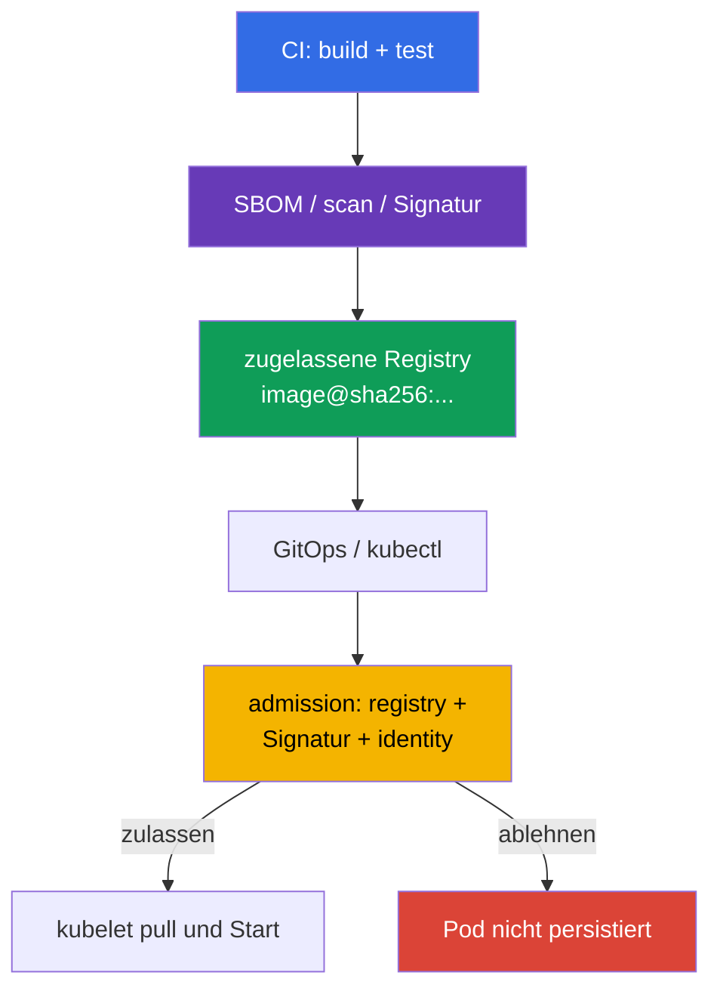

[Русская версия](ru.md) · [Eng version](README.md) · [Versión en español](es.md) · [Version française](fr.md) · [ქართული ვერსია](ge.md) · [繁體中文版](tw.md) · [日本語版](jp.md)

# Kapitel 26. Absicherung der Supply Chain: Registries, Signatur und Validierung von Artefakten

> **Problem.** Ein Angreifer mit Push-Recht auf eine Registry oder Zugriff auf CD kann einen
> mutable tag austauschen und eine fremde Image aus einem externen oder sogar gewohnten internen
> Repository ausrollen. Ein erfolgreicher Pull beweist nicht, dass diese Bytes von einer vertrauenswürdigen
> Pipeline gebaut wurden, und eine Allowlist ohne Signature Verification stoppt kein unsigniertes Artifact. Es braucht
> einen immutable Digest, die Prüfung des Publishers und fail-closed Admission vor dem Persistieren des Pod.

> **Was folgt.** In [Kapitel 25](../25/de.md) haben wir festgelegt, woher Abhängigkeiten,
> SBOM und Artefakte stammen. Jetzt bauen wir die letzte Barriere vor dem Start: Der Cluster akzeptiert
> nur Images aus zugelassenen Registries und nur den immutable Digest, dessen Herkunft
> und Signatur bestätigt sind. Dies ist die Domäne **Supply Chain Security** von CKS (20 %).
>
> **Was Sie aus CKA wissen müssen.** Der Weg einer Anfrage durch Admission wird in
> [CKA-Kapitel 21](../../../cka/course/21/de.md) behandelt, Image, Tag, Digest und Dockerfile in
> [CKA-Kapitel 23](../../../cka/course/23/de.md). Hier werden diese Mechanismen als
> Security Control eingesetzt: Ein Tag ist kein Beweis für den Inhalt, und ein erfolgreicher `docker pull`
> bedeutet nicht, dass die Image zum Start zugelassen ist.

> **Die einfache Idee der Signatur.** Sie beantwortet eine Frage: **Wer hat genau diese
> Bytes der Image freigegeben?** Die Pipeline fixiert zuerst den immutable Digest - den Fingerabdruck des Inhalts - und
> signiert dann diesen Digest. Vor dem Start gleicht der Verifier den Digest der Image mit der Signatur ab und
> stellt sicher, dass der Signer vertrauenswürdig ist. Zeigt der Tag jetzt auf andere Bytes, passt die alte Signatur
> nicht mehr. Die Signatur verschlüsselt die Image nicht und ersetzt keinen Scan auf Malware/CVE: Sie beweist die
> Identity des Publishers für einen konkreten Inhalt.

> 🧠 Die Trust Decision wird vor dem Persistieren des `Pod` getroffen: Die Registry-Allowlist verantwortet die Herkunft der Image, die Signatur den vertrauenswürdigen Publisher, und der Digest fixiert den Inhalt.

## 26.1. Was genau geschützt werden muss

Die Supply Chain beginnt vor Kubernetes: Quellcode und CI bauen die Image, die Registry speichert
sie samt Signatur, GitOps oder `kubectl` übergibt die Referenz an den API-Server, und Admission entscheidet,
ob der Pod zugelassen wird. Wird eine beliebige Etappe ausgetauscht, kann ein korrektes Manifest fremden
Code ausführen.



Zwei unabhängige Eigenschaften dürfen nicht vermischt werden:

- die **Registry-Allowlist** beantwortet, *woher* eine Image bezogen werden darf: zum Beispiel
  `registry.example.com/platform/*`;
- die **Signaturprüfung** beantwortet, *wer und für welchen Digest* das Artifact ausgestellt hat;
- der **Digest** fixiert die Bytes. `:1.4.2` ist ein veränderlicher Name, während
  `@sha256:<digest>` das Deployment an ein geprüftes Manifest bindet.

Deshalb muss `registry.example.com/platform/api:1.4.2` vor dem Production-Rollout zu
`registry.example.com/platform/api:1.4.2@sha256:<geprüfter-digest>` werden. Eine Allowlist
ersetzt keine Signature Verification: Ein Angreifer mit Push-Recht auf eine vertrauenswürdige Registry kann
dort weiterhin eine unsignierte Image platzieren. Die Signatur wiederum verbietet
nicht die Nutzung einer nicht zugelassenen Registry.

> 🎯 Implementieren Sie eine fail-closed Admission-Allowlist für die benötigte Registry/das Repository und prüfen Sie normal-, init- und ephemeral Container. Beachten Sie in Kubernetes v1.36 gesondert `spec.volumes[].image.reference`: Solange der Verifier ein solches OCI-Artifact nicht nachweisbar prüfen kann, ist es in einem geschützten Namespace sicherer, image volumes abzulehnen. Native `ValidatingAdmissionPolicy` und Gatekeeper sind direkte Wege zu dieser Aufgabe.

## 26.2. Registry-Allowlist über native ValidatingAdmissionPolicy, Kyverno und Gatekeeper

### Native `ValidatingAdmissionPolicy`: einfache Allowlist mit CEL

Für eine einfache Registry-Allowlist stellt Kubernetes die native `ValidatingAdmissionPolicy`
(VAP) bereit: ein seit Kubernetes 1.30 stabiler Mechanismus, der keinen Admission-Webhook eines
Drittanbieters benötigt. Sie eignet sich für CEL-Prüfungen von Prefix/Format der Image, ersetzt aber
**nicht die kryptografische Prüfung von Cosign oder Notary**: VAP beweist nicht, wer einen konkreten Digest
signiert hat. Die untenstehende Policy deckt gleichermaßen normale, init- und ephemeral Container ab; `pods/ephemeralcontainers`
wird benötigt, um eine Umgehung über `kubectl debug` zu verbieten. Sie lehnt auch image volumes fail-closed ab:
In Kubernetes v1.36 ist `spec.volumes[].image.reference` eine eigenständige OCI-Referenz, kein Container.

```yaml
apiVersion: admissionregistration.k8s.io/v1
kind: ValidatingAdmissionPolicy
metadata:
  name: allow-approved-platform-registry
spec:
  failurePolicy: Fail
  matchConstraints:
    resourceRules:
    - apiGroups: [""]
      apiVersions: ["v1"]
      operations: ["CREATE", "UPDATE"]
      resources: ["pods", "pods/ephemeralcontainers"]
  validations:
  - message: "Erlaubt sind nur Container-Images aus registry.example.com/platform/; Image-Volumes sind verboten."
    expression: >-
      object.spec.containers.all(c, c.image.startsWith("registry.example.com/platform/")) &&
      (!has(object.spec.initContainers) || object.spec.initContainers.all(c,
        c.image.startsWith("registry.example.com/platform/"))) &&
      (!has(object.spec.ephemeralContainers) || object.spec.ephemeralContainers.all(c,
        c.image.startsWith("registry.example.com/platform/"))) &&
      (!has(object.spec.volumes) || !object.spec.volumes.exists(v, has(v.image)))
---
apiVersion: admissionregistration.k8s.io/v1
kind: ValidatingAdmissionPolicyBinding
metadata:
  name: allow-approved-platform-registry
spec:
  policyName: allow-approved-platform-registry
  validationActions: [Deny]
  matchResources:
    namespaceSelector:
      matchLabels:
        registry-policy: enforced
```

Markieren Sie den Test-Namespace mit dem Label `registry-policy: enforced` (`kubectl label namespace
<ns> registry-policy=enforced`), bevor Sie den `namespaceSelector` auf den gesamten Cluster ausweiten:
Ohne `matchResources.namespaceSelector` im Binding wird die Policy sofort cluster-weit und
betrifft alle passenden Pod, nicht nur den gewählten Namespace.

VAP lehnt, wie ein reiner Pod-Gatekeeper-Constraint, den vom Controller erstellten Pod ab; für eine frühe
Ablehnung des Deployments selbst werden separate CEL-Regeln für dessen Template benötigt. Wenden Sie die Policy zunächst
im Test-Namespace an und prüfen Sie die Images von normal-/init-/ephemeral Containern sowie einen Pod mit
`spec.volumes[].image`: Dieses Beispiel muss das image volume ablehnen. Für Signature-Anforderungen
belassen Sie die folgende `ImageValidatingPolicy` oder einen anderen kryptografischen Verifier.

Die Prüfung muss `containers`, `initContainers` und, sofern erlaubt,
`ephemeralContainers` abdecken: Sonst wird ein init- oder debug-Container zur Umgehung der Policy. Behandeln Sie in Kubernetes
v1.36 gesondert `spec.volumes[].image.reference`: Es ist kein Element eines der
drei Arrays.

> **⚠️ Versionsdelta.** Im Exam-Snapshot v1.35 ist `spec.volumes[].image` noch Beta, obwohl `ImageVolume` standardmäßig aktiviert ist. Prüfen Sie auf einem älteren Cluster oder bei deaktiviertem Gate zuerst das API-Schema und die Validation Policy; entfernen Sie die fail-closed Abdeckung von image volume nicht allein wegen fehlender aktueller Workloads.

Eine reine Pod-Policy prüft nur den Pod selbst. Damit die Kyverno `ValidatingPolicy` ein Deployment und
andere Workload-Controller vor der Pod-Erstellung ablehnt, aktivieren Sie explizit `spec.autogen.podControllers`;
ohne dies wird der Controller angenommen, und die Ablehnung erfolgt erst bei der Pod-Erstellung. Beginnen Sie im
Audit-Modus, korrigieren Sie bestehende Manifests, und wechseln Sie die Regel dann zu Enforce.

> 🔬 Kyverno ist eine alternative Policy Engine mit zusätzlichen Fähigkeiten; setzen Sie sie ein, wenn sie in der Umgebung vorgegeben oder bereits Plattformstandard ist.

### Kyverno 1.19 (chart 3.9.0, installed release)

> **Kompatibilitätshinweis.** Der Haupt-Exam/Lab-Track des Kurses ist Kubernetes v1.35: Kyverno
> v1.19 unterstützt offiziell Kubernetes v1.33-v1.35. Die allgemeine Training-Baseline des Kurses
> (Lab-Infrastruktur, `env.hcl`) ist Kubernetes v1.36, daher ist diese Lab eine
> zukunftsgerichtete Variante außerhalb der getesteten Support-Matrix von Kyverno 1.19 (siehe Kapitel
> 20 §20.4). Verwechseln Sie nicht drei unabhängige Kontexte: die Exam-Version, die Training-Version
> des Clusters und die vom Vendor unterstützte Version eines konkreten Tools können gleichzeitig voneinander abweichen.
>
> Die Labs 108 und 111 installieren Kyverno über den Helm Chart `3.9.0`, was dem Release
> **Kyverno 1.19.0** entspricht. Ein bekannter Upstream-Defect [#16947](https://github.com/kyverno/kyverno/issues/16947)
> betrifft genau `ImageValidatingPolicy`: Für `pods/ephemeralcontainers` wendet ihr Validating-
> Handler `validations` nicht an, obwohl Webhook und Image Verification aufgerufen werden; das Issue
> ist mit Milestone `1.19.2` markiert. Betrachten Sie daher auf gepinntem 1.19.0 den negativen
> `kubectl debug`-Test für die **Signatur** nicht als garantiert (Details in §26.5).
> Diese Einschränkung gilt nicht für die gewöhnliche `ValidatingPolicy`: Die untenstehende Policy erhält
> den Admission Review für `pods/ephemeralcontainers` und wendet die CEL-Allowlist an.

Der Hauptweg verwendet die CEL-basierte `ValidatingPolicy` aus `policies.kyverno.io/v1`.
Die Variable fasst alle drei Container-Listen zusammen; die Ressource `pods/ephemeralcontainers`
wird benötigt, damit dieselbe Prüfung bei `kubectl debug` ausgeführt wird. Wie die native VAP verbietet
diese Variante gesondert image volumes, solange kein Verifier mit bestätigter Unterstützung
für `spec.volumes[].image.reference` gewählt wurde.

```yaml
apiVersion: policies.kyverno.io/v1
kind: ValidatingPolicy
metadata:
  name: allow-approved-registries
spec:
  validationActions: [Deny]
  autogen:
    podControllers:
      controllers: [deployments, daemonsets, statefulsets, jobs, cronjobs]
  matchConstraints:
    resourceRules:
    - apiGroups: [""]
      apiVersions: ["v1"]
      operations: ["CREATE", "UPDATE"]
      resources: ["pods", "pods/ephemeralcontainers"]
  variables:
  - name: allContainers
    expression: >-
      object.spec.containers +
      object.spec.?initContainers.orValue([]) +
      object.spec.?ephemeralContainers.orValue([])
  validations:
  - message: "Erlaubt sind nur Images aus registry.example.com/platform/."
    expression: >-
      variables.allContainers.all(container,
        container.image.startsWith("registry.example.com/platform/"))
  - message: "Image-Volumes sind verboten, bis ein geprüfter Verifier für sie verfügbar ist."
    expression: >-
      !has(object.spec.volumes) || !object.spec.volumes.exists(volume, has(volume.image))
```

Prüfen Sie positive und negative Fälle vor dem Rollout:

```bash
kubectl apply -f allowed-pod.yaml
kubectl apply -f forbidden-pod.yaml  # admission denial wird erwartet
kubectl debug allowed-pod --image=registry.example.com/other-team/debug:1.0 --target=app
# Erwartet: admission denial - die normale ValidatingPolicy prüft
# pods/ephemeralcontainers und lehnt ein falsches repository prefix ab.
kubectl get policyreport -A          # falls Policy Reports im Cluster aktiviert sind
```

Der Prefix im Test ist wichtig: Diese Kyverno-`ValidatingPolicy` prüft nur `registry.example.com/platform/*`, daher
wird zum Testen der Policy selbst eine Image aus der passenden Registry mit einem falschen Pfad darin benötigt,
nicht eine beliebige fremde Registry.

Fügen Sie nicht `docker.io` als Ganzes "vorübergehend" hinzu: Das verwandelt die Allowlist in ein Allow-All.
Legen Sie für Systemkomponenten enge separate Prefixes fest, zum Beispiel
`registry.k8s.io/*`, und dokumentieren Sie die Ausnahme bei der Änderungsprüfung.

Die Legacy-`ClusterPolicy` mit `foreach` gehört nur zum Migrationsmaterial: In Kyverno
1.19 ist dieser Typ deprecated, und in 1.20 ist seine Entfernung geplant.

### OPA Gatekeeper

Gatekeeper trennt die Logik des ConstraintTemplate vom konkreten Constraint. Das untenstehende Template
prüft reguläre, init- und ephemeral Container und lehnt image volumes ab, solange für
`spec.volumes[].image.reference` kein separater geprüfter Verifier implementiert ist. Sein `match` ist auf `Pod` beschränkt: Ein solcher
Constraint **lehnt das Deployment selbst nicht ab**. Er lehnt den Pod ab, den ein
Controller später erstellt; für eine frühe Ablehnung fügen Sie separate Regeln für Workload-Templates hinzu. Für
`kubectl debug` muss der Gatekeeper-Webhook das `UPDATE`-Subresource
`pods/ephemeralcontainers` erhalten, und das untenstehende Rego prüft genau diesen Kontext.

```yaml
apiVersion: templates.gatekeeper.sh/v1
kind: ConstraintTemplate
metadata:
  name: k8sallowedrepos
spec:
  crd:
    spec:
      names:
        kind: K8sAllowedRepos
      validation:
        openAPIV3Schema:
          type: object
          properties:
            repos:
              type: array
              items:
                type: string
  targets:
  - target: admission.k8s.gatekeeper.sh
    rego: |
      package k8sallowedrepos

      import rego.v1

      violation contains {"msg": msg} if {
        container := input.review.object.spec.containers[_]
        not starts_with_allowed(container.image, input.parameters.repos)
        msg := sprintf("image %q is not from an approved registry", [container.image])
      }

      violation contains {"msg": msg} if {
        container := input.review.object.spec.initContainers[_]
        not starts_with_allowed(container.image, input.parameters.repos)
        msg := sprintf("init image %q is not from an approved registry", [container.image])
      }

      violation contains {"msg": msg} if {
        input.review.operation == "UPDATE"
        input.review.subResource == "ephemeralcontainers"
        container := input.review.object.spec.ephemeralContainers[_]
        not starts_with_allowed(container.image, input.parameters.repos)
        msg := sprintf("ephemeral image %q is not from an approved registry", [container.image])
      }

      violation contains {"msg": msg} if {
        volume := input.review.object.spec.volumes[_]
        volume.image
        msg := "image volumes are not allowed until their OCI references have verified policy coverage"
      }

      starts_with_allowed(image, repos) if {
        repo := repos[_]
        startswith(image, repo)
      }
---
apiVersion: constraints.gatekeeper.sh/v1beta1
kind: K8sAllowedRepos
metadata:
  name: approved-platform-images
spec:
  match:
    kinds:
    - apiGroups: [""]
      kinds: ["Pod"]
  parameters:
    repos:
    - "registry.example.com/platform/"
```

Installieren Sie Gatekeeper für verbindliches Enforcement mit `validatingWebhookFailurePolicy: Fail`
und prüfen Sie nach der Installation die tatsächliche Konfiguration:

```yaml
# values.yaml für das Helm Chart von Gatekeeper
validatingWebhookFailurePolicy: Fail
```

```bash
kubectl get validatingwebhookconfiguration gatekeeper-validating-webhook-configuration \
  -o jsonpath='{range .webhooks[*]}{.name}{"\t"}{.failurePolicy}{"\n"}{end}'
```

Der Chart-Standardwert kann `Ignore` sein, das heißt ein nicht erreichbarer Webhook lässt die Anfrage durch.
Prüfen Sie in einer Testumgebung gezielt, dass eine Anfrage bei nicht erreichbarem Webhook abgelehnt wird.
`Fail` erfordert HA, Monitoring und Verfügbarkeit von Gatekeeper: Sonst kann es neue
Pod bei einem Ausfall des Controllers blockieren.

Kyverno ist praktisch, wenn die Policy auch Manifests mutieren oder Signaturen nativ
prüfen muss. Gatekeeper ist praktisch, wenn die Organisation Rego und Constraints standardisiert hat.
Installieren Sie nicht beide Engines für dieselbe verbindliche Prüfung ohne einen expliziten
Owner und eine abgestimmte Migrationsreihenfolge: Doppelte Denial-Meldungen erschweren die
Diagnose, und zwei unterschiedliche Allowlists driften auseinander.

> 🎯 `ImagePolicyWebhook` ist ein exam-orientierter Admission-Mechanismus: Der API-Server delegiert allow/deny an ein Backend, das verfügbar und fail-closed konfiguriert sein muss.

## 26.3. ImagePolicyWebhook: Backend und Konfiguration des API-Servers

`ImagePolicyWebhook` ist ein Admission-Plugin des API-Servers. Für jede Admission-Anfrage mit
Container-Images sendet es ein `ImageReview` an ein externes HTTPS-Backend; das Backend antwortet
mit `allowed: true` oder `false` und kann einen Grund sowie Audit Annotations zurückgeben. Das zentralisiert die
Entscheidung außerhalb der Manifests, doch das Backend wird Teil des kritischen Pfads des API-Servers.
`ImageReview` enthält `containers`, `initContainers` und `ephemeralContainers`, aber nicht
`spec.volumes[].image.reference`; machen Sie dieses Plugin daher nicht zum einzigen Supply-Chain-
Control, wenn image volumes erlaubt sind. In den Beispielen dieses Kapitels lehnen native Policy/Gatekeeper
image volumes fail-closed ab.

```mermaid
sequenceDiagram
    participant C as kubectl / GitOps
    participant A as kube-apiserver
    participant W as ImagePolicyWebhook backend
    participant E as etcd
    C->>A: create Pod mit image@digest
    A->>W: ImageReview (images, user, namespace)
    W-->>A: allowed/denied + reason
    alt allowed
        A->>E: Pod speichern
    else denied oder backend nicht erreichbar
        A-->>C: admission error; Pod nicht erstellt
    end
```

Das Backend muss *vom API-Server aus* erreichbar sein und eine fail-closed Entscheidung treffen. Unten wird
eine mTLS-Konfiguration gewählt: Der API-Server präsentiert ein Client-Zertifikat, und das Backend prüft
dieses und die CA. mTLS ist keine universelle Anforderung von `ImagePolicyWebhook`; die Authentifizierungsmethode des
Backends wird durch dessen kubeconfig und Infrastruktur festgelegt. Das Backend darf nicht bei jeder Anfrage
einen Image-Pull durchführen:
Prüfen Sie Reference/Digest, Signatur und vertrauenswürdige Identity, und cachen Sie die Ergebnisse nur
für eine kurze, begründete TTL. Ein langer Allow-Cache nach dem Widerruf einer Signatur lässt ein Zeitfenster
für einen unerwünschten Start offen.

Setzen Sie in der Admission-Konfiguration `defaultAllow: false`. Pfad und Dateimounts unten
sind für einen kubeadm static Pod dargestellt; ersetzen Sie den tatsächlichen Backend-Endpoint, die CA und das
Client-Zertifikat durch die Werte Ihrer Infrastruktur.

```yaml
# /etc/kubernetes/admission-control/image-policy.yaml
apiVersion: apiserver.config.k8s.io/v1
kind: AdmissionConfiguration
plugins:
- name: ImagePolicyWebhook
  configuration:
    imagePolicy:
      kubeConfigFile: /etc/kubernetes/admission-control/image-policy.kubeconfig
      allowTTL: 30
      denyTTL: 30
      retryBackoff: 500
      defaultAllow: false
```

```yaml
# /etc/kubernetes/admission-control/image-policy.kubeconfig
apiVersion: v1
kind: Config
clusters:
- name: image-policy-backend
  cluster:
    certificate-authority: /etc/kubernetes/pki/image-policy/ca.crt
    server: https://image-policy-backend.security.example:8443/imagepolicy
users:
- name: kube-apiserver
  user:
    client-certificate: /etc/kubernetes/pki/image-policy/apiserver.crt
    client-key: /etc/kubernetes/pki/image-policy/apiserver.key
contexts:
- name: image-policy
  context:
    cluster: image-policy-backend
    user: kube-apiserver
current-context: image-policy
```

Fügen Sie das Plugin zu `kube-apiserver` hinzu und übergeben Sie die Admission-Konfiguration. Ersetzen Sie nicht
die vorhandene Liste aktivierter Admission-Plugins: Fügen Sie `ImagePolicyWebhook` zum aktuellen
Wert hinzu, sonst können Sie versehentlich obligatorische eingebaute Controller deaktivieren. Aktivieren Sie zusätzlich die API `imagepolicy.k8s.io/v1alpha1`, die `ImageReview` verwendet: Ohne sie ist das untenstehende Fragment unvollständig, und das Backend wird nicht aufgerufen. Ist `--runtime-config` bereits vorhanden, fügen Sie `imagepolicy.k8s.io/v1alpha1=true` zu dessen aktuellem Wert hinzu, ohne andere Einstellungen zu überschreiben.

```yaml
# Ausschnitt aus /etc/kubernetes/manifests/kube-apiserver.yaml
spec:
  containers:
  - name: kube-apiserver
    command:
    - kube-apiserver
    - --enable-admission-plugins=NodeRestriction,ServiceAccount,ImagePolicyWebhook
    - --runtime-config=imagepolicy.k8s.io/v1alpha1=true
    - --admission-control-config-file=/etc/kubernetes/admission-control/image-policy.yaml
    volumeMounts:
    - name: image-policy-config
      mountPath: /etc/kubernetes/admission-control
      readOnly: true
    - name: image-policy-pki
      mountPath: /etc/kubernetes/pki/image-policy
      readOnly: true
  volumes:
  - name: image-policy-config
    hostPath:
      path: /etc/kubernetes/admission-control
      type: DirectoryOrCreate
  - name: image-policy-pki
    hostPath:
      path: /etc/kubernetes/pki/image-policy
      type: DirectoryOrCreate
```

Die Bearbeitung des static Pod startet den API-Server neu. Bewahren Sie ein Backup-Manifest **außerhalb**
von `/etc/kubernetes/manifests/` auf (zum Beispiel in `/root/k8s-manifest-backup/`): kubelet kann
eine Datei mit beliebiger Erweiterung in diesem Verzeichnis als weiteres static-Pod-Manifest lesen.
Behalten Sie Konsolenzugriff auf die Control-Plane und prüfen Sie vorab das Backend-TLS: Ein fehlerhafter
Endpoint, eine fehlerhafte CA, ein fehlerhafter Client-Key oder eine fail-open Konfiguration können entsprechend alle neuen Pod blockieren oder den Schutz aufheben.
Prüfen Sie nach dem Neustart `/readyz`, die Logs des API-Servers und einen expliziten Allow/Deny-Test.
Unten stehen minimale konzeptionelle Antworten des Backends, keine Objekte für `kubectl apply`:

```yaml
# allow: reason bleibt leer, auditAnnotations haben Keys ohne prefix
apiVersion: imagepolicy.k8s.io/v1alpha1
kind: ImageReview
status:
  allowed: true
  auditAnnotations:
    decision: "approved signed digest"
---
# deny: der kurze Grund landet im admission error
apiVersion: imagepolicy.k8s.io/v1alpha1
kind: ImageReview
status:
  allowed: false
  reason: "image is not signed by an approved identity"
  auditAnnotations:
    decision: "signature verification failed"
```

Gleichen Sie für einen neuen Cluster Verfügbarkeit und Unterstützung des Plugins mit der Kubernetes-Version ab: Es ist
ein alter spezialisierter Mechanismus; ein Webhook/Policy-Engine mit Unterstützung für Signature
Verification ist gewöhnlich leichter zu pflegen.

> 🧪 **Praxis: CKS Lab 108, Aufgaben 2 und 6.** [Lab 108](../../labs/108/README_DE.MD)
> trainiert gesondert das Verbot von explizitem und implizitem `latest`, und Aufgabe 6 das vollständige Wiring von
> `ImagePolicyWebhook`: `defaultAllow: false`, Backend `ImageReview`, Hinzufügen des Plugins zu
> kube-apiserver, Denial für `nginx:latest` und Allow für `nginx:1.27.3`. Das ist eine nützliche
> Prüfung des Mechanismus für das Examen; ersetzen Sie in Production dennoch einen erlaubten versioned Tag
> durch eine Reference per Digest.

> 🎯 Sie sollten in der Lage sein, einen konkreten immutable Digest per `cosign` zu signieren und zu prüfen; ein Tag allein ist kein Trust-Objekt.

## 26.4. Cosign und Sigstore: Signatur und Prüfung des Digest

Cosign erstellt und prüft Signaturen von OCI-Artefakten. Signieren Sie den **Digest**, der aus Ihrer eigenen
Build/Push-Pipeline stammt; setzen Sie nicht `latest` oder einen Digest aus einer fremden Meldung ein.
Die Signatur wird zusammen mit dem Artifact in der Registry gespeichert, daher sind Zugriffskontrolle und Retention
der Registry ebenso wichtig wie der Schlüssel.

```bash
IMAGE="${IMAGE:?set image reference}"

# Lab: Dieser Befehl erstellt ein lokales cosign.key/cosign.pub-Paar.
# Verwenden Sie den hier erstellten private key nicht als Production Key und fügen Sie ihn nicht in Git ein.
cosign generate-key-pair

# CI erhält den Key kurzlebig; das Passwort wird nicht in Logs ausgegeben.
cosign sign --key cosign.key "$IMAGE"

# Prüfung mit vertrautem public key - vor dem Deploy und bei der Admission.
cosign verify --key cosign.pub "$IMAGE"
```

Das obige `cosign generate-key-pair` ist nur ein lokales Paar für die Lab. Verwenden Sie in Production
den Keyless-OIDC-Flow unten oder einen separaten Schlüssel, der in einem KMS erstellt und gehalten wird;
übertragen Sie den lokal erstellten `cosign.key` nicht in die CI. Ein erfolgreicher `cosign verify` bedeutet die
kryptografische Prüfung der Signatur für die angegebene Image-Reference. Die Policy muss
zusätzlich einschränken, **welcher** Public Key/Identity für dieses Repository zulässig ist. Ein
gemeinsamer Schlüssel für alle Environments und Projekte verwandelt die Kompromittierung der CI eines
Service in ein Risiko für alle anderen. Rotieren Sie Schlüssel, entziehen Sie den Zugriff auf den alten
Schlüssel und bewahren Sie einen Audit Trail: wer, wann und welchen Digest signiert hat.

> 🔬 Der Keyless-Flow mit OIDC, Fulcio und Rekor reduziert das Risiko eines dauerhaften Private Keys, erfordert aber eine präzise Einschränkung von Issuer und Identity des Release-Workflows.

### Keyless: kurzlebige Identity anstelle eines lokalen Signing Key

Der Sigstore-Keyless-Flow erhält nach der OIDC-Authentifizierung der CI ein kurzlebiges Zertifikat und
schreibt den Nachweis in das Transparency Log. Ein lokaler Private Key muss nicht erstellt oder an
Entwickler verteilt werden, aber vertraut werden muss nicht "jedem beliebigen Zertifikat", sondern der
exakten OIDC-Identity des Release-Workflows.

```bash
IMAGE="${IMAGE:?set image reference}"

# In CI mit OIDC (z. B. GitHub Actions): keine interaktive Bestätigung nötig.
cosign sign --yes "$IMAGE"

# Wir prüfen issuer UND subject workflow, nicht nur die reine Existenz des certificate.
cosign verify \
  --certificate-oidc-issuer=https://token.actions.githubusercontent.com \
  --certificate-identity-regexp='^https://github\.com/example-org/payments/\.github/workflows/release\.yml@refs/tags/v[0-9].*$' \
  "$IMAGE"
```

Für einen GitHub-Actions-Workflow muss dem Job das Recht `id-token: write` erteilt werden; das ist kein
Push-Recht auf die Registry und ersetzt keine scoped Registry Credential. Die Identity-Einschränkung muss
Organisation, Repository, Workflow und das passende Ref/Environment umfassen. Ein zu breites
`--certificate-identity-regexp='.*'` macht die Keyless Verification nahezu bedeutungslos:
Jeder OIDC-Benutzer, den der Verifier akzeptiert, könnte die Image signieren.

> 🎯 Die Signaturprüfung wird erst auf dem Admission-Pfad verbindlich: Eine lokal erfolgreiche Prüfung in der CI hindert einen direkten `kubectl apply` nicht.

## 26.5. Signaturprüfung bei Admission und Notary

Die Prüfung vor dem Deployment ist nützlich, aber kein Enforcement: Ein Benutzer kann das
lokale CI-Skript umgehen und die API direkt ansprechen. Deshalb muss die Prüfung auf dem
Admission-Pfad liegen. In Kyverno 1.19 übernimmt das die CEL-basierte `ImageValidatingPolicy`; die
Legacy-`ClusterPolicy.verifyImages` bleibt nur zur Migration erhalten. Betrachten Sie dieses Policy-Beispiel nicht
als Prüfung von `spec.volumes[].image.reference`: In diesem Kapitel werden image volumes bereits
fail-closed durch die Allowlist-Policy abgelehnt, solange die Verifier-Unterstützung für sie nicht bestätigt ist.

**Der Prüfungskern** ist Repository-Allowlist, immutable Digest, fail-closed Admission
und Diagnose von Denials. `ImageValidatingPolicy` von Kyverno, Notary sowie signierte SBOM/in-toto-
Attestations sind eine **Production-Erweiterung**: Sie verbinden die Policy mit einem vertrauenswürdigen Signer und
Release Evidence. Im Beispiel gelangt der Private Key nicht in den Cluster.

```yaml
apiVersion: policies.kyverno.io/v1
kind: ImageValidatingPolicy
metadata:
  name: require-signed-platform-images
spec:
  failurePolicy: Fail
  validationActions: [Deny]
  matchConstraints:
    resourceRules:
    - apiGroups: [""]
      apiVersions: ["v1"]
      operations: ["CREATE", "UPDATE"]
      resources: ["pods", "pods/ephemeralcontainers"]
  matchImageReferences:
  - glob: "registry.example.com/platform/*"
  validationConfigurations:
    mutateDigest: true
    required: true
    verifyDigest: true
  attestors:
  - name: releaseKey
    cosign:
      key:
        data: |-
          -----BEGIN PUBLIC KEY-----
          <öffentlicher-Schlüssel-des-Release-Signierers>
          -----END PUBLIC KEY-----
  - name: releaseNotary
    notary:
      certs:
        value: |-
          -----BEGIN CERTIFICATE-----
          <X.509-Zertifikat-des-Notary-Release-Signierers>
          -----END CERTIFICATE-----
  attestations:
  - name: signedSbom
    referrer:
      type: sbom/cyclone-dx
  validations:
  - message: "Image must have a valid release signature"
    expression: >-
      (images.containers + images.?initContainers.orValue([]) +
      images.?ephemeralContainers.orValue([])).map(image,
        verifyImageSignatures(image, [attestors.releaseKey, attestors.releaseNotary]) > 0).all(ok, ok)
  - message: "Image must have a signed CycloneDX SBOM for this digest"
    expression: >-
      (images.containers + images.?initContainers.orValue([]) +
      images.?ephemeralContainers.orValue([])).map(image,
        verifyAttestationSignatures(image, attestations.signedSbom, [attestors.releaseKey]) > 0).all(ok, ok)
```

`failurePolicy: Fail` lässt das Objekt bei einem Prüfungsfehler nicht zu. Doch im installierten Kyverno
1.19.0 garantiert der bekannte Defect von `ImageValidatingPolicy` für `pods/ephemeralcontainers` nicht,
dass deren `validations` auf `kubectl debug` angewendet werden (Upstream #16947 nennt den
Fix-Milestone `1.19.2`; siehe auch den Kompatibilitätshinweis in §26.2). Deshalb sind die obligatorischen
Positive-/Negative-Tests dieses gepinnten Releases der normale und der Init-Container. Die untenstehende Anfrage darf
nur als empirischer Kompatibilitätstest ausgeführt werden; notieren Sie nicht im Voraus ein erwartetes Denial und
verlassen Sie sich nicht darauf für das Enforcement eines unsignierten Debug-Containers aus einer approved Registry,
solange die Lab keine korrigierte Version installiert und das Ergebnis nicht durch Ihren Test bestätigt ist.

```bash
kubectl debug allowed-pod --image=registry.example.com/platform/debug@sha256:<digest> --target=app
# Nur empirical test für pinned Kyverno 1.19.0: outcome in evidence festhalten.
kubectl debug allowed-pod --image=registry.example.com/platform/debug:unsigned --target=app
```

Prüfen Sie gesondert eine Image aus einer fremden Registry (`registry.example.com/other-team/debug:1.0`
oder ähnlich) - eine solche Anfrage lehnt die Allowlist-VAP aus dem vorherigen Abschnitt bereits ab, bevor sie
zur Signaturprüfung gelangt; für diese ImageValidatingPolicy gehört sie nicht zu
`matchImageReferences` und testet ihre CEL-Regeln nicht.
`validationConfigurations` erlaubt Kyverno zunächst, den Digest zu ergänzen, verlangt ihn dann und
prüft ihn; deshalb beziehen sich Signature und `signedSbom` auf denselben immutable Digest.
`releaseNotary` ist ein nativer Notary-Attestor, und die Signature-Bedingung erlaubt eine der explizit
gewählten Trust Roots; vermischen Sie diese nicht ohne dokumentierten Migrationszeitraum. Konfigurieren Sie für Keyless
anstelle eines statischen Keys `cosign.keyless.identities` mit dem präzisen Issuer und Subject
des konkreten CI-Workflows. Testen Sie signierten und unsignierten Digest, einen falschen Signer,
ein fehlendes signiertes SBOM und die Nichtverfügbarkeit der Registry.

> 🔬 Notary/Notation ist eine alternative OCI-Signing-Ökosystem; für Kubernetes braucht es trotzdem eine Integration, die allow/deny an die Admission zurückgibt.

**Notary Project** und die CLI `notation` sind ein alternatives OCI-Signing-Ökosystem mit X.509-
Trust Stores und Trust Policy. `notation verify` ist in CI/CD nützlich:

```bash
notation cert add --type ca --store platform-ca company-root-ca.pem
notation policy import --force trustpolicy.json
IMAGE="${IMAGE:?set image reference}"
notation verify "$IMAGE"
```

Notary selbst ist kein Kubernetes-Admission-Controller. Seine Trust Policy muss in eine Prüfung
eines Policy Controllers oder Webhook-Backends umgewandelt werden, das dem API-Server allow/deny zurückgibt.
Verlangen Sie nicht, dass ein Verifier "alles" automatisch "versteht": Cosign/Sigstore und Notary/Notation
verwenden unterschiedliche Trust-Modelle. Wählen Sie einen Standard für das konkrete Repository, dokumentieren
Sie Trust Root, Allowed Identities und das Rotation-Verfahren, und führen Sie die Migration mit einem
expliziten Zeitraum doppelter Signatur und doppelter Prüfung durch.

> 🏭 Der End-to-End-Prozess verbindet Build, Scan, SBOM/Attestations, Signatur, Deployment per Digest und fail-closed Admission mit Audit Evidence.

## 26.6. Ein nachprüfbarer Production-Prozess

### Wie es in Production angewendet wird

Eine minimal sichere Pipeline sieht so aus:

1. CI baut eine reproduzierbare Image, scannt sie und erhält nach dem Push den Digest.
2. CI erstellt SBOM/Attestations und signiert diesen Digest mit einem Schlüssel oder einer keyless OIDC Identity.
3. Die Deployment-Reference verwendet denselben Digest; die Allowlist erlaubt nur die benötigte
   Registry/das Repository, und image volumes werden entweder explizit von einem separaten Verifier geprüft
   oder fail-closed verboten.
4. Admission gleicht Registry, Digest und Signatur mit einer eingeschränkten Trusted Identity ab und
   lehnt einen Prüfungsfehler fail-closed ab.
5. Die Logs von CI, Registry und Admission verbinden Commit, Workflow Run, Digest und Entscheidung.

Beginnen Sie die Diagnose mit Fakten, nicht mit der Lockerung der Policy. Ein direktes `Pod`-CREATE, das
von Admission abgelehnt wird, wird nicht persistiert, daher ist die primäre Evidence die Antwort des
Befehls selbst, nicht `kubectl describe pod`:

```bash
kubectl apply -f pod.yaml 2>&1 | tee /tmp/admission-denial.txt
kubectl get pod "${POD:?set pod}" && kubectl describe pod "$POD"  # nur falls der Pod existiert
kubectl get events -A --sort-by=.lastTimestamp
kubectl describe rs/my-replicaset         # für einen Pod, den ein controller erstellt: suchen Sie FailedCreate
cosign verify --key cosign.pub "$IMAGE"
kubectl logs -n kyverno deploy/kyverno-admission-controller
```

Prüfen Sie bei einem Controller-verwalteten Pod die Events und `FailedCreate` bei ReplicaSet/Job, und
für eine vollständige Rückverfolgung das Audit des API-Servers und die Logs des entsprechenden Admission Controllers.

Wird ein legitimes Deployment abgelehnt, prüfen Sie dessen Digest, Repository-Prefix, Signer-
Identity, Zertifikat/Schlüssel und Netzwerk/TLS zur Registry. Beheben Sie einen Incident nicht mit einem
temporären `validationActions: [Audit]`, `failurePolicy: Ignore` oder einer breiten Allowlist in Production:
Damit verschwindet genau die Kontrolle, die eine Kompromittierung erkennen soll. Verwenden Sie für eine
Notfall-Ausnahme eine kurzlebige, auf Namespace und Digest beschränkte Lösung mit Owner, Frist
und anschließender Entfernung.

## 26.7. Mini-Glossar

- **Registry-Allowlist** - Policy, die eine Image nur aus bestimmten Registry-/Repository-Prefixes erlaubt.
- **Digest** - immutable SHA-256-Identifier eines konkreten OCI-Manifests/-Artifacts.
- **Cosign** - Sigstore-Tool zum Signieren und Prüfen von OCI-Artefakten.
- **Keyless Signing** - Signatur mit einem kurzlebigen Zertifikat, ausgestellt nach OIDC-Authentifizierung, anstelle eines dauerhaften lokalen Signing Key.
- **ImagePolicyWebhook** - Admission-Plugin, das die Entscheidung über Images per `ImageReview` an ein externes Backend delegiert.
- **Admission Verification** - obligatorische Prüfung von Provenance/Signatur vor dem Persistieren des Pod durch den API-Server.
- **Notary Project / Notation** - OCI-Signing-Ökosystem mit X.509-Trust-Policy; für Kubernetes-Enforcement wird eine Admission-Integration benötigt.

## 26.8. Zusammenfassung des Kapitels

- Registry-Allowlist und Signaturprüfung lösen unterschiedliche Aufgaben und müssen zusammenwirken.
- Kyverno und Gatekeeper können nicht zugelassene Container-Image-References ablehnen; die Prüfung
  muss normale, init- und ephemeral Container berücksichtigen, und `spec.volumes[].image.reference`
  muss explizit von einem separaten Verifier geprüft oder fail-closed verboten werden.
- `ImagePolicyWebhook` erfordert ein geschütztes, verfügbares Backend, die Konfiguration
  des API-Servers und fail-closed `defaultAllow: false`; mTLS im Beispiel ist die gewählte
  Authentifizierungsvariante des Backends.
- Cosign signiert und prüft einen immutable Digest; der Private Key darf nicht in Git,
  Manifest oder Cluster-Policy gelangen.
- Die Keyless-Sigstore-Verification vertraut einem konkreten OIDC-Issuer und einer CI-Workflow-Identity,
  nicht einem beliebigen Zertifikat.
- Admission-Enforcement wird nicht durch eine lokale CI-Prüfung ersetzt; Notary/Notation benötigt eine
  Integration, die allow/deny an Admission zurückgibt.

## 26.9. Nutzen auf der Prüfung und in der Praxis

**Auf der Prüfung.** Der kurze Kern ist der Unterschied zwischen Registry Policy, Tag und Digest,
die Konfiguration oder Diagnose von Validating Admission, die Admission-Konfiguration des API-Servers und das
fail-open-Risiko. Die Fähigkeit, eine Admission-Denial-Antwort zu sichern und die exakte Image-Reference zu prüfen, ist schneller
und sicherer als das Deaktivieren des Controllers. Kyverno `ImageValidatingPolicy`, Notary und
Attestations sind Production-Erweiterungen, bei denen es genügt, ihren Zweck zu verstehen.

**In der Praxis.** Die Signatur verbindet einen Production-Workload mit dem Release-Workflow und
einem konkreten Artifact, und Admission macht diese Regel für jeden Deployment-Pfad
verbindlich. Zusammen mit Least-Privilege-Rechten der CI, einer geschützten Registry und Audit Logs
verringert dies die Wahrscheinlichkeit, eine Image auszuführen, die Ihre Pipeline nicht durchlaufen hat.

> ### 🔴 Blickwinkel des Angreifers
> **Asset:** Production-Workload-Reference auf eine Image.
> **Starting foothold:** Möglichkeit, einen Push in die Registry auszuführen, oder eine kompromittierte CI.
> **Attacker objective:** die Prüfung der Registry-Allowlist/Admission umgehen, indem eine bösartige Image durch Umleiten eines mutable Tags untergeschoben wird, ohne den Digest bereits ausgerollter Workloads zu ändern.
> **Abuse path:** einen Tag auf eine andere Image umleiten. Ohne Digest Pinning garantiert dieselbe Zeichenkette
> `registry/app:stable` nicht dieselben Bytes: Bei `imagePullPolicy: Always` löst kubelet
> den Tag bei jedem Start neu auf; bei `IfNotPresent` kann eine gecachte Image die Änderung
> vorübergehend verbergen, doch ein neuer Node oder ein gelöschter Cache erhalten beim ersten
> Pull einen neuen Digest; `Never` schließt den Pull aus, ist aber kein Supply-Chain-Verification-Control.
> `imagePullPolicy` ersetzt kein Digest Pinning und keine Signature-/Provenance-Verification.
> **Expected evidence:** gesicherte Antwort einer Admission Denial oder ein Audit Log; für einen Controller-verwalteten Pod auch ein `FailedCreate`-Event beim Owner.
> **Control:** Digest Pinning, Registry-Allowlist und Admission-Signature-Verification über ImagePolicyWebhook oder Kyverno.
> **Retest:** Der Workload per Digest ändert sich nach dem Retargeting des Tags nicht, und eine unsignierte Image wird von Admission abgelehnt.

## 26.10. Fragen zur Selbstkontrolle

<details>
<summary>1. Warum beweist eine Allowlist einer trusted Registry nicht, dass die Image von einer vertrauenswürdigen CI erstellt wurde?</summary>

Die Allowlist beantwortet nur die Frage, aus welcher Registry/welchem Repository eine Image erlaubt ist. Ein Benutzer mit Push-Recht auf diese trusted Registry kann trotzdem ein unsigniertes oder fremdes Artifact veröffentlichen. Deshalb wird die Herkunft eines konkreten Digest durch eine Signatur und eine eingeschränkte Signer-Identity geprüft.
</details>

<details>
<summary>2. Warum benötigt ein Production-Deployment einen Digest und nicht nur einen Version Tag?</summary>

Ein Version Tag ist ein veränderlicher Name und kann ohne Änderung des Manifests auf andere Bytes umgeleitet werden. `@sha256:...` fixiert das OCI-Manifest und bindet das Deployment an dasselbe Artifact, das gescannt und signiert wurde. `imagePullPolicy` ersetzt kein Digest Pinning: Ein neuer Node oder ein Cache Miss können einen mutable Tag weiterhin anders auflösen.
</details>

<details>
<summary>3. Welche Container References muss eine Registry Policy prüfen, und was ist mit image volumes zu tun?</summary>

Die Policy muss `containers`, `initContainers` und `ephemeralContainers` prüfen. Sonst wird ein Init-Container oder ein über `kubectl debug` und das Subresource `pods/ephemeralcontainers` hinzugefügter Container zur Umgehung der Allowlist. Dazu matchen die Regeln auch CREATE/UPDATE des benötigten Subresources. In Kubernetes v1.36 ist `spec.volumes[].image.reference` eine eigenständige OCI-Reference außerhalb dieser Arrays: Sie muss explizit von einem unterstützten Verifier geprüft oder, wie in den Beispielen des Kapitels, für image volumes fail-closed verboten werden.
</details>

<details>
<summary>4. Welche TLS-Dateien und fail-closed Parameter benötigt das `ImagePolicyWebhook`-Backend?</summary>

Im kubeconfig des Backends werden die CA in `certificate-authority` benötigt, und bei der gewählten mTLS-Schema `client-certificate` und `client-key` für den API-Server; die entsprechenden Pfade müssen in den static Pod eingebunden sein. In der `AdmissionConfiguration` wird `defaultAllow: false` gesetzt, damit ein Fehler oder die Nichtverfügbarkeit des Backends keine Image erlaubt. Außerdem werden die bestehenden Admission-Plugins beibehalten, und die API `imagepolicy.k8s.io/v1alpha1` für `ImageReview` wird aktiviert.
</details>

<details>
<summary>5. Worin unterscheidet sich eine keyless Signature von einem statischen Cosign-Key, und welche Issuer/Identity müssen bei der Prüfung eingeschränkt werden?</summary>

Der Keyless-Flow erhält nach der OIDC-Authentifizierung der CI ein kurzlebiges Zertifikat und erfordert keine Verteilung eines dauerhaften lokalen Private Key. Ein statischer Cosign-Key ist ein separates Schlüsselpaar, das in Production in einem KMS oder einem anderen geschützten Speicher gehalten wird. Für die Keyless Verification werden der exakte OIDC-Issuer und die Workflow-Identity eingeschränkt: Organisation, Repository, Release-Workflow und zulässiges Ref/Environment, nicht der Regex `.*`.
</details>

<details>
<summary>6. Warum verhindert `cosign verify` in der CI keinen direkten `kubectl apply`?</summary>

Die CI-Prüfung wirkt nur auf dem Pfad, auf dem sie tatsächlich ausgeführt wird. Ein Benutzer oder eine andere Pipeline kann die Kubernetes-API direkt ansprechen und einen Pod mit einer unsignierten Image erstellen. Die obligatorische Prüfung muss sich auf dem Admission-Pfad befinden und vor dem Persistieren des Pod ein Deny zurückgeben.
</details>

<details>
<summary>7. Was ist erforderlich, damit Notary/Notation zum Enforcement Point von Kubernetes wird?</summary>

`notation verify` ist in der CI nützlich, aber Notary selbst ist kein Kubernetes-Admission-Controller. Seine Trust Policy, X.509 Trust Roots und Allowed Identities müssen in einen Policy Controller oder ein Webhook-Backend integriert werden, das kube-apiserver eine allow/deny-Entscheidung zurückgibt. Außerdem werden dokumentierte Rotation und, bei einer Migration, ein Zeitraum doppelter Signatur/Prüfung benötigt.
</details>

<details>
<summary>8. **Flashback (Kapitel 20).** Frage 6 dieses Kapitels hat bereits gezeigt, dass `cosign verify` in der CI einen direkten `kubectl apply` einer unsignierten Image nicht verhindert. Wie schließt eine Admission Policy aus Kapitel 20 (native `ValidatingAdmissionPolicy` oder Kyverno `ImageValidatingPolicy`) genau diesen Umgehungsweg, und worin unterscheidet sich die "Signature Verification als Admission Policy" in ihrer Zuverlässigkeit von der "Signature Verification nur in der CI-Pipeline"?</summary>

Die Admission Policy wird von kube-apiserver für jedes passende CREATE/UPDATE eines Pod ausgeführt, daher durchläuft auch ein manueller `kubectl apply` die Prüfung und kann abgelehnt werden. `ImageValidatingPolicy` kann die Signature/Attestation eines konkreten Digest prüfen, während die native VAP zum Beispiel für eine CEL-Allowlist-Reference geeignet ist, aber keinen kryptografischen Verifier ersetzt. Eine Prüfung nur in der CI ist eine freiwillige Pipeline-Etappe; Admission macht die Regel zu fail-closed Enforcement an der Grenze des Clusters.
</details>

## Praxis

🧪 Lab 111 CKA (kubeadm Lifecycle und static Control-Plane Pod):
[tasks/cka/labs/111](../../../cka/labs/111/README_DE.MD). Es bietet einen sicheren Kontext für
die Arbeit mit dem Manifest des API-Servers; wenden Sie Änderungen der Admission-Konfiguration nicht
auf der Prüfungs-Control-Plane an, ohne Backup und Prüfung der API-Verfügbarkeit.

🌐 Zusätzliche interaktive Praxis (killer.sh/killercoda, externe Ressource): [image-policy-webhook-setup](https://killercoda.com/killer-shell-cks/scenario/image-policy-webhook-setup) · [image-use-digest](https://killercoda.com/killer-shell-cks/scenario/image-use-digest)

📘 CKA-Basis: [admission](../../../cka/course/21/de.md) ·
[Images und Dockerfile](../../../cka/course/23/de.md) ·
[kubeadm Control Plane](../../../cka/course/35/de.md).

---
[Inhaltsverzeichnis](../README_DE.md) · [Kapitel 25](../25/de.md) · [Kapitel 27](../27/de.md)
