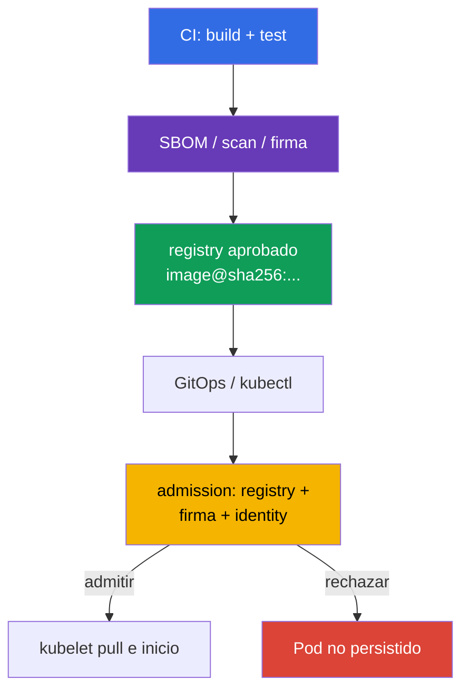

[Русская версия](ru.md) · [Eng version](README.md) · [Version française](fr.md) · [Deutsche Version](de.md) · [ქართული ვერსია](ge.md) · [繁體中文版](tw.md) · [日本語版](jp.md)

# Capítulo 26. Seguridad de la supply chain: registros, firma y validación de artefactos

> **Problema.** Un atacante con permiso de push en un registry o acceso a CD puede cambiar un
> tag mutable y desplegar una image ajena desde un repositorio externo o incluso interno y conocido.
> Un pull correcto no demuestra que esos bytes los haya construido un pipeline de confianza,
> y un allowlist sin signature verification no detendrá un artifact sin firmar. Se necesitan
> un digest immutable, la comprobación del publicador y admission fail-closed antes de persistir el Pod.

> **Qué sigue.** En el [capítulo 25](../25/es.md) definimos de dónde provienen las dependencias,
> el SBOM y los artefactos. Ahora construimos la última barrera antes del inicio: el clúster acepta
> solo images de registros aprobados y solo el digest immutable cuya procedencia y firma estén
> confirmadas. Este es el dominio **Supply Chain Security** de CKS (20%).
>
> **Qué se debe conocer de CKA.** El recorrido de una solicitud por admission se explica en
> el [capítulo 21 de CKA](../../../cka/course/21/es.md), y image, tag, digest y Dockerfile - en
> el [capítulo 23 de CKA](../../../cka/course/23/es.md). Aquí estos mecanismos se usan como
> security control: un tag no es prueba del contenido y un `docker pull` correcto
> no significa que la image esté permitida para ejecutarse.

> **Idea sencilla de la firma.** Responde a una pregunta: **¿quién aprobó exactamente estos
> bytes de la image?** El pipeline primero fija el digest immutable - la huella del contenido - y después
> firma ese digest. Antes del inicio, el verifier compara el digest de la image con la firma y
> confirma que el signer es de confianza. Si el tag ahora apunta a otros bytes, la firma antigua
> ya no sirve. La firma no cifra una image ni sustituye el scan de malware/CVE: demuestra la
> identity del publicador para un contenido concreto.

> 🧠 La trust decision se toma antes de persistir el `Pod`: el allowlist del registry determina el origen de la image, la firma determina el publicador de confianza y el digest fija el contenido.

## 26.1. Qué se debe proteger exactamente

La supply chain comienza antes de Kubernetes: el código fuente y CI construyen la image, el registry
guarda la image y su firma, GitOps o `kubectl` envía la referencia al API server, y admission decide
si admite el Pod. Si se sustituye cualquier etapa, un manifest correcto puede ejecutar código
ajeno.



No se deben confundir dos propiedades independientes:

- el **allowlist de registros** responde *de dónde* está permitido obtener una image: por ejemplo,
  `registry.example.com/platform/*`;
- la **comprobación de firma** responde *quién y para qué digest* emitió el artifact;
- el **digest** fija los bytes. `:1.4.2` es un nombre mutable, mientras que
  `@sha256:<digest>` vincula el deployment con un manifest verificado.

Por eso `registry.example.com/platform/api:1.4.2` debe convertirse en
`registry.example.com/platform/api:1.4.2@sha256:<verified-digest>` antes del rollout a production.
Un allowlist no sustituye signature verification: un atacante con permiso de push en un registry
de confianza aún puede colocar allí una image sin firmar. La firma, a su vez,
no prohíbe usar un registry no aprobado.

> 🎯 Implemente un allowlist de admission fail-closed para el registry/repository necesario y compruebe los containers normal, init y ephemeral. En Kubernetes v1.36, tenga en cuenta por separado `spec.volumes[].image.reference`: mientras el verifier no pueda comprobar de forma demostrable tal OCI artifact, en un namespace protegido es más seguro rechazar image volumes. Native `ValidatingAdmissionPolicy` y Gatekeeper son vías directas para esta tarea.

## 26.2. Allowlist de registros mediante native ValidatingAdmissionPolicy, Kyverno y Gatekeeper

### Native `ValidatingAdmissionPolicy`: un allowlist sencillo con CEL

Para un allowlist sencillo de registry, Kubernetes proporciona native `ValidatingAdmissionPolicy`
(VAP): un mecanismo stable desde Kubernetes 1.30 que no requiere un admission webhook de terceros.
Es adecuado para comprobaciones CEL de prefix/formato de image, pero **no sustituye la
verificación criptográfica de Cosign o Notary**: VAP no demuestra quién firmó un digest concreto. La policy
siguiente cubre por igual containers normales, init y ephemeral; se requiere `pods/ephemeralcontainers`
para prohibir una evasión mediante `kubectl debug`. También rechaza image volumes de forma fail-closed:
en Kubernetes v1.36, `spec.volumes[].image.reference` es una referencia OCI independiente, no un container.

```yaml
apiVersion: admissionregistration.k8s.io/v1
kind: ValidatingAdmissionPolicy
metadata:
  name: allow-approved-platform-registry
spec:
  failurePolicy: Fail
  matchConstraints:
    resourceRules:
    - apiGroups: [""]
      apiVersions: ["v1"]
      operations: ["CREATE", "UPDATE"]
      resources: ["pods", "pods/ephemeralcontainers"]
  validations:
  - message: "Solo se permiten imágenes de contenedor de registry.example.com/platform/; los volúmenes de imagen están prohibidos."
    expression: >-
      object.spec.containers.all(c, c.image.startsWith("registry.example.com/platform/")) &&
      (!has(object.spec.initContainers) || object.spec.initContainers.all(c,
        c.image.startsWith("registry.example.com/platform/"))) &&
      (!has(object.spec.ephemeralContainers) || object.spec.ephemeralContainers.all(c,
        c.image.startsWith("registry.example.com/platform/"))) &&
      (!has(object.spec.volumes) || !object.spec.volumes.exists(v, has(v.image)))
---
apiVersion: admissionregistration.k8s.io/v1
kind: ValidatingAdmissionPolicyBinding
metadata:
  name: allow-approved-platform-registry
spec:
  policyName: allow-approved-platform-registry
  validationActions: [Deny]
  matchResources:
    namespaceSelector:
      matchLabels:
        registry-policy: enforced
```

Etiquete el namespace de prueba con `registry-policy: enforced` (`kubectl label namespace
<ns> registry-policy=enforced`) antes de ampliar `namespaceSelector` a todo el clúster:
sin `matchResources.namespaceSelector` en la Binding, la policy pasa inmediatamente a ser cluster-wide y
afectará a todos los Pod coincidentes, no solo al namespace elegido.

VAP, como un Gatekeeper Constraint solo para Pod, rechazará el Pod creado por un controller; para
rechazar antes el propio Deployment se necesitan reglas CEL independientes para su template. Primero aplique la policy
en un namespace de prueba y compruebe las images de containers normal/init/ephemeral, así como un Pod con
`spec.volumes[].image`: este ejemplo debe rechazar el image volume. Para los requisitos de signature,
mantenga el siguiente `ImageValidatingPolicy` u otro verifier criptográfico.

La comprobación debe cubrir `containers`, `initContainers` y, si están permitidos,
`ephemeralContainers`: de otro modo, un container init o debug se convertirá en una evasión de la policy. En Kubernetes
v1.36, trate por separado `spec.volumes[].image.reference`: no es un elemento de ninguno de
los tres arrays.

> **⚠️ Delta de versión.** En el exam snapshot v1.35, `spec.volumes[].image` aún es Beta, aunque `ImageVolume` está habilitado de forma predeterminada. En un clúster más antiguo o con el gate deshabilitado, primero compruebe el API schema y la validation policy; no elimine la cobertura fail-closed de image volume solo por la ausencia de workloads actuales.

Una policy solo para Pod comprueba únicamente el Pod. Para que Kyverno `ValidatingPolicy` rechace un Deployment y
otros workload controllers antes de crear el Pod, incluya explícitamente `spec.autogen.podControllers`;
sin él, el controller será admitido y el rechazo ocurrirá solo al crear un Pod. Empiece en
modo Audit, corrija los manifests existentes y después pase la regla a Enforce.

> 🔬 Kyverno es un policy engine alternativo con capacidades adicionales; úselo cuando esté indicado por el entorno o ya sea el estándar de la plataforma.

### Kyverno 1.19 (chart 3.9.0, installed release)

> **Nota de compatibilidad.** El track principal de exam/lab del curso es Kubernetes v1.35: Kyverno
> v1.19 soporta oficialmente Kubernetes v1.33-v1.35. El training baseline general del curso
> (infraestructura de lab, `env.hcl`) es Kubernetes v1.36, por lo que esta lab es una variante
> orientada al futuro fuera de la support matrix probada de Kyverno 1.19 (véase el capítulo
> 20 §20.4). No confunda tres ámbitos independientes: la versión de examen, la versión de training
> del clúster y la versión de un instrumento concreto soportada por el vendor pueden diferir a la vez.
>
> Las labs 108 y 111 instalan Kyverno mediante Helm chart `3.9.0`, que corresponde al release
> **Kyverno 1.19.0**. Un defecto upstream conocido [#16947](https://github.com/kyverno/kyverno/issues/16947)
> afecta precisamente a `ImageValidatingPolicy`: para `pods/ephemeralcontainers`, su validating
> handler no aplica `validations`, aunque se invocan webhook e image verification; el issue
> está marcado para el milestone `1.19.2`. Por ello, en 1.19.0 fijado, no considere garantizado
> el test negativo de `kubectl debug` para la **firma** (detalles en §26.5).
> Esta limitación no se aplica a la `ValidatingPolicy` normal: la policy siguiente recibe admission review
> para `pods/ephemeralcontainers` y aplica el allowlist CEL.

La vía principal usa `ValidatingPolicy` basada en CEL de `policies.kyverno.io/v1`.
La variable reúne las tres listas de containers; el recurso `pods/ephemeralcontainers`
es necesario para que la misma comprobación se ejecute en `kubectl debug`. Igual que VAP native, esta
variante prohíbe por separado image volumes mientras no se haya elegido un verifier con soporte confirmado
para `spec.volumes[].image.reference`.

```yaml
apiVersion: policies.kyverno.io/v1
kind: ValidatingPolicy
metadata:
  name: allow-approved-registries
spec:
  validationActions: [Deny]
  autogen:
    podControllers:
      controllers: [deployments, daemonsets, statefulsets, jobs, cronjobs]
  matchConstraints:
    resourceRules:
    - apiGroups: [""]
      apiVersions: ["v1"]
      operations: ["CREATE", "UPDATE"]
      resources: ["pods", "pods/ephemeralcontainers"]
  variables:
  - name: allContainers
    expression: >-
      object.spec.containers +
      object.spec.?initContainers.orValue([]) +
      object.spec.?ephemeralContainers.orValue([])
  validations:
  - message: "Solo se permiten imágenes de registry.example.com/platform/."
    expression: >-
      variables.allContainers.all(container,
        container.image.startsWith("registry.example.com/platform/"))
  - message: "Los volúmenes de imagen están prohibidos hasta disponer de un verificador validado para ellos."
    expression: >-
      !has(object.spec.volumes) || !object.spec.volumes.exists(volume, has(volume.image))
```

Compruebe los casos positivo y negativo antes del rollout:

```bash
kubectl apply -f allowed-pod.yaml
kubectl apply -f forbidden-pod.yaml  # se espera admission denial
kubectl debug allowed-pod --image=registry.example.com/other-team/debug:1.0 --target=app
# Se espera: admission denial - ValidatingPolicy normal comprueba
# pods/ephemeralcontainers y rechaza un repository prefix incorrecto.
kubectl get policyreport -A          # si Policy Reports están habilitados en el clúster
```

El prefix de la prueba es importante: esta Kyverno `ValidatingPolicy` comprueba únicamente `registry.example.com/platform/*`, por lo que
para probar la policy se necesita una image del registry coincidente con una ruta incorrecta dentro de
él, no un registry ajeno arbitrario.

No añada todo `docker.io` "temporalmente": eso convierte el allowlist en allow-all.
Para los componentes del sistema, defina prefixes separados y estrechos, por ejemplo
`registry.k8s.io/*`, y registre la excepción al revisar el cambio.

La `ClusterPolicy` legacy con `foreach` pertenece solo al material de migración: en Kyverno
1.19 este tipo está deprecated y en 1.20 se ha previsto eliminarlo.

### OPA Gatekeeper

Gatekeeper separa la lógica de ConstraintTemplate del Constraint concreto. El template siguiente
comprueba containers regular, init y ephemeral y rechaza image volumes mientras no se haya implementado
un verifier independiente y verificado para `spec.volumes[].image.reference`. Su `match` está limitado a `Pod`: tal
Constraint **no rechaza el propio Deployment**. Rechazará el Pod que cree después un
controller; para un rechazo temprano, añada reglas independientes para workload templates. Para
`kubectl debug`, el webhook de Gatekeeper debe recibir el subresource `UPDATE`
`pods/ephemeralcontainers`, y el Rego siguiente comprueba precisamente ese contexto.

```yaml
apiVersion: templates.gatekeeper.sh/v1
kind: ConstraintTemplate
metadata:
  name: k8sallowedrepos
spec:
  crd:
    spec:
      names:
        kind: K8sAllowedRepos
      validation:
        openAPIV3Schema:
          type: object
          properties:
            repos:
              type: array
              items:
                type: string
  targets:
  - target: admission.k8s.gatekeeper.sh
    rego: |
      package k8sallowedrepos

      import rego.v1

      violation contains {"msg": msg} if {
        container := input.review.object.spec.containers[_]
        not starts_with_allowed(container.image, input.parameters.repos)
        msg := sprintf("image %q is not from an approved registry", [container.image])
      }

      violation contains {"msg": msg} if {
        container := input.review.object.spec.initContainers[_]
        not starts_with_allowed(container.image, input.parameters.repos)
        msg := sprintf("init image %q is not from an approved registry", [container.image])
      }

      violation contains {"msg": msg} if {
        input.review.operation == "UPDATE"
        input.review.subResource == "ephemeralcontainers"
        container := input.review.object.spec.ephemeralContainers[_]
        not starts_with_allowed(container.image, input.parameters.repos)
        msg := sprintf("ephemeral image %q is not from an approved registry", [container.image])
      }

      violation contains {"msg": msg} if {
        volume := input.review.object.spec.volumes[_]
        volume.image
        msg := "image volumes are not allowed until their OCI references have verified policy coverage"
      }

      starts_with_allowed(image, repos) if {
        repo := repos[_]
        startswith(image, repo)
      }
---
apiVersion: constraints.gatekeeper.sh/v1beta1
kind: K8sAllowedRepos
metadata:
  name: approved-platform-images
spec:
  match:
    kinds:
    - apiGroups: [""]
      kinds: ["Pod"]
  parameters:
    repos:
    - "registry.example.com/platform/"
```

Para enforcement obligatorio, instale Gatekeeper con `validatingWebhookFailurePolicy: Fail`
y después de la instalación compruebe la configuración real:

```yaml
# values.yaml para el Helm chart de Gatekeeper
validatingWebhookFailurePolicy: Fail
```

```bash
kubectl get validatingwebhookconfiguration gatekeeper-validating-webhook-configuration \
  -o jsonpath='{range .webhooks[*]}{.name}{"\t"}{.failurePolicy}{"\n"}{end}'
```

El valor predeterminado del chart puede ser `Ignore`, es decir, un webhook no disponible permitirá la solicitud.
En un entorno de prueba, compruebe deliberadamente que una solicitud se rechaza cuando el webhook no está disponible.
`Fail` requiere HA, monitorización y disponibilidad de Gatekeeper: de otro modo puede bloquear nuevos
Pod durante una caída del controller.

Kyverno es práctico cuando la policy también debe mutate manifests o comprobar firmas
de forma nativa. Gatekeeper es práctico cuando la organización ha estandarizado Rego y Constraints.
No instale ambos engines para la misma comprobación obligatoria sin un propietario explícito
y un orden de migración acordado: los mensajes de denial duplicados complican el
diagnóstico y dos allowlists distintos divergen.

> 🎯 `ImagePolicyWebhook` es un exam-oriented admission mechanism: el API server delega allow/deny en un backend que debe estar disponible y configurado fail-closed.

## 26.3. ImagePolicyWebhook: backend y configuración del API server

`ImagePolicyWebhook` es un admission plugin del API server. Para cada solicitud de admission con
container images, envía un `ImageReview` a un backend HTTPS externo; el backend responde
`allowed: true` o `false` y puede devolver un motivo y audit annotations. Esto centraliza la
decisión fuera de los manifests, pero el backend pasa a formar parte de la ruta crítica del API server.
`ImageReview` incluye `containers`, `initContainers` y `ephemeralContainers`, pero no
`spec.volumes[].image.reference`; por ello, no haga de este plugin el único supply-chain
control si se permiten image volumes. En los ejemplos de este capítulo, native policy/Gatekeeper
rechazan image volumes de forma fail-closed.

```mermaid
sequenceDiagram
    participant C as kubectl / GitOps
    participant A as kube-apiserver
    participant W as ImagePolicyWebhook backend
    participant E as etcd
    C->>A: crear Pod con image@digest
    A->>W: ImageReview (images, user, namespace)
    W-->>A: allowed/denied + reason
    alt allowed
        A->>E: persistir Pod
    else denied o backend no disponible
        A-->>C: admission error; Pod no creado
    end
```

El backend debe ser accesible *desde el API server* y tomar una decisión fail-closed. A continuación
se elige la configuración mTLS: el API server presenta un client certificate y el backend comprueba
este y la CA. mTLS no es un requisito universal de `ImagePolicyWebhook`; el método de autenticación del
backend se define mediante su kubeconfig e infraestructura. El backend no debe hacer pull de una image
en cada solicitud:
compruebe reference/digest, firma e identity de confianza, y almacene los resultados en caché solo
durante un TTL corto y justificado. Una caché de allow larga después de revocar una firma dejará una ventana
para un inicio no deseado.

En la configuración de admission, establezca `defaultAllow: false`. La ruta y los montajes de archivos siguientes
se muestran para un kubeadm static Pod; sustituya el endpoint de backend, la CA y el client certificate
reales por los valores de su infraestructura.

```yaml
# /etc/kubernetes/admission-control/image-policy.yaml
apiVersion: apiserver.config.k8s.io/v1
kind: AdmissionConfiguration
plugins:
- name: ImagePolicyWebhook
  configuration:
    imagePolicy:
      kubeConfigFile: /etc/kubernetes/admission-control/image-policy.kubeconfig
      allowTTL: 30
      denyTTL: 30
      retryBackoff: 500
      defaultAllow: false
```

```yaml
# /etc/kubernetes/admission-control/image-policy.kubeconfig
apiVersion: v1
kind: Config
clusters:
- name: image-policy-backend
  cluster:
    certificate-authority: /etc/kubernetes/pki/image-policy/ca.crt
    server: https://image-policy-backend.security.example:8443/imagepolicy
users:
- name: kube-apiserver
  user:
    client-certificate: /etc/kubernetes/pki/image-policy/apiserver.crt
    client-key: /etc/kubernetes/pki/image-policy/apiserver.key
contexts:
- name: image-policy
  context:
    cluster: image-policy-backend
    user: kube-apiserver
current-context: image-policy
```

Añada el plugin a `kube-apiserver` y proporcione la admission configuration. No sustituya
la lista existente de admission plugins habilitados: añada `ImagePolicyWebhook` a su
valor actual; de otro modo, puede deshabilitar por accidente controllers integrados obligatorios. Habilite además la API
`imagepolicy.k8s.io/v1alpha1` que usa `ImageReview`: sin ella, este fragment es incompleto y no se llamará al backend.
Si `--runtime-config` ya está presente, añada `imagepolicy.k8s.io/v1alpha1=true` a su valor actual sin
sobrescribir otros ajustes.

```yaml
# fragmento de /etc/kubernetes/manifests/kube-apiserver.yaml
spec:
  containers:
  - name: kube-apiserver
    command:
    - kube-apiserver
    - --enable-admission-plugins=NodeRestriction,ServiceAccount,ImagePolicyWebhook
    - --runtime-config=imagepolicy.k8s.io/v1alpha1=true
    - --admission-control-config-file=/etc/kubernetes/admission-control/image-policy.yaml
    volumeMounts:
    - name: image-policy-config
      mountPath: /etc/kubernetes/admission-control
      readOnly: true
    - name: image-policy-pki
      mountPath: /etc/kubernetes/pki/image-policy
      readOnly: true
  volumes:
  - name: image-policy-config
    hostPath:
      path: /etc/kubernetes/admission-control
      type: DirectoryOrCreate
  - name: image-policy-pki
    hostPath:
      path: /etc/kubernetes/pki/image-policy
      type: DirectoryOrCreate
```

La edición del static Pod reiniciará el API server. Guarde un backup manifest **fuera de**
`/etc/kubernetes/manifests/` (por ejemplo, en `/root/k8s-manifest-backup/`): kubelet puede leer
un archivo con cualquier extensión dentro de ese directorio como otro manifest de static Pod.
Mantenga acceso a la consola del control-plane y compruebe de antemano el TLS del backend: un endpoint, CA, client key
o configuración fail-open erróneos pueden, respectivamente, bloquear todos los Pod nuevos o eliminar la protección.
Tras el reinicio, compruebe `/readyz`, los logs del API server y una prueba explícita de allow/deny.
A continuación se muestran respuestas conceptuales mínimas del backend, no objetos para `kubectl apply`:

```yaml
# allow: deje reason vacío; auditAnnotations tiene claves sin prefix
apiVersion: imagepolicy.k8s.io/v1alpha1
kind: ImageReview
status:
  allowed: true
  auditAnnotations:
    decision: "approved signed digest"
---
# deny: un motivo corto aparecerá en el admission error
apiVersion: imagepolicy.k8s.io/v1alpha1
kind: ImageReview
status:
  allowed: false
  reason: "image is not signed by an approved identity"
  auditAnnotations:
    decision: "signature verification failed"
```

Para un clúster nuevo, compare la disponibilidad y soporte del plugin con su versión de Kubernetes: es
un mecanismo especializado antiguo; un webhook/policy engine con soporte de signature
verification suele ser más fácil de mantener.

> 🧪 **Práctica: CKS Lab 108, tareas 2 y 6.** [Lab 108](../../labs/108/README_ES.MD)
> practica por separado la prohibición de `latest` explícito e implicit, y en la tarea 6 - el wiring completo de
> `ImagePolicyWebhook`: `defaultAllow: false`, backend `ImageReview`, adición del plugin a
> kube-apiserver, denial para `nginx:latest` y allow para `nginx:1.27.3`. Es una práctica
> útil del mecanismo para el examen; en production sustituya de todos modos un versioned tag permitido
> por una reference de digest.

> 🎯 Debe saber firmar y comprobar un digest immutable concreto mediante `cosign`; un tag por sí solo no es un objeto de confianza.

## 26.4. Cosign y Sigstore: firma y verificación de digest

Cosign crea y comprueba firmas de OCI-artifacts. Firme el **digest** obtenido de su propio
pipeline de build/push; no sustituya `latest` ni un digest procedente de un mensaje ajeno.
La firma se almacena junto al artifact en el registry, por lo que el control de acceso y la retención
del registry son tan importantes como la clave.

```bash
IMAGE="${IMAGE:?set image reference}"

# Lab: este comando crea un par local cosign.key/cosign.pub.
# No use la private key creada aquí como production key ni la añada a Git.
cosign generate-key-pair

# CI recibe la clave brevemente; la contraseña no se imprime en los logs.
cosign sign --key cosign.key "$IMAGE"

# Verificación con una public key de confianza - antes del deploy y en admission.
cosign verify --key cosign.pub "$IMAGE"
```

El `cosign generate-key-pair` anterior es solo un par local para el lab. En production,
use el flujo keyless OIDC de abajo o una clave independiente, creada y mantenida en KMS;
no transfiera `cosign.key` creado localmente a CI. El éxito de `cosign verify` significa
la verificación criptográfica de la firma para el image reference indicado. La policy debe
además limitar **qué** public key/identity se permiten para ese repository. Una única clave
común para todos los environments y proyectos convierte la compromise del CI de un servicio
en un riesgo para todos los demás. Rote las claves, revoque el acceso a la clave antigua y
conserve un audit trail: quién, cuándo y qué digest firmó.

> 🔬 El flujo keyless con OIDC, Fulcio y Rekor reduce el riesgo de una private key permanente, pero exige limitar con precisión el issuer y la identity del release workflow.

### Keyless: identity de corta duración en lugar de una signing key local

El flujo keyless de Sigstore obtiene un certificado de corta duración tras la autenticación
OIDC de CI y registra la proof en el transparency log. No es necesario crear una private key
local ni distribuirla a los desarrolladores, pero no debe confiar en «cualquier certificado»,
sino en la identity OIDC precisa del release workflow.

```bash
IMAGE="${IMAGE:?set image reference}"

# En CI con OIDC (por ejemplo, GitHub Actions): no hay confirmación interactiva.
cosign sign --yes "$IMAGE"

# Comprobamos el issuer Y el subject del workflow, no solo la existencia del certificate.
cosign verify \
  --certificate-oidc-issuer=https://token.actions.githubusercontent.com \
  --certificate-identity-regexp='^https://github\.com/example-org/payments/\.github/workflows/release\.yml@refs/tags/v[0-9].*$' \
  "$IMAGE"
```

Para GitHub Actions, el workflow debe otorgar al job el permiso `id-token: write`; no es permiso
de push al registry ni sustituye una scoped registry credential. La restricción de identity debe incluir
la organización, el repository, el workflow y el ref/environment apropiado. Un
`--certificate-identity-regexp='.*'` demasiado amplio hace que la keyless verification sea
casi inútil: cualquier usuario OIDC aceptado por el verifier podrá firmar la imagen.

> 🎯 La verificación de firma se vuelve obligatoria solo en el admission path: una verificación local correcta en CI no impide un `kubectl apply` directo.

## 26.5. Verificación de firma en admission y Notary

La verificación antes del deployment es útil, pero no es enforcement: un usuario puede omitir
el script local de CI y dirigirse al API directamente. Por ello, la verificación debe residir
en el admission path. En Kyverno 1.19 lo realiza `ImageValidatingPolicy` basado en CEL;
el legacy `ClusterPolicy.verifyImages` se conserva solo para la migración. No considere este
ejemplo de policy como una verificación de `spec.volumes[].image.reference`: en este capítulo,
los image volumes ya se rechazan fail-closed mediante la allowlist policy, hasta que se confirme
el soporte del verifier para ellos.

**El núcleo del examen** - allowlist de repository, immutable digest, admission fail-closed
y diagnóstico de denial. `ImageValidatingPolicy` de Kyverno, Notary y las signed SBOM/in-toto
attestations son una **extensión de production**: vinculan la policy con un signer de confianza
y release evidence. En el ejemplo, la private key no entra en el clúster.

```yaml
apiVersion: policies.kyverno.io/v1
kind: ImageValidatingPolicy
metadata:
  name: require-signed-platform-images
spec:
  failurePolicy: Fail
  validationActions: [Deny]
  matchConstraints:
    resourceRules:
    - apiGroups: [""]
      apiVersions: ["v1"]
      operations: ["CREATE", "UPDATE"]
      resources: ["pods", "pods/ephemeralcontainers"]
  matchImageReferences:
  - glob: "registry.example.com/platform/*"
  validationConfigurations:
    mutateDigest: true
    required: true
    verifyDigest: true
  attestors:
  - name: releaseKey
    cosign:
      key:
        data: |-
          -----BEGIN PUBLIC KEY-----
          <clave-publica-del-firmante-de-release>
          -----END PUBLIC KEY-----
  - name: releaseNotary
    notary:
      certs:
        value: |-
          -----BEGIN CERTIFICATE-----
          <certificado-X.509-del-firmante-Notary-de-release>
          -----END CERTIFICATE-----
  attestations:
  - name: signedSbom
    referrer:
      type: sbom/cyclone-dx
  validations:
  - message: "Image must have a valid release signature"
    expression: >-
      (images.containers + images.?initContainers.orValue([]) +
      images.?ephemeralContainers.orValue([])).map(image,
        verifyImageSignatures(image, [attestors.releaseKey, attestors.releaseNotary]) > 0).all(ok, ok)
  - message: "Image must have a signed CycloneDX SBOM for this digest"
    expression: >-
      (images.containers + images.?initContainers.orValue([]) +
      images.?ephemeralContainers.orValue([])).map(image,
        verifyAttestationSignatures(image, attestations.signedSbom, [attestors.releaseKey]) > 0).all(ok, ok)
```

`failurePolicy: Fail` no permite el objeto si falla la verificación. Pero en Kyverno
1.19.0 instalado, un defect conocido de `ImageValidatingPolicy` para
`pods/ephemeralcontainers` no garantiza que sus `validations` se apliquen a `kubectl debug`
(upstream #16947 indica el milestone de corrección `1.19.2`; consulte también la compatibility
note en §26.2). Por ello, los positive/negative tests obligatorios de esta versión pinned
son el container normal y el init container. La solicitud siguiente puede ejecutarse solo
como empirical compatibility test; no registre de antemano el denial esperado ni dependa de
ella para el enforcement de un debug-container de approved-registry sin firmar, hasta que el lab
instale una versión corregida y el resultado sea confirmado por su test.

```bash
kubectl debug allowed-pod --image=registry.example.com/platform/debug@sha256:<digest> --target=app
# Solo empirical test para Kyverno 1.19.0 pinned: registre el outcome en evidence.
kubectl debug allowed-pod --image=registry.example.com/platform/debug:unsigned --target=app
```

Compruebe aparte una imagen de un registry ajeno (`registry.example.com/other-team/debug:1.0`
o similar) - esa solicitud será rechazada por la allowlist VAP de la sección anterior antes
de llegar a la verificación de firma; no pertenece a `matchImageReferences` para esta
ImageValidatingPolicy y no prueba sus reglas CEL.
`validationConfigurations` permite primero a Kyverno añadir el digest, luego lo exige y
lo comprueba; por ello, la signature y `signedSbom` se refieren al mismo immutable digest.
`releaseNotary` es un attestor Notary nativo, y la condición de signature permite una de las
trust roots seleccionadas explícitamente; no las mezcle sin un período de migración documentado.
Para keyless, en lugar de static key configure `cosign.keyless.identities` con el issuer y subject
precisos del workflow CI concreto. Pruebe el digest firmado y sin firmar, un signer incorrecto,
la ausencia de signed SBOM y la indisponibilidad del registry.

> 🔬 Notary/Notation - una alternativa de ecosistema de OCI signing; para Kubernetes sigue necesitando una integración que devuelva allow/deny.

**Notary Project** y CLI `notation` son un ecosistema alternativo de OCI signing con X.509
trust stores y trust policy. `notation verify` es útil en CI/CD:

```bash
notation cert add --type ca --store platform-ca company-root-ca.pem
notation policy import --force trustpolicy.json
IMAGE="${IMAGE:?set image reference}"
notation verify "$IMAGE"
```

Notary por sí solo no es un Kubernetes admission controller. Su trust policy debe transformarse
en una comprobación de policy controller o de webhook backend que devuelva allow/deny al API server.
No exija que un verifier «comprenda» todo automáticamente: Cosign/Sigstore y Notary/Notation
usan modelos de confianza distintos. Elija un estándar para el repository concreto, documente
la trust root, las allowed identities y el procedimiento de rotation, y lleve la migración
con un período explícito de doble firma y doble verificación.

> 🏭 El proceso end-to-end reúne build, scan, SBOM/attestations, firma, deployment por digest y admission fail-closed con audit evidence.

## 26.6. Proceso de producción verificable

### Cómo se aplica en producción

Un pipeline seguro mínimo tiene este aspecto:

1. CI construye una image reproducible, la escanea y obtiene el digest después del push.
2. CI crea SBOM/attestations y firma ese digest con una clave o una identity OIDC keyless.
3. La reference de Deployment utiliza ese mismo digest; la allowlist permite solo el
   registry/repository necesario, y los image volumes se verifican explícitamente mediante un verifier independiente o se rechazan fail-closed.
4. Admission compara el registry, el digest y la firma con una trusted identity limitada y
   rechaza fail-closed un error de verificación.
5. Los logs de CI, registry y admission vinculan el commit, el workflow run, el digest y la decisión.

Comience el diagnóstico con los hechos, no relajando la policy. Un CREATE directo de `Pod`
rechazado por admission no se conserva, por lo que la evidencia primaria es la respuesta del
propio comando, no `kubectl describe pod`:

```bash
kubectl apply -f pod.yaml 2>&1 | tee /tmp/admission-denial.txt
kubectl get pod "${POD:?set pod}" && kubectl describe pod "$POD"  # solo si el Pod existe
kubectl get events -A --sort-by=.lastTimestamp
kubectl describe rs/my-replicaset         # para un Pod creado por un controller: busque FailedCreate
cosign verify --key cosign.pub "$IMAGE"
kubectl logs -n kyverno deploy/kyverno-admission-controller
```

Para un Pod propiedad de un controller, compruebe Events y `FailedCreate` en ReplicaSet/Job;
para una traza completa, el audit del API server y los logs del admission controller correspondiente.

Si se rechaza un deployment legítimo, compruebe su digest, repository prefix, signer
identity, certificado/clave y la red/TLS hacia el registry. No corrija un incidente con
`validationActions: [Audit]`, `failurePolicy: Ignore` o una allowlist amplia temporal en
producción: así desaparece justo el control que debe detectar el compromise. Para una
excepción de emergencia, utilice una solución de corta duración, limitada a namespace y
digest, con propietario, plazo y eliminación posterior.

## 26.7. Mini glosario

- **Registry allowlist** - policy que permite una image solo desde determinados prefixes de registry/repository.
- **Digest** - identificador SHA-256 immutable de un OCI manifest/artifact concreto.
- **Cosign** - herramienta Sigstore para firmar y verificar OCI-artifacts.
- **Keyless signing** - firma con un certificate de corta duración emitido después de la autenticación OIDC, en lugar de una signing key local permanente.
- **ImagePolicyWebhook** - admission plugin que delega la decisión sobre images a un backend externo mediante `ImageReview`.
- **Admission verification** - verificación obligatoria de provenance/firma antes de que el API server conserve el Pod.
- **Notary Project / Notation** - ecosistema de OCI signing con X.509 trust policy; para enforcement de Kubernetes necesita admission integration.

## 26.8. Resumen del capítulo

- La allowlist de registry y la comprobación de firma resuelven tareas distintas y deben funcionar juntas.
- Kyverno y Gatekeeper pueden rechazar container image references no aprobadas; la comprobación
  debe incluir containers normales, init y ephemeral, y `spec.volumes[].image.reference`
  debe verificarse explícitamente con un verifier independiente o rechazarse fail-closed.
- `ImagePolicyWebhook` requiere un backend protegido y disponible, configuración del
  API server y `defaultAllow: false` fail-closed; mTLS en el ejemplo es la variante de
  autenticación de backend elegida.
- Cosign firma y verifica un digest immutable; la private key no debe llegar a Git,
  manifest ni a la policy del cluster.
- La verificación keyless de Sigstore confía en un issuer OIDC y una identity de workflow CI concretos,
  no en un certificado arbitrario.
- Admission enforcement no se reemplaza por una comprobación CI local; Notary/Notation requiere
  integration que devuelva admission allow/deny.

## 26.9. Cómo ayuda en el examen y en el trabajo real

**En el examen.** El núcleo breve es la diferencia entre registry policy, tag y digest,
la configuración o diagnóstico de validating admission, la API-server admission configuration y el riesgo
fail-open. Saber conservar la respuesta de un admission denial y comprobar la exact image reference es más rápido
y seguro que desactivar el controller. Kyverno `ImageValidatingPolicy`, Notary y
attestations son extensiones de producción, para las que basta comprender su propósito.

**En el trabajo real.** La firma vincula un production workload con el release workflow y el
artifact concreto, y admission hace que esta regla sea obligatoria para cada vía de
deployment. Junto con los permisos least-privilege de CI, un registry protegido y audit logs, esto
reduce la probabilidad de ejecutar una image que no ha pasado por su pipeline.

> ### 🔴 Perspectiva del atacante
> **Asset:** production workload reference a una image.
> **Starting foothold:** capacidad de hacer push en el registry o CI comprometido.
> **Attacker objective:** eludir la comprobación de registry allowlist/admission, sustituyendo una image maliciosa mediante la reasignación de un mutable tag sin cambiar el digest de los workload ya desplegados.
> **Abuse path:** reasignar un tag a otra image. Sin digest pinning, la misma cadena
> `registry/app:stable` no garantiza los mismos bytes: con `imagePullPolicy: Always`,
> kubelet resuelve el tag de nuevo en cada arranque; con `IfNotPresent`, una image en caché puede
> ocultar temporalmente el cambio, pero un node nuevo o una caché limpia obtendrán un nuevo digest en el
> primer pull; `Never` excluye el pull, pero no es un supply-chain verification control.
> `imagePullPolicy` no sustituye digest pinning ni signature/provenance verification.
> **Expected evidence:** respuesta guardada de admission denial o audit log; para un Pod propiedad de un controller, también un event `FailedCreate` en el propietario.
> **Control:** digest pinning, registry allowlist y admission signature verification mediante ImagePolicyWebhook o Kyverno.
> **Retest:** el workload por digest no cambia después de retargeting del tag y una image sin firma es rechazada por admission.

## 26.10. Preguntas de autoevaluación

<details>
<summary>1. ¿Por qué una allowlist de trusted registry no demuestra que la image fue creada por CI de confianza?</summary>

La allowlist responde solo a la pregunta de qué registry/repository permite una image. Un usuario con derecho de push a ese trusted registry todavía puede publicar un artifact no firmado o ajeno. Por ello, el origen del digest concreto se comprueba con una firma y una identity de firmante limitada.
</details>

<details>
<summary>2. ¿Por qué un deployment de producción necesita un digest y no solo un version tag?</summary>

Un version tag es un nombre mutable y puede reasignarse a otros bytes sin cambiar el manifest. `@sha256:...` fija el OCI manifest y vincula el deployment con el mismo artifact que fue escaneado y firmado. `imagePullPolicy` no sustituye digest pinning: un node nuevo o un cache miss todavía pueden resolver de otra forma un mutable tag.
</details>

<details>
<summary>3. ¿Qué container references debe comprobar una registry policy y qué hacer con los image volumes?</summary>

La policy debe comprobar `containers`, `initContainers` y `ephemeralContainers`. De otro modo, un init-container o un container añadido mediante `kubectl debug` y el subresource `pods/ephemeralcontainers` se convierte en una evasión de la allowlist. Para ello, las reglas también hacen match con CREATE/UPDATE del subresource necesario. En Kubernetes v1.36, `spec.volumes[].image.reference` es una OCI-reference independiente fuera de estos arrays: debe comprobarse explícitamente con un verifier compatible o, como en los ejemplos del capítulo, rechazarse fail-closed para image volumes.
</details>

<details>
<summary>4. ¿Qué archivos TLS y parámetros fail-closed necesita el backend de `ImagePolicyWebhook`?</summary>

El kubeconfig del backend necesita la CA en `certificate-authority`, y en el esquema mTLS elegido, `client-certificate` y `client-key` para el API server; las rutas correspondientes deben montarse en el static Pod. En `AdmissionConfiguration` se establece `defaultAllow: false` para que un error o la indisponibilidad del backend no permita una image. También se conservan los admission plugins existentes y se activa la API `imagepolicy.k8s.io/v1alpha1` para `ImageReview`.
</details>

<details>
<summary>5. ¿En qué se diferencia una keyless signature de una static Cosign key y qué issuer/identity se deben limitar durante la verificación?</summary>

El flujo keyless obtiene un certificado de corta duración después de la autenticación OIDC de CI y no requiere distribuir una private key local permanente. Una static Cosign key es un par de claves independiente que se conserva en producción en KMS u otro almacenamiento protegido. Para la verificación keyless se limitan el issuer OIDC exacto y la identity del workflow: organización, repository, release workflow y ref/environment permitidos, no el regex `.*`.
</details>

<details>
<summary>6. ¿Por qué `cosign verify` en CI no evita un `kubectl apply` directo?</summary>

La comprobación CI actúa solo en la vía donde realmente se ejecuta. Un usuario u otro pipeline puede dirigirse directamente a la API de Kubernetes y crear un Pod con una image sin firma. La verificación obligatoria debe estar en la admission path y devolver deny antes de conservar el Pod.
</details>

<details>
<summary>7. ¿Qué se requiere para que Notary/Notation se convierta en un enforcement point de Kubernetes?</summary>

`notation verify` es útil en CI, pero Notary no es por sí solo un Kubernetes admission controller. Su trust policy, X.509 trust roots y allowed identities deben integrarse en un policy controller o backend de webhook que devuelva una decisión allow/deny a kube-apiserver. También se necesitan rotation documentada y, durante una migración, un período de doble firma/verificación.
</details>

<details>
<summary>8. **Flashback (capítulo 20).** La pregunta 6 de este capítulo ya mostró que `cosign verify` en CI no impide un `kubectl apply` directo de una image sin firma. ¿Cómo una admission policy del capítulo 20 (native `ValidatingAdmissionPolicy` o Kyverno `ImageValidatingPolicy`) cierra exactamente esta vía de evasión y en qué difiere por fiabilidad la "signature verification como admission policy" de la "signature verification solo en el CI pipeline"?</summary>

La admission policy se ejecuta en kube-apiserver para cada CREATE/UPDATE de Pod que coincida, por lo que un `kubectl apply` manual también pasa por la comprobación y puede ser rechazado. `ImageValidatingPolicy` puede comprobar la signature/attestation del digest concreto, mientras que native VAP sirve, por ejemplo, para una allowlist reference CEL, pero no sustituye a un verifier criptográfico. Una comprobación solo en CI es una etapa voluntaria del pipeline; admission convierte la regla en enforcement fail-closed en el límite del cluster.
</details>

## Práctica

🧪 Laboratorio 111 CKA (kubeadm lifecycle y static control-plane Pod):
[tasks/cka/labs/111](../../../cka/labs/111/README_ES.MD). Ofrece un contexto seguro para
trabajar con el manifest del API server; no aplique cambios de admission configuration al
control plane de examen sin backup ni comprobar la disponibilidad de la API.

🌐 Práctica interactiva adicional (killer.sh/killercoda, recurso externo): [image-policy-webhook-setup](https://killercoda.com/killer-shell-cks/scenario/image-policy-webhook-setup) · [image-use-digest](https://killercoda.com/killer-shell-cks/scenario/image-use-digest)

📘 Base CKA: [admission](../../../cka/course/21/es.md) ·
[images y Dockerfile](../../../cka/course/23/es.md) ·
[kubeadm control plane](../../../cka/course/35/es.md).

---
[Índice](../README_ES.md) · [Capítulo 25](../25/es.md) · [Capítulo 27](../27/es.md)
