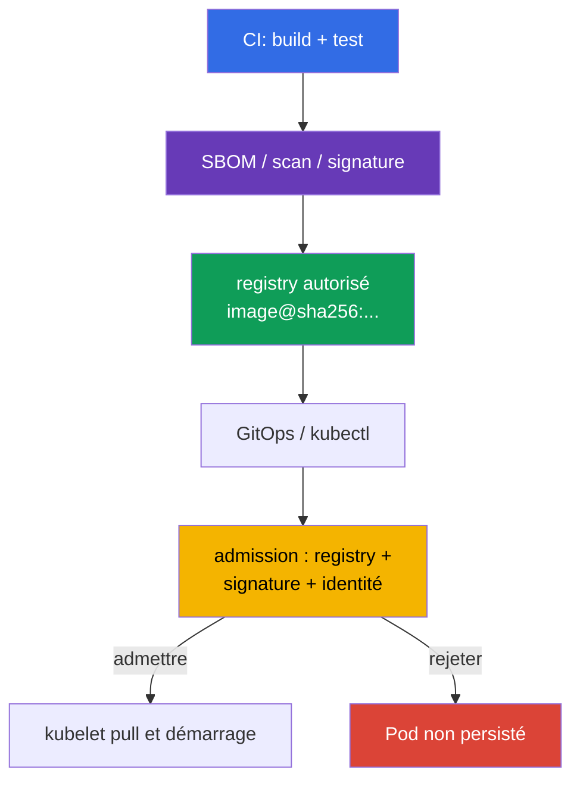

[Русская версия](ru.md) · [Eng version](README.md) · [Versión en español](es.md) · [Deutsche Version](de.md) · [ქართული ვერსია](ge.md) · [繁體中文版](tw.md) · [日本語版](jp.md)

# Chapitre 26. Sécurité de la supply chain : registres, signature et validation des artefacts

> **Problème.** Un attaquant disposant du droit push dans un registry ou d'un accès au CD peut rediriger un tag mutable et déployer une image non fiable depuis un repository externe, voire interne mais familier. Un pull réussi ne prouve pas qu'un pipeline de confiance a construit ces octets, et une allowlist sans vérification de signature n'arrête pas un artifact non signé. Il faut un digest immutable, la vérification de l'éditeur et une admission fail-closed avant la persistance d'un Pod.

> **La suite.** Dans le [chapitre 25](../25/fr.md), nous avons défini l'origine des dépendances, des SBOM et des artefacts. Nous construisons maintenant la dernière barrière avant le démarrage : le cluster n'accepte que les images des registres autorisés et uniquement un digest immutable dont la provenance et la signature sont confirmées. Il s'agit du domaine CKS **Supply Chain Security** (20 %).
>
> **Pré-requis CKA.** Le chemin d'une requête via l'admission est expliqué dans le [chapitre 21 CKA](../../../cka/course/21/fr.md), et image, tag, digest et Dockerfile dans le [chapitre 23 CKA](../../../cka/course/23/fr.md). Ici, ces mécanismes servent de security controls : un tag ne prouve pas le contenu et un `docker pull` réussi ne signifie pas qu'une image est autorisée à s'exécuter.

> **L'idée simple de la signature.** Elle répond à une question : **qui a approuvé ces octets précis de l'image ?** Le pipeline fige d'abord le digest immutable - l'empreinte du contenu - puis signe ce digest. Avant le démarrage, un verifier compare le digest de l'image à la signature et établit que le signer est de confiance. Si un tag pointe désormais vers d'autres octets, l'ancienne signature ne s'applique plus. La signature ne chiffre pas une image et ne remplace pas le scan de malware/CVE : elle prouve l'identité de l'éditeur pour un contenu donné.

> 🧠 La décision de confiance est prise avant la persistance du `Pod` : l'allowlist du registry régit la source de l'image, la signature l'éditeur de confiance et le digest fige le contenu.

## 26.1. Ce qui doit être protégé

La supply chain commence avant Kubernetes : le code source et CI construisent une image, le registry stocke celle-ci et sa signature, GitOps ou `kubectl` envoie la référence à l'API server, et l'admission décide d'admettre ou non le Pod. Si une étape est altérée ou remplacée de manière inattendue, un manifest correct peut exécuter un code non fiable.



Il ne faut pas confondre deux propriétés indépendantes :

- une **allowlist de registry** répond à la question *d'où* une image peut provenir, par exemple `registry.example.com/platform/*` ;
- la **vérification de signature** répond à *qui et pour quel digest* a publié un artifact ;
- un **digest** fige les octets. `:1.4.2` est un nom mutable, tandis que `@sha256:<digest>` relie le deployment au manifest vérifié.

Par conséquent, `registry.example.com/platform/api:1.4.2` doit devenir `registry.example.com/platform/api:1.4.2@sha256:<verified-digest>` avant le rollout en production. Une allowlist ne remplace pas la vérification de signature : un attaquant ayant le droit push dans un registry de confiance peut toujours y placer une image non signée. Inversement, une signature n'interdit pas l'utilisation d'un registry non approuvé.

> 🎯 Implémentez une allowlist d'admission fail-closed pour le registry/repository requis et vérifiez les containers normaux, init et ephemeral. Dans Kubernetes v1.36, examinez séparément `spec.volumes[].image.reference` : tant qu'un verifier ne peut pas contrôler de façon démontrable cet artifact OCI, il est plus sûr de rejeter les image volumes dans un namespace protégé. Les `ValidatingAdmissionPolicy` natives et Gatekeeper sont des approches directes pour cette tâche.

## 26.2. Allowlist de registry avec ValidatingAdmissionPolicy native, Kyverno et Gatekeeper

### `ValidatingAdmissionPolicy` native : une allowlist CEL simple

Pour une allowlist de registry simple, Kubernetes fournit la `ValidatingAdmissionPolicy` (VAP) native : un mécanisme stable depuis Kubernetes 1.30 qui ne nécessite pas de webhook d'admission tiers. Elle convient aux contrôles CEL du préfixe/format d'image, mais **ne remplace pas la vérification cryptographique Cosign ou Notary** : VAP ne prouve pas qui a signé un digest donné. La policy ci-dessous couvre de la même façon les containers normaux, init et ephemeral ; `pods/ephemeralcontainers` est nécessaire pour interdire un contournement via `kubectl debug`. Elle rejette aussi les image volumes en fail-closed : dans Kubernetes v1.36, `spec.volumes[].image.reference` est une référence OCI séparée, pas un container.

```yaml
apiVersion: admissionregistration.k8s.io/v1
kind: ValidatingAdmissionPolicy
metadata:
  name: allow-approved-platform-registry
spec:
  failurePolicy: Fail
  matchConstraints:
    resourceRules:
    - apiGroups: [""]
      apiVersions: ["v1"]
      operations: ["CREATE", "UPDATE"]
      resources: ["pods", "pods/ephemeralcontainers"]
  validations:
  - message: "Seules les container images de registry.example.com/platform/ sont autorisées ; les image volumes sont refusés."
    expression: >-
      object.spec.containers.all(c, c.image.startsWith("registry.example.com/platform/")) &&
      (!has(object.spec.initContainers) || object.spec.initContainers.all(c,
        c.image.startsWith("registry.example.com/platform/"))) &&
      (!has(object.spec.ephemeralContainers) || object.spec.ephemeralContainers.all(c,
        c.image.startsWith("registry.example.com/platform/"))) &&
      (!has(object.spec.volumes) || !object.spec.volumes.exists(v, has(v.image)))
---
apiVersion: admissionregistration.k8s.io/v1
kind: ValidatingAdmissionPolicyBinding
metadata:
  name: allow-approved-platform-registry
spec:
  policyName: allow-approved-platform-registry
  validationActions: [Deny]
  matchResources:
    namespaceSelector:
      matchLabels:
        registry-policy: enforced
```

Ajoutez le label `registry-policy: enforced` à un namespace de test (`kubectl label namespace <ns> registry-policy=enforced`) avant d'étendre `namespaceSelector` à tout le cluster : sans `matchResources.namespaceSelector` dans le Binding, la policy devient immédiatement cluster-wide et affecte tout Pod correspondant, non seulement le namespace sélectionné.

VAP, comme une Constraint Gatekeeper limitée aux Pod, rejette un Pod créé par un controller ; le rejet anticipé du Deployment lui-même exige des règles CEL séparées pour son template. Appliquez d'abord la policy dans un namespace de test, puis vérifiez les images de containers normaux/init/ephemeral ainsi qu'un Pod contenant `spec.volumes[].image` : cet exemple doit rejeter l'image volume. Pour les exigences de signature, conservez l'`ImageValidatingPolicy` suivante ou un autre verifier cryptographique.

Le contrôle doit couvrir `containers`, `initContainers` et, s'ils sont autorisés, `ephemeralContainers` ; sinon, un container init ou debug devient un contournement de la policy. Dans Kubernetes v1.36, traitez séparément `spec.volumes[].image.reference` : ce n'est un élément d'aucun des trois tableaux.

> **⚠️ Différence de version.** Dans le snapshot d'examen v1.35, `spec.volumes[].image` est encore Beta, bien que `ImageVolume` soit activé par défaut. Sur un cluster plus ancien ou avec le gate désactivé, vérifiez d'abord le schéma API et la validation policy ; ne retirez pas la couverture fail-closed des image volumes simplement parce que le workload actuel est absent.

Une policy limitée aux Pod ne vérifie qu'un Pod. Pour que la `ValidatingPolicy` Kyverno rejette un Deployment et les autres workload controllers avant la création du Pod, incluez explicitement `spec.autogen.podControllers` ; sans cela, le controller est admis et le rejet ne se produit que lorsqu'il crée un Pod. Commencez en Audit, corrigez les manifests existants, puis passez la règle à Enforce.

> 🔬 Kyverno est un policy engine alternatif avec des capacités supplémentaires ; utilisez-le quand il est imposé par l'environnement ou constitue déjà le standard de la plateforme.

### Kyverno 1.19 (chart 3.9.0, release installée)

> **Note de compatibilité.** Le parcours principal d'examen/labs du cours utilise Kubernetes v1.35 : Kyverno v1.19 prend officiellement en charge Kubernetes v1.33-v1.35. Le baseline global de formation du cours (infrastructure des labs, `env.hcl`) est Kubernetes v1.36 ; ce lab est donc une variante tournée vers l'avenir, en dehors de la matrice de support testée de Kyverno 1.19 (voir chapitre 20 §20.4). Ne confondez pas trois axes indépendants : la version d'examen, la version de formation du cluster et la version supportée par le fournisseur pour un outil donné peuvent différer simultanément.
>
> Les labs 108 et 111 installent Kyverno avec le Helm chart `3.9.0`, qui correspond à **Kyverno 1.19.0**. Un défaut upstream connu [#16947](https://github.com/kyverno/kyverno/issues/16947) affecte `ImageValidatingPolicy` : pour `pods/ephemeralcontainers`, son handler de validation n'applique pas `validations`, bien que le webhook et la vérification de l'image soient invoqués ; l'issue est marquée pour le milestone `1.19.2`. Par conséquent, avec la 1.19.0 épinglée, ne considérez pas un test négatif `kubectl debug` de **signature** comme garanti (détails au §26.5). Cette limitation ne concerne pas une `ValidatingPolicy` ordinaire : la policy ci-dessous reçoit l'admission review pour `pods/ephemeralcontainers` et applique l'allowlist CEL.

La voie principale utilise une `ValidatingPolicy` basée sur CEL dans `policies.kyverno.io/v1`. Sa variable combine les trois listes de containers ; la ressource `pods/ephemeralcontainers` fait exécuter le même contrôle pour `kubectl debug`. Comme VAP native, cette variante interdit séparément les image volumes jusqu'au choix d'un verifier dont le support de `spec.volumes[].image.reference` est confirmé.

```yaml
apiVersion: policies.kyverno.io/v1
kind: ValidatingPolicy
metadata:
  name: allow-approved-registries
spec:
  validationActions: [Deny]
  autogen:
    podControllers:
      controllers: [deployments, daemonsets, statefulsets, jobs, cronjobs]
  matchConstraints:
    resourceRules:
    - apiGroups: [""]
      apiVersions: ["v1"]
      operations: ["CREATE", "UPDATE"]
      resources: ["pods", "pods/ephemeralcontainers"]
  variables:
  - name: allContainers
    expression: >-
      object.spec.containers +
      object.spec.?initContainers.orValue([]) +
      object.spec.?ephemeralContainers.orValue([])
  validations:
  - message: "Seules les images de registry.example.com/platform/ sont autorisées."
    expression: >-
      variables.allContainers.all(container,
        container.image.startsWith("registry.example.com/platform/"))
  - message: "Les image volumes sont refusés jusqu'à ce qu'un verifier validé soit disponible."
    expression: >-
      !has(object.spec.volumes) || !object.spec.volumes.exists(volume, has(volume.image))
```

Vérifiez les cas positif et négatif avant le rollout :

```bash
kubectl apply -f allowed-pod.yaml
kubectl apply -f forbidden-pod.yaml  # refus d'admission attendu
kubectl debug allowed-pod --image=registry.example.com/other-team/debug:1.0 --target=app
# Attendu : refus d'admission - la ValidatingPolicy ordinaire contrôle
# pods/ephemeralcontainers et rejette un préfixe de repository incorrect.
kubectl get policyreport -A          # si les Policy Reports sont activés dans le cluster
```

Le préfixe de test compte : cette `ValidatingPolicy` Kyverno ne contrôle que `registry.example.com/platform/*`, donc tester la policy requiert une image du registry correspondant avec un chemin incorrect sous celui-ci, et non un registry étranger arbitraire.

N'ajoutez pas tout `docker.io` « temporairement » : cela transforme l'allowlist en allow-all. Pour les composants système, définissez des préfixes distincts et étroits, par exemple `registry.k8s.io/*`, et consignez l'exception à la revue de changement.

La `ClusterPolicy` legacy avec `foreach` ne sert qu'au matériel de migration : dans Kyverno 1.19, ce type est deprecated et sa suppression est prévue en 1.20.

### OPA Gatekeeper

Gatekeeper sépare la logique du `ConstraintTemplate` d'une `Constraint` particulière. Le template ci-dessous contrôle les containers normaux, init et ephemeral et rejette les image volumes jusqu'à l'introduction d'un verifier séparément validé pour `spec.volumes[].image.reference`. Son `match` est limité à `Pod` : cette Constraint **ne rejette pas le Deployment lui-même**. Elle rejette le Pod qu'un controller crée ensuite ; ajoutez des règles distinctes sur les workload templates pour un refus anticipé. Pour `kubectl debug`, le webhook Gatekeeper doit recevoir le sous-ressource `UPDATE` `pods/ephemeralcontainers`, et le Rego ci-dessous vérifie ce contexte explicitement.

```yaml
apiVersion: templates.gatekeeper.sh/v1
kind: ConstraintTemplate
metadata:
  name: k8sallowedrepos
spec:
  crd:
    spec:
      names:
        kind: K8sAllowedRepos
      validation:
        openAPIV3Schema:
          type: object
          properties:
            repos:
              type: array
              items:
                type: string
  targets:
  - target: admission.k8s.gatekeeper.sh
    rego: |
      package k8sallowedrepos

      import rego.v1

      violation contains {"msg": msg} if {
        container := input.review.object.spec.containers[_]
        not starts_with_allowed(container.image, input.parameters.repos)
        msg := sprintf("image %q is not from an approved registry", [container.image])
      }

      violation contains {"msg": msg} if {
        container := input.review.object.spec.initContainers[_]
        not starts_with_allowed(container.image, input.parameters.repos)
        msg := sprintf("init image %q is not from an approved registry", [container.image])
      }

      violation contains {"msg": msg} if {
        input.review.operation == "UPDATE"
        input.review.subResource == "ephemeralcontainers"
        container := input.review.object.spec.ephemeralContainers[_]
        not starts_with_allowed(container.image, input.parameters.repos)
        msg := sprintf("ephemeral image %q is not from an approved registry", [container.image])
      }

      violation contains {"msg": msg} if {
        volume := input.review.object.spec.volumes[_]
        volume.image
        msg := "image volumes are not allowed until their OCI references have verified policy coverage"
      }

      starts_with_allowed(image, repos) if {
        repo := repos[_]
        startswith(image, repo)
      }
---
apiVersion: constraints.gatekeeper.sh/v1beta1
kind: K8sAllowedRepos
metadata:
  name: approved-platform-images
spec:
  match:
    kinds:
    - apiGroups: [""]
      kinds: ["Pod"]
  parameters:
    repos:
    - "registry.example.com/platform/"
```

Pour une application obligatoire, installez Gatekeeper avec `validatingWebhookFailurePolicy: Fail` et vérifiez la configuration réelle après l'installation :

```yaml
# values.yaml pour le Helm chart Gatekeeper
validatingWebhookFailurePolicy: Fail
```

```bash
kubectl get validatingwebhookconfiguration gatekeeper-validating-webhook-configuration \
  -o jsonpath='{range .webhooks[*]}{.name}{"\t"}{.failurePolicy}{"\n"}{end}'
```

La valeur par défaut du chart peut être `Ignore`, ce qui signifie qu'un webhook indisponible autorise une requête. Dans un environnement de test, vérifiez délibérément qu'une requête est refusée lorsque le webhook est indisponible. `Fail` exige HA, monitoring et disponibilité de Gatekeeper ; sinon, une panne du controller peut bloquer de nouveaux Pod.

Kyverno est pratique lorsqu'une policy doit aussi muter les manifests ou vérifier nativement les signatures. Gatekeeper est pratique lorsqu'une organisation standardise Rego et les Constraints. N'installez pas les deux engines pour le même contrôle obligatoire sans propriétaire explicite et ordre de migration convenu : des messages de refus dupliqués compliquent le diagnostic et deux allowlists différentes divergent.

> 🎯 `ImagePolicyWebhook` est un mécanisme d'admission orienté examen : l'API server délègue allow/deny à un backend qui doit être disponible et configuré en fail-closed.

## 26.3. ImagePolicyWebhook : backend et configuration de l'API server

`ImagePolicyWebhook` est un admission plugin de l'API server. Pour chaque requête d'admission avec des container images, il envoie un `ImageReview` à un backend HTTPS externe ; le backend répond `allowed: true` ou `false` et peut fournir une raison et des audit annotations. Cela centralise la décision hors des manifests, mais place le backend sur le chemin critique de l'API server. `ImageReview` inclut `containers`, `initContainers` et `ephemeralContainers`, mais pas `spec.volumes[].image.reference` ; ne faites donc pas de ce plugin l'unique contrôle de supply chain lorsque les image volumes sont autorisés. La native policy/Gatekeeper de ce chapitre rejette les image volumes en fail-closed.

```mermaid
sequenceDiagram
    participant C as kubectl / GitOps
    participant A as kube-apiserver
    participant W as backend ImagePolicyWebhook
    participant E as etcd
    C->>A: créer un Pod avec image@digest
    A->>W: ImageReview (images, user, namespace)
    W-->>A: allowed/denied + raison
    alt allowed
        A->>E: persister le Pod
    else denied ou backend indisponible
        A-->>C: erreur d'admission ; Pod non créé
    end
```

Le backend doit être joignable *depuis l'API server* et prendre une décision fail-closed. La configuration ci-dessous sélectionne mTLS : l'API server présente un client certificate, tandis que le backend le vérifie ainsi que la CA. mTLS n'est pas une exigence universelle d'`ImagePolicyWebhook` ; l'authentification du backend est définie par son kubeconfig et son infrastructure. Le backend ne doit pas pull une image à chaque requête : contrôlez référence/digest, signature et identité de confiance, et ne mettez en cache les résultats qu'avec un TTL court et justifié. Un long cache allow après révocation d'une signature laisse une fenêtre de démarrage indésirable.

Définissez `defaultAllow: false` dans la configuration d'admission. Les chemins et file mounts ci-dessous sont montrés pour un static Pod kubeadm ; remplacez l'endpoint réel du backend, la CA et le client certificate par les valeurs de votre infrastructure.

```yaml
# /etc/kubernetes/admission-control/image-policy.yaml
apiVersion: apiserver.config.k8s.io/v1
kind: AdmissionConfiguration
plugins:
- name: ImagePolicyWebhook
  configuration:
    imagePolicy:
      kubeConfigFile: /etc/kubernetes/admission-control/image-policy.kubeconfig
      allowTTL: 30
      denyTTL: 30
      retryBackoff: 500
      defaultAllow: false
```

```yaml
# /etc/kubernetes/admission-control/image-policy.kubeconfig
apiVersion: v1
kind: Config
clusters:
- name: image-policy-backend
  cluster:
    certificate-authority: /etc/kubernetes/pki/image-policy/ca.crt
    server: https://image-policy-backend.security.example:8443/imagepolicy
users:
- name: kube-apiserver
  user:
    client-certificate: /etc/kubernetes/pki/image-policy/apiserver.crt
    client-key: /etc/kubernetes/pki/image-policy/apiserver.key
contexts:
- name: image-policy
  context:
    cluster: image-policy-backend
    user: kube-apiserver
current-context: image-policy
```

Ajoutez le plugin à `kube-apiserver` et passez la configuration d'admission. Ne remplacez pas la liste existante des enabled-admission-plugins : ajoutez `ImagePolicyWebhook` à sa valeur actuelle, sinon vous pouvez désactiver accidentellement des controllers intégrés requis. Activez aussi l'API `imagepolicy.k8s.io/v1alpha1` utilisée par `ImageReview` ; sans elle, ce fragment est incomplet et le backend n'est pas appelé. Si `--runtime-config` existe déjà, ajoutez `imagepolicy.k8s.io/v1alpha1=true` à sa valeur actuelle sans écraser les autres réglages.

```yaml
# fragment /etc/kubernetes/manifests/kube-apiserver.yaml
spec:
  containers:
  - name: kube-apiserver
    command:
    - kube-apiserver
    - --enable-admission-plugins=NodeRestriction,ServiceAccount,ImagePolicyWebhook
    - --runtime-config=imagepolicy.k8s.io/v1alpha1=true
    - --admission-control-config-file=/etc/kubernetes/admission-control/image-policy.yaml
    volumeMounts:
    - name: image-policy-config
      mountPath: /etc/kubernetes/admission-control
      readOnly: true
    - name: image-policy-pki
      mountPath: /etc/kubernetes/pki/image-policy
      readOnly: true
  volumes:
  - name: image-policy-config
    hostPath:
      path: /etc/kubernetes/admission-control
      type: DirectoryOrCreate
  - name: image-policy-pki
    hostPath:
      path: /etc/kubernetes/pki/image-policy
      type: DirectoryOrCreate
```

La modification du static Pod redémarre l'API server. Conservez un backup manifest **en dehors de** `/etc/kubernetes/manifests/` (par exemple dans `/root/k8s-manifest-backup/`) : kubelet peut lire un fichier avec toute extension de ce répertoire comme un autre static Pod manifest. Gardez l'accès à la console du control plane et vérifiez TLS du backend à l'avance : un endpoint, une CA, une client key ou une configuration fail-open erronés peuvent respectivement bloquer chaque nouveau Pod ou supprimer la protection. Après le redémarrage, vérifiez `/readyz`, les logs de l'API server et un test allow/deny explicite. Voici des réponses conceptuelles minimales du backend, pas des objets pour `kubectl apply` :

```yaml
# allow : laissez reason vide ; auditAnnotations possède des clés sans préfixe
apiVersion: imagepolicy.k8s.io/v1alpha1
kind: ImageReview
status:
  allowed: true
  auditAnnotations:
    decision: "approved signed digest"
---
# deny : une raison courte apparaît dans l'erreur d'admission
apiVersion: imagepolicy.k8s.io/v1alpha1
kind: ImageReview
status:
  allowed: false
  reason: "image is not signed by an approved identity"
  auditAnnotations:
    decision: "signature verification failed"
```

Pour un nouveau cluster, comparez la disponibilité et le support du plugin avec sa version Kubernetes : c'est un mécanisme spécialisé ancien ; un webhook/policy engine avec support de vérification de signature est en général plus simple à maintenir.

> 🧪 **Pratique : CKS Lab 108, tâches 2 et 6.** Le [Lab 108](../../labs/108/README_FR.MD) exerce séparément l'interdiction de `latest` explicite et implicite ; la tâche 6 configure l'`ImagePolicyWebhook` complet : `defaultAllow: false`, backend `ImageReview`, plugin ajouté à kube-apiserver, refus de `nginx:latest` et autorisation de `nginx:1.27.3`. C'est un contrôle utile du mécanisme pour l'examen ; en production, remplacez toujours un tag versionné autorisé par une référence de digest.

> 🎯 Sachez signer et vérifier un digest immutable particulier avec `cosign` ; un tag n'est pas lui-même un objet de confiance.

## 26.4. Cosign et Sigstore : signer et vérifier un digest

Cosign crée et vérifie les signatures d'artefacts OCI. Signez le **digest** obtenu depuis votre propre pipeline build/push ; ne le remplacez pas par `latest` ni par un digest provenant du message de quelqu'un d'autre. Une signature est stockée à côté de l'artifact dans le registry, donc le contrôle d'accès et la rétention du registry comptent autant qu'une clé.

```bash
IMAGE="${IMAGE:?set image reference}"

# Lab : cette commande crée une paire locale cosign.key/cosign.pub.
# N'utilisez pas la private key créée ici comme production key et ne l'ajoutez pas à Git.
cosign generate-key-pair

# CI reçoit brièvement la clé ; le mot de passe n'est pas imprimé dans les logs.
cosign sign --key cosign.key "$IMAGE"

# Vérifiez avec la public key de confiance - avant deploy et à l'admission.
cosign verify --key cosign.pub "$IMAGE"
```

`cosign generate-key-pair` ci-dessus crée une paire locale réservée à un lab. En production, utilisez le flux OIDC keyless ci-dessous ou une clé distincte créée et conservée dans KMS ; ne déplacez pas une `cosign.key` créée localement dans CI. Un `cosign verify` réussi signifie que la signature cryptographique est vérifiée pour la référence d'image indiquée. La policy doit en plus restreindre **quelle** public key/identity est autorisée pour un repository. Une clé partagée par tous les environnements et projets fait du compromis du CI d'un service un risque pour tous les autres. Effectuez la rotation des clés, révoquez l'accès aux anciennes clés et gardez une piste d'audit de qui a signé quel digest et quand.

> 🔬 Un flux keyless avec OIDC, Fulcio et Rekor réduit le risque d'une private key permanente, mais exige une restriction exacte de l'issuer et de l'identité du workflow de release.

### Keyless : identité de courte durée au lieu d'une clé de signature locale

Le flux Sigstore keyless obtient un certificat de courte durée après l'authentification OIDC de CI et écrit une preuve dans le transparency log. Il n'est pas nécessaire de créer ni de distribuer une private key locale aux développeurs, mais ne faites pas confiance à « n'importe quel certificat » : faites confiance à l'identité OIDC exacte du workflow de release.

```bash
IMAGE="${IMAGE:?set image reference}"

# Dans CI avec OIDC (par exemple GitHub Actions) : aucune confirmation interactive.
cosign sign --yes "$IMAGE"

# Vérifiez l'issuer ET le subject du workflow, pas seulement la présence d'un certificate.
cosign verify \
  --certificate-oidc-issuer=https://token.actions.githubusercontent.com \
  --certificate-identity-regexp='^https://github\.com/example-org/payments/\.github/workflows/release\.yml@refs/tags/v[0-9].*$' \
  "$IMAGE"
```

Pour GitHub Actions, le workflow doit accorder à son job `id-token: write` ; ce n'est pas une autorisation de registry push et ne remplace pas un registry credential limité. La restriction d'identité doit inclure l'organisation, le repository, le workflow et une ref/un environnement approprié. Un `--certificate-identity-regexp='.*'` trop large rend la vérification keyless presque vide de sens : tout utilisateur OIDC accepté par le verifier peut signer une image.

> 🎯 La vérification de signature ne devient obligatoire que sur le chemin d'admission : une vérification CI localement réussie n'empêche pas un `kubectl apply` direct.

## 26.5. Vérification de signature à l'admission et Notary

La vérification avant le deployment est utile, mais n'est pas une application obligatoire : un utilisateur peut contourner un script CI local et appeler directement l'API. La vérification doit donc vivre sur le chemin d'admission. Dans Kyverno 1.19, la `ImageValidatingPolicy` basée sur CEL le fait ; la `ClusterPolicy.verifyImages` legacy est conservée uniquement pour la migration. Ne traitez pas cette policy comme un contrôle de `spec.volumes[].image.reference` : l'allowlist policy de ce chapitre rejette déjà les image volumes en fail-closed jusqu'à confirmation du support du verifier.

**Le coeur de l'examen** est l'allowlist de repository, le digest immutable, l'admission fail-closed et le diagnostic d'un refus. `ImageValidatingPolicy` Kyverno, Notary et les attestations SBOM/in-toto signées sont une **extension de production** : ils relient la policy au signer de confiance et aux preuves de release. L'exemple ne place pas de private key dans le cluster.

```yaml
apiVersion: policies.kyverno.io/v1
kind: ImageValidatingPolicy
metadata:
  name: require-signed-platform-images
spec:
  failurePolicy: Fail
  validationActions: [Deny]
  matchConstraints:
    resourceRules:
    - apiGroups: [""]
      apiVersions: ["v1"]
      operations: ["CREATE", "UPDATE"]
      resources: ["pods", "pods/ephemeralcontainers"]
  matchImageReferences:
  - glob: "registry.example.com/platform/*"
  validationConfigurations:
    mutateDigest: true
    required: true
    verifyDigest: true
  attestors:
  - name: releaseKey
    cosign:
      key:
        data: |-
          -----BEGIN PUBLIC KEY-----
          <release-signer-public-key>
          -----END PUBLIC KEY-----
  - name: releaseNotary
    notary:
      certs:
        value: |-
          -----BEGIN CERTIFICATE-----
          <notary-release-signer-X.509-certificate>
          -----END CERTIFICATE-----
  attestations:
  - name: signedSbom
    referrer:
      type: sbom/cyclone-dx
  validations:
  - message: "Image must have a valid release signature"
    expression: >-
      (images.containers + images.?initContainers.orValue([]) +
      images.?ephemeralContainers.orValue([])).map(image,
        verifyImageSignatures(image, [attestors.releaseKey, attestors.releaseNotary]) > 0).all(ok, ok)
  - message: "Image must have a signed CycloneDX SBOM for this digest"
    expression: >-
      (images.containers + images.?initContainers.orValue([]) +
      images.?ephemeralContainers.orValue([])).map(image,
        verifyAttestationSignatures(image, attestations.signedSbom, [attestors.releaseKey]) > 0).all(ok, ok)
```

`failurePolicy: Fail` n'admet pas un objet en cas d'erreur de vérification. Mais Kyverno 1.19.0 installé présente un défaut connu de `ImageValidatingPolicy` pour `pods/ephemeralcontainers` qui ne garantit pas l'application de ses `validations` à `kubectl debug` (l'upstream #16947 indique le milestone de correction `1.19.2` ; voir aussi la note de compatibilité au §26.2). Les tests positifs/négatifs obligatoires pour cette release épinglée sont donc les containers normaux et init. Exécutez la requête ci-dessous uniquement comme test empirique de compatibilité ; ne prescrivez pas d'avance un refus attendu et ne vous y fiez pas pour faire respecter un container debug non signé dans le registry approuvé tant qu'un lab n'installe pas une version corrigée et que votre test ne confirme pas le résultat.

```bash
kubectl debug allowed-pod --image=registry.example.com/platform/debug@sha256:<digest> --target=app
# Test empirique seulement pour Kyverno 1.19.0 épinglé : consignez le résultat comme evidence.
kubectl debug allowed-pod --image=registry.example.com/platform/debug:unsigned --target=app
```

Vérifiez séparément une image provenant d'un registry étranger (`registry.example.com/other-team/debug:1.0` ou équivalent) : la VAP allowlist de la section précédente la rejette avant la vérification de signature ; pour cette `ImageValidatingPolicy`, elle ne correspond pas à `matchImageReferences` et ne teste pas ses règles CEL. `validationConfigurations` laisse d'abord Kyverno ajouter un digest, puis l'exige et le vérifie ; la signature et `signedSbom` se rapportent donc à un unique digest immutable. `releaseNotary` est un attestor Notary natif, tandis que la condition de signature autorise une des trust roots explicitement sélectionnées ; ne les mélangez pas sans période de migration documentée. Pour keyless, configurez `cosign.keyless.identities` avec l'issuer et le subject exacts du workflow CI concerné. Testez un digest signé et non signé, un signer erroné, l'absence de SBOM signé et un registry indisponible.

> 🔬 Notary/Notation est un écosystème alternatif de signature OCI ; Kubernetes requiert toujours une intégration qui renvoie admission allow/deny.

**Notary Project** et le CLI `notation` constituent un écosystème alternatif de signature OCI avec trust stores X.509 et trust policy. `notation verify` est utile dans CI/CD :

```bash
notation cert add --type ca --store platform-ca company-root-ca.pem
notation policy import --force trustpolicy.json
IMAGE="${IMAGE:?set image reference}"
notation verify "$IMAGE"
```

Notary seul n'est pas un Kubernetes admission controller. Sa trust policy doit être convertie en un contrôle de policy-controller ou de webhook backend qui renvoie allow/deny à kube-apiserver. N'attendez pas qu'un verifier comprenne automatiquement tout : Cosign/Sigstore et Notary/Notation utilisent des modèles de confiance différents. Choisissez un standard pour chaque repository, documentez la trust root, les identities autorisées et la procédure de rotation, puis migrez avec une période explicite de double signature et de double vérification.

> 🏭 Le processus de bout en bout combine build, scan, SBOM/attestations, signature, deployment par digest et admission fail-closed avec evidence d'audit.

## 26.6. Processus de production vérifiable

### Application en production

Un pipeline sécurisé minimal est le suivant :

1. CI construit une image reproductible, la scanne et obtient le digest après push.
2. CI crée des SBOM/attestations et signe le digest avec une clé ou une identité OIDC keyless.
3. La référence de deployment utilise ce même digest ; l'allowlist n'autorise que le registry/repository requis et les image volumes sont explicitement vérifiés par un verifier séparé ou interdits en fail-closed.
4. L'admission compare registry, digest et signature à une identité de confiance restreinte et rejette en fail-closed une erreur de vérification.
5. Les logs de CI, du registry et de l'admission relient commit, workflow run, digest et décision.

Commencez le diagnostic par les faits, pas par un affaiblissement de la policy. Un `Pod` CREATE direct rejeté à l'admission n'est pas persisté, donc l'evidence principale est la réponse de commande, pas `kubectl describe pod` :

```bash
kubectl apply -f pod.yaml 2>&1 | tee /tmp/admission-denial.txt
kubectl get pod "${POD:?set pod}" && kubectl describe pod "$POD"  # seulement si le Pod existe
kubectl get events -A --sort-by=.lastTimestamp
kubectl describe rs/my-replicaset         # pour un Pod créé par controller : cherchez FailedCreate
cosign verify --key cosign.pub "$IMAGE"
kubectl logs -n kyverno deploy/kyverno-admission-controller
```

Pour un Pod possédé par un controller, vérifiez Events et `FailedCreate` sur ReplicaSet/Job et, pour une trace complète, l'audit de l'API server et les logs du controller d'admission concerné.

Si un deployment légitime est rejeté, vérifiez son digest, le préfixe du repository, l'identité du signer, le certificate/la key et le réseau/TLS vers le registry. Ne réparez pas un incident en utilisant temporairement `validationActions: [Audit]`, `failurePolicy: Ignore` ou une allowlist de production large : cela retire précisément le contrôle destiné à détecter le compromis. Pour une exception d'urgence, utilisez une solution courte, limitée au namespace et au digest, avec owner, expiration et suppression ultérieure.

## 26.7. Mini-glossaire

- **Registry allowlist** - policy qui n'autorise les images que depuis des préfixes de registry/repository définis.
- **Digest** - identifiant SHA-256 immutable d'un OCI manifest/artifact particulier.
- **Cosign** - outil Sigstore pour signer et vérifier des artefacts OCI.
- **Signature keyless** - signature avec un certificat de courte durée émis après authentification OIDC, au lieu d'une local signing key permanente.
- **ImagePolicyWebhook** - admission plugin qui délègue la décision concernant l'image à un backend externe via `ImageReview`.
- **Vérification à l'admission** - contrôle obligatoire de provenance/signature avant que l'API server persiste un Pod.
- **Notary Project / Notation** - écosystème de signature OCI avec trust policy X.509 ; l'application Kubernetes requiert une intégration d'admission.

## 26.8. Résumé du chapitre

- L'allowlist du registry et la vérification de signature résolvent des problèmes différents et doivent fonctionner ensemble.
- Kyverno et Gatekeeper peuvent interdire les références de container image non approuvées ; le contrôle doit couvrir les containers normaux, init et ephemeral, tandis que `spec.volumes[].image.reference` doit être explicitement vérifié par un verifier séparé ou interdit en fail-closed.
- `ImagePolicyWebhook` exige un backend protégé et disponible, une configuration de l'API server et `defaultAllow: false` en fail-closed ; mTLS dans l'exemple est l'approche d'authentification du backend choisie.
- Cosign signe et vérifie un digest immutable ; une private key ne doit pas entrer dans Git, un manifest ou une cluster policy.
- La vérification Sigstore keyless fait confiance à un issuer OIDC et une identité de workflow CI spécifiques, non à un certificat arbitraire.
- L'application à l'admission ne se remplace pas par la vérification CI locale ; Notary/Notation nécessite une intégration qui renvoie admission allow/deny.

## 26.9. Utilité : à l'examen et dans le travail réel

**À l'examen.** Le coeur court est la différence entre registry policy, tag et digest, la configuration ou le diagnostic de validating admission, la configuration d'admission de l'API server et le risque de fail-open. Sauvegarder la réponse de refus d'admission et vérifier la référence d'image exacte est plus rapide et plus sûr que désactiver un controller. `ImageValidatingPolicy` Kyverno, Notary et les attestations sont des extensions de production pour lesquelles comprendre le but suffit.

**Dans le travail réel.** La signature relie un workload de production à un workflow de release et à un artifact particulier, tandis que l'admission rend cette règle obligatoire pour chaque chemin de deployment. Avec les permissions CI least-privilege, un registry protégé et les audit logs, elle réduit la probabilité d'exécuter une image qui n'a pas passé votre pipeline.

> ### 🔴 Vue de l'attaquant
> **Actif :** référence à une image du workload de production.
> **Point d'appui initial :** capacité à push vers le registry ou CI compromis.
> **Objectif de l'attaquant :** contourner l'allowlist du registry/le contrôle d'admission en redirigeant un tag mutable vers une image malveillante sans modifier le digest des workloads déjà déployés.
> **Chemin d'abus :** rediriger un tag vers une autre image. Sans digest pinning, la même chaîne `registry/app:stable` ne garantit pas les mêmes octets : avec `imagePullPolicy: Always`, kubelet résout à nouveau le tag à chaque démarrage ; avec `IfNotPresent`, l'image en cache peut temporairement masquer le changement, mais un nouveau node ou un cache vidé reçoit le nouveau digest au premier pull ; `Never` empêche le pull mais n'est pas un contrôle de vérification de supply chain. `imagePullPolicy` ne remplace pas le digest pinning ni la vérification de signature/provenance.
> **Evidence attendue :** réponse de refus d'admission sauvegardée ou audit log ; pour un Pod possédé par controller, également l'événement `FailedCreate` sur son owner.
> **Contrôle :** digest pinning, allowlist de registry et vérification de signature à l'admission via ImagePolicyWebhook ou Kyverno.
> **Retest :** un workload par digest ne change pas après redirection de tag et une image non signée est rejetée à l'admission.

## 26.10. Questions d'auto-évaluation

<details>
<summary>1. Pourquoi une allowlist de registry de confiance ne prouve-t-elle pas qu'un CI de confiance a créé l'image ?</summary>

Une allowlist répond uniquement à la question de savoir de quel registry/repository une image peut provenir. Un utilisateur disposant du droit push dans ce registry de confiance peut toujours publier un artifact non signé ou non fiable. Vérifiez donc la provenance d'un digest particulier au moyen d'une signature et d'une identité de signer restreinte.
</details>

<details>
<summary>2. Pourquoi le deployment de production a-t-il besoin d'un digest plutôt que seulement d'un version tag ?</summary>

Un version tag est un nom mutable et peut être redirigé vers d'autres octets sans modification du manifest. `@sha256:...` fige un OCI manifest et relie le deployment à l'artifact qui a été scanné et signé. `imagePullPolicy` ne remplace pas le digest pinning : un nouveau node ou un cache miss peut encore résoudre un tag mutable différemment.
</details>

<details>
<summary>3. Quelles références de container une registry policy doit-elle contrôler, et que doit-elle faire des image volumes ?</summary>

La policy doit contrôler `containers`, `initContainers` et `ephemeralContainers`. Sinon, un container init ou un container ajouté via `kubectl debug` et le sous-ressource `pods/ephemeralcontainers` devient un contournement de l'allowlist. Faites aussi correspondre CREATE/UPDATE du sous-ressource requis. Dans Kubernetes v1.36, `spec.volumes[].image.reference` est une référence OCI séparée hors de ces tableaux : vérifiez-la explicitement avec un verifier pris en charge ou, comme dans ce chapitre, interdisez les image volumes en fail-closed.
</details>

<details>
<summary>4. Quels fichiers TLS et paramètres fail-closed un backend `ImagePolicyWebhook` requiert-il ?</summary>

Le kubeconfig du backend requiert la CA dans `certificate-authority` et, avec le schéma mTLS sélectionné, `client-certificate` et `client-key` de l'API server ; les chemins correspondants doivent être montés dans le static Pod. `AdmissionConfiguration` définit `defaultAllow: false` afin qu'une erreur ou une indisponibilité du backend n'autorise pas une image. Conservez aussi les admission plugins existants et activez l'API `imagepolicy.k8s.io/v1alpha1` pour `ImageReview`.
</details>

<details>
<summary>5. En quoi une signature keyless diffère-t-elle d'une clé Cosign statique, et quel issuer/identity la vérification doit-elle restreindre ?</summary>

Le flux keyless obtient un certificat de courte durée après l'authentification OIDC de CI et ne requiert pas la distribution d'une private key locale permanente. Une clé Cosign statique est une paire de clés distincte conservée dans KMS ou un autre production store protégé. La vérification keyless restreint l'issuer OIDC et l'identité de workflow exacts : organisation, repository, workflow de release et ref/environnement permis, pas l'expression régulière `.*`.
</details>

<details>
<summary>6. Pourquoi `cosign verify` dans CI n'empêche-t-il pas un `kubectl apply` direct ?</summary>

La vérification CI ne s'exécute que sur les chemins qui l'invoquent effectivement. Un utilisateur ou un autre pipeline peut appeler directement l'API Kubernetes et créer un Pod avec une image non signée. La vérification obligatoire doit résider sur le chemin d'admission et retourner deny avant la persistance du Pod.
</details>

<details>
<summary>7. Que faut-il pour que Notary/Notation devienne un point d'application Kubernetes ?</summary>

`notation verify` est utile dans CI, mais Notary lui-même n'est pas un Kubernetes admission controller. Intégrez sa trust policy, ses X.509 trust roots et les identities autorisées dans un policy controller ou un webhook backend qui renvoie allow/deny à kube-apiserver. Documentez la rotation et, pendant la migration, une période de double signature/vérification.
</details>

<details>
<summary>8. **Retour en arrière (chapitre 20).** La question 6 de ce chapitre a montré que `cosign verify` dans CI n'arrête pas un `kubectl apply` direct d'une image non signée. Comment la policy d'admission du chapitre 20 (`ValidatingAdmissionPolicy` native ou `ImageValidatingPolicy` Kyverno) ferme-t-elle ce contournement, et en quoi la fiabilité de la « vérification de signature comme admission policy » diffère-t-elle de la « vérification de signature seulement dans le pipeline CI » ?</summary>

La policy d'admission est exécutée par kube-apiserver pour chaque Pod CREATE/UPDATE correspondant, de sorte qu'un `kubectl apply` manuel est aussi contrôlé et peut être rejeté. `ImageValidatingPolicy` peut vérifier la signature/l'attestation d'un digest particulier, tandis que VAP native convient par exemple à une allowlist CEL de références mais ne remplace pas un verifier cryptographique. La vérification uniquement dans CI est une étape volontaire du pipeline ; l'admission transforme la règle en application fail-closed à la frontière du cluster.
</details>

## Pratique

🧪 CKA Lab 111 (cycle de vie kubeadm et static Pod du control plane) : [tasks/cka/labs/111](../../../cka/labs/111/README_FR.MD). Il fournit un contexte sûr pour travailler sur le manifest de l'API server ; n'appliquez pas de changements de configuration d'admission au control plane d'examen sans backup et contrôles de disponibilité de l'API.

🌐 Pratique interactive supplémentaire (killer.sh/killercoda, ressource externe) : [image-policy-webhook-setup](https://killercoda.com/killer-shell-cks/scenario/image-policy-webhook-setup) · [image-use-digest](https://killercoda.com/killer-shell-cks/scenario/image-use-digest)

📘 Fondamentaux CKA : [admission](../../../cka/course/21/fr.md) · [images et Dockerfile](../../../cka/course/23/fr.md) · [kubeadm control plane](../../../cka/course/35/fr.md).

---
[Table des matières](../README_FR.md) · [Chapitre 25](../25/fr.md) · [Chapitre 27](../27/fr.md)
