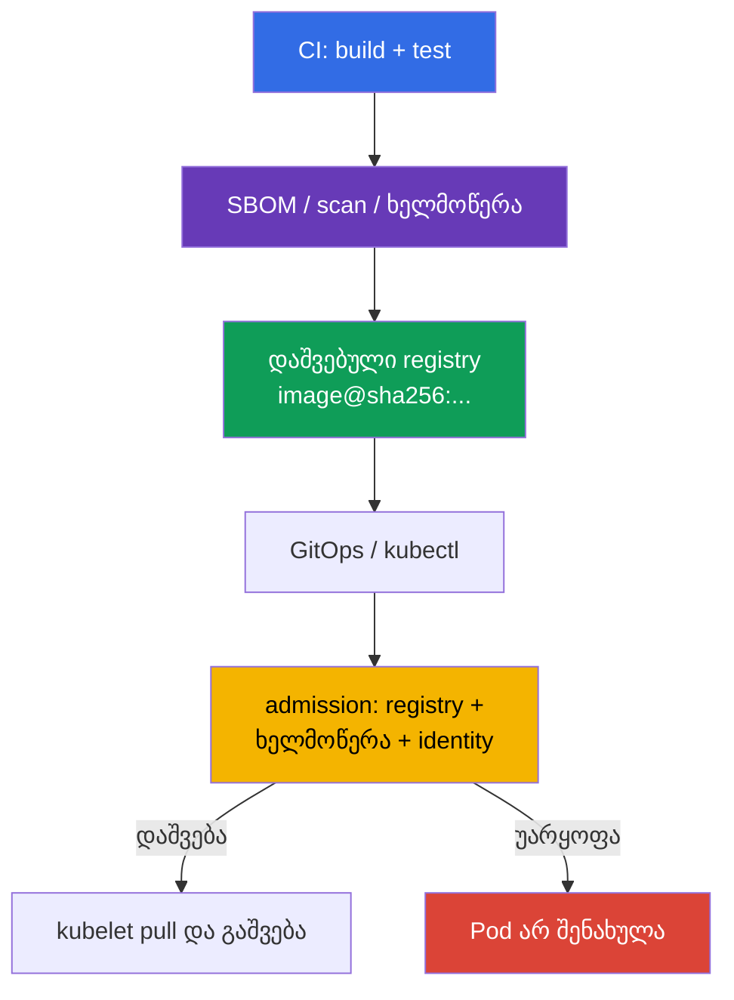

[Русская версия](ru.md) · [Eng version](README.md) · [Versión en español](es.md) · [Version française](fr.md) · [Deutsche Version](de.md) · [繁體中文版](tw.md) · [日本語版](jp.md)

# თავი 26. Supply chain-ის დაცვა: რეესტრები, ხელმოწერა და არტეფაქტების ვალიდაცია

> **პრობლემა.** შემტევმა, რომელსაც აქვს push უფლება registry-ში ან წვდომა CD-ზე, შეუძლია
> ჩაანაცვლოს mutable tag და გაუშვას სხვისი image გარე ან თუნდაც ჩვეული შიდა
> repository-დან. წარმატებული pull არ ადასტურებს, რომ ეს ბაიტები აშენა სანდო
> pipeline-მა, ხოლო allowlist signature verification-ის გარეშე ვერ შეაჩერებს
> ხელმოუწერელ artifact-ს. საჭიროა immutable digest, publisher-ის შემოწმება და
> fail-closed admission Pod-ის შენახვამდე.

> **რა არის შემდეგ.** [თავში 25](../25/ge.md) განვსაზღვრეთ, საიდან ჩნდება dependency-ები,
> SBOM და არტეფაქტები. ახლა ვაშენებთ ბოლო ბარიერს გაშვებამდე: კლასტერი იღებს
> მხოლოდ image-ებს დაშვებული registry-ებიდან და მხოლოდ იმ immutable digest-ს, რომლის
> წარმომავლობა და ხელმოწერა დადასტურებულია. ეს არის **Supply Chain Security**-ის
> დომენი CKS-ში (20%).
>
> **რა უნდა იცოდეთ CKA-დან.** მოთხოვნის გზა admission-ის გავლით განხილულია
> [CKA-ს თავში 21](../../../cka/course/21/ge.md), ხოლო image, tag, digest და
> Dockerfile - [CKA-ს თავში 23](../../../cka/course/23/ge.md). აქ ეს მექანიზმები
> გამოიყენება როგორც security control: tag არ არის შემცველობის მტკიცებულება, ხოლო
> წარმატებული `docker pull` არ ნიშნავს, რომ image დაშვებულია გასაშვებად.

> **ხელმოწერის მარტივი იდეა.** ის პასუხობს ერთ კითხვას: **ვინ დაამტკიცა სწორედ ეს
> image-ის ბაიტები?** Pipeline ჯერ აფიქსირებს immutable digest-ს - შემცველობის
> ანაბეჭდს, შემდეგ ხელს აწერს ამ digest-ს. გაშვებამდე verifier ადარებს image-ის
> digest-ს ხელმოწერასთან და რწმუნდება, რომ signer სანდოა. თუ tag ახლა სხვა ბაიტებზე
> მიუთითებს, ძველი ხელმოწერა უკვე აღარ ერგება. ხელმოწერა არ შიფრავს image-ს და არ
> ანაცვლებს malware/CVE-ზე scan-ს: ის ადასტურებს publisher-ის identity-ს კონკრეტული
> შემცველობისთვის.

> 🧠 Trust decision მიიღება `Pod`-ის შენახვამდე: registry allowlist პასუხისმგებელია image-ის წყაროზე, ხელმოწერა - სანდო publisher-ზე, ხოლო digest აფიქსირებს შემცველობას.

## 26.1. რის დაცვაა საჭირო ზუსტად

Supply chain იწყება Kubernetes-მდე: source code და CI აშენებენ image-ს, registry ინახავს
მას და ხელმოწერას, GitOps ან `kubectl` გადასცემს reference-ს API-სერვერს, ხოლო admission
წყვეტს, დაუშვას თუ არა Pod. თუ ნებისმიერი ეტაპი ჩანაცვლდა, კორექტულმა manifest-მა
შეიძლება გაუშვას სხვისი კოდი.



ორი დამოუკიდებელი თვისება არ უნდა აირიოს ერთმანეთში:

- **registry-ების allowlist** პასუხობს, *საიდან* არის დაშვებული image-ის აღება: მაგალითად,
  `registry.example.com/platform/*`;
- **ხელმოწერის შემოწმება** პასუხობს, *ვინ და რომელი digest-ისთვის* გამოუშვა artifact;
- **digest** აფიქსირებს ბაიტებს. `:1.4.2` - ცვლადი სახელია, მაშინ როცა
  `@sha256:<digest>` აკავშირებს deployment-ს დამოწმებულ manifest-თან.

ამიტომ `registry.example.com/platform/api:1.4.2` production rollout-მდე უნდა გახდეს
`registry.example.com/platform/api:1.4.2@sha256:<დამოწმებული-digest>`. Allowlist არ
ანაცვლებს signature verification-ს: შემტევს, რომელსაც აქვს push უფლება სანდო
registry-ში, კვლავ შეუძლია იქ ხელმოუწერელი image-ის მოთავსება. ხელმოწერა, თავის
მხრივ, არ კრძალავს დაუმტკიცებელი registry-ის გამოყენებას.

> 🎯 დანერგეთ fail-closed admission allowlist საჭირო registry/repository-სთვის და შეამოწმეთ normal, init და ephemeral container-ები. Kubernetes v1.36-ში ცალკე გაითვალისწინეთ `spec.volumes[].image.reference`: სანამ verifier ვერ ამოწმებს ასეთ OCI artifact-ს დამტკიცებადად, დაცულ namespace-ში უსაფრთხოა image volumes-ის უარყოფა. Native `ValidatingAdmissionPolicy` და Gatekeeper - ამ ამოცანის პირდაპირი გზებია.

## 26.2. Registry-ების allowlist native ValidatingAdmissionPolicy, Kyverno და Gatekeeper-ის მეშვეობით

### Native `ValidatingAdmissionPolicy`: მარტივი allowlist CEL-ზე

Registry-ის მარტივი allowlist-ისთვის Kubernetes გვთავაზობს native `ValidatingAdmissionPolicy`-ს
(VAP): მექანიზმი, რომელიც stable-ია Kubernetes 1.30-დან და არ საჭიროებს მესამე მხარის
admission webhook-ს. ის შესაფერისია image-ის prefix/ფორმატის CEL-შემოწმებისთვის, მაგრამ
**არ ანაცვლებს Cosign-ის ან Notary-ის კრიპტოგრაფიულ შემოწმებას**: VAP არ ადასტურებს,
ვინ მოაწერა ხელი კონკრეტულ digest-ს. ქვემოთ მოცემული policy ერთნაირად მოიცავს ჩვეულ,
init- და ephemeral-კონტეინერებს; `pods/ephemeralcontainers` საჭიროა `kubectl debug`-ის
გავლით გვერდის ავლის აკრძალვისთვის. ის ასევე fail-closed უარყოფს image volumes-ს:
Kubernetes v1.36-ში `spec.volumes[].image.reference` - ცალკე OCI-reference-ია, არა
კონტეინერი.

```yaml
apiVersion: admissionregistration.k8s.io/v1
kind: ValidatingAdmissionPolicy
metadata:
  name: allow-approved-platform-registry
spec:
  failurePolicy: Fail
  matchConstraints:
    resourceRules:
    - apiGroups: [""]
      apiVersions: ["v1"]
      operations: ["CREATE", "UPDATE"]
      resources: ["pods", "pods/ephemeralcontainers"]
  validations:
  - message: "დაშვებულია მხოლოდ registry.example.com/platform/-ის container image-ები; image volumes აკრძალულია."
    expression: >-
      object.spec.containers.all(c, c.image.startsWith("registry.example.com/platform/")) &&
      (!has(object.spec.initContainers) || object.spec.initContainers.all(c,
        c.image.startsWith("registry.example.com/platform/"))) &&
      (!has(object.spec.ephemeralContainers) || object.spec.ephemeralContainers.all(c,
        c.image.startsWith("registry.example.com/platform/"))) &&
      (!has(object.spec.volumes) || !object.spec.volumes.exists(v, has(v.image)))
---
apiVersion: admissionregistration.k8s.io/v1
kind: ValidatingAdmissionPolicyBinding
metadata:
  name: allow-approved-platform-registry
spec:
  policyName: allow-approved-platform-registry
  validationActions: [Deny]
  matchResources:
    namespaceSelector:
      matchLabels:
        registry-policy: enforced
```

მონიშნეთ სატესტო namespace ლეიბლით `registry-policy: enforced` (`kubectl label namespace
<ns> registry-policy=enforced`), სანამ `namespaceSelector`-ს გაავრცელებთ მთელ კლასტერზე:
`matchResources.namespaceSelector`-ის გარეშე Binding-ში policy მაშინვე ხდება cluster-wide
და შეეხება ყველა შესაბამის Pod-ს, არა მხოლოდ არჩეულ namespace-ს.

VAP, ისევე როგორც Pod-only Gatekeeper Constraint, უარყოფს controller-ის მიერ შექმნილ
Pod-ს; თავად Deployment-ის ადრეული უარყოფისთვის საჭიროა მისი template-ის ცალკე
CEL-წესები. ჯერ გამოიყენეთ policy სატესტო namespace-ში და შეამოწმეთ normal/init/ephemeral
container-ების image-ები, ასევე Pod `spec.volumes[].image`-ით: ეს მაგალითი უნდა
უარყოფდეს image volume-ს. Signature-ის მოთხოვნებისთვის დატოვეთ შემდეგი
`ImageValidatingPolicy` ან სხვა კრიპტოგრაფიული verifier.

შემოწმება უნდა მოიცავდეს `containers`-ს, `initContainers`-ს და, თუ ისინი დაშვებულია,
`ephemeralContainers`-ს: სხვაგვარად init- ან debug-კონტეინერი გახდება policy-ის
გვერდის ავლა. Kubernetes v1.36-ში ცალკე დაამუშავეთ `spec.volumes[].image.reference`:
ეს არცერთი სამი მასივის ელემენტი არ არის.

> **⚠️ ვერსიის დელტა.** Exam snapshot v1.35-ში `spec.volumes[].image` ჯერ კიდევ Beta-შია, თუმცა `ImageVolume` ჩართულია default-ად. უფრო ძველ კლასტერზე ან გამორთული gate-ის შემთხვევაში ჯერ შეამოწმეთ API schema და validation policy; ნუ წაშლით image volume-ის fail-closed დაფარვას მხოლოდ მიმდინარე workload-ის არარსებობის გამო.

Pod-only policy თავად ამოწმებს მხოლოდ Pod-ს. იმისთვის, რომ Kyverno-ს `ValidatingPolicy`
უარყოფდეს Deployment-ს და სხვა workload-კონტროლერებს Pod-ის შექმნამდე, ცალსახად
ჩართეთ `spec.autogen.podControllers`; მის გარეშე controller მიღებული იქნება, ხოლო
უარყოფა მოხდება მხოლოდ Pod-ის შექმნისას. დაიწყეთ Audit რეჟიმით, გამოასწორეთ
არსებული manifest-ები, შემდეგ გადაიყვანეთ წესი Enforce-ში.

> 🔬 Kyverno - ალტერნატიული policy engine-ია დამატებითი შესაძლებლობებით; გამოიყენეთ ის, როცა ეს მითითებულია გარემოში ან უკვე პლატფორმის სტანდარტია.

### Kyverno 1.19 (chart 3.9.0, installed release)

> **თავსებადობის შენიშვნა.** კურსის ძირითადი exam/lab track -- Kubernetes v1.35: Kyverno
> v1.19 ოფიციალურად უჭერს მხარს Kubernetes v1.33-v1.35-ს. კურსის საერთო training baseline
> (lab-ინფრასტრუქტურა, `env.hcl`) -- Kubernetes v1.36, ამიტომ ეს ლაბა -- წინდახედული
> ვარიანტია Kyverno 1.19-ის ტესტირებული support matrix-ის მიღმა (იხ. თავი
> 20 §20.4). ნუ აურევთ სამ დამოუკიდებელ კონტურს: exam-ვერსია, კლასტერის training-ვერსია
> და კონკრეტული ინსტრუმენტის vendor-supported ვერსია შეიძლება ერთდროულად განსხვავდებოდეს.
>
> ლაბები 108 და 111 აყენებენ Kyverno-ს Helm chart-ით `3.9.0`, რაც შეესაბამება release-ს
> **Kyverno 1.19.0**. ცნობილი upstream defect [#16947](https://github.com/kyverno/kyverno/issues/16947)
> ეხება სწორედ `ImageValidatingPolicy`-ს: `pods/ephemeralcontainers`-ისთვის მისი validating
> handler არ იყენებს `validations`-ს, თუმცა webhook და image verification გამოიძახება; issue
> მონიშნულია milestone-ით `1.19.2`. ამიტომ pinned 1.19.0-ზე ნუ ჩათვლით გარანტირებულად
> უარყოფით `kubectl debug` ტესტს **ხელმოწერისთვის** (დეტალები §26.5-ში).
> ეს შეზღუდვა არ ვრცელდება ჩვეულებრივ `ValidatingPolicy`-ზე: ქვემოთ მოცემული policy
> იღებს admission review-ს `pods/ephemeralcontainers`-ისთვის და იყენებს CEL allowlist-ს.

ძირითადი გზა იყენებს CEL-ზე დაფუძნებულ `ValidatingPolicy`-ს `policies.kyverno.io/v1`-დან.
ცვლადი აერთიანებს კონტეინერების სამივე სიას; resource `pods/ephemeralcontainers`
საჭიროა, რომ იგივე შემოწმება შესრულდეს `kubectl debug`-ის დროსაც. Native VAP-ის
მსგავსად, ეს ვარიანტიც ცალკე კრძალავს image volumes-ს, სანამ მათთვის არჩეული არ
არის verifier `spec.volumes[].image.reference`-ის დადასტურებული მხარდაჭერით.

```yaml
apiVersion: policies.kyverno.io/v1
kind: ValidatingPolicy
metadata:
  name: allow-approved-registries
spec:
  validationActions: [Deny]
  autogen:
    podControllers:
      controllers: [deployments, daemonsets, statefulsets, jobs, cronjobs]
  matchConstraints:
    resourceRules:
    - apiGroups: [""]
      apiVersions: ["v1"]
      operations: ["CREATE", "UPDATE"]
      resources: ["pods", "pods/ephemeralcontainers"]
  variables:
  - name: allContainers
    expression: >-
      object.spec.containers +
      object.spec.?initContainers.orValue([]) +
      object.spec.?ephemeralContainers.orValue([])
  validations:
  - message: "დაშვებულია მხოლოდ registry.example.com/platform/-ის image-ები."
    expression: >-
      variables.allContainers.all(container,
        container.image.startsWith("registry.example.com/platform/"))
  - message: "Image volumes აკრძალულია, სანამ მათთვის დამტკიცებული verifier არ გამოჩნდება."
    expression: >-
      !has(object.spec.volumes) || !object.spec.volumes.exists(volume, has(volume.image))
```

შეამოწმეთ დადებითი და უარყოფითი შემთხვევები rollout-მდე:

```bash
kubectl apply -f allowed-pod.yaml
kubectl apply -f forbidden-pod.yaml  # მოსალოდნელია admission denial
kubectl debug allowed-pod --image=registry.example.com/other-team/debug:1.0 --target=app
# მოსალოდნელია: admission denial — ჩვეულებრივი ValidatingPolicy ამოწმებს
# pods/ephemeralcontainers-ს და უარყოფს არასწორ repository prefix-ს.
kubectl get policyreport -A          # თუ კლასტერში ჩართულია Policy Reports
```

პრეფიქსი ტესტში მნიშვნელოვანია: ეს Kyverno `ValidatingPolicy` ამოწმებს მხოლოდ
`registry.example.com/platform/*`-ს, ამიტომ თავად policy-ის შესამოწმებლად საჭიროა
image შესაბამისი registry-დან არასწორი გზით მასში, და არა ნებისმიერი სხვა registry.

ნუ დაამატებთ `docker.io`-ს მთლიანად „დროებით": ეს allowlist-ს allow-all-ად აქცევს.
სისტემური კომპონენტებისთვის დააფიქსირეთ ვიწრო ცალკეული prefix-ები, მაგალითად
`registry.k8s.io/*`, და დააფიქსირეთ გამონაკლისი ცვლილების შემოწმებისას.

Legacy `ClusterPolicy` `foreach`-ით ეხება მხოლოდ მიგრაციის მასალას: Kyverno 1.19-ში
ეს ტიპი deprecated-ია, ხოლო 1.20-ში დაგეგმილია მისი წაშლა.

### OPA Gatekeeper

Gatekeeper ჰყოფს ConstraintTemplate-ის ლოგიკას კონკრეტული Constraint-ისგან. ქვემოთ
მოცემული template ამოწმებს regular, init და ephemeral container-ებს და უარყოფს
image volumes-ს, სანამ `spec.volumes[].image.reference`-ისთვის არ არის დანერგილი
ცალკე დამტკიცებული verifier. მისი `match` შემოსაზღვრულია `Pod`-ით: ასეთი Constraint
**არ უარყოფს თავად Deployment-ს**. ის უარყოფს Pod-ს, რომელსაც მოგვიანებით შექმნის
controller; ადრეული უარყოფისთვის დაამატეთ ცალკე წესები workload template-ებისთვის.
`kubectl debug`-ისთვის Gatekeeper webhook-მა უნდა მიიღოს `UPDATE` subresource
`pods/ephemeralcontainers`, ხოლო ქვემოთ მოცემული Rego ზუსტად ამ კონტექსტს ამოწმებს.

```yaml
apiVersion: templates.gatekeeper.sh/v1
kind: ConstraintTemplate
metadata:
  name: k8sallowedrepos
spec:
  crd:
    spec:
      names:
        kind: K8sAllowedRepos
      validation:
        openAPIV3Schema:
          type: object
          properties:
            repos:
              type: array
              items:
                type: string
  targets:
  - target: admission.k8s.gatekeeper.sh
    rego: |
      package k8sallowedrepos

      import rego.v1

      violation contains {"msg": msg} if {
        container := input.review.object.spec.containers[_]
        not starts_with_allowed(container.image, input.parameters.repos)
        msg := sprintf("image %q is not from an approved registry", [container.image])
      }

      violation contains {"msg": msg} if {
        container := input.review.object.spec.initContainers[_]
        not starts_with_allowed(container.image, input.parameters.repos)
        msg := sprintf("init image %q is not from an approved registry", [container.image])
      }

      violation contains {"msg": msg} if {
        input.review.operation == "UPDATE"
        input.review.subResource == "ephemeralcontainers"
        container := input.review.object.spec.ephemeralContainers[_]
        not starts_with_allowed(container.image, input.parameters.repos)
        msg := sprintf("ephemeral image %q is not from an approved registry", [container.image])
      }

      violation contains {"msg": msg} if {
        volume := input.review.object.spec.volumes[_]
        volume.image
        msg := "image volumes are not allowed until their OCI references have verified policy coverage"
      }

      starts_with_allowed(image, repos) if {
        repo := repos[_]
        startswith(image, repo)
      }
---
apiVersion: constraints.gatekeeper.sh/v1beta1
kind: K8sAllowedRepos
metadata:
  name: approved-platform-images
spec:
  match:
    kinds:
    - apiGroups: [""]
      kinds: ["Pod"]
  parameters:
    repos:
    - "registry.example.com/platform/"
```

სავალდებულო enforcement-ისთვის დააინსტალირეთ Gatekeeper `validatingWebhookFailurePolicy: Fail`-ით
და ინსტალაციის შემდეგ შეამოწმეთ რეალური კონფიგურაცია:

```yaml
# values.yaml Gatekeeper-ის Helm chart-ისთვის
validatingWebhookFailurePolicy: Fail
```

```bash
kubectl get validatingwebhookconfiguration gatekeeper-validating-webhook-configuration \
  -o jsonpath='{range .webhooks[*]}{.name}{"\t"}{.failurePolicy}{"\n"}{end}'
```

chart-ის ნაგულისხმევი მნიშვნელობა შეიძლება იყოს `Ignore`, ანუ მიუწვდომელი webhook
გაატარებს მოთხოვნას. სატესტო გარემოში მიზანმიმართულად შეამოწმეთ, რომ მიუწვდომელი
webhook-ის შემთხვევაში მოთხოვნა უარყოფილია. `Fail` მოითხოვს Gatekeeper-ის HA-ს,
მონიტორინგს და ხელმისაწვდომობას: სხვაგვარად მას შეუძლია დაბლოკოს ახალი Pod-ები
controller-ის ავარიის დროს.

Kyverno მოსახერხებელია, როცა policy ასევე უნდა ამუტირებდეს manifest-ებს ან
ნატიურად ამოწმებდეს ხელმოწერებს. Gatekeeper მოსახერხებელია, როცა ორგანიზაციამ
სტანდარტიზა Rego და Constraints. ნუ დააინსტალირებთ ორივე ძრავას ერთი და იმავე
სავალდებულო შემოწმებისთვის ცალსახა owner-ისა და შეთანხმებული მიგრაციის თანმიმდევრობის
გარეშე: ორმაგი denial-შეტყობინებები ართულებს დიაგნოსტიკას, ხოლო ორი განსხვავებული
allowlist ერთმანეთისგან შორდება.

> 🎯 `ImagePolicyWebhook` - exam-oriented admission მექანიზმია: API-სერვერი გადასცემს allow/deny გადაწყვეტილებას backend-ს, რომელიც უნდა იყოს ხელმისაწვდომი და fail-closed კონფიგურირებული.

## 26.3. ImagePolicyWebhook: backend და API-სერვერის კონფიგურაცია

`ImagePolicyWebhook` - API-სერვერის admission plugin-ია. ყოველ admission-მოთხოვნაზე
container image-ებით ის უგზავნის `ImageReview`-ს გარე HTTPS backend-ს; backend პასუხობს
`allowed: true`-ით ან `false`-ით და შეუძლია დააბრუნოს მიზეზი და audit annotations. ეს
ცენტრალიზებს გადაწყვეტილებას manifest-ების მიღმა, მაგრამ backend ხდება API-სერვერის
კრიტიკული გზის ნაწილი. `ImageReview` მოიცავს `containers`-ს, `initContainers`-ს და
`ephemeralContainers`-ს, მაგრამ არა `spec.volumes[].image.reference`-ს; ამიტომ ნუ
გახდით ამ plugin-ს ერთადერთ supply chain-კონტროლად, თუ image volumes დაშვებულია. ამ
თავის მაგალითებში native policy/Gatekeeper უარყოფს image volumes-ს fail-closed
რეჟიმში.

```mermaid
sequenceDiagram
    participant C as kubectl / GitOps
    participant A as kube-apiserver
    participant W as ImagePolicyWebhook backend
    participant E as etcd
    C->>A: create Pod image@digest-ით
    A->>W: ImageReview (images, user, namespace)
    W-->>A: allowed/denied + reason
    alt allowed
        A->>E: Pod-ის შენახვა
    else denied ან backend მიუწვდომელია
        A-->>C: admission error; Pod არ შექმნილა
    end
```

Backend ვალდებულია იყოს ხელმისაწვდომი *API-სერვერიდან* და მიიღოს გადაწყვეტილება
fail-closed რეჟიმში. ქვემოთ არჩეულია mTLS-კონფიგურაცია: API-სერვერი წარადგენს
client certificate-ს, ხოლო backend ამოწმებს მას და CA-ს. mTLS არ არის
`ImagePolicyWebhook`-ის უნივერსალური მოთხოვნა; backend-ის აუთენტიფიკაციის მეთოდი
განისაზღვრება მისი kubeconfig-ითა და ინფრასტრუქტურით. Backend არ უნდა ასრულებდეს
image-ის pull-ს ყოველ მოთხოვნაზე: შეამოწმეთ reference/digest, ხელმოწერა და სანდო
identity, ხოლო შედეგები დაქეშეთ მხოლოდ მოკლე, დასაბუთებული TTL-ით. ხანგრძლივი
allow-cache ხელმოწერის გაუქმების შემდეგ ტოვებს ფანჯარას არასასურველი გაშვებისთვის.

Admission-კონფიგურაციაში დააყენეთ `defaultAllow: false`. ქვემოთ მოცემული გზა და
ფაილების mount ნაჩვენებია kubeadm static Pod-ისთვის; შეცვალეთ რეალური backend
endpoint, CA და client certificate თქვენი ინფრასტრუქტურის მნიშვნელობებით.

```yaml
# /etc/kubernetes/admission-control/image-policy.yaml
apiVersion: apiserver.config.k8s.io/v1
kind: AdmissionConfiguration
plugins:
- name: ImagePolicyWebhook
  configuration:
    imagePolicy:
      kubeConfigFile: /etc/kubernetes/admission-control/image-policy.kubeconfig
      allowTTL: 30
      denyTTL: 30
      retryBackoff: 500
      defaultAllow: false
```

```yaml
# /etc/kubernetes/admission-control/image-policy.kubeconfig
apiVersion: v1
kind: Config
clusters:
- name: image-policy-backend
  cluster:
    certificate-authority: /etc/kubernetes/pki/image-policy/ca.crt
    server: https://image-policy-backend.security.example:8443/imagepolicy
users:
- name: kube-apiserver
  user:
    client-certificate: /etc/kubernetes/pki/image-policy/apiserver.crt
    client-key: /etc/kubernetes/pki/image-policy/apiserver.key
contexts:
- name: image-policy
  context:
    cluster: image-policy-backend
    user: kube-apiserver
current-context: image-policy
```

დაამატეთ plugin `kube-apiserver`-ს და გადაეცით admission-კონფიგურაცია. ნუ ჩაანაცვლებთ
ჩართული admission plugin-ების არსებულ სიას: დაამატეთ `ImagePolicyWebhook` მიმდინარე
მნიშვნელობას, სხვაგვარად შეიძლება შემთხვევით გამორთოთ სავალდებულო ჩაშენებული
კონტროლერები. დამატებით ჩართეთ API `imagepolicy.k8s.io/v1alpha1`, რომელიც იყენებს
`ImageReview`-ს: მის გარეშე ქვემოთ მოცემული fragment არასრულია და backend არ
გამოიძახება. თუ `--runtime-config` უკვე არსებობს, დაამატეთ `imagepolicy.k8s.io/v1alpha1=true`
მის მიმდინარე მნიშვნელობას, სხვა პარამეტრების წაშლის გარეშე.

```yaml
# ფრაგმენტი /etc/kubernetes/manifests/kube-apiserver.yaml-დან
spec:
  containers:
  - name: kube-apiserver
    command:
    - kube-apiserver
    - --enable-admission-plugins=NodeRestriction,ServiceAccount,ImagePolicyWebhook
    - --runtime-config=imagepolicy.k8s.io/v1alpha1=true
    - --admission-control-config-file=/etc/kubernetes/admission-control/image-policy.yaml
    volumeMounts:
    - name: image-policy-config
      mountPath: /etc/kubernetes/admission-control
      readOnly: true
    - name: image-policy-pki
      mountPath: /etc/kubernetes/pki/image-policy
      readOnly: true
  volumes:
  - name: image-policy-config
    hostPath:
      path: /etc/kubernetes/admission-control
      type: DirectoryOrCreate
  - name: image-policy-pki
    hostPath:
      path: /etc/kubernetes/pki/image-policy
      type: DirectoryOrCreate
```

static Pod-ის რედაქტირება გადატვირთავს API-სერვერს. შეინახეთ backup manifest
`/etc/kubernetes/manifests/`-ის **გარეთ** (მაგალითად `/root/k8s-manifest-backup/`-ში):
kubelet-ს შეუძლია ამ დირექტორიაში ნებისმიერი გაფართოებით ფაილი წაიკითხოს, როგორც
კიდევ ერთი static Pod manifest. შეინარჩუნეთ წვდომა control plane-ის კონსოლთან და
წინასწარ შეამოწმეთ backend TLS: არასწორმა endpoint-მა, CA-მ, client key-მა ან
fail-open კონფიგურაციამ შესაბამისად შეიძლება დაბლოკოს ყველა ახალი Pod ან მოხსნას
დაცვა. გადატვირთვის შემდეგ შეამოწმეთ `/readyz`, API-სერვერის ლოგები და ცალსახა
allow/deny ტესტი. ქვემოთ მოცემულია backend-ის მინიმალური კონცეპტუალური პასუხები,
არა ობიექტები `kubectl apply`-სთვის:

```yaml
# allow: reason ცარიელია, auditAnnotations-ს აქვს key-ები prefix-ის გარეშე
apiVersion: imagepolicy.k8s.io/v1alpha1
kind: ImageReview
status:
  allowed: true
  auditAnnotations:
    decision: "approved signed digest"
---
# deny: მოკლე მიზეზი მოხვდება admission error-ში
apiVersion: imagepolicy.k8s.io/v1alpha1
kind: ImageReview
status:
  allowed: false
  reason: "image is not signed by an approved identity"
  auditAnnotations:
    decision: "signature verification failed"
```

ახალი კლასტერისთვის შეადარეთ plugin-ის ხელმისაწვდომობა და მხარდაჭერა Kubernetes-ის
ვერსიას: ეს ძველი სპეციალიზებული მექანიზმია; webhook/policy engine signature
verification-ის მხარდაჭერით ჩვეულებრივ უფრო მარტივია შესანარჩუნებლად.

> 🧪 **პრაქტიკა: CKS Lab 108, დავალებები 2 და 6.** [ლაბა 108](../../labs/108/README_GE.MD)
> ცალკე ავარჯიშებს ცხადი და implicit `latest`-ის აკრძალვას, ხოლო დავალება 6 —
> `ImagePolicyWebhook`-ის სრულ wiring-ს: `defaultAllow: false`, backend `ImageReview`,
> plugin-ის დამატება kube-apiserver-ს, denial `nginx:latest`-ისთვის და allow
> `nginx:1.27.3`-ისთვის. ეს მექანიზმის მოსახერხებელი საგამოცდო შემოწმებაა; production-ში
> მაინც ჩაანაცვლეთ დაშვებული versioned tag digest-ით reference-ით.

> 🎯 შეძლეთ კონკრეტული immutable digest-ის ხელმოწერა და შემოწმება `cosign`-ის მეშვეობით; tag თავისთავად არ არის ნდობის ობიექტი.

## 26.4. Cosign და Sigstore: digest-ის ხელმოწერა და შემოწმება

Cosign ქმნის და ამოწმებს OCI-artifact-ების ხელმოწერებს. მოაწერეთ ხელი **digest**-ს,
რომელიც მიღებულია საკუთარი build/push pipeline-იდან; ნუ ჩასვამთ `latest`-ს ან digest-ს
სხვისი შეტყობინებიდან. ხელმოწერა ინახება artifact-თან ერთად registry-ში, ამიტომ
registry-ის წვდომის კონტროლი და retention ისეთივე მნიშვნელოვანია, როგორც გასაღები.

```bash
IMAGE="${IMAGE:?set image reference}"

# ლაბა: ეს ბრძანება ქმნის ლოკალურ cosign.key/cosign.pub წყვილს.
# აქ შექმნილი private key არ გამოიყენოთ production key-ად და არ დაამატოთ Git-ში.
cosign generate-key-pair

# CI იღებს გასაღებს ხანმოკლედ; პაროლი არ იბეჭდება ლოგებში.
cosign sign --key cosign.key "$IMAGE"

# შემოწმება სანდო public key-ით - deploy-მდე და admission-ზე.
cosign verify --key cosign.pub "$IMAGE"
```

ზემოთ მოცემული `cosign generate-key-pair` - მხოლოდ ლოკალური წყვილია ლაბისთვის.
Production-ში გამოიყენეთ ქვემოთ მოცემული keyless OIDC flow ან ცალკე გასაღები,
შექმნილი და შენახული KMS-ში; ნუ გადაიტანთ ლოკალურად შექმნილ `cosign.key`-ს CI-ში.
`cosign verify`-ის წარმატება ნიშნავს ხელმოწერის კრიპტოგრაფიულ შემოწმებას მითითებული
image reference-ისთვის. Policy დამატებით უნდა ზღუდავდეს, **რომელი** public
key/identity არის დასაშვები ამ repository-სთვის. ერთი საერთო გასაღები ყველა
environment-ისა და პროექტისთვის აქცევს ერთი სერვისის CI-ის კომპრომეტაციას რისკად
ყველა დანარჩენისთვის. როტირეთ გასაღებები, გააუქმეთ წვდომა ძველ გასაღებზე და
შეინახეთ audit trail: ვინ, როდის და რომელ digest-ს მოაწერა ხელი.

> 🔬 Keyless flow OIDC-ით, Fulcio-თი და Rekor-ით ამცირებს მუდმივი private key-ის რისკს, მაგრამ მოითხოვს issuer-ისა და release workflow-ის identity-ის ზუსტ შეზღუდვას.

### Keyless: ხანმოკლე identity ლოკალური signing key-ის ნაცვლად

Sigstore-ის keyless flow იღებს ხანმოკლე სერტიფიკატს CI-ის OIDC-აუთენტიფიკაციის შემდეგ
და წერს proof-ს transparency log-ში. ლოკალური private key არ არის საჭირო შექმნა ან
დეველოპერებზე გავრცელება, მაგრამ ნდობა უნდა ჰქონდეს არა „ნებისმიერ სერტიფიკატს",
არამედ release workflow-ის ზუსტ OIDC identity-ს.

```bash
IMAGE="${IMAGE:?set image reference}"

# CI-ში OIDC-ით (მაგალითად, GitHub Actions): ინტერაქტიული დადასტურება არ არის საჭირო.
cosign sign --yes "$IMAGE"

# ვამოწმებთ issuer-ს და subject workflow-ს, და არა მხოლოდ certificate-ის არსებობის ფაქტს.
cosign verify \
  --certificate-oidc-issuer=https://token.actions.githubusercontent.com \
  --certificate-identity-regexp='^https://github\.com/example-org/payments/\.github/workflows/release\.yml@refs/tags/v[0-9].*$' \
  "$IMAGE"
```

GitHub Actions workflow-ისთვის job-ს უნდა მიეცეს უფლება `id-token: write`; ეს არ არის
registry-ში push-ის უფლება და არ ანაცვლებს scoped registry credential-ს. Identity-ის
შეზღუდვა უნდა მოიცავდეს ორგანიზაციას, repository-ს, workflow-ს და შესაბამის
ref/environment-ს. ზედმეტად ფართო `--certificate-identity-regexp='.*'` აქცევს
keyless verification-ს თითქმის უაზროდ: ნებისმიერ OIDC-მომხმარებელს, რომელსაც
verifier მიიღებს, შეეძლება image-ის ხელმოწერა.

> 🎯 ხელმოწერის შემოწმება სავალდებულო ხდება მხოლოდ admission გზაზე: CI-ში ლოკალურად წარმატებული შემოწმება არ უშლის ხელს პირდაპირ `kubectl apply`-ს.

## 26.5. ხელმოწერის შემოწმება admission-ზე და Notary

Deployment-მდე შემოწმება სასარგებლოა, მაგრამ არ არის enforcement: მომხმარებელს
შეუძლია გვერდი აუაროს ლოკალურ CI script-ს და პირდაპირ მიმართოს API-ს. ამიტომ
შემოწმება უნდა მდებარეობდეს admission გზაზე. Kyverno 1.19-ში ამას აკეთებს CEL-ზე
დაფუძნებული `ImageValidatingPolicy`; legacy `ClusterPolicy.verifyImages` დარჩენილია
მხოლოდ მიგრაციისთვის. ნუ ჩათვლით ამ policy-ს `spec.volumes[].image.reference`-ის
შემოწმების მაგალითად: ამ თავში image volumes უკვე fail-closed უარყოფილია
allowlist policy-ით, სანამ მათთვის verifier-ის მხარდაჭერა არ დადასტურდება.

**საგამოცდო ბირთვი** - repository-ის allowlist, immutable digest, fail-closed
admission და denial-ის დიაგნოსტიკა. Kyverno-ს `ImageValidatingPolicy`, Notary და
ხელმოწერილი SBOM/in-toto attestations - **production extension**: ისინი აკავშირებენ
policy-ს სანდო signer-სა და release evidence-თან. მაგალითში private key არ ხვდება
კლასტერში.

```yaml
apiVersion: policies.kyverno.io/v1
kind: ImageValidatingPolicy
metadata:
  name: require-signed-platform-images
spec:
  failurePolicy: Fail
  validationActions: [Deny]
  matchConstraints:
    resourceRules:
    - apiGroups: [""]
      apiVersions: ["v1"]
      operations: ["CREATE", "UPDATE"]
      resources: ["pods", "pods/ephemeralcontainers"]
  matchImageReferences:
  - glob: "registry.example.com/platform/*"
  validationConfigurations:
    mutateDigest: true
    required: true
    verifyDigest: true
  attestors:
  - name: releaseKey
    cosign:
      key:
        data: |-
          -----BEGIN PUBLIC KEY-----
          <release-ხელმომწერის-საჯარო-გასაღები>
          -----END PUBLIC KEY-----
  - name: releaseNotary
    notary:
      certs:
        value: |-
          -----BEGIN CERTIFICATE-----
          <notary-release-ხელმომწერის-x.509-სერტიფიკატი>
          -----END CERTIFICATE-----
  attestations:
  - name: signedSbom
    referrer:
      type: sbom/cyclone-dx
  validations:
  - message: "Image must have a valid release signature"
    expression: >-
      (images.containers + images.?initContainers.orValue([]) +
      images.?ephemeralContainers.orValue([])).map(image,
        verifyImageSignatures(image, [attestors.releaseKey, attestors.releaseNotary]) > 0).all(ok, ok)
  - message: "Image must have a signed CycloneDX SBOM for this digest"
    expression: >-
      (images.containers + images.?initContainers.orValue([]) +
      images.?ephemeralContainers.orValue([])).map(image,
        verifyAttestationSignatures(image, attestations.signedSbom, [attestors.releaseKey]) > 0).all(ok, ok)
```

`failurePolicy: Fail` ობიექტს არ უშვებს შემოწმების შეცდომის შემთხვევაში. თუმცა
დაინსტალირებულ Kyverno 1.19.0-ში `ImageValidatingPolicy`-ის ცნობილი დეფექტი
`pods/ephemeralcontainers`-ისთვის არ იძლევა გარანტიას, რომ მისი `validations`
გამოყენებული იქნება `kubectl debug`-ზე (upstream #16947 მიუთითებს fix milestone-ს
`1.19.2`; იხ. ასევე თავსებადობის შენიშვნა §26.2-ში). ამიტომ ამ pinned release-ის
სავალდებულო positive/negative ტესტებია normal და init container. ქვემოთ მოცემული
მოთხოვნის შესრულება დასაშვებია მხოლოდ როგორც ემპირიული თავსებადობის ტესტი; ნუ
ჩაინიშნავთ წინასწარ მოსალოდნელ denial-ს და ნუ დაეყრდნობით მას approved-registry-ის
ხელმოუწერელი debug-კონტეინერის enforcement-ისთვის, სანამ ლაბა არ დააყენებს
გამოსწორებულ ვერსიას და შედეგი არ დასტურდება თქვენი ტესტით.

```bash
kubectl debug allowed-pod --image=registry.example.com/platform/debug@sha256:<digest> --target=app
# მხოლოდ empirical test pinned Kyverno 1.19.0-სთვის: შედეგი დააფიქსირეთ evidence-ში.
kubectl debug allowed-pod --image=registry.example.com/platform/debug:unsigned --target=app
```

ცალკე შეამოწმეთ image სხვისი registry-დან (`registry.example.com/other-team/debug:1.0`
ან მსგავსი) — ასეთ მოთხოვნას უარყოფს წინა განყოფილების allowlist VAP, სანამ ის
ხელმოწერის შემოწმებამდე მიაღწევდეს; ამ ImageValidatingPolicy-სთვის ის არ შედის
`matchImageReferences`-ში და არ ამოწმებს მის CEL-წესებს.
`validationConfigurations` ჯერ აძლევს Kyverno-ს უფლებას, დაამატოს digest, შემდეგ
მოითხოვს და ამოწმებს მას; ამიტომ signature და `signedSbom` ეხება ერთსა და იმავე
immutable digest-ს. `releaseNotary` - native Notary attestor-ია, ხოლო signature-ის
პირობა უშვებს ერთ-ერთს ცალსახად არჩეული trust root-იდან; ნუ აურევთ მათ
დოკუმენტირებული მიგრაციის პერიოდის გარეშე. Keyless-ისთვის სტატიკური key-ის ნაცვლად
დააკონფიგურირეთ `cosign.keyless.identities` კონკრეტული CI workflow-ის ზუსტი
issuer-ითა და subject-ით. შეამოწმეთ ხელმოწერილი და ხელმოუწერელი digest, არასწორი
signer, არარსებული ხელმოწერილი SBOM და registry-ის მიუწვდომლობა.

> 🔬 Notary/Notation - OCI-ხელმოწერის ალტერნატიული ეკოსისტემაა; Kubernetes-ისთვის მას მაინც სჭირდება ინტეგრაცია, რომელიც აბრუნებს allow/deny admission-ისთვის.

**Notary Project** და CLI `notation` - OCI-ხელმოწერის ალტერნატიული ეკოსისტემაა
X.509 trust store-ებითა და trust policy-ით. `notation verify` სასარგებლოა CI/CD-ში:

```bash
notation cert add --type ca --store platform-ca company-root-ca.pem
notation policy import --force trustpolicy.json
IMAGE="${IMAGE:?set image reference}"
notation verify "$IMAGE"
```

Notary თავისთავად არ არის Kubernetes-ის admission controller. მისი trust policy
უნდა გარდაიქმნას policy controller-ის ან webhook backend-ის შემოწმებად, რომელიც
API-სერვერს აბრუნებს allow/deny-ს. ნუ მოითხოვთ, რომ ერთმა verifier-მა „ავტომატურად
გაიგოს" ყველაფერი: Cosign/Sigstore და Notary/Notation იყენებენ ნდობის სხვადასხვა
მოდელს. აირჩიეთ სტანდარტი კონკრეტული repository-სთვის, დააფიქსირეთ trust root,
დაშვებული identity-ები და rotation-ის პროცედურა, ხოლო მიგრაცია აწარმოეთ ორმაგი
ხელმოწერისა და ორმაგი შემოწმების ცალსახა პერიოდით.

> 🏭 End-to-end პროცესი აერთიანებს build-ს, scan-ს, SBOM/attestations-ს, ხელმოწერას, digest-ით deployment-ს და fail-closed admission-ს audit evidence-თან ერთად.

## 26.6. დასამოწმებელი production-პროცესი

### როგორ გამოიყენება ეს production-ში

მინიმალურად უსაფრთხო pipeline ასე გამოიყურება:

1. CI აშენებს რეპროდუცირებად image-ს, ასკანერებს მას და push-ის შემდეგ იღებს digest-ს.
2. CI ქმნის SBOM/attestations-ს და ხელს აწერს ამ digest-ს გასაღებით ან keyless OIDC identity-ით.
3. Deployment-ის reference იყენებს იმავე digest-ს; allowlist უშვებს მხოლოდ საჭირო
   registry/repository-ს, ხოლო image volumes ან ცალსახად მოწმდება ცალკე verifier-ით,
   ან fail-closed იკრძალება.
4. Admission ადარებს registry-ს, digest-სა და ხელმოწერას შეზღუდულ trusted identity-სთან
   და fail-closed უარყოფს შემოწმების შეცდომას.
5. CI-ის, registry-ისა და admission-ის ლოგები აკავშირებენ commit-ს, workflow run-ს,
   digest-სა და გადაწყვეტილებას.

დიაგნოსტიკა დაიწყეთ ფაქტებით, და არა policy-ის შერბილებით. პირდაპირი `Pod` CREATE,
რომელიც უარყოფილია admission-ის მიერ, არ ინახება, ამიტომ პირველადი evidence არის
თავად ბრძანების პასუხი, და არა `kubectl describe pod`:

```bash
kubectl apply -f pod.yaml 2>&1 | tee /tmp/admission-denial.txt
kubectl get pod "${POD:?set pod}" && kubectl describe pod "$POD"  # მხოლოდ თუ Pod არსებობს
kubectl get events -A --sort-by=.lastTimestamp
kubectl describe rs/my-replicaset         # Pod-ისთვის, რომელსაც ქმნის controller: ეძებეთ FailedCreate
cosign verify --key cosign.pub "$IMAGE"
kubectl logs -n kyverno deploy/kyverno-admission-controller
```

controller-ის მიერ მართული Pod-ისთვის შეამოწმეთ Events და `FailedCreate`
ReplicaSet/Job-ზე, ხოლო სრული trace-ისთვის — API-სერვერის audit და შესაბამისი
admission controller-ის ლოგები.

თუ ლეგიტიმური deployment უარყოფილია, შეამოწმეთ მისი digest, repository prefix,
signer identity, სერტიფიკატი/გასაღები და ქსელი/TLS registry-მდე. ნუ გამოასწორებთ
ინციდენტს დროებითი `validationActions: [Audit]`-ით, `failurePolicy: Ignore`-ით ან
ფართო allowlist-ით production-ში: ასე გაქრება სწორედ ის კონტროლი, რომელმაც უნდა
აღმოაჩინოს compromise. საგანგებო გამონაკლისისთვის გამოიყენეთ ხანმოკლე,
namespace- და digest-ზე შეზღუდული გადაწყვეტილება owner-ით, ვადითა და შემდგომი
წაშლით.

## 26.7. მინი-ლექსიკონი

- **Registry allowlist** - policy, რომელიც image-ს უშვებს მხოლოდ განსაზღვრული registry/repository prefix-ებიდან.
- **Digest** - კონკრეტული OCI manifest/artifact-ის immutable SHA-256 identifier.
- **Cosign** - Sigstore-ის ინსტრუმენტი OCI-artifact-ების ხელმოწერისა და შემოწმებისთვის.
- **Keyless signing** - ხელმოწერა ხანმოკლე სერტიფიკატით, გაცემული OIDC-აუთენტიფიკაციის შემდეგ, მუდმივი ლოკალური signing key-ის ნაცვლად.
- **ImagePolicyWebhook** - admission plugin, რომელიც image-ებზე გადაწყვეტილებას გადასცემს გარე backend-ს `ImageReview`-ის მეშვეობით.
- **Admission verification** - სავალდებულო provenance/ხელმოწერის შემოწმება Pod-ის API-სერვერის მიერ შენახვამდე.
- **Notary Project / Notation** - OCI-ხელმოწერის ეკოსისტემა X.509 trust policy-ით; Kubernetes-ის enforcement-ისთვის მას სჭირდება admission-ინტეგრაცია.

## 26.8. თავის შეჯამება

- Registry-ების allowlist და ხელმოწერის შემოწმება წყვეტს სხვადასხვა ამოცანას და უნდა მუშაობდეს ერთად.
- Kyverno-ს და Gatekeeper-ს შეუძლიათ დაუშვებელი container image reference-ების აკრძალვა; შემოწმება
  უნდა ითვალისწინებდეს ჩვეულ, init- და ephemeral-კონტეინერებს, ხოლო `spec.volumes[].image.reference`
  — ცალსახად უნდა ამოწმებდეს ცალკე verifier ან fail-closed კრძალავდეს.
- `ImagePolicyWebhook` მოითხოვს დაცულ, ხელმისაწვდომ backend-ს, API-სერვერის
  კონფიგურაციას და fail-closed `defaultAllow: false`-ს; mTLS მაგალითში - backend-ის
  აუთენტიფიკაციის არჩეული ვარიანტია.
- Cosign ხელს აწერს და ამოწმებს immutable digest-ს; private key არ უნდა მოხვდეს Git-ში,
  manifest-ში ან cluster policy-ში.
- Keyless Sigstore verification ენდობა კონკრეტულ OIDC issuer-სა და CI workflow identity-ს,
  და არა ნებისმიერ სერტიფიკატს.
- Admission enforcement-ს არ ანაცვლებს ლოკალური CI-შემოწმება; Notary/Notation-ს სჭირდება
  ინტეგრაცია, რომელიც აბრუნებს admission allow/deny-ს.

## 26.9. როგორ გამოგადგებათ ეს: გამოცდაზე და რეალურ სამუშაოში

**გამოცდაზე.** მოკლე ბირთვია განსხვავება registry policy-სა, tag-სა და digest-ს შორის,
validating admission-ის კონფიგურაცია ან დიაგნოსტიკა, API-სერვერის admission
კონფიგურაცია და fail-open რისკი. Admission denial-ის პასუხის შენახვისა და ზუსტი
image reference-ის შემოწმების უნარი უფრო სწრაფი და უსაფრთხოა, ვიდრე კონტროლერის
გამორთვა. Kyverno-ს `ImageValidatingPolicy`, Notary და attestations - production
extension-ია, რისთვისაც საკმარისია მათი დანიშნულების გაგება.

**რეალურ სამუშაოში.** ხელმოწერა აკავშირებს production workload-ს release
workflow-სა და კონკრეტულ artifact-თან, ხოლო admission ამ წესს სავალდებულოს ხდის
deployment-ის ყოველი გზისთვის. CI-ის least-privilege უფლებებთან, დაცულ
registry-სთან და audit log-ებთან ერთად, ეს ამცირებს იმ image-ის გაშვების ალბათობას,
რომელმაც არ გაიარა თქვენი pipeline.

> ### 🔴 შემტევის თვალსაზრისი
> **Asset:** production workload-ის reference image-ზე.
> **Starting foothold:** registry-ში push-ის შესრულების შესაძლებლობა ან კომპრომეტირებული CI.
> **Attacker objective:** registry allowlist/admission-შემოწმების გვერდის ავლა, ბოროტმოქმედი image-ის ჩანაცვლებით mutable tag-ის გადამისამართებით, უკვე გაშლილი workload-ების digest-ის შეცვლის გარეშე.
> **Abuse path:** tag-ის გადამისამართება სხვა image-ზე. Digest pinning-ის გარეშე იგივე
> სტრიქონი `registry/app:stable` არ იძლევა იმავე ბაიტების გარანტიას: `imagePullPolicy: Always`-ის
> დროს kubelet ხელახლა წყვეტს tag-ს ყოველ გაშვებაზე; `IfNotPresent`-ის დროს დაქეშილმა
> image-მა შეიძლება დროებით დამალოს ცვლილება, მაგრამ ახალი node ან გასუფთავებული cache
> პირველ pull-ზე მიიღებს ახალ digest-ს; `Never` გამორიცხავს pull-ს, მაგრამ არ არის
> supply chain-verification კონტროლი. `imagePullPolicy` არ ანაცვლებს digest pinning-სა
> და signature/provenance verification-ს.
> **Expected evidence:** შენახული admission denial-ის პასუხი ან audit log; controller-ის მიერ მართული Pod-ისთვის — ასევე `FailedCreate` event owner-ზე.
> **Control:** digest pinning, registry allowlist და admission-ის signature verification ImagePolicyWebhook-ის ან Kyverno-ს მეშვეობით.
> **Retest:** workload digest-ის მიხედვით არ იცვლება tag-ის retarget-ის შემდეგ, ხოლო ხელმოუწერელი image უარყოფილია admission-ის მიერ.

## 26.10. კითხვები თვითშემოწმებისთვის

<details>
<summary>1. რატომ არ ადასტურებს trusted registry-ის allowlist, რომ image შექმნა სანდო CI-მ?</summary>

Allowlist პასუხობს მხოლოდ კითხვას, რომელი registry/repository-დან არის დაშვებული image. მომხმარებელს, რომელსაც აქვს push უფლება ამ trusted registry-ში, კვლავ შეუძლია გამოაქვეყნოს ხელმოუწერელი ან სხვისი artifact. ამიტომ კონკრეტული digest-ის წარმომავლობას ამოწმებენ ხელმოწერითა და ხელმომწერის შეზღუდული identity-ით.
</details>

<details>
<summary>2. რატომ სჭირდება production deployment-ს digest და არა მხოლოდ version tag?</summary>

Version tag - ცვლადი სახელია და შეიძლება გადამისამართდეს სხვა ბაიტებზე manifest-ის შეცვლის გარეშე. `@sha256:...` აფიქსირებს OCI manifest-ს და აკავშირებს deployment-ს იმავე artifact-თან, რომელიც დაისკანერდა და ხელი მოეწერა. `imagePullPolicy` არ ანაცვლებს digest pinning-ს: ახალმა node-მა ან cache miss-მა მაინც შეიძლება სხვაგვარად გადაწყვიტოს mutable tag.
</details>

<details>
<summary>3. რომელი container reference-ები ვალდებულია შეამოწმოს registry policy-მ და რა ვქნათ image volumes-თან?</summary>

Policy-მ უნდა შეამოწმოს `containers`, `initContainers` და `ephemeralContainers`. სხვაგვარად init-კონტეინერი ან `kubectl debug`-ითა და subresource `pods/ephemeralcontainers`-ით დამატებული კონტეინერი გახდება allowlist-ის გვერდის ავლა. ამისთვის წესები ასევე match-ავს საჭირო subresource-ის CREATE/UPDATE-ს. Kubernetes v1.36-ში `spec.volumes[].image.reference` - ცალკე OCI-reference-ია ამ მასივების მიღმა: ის უნდა ცალსახად შემოწმდეს მხარდაჭერილი verifier-ით ან, როგორც თავის მაგალითებში, fail-closed აიკრძალოს image volumes-ისთვის.
</details>

<details>
<summary>4. რომელი TLS-ფაილები და fail-closed პარამეტრები სჭირდება `ImagePolicyWebhook` backend-ს?</summary>

Backend-ის kubeconfig-ში საჭიროა CA `certificate-authority`-ში, ხოლო არჩეული mTLS-სქემის დროს — `client-certificate` და `client-key` API სერვერისთვის; შესაბამისი გზები უნდა იყოს მონტირებული static Pod-ში. `AdmissionConfiguration`-ში დაყენებულია `defaultAllow: false`, რათა backend-ის შეცდომამ ან მიუწვდომლობამ არ დაუშვას image. ასევე ინარჩუნებენ არსებულ admission plugin-ებს და ჩართავენ API `imagepolicy.k8s.io/v1alpha1`-ს `ImageReview`-სთვის.
</details>

<details>
<summary>5. რით განსხვავდება keyless signature სტატიკური Cosign key-სგან და რომელი issuer/identity უნდა შეიზღუდოს შემოწმებისას?</summary>

Keyless flow იღებს ხანმოკლე სერტიფიკატს CI-ის OIDC-აუთენტიფიკაციის შემდეგ და არ საჭიროებს მუდმივი ლოკალური private key-ის გავრცელებას. სტატიკური Cosign key - ცალკე გასაღების წყვილია, რომელსაც production-ში ინახავენ KMS-ში ან სხვა დაცულ საცავში. Keyless verification-ისთვის ზღუდავენ ზუსტ OIDC issuer-სა და workflow identity-ს: ორგანიზაციას, repository-ს, release workflow-სა და დასაშვებ ref/environment-ს, და არა regex-ს `.*`.
</details>

<details>
<summary>6. რატომ არ ხელს უშლის `cosign verify` CI-ში პირდაპირ `kubectl apply`-ს?</summary>

CI-შემოწმება მოქმედებს მხოლოდ იმ გზაზე, სადაც ის ფაქტობრივად გაშვებულია. მომხმარებელს ან სხვა pipeline-ს შეუძლია პირდაპირ მიმართოს Kubernetes API-ს და შექმნას Pod ხელმოუწერელი image-ით. სავალდებულო შემოწმება უნდა მდებარეობდეს admission გზაზე და აბრუნებდეს deny-ს Pod-ის შენახვამდე.
</details>

<details>
<summary>7. რა არის საჭირო, რომ Notary/Notation გახდეს Kubernetes-ის enforcement point?</summary>

`notation verify` სასარგებლოა CI-ში, მაგრამ თავად Notary არ არის Kubernetes-ის admission controller. მისი trust policy, X.509 trust root-ები და დაშვებული identity-ები უნდა იყოს ინტეგრირებული policy controller-ში ან webhook backend-ში, რომელიც kube-apiserver-ს აბრუნებს allow/deny-გადაწყვეტილებას. ასევე საჭიროა დოკუმენტირებული rotation და, მიგრაციისას, ორმაგი ხელმოწერისა და შემოწმების პერიოდი.
</details>

<details>
<summary>8. **Flashback (თავი 20).** ამ თავის მე-6 კითხვამ უკვე აჩვენა, რომ CI-ში `cosign verify` არ უშლის ხელს პირდაპირ `kubectl apply`-ს ხელმოუწერელი image-ით. როგორ კეტავს თავი 20-ის admission policy (native `ValidatingAdmissionPolicy` ან Kyverno-ს `ImageValidatingPolicy`) სწორედ ამ გვერდის ავლის გზას, და რით განსხვავდება "signature verification როგორც admission policy" საიმედოობით "signature verification-ისგან მხოლოდ CI pipeline-ში"?</summary>

Admission policy სრულდება kube-apiserver-ის მიერ Pod-ის ყოველ შესაბამის CREATE/UPDATE-ზე, ამიტომ ხელით გაშვებული `kubectl apply`-იც გადის შემოწმებას და შეიძლება უარყოფილი იყოს. `ImageValidatingPolicy`-ს შეუძლია შეამოწმოს კონკრეტული digest-ის signature/attestation, ხოლო native VAP შესაფერისია, მაგალითად, CEL allowlist reference-ისთვის, მაგრამ არ ანაცვლებს კრიპტოგრაფიულ verifier-ს. შემოწმება მხოლოდ CI-ში - pipeline-ის ნებაყოფლობითი ეტაპია; admission წესს აქცევს fail-closed enforcement-ად კლასტერის საზღვარზე.
</details>

## პრაქტიკა

🧪 ლაბა 111 CKA (kubeadm lifecycle და static control-plane Pod):
[tasks/cka/labs/111](../../../cka/labs/111/README_GE.MD). ის უზრუნველყოფს უსაფრთხო
კონტექსტს API-სერვერის manifest-თან სამუშაოდ; ნუ გამოიყენებთ admission-კონფიგურაციის
ცვლილებებს საგამოცდო control plane-ზე backup-ისა და API-ის ხელმისაწვდომობის
შემოწმების გარეშე.

🌐 დამატებითი ინტერაქტიული პრაქტიკა (killer.sh/killercoda, გარე რესურსი): [image-policy-webhook-setup](https://killercoda.com/killer-shell-cks/scenario/image-policy-webhook-setup) · [image-use-digest](https://killercoda.com/killer-shell-cks/scenario/image-use-digest)

📘 CKA-ს ბაზა: [admission](../../../cka/course/21/ge.md) ·
[image-ები და Dockerfile](../../../cka/course/23/ge.md) ·
[kubeadm control plane](../../../cka/course/35/ge.md).

---
[სარჩევი](../README_GE.md) · [თავი 25](../25/ge.md) · [თავი 27](../27/ge.md)
