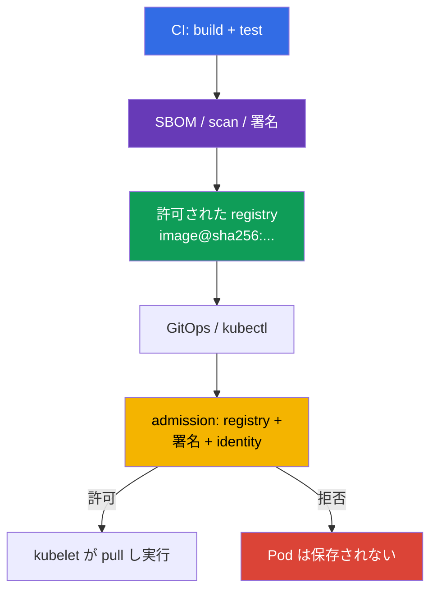

[Русская версия](ru.md) · [Eng version](README.md) · [Versión en español](es.md) · [Version française](fr.md) · [Deutsche Version](de.md) · [ქართული ვერსია](ge.md) · [繁體中文版](tw.md)

# 第26章. サプライチェーンの保護: レジストリ、署名、artifact の検証

> **課題。** registry への push 権限または CD へのアクセスを持つ攻撃者は、mutable
> tag を差し替え、外部または慣れ親しんだ内部 repository から他人の image を
> deploy できます。pull の成功は、そのバイトを信頼された pipeline がビルドした
> ことを証明しません。また signature verification のない allowlist は、未署名の
> artifact を止めません。immutable digest、publisher の確認、Pod 保存前の
> fail-closed admission が必要です。

> **この後。** [第25章](../25/jp.md)では依存関係、SBOM、artifact がどこから来るかを
> 定義しました。ここでは実行前の最後の barrier を構築します。cluster は許可された
> registry からの image のみ、かつ provenance と署名が確認された immutable digest
> のみを受け入れます。これは CKS の **Supply Chain Security** domain（20%）です。
>
> **CKA で必要な知識。** admission を通る request の path は
> [CKA 第21章](../../../cka/course/21/jp.md)、image、tag、digest、Dockerfile は
> [CKA 第23章](../../../cka/course/23/jp.md)で扱います。ここではこれらの機構を
> security control として使います。tag は content の証明ではなく、成功した
> `docker pull` は image が実行を許可されたことを意味しません。

> **署名の単純な考え方。** 署名は一つの question に答えます。**誰がこの正確な
> バイトの image を承認したか？** pipeline はまず immutable digest（content の
> fingerprint）を確定し、次にこの digest に署名します。実行前に verifier は image
> の digest を署名と対応させ、signer が信頼できることを確認します。tag が今別の
> バイトを指しても、古い署名はもう合いません。署名は image を暗号化せず
> malware/CVE の scan を置き換えません。特定の content に対する publisher の
> identity を証明するだけです。

> 🧠 Trust decision は `Pod` 保存前に行われます。registry allowlist は image の出自を、署名は信頼された publisher を、digest は content を固定します。

## 26.1. 保護すべき対象

Supply chain は Kubernetes 以前から始まります。source code と CI が image を
ビルドし、registry がそれと署名を保存し、GitOps または `kubectl` が参照を
API server に渡し、admission が Pod を許可するかどうかを決めます。どの stage が
差し替えられても、正しい manifest が他人の code を実行できます。



二つの独立した性質を混同してはいけません。

- **registry allowlist** は image を*どこから*取得してよいかに答えます。例:
  `registry.example.com/platform/*`;
- **signature verification** は*誰が*どの digest 用に artifact を発行したかに答えます;
- **digest** はバイトを固定します。`:1.4.2` は変更可能な名前ですが、
  `@sha256:<digest>` は deployment を検証済み manifest に結びつけます。

そのため `registry.example.com/platform/api:1.4.2` は production rollout 前に
`registry.example.com/platform/api:1.4.2@sha256:<検証済み-digest>` になるべきです。
allowlist は signature verification を置き換えません。信頼された registry への
push 権限を持つ攻撃者はなお未署名の image をそこに置けます。署名も逆に、未承認の
registry の使用を禁じません。

> 🎯 必要な registry/repository に fail-closed admission allowlist を実装し、normal、init、ephemeral container を確認してください。Kubernetes v1.36 では `spec.volumes[].image.reference` を別途考慮します。verifier がこの OCI artifact を証明可能に確認できるようになるまで、保護された namespace では image volumes を拒否するほうが安全です。native `ValidatingAdmissionPolicy` と Gatekeeper がこの task への直接的な道です。

## 26.2. native ValidatingAdmissionPolicy、Kyverno、Gatekeeper によるレジストリ allowlist

### native `ValidatingAdmissionPolicy`: CEL によるシンプルな allowlist

シンプルな registry allowlist のために、Kubernetes は native `ValidatingAdmissionPolicy`
（VAP）を提供します。これは Kubernetes 1.30 から stable な機構で、サードパーティの
admission webhook を必要としません。image の prefix/形式の CEL チェックに向いていますが、
**Cosign や Notary による暗号学的な検証を置き換えません**。VAP は特定の digest を誰が
署名したかを証明しません。以下の policy は通常、init、ephemeral container を等しく
カバーします。`pods/ephemeralcontainers` は `kubectl debug` による回避を禁じるために
必要です。また fail-closed で image volumes も拒否します。Kubernetes v1.36 では
`spec.volumes[].image.reference` は container ではない別の OCI reference です。

```yaml
apiVersion: admissionregistration.k8s.io/v1
kind: ValidatingAdmissionPolicy
metadata:
  name: allow-approved-platform-registry
spec:
  failurePolicy: Fail
  matchConstraints:
    resourceRules:
    - apiGroups: [""]
      apiVersions: ["v1"]
      operations: ["CREATE", "UPDATE"]
      resources: ["pods", "pods/ephemeralcontainers"]
  validations:
  - message: "Only container images registry.example.com/platform/ are allowed; image volumes are forbidden."
    expression: >-
      object.spec.containers.all(c, c.image.startsWith("registry.example.com/platform/")) &&
      (!has(object.spec.initContainers) || object.spec.initContainers.all(c,
        c.image.startsWith("registry.example.com/platform/"))) &&
      (!has(object.spec.ephemeralContainers) || object.spec.ephemeralContainers.all(c,
        c.image.startsWith("registry.example.com/platform/"))) &&
      (!has(object.spec.volumes) || !object.spec.volumes.exists(v, has(v.image)))
---
apiVersion: admissionregistration.k8s.io/v1
kind: ValidatingAdmissionPolicyBinding
metadata:
  name: allow-approved-platform-registry
spec:
  policyName: allow-approved-platform-registry
  validationActions: [Deny]
  matchResources:
    namespaceSelector:
      matchLabels:
        registry-policy: enforced
```

cluster 全体に `namespaceSelector` を広げる前に、テスト用 namespace に
`registry-policy: enforced` label を付けてください（`kubectl label namespace
<ns> registry-policy=enforced`）。Binding に `matchResources.namespaceSelector` が
なければ policy はすぐに cluster-wide になり、選んだ namespace だけでなく match する
すべての Pod に影響します。

VAP は Pod-only の Gatekeeper Constraint と同様、controller が作成した Pod を拒否
しますが、Deployment 自身の早期拒否には template 用の別 CEL rule が必要です。まず
テスト namespace で policy を適用し、normal/init/ephemeral container images、また
`spec.volumes[].image` を持つ Pod を確認してください。この例は image volume を
拒否するはずです。signature 要件には次の `ImageValidatingPolicy` か別の暗号学的
verifier を使います。

チェックは `containers`、`initContainers`、許可されているなら
`ephemeralContainers` をカバーする必要があります。そうしないと init または
debug container が policy の回避になります。Kubernetes v1.36 では
`spec.volumes[].image.reference` を別途処理してください。これは三つの配列の
どの要素でもありません。

> **⚠️ バージョンの差異。** exam snapshot v1.35 では `spec.volumes[].image` はまだ Beta ですが、`ImageVolume` はデフォルトで有効です。より古い cluster や gate が無効な場合、まず API schema と validation policy を確認してください。現在 workload がないという理由だけで image volume の fail-closed coverage を削除しないでください。

Pod-only policy 自身は Pod だけを確認します。Kyverno の `ValidatingPolicy` が
Deployment や他の workload controller を Pod 作成前に拒否するようにするには、
`spec.autogen.podControllers` を明示的に有効にしてください。これがなければ
controller は許可され、拒否は Pod 作成時にだけ起こります。まず Audit mode で
始め、既存 manifest を修正し、その後 rule を Enforce に切り替えます。

> 🔬 Kyverno は追加機能を持つ代替 policy engine です。環境で指定されている場合、または platform の標準として既に採用されている場合に使用してください。

### Kyverno 1.19 (chart 3.9.0, installed release)

> **Compatibility note.** course の主な exam/lab track は Kubernetes v1.35 です。
> Kyverno v1.19 は公式に Kubernetes v1.33-v1.35 をサポートします。course 全体の
> training baseline（lab infrastructure、`env.hcl`）は Kubernetes v1.36 のため、
> この lab は Kyverno 1.19 の検証済み support matrix 外の forward-looking な
> 選択です（第20章 §20.4 参照）。三つの独立した文脈を混同しないでください。
> exam version、training cluster version、特定 tool の vendor-supported version
> は同時に異なることがあります。
>
> Lab 108 と 111 は Helm chart `3.9.0` で Kyverno をインストールします。これは
> **Kyverno 1.19.0** リリースに対応します。既知の upstream defect
> [#16947](https://github.com/kyverno/kyverno/issues/16947) はまさに
> `ImageValidatingPolicy` に関するもので、`pods/ephemeralcontainers` に対して
> validating handler が `validations` を適用しません。webhook と image
> verification は呼び出されますが。issue には milestone `1.19.2` が付けられて
> います。したがって pinned 1.19.0 では否定的な `kubectl debug` test を
> **signature** について保証されたものとみなさないでください（詳細は §26.5）。
> この制限は通常の `ValidatingPolicy` には及びません。下の policy は
> `pods/ephemeralcontainers` の admission review を受け取り CEL allowlist を
> 適用します。

主要な path は `policies.kyverno.io/v1` の CEL-based `ValidatingPolicy` を使います。
variable は三つの container list すべてを結合します。`pods/ephemeralcontainers`
resource は `kubectl debug` 時にも同じチェックが実行されるために必要です。
native VAP と同様、この variant も image volumes を別途禁止します。
`spec.volumes[].image.reference` に確認済みサポートを持つ verifier が選ばれるまで。

```yaml
apiVersion: policies.kyverno.io/v1
kind: ValidatingPolicy
metadata:
  name: allow-approved-registries
spec:
  validationActions: [Deny]
  autogen:
    podControllers:
      controllers: [deployments, daemonsets, statefulsets, jobs, cronjobs]
  matchConstraints:
    resourceRules:
    - apiGroups: [""]
      apiVersions: ["v1"]
      operations: ["CREATE", "UPDATE"]
      resources: ["pods", "pods/ephemeralcontainers"]
  variables:
  - name: allContainers
    expression: >-
      object.spec.containers +
      object.spec.?initContainers.orValue([]) +
      object.spec.?ephemeralContainers.orValue([])
  validations:
  - message: "Only images from registry.example.com/platform/ are allowed."
    expression: >-
      variables.allContainers.all(container,
        container.image.startsWith("registry.example.com/platform/"))
  - message: "Image volumes are forbidden until a verified verifier exists for them."
    expression: >-
      !has(object.spec.volumes) || !object.spec.volumes.exists(volume, has(volume.image))
```

rollout 前に positive と negative の両ケースを確認してください。

```bash
kubectl apply -f allowed-pod.yaml
kubectl apply -f forbidden-pod.yaml  # admission denial を期待
kubectl debug allowed-pod --image=registry.example.com/other-team/debug:1.0 --target=app
# Expected: admission denial — 通常の ValidatingPolicy が
# pods/ephemeralcontainers を確認し、誤った repository prefix を拒否する。
kubectl get policyreport -A          # cluster で Policy Reports が有効な場合
```

test の prefix は重要です。この Kyverno `ValidatingPolicy` は
`registry.example.com/platform/*` だけを確認するため、policy 自体を確認するには
match する registry 内の誤った path を持つ image が必要で、任意の別 registry
ではありません。

`docker.io` を全体で「一時的に」追加しないでください。これは allowlist を
allow-all に変えます。system component には narrow で個別の prefix、たとえば
`registry.k8s.io/*` を設定し、変更確認時にその exception を記録してください。

`foreach` を使う legacy `ClusterPolicy` は migration 資料としてのみ扱われます。
Kyverno 1.19 でこの type は deprecated で、1.20 での削除が予定されています。

### OPA Gatekeeper

Gatekeeper は ConstraintTemplate のロジックを特定の Constraint から分離します。
以下の template は regular、init、ephemeral container を確認し、
`spec.volumes[].image.reference` 用の別の確認済み verifier が導入されるまで
image volumes を拒否します。その `match` は `Pod` に限定されます。この
Constraint は **Deployment 自体を拒否しません**。後で controller が作る Pod は
拒否します。早期拒否には workload template 用の別 rule を追加してください。
`kubectl debug` には、Gatekeeper の webhook が `pods/ephemeralcontainers` の
`UPDATE` subresource を受け取る必要があり、以下の Rego はまさにこの context を
確認します。

```yaml
apiVersion: templates.gatekeeper.sh/v1
kind: ConstraintTemplate
metadata:
  name: k8sallowedrepos
spec:
  crd:
    spec:
      names:
        kind: K8sAllowedRepos
      validation:
        openAPIV3Schema:
          type: object
          properties:
            repos:
              type: array
              items:
                type: string
  targets:
  - target: admission.k8s.gatekeeper.sh
    rego: |
      package k8sallowedrepos

      import rego.v1

      violation contains {"msg": msg} if {
        container := input.review.object.spec.containers[_]
        not starts_with_allowed(container.image, input.parameters.repos)
        msg := sprintf("image %q is not from an approved registry", [container.image])
      }

      violation contains {"msg": msg} if {
        container := input.review.object.spec.initContainers[_]
        not starts_with_allowed(container.image, input.parameters.repos)
        msg := sprintf("init image %q is not from an approved registry", [container.image])
      }

      violation contains {"msg": msg} if {
        input.review.operation == "UPDATE"
        input.review.subResource == "ephemeralcontainers"
        container := input.review.object.spec.ephemeralContainers[_]
        not starts_with_allowed(container.image, input.parameters.repos)
        msg := sprintf("ephemeral image %q is not from an approved registry", [container.image])
      }

      violation contains {"msg": msg} if {
        volume := input.review.object.spec.volumes[_]
        volume.image
        msg := "image volumes are not allowed until their OCI references have verified policy coverage"
      }

      starts_with_allowed(image, repos) if {
        repo := repos[_]
        startswith(image, repo)
      }
---
apiVersion: constraints.gatekeeper.sh/v1beta1
kind: K8sAllowedRepos
metadata:
  name: approved-platform-images
spec:
  match:
    kinds:
    - apiGroups: [""]
      kinds: ["Pod"]
  parameters:
    repos:
    - "registry.example.com/platform/"
```

必須の enforcement には `validatingWebhookFailurePolicy: Fail` で Gatekeeper を
インストールし、インストール後に実際の設定を確認してください。

```yaml
# values.yaml for the Gatekeeper Helm chart
validatingWebhookFailurePolicy: Fail
```

```bash
kubectl get validatingwebhookconfiguration gatekeeper-validating-webhook-configuration \
  -o jsonpath='{range .webhooks[*]}{.name}{"\t"}{.failurePolicy}{"\n"}{end}'
```

chart のデフォルト値は `Ignore` の場合があり、これは webhook が利用できない場合に
request をそのまま通します。テスト環境で意図的に、webhook が利用不可の場合に
request が拒否されることを確認してください。`Fail` は HA、監視、Gatekeeper の
可用性を要求します。そうでなければ controller の障害時に新しい Pod をブロック
する可能性があります。

Kyverno は policy が manifest を mutate する必要がある場合や、署名を native に
確認する必要がある場合に便利です。Gatekeeper は組織が Rego と Constraints を
標準化している場合に便利です。同じ必須チェックに対して明確な owner と合意された
migration 順序なしに両方の engine をインストールしないでください。二重の denial
メッセージは診断を複雑にし、二つの異なる allowlist は次第に食い違います。

> 🎯 `ImagePolicyWebhook` は exam-oriented な admission mechanism です。API server は allow/deny を backend に委譲し、その backend は利用可能で fail-closed に設定されている必要があります。

## 26.3. ImagePolicyWebhook: backend と API server の設定

`ImagePolicyWebhook` は API server の admission plugin です。container image を
持つ各 admission request に対し、外部 HTTPS backend に `ImageReview` を送信します。
backend は `allowed: true` または `false` を返し、reason と audit annotations を
返すこともできます。これは決定を manifest の外に集中させますが、backend は
API server の critical path の一部になります。`ImageReview` は `containers`、
`initContainers`、`ephemeralContainers` を含みますが `spec.volumes[].image.reference`
は含みません。したがって image volumes が許可されている場合、この plugin を
唯一の supply-chain control にしないでください。この章の例では native
policy/Gatekeeper が image volumes を fail-closed に拒否します。

```mermaid
sequenceDiagram
    participant C as kubectl / GitOps
    participant A as kube-apiserver
    participant W as ImagePolicyWebhook backend
    participant E as etcd
    C->>A: create Pod with image@digest
    A->>W: ImageReview (images, user, namespace)
    W-->>A: allowed/denied + reason
    alt allowed
        A->>E: save Pod
    else denied or backend unavailable
        A-->>C: admission error; Pod not created
    end
```

backend は *API server から*アクセス可能で、fail-closed に決定する必要があります。
以下では mTLS 構成を選びました。API server が client certificate を提示し、
backend がそれと CA を確認します。mTLS は `ImagePolicyWebhook` の普遍的な要件では
ありません。backend の認証方法はその kubeconfig とインフラで決まります。backend
は各 request で image の pull を実行してはいけません。reference/digest、署名、
信頼された identity を確認し、結果は短く合理的な TTL でだけ cache してください。
署名 revoke 後の長い allow-cache は望ましくない実行の window を残します。

admission 設定で `defaultAllow: false` を設定してください。以下の path と
file mount は kubeadm static Pod 用に示されています。実際の backend endpoint、
CA、client certificate は自分のインフラの値に置き換えてください。

```yaml
# /etc/kubernetes/admission-control/image-policy.yaml
apiVersion: apiserver.config.k8s.io/v1
kind: AdmissionConfiguration
plugins:
- name: ImagePolicyWebhook
  configuration:
    imagePolicy:
      kubeConfigFile: /etc/kubernetes/admission-control/image-policy.kubeconfig
      allowTTL: 30
      denyTTL: 30
      retryBackoff: 500
      defaultAllow: false
```

```yaml
# /etc/kubernetes/admission-control/image-policy.kubeconfig
apiVersion: v1
kind: Config
clusters:
- name: image-policy-backend
  cluster:
    certificate-authority: /etc/kubernetes/pki/image-policy/ca.crt
    server: https://image-policy-backend.security.example:8443/imagepolicy
users:
- name: kube-apiserver
  user:
    client-certificate: /etc/kubernetes/pki/image-policy/apiserver.crt
    client-key: /etc/kubernetes/pki/image-policy/apiserver.key
contexts:
- name: image-policy
  context:
    cluster: image-policy-backend
    user: kube-apiserver
current-context: image-policy
```

plugin を `kube-apiserver` に追加し admission configuration を渡してください。
既存の有効な admission plugin のリストを置き換えないでください。現在の値に
`ImagePolicyWebhook` を追加してください。そうしないと必須の built-in controller
を誤って無効にする可能性があります。さらに `ImageReview` を使う API
`imagepolicy.k8s.io/v1alpha1` を有効にしてください。これがないと以下の
fragment は不完全で backend は呼び出されません。`--runtime-config` が既に
存在する場合、他の設定を消さずに現在の値に `imagepolicy.k8s.io/v1alpha1=true`
を追加してください。

```yaml
# fragment of /etc/kubernetes/manifests/kube-apiserver.yaml
spec:
  containers:
  - name: kube-apiserver
    command:
    - kube-apiserver
    - --enable-admission-plugins=NodeRestriction,ServiceAccount,ImagePolicyWebhook
    - --runtime-config=imagepolicy.k8s.io/v1alpha1=true
    - --admission-control-config-file=/etc/kubernetes/admission-control/image-policy.yaml
    volumeMounts:
    - name: image-policy-config
      mountPath: /etc/kubernetes/admission-control
      readOnly: true
    - name: image-policy-pki
      mountPath: /etc/kubernetes/pki/image-policy
      readOnly: true
  volumes:
  - name: image-policy-config
    hostPath:
      path: /etc/kubernetes/admission-control
      type: DirectoryOrCreate
  - name: image-policy-pki
    hostPath:
      path: /etc/kubernetes/pki/image-policy
      type: DirectoryOrCreate
```

static Pod の編集は API server を再起動させます。backup manifest は
`/etc/kubernetes/manifests/` の**外**に保存してください（例:
`/root/k8s-manifest-backup/`）。この directory 内のどんな拡張子のファイルも
kubelet は別の static Pod manifest として読む可能性があります。control-plane
console を確保し、事前に backend TLS を確認してください。誤った endpoint、CA、
client key、fail-open な設定は、それぞれ新しい Pod をすべてブロックする、または
保護を外す可能性があります。再起動後、`/readyz`、API server のログ、明確な
allow/deny test を確認してください。以下は `kubectl apply` 用の object ではなく、
backend の最小限の概念的な応答です。

```yaml
# allow: reason is left empty, auditAnnotations keys have no prefix
apiVersion: imagepolicy.k8s.io/v1alpha1
kind: ImageReview
status:
  allowed: true
  auditAnnotations:
    decision: "approved signed digest"
---
# deny: short reason goes into the admission error
apiVersion: imagepolicy.k8s.io/v1alpha1
kind: ImageReview
status:
  allowed: false
  reason: "image is not signed by an approved identity"
  auditAnnotations:
    decision: "signature verification failed"
```

新しい cluster では、plugin の availability とサポートを Kubernetes version と
対応させてください。これは古く specialized な機構であり、signature
verification をサポートする webhook/policy engine のほうが通常保守しやすいです。

> 🧪 **実践: CKS Lab 108, task 2 と 6.** [Lab 108](../../labs/108/README_JP.MD)
> は明示的および implicit な `latest` の禁止を別途練習し、task 6 では
> `ImagePolicyWebhook` の完全な wiring を練習します。`defaultAllow: false`、
> backend `ImageReview`、kube-apiserver への plugin 追加、`nginx:latest` の
> denial と `nginx:1.27.3` の allow。これは機構の便利な exam 用確認ですが、
> production では許可された versioned tag もやはり digest による reference に
> 置き換えてください。

> 🎯 特定の immutable digest を `cosign` で署名・確認できるようにしてください。tag 自体は信頼の対象ではありません。

## 26.4. Cosign と Sigstore: digest の署名と確認

Cosign は OCI artifact の署名を作成・確認します。自身の build/push pipeline から
得た **digest** に署名してください。`latest` や他人のメッセージから得た digest を
代入しないでください。署名は registry 内で artifact の隣に保存されるため、
registry のアクセス制御と retention は鍵と同じくらい重要です。

```bash
IMAGE="${IMAGE:?set image reference}"

# Lab: this command creates a local cosign.key/cosign.pub pair.
# Do not use the private key created here as a production key, and do not add it to Git.
cosign generate-key-pair

# CI receives the key briefly; the password is not printed to logs.
cosign sign --key cosign.key "$IMAGE"

# Verification with the trusted public key - before deploy and at admission.
cosign verify --key cosign.pub "$IMAGE"
```

上の `cosign generate-key-pair` は lab 専用のローカルな key pair でしかありません。
production では以下の keyless OIDC flow を使うか、KMS で作成・保持された別の
key を使ってください。ローカルで作成した `cosign.key` を CI に移さないでください。
`cosign verify` の成功は、指定された image reference に対する署名の暗号学的
確認を意味します。policy はさらに、この repository に対して**どの**
public key/identity が許可されるかを制限する必要があります。すべての
environment と project に対する一つの共通 key は、一つのサービスの CI の
compromise を他すべてに対するリスクに変えます。key を rotate し、古い key への
アクセスを revoke し、誰がいつどの digest に署名したかの audit trail を残して
ください。

> 🔬 OIDC、Fulcio、Rekor を使う keyless flow は永続的な private key のリスクを減らしますが、issuer と identity release workflow を正確に制限する必要があります。

### Keyless: ローカルの signing key の代わりに短命な identity

Sigstore keyless flow は CI の OIDC 認証後に短命な証明書を取得し、proof を
transparency log に記録します。ローカルの private key を作成・配布する必要は
ありませんが、「任意の証明書」を信頼するのではなく、release workflow の正確な
OIDC identity を信頼する必要があります。

```bash
IMAGE="${IMAGE:?set image reference}"

# In CI with OIDC (e.g. GitHub Actions): there is no interactive confirmation.
cosign sign --yes "$IMAGE"

# We verify BOTH the issuer AND the subject workflow, not just that a certificate exists.
cosign verify \
  --certificate-oidc-issuer=https://token.actions.githubusercontent.com \
  --certificate-identity-regexp='^https://github\.com/example-org/payments/\.github/workflows/release\.yml@refs/tags/v[0-9].*$' \
  "$IMAGE"
```

GitHub Actions workflow の場合、job に `id-token: write` 権限を与える必要が
あります。これは registry への push 権限ではなく、scoped registry credential の
代わりにもなりません。identity の制限には organization、repository、workflow、
適切な ref/environment を含める必要があります。あまりに広い
`--certificate-identity-regexp='.*'` は keyless verification をほぼ無意味に
します。verifier が受け入れる任意の OIDC ユーザーが image に署名できてしまい
ます。

> 🎯 署名の確認が必須になるのは admission path でだけです。CI でのローカルな確認成功は直接の `kubectl apply` を妨げません。

## 26.5. admission での署名確認と Notary

deployment 前の確認は有用ですが、enforcement ではありません。ユーザーは
ローカルの CI script を回避して API に直接アクセスできます。したがって確認は
admission path に存在する必要があります。Kyverno 1.19 では CEL-based の
`ImageValidatingPolicy` がこれを行います。legacy の `ClusterPolicy.verifyImages`
は migration 用にのみ残されています。この policy を
`spec.volumes[].image.reference` の確認の例とはみなさないでください。この章
では image volumes は既に allowlist policy によって fail-closed に拒否されて
います。verifier のサポートが確認されるまでです。

**exam の核心**は repository allowlist、immutable digest、fail-closed admission、
denial の診断です。Kyverno の `ImageValidatingPolicy`、Notary、署名付き
SBOM/in-toto attestation は**production extension**です。これらは policy を
信頼された signer と release evidence に結びつけます。この例では private key は
cluster に入りません。

```yaml
apiVersion: policies.kyverno.io/v1
kind: ImageValidatingPolicy
metadata:
  name: require-signed-platform-images
spec:
  failurePolicy: Fail
  validationActions: [Deny]
  matchConstraints:
    resourceRules:
    - apiGroups: [""]
      apiVersions: ["v1"]
      operations: ["CREATE", "UPDATE"]
      resources: ["pods", "pods/ephemeralcontainers"]
  matchImageReferences:
  - glob: "registry.example.com/platform/*"
  validationConfigurations:
    mutateDigest: true
    required: true
    verifyDigest: true
  attestors:
  - name: releaseKey
    cosign:
      key:
        data: |-
          -----BEGIN PUBLIC KEY-----
          <release-signer-public-key>
          -----END PUBLIC KEY-----
  - name: releaseNotary
    notary:
      certs:
        value: |-
          -----BEGIN CERTIFICATE-----
          <X.509-certificate-of-Notary-release-signer>
          -----END CERTIFICATE-----
  attestations:
  - name: signedSbom
    referrer:
      type: sbom/cyclone-dx
  validations:
  - message: "Image must have a valid release signature"
    expression: >-
      (images.containers + images.?initContainers.orValue([]) +
      images.?ephemeralContainers.orValue([])).map(image,
        verifyImageSignatures(image, [attestors.releaseKey, attestors.releaseNotary]) > 0).all(ok, ok)
  - message: "Image must have a signed CycloneDX SBOM for this digest"
    expression: >-
      (images.containers + images.?initContainers.orValue([]) +
      images.?ephemeralContainers.orValue([])).map(image,
        verifyAttestationSignatures(image, attestations.signedSbom, [attestors.releaseKey]) > 0).all(ok, ok)
```

`failurePolicy: Fail` は確認エラー時に object を通しません。ただしインストール
された Kyverno 1.19.0 では既知の defect のため、`pods/ephemeralcontainers` に
対する `ImageValidatingPolicy` の `validations` が `kubectl debug` に適用される
保証はありません（upstream #16947 は milestone fix `1.19.2` を示します。§26.2
の compatibility note も参照）。したがって、この pinned release の必須の
positive/negative test は normal と init container です。以下の request は
empirical な compatibility test としてのみ実行してください。事前に期待される
denial を記録せず、lab が修正版をインストールしその結果を自分の test で確認する
までは、未署名の approved-registry debug-container の enforcement として頼らな
いでください。

```bash
kubectl debug allowed-pod --image=registry.example.com/platform/debug@sha256:<digest> --target=app
# Empirical test only, for pinned Kyverno 1.19.0: record the outcome as evidence.
kubectl debug allowed-pod --image=registry.example.com/platform/debug:unsigned --target=app
```

別に他 registry の image（`registry.example.com/other-team/debug:1.0` または
類似のもの）も確認してください。この request は署名確認に届く前に、前節の
allowlist VAP によって拒否されます。この `ImageValidatingPolicy` にとっては
`matchImageReferences` に含まれず、その CEL rule をテストしません。
`validationConfigurations` はまず Kyverno に digest を書き足すことを許可し、次に
それを要求し確認します。したがって signature と `signedSbom` は同じ immutable
digest に関連します。`releaseNotary` は native な Notary attestor で、
signature の条件は明示的に選ばれた trust root のいずれかを許可します。文書化
された migration period なしにこれらを混在させないでください。keyless の場合、
static key の代わりに、特定の CI workflow の正確な issuer と subject を持つ
`cosign.keyless.identities` を設定してください。署名済みと未署名の digest、
誤った signer、欠けている signed SBOM、registry の利用不可をテストしてください。

> 🔬 Notary/Notation は代替の OCI signing-エコシステムです。Kubernetes にとっては、admission allow/deny を返す integration が依然として必要です。

**Notary Project** と CLI `notation` は、X.509 trust store と trust policy を
持つ代替の OCI signing エコシステムです。`notation verify` は CI/CD で有用です。

```bash
notation cert add --type ca --store platform-ca company-root-ca.pem
notation policy import --force trustpolicy.json
IMAGE="${IMAGE:?set image reference}"
notation verify "$IMAGE"
```

Notary 自体は Kubernetes admission controller ではありません。その trust policy
は policy controller または webhook backend の確認に変換され、API server に
allow/deny を返す必要があります。一つの verifier が自動的に「すべてを理解する」
ことを期待しないでください。Cosign/Sigstore と Notary/Notation は異なる信頼
モデルを使います。特定の repository に対して標準を選び、trust root、許可された
identity、rotation procedure を文書化し、明確な二重署名・二重確認期間を持つ
migration を行ってください。

> 🏭 end-to-end プロセスは build、scan、SBOM/attestation、署名、digest による deployment、audit evidence を伴う fail-closed admission を結びつけます。

## 26.6. 検証可能な production プロセス

### production での適用方法

最小限の安全な pipeline は次のようになります。

1. CI が再現可能な image をビルドし、scan し、push 後に digest を取得します。
2. CI が SBOM/attestation を作成し、key または keyless OIDC identity でこの
   digest に署名します。
3. Deployment の reference は同じ digest を使います。allowlist は必要な
   registry/repository だけを許可し、image volumes は別の verifier で明示的に
   確認するか fail-closed で禁止されます。
4. Admission が registry、digest、署名を制限された trusted identity と照合し、
   確認エラーを fail-closed で拒否します。
5. CI、registry、admission のログが commit、workflow run、digest、決定を
   結びつけます。

診断は事実から始め、policy を弱めることから始めないでください。拒否された
direct な `Pod` CREATE は保存されないため、一次的な evidence は
`kubectl describe pod` ではなくコマンド自体の応答です。

```bash
kubectl apply -f pod.yaml 2>&1 | tee /tmp/admission-denial.txt
kubectl get pod "${POD:?set pod}" && kubectl describe pod "$POD"  # only if the Pod exists
kubectl get events -A --sort-by=.lastTimestamp
kubectl describe rs/my-replicaset         # for a Pod created by a controller: look for FailedCreate
cosign verify --key cosign.pub "$IMAGE"
kubectl logs -n kyverno deploy/kyverno-admission-controller
```

controller-owned な Pod では ReplicaSet/Job の Events と `FailedCreate` を確認
し、完全な追跡のためには API server の audit と該当する admission controller の
ログを確認してください。

正当な deployment が拒否された場合、その digest、repository prefix、signer
identity、証明書/鍵、registry までの network/TLS を確認してください。一時的な
`validationActions: [Audit]`、`failurePolicy: Ignore`、広い allowlist で
incident を「修正」しないでください。それは compromise を検出すべき control
そのものを失わせます。緊急の例外には、owner、期限、事後の削除を伴う短命で
namespace と digest に scope された解決策を使ってください。

## 26.7. ミニ glossary

- **Registry allowlist** - 特定の registry/repository prefix からの image だけを許可する policy。
- **Digest** - 特定の OCI manifest/artifact の immutable な SHA-256 identifier。
- **Cosign** - OCI artifact の署名と確認のための Sigstore ツール。
- **Keyless signing** - 永続的なローカル signing key の代わりに、OIDC 認証後に発行される short-lived certificate による署名。
- **ImagePolicyWebhook** - `ImageReview` を通じて image の決定を外部 backend に委譲する admission plugin。
- **Admission verification** - API server が Pod を保存する前に行う provenance/署名の必須確認。
- **Notary Project / Notation** - X.509 trust policy を持つ OCI signing ecosystem。Kubernetes enforcement には admission integration が必要。

## 26.8. 章のまとめ

- registry allowlist と signature verification は異なる task を解決し、一緒に機能する必要があります。
- Kyverno と Gatekeeper は未承認の container image reference を禁止できます。確認は
  通常、init、ephemeral container を考慮する必要があり、
  `spec.volumes[].image.reference` は別の verifier で明示的に確認するか
  fail-closed で禁止する必要があります。
- `ImagePolicyWebhook` は保護され利用可能な backend、API server の設定、
  fail-closed な `defaultAllow: false` を要求します。例の mTLS は選ばれた
  backend 認証方式です。
- Cosign は immutable digest を署名・確認します。private key は Git、manifest、
  cluster policy に入れてはいけません。
- Keyless Sigstore verification は特定の OIDC issuer と CI workflow identity を
  信頼します。任意の証明書ではありません。
- Admission enforcement はローカルの CI 確認に置き換えられません。
  Notary/Notation は admission allow/deny を返す integration を必要とします。

## 26.9. この知識が役立つ場面: 試験と実務

**試験では。** 短い核心は registry policy、tag、digest の違い、validating
admission の設定または診断、API server の admission configuration、fail-open の
リスクです。admission denial の応答を保存し正確な image reference を確認する
能力は、controller を無効にするより速く安全です。Kyverno
`ImageValidatingPolicy`、Notary、attestation は production extension であり、
目的を理解するだけで十分です。

**実務では。** 署名は production workload を release workflow と特定の
artifact に結びつけ、admission はこの rule を deployment のすべての path で
必須にします。CI の least-privilege 権限、保護された registry、audit log と
組み合わせることで、自分の pipeline を通っていない image が実行される可能性を
減らします。

> ### 🔴 攻撃者の視点
> **Asset:** production workload の image への reference。
> **Starting foothold:** registry への push、または compromise された CI。
> **Attacker objective:** すでに deploy された workload の digest を変えずに mutable tag を再割り当てし、malicious image を差し込んで registry allowlist/admission 確認を回避する。
> **Abuse path:** tag を別の image に再割り当てする。digest pinning がなければ
> 同じ文字列 `registry/app:stable` は同じバイトを保証しません。`imagePullPolicy:
> Always` では kubelet は起動ごとに tag を再解決します。`IfNotPresent` では
> cached image が変更を一時的に隠すことがありますが、新しい node や cleared
> cache は最初の pull で新しい digest を取得します。`Never` は pull を排除し
> ますが、supply-chain verification control ではありません。`imagePullPolicy`
> は digest pinning と signature/provenance verification の代わりにはなりません。
> **Expected evidence:** 保存された admission denial の応答または audit log。controller-owned な Pod では owner の `FailedCreate` event も。
> **Control:** digest pinning、registry allowlist、ImagePolicyWebhook または Kyverno による admission signature verification。
> **Retest:** tag を retarget しても digest による workload は変わらず、未署名の image は admission により拒否される。

## 26.10. 自己確認の質問

<details>
<summary>1. trusted registry の allowlist が image を信頼された CI が作成したことを証明しないのはなぜですか？</summary>

allowlist は image がどの registry/repository から許可されるかにのみ答えます。この trusted registry への push 権限を持つユーザーは、未署名の artifact や他人の artifact を公開できます。したがって特定 digest の出自は署名と制限された signer identity で確認します。
</details>

<details>
<summary>2. production deployment に version tag だけでなく digest が必要なのはなぜですか？</summary>

version tag は変更可能な名前で、manifest を変えずに別のバイトに再割り当てできます。`@sha256:...` は OCI manifest を固定し、deployment を scan・署名したものと同じ artifact に結びつけます。`imagePullPolicy` は digest pinning の代わりにはなりません。新しい node や cache miss は mutable tag を別に解決する可能性があります。
</details>

<details>
<summary>3. registry policy はどの container reference を確認すべきで、image volumes はどう扱うべきですか？</summary>

Policy は `containers`、`initContainers`、`ephemeralContainers` を確認する必要があります。そうでなければ init container、または `kubectl debug` と subresource `pods/ephemeralcontainers` で追加された container が allowlist の回避になります。このため rule は必要な subresource の CREATE/UPDATE も match します。Kubernetes v1.36 では `spec.volumes[].image.reference` はこれらの配列の外にある別の OCI reference です。サポートされた verifier で明示的に確認するか、この章の例のように fail-closed で禁止する必要があります。
</details>

<details>
<summary>4. `ImagePolicyWebhook` backend にはどの TLS ファイルと fail-closed パラメータが必要ですか？</summary>

kubeconfig には backend の CA が `certificate-authority` に必要で、mTLS 方式を選んだ場合は API server の `client-certificate` と `client-key` が必要です。対応する path は static Pod にマウントされる必要があります。`AdmissionConfiguration` では `defaultAllow: false` を設定し、backend のエラーや利用不可が image を許可しないようにします。既存の admission plugin も保持し、`ImageReview` のために API `imagepolicy.k8s.io/v1alpha1` を有効にします。
</details>

<details>
<summary>5. keyless signature は static Cosign key とどう異なり、確認時にどの issuer/identity を制限すべきですか？</summary>

keyless flow は CI の OIDC 認証後に短命な証明書を取得し、永続的なローカル private key の配布を必要としません。static Cosign key は別の key pair で、production では KMS など保護された storage に保持されます。keyless verification では正確な OIDC issuer と workflow の identity を制限します。organization、repository、release workflow、許可された ref/environment であり、regex `.*` ではありません。
</details>

<details>
<summary>6. CI での `cosign verify` が直接の `kubectl apply` を防げないのはなぜですか？</summary>

CI の確認は、実際に実行される path でのみ機能します。ユーザーや別の pipeline は Kubernetes API に直接アクセスし、未署名の image で Pod を作成できます。必須の確認は admission path に存在し、Pod 保存前に deny を返す必要があります。
</details>

<details>
<summary>7. Notary/Notation が Kubernetes の enforcement point になるために何が必要ですか？</summary>

`notation verify` は CI で有用ですが、Notary 自体は Kubernetes admission controller ではありません。その trust policy、X.509 trust root、許可された identity は、kube-apiserver に allow/deny の決定を返す policy controller または webhook backend に統合される必要があります。文書化された rotation、migration 時には二重署名・二重確認期間も必要です。
</details>

<details>
<summary>8. **Flashback（第20章）。** この章の質問6は、CI での `cosign verify` が未署名 image の直接の `kubectl apply` を妨げないことを既に示しました。第20章の admission policy（native `ValidatingAdmissionPolicy` または Kyverno `ImageValidatingPolicy`）はこの回避 path をどう閉じ、「admission policy としての signature verification」は「CI pipeline だけでの signature verification」と信頼性でどう異なりますか？</summary>

Admission policy は match するすべての CREATE/UPDATE Pod に対して kube-apiserver によって実行されるため、手動の `kubectl apply` も確認を通り拒否される可能性があります。`ImageValidatingPolicy` は特定 digest の signature/attestation を確認できます。native VAP は例えば CEL allowlist reference に向いていますが、暗号学的 verifier の代わりにはなりません。CI だけでの確認は pipeline の任意の段階です。admission はこの rule を cluster の境界での fail-closed enforcement に変えます。
</details>

## Practice

🧪 CKA Lab 111（kubeadm lifecycle と static control-plane Pod）:
[tasks/cka/labs/111](../../../cka/labs/111/README_JP.MD)。これは API server
manifest を扱う安全な context を提供します。backup と API の可用性確認なしに、
exam の control plane で admission configuration の変更を適用しないでください。

🌐 追加の対話型練習（killer.sh/killercoda, 外部リソース）: [image-policy-webhook-setup](https://killercoda.com/killer-shell-cks/scenario/image-policy-webhook-setup) · [image-use-digest](https://killercoda.com/killer-shell-cks/scenario/image-use-digest)

📘 CKA の基礎: [admission](../../../cka/course/21/jp.md) ·
[image と Dockerfile](../../../cka/course/23/jp.md) ·
[kubeadm control plane](../../../cka/course/35/jp.md)。

---
[目次](../README_JP.md) · [第25章](../25/jp.md) · [第27章](../27/jp.md)
