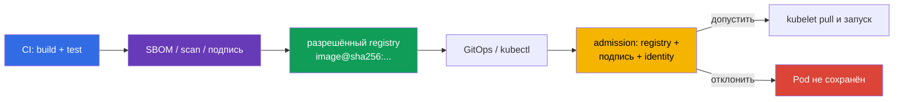

<!-- Standalone RU release: ссылки на переводы удалены, потому что соответствующие файлы не входят в архив. -->

# Глава 26. Защита supply chain: реестры, подпись и валидация артефактов

> **Что дальше.** В [главе 25](../25/ru.md) мы определили, откуда появляются зависимости,
> SBOM и артефакты. Теперь строим последний барьер перед запуском: кластер принимает
> только образы из разрешённых реестров и только тот immutable digest, чьё происхождение
> и подпись подтверждены. Это домен **Supply Chain Security** CKS (20%).
>
> **Что нужно знать из CKA.** Путь запроса через admission разобран в
> [главе 21 CKA](../../../cka/course/21/ru.md), а image, tag, digest и Dockerfile - в
> [главе 23 CKA](../../../cka/course/23/ru.md). Здесь эти механизмы применяются как
> security control: tag не является доказательством содержимого, а успешный `docker pull`
> не означает, что образ разрешён к запуску.

## 26.1. Что именно нужно защищать

Supply chain начинается до Kubernetes: исходный код и CI собирают image, registry хранит
его и подпись, GitOps или `kubectl` передаёт ссылку API-серверу, а admission решает,
допускать ли Pod. Если любой этап подменён, корректный манифест может запустить чужой
код.



Два независимых свойства нельзя смешивать:

- **allowlist реестров** отвечает, *откуда* разрешено брать образ: например,
  `registry.example.com/platform/*`;
- **проверка подписи** отвечает, *кто и для какого digest* выпустил artifact;
- **digest** фиксирует байты. `:1.4.2` - изменяемое имя, тогда как
  `@sha256:<digest>` связывает deployment с проверенным manifest.

Поэтому `registry.example.com/platform/api:1.4.2` должен стать
`registry.example.com/platform/api:1.4.2@sha256:<проверенный-digest>` до production
rollout. Allowlist не заменяет signature verification: атакующий с правом push в
доверенный registry всё ещё может поместить туда неподписанный образ. Подпись, в свою
очередь, не запрещает использовать неутверждённый registry.

## 26.2. Allowlist реестров через Kyverno и Gatekeeper

Проверка должна покрывать `containers`, `initContainers` и, если они разрешены,
`ephemeralContainers`: иначе init- или debug-контейнер станет обходом policy. Правило
должно применяться к объекту `Pod`; admission применяет его также к workload-контроллерам,
поскольку они создают Pod. Начните с режима Audit, исправьте существующие manifests, затем
переведите правило в Enforce.

### Kyverno 1.19

> **Compatibility note.** Kyverno v1.19 официально поддерживает Kubernetes v1.33-v1.35;
> целевая версия курса v1.36 не входит в протестированную support matrix проекта
> (см. главу 20 §20.4).

Основной путь использует CEL-based `ValidatingPolicy` из `policies.kyverno.io/v1`.
Переменная объединяет все три списка контейнеров; ресурс `pods/ephemeralcontainers`
нужен, чтобы та же проверка выполнялась при `kubectl debug`.

```yaml
apiVersion: policies.kyverno.io/v1
kind: ValidatingPolicy
metadata:
  name: allow-approved-registries
spec:
  validationActions: [Deny]
  matchConstraints:
    resourceRules:
    - apiGroups: [""]
      apiVersions: ["v1"]
      operations: ["CREATE", "UPDATE"]
      resources: ["pods", "pods/ephemeralcontainers"]
  variables:
  - name: allContainers
    expression: >-
      object.spec.containers +
      object.spec.?initContainers.orValue([]) +
      object.spec.?ephemeralContainers.orValue([])
  validations:
  - message: "Разрешены только образы registry.example.com/platform/."
    expression: >-
      variables.allContainers.all(container,
        container.image.startsWith("registry.example.com/platform/"))
```

Проверьте положительный и отрицательный случаи до rollout:

```bash
kubectl apply -f allowed-pod.yaml
kubectl apply -f forbidden-pod.yaml  # ожидается admission denial
kubectl debug allowed-pod --image=evil.example/debug:1.0 --target=app  # denial
kubectl get policyreport -A          # если в кластере включены Policy Reports
```

Не добавляйте `docker.io` целиком «на время»: это превращает allowlist в allow-all.
Для системных компонентов задайте узкие отдельные prefixes, например
`registry.k8s.io/*`, и зафиксируйте исключение при проверке изменения.

Legacy `ClusterPolicy` с `foreach` относится только к миграционному материалу: в Kyverno
1.19 этот тип deprecated, а в 1.20 запланировано его удаление.

### OPA Gatekeeper

Gatekeeper отделяет логику ConstraintTemplate от конкретного Constraint. Шаблон ниже
принимает allowlist prefixes и отвергает каждый container, image которого не начинается с
одного из них. В production добавьте такую же проверку init/ephemeral containers либо
запретите их отдельным Constraint.

```yaml
apiVersion: templates.gatekeeper.sh/v1
kind: ConstraintTemplate
metadata:
  name: k8sallowedrepos
spec:
  crd:
    spec:
      names:
        kind: K8sAllowedRepos
      validation:
        openAPIV3Schema:
          type: object
          properties:
            repos:
              type: array
              items:
                type: string
  targets:
  - target: admission.k8s.gatekeeper.sh
    rego: |
      package k8sallowedrepos

      violation[{"msg": msg}] {
        container := input.review.object.spec.containers[_]
        not starts_with_allowed(container.image, input.parameters.repos)
        msg := sprintf("image %q is not from an approved registry", [container.image])
      }

      starts_with_allowed(image, repos) {
        repo := repos[_]
        startswith(image, repo)
      }
---
apiVersion: constraints.gatekeeper.sh/v1beta1
kind: K8sAllowedRepos
metadata:
  name: approved-platform-images
spec:
  match:
    kinds:
    - apiGroups: [""]
      kinds: ["Pod"]
  parameters:
    repos:
    - "registry.example.com/platform/"
```

Kyverno удобен, когда policy должна также mutate manifests или нативно проверять
подписи. Gatekeeper удобен, когда организация стандартизировала Rego и Constraints.
Не устанавливайте оба движка для одной и той же обязательной проверки без явного
владельца и согласованного порядка миграции: двойные denial-сообщения усложняют
диагностику, а два разных allowlist расходятся.

## 26.3. ImagePolicyWebhook: backend и конфигурация API-сервера

`ImagePolicyWebhook` - admission plugin API-сервера. Для каждого admission-запроса с
образами он отправляет `ImageReview` во внешний HTTPS backend; backend отвечает
`allowed: true` или `false` и может вернуть причину и audit annotations. Это централизует
решение вне manifests, но backend оказывается частью критического пути API-сервера.

```mermaid
sequenceDiagram
    participant C as kubectl / GitOps
    participant A as kube-apiserver
    participant W as ImagePolicyWebhook backend
    participant E as etcd
    C->>A: create Pod с image@digest
    A->>W: ImageReview (images, user, namespace)
    W-->>A: allowed/denied + reason
    alt allowed
        A->>E: сохранить Pod
    else denied или backend недоступен
        A-->>C: admission error; Pod не создан
    end
```

Backend обязан быть доступен *из API-сервера*, проверять TLS-сертификат клиента и
принимать решение fail-closed. Он не должен выполнять pull образа на каждый запрос:
проверяйте reference/digest, подпись и доверенную identity, а результаты кешируйте лишь
на короткий, обоснованный TTL. Долгий allow-cache после revoke подписи оставит окно для
нежелательного запуска.

В конфигурации admission задайте `defaultAllow: false`. Путь и монтирование файлов ниже
показаны для kubeadm static Pod; реальный backend endpoint, CA и client certificate
замените на значения своей инфраструктуры.

```yaml
# /etc/kubernetes/admission-control/image-policy.yaml
apiVersion: apiserver.config.k8s.io/v1
kind: AdmissionConfiguration
plugins:
- name: ImagePolicyWebhook
  configuration:
    imagePolicy:
      kubeConfigFile: /etc/kubernetes/admission-control/image-policy.kubeconfig
      allowTTL: 30
      denyTTL: 30
      retryBackoff: 500
      defaultAllow: false
```

```yaml
# /etc/kubernetes/admission-control/image-policy.kubeconfig
apiVersion: v1
kind: Config
clusters:
- name: image-policy-backend
  cluster:
    certificate-authority: /etc/kubernetes/pki/image-policy/ca.crt
    server: https://image-policy-backend.security.example:8443/imagepolicy
users:
- name: kube-apiserver
  user:
    client-certificate: /etc/kubernetes/pki/image-policy/apiserver.crt
    client-key: /etc/kubernetes/pki/image-policy/apiserver.key
contexts:
- name: image-policy
  context:
    cluster: image-policy-backend
    user: kube-apiserver
current-context: image-policy
```

Добавьте plugin к `kube-apiserver` и передайте admission configuration. Не заменяйте
имеющийся список включённых admission plugins: добавьте `ImagePolicyWebhook` к текущему
значению, иначе можно случайно выключить обязательные встроенные контроллеры. Дополнительно включите API `imagepolicy.k8s.io/v1alpha1`, которое использует `ImageReview`: без него приведённый fragment неполон и backend не будет вызываться. Если `--runtime-config` уже присутствует, добавьте `imagepolicy.k8s.io/v1alpha1=true` к его текущему значению, не затирая другие настройки.

```yaml
# фрагмент /etc/kubernetes/manifests/kube-apiserver.yaml
spec:
  containers:
  - name: kube-apiserver
    command:
    - kube-apiserver
    - --enable-admission-plugins=NodeRestriction,ServiceAccount,ImagePolicyWebhook
    - --runtime-config=imagepolicy.k8s.io/v1alpha1=true
    - --admission-control-config-file=/etc/kubernetes/admission-control/image-policy.yaml
    volumeMounts:
    - name: image-policy-config
      mountPath: /etc/kubernetes/admission-control
      readOnly: true
    - name: image-policy-pki
      mountPath: /etc/kubernetes/pki/image-policy
      readOnly: true
  volumes:
  - name: image-policy-config
    hostPath:
      path: /etc/kubernetes/admission-control
      type: DirectoryOrCreate
  - name: image-policy-pki
    hostPath:
      path: /etc/kubernetes/pki/image-policy
      type: DirectoryOrCreate
```

Правка static Pod перезапустит API-сервер. Сохраните backup manifest **вне**
`/etc/kubernetes/manifests/` (например в `/root/k8s-manifest-backup/`): файл с любым
расширением внутри этого каталога kubelet может прочитать как ещё один static Pod
manifest. Держите консоль
control-plane и заранее проверьте backend TLS: ошибочные endpoint, CA, client key или
fail-open настройка могут соответственно заблокировать все новые Pod либо снять защиту.
После перезапуска проверьте `/readyz`, логи API-сервера и явный allow/deny test. Для
нового кластера сопоставьте доступность и поддержку plugin с версией Kubernetes: это
старый специализированный механизм; webhook/policy engine с поддержкой signature
verification обычно проще сопровождать.

## 26.4. Cosign и Sigstore: подпись и проверка digest

Cosign создаёт и проверяет подписи OCI-artifacts. Подписывайте **digest**, полученный из
собственного build/push pipeline; не подставляйте `latest` или digest из чужого сообщения.
Подпись хранится рядом с artifact в registry, поэтому registry access control и retention
так же важны, как ключ.

```bash
IMAGE='registry.example.com/platform/payments-api:1.4.2@sha256:<digest>'

# Один раз: private key хранится в защищённом KMS/secret store, не в Git.
cosign generate-key-pair

# CI получает ключ кратковременно; пароль не печатается в логах.
cosign sign --key cosign.key "$IMAGE"

# Проверка доверенным public key - до deploy и на admission.
cosign verify --key cosign.pub "$IMAGE"
```

Успех `cosign verify` означает криптографическую проверку подписи для указанного image
reference. Политика должна дополнительно ограничить, **какой** public key/identity
допустимы для данного repository. Один общий ключ для всех environments и проектов
превращает компрометацию CI одного сервиса в риск для всех остальных. Ротируйте ключи,
отзывайте доступ к старому ключу и сохраняйте audit trail: кто, когда и какой digest
подписал.

### Keyless: короткоживущая identity вместо локального signing key

Sigstore keyless flow получает краткоживущий сертификат после OIDC-аутентификации CI и
записывает proof в transparency log. Локальный private key не нужно создавать или
раздавать разработчикам, но доверять надо не «любому сертификату», а точной OIDC identity
release workflow.

```bash
IMAGE='registry.example.com/platform/payments-api:1.4.2@sha256:<digest>'

# В CI с OIDC (например, GitHub Actions): интерактивного подтверждения нет.
cosign sign --yes "$IMAGE"

# Проверяем issuer И subject workflow, а не только факт наличия certificate.
cosign verify \
  --certificate-oidc-issuer=https://token.actions.githubusercontent.com \
  --certificate-identity-regexp='^https://github.com/example-org/payments/.github/workflows/release.yml@refs/tags/v[0-9].*$' \
  "$IMAGE"
```

Для GitHub Actions workflow обязан выдать job право `id-token: write`; это не право push
в registry и не заменяет scoped registry credential. Ограничение identity должно включать
организацию, repository, workflow и подходящий ref/environment. Слишком широкое
`--certificate-identity-regexp='.*'` делает keyless verification почти бессмысленным:
любой OIDC-пользователь, которого принимает verifier, сможет подписать образ.

## 26.5. Проверка подписи при admission и Notary

Проверка до deployment полезна, но не является enforcement: пользователь может обойти
локальный CI script и обратиться к API напрямую. Поэтому проверка должна жить на
admission path. В Kyverno 1.19 это делает CEL-based `ImageValidatingPolicy`; legacy
`ClusterPolicy.verifyImages` оставлен только для миграции. В примере в кластер попадает
только public key, private key не монтируется.

```yaml
apiVersion: policies.kyverno.io/v1
kind: ImageValidatingPolicy
metadata:
  name: require-signed-platform-images
spec:
  failurePolicy: Fail
  validationActions: [Deny]
  matchConstraints:
    resourceRules:
    - apiGroups: [""]
      apiVersions: ["v1"]
      operations: ["CREATE", "UPDATE"]
      resources: ["pods"]
  matchImageReferences:
  - glob: "registry.example.com/platform/*"
  attestors:
  - name: releaseKey
    cosign:
      key:
        data: |-
          -----BEGIN PUBLIC KEY-----
          <публичный-ключ-release-подписанта>
          -----END PUBLIC KEY-----
  validations:
  - message: "Image must have a valid release signature"
    expression: >-
      images.containers.map(image,
        verifyImageSignatures(image, [attestors.releaseKey])).all(count, count > 0)
```

`failurePolicy: Fail` не пропускает объект при ошибке проверки. Для keyless вместо static
key настройте `cosign.keyless.identities` с точными issuer и subject конкретного CI
workflow. Отдельно требуйте digest в `ValidatingPolicy` или настройках image validation:
подпись не делает плавающий tag неизменяемым. Тестируйте подписанный и неподписанный digest,
ошибочный signer и недоступность registry.

**Notary Project** и CLI `notation` - альтернативная экосистема OCI signing с X.509
trust stores и trust policy. `notation verify` полезен в CI/CD:

```bash
notation cert add --type ca --store platform-ca company-root-ca.pem
notation policy import --force trustpolicy.json
notation verify 'registry.example.com/platform/payments-api@sha256:<digest>'
```

Notary сам по себе не является Kubernetes admission controller. Его trust policy должна
быть преобразована в проверку policy controller или webhook backend, который возвращает
allow/deny API-серверу. Не требуйте, чтобы один verifier «понимал» всё автоматически:
Cosign/Sigstore и Notary/Notation используют разные модели доверия. Выберите стандарт
для конкретного repository, документируйте trust root, allowed identities и процедуру
rotation, а миграцию ведите с явным периодом двойной подписи и двойной проверки.

## 26.6. Проверяемый production-процесс

### Как это применяют в продакшене

Минимальный безопасный pipeline выглядит так:

1. CI собирает воспроизводимый image, сканирует его и получает digest после push.
2. CI создаёт SBOM/attestations и подписывает этот digest ключом или keyless OIDC identity.
3. Deployment reference использует этот же digest; allowlist разрешает только нужный
   registry/repository.
4. Admission сверяет registry, digest и подпись с ограниченной trusted identity и
   fail-closed отклоняет ошибку проверки.
5. Логи CI, registry и admission связывают commit, workflow run, digest и решение.

Диагностику начинайте с фактов, а не с ослабления policy:

```bash
kubectl describe pod <pod>             # Events: причина admission denial
kubectl get events -A --sort-by=.lastTimestamp
cosign verify --key cosign.pub "$IMAGE"
kubectl logs -n kyverno deploy/kyverno-admission-controller
```

Если legitimate deployment отклонён, проверьте его digest, repository prefix, signer
identity, сертификат/ключ и network/TLS до registry. Не исправляйте incident временным
`validationActions: [Audit]`, `failurePolicy: Ignore` или broad allowlist в production:
так пропадёт именно контроль, который должен обнаружить compromise. Для аварийного
исключения используйте короткоживущее, namespace- и digest-scoped решение с владельцем,
сроком и последующим удалением.

## 26.7. Мини-глоссарий

- **Registry allowlist** - policy, разрешающая image только из определённых registry/repository prefixes.
- **Digest** - immutable SHA-256 identifier конкретного OCI manifest/artifact.
- **Cosign** - инструмент Sigstore для подписи и проверки OCI-artifacts.
- **Keyless signing** - подпись с short-lived certificate, выданным после OIDC-аутентификации, вместо постоянного локального signing key.
- **ImagePolicyWebhook** - admission plugin, делегирующий решение о образах внешнему backend через `ImageReview`.
- **Admission verification** - обязательная проверка provenance/подписи до сохранения Pod API-сервером.
- **Notary Project / Notation** - OCI signing ecosystem с X.509 trust policy; для Kubernetes enforcement ему нужен admission integration.

## 26.8. Итоги главы

- Allowlist registry и проверка подписи решают разные задачи и должны работать вместе.
- Kyverno и Gatekeeper могут запретить неутверждённые image references; проверка обязана
  учитывать обычные, init- и ephemeral-контейнеры.
- `ImagePolicyWebhook` требует защищённого доступного backend, конфигурации
  API-сервера, client TLS и fail-closed `defaultAllow: false`.
- Cosign подписывает и проверяет immutable digest; private key не должен попадать в Git,
  manifest или cluster policy.
- Keyless Sigstore verification доверяет конкретному OIDC issuer и CI workflow identity,
  а не произвольному сертификату.
- Admission enforcement не заменяется локальной CI-проверкой; Notary/Notation требует
  integration, возвращающей admission allow/deny.

## 26.9. Как это пригодится: на экзамене и в реальной работе

**На экзамене.** Нужно распознать разницу между registry policy, tag и digest, настроить
или диагностировать validating admission, найти API-server admission configuration и
объяснить, почему fail-open опасен. Умение прочитать denial event и проверить exact image
reference быстрее и безопаснее, чем отключение контроллера.

**В реальной работе.** Подпись связывает production workload с release workflow и
конкретным artifact, а admission делает это правило обязательным для каждого пути
deployment. Вместе с least-privilege правами CI, защищённым registry и audit logs это
сокращает вероятность запуска образа, который не прошёл ваш pipeline.

## 26.10. Вопросы для самопроверки

1. Почему allowlist trusted registry не доказывает, что image создал доверенный CI?
2. Почему для production deployment нужен digest, а не только version tag?
3. Какие массивы контейнеров обязан проверять registry policy и почему?
4. Какие TLS-файлы и fail-closed параметры нужны `ImagePolicyWebhook` backend?
5. Чем keyless signature отличается от static Cosign key и какие issuer/identity нужно
   ограничить при проверке?
6. Почему `cosign verify` в CI не предотвращает прямой `kubectl apply`?
7. Что требуется, чтобы Notary/Notation стал enforcement point Kubernetes?

## Практика

🧪 Лаба 111 CKA (kubeadm lifecycle и static control-plane Pod):
[tasks/cka/labs/111](../../../cka/labs/111/README_RU.MD). Она даёт безопасный контекст для
работы с манифестом API-сервера; не применяйте изменения admission configuration на
экзаменационном control plane без backup и проверки доступности API.

📘 База CKA: [admission](../../../cka/course/21/ru.md) ·
[образы и Dockerfile](../../../cka/course/23/ru.md) ·
[kubeadm control plane](../../../cka/course/35/ru.md).

---
[Оглавление](../README_RU.md) · [Глава 25](../25/ru.md) · [Глава 27](../27/ru.md)
