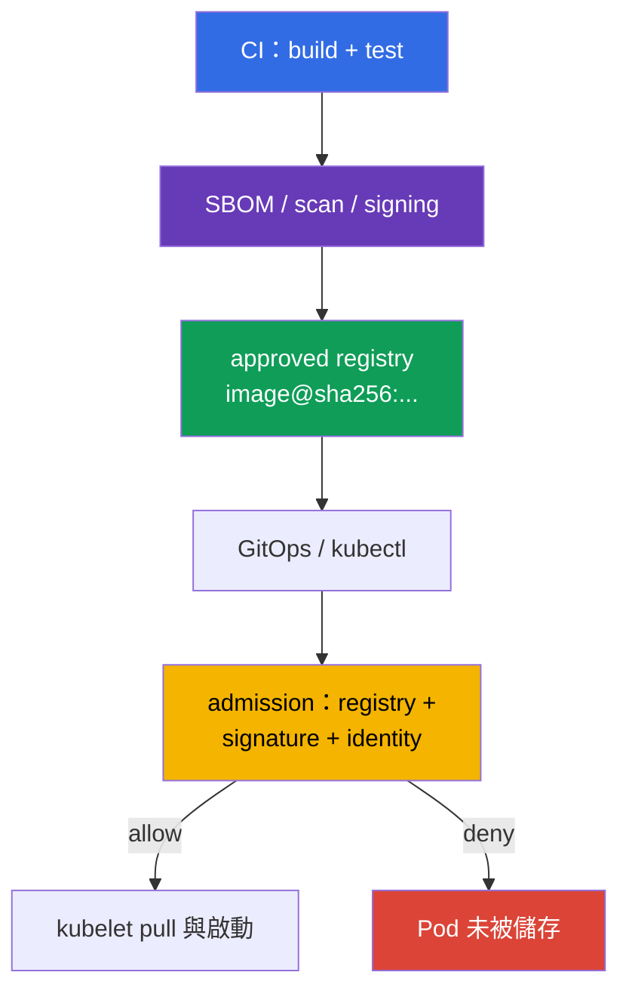
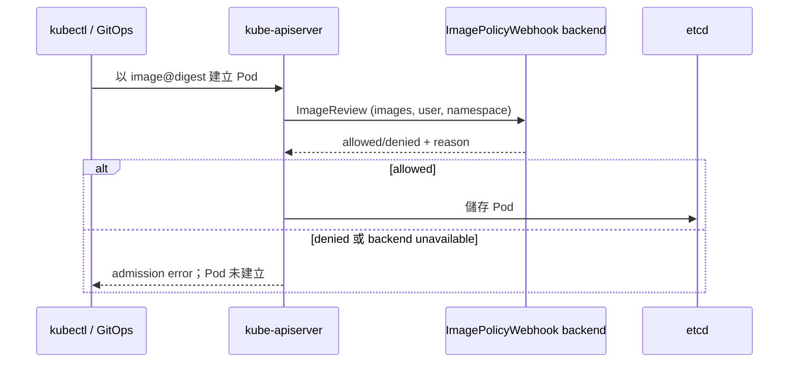

[Русская версия](ru.md) · [Eng version](README.md) · [Versión en español](es.md) · [Version française](fr.md) · [Deutsche Version](de.md) · [ქართული ვერსია](ge.md) · [日本語版](jp.md)

# 第 26 章。Supply chain 防護：registries、signing 與 artifact validation

> **問題。** 擁有 registry push 權限或 CD access 的 attacker 可置換 mutable tag，並從 external 或甚至熟悉的
> internal repository 部署他人的 image。成功 pull 並不能證明這些 bytes 由 trusted pipeline build，
> 而沒有 signature verification 的 allowlist 也無法阻止 unsigned artifact。需要 immutable digest、publisher
> verification，以及在 Pod 儲存前 fail-closed 的 admission。

> **接下來。** 在 [第 25 章](../25/tw.md) 中，我們確定 dependencies、SBOM 與 artifacts 的來源。
> 現在建立啟動前的最後一道 barrier：cluster 僅接受來自 approved registries 的 images，以及其 provenance
> 和 signature 已確認的 immutable digest。這是 CKS 的 **Supply Chain Security** domain（20%）。
>
> **需要的 CKA 知識。** Admission request path 請見 [CKA 第 21 章](../../../cka/course/21/tw.md)，
> image、tag、digest 和 Dockerfile 請見 [CKA 第 23 章](../../../cka/course/23/tw.md)。此處將這些 mechanisms
> 作為 security control：tag 不是 contents 的證明，成功的 `docker pull` 也不代表 image 可被允許啟動。

> **Signing 的簡單概念。** 它回答一個問題：**誰核准了 image 的這些精確 bytes？** Pipeline 先固定 immutable
> digest - contents 的 fingerprint，再簽署此 digest。啟動前，verifier 會將 image digest 與 signature 比對，
> 並確認 signer 是 trusted。若 tag 現在指向其他 bytes，舊 signature 就不再適用。Signing 不會加密 image，
> 也不能取代 malware/CVE scan：它證明特定 contents 的 publisher identity。

> 🧠 Trust decision 在 `Pod` 儲存前作出：registry allowlist 管理 image source，signature 管理 trusted publisher，而 digest 固定 contents。

## 26.1. 具體要保護什麼

Supply chain 在 Kubernetes 前就開始：source code 和 CI build image，registry 儲存它及其 signature，GitOps 或
`kubectl` 將 reference 交給 API server，而 admission 決定是否允許 Pod。任一 stage 被置換，正確的 manifest
仍可能啟動他人的 code。



兩個獨立 properties 不可混淆：

- **Registry allowlist** 回答 image 可從*哪裡*取得：例如 `registry.example.com/platform/*`；
- **Signature verification** 回答*誰為哪個 digest* 發布 artifact；
- **Digest** 固定 bytes。`:1.4.2` 是 mutable name，而 `@sha256:<digest>` 將 deployment 連結至驗證過的 manifest。

因此，production rollout 前應將 `registry.example.com/platform/api:1.4.2` 變為
`registry.example.com/platform/api:1.4.2@sha256:<verified-digest>`。Allowlist 不能取代 signature
verification：有權 push 至 trusted registry 的 attacker 仍能放入 unsigned image。相反地，signature 也不會
禁止使用 unapproved registry。

> 🎯 為所需 registry/repository 實作 fail-closed admission allowlist，並檢查 normal、init 和 ephemeral containers。在 Kubernetes v1.36 中，另需處理 `spec.volumes[].image.reference`：在 verifier 無法可證明地檢查此 OCI artifact 前，較安全做法是在 protected namespace 拒絕 image volumes。Native `ValidatingAdmissionPolicy` 和 Gatekeeper 是直接可用的方式。

## 26.2. 透過 native ValidatingAdmissionPolicy、Kyverno 與 Gatekeeper 的 registry allowlist

### Native `ValidatingAdmissionPolicy`：以 CEL 建立簡單 allowlist

對簡單 registry allowlist，Kubernetes 提供 native `ValidatingAdmissionPolicy`（VAP）：自 Kubernetes 1.30 起
stable、無須 third-party admission webhook 的 mechanism。它適合 image prefix/format 的 CEL checks，但**無法取代
Cosign 或 Notary 的 cryptographic verification**：VAP 不會證明誰簽署了特定 digest。下方 policy 一致涵蓋
normal、init 和 ephemeral containers；需要 `pods/ephemeralcontainers` 才能禁止經 `kubectl debug` 繞過。它也會
fail-closed 拒絕 image volumes：在 Kubernetes v1.36 中，`spec.volumes[].image.reference` 是獨立的 OCI reference，
不是 container。

```yaml
apiVersion: admissionregistration.k8s.io/v1
kind: ValidatingAdmissionPolicy
metadata:
  name: allow-approved-platform-registry
spec:
  failurePolicy: Fail
  matchConstraints:
    resourceRules:
    - apiGroups: [""]
      apiVersions: ["v1"]
      operations: ["CREATE", "UPDATE"]
      resources: ["pods", "pods/ephemeralcontainers"]
  validations:
  - message: "僅允許 registry.example.com/platform/ 的 container images；禁止 image volumes。"
    expression: >-
      object.spec.containers.all(c, c.image.startsWith("registry.example.com/platform/")) &&
      (!has(object.spec.initContainers) || object.spec.initContainers.all(c,
        c.image.startsWith("registry.example.com/platform/"))) &&
      (!has(object.spec.ephemeralContainers) || object.spec.ephemeralContainers.all(c,
        c.image.startsWith("registry.example.com/platform/"))) &&
      (!has(object.spec.volumes) || !object.spec.volumes.exists(v, has(v.image)))
---
apiVersion: admissionregistration.k8s.io/v1
kind: ValidatingAdmissionPolicyBinding
metadata:
  name: allow-approved-platform-registry
spec:
  policyName: allow-approved-platform-registry
  validationActions: [Deny]
  matchResources:
    namespaceSelector:
      matchLabels:
        registry-policy: enforced
```

在將 `namespaceSelector` 擴展至整個 cluster 前，為 test namespace 加上 `registry-policy: enforced` label
（`kubectl label namespace <ns> registry-policy=enforced`）：Binding 沒有 `matchResources.namespaceSelector` 時，policy
會立即成為 cluster-wide，影響所有符合的 Pod，而非僅指定 namespace。

VAP 與僅針對 Pod 的 Gatekeeper Constraint 一樣，會拒絕 controller 建立的 Pod；若要及早拒絕 Deployment
本身，需要其 template 的獨立 CEL rules。先在 test namespace 套用 policy，並檢查 normal/init/ephemeral
container images，以及含 `spec.volumes[].image` 的 Pod：本例應拒絕 image volume。對 signature requirement，
保留後續的 `ImageValidatingPolicy` 或其他 cryptographic verifier。

檢查必須涵蓋 `containers`、`initContainers` 及（若允許）`ephemeralContainers`：否則 init 或 debug container
將成為 policy bypass。在 Kubernetes v1.36 中，另需處理 `spec.volumes[].image.reference`：它不是三個 arrays
任一者的 element。

> **⚠️ Version delta。** 在 exam snapshot v1.35，`spec.volumes[].image` 仍為 Beta，雖然 `ImageVolume` 預設啟用。在較舊 cluster 或 feature gate 關閉時，先檢查 API schema 和 validation policy；切勿只因當前 workload 缺少就移除對 image volume 的 fail-closed coverage。

Pod-only policy 本身僅檢查 Pod。若要讓 Kyverno `ValidatingPolicy` 在建立 Pod 前拒絕 Deployment 和其他
workload controllers，請明確啟用 `spec.autogen.podControllers`；沒有它，controller 會被接受，僅在 Pod 建立
時才拒絕。以 Audit mode 開始，修正現有 manifests，再將 rule 移至 Enforce。

> 🔬 Kyverno 是具有額外能力的 alternative policy engine；在環境指定或已是 platform standard 時使用它。

### Kyverno 1.19（chart 3.9.0，installed release）

> **Compatibility note。** 課程的主要 exam/lab track 為 Kubernetes v1.35：Kyverno v1.19 正式支援 Kubernetes v1.33-v1.35。課程的一般 training baseline（lab infrastructure、`env.hcl`）為 Kubernetes v1.36，因此此 lab 是 Kyverno 1.19 已測試 support matrix 之外的 forward-looking variant（見第 20 章 §20.4）。勿混淆三個獨立範圍：exam version、training cluster version 與特定 tool 的 vendor-supported version 可同時不同。
>
> Labs 108 和 111 透過 Helm chart `3.9.0` 安裝 Kyverno，對應 **Kyverno 1.19.0** release。已知 upstream defect [#16947](https://github.com/kyverno/kyverno/issues/16947) 特指 `ImageValidatingPolicy`：其 validating handler 對 `pods/ephemeralcontainers` 不會套用 `validations`，雖然 webhook 和 image verification 仍會呼叫；issue 標為 milestone `1.19.2`。因此在 pinned 1.19.0 上，不應把針對**signature** 的 negative `kubectl debug` test 視為有保證（詳見 §26.5）。此限制不適用於一般 `ValidatingPolicy`：下方 policy 取得 `pods/ephemeralcontainers` 的 admission review 並套用 CEL allowlist。

主要路徑使用 `policies.kyverno.io/v1` 的 CEL-based `ValidatingPolicy`。Variable 合併三個 container lists；
需要 `pods/ephemeralcontainers` resource，才能在 `kubectl debug` 時執行相同 check。和 native VAP 一樣，
此 variant 會另外禁止 image volumes，直到選用已確認支援 `spec.volumes[].image.reference` 的 verifier。

```yaml
apiVersion: policies.kyverno.io/v1
kind: ValidatingPolicy
metadata:
  name: allow-approved-registries
spec:
  validationActions: [Deny]
  autogen:
    podControllers:
      controllers: [deployments, daemonsets, statefulsets, jobs, cronjobs]
  matchConstraints:
    resourceRules:
    - apiGroups: [""]
      apiVersions: ["v1"]
      operations: ["CREATE", "UPDATE"]
      resources: ["pods", "pods/ephemeralcontainers"]
  variables:
  - name: allContainers
    expression: >-
      object.spec.containers +
      object.spec.?initContainers.orValue([]) +
      object.spec.?ephemeralContainers.orValue([])
  validations:
  - message: "僅允許 registry.example.com/platform/ 的 images。"
    expression: >-
      variables.allContainers.all(container,
        container.image.startsWith("registry.example.com/platform/"))
  - message: "在有經驗證的 verifier 之前，禁止 image volumes。"
    expression: >-
      !has(object.spec.volumes) || !object.spec.volumes.exists(volume, has(volume.image))
```

Rollout 前檢查 positive 和 negative cases：

```bash
kubectl apply -f allowed-pod.yaml
kubectl apply -f forbidden-pod.yaml  # 預期 admission denial
kubectl debug allowed-pod --image=registry.example.com/other-team/debug:1.0 --target=app
# 預期：admission denial - 一般 ValidatingPolicy 檢查
# pods/ephemeralcontainers 並拒絕錯誤的 repository prefix。
kubectl get policyreport -A          # 若 cluster 已啟用 Policy Reports
```

Test 中的 prefix 很重要：此 Kyverno `ValidatingPolicy` 僅檢查 `registry.example.com/platform/*`，
因此測試 policy 本身時，需要使用符合 registry、但其中 path 錯誤的 image，而非任意 foreign registry。

不要「暫時」加入整個 `docker.io`：這會將 allowlist 變成 allow-all。對 system components 設定狹窄的獨立
prefixes，例如 `registry.k8s.io/*`，並於變更 review 中固定 exception。

含有 `foreach` 的 legacy `ClusterPolicy` 僅屬 migration material：Kyverno 1.19 已將該 type 標為 deprecated，
並預計在 1.20 移除。

### OPA Gatekeeper

Gatekeeper 將 ConstraintTemplate logic 與特定 Constraint 分開。下方 template 檢查 regular、init 和 ephemeral
containers，並在尚未部署獨立、已驗證 verifier 以處理 `spec.volumes[].image.reference` 前拒絕 image volumes。
其 `match` 限制為 `Pod`：這類 Constraint **不會拒絕 Deployment 本身**。它會拒絕 controller 之後建立的 Pod；
若要早期拒絕，為 workload templates 加入獨立 rules。對 `kubectl debug`，Gatekeeper webhook 必須收到
`UPDATE` subresource `pods/ephemeralcontainers`，下方 Rego 會檢查此 context。

```yaml
apiVersion: templates.gatekeeper.sh/v1
kind: ConstraintTemplate
metadata:
  name: k8sallowedrepos
spec:
  crd:
    spec:
      names:
        kind: K8sAllowedRepos
      validation:
        openAPIV3Schema:
          type: object
          properties:
            repos:
              type: array
              items:
                type: string
  targets:
  - target: admission.k8s.gatekeeper.sh
    rego: |
      package k8sallowedrepos

      import rego.v1

      violation contains {"msg": msg} if {
        container := input.review.object.spec.containers[_]
        not starts_with_allowed(container.image, input.parameters.repos)
        msg := sprintf("image %q is not from an approved registry", [container.image])
      }

      violation contains {"msg": msg} if {
        container := input.review.object.spec.initContainers[_]
        not starts_with_allowed(container.image, input.parameters.repos)
        msg := sprintf("init image %q is not from an approved registry", [container.image])
      }

      violation contains {"msg": msg} if {
        input.review.operation == "UPDATE"
        input.review.subResource == "ephemeralcontainers"
        container := input.review.object.spec.ephemeralContainers[_]
        not starts_with_allowed(container.image, input.parameters.repos)
        msg := sprintf("ephemeral image %q is not from an approved registry", [container.image])
      }

      violation contains {"msg": msg} if {
        volume := input.review.object.spec.volumes[_]
        volume.image
        msg := "image volumes are not allowed until their OCI references have verified policy coverage"
      }

      starts_with_allowed(image, repos) if {
        repo := repos[_]
        startswith(image, repo)
      }
---
apiVersion: constraints.gatekeeper.sh/v1beta1
kind: K8sAllowedRepos
metadata:
  name: approved-platform-images
spec:
  match:
    kinds:
    - apiGroups: [""]
      kinds: ["Pod"]
  parameters:
    repos:
    - "registry.example.com/platform/"
```

對 mandatory enforcement，使用 `validatingWebhookFailurePolicy: Fail` 安裝 Gatekeeper，並在安裝後檢查實際
configuration：

```yaml
# Gatekeeper Helm chart 的 values.yaml
validatingWebhookFailurePolicy: Fail
```

```bash
kubectl get validatingwebhookconfiguration gatekeeper-validating-webhook-configuration \
  -o jsonpath='{range .webhooks[*]}{.name}{"\t"}{.failurePolicy}{"\n"}{end}'
```

Chart default value 可能是 `Ignore`，即 unavailable webhook 會放行 request。在 test environment 中，有意驗證
webhook unavailable 時 request 會被拒絕。`Fail` 需要 HA、monitoring 和 Gatekeeper availability：否則 controller
outage 時它可封鎖新的 Pod。

Kyverno 適合 policy 也須 mutate manifests 或 native 驗證 signatures 時。Gatekeeper 適合 organization 已標準化
Rego 和 Constraints 時。不要在沒有明確 owner 及一致 migration order 的情況下，對同一 mandatory check 同時
安裝兩種 engines：雙重 denial messages 使 diagnosis 複雜，兩個 allowlists 也會 drift。

> 🎯 `ImagePolicyWebhook` 是 exam-oriented admission mechanism：API server 將 allow/deny 委派給 backend，backend 必須可用並設定為 fail-closed。

## 26.3. ImagePolicyWebhook：backend 與 API server configuration

`ImagePolicyWebhook` 是 API server admission plugin。對每個含 container images 的 admission request，它向 external
HTTPS backend 傳送 `ImageReview`；backend 回覆 `allowed: true` 或 `false`，並可附上 reason 和 audit annotations。
這會將 decision 集中於 manifests 外，但 backend 成為 API server 的 critical path 一部分。`ImageReview` 包含
`containers`、`initContainers` 和 `ephemeralContainers`，但不含 `spec.volumes[].image.reference`；因此若允許
image volumes，不可將此 plugin 作為唯一 supply-chain control。本章範例的 native policy/Gatekeeper 皆 fail-closed
拒絕 image volumes。



Backend 必須可從 *API server* 存取，並作出 fail-closed decision。下方選擇 mTLS configuration：API server
出示 client certificate，backend 檢查它和 CA。mTLS 不是 `ImagePolicyWebhook` 的通用要求；backend 的 authentication
方式由其 kubeconfig 與 infrastructure 決定。Backend 不應每次 request 都 pull image：檢查 reference/digest、
signature 與 trusted identity，並僅使用短暫且有理由的 TTL cache results。Signature revoke 後長期的 allow-cache
會留下 unwanted launch window。

在 admission configuration 中設定 `defaultAllow: false`。下方 file path 和 mount 針對 kubeadm static Pod；
請將實際 backend endpoint、CA 和 client certificate 換為自己 infrastructure 的 values。

```yaml
# /etc/kubernetes/admission-control/image-policy.yaml
apiVersion: apiserver.config.k8s.io/v1
kind: AdmissionConfiguration
plugins:
- name: ImagePolicyWebhook
  configuration:
    imagePolicy:
      kubeConfigFile: /etc/kubernetes/admission-control/image-policy.kubeconfig
      allowTTL: 30
      denyTTL: 30
      retryBackoff: 500
      defaultAllow: false
```

```yaml
# /etc/kubernetes/admission-control/image-policy.kubeconfig
apiVersion: v1
kind: Config
clusters:
- name: image-policy-backend
  cluster:
    certificate-authority: /etc/kubernetes/pki/image-policy/ca.crt
    server: https://image-policy-backend.security.example:8443/imagepolicy
users:
- name: kube-apiserver
  user:
    client-certificate: /etc/kubernetes/pki/image-policy/apiserver.crt
    client-key: /etc/kubernetes/pki/image-policy/apiserver.key
contexts:
- name: image-policy
  context:
    cluster: image-policy-backend
    user: kube-apiserver
current-context: image-policy
```

將 plugin 加到 `kube-apiserver`，並傳遞 admission configuration。不要取代現有 enabled admission plugins list：
把 `ImagePolicyWebhook` 加入目前 value，否則可能意外停用必要的 built-in controllers。另行啟用使用
`ImageReview` 的 API `imagepolicy.k8s.io/v1alpha1`：沒有它，下方 fragment 並不完整，backend 不會被呼叫。
若 `--runtime-config` 已存在，在其目前 value 中加入 `imagepolicy.k8s.io/v1alpha1=true`，不要覆寫其他 settings。

```yaml
# /etc/kubernetes/manifests/kube-apiserver.yaml 的 fragment
spec:
  containers:
  - name: kube-apiserver
    command:
    - kube-apiserver
    - --enable-admission-plugins=NodeRestriction,ServiceAccount,ImagePolicyWebhook
    - --runtime-config=imagepolicy.k8s.io/v1alpha1=true
    - --admission-control-config-file=/etc/kubernetes/admission-control/image-policy.yaml
    volumeMounts:
    - name: image-policy-config
      mountPath: /etc/kubernetes/admission-control
      readOnly: true
    - name: image-policy-pki
      mountPath: /etc/kubernetes/pki/image-policy
      readOnly: true
  volumes:
  - name: image-policy-config
    hostPath:
      path: /etc/kubernetes/admission-control
      type: DirectoryOrCreate
  - name: image-policy-pki
    hostPath:
      path: /etc/kubernetes/pki/image-policy
      type: DirectoryOrCreate
```

編輯 static Pod 會重啟 API server。將 backup manifest 儲存在 `/etc/kubernetes/manifests/` **之外**（例如
`/root/k8s-manifest-backup/`）：kubelet 可能將該 directory 內任何 extension 的 file 讀作另一個 static Pod
manifest。保持 control-plane console 可用，並事先檢查 backend TLS：錯誤 endpoint、CA、client key 或 fail-open
setting 可能分別封鎖全部新的 Pod 或移除 protection。重新啟動後，檢查 `/readyz`、API server logs 與明確的
allow/deny test。以下為 minimal conceptual backend responses，不是 `kubectl apply` objects：

```yaml
# allow：reason 保持空白，auditAnnotations 的 keys 沒有 prefix
apiVersion: imagepolicy.k8s.io/v1alpha1
kind: ImageReview
status:
  allowed: true
  auditAnnotations:
    decision: "approved signed digest"
---
# deny：簡短 reason 會進入 admission error
apiVersion: imagepolicy.k8s.io/v1alpha1
kind: ImageReview
status:
  allowed: false
  reason: "image is not signed by an approved identity"
  auditAnnotations:
    decision: "signature verification failed"
```

對新 cluster，請將 plugin availability/support 與 Kubernetes version 比對：這是較舊、專用的 mechanism；
有 signature verification support 的 webhook/policy engine 通常更易於維護。

> 🧪 **實作練習：CKS Lab 108，tasks 2 和 6。** [Lab 108](../../labs/108/README_TW.MD) 分別練習明確和 implicit `latest` 的 denial，並在 task 6 練習完整的 `ImagePolicyWebhook` wiring：`defaultAllow: false`、`ImageReview` backend、將 plugin 加入 kube-apiserver、對 `nginx:latest` deny，且對 `nginx:1.27.3` allow。這是便利的 exam mechanism verification；在 production，仍應以 digest reference 取代允許的 versioned tag。

> 🎯 學會透過 `cosign` 簽署與驗證特定 immutable digest；tag 本身不是 trust object。

## 26.4. Cosign 與 Sigstore：digest signing 與 verification

Cosign 建立並驗證 OCI-artifacts 的 signatures。簽署由自己 build/push pipeline 取得的**digest**；不要代入
`latest` 或他人 message 中的 digest。Signature 與 artifact 一起儲存在 registry，因此 registry access control
和 retention 同樣如 key 一般重要。

```bash
IMAGE="${IMAGE:?set image reference}"

# Lab：此 command 建立本地 cosign.key/cosign.pub pair。
# 切勿將此處建立的 private key 作為 production key，或加入 Git。
cosign generate-key-pair

# CI 暫時取得 key；password 不會印到 logs。
cosign sign --key cosign.key "$IMAGE"

# 以 trusted public key 驗證 - 在 deploy 前與 admission 時。
cosign verify --key cosign.pub "$IMAGE"
```

上方 `cosign generate-key-pair` 僅是 lab 的 local pair。Production 請使用下方 keyless OIDC flow，或使用
在 KMS 建立並保存的獨立 key；不要將本機建立的 `cosign.key` 移入 CI。成功的 `cosign verify` 代表對指定
image reference 的 signature 進行 cryptographic verification。Policy 還須限制此 repository 允許**哪個**
public key/identity。所有 environments 和 projects 共用一個 key，會使一個 service 的 CI compromise 成為其他
一切的風險。Rotate keys、revoke 對舊 key 的 access，並保留 audit trail：誰在何時簽署何 digest。

> 🔬 使用 OIDC、Fulcio 與 Rekor 的 keyless flow 可降低長期 private key 的風險，但需要精確限制 issuer 和 release workflow identity。

### Keyless：以 short-lived identity 取代 local signing key

Sigstore keyless flow 在 CI 完成 OIDC authentication 後取得 short-lived certificate，並將 proof 寫入
transparency log。無須建立 local private key 或將它分發給 developers，但不該信任「任何 certificate」，而是
release workflow 的精確 OIDC identity。

```bash
IMAGE="${IMAGE:?set image reference}"

# 在具 OIDC 的 CI（例如 GitHub Actions）中：沒有 interactive confirmation。
cosign sign --yes "$IMAGE"

# 驗證 issuer **與** workflow subject，而不只 certificate 是否存在。
cosign verify \
  --certificate-oidc-issuer=https://token.actions.githubusercontent.com \
  --certificate-identity-regexp='^https://github\.com/example-org/payments/\.github/workflows/release\.yml@refs/tags/v[0-9].*$' \
  "$IMAGE"
```

GitHub Actions workflow 必須授予 job `id-token: write`；這不是 registry push permission，也不能取代 scoped
registry credential。Identity restriction 應包含 organization、repository、workflow 和適當 ref/environment。
過寬的 `--certificate-identity-regexp='.*'` 會使 keyless verification 幾乎沒有意義：verifier 接受的任何 OIDC user
都能簽署 image。

> 🎯 Signature verification 唯有位於 admission path 才成為 mandatory：CI 中成功的 local verification 不會阻止直接 `kubectl apply`。

## 26.5. 在 admission 驗證 signature 與 Notary

Deployment 前的 verification 有用，但不是 enforcement：user 可繞過 local CI script，直接存取 API。因此
verification 必須位於 admission path。Kyverno 1.19 透過 CEL-based `ImageValidatingPolicy` 完成此事；legacy
`ClusterPolicy.verifyImages` 僅為 migration 保留。不要將此 policy 當成驗證 `spec.volumes[].image.reference` 的
範例：本章的 allowlist policy 已 fail-closed 拒絕 image volumes，直到確認 verifier 支援它們。

**Exam core** 是 repository allowlist、immutable digest、fail-closed admission 與 denial diagnosis。
Kyverno `ImageValidatingPolicy`、Notary 和 signed SBOM/in-toto attestations 是 **production extension**：
它們將 policy 和 trusted signer 及 release evidence 結合。在此範例中，private key 不進入 cluster。

```yaml
apiVersion: policies.kyverno.io/v1
kind: ImageValidatingPolicy
metadata:
  name: require-signed-platform-images
spec:
  failurePolicy: Fail
  validationActions: [Deny]
  matchConstraints:
    resourceRules:
    - apiGroups: [""]
      apiVersions: ["v1"]
      operations: ["CREATE", "UPDATE"]
      resources: ["pods", "pods/ephemeralcontainers"]
  matchImageReferences:
  - glob: "registry.example.com/platform/*"
  validationConfigurations:
    mutateDigest: true
    required: true
    verifyDigest: true
  attestors:
  - name: releaseKey
    cosign:
      key:
        data: |-
          -----BEGIN PUBLIC KEY-----
          <release-簽署者的公開金鑰>
          -----END PUBLIC KEY-----
  - name: releaseNotary
    notary:
      certs:
        value: |-
          -----BEGIN CERTIFICATE-----
          <release-簽署者的-Notary-X.509-憑證>
          -----END CERTIFICATE-----
  attestations:
  - name: signedSbom
    referrer:
      type: sbom/cyclone-dx
  validations:
  - message: "Image must have a valid release signature"
    expression: >-
      (images.containers + images.?initContainers.orValue([]) +
      images.?ephemeralContainers.orValue([])).map(image,
        verifyImageSignatures(image, [attestors.releaseKey, attestors.releaseNotary]) > 0).all(ok, ok)
  - message: "Image must have a signed CycloneDX SBOM for this digest"
    expression: >-
      (images.containers + images.?initContainers.orValue([]) +
      images.?ephemeralContainers.orValue([])).map(image,
        verifyAttestationSignatures(image, attestations.signedSbom, [attestors.releaseKey]) > 0).all(ok, ok)
```

`failurePolicy: Fail` 不會在 verification error 時放行 object。但已安裝的 Kyverno 1.19.0 在
`pods/ephemeralcontainers` 有已知 `ImageValidatingPolicy` defect，無法保證其 `validations` 會套用至
`kubectl debug`（upstream #16947 指出 fix milestone `1.19.2`；亦見 §26.2 compatibility note）。因此此 pinned
release 的 mandatory positive/negative tests 是 normal 和 init container。下方 request 僅能作為 empirical
compatibility test；不要預先記錄 expected denial，亦不可依賴它來 enforcement unsigned approved-registry
debug-container，除非 lab 安裝修正版本且你的 test 確認結果。

```bash
kubectl debug allowed-pod --image=registry.example.com/platform/debug@sha256:<digest> --target=app
# 僅為 pinned Kyverno 1.19.0 的 empirical test：將 outcome 記錄在 evidence 中。
kubectl debug allowed-pod --image=registry.example.com/platform/debug:unsigned --target=app
```

另行檢查 foreign registry 的 image（`registry.example.com/other-team/debug:1.0` 或類似者）- 前一節的 allowlist VAP
會在 signature verification 前拒絕該 request；對此 ImageValidatingPolicy，它未納入 `matchImageReferences`，
因此無法測試其 CEL rules。`validationConfigurations` 先允許 Kyverno 補寫 digest，接著要求並驗證它；所以
signature 與 `signedSbom` 屬於同一 immutable digest。`releaseNotary` 是 native Notary attestor，而 signature
condition 接受明確選擇的任一 trust roots；切勿在沒有 documented migration period 的情況下混用它們。對 keyless，
以特定 CI workflow 精確的 issuer 和 subject 設定 `cosign.keyless.identities`，取代 static key。測試 signed 和
unsigned digest、錯誤 signer、缺少 signed SBOM 與 registry unavailable。

> 🔬 Notary/Notation 是 alternative OCI signing ecosystem；Kubernetes 仍須有能回傳 admission allow/deny 的 integration。

**Notary Project** 與 CLI `notation` 是採用 X.509 trust stores 和 trust policy 的 alternative OCI signing ecosystem。
`notation verify` 適合在 CI/CD 中使用：

```bash
notation cert add --type ca --store platform-ca company-root-ca.pem
notation policy import --force trustpolicy.json
IMAGE="${IMAGE:?set image reference}"
notation verify "$IMAGE"
```

Notary 本身不是 Kubernetes admission controller。其 trust policy 必須轉化為 policy controller 或 webhook backend
的 verification，後者向 API server 回傳 allow/deny。不要要求單一 verifier「自動理解」所有內容：
Cosign/Sigstore 和 Notary/Notation 使用不同 trust models。為特定 repository 選擇 standard、文件化 trust root、
allowed identities 和 rotation procedure，並透過明確的 double-signing 與 double-verification period 進行 migration。

> 🏭 End-to-end process 結合 build、scan、SBOM/attestations、signing、以 digest deployment，以及有 audit evidence 的 fail-closed admission。

## 26.6. 可驗證的 production process

### 如何在 production 套用

Minimal secure pipeline 如下：

1. CI build reproducible image、scan 它，並在 push 後取得 digest。
2. CI 建立 SBOM/attestations，並以 key 或 keyless OIDC identity 簽署該 digest。
3. Deployment reference 使用同一 digest；allowlist 僅允許所需 registry/repository，而 image volumes 要麼由獨立 verifier 明確檢查，要麼 fail-closed 拒絕。
4. Admission 將 registry、digest 和 signature 與受限的 trusted identity 比對，並在 verification error 時 fail-closed 拒絕。
5. CI、registry 與 admission logs 將 commit、workflow run、digest 和 decision 關聯。

從 facts 開始 diagnosis，而非削弱 policy。被 admission 拒絕的 direct `Pod` CREATE 不會被儲存，所以 primary
evidence 是 command response 本身，而非 `kubectl describe pod`：

```bash
kubectl apply -f pod.yaml 2>&1 | tee /tmp/admission-denial.txt
kubectl get pod "${POD:?set pod}" && kubectl describe pod "$POD"  # 僅在 Pod 存在時
kubectl get events -A --sort-by=.lastTimestamp
kubectl describe rs/my-replicaset         # 對 controller 建立的 Pod：尋找 FailedCreate
cosign verify --key cosign.pub "$IMAGE"
kubectl logs -n kyverno deploy/kyverno-admission-controller
```

對 controller-owned Pod，檢查 ReplicaSet/Job 的 Events 和 `FailedCreate`；完整 tracing 則檢查 API-server audit
與相關 admission controller logs。

若 legitimate deployment 被拒絕，檢查其 digest、repository prefix、signer identity、certificate/key 和到 registry
的 network/TLS。不要用臨時的 `validationActions: [Audit]`、`failurePolicy: Ignore` 或 production 中的 broad
allowlist 修正 incident：這會移除正應偵測 compromise 的 control。緊急 exception 應使用有 owner、expiry 並會後續
移除的 short-lived、namespace- 及 digest-scoped solution。

## 26.7. Mini-glossary

- **Registry allowlist** - 僅允許特定 registry/repository prefixes image 的 policy。
- **Digest** - 特定 OCI manifest/artifact 的 immutable SHA-256 identifier。
- **Cosign** - 用於 signing 和 verification OCI-artifacts 的 Sigstore tool。
- **Keyless signing** - 以 OIDC authentication 後發出的 short-lived certificate 簽署，取代持久的 local signing key。
- **ImagePolicyWebhook** - 經由 `ImageReview` 將 image decision 委派給 external backend 的 admission plugin。
- **Admission verification** - API server 在儲存 Pod 前強制執行的 provenance/signature verification。
- **Notary Project / Notation** - 採用 X.509 trust policy 的 OCI signing ecosystem；Kubernetes enforcement 需要 admission integration。

## 26.8. 本章總結

- Registry allowlist 和 signature verification 處理不同問題，必須一起運作。
- Kyverno 與 Gatekeeper 可拒絕 unapproved container image references；verification 必須處理 normal、init 和
  ephemeral containers，且 `spec.volumes[].image.reference` 要麼由獨立 verifier 明確檢查，要麼 fail-closed 拒絕。
- `ImagePolicyWebhook` 需要 secure、available backend、API server configuration 與 fail-closed
  `defaultAllow: false`；範例中的 mTLS 是選擇的 backend authentication option。
- Cosign 簽署並驗證 immutable digest；private key 不應進入 Git、manifest 或 cluster policy。
- Keyless Sigstore verification 信任特定 OIDC issuer 與 CI workflow identity，而非任意 certificate。
- Local CI verification 無法取代 admission enforcement；Notary/Notation 需要能回傳 admission allow/deny 的 integration。

## 26.9. 實用性：考試與實際工作

**在考試中。** 簡短 core 是 registry policy、tag 和 digest 的差異，validating admission 的設定或 diagnosis，
API-server admission configuration 與 fail-open risk。保留 admission denial response 並驗證 exact image reference，
比關閉 controller 更快也更安全。Kyverno `ImageValidatingPolicy`、Notary 和 attestations 是 production extension，
理解其用途即足夠。

**在實際工作中。** Signature 將 production workload 與 release workflow 及特定 artifact 相連，而 admission
使此 rule 對每條 deployment path 都成為 mandatory。結合 CI least-privilege permissions、protected registry 和
audit logs，這可減少啟動未通過 pipeline image 的機率。

> ### 🔴 Attacker 的觀點
> **Asset：** production workload 對 image 的 reference。
> **Starting foothold：** 可 push 至 registry，或已被 compromise 的 CI。
> **Attacker objective：** 透過將 mutable tag 重新指向 malicious image，而不變更已部署 workloads 的 digest，來繞過 registry allowlist/admission verification。
> **Abuse path：** 將 tag 重新指向另一 image。若沒有 digest pinning，同一字串 `registry/app:stable` 不保證相同 bytes：使用 `imagePullPolicy: Always` 時，kubelet 每次啟動都會重新 resolve tag；使用 `IfNotPresent` 時 cached image 可能暫時掩蓋變更，但新的 node 或清除的 cache 在首次 pull 時會取得新的 digest；`Never` 不進行 pull，但不是 supply-chain verification control。`imagePullPolicy` 無法取代 digest pinning 和 signature/provenance verification。
> **Expected evidence：** 已保存的 admission denial response 或 audit log；對 controller-owned Pod，還有 owner 的 `FailedCreate` event。
> **Control：** digest pinning、registry allowlist，以及透過 ImagePolicyWebhook 或 Kyverno 的 admission signature verification。
> **Retest：** 以 digest 的 workload 不會在 tag retarget 後變更，且 unsigned image 被 admission 拒絕。

## 26.10. Self-check questions

<details>
<summary>1. 為何 trusted registry allowlist 無法證明 image 由 trusted CI 建立？</summary>

Allowlist 僅回答允許 image 來自哪個 registry/repository。可 push 至此 trusted registry 的 user 仍能發布 unsigned 或他人的 artifact。因此以 signature 和受限 signer identity 驗證特定 digest 的 provenance。
</details>

<details>
<summary>2. 為何 production deployment 需要 digest，而不只是 version tag？</summary>

Version tag 是 mutable name，可在不變更 manifest 的情況下重新指向其他 bytes。`@sha256:...` 固定 OCI manifest，並將 deployment 連結至已 scan 和 signed 的同一 artifact。`imagePullPolicy` 無法取代 digest pinning：新 node 或 cache miss 仍可能以不同方式 resolve mutable tag。
</details>

<details>
<summary>3. Registry policy 必須驗證哪些 container references，image volumes 要如何處理？</summary>

Policy 必須檢查 `containers`、`initContainers` 與 `ephemeralContainers`。否則 init-container 或透過 `kubectl debug` 和 subresource `pods/ephemeralcontainers` 新增的 container 會成為 allowlist bypass。為此也要讓 rule match 所需 subresource 的 CREATE/UPDATE。在 Kubernetes v1.36，`spec.volumes[].image.reference` 是這些 arrays 以外的獨立 OCI reference：應以受支援 verifier 明確檢查，或如本章範例 fail-closed 拒絕 image volumes。
</details>

<details>
<summary>4. `ImagePolicyWebhook` backend 需要哪些 TLS files 和 fail-closed parameters？</summary>

Backend kubeconfig 需要 `certificate-authority` 中的 CA；若使用選定的 mTLS scheme，還需要 API server 的 `client-certificate` 和 `client-key`，對應 paths 必須 mount 到 static Pod。`AdmissionConfiguration` 中設定 `defaultAllow: false`，使 error 或 unavailable backend 不會允許 image。也要保留既有 admission plugins，並啟用供 `ImageReview` 使用的 API `imagepolicy.k8s.io/v1alpha1`。
</details>

<details>
<summary>5. Keyless signature 與 static Cosign key 有何不同？驗證時要限制哪些 issuer/identity？</summary>

Keyless flow 在 CI 完成 OIDC authentication 後取得 short-lived certificate，無須分發 permanent local private key。Static Cosign key 是獨立 key pair，production 中保存於 KMS 或其他 secure storage。Keyless verification 要限制 exact OIDC issuer 與 workflow identity：organization、repository、release workflow 和允許的 ref/environment，而非 regex `.*`。
</details>

<details>
<summary>6. 為何 CI 中的 `cosign verify` 無法阻止直接 `kubectl apply`？</summary>

CI verification 僅在實際執行它的 path 中有效。User 或其他 pipeline 可直接呼叫 Kubernetes API，並以 unsigned image 建立 Pod。Mandatory verification 必須在 admission path，在 Pod 儲存前回傳 deny。
</details>

<details>
<summary>7. Notary/Notation 要成為 Kubernetes enforcement point，需要什麼？</summary>

`notation verify` 對 CI 有用，但 Notary 本身不是 Kubernetes admission controller。其 trust policy、X.509 trust roots 和 allowed identities 必須整合到 policy controller 或 webhook backend，後者向 kube-apiserver 回傳 allow/deny decision。也需要文件化 rotation，以及 migration 時的 double-signing/verification period。
</details>

<details>
<summary>8. **Flashback（第 20 章）。** 本章第 6 題已說明，CI 中的 `cosign verify` 不會阻止直接對 unsigned image 執行 `kubectl apply`。第 20 章的 admission policy（native `ValidatingAdmissionPolicy` 或 Kyverno `ImageValidatingPolicy`）如何關閉這條 bypass path？「作為 admission policy 的 signature verification」在可靠性上與「僅在 CI pipeline 的 signature verification」有何不同？</summary>

Admission policy 由 kube-apiserver 對每個符合的 CREATE/UPDATE Pod 執行，因此 manual `kubectl apply` 也會經過 verification 並可被拒絕。`ImageValidatingPolicy` 可驗證特定 digest 的 signature/attestation，而 native VAP 例如適合 reference 的 CEL allowlist，卻不能取代 cryptographic verifier。僅在 CI 中的 verification 是 voluntary pipeline stage；admission 將 rule 變成 cluster boundary 的 fail-closed enforcement。
</details>

## 實作練習

🧪 CKA Lab 111（kubeadm lifecycle 和 static control-plane Pod）：
[tasks/cka/labs/111](../../../cka/labs/111/README_TW.MD)。它為使用 API-server manifest 提供安全 context；
不要在沒有 backup 並驗證 API availability 的情況下，於 exam control plane 套用 admission configuration changes。

🌐 額外 interactive practice（killer.sh/killercoda，external resource）：[image-policy-webhook-setup](https://killercoda.com/killer-shell-cks/scenario/image-policy-webhook-setup) · [image-use-digest](https://killercoda.com/killer-shell-cks/scenario/image-use-digest)

📘 CKA 基礎：[admission](../../../cka/course/21/tw.md) ·
[images 與 Dockerfile](../../../cka/course/23/tw.md) ·
[kubeadm control plane](../../../cka/course/35/tw.md)。

---
[目錄](../README_TW.md) · [第 25 章](../25/tw.md) · [第 27 章](../27/tw.md)
