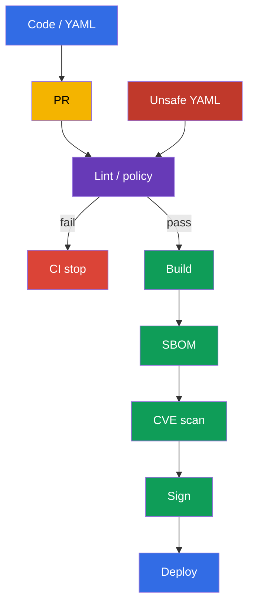
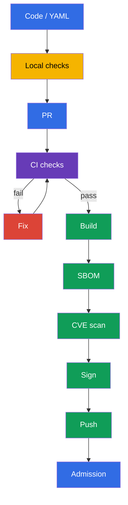

[Русская версия](ru.md) · [Versión en español](es.md) · [Version française](fr.md) · [Deutsche Version](de.md) · [ქართული ვერსია](ge.md) · [繁體中文版](tw.md) · [日本語版](jp.md)

# Chapter 27. Static analysis of workloads and images

> **The problem.** A syntactically correct manifest can silently add
> `privileged: true`, a root process, writable root filesystem, or an image with `:latest`, while a
> Dockerfile can introduce an unsafe build pattern. After a merge, that risk already enters CI and
> the cluster, where correcting it requires a rollout or incident response. Check
> source Dockerfile and manifests before build, push, and deploy.

> **What comes next.** In [Chapter 26](../26/README.md), we learned to allow a trusted registry and verify an artifact signature at admission. But a signature proves origin, not the absence of unsafe configuration: a signed Deployment can still run a root process, writable root filesystem, or an image tagged `latest`. Static analysis checks Dockerfile and Kubernetes manifests before push and deploy. This is the **Supply Chain Security** CKS domain (20%): fast feedback in local development and a mandatory CI gate.

> **What you need from CKA.** The `securityContext` fields found by linters - `runAsNonRoot`, `allowPrivilegeEscalation`, `readOnlyRootFilesystem`, capabilities, and `privileged` - are covered in [CKA Chapter 20](../../../cka/course/20/README.md). We do not repeat their syntax here; instead, we build automated checks that prevent an unsafe setting from being missed in Git.

> 🧠 Shift-left analysis moves the search for unsafe configuration into the pull request: fixing source before build and deploy is cheaper than responding to risk in a running workload.

## 27.1. Threat model: unsafe configuration enters the cluster with the code

The Kubernetes API accepts a syntactically valid manifest even if it conflicts with secure-by-default practice. A container running as UID 0, `privileged: true`, writable root filesystem, or an image with `:latest` can look like an ordinary review change. If the problem is found only after deploy, it is already available to an attacker and requires incident response rather than an inexpensive pull-request fix.

Static analysis reads source files without running the workload. It does not replace admission policy, signature verification, vulnerability scanning, or runtime detection: the tools answer different questions.



A typical scenario: a developer adds a `Deployment` for an API. They specify `image: api:latest`,
do not set `securityContext`, and the application temporarily needs a `/tmp` directory. Without a check,
the workload applies successfully and runs from an image that changes behind the same tag, as root and
with a writable filesystem. With `kube-linter`, `kubesec`, and custom policy, CI shows the specific
violations before merge. The fix becomes part of the change: a fixed tag or digest, non-root user,
dropped capabilities, and a separate `emptyDir` for writes.

| Control | Question | What it does not prove |
|---|---|---|
| `kubesec` | how secure is the manifest against a set of known controls? | that a rule matches your organization's policy |
| `kube-linter` | are Kubernetes best practices followed? | that the image contains no CVEs |
| `hadolint` | is the Dockerfile secure and reproducible? | that the final image matches runtime policy |
| `conftest` + OPA | does local policy-as-code pass? | that the policy is already connected to admission |
| Trivy, signature, admission | are there CVEs, is the artifact trusted, does the cluster admit it? | do not replace source linting |

In this chapter, `kubesec` and `kube-linter` are practice tools for analyzing Kubernetes manifests. `hadolint` and `conftest` are likewise useful in the course and lab tasks: the former analyzes a Dockerfile, while the latter checks an organization's local policy. On the exam, use only the tool and environment specified by the particular task.

A linter is a detector, not an authority. Every rule must be understood: the team must be able to explain the risk, choose a fix, or document acceptance of a temporary exception. Do not hide a systemic violation with global `--ignore`; limit an exception to a particular rule, file, and period, then remove it.

> 🔬 `kubesec` provides a security score and controls, but does not replace your organization's policy.

## 27.2. `kubesec`: scoring Kubernetes manifests

`kubesec` analyzes Kubernetes YAML and matches fields to security controls. The command outputs a score and a list of passed/failed checks. This is useful as a quick signal: negative findings often mean a missing `securityContext` or risky host access. A score is not proof of security and must not be the only CI gate: some legitimate workloads, such as a CNI DaemonSet, justifiably require extended privileges.

The manifest below is intentionally insecure. It exists only to demonstrate findings; do not apply it in production:

```yaml
# manifests/api.yaml
apiVersion: apps/v1
kind: Deployment
metadata:
  name: api
  namespace: payments
spec:
  replicas: 2
  selector:
    matchLabels:
      app: api
  template:
    metadata:
      labels:
        app: api
    spec:
      containers:
      - name: api
        image: registry.example.com/payments/api:latest
        ports:
        - containerPort: 8080
```

Run a scan for the file or pass YAML through stdin. In CI, use a pinned tool version in an approved builder image or a downloaded and verified binary; do not trust floating `latest` for the scanner itself.

```bash
kubesec scan manifests/api.yaml

# Convenient when generating YAML with a templating tool.
kustomize build overlays/prod | kubesec scan /dev/stdin
```

The report contains an overall score and detailed controls. In this example, expect findings around the following recommendations:

| Finding | Why it is dangerous | Practical fix |
|---|---|---|
| `Run as non-root user` | RCE gains UID 0 inside the container | add a non-root `USER` to the image and `runAsNonRoot: true` to the Pod |
| `Read-only root filesystem` | an attacker can write tools and alter runtime files | set `readOnlyRootFilesystem: true`; move writable paths to a volume |
| `Drop NET_RAW capability` or `Drop ALL capabilities` | extra capabilities expand process actions | `drop: ["ALL"]`; restore only a justified capability |
| A verified control from the pinned ruleset | risk and remediation depend on the text of that control | print `kubesec print-rules` for the pinned version before the gate; do not attribute a mutable-tag check to `kubesec` without such confirmation |

Follow the text of controls, not one score. For example, a score can increase after adding a securityContext, but the manifest can still allow an unknown registry - express that rule better in `conftest` and admission policy. When analyzing a Helm chart, scan its rendering; otherwise, the linter sees templates rather than the resources `kubectl` will send:

```bash
helm template payments-api ./chart --namespace payments \
  --values ./chart/values-production.yaml | kubesec scan /dev/stdin
```

Do not send private manifests to a public online scanner. A local binary or approved CI container retains source in your execution environment.

> 🎯 `kube-linter` is Kubernetes-oriented static analysis: read the finding, fix the manifest, and repeat lint until the result is clean.

## 27.3. `kube-linter`: checking Kubernetes best practices

`kube-linter` checks manifests and Helm charts with a set of Kubernetes-oriented checks. Unlike the `kubesec` score, its result usually identifies a specific resource, container, and check name. This is useful for a gate: lint returns a non-zero exit code when it finds errors.

```bash
# Check a directory with plain YAML.
kube-linter lint manifests/

# Check a chart and all its templates.
kube-linter lint ./chart

# Show available checks and their purposes.
kube-linter checks list
```

For the example `manifests/api.yaml`, typical findings are `run-as-non-root`, `no-read-only-root-fs`, and `latest-tag`. The exact set depends on the `kube-linter` version and enabled checks, so pin the version in CI and retain its output as a job artifact. Do not construct `image:` by concatenating an empty variable: that can turn an expected versioned tag into `latest`.

The fixed manifest adds defense in depth. The application must be compatible with UID `10001`; the image must also have a non-root `USER`, because the manifest does not fix an unsafe image when it runs locally. `emptyDir` gives the application its only writable location, while `readOnlyRootFilesystem` leaves the root immutable.

```yaml
# manifests/api.yaml
apiVersion: apps/v1
kind: Deployment
metadata:
  name: api
  namespace: payments
spec:
  replicas: 2
  selector:
    matchLabels:
      app: api
  template:
    metadata:
      labels:
        app: api
    spec:
      securityContext:
        runAsNonRoot: true
        runAsUser: 10001
        runAsGroup: 10001
      containers:
      - name: api
        image: registry.example.com/payments/api:1.4.2@sha256:<verified-64-character-digest>
        ports:
        - containerPort: 8080
        securityContext:
          allowPrivilegeEscalation: false
          readOnlyRootFilesystem: true
          capabilities:
            drop: ["ALL"]
        volumeMounts:
        - name: tmp
          mountPath: /tmp
      volumes:
      - name: tmp
        emptyDir: {}
```

After the change, run lint again. Clean output only means that the current set of checks found no violation; it does not eliminate the need for review and subsequent gates.

```bash
kube-linter lint manifests/
kubesec scan manifests/api.yaml
kubectl apply --dry-run=server -f manifests/api.yaml
```

`kubectl apply --dry-run=server` validates the API schema and admission without persisting the resource. This is a different signal from lint: the schema can be correct for an unsafe manifest, while a custom policy can reject a manifest accepted by a generic linter.

> 🏭 Version the set of checks, scope exceptions narrowly, and do not disable the security baseline for the entire repository because of one legacy workload.

### Configuring checks without weakening the entire pipeline

Some checks need configuration for a legacy workload. Without `doNotAutoAddDefaults: true`, `include` adds checks to the default set rather than replacing it. If you need an exactly reviewable security baseline, disable automatic addition of defaults and list the full set. Do not disable `run-as-non-root` for the entire repository because of one system DaemonSet: place the system manifest in a separate path, add a justified exception to the policy, and restrict who can change that exception.

```yaml
# .kube-linter.yaml
checks:
  doNotAutoAddDefaults: true
  include:
  - run-as-non-root
  - no-read-only-root-fs
  - privilege-escalation-container
  - privileged-container
  - drop-net-raw-capability
  - sensitive-host-mounts
  - docker-sock
  - latest-tag
```

Verify the names and availability of checks for the pinned version with `kube-linter checks list`; do not copy configuration between versions without checking it. CI must fail if it cannot load the configuration - silently falling back to default checks creates a false sense of protection.

> 🔬 `hadolint` is useful for Dockerfiles and image reproducibility, but it does not replace image scanning.

## 27.4. `hadolint`: analyzing a Dockerfile before building the image

A manifest protects runtime, but a security issue often begins in the Dockerfile: a mutable base image, `apt-get install` without cleanup, `curl | sh`, a root final user, or shell-form `CMD`. `hadolint` parses a Dockerfile and reports rules in `DL####` format. It does not build the image or execute `RUN`, so it is safer and faster to run than a build, but it does not replace build/test/scan.

```bash
hadolint Dockerfile

# Use stdin in an editor integration or CI.
hadolint - < Dockerfile
```

An example Dockerfile with common problems:

```dockerfile
FROM ubuntu:latest
RUN apt-get update
RUN apt-get install -y curl
COPY . /app
CMD python /app/server.py
```

Typical `hadolint` messages and the right response:

| Rule | Signal | Fix |
|---|---|---|
| `DL3002` | the final `USER` is root | set a non-root `USER` in the final stage; Pod-level `runAsNonRoot` remains an independent safeguard |
| `DL3007` | the `latest` tag is mutable | specify a concrete base-image version, and pin a digest for a release |
| `DL3008` | a package has no version | pin the version where the repository and your update strategy support it |
| `DL3009` | the `apt` cache remains | combine update/install/cleanup in one `RUN`, or use a suitable minimal base |
| `DL3059` | several sequential `RUN` instructions | combine logically related operations without making the Dockerfile less readable |
| `DL3025` | shell-form `CMD` | use JSON/exec form so the process receives signals correctly |

The `DL####` number refers to a specific rule, not a universal severity. Read its description first: sometimes a message affects reproducibility, and sometimes image size or signal handling. Do not use an inline ignore merely to make CI green. If an exception is justified, leave a short comment with the reason, issue, and review deadline.

Below is a minimal pattern for a Go service. The specific versions are illustrative: the release pipeline must supply a verified digest according to the internal registry and base-image update process. The final stage contains no package manager, compiler, or shell; the image-level `USER` and Pod-level securityContext complement each other.

```dockerfile
# syntax=docker/dockerfile:1.7
FROM golang:1.27.1-alpine3.24 AS build
WORKDIR /src
COPY go.mod go.sum ./
RUN go mod download
COPY . ./
RUN CGO_ENABLED=0 GOOS=linux go build -trimpath -ldflags="-s -w" \
    -o /out/api ./cmd/api

FROM scratch
COPY --from=build /out/api /api
USER 10001:10001
ENTRYPOINT ["/api"]
```

`hadolint` cannot see everything: it does not know whether `COPY . .` includes a secret, whether the binary architecture matches the node, or whether the base image has a CVE. Use `.dockerignore`, BuildKit secret mounts, unit tests, an SBOM, and the scanner from adjacent chapters. Lint helps reveal a structural error earlier; it does not replace supply-chain controls.

> 🔬 `conftest` extends generic lint with local Rego rules; test and version the policies themselves with `opa test`.

## 27.5. OPA `conftest`: checking policy-as-code for manifests

Generic linters know common best practices. Organizations usually add rules that depend on their threat model: only internal registries are allowed, a production namespace requires limits, every workload must have an owner label, and an exception is permitted only with a ticket and expiry. `conftest` runs OPA Rego policies against YAML, JSON, HCL, and other structured files, and returns a non-zero exit code when a rule produces `deny`.

The repository structure can look like this:

```text
.
├── Dockerfile
├── manifests/
│   └── api.yaml
└── policy/
    └── main.rego
```

The following Rego policy intentionally matches only `Deployment`, but checks regular/init containers and OCI references in image volumes. This is an intentionally limited learning scope, not a production-ready cluster-wide policy: production use separately adds Pod, StatefulSet, DaemonSet, Job/CronJob, and the corresponding template paths, or applies the same intent in an admission policy. The policy's task is to explicitly codify local immutable requirements: a trusted registry prefix and a valid immutable digest for every path to an OCI artifact, plus effective non-root execution, a read-only root filesystem, and a prohibition on privilege escalation for containers. In Kubernetes v1.36, [image volumes](https://v1-36.docs.kubernetes.io/docs/tasks/configure-pod-container/image-volumes/) are stable and enabled by default; their `spec.volumes[].image.reference` is not part of the generic container loop, so the policy checks it separately. `object.get` provides a safe default value for optional objects: therefore, a missing `securityContext` also produces a violation rather than leaving the rule undefined.

```rego
# policy/main.rego
package main

import rego.v1

workload if {
  object.get(input, "kind", "") == "Deployment"
}

pod_template := object.get(object.get(input, "spec", {}), "template", {})
pod_spec := object.get(pod_template, "spec", {})
pod_security_context := object.get(pod_spec, "securityContext", {})
containers := object.get(pod_spec, "containers", [])
init_containers := object.get(pod_spec, "initContainers", [])
all_containers := array.concat(containers, init_containers)

# Kubernetes v1.36 image volumes deliver an OCI artifact not through containers[].image,
# but through spec.volumes[].image.reference; apply the same registry/digest intent to it.
image_volumes := [volume |
  volume := object.get(pod_spec, "volumes", [])[_]
  object.get(volume, "image", null) != null
]

violation contains msg if {
  workload
  container := all_containers[_]
  image := object.get(container, "image", "")
  not startswith(image, "registry.example.com/")
  name := object.get(container, "name", "<unnamed>")
  msg := sprintf("container %q uses an unapproved registry: %s", [name, image])
}

# Require an actually immutable OCI reference. Kubernetes treats an image without a tag as
# :latest, and a short or invalid digest is not a SHA-256 pin.
violation contains msg if {
  workload
  container := all_containers[_]
  image := object.get(container, "image", "")
  not regex.match(`^.+@sha256:[A-Fa-f0-9]{64}$`, image)
  name := object.get(container, "name", "<unnamed>")
  msg := sprintf("container %q must use an image pinned by a valid SHA-256 digest", [name])
}

violation contains msg if {
  workload
  volume := image_volumes[_]
  reference := object.get(object.get(volume, "image", {}), "reference", "")
  not startswith(reference, "registry.example.com/")
  name := object.get(volume, "name", "<unnamed>")
  msg := sprintf("image volume %q uses an unapproved registry: %s", [name, reference])
}

violation contains msg if {
  workload
  volume := image_volumes[_]
  reference := object.get(object.get(volume, "image", {}), "reference", "")
  not regex.match(`^.+@sha256:[A-Fa-f0-9]{64}$`, reference)
  name := object.get(volume, "name", "<unnamed>")
  msg := sprintf("image volume %q must use an image pinned by a valid SHA-256 digest", [name])
}

# A container-level securityContext takes precedence over an overlapping Pod-level field.
violation contains msg if {
  workload
  container := all_containers[_]
  container_security_context := object.get(container, "securityContext", {})
  effective_run_as_non_root := object.get(
    container_security_context,
    "runAsNonRoot",
    object.get(pod_security_context, "runAsNonRoot", false)
  )
  effective_run_as_non_root != true
  name := object.get(container, "name", "<unnamed>")
  msg := sprintf("container %q must effectively runAsNonRoot: true", [name])
}

violation contains msg if {
  workload
  container := all_containers[_]
  container_security_context := object.get(container, "securityContext", {})
  object.get(container_security_context, "readOnlyRootFilesystem", false) != true
  name := object.get(container, "name", "<unnamed>")
  msg := sprintf("container %q must set readOnlyRootFilesystem: true", [name])
}

violation contains msg if {
  workload
  container := all_containers[_]
  container_security_context := object.get(container, "securityContext", {})
  object.get(container_security_context, "allowPrivilegeEscalation", true) != false
  name := object.get(container, "name", "<unnamed>")
  msg := sprintf("container %q must set allowPrivilegeEscalation: false", [name])
}

deny contains msg if {
  msg := violation[_]
}
```

Test the policy against bad and good fixtures. `conftest test` automatically reads the policy directory when it is located in `policy/`; the explicit `--policy` makes the CI invocation clear.

```bash
# It must print deny and return a non-zero exit code for the old manifest.
conftest test --policy policy manifests/api.yaml

# After fixing the policy and manifest, the command must return 0.
conftest test --policy policy manifests/
```

The policy also needs a test suite. Otherwise, a Rego change can accidentally remove a control while CI remains green. A separate `*_test.rego` tests expected deny/allow without running a cluster:

```rego
# policy/main_test.rego
package main

import rego.v1

test_denies_missing_security_context if {
  resource := {
    "kind": "Deployment",
    "spec": {"template": {"spec": {
      "containers": [{
        "name": "api",
        "image": "registry.example.com/payments/api:1.4.2",
      }],
    }}},
  }
  result := violation with input as resource
  "container \"api\" must effectively runAsNonRoot: true" in result
  "container \"api\" must set readOnlyRootFilesystem: true" in result
  "container \"api\" must set allowPrivilegeEscalation: false" in result
}

test_denies_dangerous_variants if {
  resource := {
    "kind": "Deployment",
    "spec": {"template": {"spec": {
      "securityContext": {"runAsNonRoot": false},
      "containers": [{
        "name": "api",
        "image": "docker.io/library/api:latest",
        "securityContext": {
          "readOnlyRootFilesystem": false,
          "allowPrivilegeEscalation": true,
        },
      }],
    }}},
  }
  result := violation with input as resource
  "container \"api\" uses an unapproved registry: docker.io/library/api:latest" in result
  "container \"api\" must use an image pinned by a valid SHA-256 digest" in result
  "container \"api\" must effectively runAsNonRoot: true" in result
  "container \"api\" must set readOnlyRootFilesystem: true" in result
  "container \"api\" must set allowPrivilegeEscalation: false" in result
}

test_denies_unapproved_registry_in_init_container if {
  resource := {
    "kind": "Deployment",
    "spec": {"template": {"spec": {
      "securityContext": {"runAsNonRoot": true},
      "initContainers": [{
        "name": "untrusted-init",
        "image": "docker.io/library/init@sha256:0123456789abcdef0123456789abcdef0123456789abcdef0123456789abcdef",
        "securityContext": {"readOnlyRootFilesystem": true, "allowPrivilegeEscalation": false},
      }],
      "containers": [{
        "name": "api",
        "image": "registry.example.com/payments/api@sha256:0123456789abcdef0123456789abcdef0123456789abcdef0123456789abcdef",
        "securityContext": {"readOnlyRootFilesystem": true, "allowPrivilegeEscalation": false},
      }],
    }}},
  }
  result := violation with input as resource
  "container \"untrusted-init\" uses an unapproved registry: docker.io/library/init@sha256:0123456789abcdef0123456789abcdef0123456789abcdef0123456789abcdef" in result
}

test_denies_untagged_image_container_override_and_unsafe_init if {
  resource := {
    "kind": "Deployment",
    "spec": {"template": {"spec": {
      "securityContext": {"runAsNonRoot": true},
      "initContainers": [{
        "name": "init",
        "image": "registry.example.com/payments/init",
        "securityContext": {"readOnlyRootFilesystem": false, "allowPrivilegeEscalation": false},
      }],
      "containers": [{
        "name": "api",
        "image": "registry.example.com/payments/api@sha256:0123456789abcdef0123456789abcdef0123456789abcdef0123456789abcdef",
        "securityContext": {"runAsNonRoot": false, "readOnlyRootFilesystem": true, "allowPrivilegeEscalation": false},
      }],
    }}},
  }
  result := violation with input as resource
  "container \"init\" must use an image pinned by a valid SHA-256 digest" in result
  "container \"api\" must effectively runAsNonRoot: true" in result
  "container \"init\" must set readOnlyRootFilesystem: true" in result
}

test_denies_untrusted_unpinned_image_volume if {
  resource := {
    "kind": "Deployment",
    "spec": {"template": {"spec": {
      "securityContext": {"runAsNonRoot": true},
      "volumes": [{
        "name": "model",
        "image": {"reference": "docker.io/library/model:latest"},
      }],
      "containers": [{
        "name": "api",
        "image": "registry.example.com/payments/api@sha256:0123456789abcdef0123456789abcdef0123456789abcdef0123456789abcdef",
        "securityContext": {"readOnlyRootFilesystem": true, "allowPrivilegeEscalation": false},
      }],
    }}},
  }
  result := violation with input as resource
  "image volume \"model\" uses an unapproved registry: docker.io/library/model:latest" in result
  "image volume \"model\" must use an image pinned by a valid SHA-256 digest" in result
}

test_allows_hardened_workload if {
  resource := {
    "kind": "Deployment",
    "spec": {"template": {"spec": {
      "securityContext": {"runAsNonRoot": true},
      "containers": [{
        "name": "api",
        "image": "registry.example.com/payments/api:1.4.2@sha256:0123456789abcdef0123456789abcdef0123456789abcdef0123456789abcdef",
        "securityContext": {
          "readOnlyRootFilesystem": true,
          "allowPrivilegeEscalation": false,
        },
      }],
    }}},
  }
  result := violation with input as resource
  count(result) == 0
}
```

```bash
opa test policy/ -v
```

In production, duplicate critical policy in an admission controller, such as Kyverno, Gatekeeper, or ValidatingAdmissionPolicy, where applicable. `conftest` protects the Git -> CI path; admission protects the API from manual `kubectl apply`, another pipeline, and a misconfigured job. Policies should have one source or tests that confirm their equivalent intent, otherwise they diverge over time.

> 🏭 Static analysis becomes a safeguard only as a mandatory, reproducible CI gate with pinned tools, reports, and managed exceptions.

## 27.6. CI gate and the "fix - re-run the check" cycle

Static analysis is useful only when its result affects delivery. A local run provides fast feedback, but a mandatory CI job makes the check reproducible for every pull request. The pipeline must install or use pinned releases, retain reports as artifacts, and stop build/push on error. Do not upload manifests with production secrets to a scanner or print secrets in logs.

The minimum sequence:



For this chapter's practice, the gate can run `kubesec` and `kube-linter`; add `hadolint` for the Dockerfile and `conftest` with unit tests for complete local checking. The GitHub Actions job below shows an extended sequence rather than prescribing one CI provider. On the exam, use the tool and environment specified by the task. In a real pipeline, replace floating `curl` downloads with an internal, verified tool image or a pinned action/image digest; use a lockfile or verified checksums for binaries. Add `helm template` or `kustomize build` before the linters if the production deployment uses templates.

```yaml
# .github/workflows/static-analysis.yaml
name: static-analysis
on:
  pull_request:
    paths:
    - 'Dockerfile'
    - 'manifests/**'
    - 'policy/**'

jobs:
  lint:
    runs-on: ubuntu-24.04
    permissions:
      contents: read
    steps:
    - uses: actions/checkout@<verified-action-digest>

    - name: Hadolint
      run: hadolint Dockerfile

    - name: Kubernetes best-practice checks
      run: kube-linter lint manifests/

    - name: Kubernetes security score gate
      shell: bash
      run: |
        set -euo pipefail
        kubesec scan manifests/api.yaml --format json \
          | tee kubesec-report.json \
          | jq -e '
              type == "array"
              and length > 0
              and all(.[];
                .valid == true
                and ((.scoring.critical // []) | length == 0)
                and ((.score? | type) == "number")
                and .score > 0
              )
            ' > /dev/null

    - name: Organisation policy
      run: conftest test --policy policy manifests/

    - name: Policy unit tests
      run: opa test policy/ -v

    - name: Save static-analysis report
      uses: actions/upload-artifact@<verified-action-digest>
      with:
        name: static-analysis-report
        path: kubesec-report.json
```

Check the exit code and a machine-verifiable result, not the presence of text in stdout. `tee` only retains the JSON, and `pipefail` only prevents the scanner's own failure from being hidden: neither makes a security gate. `kubesec` default JSON is an array of results; the overall score combines positive and negative points, while `scoring.critical` is a separate list of critical findings. Therefore, `jq -e` must check every element: schema validity, no critical findings, and a versioned numeric score threshold. In the example below, an empty array, invalid result, critical finding, non-numeric score, or score `<= 0` causes the command to exit non-zero. If a specific critical rule is deliberately allowed, create a narrow versioned exception with an owner and expiry instead of offsetting it with an overall score.

```bash
set -euo pipefail
kubesec scan manifests/api.yaml --format json \
  | tee kubesec-report.json \
  | jq -e '
      type == "array"
      and length > 0
      and all(.[];
        .valid == true
        and ((.scoring.critical // []) | length == 0)
        and ((.score? | type) == "number")
        and .score > 0
      )
    ' > /dev/null
```

> 🎯 A general skill: find the finding, fix the source Dockerfile or manifest, and repeat the scan until the exit code succeeds; do not hide the problem with a global ignore.

### Practical remediation cycle

1. Create or use a manifest with `:latest` and without `runAsNonRoot`, `readOnlyRootFilesystem`, and `allowPrivilegeEscalation`.
2. Run `kubesec scan`, `kube-linter lint`, and `conftest test`. Retain the initial output: it explains why CI must stop.
3. Fix the source, not the output: a versioned tag/digest, image-level non-root user, Pod `securityContext`, `drop: ["ALL"]`, and `emptyDir` for the actual writable directory.
4. Run all checks again, including `hadolint Dockerfile` and `opa test policy/`. Verify that the commands return `0`.
5. Check API compatibility without creating the workload: `kubectl apply --dry-run=server -f manifests/`. If production uses a rendered chart, check the rendered YAML itself.
6. Run build, SBOM, image scan, signing, and deployment gates only after the static-analysis gate is green. Do not change CI to "warning only" until the team has decided what risk acceptance is permitted.

Below is a compact local script that implements the same gate. It intentionally exits on the first error; the developer must fix the finding and run the script again.

```bash
#!/usr/bin/env bash
# scripts/static-analysis.sh
set -euo pipefail

hadolint Dockerfile
kube-linter lint manifests/
kubesec scan manifests/api.yaml --format json \
  | tee kubesec-report.json \
  | jq -e '
      type == "array"
      and length > 0
      and all(.[];
        .valid == true
        and ((.scoring.critical // []) | length == 0)
        and ((.score? | type) == "number")
        and .score > 0
      )
    ' > /dev/null
conftest test --policy policy manifests/
opa test policy/ -v
kubectl apply --dry-run=server -f manifests/
```

Common mistakes and diagnostics:

| Symptom | Cause | What to do |
|---|---|---|
| `kube-linter` still reports `run-as-non-root` | the field was added outside `spec.template.spec`, or a specific container override cancels the setting | check the rendered resource with `kubectl kustomize`/`helm template` and the `spec.template.spec.securityContext` path |
| the application fails after `readOnlyRootFilesystem: true` | the process writes a cache, PID, or temporary file to the root filesystem | identify the path from logs, mount a narrow `emptyDir` only there; do not disable the entire read-only root |
| `hadolint` passes but the image runs as root | the Dockerfile has no `USER`, while the manifest checks only cluster runtime | add a non-root `USER` in the final stage and keep the manifest guard |
| `conftest` does not find a rule | a template was passed instead of rendered YAML, or the `--policy` path is incorrect | test the input fixture, run `opa test`, then lint the rendered output itself |
| CI is green after `kubesec ... | tee` | `tee` retained JSON, but the security result was not checked | enable `set -o pipefail` and `jq -e`: check `.valid == true`, an empty `scoring.critical`, and a versioned score threshold for the entire JSON array |
| a critical system workload needs an exception | the rule is applied equally to the application and CNI/CSI | use a separate scope and a least-privilege exception with an owner, ticket, and expiry; do not use a global ignore |

> 🏭 Lint the final rendered YAML, retain scanner results and versions, and align critical rules with admission policy to prevent CI bypass.

## 27.7. How this is applied in production

- **Lint runs before build.** The developer receives feedback in pre-commit/editor or a separate CI job before spending resources on build, push, and an integration environment. A PR cannot be merged until mandatory findings are fixed or a narrow exception is approved.
- **Tools and rules are pinned.** Versions of `kube-linter`, `kubesec`, `hadolint`, `conftest`, and OPA are pinned in a trusted CI image or lockfile. Updating rules undergoes review: a new version can add legitimate findings but must not silently weaken the gate.
- **The final YAML is checked.** Helm/Kustomize/GitOps can change values, images, and securityContext. CI lints the rendered artifact that will be signed/applied, not only the template source.
- **Policy-as-code lives alongside application and platform policy.** Team rules are tested with `opa test`; mandatory cluster-wide controls are duplicated or centralized in admission. An exception has an owner, reason, and expiry date.
- **Static analysis is part of the chain.** It is followed by SBOM, vulnerability scanning, signing, and registry promotion; admission applies before runtime. Runtime controls find what source inspection cannot see.
- **Reports are fit for audit.** CI retains the scanner version, results, and a link to the commit. Reports must not include credentials, private keys, or production Secret data.

## 27.8. Mini-glossary

- **Static analysis** - checking source Dockerfiles, manifests, and policy without running a workload.
- **`kubesec`** - a scanner for Kubernetes manifests that produces a security score and controls.
- **`kube-linter`** - a linter for Kubernetes YAML and Helm charts with a set of best-practice checks.
- **`hadolint`** - a Dockerfile linter; rules are identified by `DL####` codes.
- **OPA (Open Policy Agent)** - a policy engine that executes declarative Rego rules.
- **`conftest`** - a CLI for checking structured configuration with OPA/Rego rules.
- **Rego** - the OPA policy language.
- **CI gate** - a mandatory check that blocks the next pipeline stage on a non-zero exit code.
- **Rendered manifest** - the final YAML after `helm template` or `kustomize build`.
- **False positive** - a finding that does not apply to a particular resource; it requires a narrow, documented exception rather than globally disabling the control.

## 27.9. Chapter summary

- A Kubernetes manifest can be valid for the API but unsafe; static analysis finds such mistakes before deployment and turns security practice into a repeatable CI gate.
- In the course practice, `kubesec` shows a score and security controls, while `kube-linter` checks Kubernetes best practices, including non-root, a read-only root filesystem, and mutable tags. The `kubesec` gate parses the JSON array and checks validity, the absence of `scoring.critical`, and a versioned score threshold for each result.
- `hadolint` detects Dockerfile structural problems through `DL####` rules, including `DL3002` for a root final user, but does not replace image build, secret handling, or CVE scanning.
- `conftest` executes versioned Rego policy for organization-specific requirements; the policy itself must have tests through `opa test`, including for missing fields and unsafe values. In Kubernetes v1.36, policy must separately cover OCI references in image volumes, which are not container images.
- A fix means changing the Dockerfile/manifest/policy so that all linters and server dry-run return `0` again.
- Lint does not replace SBOM, vulnerability scanning, signing, or admission: these are sequential layers of supply-chain defense.

## 27.10. How this helps: on the exam and in real work

**On the exam.** Practice with `kubesec`, `kube-linter`, `hadolint`, and `conftest` helps you read a finding and fix a `securityContext`, image reference, Dockerfile, or local policy. These tools should not be considered a mandatory part of the exam or assumed to be available in its environment: use only the tool and environment specified by the task. Remember the connection to SecurityContext: `runAsNonRoot`, `allowPrivilegeEscalation: false`, `readOnlyRootFilesystem: true`, and `capabilities.drop: ["ALL"]` are a typical baseline that analysis tools may check. For CI, it is important to understand that a failure must block artifact promotion, and the check is run again after the fix.

**In real work.** Static analysis makes secure configuration a habitual quality of code: the finding is visible to the PR author, not to the security team after production deployment. Combining generic linters, tested Rego policy, rendered-manifest checks, and a mandatory CI gate reduces the likelihood of root workloads, mutable images, and unapproved registries. The pipeline then continues to verify the artifact bytes: SBOM, CVE scanning, signatures, and admission protect against risks lint cannot see.

## 27.11. Self-check questions

<details>
<summary>1. Why can successfully applied Kubernetes YAML still be unsafe?</summary>

The API checks syntax and schema, but does not consider a root process, a writable root filesystem, `privileged: true`, or `:latest` to be an error. Such a manifest can successfully create a workload while violating secure-by-default practice. Static analysis finds these risks before merge and deployment, while admission and runtime controls complement it later.
</details>

<details>
<summary>2. How does a `kubesec` score differ from your organization's mandatory policy?</summary>

`kubesec` provides a score and findings for known controls - a fast general signal, not authority for a specific organization. An organizational policy can require, for example, an internal registry, a valid digest, or an owner label, which a generic score does not prove. Such invariants are formalized in versioned Rego through `conftest` and, if needed, duplicated in admission.
</details>

<details>
<summary>3. What typical findings does `kube-linter` report for a regular application container?</summary>

For an example without hardening, typical checks are `run-as-non-root`, `no-read-only-root-fs`, and `latest-tag`. Checks for `allowPrivilegeEscalation`, `privileged`, capabilities, sensitive host mounts, and the docker socket are also useful. The exact set depends on the pinned version and enabled checks, so verify it with `kube-linter checks list`.
</details>

<details>
<summary>4. Why does `hadolint` not replace a vulnerability scanner, and why should you read the specific `DL####`?</summary>

Hadolint parses the Dockerfile, but does not build the image, execute `RUN`, or match packages against a CVE database. A scanner is needed for the final image and its dependencies, while hadolint catches structural issues such as a root final user, a mutable base tag, or shell-form `CMD`. Read the `DL####` code because its meaning can relate to security, reproducibility, image size, or signal handling.
</details>

<details>
<summary>5. How do `conftest` and Rego help check a trusted registry or mandatory `securityContext`?</summary>

`conftest test` passes YAML to a Rego policy and returns non-zero when a rule produces `deny`. The example policy checks the `registry.example.com/` prefix and SHA-256 digest for regular/init containers and image volumes, as well as effective `runAsNonRoot`, `readOnlyRootFilesystem`, and `allowPrivilegeEscalation` for containers. `opa test` tests protect the policy itself from accidental weakening.
</details>

<details>
<summary>6. Why should CI scan rendered Helm/Kustomize output rather than only templates?</summary>

Templates are not yet the resource sent to the API: values, Kustomize, and GitOps can change the image or `securityContext`. The linter and policy must see the final rendered manifest. Otherwise, CI can be green for a template while deployment receives a different unsafe configuration.
</details>

<details>
<summary>7. What should be done after a finding: disable the rule, fix the source, or accept a narrow exception?</summary>

The normal path is to fix the source Dockerfile, manifest, or policy and repeat the checks. A global `--ignore` hides a systemic violation; limit a legitimate exception to a specific rule and scope, and document its reason, owner, and review deadline. After a fix, lint, `conftest`, policy tests, and server dry-run must pass again.
</details>

<details>
<summary>8. Why is `set -o pipefail` important for a scanner command whose output is passed to `tee`?</summary>

Without `pipefail`, the shell can return the status of the last successful `tee` command and hide a scanner failure. It retains the source command's failure across the pipeline. However, that is insufficient for `kubesec`: explicitly check the JSON with `jq -e` for each array element - `.valid == true`, an empty `scoring.critical`, and a versioned score threshold; one positive score does not offset a critical finding.
</details>

<details>
<summary>9. **Flashback (Chapter 07).** `kube-bench`/CIS Benchmark (Chapter 07) and `kubesec`/`kube-linter` (this chapter) both statically check configuration, but at different stages: one checks an already running control plane/node, the other checks a manifest before deployment. If both tools are technically available, which catches an unsafe setting first, and why is earlier detection usually cheaper?</summary>

`kubesec` and `kube-linter` check a manifest before build/deployment, while `kube-bench` sees an already running control plane or node. An early finding is fixed in a pull request before publishing the artifact and starting the workload, without incident response, rollout, or downtime. `kube-bench` is still needed to check the actual infrastructure configuration that the manifest does not cover.
</details>

## Practice

In this chapter, we stopped an unsafe Dockerfile or manifest before build and deployment. Next, in [Chapter 28](../28/README.md), we will check the already built image for CVEs: lint speaks to configuration, while a scanner speaks to known vulnerabilities in bytes and packages. The complete Lab 111 chain combines static analysis, SBOM, image scanning, and signing.

🧪 Lab 111 (Supply chain: analysis, Trivy, SBOM, signing): [tasks/cks/labs/111](../../labs/111/README.MD)
🌐 Additional interactive practice (killer.sh/killercoda, external resource): [static-manual-analysis-k8s](https://killercoda.com/killer-shell-cks/scenario/static-manual-analysis-k8s) · [static-manual-analysis-docker](https://killercoda.com/killer-shell-cks/scenario/static-manual-analysis-docker)

📘 CKA foundation: [SecurityContext and capabilities](../../../cka/course/20/README.md)

## Reference materials

- [kubesec: Kubernetes resource security analysis](https://kubesec.io/)
- [kube-linter documentation](https://docs.kubelinter.io/)
- [hadolint: Dockerfile linter](https://github.com/hadolint/hadolint)
- [Open Policy Agent: Rego documentation](https://www.openpolicyagent.org/docs/latest/)

---
[Table of contents](../README.md) · [Chapter 26](../26/README.md) · [Chapter 28](../28/README.md)
