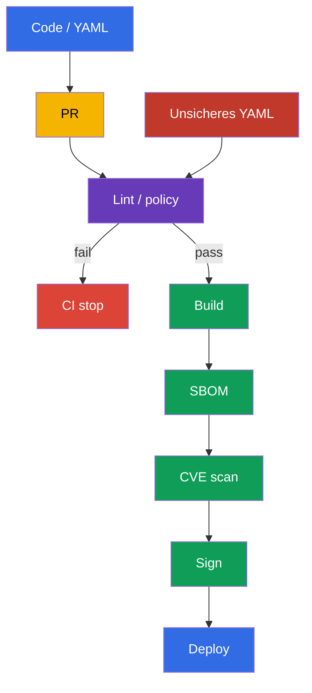
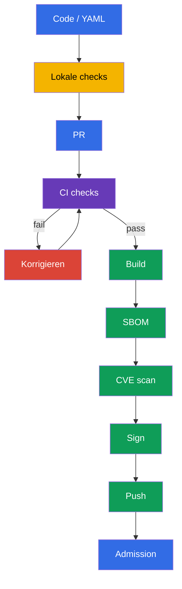

[Русская версия](ru.md) · [Eng version](README.md) · [Versión en español](es.md) · [Version française](fr.md) · [ქართული ვერსია](ge.md) · [繁體中文版](tw.md) · [日本語版](jp.md)

# Kapitel 27. Statische Analyse von Workloads und Images

> **Das Problem.** Ein syntaktisch korrektes Manifest kann unbemerkt `privileged: true`, einen root-Prozess, ein writable root filesystem oder eine image mit `:latest` enthalten, und ein Dockerfile kann ein unsicheres build-Pattern einführen. Nach dem merge gelangt dieses Risiko bereits in CI und den Cluster, wo die Korrektur einen rollout oder incident response erfordert. Nötig ist eine Prüfung der Quell-Dockerfile und -manifests vor build, push und deploy.

> **Was folgt.** In [Kapitel 26](../26/de.md) haben wir gelernt, ein trusted registry zuzulassen und die Signatur eines artifact bei admission zu prüfen. Doch eine Signatur belegt die Herkunft, nicht das Fehlen unsicherer Konfiguration: Ein signiertes Deployment kann weiterhin einen root-Prozess, ein writable root filesystem oder eine image mit dem tag `latest` ausführen. Statische Analyse prüft Dockerfile und Kubernetes manifests vor push und deploy. Dies ist die Domain **Supply Chain Security** von CKS (20 %): schnelles feedback in der lokalen Entwicklung und ein obligatorisches gate in CI.

> **Was Sie aus CKA wissen müssen.** Die Felder von `securityContext`, die Linter erkennen - `runAsNonRoot`, `allowPrivilegeEscalation`, `readOnlyRootFilesystem`, capabilities und `privileged` - werden in [CKA-Kapitel 20](../../../cka/course/20/de.md) behandelt. Hier wiederholen wir nicht ihre Syntax, sondern bauen automatische Prüfungen, die eine unsichere Einstellung in Git nicht durchrutschen lassen.

> 🧠 Shift-left-Analyse verlagert die Suche nach unsicherer Konfiguration in den pull request: Die Korrektur des source vor build und deploy ist billiger als die Reaktion auf ein Risiko in einem laufenden Workload.

## 27.1. Bedrohungsmodell: unsichere Konfiguration gelangt zusammen mit dem Code in den Cluster

Die Kubernetes API akzeptiert ein syntaktisch valides Manifest, auch wenn es der secure-by-default Praxis widerspricht. Ein Container mit UID 0, `privileged: true`, ein writable root filesystem oder eine image mit `:latest` können im review wie eine gewöhnliche Änderung aussehen. Wird das Problem erst nach dem deploy gefunden, ist es bereits für einen Angreifer verfügbar und erfordert incident response statt einer kostengünstigen Korrektur im pull request.

Statische Analyse liest die Quelldateien, ohne den workload auszuführen. Sie ersetzt keine admission policy, signature verification, vulnerability scanning oder runtime detection: Die Werkzeuge beantworten unterschiedliche Fragen.



Typisches Szenario: Ein Entwickler fügt ein `Deployment` für eine API hinzu. Er gibt `image: api:latest` an, definiert kein `securityContext`, und die Anwendung benötigt vorübergehend das Verzeichnis `/tmp`. Ohne Prüfung wird der workload erfolgreich angewendet und läuft mit einer image, die sich unter demselben tag ändert, als root und mit writable filesystem. Mit `kube-linter`, `kubesec` und einer eigenen policy zeigt CI konkrete Verstöße vor dem merge. Die Korrektur wird Teil der Änderung: fixierter tag oder digest, non-root user, entfernte capabilities und ein separates `emptyDir` zum Schreiben.

| Control | Frage | Was es nicht belegt |
|---|---|---|
| `kubesec` | Wie sicher ist das Manifest nach einer Menge bekannter controls? | dass eine rule der policy genau Ihrer Organisation entspricht |
| `kube-linter` | Werden Kubernetes best practices eingehalten? | dass die image keine CVE enthält |
| `hadolint` | Ist das Dockerfile sicher und reproduzierbar? | dass die final image der runtime policy entspricht |
| `conftest` + OPA | Wird lokale policy-as-code erfüllt? | dass die policy bereits an admission angebunden ist |
| Trivy, Signatur, admission | Gibt es CVEs, ist das artifact trusted, lässt der Cluster es zu? | ersetzen kein lint der Quellen |

In diesem Kapitel dienen `kubesec` und `kube-linter` als Werkzeuge der Praxis zur Analyse von Kubernetes manifests. `hadolint` und `conftest` sind im Kurs und in den Labs ebenso nützlich: Ersteres analysiert das Dockerfile, letzteres prüft die lokale policy der Organisation. Verwenden Sie im Examen nur das Werkzeug und die Umgebung, die in der konkreten Aufgabe angegeben sind.

Ein Linter ist ein detector, keine authority. Jede Regel muss verständlich sein: Das Team muss in der Lage sein, das Risiko zu erklären, eine Korrektur zu wählen oder eine temporäre Ausnahme dokumentiert zu akzeptieren. Verbergen Sie einen systemischen Verstoß nicht mit einem globalen `--ignore`; beschränken Sie die Ausnahme auf eine konkrete rule, eine Datei und eine Frist und entfernen Sie sie anschließend.

> 🔬 `kubesec` liefert einen security score und controls, ersetzt aber nicht die policy Ihrer Organisation.

## 27.2. `kubesec`: Scoring von Kubernetes manifests

`kubesec` analysiert Kubernetes YAML und gleicht Felder mit security controls ab. Der Befehl gibt einen score und eine Liste bestandener/fehlgeschlagener checks aus. Das ist als schnelles Signal nützlich: Ein negatives finding bedeutet oft ein fehlendes `securityContext` oder riskanten host access. Der score ist kein Sicherheitsbeleg und darf nicht das einzige CI gate sein: Manche legitimen workloads, etwa ein CNI DaemonSet, benötigen berechtigterweise erweiterte Privilegien.

Unten ein absichtlich unsicheres Manifest. Es dient nur zur Demonstration des finding, wenden Sie es nicht in Production an:

```yaml
# manifests/api.yaml
apiVersion: apps/v1
kind: Deployment
metadata:
  name: api
  namespace: payments
spec:
  replicas: 2
  selector:
    matchLabels:
      app: api
  template:
    metadata:
      labels:
        app: api
    spec:
      containers:
      - name: api
        image: registry.example.com/payments/api:latest
        ports:
        - containerPort: 8080
```

Führen Sie den scan für eine Datei aus oder übergeben Sie YAML über stdin. Verwenden Sie in CI eine fixierte Version des Werkzeugs in einer genehmigten builder image oder ein heruntergeladenes und geprüftes binary; vertrauen Sie nicht einem floating `latest` des scanners selbst.

```bash
kubesec scan manifests/api.yaml

# Nützlich, wenn YAML von einem Templater generiert wird.
kustomize build overlays/prod | kubesec scan /dev/stdin
```

Der report enthält einen Gesamt-score und detaillierte controls. In diesem Beispiel sind finding etwa zu folgenden Empfehlungen zu erwarten:

| Finding | Warum gefährlich | Praktische Korrektur |
|---|---|---|
| `Run as non-root user` | Ein RCE erhält UID 0 im Container | einen non-root `USER` in der image ergänzen und `runAsNonRoot: true` im Pod setzen |
| `Read-only root filesystem` | Ein Angreifer kann Tools schreiben und runtime-Dateien ändern | `readOnlyRootFilesystem: true` setzen; writable path in ein volume auslagern |
| `Drop NET_RAW capability` oder `Drop ALL capabilities` | überflüssige capabilities erweitern die möglichen Aktionen des Prozesses | `drop: ["ALL"]`, nur eine begründete capability zurückgeben |
| geprüfte control aus einer fixierten rule-Menge | Risiko und Korrektur hängen vom Text dieser control ab | vor dem gate `kubesec print-rules` für die fixierte Version ausgeben; die Prüfung des mutable tag nicht ohne diese Bestätigung `kubesec` zuschreiben |

Orientieren Sie sich am Text der controls, nicht nur an einem score. Der score kann zum Beispiel nach dem Ergänzen des securityContext steigen, während das Manifest weiterhin eine unbekannte registry erlaubt - diese Regel lässt sich besser in `conftest` und einer admission policy ausdrücken. Scannen Sie beim Analysieren eines Helm chart das rendering, sonst sieht der Linter templates statt der Ressourcen, die `kubectl` sendet:

```bash
helm template payments-api ./chart --namespace payments \
  --values ./chart/values-production.yaml | kubesec scan /dev/stdin
```

Senden Sie private manifests nicht an einen öffentlichen online scanner. Ein lokales binary oder ein genehmigter CI container belässt die Quellen in Ihrer execution environment.

> 🎯 `kube-linter` - Kubernetes-orientierte statische Analyse: Lesen Sie das finding, korrigieren Sie das Manifest und wiederholen Sie das lint bis zu einem sauberen Ergebnis.

## 27.3. `kube-linter`: Prüfung von Kubernetes best practices

`kube-linter` prüft manifests und Helm charts mit einer Menge Kubernetes-orientierter checks. Anders als der score von `kubesec` verknüpft das Ergebnis üblicherweise eine konkrete resource, einen container und einen check name. Das ist für ein gate praktisch: lint liefert einen non-zero exit code, wenn errors gefunden werden.

```bash
# Ein Verzeichnis mit plain YAML prüfen.
kube-linter lint manifests/

# Ein chart und alle seine templates prüfen.
kube-linter lint ./chart

# Verfügbare checks und ihren Zweck anzeigen.
kube-linter checks list
```

Für das Demonstrationsmanifest `manifests/api.yaml` sind `run-as-non-root`, `no-read-only-root-fs` und `latest-tag` typisch. Die genaue Zusammensetzung hängt von der Version von `kube-linter` und den enabled checks ab, fixieren Sie daher die Version in CI und speichern Sie ihre Ausgabe als artifact des job. Bilden Sie `image:` nicht durch Konkatenation mit einer leeren Variable: Das kann einen erwarteten versioned tag in `latest` verwandeln.

Das korrigierte Manifest fügt defense in depth hinzu. Die Anwendung muss mit UID `10001` kompatibel sein; die image muss ebenfalls einen non-root `USER` haben, weil das Manifest eine unsichere image bei lokalem Start nicht korrigiert. `emptyDir` gibt der Anwendung den einzigen writable Ort, und `readOnlyRootFilesystem` lässt das root-Verzeichnis immutable.

```yaml
# manifests/api.yaml
apiVersion: apps/v1
kind: Deployment
metadata:
  name: api
  namespace: payments
spec:
  replicas: 2
  selector:
    matchLabels:
      app: api
  template:
    metadata:
      labels:
        app: api
    spec:
      securityContext:
        runAsNonRoot: true
        runAsUser: 10001
        runAsGroup: 10001
      containers:
      - name: api
        image: registry.example.com/payments/api:1.4.2@sha256:<geprüfter-64-Zeichen-digest>
        ports:
        - containerPort: 8080
        securityContext:
          allowPrivilegeEscalation: false
          readOnlyRootFilesystem: true
          capabilities:
            drop: ["ALL"]
        volumeMounts:
        - name: tmp
          mountPath: /tmp
      volumes:
      - name: tmp
        emptyDir: {}
```

Führen Sie nach der Änderung lint erneut aus. Eine saubere Ausgabe bedeutet nur, dass die aktuelle Menge der checks keinen Verstoß gefunden hat; sie hebt weder review noch die nächsten gates auf.

```bash
kube-linter lint manifests/
kubesec scan manifests/api.yaml
kubectl apply --dry-run=server -f manifests/api.yaml
```

`kubectl apply --dry-run=server` prüft das API schema und admission, ohne die resource zu speichern. Das ist ein anderes Signal als lint: Das schema kann bei einem unsicheren Manifest korrekt sein, und eine custom policy kann ein Manifest ablehnen, mit dem ein generic linter einverstanden ist.

> 🏭 Versionieren Sie die Menge der checks, beschränken Sie Ausnahmen auf einen konkreten scope und deaktivieren Sie die security baseline nicht für das ganze repository wegen eines einzelnen legacy-workloads.

### Checks konfigurieren, ohne die gesamte pipeline abzuschwächen

Manche checks erfordern eine Anpassung für einen legacy workload. `include` ohne `doNotAutoAddDefaults: true` fügt checks zur default-Menge hinzu, statt sie zu ersetzen. Brauchen Sie eine exakt überschaubare security baseline, deaktivieren Sie das Autoadd der defaults und listen Sie die gesamte Menge auf. Deaktivieren Sie `run-as-non-root` nicht für das gesamte repository wegen eines einzelnen systemischen DaemonSet: Trennen Sie das system-Manifest in einen eigenen Pfad, ergänzen Sie eine Ausnahme in der policy mit Begründung und beschränken Sie den Zugriff auf die Änderung dieser Ausnahme.

```yaml
# .kube-linter.yaml
checks:
  doNotAutoAddDefaults: true
  include:
  - run-as-non-root
  - no-read-only-root-fs
  - privilege-escalation-container
  - privileged-container
  - drop-net-raw-capability
  - sensitive-host-mounts
  - docker-sock
  - latest-tag
```

Prüfen Sie Namen und Verfügbarkeit der checks für die fixierte Version über `kube-linter checks list`; kopieren Sie die Konfiguration nicht ungeprüft zwischen Versionen. CI muss bei einer nicht ladbaren configuration fehlschlagen - ein stiller Übergang zu default checks erzeugt ein falsches Sicherheitsgefühl.

> 🔬 `hadolint` ist für Dockerfile und die Reproduzierbarkeit der image nützlich, ersetzt aber keinen image scan.

## 27.4. `hadolint`: Analyse des Dockerfile vor dem Bau der image

Das Manifest schützt den Start, aber ein security issue beginnt oft im Dockerfile: eine mutable base image, `apt-get install` ohne cleanup, `curl | sh`, ein root final user oder die shell form von `CMD`. `hadolint` zerlegt das Dockerfile und meldet Regeln im Format `DL####`. Es baut keine image und führt kein `RUN` aus, daher ist der Lauf sicherer und schneller als ein build, ersetzt aber nicht build/test/scan.

```bash
hadolint Dockerfile

# stdin in der editor integration oder CI verwenden.
hadolint - < Dockerfile
```

Ein Dockerfile-Beispiel mit verbreiteten Problemen:

```dockerfile
FROM ubuntu:latest
RUN apt-get update
RUN apt-get install -y curl
COPY . /app
CMD python /app/server.py
```

Typische `hadolint`-Meldungen und die richtige Reaktion:

| Rule | Signal | Korrektur |
|---|---|---|
| `DL3002` | der letzte `USER` ist root | im final stage einen non-root `USER` angeben; das Pod-level `runAsNonRoot` bleibt ein unabhängiger Schutz |
| `DL3007` | der tag `latest` ist mutable | eine konkrete Version der base image angeben und für ein release einen digest fixieren |
| `DL3008` | ein Paket ohne Version | die Version fixieren, wo dies das repository und Ihre Update-Strategie unterstützen |
| `DL3009` | ein `apt`-cache bleibt zurück | update/install/cleanup in einem `RUN` zusammenfassen oder eine passende minimal base verwenden |
| `DL3059` | mehrere aufeinanderfolgende `RUN` | logisch zusammengehörende Operationen zusammenfassen, ohne die Lesbarkeit zu verschlechtern |
| `DL3025` | shell form von `CMD` | die JSON/exec form verwenden, damit der process signals korrekt erhält |

Die Nummer `DL####` ist ein Verweis auf eine konkrete rule, kein universeller severity-Wert. Lesen Sie zuerst ihre Beschreibung: Manche Meldung betrifft reproducibility, manche die image size oder signal handling. Verwenden Sie ein inline ignore nicht nur, um ein grünes CI zu erhalten. Ist eine Ausnahme begründet, hinterlassen Sie einen kurzen Kommentar mit Grund, issue und Frist für die Überprüfung.

Unten ein minimales Pattern für einen Go service. Die konkreten Versionen sind illustrativ: Die release pipeline muss einen geprüften digest gemäß interner registry und dem Update-Prozess der base images einsetzen. Der final stage enthält keinen package manager, compiler oder shell; das image-level `USER` und das Pod-level securityContext ergänzen einander.

```dockerfile
# syntax=docker/dockerfile:1.7
FROM golang:1.27.1-alpine3.24 AS build
WORKDIR /src
COPY go.mod go.sum ./
RUN go mod download
COPY . ./
RUN CGO_ENABLED=0 GOOS=linux go build -trimpath -ldflags="-s -w" \
    -o /out/api ./cmd/api

FROM scratch
COPY --from=build /out/api /api
USER 10001:10001
ENTRYPOINT ["/api"]
```

`hadolint` sieht nicht alles: Es weiß nicht, ob `COPY . .` ein secret enthält, ob die binary architecture zum node passt oder ob eine CVE in der base image steckt. Verwenden Sie `.dockerignore`, BuildKit secret mounts, unit tests, SBOM und den scanner aus benachbarten Kapiteln. Lint hilft, structural errors früher zu bemerken, ersetzt aber nicht die supply-chain controls.

> 🔬 `conftest` erweitert generic lint um lokale Rego-Regeln; prüfen und versionieren Sie die policies selbst über `opa test`.

## 27.5. OPA `conftest`: Prüfung von policy-as-code für manifests

Generic linters kennen allgemeine best practices. Organisationen fügen üblicherweise Regeln hinzu, die von ihrem threat model abhängen: Nur interne registries sind erlaubt, der production namespace erfordert limits, alle workloads müssen ein owner label haben, und eine Ausnahme ist nur mit ticket und expiry zulässig. `conftest` führt Rego policies von OPA über YAML, JSON, HCL und andere structured files aus und liefert einen non-zero exit code, wenn eine Regel `deny` erzeugt.

Die Struktur des repository kann so aussehen:

```text
.
├── Dockerfile
├── manifests/
│   └── api.yaml
└── policy/
    └── main.rego
```

Die folgende Rego policy vergleicht absichtlich nur `Deployment`, prüft aber regular/init containers und die OCI reference in image volumes. Dies ist ein begrenzter Lernbereich, keine fertige cluster-weite policy für Production: In Production ergänzt man separat Pod, StatefulSet, DaemonSet, Job/CronJob und die entsprechenden template paths oder wendet dieselbe intent in einer admission policy an. Die Aufgabe der policy ist es, lokale unveränderliche Anforderungen explizit festzulegen: ein trusted registry prefix und ein valider immutable digest für jeden Pfad zu einem OCI artifact, und für containers zusätzlich effective non-root, read-only root filesystem und ein Verbot von privilege escalation. In Kubernetes v1.36 ist [image volume](https://v1-36.docs.kubernetes.io/docs/tasks/configure-pod-container/image-volumes/) stable und standardmäßig enabled; sein `spec.volumes[].image.reference` fällt nicht in die generic container loop, daher prüft die policy es separat. `object.get` liefert einen sicheren Standardwert für optionale Objekte: Deshalb erzeugt auch das Fehlen von `securityContext` eine violation, statt die Regel undefined zu machen.

```rego
# policy/main.rego
package main

import rego.v1

workload if {
  object.get(input, "kind", "") == "Deployment"
}

pod_template := object.get(object.get(input, "spec", {}), "template", {})
pod_spec := object.get(pod_template, "spec", {})
pod_security_context := object.get(pod_spec, "securityContext", {})
containers := object.get(pod_spec, "containers", [])
init_containers := object.get(pod_spec, "initContainers", [])
all_containers := array.concat(containers, init_containers)

# Kubernetes v1.36 image volume liefert ein OCI artifact nicht über containers[].image,
# sondern über spec.volumes[].image.reference; wir wenden dieselbe registry/digest-intent darauf an.
image_volumes := [volume |
  volume := object.get(pod_spec, "volumes", [])[_]
  object.get(volume, "image", null) != null
]

violation contains msg if {
  workload
  container := all_containers[_]
  image := object.get(container, "image", "")
  not startswith(image, "registry.example.com/")
  name := object.get(container, "name", "<unnamed>")
  msg := sprintf("container %q uses an unapproved registry: %s", [name, image])
}

# Wir fordern eine tatsächlich immutable OCI reference. Ein image ohne tag interpretiert
# Kubernetes als :latest, und ein kurzer/inkorrekter digest ist kein SHA-256-Pin.
violation contains msg if {
  workload
  container := all_containers[_]
  image := object.get(container, "image", "")
  not regex.match(`^.+@sha256:[A-Fa-f0-9]{64}$`, image)
  name := object.get(container, "name", "<unnamed>")
  msg := sprintf("container %q must use an image pinned by a valid SHA-256 digest", [name])
}

violation contains msg if {
  workload
  volume := image_volumes[_]
  reference := object.get(object.get(volume, "image", {}), "reference", "")
  not startswith(reference, "registry.example.com/")
  name := object.get(volume, "name", "<unnamed>")
  msg := sprintf("image volume %q uses an unapproved registry: %s", [name, reference])
}

violation contains msg if {
  workload
  volume := image_volumes[_]
  reference := object.get(object.get(volume, "image", {}), "reference", "")
  not regex.match(`^.+@sha256:[A-Fa-f0-9]{64}$`, reference)
  name := object.get(volume, "name", "<unnamed>")
  msg := sprintf("image volume %q must use an image pinned by a valid SHA-256 digest", [name])
}

# Container-level securityContext hat Vorrang vor einem überschneidenden Pod-level Feld.
violation contains msg if {
  workload
  container := all_containers[_]
  container_security_context := object.get(container, "securityContext", {})
  effective_run_as_non_root := object.get(
    container_security_context,
    "runAsNonRoot",
    object.get(pod_security_context, "runAsNonRoot", false)
  )
  effective_run_as_non_root != true
  name := object.get(container, "name", "<unnamed>")
  msg := sprintf("container %q must effectively runAsNonRoot: true", [name])
}

violation contains msg if {
  workload
  container := all_containers[_]
  container_security_context := object.get(container, "securityContext", {})
  object.get(container_security_context, "readOnlyRootFilesystem", false) != true
  name := object.get(container, "name", "<unnamed>")
  msg := sprintf("container %q must set readOnlyRootFilesystem: true", [name])
}

violation contains msg if {
  workload
  container := all_containers[_]
  container_security_context := object.get(container, "securityContext", {})
  object.get(container_security_context, "allowPrivilegeEscalation", true) != false
  name := object.get(container, "name", "<unnamed>")
  msg := sprintf("container %q must set allowPrivilegeEscalation: false", [name])
}

deny contains msg if {
  msg := violation[_]
}
```

Prüfen Sie die policy anhand von bad- und good-fixtures. `conftest test` liest das policy directory automatisch, wenn es sich unter `policy/` befindet; ein explizites `--policy` macht den CI invocation eindeutig.

```bash
# Sollte für das alte Manifest deny ausgeben und einen non-zero exit code liefern.
conftest test --policy policy manifests/api.yaml

# Nach der Korrektur von policy und Manifest muss der Befehl 0 zurückgeben.
conftest test --policy policy manifests/
```

Auch die policy sollte eine test suite haben. Sonst kann eine Änderung des Rego versehentlich eine Kontrolle entfernen, während CI grün bleibt. Ein separates `*_test.rego` prüft erwartete deny/allow-Ergebnisse ohne einen Cluster zu starten:

```rego
# policy/main_test.rego
package main

import rego.v1

test_denies_missing_security_context if {
  resource := {
    "kind": "Deployment",
    "spec": {"template": {"spec": {
      "containers": [{
        "name": "api",
        "image": "registry.example.com/payments/api:1.4.2",
      }],
    }}},
  }
  result := violation with input as resource
  "container \"api\" must effectively runAsNonRoot: true" in result
  "container \"api\" must set readOnlyRootFilesystem: true" in result
  "container \"api\" must set allowPrivilegeEscalation: false" in result
}

test_denies_dangerous_variants if {
  resource := {
    "kind": "Deployment",
    "spec": {"template": {"spec": {
      "securityContext": {"runAsNonRoot": false},
      "containers": [{
        "name": "api",
        "image": "docker.io/library/api:latest",
        "securityContext": {
          "readOnlyRootFilesystem": false,
          "allowPrivilegeEscalation": true,
        },
      }],
    }}},
  }
  result := violation with input as resource
  "container \"api\" uses an unapproved registry: docker.io/library/api:latest" in result
  "container \"api\" must use an image pinned by a valid SHA-256 digest" in result
  "container \"api\" must effectively runAsNonRoot: true" in result
  "container \"api\" must set readOnlyRootFilesystem: true" in result
  "container \"api\" must set allowPrivilegeEscalation: false" in result
}

test_denies_unapproved_registry_in_init_container if {
  resource := {
    "kind": "Deployment",
    "spec": {"template": {"spec": {
      "securityContext": {"runAsNonRoot": true},
      "initContainers": [{
        "name": "untrusted-init",
        "image": "docker.io/library/init@sha256:0123456789abcdef0123456789abcdef0123456789abcdef0123456789abcdef",
        "securityContext": {"readOnlyRootFilesystem": true, "allowPrivilegeEscalation": false},
      }],
      "containers": [{
        "name": "api",
        "image": "registry.example.com/payments/api@sha256:0123456789abcdef0123456789abcdef0123456789abcdef0123456789abcdef",
        "securityContext": {"readOnlyRootFilesystem": true, "allowPrivilegeEscalation": false},
      }],
    }}},
  }
  result := violation with input as resource
  "container \"untrusted-init\" uses an unapproved registry: docker.io/library/init@sha256:0123456789abcdef0123456789abcdef0123456789abcdef0123456789abcdef" in result
}

test_denies_untagged_image_container_override_and_unsafe_init if {
  resource := {
    "kind": "Deployment",
    "spec": {"template": {"spec": {
      "securityContext": {"runAsNonRoot": true},
      "initContainers": [{
        "name": "init",
        "image": "registry.example.com/payments/init",
        "securityContext": {"readOnlyRootFilesystem": false, "allowPrivilegeEscalation": false},
      }],
      "containers": [{
        "name": "api",
        "image": "registry.example.com/payments/api@sha256:0123456789abcdef0123456789abcdef0123456789abcdef0123456789abcdef",
        "securityContext": {"runAsNonRoot": false, "readOnlyRootFilesystem": true, "allowPrivilegeEscalation": false},
      }],
    }}},
  }
  result := violation with input as resource
  "container \"init\" must use an image pinned by a valid SHA-256 digest" in result
  "container \"api\" must effectively runAsNonRoot: true" in result
  "container \"init\" must set readOnlyRootFilesystem: true" in result
}

test_denies_untrusted_unpinned_image_volume if {
  resource := {
    "kind": "Deployment",
    "spec": {"template": {"spec": {
      "securityContext": {"runAsNonRoot": true},
      "volumes": [{
        "name": "model",
        "image": {"reference": "docker.io/library/model:latest"},
      }],
      "containers": [{
        "name": "api",
        "image": "registry.example.com/payments/api@sha256:0123456789abcdef0123456789abcdef0123456789abcdef0123456789abcdef",
        "securityContext": {"readOnlyRootFilesystem": true, "allowPrivilegeEscalation": false},
      }],
    }}},
  }
  result := violation with input as resource
  "image volume \"model\" uses an unapproved registry: docker.io/library/model:latest" in result
  "image volume \"model\" must use an image pinned by a valid SHA-256 digest" in result
}

test_allows_hardened_workload if {
  resource := {
    "kind": "Deployment",
    "spec": {"template": {"spec": {
      "securityContext": {"runAsNonRoot": true},
      "containers": [{
        "name": "api",
        "image": "registry.example.com/payments/api:1.4.2@sha256:0123456789abcdef0123456789abcdef0123456789abcdef0123456789abcdef",
        "securityContext": {
          "readOnlyRootFilesystem": true,
          "allowPrivilegeEscalation": false,
        },
      }],
    }}},
  }
  result := violation with input as resource
  count(result) == 0
}
```

```bash
opa test policy/ -v
```

Duplizieren Sie in Production kritische policy im admission controller, etwa Kyverno, Gatekeeper oder ValidatingAdmissionPolicy, wo anwendbar. `conftest` schützt den Pfad Git -> CI; admission schützt die API vor manuellem `kubectl apply`, einer anderen pipeline und einem fehlkonfigurierten job. Die Policies sollten eine gemeinsame Quelle oder tests haben, die ihre gleichwertige intent bestätigen, sonst driften sie mit der Zeit auseinander.

> 🏭 Statische Analyse wird nur als obligatorisches, reproduzierbares CI gate mit fixierten Werkzeugen, reports und verwalteten Ausnahmen zu einem Schutz.

## 27.6. CI gate und der Zyklus „korrigieren - erneut prüfen“

Statische Analyse ist nur dann nützlich, wenn ihr Ergebnis die delivery beeinflusst. Ein lokaler Lauf gibt schnelles feedback, aber ein obligatorischer CI job macht die Prüfung für jeden pull request reproduzierbar. Die Pipeline muss pinned releases installieren oder verwenden, reports als artifacts speichern und build/push bei einem error stoppen. Laden Sie für den scanner keine manifests mit production secrets hoch und geben Sie keine secrets in logs aus.

Minimale Abfolge:



Für die Praxis dieses Kapitels kann das gate `kubesec` und `kube-linter` ausführen; `hadolint` für das Dockerfile und `conftest` mit unit tests ist nützlich für eine vollständige lokale Prüfung. Das folgende GitHub-Actions-Job-Beispiel zeigt eine erweiterte Reihenfolge, es schreibt keinen bestimmten CI-Provider vor. Verwenden Sie im Examen das Werkzeug und die Umgebung, die in der konkreten Aufgabe angegeben sind. Ersetzen Sie in einer echten pipeline floating `curl`-Downloads durch eine interne, geprüfte tool image oder ein pinned action/image digest; verwenden Sie ein lockfile/verified checksums für binary. Ergänzen Sie `helm template` oder `kustomize build` vor den Lintern, falls das production deploy templates verwendet.

```yaml
# .github/workflows/static-analysis.yaml
name: static-analysis
on:
  pull_request:
    paths:
    - 'Dockerfile'
    - 'manifests/**'
    - 'policy/**'

jobs:
  lint:
    runs-on: ubuntu-24.04
    permissions:
      contents: read
    steps:
    - uses: actions/checkout@<geprüfter-action-digest>

    - name: Hadolint
      run: hadolint Dockerfile

    - name: Kubernetes best-practice checks
      run: kube-linter lint manifests/

    - name: Kubernetes security score gate
      shell: bash
      run: |
        set -euo pipefail
        kubesec scan manifests/api.yaml --format json \
          | tee kubesec-report.json \
          | jq -e '
              type == "array"
              and length > 0
              and all(.[];
                .valid == true
                and ((.scoring.critical // []) | length == 0)
                and ((.score? | type) == "number")
                and .score > 0
              )
            ' > /dev/null

    - name: Organisation policy
      run: conftest test --policy policy manifests/

    - name: Policy unit tests
      run: opa test policy/ -v

    - name: Save static-analysis report
      uses: actions/upload-artifact@<geprüfter-action-digest>
      with:
        name: static-analysis-report
        path: kubesec-report.json
```

Prüfen Sie den exit code und ein maschinell verifizierbares Ergebnis, nicht das Vorhandensein von Text in stdout. `tee` speichert nur das JSON, und `pipefail` verhindert nur, dass ein Fehlschlag des scanners selbst verborgen bleibt: Beide zusammen bilden noch kein security gate. Das default-JSON von `kubesec` ist ein Array von Ergebnissen; der Gesamt-score addiert positive und negative Punkte, und `scoring.critical` ist eine separate Liste von critical findings. Deshalb muss `jq -e` jedes Element prüfen: Schema-Gültigkeit, Fehlen von critical findings und einen versionierten numerischen score threshold. Im Beispiel unten beendet jedes leere Array, ein invalides Ergebnis, ein critical finding, ein nicht-numerischer score oder ein score `<= 0` den Befehl mit non-zero. Ist eine konkrete critical rule bewusst zulässig, formulieren Sie eine enge versionierte exception mit owner und expiry, statt sie durch den allgemeinen score zu kompensieren.

```bash
set -euo pipefail
kubesec scan manifests/api.yaml --format json \
  | tee kubesec-report.json \
  | jq -e '
      type == "array"
      and length > 0
      and all(.[];
        .valid == true
        and ((.scoring.critical // []) | length == 0)
        and ((.score? | type) == "number")
        and .score > 0
      )
    ' > /dev/null
```

> 🎯 Universelle Fertigkeit: das finding finden, das ursprüngliche Dockerfile oder Manifest korrigieren und den scan wiederholen, bis der exit code erfolgreich ist; verbergen Sie das Problem nicht mit einem globalen ignore.

### Praktischer Korrekturzyklus

1. Erstellen oder nehmen Sie ein Manifest mit `:latest`, ohne `runAsNonRoot`, `readOnlyRootFilesystem` und `allowPrivilegeEscalation`.
2. Führen Sie `kubesec scan`, `kube-linter lint` und `conftest test` aus. Speichern Sie die ursprüngliche Ausgabe: Sie erklärt, warum CI stoppen muss.
3. Korrigieren Sie den source, nicht die Ausgabe: versioned tag/digest, image-level non-root user, Pod `securityContext`, `drop: ["ALL"]` und `emptyDir` für ein tatsächlich writable Verzeichnis.
4. Führen Sie alle Prüfungen erneut aus, einschließlich `hadolint Dockerfile` und `opa test policy/`. Stellen Sie sicher, dass die Befehle `0` zurückgeben.
5. Prüfen Sie die API-Kompatibilität, ohne einen workload zu erstellen: `kubectl apply --dry-run=server -f manifests/`. Verwendet Production ein gerendertes chart, prüfen Sie genau das gerenderte YAML.
6. Starten Sie erst nach einem grünen static-analysis gate build, SBOM, image scan, signing und die deployment gates. Stellen Sie CI nicht auf „warning only“, solange das Team nicht entschieden hat, welche risk acceptance zulässig ist.

Unten ein kompaktes lokales script, das dasselbe gate ausführt. Es beendet sich absichtlich beim ersten Fehler; der Entwickler muss das finding korrigieren und das script erneut ausführen.

```bash
#!/usr/bin/env bash
# scripts/static-analysis.sh
set -euo pipefail

hadolint Dockerfile
kube-linter lint manifests/
kubesec scan manifests/api.yaml --format json \
  | tee kubesec-report.json \
  | jq -e '
      type == "array"
      and length > 0
      and all(.[];
        .valid == true
        and ((.scoring.critical // []) | length == 0)
        and ((.score? | type) == "number")
        and .score > 0
      )
    ' > /dev/null
conftest test --policy policy manifests/
opa test policy/ -v
kubectl apply --dry-run=server -f manifests/
```

Typische Fehler und ihre Diagnose:

| Symptom | Ursache | Was zu tun ist |
|---|---|---|
| `kube-linter` meldet weiterhin `run-as-non-root` | Das Feld wurde nicht in `spec.template.spec` ergänzt, oder ein konkreter container override hat die Einstellung aufgehoben | die gerenderte resource über `kubectl kustomize`/`helm template` und den Pfad `spec.template.spec.securityContext` prüfen |
| Die Anwendung stürzt nach `readOnlyRootFilesystem: true` ab | Der process schreibt cache, PID oder eine temp-Datei ins root filesystem | den Pfad anhand der logs ermitteln, dorthin gezielt ein enges `emptyDir` mounten; das read-only root nicht komplett deaktivieren |
| `hadolint` läuft durch, aber die image startet als root | Das Dockerfile enthält kein `USER`, und das Manifest prüft nur das cluster runtime | einen non-root `USER` im final stage ergänzen und den manifest guard beibehalten |
| `conftest` findet keine Regel | Ein template statt gerendertem YAML wurde übergeben, oder der Pfad `--policy` ist falsch | mit einer input fixture testen, `opa test` ausführen und dann genau die gerenderte Ausgabe linten |
| CI grün nach `kubesec ... | tee` | `tee` hat das JSON gespeichert, aber das security result wurde nicht geprüft | `set -o pipefail` und `jq -e` aktivieren: für das gesamte JSON-Array `.valid == true`, ein leeres `scoring.critical` und einen versionierten score threshold prüfen |
| Ein kritischer system-workload benötigt eine Ausnahme | Die Regel wurde einheitlich auf die Anwendung und CNI/CSI angewendet | ein separater scope, eine least-privilege-Ausnahme mit owner, ticket und expiry; kein globales ignore |

> 🏭 Linten Sie das finale gerenderte YAML, bewahren Sie Ergebnisse und Versionen der scanners auf, und stimmen Sie critical rules mit der admission policy ab, um eine Umgehung von CI auszuschließen.

## 27.7. Wie dies in Production angewendet wird

- **Lint läuft vor dem build.** Der Entwickler erhält feedback im pre-commit/editor oder in einem separaten CI job, bevor Kosten für build, push und die integration environment entstehen. Der PR darf nicht gemergt werden, solange obligatorische findings nicht korrigiert oder eine enge Ausnahme nicht genehmigt wurde.
- **Werkzeuge und Regeln sind fixiert.** Die Versionen von `kube-linter`, `kubesec`, `hadolint`, `conftest` und OPA werden in einer trusted CI image oder einem lockfile fixiert. Ein Update der Regeln durchläuft review: Eine neue Version darf legitime findings hinzufügen, aber das gate nicht unbemerkt abschwächen.
- **Das finale YAML wird geprüft.** Helm/Kustomize/GitOps können values, image und securityContext ändern. CI lintet genau das gerenderte artifact, das signiert/angewendet wird, nicht nur den template source.
- **Policy-as-code lebt neben der Anwendung und der platform policy.** Team-Regeln werden mit `opa test` getestet; obligatorische cluster-weite controls werden dupliziert oder in admission zentralisiert. Eine Ausnahme hat einen owner, einen Grund und ein Ablaufdatum.
- **Statische Analyse ist Teil der Kette.** Danach folgen SBOM, vulnerability scan, Signatur und registry promotion; vor dem Start wirkt admission. Runtime controls entdecken, was aus den Quellen nicht sichtbar ist.
- **Reports sind audit-tauglich.** CI speichert die scanner-Version, die Ergebnisse und einen Verweis auf den commit. Reports dürfen keine credentials, private keys oder production Secret-Daten enthalten.

## 27.8. Mini-Glossar

- **Static analysis** - Prüfung von Quell-Dockerfile, manifests und policy, ohne den workload auszuführen.
- **`kubesec`** - Scanner für Kubernetes manifests, der einen security score und controls ausgibt.
- **`kube-linter`** - Linter für Kubernetes YAML und Helm charts mit einer Menge von best-practice checks.
- **`hadolint`** - Linter für Dockerfile; Regeln werden mit Codes `DL####` bezeichnet.
- **OPA (Open Policy Agent)** - policy engine, die deklarative Rego-Regeln ausführt.
- **`conftest`** - CLI zum Prüfen von structured configuration mit OPA/Rego-Regeln.
- **Rego** - Sprache zur Beschreibung von OPA-Policies.
- **CI gate** - obligatorische Prüfung, die die nächste Stufe der pipeline bei non-zero exit code blockiert.
- **Rendered manifest** - das endgültige YAML nach `helm template` oder `kustomize build`.
- **False positive** - ein finding, das auf eine konkrete resource nicht zutrifft; erfordert eine enge dokumentierte exception, keine globale Deaktivierung der Kontrolle.

## 27.9. Zusammenfassung des Kapitels

- Ein Kubernetes-Manifest kann für die API valide, aber unsicher sein; static analysis findet solche Fehler vor dem deploy und macht security practice zu einem wiederholbaren CI gate.
- In der Praxis des Kurses zeigt `kubesec` score und security controls, und `kube-linter` prüft Kubernetes best practices, einschließlich non-root, read-only root filesystem und mutable tags. Das gate für `kubesec` zerlegt das JSON-Array und prüft für jedes Ergebnis Gültigkeit, das Fehlen von `scoring.critical` und einen versionierten score threshold.
- `hadolint` erkennt structural Probleme des Dockerfile über die Regeln `DL####`, einschließlich `DL3002` für einen root final user, ersetzt aber nicht image build, secret handling und CVE scan.
- `conftest` führt versionierte Rego policy für die Anforderungen einer konkreten Organisation aus; die policy selbst muss über `opa test` getestet werden, auch für fehlende Felder und gefährliche Werte. In Kubernetes v1.36 muss die policy separat OCI references von image volumes abdecken, die keine container images sind.
- Eine Korrektur bedeutet eine Änderung von Dockerfile/Manifest/policy, nach der alle linters und der server dry-run erneut `0` zurückgeben.
- Lint ersetzt nicht SBOM, vulnerability scan, signing oder admission: Das sind aufeinanderfolgende Schichten der supply-chain defense.

## 27.10. Nutzen auf der Prüfung und in der Praxis

**Auf der Prüfung.** Die Praxis mit `kubesec`, `kube-linter`, `hadolint` und `conftest` hilft, ein finding zu lesen und `securityContext`, die image reference, das Dockerfile oder eine lokale policy zu korrigieren. Diese Werkzeuge sollten nicht als obligatorischer Teil der Prüfung oder als von vornherein in ihrer Umgebung verfügbar gelten: Verwenden Sie nur das Werkzeug und die Umgebung, die in der konkreten Aufgabe angegeben sind. Man sollte den Zusammenhang mit SecurityContext kennen: `runAsNonRoot`, `allowPrivilegeEscalation: false`, `readOnlyRootFilesystem: true`, `capabilities.drop: ["ALL"]` - eine typische baseline, die Analysewerkzeuge prüfen können. Für CI ist wichtig zu verstehen, dass ein failure den Fortschritt eines artifact blockieren muss und die Prüfung nach der Korrektur erneut läuft.

**In der Praxis.** Statische Analyse macht sichere Konfiguration zu einer gewohnten Qualität des Codes: Das finding ist für den Autor des PR sichtbar, nicht erst für das security-Team nach dem production deploy. Die Kombination aus generic linters, getesteter Rego-policy, rendered-manifest checks und einem obligatorischen CI gate verringert die Wahrscheinlichkeit von root workloads, mutable images und unerlaubten registries. Danach prüft die pipeline weiterhin die bytes des artifact: SBOM, CVE scan, Signatur und admission schützen vor Risiken, die lint nicht sieht.

## 27.11. Fragen zur Selbstkontrolle

<details>
<summary>1. Warum kann ein erfolgreich angewendetes Kubernetes-YAML trotzdem unsicher sein?</summary>

Die API prüft Syntax und schema, betrachtet aber einen root-Prozess, ein writable root filesystem, `privileged: true` oder `:latest` nicht als Fehler. Ein solches Manifest kann einen workload erfolgreich erstellen, obwohl es der secure-by-default Praxis widerspricht. Static analysis findet diese Risiken vor merge und deploy, admission und runtime controls ergänzen sie später.
</details>

<details>
<summary>2. Wie unterscheidet sich der `kubesec`-score von der obligatorischen policy Ihrer Organisation?</summary>

`kubesec` liefert score und finding zu bekannten controls, also ein schnelles allgemeines Signal, keine authority für eine konkrete Organisation. Die organisatorische policy kann zum Beispiel eine internal registry, einen valid digest oder ein owner label verlangen, was ein generic score nicht belegt. Solche Invarianten werden in versioniertem Rego über `conftest` formalisiert und bei Bedarf in admission dupliziert.
</details>

<details>
<summary>3. Welche typischen finding zeigt `kube-linter` für einen gewöhnlichen application container?</summary>

Für das Beispiel ohne hardening sind die checks `run-as-non-root`, `no-read-only-root-fs` und `latest-tag` typisch. Ebenso nützlich sind checks für `allowPrivilegeEscalation`, `privileged`, capabilities, sensitive host mounts und den docker socket. Die genaue Menge hängt von der fixierten Version und den enabled checks ab, daher wird sie über `kube-linter checks list` geprüft.
</details>

<details>
<summary>4. Warum ersetzt `hadolint` keinen vulnerability scanner, und warum sollte man den konkreten `DL####` lesen?</summary>

Hadolint zerlegt das Dockerfile, baut aber keine image, führt kein `RUN` aus und gleicht packages nicht mit einer CVE-Datenbank ab. Der scanner wird für die final image und ihre Abhängigkeiten benötigt, während hadolint structural issues wie einen root final user, einen mutable base tag oder eine shell-form von `CMD` erkennt. Der Code `DL####` muss gelesen werden, weil seine Bedeutung sich auf Sicherheit, Reproduzierbarkeit, die image size oder die Verarbeitung von signals beziehen kann.
</details>

<details>
<summary>5. Wie helfen `conftest` und Rego, ein trusted registry oder ein obligatorisches `securityContext` zu prüfen?</summary>

`conftest test` übergibt YAML an eine Rego policy und liefert non-zero, wenn eine Regel `deny` erzeugt. Die Beispiel-policy prüft den prefix `registry.example.com/` und den SHA-256-digest bei regular/init containers und image volumes sowie das effective `runAsNonRoot`, `readOnlyRootFilesystem` und `allowPrivilegeEscalation` bei containers. Die tests von `opa test` schützen die policy selbst vor versehentlicher Abschwächung.
</details>

<details>
<summary>6. Warum muss CI die gerenderte Helm/Kustomize-Ausgabe scannen, nicht nur die templates?</summary>

Templates sind noch nicht die resource, die an die API gesendet wird: values, Kustomize und GitOps können image oder `securityContext` ändern. Linter und policy müssen das endgültige gerenderte Manifest sehen. Sonst kann CI für das template grün sein, während das deploy eine andere unsichere Konfiguration erhält.
</details>

<details>
<summary>7. Was ist nach einem finding zu tun: die rule deaktivieren, den source korrigieren oder eine enge Ausnahme akzeptieren?</summary>

Der gewöhnliche Weg ist, das ursprüngliche Dockerfile, Manifest oder die policy zu korrigieren und die Prüfungen zu wiederholen. Ein globales `--ignore` verbirgt einen systemischen Verstoß; eine legitime exception wird auf eine konkrete rule und einen scope beschränkt, mit Grund, owner und einer Frist für die Überprüfung dokumentiert. Nach der Korrektur müssen lint, `conftest`, policy tests und der server dry-run erneut erfolgreich sein.
</details>

<details>
<summary>8. Warum ist `set -o pipefail` für einen scanner-Befehl wichtig, dessen Ausgabe an `tee` weitergeleitet wird?</summary>

Ohne `pipefail` kann die shell den exit status des letzten erfolgreichen Befehls `tee` zurückgeben und so einen Fehlschlag des scanners verbergen. Es bewahrt den failure des ursprünglichen Befehls über die gesamte pipeline. Für `kubesec` reicht das jedoch nicht: Das JSON muss mit `jq -e` für jedes Element des Arrays explizit geprüft werden - `.valid == true`, ein leeres `scoring.critical` und ein versionierter score threshold; ein einzelner positiver score kompensiert kein critical finding.
</details>

<details>
<summary>9. **Flashback (Kapitel 07).** `kube-bench`/CIS Benchmark (Kapitel 07) und `kubesec`/`kube-linter` (dieses Kapitel) prüfen beide statisch eine Konfiguration, aber auf unterschiedlichen Stufen: das eine ein bereits laufendes control plane/node, das andere ein Manifest vor dem deploy. Wenn beide Werkzeuge technisch verfügbar sind, welches erkennt eine gefährliche Einstellung früher und warum ist eine frühere Erkennung meist billiger?</summary>

`kubesec` und `kube-linter` prüfen das Manifest vor build/deploy, während `kube-bench` bereits ein laufendes control plane oder einen node sieht. Ein frühes finding wird im pull request korrigiert, bevor das artifact veröffentlicht und der workload gestartet wird, ohne incident response, rollout oder Ausfallzeit. `kube-bench` bleibt dennoch als Prüfung der tatsächlichen Infrastrukturkonfiguration nötig, die das Manifest nicht abdeckt.
</details>

## Praxis

In diesem Kapitel haben wir ein unsicheres Dockerfile oder Manifest vor build und deploy gestoppt. Als Nächstes prüfen wir in [Kapitel 28](../28/de.md) eine bereits gebaute image auf CVEs: lint spricht über configuration, der scanner über known vulnerabilities in bytes und packages. Die vollständige Kette von Lab 111 vereint static analysis, SBOM, image scan und signing.

🧪 Lab 111 (Supply chain: Analyse, Trivy, SBOM, signing): [tasks/cks/labs/111](../../labs/111/README_DE.MD)
🌐 Zusätzliche interaktive Praxis (killer.sh/killercoda, externe Ressource): [static-manual-analysis-k8s](https://killercoda.com/killer-shell-cks/scenario/static-manual-analysis-k8s) · [static-manual-analysis-docker](https://killercoda.com/killer-shell-cks/scenario/static-manual-analysis-docker)

📘 CKA-Grundlage: [SecurityContext und capabilities](../../../cka/course/20/de.md)

## Referenzmaterial

- [kubesec: Sicherheitsanalyse von Kubernetes-Ressourcen](https://kubesec.io/)
- [kube-linter documentation](https://docs.kubelinter.io/)
- [hadolint: Dockerfile linter](https://github.com/hadolint/hadolint)
- [Open Policy Agent: Rego-Dokumentation](https://www.openpolicyagent.org/docs/latest/)

---
[Inhaltsverzeichnis](../README_DE.md) · [Kapitel 26](../26/de.md) · [Kapitel 28](../28/de.md)
