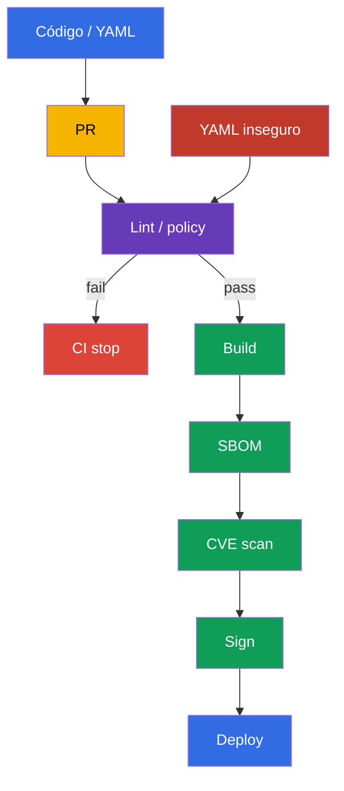
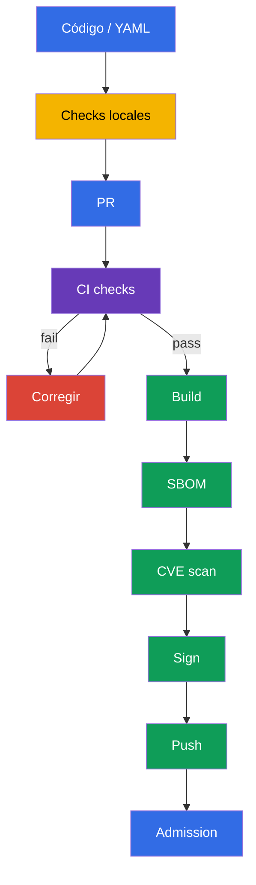

[Русская версия](ru.md) · [Eng version](README.md) · [Version française](fr.md) · [Deutsche Version](de.md) · [ქართული ვერსია](ge.md) · [繁體中文版](tw.md) · [日本語版](jp.md)

# Capítulo 27. Análisis estático de cargas de trabajo e imágenes

> **El problema.** Un manifest sintácticamente correcto puede añadir sin que se note `privileged: true`, un proceso root, un root filesystem escribible o una image con `:latest`, y un Dockerfile puede introducir un patrón de build inseguro. Tras un merge, ese riesgo ya llega a CI y al clúster, donde corregirlo exigirá un rollout o incident response. Es necesario comprobar los Dockerfile y manifests de origen antes de build, push y deploy.

> **Qué sigue.** En el [capítulo 26](../26/es.md) aprendimos a permitir un trusted registry y a comprobar la firma de un artifact durante admission. Pero una firma demuestra el origen, no la ausencia de configuración insegura: un Deployment firmado todavía puede ejecutar un proceso root, un root filesystem escribible o una image con el tag `latest`. El análisis estático comprueba Dockerfile y Kubernetes manifests antes de push y deploy. Este es el dominio **Supply Chain Security** de CKS (20%): feedback rápido en el desarrollo local y un gate obligatorio en CI.

> **Qué debe conocer de CKA.** Los campos de `securityContext` que detectan los linters - `runAsNonRoot`, `allowPrivilegeEscalation`, `readOnlyRootFilesystem`, capabilities y `privileged` - se explican en el [capítulo 20 de CKA](../../../cka/course/20/es.md). Aquí no repetimos su sintaxis, sino que creamos comprobaciones automáticas que impiden omitir una configuración insegura en Git.

> 🧠 El análisis shift-left lleva la búsqueda de configuraciones inseguras al pull request: corregir el source antes de build y deploy cuesta menos que responder al riesgo en una carga de trabajo en ejecución.

## 27.1. Modelo de amenazas: una configuración insegura llega al clúster junto con el código

Kubernetes API acepta un manifest sintácticamente válido incluso si contradice la práctica secure-by-default. Un contenedor con UID 0, `privileged: true`, un root filesystem escribible o una image con `:latest` pueden parecer un cambio normal durante el review. Si el problema se encuentra solo después del deploy, ya está disponible para un atacante y exige incident response en vez de una corrección económica en el pull request.

El análisis estático lee los archivos de origen sin ejecutar el workload. No reemplaza admission policy, signature verification, vulnerability scanning ni runtime detection: las herramientas responden preguntas diferentes.



Escenario habitual: un desarrollador añade un `Deployment` para una API. Indica `image: api:latest`, no define `securityContext` y la aplicación necesita temporalmente el directorio `/tmp`. Sin comprobación, el workload se aplicará correctamente y se ejecutará con una image que cambia bajo el mismo tag, como root y con un filesystem escribible. Con `kube-linter`, `kubesec` y una policy propia, CI mostrará las infracciones concretas antes del merge. La corrección se convierte en parte del cambio: tag o digest fijo, usuario non-root, capabilities eliminadas y un `emptyDir` separado para escritura.

| Control | Pregunta | Lo que no demuestra |
|---|---|---|
| `kubesec` | ¿qué tan seguro es el manifest respecto a un conjunto de controls conocidos? | que una rule corresponda a la policy de su organización |
| `kube-linter` | ¿se siguen las Kubernetes best practices? | que la image no contenga CVE |
| `hadolint` | ¿el Dockerfile es seguro y reproducible? | que la image final cumpla la runtime policy |
| `conftest` + OPA | ¿se cumple la policy-as-code local? | que la policy ya esté conectada a admission |
| Trivy, firma, admission | ¿hay CVE, el artifact es trusted, el clúster lo permite? | no reemplazan el lint de los fuentes |

En este capítulo, `kubesec` y `kube-linter` sirven como herramientas prácticas para analizar Kubernetes manifests. `hadolint` y `conftest` también son útiles en el curso y los laboratorios: el primero analiza Dockerfile y el segundo comprueba la policy local de la organización. En el examen use solo la herramienta y el entorno especificados en la tarea concreta.

Un linter es un detector, no una autoridad. Cada rule debe ser comprensible: el equipo debe poder explicar el riesgo, elegir la corrección o aceptar de forma documentada una excepción temporal. No oculte una infracción sistémica mediante un `--ignore` global; limite la excepción a una rule, archivo y plazo concretos, y luego elimínela.

> 🔬 `kubesec` ofrece un security score y controls, pero no sustituye la policy de su organización.

## 27.2. `kubesec`: puntuación de Kubernetes manifest

`kubesec` analiza Kubernetes YAML y relaciona sus campos con security controls. El comando muestra un score y una lista de checks passed/failed. Es útil como señal rápida: los finding negativos a menudo significan que falta un `securityContext` o hay un host access peligroso. El score no es una prueba de seguridad y no debe ser el único CI gate: algunos workloads legítimos, por ejemplo un CNI DaemonSet, requieren justificadamente privilegios ampliados.

El manifest siguiente es inseguro deliberadamente. Solo sirve para demostrar finding; no lo aplique en production:

```yaml
# manifests/api.yaml
apiVersion: apps/v1
kind: Deployment
metadata:
  name: api
  namespace: payments
spec:
  replicas: 2
  selector:
    matchLabels:
      app: api
  template:
    metadata:
      labels:
        app: api
    spec:
      containers:
      - name: api
        image: registry.example.com/payments/api:latest
        ports:
        - containerPort: 8080
```

Ejecute el scan para un archivo o pase YAML mediante stdin. En CI use una versión fijada de la herramienta dentro de una builder image aprobada, o un binary descargado y comprobado; no confíe en el `latest` mutable del propio scanner.

```bash
kubesec scan manifests/api.yaml

# Conveniente al generar YAML mediante un templater.
kustomize build overlays/prod | kubesec scan /dev/stdin
```

El informe contiene el score total y controls detallados. En este ejemplo espere finding próximos a estas recomendaciones:

| Finding | Por qué es peligroso | Corrección práctica |
|---|---|---|
| `Run as non-root user` | Un RCE obtiene UID 0 dentro del contenedor | añadir `USER` non-root a la image y `runAsNonRoot: true` al Pod |
| `Read-only root filesystem` | Un atacante puede escribir herramientas y modificar archivos runtime | definir `readOnlyRootFilesystem: true`; mover el writable path a un volume |
| `Drop NET_RAW capability` o `Drop ALL capabilities` | Las capabilities adicionales amplían las acciones del proceso | `drop: ["ALL"]`, devolver solo una capability justificada |
| Un control comprobado de un conjunto de rules fijado | el riesgo y la corrección dependen del texto de ese control | antes del gate, ejecute `kubesec print-rules` para la versión fijada; no atribuya a `kubesec` una comprobación de mutable tag sin confirmación |

Guíese por el texto de los controls, no por un solo score. Por ejemplo, el score puede aumentar tras añadir securityContext, pero el manifest aún podría permitir un registry desconocido - es mejor expresar esa rule con `conftest` y admission policy. Al analizar un Helm chart, escanee el renderizado; de otro modo el linter ve templates y no los resources que enviará `kubectl`:

```bash
helm template payments-api ./chart --namespace payments \
  --values ./chart/values-production.yaml | kubesec scan /dev/stdin
```

No envíe manifests privados a un online scanner público. Un binary local o un CI container aprobado mantiene los fuentes en su execution environment.

> 🎯 `kube-linter` es análisis estático Kubernetes-oriented: lea el finding, corrija el manifest y repita el lint hasta obtener un resultado limpio.

## 27.3. `kube-linter`: comprobación de Kubernetes best practices

`kube-linter` comprueba manifests y Helm charts mediante un conjunto de Kubernetes-oriented checks. A diferencia del score de `kubesec`, el resultado suele asociar un resource, container y check name concretos. Esto resulta útil para un gate: lint devuelve un non-zero exit code si encuentra errors.

```bash
# Comprobar el directorio con plain YAML.
kube-linter lint manifests/

# Comprobar el chart y todos sus templates.
kube-linter lint ./chart

# Mostrar los checks disponibles y su propósito.
kube-linter checks list
```

Para el `manifests/api.yaml` de demostración son típicos `run-as-non-root`, `no-read-only-root-fs` y `latest-tag`. La composición exacta depende de la versión de `kube-linter` y de los checks enabled; por ello fije la versión en CI y conserve su output en el artifact del job. No forme `image:` mediante concatenación con una variable vacía: podría convertir un versioned tag esperado en `latest`.

El manifest corregido añade defense in depth. La aplicación debe ser compatible con UID `10001`; la image también debe tener un `USER` non-root, porque el manifest no corrige una image insegura durante la ejecución local. `emptyDir` proporciona a la aplicación su único lugar escribible y `readOnlyRootFilesystem` mantiene la raíz immutable.

```yaml
# manifests/api.yaml
apiVersion: apps/v1
kind: Deployment
metadata:
  name: api
  namespace: payments
spec:
  replicas: 2
  selector:
    matchLabels:
      app: api
  template:
    metadata:
      labels:
        app: api
    spec:
      securityContext:
        runAsNonRoot: true
        runAsUser: 10001
        runAsGroup: 10001
      containers:
      - name: api
        image: registry.example.com/payments/api:1.4.2@sha256:<digest-verificado-de-64-caracteres>
        ports:
        - containerPort: 8080
        securityContext:
          allowPrivilegeEscalation: false
          readOnlyRootFilesystem: true
          capabilities:
            drop: ["ALL"]
        volumeMounts:
        - name: tmp
          mountPath: /tmp
      volumes:
      - name: tmp
        emptyDir: {}
```

Después del cambio, ejecute lint de nuevo. Un output limpio significa solo que el conjunto actual de checks no encontró una infracción; no elimina la necesidad de review ni de los gates posteriores.

```bash
kube-linter lint manifests/
kubesec scan manifests/api.yaml
kubectl apply --dry-run=server -f manifests/api.yaml
```

`kubectl apply --dry-run=server` comprueba API schema y admission sin guardar el resource. Es una señal distinta de lint: la schema puede ser correcta para un manifest inseguro y una custom policy puede rechazar un manifest aceptado por un generic linter.

> 🏭 Versione el conjunto de checks, limite las excepciones a un scope concreto y no desactive el security baseline de todo el repository por una carga legacy.

### Configuración de checks sin debilitar todo el pipeline

Algunos checks requieren configuración para un workload legacy. `include` sin `doNotAutoAddDefaults: true` añade checks al conjunto default, no lo reemplaza. Si necesita un security baseline exactamente auditable, desactive la adición automática de defaults y enumere todo el conjunto. No desactive `run-as-non-root` en todo el repository por un DaemonSet del sistema: separe el system manifest en una ruta distinta, añada una exception a la policy con justificación y limite el acceso a modificar esa excepción.

```yaml
# .kube-linter.yaml
checks:
  doNotAutoAddDefaults: true
  include:
  - run-as-non-root
  - no-read-only-root-fs
  - privilege-escalation-container
  - privileged-container
  - drop-net-raw-capability
  - sensitive-host-mounts
  - docker-sock
  - latest-tag
```

Compruebe el nombre y la disponibilidad de los checks para la versión fijada mediante `kube-linter checks list`; no copie configuración entre versiones sin comprobarla. CI debe terminar con error si no puede cargar la configuration - una transición silenciosa a los checks default crea una falsa sensación de protección.

> 🔬 `hadolint` sirve para Dockerfile y la reproducibilidad de la image, pero no reemplaza el image scan.

## 27.4. `hadolint`: análisis de Dockerfile antes de crear la image

Un manifest protege la ejecución, pero un security issue suele empezar en el Dockerfile: base image mutable, `apt-get install` sin cleanup, `curl | sh`, un final user root o shell form `CMD`. `hadolint` analiza Dockerfile y comunica rules en formato `DL####`. No crea la image ni ejecuta `RUN`, por lo que se ejecuta de forma más segura y rápida que un build, pero no reemplaza build/test/scan.

```bash
hadolint Dockerfile

# Usar stdin en una integración de editor o CI.
hadolint - < Dockerfile
```

Ejemplo de Dockerfile con problemas habituales:

```dockerfile
FROM ubuntu:latest
RUN apt-get update
RUN apt-get install -y curl
COPY . /app
CMD python /app/server.py
```

Mensajes típicos de `hadolint` y la reacción correcta:

| Rule | Señal | Corrección |
|---|---|---|
| `DL3002` | el último `USER` es root | indicar un `USER` non-root en el final stage; `runAsNonRoot` a nivel Pod sigue siendo una protección independiente |
| `DL3007` | el tag `latest` es mutable | indicar una versión concreta de la base image y fijar un digest para un release |
| `DL3008` | un paquete no tiene versión | fijar la versión donde el repository y su estrategia de actualización lo permitan |
| `DL3009` | queda el cache de `apt` | combinar update/install/cleanup en un único `RUN` o usar una base minimal adecuada |
| `DL3059` | varios `RUN` consecutivos | combinar operaciones relacionadas lógicamente sin empeorar la legibilidad |
| `DL3025` | `CMD` en shell form | aplicar JSON/exec form para que el process reciba correctamente las signals |

El número `DL####` es una referencia a una rule concreta, no a un severity universal. Lea primero su descripción: en ocasiones el mensaje afecta a la reproducibilidad y en otras al image size o al signal handling. No use inline ignore solo para conseguir CI verde. Si una excepción está justificada, deje un comentario breve con la razón, issue y fecha de revisión.

A continuación hay un patrón mínimo para un Go service. Las versiones concretas son ilustrativas: el release pipeline debe sustituir el digest comprobado según el registry interno y el proceso de actualización de las base images. El final stage no contiene package manager, compiler ni shell; el `USER` de la image y Pod-level securityContext se complementan.

```dockerfile
# syntax=docker/dockerfile:1.7
FROM golang:1.27.1-alpine3.24 AS build
WORKDIR /src
COPY go.mod go.sum ./
RUN go mod download
COPY . ./
RUN CGO_ENABLED=0 GOOS=linux go build -trimpath -ldflags="-s -w" \
    -o /out/api ./cmd/api

FROM scratch
COPY --from=build /out/api /api
USER 10001:10001
ENTRYPOINT ["/api"]
```

`hadolint` no ve todo: no sabe si `COPY . .` contiene un secret, si la binary architecture corresponde al node o si hay CVE en la base image. Use `.dockerignore`, BuildKit secret mounts, unit tests, SBOM y el scanner de los capítulos vecinos. Lint ayuda a detectar antes un structural error, pero no reemplaza los supply-chain controls.

> 🔬 `conftest` amplía el generic lint con reglas Rego locales; compruebe y versione las propias policies mediante `opa test`.

## 27.5. OPA `conftest`: comprobación de policy-as-code para manifests

Los generic linters conocen best practices comunes. Las organizaciones suelen añadir reglas que dependen de su threat model: solo se permiten internal registries, el production namespace requiere limits, todos los workload deben tener owner label y una exception solo se permite con ticket y expiry. `conftest` ejecuta OPA Rego policies sobre YAML, JSON, HCL y otros structured files y devuelve un non-zero exit code cuando una rule produce `deny`.

La estructura del repository puede ser la siguiente:

```text
.
├── Dockerfile
├── manifests/
│   └── api.yaml
└── policy/
    └── main.rego
```

La Rego policy siguiente hace match intencionadamente solo con `Deployment`, pero comprueba regular/init containers y OCI reference en image volumes. Es un ámbito didáctico limitado, no una cluster-wide policy lista para production: para production se añaden por separado Pod, StatefulSet, DaemonSet, Job/CronJob y las template paths correspondientes, o se aplica la misma intención en una admission policy. La tarea de la policy es fijar explícitamente requisitos locales inmutables: un trusted registry prefix y un immutable digest válido para cada ruta a un OCI artifact, y para containers también non-root efectivo, read-only root filesystem y prohibición de privilege escalation. En Kubernetes v1.36, [image volume](https://v1-36.docs.kubernetes.io/docs/tasks/configure-pod-container/image-volumes/) es stable y está enabled by default; su `spec.volumes[].image.reference` no entra en el generic container loop, por lo que la policy lo comprueba por separado. `object.get` proporciona un valor predeterminado seguro para objetos opcionales: por ello la ausencia de `securityContext` también crea una violation y no deja la rule undefined.

```rego
# policy/main.rego
package main

import rego.v1

workload if {
  object.get(input, "kind", "") == "Deployment"
}

pod_template := object.get(object.get(input, "spec", {}), "template", {})
pod_spec := object.get(pod_template, "spec", {})
pod_security_context := object.get(pod_spec, "securityContext", {})
containers := object.get(pod_spec, "containers", [])
init_containers := object.get(pod_spec, "initContainers", [])
all_containers := array.concat(containers, init_containers)

# Kubernetes v1.36 image volume entrega un OCI artifact no mediante containers[].image,
# sino mediante spec.volumes[].image.reference; aplique la misma intención registry/digest.
image_volumes := [volume |
  volume := object.get(pod_spec, "volumes", [])[_]
  object.get(volume, "image", null) != null
]

violation contains msg if {
  workload
  container := all_containers[_]
  image := object.get(container, "image", "")
  not startswith(image, "registry.example.com/")
  name := object.get(container, "name", "<unnamed>")
  msg := sprintf("container %q uses an unapproved registry: %s", [name, image])
}

# Exigimos una OCI reference realmente immutable. Kubernetes trata una image sin tag como
# :latest, y un digest corto o incorrecto no es un pin SHA-256.
violation contains msg if {
  workload
  container := all_containers[_]
  image := object.get(container, "image", "")
  not regex.match(`^.+@sha256:[A-Fa-f0-9]{64}$`, image)
  name := object.get(container, "name", "<unnamed>")
  msg := sprintf("container %q must use an image pinned by a valid SHA-256 digest", [name])
}

violation contains msg if {
  workload
  volume := image_volumes[_]
  reference := object.get(object.get(volume, "image", {}), "reference", "")
  not startswith(reference, "registry.example.com/")
  name := object.get(volume, "name", "<unnamed>")
  msg := sprintf("image volume %q uses an unapproved registry: %s", [name, reference])
}

violation contains msg if {
  workload
  volume := image_volumes[_]
  reference := object.get(object.get(volume, "image", {}), "reference", "")
  not regex.match(`^.+@sha256:[A-Fa-f0-9]{64}$`, reference)
  name := object.get(volume, "name", "<unnamed>")
  msg := sprintf("image volume %q must use an image pinned by a valid SHA-256 digest", [name])
}

# Un securityContext a nivel container tiene prioridad sobre un campo Pod-level coincidente.
violation contains msg if {
  workload
  container := all_containers[_]
  container_security_context := object.get(container, "securityContext", {})
  effective_run_as_non_root := object.get(
    container_security_context,
    "runAsNonRoot",
    object.get(pod_security_context, "runAsNonRoot", false)
  )
  effective_run_as_non_root != true
  name := object.get(container, "name", "<unnamed>")
  msg := sprintf("container %q must effectively runAsNonRoot: true", [name])
}

violation contains msg if {
  workload
  container := all_containers[_]
  container_security_context := object.get(container, "securityContext", {})
  object.get(container_security_context, "readOnlyRootFilesystem", false) != true
  name := object.get(container, "name", "<unnamed>")
  msg := sprintf("container %q must set readOnlyRootFilesystem: true", [name])
}

violation contains msg if {
  workload
  container := all_containers[_]
  container_security_context := object.get(container, "securityContext", {})
  object.get(container_security_context, "allowPrivilegeEscalation", true) != false
  name := object.get(container, "name", "<unnamed>")
  msg := sprintf("container %q must set allowPrivilegeEscalation: false", [name])
}

deny contains msg if {
  msg := violation[_]
}
```

Compruebe la policy con fixtures bad y good. `conftest test` lee automáticamente el policy directory si está situado en `policy/`; el `--policy` explícito deja clara la CI invocation.

```bash
# Debe imprimir deny y devolver non-zero exit code para el manifest anterior.
conftest test --policy policy manifests/api.yaml

# Tras corregir la policy y el manifest, el comando debe devolver 0.
conftest test --policy policy manifests/
```

La policy también debe tener un test suite. De otro modo, un cambio de Rego podría quitar un control accidentalmente y CI continuaría verde. Un `*_test.rego` separado comprueba deny/allow esperados sin ejecutar el clúster:

```rego
# policy/main_test.rego
package main

import rego.v1

test_denies_missing_security_context if {
  resource := {
    "kind": "Deployment",
    "spec": {"template": {"spec": {
      "containers": [{
        "name": "api",
        "image": "registry.example.com/payments/api:1.4.2",
      }],
    }}},
  }
  result := violation with input as resource
  "container \"api\" must effectively runAsNonRoot: true" in result
  "container \"api\" must set readOnlyRootFilesystem: true" in result
  "container \"api\" must set allowPrivilegeEscalation: false" in result
}

test_denies_dangerous_variants if {
  resource := {
    "kind": "Deployment",
    "spec": {"template": {"spec": {
      "securityContext": {"runAsNonRoot": false},
      "containers": [{
        "name": "api",
        "image": "docker.io/library/api:latest",
        "securityContext": {
          "readOnlyRootFilesystem": false,
          "allowPrivilegeEscalation": true,
        },
      }],
    }}},
  }
  result := violation with input as resource
  "container \"api\" uses an unapproved registry: docker.io/library/api:latest" in result
  "container \"api\" must use an image pinned by a valid SHA-256 digest" in result
  "container \"api\" must effectively runAsNonRoot: true" in result
  "container \"api\" must set readOnlyRootFilesystem: true" in result
  "container \"api\" must set allowPrivilegeEscalation: false" in result
}

test_denies_unapproved_registry_in_init_container if {
  resource := {
    "kind": "Deployment",
    "spec": {"template": {"spec": {
      "securityContext": {"runAsNonRoot": true},
      "initContainers": [{
        "name": "untrusted-init",
        "image": "docker.io/library/init@sha256:0123456789abcdef0123456789abcdef0123456789abcdef0123456789abcdef",
        "securityContext": {"readOnlyRootFilesystem": true, "allowPrivilegeEscalation": false},
      }],
      "containers": [{
        "name": "api",
        "image": "registry.example.com/payments/api@sha256:0123456789abcdef0123456789abcdef0123456789abcdef0123456789abcdef",
        "securityContext": {"readOnlyRootFilesystem": true, "allowPrivilegeEscalation": false},
      }],
    }}},
  }
  result := violation with input as resource
  "container \"untrusted-init\" uses an unapproved registry: docker.io/library/init@sha256:0123456789abcdef0123456789abcdef0123456789abcdef0123456789abcdef" in result
}

test_denies_untagged_image_container_override_and_unsafe_init if {
  resource := {
    "kind": "Deployment",
    "spec": {"template": {"spec": {
      "securityContext": {"runAsNonRoot": true},
      "initContainers": [{
        "name": "init",
        "image": "registry.example.com/payments/init",
        "securityContext": {"readOnlyRootFilesystem": false, "allowPrivilegeEscalation": false},
      }],
      "containers": [{
        "name": "api",
        "image": "registry.example.com/payments/api@sha256:0123456789abcdef0123456789abcdef0123456789abcdef0123456789abcdef",
        "securityContext": {"runAsNonRoot": false, "readOnlyRootFilesystem": true, "allowPrivilegeEscalation": false},
      }],
    }}},
  }
  result := violation with input as resource
  "container \"init\" must use an image pinned by a valid SHA-256 digest" in result
  "container \"api\" must effectively runAsNonRoot: true" in result
  "container \"init\" must set readOnlyRootFilesystem: true" in result
}

test_denies_untrusted_unpinned_image_volume if {
  resource := {
    "kind": "Deployment",
    "spec": {"template": {"spec": {
      "securityContext": {"runAsNonRoot": true},
      "volumes": [{
        "name": "model",
        "image": {"reference": "docker.io/library/model:latest"},
      }],
      "containers": [{
        "name": "api",
        "image": "registry.example.com/payments/api@sha256:0123456789abcdef0123456789abcdef0123456789abcdef0123456789abcdef",
        "securityContext": {"readOnlyRootFilesystem": true, "allowPrivilegeEscalation": false},
      }],
    }}},
  }
  result := violation with input as resource
  "image volume \"model\" uses an unapproved registry: docker.io/library/model:latest" in result
  "image volume \"model\" must use an image pinned by a valid SHA-256 digest" in result
}

test_allows_hardened_workload if {
  resource := {
    "kind": "Deployment",
    "spec": {"template": {"spec": {
      "securityContext": {"runAsNonRoot": true},
      "containers": [{
        "name": "api",
        "image": "registry.example.com/payments/api:1.4.2@sha256:0123456789abcdef0123456789abcdef0123456789abcdef0123456789abcdef",
        "securityContext": {
          "readOnlyRootFilesystem": true,
          "allowPrivilegeEscalation": false,
        },
      }],
    }}},
  }
  result := violation with input as resource
  count(result) == 0
}
```

```bash
opa test policy/ -v
```

En production, duplique la critical policy en un admission controller, por ejemplo Kyverno, Gatekeeper o ValidatingAdmissionPolicy, donde corresponda. `conftest` protege la ruta Git -> CI; admission protege el API frente a `kubectl apply` manual, otro pipeline y un job configurado incorrectamente. Las policies deben tener una sola fuente o tests que confirmen su intención equivalente; de lo contrario divergen con el tiempo.

> 🏭 El static analysis se convierte en una defensa solo como CI gate obligatorio y reproducible, con herramientas fijadas, reports y excepciones gestionadas.

## 27.6. CI gate y ciclo «corregir - repetir la comprobación»

El static analysis solo es útil cuando su resultado influye en el delivery. La ejecución local proporciona feedback rápido, pero un CI job obligatorio vuelve la comprobación reproducible para cada pull request. El pipeline debe instalar o usar pinned releases, guardar reports como artifacts y detener build/push ante un error. No cargue manifests con production secrets en un scanner ni imprima secrets en logs.

Secuencia mínima:



Para la práctica de este capítulo, el gate puede ejecutar `kubesec` y `kube-linter`; es útil añadir `hadolint` para Dockerfile y `conftest` con unit tests para una comprobación local completa. El GitHub Actions job siguiente muestra una secuencia ampliada, no prescribe un único CI provider. En el examen use la herramienta y el entorno indicados en la tarea concreta. En un pipeline real, reemplace los floating `curl` downloads por una tool image interna comprobada o un action/image digest fijado; use lockfile/verified checksums para los binary. Añada `helm template` o `kustomize build` antes de los linters si el production deploy usa templates.

```yaml
# .github/workflows/static-analysis.yaml
name: static-analysis
on:
  pull_request:
    paths:
    - 'Dockerfile'
    - 'manifests/**'
    - 'policy/**'

jobs:
  lint:
    runs-on: ubuntu-24.04
    permissions:
      contents: read
    steps:
    - uses: actions/checkout@<digest-verificado-de-la-action>

    - name: Hadolint
      run: hadolint Dockerfile

    - name: Kubernetes best-practice checks
      run: kube-linter lint manifests/

    - name: Kubernetes security score gate
      shell: bash
      run: |
        set -euo pipefail
        kubesec scan manifests/api.yaml --format json \
          | tee kubesec-report.json \
          | jq -e '
              type == "array"
              and length > 0
              and all(.[];
                .valid == true
                and ((.scoring.critical // []) | length == 0)
                and ((.score? | type) == "number")
                and .score > 0
              )
            ' > /dev/null

    - name: Organisation policy
      run: conftest test --policy policy manifests/

    - name: Policy unit tests
      run: opa test policy/ -v

    - name: Save static-analysis report
      uses: actions/upload-artifact@<digest-verificado-de-la-action>
      with:
        name: static-analysis-report
        path: kubesec-report.json
```

Compruebe el exit code y un resultado verificable por máquina, no la presencia de texto en stdout. `tee` solo guarda JSON y `pipefail` solo evita ocultar el failure del propio scanner: no convierten nada en un security gate. El JSON default de `kubesec` es un array de resultados; el score final suma positive y negative points, mientras que `scoring.critical` es una lista separada de critical findings. Por ello `jq -e` debe comprobar cada elemento: validez de schema, ausencia de critical findings y versioned numeric score threshold. En el ejemplo siguiente, cualquier array vacío, invalid result, critical finding, score no numérico o score `<= 0` termina el comando con non-zero. Si se admite conscientemente una critical rule concreta, formalice una versioned exception estrecha con owner y expiry, en lugar de compensarla con un score total.

```bash
set -euo pipefail
kubesec scan manifests/api.yaml --format json \
  | tee kubesec-report.json \
  | jq -e '
      type == "array"
      and length > 0
      and all(.[];
        .valid == true
        and ((.scoring.critical // []) | length == 0)
        and ((.score? | type) == "number")
        and .score > 0
      )
    ' > /dev/null
```

> 🎯 Habilidad universal: encuentre el finding, corrija el Dockerfile o manifest de origen y repita el scan hasta que el exit code sea exitoso; no oculte el problema con un ignore global.

### Ciclo práctico de corrección

1. Cree o tome un manifest con `:latest`, sin `runAsNonRoot`, `readOnlyRootFilesystem` ni `allowPrivilegeEscalation`.
2. Ejecute `kubesec scan`, `kube-linter lint` y `conftest test`. Conserve el output inicial: explica por qué CI debe detenerse.
3. Corrija el source, no el output: versioned tag/digest, usuario non-root en la image, Pod `securityContext`, `drop: ["ALL"]` y `emptyDir` para el directorio realmente escribible.
4. Ejecute otra vez todas las comprobaciones, incluidos `hadolint Dockerfile` y `opa test policy/`. Asegúrese de que los comandos devuelven `0`.
5. Compruebe la API compatibility sin crear el workload: `kubectl apply --dry-run=server -f manifests/`. Si production usa un rendered chart, compruebe exactamente el rendered YAML.
6. Solo después de que el static-analysis gate esté verde ejecute build, SBOM, image scan, signing y deployment gates. No cambie CI a «warning only» mientras el equipo no haya decidido qué risk acceptance es admisible.

El siguiente script local compacto realiza el mismo gate. Termina intencionadamente en el primer error; el desarrollador debe corregir el finding y ejecutar de nuevo el script.

```bash
#!/usr/bin/env bash
# scripts/static-analysis.sh
set -euo pipefail

hadolint Dockerfile
kube-linter lint manifests/
kubesec scan manifests/api.yaml --format json \
  | tee kubesec-report.json \
  | jq -e '
      type == "array"
      and length > 0
      and all(.[];
        .valid == true
        and ((.scoring.critical // []) | length == 0)
        and ((.score? | type) == "number")
        and .score > 0
      )
    ' > /dev/null
conftest test --policy policy manifests/
opa test policy/ -v
kubectl apply --dry-run=server -f manifests/
```

Errores habituales y diagnóstico:

| Síntoma | Causa | Qué hacer |
|---|---|---|
| `kube-linter` todavía informa `run-as-non-root` | el campo se añadió fuera de `spec.template.spec`, o un container override concreto anuló la configuración | comprobar el rendered resource mediante `kubectl kustomize`/`helm template` y la ruta `spec.template.spec.securityContext` |
| la aplicación falla después de `readOnlyRootFilesystem: true` | el process escribe cache, PID o temp file en el root filesystem | determinar la ruta por los logs, montar un `emptyDir` estrecho solo allí; no desactivar todo el root read-only |
| `hadolint` pasa, pero la image se ejecuta como root | el Dockerfile no contiene `USER`, y el manifest solo comprueba el cluster runtime | añadir un `USER` non-root en el final stage y mantener el manifest guard |
| `conftest` no encuentra una rule | se pasó un template en vez de rendered YAML o la ruta `--policy` es incorrecta | probar el input fixture, ejecutar `opa test` y luego hacer lint del propio rendered output |
| CI está verde tras `kubesec ... | tee` | `tee` guardó JSON, pero no se comprobó el security result | activar `set -o pipefail` y `jq -e`: para todo el JSON-array comprobar `.valid == true`, `scoring.critical` vacío y versioned score threshold |
| un system workload crítico necesita exception | la rule se aplica igual a la aplicación y a CNI/CSI | scope separado, least-privilege exception con owner, ticket y expiry; no un ignore global |

> 🏭 Haga lint del rendered YAML final, conserve resultados y versiones de los scanners y alinee las critical rules con admission policy para impedir el bypass de CI.

## 27.7. Cómo se aplica en production

- **Lint se ejecuta antes de build.** El desarrollador recibe feedback en pre-commit/editor o en un CI job separado antes de gastar recursos en build, push e integration environment. No se puede hacer merge de un PR hasta corregir los finding obligatorios o aprobar una excepción estrecha.
- **Las herramientas y rules están fijadas.** Las versiones de `kube-linter`, `kubesec`, `hadolint`, `conftest` y OPA se fijan en una trusted CI image o lockfile. La actualización de rules pasa por review: una nueva versión puede añadir finding legítimos, pero no debe debilitar el gate sin que se note.
- **Se comprueba el YAML final.** Helm/Kustomize/GitOps pueden cambiar values, image y securityContext. CI hace lint del rendered artifact que se firmará/aplicará, no solo del template source.
- **Policy-as-code vive junto a la application y platform policy.** Las reglas del equipo se prueban con `opa test`; los cluster-wide controls obligatorios se duplican o centralizan en admission. La exception tiene owner, motivo y fecha de expiración.
- **El análisis estático es parte de la cadena.** Después siguen SBOM, vulnerability scan, firma y registry promotion; antes de la ejecución actúa admission. Los runtime controls detectan aquello que es imposible ver en los fuentes.
- **Los informes sirven para audit.** CI guarda la version del scanner, los resultados y un enlace al commit. Los reports no deben contener credentials, private keys ni production Secret data.

## 27.8. Mini-glosario

- **Static analysis** - comprobación de Dockerfile, manifests y policy de origen sin ejecutar un workload.
- **`kubesec`** - scanner de Kubernetes manifests que produce security score y controls.
- **`kube-linter`** - linter de Kubernetes YAML y Helm charts con un conjunto de best-practice checks.
- **`hadolint`** - linter Dockerfile; las rules se identifican mediante códigos `DL####`.
- **OPA (Open Policy Agent)** - policy engine que ejecuta reglas declarativas Rego.
- **`conftest`** - CLI para comprobar structured configuration mediante reglas OPA/Rego.
- **Rego** - lenguaje de descripción de policies de OPA.
- **CI gate** - comprobación obligatoria que bloquea la siguiente etapa del pipeline ante un non-zero exit code.
- **Rendered manifest** - YAML final después de `helm template` o `kustomize build`.
- **False positive** - finding que no se aplica a un resource concreto; requiere una exception estrecha documentada, no desactivar el control globalmente.

## 27.9. Resumen del capítulo

- Un Kubernetes manifest puede ser válido para API, pero inseguro; static analysis encuentra esos errores antes de deploy y convierte la security practice en un repeatable CI gate.
- En la práctica del curso, `kubesec` muestra score y security controls, mientras `kube-linter` comprueba Kubernetes best practices, incluidas non-root, read-only root filesystem y mutable tags. El gate de `kubesec` analiza el JSON-array y comprueba la validez, ausencia de `scoring.critical` y versioned score threshold de cada resultado.
- `hadolint` encuentra problemas estructurales de Dockerfile mediante rules `DL####`, incluido `DL3002` para un root final user, pero no reemplaza image build, secret handling ni CVE scan.
- `conftest` ejecuta versioned Rego policy para los requisitos de una organización concreta; la propia policy debe tener tests mediante `opa test`, también para campos ausentes y valores peligrosos. En Kubernetes v1.36, la policy debe cubrir por separado OCI references de image volumes, que no son container images.
- La corrección implica cambiar Dockerfile/manifest/policy, tras lo cual todos los linters y el server dry-run vuelven a devolver `0`.
- Lint no reemplaza SBOM, vulnerability scan, signing ni admission: son capas secuenciales de supply-chain defense.

## 27.10. Cómo sirve esto: en el examen y en el trabajo real

**En el examen.** La práctica con `kubesec`, `kube-linter`, `hadolint` y `conftest` ayuda a leer un finding y corregir `securityContext`, image reference, Dockerfile o policy local. Estas herramientas no deben considerarse parte obligatoria del examen ni darse por disponibles previamente en su entorno: use solo la herramienta y el entorno indicados en la tarea concreta. Es necesario recordar la relación con SecurityContext: `runAsNonRoot`, `allowPrivilegeEscalation: false`, `readOnlyRootFilesystem: true`, `capabilities.drop: ["ALL"]` - un baseline típico que pueden comprobar las herramientas de análisis. Para CI es importante entender que un failure debe bloquear la promoción del artifact y que, tras la corrección, se ejecuta de nuevo la comprobación.

**En el trabajo real.** El análisis estático convierte la configuración segura en una cualidad habitual del código: el finding lo ve el autor del PR, no el equipo de seguridad tras el production deploy. La combinación de generic linters, tested Rego policy, rendered-manifest checks y un CI gate obligatorio reduce la probabilidad de root workloads, mutable images y registries no permitidos. Después, el pipeline sigue comprobando los bytes del artifact: SBOM, CVE scan, signature y admission protegen frente a riesgos que lint no ve.

## 27.11. Preguntas de autoevaluación

<details>
<summary>1. ¿Por qué un Kubernetes YAML aplicado correctamente todavía puede ser inseguro?</summary>

API comprueba sintaxis y schema, pero no considera un error un proceso root, un root filesystem escribible, `privileged: true` o `:latest`. Ese manifest puede crear correctamente un workload aunque infrinja la práctica secure-by-default. Static analysis encuentra estos riesgos antes de merge y deploy, y admission y runtime controls lo complementan más adelante.
</details>

<details>
<summary>2. ¿En qué se diferencia el score de `kubesec` de la policy obligatoria de su organización?</summary>

`kubesec` ofrece score y finding para controls conocidos, es decir, una señal general rápida, no autoridad para una organización concreta. La policy organizativa puede exigir, por ejemplo, internal registry, valid digest u owner label, algo que un generic score no demuestra. Estos invariantes se formalizan en versioned Rego mediante `conftest` y, cuando es necesario, se duplican en admission.
</details>

<details>
<summary>3. ¿Qué finding típicos muestra `kube-linter` para un application container normal?</summary>

Para un ejemplo sin hardening son típicos los checks `run-as-non-root`, `no-read-only-root-fs` y `latest-tag`. También son útiles checks para `allowPrivilegeEscalation`, `privileged`, capabilities, sensitive host mounts y docker socket. El conjunto exacto depende de la versión fijada y los checks enabled, por lo que se comprueba con `kube-linter checks list`.
</details>

<details>
<summary>4. ¿Por qué `hadolint` no reemplaza un vulnerability scanner y por qué hay que leer el `DL####` concreto?</summary>

Hadolint analiza Dockerfile, pero no crea la image, no ejecuta `RUN` ni relaciona packages con una CVE database. Se necesita un scanner para la image final y sus dependencias, mientras hadolint detecta structural issues como root final user, mutable base tag o `CMD` en shell form. Hay que leer el código `DL####`, porque su significado puede referirse a seguridad, reproducibilidad, image size o signal handling.
</details>

<details>
<summary>5. ¿Cómo ayudan `conftest` y Rego a comprobar un trusted registry o un `securityContext` obligatorio?</summary>

`conftest test` pasa YAML a una Rego policy y devuelve non-zero cuando una rule crea `deny`. La policy de ejemplo comprueba el prefix `registry.example.com/` y SHA-256 digest en regular/init containers e image volumes, así como `runAsNonRoot` efectivo, `readOnlyRootFilesystem` y `allowPrivilegeEscalation` en containers. Los tests `opa test` protegen la propia policy frente a un debilitamiento accidental.
</details>

<details>
<summary>6. ¿Por qué CI debe escanear el output rendered de Helm/Kustomize y no solo templates?</summary>

Los templates todavía no son el resource que se enviará a API: values, Kustomize y GitOps pueden cambiar la image o `securityContext`. Linter y policy deben ver el manifest rendered final. De otro modo, CI puede estar verde para el template, mientras deploy recibe una configuración insegura distinta.
</details>

<details>
<summary>7. ¿Qué se debe hacer tras un finding: desactivar la rule, corregir el source o aceptar una excepción estrecha?</summary>

El camino normal es corregir el Dockerfile, manifest o policy de origen y repetir las comprobaciones. Un `--ignore` global oculta una infracción sistémica; una exception legítima se limita a una rule y scope concretos y se documenta con motivo, owner y plazo de revisión. Tras la corrección, lint, `conftest`, policy tests y server dry-run deben volver a pasar.
</details>

<details>
<summary>8. ¿Por qué es importante `set -o pipefail` para un comando scanner cuya salida se pasa a `tee`?</summary>

Sin `pipefail`, el shell puede devolver el estado del último comando `tee` que tuvo éxito y ocultar el fallo del scanner. Conserva el failure del comando de origen en todo el pipeline. Sin embargo, para `kubesec` esto no basta: hay que comprobar explícitamente JSON con `jq -e` para cada elemento del array - `.valid == true`, `scoring.critical` vacío y versioned score threshold; un score positivo no compensa un critical finding.
</details>

<details>
<summary>9. **Flashback (capítulo 07).** `kube-bench`/CIS Benchmark (capítulo 07) y `kubesec`/`kube-linter` (este capítulo) comprueban estáticamente la configuración, pero en etapas distintas: uno comprueba un control plane/node que ya se ejecuta y el otro un manifest antes del deploy. Si ambas herramientas están técnicamente disponibles, ¿cuál detecta antes una configuración peligrosa y por qué la detección temprana suele ser más barata?</summary>

`kubesec` y `kube-linter` comprueban el manifest antes de build/deploy, mientras `kube-bench` ve un control plane o node ya en ejecución. Un finding temprano se corrige en el pull request antes de publicar el artifact e iniciar el workload, sin incident response, rollout ni downtime. `kube-bench` sigue siendo necesario como comprobación de la configuración efectiva de infraestructura que el manifest no cubre.
</details>

## Práctica

En este capítulo detuvimos un Dockerfile o manifest inseguro antes de build y deploy. A continuación, en el [capítulo 28](../28/es.md), comprobaremos la image ya creada en busca de CVE: lint habla de configuration y scanner de known vulnerabilities en bytes y packages. La cadena completa del lab 111 combina static analysis, SBOM, image scan y signing.

🧪 Lab 111 (Supply chain: análisis, Trivy, SBOM, signing): [tasks/cks/labs/111](../../labs/111/README_ES.MD)
🌐 Práctica interactiva adicional (killer.sh/killercoda, recurso externo): [static-manual-analysis-k8s](https://killercoda.com/killer-shell-cks/scenario/static-manual-analysis-k8s) · [static-manual-analysis-docker](https://killercoda.com/killer-shell-cks/scenario/static-manual-analysis-docker)

📘 Base de CKA: [SecurityContext y capabilities](../../../cka/course/20/es.md)

## Materiales de referencia

- [kubesec: análisis de seguridad de Kubernetes-resources](https://kubesec.io/)
- [documentación de kube-linter](https://docs.kubelinter.io/)
- [hadolint: Dockerfile linter](https://github.com/hadolint/hadolint)
- [Open Policy Agent: documentación Rego](https://www.openpolicyagent.org/docs/latest/)

---
[Índice](../README_ES.md) · [Capítulo 26](../26/es.md) · [Capítulo 28](../28/es.md)
