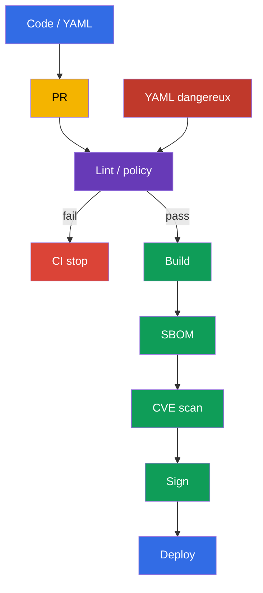
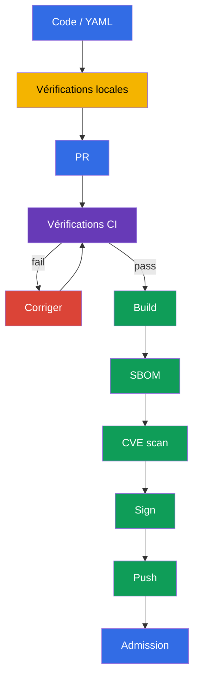

[Русская версия](ru.md) · [Eng version](README.md) · [Versión en español](es.md) · [Deutsche Version](de.md) · [ქართული ვერსია](ge.md) · [繁體中文版](tw.md) · [日本語版](jp.md)

# Chapitre 27. Analyse statique des charges de travail et des images

> **Le problème.** Un manifest syntaxiquement correct peut ajouter silencieusement `privileged: true`, un processus root, un root filesystem accessible en écriture ou une image avec `:latest`, tandis qu'un Dockerfile peut introduire un pattern de build dangereux. Après un merge, ce risque entre déjà dans CI et dans le cluster, où sa correction exige un rollout ou une réponse à incident. Vérifiez les Dockerfile et manifests sources avant le build, le push et le déploiement.

> **La suite.** Dans le [chapitre 26](../26/fr.md), nous avons appris à autoriser un registry de confiance et à vérifier la signature d'un artifact lors de l'admission. Mais une signature prouve l'origine, pas l'absence d'une configuration dangereuse : un Deployment signé peut toujours lancer un processus root, un root filesystem accessible en écriture ou une image taguée `latest`. L'analyse statique vérifie les Dockerfile et les manifests Kubernetes avant le push et le déploiement. C'est le domaine **Supply Chain Security** du CKS (20 %) : un feedback rapide en développement local et un gate CI obligatoire.

> **Ce qu'il faut connaître de CKA.** Les champs `securityContext` détectés par les linters - `runAsNonRoot`, `allowPrivilegeEscalation`, `readOnlyRootFilesystem`, capabilities et `privileged` - sont traités dans le [chapitre 20 de CKA](../../../cka/course/20/fr.md). Nous ne répétons pas leur syntaxe ici ; nous construisons plutôt des vérifications automatisées qui empêchent qu'un réglage dangereux soit oublié dans Git.

> 🧠 L'analyse shift-left déplace la recherche d'une configuration dangereuse dans la pull request : corriger le source avant le build et le déploiement coûte moins cher que réagir à un risque dans une charge de travail en cours d'exécution.

## 27.1. Modèle de menace : une configuration dangereuse entre dans le cluster avec le code

L'API Kubernetes accepte un manifest syntaxiquement valide même s'il va à l'encontre d'une pratique secure-by-default. Un conteneur exécuté avec UID 0, `privileged: true`, un root filesystem accessible en écriture ou une image avec `:latest` peuvent ressembler à une modification ordinaire en review. Si le problème n'est trouvé qu'après le déploiement, il est déjà accessible à un attaquant et exige une réponse à incident au lieu d'une correction peu coûteuse dans une pull request.

L'analyse statique lit les fichiers sources sans exécuter la workload. Elle ne remplace pas une admission policy, la vérification de signature, le vulnerability scanning ni la détection au runtime : les outils répondent à des questions différentes.



Scénario typique : un développeur ajoute un `Deployment` pour une API. Il indique `image: api:latest`, ne définit pas `securityContext`, et l'application a temporairement besoin d'un répertoire `/tmp`. Sans vérification, la workload est appliquée avec succès et s'exécute depuis une image qui change derrière le même tag, en root et avec un filesystem accessible en écriture. Avec `kube-linter`, `kubesec` et une policy personnalisée, CI affiche les violations précises avant le merge. La correction devient une partie du changement : un tag ou digest fixe, un utilisateur non-root, des capabilities supprimées et un `emptyDir` séparé pour les écritures.

| Contrôle | Question | Ce qu'il ne prouve pas |
|---|---|---|
| `kubesec` | le manifest est-il sûr selon un ensemble de controls connus ? | qu'une rule correspond à la policy de votre organisation |
| `kube-linter` | les best practices Kubernetes sont-elles respectées ? | que l'image ne contient aucune CVE |
| `hadolint` | le Dockerfile est-il sûr et reproductible ? | que l'image finale respecte la runtime policy |
| `conftest` + OPA | la policy-as-code locale passe-t-elle ? | que la policy est déjà reliée à l'admission |
| Trivy, signature, admission | y a-t-il des CVE, l'artifact est-il de confiance, le cluster l'admet-il ? | ne remplacent pas le lint du source |

Dans ce chapitre, `kubesec` et `kube-linter` sont des outils de pratique pour analyser les manifests Kubernetes. `hadolint` et `conftest` sont aussi utiles dans le cours et les labos : le premier analyse un Dockerfile, le second vérifie la policy locale d'une organisation. À l'examen, utilisez uniquement l'outil et l'environnement précisés dans la tâche.

Un linter est un détecteur, pas une autorité. Chaque rule doit être comprise : l'équipe doit pouvoir expliquer le risque, choisir une correction ou documenter l'acceptation d'une exception temporaire. Ne cachez pas une violation systémique avec un `--ignore` global ; limitez une exception à une rule, un fichier et une durée précis, puis supprimez-la.

> 🔬 `kubesec` fournit un security score et des controls, mais ne remplace pas la policy de votre organisation.

## 27.2. `kubesec` : scoring des manifests Kubernetes

`kubesec` analyse le YAML Kubernetes et associe les champs aux security controls. La commande affiche un score et une liste de checks réussis ou échoués. C'est utile comme signal rapide : des findings négatifs signifient souvent qu'il manque un `securityContext` ou qu'un host access est risqué. Un score n'est pas une preuve de sécurité et ne doit pas être le seul gate CI : certaines workloads légitimes, comme un CNI DaemonSet, exigent à juste titre des privilèges étendus.

Le manifest suivant est délibérément non sécurisé. Il sert uniquement à démontrer les findings ; ne l'appliquez pas en production :

```yaml
# manifests/api.yaml
apiVersion: apps/v1
kind: Deployment
metadata:
  name: api
  namespace: payments
spec:
  replicas: 2
  selector:
    matchLabels:
      app: api
  template:
    metadata:
      labels:
        app: api
    spec:
      containers:
      - name: api
        image: registry.example.com/payments/api:latest
        ports:
        - containerPort: 8080
```

Lancez un scan du fichier ou transmettez le YAML via stdin. Dans CI, utilisez une version épinglée de l'outil dans une builder image approuvée, ou un binary téléchargé et vérifié ; ne faites pas confiance à `latest` flottant pour le scanner lui-même.

```bash
kubesec scan manifests/api.yaml

# Pratique lors de la génération de YAML avec un outil de templating.
kustomize build overlays/prod | kubesec scan /dev/stdin
```

Le rapport contient un score global et des controls détaillés. Dans cet exemple, attendez-vous à des findings proches des recommandations suivantes :

| Finding | Pourquoi c'est dangereux | Correction pratique |
|---|---|---|
| `Run as non-root user` | une RCE obtient UID 0 dans le conteneur | ajouter un `USER` non-root à l'image et `runAsNonRoot: true` au Pod |
| `Read-only root filesystem` | un attaquant peut écrire des outils et modifier les fichiers runtime | définir `readOnlyRootFilesystem: true` ; déplacer les chemins inscriptibles dans un volume |
| `Drop NET_RAW capability` ou `Drop ALL capabilities` | des capabilities supplémentaires étendent les actions du processus | `drop: ["ALL"]` ; ne restaurer qu'une capability justifiée |
| Un control vérifié dans le ruleset épinglé | le risque et la correction dépendent du texte de ce control | afficher `kubesec print-rules` pour la version épinglée avant le gate ; ne pas attribuer un check de tag mutable à `kubesec` sans cette confirmation |

Suivez le texte des controls, pas un seul score. Par exemple, un score peut augmenter après l'ajout d'un securityContext, mais le manifest peut encore autoriser un registry inconnu - exprimez mieux cette rule dans `conftest` et l'admission policy. Lors de l'analyse d'un Helm chart, scannez son rendu ; sinon, le linter voit les templates plutôt que les ressources que `kubectl` enverra :

```bash
helm template payments-api ./chart --namespace payments \
  --values ./chart/values-production.yaml | kubesec scan /dev/stdin
```

N'envoyez pas de manifests privés à un scanner public en ligne. Un binary local ou un conteneur CI approuvé conserve le source dans votre execution environment.

> 🎯 `kube-linter` est une analyse statique orientée Kubernetes : lisez le finding, corrigez le manifest et répétez le lint jusqu'à obtenir un résultat propre.

## 27.3. `kube-linter` : vérification des best practices Kubernetes

`kube-linter` vérifie les manifests et Helm charts avec un ensemble de checks orientés Kubernetes. Contrairement au score de `kubesec`, son résultat identifie généralement une resource, un conteneur et un nom de check précis. C'est pratique pour un gate : lint renvoie un code de sortie non nul lorsqu'il trouve des erreurs.

```bash
# Vérifier un répertoire avec du YAML simple.
kube-linter lint manifests/

# Vérifier un chart et tous ses templates.
kube-linter lint ./chart

# Afficher les checks disponibles et leur objectif.
kube-linter checks list
```

Pour l'exemple `manifests/api.yaml`, les findings typiques sont `run-as-non-root`, `no-read-only-root-fs` et `latest-tag`. L'ensemble exact dépend de la version de `kube-linter` et des checks activés, épinglez donc la version dans CI et conservez sa sortie comme artifact de job. Ne construisez pas `image:` en concaténant une variable vide : cela peut transformer le tag versionné attendu en `latest`.

Le manifest corrigé ajoute une défense en profondeur. L'application doit être compatible avec UID `10001` ; l'image doit également avoir un `USER` non-root, car le manifest ne corrige pas une image dangereuse lors de son exécution locale. `emptyDir` donne à l'application son unique emplacement inscriptible, tandis que `readOnlyRootFilesystem` laisse la racine immutable.

```yaml
# manifests/api.yaml
apiVersion: apps/v1
kind: Deployment
metadata:
  name: api
  namespace: payments
spec:
  replicas: 2
  selector:
    matchLabels:
      app: api
  template:
    metadata:
      labels:
        app: api
    spec:
      securityContext:
        runAsNonRoot: true
        runAsUser: 10001
        runAsGroup: 10001
      containers:
      - name: api
        image: registry.example.com/payments/api:1.4.2@sha256:<digest-vérifié-de-64-caractères>
        ports:
        - containerPort: 8080
        securityContext:
          allowPrivilegeEscalation: false
          readOnlyRootFilesystem: true
          capabilities:
            drop: ["ALL"]
        volumeMounts:
        - name: tmp
          mountPath: /tmp
      volumes:
      - name: tmp
        emptyDir: {}
```

Après la modification, relancez lint. Une sortie propre signifie seulement que l'ensemble actuel de checks n'a trouvé aucune violation ; cela ne supprime pas le besoin de review et des gates suivants.

```bash
kube-linter lint manifests/
kubesec scan manifests/api.yaml
kubectl apply --dry-run=server -f manifests/api.yaml
```

`kubectl apply --dry-run=server` valide l'API schema et l'admission sans persister la resource. C'est un signal différent de lint : le schema peut être correct pour un manifest dangereux, alors qu'une policy personnalisée peut rejeter un manifest accepté par un linter générique.

> 🏭 Versionnez l'ensemble des checks, limitez étroitement le scope des exceptions et ne désactivez pas la baseline de sécurité pour tout le repository à cause d'une workload legacy.

### Configuration des checks sans affaiblir tout le pipeline

Certaines checks nécessitent une configuration pour une workload legacy. Sans `doNotAutoAddDefaults: true`, `include` ajoute des checks à l'ensemble par défaut au lieu de le remplacer. Si vous avez besoin d'une baseline de sécurité exactement vérifiable, désactivez l'ajout automatique des defaults et énumérez l'ensemble complet. Ne désactivez pas `run-as-non-root` pour tout le repository à cause d'un seul DaemonSet système : placez le manifest système dans un chemin séparé, ajoutez une exception justifiée à la policy et limitez qui peut modifier cette exception.

```yaml
# .kube-linter.yaml
checks:
  doNotAutoAddDefaults: true
  include:
  - run-as-non-root
  - no-read-only-root-fs
  - privilege-escalation-container
  - privileged-container
  - drop-net-raw-capability
  - sensitive-host-mounts
  - docker-sock
  - latest-tag
```

Vérifiez les noms et la disponibilité des checks pour la version épinglée avec `kube-linter checks list` ; ne copiez pas de configuration entre versions sans la contrôler. CI doit échouer s'il ne peut pas charger la configuration - un repli silencieux vers les checks par défaut crée une fausse impression de protection.

> 🔬 `hadolint` est utile pour les Dockerfile et la reproductibilité des images, mais ne remplace pas l'image scan.

## 27.4. `hadolint` : analyse d'un Dockerfile avant le build de l'image

Un manifest protège le runtime, mais un problème de sécurité commence souvent dans le Dockerfile : une base image mutable, `apt-get install` sans nettoyage, `curl | sh`, un utilisateur final root ou une forme shell de `CMD`. `hadolint` analyse un Dockerfile et signale des rules au format `DL####`. Il ne build pas l'image et n'exécute pas `RUN`, il est donc plus sûr et plus rapide à lancer qu'un build, mais ne remplace pas build/test/scan.

```bash
hadolint Dockerfile

# Utiliser stdin dans une intégration d'éditeur ou CI.
hadolint - < Dockerfile
```

Exemple de Dockerfile avec des problèmes fréquents :

```dockerfile
FROM ubuntu:latest
RUN apt-get update
RUN apt-get install -y curl
COPY . /app
CMD python /app/server.py
```

Messages `hadolint` typiques et réponse correcte :

| Rule | Signal | Correction |
|---|---|---|
| `DL3002` | le `USER` final est root | définir un `USER` non-root dans le stage final ; `runAsNonRoot` au niveau du Pod reste une protection indépendante |
| `DL3007` | le tag `latest` est mutable | spécifier une version concrète de base image et épingler un digest pour une release |
| `DL3008` | un package n'a pas de version | épingler la version lorsque le repository et votre stratégie de mise à jour le permettent |
| `DL3009` | le cache `apt` reste présent | combiner update/install/cleanup dans un seul `RUN`, ou utiliser une base minimale adaptée |
| `DL3059` | plusieurs instructions `RUN` successives | combiner les opérations logiquement liées sans rendre le Dockerfile moins lisible |
| `DL3025` | forme shell de `CMD` | employer la forme JSON/exec afin que le processus reçoive correctement les signals |

Le nombre `DL####` renvoie à une rule précise, pas à une sévérité universelle. Lisez d'abord sa description : un message affecte parfois la reproductibilité, parfois la taille de l'image ou la gestion des signals. N'utilisez pas un ignore inline simplement pour rendre CI vert. Si une exception est justifiée, laissez un court commentaire avec la raison, l'issue et l'échéance de review.

Voici un pattern minimal pour un service Go. Les versions précises sont illustratives : le release pipeline doit fournir un digest vérifié selon le registry interne et le processus de mise à jour des base images. Le stage final ne contient ni package manager, ni compiler, ni shell ; le `USER` au niveau de l'image et le securityContext au niveau du Pod se complètent.

```dockerfile
# syntax=docker/dockerfile:1.7
FROM golang:1.27.1-alpine3.24 AS build
WORKDIR /src
COPY go.mod go.sum ./
RUN go mod download
COPY . ./
RUN CGO_ENABLED=0 GOOS=linux go build -trimpath -ldflags="-s -w" \
    -o /out/api ./cmd/api

FROM scratch
COPY --from=build /out/api /api
USER 10001:10001
ENTRYPOINT ["/api"]
```

`hadolint` ne voit pas tout : il ne sait pas si `COPY . .` inclut un secret, si l'architecture du binary correspond au node, ni si la base image a une CVE. Utilisez `.dockerignore`, les secret mounts BuildKit, les tests unitaires, un SBOM et le scanner des chapitres voisins. Lint aide à révéler une erreur structurelle plus tôt ; il ne remplace pas les contrôles de supply chain.

> 🔬 `conftest` étend le lint générique avec des rules Rego locales ; testez et versionnez les policies elles-mêmes avec `opa test`.

## 27.5. OPA `conftest` : vérification de policy-as-code pour les manifests

Les linters génériques connaissent les best practices courantes. Les organisations ajoutent habituellement des rules qui dépendent de leur modèle de menace : seuls les registries internes sont autorisés, un namespace de production exige des limits, chaque workload doit avoir un label owner et une exception n'est permise qu'avec un ticket et une date d'expiration. `conftest` exécute des policies OPA Rego sur YAML, JSON, HCL et d'autres fichiers structurés, et renvoie un code de sortie non nul lorsqu'une rule produit `deny`.

La structure du repository peut ressembler à ceci :

```text
.
├── Dockerfile
├── manifests/
│   └── api.yaml
└── policy/
    └── main.rego
```

La policy Rego suivante ne correspond volontairement qu'à `Deployment`, mais vérifie les conteneurs réguliers/init et les références OCI dans les image volumes. C'est un scope d'apprentissage volontairement limité, pas une policy prête pour la production à l'échelle du cluster : en production, ajoutez séparément Pod, StatefulSet, DaemonSet, Job/CronJob et les chemins de templates correspondants, ou appliquez la même intention dans une admission policy. La tâche de la policy est de codifier explicitement les exigences locales immuables : un préfixe de registry de confiance et un digest immutable valide pour chaque chemin vers un artifact OCI, ainsi qu'une exécution effective non-root, un root filesystem en lecture seule et l'interdiction de privilege escalation pour les conteneurs. Dans Kubernetes v1.36, les [image volumes](https://v1-36.docs.kubernetes.io/docs/tasks/configure-pod-container/image-volumes/) sont stables et activés par défaut ; leur `spec.volumes[].image.reference` ne fait pas partie de la boucle générique des conteneurs, la policy les vérifie donc séparément. `object.get` fournit une valeur par défaut sûre aux objets optionnels : un `securityContext` absent produit ainsi lui aussi une violation au lieu de laisser la rule indéfinie.

```rego
# policy/main.rego
package main

import rego.v1

workload if {
  object.get(input, "kind", "") == "Deployment"
}

pod_template := object.get(object.get(input, "spec", {}), "template", {})
pod_spec := object.get(pod_template, "spec", {})
pod_security_context := object.get(pod_spec, "securityContext", {})
containers := object.get(pod_spec, "containers", [])
init_containers := object.get(pod_spec, "initContainers", [])
all_containers := array.concat(containers, init_containers)

# Les image volumes de Kubernetes v1.36 fournissent un artifact OCI non via containers[].image,
# mais via spec.volumes[].image.reference ; appliquez-leur la même intention registry/digest.
image_volumes := [volume |
  volume := object.get(pod_spec, "volumes", [])[_]
  object.get(volume, "image", null) != null
]

violation contains msg if {
  workload
  container := all_containers[_]
  image := object.get(container, "image", "")
  not startswith(image, "registry.example.com/")
  name := object.get(container, "name", "<unnamed>")
  msg := sprintf("container %q uses an unapproved registry: %s", [name, image])
}

# Exigez une référence OCI réellement immutable. Kubernetes traite une image sans tag comme
# :latest, et un digest court ou invalide n'est pas un pin SHA-256.
violation contains msg if {
  workload
  container := all_containers[_]
  image := object.get(container, "image", "")
  not regex.match(`^.+@sha256:[A-Fa-f0-9]{64}$`, image)
  name := object.get(container, "name", "<unnamed>")
  msg := sprintf("container %q must use an image pinned by a valid SHA-256 digest", [name])
}

violation contains msg if {
  workload
  volume := image_volumes[_]
  reference := object.get(object.get(volume, "image", {}), "reference", "")
  not startswith(reference, "registry.example.com/")
  name := object.get(volume, "name", "<unnamed>")
  msg := sprintf("image volume %q uses an unapproved registry: %s", [name, reference])
}

violation contains msg if {
  workload
  volume := image_volumes[_]
  reference := object.get(object.get(volume, "image", {}), "reference", "")
  not regex.match(`^.+@sha256:[A-Fa-f0-9]{64}$`, reference)
  name := object.get(volume, "name", "<unnamed>")
  msg := sprintf("image volume %q must use an image pinned by a valid SHA-256 digest", [name])
}

# Un securityContext au niveau du conteneur a priorité sur un champ recouvrant au niveau du Pod.
violation contains msg if {
  workload
  container := all_containers[_]
  container_security_context := object.get(container, "securityContext", {})
  effective_run_as_non_root := object.get(
    container_security_context,
    "runAsNonRoot",
    object.get(pod_security_context, "runAsNonRoot", false)
  )
  effective_run_as_non_root != true
  name := object.get(container, "name", "<unnamed>")
  msg := sprintf("container %q must effectively runAsNonRoot: true", [name])
}

violation contains msg if {
  workload
  container := all_containers[_]
  container_security_context := object.get(container, "securityContext", {})
  object.get(container_security_context, "readOnlyRootFilesystem", false) != true
  name := object.get(container, "name", "<unnamed>")
  msg := sprintf("container %q must set readOnlyRootFilesystem: true", [name])
}

violation contains msg if {
  workload
  container := all_containers[_]
  container_security_context := object.get(container, "securityContext", {})
  object.get(container_security_context, "allowPrivilegeEscalation", true) != false
  name := object.get(container, "name", "<unnamed>")
  msg := sprintf("container %q must set allowPrivilegeEscalation: false", [name])
}

deny contains msg if {
  msg := violation[_]
}
```

Testez la policy avec des fixtures mauvaises et bonnes. `conftest test` lit automatiquement le répertoire de policy lorsqu'il se trouve dans `policy/` ; l'option explicite `--policy` rend l'invocation CI claire.

```bash
# Elle doit afficher deny et renvoyer un code de sortie non nul pour l'ancien manifest.
conftest test --policy policy manifests/api.yaml

# Après la correction de la policy et du manifest, la commande doit renvoyer 0.
conftest test --policy policy manifests/
```

La policy a aussi besoin d'une suite de tests. Sinon, une modification Rego peut supprimer accidentellement un control alors que CI reste vert. Un `*_test.rego` séparé teste les deny/allow attendus sans lancer de cluster :

```rego
# policy/main_test.rego
package main

import rego.v1

test_denies_missing_security_context if {
  resource := {
    "kind": "Deployment",
    "spec": {"template": {"spec": {
      "containers": [{
        "name": "api",
        "image": "registry.example.com/payments/api:1.4.2",
      }],
    }}},
  }
  result := violation with input as resource
  "container \"api\" must effectively runAsNonRoot: true" in result
  "container \"api\" must set readOnlyRootFilesystem: true" in result
  "container \"api\" must set allowPrivilegeEscalation: false" in result
}

test_denies_dangerous_variants if {
  resource := {
    "kind": "Deployment",
    "spec": {"template": {"spec": {
      "securityContext": {"runAsNonRoot": false},
      "containers": [{
        "name": "api",
        "image": "docker.io/library/api:latest",
        "securityContext": {
          "readOnlyRootFilesystem": false,
          "allowPrivilegeEscalation": true,
        },
      }],
    }}},
  }
  result := violation with input as resource
  "container \"api\" uses an unapproved registry: docker.io/library/api:latest" in result
  "container \"api\" must use an image pinned by a valid SHA-256 digest" in result
  "container \"api\" must effectively runAsNonRoot: true" in result
  "container \"api\" must set readOnlyRootFilesystem: true" in result
  "container \"api\" must set allowPrivilegeEscalation: false" in result
}

test_denies_unapproved_registry_in_init_container if {
  resource := {
    "kind": "Deployment",
    "spec": {"template": {"spec": {
      "securityContext": {"runAsNonRoot": true},
      "initContainers": [{
        "name": "untrusted-init",
        "image": "docker.io/library/init@sha256:0123456789abcdef0123456789abcdef0123456789abcdef0123456789abcdef",
        "securityContext": {"readOnlyRootFilesystem": true, "allowPrivilegeEscalation": false},
      }],
      "containers": [{
        "name": "api",
        "image": "registry.example.com/payments/api@sha256:0123456789abcdef0123456789abcdef0123456789abcdef0123456789abcdef",
        "securityContext": {"readOnlyRootFilesystem": true, "allowPrivilegeEscalation": false},
      }],
    }}},
  }
  result := violation with input as resource
  "container \"untrusted-init\" uses an unapproved registry: docker.io/library/init@sha256:0123456789abcdef0123456789abcdef0123456789abcdef0123456789abcdef" in result
}

test_denies_untagged_image_container_override_and_unsafe_init if {
  resource := {
    "kind": "Deployment",
    "spec": {"template": {"spec": {
      "securityContext": {"runAsNonRoot": true},
      "initContainers": [{
        "name": "init",
        "image": "registry.example.com/payments/init",
        "securityContext": {"readOnlyRootFilesystem": false, "allowPrivilegeEscalation": false},
      }],
      "containers": [{
        "name": "api",
        "image": "registry.example.com/payments/api@sha256:0123456789abcdef0123456789abcdef0123456789abcdef0123456789abcdef",
        "securityContext": {"runAsNonRoot": false, "readOnlyRootFilesystem": true, "allowPrivilegeEscalation": false},
      }],
    }}},
  }
  result := violation with input as resource
  "container \"init\" must use an image pinned by a valid SHA-256 digest" in result
  "container \"api\" must effectively runAsNonRoot: true" in result
  "container \"init\" must set readOnlyRootFilesystem: true" in result
}

test_denies_untrusted_unpinned_image_volume if {
  resource := {
    "kind": "Deployment",
    "spec": {"template": {"spec": {
      "securityContext": {"runAsNonRoot": true},
      "volumes": [{
        "name": "model",
        "image": {"reference": "docker.io/library/model:latest"},
      }],
      "containers": [{
        "name": "api",
        "image": "registry.example.com/payments/api@sha256:0123456789abcdef0123456789abcdef0123456789abcdef0123456789abcdef",
        "securityContext": {"readOnlyRootFilesystem": true, "allowPrivilegeEscalation": false},
      }],
    }}},
  }
  result := violation with input as resource
  "image volume \"model\" uses an unapproved registry: docker.io/library/model:latest" in result
  "image volume \"model\" must use an image pinned by a valid SHA-256 digest" in result
}

test_allows_hardened_workload if {
  resource := {
    "kind": "Deployment",
    "spec": {"template": {"spec": {
      "securityContext": {"runAsNonRoot": true},
      "containers": [{
        "name": "api",
        "image": "registry.example.com/payments/api:1.4.2@sha256:0123456789abcdef0123456789abcdef0123456789abcdef0123456789abcdef",
        "securityContext": {
          "readOnlyRootFilesystem": true,
          "allowPrivilegeEscalation": false,
        },
      }],
    }}},
  }
  result := violation with input as resource
  count(result) == 0
}
```

```bash
opa test policy/ -v
```

En production, dupliquez les policies critiques dans un admission controller, comme Kyverno, Gatekeeper ou ValidatingAdmissionPolicy, là où cela s'applique. `conftest` protège le chemin Git -> CI ; l'admission protège l'API contre un `kubectl apply` manuel, un autre pipeline et un job mal configuré. Les policies devraient avoir une source unique ou des tests confirmant une intention équivalente, sinon elles divergent avec le temps.

> 🏭 L'analyse statique ne devient une protection qu'en tant que gate CI obligatoire et reproductible, avec des outils épinglés, des rapports et des exceptions gérées.

## 27.6. Gate CI et cycle « corriger - relancer la vérification »

L'analyse statique n'est utile que si son résultat affecte la livraison. Une exécution locale procure un feedback rapide, mais un job CI obligatoire rend la vérification reproductible pour chaque pull request. Le pipeline doit installer ou utiliser des releases épinglées, conserver les rapports comme artifacts et arrêter build/push en cas d'erreur. Ne téléversez pas de manifests avec des secrets de production vers un scanner et n'affichez pas de secrets dans les logs.

La séquence minimale :



Pour la pratique de ce chapitre, le gate peut exécuter `kubesec` et `kube-linter` ; ajoutez `hadolint` pour le Dockerfile et `conftest` avec des tests unitaires pour une vérification locale complète. Le job GitHub Actions ci-dessous montre une séquence étendue plutôt qu'il ne prescrit un fournisseur CI. À l'examen, utilisez l'outil et l'environnement précisés par la tâche. Dans un pipeline réel, remplacez les téléchargements `curl` flottants par une tool image interne et vérifiée ou par un digest épinglé d'action/image ; utilisez un lockfile ou des checksums vérifiés pour les binaries. Ajoutez `helm template` ou `kustomize build` avant les linters si le déploiement de production utilise des templates.

```yaml
# .github/workflows/static-analysis.yaml
name: static-analysis
on:
  pull_request:
    paths:
    - 'Dockerfile'
    - 'manifests/**'
    - 'policy/**'

jobs:
  lint:
    runs-on: ubuntu-24.04
    permissions:
      contents: read
    steps:
    - uses: actions/checkout@<digest-action-vérifié>

    - name: Hadolint
      run: hadolint Dockerfile

    - name: Kubernetes best-practice checks
      run: kube-linter lint manifests/

    - name: Kubernetes security score gate
      shell: bash
      run: |
        set -euo pipefail
        kubesec scan manifests/api.yaml --format json \
          | tee kubesec-report.json \
          | jq -e '
              type == "array"
              and length > 0
              and all(.[];
                .valid == true
                and ((.scoring.critical // []) | length == 0)
                and ((.score? | type) == "number")
                and .score > 0
              )
            ' > /dev/null

    - name: Organisation policy
      run: conftest test --policy policy manifests/

    - name: Policy unit tests
      run: opa test policy/ -v

    - name: Save static-analysis report
      uses: actions/upload-artifact@<digest-action-vérifié>
      with:
        name: static-analysis-report
        path: kubesec-report.json
```

Vérifiez le code de sortie et un résultat vérifiable par machine, pas la présence de texte dans stdout. `tee` ne fait que conserver le JSON, et `pipefail` ne fait qu'empêcher que l'échec du scanner soit masqué : aucun des deux ne crée un security gate. Le JSON par défaut de `kubesec` est un tableau de résultats ; le score global combine des points positifs et négatifs, tandis que `scoring.critical` est une liste séparée de findings critiques. Par conséquent, `jq -e` doit vérifier chaque élément : validité du schema, absence de findings critiques et seuil numérique de score versionné. Dans l'exemple ci-dessous, un tableau vide, un résultat invalide, un finding critique, un score non numérique ou un score `<= 0` font échouer la commande. Si une rule critique précise est délibérément autorisée, créez une exception étroite et versionnée avec owner et expiration au lieu de la compenser par un score global.

```bash
set -euo pipefail
kubesec scan manifests/api.yaml --format json \
  | tee kubesec-report.json \
  | jq -e '
      type == "array"
      and length > 0
      and all(.[];
        .valid == true
        and ((.scoring.critical // []) | length == 0)
        and ((.score? | type) == "number")
        and .score > 0
      )
    ' > /dev/null
```

> 🎯 Compétence générale : trouvez le finding, corrigez le Dockerfile ou manifest source et répétez le scan jusqu'à ce que le code de sortie réussisse ; ne masquez pas le problème avec un ignore global.

### Cycle pratique de correction

1. Créez ou utilisez un manifest avec `:latest` et sans `runAsNonRoot`, `readOnlyRootFilesystem` ni `allowPrivilegeEscalation`.
2. Exécutez `kubesec scan`, `kube-linter lint` et `conftest test`. Conservez la sortie initiale : elle explique pourquoi CI doit s'arrêter.
3. Corrigez le source, pas la sortie : un tag/digest versionné, un utilisateur non-root au niveau de l'image, un `securityContext` de Pod, `drop: ["ALL"]` et un `emptyDir` pour le répertoire réellement inscriptible.
4. Exécutez à nouveau toutes les vérifications, y compris `hadolint Dockerfile` et `opa test policy/`. Vérifiez que les commandes renvoient `0`.
5. Vérifiez la compatibilité API sans créer la workload : `kubectl apply --dry-run=server -f manifests/`. Si la production utilise un chart rendu, vérifiez le YAML rendu lui-même.
6. Exécutez build, SBOM, image scan, signing et deployment gates seulement après que le gate d'analyse statique est vert. Ne transformez pas CI en « warning only » avant que l'équipe ait décidé quelle acceptation du risque est permise.

Voici un script local compact qui implémente le même gate. Il s'arrête intentionnellement à la première erreur ; le développeur doit corriger le finding et relancer le script.

```bash
#!/usr/bin/env bash
# scripts/static-analysis.sh
set -euo pipefail

hadolint Dockerfile
kube-linter lint manifests/
kubesec scan manifests/api.yaml --format json \
  | tee kubesec-report.json \
  | jq -e '
      type == "array"
      and length > 0
      and all(.[];
        .valid == true
        and ((.scoring.critical // []) | length == 0)
        and ((.score? | type) == "number")
        and .score > 0
      )
    ' > /dev/null
conftest test --policy policy manifests/
opa test policy/ -v
kubectl apply --dry-run=server -f manifests/
```

Erreurs fréquentes et diagnostic :

| Symptôme | Cause | Que faire |
|---|---|---|
| `kube-linter` signale encore `run-as-non-root` | le champ a été ajouté en dehors de `spec.template.spec`, ou un override de conteneur précis annule le réglage | vérifier la resource rendue avec `kubectl kustomize`/`helm template` et le chemin `spec.template.spec.securityContext` |
| l'application échoue après `readOnlyRootFilesystem: true` | le processus écrit un cache, PID ou fichier temporaire dans le root filesystem | identifier le chemin à partir des logs, monter un `emptyDir` étroit uniquement là ; ne désactivez pas toute la racine en lecture seule |
| `hadolint` passe mais l'image s'exécute en root | le Dockerfile ne contient pas `USER`, tandis que le manifest ne vérifie que le runtime du cluster | ajouter un `USER` non-root dans le stage final et conserver le guard du manifest |
| `conftest` ne trouve pas une rule | un template a été transmis au lieu du YAML rendu, ou le chemin `--policy` est incorrect | tester la fixture d'entrée, exécuter `opa test`, puis lint le rendu lui-même |
| CI est vert après `kubesec ... | tee` | `tee` a conservé le JSON, mais le résultat de sécurité n'a pas été vérifié | activez `set -o pipefail` et `jq -e` : vérifiez `.valid == true`, `scoring.critical` vide et un seuil de score versionné pour tout le tableau JSON |
| une workload système critique nécessite une exception | la rule s'applique à égalité à l'application et à CNI/CSI | utilisez un scope séparé et une exception least-privilege avec owner, ticket et expiration ; n'utilisez pas un ignore global |

> 🏭 Lint le YAML rendu final, conservez les résultats et versions des scanners, et alignez les rules critiques sur l'admission policy pour empêcher un contournement de CI.

## 27.7. Application en production

- **Lint s'exécute avant le build.** Le développeur reçoit du feedback dans pre-commit/l'éditeur ou un job CI distinct avant de dépenser des ressources pour le build, le push et un integration environment. Une PR ne peut pas être merge tant que les findings obligatoires ne sont pas corrigés ou qu'une exception étroite n'est pas approuvée.
- **Les outils et rules sont épinglés.** Les versions de `kube-linter`, `kubesec`, `hadolint`, `conftest` et OPA sont épinglées dans une CI image de confiance ou un lockfile. La mise à jour des rules passe en review : une nouvelle version peut ajouter des findings légitimes mais ne doit pas affaiblir silencieusement le gate.
- **Le YAML final est vérifié.** Helm/Kustomize/GitOps peuvent modifier les values, images et securityContext. CI lint l'artifact rendu qui sera signé/appliqué, pas seulement le source du template.
- **Policy-as-code vit avec les policies applicative et de plateforme.** Les rules d'équipe sont testées avec `opa test` ; les controls obligatoires à l'échelle du cluster sont dupliqués ou centralisés dans l'admission. Une exception a un owner, une raison et une date d'expiration.
- **L'analyse statique fait partie de la chaîne.** Elle est suivie de SBOM, vulnerability scanning, signature et promotion de registry ; l'admission s'applique avant le runtime. Les controls runtime trouvent ce que l'inspection des sources ne peut voir.
- **Les rapports conviennent à l'audit.** CI conserve la version du scanner, les résultats et un lien vers le commit. Les rapports ne doivent contenir ni credentials, ni clés privées, ni données Secret de production.

## 27.8. Mini-glossaire

- **Static analysis** - vérification des Dockerfile, manifests et policy sources sans exécuter une workload.
- **`kubesec`** - scanner de manifests Kubernetes qui produit un security score et des controls.
- **`kube-linter`** - linter de YAML Kubernetes et Helm charts avec un ensemble de best-practice checks.
- **`hadolint`** - linter Dockerfile ; les rules sont identifiées par les codes `DL####`.
- **OPA (Open Policy Agent)** - policy engine qui exécute des rules Rego déclaratives.
- **`conftest`** - CLI permettant de vérifier une configuration structurée avec des rules OPA/Rego.
- **Rego** - langage de policy OPA.
- **CI gate** - vérification obligatoire qui bloque l'étape suivante du pipeline avec un code de sortie non nul.
- **Rendered manifest** - YAML final après `helm template` ou `kustomize build`.
- **False positive** - finding qui ne s'applique pas à une resource précise ; il exige une exception étroite et documentée plutôt que la désactivation globale du contrôle.

## 27.9. Résumé du chapitre

- Un manifest Kubernetes peut être valide pour l'API mais dangereux ; l'analyse statique trouve ces erreurs avant le déploiement et transforme la pratique de sécurité en gate CI reproductible.
- Dans la pratique du cours, `kubesec` montre un score et des security controls, tandis que `kube-linter` vérifie les best practices Kubernetes, dont non-root, un root filesystem en lecture seule et les tags mutables. Le gate `kubesec` analyse le tableau JSON et vérifie la validité, l'absence de `scoring.critical` et un seuil de score versionné pour chaque résultat.
- `hadolint` détecte les problèmes structurels de Dockerfile au moyen des rules `DL####`, y compris `DL3002` pour un utilisateur final root, mais ne remplace ni le build de l'image, ni le secret handling, ni le CVE scanning.
- `conftest` exécute une policy Rego versionnée pour des exigences propres à l'organisation ; la policy elle-même doit avoir des tests via `opa test`, notamment pour les champs absents et les valeurs dangereuses. Dans Kubernetes v1.36, la policy doit couvrir séparément les références OCI dans les image volumes, qui ne sont pas des container images.
- Une correction signifie modifier le Dockerfile/manifest/policy pour que tous les linters et le server dry-run renvoient à nouveau `0`.
- Lint ne remplace ni SBOM, ni vulnerability scanning, ni signature, ni admission : ce sont des couches successives de défense de supply chain.

## 27.10. Utilité à l'examen et dans le travail réel

**À l'examen.** La pratique avec `kubesec`, `kube-linter`, `hadolint` et `conftest` aide à lire un finding et à corriger un `securityContext`, une image reference, un Dockerfile ou une policy locale. Ces outils ne doivent pas être considérés comme une partie obligatoire de l'examen ni supposés disponibles dans son environnement : utilisez uniquement l'outil et l'environnement précisés par la tâche. Retenez le lien avec SecurityContext : `runAsNonRoot`, `allowPrivilegeEscalation: false`, `readOnlyRootFilesystem: true` et `capabilities.drop: ["ALL"]` sont une baseline typique que les outils d'analyse peuvent vérifier. Pour CI, il est important de comprendre qu'un échec doit bloquer la promotion de l'artifact et que la vérification est relancée après la correction.

**Dans le travail réel.** L'analyse statique fait d'une configuration sûre une qualité habituelle du code : le finding est visible à l'auteur de la PR, et non à l'équipe sécurité après un déploiement de production. La combinaison de linters génériques, d'une policy Rego testée, de vérifications de manifests rendus et d'un gate CI obligatoire réduit la probabilité de workloads root, d'images mutables et de registries non approuvés. Le pipeline continue alors à vérifier les bytes de l'artifact : SBOM, CVE scanning, signatures et admission protègent contre les risques que lint ne peut pas voir.

## 27.11. Questions d'autoévaluation

<details>
<summary>1. Pourquoi du YAML Kubernetes appliqué avec succès peut-il tout de même être dangereux ?</summary>

L'API vérifie la syntaxe et le schema, mais ne considère pas un processus root, un root filesystem accessible en écriture, `privileged: true` ou `:latest` comme une erreur. Un tel manifest peut créer avec succès une workload tout en violant la pratique secure-by-default. L'analyse statique trouve ces risques avant le merge et le déploiement, tandis que l'admission et les controls runtime la complètent ensuite.
</details>

<details>
<summary>2. En quoi un score `kubesec` diffère-t-il de la policy obligatoire de votre organisation ?</summary>

`kubesec` fournit un score et des findings pour des controls connus - un signal général rapide, pas une autorité pour une organisation précise. Une policy organisationnelle peut exiger, par exemple, un registry interne, un digest valide ou un label owner, ce qu'un score générique ne prouve pas. Ces invariants sont formalisés dans Rego versionné via `conftest` et, au besoin, dupliqués dans l'admission.
</details>

<details>
<summary>3. Quels findings typiques `kube-linter` signale-t-il pour un conteneur applicatif habituel ?</summary>

Pour un exemple sans hardening, les checks typiques sont `run-as-non-root`, `no-read-only-root-fs` et `latest-tag`. Les checks pour `allowPrivilegeEscalation`, `privileged`, capabilities, sensitive host mounts et docker socket sont également utiles. L'ensemble exact dépend de la version épinglée et des checks activés ; vérifiez-le donc avec `kube-linter checks list`.
</details>

<details>
<summary>4. Pourquoi `hadolint` ne remplace-t-il pas un vulnerability scanner, et pourquoi faut-il lire le `DL####` précis ?</summary>

Hadolint analyse le Dockerfile, mais ne build pas l'image, n'exécute pas `RUN` et ne confronte pas les packages à une CVE database. Un scanner est nécessaire pour l'image finale et ses dépendances, tandis que hadolint attrape les problèmes structurels comme un utilisateur final root, un base tag mutable ou une forme shell de `CMD`. Lisez le code `DL####`, car son sens peut concerner la sécurité, la reproductibilité, la taille de l'image ou la gestion des signals.
</details>

<details>
<summary>5. Comment `conftest` et Rego aident-ils à vérifier un registry de confiance ou un `securityContext` obligatoire ?</summary>

`conftest test` transmet le YAML à une policy Rego et renvoie un code non nul lorsqu'une rule produit `deny`. L'exemple de policy vérifie le préfixe `registry.example.com/` et le digest SHA-256 pour les conteneurs réguliers/init et les image volumes, ainsi que `runAsNonRoot`, `readOnlyRootFilesystem` et `allowPrivilegeEscalation` effectifs pour les conteneurs. Les tests `opa test` protègent la policy elle-même d'un affaiblissement accidentel.
</details>

<details>
<summary>6. Pourquoi CI doit-il scanner la sortie Helm/Kustomize rendue plutôt que seulement les templates ?</summary>

Les templates ne sont pas encore la resource envoyée à l'API : values, Kustomize et GitOps peuvent modifier l'image ou le `securityContext`. Le linter et la policy doivent voir le manifest final rendu. Sinon, CI peut être vert pour un template alors que le déploiement reçoit une configuration différente et dangereuse.
</details>

<details>
<summary>7. Que faut-il faire après un finding : désactiver la rule, corriger le source ou accepter une exception étroite ?</summary>

La voie normale consiste à corriger le Dockerfile, manifest ou policy source et à répéter les vérifications. Un `--ignore` global masque une violation systémique ; limitez une exception légitime à une rule et un scope précis, et documentez sa raison, son owner et son échéance de review. Après une correction, lint, `conftest`, les tests de policy et le server dry-run doivent repasser.
</details>

<details>
<summary>8. Pourquoi `set -o pipefail` est-il important pour une commande de scanner dont la sortie est transmise à `tee` ?</summary>

Sans `pipefail`, le shell peut renvoyer le statut de la dernière commande `tee` réussie et masquer l'échec du scanner. Il préserve l'échec de la commande source dans tout le pipeline. Cependant, cela ne suffit pas pour `kubesec` : vérifiez explicitement le JSON avec `jq -e` pour chaque élément du tableau - `.valid == true`, `scoring.critical` vide et un seuil de score versionné ; un score positif ne compense pas un finding critique.
</details>

<details>
<summary>9. **Flashback (chapitre 07).** `kube-bench`/CIS Benchmark (chapitre 07) et `kubesec`/`kube-linter` (ce chapitre) vérifient tous deux statiquement la configuration, mais à des étapes différentes : l'un vérifie un control plane/node déjà exécuté, l'autre un manifest avant le déploiement. Si les deux outils sont techniquement disponibles, lequel détecte en premier un réglage dangereux, et pourquoi une détection plus précoce coûte-t-elle généralement moins cher ?</summary>

`kubesec` et `kube-linter` vérifient un manifest avant le build/déploiement, tandis que `kube-bench` voit un control plane ou node déjà exécuté. Un finding précoce est corrigé dans une pull request avant la publication de l'artifact et le démarrage de la workload, sans réponse à incident, rollout ni interruption. `kube-bench` reste nécessaire pour vérifier la configuration réelle de l'infrastructure que le manifest ne couvre pas.
</details>

## Pratique

Dans ce chapitre, nous avons arrêté un Dockerfile ou manifest dangereux avant le build et le déploiement. Ensuite, dans le [chapitre 28](../28/fr.md), nous vérifierons l'image déjà construite pour les CVE : lint concerne la configuration, tandis qu'un scanner concerne les vulnérabilités connues dans les bytes et les packages. La chaîne complète du labo 111 combine analyse statique, SBOM, image scan et signature.

🧪 Labo 111 (Supply chain : analyse, Trivy, SBOM, signature) : [tasks/cks/labs/111](../../labs/111/README_FR.MD)
🌐 Pratique interactive supplémentaire (killer.sh/killercoda, ressource externe) : [static-manual-analysis-k8s](https://killercoda.com/killer-shell-cks/scenario/static-manual-analysis-k8s) · [static-manual-analysis-docker](https://killercoda.com/killer-shell-cks/scenario/static-manual-analysis-docker)

📘 Base CKA : [SecurityContext et capabilities](../../../cka/course/20/fr.md)

## Documentation de référence

- [kubesec : analyse de sécurité des ressources Kubernetes](https://kubesec.io/)
- [documentation kube-linter](https://docs.kubelinter.io/)
- [hadolint : linter Dockerfile](https://github.com/hadolint/hadolint)
- [Open Policy Agent : documentation Rego](https://www.openpolicyagent.org/docs/latest/)

---
[Table des matières](../README_FR.md) · [Chapitre 26](../26/fr.md) · [Chapitre 28](../28/fr.md)
