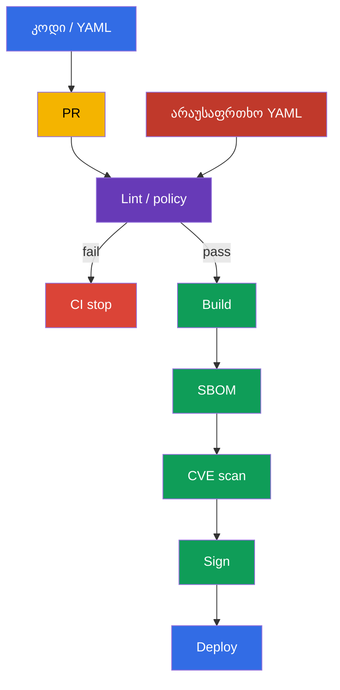
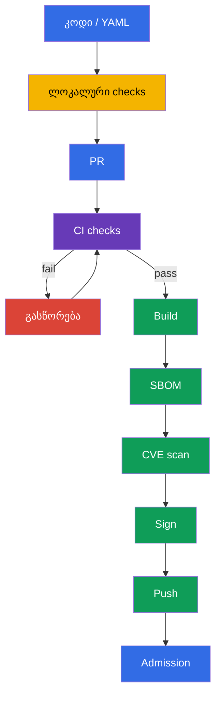

[Русская версия](ru.md) · [Eng version](README.md) · [Versión en español](es.md) · [Version française](fr.md) · [Deutsche Version](de.md) · [繁體中文版](tw.md) · [日本語版](jp.md)

# თავი 27. Workload-ებისა და image-ების სტატიკური ანალიზი

> **პრობლემა.** სინტაქსურად სწორ manifest-ს შესაძლოა შეუმჩნევლად ჰქონდეს
> `privileged: true`, root-პროცესი, writable root filesystem ან image `:latest`
> tag-ით, ხოლო Dockerfile-ს - არაუსაფრთხო build-პატერნი. merge-ის შემდეგ ეს რისკი
> უკვე ხვდება CI-სა და კლასტერში, სადაც მისი გამოსწორება rollout-ს ან incident
> response-ს მოითხოვს. საჭიროა საწყისი Dockerfile-ისა და manifest-ების შემოწმება
> build-ის, push-ისა და deploy-ის დაწყებამდე.

> **რა არის შემდეგ.** [26-ე თავში](../26/ge.md) ვისწავლეთ trusted registry-ის
> დაშვება და artifact-ის ხელმოწერის შემოწმება admission-ის დროს. მაგრამ
> ხელმოწერა ადასტურებს წარმომავლობას, არა არაუსაფრთხო კონფიგურაციის არარსებობას:
> ხელმოწერილ Deployment-ს მაინც შესაძლოა ჰქონდეს root-პროცესი, writable root
> filesystem ან image `latest` tag-ით. სტატიკური ანალიზი ამოწმებს Dockerfile-სა
> და Kubernetes manifest-ებს push-ისა და deploy-ის დაწყებამდე. ეს არის CKS-ის
> **Supply Chain Security**-ის დომენი (20%): სწრაფი feedback ლოკალურ
> development-ში და სავალდებულო gate CI-ში.

> **რა უნდა ვიცოდეთ CKA-დან.** `securityContext`-ის ველები, რომლებსაც linter-ები
> აღმოაჩენენ - `runAsNonRoot`, `allowPrivilegeEscalation`, `readOnlyRootFilesystem`,
> capabilities და `privileged` - განხილულია [CKA-ს 20-ე თავში](../../../cka/course/20/ge.md).
> აქ არ ვიმეორებთ მათ სინტაქსს, არამედ ვაწყობთ ავტომატურ შემოწმებებს, რომლებიც
> არ დაუშვებენ არაუსაფრთხო პარამეტრის Git-ში გამოტოვებას.

> 🧠 Shift-left ანალიზი არაუსაფრთხო კონფიგურაციის ძებნას pull request-ში
> გადმოიტანს: source-ის გამოსწორება build-ისა და deploy-ის დაწყებამდე
> უფრო იაფია, ვიდრე რეაგირება მოქმედი workload-ის რისკზე.

## 27.1. საფრთხის მოდელი: არაუსაფრთხო კონფიგურაცია კოდთან ერთად ხვდება კლასტერში

Kubernetes API იღებს სინტაქსურად ვალიდურ manifest-ს, თუნდაც ის
secure-by-default პრაქტიკას ეწინააღმდეგებოდეს. კონტეინერი UID 0-ით,
`privileged: true`, writable root filesystem ან image `:latest`-ით
review-ში ჩვეულებრივ ცვლილებას შესაძლოა დაემსგავსოს. თუ პრობლემა
მხოლოდ deploy-ის შემდეგ აღმოჩნდება, ის უკვე ხელმისაწვდომია
თავდამსხმელისთვის და მოითხოვს incident response-ს, ნაცვლად
pull request-ში ჩალიცხი, დაბალფასიანი გასწორებისა.

სტატიკური ანალიზი კითხულობს საწყის ფაილებს workload-ის გაშვების გარეშე. ის
არ ჩაანაცვლებს admission policy-ს, signature verification-ს, vulnerability
scanning-ს ან runtime detection-ს: ინსტრუმენტები სხვადასხვა კითხვას პასუხობენ.



ტიპური სცენარი: დეველოპერი ამატებს `Deployment`-ს API-სთვის. ის უთითებს
`image: api:latest`, არ განსაზღვრავს `securityContext`-ს, ხოლო აპლიკაციას
დროებით სჭირდება `/tmp` კატალოგი. შემოწმების გარეშე workload წარმატებით
გამოყენდება და გაეშვება image-ით, რომელიც იმავე tag-ის ქვეშ იცვლება, root-ისგან
და writable filesystem-ით. `kube-linter`-ის, `kubesec`-ისა და საკუთარი
policy-ის დახმარებით CI merge-ის დაწყებამდე კონკრეტულ დარღვევებს
გამოაჩენს. გასწორება ხდება ცვლილების ნაწილი: ფიქსირებული tag ან digest,
non-root user, capabilities-ის drop და ცალკე `emptyDir` ჩასაწერად.

| Control | კითხვა | რას არ ამტკიცებს |
|---|---|---|
| `kubesec` | რამდენად უსაფრთხოა manifest ცნობილი control-ების ნაკრების მიხედვით? | rule ორგანიზაციის კონკრეტულ policy-ს ემთხვევა თუ არა |
| `kube-linter` | დაცულია თუ არა Kubernetes best practices? | image-ს CVE არ აქვს თუ არა |
| `hadolint` | უსაფრთხოა და reproducible-ია თუ არა Dockerfile? | final image runtime policy-ს ემთხვევა თუ არა |
| `conftest` + OPA | სრულდება თუ არა ლოკალური policy-as-code? | policy admission-თან უკვე დაკავშირებულია თუ არა |
| Trivy, ხელმოწერა, admission | არსებობს CVE, artifact trusted-ია, კლასტერი მას აღიარებს თუ არა? | წყაროების lint-ს არ ჩაანაცვლებენ |

ამ თავში `kubesec` და `kube-linter` პრაქტიკის ინსტრუმენტებია Kubernetes
manifest-ების ანალიზისთვის. `hadolint` და `conftest` ასევე სასარგებლოა
კურსსა და ლაბორატორიულ დავალებებში: პირველი Dockerfile-ს აანალიზებს,
მეორე - ორგანიზაციის ლოკალურ policy-ს ამოწმებს. გამოცდაზე გამოიყენეთ
მხოლოდ ის ინსტრუმენტი და გარემო, რომელიც კონკრეტულ დავალებაშია
მითითებული.

Linter - detector-ია, არა authority. თითოეული rule გასაგები უნდა იყოს: გუნდი
ვალდებულია აღწეროს რისკი, აირჩიოს გასწორება ან დოკუმენტირებულად მიიღოს
დროებითი გამონაკლისი. არ დაფაროთ სისტემური დარღვევა გლობალური
`--ignore`-ით; შემოფარგლეთ გამონაკლისი კონკრეტული rule-ით, ფაილითა და
ვადით, შემდეგ მოაშორეთ ის.

> 🔬 `kubesec` აძლევს security score-ს და control-ებს, მაგრამ არ ჩაანაცვლებს
> თქვენი ორგანიზაციის policy-ს.

## 27.2. `kubesec`: Kubernetes manifest-ის ქულების დარიცხვა

`kubesec` აანალიზებს Kubernetes YAML-ს და ველებს security control-ებთან
ადარებს. ბრძანება გამოაქვს score და passed/failed check-ების სია. ეს
სასარგებლოა როგორც სწრაფი სიგნალი: უარყოფითი finding ხშირად ნიშნავს
`securityContext`-ის არარსებობას ან რისკიან host access-ს. score არ
წარმოადგენს უსაფრთხოების დამტკიცებას და არ უნდა იქცეს ერთადერთ CI
gate-ად: ზოგი ლეგიტიმური workload, მაგალითად CNI DaemonSet, დამტკიცებულად
საჭიროებს გაფართოებულ პრივილეგიებს.

ქვემოთ განზრახ არაუსაფრთხო manifest-ია. ის მხოლოდ finding-ის
საილუსტრაციოდ არსებობს, არ გამოიყენოთ production-ში:

```yaml
# manifests/api.yaml
apiVersion: apps/v1
kind: Deployment
metadata:
  name: api
  namespace: payments
spec:
  replicas: 2
  selector:
    matchLabels:
      app: api
  template:
    metadata:
      labels:
        app: api
    spec:
      containers:
      - name: api
        image: registry.example.com/payments/api:latest
        ports:
        - containerPort: 8080
```

გაუშვით scan ფაილისთვის ან გადმოეცით YAML stdin-ის მეშვეობით. CI-ში
გამოიყენეთ ინსტრუმენტის ფიქსირებული ვერსია დამტკიცებულ builder image-ში ან
ჩამოტვირთული და შემოწმებული binary; არ ენდოთ scanner-ის საკუთარ floating
`latest`-ს.

```bash
kubesec scan manifests/api.yaml

# მოსახერხებელია, როცა YAML-ს ტემპლეიტორი გენერირებს.
kustomize build overlays/prod | kubesec scan /dev/stdin
```

report შეიცავს საერთო score-ს და დეტალურ control-ებს. ამ მაგალითში
მოსალოდნელია finding-ები დაახლოებით ასეთ რეკომენდაციებზე:

| Finding | რატომ არის საშიში | პრაქტიკული გასწორება |
|---|---|---|
| `Run as non-root user` | RCE კონტეინერში UID 0-ს იღებს | image-ში დამატებულია non-root `USER`, Pod-ში - `runAsNonRoot: true` |
| `Read-only root filesystem` | თავდამსხმელს შესწევს ხელი ჩაწეროს ინსტრუმენტები და შეცვალოს runtime-ის ფაილები | დაყენდეს `readOnlyRootFilesystem: true`; writable path გატანილია volume-ში |
| `Drop NET_RAW capability` ან `Drop ALL capabilities` | ზედმეტი capabilities აფართოებს პროცესის შესაძლო ქმედებებს | `drop: ["ALL"]`, დაბრუნდეს მხოლოდ დასაბუთებული capability |
| შემოწმებული control ფიქსირებული rule-ების ნაკრებიდან | რისკი და გასწორება ამ control-ის ტექსტზეა დამოკიდებული | gate-ის წინ გამოაქვთ `kubesec print-rules` ფიქსირებული ვერსიისთვის; mutable tag-ის შემოწმება `kubesec`-ს არ მიენიჭება ამ დადასტურების გარეშე |

ორიენტირდებით control-ების ტექსტზე, არა მხოლოდ ერთ score-ზე. მაგალითად,
score-ს შესაძლოა ამატოს securityContext-ის დამატების შემდეგ, თუმცა manifest
მაინც უცნობ registry-ს დასაშვებად ტოვებს - ეს წესი უკეთ გამოხატულია
`conftest`-სა და admission policy-ში. Helm chart-ის ანალიზისას
დაასკანირეთ rendering, სხვაგვარად linter templates-ს ხედავს, არა
resource-ებს, რომლებსაც `kubectl` გაუშვებს:

```bash
helm template payments-api ./chart --namespace payments \
  --values ./chart/values-production.yaml | kubesec scan /dev/stdin
```

არ გაუგზავნოთ პრივატული manifest-ები საჯარო online scanner-ს. ლოკალური
binary ან დამტკიცებული CI container წყაროებს თქვენს execution
environment-ში ტოვებს.

> 🎯 `kube-linter` - Kubernetes-ორიენტირებული სტატიკური ანალიზი: წაიკითხეთ
> finding, გაასწორეთ manifest და გაიმეორეთ lint სუფთა შედეგამდე.

## 27.3. `kube-linter`: Kubernetes best practices-ის შემოწმება

`kube-linter` ამოწმებს manifest-ებსა და Helm chart-ებს Kubernetes-ორიენტირებული
check-ების ნაკრებით. `kubesec`-ის score-ისგან განსხვავებით, შედეგი ჩვეულებრივ
აკავშირებს კონკრეტულ resource-ს, container-სა და check-ის სახელს. ეს
სასარგებლოა gate-ისთვის: lint აბრუნებს non-zero exit code-ს, თუ errors
ნაპოვნია.

```bash
# კატალოგის შემოწმება plain YAML-ით.
kube-linter lint manifests/

# chart-ისა და ყველა მისი template-ის შემოწმება.
kube-linter lint ./chart

# ხელმისაწვდომი check-ებისა და მათი დანიშნულების ჩვენება.
kube-linter checks list
```

დემონსტრაციული `manifests/api.yaml`-სთვის ტიპურია `run-as-non-root`,
`no-read-only-root-fs` და `latest-tag`. ზუსტი შემადგენლობა `kube-linter`-ის
ვერსიასა და enabled check-ებზეა დამოკიდებული, ამიტომ ვერსია ფიქსირდება
CI-ში, ხოლო მისი output ინახება job-ის artifact-ში. არ ფორმირებდეთ
`image:`-ს ცარიელ ცვლადთან კონკატენაციით: ეს მოსალოდნელ versioned tag-ს
`latest`-ად შესაძლოა გადააქცევდეს.

გასწორებული manifest defense in depth-ს ამატებს. აპლიკაცია თანხმდება UID
`10001`-თან; image-საც უნდა ჰქონდეს non-root `USER`, რადგან manifest არ
გამოასწორებს არაუსაფრთხო image-ს ლოკალურად გაშვების დროს. `emptyDir`
აპლიკაციას ერთადერთ writable ადგილს აძლევს, ხოლო `readOnlyRootFilesystem`
root კატალოგს immutable-ად ტოვებს.

```yaml
# manifests/api.yaml
apiVersion: apps/v1
kind: Deployment
metadata:
  name: api
  namespace: payments
spec:
  replicas: 2
  selector:
    matchLabels:
      app: api
  template:
    metadata:
      labels:
        app: api
    spec:
      securityContext:
        runAsNonRoot: true
        runAsUser: 10001
        runAsGroup: 10001
      containers:
      - name: api
        image: registry.example.com/payments/api:1.4.2@sha256:<შემოწმებული-64-სიმბოლოიანი-digest>
        ports:
        - containerPort: 8080
        securityContext:
          allowPrivilegeEscalation: false
          readOnlyRootFilesystem: true
          capabilities:
            drop: ["ALL"]
        volumeMounts:
        - name: tmp
          mountPath: /tmp
      volumes:
      - name: tmp
        emptyDir: {}
```

ცვლილების შემდეგ გაუშვით lint ხელახლა. სუფთა output მხოლოდ იმას ნიშნავს,
რომ check-ების მიმდინარე ნაკრებმა დარღვევა არ იპოვა; ის არ აუქმებს review-ს
და შემდეგ gate-ებს.

```bash
kube-linter lint manifests/
kubesec scan manifests/api.yaml
kubectl apply --dry-run=server -f manifests/api.yaml
```

`kubectl apply --dry-run=server` ამოწმებს API schema-სა და admission-ს
resource-ის შენახვის გარეშე. ეს lint-ისგან განსხვავებული სიგნალია: schema
შესაძლოა კორექტული იყოს არაუსაფრთხო manifest-ისთვისაც, ხოლო custom policy
შესაძლოა უარყოს manifest, რომელსაც generic linter იტანს.

> 🏭 Version-ირებდეთ check-ების ნაკრებს, შემოფარგლეთ გამონაკლისები
> კონკრეტული scope-ით და არ გამორთოთ security baseline მთელი
> repository-სთვის ერთი legacy-workload-ის გამო.

### Check-ების კონფიგურაცია მთელი pipeline-ის შესუსტების გარეშე

ზოგი check-ს კონფიგურაცია სჭირდება legacy workload-ისთვის. `include`
`doNotAutoAddDefaults: true`-ის გარეშე ამატებს check-ებს default-ნაკრებს,
არა ჩაანაცვლებს მას. თუ ზუსტად თვალსაჩინო security baseline გსჭირდებათ,
გამორთეთ defaults-ის ავტომატური დამატება და ჩამოთვალეთ მთელი ნაკრები. არ
გამორთოთ `run-as-non-root` მთელი repository-სთვის ერთი სისტემური
DaemonSet-ის გამო: გამოყავით system manifest ცალკე ბაზისზე, დაამატეთ
გამონაკლისი policy-ში დასაბუთებით და შემოფარგლეთ წვდომა ამ გამონაკლისის
ცვლილებაზე.

```yaml
# .kube-linter.yaml
checks:
  doNotAutoAddDefaults: true
  include:
  - run-as-non-root
  - no-read-only-root-fs
  - privilege-escalation-container
  - privileged-container
  - drop-net-raw-capability
  - sensitive-host-mounts
  - docker-sock
  - latest-tag
```

შეამოწმეთ check-ების სახელი და ხელმისაწვდომობა ფიქსირებული ვერსიისთვის
`kube-linter checks list`-ის მეშვეობით; არ დააკოპიროთ კონფიგურაცია
ვერსიებს შორის შემოწმების გარეშე. CI ვალდებულია ჩავარდნაზე დაასრულოს
მუშაობა configuration-ის ჩატვირთვის შეუძლებლობისას - default check-ებზე
დუმილში გადასვლა დაცულობის ცრუ შეგრძნებას ქმნის.

> 🔬 `hadolint` სასარგებლოა Dockerfile-სა და image-ის reproducibility-ისთვის,
> მაგრამ არ ჩაანაცვლებს image scan-ს.

## 27.4. `hadolint`: Dockerfile-ის ანალიზი image-ის build-მდე

manifest იცავს გაშვებას, მაგრამ security issue ხშირად Dockerfile-ში
იწყება: mutable base image, `apt-get install` cleanup-ის გარეშე,
`curl | sh`, root final user ან shell form `CMD`. `hadolint` აანალიზებს
Dockerfile-ს და აწვდის rule-ებს `DL####` ფორმატში. ის არ აწყობს image-ს
და არ ასრულებს `RUN`-ს, ამიტომ გაშვება build-ზე უსაფრთხოცაა და სწრაფიცაა,
თუმცა build/test/scan-ს არ ჩაანაცვლებს.

```bash
hadolint Dockerfile

# stdin-ის გამოყენება editor integration-ში ან CI-ში.
hadolint - < Dockerfile
```

Dockerfile-ის მაგალითი გავრცელებული პრობლემებით:

```dockerfile
FROM ubuntu:latest
RUN apt-get update
RUN apt-get install -y curl
COPY . /app
CMD python /app/server.py
```

ტიპური `hadolint` შეტყობინებები და სწორი რეაგირება:

| Rule | სიგნალი | გასწორება |
|---|---|---|
| `DL3002` | ბოლო `USER` - root | final stage-ში მითითეთ non-root `USER`; Pod-level `runAsNonRoot` დარჩება დამოუკიდებელ დაცვად |
| `DL3007` | tag `latest` mutable-ია | მიუთითეთ base image-ის კონკრეტული ვერსია, release-ისთვის ფიქსირდეს digest |
| `DL3008` | პაკეტი ვერსიის გარეშე | ფიქსირდეს ვერსია, სადაც ეს repository-ს და თქვენი განახლების სტრატეგიას ეთანხმება |
| `DL3009` | დარჩენილია `apt`-ის cache | update/install/cleanup გაერთიანდეს ერთ `RUN`-ში ან გამოიყენოთ შესატყვისი minimal base |
| `DL3059` | რამდენიმე თანმიმდევრული `RUN` | ლოგიკურად დაკავშირებული ოპერაციები გაერთიანდეს, კითხვადობის დარღვევის გარეშე |
| `DL3025` | shell form `CMD` | გამოყენდეს JSON/exec form, რომ process-მა signals სწორად მიღოს |

ნომერი `DL####` - კონკრეტული rule-ის მიმართვა, არა universal severity.
წაიკითხეთ ჯერ მისი აღწერა: ზოგი შეტყობინება reproducibility-ს ეხება, ზოგი -
image size-ს ან signal handling-ს. არ გამოიყენოთ inline ignore მხოლოდ
მწვანე CI-ის მისაღებად. თუ გამონაკლისი დასაბუთებულია, დატოვეთ მოკლე
კომენტარი მიზეზით, issue-ითა და გადასინჯვის ვადით.

ქვემოთ მინიმალური pattern Go service-ისთვის. კონკრეტული ვერსიები
საილუსტრაციოა: release pipeline-მა შემოწმებული digest უნდა ჩასვას
შიდა registry-ისა და base image-ების განახლების პროცესის მიხედვით. Final
stage არ შეიცავს package manager-ს, compiler-ს ან shell-ს; image-level
`USER` და Pod-level securityContext ერთმანეთს ავსებენ.

```dockerfile
# syntax=docker/dockerfile:1.7
FROM golang:1.27.1-alpine3.24 AS build
WORKDIR /src
COPY go.mod go.sum ./
RUN go mod download
COPY . ./
RUN CGO_ENABLED=0 GOOS=linux go build -trimpath -ldflags="-s -w" \
    -o /out/api ./cmd/api

FROM scratch
COPY --from=build /out/api /api
USER 10001:10001
ENTRYPOINT ["/api"]
```

`hadolint` ყველაფერს არ ხედავს: ის არ იცის, შეიცავს თუ არა `COPY . .`
secret-ს, ემთხვევა თუ არა binary-ის architecture node-ს ან არსებობს თუ არა
CVE base image-ში. გამოიყენეთ `.dockerignore`, BuildKit secret mounts,
unit tests, SBOM და scanner მეზობელი თავებიდან. Lint ეხმარება structural
შეცდომის უფრო ადრე დანახვაში, მაგრამ არ ჩაანაცვლებს supply-chain
control-ებს.

> 🔬 `conftest` ავრცობს generic lint-ს ლოკალური Rego rule-ებით; შეამოწმეთ და
> version-ირებდეთ თავად policy-ები `opa test`-ის მეშვეობით.

## 27.5. OPA `conftest`: policy-as-code-ის შემოწმება manifest-ებისთვის

Generic linter-ები ზოგად best practices-ს იცნობენ. ორგანიზაციები
ჩვეულებრივ ამატებენ rule-ებს, რომლებიც მათ threat model-ზეა
დამოკიდებული: დაშვებულია მხოლოდ internal registries, production
namespace-ს limits სჭირდება, ყველა workload-ს owner label უნდა ჰქონდეს,
გამონაკლისი დასაშვებია მხოლოდ ticket-ითა და expiry-ით. `conftest`
ასრულებს OPA-ს Rego policy-ებს YAML, JSON, HCL და სხვა structured
ფაილებზე და აბრუნებს non-zero exit code-ს, როცა rule `deny`-ს გამოსცემს.

repository-ის სტრუქტურა შესაძლოა ასეთი იყოს:

```text
.
├── Dockerfile
├── manifests/
│   └── api.yaml
└── policy/
    └── main.rego
```

შემდეგი Rego policy განზრახ ადარებს მხოლოდ `Deployment`-ს, მაგრამ
ამოწმებს regular/init container-ებსა და OCI reference-ს image
volume-ებში. ეს არის შემოსაზღვრული სასწავლო არეალი, არა მზა cluster-wide
policy production-ისთვის: production-ში დამატებით ემატება Pod,
StatefulSet, DaemonSet, Job/CronJob და შესატყვისი template path-ები, ან
იმავე intent-ს გამოიყენებენ admission policy-ში. policy-ის ამოცანაა
ცალსახად ჩააფიქსიროს ლოკალური უცვლელი მოთხოვნები: trusted registry
prefix და ვალიდური immutable digest OCI artifact-ის ყოველი გზისთვის,
container-ებისთვის დამატებით - effective non-root, read-only root
filesystem და privilege escalation-ის აკრძალვა. Kubernetes v1.36-ში
[image volume](https://v1-36.docs.kubernetes.io/docs/tasks/configure-pod-container/image-volumes/)
stable-ია და enabled by default; მისი `spec.volumes[].image.reference`
generic container loop-ში არ ხვდება, ამიტომ policy ცალკე ამოწმებს მას.
`object.get` უსაფრთხო default მნიშვნელობას აძლევს არაობლიგატორიულ
ობიექტებს: ამიტომ `securityContext`-ის არარსებობაც violation-ს ქმნის,
ნაცვლად rule-ის undefined-ად ქცევისა.

```rego
# policy/main.rego
package main

import rego.v1

workload if {
  object.get(input, "kind", "") == "Deployment"
}

pod_template := object.get(object.get(input, "spec", {}), "template", {})
pod_spec := object.get(pod_template, "spec", {})
pod_security_context := object.get(pod_spec, "securityContext", {})
containers := object.get(pod_spec, "containers", [])
init_containers := object.get(pod_spec, "initContainers", [])
all_containers := array.concat(containers, init_containers)

# Kubernetes v1.36 image volume OCI artifact-ს აწვდის არა containers[].image-ის
# მეშვეობით, არამედ spec.volumes[].image.reference-ით; მასზეც იმავე registry/digest
# intent-ს ვამატებთ.
image_volumes := [volume |
  volume := object.get(pod_spec, "volumes", [])[_]
  object.get(volume, "image", null) != null
]

violation contains msg if {
  workload
  container := all_containers[_]
  image := object.get(container, "image", "")
  not startswith(image, "registry.example.com/")
  name := object.get(container, "name", "<unnamed>")
  msg := sprintf("container %q uses an unapproved registry: %s", [name, image])
}

# ვმოითხოვთ ფაქტობრივად immutable OCI reference-ს. image-ს tag-ის გარეშე
# Kubernetes :latest-ად აღიქვამს, ხოლო მოკლე/არასწორი digest SHA-256 pin-ს არ
# წარმოადგენს.
violation contains msg if {
  workload
  container := all_containers[_]
  image := object.get(container, "image", "")
  not regex.match(`^.+@sha256:[A-Fa-f0-9]{64}$`, image)
  name := object.get(container, "name", "<unnamed>")
  msg := sprintf("container %q must use an image pinned by a valid SHA-256 digest", [name])
}

violation contains msg if {
  workload
  volume := image_volumes[_]
  reference := object.get(object.get(volume, "image", {}), "reference", "")
  not startswith(reference, "registry.example.com/")
  name := object.get(volume, "name", "<unnamed>")
  msg := sprintf("image volume %q uses an unapproved registry: %s", [name, reference])
}

violation contains msg if {
  workload
  volume := image_volumes[_]
  reference := object.get(object.get(volume, "image", {}), "reference", "")
  not regex.match(`^.+@sha256:[A-Fa-f0-9]{64}$`, reference)
  name := object.get(volume, "name", "<unnamed>")
  msg := sprintf("image volume %q must use an image pinned by a valid SHA-256 digest", [name])
}

# Container-level securityContext-ს პრიორიტეტი აქვს გადამფარავ Pod-level
# ველთან შედარებით.
violation contains msg if {
  workload
  container := all_containers[_]
  container_security_context := object.get(container, "securityContext", {})
  effective_run_as_non_root := object.get(
    container_security_context,
    "runAsNonRoot",
    object.get(pod_security_context, "runAsNonRoot", false)
  )
  effective_run_as_non_root != true
  name := object.get(container, "name", "<unnamed>")
  msg := sprintf("container %q must effectively runAsNonRoot: true", [name])
}

violation contains msg if {
  workload
  container := all_containers[_]
  container_security_context := object.get(container, "securityContext", {})
  object.get(container_security_context, "readOnlyRootFilesystem", false) != true
  name := object.get(container, "name", "<unnamed>")
  msg := sprintf("container %q must set readOnlyRootFilesystem: true", [name])
}

violation contains msg if {
  workload
  container := all_containers[_]
  container_security_context := object.get(container, "securityContext", {})
  object.get(container_security_context, "allowPrivilegeEscalation", true) != false
  name := object.get(container, "name", "<unnamed>")
  msg := sprintf("container %q must set allowPrivilegeEscalation: false", [name])
}

deny contains msg if {
  msg := violation[_]
}
```

შეამოწმეთ policy bad- და good-fixture-ებზე. `conftest test` policy
კატალოგს ავტომატურად კითხულობს, თუ ის `policy/`-ში მდებარეობს; ცხადი
`--policy` CI invocation-ს გასაგებს ხდის.

```bash
# ძველი manifest-ისთვის უნდა დაბეჭდოს deny და დააბრუნოს non-zero exit code.
conftest test --policy policy manifests/api.yaml

# policy-ისა და manifest-ის გასწორების შემდეგ ბრძანებამ 0 უნდა დააბრუნოს.
conftest test --policy policy manifests/
```

policy-საც უნდა ჰქონდეს test suite. სხვაგვარად Rego-ის ცვლილება შემთხვევით
შესაძლოა მოაშოროს კონტროლი, CI კი მწვანე დარჩება. ცალკე `*_test.rego`
ამოწმებს მოსალოდნელ deny/allow შედეგებს კლასტერის გაშვების გარეშე:

```rego
# policy/main_test.rego
package main

import rego.v1

test_denies_missing_security_context if {
  resource := {
    "kind": "Deployment",
    "spec": {"template": {"spec": {
      "containers": [{
        "name": "api",
        "image": "registry.example.com/payments/api:1.4.2",
      }],
    }}},
  }
  result := violation with input as resource
  "container \"api\" must effectively runAsNonRoot: true" in result
  "container \"api\" must set readOnlyRootFilesystem: true" in result
  "container \"api\" must set allowPrivilegeEscalation: false" in result
}

test_denies_dangerous_variants if {
  resource := {
    "kind": "Deployment",
    "spec": {"template": {"spec": {
      "securityContext": {"runAsNonRoot": false},
      "containers": [{
        "name": "api",
        "image": "docker.io/library/api:latest",
        "securityContext": {
          "readOnlyRootFilesystem": false,
          "allowPrivilegeEscalation": true,
        },
      }],
    }}},
  }
  result := violation with input as resource
  "container \"api\" uses an unapproved registry: docker.io/library/api:latest" in result
  "container \"api\" must use an image pinned by a valid SHA-256 digest" in result
  "container \"api\" must effectively runAsNonRoot: true" in result
  "container \"api\" must set readOnlyRootFilesystem: true" in result
  "container \"api\" must set allowPrivilegeEscalation: false" in result
}

test_denies_unapproved_registry_in_init_container if {
  resource := {
    "kind": "Deployment",
    "spec": {"template": {"spec": {
      "securityContext": {"runAsNonRoot": true},
      "initContainers": [{
        "name": "untrusted-init",
        "image": "docker.io/library/init@sha256:0123456789abcdef0123456789abcdef0123456789abcdef0123456789abcdef",
        "securityContext": {"readOnlyRootFilesystem": true, "allowPrivilegeEscalation": false},
      }],
      "containers": [{
        "name": "api",
        "image": "registry.example.com/payments/api@sha256:0123456789abcdef0123456789abcdef0123456789abcdef0123456789abcdef",
        "securityContext": {"readOnlyRootFilesystem": true, "allowPrivilegeEscalation": false},
      }],
    }}},
  }
  result := violation with input as resource
  "container \"untrusted-init\" uses an unapproved registry: docker.io/library/init@sha256:0123456789abcdef0123456789abcdef0123456789abcdef0123456789abcdef" in result
}

test_denies_untagged_image_container_override_and_unsafe_init if {
  resource := {
    "kind": "Deployment",
    "spec": {"template": {"spec": {
      "securityContext": {"runAsNonRoot": true},
      "initContainers": [{
        "name": "init",
        "image": "registry.example.com/payments/init",
        "securityContext": {"readOnlyRootFilesystem": false, "allowPrivilegeEscalation": false},
      }],
      "containers": [{
        "name": "api",
        "image": "registry.example.com/payments/api@sha256:0123456789abcdef0123456789abcdef0123456789abcdef0123456789abcdef",
        "securityContext": {"runAsNonRoot": false, "readOnlyRootFilesystem": true, "allowPrivilegeEscalation": false},
      }],
    }}},
  }
  result := violation with input as resource
  "container \"init\" must use an image pinned by a valid SHA-256 digest" in result
  "container \"api\" must effectively runAsNonRoot: true" in result
  "container \"init\" must set readOnlyRootFilesystem: true" in result
}

test_denies_untrusted_unpinned_image_volume if {
  resource := {
    "kind": "Deployment",
    "spec": {"template": {"spec": {
      "securityContext": {"runAsNonRoot": true},
      "volumes": [{
        "name": "model",
        "image": {"reference": "docker.io/library/model:latest"},
      }],
      "containers": [{
        "name": "api",
        "image": "registry.example.com/payments/api@sha256:0123456789abcdef0123456789abcdef0123456789abcdef0123456789abcdef",
        "securityContext": {"readOnlyRootFilesystem": true, "allowPrivilegeEscalation": false},
      }],
    }}},
  }
  result := violation with input as resource
  "image volume \"model\" uses an unapproved registry: docker.io/library/model:latest" in result
  "image volume \"model\" must use an image pinned by a valid SHA-256 digest" in result
}

test_allows_hardened_workload if {
  resource := {
    "kind": "Deployment",
    "spec": {"template": {"spec": {
      "securityContext": {"runAsNonRoot": true},
      "containers": [{
        "name": "api",
        "image": "registry.example.com/payments/api:1.4.2@sha256:0123456789abcdef0123456789abcdef0123456789abcdef0123456789abcdef",
        "securityContext": {
          "readOnlyRootFilesystem": true,
          "allowPrivilegeEscalation": false,
        },
      }],
    }}},
  }
  result := violation with input as resource
  count(result) == 0
}
```

```bash
opa test policy/ -v
```

production-ში დააკოპირეთ კრიტიკული policy admission controller-ში,
მაგალითად Kyverno-ში, Gatekeeper-ში ან ValidatingAdmissionPolicy-ში,
სადაც ეს გამოსადეგია. `conftest` იცავს გზას Git -> CI; admission იცავს
API-ს ხელით `kubectl apply`-სგან, სხვა pipeline-სგან და მცდარად
დაკონფიგურირებული job-სგან. policy-ებს ერთი წყარო ან test-ები უნდა
ჰქონდეთ, რომლებიც მათი ეკვივალენტური intent-ს ადასტურებენ, სხვაგვარად
ისინი დროთა განმავლობაში ერთმანეთისგან განსხვავდებიან.

> 🏭 სტატიკური ანალიზი მხოლოდ სავალდებულო, reproducible CI gate-ის სახით,
> ფიქსირებული ინსტრუმენტებით, report-ებითა და მართული გამონაკლისებით ხდება
> დაცვად.

## 27.6. CI gate და ციკლი «გასწორება - ხელახალი შემოწმება»

სტატიკური ანალიზი მხოლოდ მაშინაა სასარგებლო, როცა მისი შედეგი delivery-ზე
ახდენს გავლენას. ლოკალური გაშვება სწრაფ feedback-ს აძლევს, მაგრამ
სავალდებულო CI job შემოწმებას ყოველი pull request-ისთვის reproducible-ს
ხდის. pipeline-მა უნდა დააინსტალიროს ან გამოიყენოს pinned release-ები,
შეინახოს report-ები როგორც artifacts და შეაჩეროს build/push error-ის
დროს. არ ჩააქროთ scanner-ისთვის manifest-ები production secrets-ით და არ
დაბეჭდოთ secrets logs-ში.

მინიმალური თანმიმდევრობა:



ამ თავის პრაქტიკისთვის gate-ს შესწევს ხელი გაუშვას `kubesec` და
`kube-linter`; `hadolint` Dockerfile-სთვის და `conftest` unit tests-ით
სასარგებლოა სრული ლოკალური შემოწმებისთვის. ქვემოთ GitHub Actions job-ის
მაგალითი აჩვენებს გაფართოებულ თანმიმდევრობას, არ განსაზღვრავს ერთადერთ CI
provider-ს. გამოცდაზე გამოიყენეთ ის ინსტრუმენტი და გარემო, რომელიც
კონკრეტულ დავალებაშია მითითებული. real pipeline-ში ჩაანაცვლეთ floating
`curl` download-ები შიდა, შემოწმებული tool image-ით ან pinned action/image
digest-ით; გამოიყენეთ lockfile/verified checksums binary-სთვის. დაამატეთ
`helm template` ან `kustomize build` linter-ების წინ, თუ production deploy
template-ებს იყენებს.

```yaml
# .github/workflows/static-analysis.yaml
name: static-analysis
on:
  pull_request:
    paths:
    - 'Dockerfile'
    - 'manifests/**'
    - 'policy/**'

jobs:
  lint:
    runs-on: ubuntu-24.04
    permissions:
      contents: read
    steps:
    - uses: actions/checkout@<შემოწმებული-action-digest>

    - name: Hadolint
      run: hadolint Dockerfile

    - name: Kubernetes best-practice checks
      run: kube-linter lint manifests/

    - name: Kubernetes security score gate
      shell: bash
      run: |
        set -euo pipefail
        kubesec scan manifests/api.yaml --format json \
          | tee kubesec-report.json \
          | jq -e '
              type == "array"
              and length > 0
              and all(.[];
                .valid == true
                and ((.scoring.critical // []) | length == 0)
                and ((.score? | type) == "number")
                and .score > 0
              )
            ' > /dev/null

    - name: Organisation policy
      run: conftest test --policy policy manifests/

    - name: Policy unit tests
      run: opa test policy/ -v

    - name: Save static-analysis report
      uses: actions/upload-artifact@<შემოწმებული-action-digest>
      with:
        name: static-analysis-report
        path: kubesec-report.json
```

შეამოწმეთ exit code და მანქანურად შემოწმებადი შედეგი, არა stdout-ში
ტექსტის არსებობა. `tee` მხოლოდ JSON-ს ინახავს, ხოლო `pipefail` მხოლოდ
თავად scanner-ის ჩავარდნის დამალვას ხელს უშლის: ისინი ერთად security
gate-ს არ ქმნიან. `kubesec`-ის default JSON - შედეგების მასივია; საერთო
score აჯამებს პოზიტიურ და ნეგატიურ point-ებს, ხოლო `scoring.critical` -
ცალკე critical finding-ების სია. ამიტომ `jq -e` ვალდებულია ამოწმოს
თითოეული ელემენტი: schema-ის ვალიდურობა, critical finding-ების
არარსებობა და versioned numeric score threshold. ქვემოთ მოცემულ
მაგალითში ნებისმიერი ცარიელი მასივი, invalid შედეგი, critical finding,
არა-რიცხვითი score ან score `<= 0` ბრძანებას non-zero-ით ასრულებს. თუ
კონკრეტული critical rule შეგნებულად დასაშვებია, ჩამოაყალიბეთ ვიწრო
versioned exception owner-ითა და expiry-ით, ნაცვლად საერთო score-ით მისი
კომპენსირებისა.

```bash
set -euo pipefail
kubesec scan manifests/api.yaml --format json \
  | tee kubesec-report.json \
  | jq -e '
      type == "array"
      and length > 0
      and all(.[];
        .valid == true
        and ((.scoring.critical // []) | length == 0)
        and ((.score? | type) == "number")
        and .score > 0
      )
    ' > /dev/null
```

> 🎯 უნივერსალური ჩვევა: მოძებნეთ finding, გაასწორეთ საწყისი Dockerfile ან
> manifest და გაიმეორეთ scan წარმატებულ exit code-მდე; არ დაფაროთ
> პრობლემა გლობალური ignore-ით.

### პრაქტიკული გასწორების ციკლი

1. შექმენით ან აიღეთ manifest `:latest`-ით, `runAsNonRoot`,
   `readOnlyRootFilesystem` და `allowPrivilegeEscalation`-ის გარეშე.
2. გაუშვით `kubesec scan`, `kube-linter lint` და `conftest test`. შეინახეთ
   საწყისი output: ის ხსნის, რატომ უნდა შეჩერდეს CI.
3. გაასწორეთ source, არა output: versioned tag/digest, image-level
   non-root user, Pod `securityContext`, `drop: ["ALL"]` და `emptyDir`
   ჭეშმარიტად writable კატალოგისთვის.
4. გაუშვით ყველა შემოწმება ხელახლა, `hadolint Dockerfile`-ისა და
   `opa test policy/`-ის ჩათვლით. დარწმუნდით, რომ ბრძანებები `0`-ს
   აბრუნებენ.
5. შემოწმდეს API compatibility workload-ის შექმნის გარეშე: `kubectl apply
   --dry-run=server -f manifests/`. თუ production rendered chart-ს
   იყენებს, შემოწმდეს ზუსტად rendered YAML.
6. მხოლოდ მწვანე static-analysis gate-ის შემდეგ გაუშვათ build, SBOM,
   image scan, signing და deployment gate-ები. არ გადაყვანოთ CI
   «warning only» რეჟიმში, სანამ გუნდი არ გადაწყვეტს, რა risk acceptance
   დასაშვებია.

ქვემოთ კომპაქტური ლოკალური script, რომელიც იმავე gate-ს ასრულებს. ის
განზრახ ჩერდება პირველ შეცდომაზე; დეველოპერმა უნდა გაასწოროს finding და
script ხელახლა გაუშვას.

```bash
#!/usr/bin/env bash
# scripts/static-analysis.sh
set -euo pipefail

hadolint Dockerfile
kube-linter lint manifests/
kubesec scan manifests/api.yaml --format json \
  | tee kubesec-report.json \
  | jq -e '
      type == "array"
      and length > 0
      and all(.[];
        .valid == true
        and ((.scoring.critical // []) | length == 0)
        and ((.score? | type) == "number")
        and .score > 0
      )
    ' > /dev/null
conftest test --policy policy manifests/
opa test policy/ -v
kubectl apply --dry-run=server -f manifests/
```

ტიპური შეცდომები და დიაგნოსტიკა:

| სიმპტომი | მიზეზი | რა უნდა გაკეთდეს |
|---|---|---|
| `kube-linter` მაინც აწვდის `run-as-non-root` | ველი დამატებული არაა `spec.template.spec`-ში, ან კონკრეტული container override-მა პარამეტრი გააუარესა | rendered resource შემოწმდეს `kubectl kustomize`/`helm template`-ით და გზით `spec.template.spec.securityContext` |
| აპლიკაცია ეშვება ჩავარდნას `readOnlyRootFilesystem: true`-ის შემდეგ | process cache, PID ან temp-ფაილს root filesystem-ში წერს | გზა განისაზღვროს logs-ის მიხედვით, ზუსტად იმ ადგილას მიმონტაჟდეს ვიწრო `emptyDir`; read-only root მთლიანად არ გამოირთოს |
| `hadolint` გაივლის, მაგრამ image root-ისგან ეშვება | Dockerfile-ს `USER` არ აქვს, ხოლო manifest მხოლოდ cluster runtime-ს ამოწმებს | non-root `USER` დაემატოს final stage-ს, manifest guard-ი შენარჩუნდეს |
| `conftest` rule-ს ვერ პოულობს | template გადმოეცა rendered YAML-ის ნაცვლად, ან `--policy` გზა არასწორია | input fixture-ით შემოწმდეს, გაუშვათ `opa test`, შემდეგ ზუსტად rendered output-ის lint |
| CI მწვანეა `kubesec ... | tee`-ის შემდეგ | `tee`-მ JSON შეინახა, მაგრამ security შედეგი არ შემოწმდა | ჩაირთოს `set -o pipefail` და `jq -e`: მთელი JSON-მასივისთვის შემოწმდეს `.valid == true`, ცარიელი `scoring.critical` და versioned score threshold |
| კრიტიკული system-workload-ს გამონაკლისი სჭირდება | rule ერთნაირად გამოეყენა აპლიკაციასა და CNI/CSI-ს | ცალკე scope, least-privilege გამონაკლისი owner-ით, ticket-ითა და expiry-ით; არა გლობალური ignore |

> 🏭 დააასკანირეთ საბოლოო rendered YAML, შეინახეთ შედეგები და scanner-ების
> ვერსიები, critical rule-ები შეათანხმეთ admission policy-სთან, რომ CI-ის
> გავლა გამოირიცხოს.

## 27.7. როგორ გამოიყენება ეს production-ში

- **Lint მუშაობს build-ის დაწყებამდე.** დეველოპერი feedback-ს იღებს
  pre-commit/editor-ში ან ცალკე CI job-ში build-ის, push-ისა და
  integration environment-ის ხარჯებამდე. PR-ის merge არ ხდება, სანამ
  სავალდებულო finding-ები არ გასწორდება ან ვიწრო გამონაკლისი არ
  დამტკიცდება.
- **ინსტრუმენტები და rule-ები ფიქსირებულია.** `kube-linter`-ის,
  `kubesec`-ის, `hadolint`-ის, `conftest`-ისა და OPA-ის ვერსიები
  ფიქსირდება trusted CI image-ში ან lockfile-ში. rule-ების განახლება
  review-ს გადის: ახალი ვერსია შესაძლოა ლეგიტიმური finding-ები დაამატოს,
  მაგრამ gate-ს შეუმჩნევლად არ უნდა შესუსტოს.
- **შემოწმდება საბოლოო YAML.** Helm/Kustomize/GitOps შესწევს ხელი
  შეცვალოს values, image და securityContext. CI იმ rendered artifact-ს
  ასკანირებს, რომელსაც ხელს მოაწერენ/გამოიყენებენ, არა მხოლოდ template
  source-ს.
- **Policy-as-code აპლიკაციასა და platform policy-სთან ერთად ცხოვრობს.**
  გუნდის rule-ები `opa test`-ით ტესტირდება; სავალდებულო cluster-wide
  control-ები ორმაგდება ან admission-ში ცენტრალიზდება. გამონაკლისს
  ჰყავს owner, მიზეზი და ვადის გასვლის თარიღი.
- **სტატიკური ანალიზი ჯაჭვის ნაწილია.** მის შემდეგ მოდის SBOM,
  vulnerability scan, ხელმოწერა და registry promotion; გაშვების წინ
  ქმედებს admission. Runtime control-ები აღმოაჩენს იმას, რაც წყაროებით
  არ ჩანს.
- **report-ები audit-ისთვის გამოსადეგია.** CI ინახავს scanner-ის
  ვერსიას, შედეგებსა და commit-ის მიმართვას. report-ები არ უნდა
  შეიცავდეს credentials-ს, private key-ებს ან production Secret-ის
  მონაცემებს.

## 27.8. მინი-გლოსარიუმი

- **Static analysis** - საწყისი Dockerfile-ის, manifest-ებისა და
  policy-ის შემოწმება workload-ის გაშვების გარეშე.
- **`kubesec`** - Kubernetes manifest-ების scanner, რომელიც security
  score-სა და control-ებს გამოაქვს.
- **`kube-linter`** - Kubernetes YAML-ისა და Helm chart-ების linter
  best-practice check-ების ნაკრებით.
- **`hadolint`** - Dockerfile-ის linter; rule-ები `DL####` კოდებით
  აღინიშნება.
- **OPA (Open Policy Agent)** - policy engine, რომელიც დეკლარატიულ Rego
  rule-ებს ასრულებს.
- **`conftest`** - CLI structured configuration-ის შემოწმებისთვის
  OPA/Rego rule-ებით.
- **Rego** - OPA-ის policy-ების აღწერის ენა.
- **CI gate** - სავალდებულო შემოწმება, რომელი pipeline-ის შემდეგ
  ეტაპს ბლოკავს non-zero exit code-ის დროს.
- **Rendered manifest** - საბოლოო YAML `helm template`-ის ან
  `kustomize build`-ის შემდეგ.
- **False positive** - finding, რომელი კონკრეტული resource-ისთვის
  არ გამოდგება; მოითხოვს ვიწრო დოკუმენტირებულ exception-ს, არა
  კონტროლის გლობალურ გამორთვას.

## 27.9. თავის შედეგები

- Kubernetes manifest შესაძლოა API-სთვის ვალიდური, თუმცა არაუსაფრთხო
  იყოს; static analysis ასეთ შეცდომებს deploy-ის დაწყებამდე პოულობს და
  security practice-ს repeatable CI gate-ად აქცევს.
- კურსის პრაქტიკაში `kubesec` score-სა და security control-ებს
  აჩვენებს, ხოლო `kube-linter` Kubernetes best practices-ს ამოწმებს,
  non-root-ის, read-only root filesystem-ისა და mutable tag-ების
  ჩათვლით. `kubesec`-ის gate JSON-მასივს არჩევს და თითოეული შედეგისთვის
  ამოწმებს ვალიდურობას, `scoring.critical`-ის არარსებობასა და versioned
  score threshold-ს.
- `hadolint` Dockerfile-ის structural პრობლემებს აღმოაჩენს `DL####`
  rule-ებით, `DL3002`-ის ჩათვლით root final user-ისთვის, მაგრამ არ
  ჩაანაცვლებს image build-ს, secret handling-სა და CVE scan-ს.
- `conftest` ასრულებს versioned Rego policy-ს კონკრეტული
  ორგანიზაციის მოთხოვნებისთვის; policy-ს თავად უნდა ჰქონდეს test-ები
  `opa test`-ის მეშვეობით, ველების არარსებობისა და საშიში
  მნიშვნელობებისთვისაც. Kubernetes v1.36-ში policy ცალკე უნდა
  ფარავდეს image volume-ების OCI reference-ებს, რომლებიც container
  image-ები არ არიან.
- გასწორება ნიშნავს Dockerfile/manifest/policy-ის ცვლილებას, რის
  შემდეგაც ყველა linter-ი და server dry-run ხელახლა `0`-ს აბრუნებს.
- Lint არ ჩაანაცვლებს SBOM-ს, vulnerability scan-ს, signing-ს ან
  admission-ს: ეს supply-chain დაცვის თანმიმდევრული ფენებია.

## 27.10. როგორ გამოგადგებათ ეს: გამოცდაზე და რეალურ სამუშაოში

**გამოცდაზე.** პრაქტიკა `kubesec`-ით, `kube-linter`-ით, `hadolint`-ითა
და `conftest`-ით ეხმარება finding-ის წაკითხვასა და `securityContext`-ის,
image reference-ის, Dockerfile-ის ან ლოკალური policy-ის გასწორებაში. ეს
ინსტრუმენტები არ უნდა ჩავთვალოთ გამოცდის სავალდებულო ნაწილად ან
წინასწარ ხელმისაწვდომად მის გარემოში: გამოიყენეთ მხოლოდ ის ინსტრუმენტი
და გარემო, რომელიც კონკრეტულ დავალებაშია მითითებული. საჭიროა
დაიმახსოვროთ კავშირი SecurityContext-თან: `runAsNonRoot`,
`allowPrivilegeEscalation: false`, `readOnlyRootFilesystem: true`,
`capabilities.drop: ["ALL"]` - ტიპური baseline, რომელსაც ანალიზის
საშუალებები ამოწმებენ. CI-სთვის მნიშვნელოვანია გვესმოდეს, რომ failure-მა
უნდა დაბლოკოს artifact-ის წინსვლა, ხოლო გასწორების შემდეგ შემოწმება
ხელახლა უნდა გაეშვას.

**რეალურ სამუშაოში.** სტატიკური ანალიზი უსაფრთხო კონფიგურაციას კოდის
ჩვეულ ხარისხად აქცევს: finding ჩანს PR-ის ავტორისთვის, არა
security-გუნდისთვის production deploy-ის შემდეგ. generic linter-ების,
ტესტირებული Rego policy-ის, rendered-manifest check-ებისა და
სავალდებულო CI gate-ის კომბინაცია ამცირებს root workload-ების, mutable
image-ებისა და დაუშვებელი registries-ის ალბათობას. ამის შემდეგ pipeline
artifact-ის bytes-ს კვლავ ამოწმებს: SBOM, CVE scan, ხელმოწერა და
admission იმ რისკებს იცავს, რომლებსაც lint არ ხედავს.

## 27.11. კითხვები თვითშემოწმებისთვის

<details>
<summary>1. რატომ შესწევს ხელი წარმატებით გამოყენებულ Kubernetes YAML-ს მაინც არაუსაფრთხო იყოს?</summary>

API ამოწმებს სინტაქსსა და schema-ს, მაგრამ root-პროცესს, writable root
filesystem-ს, `privileged: true`-ს ან `:latest`-ს შეცდომად არ ითვლის.
ასეთ manifest-ს წარმატებით შესწევს ხელი workload შექმნას, თუნდაც ის
secure-by-default პრაქტიკას ეწინააღმდეგებოდეს. Static analysis ამ
რისკებს merge-სა და deploy-ის დაწყებამდე პოულობს, admission-ი და
runtime control-ები მას მოგვიანებით ავსებენ.
</details>

<details>
<summary>2. რით განსხვავდება `kubesec`-ის score თქვენი ორგანიზაციის სავალდებულო policy-სგან?</summary>

`kubesec` ცნობილი control-ების მიხედვით score-სა და finding-ს გამოაქვს,
ესე იგი სწრაფი საერთო სიგნალი, არა authority კონკრეტული ორგანიზაციისთვის.
ორგანიზაციულ policy-ს შესწევს ხელი, მაგალითად, მოითხოვდეს internal
registry, valid digest ან owner label, რასაც generic score არ ამტკიცებს.
ასეთი invariant-ები ფორმალდება versioned Rego-ში `conftest`-ის
მეშვეობით და საჭიროებისამებრ ორმაგდება admission-ში.
</details>

<details>
<summary>3. რომელ ტიპურ finding-ს აჩვენებს `kube-linter` ჩვეულებრივი application container-ისთვის?</summary>

hardening-ის გარეშე მაგალითისთვის ტიპურია check-ები `run-as-non-root`,
`no-read-only-root-fs` და `latest-tag`. ასევე სასარგებლოა check-ები
`allowPrivilegeEscalation`-ისთვის, `privileged`-ისთვის, capabilities-ისთვის,
sensitive host mounts-ისთვის და docker socket-ისთვის. ზუსტი ნაკრები
ფიქსირებულ ვერსიასა და enabled check-ებზეა დამოკიდებული, ამიტომ ის
`kube-linter checks list`-ის მეშვეობით შემოწმდება.
</details>

<details>
<summary>4. რატომ არ ჩაანაცვლებს `hadolint` vulnerability scanner-ს და რატომ უნდა წავიკითხოთ კონკრეტული `DL####`?</summary>

Hadolint აანალიზებს Dockerfile-ს, მაგრამ არ აწყობს image-ს, არ ასრულებს
`RUN`-ს და packages-ს CVE-ის ბაზასთან არ ადარებს. scanner საჭიროა final
image-ისა და მისი დამოკიდებულებებისთვის, ხოლო hadolint structural
issues-ს იჭერს, როგორიცაა root final user, mutable base tag ან shell-form
`CMD`. კოდი `DL####` წასაკითხია, რადგან მისი მნიშვნელობა შესწევს ხელი
ეხებოდეს უსაფრთხოებას, reproducibility-ს, image size-ს ან signals-ის
დამუშავებას.
</details>

<details>
<summary>5. როგორ ეხმარებიან `conftest` და Rego trusted registry-ის ან სავალდებულო `securityContext`-ის შემოწმებაში?</summary>

`conftest test` YAML-ს Rego policy-ში გადმოსცემს და non-zero-ს აბრუნებს,
როცა rule `deny`-ს ქმნის. მაგალითის policy ამოწმებს prefix-ს
`registry.example.com/` და SHA-256 digest-ს regular/init container-ებსა
და image volume-ებში, ასევე effective `runAsNonRoot`-ს,
`readOnlyRootFilesystem`-ს, `allowPrivilegeEscalation`-ს
container-ებში. `opa test`-ის test-ები policy-ს თავად ცილობრივი
შესუსტებისგან იცავს.
</details>

<details>
<summary>6. რატომ უნდა დააასკანიროს CI-მ rendered Helm/Kustomize output, არა მხოლოდ template-ები?</summary>

Template-ები ჯერ არ არიან ის resource, რომელიც API-ს გაეგზავნება: values,
Kustomize და GitOps შესწევს ხელი შეცვალოს image ან `securityContext`.
Linter-სა და policy-ს საბოლოო rendered manifest უნდა ხედავდეს. სხვაგვარად
CI შესწევს ხელი template-ისთვის მწვანე იყოს, ხოლო deploy-ს სხვა
არაუსაფრთხო კონფიგურაცია ექნება.
</details>

<details>
<summary>7. რა უნდა გაკეთდეს finding-ის შემდეგ: rule-ის გამორთვა, source-ის გასწორება თუ ვიწრო გამონაკლისის მიღება?</summary>

ჩვეულებრივი გზა - საწყისი Dockerfile-ის, manifest-ის ან policy-ის
გასწორება და შემოწმებების გამეორება. გლობალური `--ignore` სისტემურ
დარღვევას მალავს; ლეგიტიმური exception შემოიფარგლება კონკრეტული
rule-ითა და scope-ით, დოკუმენტირდება მიზეზით, owner-ითა და გადასინჯვის
ვადით. გასწორების შემდეგ lint, `conftest`, policy tests და server
dry-run ხელახლა უნდა გავლენ.
</details>

<details>
<summary>8. რატომ არის `set -o pipefail` მნიშვნელოვანი scanner-ის ბრძანებისთვის, რომლის output `tee`-ში გადმოიცემა?</summary>

`pipefail`-ის გარეშე shell-ს შესწევს ხელი დააბრუნოს ბოლო წარმატებული
ბრძანების `tee`-ის exit status, დამალავს რა scanner-ის ჩავარდნას. ის
საწყისი ბრძანების failure-ს მთელი pipeline-ის განმავლობაში ინახავს.
თუმცა `kubesec`-ისთვის ეს არასაკმარისია: JSON ცხადად უნდა შემოწმდეს
`jq -e`-ით მასივის თითოეული ელემენტისთვის - `.valid == true`, ცარიელი
`scoring.critical` და versioned score threshold; ერთი პოზიტიური score
critical finding-ს არ ანაზღაურებს.
</details>

<details>
<summary>9. **Flashback (7-ე თავი).** `kube-bench`/CIS Benchmark (7-ე თავი) და `kubesec`/`kube-linter` (ეს თავი) ორივე სტატიკურად ამოწმებს კონფიგურაციას, მაგრამ სხვადასხვა ეტაპზე: ერთი - უკვე მოქმედ control plane/node-ს, მეორე - manifest-ს deploy-ის დაწყებამდე. თუ ორივე ინსტრუმენტი ტექნიკურად ხელმისაწვდომია, რომელი უფრო ადრე დაიჭერს საშიშ პარამეტრს და რატომ არის უფრო ადრეული აღმოჩენა ჩვეულებრივ იაფი?</summary>

`kubesec` და `kube-linter` manifest-ს build/deploy-ის დაწყებამდე
შემოწმდება, ხოლო `kube-bench` უკვე მოქმედ control plane-ს ან node-ს
ხედავს. ადრეული finding pull request-ში გასწორდება artifact-ის
გამოქვეყნებისა და workload-ის გაშვების დაწყებამდე, incident response-ის,
rollout-ისა და გაჩერების გარეშე. `kube-bench` მაინც საჭიროა როგორც
ფაქტობრივი ინფრასტრუქტურული კონფიგურაციის შემოწმება, რომელსაც manifest
არ ფარავს.
</details>

## პრაქტიკა

ამ თავში ჩვენ გავაჩერეთ არაუსაფრთხო Dockerfile ან manifest build-ისა და
deploy-ის დაწყებამდე. შემდეგ [28-ე თავში](../28/ge.md) შევამოწმებთ უკვე
აწყობილ image-ს CVE-ზე: lint configuration-ზეა, scanner - known
vulnerabilities-ზე bytes-სა და packages-ში. lab 111-ის სრული ჯაჭვი
static analysis-ს, SBOM-ს, image scan-ს და signing-ს ერთიანებს.

🧪 ლაბა 111 (Supply chain: ანალიზი, Trivy, SBOM, signing): [tasks/cks/labs/111](../../labs/111/README_GE.MD)
🌐 დამატებითი ინტერაქტიული პრაქტიკა (killer.sh/killercoda, გარეშე რესურსი): [static-manual-analysis-k8s](https://killercoda.com/killer-shell-cks/scenario/static-manual-analysis-k8s) · [static-manual-analysis-docker](https://killercoda.com/killer-shell-cks/scenario/static-manual-analysis-docker)

📘 CKA-ს ბაზა: [SecurityContext და capabilities](../../../cka/course/20/ge.md)

## საცნობარო მასალები

- [kubesec: Kubernetes-რესურსების უსაფრთხოების ანალიზი](https://kubesec.io/)
- [kube-linter documentation](https://docs.kubelinter.io/)
- [hadolint: Dockerfile linter](https://github.com/hadolint/hadolint)
- [Open Policy Agent: Rego-ის დოკუმენტაცია](https://www.openpolicyagent.org/docs/latest/)

---
[სარჩევი](../README_GE.md) · [თავი 26](../26/ge.md) · [თავი 28](../28/ge.md)
