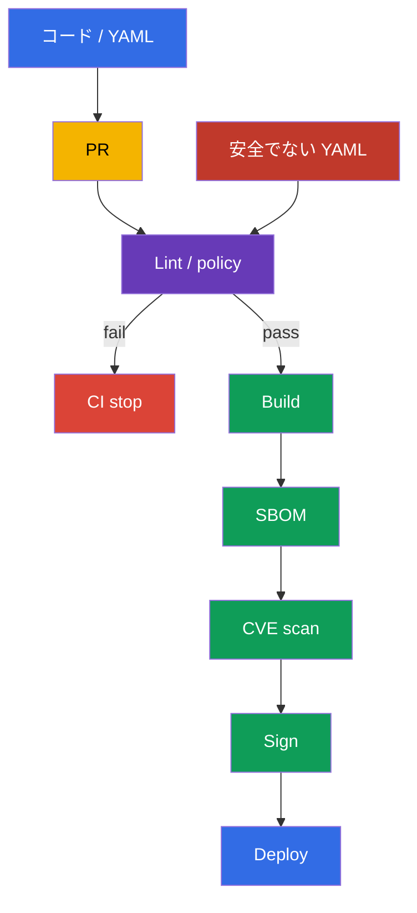
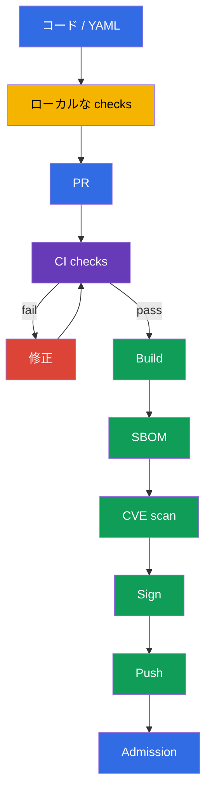

[Русская версия](ru.md) · [Eng version](README.md) · [Versión en español](es.md) · [Version française](fr.md) · [Deutsche Version](de.md) · [ქართული ვერსია](ge.md) · [繁體中文版](tw.md)

# 第27章. workload と image の静的解析

> **課題。** 構文的に正しい manifest が、`privileged: true`、root プロセス、
> writable な root filesystem、`:latest` を持つ image を目立たずに追加できます。
> Dockerfile も安全でない build パターンを持ち得ます。merge 後、そのリスクは
> すでに CI と cluster に入り、修正には rollout または incident response が
> 必要になります。build、push、deploy 前に元の Dockerfile と manifest を確認する
> 必要があります。

> **この後。** [第26章](../26/jp.md)では trusted registry の許可と admission
> での artifact の署名確認を学びました。しかし署名は provenance を証明する
> だけで、安全でない設定がないことは証明しません。署名された Deployment でも
> root プロセス、writable な root filesystem、`latest` tag の image を実行して
> しまうことがあります。静的解析は push と deploy の前に Dockerfile と
> Kubernetes manifest を確認します。これは CKS の **Supply Chain Security**
> domain（20%）です。ローカル開発での高速な feedback と CI での必須の gate です。

> **CKA で必要な知識。** linter が検出する `securityContext` の field、
> `runAsNonRoot`、`allowPrivilegeEscalation`、`readOnlyRootFilesystem`、
> capabilities、`privileged` は [CKA 第20章](../../../cka/course/20/jp.md)で
> 扱います。ここではその syntax を繰り返さず、Git に安全でない設定を通さない
> automated check を構築します。

> 🧠 Shift-left 分析は安全でない設定の検出を pull request に移します。build と deploy 前に source を修正するほうが、動いている workload のリスクに対応するより安価です。

## 27.1. 脅威モデル: 安全でない設定は code と一緒に cluster に入る

Kubernetes API は syntactically valid な manifest を受け入れます。secure-by-
default 実践に反していても関係ありません。UID 0 のコンテナ、`privileged:
true`、writable な root filesystem、`:latest` の image は review では普通の
変更に見えることがあります。問題が deploy 後にしか見つからなければ、すでに
攻撃者がアクセス可能で、pull request での安価な修正の代わりに incident
response が必要になります。

静的解析は workload を実行せずに元の file を読みます。admission policy、
signature verification、vulnerability scanning、runtime detection の代わりには
なりません。これらの tool は異なる question に答えます。



典型的なシナリオ: developer が API 用の `Deployment` を追加します。
`image: api:latest` を指定し、`securityContext` を設定せず、application は
一時的に `/tmp` directory を必要とします。確認がなければ workload は成功して
適用され、同じ tag の背後で変わる image、root、writable filesystem で実行され
ます。`kube-linter`、`kubesec`、独自 policy を使うことで、CI は merge 前に
具体的な違反を示します。修正は変更の一部になります。固定された tag または
digest、non-root user、capabilities の drop、書き込み用の別の `emptyDir` です。

| Control | 質問 | 証明しないこと |
|---|---|---|
| `kubesec` | 既知の control の set に対し manifest はどれくらい安全か? | rule が自分の organization の policy に合っているか |
| `kube-linter` | Kubernetes best practices は守られているか? | image に CVE が含まれていないか |
| `hadolint` | Dockerfile は安全で再現可能か? | final image が runtime policy に合っているか |
| `conftest` + OPA | ローカルな policy-as-code は実行されているか? | policy がすでに admission に接続されているか |
| Trivy、署名、admission | CVE があるか、artifact は trusted か、cluster はそれを許可するか? | source の lint の代わりにはならない |

この章では `kubesec` と `kube-linter` を Kubernetes manifest 分析の実践 tool
として使います。`hadolint` と `conftest` も course と lab task で同様に有用で
す。前者は Dockerfile を分析し、後者は organization のローカル policy を確認
します。試験では特定の task で指定された tool と環境だけを使ってください。

Linter は detector であり authority ではありません。すべての rule は理解可能
である必要があります。team はリスクを説明し、修正を選ぶか、または一時的な
例外を文書化して承認できる必要があります。system 的な違反を全体的な
`--ignore` で隠さないでください。例外は特定の rule、file、期限に限定し、その
後に取り除いてください。

> 🔬 `kubesec` は security score と control を提供しますが、自分の organization の policy を置き換えません。

## 27.2. `kubesec`: Kubernetes manifest のスコアリング

`kubesec` は Kubernetes YAML を分析し、field を security control と対応させ
ます。command は score と passed/failed check のリストを出力します。これは
迅速な signal として有用です。negative な finding は、しばしば
`securityContext` の欠落や risky な host access を意味します。score は安全性
の証明ではなく、単独の CI gate にすべきではありません。CNI DaemonSet のような
一部の legitimate workload は、正当な理由で拡張された権限を必要とします。

以下は意図的に安全でない manifest です。finding を示すためだけのもので、
production では使用しないでください。

```yaml
# manifests/api.yaml
apiVersion: apps/v1
kind: Deployment
metadata:
  name: api
  namespace: payments
spec:
  replicas: 2
  selector:
    matchLabels:
      app: api
  template:
    metadata:
      labels:
        app: api
    spec:
      containers:
      - name: api
        image: registry.example.com/payments/api:latest
        ports:
        - containerPort: 8080
```

file 用に scan を実行するか、stdin 経由で YAML を渡してください。CI では
承認された builder image 内の固定バージョンの tool、または dowload・確認済み
binary を使ってください。scanner 自体の floating な `latest` を信頼しないで
ください。

```bash
kubesec scan manifests/api.yaml

# Handy when YAML is generated by a templating tool.
kustomize build overlays/prod | kubesec scan /dev/stdin
```

report には全体 score と詳細な control が含まれます。この例では以下のような
推奨事項に関する finding を期待します。

| Finding | 危険な理由 | 実際の修正 |
|---|---|---|
| `Run as non-root user` | RCE がコンテナ内で UID 0 を取得する | image に non-root `USER` を追加し、Pod に `runAsNonRoot: true` を設定 |
| `Read-only root filesystem` | 攻撃者が tool を書き込み、runtime file を変更できる | `readOnlyRootFilesystem: true` を設定。writable path は volume に切り出す |
| `Drop NET_RAW capability` または `Drop ALL capabilities` | 余分な capability がプロセスの行動を広げる | `drop: ["ALL"]`。正当化された capability だけを戻す |
| 固定された rule set の確認済み control | risk と修正はこの control の文言に依存する | gate 前に固定バージョンの `kubesec print-rules` を出力する。mutable tag の確認をこの確認なしに `kubesec` に帰属させない |

score だけでなく control の文言に注目してください。例えば securityContext を
追加すると score は上がりますが、manifest はまだ未知の registry を許可して
いる可能性があります。この rule は `conftest` と admission policy で表現する
ほうが良いです。Helm chart を分析する場合は rendering を scan してください。
そうしないと linter は `kubectl` が送る resource ではなく template を見ること
になります。

```bash
helm template payments-api ./chart --namespace payments \
  --values ./chart/values-production.yaml | kubesec scan /dev/stdin
```

プライベートな manifest を公開の online scanner に送らないでください。ローカル
の binary または承認された CI container は source を自分の execution
environment 内に留めます。

> 🎯 `kube-linter` は Kubernetes-oriented な静的解析です。finding を読み、manifest を修正し、結果がクリーンになるまで lint を繰り返してください。

## 27.3. `kube-linter`: Kubernetes best practices の確認

`kube-linter` は manifest と Helm chart を Kubernetes-oriented な check の set
で確認します。`kubesec` の score と異なり、結果は通常、具体的な resource、
container、check name に結びつきます。これは gate に便利です。lint は error が
見つかると non-zero exit code を返します。

```bash
# Check a directory of plain YAML.
kube-linter lint manifests/

# Check a chart and all of its templates.
kube-linter lint ./chart

# Show the available checks and their purpose.
kube-linter checks list
```

上のデモ用 `manifests/api.yaml` では通常 `run-as-non-root`、
`no-read-only-root-fs`、`latest-tag` が典型です。正確な内容は `kube-linter` の
バージョンと有効な check に依存するため、CI ではバージョンを固定し、その出力を
job の artifact として保存してください。空の変数との結合で `image:` を組み立て
ないでください。期待される versioned tag が `latest` に変わってしまうことが
あります。

修正された manifest は defense in depth を追加します。application は UID
`10001` と互換性がある必要があります。image もまた non-root `USER` を持つ必要
があります。manifest はローカル実行時の安全でない image を修正しないから
です。`emptyDir` は application に唯一の書き込み可能な場所を与え、
`readOnlyRootFilesystem` は root を immutable に保ちます。

```yaml
# manifests/api.yaml
apiVersion: apps/v1
kind: Deployment
metadata:
  name: api
  namespace: payments
spec:
  replicas: 2
  selector:
    matchLabels:
      app: api
  template:
    metadata:
      labels:
        app: api
    spec:
      securityContext:
        runAsNonRoot: true
        runAsUser: 10001
        runAsGroup: 10001
      containers:
      - name: api
        image: registry.example.com/payments/api:1.4.2@sha256:<検証済み-64文字-digest>
        ports:
        - containerPort: 8080
        securityContext:
          allowPrivilegeEscalation: false
          readOnlyRootFilesystem: true
          capabilities:
            drop: ["ALL"]
        volumeMounts:
        - name: tmp
          mountPath: /tmp
      volumes:
      - name: tmp
        emptyDir: {}
```

変更後に lint を再度実行してください。クリーンな出力は、現在の check set が
違反を見つけなかったことだけを意味します。review や次の gate を打ち消すもの
ではありません。

```bash
kube-linter lint manifests/
kubesec scan manifests/api.yaml
kubectl apply --dry-run=server -f manifests/api.yaml
```

`kubectl apply --dry-run=server` は resource を保存せずに API schema と
admission を確認します。これは lint とは異なる signal です。schema は安全で
ない manifest でも正しい場合がありますし、custom policy は generic linter が
許容する manifest を拒否することがあります。

> 🏭 check set をバージョン管理し、例外を特定の scope に限定し、一つの legacy workload のために repository 全体の security baseline を無効にしないでください。

### pipeline 全体を弱めずに check を設定する

一部の check は legacy workload のために設定が必要です。`doNotAutoAddDefaults:
true` なしの `include` は、default セットを置き換えず check を追加します。
明確に把握できる security baseline が必要な場合は、defaults の自動追加を無効
にし、set 全体を列挙してください。一つの system DaemonSet のために repository
全体の `run-as-non-root` を無効にしないでください。system manifest を別の
path に分け、根拠を伴う exception を policy に追加し、この exception の変更
アクセスを制限してください。

```yaml
# .kube-linter.yaml
checks:
  doNotAutoAddDefaults: true
  include:
  - run-as-non-root
  - no-read-only-root-fs
  - privilege-escalation-container
  - privileged-container
  - drop-net-raw-capability
  - sensitive-host-mounts
  - docker-sock
  - latest-tag
```

固定バージョンで check の名前と可用性を `kube-linter checks list` で確認して
ください。バージョン間で確認なしに設定を copy しないでください。CI は
configuration を読み込めない場合に error で終了する必要があります。default
check への静かな fallback は誤った安全の感覚を作ります。

> 🔬 `hadolint` は Dockerfile と image の再現性に有用ですが、image scan の代わりにはなりません。

## 27.4. `hadolint`: image ビルド前の Dockerfile 分析

Manifest は実行を保護しますが、security issue はしばしば Dockerfile で始まり
ます。mutable な base image、cleanup のない `apt-get install`、`curl | sh`、
root の final user、shell form の `CMD` です。`hadolint` は Dockerfile を解析
し、`DL####` 形式で rule を報告します。image をビルドせず `RUN` を実行しない
ため、実行は build より安全で高速ですが、build/test/scan の代わりにはなり
ません。

```bash
hadolint Dockerfile

# Use stdin in editor integration or CI.
hadolint - < Dockerfile
```

よくある問題のある Dockerfile の例:

```dockerfile
FROM ubuntu:latest
RUN apt-get update
RUN apt-get install -y curl
COPY . /app
CMD python /app/server.py
```

典型的な `hadolint` メッセージと正しい対応:

| Rule | Signal | 修正 |
|---|---|---|
| `DL3002` | 最後の `USER` が root | final stage で non-root `USER` を指定。Pod-level の `runAsNonRoot` は独立した保護として残る |
| `DL3007` | `latest` tag が mutable | base image の特定バージョンを指定し、release では digest を固定する |
| `DL3008` | version のないパッケージ | repository と自分の update 戦略がサポートする箇所で version を固定する |
| `DL3009` | `apt` の cache が残る | update/install/cleanup を一つの `RUN` に統合するか、適切な minimal base を使う |
| `DL3059` | 連続する複数の `RUN` | 論理的に関連する操作を統合する。可読性を損なわない範囲で |
| `DL3025` | shell form の `CMD` | JSON/exec form を使い、プロセスが signal を正しく受け取れるようにする |

`DL####` の番号は特定の rule への reference であり、統一された severity では
ありません。まずその説明を読んでください。時には reproducibility に影響し、
時には image size や signal handling に影響します。緑の CI を得るためだけに
inline ignore を使わないでください。例外が正当化される場合は、理由、issue、
再検討期限を短いコメントとして残してください。

以下は Go service 向けの最小 pattern です。具体的なバージョンは例示的で、
release pipeline は内部 registry と base image の update process に従って
確認済み digest を差し込む必要があります。final stage には package manager、
compiler、shell が含まれません。image-level の `USER` と Pod-level の
securityContext は互いを補完します。

```dockerfile
# syntax=docker/dockerfile:1.7
FROM golang:1.27.1-alpine3.24 AS build
WORKDIR /src
COPY go.mod go.sum ./
RUN go mod download
COPY . ./
RUN CGO_ENABLED=0 GOOS=linux go build -trimpath -ldflags="-s -w" \
    -o /out/api ./cmd/api

FROM scratch
COPY --from=build /out/api /api
USER 10001:10001
ENTRYPOINT ["/api"]
```

`hadolint` はすべてを見るわけではありません。`COPY . .` に secret が含まれて
いるか、binary が node の architecture に合っているか、base image に CVE が
あるかは分かりません。`.dockerignore`、BuildKit の secret mount、unit test、
SBOM、隣接する章の scanner を使ってください。Lint は structural error を早期
に発見する手助けをしますが、supply-chain control の代わりにはなりません。

> 🔬 `conftest` は generic lint をローカルな Rego rule で拡張します。policy 自体も `opa test` で確認・バージョン管理してください。

## 27.5. OPA `conftest`: manifest の policy-as-code の確認

Generic linter は一般的な best practice を知っています。organization は通常、
自分たちの threat model に依存する rule を追加します。internal registry しか
許可しない、production namespace に limit を要求する、すべての workload が
owner label を持つ必要がある、例外は ticket と期限がある場合だけ許可される、
などです。`conftest` は YAML、JSON、HCL、その他の structured file に対して OPA
の Rego policy を実行し、rule が `deny` を出すと non-zero exit code を返します。

repository 構造は次のようになります。

```text
.
├── Dockerfile
├── manifests/
│   └── api.yaml
└── policy/
    └── main.rego
```

以下の Rego policy は意図的に `Deployment` だけを match しますが、
regular/init container と image volumes の OCI reference を確認します。これは
学習用の限定された scope であり、すぐに使える cluster-wide な policy ではあり
ません。production では Pod、StatefulSet、DaemonSet、Job/CronJob と対応する
template path を別に追加するか、同じ intent を admission policy に適用します。
policy の task は、ローカルの不変な要件を明示的に固定することです。trusted
registry の prefix と、各 OCI artifact への path に対する valid な immutable
digest、そして container については effective な non-root、read-only root
filesystem、privilege escalation の禁止です。Kubernetes v1.36 では
[image volume](https://v1-36.docs.kubernetes.io/docs/tasks/configure-pod-container/image-volumes/)
は stable で default で有効です。その `spec.volumes[].image.reference` は
generic な container loop に含まれないため、policy はそれを別に確認します。
`object.get` は optional な object に安全な default 値を与えます。したがって
`securityContext` の欠落も violation を作り、rule を undefined にしません。

```rego
# policy/main.rego
package main

import rego.v1

workload if {
  object.get(input, "kind", "") == "Deployment"
}

pod_template := object.get(object.get(input, "spec", {}), "template", {})
pod_spec := object.get(pod_template, "spec", {})
pod_security_context := object.get(pod_spec, "securityContext", {})
containers := object.get(pod_spec, "containers", [])
init_containers := object.get(pod_spec, "initContainers", [])
all_containers := array.concat(containers, init_containers)

# In Kubernetes v1.36 an image volume delivers the OCI artifact not via containers[].image,
# but via spec.volumes[].image.reference; we apply the same registry/digest intent to it.
image_volumes := [volume |
  volume := object.get(pod_spec, "volumes", [])[_]
  object.get(volume, "image", null) != null
]

violation contains msg if {
  workload
  container := all_containers[_]
  image := object.get(container, "image", "")
  not startswith(image, "registry.example.com/")
  name := object.get(container, "name", "<unnamed>")
  msg := sprintf("container %q uses an unapproved registry: %s", [name, image])
}

# We require an actually immutable OCI reference. Kubernetes treats an image without a
# tag as :latest, and a short/incorrect digest is not a valid SHA-256 pin.
violation contains msg if {
  workload
  container := all_containers[_]
  image := object.get(container, "image", "")
  not regex.match(`^.+@sha256:[A-Fa-f0-9]{64}$`, image)
  name := object.get(container, "name", "<unnamed>")
  msg := sprintf("container %q must use an image pinned by a valid SHA-256 digest", [name])
}

violation contains msg if {
  workload
  volume := image_volumes[_]
  reference := object.get(object.get(volume, "image", {}), "reference", "")
  not startswith(reference, "registry.example.com/")
  name := object.get(volume, "name", "<unnamed>")
  msg := sprintf("image volume %q uses an unapproved registry: %s", [name, reference])
}

violation contains msg if {
  workload
  volume := image_volumes[_]
  reference := object.get(object.get(volume, "image", {}), "reference", "")
  not regex.match(`^.+@sha256:[A-Fa-f0-9]{64}$`, reference)
  name := object.get(volume, "name", "<unnamed>")
  msg := sprintf("image volume %q must use an image pinned by a valid SHA-256 digest", [name])
}

# Container-level securityContext takes priority over the overlapping Pod-level field.
violation contains msg if {
  workload
  container := all_containers[_]
  container_security_context := object.get(container, "securityContext", {})
  effective_run_as_non_root := object.get(
    container_security_context,
    "runAsNonRoot",
    object.get(pod_security_context, "runAsNonRoot", false)
  )
  effective_run_as_non_root != true
  name := object.get(container, "name", "<unnamed>")
  msg := sprintf("container %q must effectively runAsNonRoot: true", [name])
}

violation contains msg if {
  workload
  container := all_containers[_]
  container_security_context := object.get(container, "securityContext", {})
  object.get(container_security_context, "readOnlyRootFilesystem", false) != true
  name := object.get(container, "name", "<unnamed>")
  msg := sprintf("container %q must set readOnlyRootFilesystem: true", [name])
}

violation contains msg if {
  workload
  container := all_containers[_]
  container_security_context := object.get(container, "securityContext", {})
  object.get(container_security_context, "allowPrivilegeEscalation", true) != false
  name := object.get(container, "name", "<unnamed>")
  msg := sprintf("container %q must set allowPrivilegeEscalation: false", [name])
}

deny contains msg if {
  msg := violation[_]
}
```

bad と good の fixture に対して policy をテストしてください。`conftest test`
は `policy/` にある場合、policy directory を自動的に読み込みます。明示的な
`--policy` は CI invocation を明確にします。

```bash
# Should print deny and return a non-zero exit code for the old manifest.
conftest test --policy policy manifests/api.yaml

# After fixing the policy and manifest, the command should return 0.
conftest test --policy policy manifests/
```

policy にも test suite が必要です。そうでなければ Rego の変更が誤って control
を取り除いても CI は green のままになる可能性があります。別の `*_test.rego`
は cluster を実行せずに expected な deny/allow を確認します。

```rego
# policy/main_test.rego
package main

import rego.v1

test_denies_missing_security_context if {
  resource := {
    "kind": "Deployment",
    "spec": {"template": {"spec": {
      "containers": [{
        "name": "api",
        "image": "registry.example.com/payments/api:1.4.2",
      }],
    }}},
  }
  result := violation with input as resource
  "container \"api\" must effectively runAsNonRoot: true" in result
  "container \"api\" must set readOnlyRootFilesystem: true" in result
  "container \"api\" must set allowPrivilegeEscalation: false" in result
}

test_denies_dangerous_variants if {
  resource := {
    "kind": "Deployment",
    "spec": {"template": {"spec": {
      "securityContext": {"runAsNonRoot": false},
      "containers": [{
        "name": "api",
        "image": "docker.io/library/api:latest",
        "securityContext": {
          "readOnlyRootFilesystem": false,
          "allowPrivilegeEscalation": true,
        },
      }],
    }}},
  }
  result := violation with input as resource
  "container \"api\" uses an unapproved registry: docker.io/library/api:latest" in result
  "container \"api\" must use an image pinned by a valid SHA-256 digest" in result
  "container \"api\" must effectively runAsNonRoot: true" in result
  "container \"api\" must set readOnlyRootFilesystem: true" in result
  "container \"api\" must set allowPrivilegeEscalation: false" in result
}

test_denies_unapproved_registry_in_init_container if {
  resource := {
    "kind": "Deployment",
    "spec": {"template": {"spec": {
      "securityContext": {"runAsNonRoot": true},
      "initContainers": [{
        "name": "untrusted-init",
        "image": "docker.io/library/init@sha256:0123456789abcdef0123456789abcdef0123456789abcdef0123456789abcdef",
        "securityContext": {"readOnlyRootFilesystem": true, "allowPrivilegeEscalation": false},
      }],
      "containers": [{
        "name": "api",
        "image": "registry.example.com/payments/api@sha256:0123456789abcdef0123456789abcdef0123456789abcdef0123456789abcdef",
        "securityContext": {"readOnlyRootFilesystem": true, "allowPrivilegeEscalation": false},
      }],
    }}},
  }
  result := violation with input as resource
  "container \"untrusted-init\" uses an unapproved registry: docker.io/library/init@sha256:0123456789abcdef0123456789abcdef0123456789abcdef0123456789abcdef" in result
}

test_denies_untagged_image_container_override_and_unsafe_init if {
  resource := {
    "kind": "Deployment",
    "spec": {"template": {"spec": {
      "securityContext": {"runAsNonRoot": true},
      "initContainers": [{
        "name": "init",
        "image": "registry.example.com/payments/init",
        "securityContext": {"readOnlyRootFilesystem": false, "allowPrivilegeEscalation": false},
      }],
      "containers": [{
        "name": "api",
        "image": "registry.example.com/payments/api@sha256:0123456789abcdef0123456789abcdef0123456789abcdef0123456789abcdef",
        "securityContext": {"runAsNonRoot": false, "readOnlyRootFilesystem": true, "allowPrivilegeEscalation": false},
      }],
    }}},
  }
  result := violation with input as resource
  "container \"init\" must use an image pinned by a valid SHA-256 digest" in result
  "container \"api\" must effectively runAsNonRoot: true" in result
  "container \"init\" must set readOnlyRootFilesystem: true" in result
}

test_denies_untrusted_unpinned_image_volume if {
  resource := {
    "kind": "Deployment",
    "spec": {"template": {"spec": {
      "securityContext": {"runAsNonRoot": true},
      "volumes": [{
        "name": "model",
        "image": {"reference": "docker.io/library/model:latest"},
      }],
      "containers": [{
        "name": "api",
        "image": "registry.example.com/payments/api@sha256:0123456789abcdef0123456789abcdef0123456789abcdef0123456789abcdef",
        "securityContext": {"readOnlyRootFilesystem": true, "allowPrivilegeEscalation": false},
      }],
    }}},
  }
  result := violation with input as resource
  "image volume \"model\" uses an unapproved registry: docker.io/library/model:latest" in result
  "image volume \"model\" must use an image pinned by a valid SHA-256 digest" in result
}

test_allows_hardened_workload if {
  resource := {
    "kind": "Deployment",
    "spec": {"template": {"spec": {
      "securityContext": {"runAsNonRoot": true},
      "containers": [{
        "name": "api",
        "image": "registry.example.com/payments/api:1.4.2@sha256:0123456789abcdef0123456789abcdef0123456789abcdef0123456789abcdef",
        "securityContext": {
          "readOnlyRootFilesystem": true,
          "allowPrivilegeEscalation": false,
        },
      }],
    }}},
  }
  result := violation with input as resource
  count(result) == 0
}
```

```bash
opa test policy/ -v
```

production では critical な policy を、Kyverno、Gatekeeper、適用可能な
ValidatingAdmissionPolicy のような admission controller に複製してください。
`conftest` は Git → CI の path を保護し、admission は API を手動の
`kubectl apply`、別の pipeline、誤って設定された job から保護します。policy は
一つの source を持つか、その同等な intent を確認する test を持つ必要があり
ます。そうでなければ時間とともに互いに食い違います。

> 🏭 静的解析は、固定された tool、report、管理された例外を伴う必須の再現可能な CI gate としてのみ保護になります。

## 27.6. CI gate と「修正 - 再確認」のサイクル

静的解析は、その結果が delivery に影響を与える場合にのみ有用です。ローカルな
実行は速い feedback を与えますが、必須の CI job が各 pull request に対して
確認を再現可能にします。Pipeline は pinned release をインストールまたは使用
し、report を artifact として保存し、error 時に build/push を停止する必要が
あります。production の secret を含む manifest を scanner に送らず、secret を
log に出力しないでください。

最小限のシーケンス:



この章の実践では gate は `kubesec` と `kube-linter` を実行できます。Dockerfile
用の `hadolint` と unit test を持つ `conftest` は完全なローカル確認のために
追加すると有用です。以下の GitHub Actions job の例は拡張された順序を示すもの
で、一つの CI provider を規定するものではありません。試験では特定の task で
指定された tool と環境を使ってください。real pipeline では floating な
`curl` download を、内部で確認済みの tool image、または pinned action/image
digest に置き換えてください。binary には lockfile/確認済み checksum を使って
ください。production deploy が template を使う場合は、linter の前に
`helm template` または `kustomize build` を追加してください。

```yaml
# .github/workflows/static-analysis.yaml
name: static-analysis
on:
  pull_request:
    paths:
    - 'Dockerfile'
    - 'manifests/**'
    - 'policy/**'

jobs:
  lint:
    runs-on: ubuntu-24.04
    permissions:
      contents: read
    steps:
    - uses: actions/checkout@<検証済み-action-digest>

    - name: Hadolint
      run: hadolint Dockerfile

    - name: Kubernetes best-practice checks
      run: kube-linter lint manifests/

    - name: Kubernetes security score gate
      shell: bash
      run: |
        set -euo pipefail
        kubesec scan manifests/api.yaml --format json \
          | tee kubesec-report.json \
          | jq -e '
              type == "array"
              and length > 0
              and all(.[];
                .valid == true
                and ((.scoring.critical // []) | length == 0)
                and ((.score? | type) == "number")
                and .score > 0
              )
            ' > /dev/null

    - name: Organisation policy
      run: conftest test --policy policy manifests/

    - name: Policy unit tests
      run: opa test policy/ -v

    - name: Save static-analysis report
      uses: actions/upload-artifact@<検証済み-action-digest>
      with:
        name: static-analysis-report
        path: kubesec-report.json
```

exit code と機械的に確認可能な結果を確認してください。stdout のテキストの
有無ではありません。`tee` は JSON を保存するだけで、`pipefail` は scanner
自体の failure を隠さないだけです。これらは security gate にはなりません。
`kubesec` の default JSON は結果の配列です。最終的な score は positive と
negative の点を合計し、`scoring.critical` は別の critical finding の list
です。したがって `jq -e` は各要素を確認する必要があります。schema の有効性、
critical finding の欠如、versioned な numeric score threshold です。以下の
例では、空の配列、invalid な結果、critical finding、非数値の score、または
`<= 0` の score のいずれかが command を non-zero で終了させます。特定の
critical rule が意図的に許容される場合は、owner と期限を持つ narrow で
versioned な exception を作ってください。全体の score でそれを補うのではあり
ません。

```bash
set -euo pipefail
kubesec scan manifests/api.yaml --format json \
  | tee kubesec-report.json \
  | jq -e '
      type == "array"
      and length > 0
      and all(.[];
        .valid == true
        and ((.scoring.critical // []) | length == 0)
        and ((.score? | type) == "number")
        and .score > 0
      )
    ' > /dev/null
```

> 🎯 汎用的な skill: finding を見つけ、元の Dockerfile または manifest を修正し、成功する exit code まで scan を繰り返す。グローバルな ignore で問題を隠さない。

### 実践的な修正サイクル

1. `:latest`、`runAsNonRoot` なし、`readOnlyRootFilesystem` なし、
   `allowPrivilegeEscalation` なしの manifest を作成するか使ってください。
2. `kubesec scan`、`kube-linter lint`、`conftest test` を実行してください。
   元の出力を保存してください。それは CI が停止すべき理由を説明します。
3. output ではなく source を修正してください。versioned tag/digest、
   image-level の non-root user、Pod `securityContext`、`drop: ["ALL"]`、実際の
   writable directory 用の `emptyDir` です。
4. `hadolint Dockerfile` と `opa test policy/` を含め、すべての確認を再度実行
   してください。command が `0` を返すことを確認してください。
5. workload を作成せずに API compatibility を確認してください:
   `kubectl apply --dry-run=server -f manifests/`。production が rendered
   chart を使う場合は、rendered YAML そのものを確認してください。
6. static-analysis gate が green になった後だけ、build、SBOM、image scan、
   signing、deployment gate を実行してください。team がどの risk acceptance
   が許容されるか決めるまで、CI を「warning only」に変えないでください。

以下は同じ gate を行うコンパクトなローカル script です。意図的に最初の error
で終了します。developer は finding を修正し、script を再実行する必要が
あります。

```bash
#!/usr/bin/env bash
# scripts/static-analysis.sh
set -euo pipefail

hadolint Dockerfile
kube-linter lint manifests/
kubesec scan manifests/api.yaml --format json \
  | tee kubesec-report.json \
  | jq -e '
      type == "array"
      and length > 0
      and all(.[];
        .valid == true
        and ((.scoring.critical // []) | length == 0)
        and ((.score? | type) == "number")
        and .score > 0
      )
    ' > /dev/null
conftest test --policy policy manifests/
opa test policy/ -v
kubectl apply --dry-run=server -f manifests/
```

典型的な error と診断:

| 症状 | 原因 | 対応 |
|---|---|---|
| `kube-linter` がまだ `run-as-non-root` を報告する | field が `spec.template.spec` に追加されていない、または特定の container override がその設定を取り消した | `kubectl kustomize`/`helm template` で rendered resource と `spec.template.spec.securityContext` の path を確認する |
| `readOnlyRootFilesystem: true` の後 application が落ちる | process が root filesystem に cache、PID、temp file を書き込んでいる | logs で path を特定し、そこだけに narrow な `emptyDir` をマウントする。read-only root 全体を無効にしない |
| `hadolint` は通るが image が root で実行される | Dockerfile に `USER` がなく、manifest は cluster runtime だけを確認する | final stage に non-root `USER` を追加し、manifest guard を残す |
| `conftest` が rule を見つけない | template が渡された、または `--policy` の path が誤っている | input fixture をテストし、`opa test` を実行し、その後 rendered output を lint する |
| `kubesec ... | tee` の後 CI が green | `tee` は JSON を保存したが security result は確認されていない | `set -o pipefail` と `jq -e` を有効にする。JSON 配列全体に対し `.valid == true`、空の `scoring.critical`、versioned score threshold を確認する |
| critical な system workload が例外を必要とする | rule が application と CNI/CSI に同一に適用されている | 別 scope、owner・ticket・期限を持つ least-privilege exception。グローバルな ignore ではない |

> 🏭 最終的な rendered YAML を lint し、結果と scanner のバージョンを保存し、critical rule は admission policy と一致させ、CI の回避を排除してください。

## 27.7. production での適用方法

- **Lint は build 前に実行される。** developer は build、push、integration
  environment のコストが発生する前に、pre-commit/editor または別の CI job で
  feedback を得ます。必須の finding が修正されるか narrow な例外が承認される
  まで PR は merge できません。
- **tool と rule は固定されている。** `kube-linter`、`kubesec`、`hadolint`、
  `conftest`、OPA のバージョンは trusted CI image または lockfile に固定され
  ます。rule の update は review を通ります。新しいバージョンは legitimate な
  finding を追加できますが、静かに gate を弱めてはいけません。
- **最終的な YAML が確認される。** Helm/Kustomize/GitOps は values、image、
  securityContext を変更できます。CI は署名・適用される rendered artifact を
  lint します。template の source だけではありません。
- **Policy-as-code は application と platform policy の隣に存在する。** team
  の rule は `opa test` でテストされます。必須の cluster-wide control は
  admission に複製または集中化されます。exception は owner、理由、期限を持ち
  ます。
- **静的解析は chain の一部です。** その後 SBOM、vulnerability scan、署名、
  registry promotion が続き、実行前に admission が動作します。Runtime
  control は source からは見えないものを検出します。
- **report は audit に適している。** CI は scanner のバージョン、結果、commit
  への参照を保存します。report は credentials、private key、production の
  Secret data を含んではいけません。

## 27.8. ミニ glossary

- **Static analysis** - workload を実行せずに元の Dockerfile、manifest、policy を確認すること。
- **`kubesec`** - security score と control を出力する Kubernetes manifest の scanner。
- **`kube-linter`** - best-practice check の set を持つ Kubernetes YAML と Helm chart の linter。
- **`hadolint`** - Dockerfile の linter。rule は `DL####` コードで示される。
- **OPA (Open Policy Agent)** - 宣言的な Rego rule を実行する policy engine。
- **`conftest`** - OPA/Rego の rule で structured configuration を確認する CLI。
- **Rego** - OPA の policy 記述言語。
- **CI gate** - non-zero exit code の場合に pipeline の次の段階をブロックする必須の確認。
- **Rendered manifest** - `helm template` または `kustomize build` 後の最終的な YAML。
- **False positive** - 特定の resource に当てはまらない finding。グローバルな control 無効化ではなく、narrow で文書化された exception が必要。

## 27.9. 章のまとめ

- Kubernetes manifest は API に対して valid でありながら安全でないことがあり
  ます。静的解析は deploy 前にそのような error を見つけ、security practice を
  再現可能な CI gate に変えます。
- course の実践では `kubesec` が score と security control を示し、
  `kube-linter` が non-root、read-only root filesystem、mutable tag を含む
  Kubernetes best practices を確認します。`kubesec` の gate は JSON 配列を
  解析し、各結果の妥当性、`scoring.critical` の欠如、versioned score
  threshold を確認します。
- `hadolint` は `DL####` rule で Dockerfile の structural な問題を検出します。
  root final user 用の `DL3002` を含みますが、image build、secret handling、
  CVE scan の代わりにはなりません。
- `conftest` は特定 organization の要件のために versioned Rego policy を実行
  します。policy 自体も `opa test` でテストを持つ必要があります。欠落した
  field や危険な値についても含みます。Kubernetes v1.36 では policy は
  container image ではない image volume の OCI reference を別途カバーする
  必要があります。
- 修正とは Dockerfile/manifest/policy を変更し、その後すべての linter と
  server dry-run が再度 `0` を返すようにすることを意味します。
- Lint は SBOM、vulnerability scan、signing、admission の代わりにはなりません。
  これらは連続した supply-chain defense の層です。

## 27.10. この知識が役立つ場面: 試験と実務

**試験では。** `kubesec`、`kube-linter`、`hadolint`、`conftest` の実践は
finding を読み、`securityContext`、image reference、Dockerfile、ローカル
policy を修正するのに役立ちます。これらの tool を試験の必須部分、または事前に
その環境で利用可能なものとみなさないでください。特定の task で指定された
tool と環境だけを使ってください。SecurityContext との関連を覚えておく必要が
あります。`runAsNonRoot`、`allowPrivilegeEscalation: false`、
`readOnlyRootFilesystem: true`、`capabilities.drop: ["ALL"]` は分析 tool が
確認しうる典型的な baseline です。CI では、failure が artifact の進行を
ブロックする必要があり、修正後に確認が再実行されることを理解することが
重要です。

**実務では。** 静的解析は安全な設定を code の当たり前の品質にします。finding
は PR の作者に見え、production deploy 後の security team には見えません。
generic linter、テストされた Rego policy、rendered-manifest check、必須の CI
gate の組み合わせは、root workload、mutable image、未許可の registry の可能性
を減らします。その後 pipeline は lint が見ないリスクを SBOM、CVE scan、
署名、admission で確認し続けます。

## 27.11. 自己確認の質問

<details>
<summary>1. 正しく適用される Kubernetes YAML がなお安全でない可能性があるのはなぜですか？</summary>

API は構文と schema を確認しますが、root プロセス、writable な root filesystem、`privileged: true`、`:latest` を error とはみなしません。そのような manifest は secure-by-default 実践に違反していても workload の作成に成功します。静的解析は merge と deploy の前にこれらのリスクを見つけ、admission と runtime control が後でそれを補完します。
</details>

<details>
<summary>2. `kubesec` の score は自分の organization の必須 policy とどう異なりますか？</summary>

`kubesec` は既知の control に基づく score と finding を提供します。つまり特定の organization に対する authority ではなく、迅速な一般的 signal です。organization の policy は例えば internal registry、valid な digest、owner label を要求しますが、generic な score はそれを証明しません。こうした不変条件は versioned Rego で `conftest` を通じて形式化し、必要に応じて admission に複製します。
</details>

<details>
<summary>3. `kube-linter` は通常の application container に対してどのような典型的な finding を示しますか？</summary>

hardening のない例では通常 `run-as-non-root`、`no-read-only-root-fs`、`latest-tag` の check が典型です。`allowPrivilegeEscalation`、`privileged`、capabilities、sensitive host mounts、docker socket 用の check も有用です。正確な set は固定されたバージョンと有効な check に依存するため、`kube-linter checks list` で確認します。
</details>

<details>
<summary>4. `hadolint` が vulnerability scanner の代わりにならず、特定の `DL####` を読む必要があるのはなぜですか？</summary>

Hadolint は Dockerfile を解析しますが、image をビルドせず、`RUN` を実行せず、パッケージを CVE database と対応させません。scanner は final image とその依存関係のために必要ですが、hadolint は root final user、mutable な base tag、shell-form の `CMD` のような structural issue を捕らえます。`DL####` コードは、その意味が security、reproducibility、image size、signal handling のいずれに関係するか異なるため、読む必要があります。
</details>

<details>
<summary>5. `conftest` と Rego は trusted registry や必須の `securityContext` の確認をどのように助けますか？</summary>

`conftest test` は YAML を Rego policy に渡し、rule が `deny` を作ると non-zero を返します。例の policy は regular/init container と image volume の prefix `registry.example.com/` と SHA-256 digest を確認し、さらに container の effective な `runAsNonRoot`、`readOnlyRootFilesystem`、`allowPrivilegeEscalation` を確認します。`opa test` のテストは、policy 自体が誤って弱められることを防ぎます。
</details>

<details>
<summary>6. CI が template だけでなく rendered Helm/Kustomize output を scan する必要があるのはなぜですか？</summary>

Template はまだ API に送られる resource ではありません。values、Kustomize、GitOps は image や `securityContext` を変更できます。Linter と policy は最終的な rendered manifest を見る必要があります。そうでなければ CI は template に対して green になっても、deploy は別の安全でない設定を得る可能性があります。
</details>

<details>
<summary>7. finding の後に何をすべきですか。rule を無効にする、source を修正する、それとも narrow な例外を承認するのですか？</summary>

通常の道は、元の Dockerfile、manifest、policy を修正し、確認を再度行うことです。グローバルな `--ignore` は system 的な違反を隠します。legitimate な exception は特定の rule と scope に限定し、理由、owner、再検討期限で文書化します。修正後、lint、`conftest`、policy test、server dry-run はすべて再度パスする必要があります。
</details>

<details>
<summary>8. `tee` に出力を渡す scanner のコマンドにとって `set -o pipefail` が重要なのはなぜですか？</summary>

`pipefail` がなければ shell は最後に成功した command である `tee` の状態を返し、scanner の failure を隠す可能性があります。`pipefail` は元のコマンドの failure を pipeline 全体で保持します。しかし `kubesec` にはそれだけでは不十分です。JSON は配列の各要素について `jq -e` で明示的に確認する必要があります。`.valid == true`、空の `scoring.critical`、versioned score threshold です。一つの positive score が critical finding を補うことはありません。
</details>

<details>
<summary>9. **Flashback（第07章）。** `kube-bench`/CIS Benchmark（第07章）と `kubesec`/`kube-linter`（この章）は両方とも設定を静的に確認しますが、異なる段階でです。一方は既に動いている control plane/node、もう一方は deploy 前の manifest です。両方の tool が技術的に利用可能な場合、どちらが危険な設定を早く捕らえ、なぜ早期の検出が通常より安価ですか？</summary>

`kubesec` と `kube-linter` は build/deploy 前に manifest を確認しますが、`kube-bench` は既に動いている control plane や node を見ます。早期の finding は artifact の公開と workload の実行前に、incident response、rollout、ダウンタイムなしに pull request で修正されます。`kube-bench` はそれでも、manifest がカバーしない実際の infrastructure 設定の確認として必要です。
</details>

## Practice

この章では build と deploy の前に安全でない Dockerfile または manifest を
止めました。次の[第28章](../28/jp.md)では、すでにビルドされた image を CVE に
ついて確認します。lint は configuration について、scanner は byte とパッケージ
内の known vulnerabilities について語ります。lab 111 の完全な chain は静的
解析、SBOM、image scan、signing を結びつけます。

🧪 Lab 111（Supply chain: 分析、Trivy、SBOM、signing）: [tasks/cks/labs/111](../../labs/111/README_JP.MD)
🌐 追加の対話型練習（killer.sh/killercoda, 外部リソース）: [static-manual-analysis-k8s](https://killercoda.com/killer-shell-cks/scenario/static-manual-analysis-k8s) · [static-manual-analysis-docker](https://killercoda.com/killer-shell-cks/scenario/static-manual-analysis-docker)

📘 CKA の基礎: [SecurityContext と capabilities](../../../cka/course/20/jp.md)

## 参考資料

- [kubesec: Kubernetes リソースの安全性分析](https://kubesec.io/)
- [kube-linter documentation](https://docs.kubelinter.io/)
- [hadolint: Dockerfile linter](https://github.com/hadolint/hadolint)
- [Open Policy Agent: Rego のドキュメント](https://www.openpolicyagent.org/docs/latest/)

---
[目次](../README_JP.md) · [第26章](../26/jp.md) · [第28章](../28/jp.md)
