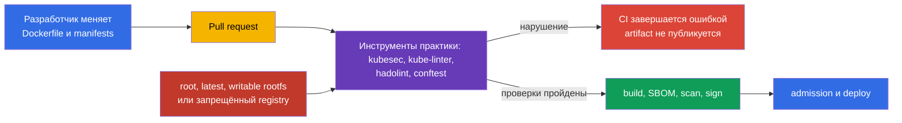
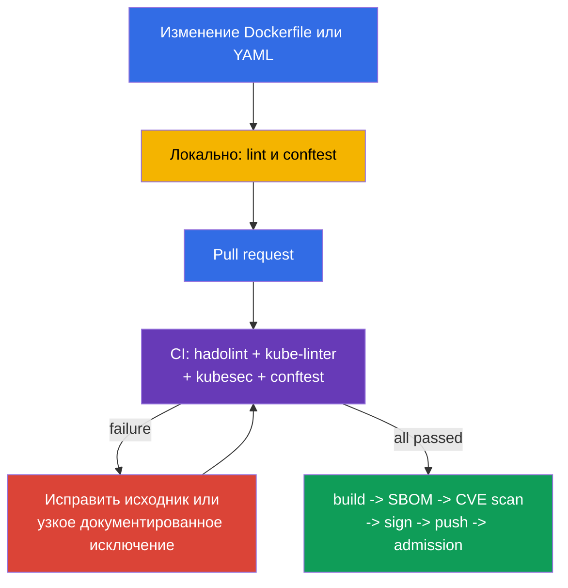

<!-- Standalone RU release: ссылки на переводы удалены, потому что соответствующие файлы не входят в архив. -->

# Глава 27. Статический анализ нагрузок и образов

> **Что дальше.** В [главе 26](../26/ru.md) мы научились разрешать trusted registry и проверять подпись artifact при admission. Но подпись доказывает происхождение, а не отсутствие небезопасной конфигурации: подписанный Deployment всё ещё может запускать root-процесс, writable root filesystem или образ с тегом `latest`. Статический анализ проверяет Dockerfile и Kubernetes manifests до push и deploy. Это домен **Supply Chain Security** CKS (20%): быстрый feedback в локальной разработке и обязательный gate в CI.

> **Что нужно знать из CKA.** Поля `securityContext`, которые обнаруживают линтеры: `runAsNonRoot`, `allowPrivilegeEscalation`, `readOnlyRootFilesystem`, capabilities и `privileged`, разобраны в [главе 20 CKA](../../../cka/course/20/ru.md). Здесь не повторяем их синтаксис, а строим автоматические проверки, которые не позволят пропустить небезопасную настройку в Git.

## 27.1. Модель угроз: небезопасная конфигурация попадает в кластер вместе с кодом

Kubernetes API принимает syntactically valid manifest, даже если он противоречит secure-by-default практике. Контейнер от UID 0, `privileged: true`, writable root filesystem или image с `:latest` могут выглядеть как обычное изменение в review. Если найти проблему только после deploy, она уже доступна атакующему и требует incident response вместо недорогой правки в pull request.

Статический анализ читает исходные файлы без запуска workload. Он не заменяет admission policy, signature verification, vulnerability scanning или runtime detection: инструменты отвечают на разные вопросы.



Типовой сценарий: разработчик добавляет `Deployment` для API. Он указывает `image: api:latest`, не задаёт `securityContext`, а приложению временно нужен каталог `/tmp`. Без проверки workload успешно применится и будет запускаться с image, который меняется за тем же тегом, от root и с writable filesystem. С `kube-linter`, `kubesec` и собственным policy CI покажет конкретные нарушения до merge. Исправление становится частью изменения: фиксированный tag или digest, non-root user, drop capabilities и отдельный `emptyDir` для записи.

| Контроль | Вопрос | Что он не доказывает |
|---|---|---|
| `kubesec` | насколько безопасен manifest по набору известных controls? | что rule соответствует политике именно вашей организации |
| `kube-linter` | соблюдены ли Kubernetes best practices? | что image не содержит CVE |
| `hadolint` | безопасен и воспроизводим ли Dockerfile? | что final image соответствует runtime policy |
| `conftest` + OPA | выполняется ли локальная policy-as-code? | что policy уже подключена к admission |
| Trivy, подпись, admission | есть ли CVE, trusted ли artifact, допускает ли его кластер? | не заменяют lint исходников |

В этой главе `kubesec` и `kube-linter` служат инструментами практики для анализа Kubernetes manifests. `hadolint` и `conftest` так же полезны в курсе и лабораторных заданиях: первый анализирует Dockerfile, второй проверяет локальную policy организации. На экзамене используйте только инструмент и окружение, указанные в конкретном задании.

Линтер - detector, не authority. Каждое правило должно быть понятным: команда обязана уметь объяснить риск, выбрать исправление или документированно принять временное исключение. Не скрывайте системное нарушение глобальным `--ignore`; ограничьте исключение конкретным rule, файлом и сроком, а затем уберите его.

## 27.2. `kubesec`: скоринг Kubernetes manifest

`kubesec` анализирует Kubernetes YAML и сопоставляет поля с security controls. Команда выводит score и список passed/failed checks. Это полезно как быстрый сигнал: отрицательные finding часто означают отсутствующий `securityContext` или рискованный host access. Score не является доказательством безопасности и не должен быть единственным CI gate: некоторые legitimate workloads, например CNI DaemonSet, обоснованно требуют расширенных привилегий.

Ниже намеренно небезопасный manifest. Он нужен только для демонстрации finding, не применяйте его в production:

```yaml
# manifests/api.yaml
apiVersion: apps/v1
kind: Deployment
metadata:
  name: api
  namespace: payments
spec:
  replicas: 2
  selector:
    matchLabels:
      app: api
  template:
    metadata:
      labels:
        app: api
    spec:
      containers:
      - name: api
        image: registry.example.com/payments/api:latest
        ports:
        - containerPort: 8080
```

Запустите scan для файла или передайте YAML через stdin. В CI используйте зафиксированную версию инструмента в утверждённом builder image либо скачанный и проверенный binary; не доверяйте плавающему `latest` у самого scanner.

```bash
kubesec scan manifests/api.yaml

# Удобно при генерации YAML шаблонизатором.
kustomize build overlays/prod | kubesec scan /dev/stdin
```

Отчёт содержит общий score и детальные controls. В данном примере ожидаем finding около следующих рекомендаций:

| Finding | Почему опасно | Практическое исправление |
|---|---|---|
| `Run as non-root user` | RCE получает UID 0 внутри контейнера | добавить non-root `USER` в image и `runAsNonRoot: true` в Pod |
| `Read-only root filesystem` | атакующий может записывать инструменты и изменять файлы runtime | задать `readOnlyRootFilesystem: true`; writable path вынести в volume |
| `Drop NET_RAW capability` или `Drop ALL capabilities` | лишние capabilities расширяют действия процесса | `drop: ["ALL"]`, возвращать только обоснованную capability |
| Проверенный control из закреплённого набора rules | риск и исправление зависят от текста этого control | перед gate вывести `kubesec print-rules` для закреплённой версии; проверку mutable tag не приписывать `kubesec` без такого подтверждения |

Ориентируйтесь на текст controls, а не на один score. Например, score может вырасти после добавления securityContext, но manifest всё ещё может разрешать неизвестный registry - это правило лучше выразить в `conftest` и admission policy. При анализе Helm chart сканируйте рендеринг, иначе линтер видит templates, а не ресурсы, которые отправит `kubectl`:

```bash
helm template payments-api ./chart --namespace payments \
  --values ./chart/values-production.yaml | kubesec scan /dev/stdin
```

Не отправляйте приватные manifests в публичный online scanner. Локальный binary или утверждённый CI container оставляет исходники в вашем execution environment.

## 27.3. `kube-linter`: проверка Kubernetes best practices

`kube-linter` проверяет manifests и Helm charts набором Kubernetes-oriented checks. В отличие от score `kubesec`, результат обычно связывает конкретный resource, container и check name. Это удобно для gate: lint возвращает non-zero exit code, если найдены errors.

```bash
# Проверить каталог с plain YAML.
kube-linter lint manifests/

# Проверить chart и все его templates.
kube-linter lint ./chart

# Показать доступные checks и их назначение.
kube-linter checks list
```

Для демонстрационного `manifests/api.yaml` типичны `run-as-non-root`, `no-read-only-root-fs` и `latest-tag`. Точный состав зависит от версии `kube-linter` и enabled checks, поэтому фиксируйте версию в CI и сохраняйте её вывод в artifact job. Не формируйте `image:` конкатенацией с пустой переменной: это может превратить ожидаемый versioned tag в `latest`.

Исправленный manifest добавляет defense in depth. Приложение должно быть совместимо с UID `10001`; образ также должен иметь non-root `USER`, потому что manifest не исправляет небезопасный image при локальном запуске. `emptyDir` даёт приложению единственное writable место, а `readOnlyRootFilesystem` оставляет корень immutable.

```yaml
# manifests/api.yaml
apiVersion: apps/v1
kind: Deployment
metadata:
  name: api
  namespace: payments
spec:
  replicas: 2
  selector:
    matchLabels:
      app: api
  template:
    metadata:
      labels:
        app: api
    spec:
      securityContext:
        runAsNonRoot: true
        runAsUser: 10001
        runAsGroup: 10001
      containers:
      - name: api
        image: registry.example.com/payments/api:1.4.2@sha256:<проверенный-64-символьный-digest>
        ports:
        - containerPort: 8080
        securityContext:
          allowPrivilegeEscalation: false
          readOnlyRootFilesystem: true
          capabilities:
            drop: ["ALL"]
        volumeMounts:
        - name: tmp
          mountPath: /tmp
      volumes:
      - name: tmp
        emptyDir: {}
```

После изменения запустите lint снова. Чистый output означает только, что текущий набор checks не нашёл нарушения; он не отменяет review и следующих gates.

```bash
kube-linter lint manifests/
kubesec scan manifests/api.yaml
kubectl apply --dry-run=server -f manifests/api.yaml
```

`kubectl apply --dry-run=server` проверяет API schema и admission без сохранения resource. Это другой сигнал, чем lint: schema может быть корректной у небезопасного manifest, а custom policy может отклонить manifest, который устраивает generic linter.

### Настройка checks без ослабления всего pipeline

Некоторые checks требуют настройки для legacy workload. `include` без `doNotAutoAddDefaults: true` добавляет checks к default-набору, а не заменяет его. Если нужен ровно обозримый security baseline, отключите автодобавление defaults и перечислите весь набор. Не отключайте `run-as-non-root` для всего repository ради одного системного DaemonSet: выделите system manifest в отдельный путь, добавьте exception в policy с обоснованием и ограничьте доступ к изменению этого исключения.

```yaml
# .kube-linter.yaml
checks:
  doNotAutoAddDefaults: true
  include:
  - run-as-non-root
  - no-read-only-root-fs
  - privilege-escalation-container
  - privileged-container
  - drop-net-raw-capability
  - sensitive-host-mounts
  - docker-sock
  - latest-tag
```

Проверьте название и доступность checks для закреплённой версии через `kube-linter checks list`; не копируйте конфигурацию между версиями без проверки. CI должен завершаться ошибкой при невозможности загрузить configuration - молчаливый переход к default checks создаёт ложное ощущение защиты.

## 27.4. `hadolint`: анализ Dockerfile до сборки образа

Manifest защищает запуск, но security issue часто начинается в Dockerfile: mutable base image, `apt-get install` без cleanup, `curl | sh`, root final user или shell form `CMD`. `hadolint` разбирает Dockerfile и сообщает правила в формате `DL####`. Он не строит image и не выполняет `RUN`, поэтому запуск безопаснее и быстрее build, но не заменяет build/test/scan.

```bash
hadolint Dockerfile

# Использовать stdin в editor integration или CI.
hadolint - < Dockerfile
```

Пример Dockerfile с распространёнными проблемами:

```dockerfile
FROM ubuntu:latest
RUN apt-get update
RUN apt-get install -y curl
COPY . /app
CMD python /app/server.py
```

Типичные `hadolint` сообщения и правильная реакция:

| Rule | Сигнал | Исправление |
|---|---|---|
| `DL3002` | последний `USER` - root | в final stage указать non-root `USER`; Pod-level `runAsNonRoot` остаётся независимой защитой |
| `DL3007` | tag `latest` mutable | указать конкретную версию base image, а для release закрепить digest |
| `DL3008` | пакет без версии | фиксировать версию там, где это поддерживается repository и вашей стратегией обновлений |
| `DL3009` | остался cache `apt` | объединить update/install/cleanup в один `RUN` или использовать подходящий minimal base |
| `DL3059` | несколько последовательных `RUN` | объединить логически связанные операции, не ухудшая читаемость |
| `DL3025` | shell form `CMD` | применить JSON/exec form, чтобы process корректно получал signals |

Номер `DL####` - ссылка на конкретную rule, а не универсальный severity. Сначала прочитайте её описание: иногда сообщение влияет на reproducibility, иногда - на image size или signal handling. Не используйте inline ignore только для получения зелёного CI. Если исключение обосновано, оставьте короткий комментарий с причиной, issue и сроком пересмотра.

Ниже минимальный pattern для Go service. Конкретные версии иллюстративны: release pipeline должен подставлять проверенный digest согласно внутреннему registry и процессу обновления base images. Final stage не содержит package manager, compiler или shell; image-level `USER` и Pod-level securityContext дополняют друг друга.

```dockerfile
# syntax=docker/dockerfile:1.7
FROM golang:1.27.1-alpine3.24 AS build
WORKDIR /src
COPY go.mod go.sum ./
RUN go mod download
COPY . ./
RUN CGO_ENABLED=0 GOOS=linux go build -trimpath -ldflags="-s -w" \
    -o /out/api ./cmd/api

FROM scratch
COPY --from=build /out/api /api
USER 10001:10001
ENTRYPOINT ["/api"]
```

`hadolint` не видит всё: он не знает, содержит ли `COPY . .` secret, соответствует ли binary architecture ноде или есть ли CVE в base image. Используйте `.dockerignore`, BuildKit secret mounts, unit tests, SBOM и scanner из соседних глав. Lint помогает раньше заметить structural error, а не заменяет supply-chain controls.

## 27.5. OPA `conftest`: проверка policy-as-code для manifests

Generic linters знают общие best practices. Организации обычно добавляют правила, которые зависят от их threat model: разрешены только internal registries, production namespace требует limits, все workload должны иметь owner label, а exception допустим лишь с ticket и expiry. `conftest` запускает Rego policies OPA над YAML, JSON, HCL и другими structured files и возвращает non-zero exit code, когда правило выдаёт `deny`.

Структура repository может быть такой:

```text
.
├── Dockerfile
├── manifests/
│   └── api.yaml
└── policy/
    └── main.rego
```

Следующая Rego policy проверяет каждый container в `Deployment`. Она не пытается заменить все checks `kube-linter`; задача policy - явно зафиксировать локальные неизменяемые требования: trusted registry prefix, отсутствие mutable `latest`, non-root, read-only root filesystem и запрет privilege escalation. `object.get` даёт безопасное значение по умолчанию для необязательных объектов: поэтому отсутствие `securityContext` тоже создаёт violation, а не делает правило undefined.

```rego
# policy/main.rego
package main

import rego.v1

workload if {
  object.get(input, "kind", "") == "Deployment"
}

pod_template := object.get(object.get(input, "spec", {}), "template", {})
pod_spec := object.get(pod_template, "spec", {})
pod_security_context := object.get(pod_spec, "securityContext", {})
containers := object.get(pod_spec, "containers", [])

violation contains msg if {
  workload
  container := containers[_]
  image := object.get(container, "image", "")
  not startswith(image, "registry.example.com/")
  name := object.get(container, "name", "<unnamed>")
  msg := sprintf("container %q uses an unapproved registry: %s", [name, image])
}

violation contains msg if {
  workload
  container := containers[_]
  image := object.get(container, "image", "")
  endswith(image, ":latest")
  name := object.get(container, "name", "<unnamed>")
  msg := sprintf("container %q uses mutable latest tag", [name])
}

violation contains msg if {
  workload
  object.get(pod_security_context, "runAsNonRoot", false) != true
  msg := "pod template must set securityContext.runAsNonRoot: true"
}

violation contains msg if {
  workload
  container := containers[_]
  container_security_context := object.get(container, "securityContext", {})
  object.get(container_security_context, "readOnlyRootFilesystem", false) != true
  name := object.get(container, "name", "<unnamed>")
  msg := sprintf("container %q must set readOnlyRootFilesystem: true", [name])
}

violation contains msg if {
  workload
  container := containers[_]
  container_security_context := object.get(container, "securityContext", {})
  object.get(container_security_context, "allowPrivilegeEscalation", true) != false
  name := object.get(container, "name", "<unnamed>")
  msg := sprintf("container %q must set allowPrivilegeEscalation: false", [name])
}

deny contains msg if {
  msg := violation[_]
}
```

Проверяйте policy на bad и good fixtures. `conftest test` читает policy directory автоматически, если он расположен в `policy/`; явный `--policy` делает CI invocation ясным.

```bash
# Должно напечатать deny и вернуть ненулевой exit code для старого manifest.
conftest test --policy policy manifests/api.yaml

# После исправления policy и manifest команда должна вернуть 0.
conftest test --policy policy manifests/
```

У policy тоже должен быть test suite. Иначе изменение Rego способно случайно убрать контроль и CI останется зелёным. Отдельный `*_test.rego` проверяет expected deny/allow без запуска кластера:

```rego
# policy/main_test.rego
package main

import rego.v1

test_denies_missing_security_context if {
  resource := {
    "kind": "Deployment",
    "spec": {"template": {"spec": {
      "containers": [{
        "name": "api",
        "image": "registry.example.com/payments/api:1.4.2",
      }],
    }}},
  }
  result := violation with input as resource
  "pod template must set securityContext.runAsNonRoot: true" in result
  "container \"api\" must set readOnlyRootFilesystem: true" in result
  "container \"api\" must set allowPrivilegeEscalation: false" in result
}

test_denies_dangerous_variants if {
  resource := {
    "kind": "Deployment",
    "spec": {"template": {"spec": {
      "securityContext": {"runAsNonRoot": false},
      "containers": [{
        "name": "api",
        "image": "docker.io/library/api:latest",
        "securityContext": {
          "readOnlyRootFilesystem": false,
          "allowPrivilegeEscalation": true,
        },
      }],
    }}},
  }
  result := violation with input as resource
  "container \"api\" uses an unapproved registry: docker.io/library/api:latest" in result
  "container \"api\" uses mutable latest tag" in result
  "pod template must set securityContext.runAsNonRoot: true" in result
  "container \"api\" must set readOnlyRootFilesystem: true" in result
  "container \"api\" must set allowPrivilegeEscalation: false" in result
}

test_allows_hardened_workload if {
  resource := {
    "kind": "Deployment",
    "spec": {"template": {"spec": {
      "securityContext": {"runAsNonRoot": true},
      "containers": [{
        "name": "api",
        "image": "registry.example.com/payments/api:1.4.2@sha256:0123456789abcdef",
        "securityContext": {
          "readOnlyRootFilesystem": true,
          "allowPrivilegeEscalation": false,
        },
      }],
    }}},
  }
  result := violation with input as resource
  count(result) == 0
}
```

```bash
opa test policy/ -v
```

В production дублируйте critical policy в admission controller, например Kyverno, Gatekeeper или ValidatingAdmissionPolicy, где это применимо. `conftest` защищает путь Git -> CI; admission защищает API от ручного `kubectl apply`, другого pipeline и ошибочно настроенного job. Политики должны иметь один источник или tests, которые подтверждают их эквивалентное intent, иначе они со временем расходятся.

## 27.6. CI gate и цикл «исправить - повторить проверку»

Static analysis полезен только тогда, когда его результат влияет на delivery. Локальный запуск даёт быстрый feedback, но обязательный CI job делает проверку воспроизводимой для каждого pull request. Pipeline должен устанавливать или использовать pinned releases, сохранять reports как artifacts и прекращать build/push при error. Не загружайте для scanner manifests с production secrets и не печатайте secrets в logs.

Минимальная последовательность:



Для практики этой главы gate может запускать `kubesec` и `kube-linter`; `hadolint` для Dockerfile и `conftest` с unit tests полезно добавить для полной локальной проверки. Пример GitHub Actions job ниже показывает расширенный порядок, а не предписывает один CI provider. На экзамене используйте инструмент и окружение, указанные в конкретном задании. В real pipeline замените floating `curl` downloads на внутренний, проверенный tool image или pinned action/image digest; используйте lockfile/verified checksums для binary. `helm template` или `kustomize build` добавьте перед линтерами, если production deploy использует templates.

```yaml
# .github/workflows/static-analysis.yaml
name: static-analysis
on:
  pull_request:
    paths:
    - 'Dockerfile'
    - 'manifests/**'
    - 'policy/**'

jobs:
  lint:
    runs-on: ubuntu-24.04
    permissions:
      contents: read
    steps:
    - uses: actions/checkout@<проверенный-action-digest>

    - name: Hadolint
      run: hadolint Dockerfile

    - name: Kubernetes best-practice checks
      run: kube-linter lint manifests/

    - name: Kubernetes security score gate
      shell: bash
      run: |
        set -euo pipefail
        kubesec scan manifests/api.yaml --format json \
          | tee kubesec-report.json \
          | jq -e 'type == "array" and length > 0 and all(.[]; (.score? | type) == "number" and .score > 0)' > /dev/null

    - name: Organisation policy
      run: conftest test --policy policy manifests/

    - name: Policy unit tests
      run: opa test policy/ -v

    - name: Save static-analysis report
      uses: actions/upload-artifact@<проверенный-action-digest>
      with:
        name: static-analysis-report
        path: kubesec-report.json
```

Проверяйте exit code и машинно проверяемый результат, а не наличие текста в stdout. `tee` лишь сохраняет JSON, а `pipefail` лишь не скрывает failure самого scanner: они не делают score gate. У `kubesec` default JSON - массив результатов, поэтому `jq -e` должен проверить score каждого элемента. В примере ниже любой пустой массив, нечисловой score или score `<= 0` завершает команду с non-zero; порог выбирают и versionируют как часть policy.

```bash
set -euo pipefail
kubesec scan manifests/api.yaml --format json \
  | tee kubesec-report.json \
  | jq -e 'type == "array" and length > 0 and all(.[]; (.score? | type) == "number" and .score > 0)' > /dev/null
```

### Практический цикл исправления

1. Создайте или возьмите manifest с `:latest`, без `runAsNonRoot`, `readOnlyRootFilesystem` и `allowPrivilegeEscalation`.
2. Выполните `kubesec scan`, `kube-linter lint` и `conftest test`. Сохраните исходный output: он объясняет, почему CI должен остановиться.
3. Исправьте source, а не output: versioned tag/digest, image-level non-root user, Pod `securityContext`, `drop: ["ALL"]` и `emptyDir` для реальной writable directory.
4. Выполните все проверки повторно, включая `hadolint Dockerfile` и `opa test policy/`. Убедитесь, что команды возвращают `0`.
5. Проверьте API compatibility без создания workload: `kubectl apply --dry-run=server -f manifests/`. Если production использует rendered chart, проверяйте именно rendered YAML.
6. Только после зелёного static-analysis gate запускайте build, SBOM, image scan, signing и deployment gates. Не меняйте CI на «warning only», пока команда не решила, какое risk acceptance допустимо.

Ниже компактный локальный script, который делает тот же gate. Он intentionally завершится на первой ошибке; разработчик должен исправить finding и запустить script заново.

```bash
#!/usr/bin/env bash
# scripts/static-analysis.sh
set -euo pipefail

hadolint Dockerfile
kube-linter lint manifests/
kubesec scan manifests/api.yaml --format json \
  | tee kubesec-report.json \
  | jq -e 'type == "array" and length > 0 and all(.[]; (.score? | type) == "number" and .score > 0)' > /dev/null
conftest test --policy policy manifests/
opa test policy/ -v
kubectl apply --dry-run=server -f manifests/
```

Типичные ошибки и диагностика:

| Симптом | Причина | Что делать |
|---|---|---|
| `kube-linter` всё ещё сообщает `run-as-non-root` | поле добавлено не в `spec.template.spec`, либо конкретный container override отменил настройку | проверить rendered resource через `kubectl kustomize`/`helm template` и путь `spec.template.spec.securityContext` |
| приложение падает после `readOnlyRootFilesystem: true` | process пишет cache, PID или temp file в root filesystem | определить путь по logs, смонтировать узкий `emptyDir` только туда; не отключать read-only root целиком |
| `hadolint` проходит, но image запускается от root | Dockerfile не содержит `USER`, а manifest проверяет лишь cluster runtime | добавить non-root `USER` в final stage и оставить manifest guard |
| `conftest` не находит правило | передан template вместо rendered YAML или неверен путь `--policy` | тестировать input fixture, запустить `opa test`, затем lint именно rendered output |
| CI зелёный после `kubesec ... | tee` | `tee` сохранил JSON, но score не проверялся | включить `set -o pipefail` и `jq -e` с `all(.[]; .score > порог)` для всего JSON-массива |
| критичный system workload требует exception | правило применено одинаково к приложению и CNI/CSI | отдельный scope, least-privilege exception с owner, ticket и expiry; не глобальный ignore |

## 27.7. Как это применяют в продакшене

- **Lint запускается до build.** Разработчик получает feedback в pre-commit/editor или отдельном CI job до затрат на build, push и integration environment. PR нельзя merge, пока обязательные findings не исправлены или не одобрено узкое исключение.
- **Инструменты и rules фиксированы.** Версии `kube-linter`, `kubesec`, `hadolint`, `conftest` и OPA закрепляют в trusted CI image или lockfile. Обновление rules проходит review: новая версия может добавить legitimate findings, но не должна незаметно ослабить gate.
- **Проверяется финальный YAML.** Helm/Kustomize/GitOps могут менять values, image и securityContext. CI линтит тот rendered artifact, который будет подписан/применён, а не только template source.
- **Policy-as-code живёт рядом с приложением и platform policy.** Командные правила тестируются `opa test`; обязательные cluster-wide controls дублируются или централизуются в admission. Exception имеет owner, причину и дату истечения.
- **Статический анализ - часть цепочки.** После него следуют SBOM, vulnerability scan, подпись и registry promotion; перед запуском действует admission. Runtime controls обнаруживают то, что невозможно увидеть по исходникам.
- **Отчёты пригодны для audit.** CI сохраняет version scanner, результаты и ссылку на commit. Reports не должны содержать credentials, private keys или production Secret data.

## 27.8. Мини-глоссарий

- **Static analysis** - проверка исходных Dockerfile, manifests и policy без запуска workload.
- **`kubesec`** - scanner Kubernetes manifests, выводящий security score и controls.
- **`kube-linter`** - линтер Kubernetes YAML и Helm charts с набором best-practice checks.
- **`hadolint`** - линтер Dockerfile; rules обозначаются кодами `DL####`.
- **OPA (Open Policy Agent)** - policy engine, исполняющий декларативные правила Rego.
- **`conftest`** - CLI для проверки structured configuration правилами OPA/Rego.
- **Rego** - язык описания политик OPA.
- **CI gate** - обязательная проверка, блокирующая следующий этап pipeline при non-zero exit code.
- **Rendered manifest** - окончательный YAML после `helm template` или `kustomize build`.
- **False positive** - finding, который не применим к конкретному resource; требует узкого документированного exception, а не отключения контроля глобально.

## 27.9. Итоги главы

- Kubernetes manifest может быть валидным для API, но небезопасным; static analysis находит такие ошибки до deploy и превращает security practice в repeatable CI gate.
- В практике курса `kubesec` показывает score и security controls, а `kube-linter` проверяет Kubernetes best practices, включая non-root, read-only root filesystem и mutable tags. Gate для `kubesec` разбирает JSON-массив и проверяет score каждого результата.
- `hadolint` обнаруживает structural проблемы Dockerfile по rules `DL####`, включая `DL3002` для root final user, но не заменяет image build, secret handling и CVE scan.
- `conftest` исполняет versioned Rego policy для требований конкретной организации; policy сама должна иметь тесты через `opa test`, в том числе для отсутствующих полей и опасных значений.
- Исправление означает изменение Dockerfile/manifest/policy, после которого все linters и server dry-run повторно возвращают `0`.
- Lint не заменяет SBOM, vulnerability scan, signing или admission: это последовательные слои supply-chain defense.

## 27.10. Как это пригодится: на экзамене и в реальной работе

**На экзамене.** Практика с `kubesec`, `kube-linter`, `hadolint` и `conftest` помогает читать finding и исправлять `securityContext`, image reference, Dockerfile или локальную policy. Эти инструменты не следует считать обязательной частью экзамена или заранее доступными в его окружении: используйте только инструмент и окружение, указанные в конкретном задании. Нужно помнить связь с SecurityContext: `runAsNonRoot`, `allowPrivilegeEscalation: false`, `readOnlyRootFilesystem: true`, `capabilities.drop: ["ALL"]` - типовой baseline, который могут проверять средства анализа. Для CI важно понимать, что failure должен блокировать продвижение artifact, а после правки проверка запускается повторно.

**В реальной работе.** Статический анализ делает безопасную конфигурацию привычным качеством кода: finding виден автору PR, а не security-команде после production deploy. Сочетание generic linters, tested Rego policy, rendered-manifest checks и обязательного CI gate уменьшает вероятность root workloads, mutable images и неразрешённых registries. После этого pipeline продолжает проверять bytes artifact: SBOM, CVE scan, signature и admission защищают риски, которые lint не видит.

## 27.11. Вопросы для самопроверки

1. Почему успешно применяемый Kubernetes YAML всё ещё может быть небезопасным?
2. Чем `kubesec` score отличается от обязательной policy вашей организации?
3. Какие типовые finding показывает `kube-linter` для обычного application container?
4. Почему `hadolint` не заменяет vulnerability scanner и зачем читать конкретный `DL####`?
5. Как `conftest` и Rego помогают проверить trusted registry или обязательный `securityContext`?
6. Почему CI должен сканировать rendered Helm/Kustomize output, а не только templates?
7. Что нужно сделать после finding: отключить rule, исправить source или принять узкое исключение?
8. Почему `set -o pipefail` важен для команды scanner, вывод которой передаётся в `tee`?

## Практика

В этой главе мы остановили небезопасный Dockerfile или manifest до build и deploy. Далее в [главе 28](../28/ru.md) проверим уже собранный image на CVE: lint говорит о configuration, scanner - о known vulnerabilities в bytes и packages. Полная цепочка lab 111 объединяет static analysis, SBOM, image scan и signing.

🧪 Лаба 111 (Supply chain: анализ, Trivy, SBOM, signing): [tasks/cks/labs/111](../../labs/111/README_RU.MD)

📘 CKA-опора: [SecurityContext и capabilities](../../../cka/course/20/ru.md)

---
[Оглавление](../README_RU.md) · [Глава 26](../26/ru.md) · [Глава 28](../28/ru.md)
