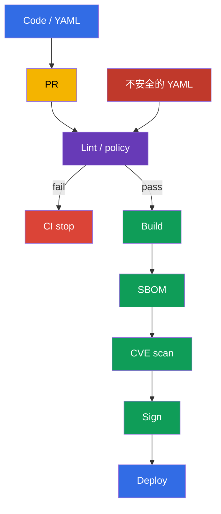
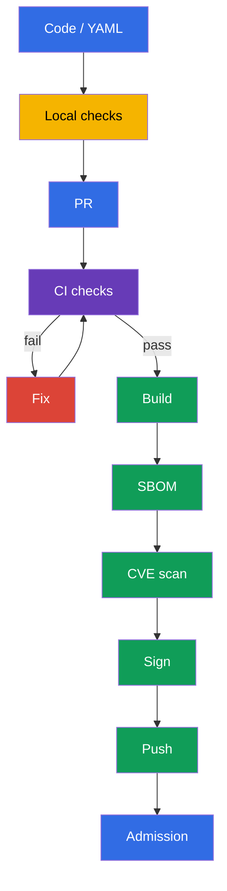

[Русская версия](ru.md) · [Eng version](README.md) · [Versión en español](es.md) · [Version française](fr.md) · [Deutsche Version](de.md) · [ქართული ვერსია](ge.md) · [日本語版](jp.md)

# 第 27 章。Workload 與 image 的 static analysis

> **問題。** Syntax 正確的 manifest 可能悄悄加入 `privileged: true`、root process、
> writable root filesystem，或使用 `:latest` 的 image；Dockerfile 也可能加入不安全的
> build pattern。Merge 後，這個風險已進入 CI 與 cluster，修正需要 rollout 或 incident
> response。必須在 build、push 與 deploy 之前檢查 source Dockerfile 和 manifests。

> **接下來。** 在[第 26 章](../26/tw.md)，我們學會在 admission 時允許 trusted registry
> 並驗證 artifact signature。但 signature 證明 origin，並不證明沒有不安全 configuration：
> Signed Deployment 仍可能執行 root process、writable root filesystem 或 tag 為 `latest`
> 的 image。Static analysis 在 push 和 deploy 前檢查 Dockerfile 與 Kubernetes manifests。
> 這是 CKS **Supply Chain Security**（20%）領域：在 local development 提供快速 feedback，
> 並在 CI 設立必要 gate。

> **需要的 CKA 基礎。** Linters 會發現的 `securityContext` fields：
> `runAsNonRoot`、`allowPrivilegeEscalation`、`readOnlyRootFilesystem`、capabilities
> 和 `privileged`，請見[CKA 第 20 章](../../../cka/course/20/tw.md)。這裡不重複它們的
> syntax，而是建立 automated checks，避免不安全 configuration 混入 Git。

> 🧠 Shift-left analysis 將不安全 configuration 的偵測移到 pull request：在 build 和 deploy 前修正 source，成本低於回應執行中 workload 的風險。

## 27.1. Threat model：不安全 configuration 隨 code 進入 cluster

即使 Kubernetes API 接受 syntactically valid manifest，它也可能違反 secure-by-default
practice。以 UID 0 執行的 container、`privileged: true`、writable root filesystem 或使用
`:latest` 的 image，在 review 中都可能看起來只是一般變更。若只在 deploy 後才發現問題，
attacker 已可利用它，修正變成 incident response，而不是 pull request 中低成本的修正。

Static analysis 不執行 workload，而是讀取 source files。它不取代 admission policy、
signature verification、vulnerability scanning 或 runtime detection：各工具回答不同問題。



典型 scenario：developer 為 API 新增 `Deployment`。他指定 `image: api:latest`、
未設定 `securityContext`，而 application 暫時需要 `/tmp` directory。若沒有
check，workload 仍可成功套用，並以同一 tag 下可變的 image、root 及 writable filesystem
執行。使用 `kube-linter`、`kubesec` 和自訂 policy 時，CI 會在 merge 前顯示具體
violations。修正會成為變更的一部分：fixed tag 或 digest、non-root user、drop capabilities，
以及獨立供寫入的 `emptyDir`。

| Control | 問題 | 它不會證明什麼 |
|---|---|---|
| `kubesec` | Manifest 依已知 controls 的集合有多安全？ | rule 符合你 organization 的 policy |
| `kube-linter` | 是否遵守 Kubernetes best practices？ | image 不含 CVE |
| `hadolint` | Dockerfile 是否安全且可重現？ | final image 符合 runtime policy |
| `conftest` + OPA | 是否滿足 local policy-as-code？ | policy 已接入 admission |
| Trivy、signature、admission | 是否有 CVE、artifact 是否 trusted、cluster 是否允許它？ | 不取代 source lint |

本章中，`kubesec` 和 `kube-linter` 是分析 Kubernetes manifests 的實務工具。
`hadolint` 與 `conftest` 對本課程及 labs 也同樣有用：前者分析 Dockerfile，後者
檢查 organization 的 local policy。考試時只使用具體 task 指定的工具與 environment。

Linter 是 detector，不是 authority。每一條 rule 都應清楚：team 必須能解釋 risk、選擇
fix，或有文件地接受 temporary exception。不要用全域 `--ignore` 隱藏系統性 violation；
將 exception 限制在特定 rule、file 和期限，然後移除它。

> 🔬 `kubesec` 提供 security score 與 controls，但不會取代 organization policy。

## 27.2. `kubesec`：Kubernetes manifest scoring

`kubesec` 分析 Kubernetes YAML，並將 fields 對照 security controls。Command 輸出 score
和 passed/failed checks 清單。它是有用的快速 signal：negative finding 常表示缺少
`securityContext` 或有風險的 host access。Score 不是 security proof，不應是唯一 CI
gate：某些 legitimate workloads，例如 CNI DaemonSet，有正當理由需要較高 privileges。

以下 manifest 故意不安全。它只用於展示 finding，不要在 production 套用：

```yaml
# manifests/api.yaml
apiVersion: apps/v1
kind: Deployment
metadata:
  name: api
  namespace: payments
spec:
  replicas: 2
  selector:
    matchLabels:
      app: api
  template:
    metadata:
      labels:
        app: api
    spec:
      containers:
      - name: api
        image: registry.example.com/payments/api:latest
        ports:
        - containerPort: 8080
```

執行 file scan，或透過 stdin 傳入 YAML。在 CI 中，使用 approved builder image 裡
pinned 的工具版本，或下載並驗證 binary；不要信任 scanner 本身浮動的 `latest`。

```bash
kubesec scan manifests/api.yaml

# 當 YAML 由 templating tool 生成時很方便。
kustomize build overlays/prod | kubesec scan /dev/stdin
```

Report 包含 overall score 和 detailed controls。此例預期的 finding 大致如下：

| Finding | 為何危險 | 實務修正 |
|---|---|---|
| `Run as non-root user` | RCE 在 container 內取得 UID 0 | 在 image 加入 non-root `USER`，並在 Pod 中設定 `runAsNonRoot: true` |
| `Read-only root filesystem` | Attacker 可寫入 tools 並變更 runtime files | 設定 `readOnlyRootFilesystem: true`；將 writable path 移入 volume |
| `Drop NET_RAW capability` 或 `Drop ALL capabilities` | 多餘 capabilities 擴大 process actions | `drop: ["ALL"]`，只加回有充分理由的 capability |
| Pinned rule set 中已驗證的 control | Risk 與 fix 取決於該 control 的文字 | Gate 前為 pinned version 輸出 `kubesec print-rules`；未確認前不要將 mutable tag check 歸因於 `kubesec` |

依 controls 的文字，而非單一 score 來判斷。例如加入 securityContext 後 score 可能提高，
但 manifest 仍可能允許未知 registry - 這條 rule 較適合表達在 `conftest` 與
admission policy 中。分析 Helm chart 時請掃描 rendering，否則 linter 看見 templates，
而非 `kubectl` 將發送的 resources：

```bash
helm template payments-api ./chart --namespace payments \
  --values ./chart/values-production.yaml | kubesec scan /dev/stdin
```

不要將 private manifests 傳至公開 online scanner。Local binary 或 approved CI container
會讓 source 留在你的 execution environment。

> 🎯 `kube-linter` 是 Kubernetes-oriented static analysis：讀取 finding、修正 manifest，並重複 lint 直到乾淨結果。

## 27.3. `kube-linter`：檢查 Kubernetes best practices

`kube-linter` 以一組 Kubernetes-oriented checks 檢查 manifests 與 Helm charts。
與 `kubesec` 的 score 不同，結果通常連結到特定 resource、container 與 check name。
這很適合 gate：發現 errors 時，lint 會回傳 non-zero exit code。

```bash
# 檢查含 plain YAML 的 directory。
kube-linter lint manifests/

# 檢查 chart 與所有 templates。
kube-linter lint ./chart

# 顯示可用 checks 及其用途。
kube-linter checks list
```

對示範用的 `manifests/api.yaml`，典型 checks 是 `run-as-non-root`、
`no-read-only-root-fs` 與 `latest-tag`。精確集合取決於 `kube-linter` version
與 enabled checks，因此在 CI 固定 version，並將其 output 儲存為 job artifact。不要以
empty variable 串接 `image:`：它可能將預期 versioned tag 變成 `latest`。

修正的 manifest 加入 defence in depth。Application 必須相容於 UID `10001`；image
也必須有 non-root `USER`，因為 manifest 不會修正 local execution 中不安全的 image。
`emptyDir` 給 application 唯一 writable 的位置，而 `readOnlyRootFilesystem` 保持
root immutable。

```yaml
# manifests/api.yaml
apiVersion: apps/v1
kind: Deployment
metadata:
  name: api
  namespace: payments
spec:
  replicas: 2
  selector:
    matchLabels:
      app: api
  template:
    metadata:
      labels:
        app: api
    spec:
      securityContext:
        runAsNonRoot: true
        runAsUser: 10001
        runAsGroup: 10001
      containers:
      - name: api
        image: registry.example.com/payments/api:1.4.2@sha256:<已驗證的-64-字元-digest>
        ports:
        - containerPort: 8080
        securityContext:
          allowPrivilegeEscalation: false
          readOnlyRootFilesystem: true
          capabilities:
            drop: ["ALL"]
        volumeMounts:
        - name: tmp
          mountPath: /tmp
      volumes:
      - name: tmp
        emptyDir: {}
```

變更後再次執行 lint。Clean output 僅表示現行 checks 未找到 violations；它不會取消
review 與後續 gates。

```bash
kube-linter lint manifests/
kubesec scan manifests/api.yaml
kubectl apply --dry-run=server -f manifests/api.yaml
```

`kubectl apply --dry-run=server` 檢查 API schema 和 admission，但不儲存 resource。
這與 lint 是不同 signal：不安全 manifest 的 schema 可能正確，而 custom policy
可能拒絕 generic linter 接受的 manifest。

> 🏭 Version control check set，將 exceptions 限制在特定 scope；不要因一個 legacy workload 就停用整個 repository 的 security baseline。

### 在不削弱整個 pipeline 的情況下設定 checks

某些 checks 必須為 legacy workload 調整。若沒有 `doNotAutoAddDefaults: true`，
`include` 是向 default set 新增 checks，而非取代它。若需要剛好可審查的 security
baseline，請停用 automatic default addition，並列出完整 set。不要只為一個 system
DaemonSet 就為整個 repository 停用 `run-as-non-root`：將 system manifest 放到獨立
path、在 policy 加入有理由的 exception，並限制誰可變更它。

```yaml
# .kube-linter.yaml
checks:
  doNotAutoAddDefaults: true
  include:
  - run-as-non-root
  - no-read-only-root-fs
  - privilege-escalation-container
  - privileged-container
  - drop-net-raw-capability
  - sensitive-host-mounts
  - docker-sock
  - latest-tag
```

請對 pinned version 使用 `kube-linter checks list` 檢查 check 名稱與 availability；
不要未經檢查就跨 versions 複製 configuration。CI 在無法載入 configuration 時應失敗 -
靜默回退到 default checks 會造成錯誤的 protection 感。

> 🔬 `hadolint` 對 Dockerfile 與 image reproducibility 有用，但不取代 image scan。

## 27.4. `hadolint`：image build 前的 Dockerfile analysis

Manifest 保護 runtime，但 security issue 常從 Dockerfile 開始：mutable base image、
沒有 cleanup 的 `apt-get install`、`curl | sh`、root final user，或 shell form `CMD`。
`hadolint` 解析 Dockerfile，並以 `DL####` format 報告 rules。它不 build image，也不
執行 `RUN`，因此比 build 更安全、更快速，但不取代 build/test/scan。

```bash
hadolint Dockerfile

# 在 editor integration 或 CI 中使用 stdin。
hadolint - < Dockerfile
```

具有常見問題的 Dockerfile 範例：

```dockerfile
FROM ubuntu:latest
RUN apt-get update
RUN apt-get install -y curl
COPY . /app
CMD python /app/server.py
```

典型 `hadolint` messages 及正確反應：

| Rule | Signal | 修正 |
|---|---|---|
| `DL3002` | 最後的 `USER` 是 root | 在 final stage 指定 non-root `USER`；Pod-level `runAsNonRoot` 仍是獨立防護 |
| `DL3007` | `latest` tag mutable | 指定具體 base image version，release 時固定 digest |
| `DL3008` | package 沒有 version | 在 repository 及你的 update strategy 支援時固定 version |
| `DL3009` | 留下 `apt` cache | 將 update/install/cleanup 合併到一個 `RUN`，或使用適當 minimal base |
| `DL3059` | 多個連續 `RUN` | 合併邏輯相關 operations，同時不損害 readability |
| `DL3025` | shell form `CMD` | 使用 JSON/exec form，讓 process 正確收到 signals |

`DL####` number 是對特定 rule 的 reference，而非通用 severity。請先讀取描述：
某些 message 關係到 reproducibility，某些關係到 image size 或 signal handling。
不要只為取得 green CI 而使用 inline ignore。若 exception 有理由，留下簡短 comment，
包含原因、issue 與 review deadline。

以下是 Go service 的最小 pattern。具體 versions 僅為說明：release pipeline 應依 internal
registry 和 base image update process 注入已驗證 digest。Final stage 不含 package manager、
compiler 或 shell；image-level `USER` 與 Pod-level securityContext 相互補充。

```dockerfile
# syntax=docker/dockerfile:1.7
FROM golang:1.27.1-alpine3.24 AS build
WORKDIR /src
COPY go.mod go.sum ./
RUN go mod download
COPY . ./
RUN CGO_ENABLED=0 GOOS=linux go build -trimpath -ldflags="-s -w" \
    -o /out/api ./cmd/api

FROM scratch
COPY --from=build /out/api /api
USER 10001:10001
ENTRYPOINT ["/api"]
```

`hadolint` 無法看見所有問題：它不知道 `COPY . .` 是否含有 secret、binary 是否符合
node architecture，或 base image 是否有 CVE。請使用 `.dockerignore`、BuildKit secret
mounts、unit tests、SBOM 與相鄰 chapters 的 scanner。Lint 有助於更早發現 structural error，
但不取代 supply-chain controls。

> 🔬 `conftest` 以 local Rego rules 擴展 generic lint；請透過 `opa test` 檢查並 version policies 本身。

## 27.5. OPA `conftest`：檢查 manifest 的 policy-as-code

Generic linters 了解常見 best practices。組織通常會加入取決於其 threat model 的 rules：只允許
internal registries、production namespace 必須有 limits、每個 workload 都必須有 owner label，
且只有附帶 ticket 與 expiry 才能允許 exception。`conftest` 對 YAML、JSON、HCL 與其他
structured files 執行 OPA Rego policies；當 rule 產生 `deny` 時，會回傳 non-zero exit code。

Repository structure 可以如下：

```text
.
├── Dockerfile
├── manifests/
│   └── api.yaml
└── policy/
    └── main.rego
```

以下 Rego policy 有意只 match `Deployment`，但會檢查 regular/init containers 與 image volumes
中的 OCI references。這是刻意受限的學習範圍，並非可直接用於 production 的 cluster-wide policy：
production 使用時，應個別加入 Pod、StatefulSet、DaemonSet、Job/CronJob 與相應的 template paths，
或在 admission policy 中套用相同 intent。此 policy 的工作是明確 codify local immutable requirements：
每個通往 OCI artifact 的 path 都要有 trusted registry prefix 與有效 immutable digest，另外 containers
還必須 effective non-root execution、read-only root filesystem，並禁止 privilege escalation。在
Kubernetes v1.36 中，[image volumes](https://v1-36.docs.kubernetes.io/docs/tasks/configure-pod-container/image-volumes/)
已 stable 且 default enabled；其 `spec.volumes[].image.reference` 不在 generic container loop 中，
所以 policy 會單獨檢查它。`object.get` 為 optional objects 提供安全 default value：因此即使缺少
`securityContext` 也會產生 violation，而不會讓 rule 變成 undefined。

```rego
# policy/main.rego
package main

import rego.v1

workload if {
  object.get(input, "kind", "") == "Deployment"
}

pod_template := object.get(object.get(input, "spec", {}), "template", {})
pod_spec := object.get(pod_template, "spec", {})
pod_security_context := object.get(pod_spec, "securityContext", {})
containers := object.get(pod_spec, "containers", [])
init_containers := object.get(pod_spec, "initContainers", [])
all_containers := array.concat(containers, init_containers)

# Kubernetes v1.36 image volumes deliver an OCI artifact not through containers[].image,
# but through spec.volumes[].image.reference; apply the same registry/digest intent to it.
image_volumes := [volume |
  volume := object.get(pod_spec, "volumes", [])[_]
  object.get(volume, "image", null) != null
]

violation contains msg if {
  workload
  container := all_containers[_]
  image := object.get(container, "image", "")
  not startswith(image, "registry.example.com/")
  name := object.get(container, "name", "<unnamed>")
  msg := sprintf("container %q uses an unapproved registry: %s", [name, image])
}

# Require an actually immutable OCI reference. Kubernetes treats an image without a tag as
# :latest, and a short or invalid digest is not a SHA-256 pin.
violation contains msg if {
  workload
  container := all_containers[_]
  image := object.get(container, "image", "")
  not regex.match(`^.+@sha256:[A-Fa-f0-9]{64}$`, image)
  name := object.get(container, "name", "<unnamed>")
  msg := sprintf("container %q must use an image pinned by a valid SHA-256 digest", [name])
}

violation contains msg if {
  workload
  volume := image_volumes[_]
  reference := object.get(object.get(volume, "image", {}), "reference", "")
  not startswith(reference, "registry.example.com/")
  name := object.get(volume, "name", "<unnamed>")
  msg := sprintf("image volume %q uses an unapproved registry: %s", [name, reference])
}

violation contains msg if {
  workload
  volume := image_volumes[_]
  reference := object.get(object.get(volume, "image", {}), "reference", "")
  not regex.match(`^.+@sha256:[A-Fa-f0-9]{64}$`, reference)
  name := object.get(volume, "name", "<unnamed>")
  msg := sprintf("image volume %q must use an image pinned by a valid SHA-256 digest", [name])
}

# A container-level securityContext takes precedence over an overlapping Pod-level field.
violation contains msg if {
  workload
  container := all_containers[_]
  container_security_context := object.get(container, "securityContext", {})
  effective_run_as_non_root := object.get(
    container_security_context,
    "runAsNonRoot",
    object.get(pod_security_context, "runAsNonRoot", false)
  )
  effective_run_as_non_root != true
  name := object.get(container, "name", "<unnamed>")
  msg := sprintf("container %q must effectively runAsNonRoot: true", [name])
}

violation contains msg if {
  workload
  container := all_containers[_]
  container_security_context := object.get(container, "securityContext", {})
  object.get(container_security_context, "readOnlyRootFilesystem", false) != true
  name := object.get(container, "name", "<unnamed>")
  msg := sprintf("container %q must set readOnlyRootFilesystem: true", [name])
}

violation contains msg if {
  workload
  container := all_containers[_]
  container_security_context := object.get(container, "securityContext", {})
  object.get(container_security_context, "allowPrivilegeEscalation", true) != false
  name := object.get(container, "name", "<unnamed>")
  msg := sprintf("container %q must set allowPrivilegeEscalation: false", [name])
}

deny contains msg if {
  msg := violation[_]
}
```

以 bad 與 good fixtures 測試 policy。當 policy 位於 `policy/` 時，`conftest test` 會自動讀取該
directory；明確指定 `--policy` 可讓 CI invocation 更清楚。

```bash
# It must print deny and return a non-zero exit code for the old manifest.
conftest test --policy policy manifests/api.yaml

# After fixing the policy and manifest, the command must return 0.
conftest test --policy policy manifests/
```

Policy 也需要 test suite。否則 Rego change 可能意外移除 control，而 CI 仍維持 green。獨立的
`*_test.rego` 在不執行 cluster 的情況下測試預期的 deny/allow：

```rego
# policy/main_test.rego
package main

import rego.v1

test_denies_missing_security_context if {
  resource := {
    "kind": "Deployment",
    "spec": {"template": {"spec": {
      "containers": [{
        "name": "api",
        "image": "registry.example.com/payments/api:1.4.2",
      }],
    }}},
  }
  result := violation with input as resource
  "container \"api\" must effectively runAsNonRoot: true" in result
  "container \"api\" must set readOnlyRootFilesystem: true" in result
  "container \"api\" must set allowPrivilegeEscalation: false" in result
}

test_denies_dangerous_variants if {
  resource := {
    "kind": "Deployment",
    "spec": {"template": {"spec": {
      "securityContext": {"runAsNonRoot": false},
      "containers": [{
        "name": "api",
        "image": "docker.io/library/api:latest",
        "securityContext": {
          "readOnlyRootFilesystem": false,
          "allowPrivilegeEscalation": true,
        },
      }],
    }}},
  }
  result := violation with input as resource
  "container \"api\" uses an unapproved registry: docker.io/library/api:latest" in result
  "container \"api\" must use an image pinned by a valid SHA-256 digest" in result
  "container \"api\" must effectively runAsNonRoot: true" in result
  "container \"api\" must set readOnlyRootFilesystem: true" in result
  "container \"api\" must set allowPrivilegeEscalation: false" in result
}

test_denies_unapproved_registry_in_init_container if {
  resource := {
    "kind": "Deployment",
    "spec": {"template": {"spec": {
      "securityContext": {"runAsNonRoot": true},
      "initContainers": [{
        "name": "untrusted-init",
        "image": "docker.io/library/init@sha256:0123456789abcdef0123456789abcdef0123456789abcdef0123456789abcdef",
        "securityContext": {"readOnlyRootFilesystem": true, "allowPrivilegeEscalation": false},
      }],
      "containers": [{
        "name": "api",
        "image": "registry.example.com/payments/api@sha256:0123456789abcdef0123456789abcdef0123456789abcdef0123456789abcdef",
        "securityContext": {"readOnlyRootFilesystem": true, "allowPrivilegeEscalation": false},
      }],
    }}},
  }
  result := violation with input as resource
  "container \"untrusted-init\" uses an unapproved registry: docker.io/library/init@sha256:0123456789abcdef0123456789abcdef0123456789abcdef0123456789abcdef" in result
}

test_denies_untagged_image_container_override_and_unsafe_init if {
  resource := {
    "kind": "Deployment",
    "spec": {"template": {"spec": {
      "securityContext": {"runAsNonRoot": true},
      "initContainers": [{
        "name": "init",
        "image": "registry.example.com/payments/init",
        "securityContext": {"readOnlyRootFilesystem": false, "allowPrivilegeEscalation": false},
      }],
      "containers": [{
        "name": "api",
        "image": "registry.example.com/payments/api@sha256:0123456789abcdef0123456789abcdef0123456789abcdef0123456789abcdef",
        "securityContext": {"runAsNonRoot": false, "readOnlyRootFilesystem": true, "allowPrivilegeEscalation": false},
      }],
    }}},
  }
  result := violation with input as resource
  "container \"init\" must use an image pinned by a valid SHA-256 digest" in result
  "container \"api\" must effectively runAsNonRoot: true" in result
  "container \"init\" must set readOnlyRootFilesystem: true" in result
}

test_denies_untrusted_unpinned_image_volume if {
  resource := {
    "kind": "Deployment",
    "spec": {"template": {"spec": {
      "securityContext": {"runAsNonRoot": true},
      "volumes": [{
        "name": "model",
        "image": {"reference": "docker.io/library/model:latest"},
      }],
      "containers": [{
        "name": "api",
        "image": "registry.example.com/payments/api@sha256:0123456789abcdef0123456789abcdef0123456789abcdef0123456789abcdef",
        "securityContext": {"readOnlyRootFilesystem": true, "allowPrivilegeEscalation": false},
      }],
    }}},
  }
  result := violation with input as resource
  "image volume \"model\" uses an unapproved registry: docker.io/library/model:latest" in result
  "image volume \"model\" must use an image pinned by a valid SHA-256 digest" in result
}

test_allows_hardened_workload if {
  resource := {
    "kind": "Deployment",
    "spec": {"template": {"spec": {
      "securityContext": {"runAsNonRoot": true},
      "containers": [{
        "name": "api",
        "image": "registry.example.com/payments/api:1.4.2@sha256:0123456789abcdef0123456789abcdef0123456789abcdef0123456789abcdef",
        "securityContext": {
          "readOnlyRootFilesystem": true,
          "allowPrivilegeEscalation": false,
        },
      }],
    }}},
  }
  result := violation with input as resource
  count(result) == 0
}
```

```bash
opa test policy/ -v
```

在 production 中，適用時應將 critical policy duplicate 到 admission controller，例如 Kyverno、
Gatekeeper 或 ValidatingAdmissionPolicy。`conftest` 保護 Git -> CI path；admission 則保護 API
不受 manual `kubectl apply`、另一條 pipeline 與 misconfigured job 的影響。Policies 應有單一 source，
或用 tests 確認其 intent 等效，否則會隨時間 diverge。

> 🏭 Static analysis 只有在搭配 pinned tools、reports 與 managed exceptions 的 mandatory、reproducible CI gate 時，才會成為 safeguard。

## 27.6. CI gate 與「修正 - 重新執行檢查」cycle

Static analysis 只有在其結果影響 delivery 時才有用。Local run 提供快速 feedback，但 mandatory
CI job 讓每個 pull request 的檢查都能 reproducible。Pipeline 必須安裝或使用 pinned releases、
將 reports 保留為 artifacts，並在 error 時停止 build/push。不要將含有 production secrets 的
manifests 上傳至 scanner，也不要在 logs 中輸出 secrets。

最小 sequence：



本章練習中的 gate 可執行 `kubesec` 與 `kube-linter`；加入 Dockerfile 的 `hadolint` 與含 unit
tests 的 `conftest`，可完成完整 local checking。以下 GitHub Actions job 展示延伸 sequence，並非
規定單一 CI provider。考試時請使用 task 指定的 tool 與 environment。Real pipeline 中，請以
internal、verified tool image 或 pinned action/image digest 取代 floating `curl` downloads；對
binaries 使用 lockfile 或 verified checksums。如果 production deployment 使用 templates，請在
linters 前加入 `helm template` 或 `kustomize build`。

```yaml
# .github/workflows/static-analysis.yaml
name: static-analysis
on:
  pull_request:
    paths:
    - 'Dockerfile'
    - 'manifests/**'
    - 'policy/**'

jobs:
  lint:
    runs-on: ubuntu-24.04
    permissions:
      contents: read
    steps:
    - uses: actions/checkout@<verified-action-digest>

    - name: Hadolint
      run: hadolint Dockerfile

    - name: Kubernetes best-practice checks
      run: kube-linter lint manifests/

    - name: Kubernetes security score gate
      shell: bash
      run: |
        set -euo pipefail
        kubesec scan manifests/api.yaml --format json \
          | tee kubesec-report.json \
          | jq -e '
              type == "array"
              and length > 0
              and all(.[];
                .valid == true
                and ((.scoring.critical // []) | length == 0)
                and ((.score? | type) == "number")
                and .score > 0
              )
            ' > /dev/null

    - name: Organisation policy
      run: conftest test --policy policy manifests/

    - name: Policy unit tests
      run: opa test policy/ -v

    - name: Save static-analysis report
      uses: actions/upload-artifact@<verified-action-digest>
      with:
        name: static-analysis-report
        path: kubesec-report.json
```

檢查 exit code 與可由機器驗證的結果，而不是 stdout 中有無文字。`tee` 只會保留 JSON，
`pipefail` 只會避免 scanner 自己的 failure 被隱藏：兩者皆不會自動形成 security gate。
`kubesec` default JSON 是 results array；overall score 結合 positive 與 negative points，
而 `scoring.critical` 是獨立的 critical findings list。因此，`jq -e` 必須檢查每個 element：
schema validity、沒有 critical findings，以及 versioned numeric score threshold。以下範例中，
empty array、invalid result、critical finding、non-numeric score 或 score `<= 0` 都會讓 command
以 non-zero 結束。若刻意允許特定 critical rule，應建立帶有 owner 與 expiry 的 narrow versioned
exception，而不是用 overall score 抵銷它。

```bash
set -euo pipefail
kubesec scan manifests/api.yaml --format json \
  | tee kubesec-report.json \
  | jq -e '
      type == "array"
      and length > 0
      and all(.[];
        .valid == true
        and ((.scoring.critical // []) | length == 0)
        and ((.score? | type) == "number")
        and .score > 0
      )
    ' > /dev/null
```

> 🎯 通用技能：找到 finding、修正 source Dockerfile 或 manifest，並重複 scan 直到 exit code 成功；不要用 global ignore 隱藏問題。

### 實務 remediation cycle

1. 建立或使用含有 `:latest`，且沒有 `runAsNonRoot`、`readOnlyRootFilesystem` 與 `allowPrivilegeEscalation` 的 manifest。
2. 執行 `kubesec scan`、`kube-linter lint` 與 `conftest test`。保留初始 output：它說明了為何 CI 必須停止。
3. 修正 source，不要修 output：使用 versioned tag/digest、image-level non-root user、Pod `securityContext`、`drop: ["ALL"]`，並為實際 writable directory 使用 `emptyDir`。
4. 再次執行所有 checks，包括 `hadolint Dockerfile` 與 `opa test policy/`。確認 commands 回傳 `0`。
5. 在不建立 workload 的情況下檢查 API compatibility：`kubectl apply --dry-run=server -f manifests/`。若 production 使用 rendered chart，請檢查 rendered YAML 本身。
6. 只有在 static-analysis gate 為 green 後，才執行 build、SBOM、image scan、signing 與 deployment gates。在 team 決定允許何種 risk acceptance 前，不要將 CI 改為「warning only」。

以下 compact local script 實作相同 gate。它有意在第一個 error 時結束；developer 必須修正 finding
並再次執行 script。

```bash
#!/usr/bin/env bash
# scripts/static-analysis.sh
set -euo pipefail

hadolint Dockerfile
kube-linter lint manifests/
kubesec scan manifests/api.yaml --format json \
  | tee kubesec-report.json \
  | jq -e '
      type == "array"
      and length > 0
      and all(.[];
        .valid == true
        and ((.scoring.critical // []) | length == 0)
        and ((.score? | type) == "number")
        and .score > 0
      )
    ' > /dev/null
conftest test --policy policy manifests/
opa test policy/ -v
kubectl apply --dry-run=server -f manifests/
```

常見錯誤與診斷：

| 症狀 | 原因 | 處理方式 |
|---|---|---|
| `kube-linter` 仍報告 `run-as-non-root` | field 被加在 `spec.template.spec` 之外，或特定 container override 取消了該設定 | 透過 `kubectl kustomize`/`helm template` 檢查 rendered resource 與 `spec.template.spec.securityContext` path |
| application 在 `readOnlyRootFilesystem: true` 後失敗 | process 對 root filesystem 寫入 cache、PID 或 temporary file | 從 logs 找出 path，只在該處 mount narrow `emptyDir`；不要停用整個 read-only root |
| `hadolint` 通過但 image 以 root 執行 | Dockerfile 沒有 `USER`，而 manifest 只檢查 cluster runtime | 在 final stage 加入 non-root `USER`，並保留 manifest guard |
| `conftest` 找不到 rule | 傳入的是 template 而非 rendered YAML，或 `--policy` path 不正確 | 測試 input fixture、執行 `opa test`，然後 lint rendered output 本身 |
| 在 `kubesec ... | tee` 後 CI 為 green | `tee` 保留了 JSON，但未檢查 security result | 啟用 `set -o pipefail` 與 `jq -e`：對整個 JSON array 檢查 `.valid == true`、空的 `scoring.critical` 與 versioned score threshold |
| critical system workload 需要 exception | rule 對 application 與 CNI/CSI 一視同仁地套用 | 使用 separate scope 與具 owner、ticket、expiry 的 least-privilege exception；不要使用 global ignore |

> 🏭 對最終 rendered YAML 執行 lint，保留 scanner results 與 versions，並使 critical rules 與 admission policy 對齊，以防止繞過 CI。

## 27.7. 如何在 production 套用

- **Lint 在 build 前執行。** Developer 在耗用 build、push 與 integration environment 資源之前，會在 pre-commit/editor 或獨立 CI job 取得 feedback。只有修正 mandatory findings，或核准 narrow exception 後，PR 才能 merge。
- **Tools 與 rules 都經過 pin。** `kube-linter`、`kubesec`、`hadolint`、`conftest` 與 OPA 的 versions 固定在 trusted CI image 或 lockfile 中。更新 rules 需要經 review：新 version 可新增正當 findings，但不得悄悄 weaken gate。
- **檢查 final YAML。** Helm/Kustomize/GitOps 可改變 values、images 與 securityContext。CI 對將被 signed/applied 的 rendered artifact 執行 lint，而非只檢查 template source。
- **Policy-as-code 與 application 和 platform policy 並存。** Team rules 以 `opa test` 測試；mandatory cluster-wide controls 在 admission 中 duplicate 或 centralized。Exception 有 owner、reason 與 expiry date。
- **Static analysis 是 chain 的一環。** 後續還有 SBOM、vulnerability scanning、signing 與 registry promotion；admission 在 runtime 前生效。Runtime controls 發現 source inspection 看不到的事物。
- **Reports 適合 audit。** CI 保存 scanner version、results 與指向 commit 的 link。Reports 不得包含 credentials、private keys 或 production Secret data。

## 27.8. Mini-glossary

- **Static analysis** - 不執行 workload 而檢查 source Dockerfiles、manifests 與 policy。
- **`kubesec`** - 為 Kubernetes manifests 產生 security score 與 controls 的 scanner。
- **`kube-linter`** - 具備一組 best-practice checks 的 Kubernetes YAML 與 Helm charts linter。
- **`hadolint`** - Dockerfile linter；rules 以 `DL####` codes 識別。
- **OPA (Open Policy Agent)** - 執行 declarative Rego rules 的 policy engine。
- **`conftest`** - 以 OPA/Rego rules 檢查 structured configuration 的 CLI。
- **Rego** - OPA policy language。
- **CI gate** - 在 non-zero exit code 時封鎖下一個 pipeline stage 的 mandatory check。
- **Rendered manifest** - `helm template` 或 `kustomize build` 後的 final YAML。
- **False positive** - 不適用於特定 resource 的 finding；需要 narrow、documented exception，而非 globally disabling control。

## 27.9. Chapter summary

- Kubernetes manifest 可能對 API valid 卻不安全；static analysis 在 deployment 前發現此類錯誤，並將 security practice 變成可重複的 CI gate。
- 在課程實作中，`kubesec` 顯示 score 與 security controls，而 `kube-linter` 檢查 Kubernetes best practices，包括 non-root、read-only root filesystem 與 mutable tags。`kubesec` gate 解析 JSON array，並檢查每個 result 的 validity、沒有 `scoring.critical` 及 versioned score threshold。
- `hadolint` 透過 `DL####` rules 找出 Dockerfile structural problems，包括針對 root final user 的 `DL3002`，但不取代 image build、secret handling 或 CVE scanning。
- `conftest` 為 organization-specific requirements 執行 versioned Rego policy；policy 本身必須透過 `opa test` 擁有 tests，包括 missing fields 與 unsafe values。在 Kubernetes v1.36，policy 必須單獨涵蓋 image volumes 中的 OCI references，因為它們不是 container images。
- 修正代表變更 Dockerfile/manifest/policy，讓所有 linters 與 server dry-run 再次回傳 `0`。
- Lint 不取代 SBOM、vulnerability scanning、signing 或 admission：它們是 supply-chain defense 的 sequential layers。

## 27.10. 如何助益：在考試與實際工作中

**考試中。** 練習 `kubesec`、`kube-linter`、`hadolint` 與 `conftest` 有助於閱讀 finding，並修正
`securityContext`、image reference、Dockerfile 或 local policy。不應將這些 tools 視為考試的
mandatory part，也不可假定考試 environment 已提供它們：只使用 task 指定的 tool 與 environment。
請記住與 SecurityContext 的關係：`runAsNonRoot`、`allowPrivilegeEscalation: false`、
`readOnlyRootFilesystem: true` 和 `capabilities.drop: ["ALL"]` 是 analysis tools 可能檢查的
typical baseline。對 CI 而言，重點是理解 failure 必須封鎖 artifact promotion，並在修正後再次執行檢查。

**實際工作中。** Static analysis 使 secure configuration 成為 code 的日常品質：finding 對 PR author
可見，而不是 production deployment 後才由 security team 發現。Generic linters、tested Rego policy、
rendered-manifest checks 與 mandatory CI gate 的組合，降低 root workloads、mutable images 與
unapproved registries 的機率。Pipeline 接著繼續驗證 artifact bytes：SBOM、CVE scanning、signatures
與 admission 可防護 lint 看不到的 risks。

## 27.11. Self-check questions

<details>
<summary>1. 為何成功套用的 Kubernetes YAML 仍可能不安全？</summary>

API 檢查 syntax 與 schema，但不會將 root process、writable root filesystem、`privileged: true` 或
`:latest` 視為 error。這樣的 manifest 雖可成功建立 workload，卻違反 secure-by-default practice。
Static analysis 在 merge 與 deployment 前找出這些 risks，admission 與 runtime controls 則在之後加以補充。
</details>

<details>
<summary>2. `kubesec` score 與組織的 mandatory policy 有何不同？</summary>

`kubesec` 針對 known controls 提供 score 與 findings - 是快速的一般 signal，而非對特定 organization
的 authority。Organizational policy 可要求例如 internal registry、valid digest 或 owner label，而
generic score 不會證明這些。這些 invariants 透過 `conftest` formalize 為 versioned Rego，必要時也在
admission 中 duplicate。
</details>

<details>
<summary>3. `kube-linter` 對一般 application container 通常報告哪些 findings？</summary>

對未經 hardening 的範例，typical checks 是 `run-as-non-root`、`no-read-only-root-fs` 與
`latest-tag`。對 `allowPrivilegeEscalation`、`privileged`、capabilities、sensitive host mounts
與 docker socket 的 checks 也很有用。Exact set 取決於 pinned version 與 enabled checks，因此請以
`kube-linter checks list` 驗證。
</details>

<details>
<summary>4. 為何 `hadolint` 不取代 vulnerability scanner，且為何應閱讀具體的 `DL####`？</summary>

Hadolint 解析 Dockerfile，但不 build image、不執行 `RUN`，也不將 packages 與 CVE database 比對。
Final image 及其 dependencies 需要 scanner，而 hadolint 會捕捉 root final user、mutable base tag 或
shell-form `CMD` 等 structural issues。應閱讀 `DL####` code，因為其意義可能關於 security、
reproducibility、image size 或 signal handling。
</details>

<details>
<summary>5. `conftest` 與 Rego 如何協助檢查 trusted registry 或 mandatory `securityContext`？</summary>

`conftest test` 將 YAML 傳給 Rego policy；當 rule 產生 `deny` 時會回傳 non-zero。範例 policy 檢查
regular/init containers 與 image volumes 的 `registry.example.com/` prefix 和 SHA-256 digest，以及
containers 的 effective `runAsNonRoot`、`readOnlyRootFilesystem` 與 `allowPrivilegeEscalation`。
`opa test` tests 保護 policy 本身不被意外 weaken。
</details>

<details>
<summary>6. 為何 CI 應 scan rendered Helm/Kustomize output，而不只 scan templates？</summary>

Templates 尚不是送往 API 的 resource：values、Kustomize 與 GitOps 可改變 image 或
`securityContext`。Linter 與 policy 必須看見 final rendered manifest。否則 CI 可對 template 為 green，
而 deployment 收到不同且不安全的 configuration。
</details>

<details>
<summary>7. Finding 後應停用 rule、修正 source，還是接受 narrow exception？</summary>

一般做法是修正 source Dockerfile、manifest 或 policy，並重複 checks。Global `--ignore` 會隱藏
systemic violation；legitimate exception 應限於特定 rule 與 scope，並記錄其 reason、owner 與 review
deadline。修正後，lint、`conftest`、policy tests 與 server dry-run 都必須再次通過。
</details>

<details>
<summary>8. 為何對 output 經 `tee` 傳遞的 scanner command 而言，`set -o pipefail` 很重要？</summary>

沒有 `pipefail` 時，shell 可回傳最後成功的 `tee` command status，並隱藏 scanner failure。它保留 pipeline
中 source command 的 failure。然而對 `kubesec` 而言，這還不夠：必須以 `jq -e` 明確檢查每個 array element
的 JSON - `.valid == true`、空的 `scoring.critical` 與 versioned score threshold；一個 positive score 無法
抵銷 critical finding。
</details>

<details>
<summary>9. **Flashback（第 07 章）。** `kube-bench`/CIS Benchmark（第 07 章）與 `kubesec`/`kube-linter`（本章）都會 static check configuration，但在不同 stage：前者檢查已執行的 control plane/node，後者在 deployment 前檢查 manifest。若兩個 tools 都技術上可用，哪一個較早捕捉不安全設定，且為何較早偵測通常成本更低？</summary>

`kubesec` 與 `kube-linter` 在 build/deployment 前檢查 manifest，而 `kube-bench` 看見的已是執行中的
control plane 或 node。Early finding 在發佈 artifact 與啟動 workload 前，於 pull request 中修正，不需要
incident response、rollout 或 downtime。`kube-bench` 仍是檢查 manifest 未涵蓋之實際 infrastructure
configuration 的必要工具。
</details>

## 實作練習

本章中，我們在 build 與 deployment 前阻止了不安全的 Dockerfile 或 manifest。接下來，在
[第 28 章](../28/tw.md)，我們會檢查已建置的 image 是否含有 CVEs：lint 關注 configuration，而
scanner 關注 bytes 與 packages 中的 known vulnerabilities。完整的 Lab 111 chain 結合 static analysis、
SBOM、image scanning 與 signing。

🧪 Lab 111（Supply chain：analysis、Trivy、SBOM、signing）：[tasks/cks/labs/111](../../labs/111/README_TW.MD)
🌐 額外 interactive practice（killer.sh/killercoda，external resource）：[static-manual-analysis-k8s](https://killercoda.com/killer-shell-cks/scenario/static-manual-analysis-k8s) · [static-manual-analysis-docker](https://killercoda.com/killer-shell-cks/scenario/static-manual-analysis-docker)

📘 CKA 基礎：[SecurityContext 與 capabilities](../../../cka/course/20/tw.md)

## Reference materials

- [kubesec：Kubernetes resource security analysis](https://kubesec.io/)
- [kube-linter documentation](https://docs.kubelinter.io/)
- [hadolint：Dockerfile linter](https://github.com/hadolint/hadolint)
- [Open Policy Agent：Rego documentation](https://www.openpolicyagent.org/docs/latest/)

---
[目錄](../README_TW.md) · [第 26 章](../26/tw.md) · [第 28 章](../28/tw.md)
