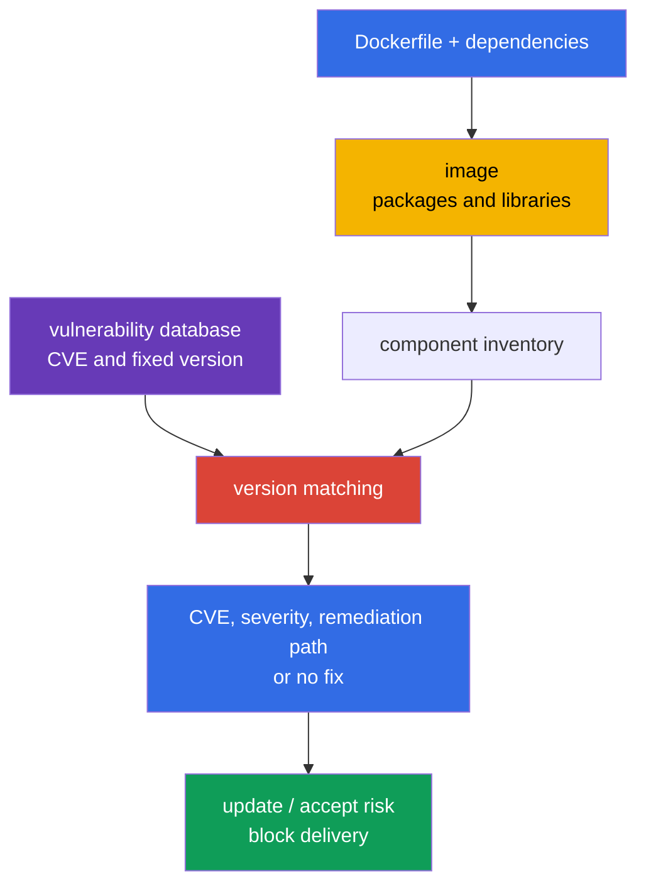
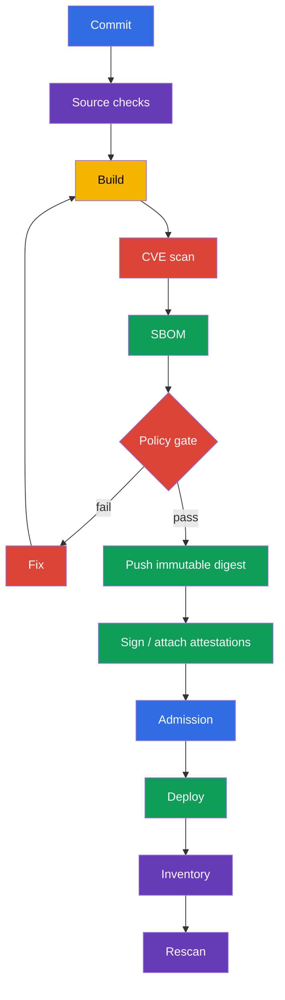

[Русская версия](ru.md) · [Versión en español](es.md) · [Version française](fr.md) · [Deutsche Version](de.md) · [ქართული ვერსია](ge.md) · [繁體中文版](tw.md) · [日本語版](jp.md)

# Chapter 28. Scanning images for known vulnerabilities

> **The problem.** Even a minimal and correctly configured image can contain a library
> or OS package for which an exploitable CVE was published yesterday. Without matching an
> artifact's contents against an up-to-date vulnerability database, that digest passes delivery
> and remains in production even though a fixed version already exists or urgent triage is needed.
> Regular scans tied to a digest and a CI gate for unacceptable findings are required.

> **What comes next.** In [Chapter 27](../27/README.md), we found unsafe Dockerfile and
> Kubernetes-manifest settings before they ran. But a linter does not know that a library in a
> correctly written image received a CVE yesterday. Now we check the image contents against known
> vulnerability databases, choose a fixed artifact, and do not allow it through delivery. This is
> part of the **Supply Chain Security (20%)** CKS domain.

> **What you need from CKA.** Image, tag, digest, pull policy, and containers in a Pod are covered
> in [CKA Chapter 23](../../../cka/course/23/README.md). We do not repeat them here; instead, we
> use an image as a deliverable artifact: inventory it, scan it, fix it, and verify the result.

> 🧠 A scanner matches known CVEs to discovered component/version pairs, but it does not prove exploitability, the absence of unknown vulnerabilities, or workload security without context.

## 28.1. CVEs in images: what a scanner actually shows

A **CVE** is a public identifier for a known vulnerability. In a container image, it normally
exists not "in Docker" but in one of the components: an OS package (`openssl`, `curl`, `glibc`),
a language dependency, or the application itself. The scanner matches a component's name and
version from the image against its vulnerability database and reports discovered CVEs, severity,
the installed version, and, if known, the fixed version.



A vulnerability becomes a risk not only because of high severity. Triage checks:

- whether vulnerable code is reachable by this workload and the dangerous feature is enabled;
- whether an exploit exists and whether it requires authentication or local access;
- whether the process runs with privileges, whether there is network exposure, and which
  boundaries reduce the consequences;
- whether a fixed version exists and whether the CVE is a false match for this particular build;
- who owns the image, where it runs, and which immutable digest represents it.

Severity is a priority for a queue, not proof of exploitation. The reverse is also true:
`LOW` for an exposed component should not be automatically ignored. CVSS, workload context,
the availability of a fix, and a remediation deadline are recorded in the vulnerability-management
process.

For production triage, add two external signals to this analysis. [CISA Known Exploited
Vulnerabilities (KEV)](https://www.cisa.gov/known-exploited-vulnerabilities-catalog) is an
authoritative catalog of CVEs confirmed as exploited *in the wild*; it is an important input to
prioritization. [FIRST EPSS](https://www.first.org/epss/) estimates the probability that a CVE
will be exploited in the next 30 days, but is not an independent risk score. Confirmed exploitation
or presence in KEV should sharply raise priority. Use EPSS together with vulnerable-code
reachability, impact, and environment context - for example, exposure, privileges, and
compensating controls. Neither KEV nor EPSS is an exam gate and neither replaces analysis of a
specific workload's reachability or exposure.

> 🔬 Severity depends on the source of vulnerability intelligence: for OS packages, a vendor advisory and backported fixes can be more accurate than a general NVD assessment.

### Why Trivy severity can differ from NVD

For OS packages, Trivy prefers the distribution vendor's advisory: a distribution can backport a
fix without changing the "upstream" version as NVD expects. Therefore, `NVD HIGH` and a lower vendor
severity (or a vendor assessment that already considers the issue resolved) do not necessarily
contradict each other. In the JSON result,
look at `SeveritySource` and `VendorSeverity` together with `InstalledVersion` and
`FixedVersion`, and if there is a dispute, check the advisory for that package source. For
packages installed outside the distribution's standard repositories, matching can be incomplete:
the absence of a finding does not prove the absence of a vulnerability.

An image must be scanned regularly even if its Dockerfile has not changed: CVE databases are
updated, and yesterday's "clean" digest may receive a new entry today. Minimum control points:
after build, before push or promotion, before deploy, and on a schedule for already published
images. The result must be tied to a digest or runtime-resolved identifier, the vulnerability
database identifier or version, and the scan time; otherwise, it is impossible to prove that the
delivered bytes were checked against current data.

> 🎯 Be able to run `trivy image`, filter by severity, and use `--exit-code 1` when a finding must stop a pipeline.

## 28.2. `trivy image`: CVEs, severity, CI flags, and cluster inventory

[Trivy](https://trivy.dev/) reads an image directly from a registry, a local Docker/containerd
store, or an archive. The first run downloads the vulnerability database; CI usually caches it
but refreshes it on a schedule. A basic run:

```bash
# Full human-readable report for analysis.
trivy image registry.example.com/payments/api:1.4.2

# CVE gate: only the vulnerability scanner and priority findings with a published fix.
trivy image \
  --scanners vuln \
  --severity HIGH,CRITICAL \
  --ignore-unfixed \
  --exit-code 1 \
  registry.example.com/payments/api:1.4.2
```

`--scanners vuln` makes this gate specifically a CVE/vulnerability control: current `trivy image`
also enables the secret scanner by default, whose HIGH/CRITICAL findings could otherwise also
return `--exit-code 1`. Keep secret scanning as a separate explicit control with safe output
storage. `--severity HIGH,CRITICAL` filters the vulnerability report by severity.
`--ignore-unfixed` excludes CVEs for which the database does not know a fixed version; this does
not mean the risk has gone away. Track them separately: update the base image, apply a vendor
backport, compensate with controls, or accept a time-limited exception. `--exit-code 1` makes
Trivy return a nonzero code for a vulnerability finding that matches the filters; without it, a
pipeline can finish successfully while only printing CVEs. Do not use this flag for an exploratory
report if a nonzero exit code must not stop the job.

A useful format for artifact CI is JSON. It can store the result, build a dashboard, and compare
the scan before and after an update:

```bash
trivy image \
  --scanners vuln \
  --severity HIGH,CRITICAL \
  --format json \
  --output trivy-api-1.4.2.json \
  registry.example.com/payments/api:1.4.2

jq -r '.Results[]?.Vulnerabilities[]? |
  select(.Severity == "CRITICAL") |
  [.VulnerabilityID, .PkgName, .InstalledVersion, .FixedVersion, .Title] | @tsv' \
  trivy-api-1.4.2.json
```

### Find the image with the largest number of `CRITICAL` findings in a namespace

> 🎯 **CKS Core.** On the exam, you receive a list of Pods; for each one, extract the image of
> regular containers and print one line: `Pod | image | CRITICAL: N`. Trivy returns JSON only to
> internal `jq`, so tables, summaries, and auxiliary output do not clutter the terminal.

```bash
namespace=payments
set -euo pipefail

for pod in $(kubectl get pods -n "$namespace" -o name); do
  for image in $(kubectl get -n "$namespace" "$pod" \
    -o jsonpath='{.spec.containers[*].image}'); do
    critical="$(
      trivy image --scanners vuln --quiet --format json --severity CRITICAL "$image" \
        | jq -er '[.Results[]?.Vulnerabilities[]?] | length'
    )"
    printf '%s | %s | CRITICAL: %s\n' "$pod" "$image" "$critical"
  done
done
```

> 🏭 **Production.** Full platform automation inventories actually running regular, init, and
> ephemeral containers, matches runtime `imageID` to a canonical digest, and records the owner
> workload. In Kubernetes v1.36, also account separately for `spec.volumes[].image.reference`:
> a container-image-compatible volume follows the same CVE/SBOM flow, while another OCI artifact
> needs an appropriate policy. This is useful in operations but is not required to reproduce
> manually in an exam task.

> 🎯 Tie an SBOM to the same digest and scan the saved contents: a CVE is fixed by rebuilding the artifact, not by editing the SBOM.

## 28.3. Trivy and SBOM: CycloneDX, SPDX, and scanning already saved contents

An SBOM from [Chapter 25](../25/README.md) describes an artifact's components. CycloneDX, SPDX,
and `trivy sbom` are useful additions to a production toolchain, but are not exam-guaranteed CLI
tasks: before using them, check the available tool and expected format. Trivy can create an SBOM
while analyzing an image; this is convenient when its contents must be passed to another process
or checked again after a CVE database update without registry access.

```bash
image=registry.example.com/payments/api:1.4.2

# For a single-platform image, specify the platform that is actually delivered.
platform=linux/amd64
# CycloneDX: a common format for SCA and security platforms.
trivy image --platform "$platform" --format cyclonedx --output api-amd64.cdx.json "$image"

# SPDX JSON: a format useful for interoperability and compliance.
trivy image --platform "$platform" --format spdx-json --output api-amd64.spdx.json "$image"

# Rescan an SBOM, not an image. JSON is machine-readable output for CI.
trivy sbom --format json --output api-amd64-sbom-vulnerabilities.json api-amd64.spdx.json
```

An SBOM file is a security artifact: it reveals the components and versions in use. Store it next
to the release artifact with access control, and tie it to the **platform manifest** digest. It
does not replace an image scan: an SBOM can be created from another build, omit OS packages
because of the selected generator, or become outdated. The practice is to retain both the SBOM
and scan result, and check their provenance before promotion.

One OCI index digest does not mean one filesystem. By default, Trivy downloads `linux/amd64`
without `--platform`; for a multi-platform image, list the platforms actually delivered, scan
them, and create an SBOM for each (or scan its platform-manifest digest):

```bash
for platform in linux/amd64 linux/arm64; do
  suffix="${platform//\//-}"
  trivy image --scanners vuln --platform "$platform" --severity HIGH,CRITICAL "$image"
  trivy image --platform "$platform" --format spdx-json --output "api-${suffix}.spdx.json" "$image"
done
```

In a heterogeneous cluster, match node architecture and runtime workload to the platform-manifest
digest; scanning the root index for only one default platform is not evidence for the others.

For an SBOM gate, apply the same thresholds but clearly separate audit from blocking:

```bash
trivy sbom \
  --severity HIGH,CRITICAL \
  --ignore-unfixed \
  --exit-code 1 \
  --format json \
  --output api-amd64-sbom-gate.json \
  api-amd64.spdx.json
```

If Trivy shows a CVE for a package, first check `InstalledVersion` and `FixedVersion` in the
result, then the matching entry in the SBOM. Do not edit an SBOM to "remove a CVE": fix the
source dependency, base image, or built artifact, then generate the SBOM again.

**VEX** supplements a finding; it does not remove a CVE from the original scan. For every
decision, retain a reviewable status (`affected`, `not_affected`, `fixed`, or
`under_investigation`), the source and provenance of the statement, its owner, and a date for
repeat review or expiry. After expiry, reconsider the exception; VEX without evidence and a
deadline is not grounds to hide a CVE.

> 🔬 `trivy fs` and `trivy config` provide shift-left feedback for a repository and IaC, but they do not replace scanning the final image.

## 28.4. `trivy fs` and `trivy config`: before the build and beyond the image

`trivy image` sees what has already entered the image. Less expensive feedback comes earlier in
the repository:

- `trivy fs` scans a filesystem checkout: dependencies, secrets, and, with scanners enabled,
  misconfiguration;
- `trivy config` analyzes IaC and configuration files: Kubernetes YAML, Helm charts, Terraform,
  Dockerfiles, and other supported types.

```bash
# Check the repository before docker build. Do not send output containing discovered secrets to a public log.
trivy fs --scanners vuln,secret,misconfig --severity HIGH,CRITICAL .

# Check only configuration/IaC. The path can be a directory or a file.
trivy config --severity HIGH,CRITICAL k8s/
trivy config --severity HIGH,CRITICAL Dockerfile
```

These checks answer different questions. A vulnerable dependency in a lockfile will be visible
through `fs`, while `privileged: true`, an open security group, or a Dockerfile with a risky
instruction will be visible through `config`. But the runtime image is still scanned: a build can
add OS packages or bring in a base image that are not present in the repository.

Typical mistakes:

| Mistake                                   | Why it is bad                                       | What to do                                         |
| ----------------------------------------- | --------------------------------------------------- | -------------------------------------------------- |
| Scan only the Dockerfile                  | CVEs live in the base image and transitive packages | Add `trivy image` after build                     |
| Scan only the image                       | An unsafe manifest can enter the cluster            | Add `trivy config` and Chapter 27 linters         |
| Pass `--ignore-unfixed` without tracking | A backlog of known risks becomes invisible          | Maintain a separate report and SLA for no-fix CVEs |
| Print secret findings in a shared CI log  | A secret can become available to log readers        | Mask output, revoke the disclosed secret           |

> 🔬 Grype and Clair are alternative scanners; the choice of tool does not change the requirement to scan a digest, retain evidence, and verify remediation again.

## 28.5. Grype, Clair, and scanning at admission

Trivy is not the only scanner. Tool selection does not eliminate the requirements: an understood
CVE database source, repeatable scanning by digest, severity policy, evidence, and a remediation
process.

| Tool            | Model                                                    | When it is useful                                            | Limitation                                                      |
| --------------- | -------------------------------------------------------- | ------------------------------------------------------------ | --------------------------------------------------------------- |
| **Trivy** | CLI and integrations for image, SBOM, fs, config, secret | one tool for a developer workstation and CI                  | the database must be refreshed and policy configured separately |
| **Grype** | CLI scanner from Anchore, works well with image and SBOM | an independent second check or an existing Anchore ecosystem | SBOM and policy still have to be tied to a digest               |
| **Clair** | service scanner for registries/images, API-oriented      | centralized registry scanning and a large platform           | requires a backend, indexer updates, and service operations     |

Example of a secondary Grype check:

```bash
# By image.
grype registry.example.com/payments/api:1.4.2

# By an SBOM created earlier. Choose an SBOM format compatible with the toolchain.
grype sbom:api.spdx.json
```

**Trivy Operator** automatically discovers images used by existing workloads and creates a
`VulnerabilityReport` for their controller revision. This is continuous post-admission detection:
a new or updated workload receives a report, but the Operator itself is not admission enforcement.
Do not synchronously download and scan every image inside an admission webhook: this makes the API
server dependent on the registry, database, and long-running scan, creates timeouts, and can block
the cluster when the scanner is unavailable. Enforcement needs a separate admission policy that
checks a previously created scan/signature/attestation.

A reliable pattern is this: CI scans a **specific digest**, stores a signed attestation or result,
the admission policy permits only a digest with current successful evidence, and a periodic scanner
continues looking for new CVEs in already deployed images. Registry allowlists and signature
verification are covered in [Chapter 26](../26/README.md); they complement, but do not replace,
a vulnerability scan.

> 🏭 Place gates along the delivery path: source checks before build, scan/SBOM/signature by digest before promotion, admission for evidence, and scheduled rescanning after deploy.

## 28.6. CI/CD and cluster: where to place gates

Scanning is useful only when its result affects delivery and does not bypass the ordinary release
path. An example sequence:



An example GitHub Actions-style shell step that stops the job for fixable HIGH or CRITICAL CVEs:

```bash
set -euo pipefail
image="registry.example.com/payments/api:${GIT_SHA}"

# The build/push step must return the digest of the created manifest directly. For example, Buildx
# writes it to a metadata file; do not resolve an already published tag with a separate crane request:
# another writer can reassign the tag in the interval between push and lookup.
docker buildx build --push --metadata-file build-metadata.json -t "$image" .
digest="$(jq -er '."containerimage.digest"' build-metadata.json)"
immutable_image="${image}@${digest}"

scan_started_at="$(date -u +%FT%TZ)"
trivy image --download-db-only 2>&1 | tee trivy-db-update.log
printf '%s\n' "$scan_started_at" > trivy-scan-started-at.txt
trivy image --scanners vuln --severity HIGH,CRITICAL --ignore-unfixed \
  --format json --output trivy.json "$immutable_image"
trivy image --scanners vuln --severity HIGH,CRITICAL --ignore-unfixed \
  --exit-code 1 "$immutable_image"
trivy image --format cyclonedx --output sbom.cdx.json "$immutable_image"
```

The digest must come directly from the build/push result (for example, Buildx metadata or
equivalent CI output), not from a separate tag lookup after push: this prevents TOCTOU during
parallel tag reassignment. Then scan, SBOM, signature, and deploy use only the saved digest.
Store `trivy-db-update.log`, the scan timestamp, and the database identifier or version from the
log together with `trivy.json`: this is evidence that the database is fresh, not merely evidence
of a successful job. If a gate is temporarily weakened, the exception must be narrow: CVE ID,
package, rationale, owner, expiration date, and link to a ticket. A global ignore of all
`CRITICAL` findings or an endless ignorefile destroys the purpose of a gate.

Two independent controls are useful in a cluster:

1. **Inventory and continuous scanning.** Obtain runtime identifiers from every Pod status, the
   canonical digest after matching, namespace, owner, and report, plus
   `spec.volumes[].image.reference` separately. For a multi-platform artifact, match node
   architecture and workload to the platform manifest; Trivy Operator creates post-admission
   reports and discovers a new CVE without a new deployment.
2. **Admission.** Deny unverified registries/digests or the absence of signature/scan evidence.
   Policy must have predictable exceptions and audit mode before enforcement.

Do not treat `imagePullPolicy: Always` as a security control. It does not check CVEs, does not
pin an artifact, and can pull a different digest beneath a mutable tag. A deployment must refer to
a verified digest.

> 🎯 Remediation is proven only after a new build by digest, a repeat scan without the target CVE, a successful rollout, and verification of the runtime image ID.

## 28.7. Inventory, remediation, and verifying the fix

Below is a practical cycle for an incident or regular report. Its purpose is not just to find a
CVE, but to make sure that a vulnerable artifact no longer runs in the cluster.

> 🏭 Automate inventory and scheduled rescans of deployed images: a new CVE can appear for an unchanged digest after release.

1. **Inventory.** Export runtime `imageID` from all Pod statuses, match it to a canonical digest,
   and group it by namespace and owner. Do not forget init and ephemeral containers, DaemonSets,
   and Jobs; separately export `spec.volumes[].image.reference` and apply the CVE/SBOM policy to a
   container-image-compatible image volume.
2. **Prioritize.** Run a vulnerability scan by platform-manifest digest, select `CRITICAL`, study
   the package, installed/fixed versions, exposure, and service owner.
3. **Fix the source.** Update the base image or dependency to a version with a fix. If upstream
   has not released a fix yet, create a time-limited exception and reduce exposure, but do not
   declare the CVE remediated.
4. **Rebuild.** A new tag alone is not enough: the image build and SBOM must refer to the new
   digest.
5. **Verify before rollout.** Repeat image and SBOM scans with the same severity/policy, and
   compare the old and new reports.
6. **Verify after rollout.** Make sure the workload uses the new digest, rollout succeeds, the
   service passes smoke/functional tests, and old replicas have terminated.

An example without guessing a tag: verify a Deployment, wait for rollout, and print the digests
of running Pods.

```bash
namespace=payments
deployment=api
# This compact example is intentionally amd64-only. A heterogeneous deployment must, before rollout,
# perform scan/SBOM for every platform actually used (see §28.3).
platform=linux/amd64
required_arch="${platform#linux/}"
deployment_arch="$(kubectl -n "$namespace" get deployment "$deployment" \
  -o jsonpath='{.spec.template.spec.nodeSelector.kubernetes\.io/arch}')"
test "$deployment_arch" = "$required_arch" || {
  printf 'Deployment %s must set nodeSelector kubernetes.io/arch=%s; got %s\n' \
    "$deployment" "$required_arch" "${deployment_arch:-<unset>}" >&2
  exit 1
}

# Contract: IMAGE_DIGEST is a canonical OCI digest in the form sha256:<64-hex>,
# for example the containerimage.digest value returned by Buildx after push.
image_digest="${IMAGE_DIGEST:?set verified image digest (sha256:<64-hex>)}"
new_image="registry.example.com/payments/api:1.4.3@${image_digest}"

kubectl -n "$namespace" set image deployment/"$deployment" api="$new_image"
kubectl -n "$namespace" rollout status deployment/"$deployment" --timeout=5m

kubectl -n "$namespace" get pods -l app=api -o json | jq -r '
  .items[] as $pod |
  ($pod.status.initContainerStatuses[]?, $pod.status.containerStatuses[]?,
   $pod.status.ephemeralContainerStatuses[]?) |
  [$pod.metadata.name, .name, .imageID, .ready] | @tsv
'

# Apply the same gate flags and platform to the replacement, not only the old image.
trivy image --scanners vuln --platform "$platform" --severity HIGH,CRITICAL --ignore-unfixed \
  --exit-code 1 "$new_image"
trivy image --platform "$platform" --format spdx-json \
  --output api-1.4.3-amd64.spdx.json "$new_image"
trivy sbom --severity HIGH,CRITICAL --ignore-unfixed --exit-code 1 \
  --format json --output api-1.4.3-amd64-sbom-scan.json api-1.4.3-amd64.spdx.json
```

A remediation test has at least three parts: the repeat scan no longer contains the target CVE or
shows the expected fixed version; `rollout status` succeeds; and the statuses of all new Pods in
the selected workload show the runtime `imageID` matched to the verified platform-manifest digest.
For a multi-platform artifact, the platform scan/SBOM must match the architecture of the node
where the workload runs. Add an application smoke test, such as `curl` to a health endpoint from a
test job. Otherwise, it is possible to remediate the CVE at the cost of broken TLS, a failed
migration, or an incompatible ABI.

> 🏭 A measurable vulnerability-management program ties together a digest, scan evidence, remediation SLA, VEX/exceptions with expiry, and continuous detection in the cluster.

## 28.8. How this is applied in production

- **Scan a platform-manifest digest, not only a tag or OCI index.** A tag can be overwritten, and
  an index can point to different filesystems by architecture; tie the SBOM, scan result,
  signature, and deployment to a platform-specific immutable digest.
- **Separate prevention from detection.** CI/admission reduces the chance of a new vulnerable
  deployment, while inventory and scheduled rescans find new CVEs in old images and image volumes.
- **Make policy measurable.** Explicitly define severity, a rule for unfixed CVEs, remediation
  SLA, and exceptions with expiration. For VEX, retain status, provenance, and review date. A
  policy with no owner or deadline becomes a collection of ignores.
- **Update base images regularly.** Periodically rebuilding dependent applications is necessary
  even when application code has not changed.
- **Do not limit yourself to a scanner.** A minimal image, non-root, read-only filesystem,
  signature, registry allowlist, admission policy, and runtime detection reduce damage if a CVE is
  nevertheless exploited.

## 28.9. Mini-glossary

- **CVE** - an identifier for a publicly known vulnerability.
- **severity** - a classification of finding seriousness (`LOW`, `MEDIUM`, `HIGH`, `CRITICAL`).
- **fixed version** - a component version in which the vendor fixed a CVE.
- **SBOM** - a list of software-artifact components and their versions.
- **CycloneDX / SPDX** - common SBOM formats.
- **VEX** - a statement about CVE applicability to an artifact with reviewable status and provenance.
- **Trivy** - a scanner for images, SBOMs, filesystem, secrets, and configuration/IaC.
- **Grype** - a scanner for images and SBOMs from the Anchore ecosystem.
- **Clair** - a service scanner and vulnerability indexer for container images.
- **admission scan** - a control at workload creation that uses scan results or associated
  attestations.
- **remediation** - risk removal: updating an artifact, dependency, or base image and confirming
  the result.

## 28.10. Chapter summary

- A CVE belongs to a specific component/version; severity helps prioritize but does not replace
  exploitation context and ownership.
- A `trivy image` CVE gate must explicitly use `--scanners vuln`; `--severity HIGH,CRITICAL`,
  `--ignore-unfixed`, and `--exit-code 1` make it a manageable CI control, while secret scanning
  remains a separate policy.
- Namespace inventory must include statuses of regular, init, and ephemeral containers as well as
  `spec.volumes[].image.reference`; for remediation, match runtime `imageID` or a volume reference
  to a verified platform-manifest digest rather than rely on a tag.
- Trivy creates SBOMs in CycloneDX (`--format cyclonedx`) and SPDX JSON
  (`--format spdx-json`); for a multi-platform image, create a scan and SBOM for every actually
  delivered platform. `trivy sbom` rescans saved contents as a production extension, not an
  exam-guaranteed CLI task.
- `trivy fs` and `trivy config` find problems before image build but do not replace scanning the
  built image.
- Grype and Clair are acceptable alternatives; admission must not run a heavy scan synchronously,
  and should instead verify pre-created evidence by digest.
- A fix is complete only after a repeat scan, successful rollout, and digest verification for the
  actual Pods.

## 28.11. How it helps: on the exam and in real work

**On the exam.** Practice analyzing an image scan, severity, retaining a report, inventorying
containers, and verifying a fix again, but do not base your strategy on guaranteed availability of
Trivy or a specific command. CycloneDX/SPDX and `trivy sbom` are production extensions, not
exam-guaranteed CLI tasks. It is important not to confuse an image scan with `trivy fs` and
`trivy config`.

**In real work.** A scanner turns a CVE feed into a manageable process only together with
inventory, digest provenance, CI policy, exception SLA, admission control, and regular rescanning.
The real goal is not "zero lines in a report," but quickly discovering a vulnerable artifact,
safely replacing it, and proving that production uses the fixed digest.

## 28.12. Self-check questions

<details>
<summary>1. Why does a successful scan yesterday not prove the absence of CVEs today?</summary>

A vulnerability database is constantly updated, so yesterday's clean digest can receive a new CVE entry today without a Dockerfile change. A scan is a snapshot of contents and database at the time of checking. Therefore, images are rescanned regularly after build, before promotion/deploy, and on a schedule for already published digests.

</details>

<details>
<summary>2. What do the `--severity HIGH,CRITICAL`, `--ignore-unfixed`, and `--exit-code 1` flags change?</summary>

`--scanners vuln` restricts this gate to CVE/vulnerability findings; secret scanning is a separate
control. `--severity HIGH,CRITICAL` retains only vulnerability findings at these levels in the
report. `--ignore-unfixed` excludes CVEs without a known fixed version but does not remove their
risk: they are handled in a separate process. `--exit-code 1` makes a matching finding cause a
nonzero exit code and lets a scan become a CI gate.

</details>

<details>
<summary>3. How do you find the image with the largest number of `CRITICAL` findings in one namespace, and why must you account for the status of regular, init, and ephemeral containers?</summary>

First, export `.status.initContainerStatuses`, `.status.containerStatuses`, and `.status.ephemeralContainerStatuses` for all Pods, obtain the actual `imageID`, and match it to a canonical registry digest; inventory `spec.volumes[].image.reference` separately. Then, for every confirmed container-image reference, run `trivy image --scanners vuln --quiet --format json --severity CRITICAL`, count findings with `jq`, and sort the counts. Every container type and image volume can deliver a separate OCI artifact, so excluding any path leaves a blind spot.

</details>

<details>
<summary>4. What is the difference between `trivy image`, `trivy fs`, and `trivy config`?</summary>

`trivy image` analyzes a built image, including the base image and packages included in the
artifact. `trivy fs` scans a checkout filesystem for dependencies, secrets, and, with scanners
enabled, misconfiguration. `trivy config` checks IaC and configuration, for example Kubernetes
YAML, Helm, Terraform, and Dockerfiles; none of the first two replaces the others.

</details>

<details>
<summary>5. How do you create CycloneDX and SPDX JSON SBOMs with Trivy, and when is `trivy sbom` needed?</summary>

For a single-platform image, use `trivy image --platform linux/amd64 --format cyclonedx --output api-amd64.cdx.json "$image"` and `trivy image --platform linux/amd64 --format spdx-json --output api-amd64.spdx.json "$image"`. For an OCI index, repeat this for every platform actually delivered. `trivy sbom` rescans an already saved SBOM, for example after a CVE database update or without registry access. Tie the SBOM to a platform-manifest digest and do not edit it to remove CVEs: fix the dependency/base image and generate it again.

</details>

<details>
<summary>6. Why should an admission webhook not scan an image synchronously for every API request?</summary>

Such a webhook makes the API server dependent on a registry, CVE database, and a long-running
scan. Scanner unavailability or delay can cause timeouts or block the cluster. For enforcement,
admission should instead check a pre-created scan/signature/attestation for a specific digest,
while a continuous scanner works after admission.

</details>

<details>
<summary>7. Which three checks prove that CVE remediation is actually complete?</summary>

A repeat scan of the replacement image must not contain the target CVE or must show the expected
fixed version. `kubectl rollout status` must confirm a successful rollout. Finally, the status of
all new Pods for the selected workload must show a runtime `imageID` matched to the verified
platform-manifest digest; for a multi-platform image, scan/SBOM must cover those Pods' architecture.
The chapter also recommends an application smoke test.

</details>

<details>
<summary>8. **Flashback (Chapter 29).** Question 1 in this chapter already says that a successful scan yesterday does not prove the absence of CVEs today - that is, vulnerability scanning is a snapshot at the time of checking, not continuous monitoring. Falco from Chapter 29 works by a different principle (runtime behavior detection). What specific class of attacks will Falco catch that even the freshest `trivy image` scan will not, and why?</summary>

Falco can detect a process's runtime action: for example, an interactive shell in a container,
opening a sensitive file, starting a package manager, or attempting to open `/dev/mem`. Even a
fresh `trivy image` sees known vulnerabilities and the composition of bytes, but does not know what
a process actually did after startup. Thus, a scan reduces the probability of delivering a known
risk, while Falco observes use of RCE or other post-compromise behavior.

</details>

## Practice

The following practice combines image minimization, static analysis, Trivy, SBOM, signing, and an
artifact allowlist. In it, the scan report, SBOM, and verification of the fixed workload become
verifiable artifacts.

🧪 Lab 111 (Supply chain: Trivy, SBOM, signing): [tasks/cks/labs/111](../../labs/111/README.MD)
🌐 Additional interactive practice (killer.sh/killercoda, external resource): [image-vulnerability-scanning-trivy](https://killercoda.com/killer-shell-cks/scenario/image-vulnerability-scanning-trivy)

Useful documentation: [Trivy image](https://trivy.dev/latest/docs/target/container_image/)
· [Trivy SBOM](https://trivy.dev/latest/docs/target/sbom/) · [Trivy databases](https://trivy.dev/latest/docs/configuration/db/)
· [Trivy VEX](https://trivy.dev/latest/docs/supply-chain/vex/) · [Trivy Operator reports](https://aquasecurity.github.io/trivy-operator/latest/docs/vulnerability-scanning/)

## Mixed checkpoint: Supply Chain Security is complete

Before moving to Monitoring, Logging & Runtime Security, spend 15-20 minutes without hints to
check that the Supply Chain Security domain (Chapters 24-28) has stuck:

1. Build an image on `distroless` instead of a full-featured base and explain which specific
   post-exploitation technique this removes from an attacker with RCE (Chapter 24).
2. Generate an SBOM (SPDX or CycloneDX) with `syft` or `trivy image --format spdx-json` /
   `trivy image --format cyclonedx`, and find one specific package with its version in it (Chapter 25).
3. Sign a test image with `cosign` and explain why `cosign verify` in CI does not prevent direct
   `kubectl apply` of an unsigned image without admission control (Chapter 26).
4. **Mixed task.** Take admission policy (Chapter 20, the Minimize Microservice Vulnerabilities
   domain) and signature verification (Chapter 26, this domain): describe how admission policy
   becomes the enforcement point for checking an image signature, and why without it a signature
   is merely metadata that nobody is obliged to check.
5. Run `trivy image` on a test image with `--severity HIGH,CRITICAL`, and explain why a
   successful scan yesterday does not prove the absence of CVEs today (Chapter 28).

If task 4 was difficult, return to Chapters 20 and 26 together.

---

[Table of contents](../README.md) · [Chapter 27](../27/README.md) · [Chapter 29](../29/README.md)
