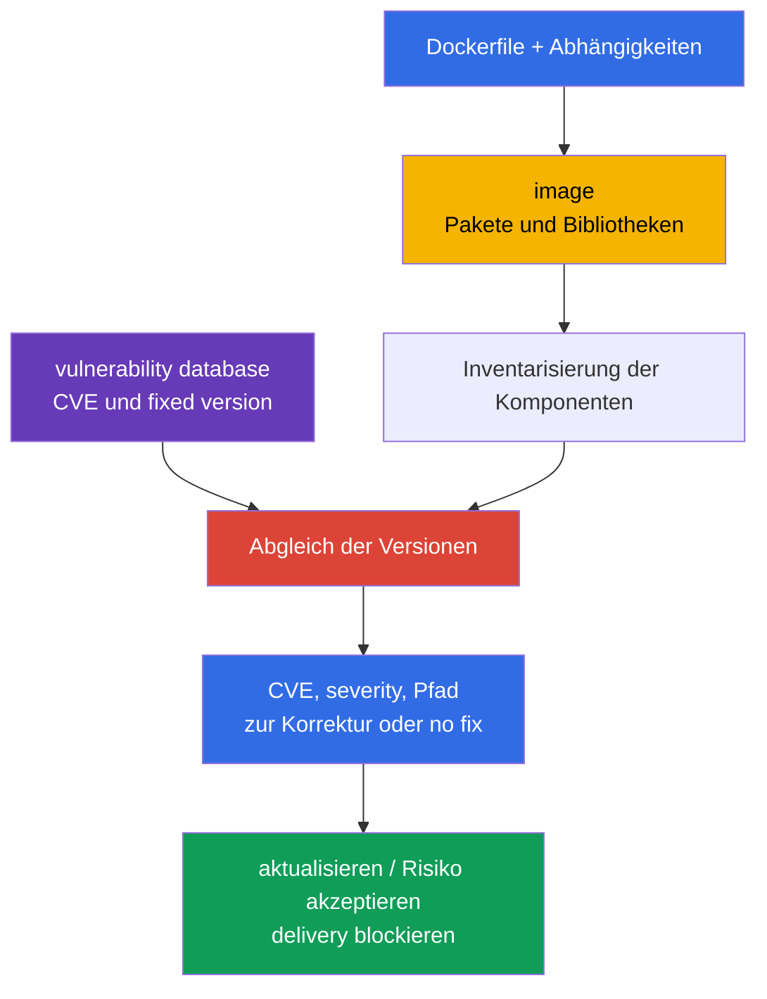
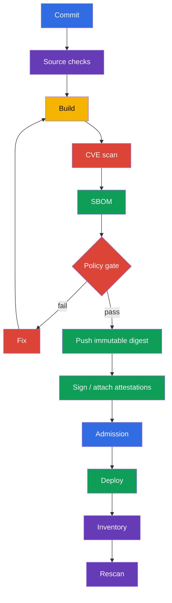

[Русская версия](ru.md) · [Eng version](README.md) · [Versión en español](es.md) · [Version française](fr.md) · [ქართული ვერსია](ge.md) · [繁體中文版](tw.md) · [日本語版](jp.md)

# Kapitel 28. Scannen von Images auf bekannte Schwachstellen

> **Problem.** Selbst ein minimales und korrekt konfiguriertes image kann eine Bibliothek
> oder ein OS-Paket enthalten, für das gestern eine exploitable CVE veröffentlicht wurde. Ohne
> Abgleich der Zusammensetzung des artifact mit einer aktuellen vulnerability database durchläuft
> ein solcher digest die delivery und bleibt in production, obwohl bereits eine fixed version
> existiert oder ein dringender triage nötig ist. Es braucht regelmäßige scans, die an den digest
> gebunden sind, und ein CI gate für nicht akzeptable findings.

> **Was folgt.** In [Kapitel 27](../27/de.md) haben wir unsichere Einstellungen von Dockerfile
> und Kubernetes-Manifesten vor dem Start gefunden. Aber ein Linter weiß nicht, dass eine
> Bibliothek in einem korrekt geschriebenen image gestern eine CVE erhalten hat. Jetzt prüfen wir
> die Zusammensetzung des image gegen Datenbanken bekannter Schwachstellen, wählen ein
> korrigiertes artifact und lassen es nicht ungeprüft in die delivery. Dies gehört zur Domain
> **Supply Chain Security (20 %)** von CKS.

> **Was Sie aus CKA wissen müssen.** Image, Tag, digest, pull policy und Container in einem Pod
> werden in [CKA-Kapitel 23](../../../cka/course/23/de.md) behandelt. Hier wiederholen wir das
> nicht, sondern verwenden das image als geliefertes artifact: inventarisieren, scannen,
> korrigieren und das Ergebnis prüfen.

> 🧠 Ein Scanner gleicht bekannte CVE mit gefundenen component/version ab, beweist aber weder Exploitation noch das Fehlen unbekannter Schwachstellen noch die Sicherheit eines Workload ohne Kontext.

## 28.1. CVE in Images: was der Scanner tatsächlich zeigt

**CVE** ist ein öffentlicher Identifier einer bekannten Schwachstelle. In einem Container-Image
befindet sie sich gewöhnlich nicht „in Docker“, sondern in einer der Komponenten: einem
OS-Paket (`openssl`, `curl`, `glibc`), einer language dependency oder der Anwendung selbst. Der
Scanner gleicht Name und Version der Komponente aus dem image mit seiner vulnerability database
ab und meldet die gefundenen CVE, severity, die installierte Version und, falls bekannt, die
fixed version.



Eine Schwachstelle wird nicht allein wegen hoher severity zum Risiko. Beim triage prüft man:

- ob der verwundbare Code für diesen Workload erreichbar ist und die gefährliche Funktion
  aktiviert ist;
- ob ein exploit existiert und ob dafür Authentifizierung oder lokaler Zugriff nötig ist;
- ob der Prozess mit Privilegien läuft, ob es network exposure gibt und welche Grenzen die
  Folgen abschwächen;
- ob eine fixed version existiert und ob die CVE nicht ein false match für diesen konkreten
  Build ist;
- wessen image es ist, wo es läuft und mit welchem immutable digest es repräsentiert wird.

Severity ist eine Priorität für die Warteschlange, kein Beweis für Exploitation. Auch das
Umgekehrte gilt: `LOW` bei einer exposed component sollte nicht automatisch ignoriert werden.
CVSS, Workload-Kontext, das Vorhandensein eines Fix und die Frist zur Behebung werden im
vulnerability-management Prozess festgehalten.

Für production-triage ergänzen Sie diese Analyse um zwei externe Signale. Der [CISA Known
Exploited Vulnerabilities (KEV)](https://www.cisa.gov/known-exploited-vulnerabilities-catalog)
ist ein maßgeblicher Katalog von CVE mit bestätigter Exploitation *in the wild*; er ist ein
wichtiger Input für die Priorisierung. [FIRST EPSS](https://www.first.org/epss/) schätzt die
Wahrscheinlichkeit einer Exploitation der CVE in den nächsten 30 Tagen, ist aber kein
eigenständiger risk score. Bestätigte Exploitation oder Präsenz in KEV sollte die Priorität
deutlich erhöhen. Verwenden Sie EPSS zusammen mit der Erreichbarkeit des verwundbaren Codes,
dem impact und dem Kontext der Umgebung - etwa exposure, privileges und kompensierenden
Kontrollen. Weder KEV noch EPSS sind ein Prüfungs-gate und ersetzen nicht die Analyse der
Erreichbarkeit oder exposure eines konkreten Workload.

> 🔬 Die severity hängt von der Quelle der vulnerability intelligence ab: Für OS-Pakete können Vendor-Advisory und Backport-Korrekturen präziser sein als die allgemeine NVD-Bewertung.

### Warum die Trivy-severity von NVD abweichen kann

Für OS-Pakete bevorzugt Trivy das advisory des Distribution-Anbieters: Die Distribution kann
eine Korrektur backporten, ohne die „upstream“-Version so zu ändern, wie NVD es erwartet. Daher
widersprechen sich `NVD HIGH` und eine niedrigere (oder bereits geschlossene) vendor-Bewertung
nicht zwangsläufig. Im JSON-Ergebnis sehen Sie `SeveritySource` und `VendorSeverity` zusammen
mit `InstalledVersion` und `FixedVersion`, und bei Unklarheiten prüfen Sie das advisory genau
dieser package source. Für Pakete, die außerhalb der regulären Repositories der Distribution
installiert wurden, kann das matching unvollständig sein: Das Fehlen eines finding beweist nicht
das Fehlen einer Schwachstelle.

Das image sollte regelmäßig gescannt werden, auch wenn sich das Dockerfile nicht geändert hat:
CVE-Datenbanken werden aktualisiert, und ein gestern „sauberer“ digest kann heute einen neuen
Eintrag erhalten. Minimale Kontrollpunkte: nach dem build, vor push oder promotion, vor deploy
und nach Zeitplan für bereits veröffentlichte images. Das Ergebnis sollte an den digest oder
runtime-resolved identifier, an eine Identifikation oder Version der vulnerability database und
an den Zeitpunkt des scan gebunden sein, sonst lässt sich nicht beweisen, dass tatsächlich die
gelieferten bytes und mit aktuellen Daten geprüft wurden.

> 🎯 Beherrschen Sie `trivy image`, das Filtern nach severity und die Verwendung von `--exit-code 1`, wenn ein finding die Pipeline stoppen soll.

## 28.2. `trivy image`: CVE, severity, CI-Flags und Cluster-Inventarisierung

[Trivy](https://trivy.dev/) liest das image direkt aus der registry, dem lokalen
Docker/containerd store oder einem archive. Der erste Lauf lädt die vulnerability database; in
CI wird sie meist gecached, aber nach Zeitplan aktualisiert. Basisdurchlauf:

```bash
# Vollständiger menschenlesbarer Report zur Analyse.
trivy image registry.example.com/payments/api:1.4.2

# CVE gate: nur vulnerability scanner und priorisierte Findings mit veröffentlichtem fix.
trivy image \
  --scanners vuln \
  --severity HIGH,CRITICAL \
  --ignore-unfixed \
  --exit-code 1 \
  registry.example.com/payments/api:1.4.2
```

`--scanners vuln` macht dieses gate zu einem echten CVE/vulnerability control: Das aktuelle
`trivy image` schließt standardmäßig auch den secret scanner ein, dessen HIGH/CRITICAL findings
sonst ebenfalls `--exit-code 1` zurückgeben können. Secret scanning sollte ein separates,
explizites control mit sicherer Speicherung des output bleiben. `--severity HIGH,CRITICAL`
filtert den vulnerability report nach severity. `--ignore-unfixed` schließt CVE aus, für die die
Datenbank keine fixed version kennt; das bedeutet nicht, dass das Risiko verschwunden ist. Sie
werden separat verfolgt: das base image aktualisieren, einen vendor backport anwenden, mit
Kontrollen kompensieren oder eine befristete exception akzeptieren. `--exit-code 1` sorgt dafür,
dass Trivy bei einem passenden vulnerability finding einen von null verschiedenen exit code
zurückgibt; ohne dieses flag kann die pipeline erfolgreich enden, obwohl nur CVE ausgegeben
wurden. Verwenden Sie dieses flag nicht für einen explorativen Report, wenn ein von null
verschiedener exit code den job nicht stoppen soll.

Ein nützliches Format für artifact CI ist JSON. Darin lässt sich das Ergebnis speichern, ein
dashboard bauen und ein scan vor und nach einem Update vergleichen:

```bash
trivy image \
  --scanners vuln \
  --severity HIGH,CRITICAL \
  --format json \
  --output trivy-api-1.4.2.json \
  registry.example.com/payments/api:1.4.2

jq -r '.Results[]?.Vulnerabilities[]? |
  select(.Severity == "CRITICAL") |
  [.VulnerabilityID, .PkgName, .InstalledVersion, .FixedVersion, .Title] | @tsv' \
  trivy-api-1.4.2.json
```

### Das image mit den meisten `CRITICAL`-Findings im namespace finden

> 🎯 **CKS Core.** Holen Sie in der Prüfung eine Liste der Pod, extrahieren Sie für jeden das
> image der regular containers und geben Sie eine Zeile `Pod | image | CRITICAL: N` aus. Trivy
> gibt JSON nur an das interne `jq` weiter, damit Tabellen, summary und dienstlicher output das
> terminal nicht verstopfen.

```bash
namespace=payments
set -euo pipefail

for pod in $(kubectl get pods -n "$namespace" -o name); do
  for image in $(kubectl get -n "$namespace" "$pod" \
    -o jsonpath='{.spec.containers[*].image}'); do
    critical="$(
      trivy image --scanners vuln --quiet --format json --severity CRITICAL "$image" \
        | jq -er '[.Results[]?.Vulnerabilities[]?] | length'
    )"
    printf '%s | %s | CRITICAL: %s\n' "$pod" "$image" "$critical"
  done
done
```

> 🏭 **Production.** Vollständige platform automation inventarisiert die tatsächlich laufenden
> regular, init und ephemeral containers, gleicht die runtime `imageID` mit dem canonical digest
> ab und erfasst den owner workload. Berücksichtigen Sie in Kubernetes v1.36 zusätzlich
> `spec.volumes[].image.reference`: Ein container-image-compatible volume durchläuft denselben
> CVE/SBOM flow, während für ein anderes OCI artifact eine passende policy benötigt wird. Das ist
> nützlich für die Praxis, muss aber nicht manuell in der exam task nachgebildet werden.

> 🎯 Verknüpfen Sie das SBOM mit demselben digest und scannen Sie die gespeicherte Zusammensetzung: Eine CVE wird durch den rebuild des artifact behoben, nicht durch das Bearbeiten des SBOM.

## 28.3. Trivy und SBOM: CycloneDX, SPDX und Scan bereits gespeicherter Zusammensetzung

Das SBOM aus [Kapitel 25](../25/de.md) beschreibt die Komponenten des artifact. CycloneDX,
SPDX und `trivy sbom` sind eine nützliche Erweiterung der production toolchain, aber keine
prüfungsgarantierte CLI-Aufgabe: Prüfen Sie vor der Anwendung das verfügbare Tool und das
erwartete Format. Trivy kann ein SBOM gleichzeitig mit der Analyse des image erstellen; das ist
praktisch, wenn die Zusammensetzung an einen anderen Prozess übergeben oder nach einem Update der
CVE-Datenbank ohne Zugriff auf die registry erneut geprüft werden muss.

```bash
image=registry.example.com/payments/api:1.4.2

# Für ein single-platform image die tatsächlich gelieferte platform angeben.
platform=linux/amd64
# CycloneDX: verbreitetes Format für SCA- und Security-Plattformen.
trivy image --platform "$platform" --format cyclonedx --output api-amd64.cdx.json "$image"

# SPDX JSON: Format, das für interoperability und compliance praktisch ist.
trivy image --platform "$platform" --format spdx-json --output api-amd64.spdx.json "$image"

# Erneut das SBOM scannen, nicht das image. JSON ist ein maschinenlesbares Ergebnis für CI.
trivy sbom --format json --output api-amd64-sbom-vulnerabilities.json api-amd64.spdx.json
```

Die SBOM-Datei ist ein security artifact: Sie legt verwendete Komponenten und Versionen offen.
Bewahren Sie sie zusammen mit dem release artifact mit Zugriffskontrolle auf und verknüpfen Sie
sie mit dem digest des **platform manifest**. Sie ersetzt nicht den scan des image: Das SBOM
kann aus einem anderen build stammen, wegen des gewählten Generators keine OS packages enthalten
oder veraltet sein. In der Praxis speichert man sowohl das SBOM als auch das scan result und
prüft vor der promotion deren provenance.

Ein einzelner OCI-index-digest bedeutet nicht ein einziges filesystem. Trivy lädt ohne
`--platform` standardmäßig `linux/amd64`; listen Sie für ein multi-platform image die
tatsächlich gelieferten platform auf, scannen Sie und erstellen Sie ein SBOM für jede (oder
scannen Sie ihren platform-manifest-digest):

```bash
for platform in linux/amd64 linux/arm64; do
  suffix="${platform//\//-}"
  trivy image --scanners vuln --platform "$platform" --severity HIGH,CRITICAL "$image"
  trivy image --platform "$platform" --format spdx-json --output "api-${suffix}.spdx.json" "$image"
done
```

Gleichen Sie in einem heterogeneous cluster die architecture des node und den runtime workload
mit dem platform-manifest-digest ab; der scan des root index nur für eine default platform ist
kein evidence für die übrigen.

Für ein gate auf dem SBOM werden dieselben Schwellenwerte verwendet, aber audit und block werden
explizit getrennt:

```bash
trivy sbom \
  --severity HIGH,CRITICAL \
  --ignore-unfixed \
  --exit-code 1 \
  --format json \
  --output api-amd64-sbom-gate.json \
  api-amd64.spdx.json
```

Zeigt Trivy eine CVE für ein Paket, prüfen Sie zuerst `InstalledVersion` und `FixedVersion` im
Ergebnis, dann den entsprechenden Eintrag im SBOM. Bearbeiten Sie das SBOM nicht, um „die CVE zu
entfernen“: Behoben wird die source dependency, das base image oder das erstellte artifact, und
das SBOM wird neu generiert.

**VEX** ergänzt das finding, entfernt aber nicht die CVE aus dem ursprünglichen scan. Speichern
Sie für jede Entscheidung einen überprüfbaren status (`affected`, `not_affected`, `fixed` oder
`under_investigation`), die Quelle und provenance der Aussage, den owner und das Datum des
erneuten review oder der expiry. Nach der expiry wird die exception erneut betrachtet; ein VEX
ohne Beleg und Frist ist kein Grund, eine CVE zu verbergen.

> 🔬 `trivy fs` und `trivy config` liefern shift-left feedback zu repository und IaC, ersetzen aber nicht den scan des finalen image.

## 28.4. `trivy fs` und `trivy config`: vor dem build und über das image hinaus

`trivy image` sieht nur, was bereits im image gelandet ist. Günstigeres feedback erhält man
bereits im repository:

- `trivy fs` scannt den filesystem checkout: dependencies, secrets und bei aktivierten scanners
  misconfiguration;
- `trivy config` analysiert IaC- und Konfigurationsdateien: Kubernetes-YAML, Helm-Chart,
  Terraform, Dockerfile und andere unterstützte Typen.

```bash
# Repository vor docker build prüfen. Geben Sie output mit gefundenen secrets nicht in ein öffentliches log aus.
trivy fs --scanners vuln,secret,misconfig --severity HIGH,CRITICAL .

# Nur configuration/IaC prüfen. Der Pfad kann ein Verzeichnis oder eine Datei sein.
trivy config --severity HIGH,CRITICAL k8s/
trivy config --severity HIGH,CRITICAL Dockerfile
```

Diese Prüfungen beantworten unterschiedliche Fragen. Eine verwundbare dependency im lockfile
zeigt sich durch `fs`, während `privileged: true`, eine offene security group oder ein Dockerfile
mit einer riskanten instruction durch `config` sichtbar wird. Das runtime image wird trotzdem
gescannt: Der build kann OS packages hinzufügen oder ein base image mitbringen, die im
repository nicht vorhanden sind.

Typische Fehler:

| Fehler | Warum das schlecht ist | Was zu tun ist |
|---|---|---|
| Nur das Dockerfile scannen | CVE stecken im base image und in transitiven Paketen | `trivy image` nach dem build ergänzen |
| Nur das image scannen | Ein unsicheres manifest gelangt in den cluster | `trivy config` und die Linter aus Kapitel 27 ergänzen |
| `--ignore-unfixed` unbedacht verwenden | Der backlog bekannter Risiken wird unsichtbar | Separater Report und SLA für no-fix CVE |
| Secret findings ins allgemeine CI-log drucken | Ein secret kann für Leser des log zugänglich werden | Output maskieren, offengelegtes secret widerrufen |

> 🔬 Grype und Clair sind alternative scanners; die Wahl des Tools ändert nicht die Anforderung, den digest zu scannen, evidence zu speichern und die remediation erneut zu prüfen.

## 28.5. Grype, Clair und Scan bei der Admission

Trivy ist nicht der einzige scanner. Die Wahl des Tools hebt die Anforderungen nicht auf: eine
klare Quelle der CVE-Datenbank, ein wiederholbarer scan nach digest, eine severity-policy,
evidence und ein remediation-Prozess.

| Tool | Modell | Wann praktisch | Einschränkung |
|---|---|---|---|
| **Trivy** | CLI und Integrationen für image, SBOM, fs, config, secret | ein Tool für developer workstation und CI | Datenbank muss aktualisiert und policy separat konfiguriert werden |
| **Grype** | CLI scanner von Anchore, funktioniert gut mit image und SBOM | unabhängige zweite Prüfung oder bereits genutztes Anchore-Ökosystem | SBOM und policy müssen trotzdem mit dem digest verknüpft werden |
| **Clair** | serviceorientierter scanner für registry/images, API-orientiert | zentralisiertes Scannen der registry und große Plattform | benötigt ein backend, Aktualisierung des indexer und Betrieb des Service |

Beispiel einer sekundären Prüfung mit Grype:

```bash
# Über das image.
grype registry.example.com/payments/api:1.4.2

# Über ein zuvor erstelltes SBOM. Das SBOM-Format wird kompatibel zur toolchain gewählt.
grype sbom:api.spdx.json
```

**Trivy Operator** entdeckt automatisch die images bereits laufender workload und erstellt einen
`VulnerabilityReport` für deren controller revision. Das ist continuous post-admission
detection: Ein neuer oder aktualisierter workload erhält einen report, aber der Operator selbst
ist keine admission enforcement. Es sollte nicht jedes image innerhalb eines admission webhook
synchron heruntergeladen und gescannt werden: Das macht den API server abhängig von registry,
Datenbank und einem langen scan, erzeugt einen timeout und kann den cluster blockieren, wenn der
scanner nicht verfügbar ist. Für enforcement braucht es eine separate admission policy, die
zuvor erstellten scan/signature/attestation abgleicht.

Ein zuverlässiges Muster sieht so aus: CI scannt den **konkreten digest**, speichert eine
signierte attestation oder das Ergebnis, die policy bei der admission erlaubt nur digest mit
aktuellem erfolgreichem evidence, und ein periodischer scanner sucht weiter nach neuen CVE in
bereits deployed images. Allowlist der registry und signature verification werden in
[Kapitel 26](../26/de.md) behandelt; sie ergänzen den vulnerability scan, ersetzen ihn aber
nicht.

> 🏭 Platzieren Sie die gates entlang des delivery-Pfads: source checks vor build, scan/SBOM/signature nach digest vor promotion, admission für evidence und scheduled rescan nach deploy.

## 28.6. CI/CD und Cluster: wo die Gates platziert werden

Scanning ist nur dann nützlich, wenn das Ergebnis die delivery beeinflusst und den normalen
release-Pfad nicht umgeht. Beispiel einer Sequenz:



Beispiel eines GitHub-Actions-artigen shell steps, der den job bei fixierbaren HIGH- oder
CRITICAL-CVE stoppt:

```bash
set -euo pipefail
image="registry.example.com/payments/api:${GIT_SHA}"

# Der Build/Push-Schritt muss den digest des erstellten manifest direkt zurückgeben. Buildx
# schreibt ihn zum Beispiel in eine metadata file; lösen Sie einen bereits veröffentlichten tag
# nicht durch eine separate crane-Anfrage auf: ein anderer writer könnte den tag im Intervall
# zwischen push und lookup neu zuweisen.
docker buildx build --push --metadata-file build-metadata.json -t "$image" .
digest="$(jq -er '."containerimage.digest"' build-metadata.json)"
immutable_image="${image}@${digest}"

scan_started_at="$(date -u +%FT%TZ)"
trivy image --download-db-only 2>&1 | tee trivy-db-update.log
printf '%s\n' "$scan_started_at" > trivy-scan-started-at.txt
trivy image --scanners vuln --severity HIGH,CRITICAL --ignore-unfixed \
  --format json --output trivy.json "$immutable_image"
trivy image --scanners vuln --severity HIGH,CRITICAL --ignore-unfixed \
  --exit-code 1 "$immutable_image"
trivy image --format cyclonedx --output sbom.cdx.json "$immutable_image"
```

Der digest sollte unmittelbar aus dem Ergebnis von build/push stammen (z. B. der metadata von
Buildx oder einem äquivalenten CI-output), nicht aus einem separaten lookup des tag nach dem
push: das schließt TOCTOU bei paralleler Neuzuweisung des tag aus. Anschließend verwenden scan,
SBOM, signature und deploy nur den gespeicherten digest. Speichern Sie `trivy-db-update.log`,
den timestamp des scan und die Identifikation oder Version der Datenbank aus dem log zusammen
mit `trivy.json`: Das ist evidence für die Aktualität der Datenbank, nicht nur für den Erfolg des
job. Wenn das gate vorübergehend gelockert wird, muss die exception eng gefasst sein: CVE-ID,
package, Begründung, owner, Enddatum und Verweis auf ein ticket. Ein globales ignore aller
`CRITICAL` oder eine endlose ignorefile zerstört den Sinn des gate.

Im cluster sind zwei unabhängige Kontrollen nützlich:

1. **Inventory und continuous scanning.** Runtime identifiers aus allen Pod status abrufen, den
   canonical digest nach Abgleich, namespace, owner und report bestimmen, und separat
   `spec.volumes[].image.reference`. Für ein multi-platform artifact node architecture und
   workload mit dem platform manifest abgleichen; Trivy Operator erstellt post-admission
   reports und entdeckt neue CVE ohne neues deployment.
2. **Admission.** Ungeprüfte registry/digest oder das Fehlen von signature/scan evidence
   verbieten. Die policy sollte vorhersehbare exceptions und einen audit mode vor dem enforce
   haben.

Verlassen Sie sich nicht auf `imagePullPolicy: Always` als security control. Es prüft keine CVE,
fixiert kein artifact und kann unter einem mutable tag einen anderen digest ziehen. Der deploy
sollte auf einen geprüften digest verweisen.

> 🎯 Remediation ist erst bewiesen nach einem neuen build nach digest, einem erneuten scan ohne die betreffende CVE, einem erfolgreichen rollout und einem Abgleich der runtime image ID.

## 28.7. Inventarisierung, remediation und Überprüfung der Korrektur

Unten ein praktischer Ablauf für einen incident oder einen regelmäßigen Report. Ziel ist nicht
nur, die CVE zu finden, sondern sicherzustellen, dass das verwundbare artifact nicht mehr im
cluster läuft.

> 🏭 Automatisieren Sie inventory und scheduled rescan deployed images: Eine neue CVE kann für einen unveränderten digest auch nach dem release erscheinen.

1. **Inventarisieren.** Die runtime `imageID` aus allen Pod status abrufen, mit dem canonical
   digest abgleichen, nach namespace und owner gruppieren. Init- und ephemeral containers,
   DaemonSet und Jobs nicht vergessen; separat `spec.volumes[].image.reference` abrufen und auf
   container-image-compatible image volume die CVE/SBOM-policy anwenden.
2. **Priorisieren.** Einen vulnerability scan nach platform-manifest-digest ausführen,
   `CRITICAL` auswählen, package, installed/fixed versions, exposure und den owner des Service
   prüfen.
3. **Die Quelle korrigieren.** Das base image oder die dependency auf die Version mit fix
   aktualisieren. Falls upstream noch keinen fix veröffentlicht hat, eine befristete exception
   dokumentieren und die exposure verringern, aber die CVE nicht als behoben erklären.
4. **Neu bauen.** Ein neuer tag allein genügt nicht: image build und SBOM müssen zum neuen
   digest gehören.
5. **Vor dem rollout prüfen.** Image- und SBOM-scan mit denselben severity/policy wiederholen,
   den alten und neuen Report vergleichen.
6. **Nach dem rollout prüfen.** Sicherstellen, dass der workload den neuen digest verwendet, der
   rollout erfolgreich ist, der Service smoke/functional tests besteht und alte Replikas beendet
   sind.

Beispiel ohne Raten des tag: das Deployment prüfen, den rollout abwarten und die digests der
laufenden Pod ausgeben.

```bash
namespace=payments
deployment=api
# Dieses kompakte Beispiel ist absichtlich amd64-only. Ein heterogeneous deployment muss vor
# dem rollout scan/SBOM für jede tatsächlich genutzte platform ausführen (siehe §28.3).
platform=linux/amd64
required_arch="${platform#linux/}"
deployment_arch="$(kubectl -n "$namespace" get deployment "$deployment" \
  -o jsonpath='{.spec.template.spec.nodeSelector.kubernetes\.io/arch}')"
test "$deployment_arch" = "$required_arch" || {
  printf 'Deployment %s must set nodeSelector kubernetes.io/arch=%s; got %s\n' \
    "$deployment" "$required_arch" "${deployment_arch:-<unset>}" >&2
  exit 1
}

# Vertrag: IMAGE_DIGEST ist ein canonical OCI digest der Form sha256:<64-hex>,
# zum Beispiel der Wert containerimage.digest, den Buildx nach push zurückgibt.
image_digest="${IMAGE_DIGEST:?set verified image digest (sha256:<64-hex>)}"
new_image="registry.example.com/payments/api:1.4.3@${image_digest}"

kubectl -n "$namespace" set image deployment/"$deployment" api="$new_image"
kubectl -n "$namespace" rollout status deployment/"$deployment" --timeout=5m

kubectl -n "$namespace" get pods -l app=api -o json | jq -r '
  .items[] as $pod |
  ($pod.status.initContainerStatuses[]?, $pod.status.containerStatuses[]?,
   $pod.status.ephemeralContainerStatuses[]?) |
  [$pod.metadata.name, .name, .imageID, .ready] | @tsv
'

# Dieselben gate-flags und dieselbe platform gelten für das replacement, nicht nur für das alte image.
trivy image --scanners vuln --platform "$platform" --severity HIGH,CRITICAL --ignore-unfixed \
  --exit-code 1 "$new_image"
trivy image --platform "$platform" --format spdx-json \
  --output api-1.4.3-amd64.spdx.json "$new_image"
trivy sbom --severity HIGH,CRITICAL --ignore-unfixed --exit-code 1 \
  --format json --output api-1.4.3-amd64-sbom-scan.json api-1.4.3-amd64.spdx.json
```

Der Test der remediation besteht mindestens aus drei Teilen: Der scan enthält die betreffende
CVE nicht mehr oder zeigt die erwartete fixed version; `rollout status` ist erfolgreich; alle
neuen Pods des ausgewählten workload haben die erwartete runtime `imageID`, abgeglichen mit dem
geprüften platform-manifest-digest. Für ein multi-platform artifact muss der platform
scan/SBOM mit der architecture des node übereinstimmen, auf dem der workload läuft. Ergänzen
Sie einen anwendungsbezogenen smoke-test, zum Beispiel `curl` gegen den health endpoint aus
einem test job. Sonst lässt sich eine CVE auf Kosten eines defekten TLS, einer migration oder
einer inkompatiblen ABI schließen.

> 🏭 Ein messbares vulnerability-management-Programm verknüpft digest, scan evidence, remediation-SLA, VEX/exceptions mit expiry und continuous detection im cluster.

## 28.8. Wie das in der Produktion angewendet wird

- **Scannen Sie den platform-manifest-digest, nicht nur den tag oder OCI-index.** Ein tag kann
  überschrieben werden, und ein index kann je nach architecture auf unterschiedliche filesystem
  verweisen; SBOM, scan result, signature und deployment werden mit dem platform-spezifischen
  immutable digest verknüpft.
- **Trennen Sie prevention und detection.** CI/admission verringern die Chance eines neuen
  verwundbaren deploy, während inventory und scheduled rescan neue CVE in alten images und
  image volumes finden.
- **Machen Sie die policy messbar.** Legen Sie severity, die Regel für unfixed CVE, das
  remediation-SLA und exceptions mit Ablauf explizit fest. Für VEX speichern Sie status,
  provenance und das Datum des review. Eine policy ohne owner und Frist wird zur Sammlung von
  ignores.
- **Aktualisieren Sie base images regelmäßig.** Ein periodischer rebuild abhängiger Anwendungen
  ist nötig, selbst wenn sich der application code nicht geändert hat.
- **Beschränken Sie sich nicht auf den scanner.** Minimales image, non-root, read-only
  filesystem, signature, allowlist der registry, admission policy und runtime detection
  verringern den Schaden, falls eine CVE dennoch ausgenutzt wird.

## 28.9. Mini-Glossar

- **CVE** - Identifier einer öffentlich bekannten Schwachstelle.
- **severity** - Klassifikation des Schweregrads eines finding (`LOW`, `MEDIUM`, `HIGH`,
  `CRITICAL`).
- **fixed version** - Version der Komponente, in der der Anbieter die CVE behoben hat.
- **SBOM** - Liste der Komponenten eines software artifact und ihrer Versionen.
- **CycloneDX / SPDX** - verbreitete SBOM-Formate.
- **VEX** - Aussage über die Anwendbarkeit einer CVE auf ein artifact mit prüfbarem status und
  provenance.
- **Trivy** - scanner für images, SBOM, filesystem, secrets und configuration/IaC.
- **Grype** - scanner für images und SBOM aus dem Anchore-Ökosystem.
- **Clair** - serviceorientierter scanner und indexer für Schwachstellen von container images.
- **admission scan** - Kontrolle bei der Erstellung eines workload, die Ergebnisse eines scan
  oder verbundene attestations nutzt.
- **remediation** - Behebung des Risikos: Aktualisierung von artifact, dependency oder base
  image und Bestätigung des Ergebnisses.

## 28.10. Zusammenfassung des Kapitels

- Eine CVE befindet sich in einer konkreten component/version; severity hilft bei der
  Priorisierung, ersetzt aber nicht den Kontext von Exploitation und ownership.
- Das CVE-gate von `trivy image` sollte explizit `--scanners vuln` verwenden; `--severity
  HIGH,CRITICAL`, `--ignore-unfixed` und `--exit-code 1` machen daraus ein steuerbares
  CI-control, während secret scanning eine separate policy bleibt.
- Die Inventory des namespace sollte die status der gewöhnlichen, init- und ephemeral
  containers sowie `spec.volumes[].image.reference` umfassen; für die remediation wird die
  runtime `imageID` oder die volume reference mit dem geprüften platform-manifest-digest
  abgeglichen, statt sich auf den tag zu verlassen.
- Trivy erstellt SBOM in CycloneDX (`--format cyclonedx`) und SPDX JSON (`--format spdx-json`);
  für ein multi-platform image werden scan und SBOM für jede tatsächlich gelieferte platform
  erstellt. `trivy sbom` scannt die gespeicherte Zusammensetzung erneut als production
  extension, nicht als garantierte CLI-Aufgabe der Prüfung.
- `trivy fs` und `trivy config` finden Probleme vor dem image build, ersetzen aber nicht den
  scan des erstellten image.
- Grype und Clair sind zulässige Alternativen; die admission sollte keinen schweren scan
  synchron ausführen, sondern besser zuvor erstelltes evidence nach digest prüfen.
- Die Korrektur ist erst abgeschlossen nach einem erneuten scan, einem erfolgreichen rollout und
  der Prüfung des digest der tatsächlichen Pods.

## 28.11. Nutzen auf der Prüfung und in der Praxis

**Auf der Prüfung.** Üben Sie die Analyse von image scan, severity, das Speichern des Reports,
die Inventarisierung von containern und die erneute Prüfung der Korrektur, bauen Sie die
Strategie aber nicht auf der garantierten Verfügbarkeit von Trivy oder eines konkreten Befehls
auf. CycloneDX/SPDX und `trivy sbom` sind production extension, keine prüfungsgarantierte
CLI-Aufgabe. Wichtig ist, den scan des image nicht mit `trivy fs` und `trivy config` zu
verwechseln.

**In der Praxis.** Der scanner verwandelt den CVE-feed nur zusammen mit inventory,
digest-provenance, CI-policy, exception-SLA, admission control und regelmäßigem rescan in einen
steuerbaren Prozess. Das eigentliche Ziel ist nicht „null Zeilen im Report“, sondern das
verwundbare artifact schnell zu erkennen, sicher zu ersetzen und zu belegen, dass production den
korrigierten digest verwendet.

## 28.12. Fragen zur Selbstkontrolle

<details>
<summary>1. Warum beweist ein erfolgreicher scan von gestern nicht das Fehlen einer CVE heute?</summary>

Die vulnerability database wird laufend aktualisiert, daher kann ein gestern sauberer digest heute einen neuen CVE-Eintrag erhalten, ohne dass sich das Dockerfile geändert hat. Ein scan ist eine Momentaufnahme der Zusammensetzung und der Datenbank zum Zeitpunkt der Prüfung. Deshalb werden images regelmäßig erneut gescannt: nach dem build, vor promotion/deploy und nach Zeitplan für bereits veröffentlichte digest.
</details>

<details>
<summary>2. Was ändern die Flags `--severity HIGH,CRITICAL`, `--ignore-unfixed` und `--exit-code 1`?</summary>

`--scanners vuln` beschränkt dieses gate auf CVE/vulnerability findings; secret scanning ist ein separates control. `--severity HIGH,CRITICAL` lässt im Report nur vulnerability findings dieser Stufen übrig. `--ignore-unfixed` schließt CVE ohne bekannte fixed version aus, beseitigt aber nicht deren Risiko: Sie werden in einem separaten Prozess verfolgt. `--exit-code 1` macht einen passenden Fund zur Ursache eines von null verschiedenen exit code und erlaubt es, den scan in ein CI-gate zu verwandeln.
</details>

<details>
<summary>3. Wie findet man das image mit den meisten `CRITICAL`-Funden in einem namespace, und warum müssen status von gewöhnlichen, init- und ephemeral containers berücksichtigt werden?</summary>

Zuerst werden `.status.initContainerStatuses`, `.status.containerStatuses` und `.status.ephemeralContainerStatuses` aller Pod abgerufen, die tatsächlichen `imageID` ermittelt und mit dem canonical registry digest abgeglichen; separat wird `spec.volumes[].image.reference` inventarisiert. Dann wird für jede bestätigte container-image reference `trivy image --scanners vuln --quiet --format json --severity CRITICAL` ausgeführt, die findings werden über `jq` gezählt und die Zahlen sortiert. Jeder Container-Typ und jedes image volume kann ein separates OCI artifact liefern, daher hinterlässt das Auslassen eines beliebigen Pfads einen blinden Fleck.
</details>

<details>
<summary>4. Wodurch unterscheiden sich `trivy image`, `trivy fs` und `trivy config`?</summary>

`trivy image` analysiert das erstellte image einschließlich base image und der Pakete, die ins artifact gelangt sind. `trivy fs` scannt den checkout des filesystem auf dependencies, secrets und bei aktivierten scanners misconfiguration. `trivy config` prüft IaC und configuration, zum Beispiel Kubernetes-YAML, Helm, Terraform und Dockerfile; keine der ersten beiden ersetzt die übrigen.
</details>

<details>
<summary>5. Wie erstellt man ein CycloneDX- und SPDX-JSON-SBOM mit Trivy, und wann braucht man `trivy sbom`?</summary>

Für ein single-platform image verwendet man `trivy image --platform linux/amd64 --format cyclonedx --output api-amd64.cdx.json "$image"` und `trivy image --platform linux/amd64 --format spdx-json --output api-amd64.spdx.json "$image"`. Für einen OCI-index wiederholt man dies für jede tatsächlich gelieferte platform. `trivy sbom` scannt ein bereits gespeichertes SBOM erneut, etwa nach einem Update der CVE-Datenbank oder ohne Zugriff auf die registry. Das SBOM wird mit dem platform-manifest-digest verknüpft und nicht bearbeitet, um eine CVE zu entfernen: Behoben werden dependency/base image, und es wird neu generiert.
</details>

<details>
<summary>6. Warum sollte ein admission webhook nicht bei jeder API-Anfrage synchron ein image scannen?</summary>

Ein solcher webhook macht den API server abhängig von registry, CVE-Datenbank und einem langwierigen scan. Nichtverfügbarkeit oder Verzögerung des scanners können einen timeout verursachen oder den cluster blockieren. Für enforcement prüft die admission besser zuvor erstelltes scan/signature/attestation für den konkreten digest, während ein continuous scanner nach der admission arbeitet.
</details>

<details>
<summary>7. Welche drei Prüfungen belegen, dass die remediation einer CVE tatsächlich abgeschlossen ist?</summary>

Der erneute scan des replacement image darf die betreffende CVE nicht mehr enthalten oder muss die erwartete fixed version zeigen. `kubectl rollout status` muss einen erfolgreichen rollout bestätigen. Schließlich muss der status aller neuen Pod des ausgewählten workload die runtime `imageID` zeigen, abgeglichen mit dem geprüften platform-manifest-digest; für ein multi-platform image müssen scan/SBOM die architecture dieser Pod abdecken. Das Kapitel empfiehlt außerdem einen anwendungsbezogenen smoke test.
</details>

<details>
<summary>8. **Flashback (Kapitel 29).** Frage 1 dieses Kapitels weist bereits darauf hin, dass ein erfolgreicher scan von gestern das Fehlen einer CVE heute nicht beweist - vulnerability scanning ist also eine Momentaufnahme zum Zeitpunkt der Prüfung, kein continuous monitoring. Falco aus Kapitel 29 arbeitet nach einem anderen Prinzip (runtime behavior detection). Welche konkrete Klasse von Angriffen erkennt Falco, die selbst der aktuellste `trivy image`-scan nicht erkennt, und warum?</summary>

Falco kann eine runtime-Aktion eines Prozesses erkennen: zum Beispiel eine interaktive shell in einem Container, das Öffnen einer sensiblen Datei, den Start eines package manager oder den Versuch, `/dev/mem` zu öffnen. Selbst ein aktueller `trivy image`-scan sieht bekannte Schwachstellen und die Zusammensetzung der bytes, weiß aber nicht, was der Prozess nach dem Start tatsächlich getan hat. Der scan verringert also die Wahrscheinlichkeit, ein bekanntes Risiko auszuliefern, während Falco die Nutzung von RCE oder anderes post-compromise behaviour beobachtet.
</details>

## Praxis

Die folgende Praxis verbindet die Minimierung des image, static analysis, Trivy, SBOM, signature
und allowlist des artifact. Darin werden scan-Report, SBOM und die Überprüfung des korrigierten
workload zu prüfbaren Artefakten.

🧪 Labor 111 (Supply chain: Trivy, SBOM, signing): [tasks/cks/labs/111](../../labs/111/README_DE.MD)
🌐 Zusätzliche interaktive Praxis (killer.sh/killercoda, externe Ressource): [image-vulnerability-scanning-trivy](https://killercoda.com/killer-shell-cks/scenario/image-vulnerability-scanning-trivy)

Nützliche Dokumentation: [Trivy image](https://trivy.dev/latest/docs/target/container_image/)
· [Trivy SBOM](https://trivy.dev/latest/docs/target/sbom/) · [Trivy databases](https://trivy.dev/latest/docs/configuration/db/)
· [Trivy VEX](https://trivy.dev/latest/docs/supply-chain/vex/) · [Trivy Operator reports](https://aquasecurity.github.io/trivy-operator/latest/docs/vulnerability-scanning/)

## Gemischter Checkpoint: Supply Chain Security abgeschlossen

Bevor Sie zu Monitoring, Logging & Runtime Security übergehen, prüfen Sie 15-20 Minuten ohne
Hilfestellung, ob sich die Domain Supply Chain Security (Kapitel 24-28) gefestigt hat:

1. Bauen Sie ein image auf `distroless` statt einer voll ausgestatteten base und erklären Sie,
   welche konkrete post-exploitation-Technik das einem Angreifer mit RCE entzieht (Kapitel 24).
2. Erstellen Sie ein SBOM (SPDX oder CycloneDX) über `syft` oder `trivy image --format
   spdx-json` / `trivy image --format cyclonedx` und finden Sie darin ein konkretes Paket mit
   Version (Kapitel 25).
3. Signieren Sie ein Test-image über `cosign` und erklären Sie, warum `cosign verify` in CI
   einen direkten `kubectl apply` eines unsignierten image ohne admission-control nicht
   verhindert (Kapitel 26).
4. **Gemischte Aufgabe.** Nehmen Sie admission policy (Kapitel 20, Domain Minimize Microservice
   Vulnerabilities) und signature verification (Kapitel 26, diese Domain): Beschreiben Sie, wie
   die admission policy zum enforcement point für die Prüfung der image-signature wird, und
   warum die signature ohne sie nur metadata ist, die niemand prüfen muss.
5. Führen Sie `trivy image` auf ein Test-image mit den flags `--severity HIGH,CRITICAL` aus und
   erklären Sie, warum ein erfolgreicher scan von gestern das Fehlen einer CVE heute nicht
   beweist (Kapitel 28).

Wenn Aufgabe 4 Schwierigkeiten bereitet hat - kehren Sie gemeinsam zu den Kapiteln 20 und 26
zurück.

---
[Inhaltsverzeichnis](../README_DE.md) · [Kapitel 27](../27/de.md) · [Kapitel 29](../29/de.md)
